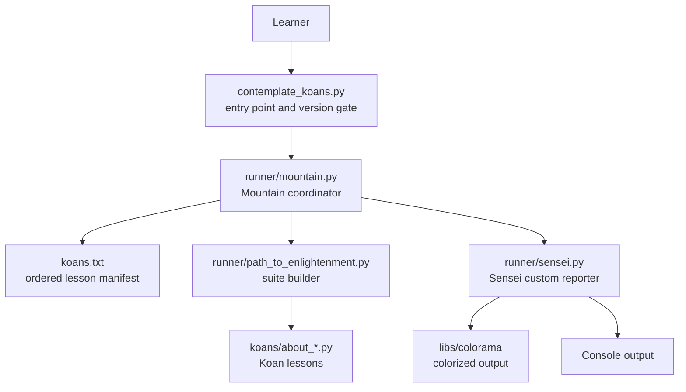
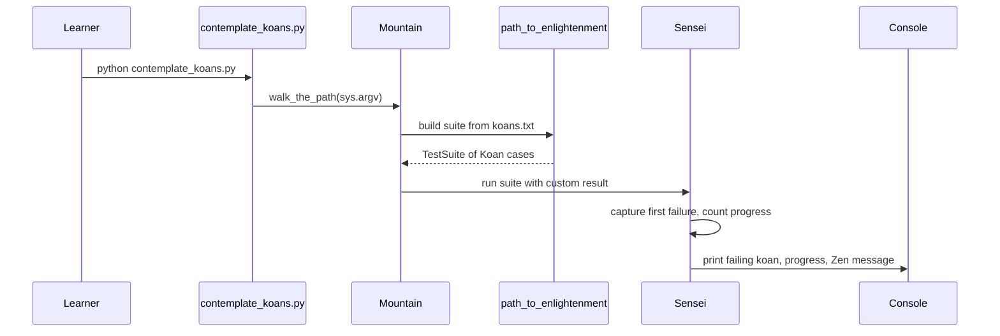

# Python Koans

[](http://travis-ci.org/gregmalcolm/python_koans)
[](https://gitpod.io/#https://github.com/gregmalcolm/python_koans)

> An interactive, test-driven tutorial for learning the Python programming
> language by making failing tests pass — one koan at a time. Python Koans is a
> port of Edgecase's [Ruby Koans](http://rubykoans.com/).

Python Koans walks you along **the path to enlightenment**: a long, ordered
series of small failing unit tests (the *koans*, grouped into *lessons*). You
make each one pass — usually by **filling in the blank** — and the custom
*Sensei* reporter guides you to the next unsolved koan, tracks your progress,
and offers a little Zen along the way.

---

## Table of Contents

- [1. Project Overview](#1-project-overview)
- [2. Setup & Installation](#2-setup--installation)
- [3. Build & Run](#3-build--run)
- [4. API Documentation](#4-api-documentation)
- [Architecture & Diagrams](#architecture--diagrams)
- [5. Deployment](#5-deployment)
- [6. Usage Examples](#6-usage-examples)
- [7. Project Structure](#7-project-structure)
- [Documentation Drift](#documentation-drift)
- [License](#license)
- [Acknowledgments](#acknowledgments)
- [Related Documentation](#related-documentation)

---

## 1. Project Overview

Python Koans is an **interactive tutorial for learning the Python programming
language by making tests pass**. It is a port of Edgecase's *"Ruby Koans"*,
which can be found at <http://rubykoans.com/>. As well as being a great way to
learn some Python, it is also a good way to get a taste of **Test-Driven
Development (TDD)**.

### The "fill in the blank" model

Most koans are *fixed* by filling in the missing part of an assertion. For
example:

```python
self.assertEqual(__, 1 + 2)
```

is fixed by replacing the `__` blank with the appropriate value:

```python
self.assertEqual(3, 1 + 2)
```

The blanks are intentional, learner-facing sentinels defined once in
`runner/koan.py` and reused throughout every lesson:

| Sentinel | Meaning | Source |
|----------|---------|--------|
| `__` | `"-=> FILL ME IN! <=-"` — replace with the expected value | `runner/koan.py:L37` |
| `___` | An `Exception` subclass — used where a lesson needs a placeholder error type | `runner/koan.py:L39` |
| `____` | `"-=> TRUE OR FALSE? <=-"` — replace with `True` or `False` | `runner/koan.py:L43` |
| `_____` | `0` — a numeric placeholder | `runner/koan.py:L45` |

Starting a name with an underscore normally implies *private* scope in Python;
the koans make a deliberate exception for these blanks so they read naturally
inside an assertion. (Source: `runner/koan.py:L35`.)

### Not every koan is a blank

Occasionally you will encounter failing koans that are *already filled out*. In
those cases you need to finish implementing some code to progress — for example,
there is an exercise for writing code that decides whether a triangle is
equilateral, isosceles, or scalene (the *triangle project*). These koans are
where the tutorial doubles as a gentle introduction to TDD: read the test, make
it pass, then reflect.

Every lesson is a subclass of `Koan`, the project's own `unittest.TestCase`
base class (Source: `runner/koan.py:L48`), so a koan is simply a `unittest`
test method with an instructional intent.

---

## 2. Setup & Installation

### Requirements

- **Python 3.** The project is developed and CI-tested against **Python 3.9**
  (Source: `.travis.yml:L4`). You should be able to work with newer Python
  versions too; older ones will likely give you problems.
- The command-line entry point enforces this at startup:
  - It **refuses to run under Python 2**, printing guidance to re-invoke with
    `python3` (Source: `contemplate_koans.py:L40`).
  - It **prints a compatibility warning below Python 3.7** but still attempts
    the run (Source: `contemplate_koans.py:L46`).

### Download Python Koans

Python Koans is available on GitHub:

- <https://github.com/gregmalcolm/python_koans>

You can clone it with Git or download the source as a zip/gz/bz2:

```sh
git clone https://github.com/gregmalcolm/python_koans.git
cd python_koans
```

### Install the Python interpreter

Aside from downloading Python Koans, you need a Python 3 interpreter. Download
it from:

- <https://www.python.org/downloads/>

After installing Python, make sure the folder containing the Python executable
is on your **system `PATH`** — you need to be able to run Python from a command
console. It will be `python3` on \*nix, or `python.exe` on Windows.

**Windows note:** the helper batch file `run.bat` lets you point at your
interpreter folder by editing the line that sets the Python path
(Source: `run.bat:L8`). See the [Documentation Drift](#documentation-drift)
note for the exact value to use.

---

## 3. Build & Run

**There is no build step.** Python Koans runs directly from source — there is
nothing to compile or package.

### Run the full path

From a \*nix terminal or a Windows command prompt, run any of the following:

```sh
python contemplate_koans.py
```

```sh
python3 contemplate_koans.py
```

On \*nix you can also use the provided POSIX helper script, which invokes
`python3 -B contemplate_koans.py` (the `-B` flag disables `.pyc` bytecode
writing — Source: `run.sh:L3`):

```sh
./run.sh
```

### What you will see on the first run

The runner walks the path until it reaches the **first failing koan**, then
stops and reports it: the name of the koan that "damaged your karma," the
`AssertionError`, the exact file and line to look at, and a **progress line**
telling you how many koans and lessons remain. For example, on a fresh checkout:

```text
Thinking AboutAsserts
  test_assert_truth has damaged your karma.

You have not yet reached enlightenment ...
  AssertionError: False is not true

Please meditate on the following code:
  File "koans/about_asserts.py", line 44, in test_assert_truth
    self.assertTrue(False) # This should be True

You have completed 0 (0 %) koans and 0 (out of 37) lessons.
You are now 304 koans and 37 lessons away from reaching enlightenment.

Beautiful is better than ugly.
```

**Exit status.** While any koan still fails, the process exits **non-zero
(255)** — the `Sensei` reporter calls `sys.exit(-1)`, which the shell surfaces
as `255` (Source: `runner/sensei.py:L226`). Once the whole path is solved, the
process exits **0**. This makes the koans usable as a pass/fail gate in CI.

### Optional: continuous auto-run with Sniffer

*Sniffer* re-runs the koans automatically whenever you modify a watched file,
giving you a fast red/green feedback loop. To set it up, install `sniffer`
plus the filesystem-event backend for your operating system:

```sh
python3 -m pip install sniffer
```

```sh
# Linux
python3 -m pip install pyinotify

# Windows
python3 -m pip install pywin32

# macOS
python3 -m pip install MacFSEvents
```

Then run it from the project root:

```sh
sniffer
```

Modify one of the koan files and you'll see the tests trigger automatically.
Sniffer is controlled by `scent.py`, which watches the directories
`['.', 'koans/']` (Source: `scent.py:L24`).

---

## 4. API Documentation

Beyond the lessons themselves, Python Koans ships its own small, reusable
**test-runner engine** in the `runner/` package. This section documents that
engine's public API. The runtime pipeline is:

**entry point → coordinator → suite builder → lessons → custom reporter → console.**

### `contemplate_koans.py` — CLI entry point

The command-line entry point and version gate. After the Python-version checks,
it constructs a `Mountain` and launches the experience with
`Mountain().walk_the_path(sys.argv)`, forwarding the full argument vector
(Source: `contemplate_koans.py:L57-L59`).

### `runner.mountain.Mountain` — the coordinator

`Mountain` is the thin layer that wires a run together (Source:
`runner/mountain.py:L24`).

| Member | Purpose | Source |
|--------|---------|--------|
| `__init__(self)` | Wraps `sys.stdout` in a `WritelnDecorator`, builds the default koan suite via `path_to_enlightenment.koans()`, and creates a `Sensei` result bound to that stream | `runner/mountain.py:L35-L48` |
| `walk_the_path(self, args=None)` | Runs the koan suite under the custom `Sensei` reporter and returns it | `runner/mountain.py:L50` |

When `walk_the_path` is given two or more argv entries, it replaces the full
suite with a **single named lesson**, loaded as `koans.<name>` from `args[1]`
(Source: `runner/mountain.py:L53-L54`). Note that only the first argument
(`args[1]`) is used to select the lesson.

### `runner.path_to_enlightenment` — the suite builder

Builds the ordered `unittest.TestSuite` of koans from a plain-text manifest.

| Member | Purpose | Source |
|--------|---------|--------|
| `KOANS_FILENAME` | The manifest filename, `'koans.txt'` | `runner/path_to_enlightenment.py:L14` |
| `koans(filename=KOANS_FILENAME)` | Reads the manifest and returns an ordered `TestSuite` of all listed koans | `runner/path_to_enlightenment.py:L56` |
| `filter_koan_names(lines)` | Strips whitespace and skips blank/`#`-comment lines | `runner/path_to_enlightenment.py:L17` |
| `names_from_file(filename)` | Yields the fully-qualified `TestCase` names from the manifest | `runner/path_to_enlightenment.py:L31` |
| `koans_suite(names)` | Loads the named cases into a `TestSuite`, preserving order | `runner/path_to_enlightenment.py:L42` |

### `runner.sensei.Sensei` — the custom reporter

`Sensei` is the custom `unittest` result/reporter that makes the koans feel
like a guided journey (Source: `runner/sensei.py:L32`). It captures the
**first** failing koan, counts your progress, prints the colorized failing
assertion plus a focused traceback (limited to koan file paths), and closes
with a rotating Zen-style message. When failures remain it exits the process
via `sys.exit(-1)` — surfaced as exit code **255** (Source:
`runner/sensei.py:L226`).

| Member | Purpose | Source |
|--------|---------|--------|
| `total_lessons(self)` | Number of lessons on the path — **37** | `runner/sensei.py:L446` |
| `total_koans(self)` | Total number of koans (test cases) on the path — **304** | `runner/sensei.py:L461` |
| `learn(self)` | Emits the error report, progress line, and Zen message; exits non-zero while koans remain | `runner/sensei.py:L202-L234` |
| `report_progress(self)` | Formats the "You have completed N koans / M lessons" line | `runner/sensei.py:L335-L350` |

For cross-platform colorized output, `Sensei` consumes the vendored Colorama
library via `from libs.colorama import init, Fore, Style` (Source:
`runner/sensei.py:L29`).

### `runner.koan.Koan` — the lesson base class

`Koan` is the `unittest.TestCase` subclass that every `About*` lesson extends
(Source: `runner/koan.py:L48`). The same module also defines the learner-facing
blank sentinels `__`, `___`, `____`, and `_____` described in
[Project Overview](#1-project-overview).

### `koans.txt` — the file-backed lesson registry

The suite is driven by an external manifest, `koans.txt`, read by the suite
builder (Source: `runner/path_to_enlightenment.py:L14`). It lists **39 ordered,
fully-qualified `TestCase` entries**, one per line; lines beginning with `#` are
ignored. The order in the file *is* the order of the path — from
`koans.about_asserts.AboutAsserts` (first) to `koans.about_regex.AboutRegex`
(last). One module contributes two entries: the proxy-object project registers
both `AboutProxyObjectProject` and `TelevisionTest`.

---


## Architecture & Diagrams

The two diagrams below render natively on GitHub (no build step
required). The first shows the **component architecture** — how a run flows
from the learner's command down through the coordinator, the file-backed
manifest, the suite builder, the lessons, and the reporter, out to the console.



The second diagram is a **sequence diagram** of a single koan-run lifecycle:
the learner invokes the entry point, `Mountain` builds the suite from
`koans.txt` via `path_to_enlightenment`, the suite runs under the `Sensei`
result, and `Sensei` prints the first failing koan, the progress line, and a
Zen message to the console.



---

## 5. Deployment

Python Koans is a **locally executed command-line learning tool** — there is no
server, service, or hosted deployment to stand up. You "deploy" it simply by
checking it out and running it (see [Build & Run](#3-build--run)). Two hosted
conveniences exist for running it without a local install:

### Gitpod (one-click)

Opening the repository in Gitpod builds a workspace from `.gitpod.Dockerfile`
(based on `gitpod/workspace-full:latest`, which additionally installs
`pytest==4.4.2 pytest-testdox mock`) and automatically runs
`python contemplate_koans.py` as its start task (Source: `.gitpod.yml:L5`). Use
the Gitpod badge at the top of this README to launch it.

### Travis CI

Continuous integration is configured for **Python 3.9** and runs the runner
test harness `python _runner_tests.py` on each push, with email notifications
(Source: `.travis.yml:L1-L17`). The Travis config also contains commented-out
`contemplate_koans.py` invocations you can enable in a fork to have CI report
which koans you've passed.

---


## 6. Usage Examples

### (a) Run the full path

```sh
python contemplate_koans.py
```

The runner stops at the first unsolved koan and prints a progress line. On a
fresh checkout it reports the very first koan, `AboutAsserts.test_assert_truth`,
and exits **255**:

```text
Thinking AboutAsserts
  test_assert_truth has damaged your karma.

You have not yet reached enlightenment ...
  AssertionError: False is not true

You have completed 0 (0 %) koans and 0 (out of 37) lessons.
You are now 304 koans and 37 lessons away from reaching enlightenment.
```

### (b) Run a single koan by name

You can focus on one lesson at a time by passing its short name (the runner
loads it as `koans.<name>`):

```sh
python contemplate_koans.py about_asserts
```

The single-topic and single-test forms documented in `Contributor Notes.txt`
are handy when adding or modifying koans:

```sh
# Run a whole test case:
python3 contemplate_koans.py about_strings

# Run a single test method:
python3 contemplate_koans.py about_strings.AboutStrings.test_triple_quoted_strings_need_less_escaping
```

The current `Mountain.walk_the_path` implementation selects the lesson named in
the **first** argument only (`args[1]`) — Source: `runner/mountain.py:L53-L54`.

### (c) The red / green edit loop

Working through a koan is a tight Test-Driven Development cycle:

1. **Red** — run the koan and watch it fail. The reporter tells you the exact
   file and line, e.g. `koans/about_asserts.py`, line 44.
2. **Green** — open that `koans/about_*.py` file, replace the `__` blank (or
   fix the assertion / implement the missing code), and save.
3. **Refactor** — re-run to see it pass, then reflect on what the koan is
   teaching before moving on.

Quoting the Ruby Koans instructions carried forward from `README.rst`:

> "In test-driven development the mantra has always been, red, green, refactor.
> ... run the koan and see it fail (red), make the test pass (green), then take
> a moment and reflect upon the test to see what it is teaching you and improve
> the code to better communicate its intent (refactor)."

Save the file and re-run `python contemplate_koans.py`; the runner advances to
the next unsolved koan. Repeat until the whole path is solved and the process
exits **0**.

### (d) Validate the runner engine (for contributors)

If you are hacking on the `runner/` engine itself, run its test harness:

```sh
python _runner_tests.py
```

A healthy runner reports all tests passing and exits **0**:

```text
----------------------------------------------------------------------
Ran 36 tests in 0.173s

OK
```

---

## 7. Project Structure

The first-party learning material lives at the top level and in the `runner/`
and `koans/` packages. Vendored third-party code and the nested git submodule
are **not** part of the learning material.

```text
python_koans/
├── contemplate_koans.py         # CLI entry point + Python version gate
├── run.sh                       # POSIX launcher: python3 -B contemplate_koans.py
├── run.bat                      # Windows launcher (loops "Test again? y or n")
├── scent.py                     # Sniffer auto-run configuration
├── _runner_tests.py             # Test harness for the runner engine
├── koans.txt                    # Ordered lesson manifest (39 TestCase entries)
├── README.rst                   # Original narrative docs (preserved)
├── README.md                    # This file
├── MIT-LICENSE                  # MIT license text
├── Contributor Notes.txt        # Single-koan / single-test invocations
├── example_file.txt             # Tiny fixture used by a koan
├── runner/                      # The reusable test-runner engine
│   ├── mountain.py              #   Mountain — run coordinator
│   ├── path_to_enlightenment.py #   Suite builder (reads koans.txt)
│   ├── sensei.py                #   Sensei — custom unittest reporter
│   ├── koan.py                  #   Koan base class + blank sentinels
│   ├── helper.py                #   Small helpers (e.g. cls_name)
│   ├── mockable_test_result.py  #   Test-seam base for Sensei
│   ├── writeln_decorator.py     #   stdout stream decorator
│   └── runner_tests/            #   Unit tests for the engine
├── koans/                       # The curriculum
│   ├── about_*.py               #   38 lesson modules (About* Koan subclasses)
│   ├── triangle.py              #   Learner-implemented triangle() + TriangleError
│   ├── local_module.py          #   Supporting fixtures for the module koans
│   ├── local_module_with_all_defined.py
│   ├── another_local_module.py
│   ├── jims.py                  #   Fixtures for the multiple-inheritance koans
│   ├── joes.py
│   ├── a_package_folder/        #   Fixture subpackage (Duck) for the package koans
│   └── GREEDS_RULES.txt         #   Scoring rules for the dice/greed project
├── libs/                        # Vendored third-party code (NOT first-party)
│   ├── colorama/                #   Colorama 0.2.7 — colorized terminal output
│   └── mock.py                  #   mock 0.6.0 — test doubles for the runner tests
└── Submodule_01_Do_not_use_15Jun/   # Out-of-scope git submodule ("Do_not_use")
```

Key files and directories at a glance:

| Path | Purpose |
|------|---------|
| `contemplate_koans.py` | Command-line entry point; version gate; launches `Mountain` |
| `koans/about_*.py` | The 38 lessons you solve; each is an `About*` subclass of `Koan` |
| `koans.txt` | Ordered manifest that defines the path (39 `TestCase` entries) |
| `runner/` | The reusable test-runner engine (coordinator, suite builder, reporter) |
| `run.sh` / `run.bat` | Convenience launchers for \*nix / Windows |
| `scent.py` | Optional Sniffer auto-run configuration |
| `_runner_tests.py` | Unit-test harness for the `runner/` engine |
| `libs/` | **Vendored** third-party code (Colorama 0.2.7, mock 0.6.0) — not modified |
| `Submodule_01_Do_not_use_15Jun/` | **Out-of-scope** nested git submodule; not part of the koans |

> **Scope note.** `libs/` is vendored third-party code with its own upstream
> licensing, and `Submodule_01_Do_not_use_15Jun/` is a separate repository
> explicitly named *"Do_not_use"*. Neither is part of the first-party Python
> Koans learning material.

---


## Documentation Drift

One known inconsistency exists between the launcher and the original docs
regarding the Windows Python path:

- `run.bat` sets `SET PYTHON_PATH=C:\Python311` (Source: `run.bat:L8`).
- `README.rst` (§Installing) shows `SET PYTHON_PATH=C:\Python39`
  (Source: `README.rst:L91`).

Neither literal is authoritative — **set `PYTHON_PATH` to match the version of
Python you actually installed** (for example, `C:\Python312`). The digits after
`C:\Python` simply encode the interpreter's version.

---

## License

Python Koans is released under the **MIT License** — Copyright 2021 Greg Malcolm
and The Status Is Not Quo (Source: `MIT-LICENSE:L1`). See
[`MIT-LICENSE`](MIT-LICENSE) for the full text.

---

## Acknowledgments

Thanks go to **Jim Weirich** and **Joe O'Brien** for the original Ruby Koans
that Python Koans is based on. The Ruby Koans in turn borrows from *Metakoans*,
so thanks also go to **Ara Howard** for that.

Thanks, too, to everyone who has contributed to Python Koans — the project got
a great head start from a code base initiated by the combined Mikes of FPIP. A
big thank-you as well to **Mike Pirnat** (@pirnat) and **Kevin Chase** (@kjc),
who have pitched in as co-maintainers at various times.

---

## Related Documentation

This README consolidates and expands the project's original documentation. For
historical or extended context, see the preserved companion files:

- [`README.rst`](README.rst) — the original reStructuredText narrative,
  screencasts, and translation links.
- [`Contributor Notes.txt`](Contributor%20Notes.txt) — single-koan and
  single-test invocations for contributors.
- [`koans/GREEDS_RULES.txt`](koans/GREEDS_RULES.txt) — the scoring rules used by
  the dice/greed scoring project.
- [`MIT-LICENSE`](MIT-LICENSE) — the full license text.
