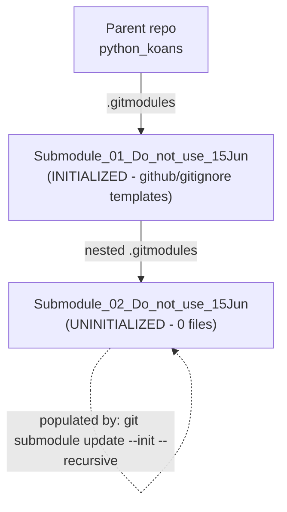
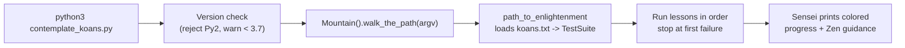

# Python Koans

> An interactive, test-driven tutorial for learning Python by making failing `unittest` tests pass.

Python Koans walks you along a "path to enlightenment" made up of small, focused
lessons (*koans*). Each koan is a failing test that you make pass — usually by
filling in a blank — until the whole suite turns green.

## Overview

Python Koans is an interactive tutorial that teaches the Python language by making
tests pass. Most tests are *fixed* by filling in the missing part of an assertion —
for example, `self.assertEqual(__, 1 + 2)` is solved by replacing the blank to get
`self.assertEqual(3, 1 + 2)`. A few koans go further and ask you to implement a small
piece of code (such as the triangle project) before they will pass. Working through
the koans is also a gentle introduction to Test-Driven Development (TDD). It is a port
of Edgecase's "Ruby Koans". *Source: README.rst, runner/koan.py.*

## Prerequisites

- **Python 3.7+** — the entry point refuses to run under Python 2 and prints a warning
  below Python 3.7; continuous integration validates on Python 3.9.
  *Source: contemplate_koans.py, .travis.yml.*
- **Git** — required to clone the repository and to initialize/update its nested
  submodules. *Source: .gitmodules.*
- **No PyPI package and no dependency manifest** — there is no `setup.py`,
  `pyproject.toml`, or `requirements.txt`. You obtain the project with `git clone` and
  run it in place; there is nothing to `pip install`. *Source: repository root.*

## Repository Structure

```
python_koans/
├── contemplate_koans.py      # Entry point: version check -> Mountain().walk_the_path
├── koans.txt                 # Ordered curriculum manifest (~40 lessons; 39 entries)
├── run.sh / run.bat          # POSIX / Windows launchers
├── scent.py                  # Sniffer continuous-testing config
├── runner/                   # Test engine + colored reporter (Sensei)
├── koans/                    # about_*.py lessons (38 files) + practice projects
├── libs/                     # Vendored colorama 0.2.7 + mock 0.6.0 (modified)
├── README.rst                # Original reStructuredText documentation
├── Submodule_01_Do_not_use_15Jun/        # Submodule: GitHub .gitignore templates
│   └── Submodule_02_Do_not_use_15Jun/    # Nested submodule (init recursively)
└── MIT-LICENSE
```

The project is organized around three top-level Python packages — `runner/` (the test
engine and colored reporter), `koans/` (the lessons and practice projects), and `libs/`
(vendored third-party code) — plus a thin `contemplate_koans.py` entry script. It also
carries a **two-level nested submodule chain**: `Submodule_01_Do_not_use_15Jun` contains
a further nested `Submodule_02_Do_not_use_15Jun`.
*Source: .gitmodules, Submodule_01_Do_not_use_15Jun/.gitmodules.*



## Setup / Installation

Clone the repository **recursively** so that the submodules at every nesting level are
fetched in one step:

```bash
git clone --recurse-submodules <parent-repo-url>
cd python_koans   # the cloned directory
```

There is **no build or install step** — once cloned, run the koans in place. There is
no PyPI package and no dependency manifest to install from.
*Source: repository root (no setup.py / pyproject.toml / requirements.txt).*

> **Windows tip:** if `python.exe` is not on your `PATH`, set the interpreter folder near
> the top of `run.bat` (`SET PYTHON_PATH=C:\Python311`). *Source: run.bat.*

## Working with Submodules

This repository nests submodules **two levels deep**, and the inner submodule
(`Submodule_02_Do_not_use_15Jun`) ships **uninitialized and empty**, so the recursive
commands below are what populate it.
*Source: .gitmodules, Submodule_01_Do_not_use_15Jun/.gitmodules.*

**Fresh recursive clone** — clones the parent and every submodule at all nesting levels
in a single step:

```bash
git clone --recurse-submodules <parent-repo-url>
```

**Initialize / populate after a plain clone** — fills in the empty nested submodule:

```bash
git submodule update --init --recursive
```

This is *the* command that initializes both levels, including the currently-empty
`Submodule_02_Do_not_use_15Jun`. *Source: Submodule_01_Do_not_use_15Jun/.gitmodules.*

**Update submodules to their tracked upstream:**

```bash
git submodule update --remote --recursive
```

At pull time, the equivalent one-liner is `git pull --recurse-submodules`.

**Inspect submodule state at every level:**

```bash
git submodule status --recursive
```

A leading `-` next to a submodule means it is **uninitialized** — which is the initial
state of the nested `Submodule_02_Do_not_use_15Jun` until you run the recursive
`update --init` above. *Source: Submodule_01_Do_not_use_15Jun/.gitmodules.*

**About the submodules:**

- `Submodule_01_Do_not_use_15Jun`
  (`https://github.com/lakshya-blitzy/Submodule_01_Do_not_use_15Jun.git`) is GitHub's
  collection of `.gitignore` templates; it is initialized by default.
  *Source: .gitmodules, Submodule_01_Do_not_use_15Jun/README.md.*
- `Submodule_02_Do_not_use_15Jun`
  (`https://github.com/lakshya-blitzy/Submodule_02_Do_not_use_15Jun.git`) is nested
  **inside** Submodule_01 and starts empty until you initialize it recursively.
  *Source: Submodule_01_Do_not_use_15Jun/.gitmodules.*

## Key Files and Folders

| Path | Purpose |
|------|---------|
| `contemplate_koans.py` | CLI entry point; checks the Python version, then delegates to `runner.mountain.Mountain().walk_the_path(sys.argv)`. *Source: contemplate_koans.py.* |
| `koans.txt` | Ordered curriculum manifest; lines starting with `#` are ignored. Lists 39 koan `TestCase` entries (~40 lessons). *Source: koans.txt.* |
| `runner/` | Test engine + colored reporter ("Sensei"); loads `koans.txt` into an ordered `unittest.TestSuite`. *Source: runner/.* |
| `runner/mountain.py` | Orchestrator — `Mountain.walk_the_path` runs the suite and renders results. *Source: runner/mountain.py.* |
| `runner/path_to_enlightenment.py` | Loads `koans.txt` into an ordered `unittest.TestSuite`. *Source: runner/path_to_enlightenment.py.* |
| `runner/sensei.py` | Colored progress/feedback reporter (uses `colorama`). *Source: runner/sensei.py.* |
| `runner/koan.py` | The `Koan` base class plus the blank sentinels `__`, `___`, `____`, `_____`. *Source: runner/koan.py.* |
| `koans/` | The `about_*.py` lessons (38 files) plus practice projects (triangle, dice, scoring, proxy) and helper modules. *Source: koans/.* |
| `libs/` | Vendored `colorama` 0.2.7 and `mock.py` 0.6.0 (modified by Greg Malcolm). *Source: libs/colorama/__init__.py, libs/mock.py.* |
| `run.sh` | POSIX launcher (`python3 -B contemplate_koans.py`). *Source: run.sh.* |
| `run.bat` | Windows launcher with interpreter discovery (`PYTHON_PATH=C:\Python311`). *Source: run.bat.* |
| `scent.py` | Sniffer continuous-testing config; re-runs the koans when a watched file changes. *Source: scent.py.* |
| `README.rst` | Original reStructuredText docs (Gitpod/Che, Sniffer, translations, acknowledgments). *Source: README.rst.* |
| `Submodule_01_Do_not_use_15Jun/` | Git submodule: GitHub's `.gitignore` templates; contains the nested `Submodule_02_Do_not_use_15Jun/`. *Source: .gitmodules.* |
| `MIT-LICENSE` | Project license (MIT — "Copyright 2021 Greg Malcolm and The Status Is Not Quo"). *Source: MIT-LICENSE.* |

## Usage Examples

**Run all koans** in the full ordered sequence (the suite stops at the first failing
test, which is the koan you should fix next):

```bash
python3 contemplate_koans.py
```

The POSIX launcher `./run.sh` is equivalent (it runs `python3 -B contemplate_koans.py`).
*Source: run.sh, README.rst.*

**Run a single lesson / test case** by passing its koan name:

```bash
python3 contemplate_koans.py about_strings
```

*Source: Contributor Notes.txt.*

**Run a single test method** with the fully-qualified `koan.Class.method` form:

```bash
python3 contemplate_koans.py about_strings.AboutStrings.test_triple_quoted_strings_need_less_escaping
```

*Source: Contributor Notes.txt.*

How a run proceeds:



The typical workflow is: run the koans → read the first failing test and the file/line
it points to → edit that koan in `koans/` to make it pass → re-run. For a hands-free
loop, Sniffer (configured by `scent.py`) re-runs the koans automatically whenever you
save a watched file. *Source: README.rst, scent.py.*

## Further Reading

For material not duplicated here — one-click Gitpod/Che setup, detailed Sniffer
installation, translations, and acknowledgments — see the original
[README.rst](README.rst).
