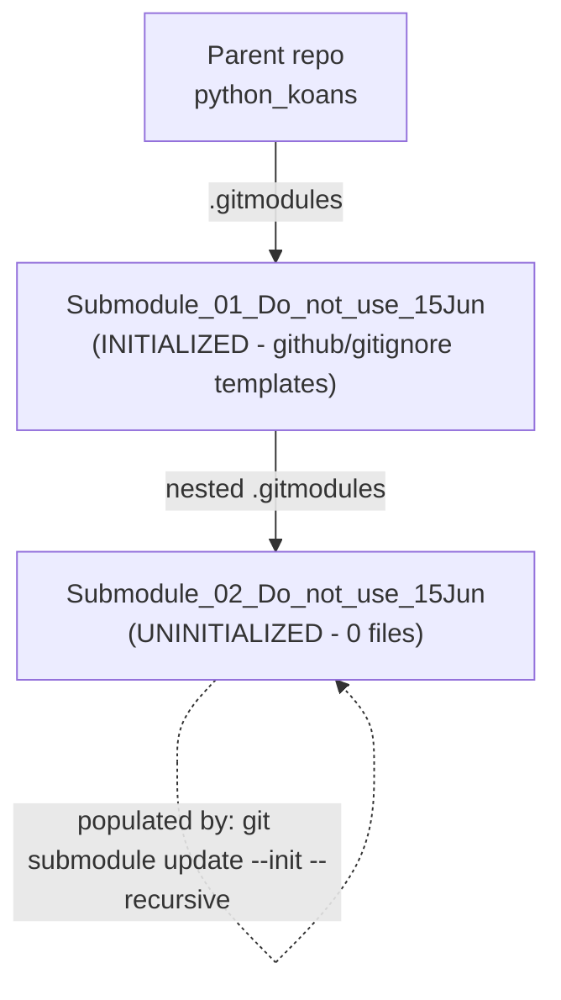
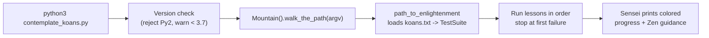

# Technical Specification

# 0. Agent Action Plan

## 0.1 Intent Clarification

### 0.1.1 Core Documentation Objective

Based on the provided requirements, the Blitzy platform understands that the documentation objective is to author a **concise, GitHub-renderable entry-point README and minimal supporting documentation** for the Python Koans parent repository and its **two-level nested Git submodule chain**, so that a newcomer can clone the repository (recursively), satisfy prerequisites, understand the layout, and run the koans — without large-scale documentation generation or code refactoring.

The verbatim user request is preserved below:

> **User Request:** "Create a concise README and documentation for the parent repository and its submodules. Include: Project overview, Repository structure, Setup instructions, Submodule setup/update commands, Brief description of key files and folders, Basic usage examples. Add simple inline code comments where appropriate, but avoid extensive refactoring or large-scale documentation generation."

- **Request categorization:** This is **primarily Create-new-documentation**, combined with a **light Update** of one existing artifact and an explicit **Fix-documentation-gaps** intent. A new top-level `README.md` is created; the existing `README.rst` receives a single minimal cross-reference; and the entirely-missing submodule and repository-structure documentation is the principal gap being filled.
- **Documentation type:** **README files** plus **repository/developer structure documentation**, a **nested-submodule setup/update guide**, and **basic usage examples**, with **sparse inline code comments**.
- **Requirements enumerated with enhanced clarity:**
  - Project overview — a short narrative of what Python Koans is (an interactive, test-driven Python tutorial that teaches by making failing `unittest` tests pass) [README.rst:§title].
  - Repository structure — a directory tree describing the three top-level packages and key files.
  - Setup instructions — prerequisites (Python 3.7+, Git) and how to obtain the project.
  - Submodule setup/update commands — recursive clone and initialization commands spanning **both** nesting levels.
  - Brief description of key files and folders — a reference table for the principal entries.
  - Basic usage examples — running all koans, a targeted koan, and a single test.
  - Simple inline code comments — minimal, "where appropriate," with **no refactoring**.

### 0.1.2 Special Instructions and Constraints

- **CRITICAL — Conciseness:** The word "concise" governs every deliverable. The plan produces a single primary `README.md` rather than a multi-page documentation set.
- **CRITICAL — Bounded scope:** "avoid extensive refactoring or large-scale documentation generation" explicitly forbids introducing a documentation-site generator (MkDocs/Sphinx/Docusaurus), rewriting existing docs wholesale, or restructuring code.
- **Inline comments permitted, narrowly:** "Add simple inline code comments where appropriate" authorizes small clarifying comments (e.g., on the interpreter version-check at the entry point) but **not** logic changes.
- **No user templates or examples were provided** beyond the request text above; therefore no "USER PROVIDED TEMPLATE" block applies. The request statement itself is preserved verbatim in 0.1.1.
- **Style preference (inferred from repository):** the existing documentation tone is friendly and instructional, centered on the command `python3 contemplate_koans.py [optional koan]` [README.rst:§Getting Started]. The new README will match this tone.
- **Web search research:** Best-practices research on README structure and nested Git submodule workflows was attempted; the search tool returned no results, so the plan relies on well-established, stable Git and README conventions (canonical `git clone --recurse-submodules` and `git submodule update --init --recursive` commands), documented explicitly in 0.4 and 0.9.

### 0.1.3 Technical Interpretation

These documentation requirements translate to the following technical documentation strategy: a new `README.md` is created at the parent repository root as the primary entry document, the existing `README.rst` is retained and minimally cross-linked, and a handful of inline comments are added to the entry script. Each requirement maps to a concrete action:

| Requirement | Documentation Action | Primary Source |
|-------------|----------------------|----------------|
| Project overview | Author the "Overview" section of `README.md` | `README.rst` [README.rst:§title] |
| Repository structure | Author a directory tree in `README.md` | `runner/`, `koans/`, `libs/` [runner/][koans/][libs/] |
| Setup instructions | Author "Prerequisites" + "Setup" sections | `contemplate_koans.py` version gate; `.travis.yml` [.travis.yml:python] |
| Submodule setup/update commands | Author "Working with Submodules" section | `.gitmodules`; `Submodule_01_Do_not_use_15Jun/.gitmodules` |
| Key files/folders description | Author a key-files reference table | repository root listing |
| Basic usage examples | Author "Usage Examples" section | `run.sh`; `Contributor Notes.txt` |
| Inline comments | Add sparse comments to `contemplate_koans.py` | `contemplate_koans.py` |

### 0.1.4 Inferred Documentation Needs

- **Recursive submodule lifecycle is mandatory, not optional:** repository inspection confirms a two-level nesting — `Parent → Submodule_01_Do_not_use_15Jun → Submodule_02_Do_not_use_15Jun` [.gitmodules:Submodule_01_Do_not_use_15Jun][Submodule_01_Do_not_use_15Jun/.gitmodules:Submodule_02_Do_not_use_15Jun]. The innermost submodule is **currently uninitialized and empty**, which is precisely why recursive commands must be documented (see 0.2).
- **Prerequisites are implicit:** the entry point rejects Python 2 and warns below Python 3.7 [contemplate_koans.py:L1-L20], and CI validates on Python 3.9 [.travis.yml:python]; Git is required for cloning and submodule operations. These belong in a "Prerequisites" section even though the user did not enumerate them.
- **Installation model needs clarification:** there is no `setup.py`, `pyproject.toml`, or `requirements.txt`; the project is obtained purely by `git clone` and run in place. The README must state this to prevent users searching for a PyPI package.
- **Submodule_01 identity:** Submodule_01 vendors GitHub's official collection of `.gitignore` templates [Submodule_01_Do_not_use_15Jun/README.md:L1-L10]; the README should briefly identify it so its presence is not confusing.


## 0.2 Documentation Discovery and Analysis

### 0.2.1 Existing Documentation Infrastructure Assessment

Repository analysis reveals a **minimal, framework-free documentation footprint** in the parent repository. There is **no documentation-site generator** of any kind — no `mkdocs.yml`, no `docusaurus.config.js`, no Sphinx `conf.py`, and no `.readthedocs.*` — and **no `docs/` or `doc/` directory**. The parent root carries only the following prose artifacts:

- `README.rst` — the sole narrative document, in reStructuredText, with sections for one-click installation (Gitpod/Che badges), downloading, installing, getting started, Sniffer support, the red-green-refactor philosophy, finding more koan projects, translations, and acknowledgments [README.rst:§Getting Started].
- `Contributor Notes.txt` — documents running a single koan and a single test method, e.g. `python3 contemplate_koans.py about_strings` [Contributor Notes.txt:L1-L10].
- `koans.txt` — the ordered curriculum manifest of 40 entries; lines beginning with `#` are ignored [koans.txt:L1-L5].
- `example_file.txt` — a fixture consumed by file-handling koans.
- `MIT-LICENSE` — the project license.

Critically, there are **zero Markdown (`.md`) files anywhere in the parent repository**. The only `.md` files in the working tree (`README.md`, `CONTRIBUTING.md`) reside **inside Submodule_01** and belong to the vendored github/gitignore project [Submodule_01_Do_not_use_15Jun/README.md:L1-L10]. Consequently, creating a new top-level `README.md` is purely additive — it introduces no Markdown collision and becomes GitHub's default rendered entry document (GitHub prefers `README.md` over `README.rst` when both are present).

- **Current documentation framework:** none (plain `.rst` / `.txt` only).
- **API documentation tools in use:** none (no JSDoc/Sphinx autodoc/Godoc configuration).
- **Diagram tools detected:** none; the plan introduces **Mermaid**, which renders natively on GitHub and requires no build dependency.
- **Documentation hosting/deployment:** none configured; documentation is read in-repository on GitHub.

### 0.2.2 Repository Code Analysis for Documentation

The codebase comprises three top-level Python packages plus a thin entry script, all of which feed the new documentation:

- **Entry point** — `contemplate_koans.py` validates the interpreter (rejects Python 2, warns below 3.7) and then delegates to `runner.mountain.Mountain().walk_the_path(sys.argv)` [contemplate_koans.py:L1-L20].
- **`runner/`** — the test engine and reporter: `mountain.py` (orchestrator), `sensei.py` (~10 KB colored reporter), `path_to_enlightenment.py` (loads `koans.txt` into an ordered `unittest.TestSuite`), `koan.py` (the `Koan` base class and blank sentinels `__`, `___`, `____`, `_____`), plus `helper.py`, `mockable_test_result.py`, `writeln_decorator.py`, and the self-test subtree `runner/runner_tests/` [runner/].
- **`koans/`** — 45 Python files: the 40 ordered `about_*.py` lessons referenced by `koans.txt`, the practice projects (`triangle.py`, local modules), `GREEDS_RULES.txt`, and `a_package_folder/` [koans/].
- **`libs/`** — vendored third-party code: `colorama/` (version `0.2.7`) and `mock.py` (version `0.6.0 modified by Greg Malcolm`) [libs/colorama/__init__.py][libs/mock.py].
- **Launchers / tooling** — `run.sh` (`python3 -B contemplate_koans.py`) [run.sh], `run.bat` (Windows interpreter discovery, default `C:\Python311`) [run.bat], `scent.py` (Sniffer continuous-testing config) [scent.py], `_runner_tests.py` (the suite Travis runs) [_runner_tests.py].
- **Submodules** — `Submodule_01_Do_not_use_15Jun` (github/gitignore template collection, **initialized**) and the nested `Submodule_02_Do_not_use_15Jun` (**uninitialized/empty**) [.gitmodules:Submodule_01_Do_not_use_15Jun][Submodule_01_Do_not_use_15Jun/.gitmodules:Submodule_02_Do_not_use_15Jun].

**Documentation gap analysis** (against the six mandated areas):

- **Repository structure — MISSING entirely.** No structure tree exists in any document; `README.rst` does not describe the `runner/` / `koans/` / `libs/` layout.
- **Submodule setup/update commands — MISSING entirely.** `README.rst` contains zero submodule content; this is the highest-value gap and is amplified by the empty nested submodule (see below).
- **Key files/folders description — MISSING.** No reference table mapping files to purposes exists.
- **Project overview — PARTIAL.** `README.rst` carries an intro that will be condensed into `README.md`.
- **Setup instructions — PARTIAL.** `README.rst` covers installing/downloading but omits the Git prerequisite and recursive clone.
- **Basic usage examples — PARTIAL.** Present across `README.rst` (Getting Started) and `Contributor Notes.txt`; to be consolidated into `README.md`.

The decisive finding is submodule state. `git submodule status --recursive` reports Submodule_01 as initialized (leading space, commit `1b46d97…`, branch `heads/1506_01`) but the nested Submodule_02 with a **leading `-`** (commit `5f4cf54…`), the canonical marker for an **uninitialized** submodule, and the directory contains zero files [.gitmodules:Submodule_01_Do_not_use_15Jun][Submodule_01_Do_not_use_15Jun/.gitmodules:Submodule_02_Do_not_use_15Jun].



### 0.2.3 Web Search Research Conducted

Targeted web searches were performed for README structure conventions and nested Git submodule clone/update workflows. The search tool returned **no results in this session**. The plan therefore relies on **well-established, stable Git documentation conventions** that are not subject to version churn:

- Fresh recursive clone: `git clone --recurse-submodules <parent-url>`.
- Populate/initialize all nested submodules after a plain clone: `git submodule update --init --recursive` (this is the command that fills the empty Submodule_02).
- Update submodules to their tracked upstream: `git submodule update --remote --recursive` (or `git pull --recurse-submodules`).
- Inspect submodule state at every level: `git submodule status --recursive`.

These commands are documented authoritatively in `README.md` (see 0.4 and 0.9). No best-practice claim in this plan depends on unretrieved search content.


## 0.3 Documentation Scope Analysis

### 0.3.1 Code-to-Documentation Mapping

The table below maps each repository area to the documentation it requires and its current coverage. All documentation targets resolve to **one new file (`README.md`)** plus a minimal cross-link and inline comments — consistent with the "concise" constraint.

| Repository Area | Source | Current Documentation | Documentation Needed (in `README.md`) |
|-----------------|--------|-----------------------|----------------------------------------|
| Entry point | `contemplate_koans.py` [contemplate_koans.py:L1-L20] | Mentioned in `README.rst` Getting Started | Setup + usage examples; sparse inline comments in the file |
| Test engine / reporter | `runner/` [runner/] | None | One-line role in structure tree + key-files table |
| Lessons & projects | `koans/` [koans/] | None | One-line role in structure tree + key-files table |
| Vendored libraries | `libs/` [libs/colorama/__init__.py][libs/mock.py] | None | One-line role in structure tree (colorama 0.2.7, mock 0.6.0) |
| Curriculum manifest | `koans.txt` [koans.txt:L1-L5] | Implicit | Key-files table entry (ordered lesson list) |
| Launchers | `run.sh` [run.sh], `run.bat` [run.bat] | Partial in `README.rst` | Usage examples + key-files table |
| Continuous testing | `scent.py` [scent.py] | `README.rst` Sniffer section | Pointer to `README.rst`; key-files table entry |
| Submodule level 1 | `.gitmodules` [.gitmodules:Submodule_01_Do_not_use_15Jun] | None | "Working with Submodules" section + topology diagram |
| Submodule level 2 (nested, empty) | `Submodule_01_Do_not_use_15Jun/.gitmodules` [Submodule_01_Do_not_use_15Jun/.gitmodules:Submodule_02_Do_not_use_15Jun] | None | Recursive init/update commands (primary driver) |

**Configuration options requiring documentation:** the project exposes no application configuration files; runtime behavior is driven by `koans.txt` ordering and command-line koan selection only. No configuration table is required beyond the key-files entry for `koans.txt`.

**Features requiring guides:** the single user-facing workflow — clone → initialize submodules → run koans — is covered by the Setup, Submodules, and Usage sections of `README.md`. No separate multi-page guide is warranted under the conciseness constraint.

### 0.3.2 Documentation Gap Analysis

Given the requirements and repository analysis, documentation gaps are summarized below (full evidence in 0.2.2):

- **Entirely missing (net-new, highest value):**
  - Repository structure tree — no layout documentation exists anywhere.
  - Submodule setup/update commands — `README.rst` has zero submodule content, while the nested Submodule_02 is uninitialized and empty, making recursive instructions essential [Submodule_01_Do_not_use_15Jun/.gitmodules:Submodule_02_Do_not_use_15Jun].
  - Key files/folders reference table.
- **Partial (consolidation of existing material):**
  - Project overview — condense from `README.rst` [README.rst:§title].
  - Setup instructions — extend `README.rst` install/download content with the Git prerequisite and recursive clone.
  - Usage examples — consolidate from `README.rst` Getting Started [README.rst:§Getting Started] and `Contributor Notes.txt` [Contributor Notes.txt:L1-L10].
- **Code comments:** the interpreter version-check and the `Mountain().walk_the_path` invocation in `contemplate_koans.py` are sparsely commented; a few clarifying inline comments are appropriate [contemplate_koans.py:L1-L20].
- **Outdated documentation:** none identified — `README.rst` remains accurate for what it covers; it is simply incomplete with respect to structure and submodules.


## 0.4 Documentation Implementation Design

### 0.4.1 Documentation Structure Planning

Rather than introducing a `docs/` hierarchy (which would violate "avoid large-scale documentation generation"), the design centers on a **single concise `README.md`** at the parent root with the following section outline:

```
README.md
├── Title + one-line description (Python Koans)
├── Overview                  (what it is; TDD fill-in-the-blank tutorial)
├── Prerequisites             (Python 3.7+, Git)
├── Repository Structure      (directory tree + brief notes)
├── Setup / Installation      (recursive clone; run in place; no PyPI)
├── Working with Submodules   (init / update / status / remote -- primary value)
├── Key Files and Folders     (reference table)
├── Usage Examples            (run all / targeted koan / single test)
└── Further Reading           (pointer to README.rst: Gitpod, Sniffer, translations)
```

The **Repository Structure** section will embed the following tree (to be rendered inside `README.md`):

```
python_koans/
├── contemplate_koans.py      # Entry point: version check -> Mountain().walk_the_path
├── koans.txt                 # Ordered curriculum manifest (40 lessons)
├── run.sh / run.bat          # POSIX / Windows launchers
├── scent.py                  # Sniffer continuous-testing config
├── runner/                   # Test engine + colored reporter (Sensei)
├── koans/                    # 40+ about_*.py lessons + practice projects
├── libs/                     # Vendored colorama 0.2.7 + mock 0.6.0
├── README.rst                # Original reStructuredText documentation
├── Submodule_01_Do_not_use_15Jun/   # Submodule: github/gitignore templates
│   └── Submodule_02_Do_not_use_15Jun/   # Nested submodule (init recursively)
└── MIT-LICENSE
```

### 0.4.2 Content Generation Strategy

- **Information extraction approach:**
  - Extract the overview and tone from `README.rst` [README.rst:§title], condensing rather than copying.
  - Extract run commands from `run.sh` [run.sh] and `README.rst` Getting Started [README.rst:§Getting Started], and targeted/single-test forms from `Contributor Notes.txt` [Contributor Notes.txt:L1-L10].
  - Extract the submodule names, paths, and URLs from `.gitmodules` [.gitmodules:Submodule_01_Do_not_use_15Jun] and the nested `.gitmodules` [Submodule_01_Do_not_use_15Jun/.gitmodules:Submodule_02_Do_not_use_15Jun].
  - Derive prerequisites from the version gate in `contemplate_koans.py` [contemplate_koans.py:L1-L20] and the CI Python version [.travis.yml:python].
- **Template application:** no user template was supplied; the README follows the conventional, widely-recognized order (overview → prerequisites → setup → usage) and matches the instructional tone already present in `README.rst`.
- **Documentation standards applied:**
  - Markdown with proper header levels (`#`, `##`, `###`).
  - Mermaid diagrams in fenced `mermaid` code blocks (GitHub-native rendering).
  - Shell command examples in fenced code blocks with explicit language hints.
  - Tables for the key-files reference and any parameter listings.
  - Source citations for technical claims, e.g. `Source: contemplate_koans.py`.
  - Consistent terminology ("koan," "lesson," "submodule") aligned with existing docs.
- **README.rst handling:** a single short "Repository structure & submodules: see README.md" pointer line is added; the file is **not** rewritten, preserving its Gitpod/Che, Sniffer, translations, and acknowledgments content.

### 0.4.3 Diagram and Visual Strategy

Two Mermaid diagrams are planned for `README.md`. The nested-submodule topology (shown in 0.2.2) is the primary visual because it directly explains the recursive-initialization requirement. A second, optional **execution-flow** diagram clarifies how a koan run proceeds:



- **Class/ER diagrams:** not warranted — the conciseness constraint and the simple package layout make additional structural diagrams unnecessary.
- **Screenshots/images:** none required; the project is a terminal application and the existing `README.rst` already references Gitpod/Che badges.


## 0.5 Documentation File Transformation Mapping

### 0.5.1 File-by-File Documentation Plan

The table below enumerates **every** file touched by this documentation effort, with the target listed first. Transformation modes: **CREATE** (new file), **UPDATE** (modify existing), **DELETE** (remove obsolete), **REFERENCE** (read-only source/style input — not modified). Nothing is left "pending."

| Target Documentation File | Transformation | Source Code/Docs | Content/Changes |
|---------------------------|----------------|------------------|-----------------|
| `README.md` | CREATE | `README.rst`, `.gitmodules`, `Submodule_01_Do_not_use_15Jun/.gitmodules`, `runner/`, `koans/`, `libs/`, `contemplate_koans.py`, `run.sh`, `Contributor Notes.txt`, `koans.txt` | New concise primary entry doc: overview, prerequisites, repository-structure tree, recursive-clone setup, submodule init/update commands, key-files table, usage examples, Mermaid topology + flow diagrams, pointer to `README.rst` |
| `README.rst` | UPDATE | `README.rst` | Minimal: add one short pointer line — "Repository structure & submodules: see README.md." No rewrite of existing sections [README.rst:§Getting Started] |
| `contemplate_koans.py` | UPDATE | `contemplate_koans.py` | Add a few simple inline comments on the interpreter version-check and the `Mountain().walk_the_path` invocation; **no logic change** [contemplate_koans.py:L1-L20] |
| `Submodule_01_Do_not_use_15Jun/README.md` | REFERENCE | self | Read-only — identifies Submodule_01 as the github/gitignore template collection; cited to describe it in `README.md`; **not edited** [Submodule_01_Do_not_use_15Jun/README.md:L1-L10] |
| `Submodule_01_Do_not_use_15Jun/.gitmodules` | REFERENCE | self | Read-only — source of the nested Submodule_02 path/URL [Submodule_01_Do_not_use_15Jun/.gitmodules:Submodule_02_Do_not_use_15Jun] |
| `Submodule_02_Do_not_use_15Jun/` (directory) | REFERENCE | nested `.gitmodules` | Read-only — currently empty/uninitialized; described in `README.md` with init commands; **no files authored inside it** |
| `Contributor Notes.txt` | REFERENCE | self | Read-only — source for targeted-koan and single-test usage examples [Contributor Notes.txt:L1-L10] |
| `koans.txt` | REFERENCE | self | Read-only — source for the curriculum-ordering description [koans.txt:L1-L5] |
| `.gitmodules` | REFERENCE | self | Read-only — source of Submodule_01 path/URL [.gitmodules:Submodule_01_Do_not_use_15Jun] |

No documentation files are **DELETED** — there are no obsolete or superseded documentation artifacts in the parent repository.

### 0.5.2 New Documentation Files Detail

```
File: README.md
Type: Primary repository README (Markdown)
Source Code/Docs: README.rst; .gitmodules; Submodule_01_Do_not_use_15Jun/.gitmodules;
                  contemplate_koans.py; run.sh; Contributor Notes.txt; koans.txt; runner/; koans/; libs/
Sections:
    - Title + one-line description
    - Overview (TDD fill-in-the-blank tutorial)
    - Prerequisites (Python 3.7+, Git)
    - Repository Structure (directory tree)
    - Setup / Installation (git clone --recurse-submodules; run in place; no PyPI)
    - Working with Submodules (clone --recurse-submodules; submodule update --init --recursive;
                              submodule update --remote --recursive; submodule status --recursive)
    - Key Files and Folders (reference table)
    - Usage Examples (run all; targeted about_strings; single test method)
    - Further Reading (pointer to README.rst)
Diagrams:
    - Nested submodule topology (Parent -> Submodule_01 -> Submodule_02, init-state annotated)
    - Execution flow (contemplate_koans.py -> Mountain -> path_to_enlightenment -> Sensei)
Key Citations: contemplate_koans.py; .gitmodules; Submodule_01_Do_not_use_15Jun/.gitmodules;
               run.sh; Contributor Notes.txt; koans.txt
```

### 0.5.3 Documentation Files to Update Detail

- **`README.rst`** — add a single pointer line directing readers to `README.md` for repository structure and submodule setup. No existing section (Downloading, Installing, Getting Started, Sniffer Support, Translations, Acknowledgments) is altered, preserving the document in full [README.rst:§Getting Started].
- **`contemplate_koans.py`** — add brief inline comments clarifying (a) why Python 2 is rejected and 3.7 is the warning threshold, and (b) that control is handed to the runner via `Mountain().walk_the_path(sys.argv)`. These are comment-only edits with no behavioral impact [contemplate_koans.py:L1-L20].

### 0.5.4 Documentation Configuration Updates

**None.** There is no documentation generator configuration to update — no `mkdocs.yml`, `docusaurus.config.js`, Sphinx `conf.py`, `.readthedocs.*`, or documentation build scripts exist, and none are introduced (consistent with "avoid large-scale documentation generation"). Mermaid renders natively on GitHub, requiring no build configuration.

### 0.5.5 Cross-Documentation Dependencies

- **Navigation links:** `README.md` links forward to `README.rst` ("Further Reading"); `README.rst` gains one backward pointer to `README.md`. This is the only inter-document link introduced.
- **Shared content/includes:** none — there are no documentation partials or includes.
- **Table of contents / index / glossary:** none required; the single concise `README.md` uses in-page section headers only.


## 0.6 Dependency Inventory

### 0.6.1 Documentation Dependencies

**No new documentation dependencies are added, updated, or removed by this effort.** The plan deliberately avoids introducing a documentation generator or diagram toolchain — Mermaid diagrams render natively on GitHub, and Markdown requires no build step. There is no `requirements.txt`, `setup.py`, or `pyproject.toml` in the parent repository, so there is no manifest to modify [README.rst:§Installing].

For accuracy, the table below lists the tools and runtimes the **documented commands rely on** (all pre-existing; none installed by this task):

| Registry | Package/Tool | Version | Purpose in Documentation |
|----------|--------------|---------|--------------------------|
| python.org | Python | 3.7+ (min); 3.9 (CI) | Runtime for the documented `python3 contemplate_koans.py` commands [contemplate_koans.py:L1-L20][.travis.yml:python] |
| system | Git | any modern (2.x) | Required for the documented clone and submodule commands [.gitmodules:Submodule_01_Do_not_use_15Jun] |
| GitHub-native | Mermaid | rendered by GitHub | Renders the topology and flow diagrams embedded in `README.md` (no install) |
| vendored (in `libs/`) | colorama | 0.2.7 | Mentioned in the structure description; colored reporter output [libs/colorama/__init__.py] |
| vendored (in `libs/`) | mock | 0.6.0 (modified) | Mentioned in the structure description; used by runner self-tests [libs/mock.py] |

The Gitpod workspace image pins `pytest==4.4.2`, `pytest-testdox`, and `mock` for cloud editing [.gitpod.Dockerfile], but these are **not runtime dependencies of the koans** and are **not** introduced or modified by this documentation task.

### 0.6.2 Documentation Reference Updates

Only two link references are introduced, both internal:

- **`README.md` → `README.rst`** — a "Further Reading" link for Gitpod/Che, Sniffer, translations, and acknowledgments content not duplicated in the concise README.
- **`README.rst` → `README.md`** — a single pointer line for repository structure and submodule setup.

No existing links require transformation — `README.rst` contains no broken or stale internal documentation links to remediate, and no documentation files are renamed or moved.


## 0.7 Coverage and Quality Targets

### 0.7.1 Documentation Coverage Metrics

Coverage is measured against the six explicitly mandated content areas; the target is **6/6 (100%)**, each satisfied within the single concise `README.md`:

| Mandated Area | Target | Coverage Vehicle |
|---------------|--------|------------------|
| Project overview | 1/1 | "Overview" section [README.rst:§title] |
| Repository structure | 1/1 | Directory tree (runner/, koans/, libs/, entry, submodules) [runner/][koans/][libs/] |
| Setup instructions | 1/1 | "Prerequisites" + "Setup" (Python 3.7+, Git, clone) [contemplate_koans.py:L1-L20] |
| Submodule setup/update commands | 1/1 | "Working with Submodules" — both nesting levels [Submodule_01_Do_not_use_15Jun/.gitmodules:Submodule_02_Do_not_use_15Jun] |
| Key files/folders description | ≥10 entries | Key-files reference table |
| Basic usage examples | ≥3 examples | "Usage Examples" (run all / targeted / single test) [Contributor Notes.txt:L1-L10] |

- **Inline-comment coverage** is intentionally **not** a percentage target; it is bounded to the version-check and invocation in `contemplate_koans.py` per "where appropriate."
- **Submodule coverage** must span **both** levels of nesting; documenting only Submodule_01 would be incomplete given the empty nested Submodule_02.

### 0.7.2 Documentation Quality Criteria

- **Completeness:** every mandated area present; the key-files table covers all principal top-level entries; the submodule section includes clone, init, update, and status commands.
- **Accuracy validation:**
  - The stated Python policy matches the entry-point gate (rejects Python 2, warns below 3.7) [contemplate_koans.py:L1-L20] and the CI version (3.9) [.travis.yml:python].
  - Submodule names, paths, and URLs match `.gitmodules` exactly [.gitmodules:Submodule_01_Do_not_use_15Jun].
  - Run commands match `run.sh` and `Contributor Notes.txt` [run.sh][Contributor Notes.txt:L1-L10].
- **Verifiable commands:** clone/init/update commands are canonical Git invocations; the run commands are copy-paste runnable from the repository root.
- **Clarity:** instructional tone consistent with `README.rst`; progressive disclosure (overview → setup → submodules → usage).
- **Maintainability:** technical statements carry source citations; the concise single-file design minimizes drift.
- **Rendering:** valid GitHub-Flavored Markdown; Mermaid blocks render natively; `README.md` becomes the default rendered entry document.

### 0.7.3 Example and Diagram Requirements

- **Usage examples — minimum three:** (a) run the full sequence `python3 contemplate_koans.py`; (b) target a single lesson, e.g. `python3 contemplate_koans.py about_strings`; (c) run a single test method as shown in `Contributor Notes.txt` [Contributor Notes.txt:L1-L10].
- **Diagrams — minimum one, two planned:** the **nested submodule topology** (required, explains recursive init) and an **execution-flow** diagram (recommended). Both are Mermaid and validated to render on GitHub.
- **Example verification:** documented commands are validated against the repository launchers and entry point; no example references a non-existent koan or path.
- **Freshness:** because content is derived directly from current source files with citations, examples reflect the present codebase state.


## 0.8 Scope Boundaries

### 0.8.1 Exhaustively In Scope

- **New documentation file:**
  - `README.md` (parent repository root) — the concise primary entry document covering all six mandated areas.
- **Documentation file updates:**
  - `README.rst` — a single minimal cross-reference pointer line only [README.rst:§Getting Started].
- **Code files updated for inline comments only (no logic change):**
  - `contemplate_koans.py` — sparse clarifying comments on the version-check and runner invocation [contemplate_koans.py:L1-L20].
- **Read-only reference inputs (consulted, not modified):**
  - `.gitmodules`, `Submodule_01_Do_not_use_15Jun/.gitmodules` — submodule paths/URLs.
  - `Submodule_01_Do_not_use_15Jun/README.md` — Submodule_01 identity (github/gitignore templates).
  - `Contributor Notes.txt`, `koans.txt`, `run.sh`, `run.bat`, `scent.py`, `.travis.yml` — usage/setup/version facts.
- **Diagrams:** Mermaid topology and execution-flow diagrams embedded in `README.md`.

### 0.8.2 Explicitly Out of Scope

- **Source code modifications beyond sparse inline comments** — no refactoring, renaming, or logic changes to `runner/`, `koans/`, `libs/`, or `contemplate_koans.py` (comments excepted).
- **Editing or authoring files inside either submodule** — `Submodule_01_Do_not_use_15Jun/**` and `Submodule_02_Do_not_use_15Jun/**` are independent repositories; "documenting the submodules" means describing them in the parent `README.md` and providing init/update commands, **not** modifying their contents. The empty nested submodule is documented, not populated as a deliverable.
- **Documentation-site generators** — no MkDocs, Sphinx, Docusaurus, or `docs/` tree; this is barred by "avoid large-scale documentation generation."
- **Rewriting `README.rst`** — only the one pointer line is added; its sections are preserved verbatim.
- **CI / launcher / Gitpod changes** — `.travis.yml`, `run.sh`, `run.bat`, `scent.py`, `.gitpod.*` are not modified.
- **Dependency or packaging changes** — no `setup.py`/`pyproject.toml`/`requirements.txt` introduced; no PyPI publishing.
- **Exhaustive per-lesson documentation** — the 40+ individual `about_*.py` koans are summarized collectively, not documented line-by-line.
- **Test additions or modifications** — the runner self-tests and koan tests are unchanged.


## 0.9 Execution Parameters

The following parameters govern how the documentation is produced and validated.

- **Default format:** Markdown (GitHub-Flavored) with Mermaid diagrams in fenced `mermaid` blocks.
- **Documentation build command:** none — Markdown requires no build step, and no documentation generator is introduced.
- **Documentation preview command:** view `README.md` directly on the GitHub repository page, or render locally with any Markdown previewer; Mermaid renders natively on GitHub.
- **Diagram generation command:** none — Mermaid is embedded inline and rendered by GitHub; no CLI (e.g., `@mermaid-js/mermaid-cli`) is added.
- **Citation requirement:** every technical statement in the documentation references its source, e.g. `Source: contemplate_koans.py` or `Source: .gitmodules`.
- **Style guide to follow:** match the existing `README.rst` tone and command conventions — instructional voice, `python3 contemplate_koans.py [optional koan]` as the canonical run form [README.rst:§Getting Started].
- **Documentation validation:** confirm Mermaid blocks render on GitHub and that every documented command (clone, submodule init/update/status, run) is syntactically valid and executable from the repository root.

**Canonical commands the documentation must present** (well-established Git/Python conventions, verified against repository state):

- Recursive clone — `git clone --recurse-submodules <parent-url>`
- Initialize/populate all nested submodules (fills the empty Submodule_02) — `git submodule update --init --recursive`
- Update submodules to tracked upstream — `git submodule update --remote --recursive`
- Inspect submodule state at every level — `git submodule status --recursive`
- Run all koans — `python3 contemplate_koans.py` (or `./run.sh`) [run.sh]
- Run a single koan — `python3 contemplate_koans.py about_strings` [Contributor Notes.txt:L1-L10]

The deliverable of this section is the **plan**; the documentation files themselves are produced by downstream implementation. No code is executed to generate this Agent Action Plan.


## 0.10 Rules for Documentation

No separate user-specified implementation rules were provided for this project (the rules set is empty, and no setup instructions or environments were attached). The operative documentation rules therefore derive **entirely from the user's prompt** and are enumerated below as binding constraints for downstream implementation:

- **Keep it concise** — produce a single focused `README.md`; do not generate a multi-page documentation set.
- **Avoid large-scale documentation generation** — no documentation-site generator (MkDocs/Sphinx/Docusaurus) and no `docs/` hierarchy.
- **Avoid extensive refactoring** — no code restructuring; the only code edits are sparse inline comments "where appropriate."
- **Cover all six mandated areas** — project overview, repository structure, setup instructions, submodule setup/update commands, key files/folders description, and basic usage examples.
- **Document submodules recursively** — instructions must address **both** nesting levels and explain initialization of the empty nested submodule [Submodule_01_Do_not_use_15Jun/.gitmodules:Submodule_02_Do_not_use_15Jun].
- **Preserve existing documentation** — retain `README.rst` and add only a minimal cross-reference; do not delete or rewrite it [README.rst:§Getting Started].
- **Add source citations** — reference the originating source file for technical details.
- **Include Mermaid diagrams** — at minimum the nested-submodule topology, using GitHub-native rendering.
- **Match existing style** — follow the instructional tone and command conventions already present in the repository.


## 0.11 Attachments

No attachments were provided for this project. The `review_attachments` check returned "No attachments found for this project."

- **File attachments (PDFs, images, documents):** none provided.
- **Figma frames/screens:** none provided.

Because no design files or component-library/design-system references accompany the request, the **Figma Design Analysis** and **Design System Compliance** considerations are **not applicable** to this documentation task. All planning inputs originate from the user's prompt and direct repository inspection.


