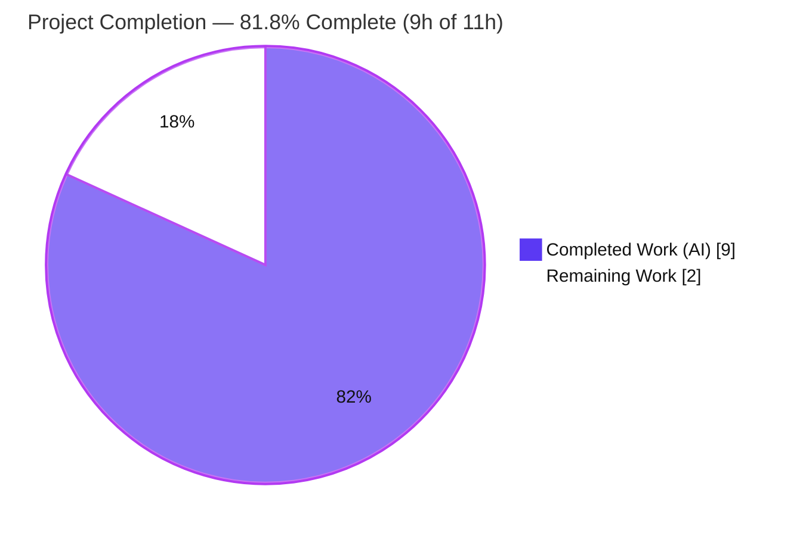
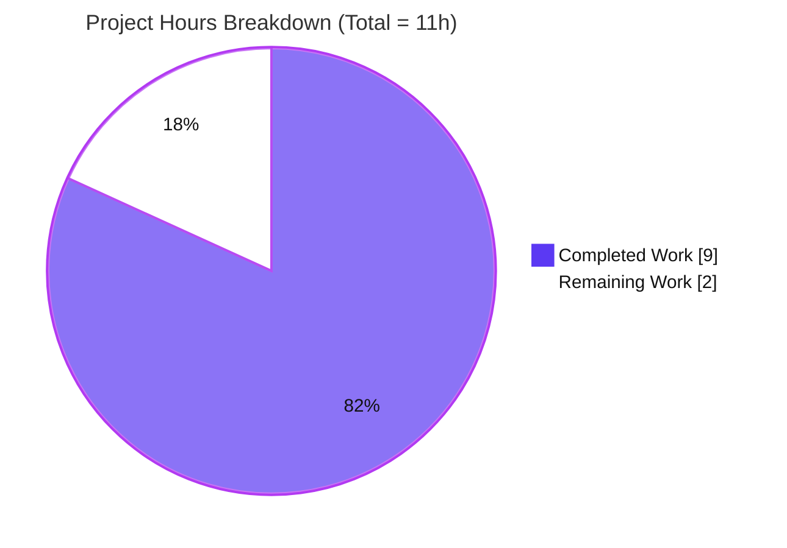
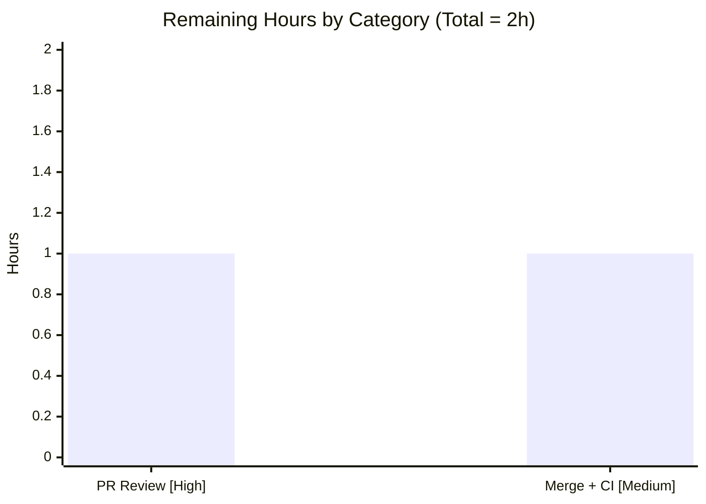

# Blitzy Project Guide — Python Koans: Python 3.12+ `unittest` Compatibility Fix

> **Branch:** `blitzy-aa76f5ab-5cc4-4c5f-ab4d-490b210f8421` &nbsp;|&nbsp; **HEAD:** `159ed49` &nbsp;|&nbsp; **Interpreter validated:** CPython 3.13.7
> **Legend — Blitzy brand colors:** <span style="color:#5B39F3">■ Completed / AI Work (#5B39F3)</span> &nbsp; <span style="color:#B23AF2">■ Headings / Accents (#B23AF2)</span> &nbsp; □ Remaining / Not Completed (#FFFFFF)

---

## 1. Executive Summary

### 1.1 Project Overview

Python Koans is a terminal-only, dependency-free interactive Python tutorial that teaches the language through fill-in-the-blank "koan" exercises graded by a bundled `unittest`-based runner. This task delivered a targeted version-compatibility fix: the codebase called `assertEquals`, a `unittest` alias **removed in Python 3.12**, which raised `AttributeError` and broke both the Continuous Integration self-test command and four koan lessons on Python 3.12+. The fix renames all six call sites to the canonical, behavior-identical `assertEqual` and reconciles six documentation locations that had described the defect as "not fixed." Target users are Python learners and open-source contributors. Business impact: restored CI and full Python 3.12/3.13 compatibility with zero behavioral change.

### 1.2 Completion Status



| Metric | Hours |
|---|---|
| **Total Hours** | **11** |
| **Completed Hours (AI + Manual)** | **9** &nbsp;(AI: 9, Manual: 0) |
| **Remaining Hours** | **2** |
| **Percent Complete** | **81.8%** |

> **Calculation (PA1, AAP-scoped):** Completion % = Completed / (Completed + Remaining) = 9 / 11 = **81.8%**. The universe of work is exclusively the AAP deliverables (Tier 1 code + Tier 2 documentation) plus standard path-to-production activities. No out-of-scope work is included.

### 1.3 Key Accomplishments

- ✅ **All 6 mandatory code call sites fixed** — `assertEquals` → `assertEqual` across `runner/runner_tests/test_helper.py` (2), `koans/about_iteration.py` (1), and `koans/about_regex.py` (3), committed in `de95652` and `e06a739`.
- ✅ **CI restored** — `python3 _runner_tests.py` reports **`Ran 36 tests … OK`, exit 0** (independently re-verified twice) on Python 3.13.7, replacing the former `FAILED (errors=2)`.
- ✅ **All 6 documentation locations reconciled** — the "not fixed" / "≤ 3.11" / "unsupported" caveats were rewritten to the resolved state across `_runner_tests.py`, `docs/guides/deployment.md`, `docs/contributing/development.md`, `docs/getting-started/installation.md`, `docs/index.md`, and `README.rst`.
- ✅ **Learner integrity preserved** — the `__` blank in `about_iteration.py` and every `about_regex.py` argument line were left untouched; only the assertion method name changed.
- ✅ **Footprint closed** — zero residual `.assertEquals(` calls remain in `runner/` or `koans/`; no other removed `unittest` aliases exist anywhere in the codebase.
- ✅ **Scope discipline** — the aggregate diff is exactly **9 files, +36/−35 lines**, matching the AAP scope precisely with zero scope creep; all explicitly-excluded files (`runner/helper.py`, `test_sensei.py`, `libs/**`, the nested submodule, `main`) were left untouched.

### 1.4 Critical Unresolved Issues

| Issue | Impact | Owner | ETA |
|---|---|---|---|
| _None._ All AAP-scoped code and documentation work is complete, committed, and independently validated (36/36 tests pass; zero `AttributeError`). | No blockers to release. | — | — |

> There are **no critical unresolved issues**. The only outstanding items are routine path-to-production steps (human PR review and merge-to-`main`) tracked in Sections 1.6 and 2.2.

### 1.5 Access Issues

| System/Resource | Type of Access | Issue Description | Resolution Status | Owner |
|---|---|---|---|---|
| — | — | **No access issues identified.** The project is self-contained (stdlib-only, zero-install), requires no credentials, external services, API keys, or network access, and the working tree is fully committed on the active branch. | N/A | — |

### 1.6 Recommended Next Steps

1. **[High]** Review and approve the pull request — inspect the 9-file diff, confirming the 36-test suite passes and that no learner `__` blanks or koan prose were altered.
2. **[Medium]** Merge the branch to `main` and confirm the Travis CI job (Python 3.9) reports green post-merge.
3. **[Low, optional — beyond AAP scope]** Add Python 3.12 and 3.13 to the Travis CI matrix (currently pins only 3.9) to guard against future re-introduction of removed-alias usage.
4. **[Low, optional — beyond AAP scope]** Obtain specification-owner sign-off on `blitzy/documentation/Technical Specifications.md` (already uses compatible "CPython 3.7+" wording; no contradictory caveat found).

---

## 2. Project Hours Breakdown

### 2.1 Completed Work Detail

| Component | Hours | Description |
|---|---:|---|
| Root cause diagnosis & reproduction | 2 | Reproduced the `AttributeError` on Python 3.12+, identified the removed `assertEquals` alias, confirmed `assertEqual` as the behavior-identical replacement via interpreter introspection, and validated the hypothesis against a throwaway copy. |
| Tier 1 — Code fix (6 renames, 3 files) | 1 | Renamed `assertEquals` → `assertEqual` at all six call sites (commits `de95652`, `e06a739`), preserving the `__` learner blank and all argument lines; added one maintainer comment in the runner test. |
| Tier 1 — Fix verification | 1 | Ran the 36-test self-test suite to `OK`, executed the affected koan lessons, and grepped for residual `.assertEquals(` (none). |
| Tier 2 — Documentation reconciliation (6 locations) | 3 | Rewrote the "not fixed" caveat sections to the resolved state across 6 files over 7 commits, including three QA review rounds that corrected line-anchor citations to L15/L18. |
| Final 5-gate production-readiness validation | 2 | Verified all five gates: tests (x2), runtime, zero-error compilation, dependency audit, and scope-compliance audit; confirmed a clean working tree. |
| **Total Completed** | **9** | |

### 2.2 Remaining Work Detail

| Category | Hours | Priority |
|---|---:|---|
| PR review & approval (9-file diff: 6 one-token renames + 6 doc edits) | 1 | High |
| Merge to `main` + confirm CI (Python 3.9) green post-merge | 1 | Medium |
| **Total Remaining** | **2** | |

### 2.3 Hours Reconciliation

| Check | Value | Result |
|---|---|---|
| Section 2.1 completed total | 9 | — |
| Section 2.2 remaining total | 2 | — |
| Sum (2.1 + 2.2) | 11 | = Total Hours in §1.2 ✅ |
| Completion % (9 / 11 x 100) | 81.8% | = §1.2, §7, §8 ✅ |

---

## 3. Test Results

All tests below originate from Blitzy's autonomous validation logs, produced by the project's designated CI command `python3 _runner_tests.py` (Python `unittest`, stdlib) and independently re-run during this assessment. Result: **`Ran 36 tests in 0.246s … OK`, exit 0**.

| Test Category | Framework | Total Tests | Passed | Failed | Coverage % | Notes |
|---|---|---:|---:|---:|---:|---|
| Runner — Helper (`TestHelper`) | `unittest` | 3 | 3 | 0 | N/A | Directly covers the 2 fixed CI call sites; now uses `assertEqual`. |
| Runner — Sensei (`TestSensei`) | `unittest` | 26 | 26 | 0 | N/A | Reporting/stack-scraping engine (includes the `..._with_assert_equals` name — a false-positive that uses `assertEqual`). |
| Runner — Mountain (`TestMountain`) | `unittest` | 1 | 1 | 0 | N/A | Test-result aggregation. |
| Runner — FilterKoanNames | `unittest` | 4 | 4 | 0 | N/A | `koans.txt` lesson-name parsing. |
| Runner — KoansSuite | `unittest` | 2 | 2 | 0 | N/A | `TestSuite` assembly. |
| **TOTAL** | **`unittest`** | **36** | **36** | **0** | **N/A** | **100% pass rate; exit 0.** |

> **Coverage note:** The project ships no coverage tooling by design; its quality gate is exit-code driven (AAP §6.6.3). "Coverage %" is therefore reported as **N/A**. The 36-test suite is the authoritative gate and passes completely.

---

## 4. Runtime Validation & UI Verification

**Legend:** ✅ Operational &nbsp;|&nbsp; ⚠ Partial &nbsp;|&nbsp; ❌ Failing

**Runtime health**

- ✅ **CI self-test command** — `python3 _runner_tests.py` → `Ran 36 tests … OK`, exit 0 (re-run twice, identical).
- ✅ **Full koan runner** — `python3 -B contemplate_koans.py` (and `./run.sh`) start cleanly and print the colored progress report.
- ✅ **Affected lessons** — `python3 -B contemplate_koans.py about_iteration about_regex` raise **only pedagogical `AssertionError`** (e.g., `'-=> FILL ME IN! <=-' != 15`); **`AttributeError` count = 0**.
- ✅ **All 6 fixed sites exercised** — each executes `assertEqual` at runtime (pedagogical `AssertionError`), never `AttributeError`.
- ✅ **Compilation** — `python3 -m compileall` (excluding submodule/.git) → exit 0; all in-scope files byte-compile cleanly.
- ✅ **Exit-code semantics** — `contemplate_koans.py` exits 255 until learner blanks are solved; this is **by design** ("not yet enlightened"), not a crash.

**API integration**

- ✅ **N/A** — the application performs no network, database, or external-service calls; the sole integration point is Travis CI, which invokes the (now-passing) self-test command.

**UI verification**

- ✅ **N/A (no graphical/web UI)** — Python Koans is a terminal-only, text-based runner (AAP §0.4.3). Verification is limited to console output, which renders the expected progress report and Zen-of-Python remarks.

---

## 5. Compliance & Quality Review

Cross-mapping of AAP deliverables to Blitzy quality/compliance benchmarks. All fixes required by the AAP were applied by prior autonomous commits and verified during validation; **no additional fixes were required**.

| # | AAP Deliverable / Benchmark | Requirement | Status | Progress |
|---|---|---|---|---|
| 1 | Tier 1 — `test_helper.py` L14/L17 | Rename to `assertEqual` (CI sites) | ✅ Pass | 100% |
| 2 | Tier 1 — `about_iteration.py` L83 | Rename; preserve `__` blank | ✅ Pass | 100% |
| 3 | Tier 1 — `about_regex.py` L85/L111/L138 | Rename; leave arg lines untouched | ✅ Pass | 100% |
| 4 | Tier 2 — 6 documentation locations | Reconcile "not fixed" caveats | ✅ Pass | 100% |
| 5 | Bug elimination (§0.6.1) | CI → `OK`/exit 0; no `AttributeError` | ✅ Pass | 100% |
| 6 | Regression check (§0.6.2) | All 36 tests pass; unaffected areas identical | ✅ Pass | 100% |
| 7 | Footprint closed (§0.4.3) | No residual `.assertEquals(` in `runner/`, `koans/` | ✅ Pass | 100% |
| 8 | Cross-version safety (§0.6.2) | `assertEqual` valid on 3.9 CI + 3.12+ | ✅ Pass | 100% |
| 9 | Scope compliance (§0.5.2) | Excluded files/trees untouched; branch-only | ✅ Pass | 100% |
| 10 | Zero-placeholder / semantics-preserving | No behavior/value/argument changes | ✅ Pass | 100% |

**Fixes applied during autonomous validation:** None required — the AAP was already correctly implemented; the validator's role was verification only.
**Outstanding compliance items (within AAP):** None.

---

## 6. Risk Assessment

All risks are **Low severity / Low probability**, consistent with a trivial, semantics-preserving, cross-version-safe (Python 3.7–3.13) one-token rename backed by a fully passing 36-test suite.

| Risk | Category | Severity | Probability | Mitigation | Status |
|---|---|---|---|---|---|
| CI matrix pins only Python 3.9; 3.12/3.13 not exercised in CI, so a future re-introduction of a removed alias would not be caught on the pinned interpreter. | Technical | Low | Low | Optionally add 3.12/3.13 to the Travis matrix. Verified: **no** other removed aliases exist today. | Open (optional, beyond AAP scope) |
| Quality gate is solely the `unittest` exit code (no coverage/lint tooling). | Technical | Low | Low | The 36-test suite is the project's designated gate (AAP §6.6.3); adequate at this scale. | Accepted (by design) |
| No third-party dependency / supply-chain exposure. | Security | Low | Low | Stdlib-only, zero-install; no manifests, credentials, or network/auth surface. | Accepted |
| No monitoring/logging/health-checks. | Operational | Low | Low | N/A for a local terminal tutorial with no long-running service; gate is CI exit code. | Accepted (by design) |
| No external service/API/network integration to break. | Integration | Low | Low | Sole integration is Travis CI invoking the now-passing self-test command. | Accepted |
| `Technical Specifications.md` could contain a stale Py3.12 caveat. | Process/Docs | Low | Low | Current review found neutral "CPython 3.7+" wording and **no** contradictory caveat; only spec-owner sign-off remains. | Open (housekeeping) |

---

## 7. Visual Project Status



**Remaining hours by category (from Section 2.2):**



> **Integrity:** the pie chart "Remaining Work" (2h) equals Section 1.2 Remaining Hours (2h) and the Section 2.2 total (2h); "Completed Work" (9h) equals Section 1.2 Completed Hours (9h).

---

## 8. Summary & Recommendations

**Achievements.** The Python 3.12+ `unittest` incompatibility is fully resolved. All six `assertEquals` call sites now call the canonical `assertEqual`; the CI self-test command passes (`Ran 36 tests … OK`, exit 0); the four affected koan lessons run without `AttributeError`; and all six documentation locations have been reconciled to the resolved state. The change is minimal and exact — an aggregate of **9 files and +36/−35 lines** — with zero scope creep and zero behavioral change.

**Remaining gaps.** None within the AAP. The project is **81.8% complete** on an hours-basis; the residual 2 hours are standard path-to-production steps — a human PR review (High) and a merge-to-`main` with CI confirmation (Medium) — neither of which is a technical blocker.

**Critical path to production.** (1) Approve the PR → (2) merge to `main` → (3) confirm Travis (Python 3.9) is green. Estimated wall-clock effort: ~2 hours.

**Success metrics (all met within AAP scope).** 36/36 tests passing (100%); zero `AttributeError` at runtime; zero residual removed-alias calls; clean byte-compilation; clean working tree; excluded files untouched.

**Production readiness assessment.** **Ready pending routine human review.** The fix is low-risk, cross-version-safe (Python 3.7–3.13), and independently verified on the same interpreter (3.13.7) that previously exhibited the bug. No High or Medium severity risks exist. Recommended (optional, beyond AAP scope): extend the CI matrix to 3.12/3.13 to lock in regression protection.

| Success Metric | Target | Actual | Status |
|---|---|---|---|
| Self-test suite | `OK` / exit 0 | `Ran 36 tests … OK`, exit 0 | ✅ |
| Test pass rate | 100% | 36/36 (100%) | ✅ |
| Runtime `AttributeError` | 0 | 0 | ✅ |
| Residual `.assertEquals(` | 0 | 0 | ✅ |
| Scope creep | 0 files | 0 (exactly 9 in-scope files) | ✅ |

---

## 9. Development Guide

### 9.1 System Prerequisites

- **Python:** CPython **3.7 or newer** (validated on **3.13.7**; the fix is compatible across 3.7–3.12+).
- **Operating system:** Linux, macOS, or Windows (cross-platform CPython).
- **Dependencies:** **None.** The project is stdlib-only and zero-install — there is no `requirements.txt`, `setup.py`, or `pyproject.toml`. Vendored helpers (`libs/mock.py`, `libs/colorama`) ship in-repo.
- **Tooling:** `git` (with Git LFS available) to clone the repository.

### 9.2 Environment Setup

No dependency installation is required. A virtual environment is **optional** (useful only for pinning a specific interpreter):

```bash
# Optional — isolate an interpreter version
python3 -m venv .venv
source .venv/bin/activate   # Windows: .venv\Scripts\activate
python3 --version           # expect Python 3.7+ (e.g., 3.13.7)
```

No environment variables are required to build, test, or run the project.

### 9.3 Dependency Installation

```bash
# There are no third-party dependencies to install.
# All imports resolve to the Python standard library:
#   functools, glob, io, os, random, re, sys, unittest
```

### 9.4 Application Startup & Verification

Run every command from the repository root.

```bash
# 1) Verify the runner self-tests (the CI quality gate)
python3 _runner_tests.py
#    Expected: "Ran 36 tests in ~0.23s" then "OK"; exit status 0

# 2) Run the full koan tutorial
python3 -B contemplate_koans.py
#    (equivalently: ./run.sh)
#    Expected: a colored progress report; exit 255 until you solve the blanks

# 3) Run one or more specific lessons
python3 -B contemplate_koans.py about_asserts
python3 -B contemplate_koans.py about_iteration about_regex

# 4) Byte-compile all in-scope sources (sanity check)
python3 -m compileall -q -x '(^|/)(\.git|Submodule_01_Do_not_use_15Jun)/' .
#    Expected: exit status 0

# 5) Confirm the fix footprint is closed
grep -rn "\.assertEquals(" runner/ koans/    # expect: no matches
```

### 9.5 Example Usage & Expected Output

```text
$ python3 -B contemplate_koans.py about_asserts
Thinking AboutAsserts
  test_assert_truth has damaged your karma.

You have not yet reached enlightenment ...
  AssertionError: False is not true

Please meditate on the following code:
  File ".../koans/about_asserts.py", line 17, in test_assert_truth
    self.assertTrue(False) # This should be True

You have completed 0 (0 %) koans and 0 (out of 37) lessons.
```

Learners progress by replacing each `__` blank / `False` placeholder with the correct value until the runner reports enlightenment.

### 9.6 Troubleshooting

| Symptom | Cause | Resolution |
|---|---|---|
| `contemplate_koans.py` exits with status **255** | **Expected** — unsolved `__` learner blanks ("not yet enlightenment"). | Not a bug. Solve the blanks; the exit code becomes 0 upon completion. |
| Historical: `AttributeError: 'TestHelper' object has no attribute 'assertEquals'` | The pre-fix Python 3.12+ incompatibility. | **Already fixed** — the current tree uses `assertEqual`; `python3 _runner_tests.py` reports `OK`. |
| `ModuleNotFoundError` for `functools`/`glob`/`io`/`os`/`random`/`re`/`sys`/`unittest` | A broken/partial Python installation (these are stdlib). | Reinstall/repair the Python interpreter; no `pip install` is needed. |
| Colors look garbled on Windows | Terminal ANSI handling. | The vendored `libs/colorama` handles this; use a modern terminal (Windows Terminal / PowerShell). |

---

## 10. Appendices

### A. Command Reference

| Purpose | Command |
|---|---|
| Run CI self-tests (quality gate) | `python3 _runner_tests.py` |
| Run all koans | `python3 -B contemplate_koans.py` &nbsp;or&nbsp; `./run.sh` |
| Run specific lesson(s) | `python3 -B contemplate_koans.py <lesson> [<lesson> …]` |
| Byte-compile in-scope sources | `python3 -m compileall -q -x '(^\|/)(\.git\|Submodule_01_Do_not_use_15Jun)/' .` |
| Verify footprint closed | `grep -rn "\.assertEquals(" runner/ koans/` |
| Python version | `python3 --version` |

### B. Port Reference

**N/A** — the application opens no network ports (terminal-only tutorial; no server, database, or listening service).

### C. Key File Locations

| Path | Role | Tier |
|---|---|---|
| `runner/runner_tests/test_helper.py` | Runner self-test — the two CI-executed fixed sites | Tier 1 (code) |
| `koans/about_iteration.py` | Koan lesson — fixed site L83 (`__` blank preserved) | Tier 1 (code) |
| `koans/about_regex.py` | Koan lesson — fixed sites L85/L111/L138 | Tier 1 (code) |
| `_runner_tests.py` | CI self-test aggregator + reconciled docstring | Tier 2 (docs) |
| `docs/guides/deployment.md` | Reconciled Py3.12 caveat section | Tier 2 (docs) |
| `docs/contributing/development.md` | Reconciled Py3.12 subsection | Tier 2 (docs) |
| `docs/getting-started/installation.md` | Reconciled Py3.12 note | Tier 2 (docs) |
| `docs/index.md` | Reconciled navigation description | Tier 2 (docs) |
| `README.rst` | Reconciled Py3.12 pointer | Tier 2 (docs) |
| `runner/helper.py` | `cls_name` under test — correct, **not modified** | Excluded |
| `contemplate_koans.py` | Learner entry point | — |
| `.travis.yml` | CI config (Python 3.9; `python _runner_tests.py`) | — |

### D. Technology Versions

| Technology | Version |
|---|---|
| CPython (validated) | 3.13.7 |
| CPython (supported band) | 3.7 – 3.12+ |
| CPython (CI-pinned) | 3.9 |
| Test framework | `unittest` (stdlib) |
| Vendored `colorama` | in-repo (`libs/colorama`) |
| Vendored `mock` | in-repo (`libs/mock.py`) |
| CI provider | Travis CI |

### E. Environment Variable Reference

**None required.** The project needs no environment variables to build, test, or run.

### F. Developer Tools Guide

| Task | Tool | Command |
|---|---|---|
| Run tests | Python `unittest` | `python3 _runner_tests.py` |
| Byte-compile | `compileall` | `python3 -m compileall -q -x '(^\|/)(\.git\|Submodule_01_Do_not_use_15Jun)/' .` |
| Static compile check (single file) | `py_compile` | `python3 -m py_compile <file.py>` |
| Search for removed aliases | `grep` | `grep -rn "\.assertEquals(" runner/ koans/` |
| Per-file diff review | `git` | `git diff 9823fea HEAD -- <path>` |

### G. Glossary

| Term | Definition |
|---|---|
| **Koan** | A fill-in-the-blank exercise (`about_*.py`) a learner solves to "reach enlightenment." |
| **`__` (learner blank)** | A placeholder the learner replaces with the correct value; deliberately preserved by the fix. |
| **`assertEquals` → `assertEqual`** | The removed `unittest` alias (dropped in Python 3.12) and its canonical, behavior-identical replacement present since Python 3.7. |
| **Runner** | The bundled harness under `runner/` that discovers, executes, and reports on koans. |
| **Tier 1 / Tier 2** | AAP tiers: Tier 1 = mandatory code correction; Tier 2 = required documentation reconciliation. |
| **Exit 255 ("not yet enlightened")** | Expected non-zero exit from `contemplate_koans.py` while blanks remain unsolved — not an error. |

---

*Generated by the Blitzy autonomous assessment agent. Completion percentage (81.8%) reflects AAP-scoped deliverables plus path-to-production activities only, per the PA1 methodology. Completed = Dark Blue (#5B39F3); Remaining = White (#FFFFFF).*