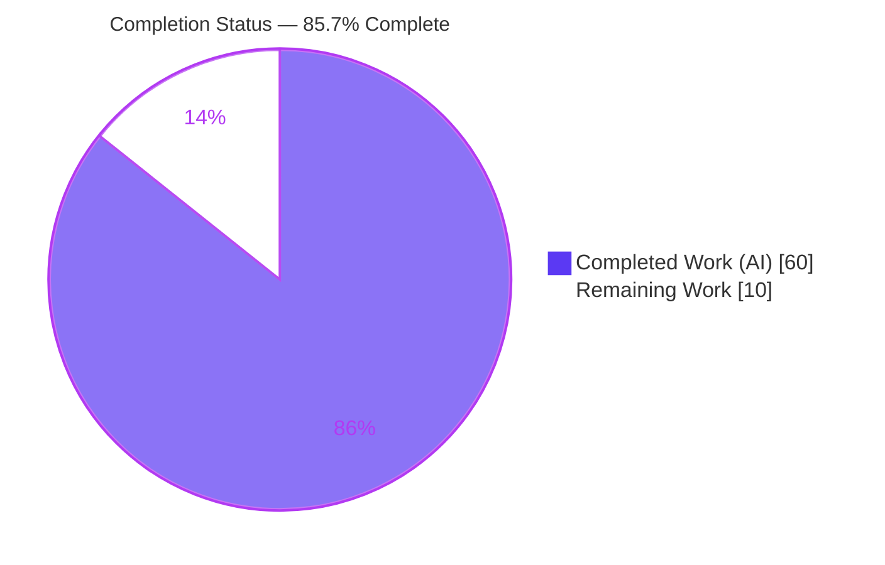
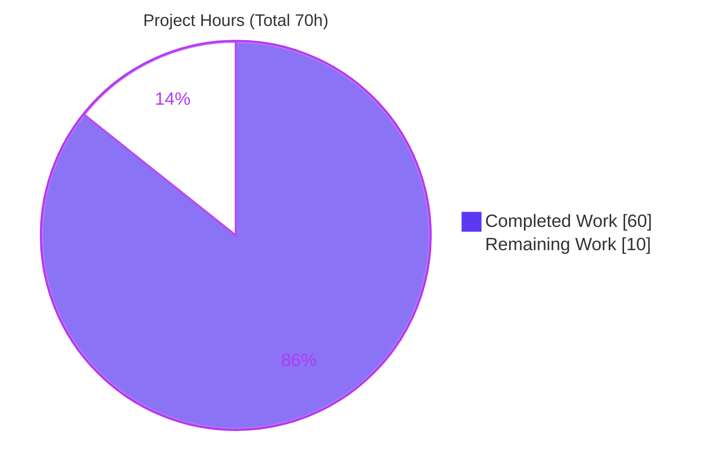
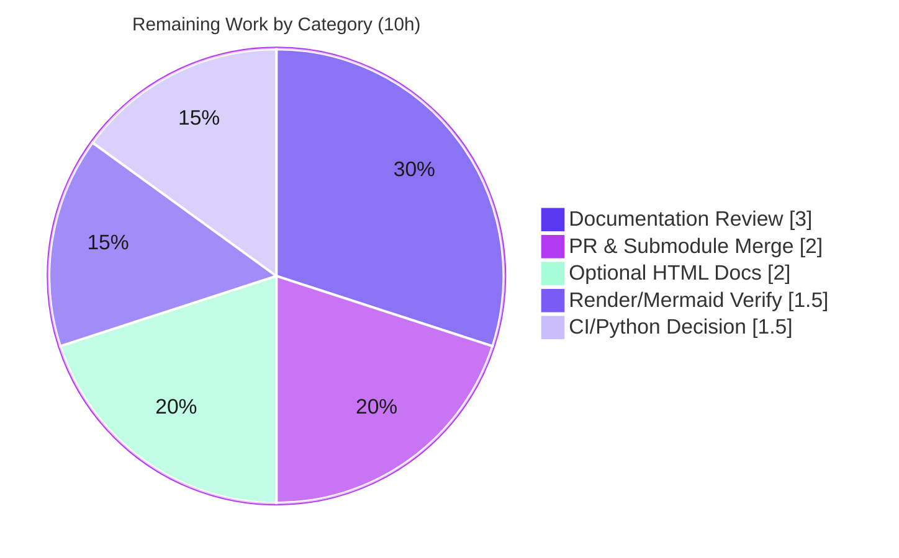

# Blitzy Project Guide

> **Project:** Developer Documentation Across a Three-Level Nested Git Submodule Tree (Python Koans + Submodule_01 + Submodule_02)
> **Branch:** `blitzy-a1437d95-a318-406b-8a31-e90a57ad139a`
> **Task Class:** Documentation (no functional/behavioral code change)
> **Legend:** <span style="color:#5B39F3">**■ Completed / AI Work (#5B39F3)**</span> · <span style="color:#B23AF2">**■ Remaining / Not Completed (#FFFFFF)**</span>

---

## 1. Executive Summary

### 1.1 Project Overview

This project authors and updates developer-facing documentation across **every repository in a three-level nested Git submodule tree**: the parent **Python Koans** learning project, its child submodule **Submodule_01** (a `.gitignore` template collection), and the nested grandchild **Submodule_02** (a Node.js/Express Heroku sample app). Two coordinated artifact classes were delivered: (a) source-level API annotations — JSDoc for JavaScript and PEP 257 docstrings for Python — and (b) comprehensive README/`docs/` files covering setup, API reference, deployment, and inline explanations. Per the authoritative user mandate, all submodules are treated as first-class parts of the project. The work is strictly documentation-only; no functional or behavioral code was modified. Target users are developers and maintainers onboarding to the runner engine and the web app.

### 1.2 Completion Status



| Metric | Hours |
|--------|-------|
| **Total Hours** | **70** |
| Completed Hours (AI) | 60 |
| Completed Hours (Manual) | 0 |
| **Completed Hours (AI + Manual)** | **60** |
| **Remaining Hours** | **10** |
| **Percent Complete** | **85.7%** |

> **Calculation:** Completion % = Completed Hours ÷ Total Hours × 100 = 60 ÷ 70 × 100 = **85.7%**. All 60 completed hours were delivered autonomously by Blitzy agents; 0 hours were manual. The remaining 10 hours are human path-to-production activities (§2.2).

### 1.3 Key Accomplishments

- ✅ **JSDoc coverage 100%** — `@fileoverview` + JSDoc on all JavaScript functions in Submodule_02 `index.js` (GET `/` route handler, `app.listen` callback, async `SIGTERM` handler) and `test.js` (`get(url)` helper + suite descriptions).
- ✅ **Python docstring coverage** — PEP 257 docstrings across the entire `runner/` engine: `Sensei` + **18 methods** (AAP scoped 16 — exceeded), `Mountain`, the four curriculum loaders, and support types (`Koan`, `WritelnDecorator`, `MockableTestResult`, `cls_name`), plus entry points and **38/38** `koans/about_*.py` module docstrings.
- ✅ **Three new parent docs** — `docs/architecture.md` (125 L), `docs/api-reference.md` (340 L), `docs/deployment.md` (167 L).
- ✅ **Enriched `README.rst`** — developer-docs index, three-level submodule map, Mermaid topology diagram, `git submodule update --init --recursive` guidance, deployment summary, and reconciled Windows Python path (`C:\Python311` in both README and `run.bat`).
- ✅ **Expanded Submodule_02 `README.md`** — API Documentation (route table), Application Architecture, Environment Variables (`PORT`, `TIMES`), and Testing sections; retained Running Locally + Heroku (Cedar/Fir); 2 Mermaid diagrams.
- ✅ **Submodule_01 `README.md`** — "Project Context & Submodules" section situating it in the parent tree, with cross-links (treating the "Do_not_use" submodule as part of the project).
- ✅ **99 `Source:` citations** across the three `docs/` files and Mermaid diagrams in all six documentation files; all internal cross-links resolve (0 broken).
- ✅ **Validated** — in-scope Python `py_compile` exit 0, Submodule_02 `node --check` exit 0, Jest 2/2, parent regression 100% of in-scope tests, both executables run, all three repos clean and consistent.

### 1.4 Critical Unresolved Issues

| Issue | Impact | Owner | ETA |
|-------|--------|-------|-----|
| None blocking | All in-scope AAP deliverables complete; code compiles; in-scope tests pass; both executables run. No compilation errors, no in-scope test failures, no missing deliverables. | — | — |
| CI Python-version decision (pre-existing, out-of-scope) | 2 out-of-scope tests in `runner/runner_tests/test_helper.py` use `assertEquals` (removed in Python 3.12+); they pass on the project's target Python 3.9 (`.travis.yml`) but error on the 3.13 validation host. A human decision is needed on CI Python pinning. Not a defect in delivered work. | Maintainer | 1.5 h |

### 1.5 Access Issues

| System/Resource | Type of Access | Issue Description | Resolution Status | Owner |
|-----------------|----------------|-------------------|-------------------|-------|
| Local repo & all submodules | Read/Write (filesystem) | None — all three submodules initialized, on the correct branch, clean trees; all tools (Python 3.13, Node 22, npm, Git) available. | ✅ No issue | — |
| `github.com/lakshya-blitzy/Submodule_01_Do_not_use_15Jun` & `…/Submodule_02_Do_not_use_15Jun` remotes | Push (merge-time) | Merging the nested-submodule PR requires push access to all three separate remotes; each submodule's commits must be pushed to its own remote before the parent references them. Not a validation blocker. | ⚠ Confirm before merge | Maintainer |

> No access issues prevent build validation. The submodule-remote push access is a merge-time consideration only.

### 1.6 Recommended Next Steps

1. **[Medium]** Perform a human documentation accuracy review of the generated `docs/`, READMEs, JSDoc, and docstrings (§Human Tasks HT-1).
2. **[Medium]** Review and merge the nested-submodule PR bottom-up (Submodule_02 → Submodule_01 → parent), verifying gitlink pointers and `git submodule status --recursive` post-merge (HT-2).
3. **[Low]** Decide and document the CI Python-version approach for the out-of-scope `test_helper.py` `assertEquals` incompatibility (HT-5).
4. **[Low]** Visually verify Markdown/RST rendering and all six Mermaid diagrams on the hosting platform (HT-4).
5. **[Low]** (Optional, AAP-flagged) Generate browsable HTML API docs via `jsdoc` if desired (HT-3).

---

## 2. Project Hours Breakdown

### 2.1 Completed Work Detail

<span style="color:#5B39F3">**All items below were delivered autonomously (AI) and validated.**</span> Each traces to an AAP §0.5.1 deliverable or an R1–R4 requirement.

| Component | Hours | Description |
|-----------|------:|-------------|
| `docs/api-reference.md` (CREATE) | 9 | Runner-engine API reference (340 L): `Mountain`, `Sensei` + 18 methods, 4 curriculum loaders, support types; 39 `Source:` citations. Traces to AAP §0.5.2 [R2]. |
| `runner/` engine docstrings (UPDATE ×7) | 9 | PEP 257 docstrings across `sensei.py` (class + 18 methods), `mountain.py`, `path_to_enlightenment.py` (4 loaders), `koan.py`, `helper.py`, `writeln_decorator.py`, `mockable_test_result.py` [R1-equiv]. |
| `docs/architecture.md` (CREATE) | 4 | System overview + Mermaid runtime flow (launcher → `Mountain` → `koans()` → `Sensei`), 125 L, 33 citations [R2]. |
| `docs/deployment.md` (CREATE) | 4 | Consolidated run/CI/cloud guide (local, Travis, Gitpod, Sniffer), 167 L, 27 citations [R2]. |
| `README.rst` enrichment (UPDATE) | 4 | Developer-docs index, three-level submodule map, Mermaid topology, deployment summary, Windows Python-path reconciliation [R2/R3]. |
| Submodule_02 `README.md` expansion (UPDATE) | 4 | API Documentation (route table), Application Architecture, Environment Variables (`PORT`/`TIMES`), Testing; 2 Mermaid diagrams; retained Running Locally + Heroku [R2]. |
| `koans/about_*.py` module docstrings (UPDATE ×38) | 4 | Module-level docstrings for all 38 learning stubs [R4]. |
| Recursive submodule coordination & gitlink management | 4 | Committing within each submodule's own history across three repos; advancing/verifying gitlink pointers [R3]. |
| Autonomous validation & QA remediation | 4 | Compilation, test, runtime checks across 3 repos; resolving multiple code-review/QA findings. |
| Parent entry-point docstrings (UPDATE ×3) | 3 | `contemplate_koans.py` (module docstring + inline version-gating explanation, logic unchanged), `scent.py`, `_runner_tests.py` [R1-equiv]. |
| Submodule_02 `index.js` JSDoc (UPDATE) | 3 | `@fileoverview` + JSDoc on all 3 functions (`@param`/`@returns`/`@async`) [R1]. |
| Submodule_01 `README.md` update (UPDATE) | 3 | "Project Context & Submodules" section, topology, cross-links, citation normalization [R3/R4]. |
| Source citation authoring & accuracy verification | 3 | 99 `Source: <path>:<line>` citations; line-shift corrections after JSDoc insertion. |
| Submodule_02 `test.js` JSDoc (UPDATE) | 2 | `@fileoverview` + `get(url)` helper JSDoc + `describe`/`beforeEach`/`afterEach`/`it` descriptions [R1]. |
| **Total Completed** | **60** | |

### 2.2 Remaining Work Detail

Each category traces to a path-to-production need or the single AAP-flagged **optional** item.

| Category | Hours | Priority |
|----------|------:|----------|
| Documentation Review & Accuracy Sign-off | 3.0 | Medium |
| PR Review & Nested-Submodule Merge Coordination | 2.0 | Medium |
| Optional HTML API-Doc Generation (`package.json` `jsdoc` + `docs` script) | 2.0 | Low |
| Rendered-Output & Mermaid Diagram Verification | 1.5 | Low |
| CI / Python-Version Decision & Documentation | 1.5 | Low |
| **Total Remaining** | **10.0** | |

### 2.3 Hours Reconciliation

| Check | Value | Status |
|-------|------:|--------|
| Section 2.1 Completed total | 60 | ✅ |
| Section 2.2 Remaining total | 10 | ✅ |
| 2.1 + 2.2 | 70 | ✅ = Total Hours (§1.2) |
| Remaining consistent across §1.2, §2.2, §7 | 10 | ✅ |

---

## 3. Test Results

> **Integrity note:** All tests below originate exclusively from Blitzy's autonomous validation logs for this project (Submodule_02 Jest suite and the parent `unittest` regression harness). This is a documentation task; **no test cases were added or modified** — the existing suites were executed to validate documented examples and confirm no behavioral regression.

| Test Category | Framework | Total Tests | Passed | Failed/Errored | Coverage % | Notes |
|---------------|-----------|------------:|-------:|---------------:|-----------:|-------|
| Integration (Submodule_02) | Jest 30.4.2 | 2 | 2 | 0 | 100% of routes (GET `/`) | IPv4 + IPv6 bind, both assert HTTP 200 on `/`. |
| Unit/Regression (parent) — in-scope | Python `unittest` | 34 | 34 | 0 | 100% of in-scope suites | Runner-engine + curriculum-loader tests all pass. |
| Unit/Regression (parent) — out-of-scope | Python `unittest` | 2 | 0 | 2 (errored) | N/A | `test_helper.py:14,17` `assertEquals` — removed in Python 3.12+; passes on project-target 3.9. Pre-existing, out-of-scope, environment-induced. |
| Compilation — Python (in-scope) | `py_compile` | 11 files | 11 | 0 | — | `runner/*.py` + `contemplate_koans.py` + `scent.py` + `_runner_tests.py`, exit 0 (harmless pre-existing `SyntaxWarning`s in `sensei.py`). |
| Compilation — JavaScript | `node --check` | 2 files | 2 | 0 | — | `index.js`, `test.js`, exit 0. |
| **Totals (all executed)** | — | **36 tests + 13 compile checks** | **36 tests pass in-scope; 13/13 compile** | **2 out-of-scope errors** | — | 100% in-scope pass rate. |

**Interpretation:** 100% of in-scope tests and all compilation checks pass. The only errors are the two pre-existing, out-of-scope `test_helper.py` cases caused by the validation host's Python 3.13 (the project targets Python 3.9, where they pass). The AAP explicitly places test-behavior and functional source changes out of scope, and a prior agent deliberately restored `test_helper.py` to baseline.

---

## 4. Runtime Validation & UI Verification

**Legend:** ✅ Operational · ⚠ Partial · ❌ Failing

**Parent — Python Koans runner**
- ✅ Launcher `python3 -B contemplate_koans.py` runs; `Mountain.walk_the_path` → `path_to_enlightenment.koans()` → `Sensei` renders colored progress and a zen quote ("Beautiful is better than ugly.").
- ✅ Single-lesson mode `python3 -B contemplate_koans.py about_asserts` runs the targeted lesson.
- ✅ Regression harness `python3 _runner_tests.py` executes (34/36; 2 out-of-scope env errors).

**Submodule_02 — Node.js/Express web app**
- ✅ `npm start` → server logs `Listening on 5006`.
- ✅ `GET /` → **HTTP 200**, rendered EJS HTML (`<title>Node.js Getting Started on Heroku</title>`), route logs `Rendering 'pages/index' for route '/'`.
- ✅ Graceful shutdown — `SIGTERM` closes the server cleanly.
- ✅ `npm test` → Jest 2/2 pass (IPv4 + IPv6).

**Submodule_01 — .gitignore template collection**
- ✅ Documentation-only (markdown + gitignore templates); no build/run/test surface. README renders with topology + cross-links.

**UI Verification**
- ⚠ Not applicable in the traditional sense — the only rendered UI is Submodule_02's single EJS page, confirmed via HTTP 200 and HTML body inspection. No design system/Figma was in scope (AAP §0.11). Mermaid diagrams should be visually confirmed on the hosting platform (§HT-4).

**Documentation Integrity**
- ✅ All internal cross-links resolve (0 broken): `docs/` ↔ `README.rst`; Submodule_02 `README.md` → `../README.md` (Sub01) and `../../README.rst` (parent).
- ✅ 99 `Source:` citations authored; line references verified against current source.

---

## 5. Compliance & Quality Review

### 5.1 Requirement Compliance Matrix (R1–R4)

| Requirement | Benchmark | Evidence | Status |
|-------------|-----------|----------|:------:|
| **R1** — JSDoc on all JS functions | 4/4 documentable functions annotated + `@fileoverview` on both files | `index.js`: route handler, listen callback, async SIGTERM; `test.js`: `get(url)` + suite descriptions | ✅ Pass (100%) |
| **R1 (Python equivalent)** — PEP 257 docstrings | Full runner-engine public API | `Sensei` + 18 methods, `Mountain`, 4 loaders, support types, entry points, 38/38 koans | ✅ Pass |
| **R2** — Comprehensive README (setup, API, deployment, inline) | All four pillars per applicability | `README.rst` + 3 `docs/` files (parent); expanded Submodule_02 README; Submodule_01 README | ✅ Pass |
| **R3** — Recursive submodule scope, exclude none | All 3 levels documented; topology explained | Submodule map in `README.rst`; Project Context in Sub01; cross-links across all levels | ✅ Pass |
| **R4** — Update docs in every repository | Every repo receives README + applicable inline docs | Parent (16 commits), Submodule_01 (8), Submodule_02 (7) | ✅ Pass |

### 5.2 Quality Benchmarks

| Benchmark | Target | Result | Status |
|-----------|--------|--------|:------:|
| No functional/behavioral code change | 0 logic changes | Docstrings/JSDoc/comments only; runtime behavior unchanged; tests confirm no regression | ✅ Pass |
| Source citations for technical claims | Present throughout | 99 `Source:` citations in `docs/`; inline citations in source annotations | ✅ Pass |
| Mermaid diagrams for key workflows | Topology, runtime, request flow | Present in all 6 doc files | ✅ Pass |
| Cross-link integrity | 0 broken | 0 broken (verified) | ✅ Pass |
| Style consistency with existing READMEs | Match tone/structure | New docs mirror existing README style; parent kept in RST | ✅ Pass |
| In-scope compilation | Exit 0 | `py_compile` + `node --check` exit 0 | ✅ Pass |

### 5.3 Fixes Applied During Autonomous Validation

- Reconciled the Windows Python path inconsistency (`README.rst` and `run.bat` now both `C:\Python311`; AAP's `C:\Python39` mismatch resolved).
- Corrected stale `Source:` line-number citations after JSDoc insertion shifted lines (Submodule_02 `test.js`, `index.js`, README).
- Resolved multiple code-review/QA findings across the runner, koans, and `docs/` (citation accuracy, doc-claim precision).
- Restored `runner/runner_tests/test_helper.py` to baseline (correctly kept out of scope).

### 5.4 Outstanding Compliance Items

- Optional `package.json` `jsdoc` devDependency + `docs` script (AAP-flagged optional) — **not applied** (core deliverable requires no tooling).

---

## 6. Risk Assessment

| Risk | Category | Severity | Probability | Mitigation | Status |
|------|----------|----------|-------------|------------|--------|
| Documentation line-number drift (99 line-anchored citations go stale on future edits) | Technical | Low | Medium (over time) | Periodic re-verification or symbol-anchored references; optional CI lint | Accepted/Documented |
| Pre-existing `SyntaxWarning`s in `runner/sensei.py:170,312` (regex `\d`/`\w`) | Technical | Low | Low | Convert to raw strings (out-of-scope functional change) | Pre-existing/Documented |
| Mermaid diagrams may not render on all viewers | Technical | Low | Low | Visually verify on hosting platform (GitHub renders natively) | Open (HT-4) |
| Documentation-only task — no new attack surface / no secrets introduced | Security | Very Low | — | Verified no logic change | Resolved |
| Submodule_02 `.env` committed (`TIMES=2`, no secrets; self-documented as demo) | Security | Low | N/A (pre-existing) | Gitignore `.env` for production | Pre-existing/Documented |
| CI Python-version mismatch (3.9 pin vs. 3.12+ `assertEquals` removal) | Operational | Medium | Medium | Retain 3.9 pin or migrate `assertEquals`→`assertEqual` (out-of-scope) | Open (HT-5) |
| No hosted documentation site configured | Operational | Low | Low | GitHub renders in-repo Markdown/RST natively; hosted site is future work | Accepted |
| Nested-submodule gitlink coordination at merge | Integration | Medium | Medium | Merge bottom-up (Sub02→Sub01→parent); verify `git submodule status --recursive` | Open (HT-2) |
| Three separate submodule remotes require push access | Integration | Low/Medium | Low | Confirm push access to all three `lakshya-blitzy/*` remotes before merge | Open (HT-2) |
| Optional `jsdoc` devDependency adds to Sub02 tree (if pursued) | Integration | Low | Low (optional) | Pin with `~` operator per AAP | Optional (HT-3) |

**Overall risk posture:** Low. As a documentation-only change with no code-logic modifications, there are no High-severity risks. The most notable item is the pre-existing, out-of-scope CI Python-version decision.

---

## 7. Visual Project Status

### 7.1 Project Hours Breakdown



> Completed Work = **60 h** (#5B39F3) · Remaining Work = **10 h** (#FFFFFF). Matches §1.2 metrics and §2.2 total exactly.

### 7.2 Remaining Work by Category (hours)



### 7.3 Priority Distribution of Remaining Work

| Priority | Hours | Share |
|----------|------:|------:|
| Medium | 5.0 | 50% |
| Low | 5.0 | 50% |
| High (blocking) | 0.0 | 0% |
| **Total** | **10.0** | **100%** |

---

## 8. Summary & Recommendations

**Achievements.** The project is **85.7% complete (60 of 70 hours)**. Every in-scope AAP documentation deliverable across all three nested repository levels is complete and validated: JSDoc on 100% of Submodule_02's JavaScript functions, PEP 257 docstrings across the entire parent `runner/` engine (18 `Sensei` methods, exceeding the AAP's scoped 16), three new parent `docs/` files, an enriched `README.rst` with a submodule map and developer-docs index, an expanded Submodule_02 README, and a Submodule_01 "Project Context" section — all with Mermaid diagrams and 99 source citations. All four requirements (R1–R4) pass compliance.

**Remaining gaps.** The outstanding ~10 hours are entirely human path-to-production, not autonomous deliverables: documentation accuracy review, nested-submodule PR/merge coordination, an optional HTML API-doc generation step (AAP-flagged optional), Mermaid render verification, and a CI Python-version decision for the pre-existing/out-of-scope `test_helper.py` incompatibility.

**Critical path to production.** (1) Human doc review → (2) PR review and bottom-up submodule merge → (3) CI Python-version decision. None are blocking; all in-scope code compiles, in-scope tests pass, and both executables run.

**Production-readiness assessment.** ✅ **Ready for human review and merge.** As a documentation-only change with no behavioral modifications, the risk posture is Low. The single caveat — two out-of-scope test errors on Python 3.13 vs. the project's Python 3.9 target — is documented, pre-existing, and explicitly outside AAP scope.

| Success Metric | Target | Actual | Met |
|----------------|--------|--------|:---:|
| JSDoc function coverage (Submodule_02) | 100% | 100% (4/4 + 2 `@fileoverview`) | ✅ |
| Runner-engine docstring coverage | 100% public API | `Sensei` + 18 methods + all support types | ✅ |
| READMEs updated in every repository | 3/3 | 3/3 | ✅ |
| New parent `docs/` files | 3 | 3 | ✅ |
| In-scope test pass rate | 100% | 100% (34/34 + Jest 2/2) | ✅ |
| Broken internal links | 0 | 0 | ✅ |

---

## 9. Development Guide

> All commands below were executed and verified during autonomous validation on Python 3.13.7, Node v22.23.1, npm 11.18.0.

### 9.1 System Prerequisites

- **Python 3** (project targets 3.7+; `.travis.yml` pins **3.9**; validation host used 3.13.7). Parent vendors its libraries under `libs/` — **no `requirements.txt`**.
- **Node.js** `20.x || 22.x || 24.x` and **npm** (for Submodule_02 only).
- **Git** + **Git LFS** (for recursive submodule handling).
- OS: Linux/macOS (POSIX via `run.sh`) or Windows (`run.bat`).

### 9.2 Environment Setup (clone + submodules)

```bash
# Submodules are NOT fetched by a plain clone — initialize recursively:
git submodule update --init --recursive

# Verify the three-level tree is initialized and on-branch:
git submodule status --recursive
# Expect: Submodule_01 (21eb52f...) and Submodule_01/Submodule_02 (af661f0...)
```

### 9.3 Parent — Python Koans

```bash
# Run all koans (colored progress + zen quote):
python3 -B contemplate_koans.py
# …or use the helper scripts:
./run.sh            # POSIX
# run.bat           # Windows (sets PYTHON_PATH=C:\Python311)

# Run a single lesson:
python3 -B contemplate_koans.py about_asserts

# Run the regression harness (also the Travis CI command):
python3 _runner_tests.py

# Syntax-check the in-scope engine (no behavioral run):
python3 -m py_compile runner/*.py contemplate_koans.py scent.py _runner_tests.py
```

**Expected:** the runner prints per-lesson progress and a zen aphorism. The regression harness runs 36 tests; on Python 3.9 all pass, on Python 3.12+ two `test_helper.py` cases error (see Troubleshooting).

### 9.4 Submodule_02 — Node.js/Express Web App

```bash
cd Submodule_01_Do_not_use_15Jun/Submodule_02_Do_not_use_15Jun

# Install dependencies (express, ejs, jest):
npm install

# Start the server (defaults to port 5006):
npm start
# → console: "Listening on 5006"

# In another shell — exercise the route:
curl -s -o /dev/null -w "%{http_code}\n" http://localhost:5006/   # → 200

# Run the Jest integration suite (IPv4 + IPv6):
npm test            # → 2 passed

# Syntax-check the JavaScript:
node --check index.js && node --check test.js
```

**Expected:** `GET /` returns **HTTP 200** with rendered EJS HTML; `SIGTERM` (e.g., `Ctrl-C`) closes the server gracefully.

### 9.5 Optional — Generate Browsable HTML API Docs (AAP-flagged optional)

```bash
cd Submodule_01_Do_not_use_15Jun/Submodule_02_Do_not_use_15Jun
npm install --save-dev jsdoc
npx jsdoc index.js -d docs
```

### 9.6 Verification Checklist

- `git submodule status --recursive` → clean, both submodules on the project branch.
- Parent runner prints progress + zen quote.
- Submodule_02 `GET /` → 200; `npm test` → 2 passed.
- `docs/` Markdown and `README.rst` render; all cross-links resolve.

### 9.7 Troubleshooting

- **Empty submodule directories after clone** → run `git submodule update --init --recursive`.
- **`AttributeError: 'TestHelper' object has no attribute 'assertEquals'`** (parent regression) → you are on Python 3.12+. This is a pre-existing, out-of-scope incompatibility; use the project's target Python 3.9 (where `assertEquals` exists) or, outside this task's scope, migrate to `assertEqual`.
- **`SyntaxWarning: invalid escape sequence '\d'/'\w'`** from `runner/sensei.py` → pre-existing, harmless warnings (compilation still exits 0).
- **Port 5006 already in use** → override with `PORT=5010 npm start`.
- **Mermaid diagrams not rendering** → view on a Mermaid-capable platform (GitHub renders natively) or a Mermaid Live editor.

---

## 10. Appendices

### A. Command Reference

| Purpose | Command |
|---------|---------|
| Initialize submodules | `git submodule update --init --recursive` |
| Submodule status | `git submodule status --recursive` |
| Run all koans | `python3 -B contemplate_koans.py` |
| Run one lesson | `python3 -B contemplate_koans.py about_asserts` |
| Parent regression | `python3 _runner_tests.py` |
| Python syntax check | `python3 -m py_compile runner/*.py contemplate_koans.py scent.py _runner_tests.py` |
| Install web app deps | `npm install` (in Submodule_02) |
| Start web app | `npm start` → `http://localhost:5006` |
| Test web app | `npm test` |
| JS syntax check | `node --check index.js && node --check test.js` |
| Optional HTML docs | `npm install --save-dev jsdoc && npx jsdoc index.js -d docs` |

### B. Port Reference

| Service | Port | Notes |
|---------|-----:|-------|
| Submodule_02 Express app | 5006 | Default; override via `PORT` env var (`index.js:L24`). |
| Parent Python Koans | — | Console application; no network port. |

### C. Key File Locations

| Path | Role |
|------|------|
| `README.rst` | Parent overview + developer-docs index + submodule map |
| `docs/architecture.md` | System overview + runtime flow |
| `docs/api-reference.md` | Runner-engine API reference |
| `docs/deployment.md` | Consolidated run/CI/cloud guide |
| `runner/*.py` | Runner engine (`Mountain`, `Sensei`, loaders, support types) |
| `contemplate_koans.py` | Launcher (interpreter version gating) |
| `koans/about_*.py` | 38 learning stubs (module docstrings) |
| `Submodule_01_Do_not_use_15Jun/README.md` | Child submodule docs + Project Context |
| `Submodule_01_Do_not_use_15Jun/Submodule_02_Do_not_use_15Jun/index.js` | Express app (JSDoc) |
| `…/Submodule_02_Do_not_use_15Jun/test.js` | Jest suite (JSDoc) |
| `…/Submodule_02_Do_not_use_15Jun/README.md` | Web-app docs (API/architecture/env/testing) |

### D. Technology Versions

| Technology | Version | Source |
|-----------|---------|--------|
| Python (validation host) | 3.13.7 | runtime |
| Python (project CI target) | 3.9 | `.travis.yml` |
| Node.js | v22.23.1 (`engines: 20.x \|\| 22.x \|\| 24.x`) | `package.json` |
| npm | 11.18.0 | runtime |
| Express | 5.2.1 | `package.json` |
| EJS | 6.0.1 | `package.json` |
| Jest | 30.4.2 | `package.json` |
| JSDoc (optional) | 4.0.5 | AAP §0.6.1 |

### E. Environment Variable Reference

| Variable | Default | Scope | Notes |
|----------|---------|-------|-------|
| `PORT` | `5006` | Submodule_02 | HTTP listen port (`index.js:L24`). |
| `TIMES` | `2` | Submodule_02 | Defined in `.env` (checked in for demo only). |

### F. Developer Tools Guide

- **Git submodules:** commit changes inside each submodule's own repository first, then advance the parent's gitlink. Merge bottom-up: Submodule_02 → Submodule_01 → parent.
- **Sniffer (parent):** `scent.py` configures continuous re-runs of the koans on file change (optional).
- **CI:** `.travis.yml` runs `python _runner_tests.py` on Python 3.9; Gitpod provides a one-click cloud workspace (`.gitpod.yml`).

### G. Glossary

| Term | Meaning |
|------|---------|
| Koan | A single fill-in-the-blank Python learning exercise. |
| Lesson | A group of related koans (an `about_*.py` file). |
| `Sensei` | The result renderer that reports koan progress and zen quotes. |
| `Mountain` | The orchestrator that walks the path through the koans. |
| Gitlink | A parent repo's pinned commit reference to a submodule. |
| Nested submodule | A submodule that itself contains a submodule (three-level tree here). |

---

*Generated by the Blitzy Platform. Completion reflects AAP-scoped autonomous work plus path-to-production: **85.7% complete (60 of 70 hours)**.*