# Technical Specification

# 1. Introduction

## 1.1 Executive Summary

Python Koans is an interactive, command-line tutorial that teaches the Python programming language by having the learner make failing tests pass. It is a faithful Python port of Edgecase's "Ruby Koans," and its defining characteristic is that it runs entirely on the Python standard library — a learner clones the repository and runs a single script, with no package to install (`README.rst`, `docs/architecture/overview.md`). The exercises double as a hands-on introduction to Test-Driven Development (TDD): every koan ships *red* (failing), the learner edits it until it is *green* (passing), and then reflects on what the exercise teaches — the classic "red → green → reflect" loop described in `README.rst` and `docs/architecture/overview.md`.

**Core problem being solved.** Learning a programming language — and internalizing a test-first discipline — is difficult from prose alone; it requires incremental, feedback-driven practice. Python Koans addresses this by turning the language's features into a graded sequence of small, executable exercises. Most koans are "fixed" by filling in the missing part of an assertion, for example replacing the `__` placeholder in `self.assertEqual(__, 1+2)` with `3`; a few require the learner to implement real logic, such as a triangle classifier that returns *equilateral*, *isosceles*, or *scalene* (`README.rst`, `koans/triangle.py`). A single guided path — verified at runtime to contain **304 koans across 37 lessons**, assembled from a **39-entry** ordered manifest — carries the learner from basic assertions through strings, collections, control flow, classes, inheritance, decorators, generators, modules/packages, and regular expressions (`koans.txt`, `runner/sensei.py`, `docs/curriculum.md`).

**Project at a glance.** The table below summarizes the system's essential facts, each grounded in repository evidence.

| Attribute | Value |
|---|---|
| Project name | Python Koans (`README.rst`) |
| Nature | Interactive, command-line, test-driven Python learning tutorial (`docs/index.md`) |
| Origin | Port of Edgecase's "Ruby Koans" (`README.rst`, `contemplate_koans.py`) |
| Runtime dependencies | Python 3 standard library only; zero third-party install (`docs/architecture/overview.md`) |
| Curriculum size | 304 koans, 37 lessons, 39 manifest entries — runtime-verified (`runner/sensei.py`, `koans.txt`) |
| Entry point | `contemplate_koans.py` (CLI) delegating to the `runner/` engine (`contemplate_koans.py`) |
| Distribution | Open-source on GitHub (`gregmalcolm/python_koans`) (`README.rst`) |

**Key stakeholders and users.** Python Koans is documented as both "developer- and user-facing" (`docs/index.md`), which maps to the stakeholder groups below.

| Stakeholder group | Role and interest |
|---|---|
| Learners (primary users) | Work through the koans to learn Python and experience TDD; the audience the exercises and progress reporting are designed for (`README.rst`, `docs/getting-started/first-steps.md`) |
| Contributors | Add or reorder lessons, edit exercises, and run the runner self-tests; guided by `docs/contributing/development.md` |
| Maintainers | Steward the engine and curriculum; `README.rst` credits maintainer *gregmalcolm* and co-maintainers *Mike Pirnat* and *Kevin Chase* |
| Educators / self-teachers | Use the ordered curriculum as a structured, self-paced syllabus for teaching or self-study (`docs/curriculum.md`) |

**Value proposition.** The system delivers a low-friction, self-paced learning experience: because it depends only on the Python standard library, a learner needs nothing beyond a Python 3 interpreter and a checked-out copy of the source tree to begin (`docs/guides/deployment.md`). It provides immediate, colorized feedback after every run — a progress summary reporting the percentage of koans completed and lessons cleared — so learners always know where they stand and how much remains (`runner/sensei.py`, `docs/guides/cli-usage.md`). It runs consistently across Unix, macOS, and Windows through platform launchers and a vendored terminal-color library, and it can be operated locally, in continuous-testing mode, or in a one-click cloud workspace (`run.sh`, `run.bat`, `scent.py`, `.gitpod.yml`). Beyond teaching Python syntax and semantics, it instills the discipline of Test-Driven Development, which `README.rst` explicitly frames as a core benefit of working through the koans.

## 1.2 System Overview

Python Koans is a self-contained console application with a single command-line entry point, a small orchestration *engine*, a data-driven *curriculum*, and a set of *vendored* support libraries. A learner starts a session by running `contemplate_koans.py`, which performs an interpreter version check and then hands control to the engine in the `runner/` package; the engine discovers an ordered suite of exercises from the `koans.txt` manifest, runs them through Python's `unittest` framework, and reports colorized progress to the terminal (`contemplate_koans.py`, `runner/mountain.py`, `docs/architecture/overview.md`).

### 1.2.1 Project Context

**Business context and market positioning.** Python Koans is free, open-source educational software distributed on GitHub at `gregmalcolm/python_koans` (`README.rst`). It occupies the "koans" niche of learn-by-doing programming tutorials: `README.rst` itself explains that Python Koans is a port of Edgecase's "Ruby Koans" and points to the broader family of koan projects that exist for many languages. Its positioning is deliberately minimal and dependency-free — `docs/index.md` describes it as a "standard-library-only, test-driven learning project" — which lowers the barrier to entry relative to tutorials that require an installed toolchain or a hosted platform.

**Origin and current limitations.** Because the project is a port that has evolved with the language, it carries one notable, explicitly documented compatibility limitation. On **Python 3.12 and newer**, the runner's own self-test command `python _runner_tests.py` fails, because Python 3.12 removed the long-deprecated `unittest` `assertEquals` alias while the runner self-tests still call it (`docs/guides/deployment.md`, citing `runner/runner_tests/test_helper.py`). The same removed alias is also still used inside several koan exercises (for example in `koans/about_iteration.py` and `koans/about_regex.py`), so full and single-lesson runs may raise `AttributeError` on Python 3.12+. This is recorded as a **known caveat rather than a fix**; the documented, supported path is to use an interpreter of Python 3.11 or earlier, matching the Python 3.9 used by continuous integration (`docs/guides/deployment.md`, `.travis.yml`). This behavior was reproduced during investigation: executing the runner discovery logic under Python 3.12.3 emitted the corresponding `SyntaxWarning`s from `runner/sensei.py` and `libs/colorama`.

**Integration with the surrounding landscape.** Although the application has no server component, it integrates with a conventional developer/CI/cloud toolchain. Each integration point is summarized below.

| Integration point | Purpose | Evidence |
|---|---|---|
| GitHub | Source hosting and distribution (clone/download) | `README.rst` |
| Travis CI | Runs the runner self-tests (`python _runner_tests.py`) on Python 3.9 | `.travis.yml`, `docs/guides/deployment.md` |
| Gitpod | One-click cloud workspace; auto-runs `python contemplate_koans.py` | `.gitpod.yml`, `.gitpod.Dockerfile` |
| Sniffer | File-watcher that re-runs the koans on `.py` changes | `scent.py`, `README.rst` |
| Git submodule | A single submodule declared in `.gitmodules` (`Submodule_01_Do_not_use_15Jun`) | `.gitmodules` |

### 1.2.2 High-Level Description

**Primary system capabilities.** The application exposes a compact set of user- and developer-facing capabilities, all funneled through the single `contemplate_koans.py` entry point (`docs/guides/deployment.md`).

| Capability | What it does | Evidence |
|---|---|---|
| Run the full curriculum | Executes all 304 koans across 37 lessons in manifest order | `docs/guides/cli-usage.md`, `runner/mountain.py` |
| Run a single lesson | Narrows the run to one `TestCase`, e.g. `about_strings` | `runner/mountain.py`, `Contributor Notes.txt` |
| Run a single test | Runs one `module.Class.test_method` | `docs/guides/cli-usage.md` |
| Progress reporting | Prints a colorized koan/lesson progress summary and a zen aphorism | `runner/sensei.py` |
| Continuous testing | Re-runs the koans automatically on file change | `scent.py` |
| CI self-verification | Verifies the engine itself via the runner self-tests | `_runner_tests.py`, `.travis.yml` |

**Major system components.** The repository is organized into three cooperating top-level packages plus the CLI, the manifest, and the documentation tree (`docs/architecture/overview.md`).

| Component | Responsibility | Evidence |
|---|---|---|
| `contemplate_koans.py` | CLI bootstrap: version gate, then start the engine | `contemplate_koans.py` |
| `runner/` (engine) | Orchestration (`Mountain`), discovery (`path_to_enlightenment`), reporting/scoring (`Sensei`), base test type and sentinels (`Koan`), output wrapping (`WritelnDecorator`) | `runner/mountain.py`, `runner/path_to_enlightenment.py`, `runner/sensei.py`, `runner/koan.py` |
| `koans/` (curriculum) | The `about_*.py` fill-in-the-blank lessons plus kata helpers | `koans/`, `koans.txt` |
| `libs/` (vendored) | Bundled `colorama` (terminal color) and `mock.py` so no install is needed | `libs/colorama/`, `libs/mock.py` |
| `koans.txt` (manifest) | Ordered, plain-text list of 39 `TestCase` entries to load | `koans.txt` |
| `docs/` | Onboarding, architecture, curriculum, CLI, deployment, contribution, API reference | `docs/` |

**Core technical approach.** The design rests on four pillars, each observable in the source:

1. **Manifest-driven discovery.** The curriculum is data-driven rather than hard-coded. `runner/path_to_enlightenment.py` reads `koans.txt` (default constant `KOANS_FILENAME = 'koans.txt'`), strips comment/blank lines, and assembles a `unittest.TestSuite` while explicitly preserving manifest order by setting `loader.sortTestMethodsUsing = None` (`runner/path_to_enlightenment.py`, `docs/curriculum.md`).
2. **A `unittest` substrate.** Every koan derives from `Koan(unittest.TestCase)`, and the reporter `Sensei` is a `unittest` result object (`Sensei(MockableTestResult)`, where `MockableTestResult(unittest.TestResult)`), so the runner is a thin, learner-friendly layer over the standard-library test framework (`runner/koan.py`, `runner/sensei.py`, `runner/mockable_test_result.py`).
3. **Sentinel-driven TDD.** Four placeholder sentinels — `__`, `___`, `____`, `_____` — ship as deliberately wrong values, so an un-edited koan fails until the learner supplies the correct answer, enforcing the red → green → reflect loop (`runner/koan.py`, `docs/architecture/overview.md`).
4. **Standard-library-only, zero-install.** The application imports only the Python standard library; `libs/` vendors `colorama` (and a `mock.py`) precisely so that no `pip install` is required to run the koans (`docs/architecture/overview.md`, `runner/sensei.py`).

The static component layering below is derived from the engine source (`runner/mountain.py`, `runner/path_to_enlightenment.py`).

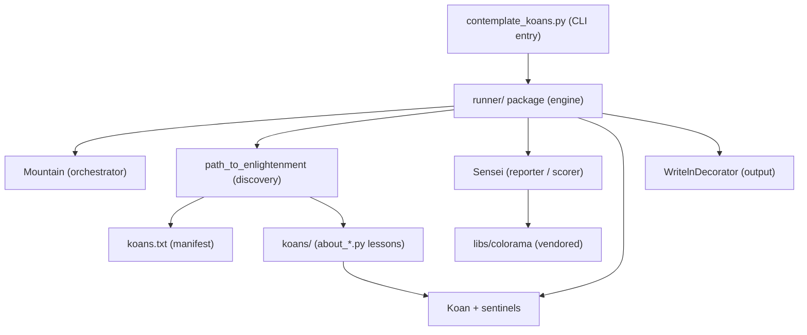
```mermaid
graph TD
    CLI["contemplate_koans.py (CLI entry)"] --> RUNNER["runner/ package (engine)"]
    RUNNER --> MOUNTAIN["Mountain (orchestrator)"]
    RUNNER --> P2E["path_to_enlightenment (discovery)"]
    RUNNER --> SENSEI["Sensei (reporter / scorer)"]
    RUNNER --> KOAN["Koan + sentinels"]
    RUNNER --> WLD["WritelnDecorator (output)"]
    P2E --> MANIFEST["koans.txt (manifest)"]
    P2E --> KOANS["koans/ (about_*.py lessons)"]
    SENSEI --> LIBS["libs/colorama (vendored)"]
    KOANS --> KOAN
```

### 1.2.3 Success Criteria

Python Koans is a learning tool, not a commercial service, so the repository does not define business-style SLAs or revenue KPIs. The success criteria below are therefore the objectives and indicators the system itself measures and enforces, each traceable to source.

**Measurable objectives.**

| Objective | Target / measure | Evidence |
|---|---|---|
| Complete the curriculum | 304 koans and 37 lessons made to pass | `runner/sensei.py`, `docs/guides/cli-usage.md` |
| Track learner progress | Progress line: `X (P %) koans` and `Y (out of Z=37) lessons`, where `P = X * 100 // 304` | `runner/sensei.py`, `docs/curriculum.md` |
| Signal completion via exit code | Non-zero exit while failures remain; success once all koans pass | `runner/sensei.py`, `docs/architecture/overview.md` |
| Keep the engine healthy | Runner self-tests (5 cases) pass in CI on Python 3.9 | `_runner_tests.py`, `.travis.yml` |

**Critical success factors.** The properties that must hold for the system to deliver its value are: the **zero-install** property (runs on the standard library alone, so no dependency setup can block a learner); **cross-platform** operation (Unix/macOS/Windows launchers plus vendored `colorama` for consistent color); **deterministic teaching order** (the manifest sequence is preserved end-to-end rather than sorted alphabetically); and a **supported interpreter** (Python 3.7–3.11, given the documented Python 3.12 `assertEquals` caveat) (`docs/guides/deployment.md`, `run.sh`, `run.bat`, `runner/path_to_enlightenment.py`).

**Key performance indicators (as computed by the system).** The runner surfaces exactly the indicators a learner and a CI system use to judge progress and health: the **koan completion percentage** and **lessons-completed count** printed after each run (`runner/sensei.py`), and the **pass/fail result of the runner self-tests** reported by Travis CI (`.travis.yml`, `_runner_tests.py`). On a fresh checkout these begin at "0 (0 %) koans and 0 (out of 37) lessons," as shown by the live-run example in `docs/guides/cli-usage.md`.

## 1.3 Scope

This subsection delineates what the Python Koans system does and does not encompass. The boundaries are drawn directly from the repository's behavior and its own documentation; where the documentation is explicit about exclusions (for example, that there is "no server to deploy"), that statement is treated as authoritative.

### 1.3.1 In-Scope

**Core features and functionalities.** The must-have capabilities are the execution and reporting behaviors delivered through the `contemplate_koans.py` entry point and the `runner/` engine.

| Category | In-scope elements | Evidence |
|---|---|---|
| Execution modes | Run the full curriculum; run a single lesson (`TestCase`); run a single test (`module.Class.test_method`) | `runner/mountain.py`, `docs/guides/cli-usage.md` |
| Feedback | Colorized progress summary (koan %/lesson counts), failure grouping, and zen closing message | `runner/sensei.py` |
| Continuous & CI runs | Sniffer file-watcher re-runs; Travis CI runs the runner self-tests | `scent.py`, `.travis.yml`, `_runner_tests.py` |
| Curriculum authoring | Ordered, plain-text manifest and the `about_*.py` fill-in-the-blank lessons with four sentinels | `koans.txt`, `koans/`, `runner/koan.py` |

**Primary user workflow.** The central workflow is the sentinel-driven TDD loop: the learner runs the koans, observes the first failure, edits the offending exercise — either by replacing a sentinel placeholder with the correct value or by implementing a small piece of logic (such as the triangle classifier or the Greed scoring function) — and re-runs until the koan passes, then advances (`README.rst`, `koans/triangle.py`, `koans/about_scoring_project.py`, `docs/architecture/overview.md`).

**Essential integrations.** Continuous integration via **Travis CI** (running the runner self-tests on Python 3.9), a one-click **Gitpod** cloud workspace, and **Sniffer** continuous testing are all in scope and configured in the repository (`.travis.yml`, `.gitpod.yml`, `.gitpod.Dockerfile`, `scent.py`).

**Key technical requirements.** A **Python 3 interpreter (3.7+ baseline)** is required; commands are run **from the repository root** so the manifest and the `koans/` package resolve; and the application must operate on the **standard library alone**, with terminal color supplied by the **vendored** `libs/colorama` (`docs/guides/deployment.md`, `docs/guides/cli-usage.md`, `runner/path_to_enlightenment.py`).

**Implementation boundaries.**

| Boundary dimension | Coverage | Evidence |
|---|---|---|
| System boundary | A local console application executed via a local shell, CI, a cloud workspace, or a file-watcher — no server or hosted backend | `docs/guides/deployment.md` |
| User groups | Learners (primary) and contributors/maintainers (developer-facing) | `docs/index.md`, `docs/contributing/development.md` |
| Market coverage | Globally available open-source project on GitHub; no geographic restriction; community translations welcomed | `README.rst` |
| Data domains | The `koans.txt` manifest, the `about_*.py` lesson modules and their kata support files, and the four sentinel placeholders | `koans.txt`, `koans/`, `runner/koan.py` |

### 1.3.2 Out-of-Scope

The following are explicitly excluded from the system as it exists in the repository.

| Excluded item | Why out of scope | Evidence |
|---|---|---|
| Server / hosting / deployment infrastructure | The project is a standard-library-only console app with "no server to deploy and no hosting infrastructure" | `docs/guides/deployment.md` |
| Runtime third-party dependencies | `pytest`, `pytest-testdox`, and `mock` in the Gitpod image are developer/CI aids, not runtime dependencies | `.gitpod.Dockerfile`, `docs/architecture/overview.md` |
| Answer keys / spoilers | Sentinels ship unsolved by design; the documentation never reveals answers | `docs/curriculum.md`, `runner/koan.py` |
| Python 2 execution | The entry point refuses to run the koans under Python 2 and directs the user to `python3` | `contemplate_koans.py` |
| Python 3.12+ compatibility fix | The removed `assertEquals` alias is documented as a known caveat, **not** fixed in this repository state | `docs/guides/deployment.md` |
| The declared Git submodule content | `Submodule_01_Do_not_use_15Jun` is referenced only via `.gitmodules`; its contents are not part of the koans system | `.gitmodules` |

**Future-phase considerations.** Two extension paths are documented but are not part of the current, delivered scope. First, updating the `assertEquals` usages so the self-tests and affected koans run on Python 3.12+ is described as a *separate code task* rather than work performed here (`docs/guides/deployment.md`). Second, extending the curriculum by adding a new `about_*.py` lesson and registering it in `koans.txt` is a supported contributor extension mechanism rather than a committed roadmap item (`docs/curriculum.md`, `docs/contributing/development.md`).

**Unsupported use cases.** Running the koans on an unsupported interpreter is not guaranteed: under Python versions older than 3.7 the tool prints a compatibility warning and continues on a best-effort basis, and under Python 3.12+ some lessons and the self-test harness are expected to error until the `assertEquals` usages are updated (`contemplate_koans.py`, `docs/guides/deployment.md`).

## 1.4 References

The following repository files and folders were examined as evidence for this Introduction.

**Files**

- `README.rst` - Project identity as a port of Ruby Koans, the fill-in-the-blank/TDD model, the architecture overview, the Python version policy, distribution, and maintainer acknowledgments.
- `contemplate_koans.py` - CLI entry point; the Python 2 refusal and sub-3.7 warning version gate; the lazy handoff to `runner.mountain.Mountain().walk_the_path(sys.argv)`.
- `koans.txt` - The ordered curriculum manifest of 39 `TestCase` entries (line 1 comment; entries on lines 2–40).
- `run.sh` - Unix/macOS launcher invoking `python3 -B contemplate_koans.py`.
- `run.bat` - Windows launcher (interpreter discovery, `PYTHON_PATH`, re-run loop).
- `scent.py` - Sniffer continuous-testing configuration (watches `.` and `koans/`, re-runs the koans on `.py` change).
- `.travis.yml` - Travis CI configuration: Python 3.9 running `python _runner_tests.py`.
- `_runner_tests.py` - Runner self-test harness assembling the five self-test cases for CI.
- `.gitmodules` - Declares the single `Submodule_01_Do_not_use_15Jun` submodule.
- `.gitpod.yml` - Gitpod workspace task auto-running `python contemplate_koans.py`.
- `.gitpod.Dockerfile` - Gitpod image and developer/CI tooling (`pytest`, `pytest-testdox`, `mock`) that are not runtime dependencies.
- `Contributor Notes.txt` - Command examples for running a single lesson or a single test.
- `runner/mountain.py` - The `Mountain` orchestrator: wiring, run narrowing, and execution.
- `runner/path_to_enlightenment.py` - Manifest discovery/loading; `KOANS_FILENAME`; order-preserving suite assembly.
- `runner/sensei.py` - Reporting/scoring engine; verified `total_koans()`=304 and `total_lessons()`=37 counting logic and the progress line.
- `runner/koan.py` - The `Koan(unittest.TestCase)` base class and the four sentinels.
- `runner/mockable_test_result.py` - `MockableTestResult(unittest.TestResult)`, the concrete result shim.
- `runner/runner_tests/test_helper.py` - Location of the `assertEquals` calls behind the Python 3.12 caveat.
- `koans/triangle.py` - The triangle classifier stub and `TriangleError` (implement-real-logic example).
- `koans/about_scoring_project.py` - The Greed scoring exercise (implement-real-logic example).
- `koans/about_iteration.py`, `koans/about_regex.py` - Koans that still use `assertEquals` (Python 3.12 impact).
- `docs/index.md` - Documentation home; "standard-library-only, test-driven" framing and the developer/user audience.
- `docs/curriculum.md` - Authoritative manifest reference; the 39/304/37 counts and sentinel semantics.
- `docs/architecture/overview.md` - Three-package layering, manifest-driven discovery, the `unittest` substrate, and control flow.
- `docs/guides/cli-usage.md` - The command-line contract and the live-run progress-summary example.
- `docs/guides/deployment.md` - Execution environments, Python version policy, and the documented Python 3.12 `assertEquals` caveat.
- `docs/getting-started/first-steps.md` - First-run onboarding and reading the progress summary.
- `docs/contributing/development.md` - Contributor workflow for adding/registering lessons.

**Folders**

- `runner/` - The engine package (orchestration, discovery, reporting, base test type, output wrapping, self-tests).
- `koans/` - The curriculum package of `about_*.py` lessons plus kata and support modules.
- `libs/` - Vendored support code (`libs/mock.py`) enabling zero-install operation.
- `libs/colorama/` - Vendored cross-platform terminal-color library used by `Sensei`.
- `docs/` - The documentation tree (onboarding, architecture, curriculum, CLI usage, deployment, contribution, API reference).

**Runtime verification**

- Independent execution of the runner discovery/counting logic under Python 3.12.3 confirmed the runtime figures (39 manifest entries, 37 lessons, 304 koans) and reproduced the documented Python 3.12 `SyntaxWarning`s.

# 2. Product Requirements

## 2.1 Feature Catalog

This section decomposes Python Koans into discrete, testable features. Each feature is grounded directly in the repository's source; no capability is documented that is not observable in the code. The catalog aligns with the capability inventory in Section 1.2.2 (System Overview) and the in-scope boundaries in Section 1.3.1 (Scope).

**Identification and grading scheme.** Features are numbered `F-001` through `F-011`. Functional requirements (Section 2.2) use the derived form `F-XXX-RQ-YYY`. Two graded attributes are applied to every feature:

- **Priority Level** (Critical / High / Medium / Low) expresses how essential the feature is to the system's core purpose — letting a learner make failing koans pass and observe progress. Priority is inferred from the code's control flow and the documented scope, **not** from a product roadmap.
- **Status** (Proposed / Approved / In Development / Completed) reflects the observed state of the checked-out repository. Because this specification documents an existing, working codebase, every catalogued feature is present and functional and is therefore marked **Completed**.

**Assumptions and constraints.**

- **A-1:** Python Koans is a learning tool, not a commercial service; consistent with Section 1.2.3, the repository defines **no business SLAs, revenue KPIs, or availability targets**. "Performance" and "acceptance" criteria in this section are the deterministic, observable behaviors the code itself enforces.
- **A-2:** All features run on the **Python 3 standard library plus the vendored `libs/`** only; there are no runtime third-party dependencies (`docs/architecture/overview.md`).
- **C-1:** The supported interpreter range is **Python 3.7–3.11**; features that call the removed `unittest` `assertEquals` alias exhibit a documented failure on Python 3.12+ (see F-007, F-010 and Section 1.2.1).
- **C-2:** Commands must be executed from the **repository root** so that `koans.txt` and the `koans/` package resolve (`docs/guides/cli-usage.md`).
- **Requirement version:** This catalog reflects repository state **v1.0 (as-checked-out)**; there is no separate versioned requirements register in the source.

**Feature index.**

| Feature ID | Feature Name | Category | Priority |
|---|---|---|---|
| F-001 | Command-Line Entry Point & Python Version Gating | Application Bootstrap / CLI | Critical |
| F-002 | Manifest-Driven Curriculum Discovery & Suite Assembly | Curriculum Discovery | Critical |
| F-003 | Path Orchestration & Test Execution | Test Orchestration | Critical |
| F-004 | Progress Tracking & Enlightenment Reporting | Progress & Reporting | Critical |
| F-005 | Cross-Platform Colorized Terminal Output | Presentation / Output | High |
| F-006 | Koan Base Class & Sentinel Markers | Exercise Framework | Critical |
| F-007 | Koan Curriculum & Coding Katas | Curriculum Content | Critical |
| F-008 | Zero-Install Vendored Support Libraries | Dependency Management | High |
| F-009 | Continuous Testing (Sniffer) | Developer Tooling | Low |
| F-010 | Runner Self-Test Regression Suite | Engine Quality | High |
| F-011 | CI & Cloud Workspace Integration | CI / Environments | Medium |

### 2.1.1 F-001 — Command-Line Entry Point & Python Version Gating

| Attribute | Value |
|---|---|
| Unique ID | F-001 |
| Feature Name | Command-Line Entry Point & Python Version Gating |
| Feature Category | Application Bootstrap / CLI |
| Priority Level | Critical |
| Status | Completed |

**Description.**

- **Overview:** `contemplate_koans.py` is the single command a learner runs to "walk the path." It validates the interpreter version, then lazily bootstraps the runner engine. OS launchers `run.sh` (`python3 -B contemplate_koans.py`) and `run.bat` provide platform-native shortcuts.
- **Business Value:** Establishes one consistent starting command across Unix, macOS, and Windows, and prevents confusing downstream failures by rejecting or warning about unsupported interpreters up front.
- **User Benefits:** A learner needs to remember only one command; running under the wrong interpreter yields a clear, actionable message rather than an obscure stack trace.
- **Technical Context:** Under an `if __name__ == '__main__'` guard, `sys.version_info < (3, 0)` prints a Python 2 error and does **not** run the koans; `sys.version_info < (3, 7)` prints a compatibility warning and continues; the engine is then imported lazily (`from runner.mountain import Mountain`) and started with `Mountain().walk_the_path(sys.argv)` (`contemplate_koans.py` L35–L61).

**Dependencies.**

- **Prerequisite Features:** None — this is the root of the control flow.
- **System Dependencies:** The `runner/` engine, specifically `runner.mountain.Mountain` (F-003).
- **External Dependencies:** A Python 3 interpreter and the standard-library `sys` module.
- **Integration Requirements:** Invoked by `run.sh`, `run.bat`, the Sniffer action in `scent.py` (F-009), and the Gitpod task in `.gitpod.yml` (F-011).

### 2.1.2 F-002 — Manifest-Driven Curriculum Discovery & Suite Assembly

| Attribute | Value |
|---|---|
| Unique ID | F-002 |
| Feature Name | Manifest-Driven Curriculum Discovery & Suite Assembly |
| Feature Category | Curriculum Discovery |
| Priority Level | Critical |
| Status | Completed |

**Description.**

- **Overview:** `runner/path_to_enlightenment.py` reads the plain-text `koans.txt` manifest, filters out comments and blanks, and assembles a `unittest.TestSuite` from the named `TestCase`s while preserving manifest order.
- **Business Value:** The curriculum is data-driven rather than hard-coded, so lessons can be added, removed, or re-sequenced by editing a single text file with no engine changes.
- **User Benefits:** Guarantees a deterministic, pedagogically ordered learning path; enables contributors to extend the curriculum through the documented "add a lesson + register it in `koans.txt`" mechanism (`docs/curriculum.md`).
- **Technical Context:** `KOANS_FILENAME = 'koans.txt'`; `filter_koan_names` strips whitespace and skips `#`-comment and blank lines; `names_from_file` opens the manifest as UTF-8; `koans_suite` sets `loader.sortTestMethodsUsing = None` to preserve order and loads each name via `loadTestsFromName`; `koans()` returns the assembled suite (`runner/path_to_enlightenment.py` L14–L62). The 39-entry manifest yields 304 koans.

**Dependencies.**

- **Prerequisite Features:** F-006 (the referenced `TestCase`s derive from `Koan`) and F-007 (the lesson modules named in the manifest must exist).
- **System Dependencies:** `unittest.TestLoader` / `TestSuite`; the `koans.txt` manifest; the importable `koans/` package.
- **External Dependencies:** Python standard library (`io`, `unittest`).
- **Integration Requirements:** Consumed by `Mountain.__init__` and `Sensei.__init__`, both of which call `path_to_enlightenment.koans()`.

### 2.1.3 F-003 — Path Orchestration & Test Execution

| Attribute | Value |
|---|---|
| Unique ID | F-003 |
| Feature Name | Path Orchestration & Test Execution |
| Feature Category | Test Orchestration |
| Priority Level | Critical |
| Status | Completed |

**Description.**

- **Overview:** `runner/mountain.py` defines `Mountain`, the small engine that wires together the output stream, the ordered koan suite, and the `Sensei` reporter, then runs the suite — either the full curriculum or a single named lesson/test — and prints the final report card.
- **Business Value:** Provides the run-and-report loop that is the product's central interaction, plus the ability to focus on one lesson at a time.
- **User Benefits:** Learners run all koans with no arguments, or narrow to a single lesson (`about_strings`) or a single test (`about_strings.AboutStrings.test_...`) to iterate quickly.
- **Technical Context:** `Mountain.__init__` builds `WritelnDecorator(sys.stdout)`, loads `path_to_enlightenment.koans()`, and creates `Sensei(self.stream)`. `walk_the_path(args)` narrows the run when `args and len(args) >= 2` via `unittest.TestLoader().loadTestsFromName("koans." + args[1])`, then executes `self.tests(self.lesson)` and calls `self.lesson.learn()` (`runner/mountain.py` L23–L60).

**Dependencies.**

- **Prerequisite Features:** F-001 (invokes it), F-002 (supplies the default suite), F-004 (`Sensei` reporter), F-005 (`WritelnDecorator` stream).
- **System Dependencies:** `unittest.TestLoader`; the `koans.` import namespace for narrowed runs.
- **External Dependencies:** Python standard library (`unittest`, `sys`).
- **Integration Requirements:** Receives `sys.argv` from `contemplate_koans.py`; returns the `Sensei` instance to its caller.

### 2.1.4 F-004 — Progress Tracking & Enlightenment Reporting

| Attribute | Value |
|---|---|
| Unique ID | F-004 |
| Feature Name | Progress Tracking & Enlightenment Reporting |
| Feature Category | Progress & Reporting |
| Priority Level | Critical |
| Status | Completed |

**Description.**

- **Overview:** `runner/sensei.py` defines `Sensei`, a `unittest` result object that converts a run into learner-facing feedback: per-lesson "Thinking" banners, pass acknowledgements, a first-failure spotlight, a koan/lesson progress line, a "work remaining" line, and a closing Zen aphorism, ending in an exit code that signals completion.
- **Business Value:** Turns raw test output into a graded, motivating "report card" and a machine-readable success signal (exit status) usable by CI.
- **User Benefits:** After every run the learner sees exactly how many koans/lessons are done, which single failing koan to fix next, and — on completion — a congratulatory message pointing to extra credit.
- **Technical Context:** `Sensei(MockableTestResult)` tracks `pass_count` and `lesson_pass_count` (excluding `AboutAsserts` and `AboutExtraCredit` from lesson counting); `passesCount()` stops counting passes once a failure occurs in a different lesson; `learn()` prints the report and calls `sys.exit(-1)` while failures remain. `report_progress()` emits `"You have completed X (P %) koans and Y (out of Z) lessons."` where `P = pass_count*100//total_koans()`; `total_koans()` (= `self.tests.countTestCases()`, runtime 304) and `total_lessons()` (= `len(filter_all_lessons())`, runtime 37) supply the totals (`runner/sensei.py` L32–L456).

**Dependencies.**

- **Prerequisite Features:** F-002 (loads its totals suite via `koans()`), F-005 (writes through the decorated stream), F-008 (`libs.colorama` for color).
- **System Dependencies:** `runner/mockable_test_result.py` (`MockableTestResult`), `runner/helper.py` (`cls_name`), `unittest`, `re`, `os`, `glob`.
- **External Dependencies:** Python standard library only.
- **Integration Requirements:** Instantiated and driven by `Mountain`; its exit code is consumed by shells and CI.

### 2.1.5 F-005 — Cross-Platform Colorized Terminal Output

| Attribute | Value |
|---|---|
| Unique ID | F-005 |
| Feature Name | Cross-Platform Colorized Terminal Output |
| Feature Category | Presentation / Output |
| Priority Level | High |
| Status | Completed |

**Description.**

- **Overview:** Output is written through `runner/writeln_decorator.py`'s `WritelnDecorator` (a thin file-like wrapper adding a `writeln` method) and colorized via the vendored `libs/colorama` palette (`Fore`, `Style`).
- **Business Value:** Delivers a consistent, readable, colorized experience across Unix, macOS, and Windows terminals without requiring a separate install.
- **User Benefits:** Passing koans appear in green, banners and progress stand out, and Windows terminals render ANSI color correctly through colorama.
- **Technical Context:** `WritelnDecorator.__init__` retains the wrapped `sys.stdout`; `__getattr__` delegates unknown attributes to the stream; `writeln(arg)` writes the optional argument then `'\n'` (text-mode translates to CRLF as needed) (`runner/writeln_decorator.py` L8–L31). `Sensei` imports `init, Fore, Style` from `libs.colorama` (`runner/sensei.py` L14).

**Dependencies.**

- **Prerequisite Features:** F-008 (supplies `libs/colorama`).
- **System Dependencies:** `sys`, `os`; `libs/colorama` (`init`, `Fore`, `Back`, `Style`, `AnsiToWin32`).
- **External Dependencies:** None beyond the vendored library.
- **Integration Requirements:** `WritelnDecorator` is instantiated by `Mountain.__init__` and passed to `Sensei`; all learner-facing text flows through it.

### 2.1.6 F-006 — Koan Base Class & Sentinel Markers

| Attribute | Value |
|---|---|
| Unique ID | F-006 |
| Feature Name | Koan Base Class & Sentinel Markers |
| Feature Category | Exercise Framework |
| Priority Level | Critical |
| Status | Completed |

**Description.**

- **Overview:** `runner/koan.py` defines the exercise surface: the `Koan(unittest.TestCase)` base type every lesson extends, and four sentinel placeholders that ship as deliberately-wrong values so an un-edited koan fails.
- **Business Value:** Encodes the sentinel-driven TDD model — the mechanism that makes every koan start "red" and the "no spoilers" guarantee that answers are never shipped.
- **User Benefits:** Learners get a uniform, `import *`-friendly vocabulary (`__`, `___`, `____`, `_____`, `Koan`) and an unmistakable signal (the sentinel value or a failing assertion) of what remains to be filled in.
- **Technical Context:** `__all__ = ["__", "___", "____", "_____", "Koan"]`; `__ = "-=> FILL ME IN! <=-"` (string placeholder); `class ___(Exception)` (expected-exception placeholder); `____ = "-=> TRUE OR FALSE? <=-"` (boolean placeholder); `_____ = 0` (numeric placeholder); `class Koan(unittest.TestCase)` has an empty body and exists only to give lessons a shared base type (`runner/koan.py` L21–L67).

**Dependencies.**

- **Prerequisite Features:** None.
- **System Dependencies:** `unittest`, `re` (standard library).
- **External Dependencies:** None.
- **Integration Requirements:** Imported by every lesson via `from runner.koan import *`; the `Koan` subclasses are what F-002 discovers and F-003 executes.

### 2.1.7 F-007 — Koan Curriculum & Coding Katas

| Attribute | Value |
|---|---|
| Unique ID | F-007 |
| Feature Name | Koan Curriculum & Coding Katas |
| Feature Category | Curriculum Content |
| Priority Level | Critical |
| Status | Completed |

**Description.**

- **Overview:** The `koans/` package holds the `about_*.py` fill-in-the-blank lessons (from `about_asserts` through `about_regex`) plus larger coding katas that require implementing real logic: the triangle classifier (`triangle.py`), the Greed scoring function (`about_scoring_project.py`), the dice set (`about_dice_project.py`), and the proxy object (`about_proxy_object_project.py`).
- **Business Value:** This is the actual teaching content — the graded sequence that carries a learner from basic assertions through strings, collections, control flow, classes, inheritance, decorators, generators, modules/packages, and regular expressions.
- **User Benefits:** A progressive, self-paced syllabus mixing quick blank-filling exercises with more substantial "write the method" challenges that reinforce design and TDD.
- **Technical Context:** Lessons `from runner.koan import *` and subclass `Koan` (e.g., `koans/about_asserts.py`). Katas ship as unimplemented stubs — `triangle(a, b, c)` returns nothing until written (`koans/triangle.py` L19–L21); `score(dice)` and `DiceSet.roll(n)` are `pass` stubs; `Proxy` must add attribute forwarding and recording. Several lessons still call the deprecated `assertEquals` alias (`koans/about_iteration.py` L83; `koans/about_regex.py` L85, L111, L138), the source of the Python 3.12 caveat (Section 1.2.1).

**Dependencies.**

- **Prerequisite Features:** F-006 (sentinels and `Koan` base).
- **System Dependencies:** `koans.txt` registration (F-002); helper modules inside `koans/` (e.g., `local_module.py`, `jims.py`, `joes.py`, `a_package_folder/`); `random` for the dice kata.
- **External Dependencies:** None (standard library only).
- **Integration Requirements:** Registered in `koans.txt`; discovered and executed by F-002/F-003; scored by F-004.

### 2.1.8 F-008 — Zero-Install Vendored Support Libraries

| Attribute | Value |
|---|---|
| Unique ID | F-008 |
| Feature Name | Zero-Install Vendored Support Libraries |
| Feature Category | Dependency Management |
| Priority Level | High |
| Status | Completed |

**Description.**

- **Overview:** The `libs/` package vendors the third-party code the application needs at runtime — `colorama` (cross-platform terminal color) and a `mock.py` test-double toolkit — so no `pip install` is required.
- **Business Value:** Delivers the project's defining "zero-install, standard-library-only" property, removing dependency setup as a barrier to entry.
- **User Benefits:** A learner clones the repository and runs one command; there is no environment to provision and nothing to break due to version drift.
- **Technical Context:** `libs/colorama/__init__.py` re-exports `init, deinit, reinit, Fore, Back, Style, AnsiToWin32` and declares `VERSION = '0.2.7'`; `libs/mock.py` exposes `__all__ = ('Mock', 'patch', 'patch_object', 'sentinel', 'DEFAULT')` at `__version__ = '0.6.0 modified by Greg Malcolm'`. The runtime path uses only `libs/colorama` (via `Sensei`); `libs/mock` is used by the runner self-tests (F-010).

**Dependencies.**

- **Prerequisite Features:** None.
- **System Dependencies:** Present on `sys.path` under the repository root so `from libs.colorama import ...` and `from libs.mock import *` resolve.
- **External Dependencies:** None — these are the vendored copies that avoid external dependencies.
- **Integration Requirements:** `libs/colorama` consumed by F-005/F-004; `libs/mock` consumed by F-010's self-tests.

### 2.1.9 F-009 — Continuous Testing (Sniffer)

| Attribute | Value |
|---|---|
| Unique ID | F-009 |
| Feature Name | Continuous Testing (Sniffer) |
| Feature Category | Developer Tooling |
| Priority Level | Low |
| Status | Completed |

**Description.**

- **Overview:** `scent.py` configures the external **Sniffer** file-watcher to re-run the koans automatically whenever a watched Python file changes.
- **Business Value:** Tightens the edit → run → observe loop for learners and contributors who prefer automatic feedback.
- **User Benefits:** Save a file and the koans re-run without retyping the command, giving near-immediate feedback.
- **Technical Context:** `watch_paths = ['.', 'koans/']`; the `@file_validator` `py_files` reacts only to non-hidden `.py` files; the `@runnable` `execute_koans` shells out via `os.system('python3 -B contemplate_koans.py')` (`scent.py` L37–L47). The module's docstring is explicit that Sniffer is an **optional, separately installed** developer tool (`pip install sniffer`) and **not** a runtime dependency.
- 
**Dependencies.**

- **Prerequisite Features:** F-001 (the command it re-runs).
- **System Dependencies:** `os` (standard library).
- **External Dependencies:** Sniffer (`from sniffer.api import *`), installed separately — the only feature that imports a non-vendored third-party package, and only for this optional developer workflow.
- **Integration Requirements:** Discovered by the Sniffer CLI when run from the repository root; invokes `contemplate_koans.py`.

### 2.1.10 F-010 — Runner Self-Test Regression Suite

| Attribute | Value |
|---|---|
| Unique ID | F-010 |
| Feature Name | Runner Self-Test Regression Suite |
| Feature Category | Engine Quality |
| Priority Level | High |
| Status | Completed |

**Description.**

- **Overview:** `_runner_tests.py` and the `runner/runner_tests/` package verify the **engine itself** (orchestration, discovery, reporting) as distinct from the learner-solved koans.
- **Business Value:** Protects the runner from regressions and provides the exact pass/fail signal that continuous integration checks.
- **User Benefits:** Contributors editing the engine or curriculum get a fast regression check; the green CI badge assures users the tool works.
- **Technical Context:** `_runner_tests.py` assembles one `unittest.TestSuite` from five test cases — `TestMountain`, `TestSensei`, `TestHelper`, `TestFilterKoanNames`, `TestKoansSuite` — via `loadTestsFromTestCase`, then runs it with `TextTestRunner(verbosity=2)` and exits `not res.wasSuccessful()` (`_runner_tests.py` L32–L60). The suites `test_mountain.py`/`test_sensei.py` use `from libs.mock import *`. On Python 3.12 the command fails because `test_helper.py` (L14, L17) uses the removed `assertEquals` alias — a documented caveat, not a fix.

**Dependencies.**

- **Prerequisite Features:** F-002, F-003, F-004 (the engine components under test), F-008 (`libs/mock`).
- **System Dependencies:** `unittest`; the `runner.runner_tests` package.
- **External Dependencies:** None at runtime (uses vendored `libs/mock`).
- **Integration Requirements:** Executed by Travis CI as `python _runner_tests.py` (F-011).

### 2.1.11 F-011 — CI & Cloud Workspace Integration

| Attribute | Value |
|---|---|
| Unique ID | F-011 |
| Feature Name | CI & Cloud Workspace Integration |
| Feature Category | CI / Environments |
| Priority Level | Medium |
| Status | Completed |

**Description.**

- **Overview:** Repository configuration wires Python Koans into two external environments: **Travis CI** (runs the runner self-tests) and **Gitpod** (a one-click cloud workspace that auto-runs the koans).
- **Business Value:** Provides automated verification of the engine on every push and a zero-setup way for newcomers to try the koans in the browser.
- **User Benefits:** Contributors get automatic CI feedback and can open a ready-to-run workspace; forkers can optionally enable Travis to display which koans they have passed.
- **Technical Context:** `.travis.yml` sets `language: python`, `python: [3.9]`, and `script: python _runner_tests.py`, with email notifications and commented-out alternatives that run `contemplate_koans.py`. `.gitpod.yml` builds from `.gitpod.Dockerfile` and defines the task `python contemplate_koans.py`, with master-branch prebuilds; `.gitpod.Dockerfile` is `FROM gitpod/workspace-full:latest` and `RUN pip3 install pytest==4.4.2 pytest-testdox mock` — developer/CI aids, **not** runtime dependencies.

**Dependencies.**

- **Prerequisite Features:** F-010 (Travis runs the self-tests); F-001 (Gitpod runs the entry point).
- **System Dependencies:** `.travis.yml`, `.gitpod.yml`, `.gitpod.Dockerfile`.
- **External Dependencies:** The hosted Travis CI and Gitpod platforms; the `gitpod/workspace-full` base image.
- **Integration Requirements:** GitHub repository hosting (`gregmalcolm/python_koans`) for both CI triggers and Gitpod prebuilds.

## 2.2 Functional Requirements

This section enumerates the testable requirements for each feature in Section 2.1. Requirement IDs follow the form `F-XXX-RQ-YYY`. For each feature: a **Requirements** table lists ID, description, MoSCoW priority, and complexity; **Acceptance criteria** are listed per requirement as verifiable conditions; a **Technical specifications** table records inputs, outputs, performance, and data; and a **Validation rules** table records business, data, security, and compliance rules. Consistent with Section 1.2.3, "performance criteria" are the deterministic behaviors the code enforces — the repository defines no timing SLAs.

### 2.2.1 F-001 — Command-Line Entry Point & Python Version Gating

| Requirement ID | Description | Priority | Complexity |
|---|---|---|---|
| F-001-RQ-001 | Provide a single CLI entry point that runs the koans | Must-Have | Low |
| F-001-RQ-002 | Refuse to run under Python 2 | Must-Have | Low |
| F-001-RQ-003 | Warn (but continue) under Python < 3.7 | Should-Have | Low |
| F-001-RQ-004 | Bootstrap the engine only after the version gate passes | Must-Have | Low |

**Acceptance criteria.**

- **F-001-RQ-001:** `python3 contemplate_koans.py` with no extra arguments executes the full suite and prints a report card (`contemplate_koans.py` L61).
- **F-001-RQ-002:** Under `sys.version_info < (3, 0)` the Python 2 message is printed and the koans do **not** run (`contemplate_koans.py` L38–L42).
- **F-001-RQ-003:** Under `(3,0) <= version < (3,7)` the compatibility warning is printed and execution continues (`contemplate_koans.py` L45–L54).
- **F-001-RQ-004:** `from runner.mountain import Mountain` and `Mountain().walk_the_path(sys.argv)` occur only in the non-Python-2 branch (`contemplate_koans.py` L59–L61).

| Technical Specification | Detail |
|---|---|
| Input Parameters | `sys.argv` (script name + optional lesson/test name); `sys.version_info` |
| Output / Response | Version message(s) to stdout; delegates learner output to the engine; process exit code from `Sensei.learn()` |
| Performance Criteria | Single one-shot CLI process; no steady-state timing target defined in the repository |
| Data Requirements | None beyond `sys.argv` / `sys.version_info` |

| Validation Rule | Specification |
|---|---|
| Business Rules | Python 3 required; Python 2 refused; < 3.7 is best-effort with a warning |
| Data Validation | `sys.version_info` compared against the tuples `(3, 0)` and `(3, 7)` |
| Security Requirements | Runs with the invoking user's privileges; no network, secrets, or credential handling |
| Compliance Requirements | None applicable (educational open-source CLI) |

### 2.2.2 F-002 — Manifest-Driven Curriculum Discovery & Suite Assembly

| Requirement ID | Description | Priority | Complexity |
|---|---|---|---|
| F-002-RQ-001 | Parse `koans.txt`, ignoring comment and blank lines | Must-Have | Low |
| F-002-RQ-002 | Assemble a `TestSuite` that preserves manifest order | Must-Have | Medium |
| F-002-RQ-003 | Expose `koans()` returning the full ordered suite | Must-Have | Low |

**Acceptance criteria.**

- **F-002-RQ-001:** Lines beginning with `#` and blank lines are skipped; the remaining 39 lines are treated as fully-qualified `TestCase` names (`runner/path_to_enlightenment.py` L17–L28; verified 39 non-comment entries in `koans.txt`).
- **F-002-RQ-002:** `loader.sortTestMethodsUsing = None` is set so lessons run in listed order, not alphabetically (`runner/path_to_enlightenment.py` L48–L52).
- **F-002-RQ-003:** `koans()` returns a `unittest.TestSuite` whose `countTestCases()` equals 304 for the shipped manifest (`runner/path_to_enlightenment.py` L56–L62; `runner/sensei.py` L429–L437).

| Technical Specification | Detail |
|---|---|
| Input Parameters | `filename` (default `KOANS_FILENAME = 'koans.txt'`); manifest contents read as UTF-8 |
| Output / Response | A `unittest.TestSuite` of loaded `TestCase`s in manifest order |
| Performance Criteria | Linear in manifest lines; single file read; no explicit timing target |
| Data Requirements | `koans.txt` (39 entries); importable `koans.*` lesson modules |

| Validation Rule | Specification |
|---|---|
| Business Rules | Manifest order is the authoritative teaching order; `about_proxy_object_project` intentionally contributes two entries |
| Data Validation | `line.strip()`, `line.startswith('#')`, and truthiness filter names; file opened `encoding='utf8'` |
| Security Requirements | Names are passed to `loadTestsFromName`, importing arbitrary `koans.*` modules; the trust boundary is the repository contents |
| Compliance Requirements | None |

### 2.2.3 F-003 — Path Orchestration & Test Execution

| Requirement ID | Description | Priority | Complexity |
|---|---|---|---|
| F-003-RQ-001 | Run the full curriculum when no lesson name is supplied | Must-Have | Low |
| F-003-RQ-002 | Narrow the run to a single lesson or test when a name is supplied | Must-Have | Medium |
| F-003-RQ-003 | Drive the reporter and return it | Must-Have | Low |

**Acceptance criteria.**

- **F-003-RQ-001:** With fewer than two `args` elements, the default `koans()` suite runs against `Sensei` (`runner/mountain.py` L35, L55–L58).
- **F-003-RQ-002:** With `args and len(args) >= 2`, the suite is replaced by `loadTestsFromName("koans." + args[1])`; e.g., `about_strings` runs only that `TestCase`, and `about_strings.AboutStrings.test_x` runs one test (`runner/mountain.py` L55–L56).
- **F-003-RQ-003:** `self.tests(self.lesson)` executes the suite, `self.lesson.learn()` prints the report, and `walk_the_path` returns the `Sensei` (`runner/mountain.py` L58–L60).

| Technical Specification | Detail |
|---|---|
| Input Parameters | `args` list (`sys.argv`); the loaded suite; the `Sensei` result object |
| Output / Response | Console report via `Sensei`; return value = `Sensei` instance; process exit via `Sensei.learn()` |
| Performance Criteria | Runs all 304 koans (or the narrowed subset) in a single in-process pass; no explicit time budget |
| Data Requirements | `koans.` import namespace; the `koans.txt`-derived default suite |

| Validation Rule | Specification |
|---|---|
| Business Rules | `args[1]` is the selector; the `koans.` prefix is prepended automatically (pass `about_strings`, not `koans.about_strings`) |
| Data Validation | `if args and len(args) >= 2` guards the narrowing branch |
| Security Requirements | Loads and executes only `koans.*` test code from the repository |
| Compliance Requirements | None |

### 2.2.4 F-004 — Progress Tracking & Enlightenment Reporting

| Requirement ID | Description | Priority | Complexity |
|---|---|---|---|
| F-004-RQ-001 | Count passing koans and cleared lessons | Must-Have | Medium |
| F-004-RQ-002 | Print the progress line and the work-remaining line | Must-Have | Low |
| F-004-RQ-003 | Spotlight the first failing koan of the current lesson | Must-Have | Medium |
| F-004-RQ-004 | Signal completion through the process exit code | Must-Have | Low |

**Acceptance criteria.**

- **F-004-RQ-001:** `pass_count` increments on each counted success; `lesson_pass_count` increments per newly seen lesson, excluding `AboutAsserts` and `AboutExtraCredit` (`runner/sensei.py` L72–L73, L92).
- **F-004-RQ-002:** Emits `"You have completed X (P %) koans and Y (out of Z) lessons."` with `P = X*100//total_koans()` and `Z = total_lessons()` (37); while failures remain, also prints the "N koans and M lessons away from reaching enlightenment" line (`runner/sensei.py` L304–L337).
- **F-004-RQ-003:** `firstFailure()` returns the earliest failure by parsed source line for the current lesson (`runner/sensei.py` L130–L173).
- **F-004-RQ-004:** `learn()` calls `sys.exit(-1)` while any failures remain; on full success it prints the "That was the last one, well done!" banner pointing to `about_extra_credit.py` and exits normally (`runner/sensei.py` L175–L206).

| Technical Specification | Detail |
|---|---|
| Input Parameters | `unittest` callbacks (`startTest`, `addSuccess`, `addError`, `addFailure`) with `test`/`err`; the loaded suite for totals |
| Output / Response | Per-lesson banners, pass lines, first-failure report, progress/remaining lines, Zen aphorism; process exit code |
| Performance Criteria | O(1) per test callback; per-lesson failure sorting parses the traceback line number via regex |
| Data Requirements | `total_koans()` = `self.tests.countTestCases()` (304); `total_lessons()` = glob `koans/about*.py` minus `about_extra_credit` (37) |

| Validation Rule | Specification |
|---|---|
| Business Rules | `AboutAsserts` and `AboutExtraCredit` excluded from the lesson tally; passes stop counting after a failure in a different lesson (`passesCount`) |
| Data Validation | Regex `(?<= line )\d+` extracts the failing source-line number from traceback text |
| Security Requirements | Reads the local filesystem via `glob` relative to the package; no external I/O |
| Compliance Requirements | "No spoilers" — the report never reveals koan answers |

### 2.2.5 F-005 — Cross-Platform Colorized Terminal Output

| Requirement ID | Description | Priority | Complexity |
|---|---|---|---|
| F-005-RQ-001 | Provide a `writeln`-capable file-like stream wrapper | Must-Have | Low |
| F-005-RQ-002 | Colorize learner output consistently across platforms | Should-Have | Low |

**Acceptance criteria.**

- **F-005-RQ-001:** `WritelnDecorator(sys.stdout).writeln("x")` writes `"x"` followed by a newline; unknown attribute access is delegated to the wrapped stream (`runner/writeln_decorator.py` L16–L31).
- **F-005-RQ-002:** `Sensei` uses `libs.colorama` `Fore`/`Style` (e.g., green `Fore.GREEN`/`Style.BRIGHT` success lines); colorama renders ANSI color correctly on Windows terminals (`runner/sensei.py` L14, L88–L90).

| Technical Specification | Detail |
|---|---|
| Input Parameters | A file-like stream (`sys.stdout`); optional string argument to `writeln` |
| Output / Response | Text with a trailing newline; colorized via ANSI codes from colorama |
| Performance Criteria | Thin pass-through wrapper; negligible overhead |
| Data Requirements | colorama palette constants (`Fore`, `Back`, `Style`) |

| Validation Rule | Specification |
|---|---|
| Business Rules | All learner-facing text flows through the decorated stream |
| Data Validation | `if arg:` guards the optional write before appending the newline |
| Security Requirements | Writes only to the provided stream; no external I/O |
| Compliance Requirements | None |

### 2.2.6 F-006 — Koan Base Class & Sentinel Markers

| Requirement ID | Description | Priority | Complexity |
|---|---|---|---|
| F-006-RQ-001 | Export the sentinels and `Koan` via `import *` | Must-Have | Low |
| F-006-RQ-002 | Ship deliberately-wrong sentinel placeholder values | Must-Have | Low |
| F-006-RQ-003 | Provide a shared `Koan` base test type | Must-Have | Low |

**Acceptance criteria.**

- **F-006-RQ-001:** `from runner.koan import *` binds exactly `__`, `___`, `____`, `_____`, `Koan` per `__all__` (`runner/koan.py` L21).
- **F-006-RQ-002:** `__ == "-=> FILL ME IN! <=-"`, `____ == "-=> TRUE OR FALSE? <=-"`, `_____ == 0`, and `___` is an `Exception` subclass, so an un-edited koan referencing them fails (`runner/koan.py` L34–L53).
- **F-006-RQ-003:** `Koan` subclasses `unittest.TestCase` and every lesson subclasses `Koan` (`runner/koan.py` L56–L67).

| Technical Specification | Detail |
|---|---|
| Input Parameters | None (module-level definitions) |
| Output / Response | Module attributes `__`, `___`, `____`, `_____`, `Koan` |
| Performance Criteria | Constant-time module import; no runtime cost |
| Data Requirements | The four sentinel values and the base class |

| Validation Rule | Specification |
|---|---|
| Business Rules | Sentinels are placeholders only — no koan answers ship ("no spoilers") |
| Data Validation | Sentinel types match their intended slot (string / exception / boolean / numeric) |
| Security Requirements | No I/O |
| Compliance Requirements | "No spoilers" convention (`docs/curriculum.md`) |

### 2.2.7 F-007 — Koan Curriculum & Coding Katas

| Requirement ID | Description | Priority | Complexity |
|---|---|---|---|
| F-007-RQ-001 | Provide fill-in-the-blank lessons that begin failing ("red") | Must-Have | Medium |
| F-007-RQ-002 | Provide the triangle-classifier kata | Must-Have | Medium |
| F-007-RQ-003 | Provide the Greed scoring kata | Should-Have | High |
| F-007-RQ-004 | Provide the dice-set and proxy-object katas | Should-Have | Medium |

**Acceptance criteria.**

- **F-007-RQ-001:** Each `about_*.py` subclasses `Koan` and contains assertions using sentinels or wrong values that fail until edited (e.g., `about_asserts.py` `test_assert_truth` asserts `False`, `test_fill_in_values` uses `__`) (`koans/about_asserts.py` L17, L29).
- **F-007-RQ-002:** When implemented, `triangle(a, b, c)` returns `'equilateral'`/`'isosceles'`/`'scalene'` and raises `TriangleError` for invalid triangles (part 2), passing `about_triangle_project.py` and `about_triangle_project2.py` (`koans/triangle.py` L10–L25).
- **F-007-RQ-003:** `score(dice)` satisfies the `AboutScoringProject` cases — e.g., `score([]) == 0`, `score([5]) == 50`, `score([1,1,1]) == 1000`, other triples worth `100×` — per `GREEDS_RULES.txt` (`koans/about_scoring_project.py` L34–L60).
- **F-007-RQ-004:** `DiceSet.roll(5)` yields a 5-element list of ints in `[1, 6]` that is stable until re-rolled; `Proxy` forwards attributes to its target and records accessed attribute names (`koans/about_dice_project.py` L8–L40; `koans/about_proxy_object_project.py` L20–L30).

| Technical Specification | Detail |
|---|---|
| Input Parameters | Learner edits to koan source; kata arguments (`a,b,c`; `dice` list; roll count `n`; proxy target object) |
| Output / Response | Passing assertions; kata return values (classification string, integer score, dice list, forwarded attribute values) |
| Performance Criteria | Each koan is a fast in-process assertion; no timing target defined |
| Data Requirements | `koans.txt` registration; `GREEDS_RULES.txt`; helper modules (`local_module.py`, `jims.py`, `joes.py`, `a_package_folder/`); `random` for dice |

| Validation Rule | Specification |
|---|---|
| Business Rules | Greed scoring rules (three-of-a-kind, lone 1s/5s) per `GREEDS_RULES.txt`; triangle classification per `triangle.py` comments |
| Data Validation | Dice values constrained to 1–6; triangle sides validated (part 2 raises `TriangleError`) |
| Security Requirements | Executes learner-supplied code locally under the learner's account |
| Compliance Requirements | `assertEquals` usages (`about_iteration.py`, `about_regex.py`) raise `AttributeError` on Python 3.12+ (documented caveat) |

### 2.2.8 F-008 — Zero-Install Vendored Support Libraries

| Requirement ID | Description | Priority | Complexity |
|---|---|---|---|
| F-008-RQ-001 | Provide runtime terminal color with no external install | Must-Have | Low |
| F-008-RQ-002 | Provide a mock toolkit for the runner self-tests | Should-Have | Low |

**Acceptance criteria.**

- **F-008-RQ-001:** `from libs.colorama import init, Fore, Style` resolves from the repository with no `pip install`; `libs/colorama/__init__.py` declares `VERSION = '0.2.7'` and re-exports `init, deinit, reinit, Fore, Back, Style, AnsiToWin32` (`libs/colorama/__init__.py` L1–L7).
- **F-008-RQ-002:** `from libs.mock import *` binds `Mock, patch, patch_object, sentinel, DEFAULT` (`libs/mock.py` L16–L21).

| Technical Specification | Detail |
|---|---|
| Input Parameters | Python import machinery with the repository root on `sys.path` |
| Output / Response | Importable modules and symbols from `libs.colorama` and `libs.mock` |
| Performance Criteria | Standard module-import cost; no target defined |
| Data Requirements | `libs/colorama/*` and `libs/mock.py` |

| Validation Rule | Specification |
|---|---|
| Business Rules | No third-party runtime install is permitted (the zero-install property) |
| Data Validation | Not applicable |
| Security Requirements | Vendored code is trusted repository content, pinned by vendoring (no remote fetch at runtime) |
| Compliance Requirements | colorama BSD 3-Clause license retained (`libs/colorama/LICENSE-colorama`) |

### 2.2.9 F-009 — Continuous Testing (Sniffer)

| Requirement ID | Description | Priority | Complexity |
|---|---|---|---|
| F-009-RQ-001 | Re-run the koans automatically on a relevant file change | Should-Have | Low |
| F-009-RQ-002 | Trigger only on real, non-hidden Python source files | Should-Have | Low |

**Acceptance criteria.**

- **F-009-RQ-001:** Saving a watched file under `.` or `koans/` triggers `os.system('python3 -B contemplate_koans.py')` (`scent.py` L37, L45–L47).
- **F-009-RQ-002:** `py_files` returns `True` only for filenames ending in `.py` whose basename does not start with `.` (`scent.py` L40–L42).

| Technical Specification | Detail |
|---|---|
| Input Parameters | Filesystem change events (from Sniffer); the `watch_paths` list |
| Output / Response | A subprocess run of the koans and its console output |
| Performance Criteria | Runs the full suite on each trigger; debouncing is handled by Sniffer |
| Data Requirements | `watch_paths = ['.', 'koans/']`; the entry-point command string |

| Validation Rule | Specification |
|---|---|
| Business Rules | Only real Python sources trigger a run (hidden/temporary files are ignored) |
| Data Validation | `filename.endswith('.py')` and `not os.path.basename(filename).startswith('.')` |
| Security Requirements | Spawns a local subprocess via `os.system` |
| Compliance Requirements | Requires the separately-installed Sniffer package; not a runtime dependency of the koans |

### 2.2.10 F-010 — Runner Self-Test Regression Suite

| Requirement ID | Description | Priority | Complexity |
|---|---|---|---|
| F-010-RQ-001 | Aggregate the five runner self-test cases into one suite | Must-Have | Low |
| F-010-RQ-002 | Run the suite and signal pass/fail via the exit code | Must-Have | Low |

**Acceptance criteria.**

- **F-010-RQ-001:** `suite()` adds `TestMountain`, `TestSensei`, `TestHelper`, `TestFilterKoanNames`, and `TestKoansSuite` via `loadTestsFromTestCase` (`_runner_tests.py` L32–L55).
- **F-010-RQ-002:** `TextTestRunner(verbosity=2).run(suite())` executes the suite, and `sys.exit(not res.wasSuccessful())` returns 0 on success and non-zero on any failure (`_runner_tests.py` L58–L60).

| Technical Specification | Detail |
|---|---|
| Input Parameters | `python _runner_tests.py` (no arguments) |
| Output / Response | Verbose `unittest` output; process exit code |
| Performance Criteria | Small, fast suite (five test cases) |
| Data Requirements | The `runner.runner_tests` package; `libs/mock` (used by `test_mountain.py`, `test_sensei.py`) |

| Validation Rule | Specification |
|---|---|
| Business Rules | Verifies the engine itself, distinct from the learner-solved koans |
| Data Validation | Not applicable |
| Security Requirements | Local test execution only |
| Compliance Requirements | Uses the removed `assertEquals` alias (`test_helper.py` L14, L17) → fails on Python 3.12+; supported interpreters are ≤ 3.11 |

### 2.2.11 F-011 — CI & Cloud Workspace Integration

| Requirement ID | Description | Priority | Complexity |
|---|---|---|---|
| F-011-RQ-001 | Run the runner self-tests in CI on Python 3.9 | Must-Have | Low |
| F-011-RQ-002 | Provide a one-click cloud workspace that auto-runs the koans | Should-Have | Low |

**Acceptance criteria.**

- **F-011-RQ-001:** Travis CI executes `python _runner_tests.py` on Python 3.9; the build is green when the self-tests pass (`.travis.yml` L1–L7).
- **F-011-RQ-002:** Gitpod builds from `.gitpod.Dockerfile` and auto-runs the task `python contemplate_koans.py`, with master-branch prebuilds enabled (`.gitpod.yml` L1–L10).

| Technical Specification | Detail |
|---|---|
| Input Parameters | GitHub push / pull-request events; the repository configuration files |
| Output / Response | CI pass/fail status; a running Gitpod workspace showing koans output |
| Performance Criteria | Governed by the hosted Travis CI and Gitpod platforms |
| Data Requirements | `.travis.yml`, `.gitpod.yml`, `.gitpod.Dockerfile` |

| Validation Rule | Specification |
|---|---|
| Business Rules | CI verifies the engine (self-tests), not learner answers; forkers may optionally enable koan runs via the commented-out `contemplate_koans.py` lines |
| Data Validation | Not applicable (declarative configuration) |
| Security Requirements | Runs on hosted CI/cloud with repository-scoped permissions; the Docker image adds developer aids (`pytest`, `pytest-testdox`, `mock`) only |
| Compliance Requirements | Python 3.9 selected, within the supported ≤ 3.11 range |

## 2.3 Feature Relationships

This section documents only the relationships that are directly evident in the source — imports, constructor wiring, call sequences, and configuration references. No speculative couplings are introduced.

### 2.3.1 Feature Dependency Map

The diagram below shows "uses / depends on" edges derived from the observed import and call graph. An arrow `A --> B` means feature A invokes, imports, or is wired to feature B. Layers correspond to the top-level packages described in Section 1.2.2.

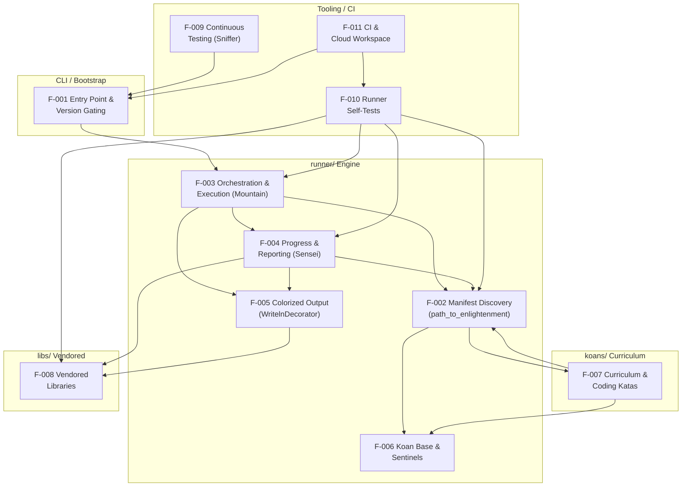
```mermaid
flowchart TD
    subgraph CLI["CLI / Bootstrap"]
        F001["F-001 Entry Point &<br/>Version Gating"]
    end
    subgraph ENGINE["runner/ Engine"]
        F003["F-003 Orchestration &<br/>Execution (Mountain)"]
        F002["F-002 Manifest Discovery<br/>(path_to_enlightenment)"]
        F004["F-004 Progress &<br/>Reporting (Sensei)"]
        F005["F-005 Colorized Output<br/>(WritelnDecorator)"]
        F006["F-006 Koan Base &<br/>Sentinels"]
    end
    subgraph CONTENT["koans/ Curriculum"]
        F007["F-007 Curriculum &<br/>Coding Katas"]
    end
    subgraph SUPPORT["libs/ Vendored"]
        F008["F-008 Vendored<br/>Libraries"]
    end
    subgraph TOOLING["Tooling / CI"]
        F009["F-009 Continuous<br/>Testing (Sniffer)"]
        F010["F-010 Runner<br/>Self-Tests"]
        F011["F-011 CI &<br/>Cloud Workspace"]
    end

    F001 --> F003
    F003 --> F002
    F003 --> F004
    F003 --> F005
    F002 --> F006
    F002 --> F007
    F004 --> F002
    F004 --> F005
    F004 --> F008
    F005 --> F008
    F007 --> F006
    F007 --> F002
    F009 --> F001
    F010 --> F002
    F010 --> F003
    F010 --> F004
    F010 --> F008
    F011 --> F010
    F011 --> F001
```

**Reading the map.** The control flow begins at F-001, which lazily imports and starts F-003 (`Mountain`). F-003 is the hub: its constructor wires in F-002 (the default suite via `path_to_enlightenment.koans()`), F-004 (`Sensei`), and F-005 (`WritelnDecorator`). F-004 independently re-loads the suite through F-002 to compute its totals and writes through F-005 using F-008's colorama palette. The curriculum (F-007) depends on F-006 (`from runner.koan import *`) and on F-002 (registration in `koans.txt`). The tooling layer sits on top: F-009 re-invokes F-001, F-010 exercises F-002/F-003/F-004 (using F-008's `mock`), and F-011 runs F-010 (Travis) and F-001 (Gitpod). This static layering mirrors the component diagram in Section 1.2.2.

### 2.3.2 Integration Points

| Integration Point | Direction (source → target) | Mechanism |
|---|---|---|
| CLI bootstrap | `contemplate_koans.py` → `runner.mountain.Mountain` | Lazy `import` + `Mountain().walk_the_path(sys.argv)` (F-001 → F-003) |
| Curriculum registry | `koans.txt` → `path_to_enlightenment` | Plain-text manifest parsed into `loadTestsFromName` calls (F-007 → F-002) |
| `unittest` substrate | Suite → result object | `self.tests(self.lesson)` runs the suite against `Sensei` (F-003 → F-004) |
| Output channel | `Sensei` → terminal | Writes through `WritelnDecorator` + `libs.colorama` (F-004 → F-005 → F-008) |
| Exit-code signal | `Sensei.learn()` → shell / CI | `sys.exit(-1)` while failures remain (F-004 → F-011) |
| Continuous testing | `scent.py` → entry point | `os.system('python3 -B contemplate_koans.py')` (F-009 → F-001) |
| CI verification | `.travis.yml` → self-tests | `script: python _runner_tests.py` (F-011 → F-010) |
| Cloud workspace | `.gitpod.yml` → entry point | Task `python contemplate_koans.py` (F-011 → F-001) |

### 2.3.3 Shared Components

Several concrete modules are reused by more than one feature; these are the true shared components of the system.

| Shared Component | Reused By | Role |
|---|---|---|
| `path_to_enlightenment.koans()` | F-003 (`Mountain.__init__`), F-004 (`Sensei.__init__`) | Single suite-loading entry both the orchestrator and the reporter call to obtain the ordered curriculum / totals |
| `WritelnDecorator` (`runner/writeln_decorator.py`) | F-003 (creates it), F-004 (writes through it) | The shared line-oriented output stream for all learner-facing text |
| `Koan` + sentinels (`runner/koan.py`) | F-002 (loads the subclasses), F-007 (imports them) | The shared exercise vocabulary and base test type |
| `helper.cls_name` (`runner/helper.py`) | F-004 (`startTest`, `passesCount`, `sortFailures`) | Introspection helper used to group and tally by lesson class |
| `MockableTestResult` (`runner/mockable_test_result.py`) | F-004 (base class of `Sensei`), F-010 (stable result under mocking) | Non-mocked `unittest.TestResult` type shared by the reporter and the self-tests |
| `libs/colorama` (F-008) | F-004 / F-005 | Vendored color palette for all colorized output |
| `libs/mock` (F-008) | F-010 (`test_mountain.py`, `test_sensei.py`) | Vendored test-double toolkit used by the runner self-tests |

### 2.3.4 Common Services

The cross-cutting services that underpin multiple features are:

- **The `unittest` framework** — `TestLoader`, `TestSuite`, `TestResult`, and `TextTestRunner` form the common substrate beneath discovery (F-002), execution (F-003), reporting (F-004), and the self-tests (F-010). Every koan is a `unittest.TestCase` via `Koan`, and `Sensei` is a `unittest.TestResult` via `MockableTestResult`.
- **The single entry point (`contemplate_koans.py`)** — the common invocation service reused verbatim by local shells (`run.sh`, `run.bat`), the Sniffer action (F-009), and the Gitpod task (F-011).
- **The `koans.txt` manifest** — the common curriculum registry that both authors (F-007) and the discovery engine (F-002) share as their contract.
- **The console `stdout` stream (wrapped by `WritelnDecorator`)** — the common output channel for progress, failures, banners, and completion messages.

**Related flows and specifications.** The static component layering appears in Section 1.2.2 (System Overview); the in-scope execution modes are enumerated in Section 1.3.1 (Scope); per-feature implementation constraints follow in Section 2.4; and end-to-end traceability from features to source is provided in Section 2.5.

## 2.4 Implementation Considerations

This section records the technical constraints, performance requirements, scalability considerations, security implications, and maintenance requirements for the features. System-wide considerations that apply to every feature are stated once in Section 2.4.1; feature-specific deltas follow in the matrices of Section 2.4.2.

### 2.4.1 System-Wide Considerations

These properties hold across all features and are grounded in the repository's design (Section 1.2) and documented scope (Section 1.3).

- **Technical constraints:** The application runs on the **Python 3 standard library plus the vendored `libs/`** only (no runtime third-party install), must be executed **from the repository root** so `koans.txt` and the `koans/` package resolve, and targets **Python 3.7–3.11** — code paths that call the removed `assertEquals` alias fail on Python 3.12+ (a documented caveat, not a fix).
- **Performance requirements:** Every feature runs in a **single, synchronous, in-process pass**; a full run executes 304 `unittest` assertions. The repository defines **no timing SLAs**; startup cost is dominated by importing the lesson modules named in the manifest.
- **Scalability considerations:** The only scaling dimension is **curriculum size** — the number of manifest entries and the koans they contain. Growth is **linear**, there is **no concurrency**, and each process serves **one learner**.
- **Security implications:** Python Koans is a **local console tool with no server, network, authentication, secrets, or persistent state**; it runs with the invoking user's privileges. Its trust boundary is the **repository contents**: discovery imports and executes arbitrary `koans.*` modules named in `koans.txt`, so the manifest and lesson files are trusted inputs.
- **Maintenance requirements:** Documentation is Markdown + Mermaid that renders natively on GitHub with **no build tooling**, uses inline `Source: path:Lnn` citations, and reports **runtime-verified counts** (304 koans / 37 lessons / 39 entries). Engine changes are guarded by the **runner self-tests** (F-010) executed in **CI** (F-011).

### 2.4.2 Feature-Specific Considerations

The following matrix records the deltas unique to each feature, beyond the system-wide baseline above.

| Feature | Technical Constraints | Performance | Scalability |
|---|---|---|---|
| F-001 | Version checks compare `sys.version_info` against `(3,0)`/`(3,7)`; the engine import must stay **after** the gate so messages show on old interpreters | Two comparisons plus one lazy import — negligible | Not applicable (single invocation) |
| F-002 | Manifest path is relative to the working directory; `sortTestMethodsUsing = None` is mandatory to preserve order; names must be importable | Linear in manifest lines: one file read + N `loadTestsFromName` imports | Grows with manifest size; each added lesson adds import cost |
| F-003 | Narrowing keys off `args[1]` with an auto-prepended `koans.` prefix and requires ≥ 2 argv elements; the suite must be callable with the result | Single in-process pass over the selected suite | Run time grows with the number of selected koans |
| F-004 | Lesson counting hard-excludes `AboutAsserts`/`AboutExtraCredit`; failure-line extraction depends on the traceback text format (regex `(?<= line )\d+`); totals glob `koans/about*.py` | O(1) per callback; per-lesson failure sort; glob is memoized on `self.all_lessons` | Counts scale with curriculum; the glob scan runs once per session |
| F-005 | `WritelnDecorator` relies on `__getattr__` delegation; color depends on `colorama` initialization | Thin pass-through; negligible overhead | Not applicable |
| F-006 | Sentinels are module globals governed by `__all__`; the underscore names intentionally break the private-scope convention | Constant-time import | Not applicable |
| F-007 | Lessons `import *` from `runner.koan`; katas ship as unimplemented stubs; some koans use `assertEquals` (3.12 caveat) | Fast assertions; the dice kata uses `random` | Curriculum grows by adding an `about_*.py` module plus a `koans.txt` entry |
| F-008 | Vendored under `libs/`; resolution depends on the repository root being on `sys.path`; `colorama` pinned to 0.2.7, `mock` to a modified 0.6.0 | Standard import cost | Not applicable |
| F-009 | Requires the externally-installed Sniffer package; `watch_paths` is hard-coded; shells out via `os.system` | Full-suite re-run on each trigger (no incremental testing) | Re-executes the entire suite per change |
| F-010 | Aggregates a fixed set of five self-test cases; uses `libs.mock`; `test_helper.py` uses `assertEquals` (fails on 3.12) | Small, fast suite | Extended by adding test cases to `suite()` |
| F-011 | Declarative config; Travis pins Python 3.9; the Gitpod image pins `pytest==4.4.2`/`pytest-testdox`/`mock` | Governed by the hosted platforms | Single CI job; prebuilds enabled for master |

| Feature | Security Implications | Maintenance Requirements |
|---|---|---|
| F-001 | Refusing Python 2 prevents running the wrong edition; otherwise user-privileged | Update the 3.7 threshold and messages if the supported baseline changes |
| F-002 | Imports arbitrary `koans.*` modules named in the manifest (trusted repo inputs) | Keep manifest names in sync with module/class names; edit `koans.txt` to add or reorder lessons |
| F-003 | Executes only `koans.*` test code from the repository | Small (~60 lines); stable wiring to `Sensei` and the suite |
| F-004 | Reads the local filesystem via `glob`; no external I/O | The excluded-lesson names and the `about*.py` glob must track curriculum conventions; the failure regex is coupled to the `unittest` traceback format |
| F-005 | Writes only to the wrapped stream | Trivial; the vendored `colorama` version is fixed at 0.2.7 |
| F-006 | No I/O; introduces no attack surface | Must remain "no spoilers"; adding a sentinel requires updating `__all__` |
| F-007 | Executes learner-supplied code locally under the learner's account | Largest surface (41 `koans/` modules); the `assertEquals` modernization is a documented future task; new lessons must ship "red" |
| F-008 | Vendored code with no remote fetch at runtime; trusted repository content | Updates require re-vendoring; the `LICENSE-colorama` file must be retained |
| F-009 | Spawns a local subprocess via `os.system` | Optional developer aid; keep the invoked command in sync with the entry point |
| F-010 | Local test execution only | The `assertEquals` fix is the documented future task; keep the five-case list current |
| F-011 | Runs on hosted CI/cloud with repository-scoped permissions; the Docker image adds developer aids only | Bump the Python version in `.travis.yml` as the baseline evolves; keep `script` in sync with `_runner_tests.py` |

## 2.5 Requirements Traceability Matrix

This matrix provides bidirectional traceability from features and requirements to (a) the source artifacts that implement them and (b) the Section 1 scope statements they satisfy. Every requirement is verifiable by the stated method — static inspection, executing the CLI and observing output, running the self-tests, or a CI run.

### 2.5.1 Feature-to-Source and Scope Traceability

| Feature ID | Primary Source Artifact(s) | Section 1 Scope Reference |
|---|---|---|
| F-001 | `contemplate_koans.py`, `run.sh`, `run.bat` | 1.2.2 (entry point); 1.3.1 (key technical requirements) |
| F-002 | `runner/path_to_enlightenment.py`, `koans.txt` | 1.2.2 (manifest-driven discovery); 1.3.1 (curriculum authoring) |
| F-003 | `runner/mountain.py` | 1.2.2 (run full/single lesson/test); 1.3.1 (execution modes) |
| F-004 | `runner/sensei.py`, `runner/mockable_test_result.py`, `runner/helper.py` | 1.2.2 (progress reporting); 1.2.3 (measurable objectives / KPIs) |
| F-005 | `runner/writeln_decorator.py`, `libs/colorama/` | 1.1 (colorized feedback); 1.3.1 (feedback) |
| F-006 | `runner/koan.py` | 1.2.2 (sentinel-driven TDD); 1.3.1 (four sentinels); 1.3.2 (no spoilers) |
| F-007 | `koans/about_*.py`, `koans/triangle.py`, `koans/about_scoring_project.py`, `koans/about_dice_project.py`, `koans/about_proxy_object_project.py`, `koans/GREEDS_RULES.txt` | 1.1 (curriculum); 1.3.1 (primary user workflow) |
| F-008 | `libs/colorama/`, `libs/mock.py` | 1.2.2 (zero-install pillar); 1.3.2 (runtime third-party out of scope) |
| F-009 | `scent.py` | 1.2.1 / 1.2.2 (continuous testing); 1.3.1 (essential integrations) |
| F-010 | `_runner_tests.py`, `runner/runner_tests/` | 1.2.2 (CI self-verification); 1.2.3 (keep the engine healthy) |
| F-011 | `.travis.yml`, `.gitpod.yml`, `.gitpod.Dockerfile` | 1.2.1 (integration points); 1.3.1 (essential integrations) |

### 2.5.2 Requirement-to-Evidence Traceability

| Requirement ID | Source Evidence | Verification Method |
|---|---|---|
| F-001-RQ-001 | `contemplate_koans.py` L61 | Execute with no args; observe full run |
| F-001-RQ-002 | `contemplate_koans.py` L38–L42 | Execute under Python 2; observe message and no run |
| F-001-RQ-003 | `contemplate_koans.py` L45–L54 | Execute under 3.0–3.6; observe warning then continue |
| F-001-RQ-004 | `contemplate_koans.py` L59–L61 | Static inspection (import inside the non-Python-2 branch) |
| F-002-RQ-001 | `runner/path_to_enlightenment.py` L17–L28; `koans.txt` | Inspection; 39 non-comment manifest entries confirmed |
| F-002-RQ-002 | `runner/path_to_enlightenment.py` L48–L52 | Inspection of `sortTestMethodsUsing = None`; observe run order |
| F-002-RQ-003 | `runner/path_to_enlightenment.py` L56–L62; `runner/sensei.py` L429–L437 | Execute; assert `countTestCases()` == 304 |
| F-003-RQ-001 | `runner/mountain.py` L55–L58 | Execute with no args; full suite runs |
| F-003-RQ-002 | `runner/mountain.py` L55–L56 | Execute with `about_strings`; only that `TestCase` runs |
| F-003-RQ-003 | `runner/mountain.py` L58–L60 | Inspection; observe report printed and `Sensei` returned |
| F-004-RQ-001 | `runner/sensei.py` L72–L73, L92 | Execute; observe counts advance (excluding AboutAsserts/AboutExtraCredit) |
| F-004-RQ-002 | `runner/sensei.py` L304–L337 | Execute; observe progress and work-remaining lines |
| F-004-RQ-003 | `runner/sensei.py` L130–L173 | Execute a failing run; observe first-failure spotlight |
| F-004-RQ-004 | `runner/sensei.py` L175–L206, L198 | Execute; check exit code (-1 with failures; 0 on completion) |
| F-005-RQ-001 | `runner/writeln_decorator.py` L16–L31 | Inspection / behavior (writeln appends newline; getattr delegates) |
| F-005-RQ-002 | `runner/sensei.py` L14, L88–L90 | Execute; observe green success lines / Windows color via colorama |
| F-006-RQ-001 | `runner/koan.py` L21 | Inspection of `__all__`; `import *` binds the five names |
| F-006-RQ-002 | `runner/koan.py` L34–L53 | Inspection of sentinel values and types |
| F-006-RQ-003 | `runner/koan.py` L56–L67 | Inspection (`Koan` subclasses `unittest.TestCase`) |
| F-007-RQ-001 | `koans/about_asserts.py` L17, L29 | Execute fresh checkout; observe failing koans |
| F-007-RQ-002 | `koans/triangle.py` L10–L25 | Implement `triangle`; run about_triangle_project(2).py |
| F-007-RQ-003 | `koans/about_scoring_project.py` L34–L60; `koans/GREEDS_RULES.txt` | Implement `score`; run AboutScoringProject |
| F-007-RQ-004 | `koans/about_dice_project.py` L8–L40; `koans/about_proxy_object_project.py` L20–L30 | Implement; run AboutDiceProject / AboutProxyObjectProject + TelevisionTest |
| F-008-RQ-001 | `libs/colorama/__init__.py` L1–L7 | Inspection; import resolves without `pip install` |
| F-008-RQ-002 | `libs/mock.py` L16–L21 | Inspection of `__all__`; `import *` used by the self-tests |
| F-009-RQ-001 | `scent.py` L37, L45–L47 | Run Sniffer; save a `.py` file; observe re-run |
| F-009-RQ-002 | `scent.py` L40–L42 | Inspection / behavior of the `py_files` filter |
| F-010-RQ-001 | `_runner_tests.py` L32–L55 | Inspection (five cases aggregated into one suite) |
| F-010-RQ-002 | `_runner_tests.py` L58–L60 | Execute `python _runner_tests.py` on ≤ 3.11; check exit code |
| F-011-RQ-001 | `.travis.yml` L1–L7 | CI run on Python 3.9 |
| F-011-RQ-002 | `.gitpod.yml` L1–L10 | Open the Gitpod workspace; the task auto-runs the koans |

**Coverage summary.** All 11 features (F-001–F-011) and all 31 functional requirements trace to concrete source artifacts and to at least one Section 1 scope statement; there are no orphan requirements and no undocumented in-scope capabilities among the artifacts inspected.

## 2.6 References

The following repository artifacts were inspected as the evidence base for the features and requirements in this section. Line references appear inline in the sub-sections above.

**Engine source files (`runner/` and root):**

- `contemplate_koans.py` - CLI entry point and Python version gating (F-001).
- `run.sh` - Unix launcher invoking `python3 -B contemplate_koans.py` (F-001).
- `run.bat` - Windows launcher (F-001).
- `runner/mountain.py` - `Mountain` orchestration, full-run vs single lesson/test narrowing (F-003).
- `runner/path_to_enlightenment.py` - manifest parsing and order-preserving suite assembly (F-002).
- `runner/sensei.py` - progress/failure reporting, scoring, counts, exit code, colorama use (F-004, F-005).
- `runner/koan.py` - `Koan` base class and the four sentinel placeholders (F-006).
- `runner/writeln_decorator.py` - `WritelnDecorator` output stream wrapper (F-005).
- `runner/helper.py` - `cls_name` introspection helper (F-004).
- `runner/mockable_test_result.py` - `MockableTestResult` stable `TestResult` type (F-004, F-010).
- `_runner_tests.py` - runner self-test aggregator and CI entry point (F-010).

**Curriculum files (`koans/`):**

- `koans.txt` - the ordered 39-entry curriculum manifest (F-002).
- `koans/about_asserts.py` - first lesson; fill-in-the-blank pattern (F-007).
- `koans/triangle.py` - triangle-classifier kata stub and `TriangleError` (F-007).
- `koans/about_scoring_project.py` - Greed `score` kata and test cases (F-007).
- `koans/GREEDS_RULES.txt` - Greed scoring ruleset (F-007).
- `koans/about_dice_project.py` - `DiceSet.roll` kata (F-007).
- `koans/about_proxy_object_project.py` - `Proxy`/`Television` kata (F-007).
- `koans/about_iteration.py`, `koans/about_regex.py` - lessons using the deprecated `assertEquals` alias (Python 3.12 caveat, F-007).
- `koans/` - the lesson package plus kata helper modules (`local_module.py`, `jims.py`, `joes.py`, `a_package_folder/`) referenced as F-007 data dependencies.

**Configuration and tooling files:**

- `scent.py` - Sniffer continuous-testing configuration (F-009).
- `.travis.yml` - Travis CI configuration running the self-tests on Python 3.9 (F-011).
- `.gitpod.yml` - Gitpod workspace task auto-running the koans (F-011).
- `.gitpod.Dockerfile` - Gitpod image with developer/CI aids (F-011).
- `runner/runner_tests/` - the five runner self-test cases; `test_helper.py`, `test_mountain.py`, `test_sensei.py` inspected (F-010).

**Vendored libraries (`libs/`):**

- `libs/colorama/__init__.py` - colorama re-exports and `VERSION = '0.2.7'` (F-008).
- `libs/colorama/LICENSE-colorama` - retained BSD 3-Clause license (F-008).
- `libs/colorama/` - vendored cross-platform terminal color library (F-005, F-008).
- `libs/mock.py` - vendored test-double toolkit `__all__` (F-008, F-010).

**Documentation files (context):**

- `docs/architecture/overview.md` - three-package layering and the zero-install pillar.
- `docs/curriculum.md` - manifest/sentinel model and the "no spoilers" convention.
- `docs/guides/cli-usage.md` - run-from-root requirement and execution modes.

**Cross-referenced specification sections** (retrieved via `get_tech_spec_section`):

- Section 1.1 Executive Summary - system identity, curriculum size, stakeholders.
- Section 1.2 System Overview - capability/component inventory, four technical pillars, success criteria.
- Section 1.3 Scope - in-scope execution/feedback/integration boundaries and explicit exclusions.

**Web sources:** None — all evidence was drawn directly from the repository and the already-written Section 1 subsections.

# 3. Technology Stack

## 3.1 Programming Languages

Python Koans is overwhelmingly a **single-language project**: every executable component — the CLI entry point, the `runner/` engine, the `koans/` curriculum, and the vendored `libs/` — is written in **Python 3**. A thin layer of platform launcher scripts (POSIX shell and Windows Batch) and a set of declarative configuration/markup formats (YAML, Dockerfile, reStructuredText, Markdown, plain text) round out the stack. The language choice is not incidental: because the product's purpose is to *teach Python by editing Python*, implementing the tool itself in Python keeps the learner in a single mental model (`README.rst`, `docs/architecture/overview.md`).

### 3.1.1 Language Inventory by Component

| Language | Version / dialect | Components & representative files | Role |
|---|---|---|---|
| **Python** | Python 3 edition; **3.7+ baseline**, supported through **3.11** (CI pins **3.9**) | `contemplate_koans.py`; engine `runner/` (`mountain.py`, `path_to_enlightenment.py`, `sensei.py`, `koan.py`, `helper.py`, `mockable_test_result.py`, `writeln_decorator.py`); curriculum `koans/about_*.py`; vendored `libs/` | The entire runtime, engine, curriculum, and self-tests |
| **POSIX shell (`sh`)** | `#!/bin/sh` | `run.sh` | Unix/macOS launcher: runs `python3 -B contemplate_koans.py` |
| **Windows Batch** | `cmd.exe` batch | `run.bat` | Windows launcher: interpreter discovery, runs `python.exe -B contemplate_koans.py`, "Test again?" loop |
| **YAML** | declarative config | `.travis.yml`, `.gitpod.yml` | CI and cloud-workspace configuration |
| **Dockerfile** | Docker build syntax | `.gitpod.Dockerfile` | Gitpod workspace image definition |
| **reStructuredText** | RST | `README.rst` | Primary human-facing project documentation |
| **Markdown (+ Mermaid)** | GitHub-flavored | `docs/**/*.md` | Documentation tree (renders on GitHub with no build tooling) |
| **Plain text** | line-oriented manifest | `koans.txt`, `koans/GREEDS_RULES.txt` | Curriculum manifest and kata rules data |

The Python source spans all three runtime packages. The `runner/koan.py` base class is declared `class Koan(unittest.TestCase)`, so every lesson is a standard Python `unittest` test; the engine and reporter (`runner/sensei.py`, `runner/mountain.py`) are ordinary Python modules; and the vendored `libs/colorama/` and `libs/mock.py` are pure-Python packages bundled with the source.

### 3.1.2 Selection Criteria & Justification

- **Python as a pedagogical necessity.** The application is *"an interactive tutorial for learning the Python programming language by making tests pass"* (`README.rst`). Writing the tool in the same language it teaches means a learner reads, runs, and edits nothing but Python. The exercises are ordinary `unittest.TestCase` methods (`runner/koan.py`), so the very act of solving koans reinforces standard Python testing idioms.
- **Standard-library-only, zero-install Python.** The engine imports only the Python standard library; `libs/` vendors what little third-party code is needed so that *no* `pip install` is required to run the koans (`docs/architecture/overview.md`, `runner/sensei.py`). This lowers the barrier to entry versus tutorials that need an installed toolchain.
- **Shell / Batch launchers for cross-platform convenience.** `run.sh` (POSIX) and `run.bat` (Windows) exist purely to wrap the same entry point on each OS, both passing the `-B` flag to suppress `.pyc` bytecode and keep the edited source tree clean (`docs/getting-started/installation.md`). `run.bat` additionally hunts for the interpreter and offers a re-run loop.
- **Declarative formats for automation.** YAML (`.travis.yml`, `.gitpod.yml`), the Dockerfile, and Markdown/RST documentation are the conventional, tool-native formats for CI, cloud workspaces, and GitHub-rendered docs — chosen so configuration and documentation need no compilation step.

### 3.1.3 Language Constraints & Dependencies

The one hard language constraint is the **Python interpreter version gate** enforced at startup in `contemplate_koans.py`:

```python
if sys.version_info < (3, 0):      # Python 2 -> prints error, does NOT run
elif sys.version_info < (3, 7):    # < 3.7  -> prints warning, then continues
```

- **Python 2 is refused.** The entry point prints an error and does not run the koans, directing the user to `python3` (`contemplate_koans.py`; `docs/getting-started/installation.md`).
- **Below 3.7 is best-effort.** A compatibility warning is printed and execution continues anyway (`contemplate_koans.py`).
- **3.7–3.11 is the supported band.** Releases through 3.11 run the koans well; Travis CI validates on **Python 3.9** (`.travis.yml`).
- **Python 3.12+ carries a documented caveat.** Python 3.12 removed the deprecated `unittest.assertEquals` alias, which the runner self-tests (`runner/runner_tests/test_helper.py`) and several koans (`koans/about_iteration.py`, `koans/about_regex.py`) still call, so those runs raise `AttributeError`; this is recorded as a known caveat, not fixed (`docs/guides/deployment.md`).
- **Must run from the repository root.** Commands must be executed from the repo root so the `koans.txt` manifest and the `koans/`, `runner/`, and `libs/` packages resolve on `sys.path` (`docs/guides/deployment.md`). The Windows launcher references a sample interpreter path of `C:\Python311` that the user edits to match their install (`run.bat`).

There are **no non-Python compiled artifacts, no transpilation, and no language-level build step** — the Python source runs directly from the tree.


## 3.2 Frameworks & Libraries

Python Koans is a **console application, not a web/service application**, so there is no web framework, ORM, or application server in the stack. Its single "framework" is the Python standard-library **`unittest`** test framework, on top of which the `runner/` engine is a thin, learner-friendly layer. The only libraries beyond the standard library are two **vendored** packages under `libs/` — `colorama` and a modified `mock` — which are bundled with the source so the koans run with no installation step (`docs/architecture/overview.md`).

### 3.2.1 Core Framework — the `unittest` Substrate

The entire engine is built on Python's standard-library `unittest` framework (`docs/architecture/overview.md`):

| Framework element | How Python Koans uses it | Evidence |
|---|---|---|
| `unittest.TestCase` | `class Koan(unittest.TestCase)` is the base every lesson extends, so each koan is a standard test method | `runner/koan.py` |
| `unittest.TestResult` | `class MockableTestResult(unittest.TestResult)`, subclassed by `class Sensei(MockableTestResult)` — the reporter *is* a `unittest` result object driven as the suite runs | `runner/mockable_test_result.py`, `runner/sensei.py` |
| `unittest.TestSuite` / `TestLoader` | `path_to_enlightenment` assembles the ordered suite from the manifest; single-lesson runs use `TestLoader().loadTestsFromName("koans." + name)` | `runner/path_to_enlightenment.py`, `runner/mountain.py` |
| `unittest.TextTestRunner` | `_runner_tests.py` runs the runner self-tests at `verbosity=2` | `_runner_tests.py` |

**Version:** `unittest` ships with the interpreter, so its version tracks the Python 3 runtime (3.7–3.11 supported; see §3.1.3). Because the `unittest` API is the substrate, the Python 3.12 removal of the `assertEquals` alias is precisely the source of the documented caveat (`docs/guides/deployment.md`).

**Supporting standard-library modules.** Beyond `unittest`, the engine and curriculum draw only on the standard library:

| Module | Used by | Purpose |
|---|---|---|
| `sys` | `contemplate_koans.py`, `runner/mountain.py`, `runner/sensei.py` | Version gate, argv, exit codes, stdout |
| `re` | `runner/sensei.py`, `runner/koan.py`, `koans/about_regex.py` | Traceback line parsing; regex koans |
| `os`, `glob` | `runner/sensei.py` | Lesson-file discovery for progress counts |
| `io` | `runner/path_to_enlightenment.py` | UTF-8 read of the `koans.txt` manifest |
| `random` | `koans/about_dice_project.py` | The dice-roll kata |
| `functools` | `koans/about_iteration.py`, `koans/about_decorating_with_classes.py` | Decorator/iteration lessons |
| `math` | `koans/about_string_manipulation.py` | Numeric lesson content |

### 3.2.2 Vendored Libraries

Two libraries are bundled directly in the tree under `libs/` (which is a normal package via `libs/__init__.py`), so the application depends on **no external install** at runtime:

| Library | Version | License | Component & usage | Runtime scope |
|---|---|---|---|---|
| **colorama** | **0.2.7** (`libs/colorama/__init__.py` → `VERSION = '0.2.7'`) | New BSD / BSD 3-Clause (`libs/colorama/LICENSE-colorama`) | `runner/sensei.py` does `from libs.colorama import init, Fore, Style` and calls `init()` at import; provides cross-platform (incl. Windows via `win32`/`winterm`) terminal color for the progress report | **Runtime** (the colorized report) |
| **mock** | **0.6.0**, "`modified by Greg Malcolm`" (`libs/mock.py` → `__version__`) | BSD (original by Michael Foord) | `from libs.mock import *` (`Mock`, `patch`, `patch_object`, `sentinel`, `DEFAULT`) used **only by the runner self-tests** (`runner/runner_tests/test_mountain.py`, `test_sensei.py`) | **Test-only** (not on the koan run path) |

### 3.2.3 Technology Stack Layering

The diagram below shows how the components layer onto the standard library, the vendored libraries, and the interpreter. Edges read "is built on / uses"; note that vendored `mock` sits on the self-test path only, while `colorama` is on the runtime path.

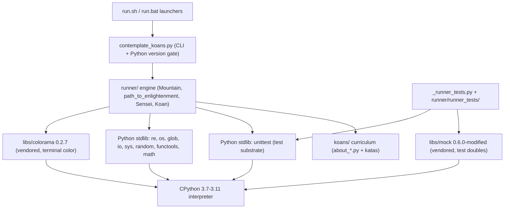
```mermaid
graph TD
    RUN["run.sh / run.bat launchers"] --> ENTRY["contemplate_koans.py (CLI + Python version gate)"]
    ENTRY --> ENGINE["runner/ engine (Mountain, path_to_enlightenment, Sensei, Koan)"]
    ENGINE --> CURRIC["koans/ curriculum (about_*.py + katas)"]
    ENGINE --> UNITTEST["Python stdlib: unittest (test substrate)"]
    ENGINE --> STDMISC["Python stdlib: re, os, glob, io, sys, random, functools, math"]
    ENGINE --> COLORAMA["libs/colorama 0.2.7 (vendored, terminal color)"]
    SELFTEST["_runner_tests.py + runner/runner_tests/"] --> MOCK["libs/mock 0.6.0-modified (vendored, test doubles)"]
    SELFTEST --> UNITTEST
    UNITTEST --> CPY["CPython 3.7-3.11 interpreter"]
    STDMISC --> CPY
    COLORAMA --> CPY
    MOCK --> CPY
```

### 3.2.4 Compatibility Requirements & Justification

- **Interpreter compatibility.** All framework and library code targets **Python 3.7–3.11**. The vendored `colorama` and `mock` are pure-Python and impose no compiled-extension constraints; correct resolution of `libs.*` and `runner.*` imports depends only on the **repository root being on `sys.path`** (i.e., running from the repo root) (`docs/guides/deployment.md`, §2.4 Feature F-008).
- **Why `unittest` (not `pytest`) is the core.** Choosing the standard-library `unittest` keeps the tool **zero-install** and teaches the learner the framework that ships with Python itself; the engine merely decorates it with progress/scoring (`Sensei`) and a stream wrapper (`WritelnDecorator`) (`docs/architecture/overview.md`).
- **Why `colorama` is vendored.** Vendoring gives consistent, cross-platform colorized output — including Windows — without asking the learner to `pip install` anything; the version is deliberately fixed at **0.2.7** (§2.4 Feature F-005/F-008).
- **Why `mock` is vendored.** The runner's own self-tests need test doubles to isolate the orchestrator/reporter; bundling a modified **0.6.0** `mock` keeps even the developer/CI test path installation-free (`runner/runner_tests/`).
- **Integration requirement — import-time `colorama` init.** `runner/sensei.py` initializes `colorama` at import (`init()`), so the reporting layer and the color library are tightly coupled at startup; any environment that imports `Sensei` pulls in `libs.colorama`.

> The pinned/vendored versions (colorama 0.2.7, mock 0.6.0-modified) also carry a **security trade-off**: because there is no runtime fetch and no dependency manifest, there is no supply-chain install to compromise, but the vendored copies are not automatically tracked by dependency-scanning tools and must be updated by re-vendoring (§2.4 Feature F-008).


## 3.3 Open Source Dependencies

The defining characteristic of this project's dependency posture is that it has **no dependency manifest and no runtime third-party dependencies**. Repository inspection confirms the tree contains **no `requirements.txt`, `setup.py`, `setup.cfg`, `pyproject.toml`, `Pipfile`, or `tox.ini`** (`docs/getting-started/installation.md`). The koans run on the Python standard library alone; the only open-source code shipped with the application is *vendored* under `libs/`, and a small set of open-source *developer/CI* tools are installed separately from **PyPI** only when working on the project.

### 3.3.1 Vendored Open-Source Libraries (bundled in the tree)

These are checked into `libs/` and imported directly — there is **no registry fetch at runtime**:

| Package | Version | Registry / source | Scope | License | Evidence |
|---|---|---|---|---|---|
| `colorama` | **0.2.7** | Vendored copy of the PyPI package | Runtime (terminal color) | New BSD / BSD 3-Clause | `libs/colorama/__init__.py`, `libs/colorama/LICENSE-colorama` |
| `mock` | **0.6.0** ("modified by Greg Malcolm") | Vendored, modified copy (original by Michael Foord) | Test-only (runner self-tests) | BSD | `libs/mock.py`, `runner/runner_tests/test_mountain.py`, `test_sensei.py` |

### 3.3.2 Developer / CI Open-Source Tools (installed from PyPI, not runtime)

These are **not** required to run the koans; they support working *on* the project and are declared in the Gitpod image or the README's Sniffer instructions. They are pulled from the **PyPI** registry via `pip3`/`pip`:

| Package | Version | Registry | Where declared | Purpose |
|---|---|---|---|---|
| `pytest` | **4.4.2** (pinned) | PyPI | `.gitpod.Dockerfile` (`pip3 install pytest==4.4.2 ...`) | Alternative test runner in the Gitpod workspace |
| `pytest-testdox` | unpinned (latest at install) | PyPI | `.gitpod.Dockerfile` | Human-readable `pytest` output |
| `mock` | unpinned (latest at install) | PyPI | `.gitpod.Dockerfile` | Test-double library (developer aid; distinct from the vendored `libs/mock.py`) |
| `sniffer` | unpinned (latest at install) | PyPI | `README.rst` / `docs/guides/deployment.md` (`pip install sniffer`) | Continuous test runner, configured by `scent.py` |
| `pyinotify` | unpinned (latest at install) | PyPI | `README.rst` (Linux) | Filesystem-event backend for Sniffer on Linux |
| `pywin32` | unpinned (latest at install) | PyPI | `README.rst` (Windows) | Filesystem-event backend for Sniffer on Windows |
| `MacFSEvents` | unpinned (latest at install) | PyPI | `README.rst` (macOS) | Filesystem-event backend for Sniffer on macOS |

The base **Docker image** the Gitpod workspace derives from — `gitpod/workspace-full:latest` — is itself an open-source-tooling image consumed as a container base (see §3.6.4).

### 3.3.3 Registries, Versioning & Security Considerations

- **Registry:** the only package registry referenced anywhere is **PyPI**, and only for the optional developer/CI tools above (via `pip3 install` in `.gitpod.Dockerfile` and `python3 -m pip install` in the README). The application runtime touches no registry.
- **Version pinning:** the only strictly pinned dependency is **`pytest==4.4.2`** (`.gitpod.Dockerfile`). The vendored libraries are frozen by virtue of being checked in (`colorama` 0.2.7, `mock` 0.6.0-modified). All other developer tools are unpinned and resolve to the latest version at install time.
- **Security posture:** because the koans require **no install and fetch nothing at runtime**, the runtime supply-chain surface is effectively nil (`docs/architecture/overview.md`, §2.4 Feature F-008). The trade-off is that the vendored copies are not automatically surfaced by dependency scanners and must be refreshed by re-vendoring, and the accompanying `LICENSE-colorama` file must be retained (§2.4 Feature F-008).

> **Out-of-scope note.** A `package.json` / `package-lock.json` and a `.github/dependabot.yml` exist deeper in the tree, but only inside the declared Git submodule directory `Submodule_01_Do_not_use_15Jun/` (a separate `nodejs-getting-started`/Express sample). Per `docs/contributing/development.md`, that directory *"is not part of this project — ignore it entirely."* Its Node.js dependencies are therefore **not** dependencies of Python Koans and are excluded from this stack (see §1.3.2).


## 3.4 Third-Party Services

Python Koans is a **local console tool with no server, network, authentication, secrets, or persistent state** (§2.4.1). It therefore consumes **no external APIs at runtime** and integrates with third-party services only for **source hosting, continuous integration, and a cloud development workspace** — all developer/CI-time conveniences, none of which the koans themselves depend on to run (`docs/guides/deployment.md`; §1.2.1).

### 3.4.1 External Integrations

| Service | Role | Configuration / evidence |
|---|---|---|
| **GitHub** | Source hosting and distribution; the canonical repository is `gregmalcolm/python_koans`, cloned or downloaded to run | `README.rst` |
| **Travis CI** | Continuous integration: runs the runner self-tests (`python _runner_tests.py`) on **Python 3.9**; email notifications enabled | `.travis.yml` |
| **Gitpod** | One-click cloud development workspace; auto-runs `python contemplate_koans.py`; GitHub prebuilds enabled for `master` (pull-request prebuilds and the review comment disabled) | `.gitpod.yml`, `.gitpod.Dockerfile` |

The `README.rst` header additionally renders **badges/links** — a Travis-CI build badge, a Gitpod "ready-to-code" badge and "open in Gitpod" button, and an Eclipse Che / `workspaces.openshift.com` "open in" badge. These are **convenience entry points into the CI/cloud services above**, not additional integrated runtime services.

### 3.4.2 Authentication Services

**None.** The application performs no authentication, authorization, or identity management; it *"runs with the invoking user's privileges"* and has no accounts, tokens, or login flow (§2.4.1). The hosted services above rely on GitHub's own account/permission model (e.g., Travis and Gitpod act with repository-scoped permissions), but Python Koans ships no authentication code or credentials.

### 3.4.3 Monitoring Tools

**No application monitoring, telemetry, APM, or logging service is present.** The only operational signal is **Travis CI email notifications** on build results (`.travis.yml`), and the "monitoring" a learner sees is the colorized progress report the tool prints locally via `Sensei` (`runner/sensei.py`). There is no metrics, tracing, or error-reporting integration anywhere in the tree.

### 3.4.4 Cloud Services

The only cloud service is the **Gitpod** development workspace (with the Eclipse Che / OpenShift badge offering an alternate launch path). It is a **development-time environment**, not a runtime host: the project explicitly has *"no server to deploy and no hosting infrastructure"* (`docs/guides/deployment.md`). There is **no AWS/GCP/Azure account, no serverless, object storage, message queue, CDN, or managed database** referenced anywhere in the repository.

> **Security implication.** Because there are no runtime external calls, no secrets, and no auth surface, the third-party-service attack surface is confined to the CI/cloud platforms operating under GitHub-scoped permissions (§2.4.1, Feature F-011). No API keys or credentials are stored in the repository.


## 3.5 Databases & Storage

Python Koans has **no database, no cache, and no persistent state of any kind**. It is a stateless console tool whose only "storage" is the **local filesystem source tree** it reads at startup; a learner's progress is *recomputed on every run* rather than saved (§2.4.1). This section documents that storage model explicitly because its absence is an intentional architectural property, not an omission.

### 3.5.1 Databases

| Storage class | Present? | Notes |
|---|---|---|
| Primary database | **No** | The tool holds no records; there is nothing to persist between runs |
| Secondary / analytical database | **No** | — |
| Caching layer (e.g. Redis/Memcached) | **No** | No caching solution; each run re-discovers and re-executes the suite |
| Object / blob storage | **No** | — |

There is no database driver, ORM, connection string, or migration tooling anywhere in the repository.

### 3.5.2 Persistence Strategy — Ephemeral, In-Process

State lives only for the duration of a single process:

- **Progress is recomputed each run.** `Sensei` tallies pass counts and lesson counts in memory during the run and prints them; the *"You have completed X (P %) koans and Y (out of 37) lessons"* line is derived live (`runner/sensei.py`; §1.2.3). A fresh checkout begins at "0 (0 %) koans" every time — nothing is stored.
- **Completion is signaled by exit code, not saved state.** The process exits non-zero while failures remain and success once all koans pass (`runner/sensei.py`), so the "result" is transient and consumed by the shell/CI, not persisted.
- **Bytecode is deliberately not written.** Both launchers pass the `-B` flag, telling Python not to write `.pyc` files, keeping the source tree clean and stateless (`run.sh`, `run.bat`, `scent.py`).

### 3.5.3 File-Based Inputs (the only "storage")

The application reads plain files from the checked-out tree; these are **trusted repository inputs** (the trust boundary is the repository contents — §2.4.1):

| File(s) | Format | How it is read | Role |
|---|---|---|---|
| `koans.txt` | Line-oriented text (UTF-8) | Opened as UTF-8 by `runner/path_to_enlightenment.py` (`names_from_file`) | The ordered curriculum manifest (39 `TestCase` entries) |
| `koans/about_*.py` and helpers | Python modules | Imported/executed by the `unittest` loader | The lesson code the learner edits and the engine runs |
| `koans/GREEDS_RULES.txt` | Plain text | Read as reference data for the Greed scoring kata | Kata rules content |
| `example_file.txt` | Plain text | Sample artifact used by a lesson | Exercise input |

**Output storage:** the sole output sink is **standard output** — the colorized progress report written through `WritelnDecorator` to `sys.stdout` (`runner/writeln_decorator.py`, `runner/sensei.py`). Nothing is written to disk by the running application.

> **Ignored working files.** `.gitignore` (and the parallel `.hgignore`) exclude a learner `answers` directory and compiled `*.pyc` files, reflecting that any local artifacts a learner produces are neither part of the system's storage model nor committed to version control.


## 3.6 Development & Deployment

Because Python Koans is a **standard-library-only console application with "no server to deploy and no hosting infrastructure"** (`docs/guides/deployment.md`), "deployment" means *how and where the koans are executed* — from a local shell, in CI, in a cloud workspace, or under a file-watcher — all funneling through the single `contemplate_koans.py` entry point. The tooling below is correspondingly lightweight.

### 3.6.1 Development Tools & Testing

| Tool | Version | Role | Evidence |
|---|---|---|---|
| **Launchers** `run.sh` / `run.bat` | — | Cross-platform convenience wrappers around `python(3) -B contemplate_koans.py` | `run.sh`, `run.bat` |
| **`unittest`** (stdlib) | interpreter version | The test framework for both the koans and the runner self-tests | `runner/koan.py`, `_runner_tests.py` |
| **Runner self-tests** (`_runner_tests.py`) | — | Aggregates five self-test cases (`TestMountain`, `TestSensei`, `TestHelper`, `TestFilterKoanNames`, `TestKoansSuite`) into one `unittest.TestSuite`, run at `verbosity=2` | `_runner_tests.py`, `runner/runner_tests/` |
| **`pytest`** | **4.4.2** (pinned) | Alternative test runner, available in the Gitpod workspace (developer aid) | `.gitpod.Dockerfile` |
| **`pytest-testdox`** | unpinned | Readable `pytest` output (developer aid) | `.gitpod.Dockerfile` |
| **`mock`** | unpinned (PyPI) / **0.6.0-modified** (vendored `libs/mock.py`) | Test doubles for the runner self-tests | `.gitpod.Dockerfile`, `libs/mock.py` |
| **Sniffer** (`scent.py`) | unpinned | Continuous testing: watches `['.', 'koans/']`, and on any non-hidden `.py` change shells out via `os.system('python3 -B contemplate_koans.py')` | `scent.py`, `README.rst` |

Authoring workflow is documented in `Contributor Notes.txt`: run a whole lesson with `python3 contemplate_koans.py about_strings`, or a single test with `python3 contemplate_koans.py about_strings.AboutStrings.test_...`.

### 3.6.2 Build System & Packaging

**There is no build system and no packaging step.** The project is "zero-install": clone the repository and run it directly from the source tree (`docs/getting-started/installation.md`). There is no compilation, bundling, wheel/sdist packaging, `Makefile`, `tox.ini`, `setup.py`, or `pyproject.toml` (confirmed by repository inspection), and the `-B` flag actively suppresses `.pyc` bytecode generation so nothing is produced on disk (`run.sh`, `run.bat`).

### 3.6.3 Version Control

- **Git** is the primary VCS; `.gitignore` excludes `*.pyc`, `*.swp`, `.DS_Store`, an `answers` directory, and IDE folders.
- **Mercurial** is also accommodated: a parallel **`.hgignore`** mirrors the ignore rules, indicating the project supports both Git and Mercurial checkouts.
- **Git submodule.** `.gitmodules` declares a single submodule, `Submodule_01_Do_not_use_15Jun`. As its name and `docs/contributing/development.md` make clear, it *"is not part of this project"* and is excluded from this documentation (see §1.3.2, §3.3.3).
- **License:** the project is **MIT-licensed** (`MIT-LICENSE`, "Copyright 2021 Greg Malcolm and The Status Is Not Quo").

### 3.6.4 Containerization

Containerization is used **only for the Gitpod cloud workspace**, not for shipping the application:

- `.gitpod.Dockerfile` builds the workspace image `FROM gitpod/workspace-full:latest`, switches to `USER gitpod`, and runs `pip3 install pytest==4.4.2 pytest-testdox mock`.
- `.gitpod.yml` references that Dockerfile and defines the auto-run task `python contemplate_koans.py`.

There is **no application `Dockerfile`**, no image registry, and no container-based deployment target — the koans are never packaged into a runtime container; the Docker image exists purely to provision a ready-to-code developer environment (`docs/guides/deployment.md`, §2.4 Feature F-011).

### 3.6.5 CI/CD Pipeline

Continuous integration is declarative and split across two platforms:

| Platform | Config | What it does |
|---|---|---|
| **Travis CI** | `.travis.yml` | `language: python`, pinned to **Python 3.9**; `script:` runs `python _runner_tests.py` (verifies the *engine*, not the koans); email notifications enabled. Commented-out alternatives can instead run `contemplate_koans.py` so a fork can show which koans it has passed. |
| **Gitpod prebuilds** | `.gitpod.yml` | GitHub prebuilds enabled for `master` (pull-request prebuilds and the review comment disabled); task auto-runs the koans. |

There is **no continuous *delivery/deployment* stage** — nothing is published, released, or deployed — because the application is run directly from source with no artifact to ship. No GitHub Actions, Jenkins, GitLab CI, or other CD pipelines exist in the repository. On **Python 3.12+**, the Travis `python _runner_tests.py` step is expected to fail due to the documented `assertEquals` caveat, which is why CI pins **3.9** (`.travis.yml`, `docs/guides/deployment.md`).

### 3.6.6 Environment & Toolchain Overview

Every environment funnels through the single entry point — local launchers, the Gitpod task, and Sniffer all **run the koans**, while Travis CI **verifies the runner**:

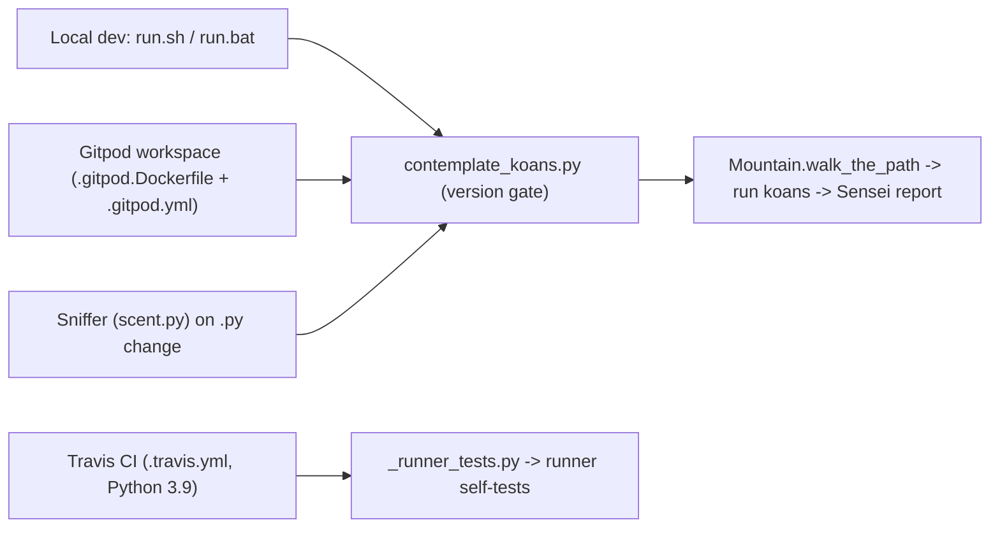
```mermaid
graph LR
    DEV["Local dev: run.sh / run.bat"] --> ENTRY["contemplate_koans.py (version gate)"]
    GITPOD["Gitpod workspace (.gitpod.Dockerfile + .gitpod.yml)"] --> ENTRY
    SNIFFER["Sniffer (scent.py) on .py change"] --> ENTRY
    ENTRY --> RUNKOANS["Mountain.walk_the_path -> run koans -> Sensei report"]
    TRAVIS["Travis CI (.travis.yml, Python 3.9)"] --> SELF["_runner_tests.py -> runner self-tests"]
```


## 3.7 References

The following repository files and folders were inspected as evidence for this section, followed by the cross-referenced Technical Specification sections.

**Root entry points, launchers & scripts**
- `contemplate_koans.py` - CLI entry point and Python version gate (Python 2 refusal, `< 3.7` warning); lazy `Mountain().walk_the_path` bootstrap
- `run.sh` - POSIX/Unix launcher (`python3 -B contemplate_koans.py`)
- `run.bat` - Windows Batch launcher (interpreter discovery, `C:\Python311` sample path, re-run loop)
- `scent.py` - Sniffer continuous-testing configuration (`watch_paths`, `.py` filter, `os.system` action)
- `_runner_tests.py` - runner self-test aggregator (five `unittest` test cases; the command CI runs)
- `koans.txt` - plain-text curriculum manifest (39 ordered `TestCase` entries), read as UTF-8
- `Contributor Notes.txt` - single-lesson / single-test authoring commands
- `example_file.txt` - sample plain-text exercise input

**Configuration, CI & version control**
- `.travis.yml` - Travis CI config: `language: python`, Python 3.9, `python _runner_tests.py`, email notifications
- `.gitpod.yml` - Gitpod workspace task (`python contemplate_koans.py`) and prebuild settings
- `.gitpod.Dockerfile` - Gitpod image `FROM gitpod/workspace-full:latest`; `pip3 install pytest==4.4.2 pytest-testdox mock`
- `.gitignore` - Git ignore rules (`*.pyc`, `answers`, IDE/OS files)
- `.hgignore` - parallel Mercurial ignore rules (dual-VCS support)
- `.gitmodules` - declared Git submodule `Submodule_01_Do_not_use_15Jun` (explicitly out of scope)
- `MIT-LICENSE` - MIT license (Copyright 2021 Greg Malcolm and The Status Is Not Quo)
- `README.rst` - project purpose, Python version policy, Sniffer/watcher setup, CI/cloud badges

**Engine — `runner/`**
- `runner/koan.py` - `Koan(unittest.TestCase)` base and the four sentinels; imports `unittest`, `re`
- `runner/mountain.py` - `Mountain` orchestrator; `unittest` `TestLoader.loadTestsFromName`
- `runner/sensei.py` - reporter/scorer; `from libs.colorama import init, Fore, Style` + `init()`; `re`/`os`/`glob`
- `runner/path_to_enlightenment.py` - manifest-driven discovery; `KOANS_FILENAME`; `io` UTF-8 read; `unittest.TestSuite`
- `runner/mockable_test_result.py` - `MockableTestResult(unittest.TestResult)` shim
- `runner/writeln_decorator.py` - `WritelnDecorator` stdout stream wrapper
- `runner/helper.py` - `cls_name` introspection helper (pure Python, no imports)
- `runner/runner_tests/` - runner self-tests (`test_mountain.py`, `test_sensei.py` use `from libs.mock import *`; `test_helper.py` uses the `assertEquals` alias behind the Python 3.12 caveat)

**Vendored libraries — `libs/`**
- `libs/__init__.py` - package marker enabling `libs.*` imports
- `libs/colorama/__init__.py` - vendored colorama; `VERSION = '0.2.7'`; exports `init`, `Fore`, `Back`, `Style`
- `libs/colorama/LICENSE-colorama` - colorama New BSD / BSD 3-Clause license
- `libs/colorama/` - cross-platform terminal-color implementation (`ansi.py`, `ansitowin32.py`, `initialise.py`, `win32.py`, `winterm.py`)
- `libs/mock.py` - vendored, modified `mock`; `__version__ = '0.6.0 modified by Greg Malcolm'`; BSD; used only by self-tests

**Curriculum — `koans/`**
- `koans/` - the `about_*.py` fill-in-the-blank lessons plus kata/helper modules
- `koans/about_regex.py` - uses `re`; among the koans behind the Python 3.12 `assertEquals` caveat
- `koans/about_iteration.py` - uses `functools`; also referenced in the 3.12 caveat
- `koans/about_dice_project.py` - uses `random` (dice kata)
- `koans/about_string_manipulation.py` - uses `math` and `re`
- `koans/about_decorating_with_classes.py` - uses `functools`
- `koans/about_with_statements.py` - uses `re`
- `koans/GREEDS_RULES.txt` - plain-text rules data for the Greed scoring kata

**Documentation — `docs/`**
- `docs/architecture/overview.md` - three-package layering, the `unittest` substrate, and the zero-install property
- `docs/guides/deployment.md` - deployment/execution model, Python version policy, and the Python 3.12 `assertEquals` caveat; Gitpod/Travis/Sniffer details
- `docs/getting-started/installation.md` - zero-install clone-and-run; confirmation that no `requirements.txt`/`setup.py`/`pyproject.toml` exists; the `-B` flag
- `docs/contributing/development.md` - project layout, testing workflow, and the authoritative statement that the submodule is not part of the project

**Cross-referenced Technical Specification sections**
- Section 1.2 System Overview - component naming, integration-point summary, and standard-library-only framing
- Section 1.3 Scope - in-scope integrations and the explicit out-of-scope list (server/hosting, runtime third-party deps, the declared submodule)
- Section 2.4 Implementation Considerations - system-wide technical constraints and security implications; version pins (colorama 0.2.7, mock 0.6.0-modified, `pytest==4.4.2`, Travis Python 3.9)


# 4. Process Flowchart

## 4.1 System Workflows

This section documents the **runtime, behavioral** workflows of Python Koans — the ordered sequences of steps, decision points, and error paths that occur when the system actually runs. It complements the **static** structure already documented in Section 1.2.2 (component layering) and Section 2.3 (feature dependency map, integration points, shared components); those sections describe *what wires to what*, while this section describes *what happens, in what order, and when*.

Two facts from Sections 2.4.1 and 1.2.3 frame every workflow below and are grounded in the source:

- The system runs as a **single, synchronous, in-process pass** with **no concurrency** and **one learner per process**; a full run executes 304 `unittest` assertions across 37 lessons (`runner/sensei.py`, `runner/mountain.py`).
- The repository defines **no business SLAs or timing targets**; it is an interactive local console tool whose only completion signal is a progress line plus a process **exit code** (`sys.exit(-1)` while failures remain) (`runner/sensei.py` L198, Section 2.4.1).

### 4.1.1 High-Level System Workflow

The end-to-end flow starts at a launcher, passes through the CLI version gate in `contemplate_koans.py`, and is handed to the `runner/` engine, which discovers the curriculum, runs it against the `Sensei` reporter, and prints a colorized report card back to the learner. The swim lanes below map each step to its owning **system boundary** (Learner, Launcher, CLI bootstrap, Runner engine, Curriculum/filesystem) and mark every **decision point** and **error state**.

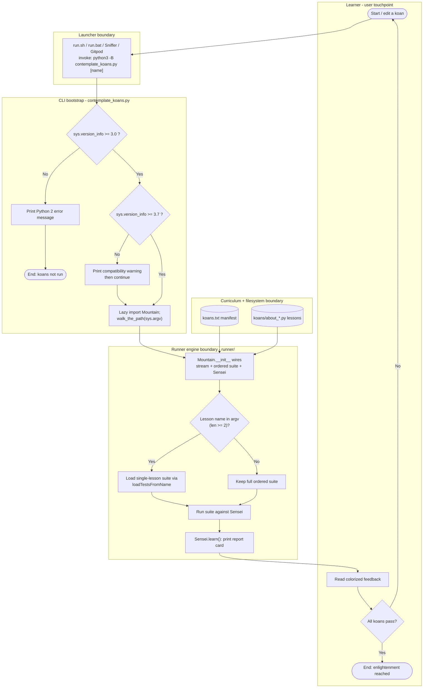
```mermaid
flowchart TD
    subgraph LEARNER["Learner - user touchpoint"]
        L1(["Start / edit a koan"])
        L2["Read colorized feedback"]
        L3{"All koans pass?"}
        L4(["End: enlightenment reached"])
    end
    subgraph LAUNCH["Launcher boundary"]
        LN1["run.sh / run.bat / Sniffer / Gitpod<br/>invoke: python3 -B contemplate_koans.py [name]"]
    end
    subgraph ENTRY["CLI bootstrap - contemplate_koans.py"]
        E1{"sys.version_info >= 3.0 ?"}
        E2["Print Python 2 error message"]
        EX(["End: koans not run"])
        E3{"sys.version_info >= 3.7 ?"}
        E4["Print compatibility warning<br/>then continue"]
        E5["Lazy import Mountain;<br/>walk_the_path(sys.argv)"]
    end
    subgraph ENGINE["Runner engine boundary - runner/"]
        G1["Mountain.__init__ wires<br/>stream + ordered suite + Sensei"]
        G2{"Lesson name in argv<br/>(len >= 2)?"}
        G3["Load single-lesson suite via<br/>loadTestsFromName"]
        G4["Keep full ordered suite"]
        G5["Run suite against Sensei"]
        G6["Sensei.learn(): print report card"]
    end
    subgraph DATA["Curriculum + filesystem boundary"]
        C1[("koans.txt manifest")]
        C2[("koans/about_*.py lessons")]
    end

    L1 --> LN1 --> E1
    E1 -- No --> E2 --> EX
    E1 -- Yes --> E3
    E3 -- No --> E4 --> E5
    E3 -- Yes --> E5
    E5 --> G1
    C1 --> G1
    C2 --> G1
    G1 --> G2
    G2 -- Yes --> G3 --> G5
    G2 -- No --> G4 --> G5
    G5 --> G6 --> L2 --> L3
    L3 -- No --> L1
    L3 -- Yes --> L4
```

**Boundaries and touchpoints.** The only human **touchpoint** is the Learner lane: editing a koan file and reading terminal feedback. The **Launcher** boundary is any of the four interchangeable ways the same entry point is invoked — `run.sh` (`python3 -B contemplate_koans.py`, L3), `run.bat`, the Sniffer action in `scent.py`, or the Gitpod task — all of which reduce to the single command documented in Section 2.3.4. The **CLI bootstrap** and **Runner engine** boundaries correspond to `contemplate_koans.py` and the `runner/` package respectively, and the **Curriculum/filesystem** boundary holds the trusted inputs (`koans.txt`, `koans/`) read at discovery time.

**Decision points.** Three gates govern the high-level flow: (1) the Python-2 refusal at `contemplate_koans.py` L38; (2) the Python-<3.7 warning-and-continue at L45; and (3) the single-lesson-vs-full-suite narrowing at `runner/mountain.py` L55 (`if args and len(args) >= 2`).

**Error state.** The only terminating error state at this level is the **Python 2 refusal**: the guard prints an instructional message and never reaches the engine import, so the koans do not run (`contemplate_koans.py` L38-L42). All other conditions (old interpreter, failing koans) continue to a report rather than aborting the flow.

**Timing.** There is **no SLA**; the run is interactive and its wall-clock cost is dominated by importing the lesson modules named in the manifest (Section 2.4.1, F-001/F-002). A full run is a single synchronous pass over all 304 koans.

### 4.1.2 Core Business Process — The Meditation Loop

The system's one "business process" is the **test-driven learning loop**: a learner replaces a deliberately-wrong sentinel with a candidate answer, runs the koans, is shown **exactly one** failing koan to "meditate on," fixes it, and repeats until the entire curriculum passes. The critical business rule — enforced in code — is that the learner is only ever pointed at the **first** unresolved koan, so progress is strictly one step at a time.

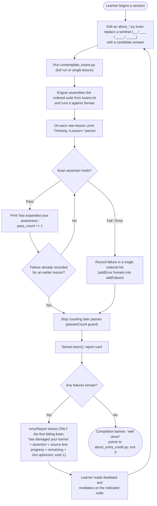
```mermaid
flowchart TD
    START(["Learner begins a session"]) --> EDIT["Edit an about_*.py koan:<br/>replace a sentinel (__ / ___ / ____ / _____)<br/>with a candidate answer"]
    EDIT --> RUN["Run contemplate_koans.py (full run or single lesson)"]
    RUN --> BUILD["Engine assembles the ordered suite from koans.txt<br/>and runs it against Sensei"]
    BUILD --> BANNER["On each new lesson: print 'Thinking &lt;Lesson&gt;' banner"]
    BANNER --> STEP{"Koan assertion holds?"}
    STEP -- "Pass" --> AWARE["Print 'has expanded your awareness';<br/>pass_count += 1"]
    AWARE --> NEXT{"Failure already recorded<br/>for an earlier lesson?"}
    NEXT -- "No" --> STEP
    NEXT -- "Yes" --> COLLECT["Stop counting later passes (passesCount guard)"]
    STEP -- "Fail / Error" --> RECORD["Record failure in a single ordered list<br/>(addError funnels into addFailure)"]
    RECORD --> COLLECT
    COLLECT --> LEARN["Sensei.learn(): report card"]
    LEARN --> HASFAIL{"Any failures remain?"}
    HASFAIL -- "Yes" --> MEDITATE["errorReport shows ONLY the first failing koan:<br/>'has damaged your karma' + assertion + source line;<br/>progress + remaining + Zen aphorism; exit(-1)"]
    MEDITATE --> READ["Learner reads feedback and<br/>meditates on the indicated code"]
    READ --> EDIT
    HASFAIL -- "No" --> DONE(["Completion banner: 'well done!'<br/>points to about_extra_credit.py; exit 0"])
```

**End-to-end journey.** After discovery, `unittest` executes the koans in manifest order against `Sensei`. `startTest` prints a `Thinking <Lesson>` banner whenever a new lesson class begins (`runner/sensei.py` L66-L71). Each passing koan prints `<test> has expanded your awareness` and increments `pass_count` (L86-L92). The first failure/error is recorded (errors are funneled into the same ordered failure list by `addError`, L106), and from that point `passesCount()` stops tallying passes that belong to a later lesson (L119). At the end of the run, `learn()` calls `errorReport()`, which uses `firstFailure()` to surface **only the earliest failing koan by source line** (L155-L173, L208-L234) — this is the enforced "one koan at a time" rule.

**Decision points.** (1) *Koan assertion holds?* — a pass vs. fail/error branch handled by `unittest` and routed through `addSuccess`/`addFailure`. (2) *Failure already recorded for an earlier lesson?* — the `passesCount()` guard (L108-L119). (3) *Any failures remain?* — the terminal branch in `learn()` (L193, L198) that chooses between the meditation exit path and the completion banner.

**Error path and recovery.** When failures remain, `errorReport()` prints the failing koan name with `has damaged your karma`, the scraped `AssertionError` message, the prompt `Please meditate on the following code:`, and a colorized traceback excerpt limited to frames under `koans/` (`scrapeInterestingStackDump`, L260-L302); the process then exits with status `-1`. **Recovery is manual and iterative**: the learner edits the indicated line and re-runs, closing the loop. When no failures remain, `learn()` prints the magenta completion banner pointing to `about_extra_credit.py` and exits normally (L199-L206).

### 4.1.3 Integration Workflows

Python Koans has **no external network, service, or database integration** (Sections 2.4.1, 3.4, 3.5); its "integrations" are (a) **intra-process module calls** between the engine collaborators, (b) a **sequential batch** execution of the test suite, (c) an optional **event-driven** file-watch re-run, and (d) **declarative CI/cloud** hooks that reuse the same entry point. The sequence diagram below traces the data flow of a single session across those collaborators.

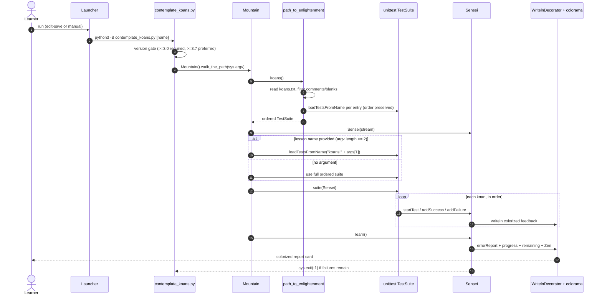
```mermaid
sequenceDiagram
    autonumber
    actor Learner
    participant Launcher
    participant CLI as contemplate_koans.py
    participant Mountain
    participant P2E as path_to_enlightenment
    participant Suite as unittest TestSuite
    participant Sensei
    participant Stream as WritelnDecorator + colorama

    Learner->>Launcher: run (edit-save or manual)
    Launcher->>CLI: python3 -B contemplate_koans.py [name]
    CLI->>CLI: version gate (>=3.0 required, >=3.7 preferred)
    CLI->>Mountain: Mountain().walk_the_path(sys.argv)
    Mountain->>P2E: koans()
    P2E->>P2E: read koans.txt, filter comments/blanks
    P2E->>Suite: loadTestsFromName per entry (order preserved)
    P2E-->>Mountain: ordered TestSuite
    Mountain->>Sensei: Sensei(stream)
    alt lesson name provided (argv length >= 2)
        Mountain->>Suite: loadTestsFromName("koans." + args[1])
    else no argument
        Mountain->>Suite: use full ordered suite
    end
    Mountain->>Suite: suite(Sensei)
    loop each koan, in order
        Suite->>Sensei: startTest / addSuccess / addFailure
        Sensei->>Stream: writeln colorized feedback
    end
    Mountain->>Sensei: learn()
    Sensei->>Stream: errorReport + progress + remaining + Zen
    Stream-->>Learner: colorized report card
    Sensei-->>CLI: sys.exit(-1) if failures remain
```

**Data flow between components.** The only data that crosses component boundaries are: the CLI arguments `sys.argv` (CLI → Mountain), the plain-text manifest `koans.txt` and the imported lesson classes (filesystem → `path_to_enlightenment` → suite), the `Sensei` result object passed as the suite's runner (Mountain → suite → Sensei), and formatted text written through the shared `WritelnDecorator`/`colorama` stream (Sensei → terminal). Notably, the suite is loaded **twice**: once in `Mountain.__init__` and independently in `Sensei.__init__`, the latter so `Sensei` can compute its own totals (`runner/sensei.py` L47; see Section 2.3.3 "shared components").

**Batch-processing sequence.** A koans run is effectively a **batch job**: `self.tests(self.lesson)` (`runner/mountain.py` L58) drives `unittest` to execute every selected koan sequentially in one pass, invoking the `startTest`/`addSuccess`/`addFailure` callbacks per test. There is no queue, no parallelism, and no partial/streamed commit — the batch runs to completion, then `learn()` emits a single consolidated report.

**Event-processing (file-watch) flow.** The only event-driven integration is optional continuous testing via Sniffer, configured in `scent.py`: `watch_paths = ['.', 'koans/']` (L37), a `@file_validator` that reacts only to non-hidden `.py` files (L40-L42), and a `@runnable` action that shells out with `os.system('python3 -B contemplate_koans.py')` (L45-L47). A file-save **event** therefore re-triggers the entire batch flow above — Sniffer is an external, separately-installed developer aid, not a runtime dependency.

**CI / cloud integration hooks.** Two declarative integrations reuse the entry points rather than calling code directly: Travis CI runs `python _runner_tests.py` on Python 3.9 to verify the *engine* (`.travis.yml`), and the Gitpod task runs `python contemplate_koans.py` to launch a learner session (`.gitpod.yml`). These are enumerated as integration points in Section 2.3.2; their detailed control flow appears in Sections 4.2.5 and 4.2.6.


## 4.2 Detailed Process Flows

This section decomposes the high-level workflow of Section 4.1 into one detailed flow per core feature. Each flow is grounded in the exact source cited inline. The six flows map to the features catalogued in Section 2.1 as follows: 4.2.1 → F-001, 4.2.2 → F-002, 4.2.3 → F-003, 4.2.4 → F-004, 4.2.5 → F-009, 4.2.6 → F-010/F-011. The cross-cutting features — colorized output (F-005), the `Koan` base and sentinels (F-006), the curriculum/katas (F-007), and the vendored libraries (F-008) — do not have standalone control flows; they appear *within* these flows and are treated further in Sections 4.4 (state) and 4.5 (error handling).

### 4.2.1 Startup & Interpreter Gating (F-001)

`contemplate_koans.py` is the single entry point. It runs only under `if __name__ == '__main__'`, applies two version checks, and then lazily imports and starts the engine. The lazy import at L59 is deliberate: it stays *after* the gate so the version messages still print on interpreters too old to import the engine cleanly (Section 2.4.2, F-001).

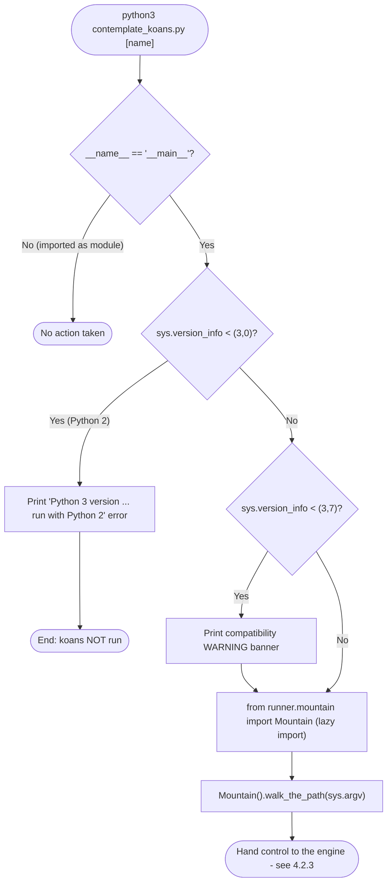
```mermaid
flowchart TD
    A(["python3 contemplate_koans.py [name]"]) --> B{"__name__ == '__main__'?"}
    B -- "No (imported as module)" --> Z(["No action taken"])
    B -- "Yes" --> C{"sys.version_info < (3,0)?"}
    C -- "Yes (Python 2)" --> D["Print 'Python 3 version ... run with Python 2' error"]
    D --> EX(["End: koans NOT run"])
    C -- "No" --> F{"sys.version_info < (3,7)?"}
    F -- "Yes" --> G["Print compatibility WARNING banner"]
    G --> H["from runner.mountain import Mountain (lazy import)"]
    F -- "No" --> H
    H --> I["Mountain().walk_the_path(sys.argv)"]
    I --> J(["Hand control to the engine - see 4.2.3"])
```

- **Decision points:** `__name__` guard (L35); Python-2 refusal (L38); Python-<3.7 warning (L45).
- **Error/terminal state:** the Python-2 branch prints guidance and reaches no engine code, so the process ends without running koans.
- **Timing:** two integer-tuple comparisons plus one import — negligible (Section 2.4.2).

### 4.2.2 Curriculum Discovery & Suite Assembly (F-002)

`runner/path_to_enlightenment.py` turns the plain-text `koans.txt` manifest into an ordered `unittest.TestSuite`. The manifest is the **contract** between lesson authors and the engine (Section 2.3.4). Order preservation is mandatory and is achieved by disabling the loader's method sort (`loader.sortTestMethodsUsing = None`, L49).

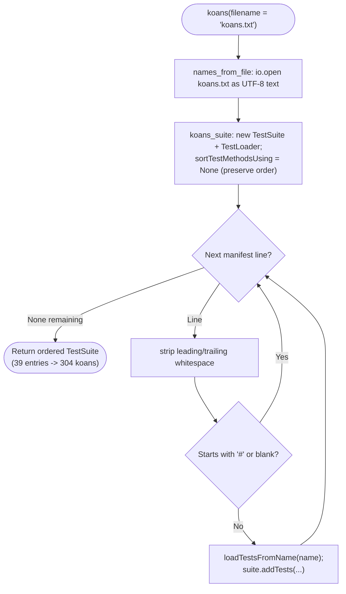
```mermaid
flowchart TD
    A(["koans(filename = 'koans.txt')"]) --> B["names_from_file: io.open koans.txt as UTF-8 text"]
    B --> C["koans_suite: new TestSuite + TestLoader;<br/>sortTestMethodsUsing = None (preserve order)"]
    C --> D{"Next manifest line?"}
    D -- "None remaining" --> H(["Return ordered TestSuite<br/>(39 entries -> 304 koans)"])
    D -- "Line" --> E["strip leading/trailing whitespace"]
    E --> F{"Starts with '#' or blank?"}
    F -- "Yes" --> D
    F -- "No" --> G["loadTestsFromName(name);<br/>suite.addTests(...)"]
    G --> D
```

- **Data validation:** comment (`#`) and blank lines are skipped (`filter_koan_names`, L22-L27); each surviving line must be an **importable** fully-qualified `TestCase` name (e.g. `koans.about_asserts.AboutAsserts`), or `loadTestsFromName` raises.
- **Ordering rule:** entries execute in manifest order — `about_asserts.AboutAsserts` first, `about_regex.AboutRegex` last; `about_proxy_object_project` contributes two entries (`AboutProxyObjectProject` and `TelevisionTest`, `koans.txt` L37-L38).
- **Scalability:** cost is linear in manifest length — one file read plus N `loadTestsFromName` imports (Section 2.4.2, F-002).

### 4.2.3 Path Orchestration & Test Execution (F-003)

`runner/mountain.py` is the orchestration hub. Its constructor wires the collaborators; `walk_the_path` optionally narrows the run to a single named target, executes the suite against `Sensei`, and triggers the report.

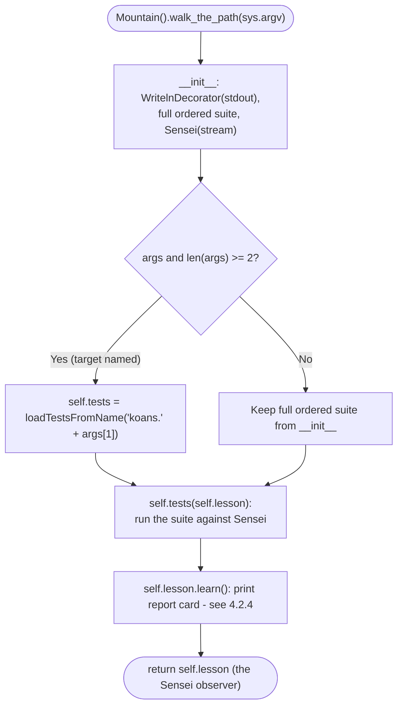
```mermaid
flowchart TD
    A(["Mountain().walk_the_path(sys.argv)"]) --> B["__init__: WritelnDecorator(stdout),<br/>full ordered suite, Sensei(stream)"]
    B --> C{"args and len(args) >= 2?"}
    C -- "Yes (target named)" --> D["self.tests = loadTestsFromName('koans.' + args[1])"]
    C -- "No" --> E["Keep full ordered suite from __init__"]
    D --> F["self.tests(self.lesson):<br/>run the suite against Sensei"]
    E --> F
    F --> G["self.lesson.learn(): print report card - see 4.2.4"]
    G --> H(["return self.lesson (the Sensei observer)"])
```

- **Narrowing rule:** the argument is prefixed with `koans.` automatically, so a learner passes `about_strings`, not `koans.about_strings` (`runner/mountain.py` L56; Section 2.4.2, F-003). The same call handles both a **single lesson** (`about_strings` → the whole `AboutStrings` `TestCase`) and a **single test** (`about_strings.AboutStrings.test_method` → one method).
- **Execution:** the suite is *callable* — `self.tests(self.lesson)` (L58) runs each koan against the `Sensei` result object in one synchronous pass.
- **Boundary:** `walk_the_path` returns the `Sensei` (L60) but, in practice, the process has already exited inside `learn()` when failures remain (see 4.2.4 and 4.5).

### 4.2.4 Progress Evaluation & Enlightenment Reporting (F-004)

`runner/sensei.py` is the reporter and scorer. It reacts to `unittest` callbacks *during* the run (banners, pass/fail tallies) and produces the consolidated "report card" in `learn()` *at the end* of the run. The diagram separates these two phases.

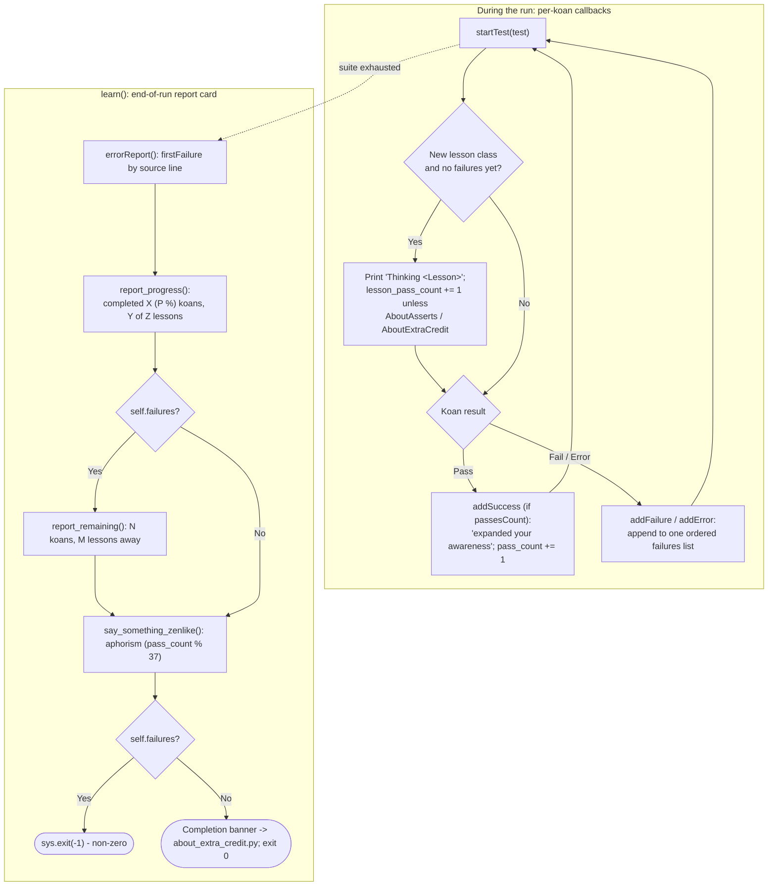
```mermaid
flowchart TD
    subgraph DURING["During the run: per-koan callbacks"]
        S1["startTest(test)"]
        S2{"New lesson class<br/>and no failures yet?"}
        S3["Print 'Thinking &lt;Lesson&gt;';<br/>lesson_pass_count += 1 unless<br/>AboutAsserts / AboutExtraCredit"]
        RES{"Koan result"}
        OK["addSuccess (if passesCount):<br/>'expanded your awareness'; pass_count += 1"]
        BAD["addFailure / addError:<br/>append to one ordered failures list"]
    end
    subgraph REPORT["learn(): end-of-run report card"]
        E1["errorReport(): firstFailure by source line"]
        E2["report_progress():<br/>completed X (P %) koans, Y of Z lessons"]
        E3{"self.failures?"}
        E4["report_remaining(): N koans, M lessons away"]
        E5["say_something_zenlike(): aphorism (pass_count % 37)"]
        E6{"self.failures?"}
        E7(["sys.exit(-1) - non-zero"])
        E8(["Completion banner -> about_extra_credit.py; exit 0"])
    end

    S1 --> S2
    S2 -- "Yes" --> S3 --> RES
    S2 -- "No" --> RES
    RES -- "Pass" --> OK --> S1
    RES -- "Fail / Error" --> BAD --> S1
    S1 -. "suite exhausted" .-> E1
    E1 --> E2 --> E3
    E3 -- "Yes" --> E4 --> E5
    E3 -- "No" --> E5
    E5 --> E6
    E6 -- "Yes" --> E7
    E6 -- "No" --> E8
```

- **Business rules:** lessons are counted on first sighting *except* `AboutAsserts` and `AboutExtraCredit` (L72-L73); passes stop being tallied once a failure exists for a lesson other than the current one (`passesCount`, L119); errors are treated exactly like failures so a single ordered list drives the report (`addError`, L106).
- **Failure selection:** `sortFailures` parses the failing source-line number from the traceback with the regex `(?<= line )\d+` and `firstFailure` returns the earliest by line (L130-L173) — coupling the feature to the `unittest` traceback text format (Section 2.4.2, F-004).
- **Computed indicators:** progress line `completed X (P %) koans and Y (out of Z) lessons`, where `P = pass_count * 100 // total_koans()` and `Z = total_lessons()` (L304-L319); `total_koans()` = `self.tests.countTestCases()` (304), `total_lessons()` = memoized glob of `koans/about*.py` minus extra credit (37) (L429-L456).

### 4.2.5 Continuous Testing Feedback Loop (F-009)

`scent.py` configures the optional Sniffer file-watcher. It is an external developer aid installed separately (`pip install sniffer`) and is **not** a runtime dependency; when active, a `.py` file save re-triggers the entire koans batch flow.

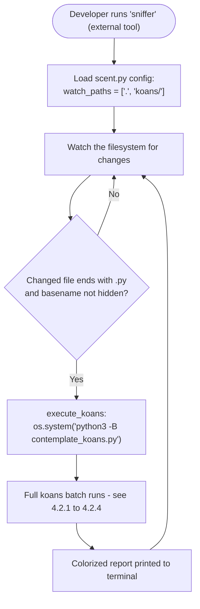
```mermaid
flowchart TD
    A(["Developer runs 'sniffer' (external tool)"]) --> B["Load scent.py config:<br/>watch_paths = ['.', 'koans/']"]
    B --> C["Watch the filesystem for changes"]
    C --> D{"Changed file ends with .py<br/>and basename not hidden?"}
    D -- "No" --> C
    D -- "Yes" --> E["execute_koans:<br/>os.system('python3 -B contemplate_koans.py')"]
    E --> F["Full koans batch runs - see 4.2.1 to 4.2.4"]
    F --> G["Colorized report printed to terminal"]
    G --> C
```

- **Event filter (validation):** `py_files` reacts only to files ending in `.py` whose basename does not start with `.` (L40-L42), so editor swap/temp files are ignored.
- **Behavior:** each trigger runs the **whole** suite (no incremental testing), so scalability is "re-execute everything per change" (Section 2.4.2, F-009). The `-B` flag suppresses `.pyc` writes.

### 4.2.6 Runner Self-Test Regression Flow (F-010 / F-011)

Distinct from the learner-facing koans, `_runner_tests.py` verifies the *engine itself*. This is the command Continuous Integration runs (Travis on Python 3.9), aggregating five fixed `TestCase`s into one suite.

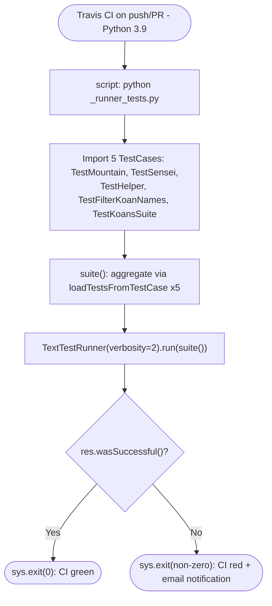
```mermaid
flowchart TD
    A(["Travis CI on push/PR - Python 3.9"]) --> B["script: python _runner_tests.py"]
    B --> C["Import 5 TestCases: TestMountain, TestSensei,<br/>TestHelper, TestFilterKoanNames, TestKoansSuite"]
    C --> D["suite(): aggregate via loadTestsFromTestCase x5"]
    D --> E["TextTestRunner(verbosity=2).run(suite())"]
    E --> F{"res.wasSuccessful()?"}
    F -- "Yes" --> G(["sys.exit(0): CI green"])
    F -- "No" --> H(["sys.exit(non-zero): CI red + email notification"])
```

- **Aggregation rule:** the five self-test cases are loaded via `loadTestsFromTestCase` and added to one `TestSuite` (`_runner_tests.py` L49-L55); the exit code is `not res.wasSuccessful()` (L60), i.e. 0 on success, non-zero on any failure.
- **Known caveat (documented, not fixed):** on **Python 3.12+**, this command fails because the self-tests call the removed `unittest.assertEquals` alias (`runner/runner_tests/test_helper.py` L14, L17); the supported path is an interpreter ≤ 3.11, matching the CI pin of 3.9 (Section 1.2.1, `.travis.yml`).
- **Timing/scale:** a small, fast, fixed suite; extended only by adding cases to `suite()` (Section 2.4.2, F-010).


## 4.3 Flowchart Requirements & Validation Rules

This section catalogues, for every major workflow above, the required flowchart elements (start/end points, decision diamonds, system boundaries, user touchpoints, error states, recovery paths, and timing) and the validation rules enforced at each step. All entries are grounded in the cited source; where the prompt anticipates enterprise constructs the repository does not implement (formal SLAs, authentication, regulatory regimes), that absence is stated explicitly rather than invented.

### 4.3.1 Workflow Elements & Timing Considerations

The seven major workflows are: **Startup & Gating** (4.2.1), **Discovery & Assembly** (4.2.2), **Orchestration & Execution** (4.2.3), **Progress & Reporting** (4.2.4), the overarching **Meditation Loop** (4.1.2), **Continuous Testing** (4.2.5), and **Self-Test / CI** (4.2.6). The two tables below enumerate their required elements.

**Start points, end points, and decision diamonds.**

| Workflow | Start point | End point(s) | Decision diamonds |
|---|---|---|---|
| Startup & Gating | `python3 contemplate_koans.py` invocation | Engine hand-off, or terminate (Python 2) | `__name__=='__main__'`; `<(3,0)`; `<(3,7)` |
| Discovery & Assembly | `koans()` call | Ordered `TestSuite` returned | line is comment/blank?; more lines? |
| Orchestration & Execution | `walk_the_path(sys.argv)` | `learn()` invoked; `Sensei` returned | `args and len(args) >= 2`? |
| Progress & Reporting | first `startTest` callback | `sys.exit(-1)` or completion banner | new lesson?; `passesCount`?; koan result?; failures remain? |
| Meditation Loop | learner edits a koan | all koans pass (enlightenment) | koan passes?; failures remain? |
| Continuous Testing | `sniffer` process started | runs until stopped by developer | changed file `.py` and non-hidden? |
| Self-Test / CI | Travis job runs `python _runner_tests.py` | exit 0 (green) or non-zero (red) | `res.wasSuccessful()`? |

**System boundaries, touchpoints, error/recovery, and timing.**

| Workflow | Boundary / touchpoint | Error state & recovery path | Timing consideration |
|---|---|---|---|
| Startup & Gating | CLI `contemplate_koans.py`; learner shell | Python-2 refusal ends the process; recovery = re-invoke with Python 3 | two comparisons + one import; negligible |
| Discovery & Assembly | filesystem ↔ `runner/` engine | misnamed/missing manifest entry → `loadTestsFromName` raises; recovery = fix `koans.txt` or the module | linear in manifest length; import-dominated |
| Orchestration & Execution | `runner/` engine | invalid single-target name → import/lookup error; recovery = correct the argument | single synchronous in-process pass |
| Progress & Reporting | `runner/` ↔ terminal (learner reads) | `sys.exit(-1)` while failures remain; recovery = edit indicated line & re-run | O(1) per callback; one memoized `glob` |
| Meditation Loop | learner ↔ terminal | first failing koan shown ("damaged your karma"); recovery = fix & re-run | interactive; **no SLA** |
| Continuous Testing | Sniffer subprocess ↔ entry point | subprocess output shown in terminal; recovery = re-save to re-trigger | full-suite re-run per change |
| Self-Test / CI | hosted CI ↔ repository | failing case → non-zero exit + email; Python 3.12 `assertEquals` caveat | small fixed suite |

**Timing and SLA considerations.** The repository defines **no service-level agreements, latency budgets, or throughput targets** — consistent with Section 2.4.1 ("The repository defines no timing SLAs"). Every workflow is an interactive, synchronous, single-process operation whose cost is dominated by importing the lesson modules named in the manifest; the only quantified figures the system exposes are *counts* (304 koans, 37 lessons, 39 manifest entries), not durations. There are no timeouts, schedulers, or deadlines anywhere in the code.

### 4.3.2 Validation Rules & Checkpoints

**Business rules and data validation at each step.** The table below lists every validation checkpoint observable in the source, classified by kind.

| Checkpoint / step | Rule enforced | Kind | Source |
|---|---|---|---|
| Interpreter gate | Refuse Python 2; warn (and continue) on `< 3.7` | Environment / business | `contemplate_koans.py` L38, L45 |
| Manifest parse | Skip `#`-comment and blank lines; keep the rest | Data validation | `runner/path_to_enlightenment.py` L22-L27 |
| Manifest names | Each entry must be an importable `koans.*` `TestCase` | Data validation | `runner/path_to_enlightenment.py` L51 |
| Order preservation | Disable method sorting to keep manifest order | Business rule | `runner/path_to_enlightenment.py` L49 |
| Argument narrowing | Require `len(args) >= 2`; auto-prefix `koans.` | Data validation | `runner/mountain.py` L55-L56 |
| Sentinel replacement | Un-edited sentinel value fails its assertion | Business rule (TDD) | `runner/koan.py` L34-L53 |
| Lesson tally | Exclude `AboutAsserts` and `AboutExtraCredit` from the lesson count | Business rule | `runner/sensei.py` L72-L73 |
| Pass-count guard | Stop tallying passes after the first cross-lesson failure | Business rule | `runner/sensei.py` L119 |
| Failure-line parse | Extract line number from traceback via `(?<= line )\d+` | Data validation | `runner/sensei.py` L145 |
| File-watch filter | React only to `.py`, non-hidden files | Data validation | `scent.py` L40-L42 |
| CI success gate | `sys.exit(not res.wasSuccessful())` | Business rule | `_runner_tests.py` L60 |

**Authorization checkpoints.** Python Koans has **no authentication or authorization subsystem** — it is a local console tool with no server, network, accounts, roles, tokens, or secrets (Section 2.4.1). The nearest analogues are: (1) the **interpreter version gate**, an *environmental precondition* rather than an access-control check (`contemplate_koans.py` L38-L54); and (2) the implicit **trust boundary** — discovery imports and executes arbitrary `koans.*` modules named in `koans.txt`, so the manifest and lesson files are **trusted inputs** that run with the invoking user's operating-system privileges. There is no privilege separation and no escalation path; the security posture is discussed in Sections 2.4.1 and 3.4.

**Regulatory compliance checks.** No regulatory or data-protection regime applies: the application collects no personal data, performs no network I/O, and stores no persistent state (Section 3.5). The only compliance-like obligations are **licensing** ones, which the repository satisfies structurally rather than at runtime: the project ships under the MIT license (`MIT-LICENSE`), and the vendored third-party code retains its own license — `colorama` under BSD 3-Clause (`libs/colorama/LICENSE-colorama`, version `0.2.7`) and a modified `mock 0.6.0` under BSD (`libs/mock.py`). Section 2.4.2 (F-008) records that retaining `LICENSE-colorama` is an explicit maintenance requirement.


## 4.4 State Management

Python Koans holds **all state in memory for the duration of a single process** and persists nothing between runs (Sections 2.4.1, 3.5). This section documents the transient state transitions that occur during a run, the (deliberate absence of) persistence points, the one in-code cache, and the natural transaction boundaries.

### 4.4.1 State Transitions

There is no saved status field or durable state machine in the code; the only state transitions are the **transient, in-process** ones tracked by `Sensei` as the suite runs — principally the *pass-counting regime* governed by `passesCount()` (`runner/sensei.py` L108-L119). The diagram models a koan's progression through the run and the session's counting regime.

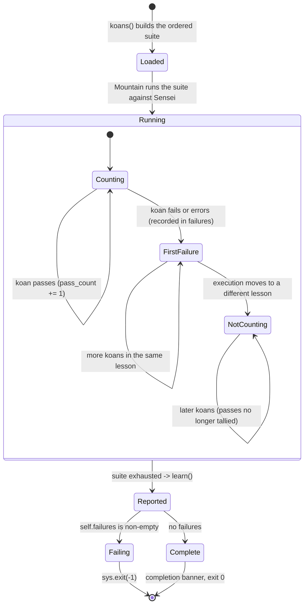
```mermaid
stateDiagram-v2
    [*] --> Loaded: koans() builds the ordered suite
    Loaded --> Running: Mountain runs the suite against Sensei

    state Running {
        [*] --> Counting
        Counting --> Counting: koan passes (pass_count += 1)
        Counting --> FirstFailure: koan fails or errors (recorded in failures)
        FirstFailure --> FirstFailure: more koans in the same lesson
        FirstFailure --> NotCounting: execution moves to a different lesson
        NotCounting --> NotCounting: later koans (passes no longer tallied)
    }

    Running --> Reported: suite exhausted -> learn()
    Reported --> Failing: self.failures is non-empty
    Reported --> Complete: no failures
    Failing --> [*]: sys.exit(-1)
    Complete --> [*]: completion banner, exit 0
```

- **Loaded → Running:** the ordered suite is built by `path_to_enlightenment.koans()` and executed via `self.tests(self.lesson)` (`runner/mountain.py` L35, L58).
- **Counting → FirstFailure:** the first failing/erroring koan is appended to the single ordered `failures` list (`addFailure`/`addError`, L106, L128).
- **FirstFailure → NotCounting:** once `prevTestClassName` differs from the lesson of the first failure, `passesCount()` returns `False`, so subsequent passes are no longer tallied (L119) — this is what makes the report focus on the earliest incomplete lesson.
- **Reported → Failing / Complete:** `learn()` branches on `self.failures`: non-empty → `sys.exit(-1)`; empty → the completion banner and normal exit (L193-L206).

Per-lesson banner state is also tracked via `prevTestClassName`, which advances whenever a new `TestCase` class is seen (`startTest`, L66-L67).

### 4.4.2 Data Persistence Points

There are **no data persistence points** in the running application: no database, key-value store, session file, or progress file is written (Section 3.5). Every counter — `pass_count`, `lesson_pass_count`, the `failures` list — lives only in the `Sensei` instance and is **recomputed from scratch on each invocation** (`runner/sensei.py` L48-L50). Consequently:

- The **durable state is the source itself**: the learner's edits to the `koans/about_*.py` files are the only thing that carries progress from one run to the next, because a previously-solved koan simply passes again.
- The process writes nothing back to `koans.txt` or the lessons; discovery only **reads** them (`io.open(..., 'rt')`, `runner/path_to_enlightenment.py` L36).
- The only files the interpreter would otherwise create are `.pyc` bytecode caches, and the launchers deliberately pass `-B` to suppress them (`run.sh` L3, `scent.py` L46); `.gitignore` additionally excludes `answers` and `*.pyc` (Section 3.5).

### 4.4.3 Caching Requirements

The system requires **no external cache** and defines exactly **one in-code cache**:

- **Lesson-glob memoization.** `Sensei.filter_all_lessons()` performs a filesystem `glob` of `koans/about*.py` (excluding `about_extra_credit`) and memoizes the result on `self.all_lessons`, so the scan runs at most once per session (`runner/sensei.py` L446-L456; Section 2.4.2, F-004). `total_lessons()` and `total_koans()` therefore compute their totals cheaply after the first call.
- **Bytecode caching is intentionally disabled.** The `-B` flag on the launcher command line prevents Python from writing `__pycache__/*.pyc` files (`run.sh` L3, `run.bat` L5, `scent.py` L46), trading a small startup cost for a clean working tree.

No caching layer (in-memory store, CDN, HTTP cache, etc.) is present or needed, consistent with the standard-library-only, single-process design (Sections 2.4.1, 3.5).

### 4.4.4 Transaction Boundaries

Because there is no database, there are **no ACID transactions**; the analogous "units of work" are process- and test-scoped:

- **Session boundary.** One invocation of `contemplate_koans.py` is a single, atomic unit that either exits with `-1` (failures remain) or completes normally — there is no partial commit, resumption token, or rollback (`runner/mountain.py` L58-L60, `runner/sensei.py` L198).
- **Per-koan boundary.** Each koan is an isolated `unittest` test method; a failure in one koan does not roll back or affect the pass/fail of others, and results accumulate independently in the `Sensei` result object.
- **Independent suite loads.** The suite is loaded twice within a session — once in `Mountain.__init__` and once in `Sensei.__init__` (`runner/sensei.py` L47) — as two independent read operations. Because everything runs in one process with no shared persistent state, no locking, isolation level, or coordination is required.


## 4.5 Error Handling

Error handling in Python Koans is intentionally minimal and learner-centric: a *koan failure is the expected, normal state* (an un-edited koan is supposed to fail), so the engine treats failures as the primary content to report rather than as exceptions to suppress. This section classifies the error conditions, then documents retry, fallback, notification, and recovery behavior — all grounded in the source.

### 4.5.1 Error & Failure Detection and Classification

Three distinct error categories arise, each handled differently: **environment** errors (wrong interpreter), **discovery** errors (an unloadable manifest entry), and **koan** failures/errors (a failing assertion or an exception inside a koan). Only the last is caught and formatted by the engine; environment errors are gated up front, and discovery errors propagate as ordinary Python tracebacks.

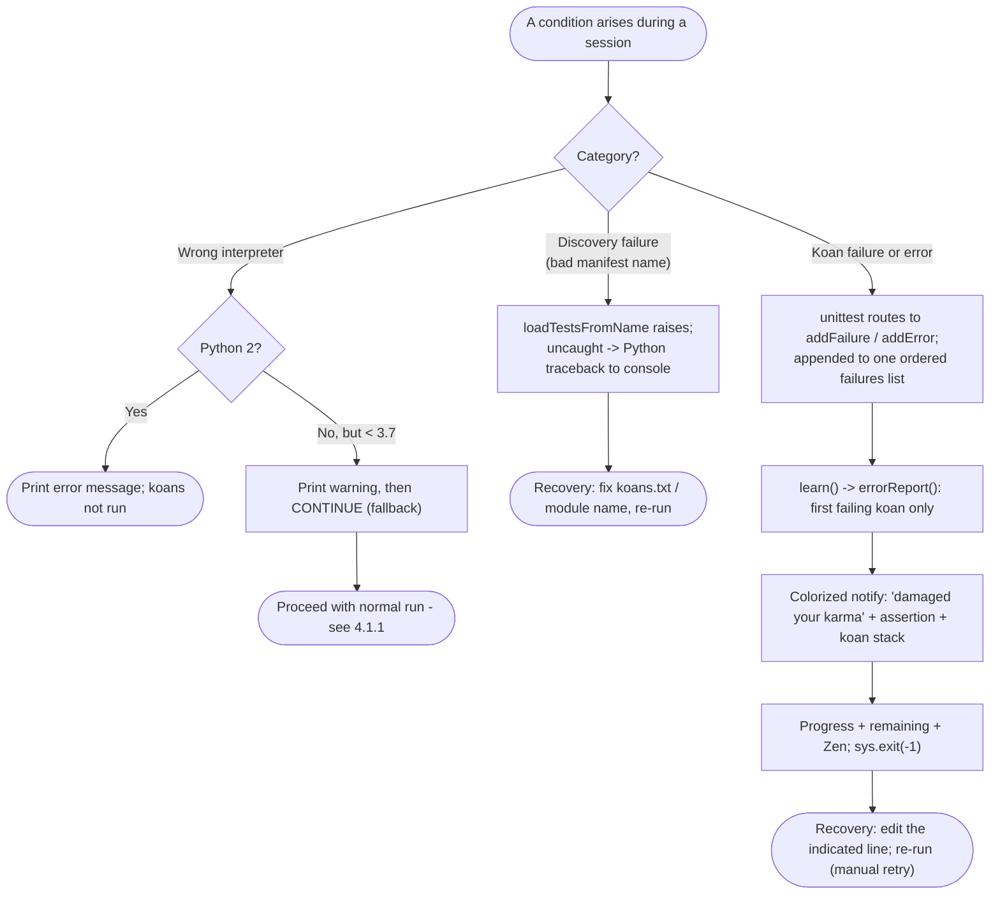
```mermaid
flowchart TD
    A(["A condition arises during a session"]) --> B{"Category?"}
    B -- "Wrong interpreter" --> C{"Python 2?"}
    C -- "Yes" --> C1(["Print error message; koans not run"])
    C -- "No, but < 3.7" --> C2["Print warning, then CONTINUE (fallback)"]
    C2 --> ZC(["Proceed with normal run - see 4.1.1"])
    B -- "Discovery failure<br/>(bad manifest name)" --> D["loadTestsFromName raises;<br/>uncaught -> Python traceback to console"]
    D --> D1(["Recovery: fix koans.txt / module name, re-run"])
    B -- "Koan failure or error" --> E["unittest routes to addFailure / addError;<br/>appended to one ordered failures list"]
    E --> F["learn() -> errorReport(): first failing koan only"]
    F --> G["Colorized notify: 'damaged your karma' + assertion + koan stack"]
    G --> H["Progress + remaining + Zen; sys.exit(-1)"]
    H --> I(["Recovery: edit the indicated line; re-run (manual retry)"])
```

- **Failure vs. error unification.** A raised exception (`addError`) is deliberately funneled into `addFailure` so that failures and errors share **one ordered list**, preserving the sequence the report logic depends on (`runner/sensei.py` L94-L106).
- **First-failure focus.** Detection culminates in `firstFailure()`/`errorReport()`, which parse the failing source line from the traceback (`(?<= line )\d+`) and present **only the earliest failing koan** (`runner/sensei.py` L130-L173, L208-L234).
- **The Python 3.12 caveat as an error source.** On Python 3.12+, koans that call the removed `assertEquals` alias raise `AttributeError` at runtime — surfacing as a koan *error* (funneled through `addError`) for lesson runs, and crashing `_runner_tests.py` outright (Section 1.2.1; `koans/about_iteration.py`, `koans/about_regex.py`, `runner/runner_tests/test_helper.py`).

### 4.5.2 Retry Mechanisms

The system performs **no automatic in-process retry** of a failed koan — retrying is an explicit, human- or watcher-driven action:

- **Manual edit-and-re-run (primary).** The meditation loop of Section 4.1.2 *is* the retry mechanism: the learner fixes the indicated koan and re-invokes the entry point.
- **Interactive launcher loop.** `run.bat` wraps a run in an explicit retry prompt: after each run it asks `Test again? y or n -` and, on `y`, jumps back to the `:loop` label to run again (`run.bat` L39-L42).
- **Automatic re-run on save.** When Sniffer is active, saving any watched `.py` file automatically re-triggers a full run via `os.system('python3 -B contemplate_koans.py')` — an event-driven "retry" (`scent.py` L45-L47; Section 4.2.5).
- **CI is single-shot.** Travis runs `python _runner_tests.py` once per push/PR with no retry/backoff configured (`.travis.yml`).

### 4.5.3 Fallback Processes

Several graceful-degradation fallbacks keep the tool usable across environments:

- **Old-interpreter fallback.** Rather than aborting on Python `< 3.7`, the entry point prints a warning and **continues anyway** ("But let's see how far we get..."), a deliberate best-effort fallback (`contemplate_koans.py` L45-L54).
- **Cross-platform color fallback.** `Sensei` calls `colorama.init()` at import (`runner/sensei.py` L14-L15); the vendored `colorama` (0.2.7) wraps/translates ANSI codes so colorized output works on Windows terminals as well as Unix, without any third-party install (Sections 3.2, 3.5).
- **Mock-safe result type.** `MockableTestResult` exists precisely so that when the runner self-tests mock out `unittest.TestResult`, `Sensei` still inherits from a real, non-mocked result class and keeps functioning — a fallback that protects the reporting path under test (`runner/mockable_test_result.py` L9-L21).
- **Empty-input no-ops.** The report helpers degrade quietly: `errorReport()` returns immediately when there is no failure, and `scrapeAssertionError`/`scrapeInterestingStackDump` return an empty string on falsy input (`runner/sensei.py` L221, L246, L269), so the completion path prints cleanly with no traceback.

### 4.5.4 Error Notification & Recovery Procedures

**Notification flows.** Errors and progress are surfaced through three channels:

| Channel | What it conveys | Source |
|---|---|---|
| Colorized terminal output | First failing koan ("damaged your karma"), assertion text, "meditate on" prompt, koan stack excerpt, progress/remaining, Zen line | `runner/sensei.py` L188-L206, L208-L234 |
| Process exit code | `sys.exit(-1)` while failures remain (0 on success) — read by the shell, launchers, and CI | `runner/sensei.py` L198 |
| CI email notification | Pass/fail result of the runner self-tests | `.travis.yml` (`notifications: email`) |

**Recovery procedures** are matched to each error category from 4.5.1:

- **Koan failure/error →** edit the exact `koans/about_*.py` line the colorized stack points to, then re-run; repeat until the progress line advances (the core recovery loop, Sections 4.1.2, 4.5.2).
- **Discovery failure →** correct the offending `koans.txt` entry or the module/class name so it is importable, then re-run (Section 4.2.2; Section 2.4.2, F-002).
- **Python 3.12 `assertEquals` caveat →** the documented recovery is to run on an interpreter **≤ 3.11** (matching the CI pin of 3.9); this is recorded as a known caveat, not fixed in code (Section 1.2.1, `docs/guides/deployment.md`, `.travis.yml`).
- **`run.bat` interpreter-not-found →** the batch launcher prints `Python.exe is not in the path!` with guidance to fix the path or invoke with an explicit Python path (`run.bat` L28-L36).

There is no error queue, dead-letter store, alerting integration, or automated rollback — appropriate for a single-user, single-process console learning tool (Sections 2.4.1, 3.4).


## 4.6 References

The following repository files and folders were inspected as the evidentiary basis for the workflows, diagrams, and rules documented in Section 4. Line references appear inline in the text above.

**Entry point and launchers**

- `contemplate_koans.py` - the CLI bootstrap; established the `__name__` guard, the Python-2 refusal (L38) and `< 3.7` warning-and-continue (L45), and the lazy `Mountain().walk_the_path(sys.argv)` hand-off (L59-L61) — the basis of Sections 4.1.1 and 4.2.1.
- `run.sh` - the Unix launcher (`python3 -B contemplate_koans.py`, L3); the `-B` bytecode-suppression evidence (Section 4.4.3).
- `run.bat` - the Windows launcher; established the interpreter-hunt fallback (L15-L36) and the interactive `Test again? y or n` retry loop (L39-L42) — Sections 4.5.2 and 4.5.4.

**Runner engine (`runner/`)**

- `runner/mountain.py` - the `Mountain` orchestrator; constructor wiring (L34-L36) and `walk_the_path` narrowing/execution/`learn()` flow (L55-L60) — Sections 4.1.3, 4.2.3.
- `runner/path_to_enlightenment.py` - manifest discovery and suite assembly; comment/blank filtering (L22-L27), order-preserving loader (`sortTestMethodsUsing = None`, L49), and `loadTestsFromName` loop (L51) — Section 4.2.2.
- `runner/sensei.py` - the reporter/scorer; `startTest` banners and lesson tally (L52-L73), `addSuccess`/`addError`/`addFailure` and `passesCount` guard (L75-L128), `sortFailures`/`firstFailure` (L130-L173), `learn`/`errorReport` (L175-L234), progress/remaining/zen (L304-L411), and `total_*`/`filter_all_lessons` memoization (L413-L456) — Sections 4.2.4, 4.4, 4.5.
- `runner/koan.py` - the `Koan` base `TestCase` and the four sentinels `__`, `___`, `____`, `_____` (L21-L67) — Section 4.3.2 (sentinel replacement rule).
- `runner/writeln_decorator.py` - `WritelnDecorator`, the shared line-oriented output stream (L8-L31) — Sections 4.1.3, 4.5.4.
- `runner/helper.py` - `cls_name` introspection used to group/tally by lesson class (L4-L15) — Section 4.2.4.
- `runner/mockable_test_result.py` - `MockableTestResult`, the mock-safe stable result base type (L9-L21) — Section 4.5.3.
- `runner/runner_tests/` - the runner self-test package (`test_mountain`, `test_sensei`, `test_helper`, `test_path_to_enlightenment`) aggregated by CI — Section 4.2.6.
- `runner/runner_tests/test_helper.py` - source of the Python 3.12 `assertEquals` caveat (L14, L17) — Sections 4.2.6, 4.5.1.

**Curriculum (`koans/`) and manifest**

- `koans.txt` - the ordered curriculum manifest (39 entries; `about_proxy_object_project` twice at L37-L38; first `AboutAsserts`, last `AboutRegex`) — Sections 4.2.2, 4.3.2.
- `koans/` - the `about_*.py` fill-in-the-blank lessons and katas that discovery imports and executes — Sections 4.1.2, 4.5.4.
- `koans/about_extra_credit.py` - the target the completion banner points to when all koans pass — Sections 4.1.2, 4.2.4.
- `koans/about_iteration.py`, `koans/about_regex.py` - koans that call the removed `assertEquals` alias (3.12 error source) — Section 4.5.1.

**Vendored libraries (`libs/`) and licensing**

- `libs/colorama/` (version 0.2.7) - vendored cross-platform ANSI color used by `Sensei.init()`; the cross-platform color fallback — Sections 4.5.3, 4.3.2.
- `libs/colorama/LICENSE-colorama` - BSD 3-Clause license that must be retained (licensing compliance) — Section 4.3.2.
- `libs/mock.py` - the modified `mock 0.6.0` vendored test-double toolkit used by the runner self-tests — Section 4.3.2.
- `MIT-LICENSE` - the project's MIT license (licensing compliance) — Section 4.3.2.

**Tooling and CI/cloud**

- `scent.py` - the Sniffer continuous-testing config: `watch_paths` (L37), the `.py`/non-hidden file filter (L40-L42), and the `os.system` re-run action (L45-L47) — Sections 4.1.3, 4.2.5, 4.5.2.
- `_runner_tests.py` - the runner self-test aggregator: five-case `suite()` (L49-L55) and `sys.exit(not res.wasSuccessful())` (L60) — Section 4.2.6.
- `.travis.yml` - Travis CI running `python _runner_tests.py` on Python 3.9 with email notifications — Sections 4.2.6, 4.5.4.
- `.gitpod.yml` - the Gitpod task running `python contemplate_koans.py` — Section 4.1.3.
- `.gitignore` - excludes `answers` and `*.pyc` (no persisted bytecode/answers) — Section 4.4.2.
- `docs/guides/deployment.md` - documentation of the deployment model and the Python 3.12 caveat/recovery — Sections 4.2.6, 4.5.4.

**Cross-referenced Technical Specification sections**

- **1.2 System Overview** (incl. 1.2.1 the 3.12 caveat, 1.2.3 success criteria/KPIs) - terminology, capabilities, and the "no business SLA" framing.
- **2.1 Feature Catalog** - the feature IDs (F-001–F-011) to which the detailed flows in Section 4.2 map.
- **2.3 Feature Relationships** - the static dependency map, integration points, shared components, and common services that Section 4 complements with dynamic flows.
- **2.4 Implementation Considerations** (2.4.1 system-wide, 2.4.2 per-feature) - the no-SLA, single-synchronous-pass, no-persistence, trust-boundary, and failure-regex constraints.
- **3.2 Frameworks & Libraries**, **3.4 Third-Party Services**, **3.5 Databases & Storage** - the vendored-library, no-external-service, and no-persistence/no-cache stances reflected in Sections 4.4 and 4.5.

No external web sources were used; every claim in Section 4 is grounded in the repository files listed above.


# 5. System Architecture

## 5.1 High-Level Architecture

Python Koans is a **single-process, command-line console application** organized as a thin, learner-friendly orchestration layer over the Python standard-library `unittest` framework. Its architecture is deliberately minimal: one CLI entry point (`contemplate_koans.py`) hands control to a small **engine** (the `runner/` package), which discovers an ordered **curriculum** (the `koans/` package) from a plain-text manifest (`koans.txt`), executes it through `unittest`, and reports colorized progress to standard output using **vendored** support code (the `libs/` package). This subsection describes the architecture style and its rationale, the core components and their relationships, the primary data flows, and the (development-time) external integration points. Component-level detail appears in §5.2, the design rationale in §5.3, and cross-cutting concerns in §5.4.

### 5.1.1 System Overview

**Architecture style and rationale.** The system is a **layered monolith** running inside a single operating-system process, with three cooperating top-level Python packages plus a CLI bootstrap (`contemplate_koans.py`, `runner/`, `koans/`, `libs/`). The engine layer follows a **pipeline (pipes-and-filters) style** for its core control flow — *discover → assemble → execute → report* — and an **xUnit test-runner style** inherited from `unittest`, in which a `TestSuite` is driven against a `TestResult` observer. The dominant design driver is pedagogical simplicity and a **zero-install** promise: the runtime imports only the Python standard library plus a single vendored dependency, so a learner needs nothing beyond a Python interpreter to begin (`runner/mountain.py`, `runner/sensei.py`, `docs/architecture/overview.md`). This choice trades away the scalability and deployment machinery of a server application — none of which this tool needs — for the lowest possible barrier to entry.

**Key architectural principles and patterns.** The following principles are directly observable in the source:

- **Separation of concerns across three packages.** `runner/` (engine: orchestration, discovery, reporting, output), `koans/` (curriculum: the editable lessons), and `libs/` (vendored third-party code) are cleanly separated, so the engine never hard-codes lesson content (`docs/architecture/overview.md`, `runner/path_to_enlightenment.py`).
- **Manifest-driven (data-driven) discovery.** The curriculum sequence lives in `koans.txt` rather than in code; `runner/path_to_enlightenment.py` reads the manifest and assembles a `unittest.TestSuite`, explicitly preserving manifest order by setting `loader.sortTestMethodsUsing = None` (`runner/path_to_enlightenment.py` L42-L53).
- **`unittest` substrate via inheritance.** Every lesson derives from `Koan(unittest.TestCase)`, and the reporter is a `unittest` result object (`Sensei(MockableTestResult)`, where `MockableTestResult(unittest.TestResult)`), making the runner a thin adapter over the standard framework (`runner/koan.py` L56-L67, `runner/sensei.py` L17, `runner/mockable_test_result.py` L9-L21).
- **Sentinel-driven TDD loop.** Four placeholder sentinels (`__`, `___`, `____`, `_____`) ship as deliberately wrong values so an un-edited koan fails loudly, enforcing a red → green → reflect cycle (`runner/koan.py` L21-L53).
- **Decorator and defensive-shim patterns.** `WritelnDecorator` transparently wraps `sys.stdout` to add `writeln()` (`runner/writeln_decorator.py`), and `MockableTestResult` exists solely to keep a real `TestResult` type available when the runner's own tests mock `unittest.TestResult` (`runner/mockable_test_result.py`).
- **Deterministic, single-threaded execution.** A run is one synchronous, in-process pass over the ordered suite; there is no concurrency, scheduling, or asynchronous work.

**System boundaries and major interfaces.** The entire system executes within one process whose only external touchpoints are the invoking shell, the local filesystem, standard output, and the process exit code. There is **no server, network listener, database, or authentication layer** (§3.5, §5.4). The **trust boundary is the repository contents**: because discovery imports and executes the modules named in `koans.txt`, those files are treated as trusted inputs (§3.5, cross-referenced from §2.4.1). The major interfaces are:

- **CLI interface** — `sys.argv`, optionally naming a single lesson or test (`contemplate_koans.py` L61, `runner/mountain.py` L55-L56).
- **Filesystem interface** — the UTF-8 manifest `koans.txt` and the `koans/about*.py` source files read via glob (`runner/path_to_enlightenment.py` L31-L39, `runner/sensei.py` L449-L451).
- **`unittest` result protocol** — `Sensei` implements the `startTest`/`addSuccess`/`addError`/`addFailure` observer callbacks the suite invokes (`runner/sensei.py` L52-L128).
- **Lesson import contract** — lessons obtain the sentinels and base class via `from runner.koan import *`, backed by `__all__` (`runner/koan.py` L21).
- **Output + exit-code interface** — colorized text to `sys.stdout` through `WritelnDecorator`, and `sys.exit(-1)` while koans remain unsolved (`runner/writeln_decorator.py`, `runner/sensei.py` L198).

The static layering below is derived directly from the engine source and depicts these packages, interfaces, and boundaries.

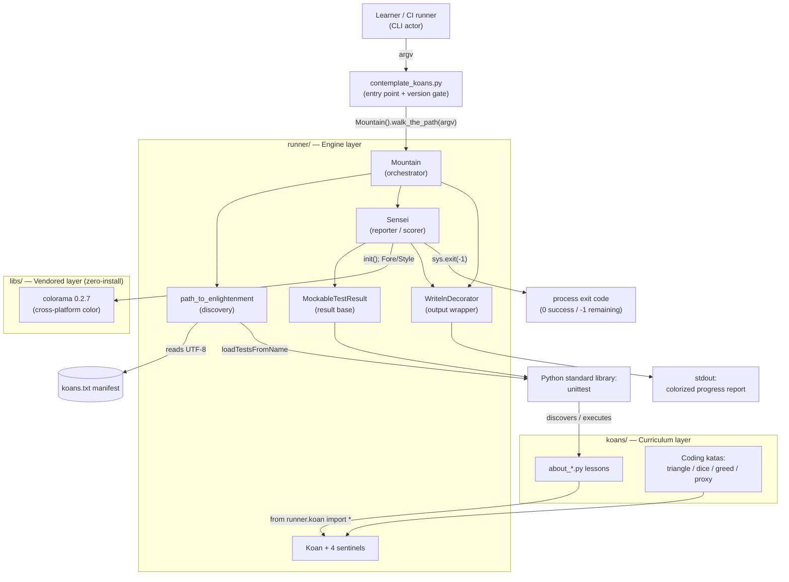
```mermaid
graph TD
    Learner["Learner / CI runner<br/>(CLI actor)"]
    CLI["contemplate_koans.py<br/>(entry point + version gate)"]
    MANIFEST[("koans.txt manifest")]
    STDOUT["stdout:<br/>colorized progress report"]
    EXIT["process exit code<br/>(0 success / -1 remaining)"]

    subgraph Engine["runner/ — Engine layer"]
        MOUNTAIN["Mountain<br/>(orchestrator)"]
        P2E["path_to_enlightenment<br/>(discovery)"]
        SENSEI["Sensei<br/>(reporter / scorer)"]
        WLD["WritelnDecorator<br/>(output wrapper)"]
        MTR["MockableTestResult<br/>(result base)"]
        KOANBASE["Koan + 4 sentinels"]
    end

    subgraph Curriculum["koans/ — Curriculum layer"]
        LESSONS["about_*.py lessons"]
        KATAS["Coding katas:<br/>triangle / dice / greed / proxy"]
    end

    subgraph Vendored["libs/ — Vendored layer (zero-install)"]
        COLORAMA["colorama 0.2.7<br/>(cross-platform color)"]
    end

    UNITTEST["Python standard library:<br/>unittest"]

    Learner -->|argv| CLI
    CLI -->|"Mountain().walk_the_path(argv)"| MOUNTAIN
    MOUNTAIN --> P2E
    MOUNTAIN --> SENSEI
    MOUNTAIN --> WLD
    P2E -->|"reads UTF-8"| MANIFEST
    P2E -->|"loadTestsFromName"| UNITTEST
    UNITTEST -->|"discovers / executes"| LESSONS
    LESSONS -->|"from runner.koan import *"| KOANBASE
    KATAS --> KOANBASE
    SENSEI --> MTR
    MTR --> UNITTEST
    SENSEI -->|"init(); Fore/Style"| COLORAMA
    SENSEI --> WLD
    WLD --> STDOUT
    SENSEI -->|"sys.exit(-1)"| EXIT
```

### 5.1.2 Core Components

The system comprises the CLI bootstrap, six engine collaborators, the curriculum, the vendored color library, and the manifest data file. The table below lists each component with its responsibility and key dependencies (kept to the documentation's column limit); a companion table captures integration points and critical considerations.

| Component | Primary Responsibility | Key Dependencies |
|---|---|---|
| `contemplate_koans.py` (CLI) | Bootstrap the session: gate the interpreter version, then start the engine | `sys`; lazily imports `runner.mountain.Mountain` |
| `Mountain` (`runner/mountain.py`) | Orchestrate one session: wire collaborators, select run mode, execute, trigger reporting | `unittest`, `path_to_enlightenment`, `Sensei`, `WritelnDecorator` |
| `path_to_enlightenment` (`runner/path_to_enlightenment.py`) | Discover and assemble the ordered `TestSuite` from the manifest | `io`, `unittest`, `koans.txt` |
| `Sensei` (`runner/sensei.py`) | Score progress, format the report card, drive the exit code | `MockableTestResult`, `helper`, `path_to_enlightenment`, `libs.colorama` |
| `Koan` + sentinels (`runner/koan.py`) | Provide the shared `TestCase` base and the four fill-in placeholders | `unittest` |
| `WritelnDecorator` (`runner/writeln_decorator.py`) | Wrap `sys.stdout` to add line-oriented `writeln()` | `sys` (wraps any file-like stream) |
| `MockableTestResult` (`runner/mockable_test_result.py`) | Provide a stable, non-mocked concrete `TestResult` base | `unittest` |
| `helper.cls_name` (`runner/helper.py`) | Return an object's class name for lesson grouping | none (pure function) |
| `koans/` curriculum | Hold the editable `about_*.py` lessons and coding katas | `runner.koan` (sentinels + base) |
| `libs/colorama` (vendored) | Supply cross-platform terminal color without an install step | none (self-contained) |
| `koans.txt` (manifest) | Declare the ordered list of 39 `TestCase` entries to load | consumed by `path_to_enlightenment` |

The following table records each component's integration points and critical considerations.

| Component | Integration Points & Critical Considerations |
|---|---|
| `contemplate_koans.py` (CLI) | Invoked by `run.sh`/`run.bat`/Gitpod/Sniffer; **critical:** refuses to run under Python 2 and warns (but continues) under < 3.7 (`contemplate_koans.py` L38-L54) |
| `Mountain` | Single hand-off target from the CLI; **critical:** run mode is chosen by argv length (`len(args) >= 2` narrows to one lesson) and it auto-prepends the `koans.` package prefix (`runner/mountain.py` L55-L56) |
| `path_to_enlightenment` | Reads the filesystem manifest; feeds the suite to `Mountain` and `Sensei`; **critical:** must preserve teaching order via `sortTestMethodsUsing = None` and skips `#` comment/blank lines |
| `Sensei` | Receives `unittest` result callbacks; writes through `WritelnDecorator`; **critical:** errors are funneled into failures (one ordered list), only the first failing koan is reported, and `sys.exit(-1)` fires while work remains (`runner/sensei.py` L94-L106, L198) |
| `Koan` + sentinels | Imported by every lesson via `from runner.koan import *`; **critical:** the four sentinels are intentionally wrong and are never given answers in code |
| `WritelnDecorator` | Sits between `Sensei` and `sys.stdout`; **critical:** transparently delegates unknown attributes, so it must not shadow real stream methods (`runner/writeln_decorator.py` L16-L21) |
| `MockableTestResult` | Superclass of `Sensei`; **critical:** exists only so mocking `unittest.TestResult` in the runner's own tests does not break the real reporting path |
| `helper.cls_name` | Used by `Sensei` to detect lesson boundaries and group failures; **critical:** correctness of the "Thinking" banner and lesson counting depends on it |
| `koans/` curriculum | Loaded by name via the manifest; **critical:** 304 koans / 37 lessons at runtime; two entries share `about_proxy_object_project.py`; several lessons use the `assertEquals` alias removed in Python 3.12 (§1.2.1) |
| `libs/colorama` | Imported and `init()`-ed at `Sensei` import time; **critical:** it is the sole vendored **runtime** dependency; `libs/mock.py` is test-only |
| `koans.txt` (manifest) | Read at startup by discovery and by `Sensei` (for totals); **critical:** an unloadable entry surfaces as an uncaught Python traceback (§4.5) |

### 5.1.3 Data Flow Description

**Primary data flows between components.** A session is a single, linear flow of data through the engine (`contemplate_koans.py`, `runner/mountain.py`, `runner/sensei.py`):

1. The learner (or CI) invokes the CLI with `sys.argv`; the entry point performs a version check and, on success, constructs a `Mountain` and calls `walk_the_path(sys.argv)` (`contemplate_koans.py` L59-L61).
2. `Mountain.__init__` wraps `sys.stdout` in a `WritelnDecorator`, asks `path_to_enlightenment.koans()` for the default ordered suite, and creates a `Sensei` bound to the wrapped stream (`runner/mountain.py` L34-L36).
3. `path_to_enlightenment` reads `koans.txt` as UTF-8, filters comment/blank lines into a stream of fully-qualified `TestCase` names, and loads each into an order-preserving `unittest.TestSuite` (`runner/path_to_enlightenment.py` L17-L53).
4. `Mountain.walk_the_path` optionally narrows the suite to a single named lesson, then runs the suite **against the `Sensei` result object**; `unittest` drives `Sensei` via `startTest`/`addSuccess`/`addError`/`addFailure` callbacks (`runner/mountain.py` L55-L58, `runner/sensei.py` L52-L128).
5. `Sensei.learn()` emits the end-of-run report — the first failing koan, the progress and remaining lines, and a Zen aphorism — through the `WritelnDecorator` to `sys.stdout`, and exits non-zero if any failures remain (`runner/sensei.py` L175-L206).

**Integration patterns and protocols.** All inter-component communication is **in-process Python method invocation** — there is no wire protocol, serialization, or IPC. The two structural contracts are (a) the `unittest` **observer protocol** between the running suite and the `Sensei` result object, and (b) the `from runner.koan import *` **module contract** between the engine and the lessons. The only OS-level "protocols" are line-oriented **text on `sys.stdout`** and the **process exit code** consumed by the shell, launchers, and CI (`runner/writeln_decorator.py`, `runner/sensei.py` L198).

**Data transformation points.** Data changes shape at well-defined stages:

- **Manifest text → names:** `filter_koan_names` strips whitespace and drops `#`/blank lines, yielding fully-qualified `TestCase` names (`runner/path_to_enlightenment.py` L17-L28).
- **Names → objects → suite:** `koans_suite` resolves each name via `loadTestsFromName` and appends it to an order-preserving `TestSuite` (`runner/path_to_enlightenment.py` L42-L53).
- **Test outcomes → tallies:** `unittest` callbacks convert pass/fail/error events into in-memory counters and a single ordered failures list (`runner/sensei.py` L75-L128).
- **Traceback → learner feedback:** a regex (`(?<= line )\d+`) parses the failing source line, `scrapeAssertionError` extracts the assertion message, and `scrapeInterestingStackDump` keeps only frames under `koans/` and colorizes `about_*.py`/`line N` references (`runner/sensei.py` L130-L153, L236-L302).
- **Counters → report strings:** `report_progress`/`report_remaining` render the "completed X (P %) koans and Y (out of Z) lessons" / "N koans and M lessons away" lines (`runner/sensei.py` L304-L337).
- **ANSI codes → platform output:** vendored `colorama` translates ANSI color sequences for the host terminal (`runner/sensei.py` L14-L15, `libs/colorama/`).

**Key data stores and caches.** The system has **no persistent store, database, or external cache** (§3.5). All state is **in-memory and per-process**: the assembled `TestSuite` (`self.tests`), the ordered `failures` list, the `pass_count`/`lesson_pass_count` tallies, and a single **memoized glob cache** of lesson files (`self.all_lessons`, populated once by `filter_all_lessons`) (`runner/sensei.py` L44-L50, L439-L456). Progress is therefore **recomputed on every run** — a fresh checkout always begins at "0 (0 %) koans" — and completion is signaled by exit code rather than saved state. The launchers pass Python's `-B` flag so no `.pyc` bytecode is written, keeping the tree stateless (`run.sh`, `run.bat`, `scent.py`). The sole output sink is `sys.stdout`.

### 5.1.4 External Integration Points

The **running application performs no network calls and integrates with no external runtime service** — it reads local files and writes to the console (§3.5, §3.4). The integration points that do exist are **development, CI, distribution, and cloud-workspace** touchpoints surrounding the tool, plus the host **Python interpreter** it runs on. Because this is an open-source learning tool rather than a hosted service, the repository **defines no service-level agreements**; the note below the table reflects that honestly. (The four-column format merges the requested "Data Exchange Pattern" and "Protocol/Format" into one column per the documentation standard.)

| System | Integration Type | Data Exchange & Protocol/Format |
|---|---|---|
| Python interpreter | Runtime host (external dependency) | In-process execution; supported CPython 3.7–3.11 (Python 2 refused, < 3.7 warned, 3.12+ `assertEquals` caveat) |
| GitHub (`gregmalcolm/python_koans`) | Source hosting & distribution | Git clone / archive download over HTTPS/SSH |
| Travis CI | Continuous integration (engine self-tests) | Runs `python _runner_tests.py` on Python 3.9; email notification |
| Gitpod | Cloud development workspace | Builds image from `.gitpod.Dockerfile`; auto-runs `python contemplate_koans.py` |
| Sniffer (external, optional) | File-watch continuous testing | Watches `.`/`koans/`; re-runs `python3 -B contemplate_koans.py` via `os.system` |
| Git submodule `Submodule_01_Do_not_use_15Jun` | Declared VCS submodule (out of scope) | Git submodule reference in `.gitmodules`; not part of the runtime |

**SLA Requirements — applicability note.** The repository specifies **no availability, latency, throughput, or uptime SLAs** for any of the above; the only enforced quality gates are the pass/fail result of the runner self-tests in Travis CI and the exit code of a koans run (`.travis.yml`, `runner/sensei.py`, cross-referenced from §1.2.3). Evidence for each integration: `README.rst`, `.travis.yml`, `.gitpod.yml`, `.gitpod.Dockerfile`, `scent.py`, `.gitmodules`, and `contemplate_koans.py` L38-L54. The `Submodule_01_Do_not_use_15Jun` submodule is listed only for completeness; its contents are out of scope and are not part of the koans runtime.


## 5.2 Component Details

This subsection specifies each major component's purpose, the technologies it uses, its key interfaces/APIs, its data-persistence needs, and its scaling considerations, followed by the required component-interaction, state-transition, and sequence diagrams. Two properties are **uniform across every component** and are stated once here to avoid repetition: (a) **data persistence** — no component persists anything; all state is in-memory and per-process, and progress is recomputed each run (§5.1.3, §3.5); and (b) **scaling** — execution is single-process, single-threaded, and synchronous, so a full run's cost is linear in the number of koans (304 assertions) with no horizontal or concurrent scaling dimension. Per-component notes below highlight only the specifics and exceptions.

### 5.2.1 CLI Bootstrap — `contemplate_koans.py`

- **Purpose and responsibilities:** the single command-line entry point; it gates the Python interpreter version and, on success, starts the engine. Under Python 2 it prints an error and does **not** run; under Python < 3.7 it prints a warning and continues anyway (`contemplate_koans.py` L38-L54).
- **Technologies and frameworks:** pure Python 3; imports only `sys` from the standard library; performs a **lazy import** of `runner.mountain.Mountain` only after the version gate passes so the version messages appear even on very old interpreters (`contemplate_koans.py` L33, L59).
- **Key interfaces and APIs:** the process `__main__` guard; input is `sys.argv`; the sole outbound call is `Mountain().walk_the_path(sys.argv)` (`contemplate_koans.py` L61).
- **Persistence / scaling:** none / trivial (a fixed set of version comparisons, then one hand-off).

### 5.2.2 `Mountain` — Session Orchestrator

- **Purpose and responsibilities:** orchestrate exactly one koans session. `__init__` wires the collaborators — it wraps `sys.stdout` in a `WritelnDecorator`, loads the default ordered suite via `path_to_enlightenment.koans()`, and creates a `Sensei` bound to that stream. `walk_the_path` selects the run mode, executes the suite against `Sensei`, and triggers the report (`runner/mountain.py` L23-L60).
- **Technologies and frameworks:** Python 3 + standard-library `unittest` (for `TestLoader().loadTestsFromName(...)`); collaborates with the three engine peers `path_to_enlightenment`, `Sensei`, and `WritelnDecorator`.
- **Key interfaces and APIs:** `Mountain()` constructor; `walk_the_path(args=None)` returns the `Sensei` that observed the run. Run-mode selection: when `args and len(args) >= 2`, the suite is replaced by `unittest.TestLoader().loadTestsFromName("koans." + args[1])`; otherwise the full suite runs (`runner/mountain.py` L55-L56).
- **Persistence / scaling:** none; holds the suite and `Sensei` for the session's duration. One `Mountain` equals one process/one learner; no pooling or reuse across runs.

### 5.2.3 `path_to_enlightenment` — Curriculum Discovery

- **Purpose and responsibilities:** turn the plain-text manifest into a runnable, order-preserving `unittest.TestSuite`. It is the canonical discovery-and-loading module (`runner/path_to_enlightenment.py`).
- **Technologies and frameworks:** Python 3 standard library — `io` (UTF-8 file read) and `unittest` (`TestSuite`, `TestLoader`).
- **Key interfaces and APIs:** module constant `KOANS_FILENAME = 'koans.txt'`; functions `filter_koan_names(lines)` (generator: strip, skip `#`/blank), `names_from_file(filename)` (UTF-8 read), `koans_suite(names)` (builds the suite; sets `loader.sortTestMethodsUsing = None` to **preserve teaching order**), and `koans(filename=KOANS_FILENAME)` (the public entry point) (`runner/path_to_enlightenment.py` L14-L62).
- **Persistence / scaling:** reads one manifest file per call; returns an in-memory suite. Cost is linear in manifest entries (39) and total koans (304); called once by `Mountain` and once by each `Sensei` (for totals).

### 5.2.4 `Sensei` — Reporter and Scorer

- **Purpose and responsibilities:** the heart of the feedback experience. As a `unittest` result object it records passes, errors, and failures; prints a "Thinking &lt;Lesson&gt;" banner per new lesson; tallies koans and lessons cleared; and, at the end of the run, reports progress, points the learner at the first failing koan, offers a Zen aphorism, and sets the exit code (`runner/sensei.py` L17-L456).
- **Technologies and frameworks:** Python 3 standard library — `unittest`, `re` (traceback parsing), `sys` (`exit`), `os`/`glob` (lesson-file discovery); plus the vendored `libs.colorama` (`init`, `Fore`, `Style`), initialized at import (`runner/sensei.py` L4-L15).
- **Key interfaces and APIs:** result callbacks `startTest`, `addSuccess`, `addError` (funnels into `addFailure`), `addFailure`; scoring/reporting helpers `passesCount`, `sortFailures`, `firstFailure`, `errorReport`, `scrapeAssertionError`, `scrapeInterestingStackDump`, `report_progress`, `report_remaining`, `say_something_zenlike`; totals `total_koans` (`self.tests.countTestCases()` → 304), `total_lessons`/`filter_all_lessons` (glob `koans/about*.py` minus `about_extra_credit` → 37, memoized); and `learn()` which emits the final report and calls `sys.exit(-1)` while failures remain (`runner/sensei.py` L52-L206, L304-L456).
- **Persistence / scaling:** the only cache in the system — `self.all_lessons` memoizes the lesson-file glob so repeated `total_lessons`/`report_remaining` calls avoid re-globbing (`runner/sensei.py` L449-L456). Note that even in single-lesson mode the `total_koans`/`total_lessons` denominators reflect the **full** curriculum, because `__init__` loads the full suite for scoring (`runner/sensei.py` L47).

### 5.2.5 `Koan` Base Class and Sentinels — `runner/koan.py`

- **Purpose and responsibilities:** define the exercise surface every lesson builds on. `Koan(unittest.TestCase)` is the empty shared superclass; the four sentinels are deliberately wrong placeholders the learner replaces (`runner/koan.py` L21-L67).
- **Technologies and frameworks:** Python 3 standard-library `unittest` (base class) and `re` (imported at module scope).
- **Key interfaces and APIs:** `__all__ = ["__", "___", "____", "_____", "Koan"]`, consumed by lessons via `from runner.koan import *`. The sentinels are, by intent only: `__` a fill-in string, `___` an `Exception` subclass, `____` a true/false placeholder, and `_____` a numeric placeholder — each ships with an obviously-wrong value so an un-edited koan fails loudly (`runner/koan.py` L21-L53).
- **Persistence / scaling:** none; these are module-level constants and an empty class definition.

### 5.2.6 Output and Result Support Utilities

Three small utilities support the reporting path:

- **`WritelnDecorator` (`runner/writeln_decorator.py`):** a transparent stream wrapper adapted from legacy `unittest`. It stores the wrapped stream, delegates unknown attribute access via `__getattr__`, and adds `writeln(arg=None)` which writes the optional argument then a newline. **Interface:** `WritelnDecorator(stream)`, `writeln(...)`, and pass-through of every other stream method. No persistence; O(1) per write (`runner/writeln_decorator.py` L8-L31).
- **`MockableTestResult` (`runner/mockable_test_result.py`):** a behavior-free concrete `unittest.TestResult` subclass (body `pass`) that `Sensei` extends. Its sole purpose is to keep a real, non-mocked `TestResult` available when the runner's own tests mock `unittest.TestResult` (`runner/mockable_test_result.py` L9-L21).
- **`helper.cls_name(obj)` (`runner/helper.py`):** a one-line introspection utility returning `obj.__class__.__name__`, used by `Sensei` to detect lesson boundaries and group failures by lesson class (`runner/helper.py` L4-L15).

### 5.2.7 `koans/` Curriculum and Coding Katas

- **Purpose and responsibilities:** the editable curriculum — the content the tool exists to teach. It holds ~38 `about_*.py` lesson modules plus supporting kata targets and import-demo helpers (`koans/`).
- **Technologies and frameworks:** Python 3; each lesson does `from runner.koan import *` and defines a `Koan` subclass whose `test_*` methods are the koans. Two exercise styles exist: **fill-in-the-sentinel** (e.g., `self.assertEqual(__, 1 + 1)` in `koans/about_asserts.py`) and **implement-the-code katas** where a stub must be completed (e.g., `koans/triangle.py` defines `triangle(a, b, c)` as `pass` plus a `TriangleError(Exception)`; also the dice, Greed scoring, and proxy katas) (`koans/about_asserts.py` L4-L46, `koans/triangle.py` L19-L25).
- **Key interfaces and APIs:** discovered **by fully-qualified name** through the manifest (e.g., `koans.about_asserts.AboutAsserts`) and by method-naming convention (`test_*`). One lesson file (`about_proxy_object_project.py`) contributes two `TestCase` entries, which is why the 39 manifest entries do not map one-to-one onto the 37 counted lessons (`koans.txt` L37-L38).
- **Persistence / scaling:** the lesson files are read from the checked-out tree (trusted inputs, §3.5). Adding koans scales the run time linearly; the manifest, not code, controls sequence, so the curriculum grows by editing `koans.txt` and adding files.

### 5.2.8 `libs/` Vendored Support Libraries

- **Purpose and responsibilities:** bundle third-party code so the tool needs no `pip install`. `libs/colorama` supplies cross-platform terminal color; `libs/mock.py` supplies a mocking toolkit (`libs/`, `docs/architecture/overview.md`).
- **Technologies and frameworks:** `libs/colorama` (version `0.2.7`) is a self-contained ANSI/Windows-console color package (`ansi.py`, `win32.py`, `winterm.py`, `ansitowin32.py`, `initialise.py`) exporting `init`, `Fore`, `Back`, `Style`, etc. `libs/mock.py` (version `0.6.0 modified by Greg Malcolm`) exposes `Mock`, `patch`, `patch_object`, `sentinel`, `DEFAULT` (`libs/colorama/__init__.py`, `libs/mock.py`).
- **Key interfaces and APIs / runtime boundary:** `Sensei` imports and initializes `colorama` at import time, making **`colorama` the sole vendored *runtime* dependency**. `libs/mock.py` is imported only by the runner's own tests (`runner/runner_tests/`), so it is a **test-only** dependency, not part of the running koans (`runner/sensei.py` L14-L15, `runner/runner_tests/`).
- **Persistence / scaling:** none; these are libraries loaded into the process.

### 5.2.9 Component Interaction Diagram

The diagram below shows the runtime object-level collaboration — which component constructs, calls, or notifies which — derived from the engine source (`runner/mountain.py`, `runner/sensei.py`).

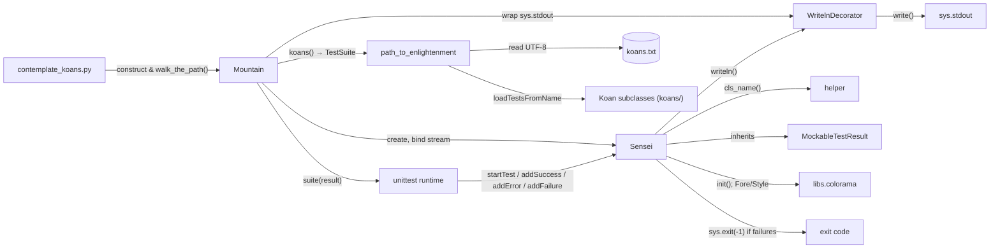
```mermaid
graph LR
    CLI["contemplate_koans.py"] -->|"construct & walk_the_path()"| M["Mountain"]
    M -->|"koans() → TestSuite"| P["path_to_enlightenment"]
    M -->|"create, bind stream"| S["Sensei"]
    M -->|"wrap sys.stdout"| W["WritelnDecorator"]
    M -->|"suite(result)"| UT["unittest runtime"]
    P -->|"read UTF-8"| MAN[("koans.txt")]
    P -->|"loadTestsFromName"| K["Koan subclasses (koans/)"]
    UT -->|"startTest / addSuccess / addError / addFailure"| S
    S -->|"cls_name()"| H["helper"]
    S -->|"inherits"| MTR["MockableTestResult"]
    S -->|"init(); Fore/Style"| CL["libs.colorama"]
    S -->|"writeln()"| W
    W -->|"write()"| OUT["sys.stdout"]
    S -->|"sys.exit(-1) if failures"| EXIT["exit code"]
```

### 5.2.10 State Transition Diagrams

**Koan meditation lifecycle.** From the learner's perspective, each koan moves through a small state machine as the edit-and-re-run loop progresses; an un-edited koan begins in the failing state and reaches "passing" only after the correct edit (`README.rst` L45-L51, `runner/koan.py` L21-L53).

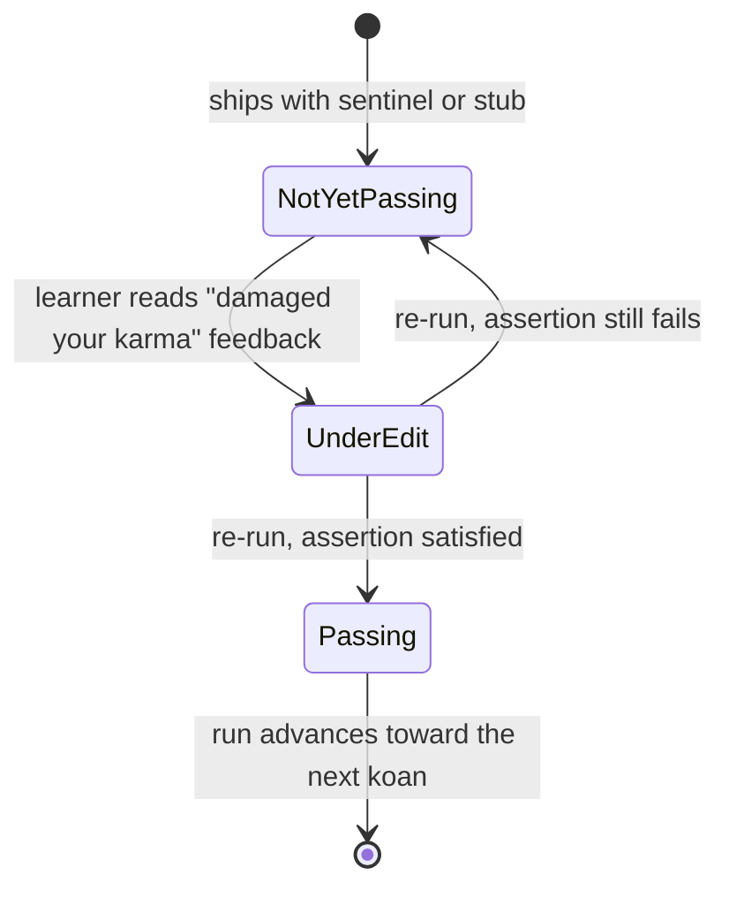
```mermaid
stateDiagram-v2
    [*] --> NotYetPassing: ships with sentinel or stub
    NotYetPassing --> UnderEdit: learner reads "damaged your karma" feedback
    UnderEdit --> NotYetPassing: re-run, assertion still fails
    UnderEdit --> Passing: re-run, assertion satisfied
    Passing --> [*]: run advances toward the next koan
```

**`Sensei` pass-counting state machine.** `Sensei` counts successes only until the first failure's lesson is left behind. The `passesCount()` guard returns true while there are no failures **or** while the first recorded failure belongs to the current lesson; once a test from a *different* lesson runs, later successes stop being tallied (`runner/sensei.py` L108-L119, L75-L92).

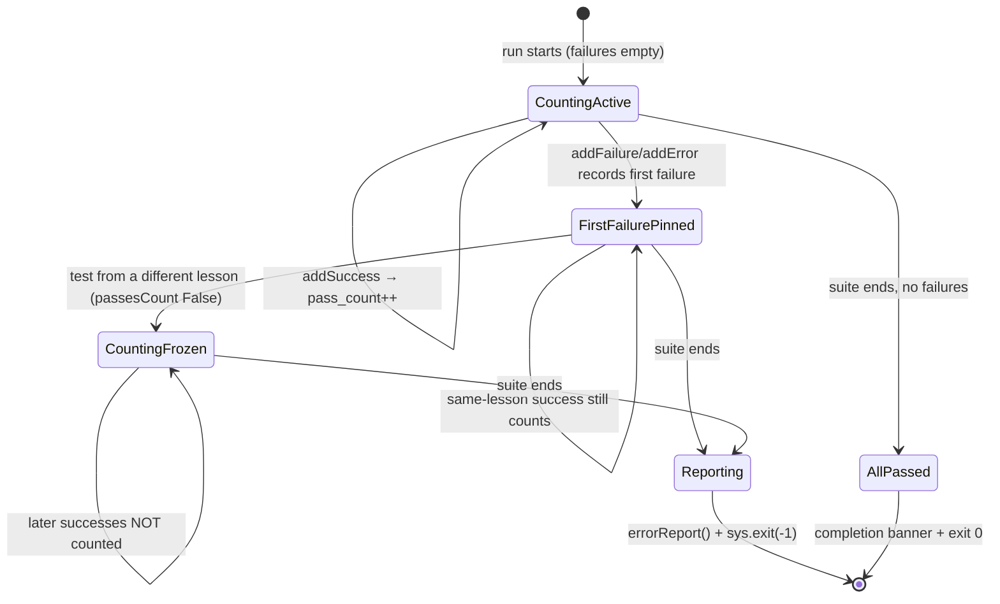
```mermaid
stateDiagram-v2
    [*] --> CountingActive: run starts (failures empty)
    CountingActive --> CountingActive: addSuccess → pass_count++
    CountingActive --> FirstFailurePinned: addFailure/addError records first failure
    FirstFailurePinned --> FirstFailurePinned: same-lesson success still counts
    FirstFailurePinned --> CountingFrozen: test from a different lesson (passesCount False)
    CountingFrozen --> CountingFrozen: later successes NOT counted
    CountingActive --> AllPassed: suite ends, no failures
    FirstFailurePinned --> Reporting: suite ends
    CountingFrozen --> Reporting: suite ends
    Reporting --> [*]: errorReport() + sys.exit(-1)
    AllPassed --> [*]: completion banner + exit 0
```

### 5.2.11 Sequence Diagrams for Key Flows

**Full-curriculum run (no argument).** The default invocation runs all 304 koans in manifest order (`contemplate_koans.py`, `runner/mountain.py`, `runner/sensei.py`).

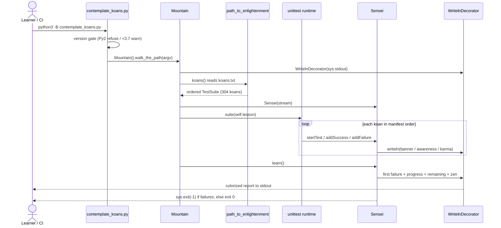
```mermaid
sequenceDiagram
    actor U as Learner / CI
    participant C as contemplate_koans.py
    participant M as Mountain
    participant P as path_to_enlightenment
    participant T as unittest runtime
    participant S as Sensei
    participant W as WritelnDecorator
    U->>C: python3 -B contemplate_koans.py
    C->>C: version gate (Py2 refuse / <3.7 warn)
    C->>M: Mountain().walk_the_path(argv)
    M->>W: WritelnDecorator(sys.stdout)
    M->>P: koans() reads koans.txt
    P-->>M: ordered TestSuite (304 koans)
    M->>S: Sensei(stream)
    M->>T: suite(self.lesson)
    loop each koan in manifest order
        T->>S: startTest / addSuccess / addFailure
        S->>W: writeln(banner / awareness / karma)
    end
    M->>S: learn()
    S->>W: first failure + progress + remaining + zen
    W-->>U: colorized report to stdout
    S-->>U: sys.exit(-1) if failures, else exit 0
```

**Single-lesson run (named argument).** Supplying a lesson name narrows the run; note that `Sensei` still scored against the full curriculum totals loaded in its constructor (`runner/mountain.py` L55-L56, `runner/sensei.py` L47).

```mermaid
sequenceDiagram
    actor U as Learner
    participant C as contemplate_koans.py
    participant M as Mountain
    participant L as unittest TestLoader
    participant T as unittest runtime
    participant S as Sensei
    participant W as WritelnDecorator
    U->>C: python3 contemplate_koans.py about_strings
    C->>M: walk_the_path(["...", "about_strings"])
    Note over M: len(args) >= 2 → narrow the run
    M->>L: loadTestsFromName("koans.about_strings")
    L-->>M: single-lesson TestSuite
    M->>T: suite(self.lesson)
    T->>S: startTest / addSuccess / addFailure
    S->>W: writeln(feedback)
    M->>S: learn()
    S->>W: first failure + progress (out of 37) + zen
    W-->>U: colorized report to stdout
```


## 5.3 Technical Decisions

This subsection records the significant architectural decisions, their rationale, and their tradeoffs, all grounded in observable code and configuration. Because Python Koans is a single-user learning tool, several "decisions" are deliberate **omissions** (no server, no persistence, no auth); these are documented as decisions in their own right. The five decision areas below are followed by a consolidated set of Architecture Decision Records (ADRs) and a runtime decision-tree diagram.

### 5.3.1 Architecture Style Decision and Tradeoffs

The system is intentionally a **layered monolithic CLI built on top of the standard-library `unittest` framework**, rather than a bespoke test engine or a client/server application. The engine is a thin adapter: lessons are `unittest.TestCase` subclasses and the reporter is a `unittest.TestResult` (`runner/koan.py` L56-L67, `runner/sensei.py` L17). This maximizes familiarity and the zero-install promise, at the cost of coupling the runner to `unittest`'s internals — most visibly, `Sensei` parses failing line numbers out of `unittest` traceback text with a regex, and the project inherits `unittest` API changes such as the Python 3.12 removal of the `assertEquals` alias (§1.2.1, `runner/sensei.py` L130-L153).

| Aspect | Chosen Approach | Primary Tradeoff |
|---|---|---|
| Deployment unit | Single process, single package tree | No scaling/HA story (not needed) |
| Test substrate | Reuse standard-library `unittest` | Coupled to `unittest` output/API |
| Concurrency | Synchronous, single-threaded pass | Run time is linear in koan count |
| Extensibility | Data-driven manifest (`koans.txt`) | Manifest errors surface as raw tracebacks |

### 5.3.2 Communication Pattern Choices

All communication is **in-process**; there is no network, RPC, message bus, or serialization anywhere in the runtime. The chosen patterns are: (1) direct **method invocation** between the CLI, `Mountain`, and the discovery/reporting collaborators; (2) the `unittest` **observer/result protocol**, whereby the running suite calls back into `Sensei` (`startTest`/`addSuccess`/`addError`/`addFailure`); (3) the `from runner.koan import *` **module contract** between engine and lessons; and (4) **OS-level signaling** — line-oriented text on `sys.stdout` plus a process **exit code** consumed by the shell, launchers, and CI (`runner/sensei.py` L52-L128, L198, `runner/koan.py` L21). This is the simplest possible choice for a one-process console tool and needs no broker, endpoint, or contract-versioning machinery.

### 5.3.3 Data Storage Solution Rationale

The deliberate decision is to have **no database, cache server, or persisted state** (§3.5). The only "storage" is the checked-out **filesystem source tree** read at startup: the UTF-8 manifest `koans.txt` and the `koans/*.py` modules. Progress is **recomputed on every run** and completion is signaled by exit code, not saved state (`runner/sensei.py`, §3.5). The rationale is that a learning tool's "state" is the learner's own edits to the koan files, which Git already versions; adding a datastore would introduce setup friction directly opposed to the zero-install goal.

### 5.3.4 Caching Strategy Justification

Caching is intentionally near-absent. The **single cache** in the system is `Sensei.all_lessons`, a memoized result of globbing `koans/about*.py`, so that repeated `total_lessons()`/`report_remaining()` calls within one run avoid re-scanning the directory (`runner/sensei.py` L439-L456). There is no cross-run or external cache. Conversely, the launchers pass Python's `-B` flag to **suppress `.pyc` bytecode caching**, deliberately trading a marginal startup cost for a clean, stateless source tree (`run.sh`, `run.bat`, `scent.py`). Both choices reflect that a short-lived, single-pass console run has little to gain from caching.

### 5.3.5 Security Mechanism Selection

The security posture is scoped to a **single-user, local process** and therefore has **no authentication, authorization, secrets, or network exposure** (§5.4). The explicit security decision is the **trust boundary: the repository contents themselves**. Discovery imports and executes whatever fully-qualified modules `koans.txt` names, so those files are treated as trusted inputs, and the tool runs with the invoking user's own privileges (§3.5, cross-referenced from §2.4.1). This is appropriate because a learner runs their own checked-out code; there is no multi-tenant or remote-input surface to defend. The one enforced runtime "gate" is the interpreter **version check**, which is a compatibility guard rather than a security control (`contemplate_koans.py` L38-L54).

### 5.3.6 Architecture Decision Records (ADRs)

The following ADRs consolidate the decisions above and their consequences. Each is traceable to source; all are **Accepted** and reflected in the current codebase.

| ADR | Decision | Rationale |
|---|---|---|
| ADR-01 | Build the runner on standard-library `unittest` (koans are `TestCase`s; `Sensei` is a `TestResult`) | Zero-install; leverages a framework learners are also studying; keeps the engine thin (`runner/koan.py`, `runner/sensei.py`) |
| ADR-02 | Data-drive the curriculum via the `koans.txt` manifest, preserving order (`sortTestMethodsUsing = None`) | Teaching sequence is editable without code changes; separates curriculum from engine (`runner/path_to_enlightenment.py`) |
| ADR-03 | Ship every koan **failing** using four wrong-by-design sentinels | Enforces the red → green → reflect TDD loop; makes progress self-evident (`runner/koan.py`) |
| ADR-04 | Vendor dependencies into `libs/` (colorama 0.2.7; mock 0.6.0-modified) | Removes any `pip install` step; cross-platform color works out of the box (`libs/`, `runner/sensei.py`) |
| ADR-05 | Funnel errors into a single ordered failures list (`addError` → `addFailure`) | Preserves the failure sequence the report logic depends on (`runner/sensei.py` L94-L106) |
| ADR-06 | Report only the first failing koan and exit non-zero while work remains | Focuses the learner on one fix; exit code signals "not done" to shell/CI (`runner/sensei.py` L155-L206) |
| ADR-07 | Gate the interpreter (refuse Python 2, warn < 3.7, otherwise continue) | Clear guidance while staying permissive; supported window is 3.7–3.11 (`contemplate_koans.py` L38-L54) |
| ADR-08 | Interpose `MockableTestResult` between `Sensei` and `unittest.TestResult` | Keeps a real result type when the runner's own tests mock `TestResult` (`runner/mockable_test_result.py`) |

| ADR | Consequences & Tradeoffs |
|---|---|
| ADR-01 | Coupled to `unittest` traceback format and API; inherits the Python 3.12 `assertEquals` removal caveat (§1.2.1) |
| ADR-02 | An unloadable manifest entry raises an uncaught traceback (a "discovery error", §4.5); ordering correctness hinges on one loader flag |
| ADR-03 | A non-zero exit is the **normal** state for an in-progress learner; "failure" is expected, not exceptional (§4.5) |
| ADR-04 | Vendored copies are pinned and older (e.g., colorama 0.2.7) and must be updated manually |
| ADR-05 | Errors and assertion failures are reported uniformly and cannot be distinguished in the report |
| ADR-06 | Later failures are hidden until earlier ones are fixed; `learn()` calls `sys.exit`, so the process terminates rather than returning a status for embedding |
| ADR-07 | The 3.12+ caveat is documented but **not fixed**; the recommended path is an interpreter ≤ 3.11 (matching the CI pin of 3.9) |
| ADR-08 | Adds one thin indirection layer purely to protect the reporting path under test |

### 5.3.7 Decision Tree — Runtime Control Decisions

The engine's runtime behavior is governed by a small tree of decisions — the interpreter gate, the run-mode selection, and the pass/fail outcome — which together determine what runs and what exit code results (`contemplate_koans.py` L38-L61, `runner/mountain.py` L55-L60, `runner/sensei.py` L188-L206).

```mermaid
flowchart TD
    Start(["Session invoked with argv"]) --> V{"sys.version_info < 3.0?"}
    V -- "Yes (Python 2)" --> Refuse["Print Python 2 error;<br/>do NOT run koans"]
    Refuse --> Stop([End])
    V -- "No" --> V37{"version < 3.7?"}
    V37 -- "Yes" --> Warn["Print compatibility warning"]
    V37 -- "No" --> Boot["Import Mountain;<br/>walk_the_path(argv)"]
    Warn --> Boot
    Boot --> Mode{"len(args) >= 2?"}
    Mode -- "Yes" --> Single["loadTestsFromName('koans.' + args[1]);<br/>single lesson or test"]
    Mode -- "No" --> Full["Full ordered suite (304 koans)"]
    Single --> Run["Run suite against Sensei"]
    Full --> Run
    Run --> Fail{"Any failures remain?"}
    Fail -- "Yes" --> Report["Report first failing koan +<br/>progress + zen; sys.exit(-1)"]
    Fail -- "No" --> Done["Completion banner; exit 0"]
    Report --> Stop
    Done --> Stop
```


## 5.4 Cross-Cutting Concerns

Cross-cutting concerns in Python Koans are scoped to what a **single-user, single-process console tool** actually needs. Several enterprise concerns (distributed tracing, metrics/APM, identity management, high-availability DR) are **deliberately absent**, and this subsection documents both what exists and what is intentionally omitted, grounded in source. Error handling is summarized here and detailed in §4.5; the storage/statelessness basis is in §3.5. The table below is the at-a-glance posture; the subsections elaborate.

| Concern | Posture | Primary Evidence |
|---|---|---|
| Monitoring & observability | Human-readable progress report + process exit code + CI email; no metrics/APM/health checks | `runner/sensei.py`, `.travis.yml` |
| Logging & tracing | Direct `stdout` writes via `WritelnDecorator`; no logging framework or trace IDs | `runner/sensei.py`, `runner/writeln_decorator.py` |
| Error handling | Three categories; errors unified with failures; first-failure focus; exit-code signal | `runner/sensei.py`, §4.5 |
| Authentication & authorization | None; runs with the invoking user's privileges; trust boundary = repo contents | §3.5, §5.3.5 |
| Performance & SLAs | No SLAs; one synchronous pass, linear in koan count | §1.2.3, §4.3 |
| Disaster recovery | Stateless; Git re-clone/reset is the only recovery path | §3.5, `.gitignore` |

### 5.4.1 Monitoring and Observability

Observability is **human-facing, not machine-facing**. The system's "telemetry" is the colorized end-of-run report that `Sensei` prints — the "Thinking &lt;Lesson&gt;" banners, per-koan "expanded your awareness" lines, the progress line (`You have completed X (P %) koans and Y (out of 37) lessons`), and the remaining-work line — plus the **process exit code** (`-1` while koans remain, `0` on completion) (`runner/sensei.py` L188-L206, L304-L337). At the CI layer, Travis emits an **email notification** with the pass/fail result of the runner self-tests (`.travis.yml`). There are **no metrics counters, no APM/tracing spans, no health-check endpoints, and no telemetry export** — appropriate for a tool with no server and no operator. The observable KPIs are exactly those the system computes: koan completion percentage, lessons completed, and self-test pass/fail (§1.2.3).

### 5.4.2 Logging and Tracing Strategy

There is **no logging framework** in the runtime: the engine imports only `glob`, `io`, `os`, `re`, `sys`, and `unittest` from the standard library (plus vendored `colorama`), and the Python `logging` module is not used. All output is written **directly to `sys.stdout`** through the `WritelnDecorator.writeln()` convenience wrapper (`runner/writeln_decorator.py` L23-L31, `runner/sensei.py`). Consequently there are no log levels, log files, structured/JSON logs, correlation IDs, or distributed-tracing context — none of which a single-process tool requires. The nearest analogue to a "trace" is the learner-oriented stack excerpt: on failure, `scrapeInterestingStackDump` filters the `unittest` traceback down to the frames under `koans/` and colorizes the `about_*.py` filename and `line N` references, giving the learner a focused pointer to the exact line to edit (`runner/sensei.py` L260-L302).

### 5.4.3 Error Handling Patterns

Error handling is **learner-centric**: a koan failure is the *expected, normal* state, so the engine treats failures as the primary content to report rather than as exceptions to suppress (§4.5). Three patterns are central and observable in `Sensei`:

- **Failure/error unification.** A raised exception (`addError`) is deliberately funneled into `addFailure`, so errors and assertion failures share **one ordered list**, preserving the sequence the report logic depends on (`runner/sensei.py` L94-L106).
- **First-failure focus.** `firstFailure()`/`errorReport()` present **only the earliest failing koan** (by parsed source line), telling the learner precisely what to "meditate on" and hiding later failures until it is fixed (`runner/sensei.py` L130-L173, L208-L234).
- **Graceful no-ops and fallbacks.** The report helpers return empty strings/early on falsy input, the entry point warns-but-continues on old interpreters, and `MockableTestResult` protects the reporting path under test (§4.5; `contemplate_koans.py` L45-L54, `runner/mockable_test_result.py`).

Three error **categories** are distinguished (detailed in §4.5): environment errors (wrong interpreter, gated up front), discovery errors (an unloadable manifest entry, which propagates as a raw Python traceback), and koan failures/errors (caught and formatted). The flow below shows the cross-cutting propagation of a koan outcome from the `unittest` callbacks to the notification channels and exit code.

```mermaid
flowchart TD
    subgraph Detection["Detection: unittest result callbacks"]
        Succ["addSuccess"]
        FailCb["addFailure"]
        ErrCb["addError"]
    end
    ErrCb -->|"funnel into failures"| FailCb
    FailCb --> OneList["Single ordered failures list"]
    Succ --> Guard{"passesCount() true?"}
    Guard -- "Yes" --> Tally["pass_count++ ; print 'expanded your awareness'"]
    Guard -- "No" --> Skip["Success not counted"]
    OneList --> Learn["learn() at end of run"]
    Tally --> Learn
    Skip --> Learn
    Learn --> Any{"Any failures?"}
    Any -- "No" --> Complete["Completion banner; exit 0"]
    Any -- "Yes" --> First["firstFailure():<br/>earliest by source line"]
    First --> Scrape["Scrape assertion text +<br/>koans/ stack frames"]
    Scrape --> Notify["Colorized notification +<br/>progress + remaining + zen"]
    Notify --> ExitCode["sys.exit(-1)"]
```

### 5.4.4 Authentication and Authorization

There is **no authentication or authorization framework** — no identities, roles, tokens, sessions, or access-control checks anywhere in the codebase. This is a correct scoping decision for a tool that a learner runs on their own machine against their own checked-out files: it executes with the **invoking user's operating-system privileges** and exposes no remote or multi-tenant surface (§5.3.5). The single relevant boundary is the **trust boundary**: because discovery imports and executes the modules named in `koans.txt`, the repository contents are the trusted input, not data arriving from an untrusted principal (§3.5). The interpreter version gate in `contemplate_koans.py` is a **compatibility** guard, not a security control (`contemplate_koans.py` L38-L54).

### 5.4.5 Performance Requirements and SLAs

The repository defines **no performance SLAs** — no latency, throughput, or uptime targets (§1.2.3, §4.3). A run is a single synchronous, in-process pass whose cost is **linear in the number of koans** (304 assertions for a full run); there is no concurrency dimension to tune. The performance-relevant design choices that do exist are modest and deliberate:

- **Lazy engine import** — `contemplate_koans.py` imports `Mountain` only after the version gate, so nothing loads on an unsupported interpreter (`contemplate_koans.py` L59).
- **Memoized lesson glob** — `Sensei.all_lessons` avoids re-scanning `koans/` on repeated total calls (`runner/sensei.py` L449-L456).
- **No bytecode write** — the `-B` launchers trade a marginal startup cost for a stateless tree (`run.sh`, `run.bat`).

The only quantitative "targets" are correctness gates: the 5 runner self-tests pass in CI on Python 3.9, and a run exits `0` only when all 304 koans pass (`_runner_tests.py`, `.travis.yml`, `runner/sensei.py`). The practical performance constraint is the **supported interpreter window** (CPython 3.7–3.11), given the Python 3.12 `assertEquals` caveat (§1.2.1).

### 5.4.6 Disaster Recovery

Because the tool is **stateless** and holds no data (§3.5), there is nothing to back up, replicate, or restore, and the repository defines **no RTO/RPO, backup schedule, or failover procedure** — none are needed. The only durable asset is the **source tree**, which is recovered through ordinary version control: a corrupted or mis-edited working copy is restored by a Git checkout/reset or re-clone, and `.gitignore`/`.hgignore` deliberately exclude a learner's local `answers` directory and `*.pyc` files so they never pollute the tree (`.gitignore`, `.hgignore`). At the run level, "recovery" from a failed run is the ordinary **edit-and-re-run loop**, optionally accelerated by the `run.bat` "Test again? y or n" prompt or Sniffer's automatic re-run on file save; CI itself is single-shot with no retry/backoff (§4.5; `run.bat`, `scent.py`, `.travis.yml`).


## 5.5 References

The following repository files, folders, and technical-specification sections were examined as direct evidence for Section 5. No web sources were used in producing this section.

**Entry point and launchers**

- `contemplate_koans.py` - The CLI bootstrap; established the version gate (Python 2 refusal, < 3.7 warning), lazy engine import, and the `Mountain().walk_the_path(sys.argv)` hand-off.
- `run.sh` - Established the Unix launcher command `python3 -B contemplate_koans.py` (the `-B`/no-bytecode choice).
- `run.bat` - Established the Windows launcher, interpreter discovery, and the "Test again? y or n" retry loop.

**Engine (`runner/`)**

- `runner/mountain.py` - `Mountain` orchestrator: constructor wiring of stream/suite/`Sensei` and the run-mode selection in `walk_the_path`.
- `runner/path_to_enlightenment.py` - Manifest discovery: `KOANS_FILENAME`, `filter_koan_names`, `names_from_file`, `koans_suite` (order preservation via `sortTestMethodsUsing = None`), and `koans`.
- `runner/sensei.py` - `Sensei` reporter/scorer: result callbacks, `passesCount`, first-failure selection, traceback scraping, progress/remaining formatting, Zen aphorisms, `total_koans`/`total_lessons`, the memoized `filter_all_lessons` cache, and `sys.exit(-1)`.
- `runner/koan.py` - The `Koan(unittest.TestCase)` base class and the four sentinels exported via `__all__`.
- `runner/writeln_decorator.py` - `WritelnDecorator` transparent stream wrapper (`__getattr__` delegation + `writeln`).
- `runner/mockable_test_result.py` - `MockableTestResult`, the mock-safe concrete `TestResult` base for `Sensei`.
- `runner/helper.py` - `cls_name(obj)` introspection helper used for lesson grouping.

**Curriculum (`koans/`) and manifest**

- `koans.txt` - The ordered curriculum manifest; established the 39 entries, comment/blank handling, and the two-entries-in-one-file proxy case.
- `koans/about_asserts.py` - Representative fill-in-the-sentinel lesson (`from runner.koan import *`, `self.assertEqual(__, 1 + 1)`).
- `koans/triangle.py` - Representative implement-the-code kata (`triangle(a, b, c)` stub + `TriangleError`).

**Vendored libraries (`libs/`)**

- `libs/colorama/__init__.py` - Established colorama version `0.2.7`, the sole vendored runtime dependency.
- `libs/mock.py` - Established mock version `0.6.0 modified by Greg Malcolm`, a test-only dependency.

**Configuration, CI, and self-tests**

- `_runner_tests.py` - The CI regression harness aggregating the five runner self-test cases and returning a CI exit code.
- `.travis.yml` - Established the CI command (`python _runner_tests.py`), the Python 3.9 pin, and email notifications.
- `.gitpod.yml` and `.gitpod.Dockerfile` - Established the Gitpod workspace task and the dev-only tool image (`pytest`, `pytest-testdox`, `mock`).
- `scent.py` - Established the Sniffer continuous-testing configuration (watch paths + `os.system` re-run).
- `.gitmodules` - Established the declared `Submodule_01_Do_not_use_15Jun` submodule (out of scope).
- `.gitignore` and `.hgignore` - Established the ignored learner `answers` directory and `*.pyc` files (statelessness).
- `README.rst` - Established the project identity, the architecture overview, the sentinel edit example, and the Python version policy.

**Folders examined**

- `runner/` - The engine package (orchestration, discovery, reporting, output, and support utilities).
- `runner/runner_tests/` - The engine's own unittest regression suite (source of the test-only `libs.mock` usage).
- `koans/` - The curriculum package of `about_*.py` lessons and coding katas.
- `libs/` and `libs/colorama/` - The vendored support code enabling the zero-install property.
- `docs/` - The documentation tree; `docs/architecture/overview.md` corroborated the three-package layering, run flow, and runtime counts.

**Cross-referenced Technical Specification sections**

- §1.2 System Overview (incl. §1.2.1 Python 3.12 caveat and §1.2.3 success criteria/KPIs) - Architecture pillars, counts, integration points.
- §2.4 Implementation Considerations - Trust boundary and no-SLA framing.
- §3.4 Third-Party Services and §3.5 Databases & Storage - No runtime services; no database/cache/persistence; statelessness.
- §4.1 / §4.3 - Workflow and timing/no-SLA context.
- §4.5 Error Handling - Error categories, retry/fallback/notification, and recovery procedures.


# 6. SYSTEM COMPONENTS DESIGN

## 6.1 Core Services Architecture

### 6.1.1 Applicability Assessment

**Core Services Architecture is not applicable for this system.** Python Koans is a single-process, command-line console application built as a thin orchestration layer over the Python standard-library `unittest` framework; it is not a microservices, service-oriented, or otherwise distributed system. It therefore has no distinct, independently deployable service components, no inter-service communication, no service discovery, no load balancing, no circuit breakers, no auto-scaling, and no failover to design or operate.

This determination is grounded in direct inspection of the repository and is consistent with the architecture already documented in §5.1 (High-Level Architecture), §5.3 (Technical Decisions), and §5.4 (Cross-Cutting Concerns):

- **One process, no server.** The system executes entirely within a single operating-system process launched by `contemplate_koans.py`; §5.1.1 characterizes it as a "layered monolith running inside a single operating-system process" with "no server, network listener, database, or authentication layer." The project's own deployment guide describes it as a standard-library-only console application with no server to deploy and no hosting infrastructure (`docs/guides/deployment.md`).
- **No network or service primitives in the code.** A repository-wide search of the runtime engine (`runner/`), the curriculum (`koans/`), the vendored libraries (`libs/`), and the root scripts found no sockets, HTTP servers, web frameworks, RPC/gRPC, message brokers, database drivers, cloud SDKs, or container-orchestration calls. The runtime engine imports only Python standard-library modules (`unittest`, `io`, `glob`, `os`, `sys`, `re`) plus the vendored `libs.colorama` for terminal color (`runner/sensei.py` L14).
- **All communication is in-process.** §5.3.2 records that there is "no network, RPC, message bus, or serialization anywhere in the runtime"; components collaborate through direct Python method calls, the `unittest` observer protocol, and a module-import contract.
- **Deterministic, single-threaded execution.** A run is one synchronous, in-process pass over an ordered suite; there is no concurrency, scheduling, or asynchronous work (§5.1.1). The sole vendored runtime dependency, `colorama`, touches only the terminal (ANSI escape codes and, on Windows, the console API via `ctypes`), never the network.
- **No persistent tier.** The tool is stateless with no database, cache server, or persisted state (§3.5, §5.3.3); progress is recomputed on every run and completion is signaled solely by the process exit code.

Because there are no services, the microservices-oriented concerns that this section would normally cover have no service-level implementation. The remainder of §6.1 documents the actual single-process topology (§6.1.2) and then, for completeness and to satisfy the required scope, records the disposition of each requested concern — service components, scalability, and resilience — together with its closest in-process analog and the rationale (§6.1.3).

The diagram below fixes the system's execution context: the entire application runs inside one process whose only touchpoints are the invoking shell, the local filesystem, standard output, and the process exit code.

**Diagram 6.1.1-A — Execution context and process boundary.** The whole system runs inside one OS process with strictly local touchpoints; there is no network, no service tier, and no external runtime dependency.

```mermaid
flowchart LR
    Shell["Shell / launcher:<br/>run.sh, run.bat, Gitpod, Sniffer"]
    FS[("Local filesystem:<br/>koans.txt, koans/*.py")]
    Out["stdout colorized report<br/>+ process exit code"]
    subgraph Proc["Single OS process (python contemplate_koans.py)"]
        App["In-process app:<br/>runner engine + koans curriculum + libs/colorama"]
    end
    Shell -->|"argv"| App
    FS -->|"read once at startup"| App
    App -->|"writeln / sys.exit(code)"| Out
```

The matrix below summarizes, for each distributed-systems building block that a Core Services Architecture would normally provide, whether it is present in this system and the basis for that finding.

| Distributed-Systems Building Block | Present in System? | Basis / Evidence |
|---|---|---|
| Independently deployable services | No | Single package tree in one process; layered monolith (§5.1.1) |
| Network-facing endpoints / listeners | No | No socket/HTTP/WSGI/`listen`/`bind` in `runner/`, `koans/`, `libs/`, or root scripts |
| Inter-service communication (REST/RPC/messaging) | No | In-process method calls + `unittest` observer protocol only (§5.3.2) |
| Service discovery / registry | No | Curriculum read from the local `koans.txt` manifest, not a service registry (`runner/path_to_enlightenment.py`) |
| Load balancer | No | One synchronous pass; one process per invocation (§5.1.1, §5.4.5) |
| Circuit breaker | No | No remote dependencies to protect (§5.3.2) |
| Message broker / queue | No | No Kafka/RabbitMQ/Celery/Redis anywhere in the runtime |
| Database / shared datastore | No | Stateless; no DB, cache, or persisted state (§3.5, §5.3.3) |
| Concurrency / async runtime | No | Deterministic single-threaded pass (§5.1.1) |
| Container / orchestration runtime | No | No application Dockerfile; the Gitpod image is a dev workspace only (§3.6) |

### 6.1.2 Monolithic Runtime Topology and In-Process Components

Although the system has no services, it is helpful to record what plays the *role* that services would play in a distributed design. The closest analog is the set of **in-process collaborators** of the `runner/` engine, coordinated by the `Mountain` orchestrator within one process. These are ordinary Python objects — not services: they share the same address space and interpreter, are never deployed or versioned independently, expose no network interface, and have no separate lifecycle. Their full responsibilities, technologies, and interfaces are documented in §5.1.2 (Core Components) and §5.2 (Component Details); this subsection presents only the interaction topology relevant to the "services" question and shows that every edge is a local call rather than a network hop.

`contemplate_koans.py` gates the interpreter version and then instantiates `Mountain`, whose constructor wires the collaborators: it wraps `sys.stdout` in a `WritelnDecorator`, asks `path_to_enlightenment.koans()` for the ordered `unittest.TestSuite`, and creates a `Sensei` bound to the wrapped stream (`runner/mountain.py` L34-L36). `Mountain.walk_the_path` then runs the suite **against** the `Sensei` result object, and `unittest` drives `Sensei` through the observer callbacks `startTest` / `addSuccess` / `addError` / `addFailure` (`runner/mountain.py` L55-L58, `runner/sensei.py` L52-L128). All of this occurs synchronously inside the one process.

**Diagram 6.1.2-A — In-process component interaction (the analog of a service-interaction diagram).** Every edge inside the boundary is a Python method or function call, and the `unittest` observer protocol is an in-memory callback — not a network call, RPC, or message.

```mermaid
flowchart TD
    subgraph OneProcess["Single process — all interaction is in-process (no network hop)"]
        CLI["contemplate_koans.py<br/>(version gate + bootstrap)"]
        MOUNTAIN["Mountain<br/>(orchestrator)"]
        P2E["path_to_enlightenment<br/>(discovery)"]
        SUITE["unittest.TestSuite<br/>(ordered koans)"]
        SENSEI["Sensei<br/>(reporter / scorer)"]
        WLD["WritelnDecorator<br/>(stdout wrapper)"]
        CLI -->|"walk_the_path(argv)"| MOUNTAIN
        MOUNTAIN -->|"koans()"| P2E
        P2E -->|"assembles"| SUITE
        MOUNTAIN -->|"run suite against result"| SUITE
        SUITE -->|"observer callbacks"| SENSEI
        SENSEI -->|"writeln()"| WLD
    end
    MANIFEST[("koans.txt + koans/*.py")]
    STDOUT["stdout + exit code"]
    P2E -.->|"reads"| MANIFEST
    WLD --> STDOUT
```

The table below maps each in-process component to the role it would occupy in a distributed system (were one required) and the mechanism by which it actually interacts. In every case the mechanism is in-process, confirming the absence of service boundaries.

| In-Process Component | Role It Plays | Interaction Mechanism |
|---|---|---|
| `contemplate_koans.py` | Entry point / bootstrap | Instantiates `Mountain`; direct call `walk_the_path(sys.argv)` |
| `Mountain` (`runner/mountain.py`) | Session orchestrator | Direct method calls to collaborators it constructs |
| `path_to_enlightenment` (`runner/path_to_enlightenment.py`) | Curriculum discovery / suite assembly | Function call `koans()`; reads local `koans.txt` |
| `Sensei` (`runner/sensei.py`) | Progress scorer / reporter | `unittest` observer callbacks (`startTest`/`addSuccess`/`addError`/`addFailure`) |
| `Koan` + 4 sentinels (`runner/koan.py`) | Shared `TestCase` base for lessons | Module-import contract `from runner.koan import *` |
| `WritelnDecorator` (`runner/writeln_decorator.py`) | Output adapter over `sys.stdout` | Direct `writeln()` calls; delegates unknown attributes to the stream |
| `MockableTestResult` (`runner/mockable_test_result.py`) | Stable `TestResult` base | Inheritance (superclass of `Sensei`) |
| `helper.cls_name` (`runner/helper.py`) | Lesson-boundary / grouping helper | Pure function call |
| `libs/colorama` (vendored) | Cross-platform terminal color | `init()` + `Fore`/`Style` constants at import (`runner/sensei.py` L14) |

The only cross-boundary interactions are with the **local operating system**: reading the source tree at startup and writing text plus an exit code to the shell. No component addresses, discovers, or calls any other component over a network, so there is nothing here that a service mesh, API gateway, or discovery mechanism would mediate.

### 6.1.3 Disposition of Service, Scalability, and Resilience Concerns

Because the system is a single-process monolith, none of the concerns enumerated in the Core Services Architecture template has a service-level implementation. For completeness and traceability, this subsection walks through each requested area — Service Components, Scalability Design, and Resilience Patterns — states its status, and documents the closest in-process analog together with the rationale, grounded in code and cross-referenced to §5. Where a concern is genuinely absent, that is recorded plainly rather than fabricated.

#### 6.1.3.1 Service Components

There are no service components; the only boundary in the system is the operating-system process boundary shown in §6.1.1. The internal responsibilities that a service decomposition would distribute are instead the in-process collaborators documented in §6.1.2 / §5.1.2. Each specific requested item is addressed below:

- **Service boundaries and responsibilities** — Not applicable. Responsibilities are separated by *package* (`runner/` engine, `koans/` curriculum, `libs/` vendored support), not by service (§5.1.1). No boundary is a deployment or network boundary.
- **Inter-service communication patterns** — Not applicable. Communication is entirely in-process: direct method invocation, the `unittest` observer protocol, and the `from runner.koan import *` module contract (§5.3.2).
- **Service discovery mechanisms** — Not applicable. The nearest analog is *curriculum* discovery: `path_to_enlightenment` reads the local `koans.txt` manifest and resolves each named `TestCase` with `unittest`'s `loadTestsFromName` (`runner/path_to_enlightenment.py` L42-L53). This is a filesystem/manifest lookup, not registration or lookup of network services.
- **Load balancing strategy** — Not applicable. A run is one synchronous pass in one process; there is no request traffic to distribute and no second instance to balance against (§5.1.1, §5.4.5).
- **Circuit breaker patterns** — Not applicable. Circuit breakers guard calls to remote dependencies; this system makes none (§5.3.2).
- **Retry and fallback mechanisms** — There is **no automatic in-process retry** of koans. "Retry" is the manual edit-and-re-run loop, optionally accelerated by the `run.bat` "Test again? y or n" prompt or Sniffer's automatic re-run on file save; CI is single-shot with no retry/backoff (§4.5, §5.4.6; `run.bat`, `scent.py`). The **fallbacks** that do exist are compatibility-oriented, not availability-oriented: the entry point warns but continues on interpreters older than 3.7 (`contemplate_koans.py` L45-L54); `colorama` degrades color safely on terminals without ANSI support; and `MockableTestResult` preserves the reporting path when the runner's own tests mock `unittest.TestResult` (§5.4.3).

| Service-Component Concern | Status | In-Process Analog / Rationale |
|---|---|---|
| Service boundaries & responsibilities | Not applicable | Package-level separation, one process (§5.1.1) |
| Inter-service communication | Not applicable | Method calls + `unittest` observer + import contract (§5.3.2) |
| Service discovery | Not applicable | Manifest-driven curriculum load from `koans.txt` (`runner/path_to_enlightenment.py`) |
| Load balancing | Not applicable | Single synchronous pass; one process per invocation (§5.4.5) |
| Circuit breaker | Not applicable | No remote dependencies to protect (§5.3.2) |
| Retry & fallback | Partial (compatibility only) | Manual edit-and-re-run; warn-and-continue; safe color; mock-safe result (§4.5, §5.4.3) |

#### 6.1.3.2 Scalability Design

Scalability, in the horizontal/vertical sense, is **not applicable**: §5.3.1 records the architecture-style tradeoff explicitly as "No scaling/HA story (not needed)." A run is a single synchronous, in-process pass whose cost is **linear in the number of koans** (304 assertions for a full run), and §5.4.5 notes there is "no concurrency dimension to tune." Each requested item is addressed below:

- **Horizontal / vertical scaling approach** — Not applicable as an application capability. The system does not scale up (no threads/processes/async to add cores to) or scale out (no clustered instances). The only way "throughput" increases is by running additional **independent, share-nothing one-shot processes** — one per learner or CI job — which requires no coordination precisely because there is no shared state (§5.1.3).
- **Auto-scaling triggers and rules** — None. There is no orchestrator, metric, or trigger; a process starts on explicit invocation and terminates when the run completes.
- **Resource allocation strategy** — None managed by the application. A run consumes the CPU and memory of one Python interpreter for its duration; the launchers pass `-B` to avoid writing `.pyc` bytecode, keeping the footprint minimal and the tree clean (`run.sh`, `run.bat`; §5.3.4).
- **Performance optimization techniques** — The modest, real optimizations are: a **lazy engine import** so nothing loads on an unsupported interpreter (`contemplate_koans.py` L59); a **memoized lesson glob** (`Sensei.all_lessons`) that avoids re-scanning `koans/` on repeated total calls (`runner/sensei.py` L439-L456); and **no bytecode write** via `-B` (§5.3.4, §5.4.5).
- **Capacity planning guidelines** — None are defined. The workload is a single-user desktop/CI invocation; the only practical constraint is the supported interpreter window (CPython 3.7–3.11, given the Python 3.12 `assertEquals` caveat) (§5.4.5).

**Diagram 6.1.3.2-A — Scalability model.** Throughput increases only by launching more independent, share-nothing one-shot processes; there is no shared service tier, load balancer, or datastore to scale.

```mermaid
flowchart TD
    subgraph Invocations["Independent, stateless one-shot invocations (share nothing)"]
        L1["Learner A desktop<br/>run.sh / run.bat"]
        L2["Learner B desktop<br/>run.sh / run.bat"]
        GP["Gitpod workspace<br/>contemplate_koans.py"]
        CI["Travis CI job<br/>_runner_tests.py"]
    end
    P1["Own Python process<br/>(full 304-koan pass)"]
    P2["Own Python process<br/>(full 304-koan pass)"]
    P3["Own Python process"]
    P4["Own Python process<br/>(engine self-tests)"]
    R1["stdout + exit code"]
    R2["stdout + exit code"]
    R3["stdout + exit code"]
    R4["pass/fail + exit code"]
    L1 --> P1
    L2 --> P2
    GP --> P3
    CI --> P4
    P1 --> R1
    P2 --> R2
    P3 --> R3
    P4 --> R4
```

| Scaling Dimension | Approach in This System | Basis |
|---|---|---|
| Vertical scaling | Not applicable | Single-threaded pass; no cores/threads to add (§5.4.5) |
| Horizontal scaling | Independent share-nothing processes | One process per learner/CI job; no shared state (§5.1.3) |
| Auto-scaling | None | No orchestrator, metric, or trigger |
| Resource allocation | Unmanaged; one interpreter per run | `-B` avoids `.pyc`; minimal footprint (§5.3.4) |
| Capacity planning | None defined | Single-user workload; interpreter window 3.7–3.11 (§5.4.5) |

#### 6.1.3.3 Resilience Patterns

Service-level resilience (redundant instances, failover, disaster recovery) is **not applicable** to a stateless single-process tool. The genuine resilience property that does exist is **fault isolation at the `unittest` boundary**: a koan that fails an assertion or raises an exception is captured as a result event rather than crashing the run, so failures neither abort the pass nor cascade. Each requested item is addressed below:

- **Fault tolerance mechanisms** — The `unittest` substrate executes each koan in isolation and reports its outcome through result callbacks; `Sensei` funnels raised errors into the failures list (`addError` → `addFailure`) so errors and assertion failures are handled uniformly and the run proceeds to completion (`runner/sensei.py` L94-L106; §5.4.3, ADR-05). The one path that is *not* tolerated is a **discovery error** — an unloadable entry in `koans.txt` surfaces as an uncaught Python traceback that aborts startup (§4.5).
- **Disaster recovery procedures** — Not applicable in the service sense. §5.4.6 states the tool is stateless with "nothing to back up, replicate, or restore" and "no RTO/RPO, backup schedule, or failover procedure — none are needed." Recovery of the source tree is ordinary version control (Git checkout/reset or re-clone); recovery from a failed run is the edit-and-re-run loop.
- **Data redundancy approach** — Not applicable. There is no datastore to replicate (§3.5). Redundancy of the source tree is provided externally by Git and the remote (GitHub), not by the application.
- **Failover configurations** — None. There are no redundant instances, standbys, or health checks; a failed run is simply re-run (§5.4.6).
- **Service degradation policies** — There is no service to degrade gracefully. The closest analogs are **compatibility** behaviors: warn-and-continue under interpreters below 3.7 (`contemplate_koans.py` L45-L54) and safe color degradation via `colorama`. Note that on Python 3.12+ the removed `assertEquals` alias can raise `AttributeError` in affected koans and in the runner self-tests — a documented caveat rather than a designed degradation policy (§5.4.5).

**Diagram 6.1.3.3-A — Resilience mechanism: fault isolation at the `unittest` boundary.** A failing or error-raising koan is captured (not propagated), the run continues without cascading, and the process ends with a deterministic exit code.

```mermaid
flowchart TD
    Run["Run ordered suite (in-process)"] --> Exec["Execute next koan"]
    Exec --> Outcome{"Koan outcome?"}
    Outcome -->|"pass"| Rec["Record success; continue"]
    Outcome -->|"fail / raised error"| Capture["unittest captures outcome<br/>(addError funneled to addFailure)"]
    Capture --> Isolate["Fault isolated:<br/>run does NOT crash or cascade"]
    Rec --> More{"More koans?"}
    Isolate --> More
    More -->|"yes"| Exec
    More -->|"no"| Report{"Any failures?"}
    Report -->|"no"| Ok["Completion banner; exit 0"]
    Report -->|"yes"| First["Report first failing koan; sys.exit(-1)"]
```

| Resilience Concern | Status | Actual Mechanism / Rationale |
|---|---|---|
| Fault tolerance | Present (test-level isolation) | Per-koan capture; `addError`→`addFailure`; run completes (§5.4.3, ADR-05) |
| Disaster recovery | Not applicable | Stateless; no RTO/RPO; Git re-clone/reset (§5.4.6) |
| Data redundancy | Not applicable | No datastore; source redundancy via Git/GitHub (§3.5) |
| Failover | Not applicable | No redundant instances; re-run a failed run (§5.4.6) |
| Service degradation | Partial (compatibility only) | Warn-and-continue; safe color; 3.12 `assertEquals` caveat (§5.4.5) |

### 6.1.4 References

The following repository files, folders, and previously authored specification sections were examined as evidence for this section. No external/web sources were required; the applicability determination and all supporting claims are grounded entirely in the repository.

**Repository files**

- `contemplate_koans.py` - Single-process entry point; interpreter version gate (L38-L54) and lazy engine bootstrap `Mountain().walk_the_path(sys.argv)` (L59-L61); confirms no server/daemon startup.
- `runner/mountain.py` - `Mountain` orchestrator; constructor wiring of in-process collaborators (L34-L36) and synchronous suite execution against the `Sensei` result (L55-L58).
- `runner/path_to_enlightenment.py` - Manifest-driven curriculum discovery/assembly from local `koans.txt` (L42-L53) — the local analog of "service discovery," not network discovery.
- `runner/sensei.py` - Reporter/scorer; `unittest` observer callbacks (L52-L128), `addError`→`addFailure` fault unification (L94-L106), memoized lesson glob (L439-L456), and the sole vendored runtime import `from libs.colorama import ...` (L14).
- `runner/koan.py` - `Koan(unittest.TestCase)` base and four sentinels; the `from runner.koan import *` module-import contract.
- `runner/writeln_decorator.py` - In-process `sys.stdout` wrapper adding `writeln()`; delegates unknown attributes to the stream.
- `runner/mockable_test_result.py` - Stable concrete `TestResult` base (compatibility fallback for the reporting path under test).
- `runner/helper.py` - `cls_name()` lesson-boundary/grouping helper (pure function).
- `koans.txt` - Ordered curriculum manifest read at startup; basis for "discovery is a local manifest read."
- `koans/about_control_statements.py` - Confirmed the only `while True` in the tree is a lesson exercise, not a service loop.
- `run.sh` - POSIX launcher (`python3 -B contemplate_koans.py`); one-shot process, `-B` suppresses bytecode.
- `run.bat` - Windows launcher with the "Test again? y or n" retry prompt (manual re-run, not a persistent service).
- `scent.py` - Sniffer file-watch config that re-invokes the one-shot entry point on change (manual/automatic re-run analog).
- `.travis.yml` - CI runs the engine self-tests once (`python _runner_tests.py`); single-shot, no retry/backoff.
- `.gitpod.Dockerfile` - Gitpod **development** workspace image only; no application service image is defined.
- `docs/guides/deployment.md` - States the tool is a standard-library-only console application with no server to deploy and no hosting infrastructure.

**Repository folders**

- `runner/` - The in-process engine whose components stand in for (but are not) service components.
- `koans/` - The curriculum layer executed in-process; no networked lesson delivery.
- `libs/` - Vendored support; `libs/colorama` (0.2.7) is the sole runtime third-party dependency and performs terminal color only (ANSI / Windows console API via `ctypes`), never networking.

**Cross-referenced Technical Specification sections**

- §1.2 System Overview - System identity, the 304-koan / 37-lesson figures, and the supported interpreter window.
- §3.5 Databases & Storage - Confirms statelessness: no database, cache, or persisted state.
- §3.6 Development & Deployment - Gitpod dev image and the absence of an application container/deploy artifact.
- §4.5 Error Handling - Error categories (including discovery errors), and the manual retry / compatibility-fallback model.
- §5.1 High-Level Architecture - "Single-process, command-line console application"; "layered monolith"; "no server, network listener, database, or authentication layer."
- §5.3 Technical Decisions - Architecture-style and communication-pattern decisions ("No scaling/HA story (not needed)"; "no network, RPC, message bus, or serialization anywhere in the runtime"); ADR-05.
- §5.4 Cross-Cutting Concerns - Performance & SLAs (§5.4.5), Disaster Recovery (§5.4.6), and Error Handling (§5.4.3).

## 6.2 Database Design

### 6.2.1 Applicability Assessment

**Database Design is not applicable to this system.**

Python Koans is a single-process, command-line console application — a thin orchestration layer over the Python standard-library `unittest` framework — that holds **no database, no cache server, and no persistent state of any kind**. It defines no schema to design, no entities to relate, no indexes or partitions to tune, and no replication or backup topology to operate, because it never stores data between runs. This determination is grounded in direct inspection of the repository and is fully consistent with the storage model already documented in §3.5 (Databases & Storage), the data-flow analysis in §5.1 (High-Level Architecture), and the sibling not-applicable finding in §6.1 (Core Services Architecture).

The evidentiary basis for the finding:

- **No database engine, driver, ORM, or migration tooling.** A repository-wide search of the runtime engine (`runner/`), the curriculum (`koans/`), the vendored libraries (`libs/`), and the root launch scripts found no SQL/NoSQL driver, ORM, connection string, query, or migration framework. There is likewise **no dependency manifest** (no `requirements.txt`, `setup.py`, `pyproject.toml`, or `Pipfile`); the runtime imports only the Python standard library plus a single vendored terminal-color library (`libs/colorama`), so there is nothing through which a datastore could be reached.
- **No persisted state — progress is recomputed every run.** All state lives only for the duration of one process. `Sensei` tallies koan and lesson counts in memory during the run and prints them; a fresh checkout always begins at "0 (0 %) koans," and completion is signaled by the process exit code rather than any saved record (`runner/sensei.py`; §3.5.2).
- **No disk writes.** The running application never writes to disk: a targeted search across `runner/`, `koans/`, `libs/`, and the root scripts for file-write modes, `sqlite3`/`pickle`/`shelve`/`dbm` imports, serialization dumps, and directory creation returned nothing. Both launchers pass Python's `-B` flag so that not even `.pyc` bytecode is written (`run.sh`, `run.bat`, `scent.py`).
- **The only "storage" is read-only repository input.** The tool reads a handful of trusted, read-only plain files from the checked-out source tree and writes solely to standard output (§3.5.3, §5.1.3).

Because there is no database, the remainder of §6.2 documents the system's **actual, non-persistent data model** (below) and then records the disposition of every requested database-design concern — schema design, data management, compliance, and performance optimization — each with its closest analog and the rationale (§6.2.2). This mirrors the treatment of the sibling non-applicable concern in §6.1.

**Table 6.2.1-1 — Database building blocks vs. this system.**

| Database Building Block | Present? | Basis / Evidence |
|---|---|---|
| Relational / NoSQL database | No | No driver, ORM, or connection string in `runner/`, `koans/`, `libs/` (§3.5.1) |
| Schema, tables, entities | No | Nothing persisted; no DDL or model definitions anywhere |
| Indexes / keys / constraints | No | No schema to index or constrain (see §6.2.2.1) |
| Partitioning / sharding | No | No stored dataset to partition (§6.2.2.1) |
| Replication / clustering | No | One process; source redundancy via Git only (§6.2.2.1) |
| Caching layer (Redis/Memcached) | No | Only an in-memory memoized glob; no cache server (§6.2.2.4) |
| Migration / data-versioning tooling | No | No migrations; source versioned by Git (§6.2.2.2) |
| Connection pool | No | No connections to open or pool (§6.2.2.4) |

**Actual data model — read-only inputs, transient in-memory processing, stdout output.** The system's entire "data lifecycle" is: read a small set of trusted, read-only files from the source tree at startup, transform them into transient in-memory objects during a single synchronous pass, then emit a colorized text report to `sys.stdout` and a process exit code. Nothing is read from, or written to, a datastore. The read-only inputs — the only artifacts that play any "storage" role — are summarized below.

**Table 6.2.1-2 — Read-only file inputs (the only "storage").**

| Input File(s) | Format | Role (read-only) |
|---|---|---|
| `koans.txt` | Line-oriented UTF-8 text | Ordered curriculum manifest — 39 `TestCase` entries |
| `koans/about_*.py` (+ katas/helpers) | Python modules | Lesson code imported and executed by `unittest` |
| `example_file.txt` | Plain text | Sample artifact read by file-handling lessons |
| `koans/GREEDS_RULES.txt` | Plain text | Human-readable rules reference for the Greed kata |

**Diagram 6.2.1-A — Data flow (no persistence).** Every input is read-only, all working state is transient and in-memory, and the only outputs are console text and a process exit code; there is no datastore read or write at any stage.

```mermaid
flowchart LR
    subgraph Inputs["Read-only repository inputs (only 'storage')"]
        MAN["koans.txt<br/>manifest"]
        MODS["koans/*.py<br/>lesson modules"]
        FIX["example_file.txt<br/>lesson fixture"]
    end
    subgraph Proc["Single process — transient in-memory state only"]
        DISC["path_to_enlightenment<br/>read + filter manifest"]
        SUITE["unittest.TestSuite<br/>ordered, in-memory"]
        SENSEI["Sensei counters<br/>pass_count / failures / all_lessons"]
    end
    OUT["stdout:<br/>colorized report"]
    EXIT["process exit code<br/>0 pass / -1 remaining"]
    MAN -->|"read once (UTF-8)"| DISC
    DISC -->|"assemble"| SUITE
    MODS -->|"import / execute"| SUITE
    FIX -->|"read by lesson"| SUITE
    SUITE -->|"observer callbacks"| SENSEI
    SENSEI -->|"writeln()"| OUT
    SENSEI -->|"sys.exit()"| EXIT
```

**Diagram 6.2.1-B — Logical structure of the read-only inputs and transient objects (NOT a persisted schema).** This entity-relationship view depicts how the manifest, lessons, and assertions relate *in memory* during a run; none of these entities is stored in a database, and the diagram carries no physical tables, columns, keys, or indexes.

```mermaid
erDiagram
    MANIFEST ||--o{ TESTCASE : "lists (ordered)"
    TESTCASE ||--o{ TESTMETHOD : "contains"
    TESTMETHOD ||--o{ ASSERTION : "exercises"
    ASSERTION ||--o{ SENTINEL : "may contain"
    MANIFEST {
        string koans_txt_line
        string comment_marker
    }
    TESTCASE {
        string source_module
        string base_class
    }
    TESTMETHOD {
        string method_name
    }
    ASSERTION {
        string expected
        string actual
    }
    SENTINEL {
        string placeholder_value
    }
```

### 6.2.2 Disposition of Database-Design Concerns

Because the system persists nothing, none of the four database-design areas in this section's scope has a concrete implementation. For completeness and traceability, this subsection walks each requested area — schema design, data management, compliance considerations, and performance optimization — states its status, and documents the closest analog (a transient in-memory structure, a read-only file, or an external source-control mechanism) together with the rationale, grounded in code and cross-referenced to §3.5, §5.1, and §5.4. Where a concern is genuinely absent, that is recorded plainly rather than fabricated.

#### 6.2.2.1 Schema Design

**Not applicable — there is no schema.** The system defines no tables, entities, columns, keys, indexes, partitions, replicas, or backup jobs, because it stores no data. The requested schema-design elements are dispositioned as follows:

- **Entity relationships & data models/structures** — There are no persisted entities. The only structured data is transient and in-memory: the ordered `unittest.TestSuite` assembled from the manifest and the ordered `failures` list maintained by `Sensei` during a run (`runner/path_to_enlightenment.py`, `runner/sensei.py`; §5.1.3). Their logical relationships are depicted in Diagram 6.2.1-B, which is an in-memory object graph — not a stored schema.
- **Indexing strategy** — Not applicable; there is no schema to index. The one deliberate ordering guarantee is that discovery preserves manifest order by disabling `unittest`'s alphabetical sort (`loader.sortTestMethodsUsing = None` in `runner/path_to_enlightenment.py`) — a teaching-sequence property, not a database index.
- **Partitioning approach** — Not applicable; there is no stored dataset to partition or shard.
- **Replication configuration** — Not applicable; a run is one process with no replicas. The only redundancy of the (read-only) source tree is provided externally by Git and its remote (GitHub), never by the application (§5.4.6; §6.1.3.3). See Diagram 6.2.2-A.
- **Backup architecture** — Not applicable; §5.4.6 records the tool as stateless with "nothing to back up, replicate, or restore." Recovery of the source tree is an ordinary Git checkout/reset or re-clone; there is no data backup because there is no data.

Per the output requirement to document all indexes and constraints, the following tables record that none exist in the database sense and name the input-level integrity checks that stand in their place.

**Table 6.2.2-1 — Indexes and constraints (none, in the database sense).**

| Schema Element | In This System | Basis |
|---|---|---|
| Tables / entities | None (nothing persisted) | No DDL or models in the repository (§3.5.1) |
| Indexes | None | No schema to index |
| Primary / foreign keys | None | No relational store |
| Database constraints | None | Integrity enforced by input format/contracts instead (Table 6.2.2-2) |

**Table 6.2.2-2 — Constraint analogs (input-format and contract checks, not DB constraints).**

| Input Contract (constraint analog) | Enforced By | Effect |
|---|---|---|
| Manifest line format (skip `#`/blank) | `filter_koan_names` | Only well-formed `TestCase` names load |
| Manifest ordering preserved | `sortTestMethodsUsing = None` | Teaching order maintained (not an index) |
| Lesson import contract | `from runner.koan import *` (`__all__`) | Sentinels + `Koan` base available to lessons |
| Unloadable manifest entry | `unittest` loader | Surfaces as a traceback, aborting startup (§4.5) |

**Diagram 6.2.2-A — "Replication" analog: source-control distribution, not database replication.** The system has no data replicas. The only redundancy is version-controlled copies of the read-only source tree distributed by Git/GitHub; each clone runs independently and shares nothing.

```mermaid
flowchart LR
    subgraph Canonical["Canonical source of truth (no DB replicas)"]
        GH["GitHub remote<br/>gregmalcolm/python_koans"]
    end
    C1["Learner clone A<br/>(working tree)"]
    C2["Learner clone B<br/>(working tree)"]
    CI["Travis CI checkout"]
    GP["Gitpod prebuild clone"]
    GH -->|"git clone / pull"| C1
    GH -->|"git clone / pull"| C2
    GH -->|"checkout"| CI
    GH -->|"prebuild checkout"| GP
    C1 -.->|"git push (source only)"| GH
```

#### 6.2.2.2 Data Management

**Not applicable in the database sense** — there is no data to migrate, version, archive, or query. The analogs:

- **Migration procedures** — None. With no schema, there is no schema migration. Curriculum changes are ordinary edits to `koans.txt` and the `koans/*.py` files committed to Git (§5.1.1).
- **Versioning strategy** — There is no record/row versioning because there are no records. The entire source tree — manifest and lessons included — is versioned by Git; that is source-control versioning, not data versioning.
- **Archival policies** — None; nothing accumulates to archive. Each run is independent and leaves no artifacts (`.pyc` bytecode is suppressed by `-B`).
- **Data storage & retrieval mechanisms** — "Retrieval" is reading trusted, read-only files from the source tree: the manifest is opened as UTF-8 and filtered (`runner/path_to_enlightenment.py`), lesson modules are resolved by `unittest`'s `loadTestsFromName`, and file-handling lessons read `example_file.txt`. "Storage" is limited to writing colorized text to `sys.stdout` via `WritelnDecorator`; nothing is stored (§3.5.3, §5.1.3).
- **Caching policies** — There is no cache server or cached dataset. The single caching-like optimization is an in-memory memoized glob of lesson files (`Sensei.all_lessons`, populated once by `filter_all_lessons`) that avoids re-scanning `koans/` when totals are computed during a run; it lives and dies with the process (§5.1.3; detailed in §6.2.2.4).

**Table 6.2.2-3 — Data-management concerns.**

| Data-Management Concern | Status | Actual Mechanism / Analog |
|---|---|---|
| Migration procedures | Not applicable | No schema; curriculum edits committed to Git |
| Versioning strategy | Source-control only | Git versions manifest + lessons; no record versioning |
| Archival policies | Not applicable | Nothing accumulates; `-B` suppresses `.pyc` |
| Storage & retrieval | Read-only file reads | Manifest / module / `example_file.txt` reads; output to stdout |
| Caching policies | In-memory only | Memoized lesson glob `Sensei.all_lessons`; no cache server |

#### 6.2.2.3 Compliance Considerations

**Not applicable as data-governance controls**, because the system collects, stores, and transmits no data. The dispositions:

- **Data retention rules** — None; nothing is retained. Progress is recomputed each run and no user data is captured (§3.5.2).
- **Backup & fault-tolerance policies** — No data backup (there is nothing to back up); source redundancy is external Git/GitHub (§5.4.6). The genuine fault-tolerance property is **test-level isolation at the `unittest` boundary** — a failing koan is captured as a result event rather than crashing the run — documented in §6.1.3.3; it is an execution property, not a data-durability guarantee.
- **Privacy controls** — Not applicable; the tool processes no personal or user-identifying data. It reads only repository source files and writes progress text to the local terminal, and the running application performs no network calls or third-party transmission (§5.1.4).
- **Audit mechanisms** — There is no audit log or data-access trail, because there is no datastore to audit. The only run records are the transient stdout report and the exit status / job logs produced by Travis CI (`.travis.yml`).
- **Access controls** — There is no authentication or authorization layer and no database on which to grant or revoke privileges; §5.1.1 notes the system has "no server, network listener, database, or authentication layer." Access to the read-only inputs is governed entirely by the host operating-system filesystem permissions on the checked-out tree; the trust boundary is the repository contents (§2.4.1).

**Table 6.2.2-4 — Compliance concerns.**

| Compliance Concern | Status | Basis / Analog |
|---|---|---|
| Data retention | None (nothing retained) | Progress recomputed each run (§3.5.2) |
| Backup & fault tolerance | No data backup; test-level isolation | Git source redundancy; `unittest` capture (§5.4.6, §6.1.3.3) |
| Privacy controls | Not applicable | No personal data; no network I/O (§5.1.4) |
| Audit mechanisms | None (no datastore) | Transient stdout + Travis CI logs (`.travis.yml`) |
| Access controls | OS filesystem only | No auth layer; trust = repository contents (§5.1.1, §2.4.1) |

#### 6.2.2.4 Performance Optimization

**Not applicable as database tuning** — there are no queries, connections, or replicas to optimize. The genuine, code-level optimizations that do exist are modest and local:

- **Query optimization patterns** — Not applicable; the system issues no queries. The nearest analog is order-preserving suite assembly followed by a single linear pass (`runner/path_to_enlightenment.py`, `runner/mountain.py`).
- **Caching strategy** — The only cache is the in-memory memoized lesson glob (`Sensei.all_lessons`), computed once by `filter_all_lessons` to avoid repeatedly re-globbing `koans/about*.py` when lesson totals are reported (`runner/sensei.py`; §5.1.3). There is no external or distributed cache.
- **Connection pooling** — Not applicable; the application opens no database or network connections, so there is nothing to pool (§5.1.4).
- **Read/write splitting** — Not applicable; there are no writes to a datastore and no read replicas. All persistence-relevant I/O is read-only file access plus stdout output.
- **Batch processing approach** — A run is a single synchronous, in-process batch over the ordered suite whose cost is linear in the number of koans (304 assertions for a full run); there is no batching against a datastore, no bulk insert/update, and no job scheduler (§5.1.1, §6.1.3.2).

Two further real, non-database optimizations noted in §5.4.5 / §6.1.3.2 are a lazy engine import (so nothing loads on an unsupported interpreter, `contemplate_koans.py`) and the `-B` flag that skips `.pyc` writes.

**Table 6.2.2-5 — Performance concerns.**

| Performance Concern | Status | Actual Technique / Rationale |
|---|---|---|
| Query optimization | Not applicable | No queries; order-preserving single pass |
| Caching strategy | In-memory memoized glob | `Sensei.all_lessons` avoids re-scanning `koans/` (§5.1.3) |
| Connection pooling | Not applicable | No DB/network connections to pool (§5.1.4) |
| Read/write splitting | Not applicable | Read-only inputs; stdout output; no replicas |
| Batch processing | Single in-process pass | Linear in koan count (304); no datastore batching (§6.1.3.2) |

### 6.2.3 References

The following repository files, folders, and previously authored specification sections were examined as evidence for this section. No external/web sources were required; the not-applicable determination and every supporting claim are grounded entirely in the repository.

**Repository files**

- `contemplate_koans.py` — Single-process entry point; interpreter version gate and lazy engine bootstrap (`Mountain().walk_the_path(sys.argv)`); confirms no datastore or daemon startup.
- `runner/mountain.py` — `Mountain` orchestrator; wires `WritelnDecorator(sys.stdout)`, loads the in-memory suite via `path_to_enlightenment.koans()`, and runs it against `Sensei`; holds no persistent state.
- `runner/path_to_enlightenment.py` — Read-only UTF-8 manifest load (`names_from_file`), comment/blank filtering (`filter_koan_names`), and order-preserving suite assembly (`sortTestMethodsUsing = None`).
- `runner/sensei.py` — Transient in-memory tallies (`pass_count`, `lesson_pass_count`, `failures`), the memoized lesson glob (`all_lessons` / `filter_all_lessons`), the `report_progress` string, and exit-code completion (`learn` / `sys.exit(-1)`) — the only "state," all per-process.
- `runner/writeln_decorator.py` — `WritelnDecorator` wrapper over `sys.stdout`; establishes that the sole output sink is the console.
- `runner/koan.py` — `Koan(unittest.TestCase)` base and the four fill-in sentinels; the `from runner.koan import *` import contract used as the constraint analog.
- `koans.txt` — Ordered curriculum manifest (39 read-only `TestCase` entries); the primary read-only input.
- `koans/about_iteration.py`, `koans/about_with_statements.py` — File-handling lessons that read `example_file.txt` (read-only lesson fixtures, not application persistence).
- `koans/GREEDS_RULES.txt` — Human-readable Greed-kata rules reference; confirmed **not** read by the engine at runtime (referenced only in documentation).
- `example_file.txt` — Read-only sample artifact consumed by the file-handling lessons.
- `run.sh`, `run.bat`, `scent.py` — Launchers and file-watcher; each invokes `python -B` to suppress `.pyc`, keeping the tree stateless.
- `.gitignore` — Excludes a learner `answers` directory and `*.pyc`; confirms local artifacts are outside any storage model.
- `.gitmodules` — Declares the out-of-scope `Submodule_01_Do_not_use_15Jun` submodule.

**Repository folders**

- `runner/` — The execution engine; holds only transient in-memory state, no persistence.
- `koans/` — The curriculum (read-only lesson modules and fixtures).
- `libs/` — Vendored support; `libs/colorama` performs terminal color only (never network or datastore), and `libs/mock.py` is test-only.
- `docs/` — Documentation tree; per §5.1/§6.1 the deployment guide (`docs/guides/deployment.md`) describes a standard-library-only console application with no server to deploy and no hosting infrastructure.

**Cross-referenced Technical Specification sections**

- §1.2 System Overview — System identity and the 304-koan / 37-lesson figures.
- §2.4.1 — Trust boundary is the repository contents (basis for the access-control disposition).
- §3.5 Databases & Storage — Authoritative statement of no database, cache, or persisted state; the file-based inputs and stdout output model.
- §4.5 Error Handling — Discovery errors: an unloadable manifest entry surfaces as a traceback that aborts startup.
- §5.1 High-Level Architecture — Data-flow description, in-memory per-process state, and the memoized glob cache.
- §5.4 Cross-Cutting Concerns — §5.4.6 Disaster Recovery ("nothing to back up, replicate, or restore"; "no RTO/RPO, backup schedule, or failover procedure — none are needed").
- §6.1 Core Services Architecture — Sibling not-applicable determination; source redundancy via Git/GitHub; fault isolation at the `unittest` boundary.

## 6.3 Integration Architecture

### 6.3.1 Applicability Assessment

**Integration Architecture is not applicable for this system.** Python Koans is a self-contained, single-process, offline command-line application that neither exposes nor consumes any external interface at runtime. It serves no API, calls no remote service, publishes to and consumes from no message broker, and reads from and writes to no database or network endpoint. Its entire interaction surface is local to the host machine: command-line arguments in, local source files read at startup, and colorized text plus a process exit code out. There is therefore no integration to design, secure, rate-limit, version, or operate.

This determination is the result of direct repository inspection and is fully consistent with the architecture already recorded in §3.4 (Third-Party Services), §5.1 (High-Level Architecture, including §5.1.4 External Integration Points), and §6.1 (Core Services Architecture):

- **No network or integration primitives anywhere in the code.** A repository-wide search of the engine (`runner/`), the curriculum (`koans/`), the vendored libraries (`libs/`), and the root scripts found no sockets, HTTP servers or clients, web frameworks, REST/GraphQL/gRPC endpoints, WebSockets, message brokers, database drivers, cloud SDKs, or authentication libraries. The runtime imports only Python standard-library modules (`unittest`, `io`, `glob`, `os`, `sys`, `re`) plus the vendored `libs.colorama` for terminal color (`runner/sensei.py` L14).
- **No API or contract artifacts.** The tree contains no OpenAPI/Swagger specification, no `.proto` or GraphQL schema, no WSDL, and no HTML/JavaScript front-end — only Python sources and two developer/CI configuration files (`.travis.yml`, `.gitpod.yml`).
- **No dependency manifest and a zero-install runtime.** There is no `setup.py`, `requirements.txt`, `Pipfile`, or `pyproject.toml`; the sole third-party runtime library, `colorama` 0.2.7, is vendored inside `libs/`, so a learner needs nothing beyond a Python interpreter (`docs/architecture/overview.md`, `libs/colorama/__init__.py` L6).
- **No server and no persistent tier.** The project's own deployment guide describes it as a standard-library-only console application with no server to deploy and no hosting infrastructure (`docs/guides/deployment.md`); §5.1.1 characterizes it as a "layered monolith running inside a single operating-system process" with "no server, network listener, database, or authentication layer."
- **Third-party services are development/CI-time only.** The only external systems the project touches — GitHub (source hosting), Travis CI (engine self-tests on Python 3.9), and Gitpod (cloud development workspace) — surround the tool during development and continuous integration; the koans themselves never call them at runtime (§3.4, §5.1.4).

The diagram below fixes the integration context: the complete runtime boundary is the local host, and no external runtime system is present on any edge.

**Diagram 6.3.1-A — Integration context and runtime boundary.** The entire system runs inside one local process whose only touchpoints are the invoking shell (CLI arguments), the local filesystem (read-only), and the terminal (text plus exit code); the "external runtime systems" box is shown detached because no such connection exists.

```mermaid
flowchart TB
    subgraph Host["Local host machine — complete runtime boundary"]
        Actor["Learner / CI runner"]
        subgraph Proc["Single OS process: python contemplate_koans.py"]
            Engine["runner/ engine + koans/ curriculum + libs/colorama"]
        end
        Files[("Local filesystem:<br/>koans.txt, koans/about*.py")]
        Console["Terminal stdout:<br/>colorized report + exit code"]
        Actor -->|"CLI argv"| Engine
        Files -->|"read-only at startup"| Engine
        Engine -->|"writeln / sys.exit(code)"| Console
    end
    Absent["EXTERNAL RUNTIME SYSTEMS — NONE<br/>(no APIs, brokers, databases, or cloud calls exist)"]
```

The matrix below evaluates each integration building block that this section would normally cover and records whether it is present, with the basis for the finding.

| Integration Concern | Present? | Basis / Evidence |
|---|---|---|
| Inbound API (server/listener) | No | No HTTP/WSGI/socket/`listen`/`bind` or web framework in the tree |
| Outbound API calls (client) | No | No `requests`/`urllib`/`http` client; no external endpoint referenced |
| Message queue / event bus | No | No Kafka/RabbitMQ/Celery/Redis/SQS/AMQP anywhere in the runtime |
| Stream processing | No | No stream framework; the only "stream" is line-oriented stdout text |
| Batch / ETL pipeline | No | No scheduler or ETL; a run is one in-process `unittest` pass |
| Database / external datastore | No | Stateless; no DB, cache, or driver (§3.5, §5.1.3) |
| Authentication / authorization | No | Runs with the invoking user's privileges; no auth code (§3.4.2) |
| API gateway | No | No API exists to place behind a gateway |
| Third-party runtime SDK | No | Only vendored `colorama` (terminal color), shipped in-repo |
| External service contract (OpenAPI/proto/WSDL) | No | No such artifacts in the tree |
| Dev/CI-time external service | Yes (non-runtime) | GitHub, Travis CI, Gitpod surround development/CI only (§3.4, §5.1.4) |

Because there is no runtime integration, the remainder of §6.3 documents the system's actual (local) interaction model (§6.3.2), evaluates each requested integration concern — API Design, Message Processing, and External Systems — against the code and records the disposition of each (§6.3.3), and enumerates every external dependency and third-party linkage together with its lifecycle role (§6.3.4). Where a concern is genuinely absent it is recorded plainly rather than fabricated.

### 6.3.2 System Boundary and Interaction Model

Although the system has no external integrations, it does have a well-defined **boundary** with the local operating system, and documenting that boundary is the most useful substitute for a conventional integration model. The closest analog to an "integration point" here is the crossing between the single Python process and its host: the invoking shell, the local filesystem, standard output, and the process exit code. Every other interaction is **in-process Python method invocation** with no wire protocol, serialization, or IPC (§5.1.3).

All boundary crossings are local and are summarized below. There are exactly three inbound crossings (command-line arguments and two read-only filesystem reads), two outbound crossings (terminal text and the exit code), and one runtime host (the Python interpreter).

| Boundary Interface | Direction | Payload / Format | Evidence |
|---|---|---|---|
| Command-line arguments | Inbound | `sys.argv`; optional single lesson or test name | `contemplate_koans.py` L61; `runner/mountain.py` L55-L56 |
| Curriculum manifest | Inbound (read-only) | UTF-8 text file `koans.txt`; ordered `TestCase` names | `runner/path_to_enlightenment.py` L36, L44 |
| Lesson source files | Inbound (read-only) | `koans/about*.py` discovered via `glob` | `runner/sensei.py` L451 |
| Terminal standard output | Outbound | Line-oriented, colorized text | `runner/mountain.py` L34; `runner/writeln_decorator.py` |
| Process exit code | Outbound | Integer status (`0` complete / `-1` while koans remain) | `runner/sensei.py` L198 |
| Python interpreter | Runtime host | In-process execution; supported CPython 3.7–3.11 | `contemplate_koans.py` L38-L54 |

Two properties of this boundary are worth recording because they replace concerns that an integration architecture would otherwise carry:

- **The filesystem interface is read-only and code-typed.** Discovery reads `koans.txt` as UTF-8, strips comment/blank lines, and resolves each name into a `unittest.TestSuite` with teaching order preserved via `loader.sortTestMethodsUsing = None` (`runner/path_to_enlightenment.py` L36-L53). Because discovery *imports and executes* the modules it names, the manifest and lesson files are **trusted inputs**, not untrusted external data; the trust boundary is the repository contents (§5.1.1, cross-referenced from §2.4.1). The launchers pass Python's `-B` flag so no `.pyc` bytecode is written, keeping the interaction effectively read-only (`run.sh`, `run.bat`, `scent.py`; §5.1.3).
- **The output interface is a text stream plus a status code.** `Mountain` wraps `sys.stdout` in a `WritelnDecorator` (which adds `writeln()` and transparently delegates every other attribute to the underlying stream), and `Sensei` writes the colorized report through it before calling `sys.exit(-1)` when koans remain (`runner/mountain.py` L34; `runner/writeln_decorator.py` L16-L31; `runner/sensei.py` L198). The exit code is the only machine-readable signal consumed by launchers and CI.

The sequence below traces the single key flow end to end from the integration/boundary perspective, showing exactly where the process crosses into the shell, the filesystem, and the terminal.

**Diagram 6.3.2-A — Key flow (boundary crossings during one koans run).** Each arrow to `FS`, `Term`, or `Shell` is an OS-level boundary crossing; all engine logic between them is in-process.

```mermaid
sequenceDiagram
    actor User as Learner / CI runner
    participant Shell as Shell / launcher
    participant App as Python process (CLI + runner engine)
    participant FS as Local filesystem
    participant Term as Terminal (stdout)

    User->>Shell: invoke run.sh / run.bat / Gitpod task
    Shell->>App: exec python3 -B contemplate_koans.py [name] (argv)
    App->>App: gate interpreter version (contemplate_koans.py L38-L54)
    App->>FS: open koans.txt (UTF-8, read-only)
    FS-->>App: ordered TestCase names
    App->>FS: glob koans/about*.py
    FS-->>App: lesson file list
    App->>App: execute ordered unittest suite in-process
    App->>Term: writeln colorized progress report
    App->>Shell: process exit code (0 complete / -1 remaining)
    Shell-->>User: report visible + exit status
```

This model matches §5.1.4 (External Integration Points), which likewise records that "the running application performs no network calls and integrates with no external runtime service — it reads local files and writes to the console," and it carries **no service-level agreements**, because the repository defines none (§5.1.4).

### 6.3.3 Evaluation of Standard Integration Concerns

Because the system performs no runtime integration (§6.3.1), none of the concerns in the three requested areas — **API Design**, **Message Processing**, and **External Systems** — has an implementation to document. For completeness and traceability, each requested item is walked through below, its status is recorded, and — where a meaningful in-process or lifecycle analog exists — that analog is named and grounded in code. Absent concerns are recorded plainly rather than fabricated. All tables are limited to three columns per the documentation standard.

#### 6.3.3.1 API Design

The system exposes and consumes **no application programming interface** — there is no HTTP/REST, gRPC, GraphQL, WebSocket, or RPC surface anywhere in the tree. The only externally observable "contracts" are the two boundary contracts documented in §6.3.2: the **CLI argument contract** (`sys.argv`, optionally naming a lesson or test) and the **standard-output-plus-exit-code contract**. Each requested API-design item is dispositioned below.

| API Design Concern | Status | Closest Analog / Rationale |
|---|---|---|
| Protocol specifications | Not applicable | No HTTP/REST/gRPC/GraphQL/WebSocket; the only "protocols" are CLI argv in, line-oriented text on stdout, and an integer exit code out (§6.3.2) |
| Authentication methods | Not applicable | No authentication surface; the process runs with the invoking user's OS privileges (§3.4.2) |
| Authorization framework | Not applicable | No roles, scopes, or permissions; access is governed solely by local filesystem permissions of the invoking user |
| Rate limiting strategy | Not applicable | No request path exists to throttle; one synchronous local pass per invocation |
| Versioning approach | Not applicable (interpreter gating instead) | No API to version; the only version contract is interpreter gating — Python 2 refused, `< 3.7` warned, this being the "Python 3 edition" (`contemplate_koans.py` L38-L54) |
| Documentation standards | Present, but not API docs | No OpenAPI/Swagger; the CLI and internal engine are documented in Markdown under `docs/` plus PEP 257 docstrings (`docs/guides/cli-usage.md`, `docs/api-reference/runner-engine.md`) |

#### 6.3.3.2 Message Processing

There is **no message-oriented middleware, event bus, stream processor, or batch/ETL pipeline** in the system. The only "events" are the in-process `unittest` observer callbacks delivered synchronously in memory; the only "stream" is the line-oriented text the reporter writes to `sys.stdout`; and the only "batch" is the ordered test suite executed as a single synchronous pass. Each requested message-processing item is dispositioned below.

| Message Processing Concern | Status | Closest Analog / Rationale |
|---|---|---|
| Event processing patterns | Not applicable (in-process callbacks) | No event bus; the only events are `unittest` observer callbacks `startTest`/`addSuccess`/`addError`/`addFailure` delivered in memory to `Sensei` (`runner/sensei.py` L52-L128) |
| Message queue architecture | Not applicable | No broker or queue (Kafka/RabbitMQ/Celery/Redis/SQS/AMQP) anywhere in the runtime |
| Stream processing design | Not applicable | No stream framework; "stream" here means the line-oriented text that `WritelnDecorator` writes to `sys.stdout` (`runner/writeln_decorator.py`) |
| Batch processing flows | Not applicable (in-process test batch) | The closest analog is the ordered `unittest.TestSuite` run as one synchronous in-process pass (`runner/mountain.py` L58); there is no scheduled or ETL batch |
| Error handling strategy | In-process fault isolation | `unittest` captures each koan outcome; `Sensei` funnels errors into the failures list (`addError` → `addFailure`), so a failing koan neither aborts nor cascades, while an unloadable manifest entry aborts startup (`runner/sensei.py` L94-L106; §4.5, §5.4.3, §6.1.3.3) |

#### 6.3.3.3 External Systems

No external system is integrated at runtime. The project does maintain **development- and CI-time linkages** — GitHub, Travis CI, and Gitpod — plus a declared Git submodule, but none is invoked by the koans while they run; these are enumerated with their lifecycle roles in §6.3.4 and §3.4. Each requested external-systems item is dispositioned below.

| External-Systems Concern | Status | Closest Analog / Rationale |
|---|---|---|
| Third-party integration patterns | Not applicable at runtime | Dev/CI-time only: GitHub (source hosting), Travis CI (self-tests on Python 3.9), Gitpod (cloud workspace); never called by the koans at runtime (§3.4, §5.1.4) |
| Legacy system interfaces | Not applicable | No legacy interface; Python Koans is a code-level port of Ruby Koans (`contemplate_koans.py` L27-L30) — shared lineage, not a runtime interface |
| API gateway configuration | Not applicable | No API and no gateway; there is nothing to route, authenticate, or throttle |
| External service contracts | Not applicable at runtime | No OpenAPI/proto/WSDL; the only external-facing "contracts" are the dev/CI config files (`.travis.yml`, `.gitpod.yml`) and the submodule declared in `.gitmodules` (out of scope) |

The diagram below distinguishes these dev/CI-time linkages from the runtime, making explicit that each one **provisions or launches** a local process rather than being **called by** it — the arrows point *into* the process, and no arrow leaves the runtime toward an external system.

**Diagram 6.3.3.3-A — Development/CI-time linkages versus runtime.** GitHub, Travis CI, and Gitpod surround the tool during development and CI; the submodule is declared but never imported at runtime. No runtime edge leaves the local process toward any external system.

```mermaid
flowchart LR
    subgraph DevCI["Development & CI-time linkages (surround the tool; NOT runtime integrations)"]
        GH["GitHub — source hosting / distribution"]
        TR["Travis CI — engine self-tests on Python 3.9"]
        GP["Gitpod — cloud development workspace"]
        SUB["Git submodule<br/>Submodule_01_Do_not_use_15Jun (out of scope)"]
    end
    Proc["Local Python process<br/>(contemplate_koans.py / _runner_tests.py)<br/>reads local files, writes stdout + exit code"]
    GH -->|"git clone / archive download"| Proc
    GP -->|"auto-runs contemplate_koans.py"| Proc
    TR -->|"runs _runner_tests.py"| Proc
    SUB -.->|"declared in .gitmodules; never imported at runtime"| Proc
```

### 6.3.4 External Dependencies and Third-Party Linkages

Although the system integrates with no external service at runtime, the prompt requires that **all external dependencies be documented**. The table below enumerates every dependency and third-party linkage together with its **lifecycle scope**, making explicit which are needed to *run* the koans versus which merely surround development and continuous integration. The defining property is **zero-install at runtime**: the only thing a learner needs to execute the koans is a Python interpreter, because the sole third-party runtime library (`colorama`) is vendored inside `libs/` rather than fetched from a package index (§3.4, §5.1.1).

| Dependency / Linkage | Lifecycle Scope | Role | Evidence |
|---|---|---|---|
| Python interpreter (CPython 3.7–3.11) | Runtime (host) | Executes the single process; version-gated at startup | `contemplate_koans.py` L38-L54 |
| `colorama` 0.2.7 (vendored) | Runtime | Cross-platform terminal color; sole third-party runtime library, shipped in-repo | `libs/colorama/__init__.py` L6; `runner/sensei.py` L14 |
| `libs/mock.py` (vendored) | Test-only | Test-double toolkit used by the runner self-tests; not imported by the runtime engine | `libs/mock.py`; `runner/runner_tests/` |
| GitHub | Dev/CI-time | Source hosting and distribution (git clone / archive download) | `README.rst`; §3.4.1 |
| Travis CI | CI-time | Runs the engine self-tests (`python _runner_tests.py`) on Python 3.9; email notifications | `.travis.yml` |
| Gitpod | Dev-time | Cloud workspace; auto-runs `python contemplate_koans.py`; prebuilds on `master` | `.gitpod.yml`, `.gitpod.Dockerfile` |
| `pytest` 4.4.2 / `pytest-testdox` / `mock` | Dev/CI-time | Optional test aids installed only inside the Gitpod image; not runtime dependencies | `.gitpod.Dockerfile` L11 |
| Sniffer (external, optional) | Dev-time | File-watch continuous testing; re-runs the koans on change; installed separately | `scent.py` L33, L47 |
| Git submodule `Submodule_01_Do_not_use_15Jun` | Source-time (out of scope) | Declared VCS submodule reference; not part of the runtime and not loaded by the engine | `.gitmodules` |

Three points follow directly from this inventory and complete the integration picture:

- **The runtime dependency surface is one interpreter plus vendored code.** At execution time the engine imports only the Python standard library and the vendored `libs.colorama`; there is no package to install, no network fetch, and no external service call (§3.4.4, §5.1.1). `colorama` itself touches only the terminal — ANSI escape codes, and on Windows the console API via `ctypes` — never the network (§6.1.1).
- **Everything else is development, CI, or test scaffolding.** GitHub, Travis CI, Gitpod, Sniffer, and the `pytest`/`mock` tools operate around the tool's lifecycle; the koans neither import nor call them when they run (§3.4, §5.1.4). Travis's only quality gate is the pass/fail result of the runner self-tests, and the only operational signal is Travis email notification — there is no telemetry, APM, or logging integration (§3.4.3).
- **No secrets and the submodule is excluded.** The repository stores no API keys or credentials, consistent with the absence of any authenticated integration (§3.4). The `Submodule_01_Do_not_use_15Jun` submodule is listed here only for completeness of the dependency record; its URL is declared in `.gitmodules`, but its contents are out of scope and are not part of the koans runtime (§5.1.4).

### 6.3.5 References

The following repository files, folders, and previously authored specification sections were examined as evidence for this section. No external/web sources were required; the "not applicable" determination and every supporting claim are grounded entirely in the repository.

**Repository files**

- `contemplate_koans.py` - CLI entry point; interpreter version gate (L38-L54), lazy bootstrap `Mountain().walk_the_path(sys.argv)` (L61), and the Ruby Koans port acknowledgment (L27-L30). Confirms argv-only inbound contract and no server/daemon startup.
- `runner/mountain.py` - Orchestrator; wraps `sys.stdout` in `WritelnDecorator` (L34), narrows to a single lesson from argv (L55-L56), and runs the suite in one synchronous in-process pass (L58).
- `runner/path_to_enlightenment.py` - Reads the local `koans.txt` manifest as UTF-8 (L36) and preserves teaching order via `sortTestMethodsUsing = None` (L44); the discovery/assembly flow (L17-L53) — a local filesystem read, not network discovery.
- `runner/sensei.py` - Reporter/scorer; the sole vendored runtime import `from libs.colorama import ...` (L14), `unittest` observer callbacks (L52-L128), `addError` → `addFailure` fault unification (L94-L106), the lesson glob `koans/about*.py` (L451), and `sys.exit(-1)` while koans remain (L198).
- `runner/writeln_decorator.py` - `WritelnDecorator` wrapper over `sys.stdout`; transparent attribute delegation (L16-L21) and `writeln()` (L23-L31) — the outbound text-stream interface.
- `koans.txt` - Ordered curriculum manifest read once at startup; basis for the read-only filesystem interface.
- `run.sh` - POSIX launcher (`python3 -B contemplate_koans.py`); one-shot local process, `-B` suppresses bytecode writes.
- `run.bat` - Windows launcher with the "Test again? y or n" retry prompt (manual re-run, not a service).
- `scent.py` - Sniffer file-watch config; `os.system('python3 -B contemplate_koans.py')` (L47) and the docstring stating Sniffer is not a runtime dependency (L33).
- `.travis.yml` - CI runs the engine self-tests (`python _runner_tests.py`) on Python 3.9; email notifications; no runtime service.
- `.gitpod.yml` - Gitpod workspace task auto-runs `python contemplate_koans.py`; master prebuilds.
- `.gitpod.Dockerfile` - Gitpod development image; `pip3 install pytest==4.4.2 pytest-testdox mock` (L11) — dev/CI aids only, not runtime dependencies.
- `.gitmodules` - Declares the `Submodule_01_Do_not_use_15Jun` submodule (out of scope; not loaded at runtime).
- `libs/colorama/__init__.py` - Vendored `colorama` `VERSION = '0.2.7'` (L6) — the sole third-party runtime library, shipped in-repo.
- `libs/mock.py` - Vendored test-double toolkit used by the runner self-tests (test-only, not runtime).

**Repository folders**

- `runner/` - The in-process engine; contains no sockets, HTTP, RPC, brokers, or DB drivers.
- `koans/` - The curriculum layer read/executed in-process; no networked lesson delivery.
- `libs/` - Vendored support (`colorama` runtime color; `mock.py` test-only); enables the zero-install runtime.
- `docs/` - Markdown documentation, including `guides/cli-usage.md`, `guides/deployment.md`, `api-reference/runner-engine.md`, and `architecture/overview.md`; documents the CLI and engine but contains no API specification (no OpenAPI/Swagger).

**Cross-referenced Technical Specification sections**

- §2.4.1 - Trust boundary: manifest and lesson files are trusted inputs because discovery imports and executes them.
- §3.4 Third-Party Services - No external APIs at runtime; GitHub/Travis/Gitpod are dev/CI-time only; no authentication (§3.4.2), no monitoring (§3.4.3), no runtime cloud services (§3.4.4).
- §3.5 Databases & Storage - Statelessness: no database, cache, or persisted state.
- §4.5 Error Handling - Discovery errors (unloadable manifest entry) abort startup; error categories.
- §5.1 High-Level Architecture - "Single-process, command-line console application" with "no server, network listener, database, or authentication layer"; in-process communication (§5.1.3); the External Integration Points table and no-SLA note (§5.1.4).
- §5.4 Cross-Cutting Concerns - Error handling model (§5.4.3).
- §6.1 Core Services Architecture - "Not applicable" determination and fault isolation at the `unittest` boundary (§6.1.3.3).

## 6.4 Security Architecture

### 6.4.1 Applicability Assessment and Security Posture

**Detailed Security Architecture is not applicable for this system.** Python Koans is a single-user, single-process, offline command-line learning tool that authenticates no one, authorizes nothing, persists no data, and communicates over no network. A repository-wide inspection of the engine (`runner/`), the curriculum (`koans/`), the vendored libraries (`libs/`), and the root launchers found **no authentication, authorization, session, token, cryptographic, or network-facing code of any kind**. There is consequently no attack surface for a conventional authentication framework, authorization system, or data-protection subsystem to defend. This subsection records the actual posture — grounded entirely in source — and enumerates the standard security practices that apply **in place of** a bespoke security architecture. The requested authentication, authorization, and data-protection areas are still walked through concern-by-concern in §6.4.2–§6.4.4, and the compliance requirements and consolidated control matrix appear in §6.4.5; where a concern is genuinely absent it is recorded plainly rather than fabricated.

This determination is fully consistent with the posture already established across the specification, so §6.4 does not contradict any prior section:

- §5.3.5 (Security Mechanism Selection) records that the posture is scoped to a *"single-user, local process"* with *"no authentication, authorization, secrets, or network exposure"*, and names the one explicit security decision — the **trust boundary is the repository contents themselves**.
- §5.4.4 (Authentication and Authorization) records *"no authentication or authorization framework — no identities, roles, tokens, sessions, or access-control checks anywhere in the codebase."*
- §3.4.2 (Authentication Services) records **"None"**, and §3.4 notes that **no API keys or credentials are stored in the repository**.
- §5.1.1 (High-Level Architecture) records that the tool has *"no server, network listener, database, or authentication layer."*
- §6.3.1 (Integration Architecture) records that the system *"neither exposes nor consumes any external interface at runtime."*

#### 6.4.1.1 Basis for the "Not Applicable" Determination

The determination rests on direct, repository-wide evidence rather than assumption. The following facts were verified against the source tree:

- **No authentication surface.** There is no login, credential store, identity provider, token issuer/validator, or session manager anywhere in the engine or curriculum. The only occurrences of the word "password" are pedagogical — `koans/about_methods.py` and `koans/local_module.py` use a `__password` / `_password` attribute purely to teach Python's private-attribute (name-mangling) convention — not to authenticate anyone.
- **No authorization surface.** A scan for role-, permission-, RBAC-, ACL-, access-control-, and privilege-related constructs returned **zero** matches. The engine performs no access-control decision; file access is mediated solely by the operating system.
- **No cryptography and no secrets.** There is no `encrypt`/`decrypt`, `hashlib`, `ssl`/`tls`, certificate, or key-handling code; the identifiers `SecretDuck` / `_SecretSquirrel` in `koans/local_module_with_all_defined.py` and `koans/another_local_module.py` are teaching examples for module privacy. No `.env`, `.pem`, `.key`, secret, or credential file exists anywhere in the tree; the only configuration files are `.travis.yml` and `.gitpod.yml`, neither of which contains secrets.
- **No network communication.** The runtime imports only Python standard-library modules (`unittest`, `sys`, `re`, `os`, `io`, `functools`, `glob`, `atexit`) plus vendored `colorama`; there are no sockets, HTTP servers or clients, or TLS. Nothing listens on or dials out to a network.
- **No data persistence.** Discovery reads the shipped `koans.txt` manifest and the `koans/about*.py` modules **read-only** (`runner/path_to_enlightenment.py` L36); all output is written to `sys.stdout` and completion is signaled by an exit code. No file is written, no database exists, and no state is saved between runs.

The single security-relevant construct that *does* exist is a **trust boundary**, not a control: because discovery imports and executes the modules named in `koans.txt`, those repository files are treated as **trusted local inputs**, and the process runs with the **invoking user's own operating-system privileges** (`contemplate_koans.py` L61; §5.3.5, cross-referenced from §2.4.1, Feature F-011). The one enforced runtime "gate" — the interpreter version check in `contemplate_koans.py` (L38–L54) — is a **compatibility guard, not a security control**.

#### 6.4.1.2 Security Posture Summary

The table below is the at-a-glance posture across every domain a security architecture would normally cover; the domains are elaborated in §6.4.2–§6.4.5.

| Security Domain | Posture in Python Koans | Primary Evidence |
|---|---|---|
| Authentication | None — no identities, login, MFA, sessions, or tokens | `runner/` (no auth code); §5.4.4 |
| Authorization | None — no roles/permissions; access governed by OS file permissions | zero RBAC/ACL matches; §5.3.5 |
| Data protection | None needed — no data collected, stored, or transmitted | `runner/path_to_enlightenment.py` L36; §3.5 |
| Secure communication | None — no sockets, HTTP, or TLS; no network I/O | runtime imports; §6.3.1 |
| Secrets / key management | None — no keys, secrets, or credentials in the tree | tree scan; §3.4 |
| Trust boundary | Repository contents imported & executed as trusted local code | `runner/path_to_enlightenment.py` L36–L53 |
| Runtime privilege | Invoking user's own OS account; no elevation, no multi-tenancy | `contemplate_koans.py` L61; §5.3.5 |

#### 6.4.1.3 Security Zones and Trust Boundary

Although the system has no security controls, it does have a single, well-defined **trust zone**: one operating-system process running under the invoking user's account on the local host. Everything the runtime touches — the read-only local filesystem and the terminal — lives inside that zone. The development- and CI-time systems (GitHub, Travis CI, Gitpod) sit **outside** the runtime trust boundary: they provision or launch the process but are never *called by* it at runtime (§6.3.3.3, §3.4). The zone diagram below fixes this boundary.

**Diagram 6.4.1-A — Security zones and the runtime trust boundary.** The complete runtime trust zone is one local process under the invoking user's OS account; the dashed edges from the development/CI-time zone denote provisioning/launch relationships, not runtime calls, and no runtime edge leaves the trust zone toward any external system.

```mermaid
flowchart TB
    subgraph TrustZone["Local Trust Zone — single host, invoking user's OS account"]
        Actor["Learner / CI runner<br/>(invoking OS user)"]
        subgraph Proc["One OS process: python -B contemplate_koans.py"]
            Gate["Interpreter version gate<br/>(compatibility guard, NOT a security control)"]
            Engine["runner/ engine + koans/ curriculum + libs/colorama"]
        end
        FilesRO[("Local filesystem (read-only):<br/>koans.txt + koans/about*.py")]
        Term["Terminal stdout:<br/>colorized report + exit code"]
        Actor -->|"CLI argv, own privileges"| Gate
        Gate --> Engine
        FilesRO -->|"read-only import & execute"| Engine
        Engine -->|"writeln / sys.exit(code)"| Term
    end
    subgraph DevCIZone["Development / CI-time Zone — OUTSIDE the runtime trust boundary"]
        GH["GitHub<br/>source hosting"]
        TR["Travis CI<br/>engine self-tests (Python 3.9)"]
        GP["Gitpod<br/>cloud workspace"]
    end
    GH -.->|"git clone (provisions code)"| Actor
    GP -.->|"launches contemplate_koans.py"| Actor
    TR -.->|"runs _runner_tests.py"| Actor
```

#### 6.4.1.4 Standard Security Practices Applied Instead

Because a formal security architecture is unnecessary, the system relies on the **standard secure-development and least-privilege hygiene** appropriate to an offline, single-user CLI tool. Each practice below is observable in the repository and is expanded in the relevant later subsection. This table doubles as the top-level security control summary (detailed control matrices follow in §6.4.2, §6.4.3, and §6.4.5).

| Standard Practice | Realization in Python Koans | Evidence |
|---|---|---|
| Least privilege (local execution) | Runs only with the invoking user's OS privileges; requests no elevation | `contemplate_koans.py` L61 |
| No network attack surface | No sockets/servers/clients; nothing listens or dials out | runtime imports; §6.3.1 |
| No secrets in source control | No credential/key/env files; only CI/dev config present | tree scan; `.gitignore` |
| Supply-chain minimization (vendoring) | Sole runtime dependency `colorama` vendored in-repo; zero `pip install` | `libs/colorama/__init__.py` L6 |
| Data hygiene via ignore rules | Learner `answers` directory and `*.pyc` excluded from version control | `.gitignore`, `.hgignore` |
| Stateless execution | `-B` suppresses bytecode; progress recomputed each run, nothing persisted | `run.sh`, `run.bat` |
| Interpreter compatibility gate | Refuses Python 2, warns `< 3.7` (compatibility, not security) | `contemplate_koans.py` L38–L54 |
| Code-integrity CI gate | Travis runs the runner self-tests on Python 3.9 | `.travis.yml` |
| Permissive-license compliance | MIT project; BSD-3-Clause vendored `colorama`; BSD vendored `mock` | `MIT-LICENSE`, `libs/colorama/LICENSE-colorama` |

### 6.4.2 Authentication Framework

**There is no authentication framework in Python Koans, and none is required.** The tool has no accounts, no login flow, no credential store, no identity provider, and no token machinery; it simply executes under the operating-system identity of whoever invokes it (`contemplate_koans.py` L61). This is the correct scoping for a learner running their own checked-out code on their own machine — there is no remote principal, no multi-tenant surface, and nothing to authenticate. For completeness and traceability, each authentication concern requested by the section prompt is dispositioned below, followed by the trust-establishment flow that stands in place of an authentication flow and an authentication control matrix.

#### 6.4.2.1 Identity Management

No application-level identity exists. The **sole identity is the invoking user's operating-system account**, which the Python process inherits when the shell launches `contemplate_koans.py` (directly, via `run.sh` / `run.bat`, or via the Gitpod task). The engine neither reads, creates, nor asserts any identity of its own: `Mountain().walk_the_path(sys.argv)` receives only command-line arguments, never a principal or credential (`contemplate_koans.py` L61; `runner/mountain.py` L38–L60). There is no user registry, directory integration, or profile store anywhere in the tree.

#### 6.4.2.2 Multi-Factor Authentication

Multi-factor authentication is **not applicable**: because there is no primary authentication step, there is no login to strengthen with a second factor. No MFA library, one-time-password generator, or challenge/response mechanism appears in the codebase (§5.4.4).

#### 6.4.2.3 Session Management

There is **no session management**. The word "session" appears in the source only as a description of a single koans run — the `Mountain` orchestrator *"orchestrates a single koans session"* (`runner/mountain.py` L13) — not as an authenticated, stateful session. A run is one synchronous, in-process pass with no session identifier, cookie, ticket, idle timeout, or renewal; when the process exits, nothing about the "session" persists (§5.1.3, `runner/mountain.py` L38–L60). Progress is recomputed from scratch on every invocation rather than resumed from a saved session.

#### 6.4.2.4 Token Handling

There is **no token handling of any kind** — no bearer tokens, JWTs, OAuth flows, API keys, refresh tokens, or signed cookies are issued, stored, transmitted, or validated. A repository-wide scan found no token, JWT, or OAuth constructs, and §3.4 confirms that **no API keys or credentials are stored in the repository**. Because the tool makes no authenticated calls (it makes no network calls at all — §6.3.1), there is nothing for which a token would be needed.

#### 6.4.2.5 Password Policies

There are **no passwords and therefore no password policy** — no complexity rules, rotation, hashing, or storage. The only occurrences of "password" in the tree are **pedagogical**: `koans/about_methods.py` defines a private `__password()` method and `koans/local_module.py` / `koans/about_modules.py` reference a `_password` attribute purely to teach Python's private-attribute (name-mangling) convention, e.g. `def __password(self): return 'password'` (`koans/about_methods.py` L141–L142). These are lesson content demonstrating a language feature, not credentials the tool authenticates against.

#### 6.4.2.6 Trust-Establishment Flow and Authentication Control Matrix

In the absence of an authentication flow, the meaningful equivalent is the **trust-establishment / startup flow** that determines the identity the process runs as and the compatibility gate it passes before executing trusted local code. The diagram below documents that flow; note explicitly that the interpreter version check is a **compatibility guard, not an authentication step**.

**Diagram 6.4.2-A — Trust-establishment flow (the stand-in for an authentication flow).** No credential is ever requested or verified; execution identity is the invoking OS user, and the only gate is the interpreter version check.

```mermaid
flowchart TD
    Start(["Learner / CI invokes:<br/>python -B contemplate_koans.py [name]"])
    OSId["Process inherits the invoking user's OS identity<br/>(no application login prompt)"]
    Gate{"sys.version_info check<br/>(compatibility guard, NOT authentication)"}
    Py2["Python 2: print error<br/>and do NOT run the koans"]
    Warn["Python &lt; 3.7: print compatibility<br/>warning, then continue"]
    Boot["Import Mountain;<br/>walk_the_path(sys.argv)"]
    Trust["Treat koans.txt + koans/*.py as<br/>trusted local inputs (import & execute)"]
    Run["Run the suite under the<br/>invoking user's own privileges"]
    Stop(["End"])
    Start --> OSId --> Gate
    Gate -->|"< 3.0"| Py2
    Gate -->|"3.0-3.6"| Warn
    Gate -->|">= 3.7"| Boot
    Py2 --> Stop
    Warn --> Boot
    Boot --> Trust --> Run --> Stop
```

The authentication control matrix records the disposition of each requested concern together with the standard practice that applies instead.

| Authentication Concern | Status | Standard Practice / Rationale | Evidence |
|---|---|---|---|
| Identity management | Absent (no app identities) | OS user account is the sole identity; process runs as invoking user | `contemplate_koans.py` L61 |
| Multi-factor authentication | Not applicable | No primary login exists to protect with a second factor | §5.4.4 |
| Session management | Absent | A "session" is one in-process run; no session token, cookie, or timeout | `runner/mountain.py` L13, L38–L60 |
| Token handling | Absent | No JWT/OAuth/API keys issued, stored, or validated; no network calls | §3.4.2; §6.3.1 |
| Password policies | Not applicable | No credentials; `__password`/`_password` are language-feature lessons | `koans/about_methods.py` L141–L142 |

### 6.4.3 Authorization System

**There is no authorization system in Python Koans, and none is required.** A repository-wide scan for role-, permission-, RBAC-, ACL-, access-control-, and privilege-related constructs returned **zero** matches; the engine makes no access-control decision anywhere. Because the tool runs as a single local process under the invoking user's own account, **authorization is delegated entirely to the operating system**: the user may run, read, and edit exactly the files their OS account permits, and the application neither adds to nor subtracts from those rights (§5.3.5, §5.4.4). Each authorization concern requested by the section prompt is dispositioned below, followed by the OS-delegation flow that stands in place of an authorization flow and an authorization control matrix.

#### 6.4.3.1 Role-Based Access Control

There is **no role-based access control** — no roles, groups, scopes, or claims are defined, assigned, or checked. The codebase contains no notion of a privileged versus unprivileged user; every invocation has identical capabilities, bounded only by the invoking OS account. This is appropriate because the tool has a single class of user (a learner running their own code) and no protected operations to gate (§5.4.4).

#### 6.4.3.2 Permission Management

Permission management is **delegated to the operating system's filesystem permissions**. The application defines and enforces no permissions of its own; whether a given koan file can be read, imported, or edited is decided by the OS based on the invoking user's ownership and mode bits. There is no permission grant/revoke workflow, no capability model, and no privilege-escalation path in the code (§6.3.3.1).

#### 6.4.3.3 Resource Authorization

The only "resources" the runtime touches are **local files**: the `koans.txt` manifest and the `koans/about*.py` lesson modules, all opened **read-only** (`runner/path_to_enlightenment.py` L36). Access to these resources is authorized solely by the OS when the engine attempts the read; the engine performs no resource-level authorization check and holds no resource ownership metadata. There are no remote resources, database rows, or API objects to authorize because the tool integrates with nothing at runtime (§6.3.1).

#### 6.4.3.4 Policy Enforcement Points

The **operating system is the sole policy enforcement point (PEP)**. The application contains no PEP of its own — no guard, decorator, middleware, or check that permits or denies an operation based on identity or role. The single enforced runtime "gate" is the interpreter version check in `contemplate_koans.py` (L38–L54), and that is a **compatibility guard, not an authorization control**: it decides whether the *interpreter* is suitable, never whether a *user* is permitted.

#### 6.4.3.5 Audit Logging

There is **no audit logging** — no audit trail, security event log, or tamper-evident record — and no general logging framework at all. As established in §5.4.2, the runtime does not use Python's `logging` module; all output is written directly to `sys.stdout` through `WritelnDecorator`, with no log levels, log files, or correlation IDs. The nearest analogues are non-audit signals: the human-readable colorized progress report that `Sensei` prints, the process **exit code** (`0` complete / `-1` while koans remain, `runner/sensei.py` L198), and, at CI time, Travis email notifications of self-test pass/fail (§5.4.1, `.travis.yml`). None of these is an authorization audit record, and none is required for a single-user local tool.

#### 6.4.3.6 Authorization (OS-Delegation) Flow and Control Matrix

Because the application makes no authorization decision, the meaningful flow to document is how access is **delegated to and enforced by the OS**. The diagram below shows a resource access proceeding from the invoking user, through the privilege-inheriting process, to the OS permission check that is the only enforcement point — with the application contributing no authorization logic.

**Diagram 6.4.3-A — Authorization by OS-privilege delegation (the stand-in for an authorization flow).** The engine issues a read; the operating system — not the application — is the only component that grants or denies it.

```mermaid
flowchart TD
    User(["Invoking OS user<br/>(owns the local checkout)"])
    Proc["Process inherits the user's OS privileges<br/>(no app-level role or permission assigned)"]
    Req["Engine reads / imports a local resource:<br/>koans.txt or koans/about*.py"]
    NoAppZ["Application makes NO<br/>authorization decision"]
    PEP{"Operating-system file-permission check<br/>(sole Policy Enforcement Point)"}
    Allow["Access granted:<br/>file read / module executed"]
    Deny["Access denied by OS:<br/>PermissionError / FileNotFoundError surfaces"]
    User --> Proc --> Req --> NoAppZ --> PEP
    PEP -->|"user is permitted"| Allow
    PEP -->|"user is not permitted"| Deny
```

The authorization control matrix records the disposition of each requested concern together with the standard practice that applies instead.

| Authorization Concern | Status | Standard Practice / Rationale | Evidence |
|---|---|---|---|
| Role-based access control | Absent | No roles/scopes/claims; zero RBAC/ACL constructs in the tree | §5.4.4 |
| Permission management | Delegated to OS | Filesystem permissions of the invoking user govern all access | §6.3.3.1 |
| Resource authorization | Delegated to OS | Only resources are local files, opened read-only; OS mediates reads | `runner/path_to_enlightenment.py` L36 |
| Policy enforcement points | OS is the sole PEP | Engine makes no access decision; version gate is compatibility-only | `contemplate_koans.py` L38–L54 |
| Audit logging | Absent | Human-readable stdout report + exit code; no audit trail or log framework | `runner/sensei.py` L198; §5.4.2 |

### 6.4.4 Data Protection

**No data-protection subsystem exists because the tool collects, stores, and transmits no sensitive data.** Python Koans reads its own shipped, public, MIT-licensed source files read-only, computes progress in memory, and writes a colorized report to the terminal; it holds no personal data, no secrets, and no persistent state (§3.5, §5.1.3). Consequently there is nothing to encrypt, no keys to manage, no fields to mask, and no channel to secure. Each data-protection concern requested by the section prompt is dispositioned below, followed by a data-handling classification table and the data-hygiene practices that apply in place of a data-protection architecture.

#### 6.4.4.1 Encryption Standards

**No encryption is used, at rest or in transit, and none is needed.** There is no `encrypt`/`decrypt`, `hashlib`, cipher, or cryptographic-primitive code anywhere in the tree, and the runtime imports no cryptography library. Data at rest consists solely of the public curriculum source under version control (nothing confidential to encrypt), and there is no data in transit because the tool performs no network I/O (§6.3.1). The identifiers `SecretDuck` / `_SecretSquirrel` (`koans/local_module_with_all_defined.py`, `koans/another_local_module.py`) are teaching examples for Python module privacy, not cryptographic constructs.

#### 6.4.4.2 Key Management

**Key management is not applicable.** Because nothing is encrypted or signed, there are no symmetric keys, key pairs, certificates, or key-derivation routines to generate, store, rotate, or destroy. A tree-wide scan confirmed there are no `.pem`, `.key`, certificate, or keystore files, and §3.4 records that no API keys or credentials are stored in the repository.

#### 6.4.4.3 Data Masking Rules

**Data masking is not applicable.** The tool processes no personally identifiable information, financial data, health data, or other sensitive fields, so there is nothing to mask, redact, or tokenize in logs or output. The only content rendered to the terminal is lesson names, assertion messages, and progress counters derived from the public curriculum and the learner's own edits — none of which is sensitive (§5.4.2).

#### 6.4.4.4 Secure Communication

**Secure communication is not applicable** because there is **no communication channel to secure**. The runtime opens no sockets, serves no HTTP endpoint, makes no outbound requests, and negotiates no TLS; its entire I/O surface is local file reads plus writes to `sys.stdout` and a process exit code (§6.3.1, §6.3.2). The development- and CI-time interactions that *do* use secure transport — for example, cloning the repository from GitHub over HTTPS/SSH — occur **outside** the runtime and are the responsibility of those platforms, not of the koans (§3.4, §5.1.4).

#### 6.4.4.5 Compliance Controls and Data Hygiene

In the absence of sensitive-data flows, the applicable controls are **data-hygiene and statelessness practices** that keep the tool free of anything requiring protection:

- **Learner data stays local and out of version control.** Both `.gitignore` and `.hgignore` exclude the learner's local `answers` directory along with `*.pyc`, `*.swp`, `.DS_Store`, and `.idea`, so a learner's work-in-progress and editor/OS artifacts never enter the repository (`.gitignore`, `.hgignore`; §5.4.6).
- **No persistent state, recomputed each run.** The tool writes no data file, database, or progress store; state is in-memory and per-process, and a fresh checkout always begins at "0 (0 %) koans" (§5.1.3, §5.3.3). The launchers pass Python's `-B` flag so no `.pyc` bytecode is written, keeping the source tree clean and stateless (`run.sh`, `run.bat`).
- **No secrets to leak.** With no credentials, keys, or tokens in the tree, there is no sensitive material that could be accidentally committed, logged, or transmitted (§3.4).

The table below classifies every data element the runtime handles and records how each is protected; note that no element is classified above "public" or "local, non-sensitive," which is why no encryption, masking, or key management is required.

| Data Element | Classification | Handling / Protection | Evidence |
|---|---|---|---|
| Curriculum manifest `koans.txt` | Public (MIT-licensed source) | Read-only at startup; under version control | `runner/path_to_enlightenment.py` L36 |
| Lesson modules `koans/about*.py` | Public (MIT-licensed source) | Read-only import/execute; under version control | `runner/sensei.py` L451 |
| Learner's local edits ("answers") | Private to the user, local | Never transmitted; `answers` directory excluded from VCS | `.gitignore`, `.hgignore` |
| Progress report (stdout) | Ephemeral, non-sensitive | Terminal only; not persisted; recomputed each run | `runner/sensei.py` L188–L206 |
| Process exit code | Ephemeral, non-sensitive | Consumed by shell/CI; carries no data payload | `runner/sensei.py` L198 |

### 6.4.5 Compliance Requirements and Consolidated Security Controls

This subsection consolidates the security posture from §6.4.1–§6.4.4 into a single control matrix and records the compliance requirements that apply to an offline, single-user learning tool. Because the system processes no sensitive data and exposes no runtime interface, the applicable compliance obligations are limited to **open-source licensing, software supply-chain integrity, and secure-development hygiene**; conventional data-privacy, access-control, and cryptographic regimes are not applicable and are recorded as such.

#### 6.4.5.1 Consolidated Security Control Matrix

The matrix below maps each security domain to its control approach, current status, and evidence. "Not implemented (not required)" denotes a control that is deliberately absent because the architecture presents no corresponding risk; "By design" and "Enforced …" denote practices that are actively realized in the repository.

| Security Control Domain | Control Approach | Status | Evidence |
|---|---|---|---|
| Authentication | OS user identity; no application login | Not implemented (not required) | §6.4.2 |
| Authorization | OS filesystem permissions; no application checks | Not implemented (not required) | §6.4.3 |
| Data protection (encryption / masking / keys) | None; no sensitive data handled | Not implemented (not required) | §6.4.4 |
| Secure communication | None; no network I/O exists | Not applicable | §6.3.1 |
| Secrets / key management | No secrets, keys, or credentials stored | Enforced by absence (tree scan) | §3.4 |
| Input trust boundary | Repository contents treated as trusted local code | By design | `runner/path_to_enlightenment.py` L36–L53 |
| Least privilege | Runs as the invoking OS user; no elevation | By design | `contemplate_koans.py` L61 |
| Supply-chain minimization | Runtime dependency vendored in-repo; zero `pip install` | Enforced by vendoring | `libs/colorama/__init__.py` L6 |
| Code integrity | Runner self-tests executed in CI on Python 3.9 | Enforced in CI | `.travis.yml` |
| Data hygiene | Learner `answers` dir and build artifacts excluded from VCS | Enforced by ignore rules | `.gitignore`, `.hgignore` |

#### 6.4.5.2 Compliance Requirements

The table below documents each compliance area, its applicability to this system, and the basis on which it is satisfied or dismissed. Regulatory regimes that presuppose data collection, authenticated access, or network transport are not applicable because none of those preconditions exists in the tool.

| Compliance Area | Applicability | Basis / How Satisfied |
|---|---|---|
| Data-privacy regulation (GDPR / CCPA / HIPAA / PCI-DSS) | Not applicable | No personal, financial, or health data is collected, stored, or transmitted (§6.4.4) |
| Access-control / identity standards | Not applicable | No accounts, roles, or protected operations exist (§6.4.2, §6.4.3) |
| Cryptographic standards (e.g., FIPS, TLS policy) | Not applicable | No cryptography and no network transport in the runtime (§6.4.4.1, §6.4.4.4) |
| Open-source license compliance | Applicable | Project is MIT-licensed; vendored `colorama` is BSD-3-Clause (with `libs/colorama/LICENSE-colorama`) and vendored `mock` is BSD — all permissive and mutually compatible (`MIT-LICENSE`) |
| Software supply-chain integrity | Applicable | Sole runtime dependency vendored in-repo (no package-index fetch); dev/CI aids pinned in the Gitpod image (`.gitpod.Dockerfile`) |
| Secure-development hygiene | Applicable | No secrets committed; data-hygiene ignore rules; CI self-test gate; least-privilege local execution (§6.4.1.4) |

#### 6.4.5.3 Residual Attack Surface and Standard-Practices Summary

Because the runtime has no authentication, authorization, network, or data-protection surface, the only residual security-relevant surface is the **development- and CI-time platforms** that surround the tool — GitHub (source hosting), Travis CI (self-tests), and Gitpod (cloud workspace). As recorded in §3.4, these operate under **GitHub-scoped permissions**, the repository stores **no API keys or credentials**, and the koans never call these platforms at runtime; the third-party-service attack surface is therefore confined to those managed platforms rather than to the tool itself. The one intrinsic trust assumption is the **trust boundary already documented in §6.4.1**: discovery imports and executes the modules named in `koans.txt`, so a learner is trusted to run their own checked-out code under their own OS account — an inherent property of a local learning tool, not a defect.

In summary, the standard security practices that this system follows in place of a formal security architecture are: **least-privilege local execution**, **no network attack surface**, **no secrets in source control**, **supply-chain minimization through vendoring**, **data hygiene via ignore rules**, **stateless execution**, a **compatibility (not security) interpreter gate**, a **code-integrity CI gate**, and **permissive-license compliance**. Each is evidenced in §6.4.1.4 and cross-referenced throughout §6.4.

### 6.4.6 References

The following repository files, folders, and previously authored specification sections were examined as evidence for this section. No external or web sources were required; the "not applicable" determination and every supporting claim are grounded entirely in the repository.

**Repository files**

- `contemplate_koans.py` - CLI entry point; the interpreter version gate (L38–L54) confirmed as a compatibility guard rather than a security control, and the lazy bootstrap `Mountain().walk_the_path(sys.argv)` (L61) confirming execution under the invoking user's OS identity with no login.
- `runner/mountain.py` - Orchestrator; the docstring "orchestrates a single koans session" (L13) and `walk_the_path` (L38–L60) establishing that a "session" is one in-process run with no session token or timeout.
- `runner/path_to_enlightenment.py` - Reads the local `koans.txt` manifest read-only via `io.open(...,'rt')` (L36) and assembles the ordered suite (L36–L53); basis for the read-only filesystem interface and the trust boundary.
- `runner/sensei.py` - Reporter/scorer; all output written to `sys.stdout` (no logging framework), the end-of-run report (L188–L206), the lesson glob `koans/about*.py` (L451), and `sys.exit(-1)` while koans remain (L198) — basis for the "no audit logging" finding.
- `koans.txt` - Public, MIT-licensed curriculum manifest read once at startup; classified as public data at rest.
- `koans/about_methods.py` - Pedagogical `__password` method (L141–L142) confirming that "password" occurrences are language-feature lessons, not credentials.
- `koans/local_module.py`, `koans/about_modules.py` - Additional `_password` teaching references (private-attribute convention), not authentication.
- `koans/local_module_with_all_defined.py`, `koans/another_local_module.py` - `SecretDuck` / `_SecretSquirrel` teaching examples for module privacy, not cryptography.
- `.gitignore`, `.hgignore` - Exclude the learner's local `answers` directory plus `*.pyc`, `*.swp`, `.DS_Store`, and `.idea`; basis for the data-hygiene control.
- `run.sh`, `run.bat` - Launchers invoking Python with the `-B` flag (no `.pyc` written); basis for the stateless-execution practice.
- `.travis.yml` - CI runs the runner self-tests (`python _runner_tests.py`) on Python 3.9 with email notifications; basis for the code-integrity gate and the "no telemetry/audit" finding.
- `.gitpod.yml`, `.gitpod.Dockerfile` - Dev/CI-time cloud workspace; pinned dev aids (`pytest==4.4.2 pytest-testdox mock`); establishes these as non-runtime, outside the trust boundary.
- `MIT-LICENSE` - Project license (MIT, Copyright 2021 Greg Malcolm); basis for license-compliance.
- `libs/colorama/__init__.py` - Vendored `colorama` `VERSION = '0.2.7'` (L6) and the "BSD 3-Clause license" header; sole third-party runtime library, shipped in-repo.
- `libs/colorama/LICENSE-colorama` - BSD-3-Clause license text for the vendored `colorama`; basis for supply-chain license compliance.
- `libs/mock.py` - Vendored `mock` 0.6.0 (modified), released under the BSD License; test-only, not a runtime dependency.

**Repository folders**

- `runner/` - The in-process engine; contains no authentication, authorization, cryptographic, or network code.
- `koans/` - The curriculum layer; the only `password`/`secret` identifiers within it are teaching examples for Python language features.
- `libs/` - Vendored support (`colorama` runtime color; `mock.py` test-only); enables the zero-install runtime and supply-chain minimization.

**Cross-referenced Technical Specification sections**

- §2.4.1 - Trust boundary (Feature F-011): manifest and lesson files are trusted inputs because discovery imports and executes them.
- §3.4 / §3.4.2 - Third-Party Services: Authentication Services "None"; no API keys or credentials stored; GitHub/Travis/Gitpod are dev/CI-time only under GitHub-scoped permissions.
- §3.5 - Databases & Storage: statelessness; no database or persisted state.
- §5.1.1 / §5.1.4 - High-Level Architecture: "no server, network listener, database, or authentication layer"; trust boundary = repository contents; no SLAs.
- §5.3.3 / §5.3.5 - Technical Decisions: data-storage rationale (no persistence) and Security Mechanism Selection (trust boundary; version gate is a compatibility guard).
- §5.4.1 / §5.4.2 / §5.4.4 / §5.4.6 - Cross-Cutting Concerns: monitoring/observability, logging (no framework), authentication & authorization (none), and disaster recovery (stateless).
- §6.3.1 / §6.3.2 / §6.3.3.1 / §6.3.3.3 - Integration Architecture: "not applicable" determination, local boundary/interaction model, API-design and external-systems dispositions.

## 6.5 Monitoring and Observability

### 6.5.1 Monitoring Approach and Applicability

Python Koans is a **single-process, standard-library-only command-line application** that a learner runs on their own machine (or in a CI job / cloud workspace) to make failing `unittest` koans pass. Its own deployment guide states plainly that it is a "standard-library-only console application — there is no server to deploy and no hosting infrastructure" (`docs/guides/deployment.md`), and §6.1 characterizes it as a layered monolith running inside one operating-system process with no service tier, network listener, or persistent datastore.

Because the system has **no long-running service, no network surface, no persistent state, and no operator on call**, the machine-facing observability stack this section would normally specify — metrics collection (Prometheus/StatsD), log aggregation (ELK/Loki), distributed tracing (OpenTelemetry/Jaeger), an alert manager (Alertmanager/PagerDuty), and dashboards (Grafana) — has nothing to observe and nowhere to run. A repository-wide review confirms none of it exists: the runtime engine imports only the Python standard library (`glob`, `io`, `os`, `re`, `sys`, `unittest`) plus the vendored `libs/colorama` for terminal color, the Python `logging` module is never used, and `libs/` contains only `mock.py` and `colorama` (no metrics, tracing, or logging clients). Semantic searches of the tree for logging/metrics/telemetry and for health-check/dashboard/alerting configuration both returned nothing. §3.4.3 records the identical finding: "No application monitoring, telemetry, APM, or logging service is present."

> **Detailed Monitoring Architecture is not applicable for this system.** There is no metrics backend, log-aggregation pipeline, distributed tracing, alert-management platform, dashboard server, or SLA / on-call apparatus to design or operate. This is the correct posture for a stateless, single-user, one-shot console learning tool, and it is consistent with the summary already recorded in §5.4.1 ("observability is human-facing, not machine-facing").

**Basic monitoring and observability practices followed instead.** In place of an infrastructure stack, the system provides a small set of *human-facing* and *build-time* feedback mechanisms that serve the analogous purpose for a learning tool. These are the practices documented in detail throughout the rest of this section:

- **In-process progress reporting (the "report card").** The `Sensei` result object tallies passing koans and completed lessons as the suite runs and prints a colorized end-of-run summary — per-lesson "Thinking ..." banners, per-koan "expanded your awareness" lines, a first-failing-koan "meditation" block, and the progress / remaining lines (`runner/sensei.py`).
- **Test pass/fail feedback loop.** Every koan is a `unittest` assertion, so the red → green loop is the primary signal telling a learner whether an edit worked (`docs/getting-started/first-steps.md`).
- **Process exit code as the machine-readable signal.** `Sensei.learn()` calls `sys.exit(-1)` while any koan remains unsolved and returns (exit `0`) when the full curriculum passes; shells, launchers, and CI observe this code (`runner/sensei.py`).
- **Interpreter pre-flight gate.** `contemplate_koans.py` checks the Python version before running — the closest analogue to a "health check" (`contemplate_koans.py`).
- **CI build status + email.** Travis runs the runner self-tests on Python 3.9 and emails the pass/fail result (`.travis.yml`).
- **Optional continuous testing.** Sniffer (`scent.py`) re-runs the koans on every file save, giving a hands-free feedback loop during local development.

The matrix below maps each conventional monitoring capability to its applicability here and the closest in-process analogue; the subsections that follow document each requested area — monitoring infrastructure (§6.5.2), observability patterns (§6.5.3), and incident response (§6.5.4) — recording either the actual mechanism or its explicit, reasoned absence.

| Monitoring Capability | Applicability | Basis / Closest Analogue |
|---|---|---|
| Metrics collection (Prometheus/StatsD) | Not applicable | In-process pass/lesson counters in `Sensei`; never exported (`runner/sensei.py`) |
| Log aggregation (ELK/Loki) | Not applicable | Direct `stdout` writes via `WritelnDecorator`; no `logging`, no log files (§5.4.2) |
| Distributed tracing (OpenTelemetry) | Not applicable | Single process; nearest analogue is the scraped `koans/` stack excerpt (`runner/sensei.py`) |
| Alert management (Alertmanager/PagerDuty) | Not applicable | Process exit code + Travis CI email notification (`.travis.yml`) |
| Dashboards (Grafana) | Not applicable | The colorized terminal report card is the "dashboard" (`runner/sensei.py`) |
| SLA / uptime monitoring | Not applicable | No service and no SLAs; only correctness gates exist (§5.4.5) |
| Health-check endpoints | Not applicable | Interpreter version gate + process exit code (`contemplate_koans.py`) |

**Diagram 6.5.1-A — Monitoring/observability data path.** The only "telemetry" the system produces is the colorized report card, the process exit code, and (in CI) an email; every edge below is an in-process call or a local console/exit-code write — there is no metrics exporter, log shipper, trace collector, or dashboard server.

```mermaid
flowchart TD
    subgraph LearnerRun["Learner run (contemplate_koans.py)"]
        Gate["Interpreter version gate<br/>(pre-flight check)"]
        UT["unittest runtime<br/>(runs up to 304 koans)"]
        SEN["Sensei result object<br/>(in-process counters + scoring)"]
        WLD["WritelnDecorator<br/>(stdout line wrapper)"]
        REP["Colorized report card<br/>(progress + first failure)"]
        EXIT["Process exit code<br/>(0 complete / -1 remaining)"]
        Gate --> UT
        UT -->|"observer callbacks"| SEN
        SEN --> WLD
        WLD --> REP
        SEN --> EXIT
    end
    subgraph CIVerify["CI verification (Travis)"]
        RT["_runner_tests.py<br/>(5 engine self-tests)"]
        TTR["TextTestRunner verbosity=2"]
        MAIL["Email notification<br/>(pass / fail)"]
        RT --> TTR
        TTR --> MAIL
    end
    Human["Learner / maintainer<br/>(reads terminal + email)"]
    REP --> Human
    EXIT --> Human
    MAIL --> Human
```


### 6.5.2 Monitoring Infrastructure

This subsection walks the five standard monitoring-infrastructure building blocks — metrics collection, log aggregation, distributed tracing, alert management, and dashboard design. **None exists as deployed infrastructure**; for each, the actual in-process or build-time analogue is documented with its evidence, and genuine absences are stated plainly.

#### 6.5.2.1 Metrics Collection

There is **no metrics-collection system** — no Prometheus/StatsD/OpenTelemetry client, no counter/gauge/histogram registry, no scrape endpoint, and no time-series store. The only quantities the system produces are **in-process integer counters** that the `Sensei` result object maintains for the duration of a single run and prints at the end; they are never exported, persisted, sampled, or aggregated across runs, and they are recomputed from scratch on every invocation (the tool is stateless — §5.4.6).

Two counters are accumulated directly from the `unittest` observer callbacks, and the remaining figures are derived from them and from the loaded suite:

- `pass_count` is incremented in `addSuccess`, which is **guarded by `passesCount()`** — once a failure exists for a lesson other than the one currently running, further passes stop being counted, so `pass_count` reflects consecutive progress up to the first failing lesson rather than a global tally (`runner/sensei.py` L86–92, L108–119).
- `lesson_pass_count` advances the first time each new lesson class is seen in `startTest`, **excluding `AboutAsserts` and `AboutExtraCredit`** (`runner/sensei.py` L66–73).
- The totals come from the suite itself: `total_koans()` returns `self.tests.countTestCases()` and `total_lessons()` returns `len(filter_all_lessons())` (the `koans/about*.py` files minus extra credit) (`runner/sensei.py` L413–437).

| Metric | Definition | Value / Range | Source |
|---|---|---|---|
| Koans completed (`pass_count`) | Passing koans counted in the run (via `addSuccess`, guarded by `passesCount()`) | 0–304 | `runner/sensei.py` L86–92 |
| Completion percentage | `pass_count * 100 // total_koans()`, shown in the progress line | 0–100 | `runner/sensei.py` L304–319 |
| Lessons completed (`lesson_pass_count`) | Distinct lesson classes entered, excluding `AboutAsserts` / `AboutExtraCredit` | 0–37 | `runner/sensei.py` L66–73 |
| Total koans (`total_koans()`) | `self.tests.countTestCases()` for the loaded suite | 304 | `runner/sensei.py` L429–437 |
| Total lessons (`total_lessons()`) | `len(filter_all_lessons())` — lesson files minus extra credit | 37 | `runner/sensei.py` L413–427 |
| Koans / lessons remaining | Totals minus completed counts, shown in the remaining line | 304→0 / 37→0 | `runner/sensei.py` L321–337 |

These counters surface only through the two summary lines printed by `report_progress()` and `report_remaining()` — for example, on a fresh checkout: `You have completed 0 (0 %) koans and 0 (out of 37) lessons.` and `You are now 304 koans and 37 lessons away from reaching enlightenment.` (`docs/getting-started/first-steps.md`).

#### 6.5.2.2 Log Aggregation

There is **no log-aggregation pipeline and no logging framework of any kind**. The Python standard-library `logging` module is not imported anywhere in the runtime, so there are **no log levels, log files, structured/JSON logs, rotation, correlation IDs, or shipping to a central store** (§5.4.2). All output is written **directly to `sys.stdout`** through `WritelnDecorator.writeln()` — a transparent wrapper that adds a line-oriented `writeln()` helper and delegates every other attribute access to the underlying stream (`runner/writeln_decorator.py`). Cross-platform color is supplied by the vendored `libs/colorama`, whose `init()` is called at import time in `runner/sensei.py`.

The only place run output is *retained* at all is the **CI build log**: when Travis executes `python _runner_tests.py`, the console output of the runner self-tests is captured as the build log for that job (`.travis.yml`). This is incidental log capture by the CI platform, not an application logging strategy, and it applies only to the self-tests, not to a learner's koan run.

#### 6.5.2.3 Distributed Tracing

Distributed tracing is **not applicable**. A run is a single synchronous, in-process pass over an ordered `unittest` suite; §6.1 confirms there are no services, network hops, or inter-process calls, so there are **no spans, no trace/parent context, no correlation IDs, and no sampling** to configure. The nearest analogue is *diagnostic rather than distributed*: on a failure, `scrapeInterestingStackDump()` filters the raw `unittest` traceback down to only the frames whose files live under `koans/`, then colorizes the `about_*.py` filename and the `line N` reference (`runner/sensei.py` L260–302). The effect is a focused, human-readable "trace" pointing the learner at the exact source line to edit — the same purpose a trace serves operationally (locating where a fault occurred), delivered inline in the report rather than through a trace collector (§5.4.2).

#### 6.5.2.4 Alert Management

There is **no alert-management platform** — no Alertmanager, PagerDuty, Opsgenie, rules engine, threshold evaluator, deduplication, grouping, or silencing. "Alerting" reduces to two deterministic, code-level signals plus one CI notification:

- **Process exit code.** For a learner run, `Sensei.learn()` calls `sys.exit(-1)` while any koan remains unsolved and returns normally (exit `0`) once the full curriculum passes (`runner/sensei.py` L198–206). For the CI self-tests, `_runner_tests.py` ends with `sys.exit(not res.wasSuccessful())`, i.e. `1` on any failure and `0` on success (`_runner_tests.py` L58–60).
- **CI email notification.** Travis is configured with `notifications: email: true`, so each build emails its pass/fail result (`.travis.yml`).

There is no severity taxonomy, no routing rules, and no on-call schedule; §4.5.4 records that the system has "no error queue, dead-letter store, alerting integration, or automated rollback." The flow below shows how a run outcome becomes a signal, and the matrix that follows enumerates the conditions and the channel each uses.

**Diagram 6.5.2.4-A — Alert / signal flow.** A learner run signals through the report and the exit code (optionally looping via Sniffer on save); the CI path signals build red/green through the exit code and a Travis email.

```mermaid
flowchart TD
    Start["Koans run completes"] --> Q{"Any failing koans?"}
    Q -->|"No"| Pass["Completion banner<br/>exit code 0"]
    Q -->|"Yes"| Fail["First-failure report<br/>('damaged your karma')"]
    Fail --> ExitN["sys.exit(-1)"]
    ExitN --> Watch["Sniffer re-run on save<br/>(optional local loop)"]
    Watch --> Start
    CIStart["CI: python _runner_tests.py"] --> CIQ{"All 5 self-tests pass?"}
    CIQ -->|"Yes"| CIPass["Build green<br/>exit 0"]
    CIQ -->|"No"| CIFail["Build red<br/>sys.exit(1)"]
    CIPass --> Mail["Travis email notification"]
    CIFail --> Mail
    Mail --> Maint["Maintainer / fork owner"]
```

The **alert threshold matrix** below states every condition that produces a signal. Thresholds are binary rather than graduated (there is nothing to average or rate-limit): a single failing koan is enough to hold the run at `-1`, and a single failing self-test turns the CI build red.

| Condition / Threshold | Signal | Channel | Source |
|---|---|---|---|
| ≥ 1 failing koan in a run | First-failing-koan report + `sys.exit(-1)` | Terminal + exit code | `runner/sensei.py` L188–206 |
| All 304 koans pass | Completion banner + exit `0` | Terminal + exit code | `runner/sensei.py` L199–206 |
| ≥ 1 of 5 runner self-tests fails | Build red — `sys.exit(1)` + email | CI status + email | `_runner_tests.py` L60, `.travis.yml` |
| All runner self-tests pass | Build green — exit `0` + email | CI status + email | `.travis.yml` |
| Interpreter is Python 2 | Error message; koans not run | Terminal | `contemplate_koans.py` L38–42 |
| Interpreter is Python < 3.7 | Compatibility warning; run continues | Terminal | `contemplate_koans.py` L45–54 |
| Unloadable `koans.txt` entry | Uncaught traceback aborts startup | Terminal | §4.5.1 |

#### 6.5.2.5 Dashboard Design

There is **no dashboard server or visualization tool** (no Grafana, Kibana, or hosted UI). The de-facto "dashboard" is the **colorized terminal report card** that `Sensei` renders at the end of every run, and its layout is fixed by the print order in `learn()` and the callbacks that precede it (`runner/sensei.py` L175–206). The regions, top to bottom, are: the per-lesson `Thinking <Lesson>` banners printed as each new lesson begins; the green per-koan `... has expanded your awareness.` pass lines; the first-failure block (`... has damaged your karma.` plus the tidied assertion text and the colorized `koans/` stack excerpt); the progress line; the remaining line (shown only while failures remain); a cyan Zen-of-Python aphorism; and, only when everything passes, the closing completion banner.

Color encodes state: passes are bright green, the failing koan and its assertion are bright red, the "meditate on" stack excerpt is yellow with the `about_*.py` filename and `line N` highlighted in blue, and the Zen line is cyan (`runner/sensei.py` L70–71, L88–91, L223–234, L298–301, L405). How to read this output is documented for learners in `docs/getting-started/first-steps.md`.

**Diagram 6.5.2.5-A — Dashboard (report-card) layout.** The terminal is the dashboard; its panels always render in this fixed vertical order for a run that stops at the first failing koan.

```mermaid
flowchart TD
    subgraph Terminal["Terminal report card (the dashboard)"]
        B["1. Per-lesson 'Thinking' banner"]
        P["2. Per-koan pass lines<br/>('... expanded your awareness')"]
        E["3. First-failure block<br/>(karma line + assertion + stack excerpt)"]
        PR["4. Progress line<br/>('completed X (pct) koans, Y of Z lessons')"]
        RM["5. Remaining line<br/>('N koans and M lessons away')"]
        Z["6. Zen aphorism line (cyan)"]
        C["7. Completion banner (only when all pass)"]
        B --> P --> E --> PR --> RM --> Z --> C
    end
```


### 6.5.3 Observability Patterns

This subsection addresses the five requested observability patterns. The system exhibits a **learner-facing subset** — health signalling through the interpreter gate and the process exit code, and learning-progress "business" metrics — while performance metrics, SLA monitoring, and capacity tracking are not applicable to a stateless, one-shot console tool.

#### 6.5.3.1 Health Checks

There are **no health-check endpoints** — no `/health` or `/ready` route, and no liveness/readiness probes — because there is no server or long-running process to probe. The functional equivalents are all local and one-shot:

- **Interpreter pre-flight gate.** Before the engine is even imported, `contemplate_koans.py` validates the runtime: under Python 2 it prints an error and does **not** run the koans, and under a Python older than 3.7 it prints a compatibility warning and continues anyway; only then is `Mountain` lazily imported and started (`contemplate_koans.py` L38–61). This is the closest analogue to a startup health/readiness check.
- **Process exit code as the run's "health".** A learner run reports `-1` while koans remain and `0` on full completion; the runner self-tests report `1` on failure and `0` on success (§6.5.2.4).
- **Engine self-check in CI.** Travis running `python _runner_tests.py` is effectively a periodic health check of the *runner engine itself* — its five self-tests (`TestMountain`, `TestSensei`, `TestHelper`, `TestFilterKoanNames`, `TestKoansSuite`) verify that discovery, orchestration, and reporting still work (`_runner_tests.py`, `.travis.yml`).

There are no container `HEALTHCHECK` directives or Kubernetes probes; the Gitpod image is a development workspace, not a runtime service host (§3.4.4).

#### 6.5.3.2 Performance Metrics

**No performance metrics are collected** — there is no latency, throughput, memory, or CPU instrumentation and no APM. §5.4.5 records that the repository defines no performance targets and that a run is a single synchronous, in-process pass whose cost is **linear in the number of koans** (304 assertions for a full run), with no concurrency dimension to tune.

The only timing figure emitted anywhere is a byproduct of the standard library: the CI self-tests run under `unittest.TextTestRunner(verbosity=2)`, which prints a `Ran N tests in Xs` summary line (for example, `Ran 36 tests in 0.2s` in the `docs/guides/deployment.md` sample). This appears **only for `_runner_tests.py`**, not for a learner's koan run — the koan run is executed by calling the suite directly against the custom `Sensei` result (`self.tests(self.lesson)` in `runner/mountain.py` L58), which prints progress but no timing. The modest, deliberate performance choices that do exist are the lazy engine import, the memoized lesson glob (`Sensei.all_lessons`), and the `-B` flag that skips `.pyc` writes (§5.4.5, §6.1.3.2).

#### 6.5.3.3 Business Metrics

For a learning tool, the "business metrics" are **learning-progress metrics**, and these are precisely the figures `Sensei` computes and prints: koans completed and completion percentage, lessons completed (out of 37), and koans/lessons remaining (defined in the table in §6.5.2.1). The north-star outcome is "reaching enlightenment" — all 304 koans passing, which yields the completion banner and exit `0` (`runner/sensei.py` L199–206). These map to the measurable success criteria recorded in §1.2.3.

Crucially, these metrics are **personal and local, not aggregated**: progress is recomputed on every run and displayed only to the single user who invoked the tool. There is no analytics pipeline, event tracking, or usage telemetry reporting back to maintainers — §3.4.3 confirms "no metrics, tracing, or error-reporting integration anywhere in the tree." No business metric leaves the learner's terminal.

#### 6.5.3.4 SLA Monitoring

There are **no formal SLAs to monitor**. §5.4.5 states the repository defines "no performance SLAs — no latency, throughput, or uptime targets." Because there is no long-running service, there is nothing to be "up," no availability objective, no error budget, and no SLA breach to detect. What exists instead are **correctness gates** — binary pass/fail objectives that function as the practical acceptance criteria for the engine and the curriculum. They are documented here as the closest analogue to SLA requirements, not as availability commitments.

| Aspect | Target / Criterion | Verified Via |
|---|---|---|
| Availability / uptime | Not applicable — no long-running service | N/A (§5.4.5) |
| Latency / throughput | No target — single synchronous pass, linear in koan count | N/A (§5.4.5) |
| Runner-engine correctness | All 5 self-tests pass on Python 3.9 | Travis CI build (`_runner_tests.py`, `.travis.yml`) |
| Curriculum completion gate | Exit `0` only when all 304 koans pass | Process exit code (`runner/sensei.py` L198–206) |
| Supported interpreter window | CPython 3.7–3.11 (Python 3.12 `assertEquals` caveat) | Version gate + CI pin (`contemplate_koans.py`, `.travis.yml`) |

#### 6.5.3.5 Capacity Tracking

Capacity tracking is **not applicable**. There is no capacity to track — no connection pools, worker or thread counts, queue depths, request rates, storage volumes, or resource quotas — because the tool is a **stateless one-shot process with no shared resources** (§6.1.3.2 records capacity planning as "None defined" and notes there is "no concurrency dimension to tune"). The only bounded quantities are the **fixed curriculum size** — 304 koans across 37 lessons — which are constants of the shipped content, not runtime capacity signals. "Scaling" is simply launching more independent, share-nothing processes (one per learner or CI job), and each run's footprint is a single Python interpreter for its duration, with `-B` keeping the tree free of `.pyc` artifacts (§6.1.3.2).


### 6.5.4 Incident Response

Formal incident response — an on-call rotation, an alert-routing platform, an incident commander, and blameless post-mortems — is **not applicable**: there is no production service, no operator, and no runtime incident to manage. The analogues that genuinely exist are the **learner's failure-recovery loop** and the **maintainer's CI-driven fix loop**, both grounded in the code and the documentation. Each requested area is addressed below.

#### 6.5.4.1 Alert Routing

There is **no routing platform** — no Alertmanager routes, PagerDuty escalation policies, or Slack/webhook integrations. By construction, signals reach exactly two audiences:

- **The learner, synchronously**, through the terminal report card and the process exit code, which the invoking shell, the launchers (`run.sh`, `run.bat`), or Sniffer observe. `run.bat` even loops on a `Test again? y or n` prompt, and Sniffer re-runs on every save (§4.5.2).
- **The maintainer / fork owner, asynchronously**, through the Travis build status and its email notification (`.travis.yml`).

There is no severity-based routing or fan-out; these two channels are fixed and mutually exclusive (a koan run signals the learner; the CI self-tests signal the maintainer).

#### 6.5.4.2 Escalation Procedures

There are **no escalation procedures** in the operational sense — no tiered on-call, paging, or escalation timers, and no SLA-bound response time. For a learner, "escalation" is self-directed: read the failure, consult the docs, then fix and re-run — and the tool deliberately surfaces **only the first failing koan** so attention is not split (`runner/sensei.py` L208–234; §4.5.1). For defects in the engine or curriculum, the human path is the project's **public GitHub repository** (source hosting per §3.4.1) — issues and pull requests reviewed by the maintainers — following the contribution workflow documented in `docs/contributing/development.md`.

#### 6.5.4.3 Runbooks

There is no operations runbook in the SRE sense, but the `docs/` tree and the code's own recovery behaviour serve the same purpose for the situations that actually arise. The onboarding and operational guides (`docs/getting-started/installation.md`, `docs/getting-started/first-steps.md`, `docs/guides/cli-usage.md`, `docs/guides/deployment.md`, `docs/contributing/development.md`) explain how to run the koans in each environment, and §4.5.4 enumerates the recovery procedure for each error category. The table below consolidates those procedures as a practical runbook.

| Scenario | Recovery Action | Reference |
|---|---|---|
| Failing koan (the expected state) | Edit the exact `koans/about_*.py` line the colorized stack points to; re-run | §4.5.4; `docs/getting-started/first-steps.md` |
| Unloadable `koans.txt` entry (discovery error) | Fix the manifest entry / module or class name so it imports; re-run | §4.5.1, §4.5.4 |
| Python 3.12 `assertEquals` failure | Run on CPython ≤ 3.11 (matches the CI pin of 3.9) | `docs/guides/deployment.md`, `.travis.yml` |
| `run.bat` cannot find the interpreter | Follow the `Python.exe is not in the path!` guidance; correct the path | `run.bat`; §4.5.4 |
| Need a hands-free red → green loop | Run Sniffer; it re-runs the koans on every `.py` save | `scent.py`; `docs/guides/deployment.md` |

#### 6.5.4.4 Post-Mortem Processes

There is **no formal post-mortem process** — no incident reports, RCA templates, or blameless retrospectives — which is appropriate given the absence of a production incident surface. The mechanisms that play the analogous "learn from failure" role are lightweight and documentation-based:

- **Documented known caveats.** The Python 3.12 `assertEquals` incompatibility is recorded in `docs/guides/deployment.md` and in the `_runner_tests.py` module docstring **"for awareness only"** — a written record of a known failure mode and its remediation (run on ≤ 3.11), explicitly *documented, not fixed*.
- **Version-control history and the public repository.** Changes and discussion are retained in Git and on the project's GitHub repository (§3.4.1).

There is no automated rollback and no error-tracking/incident system anywhere in the tree (§4.5.4).

#### 6.5.4.5 Improvement Tracking

There is **no dedicated improvement-tracking tool** (no SLO dashboards or error budgets), but continuous improvement is supported by development-time quality practices:

- **CI as a regression gate.** Travis runs the five runner self-tests on each push/PR, so a regression in the engine turns the build red and emails the result; the check is single-shot with no retry/backoff (`.travis.yml`, `_runner_tests.py`; §4.5.2).
- **Documented contribution workflow.** `docs/contributing/development.md` explains how to add or modify koans, run the runner self-tests, and use Sniffer-based continuous testing, and it references the runner implementation as a style guide.
- **Fast local iteration.** Sniffer (`scent.py`) shortens the change → verify loop during development by re-running the koans automatically on save.

These are development-quality mechanisms rather than production SLO/error-budget tracking, consistent with the tool's stateless, single-user, no-service nature.


### 6.5.5 References

The following repository files, folders, and previously authored specification sections were examined as evidence for this section. No external or web sources were required; the applicability determination and every supporting claim are grounded entirely in the repository. The determination that no monitoring/logging/tracing infrastructure exists was additionally confirmed by two semantic searches (for logging/metrics/telemetry and for health-check/dashboard/alerting configuration) that returned no results, and by inspection of `libs/` (which contains only test-double and terminal-color code).

**Repository files**

- `runner/sensei.py` - The reporting/scoring engine: in-process counters (`pass_count`, `lesson_pass_count`), `report_progress()`/`report_remaining()` lines, `total_koans()`=304 / `total_lessons()`=37, `errorReport()` and `scrapeInterestingStackDump()`, `learn()` with `sys.exit(-1)` on remaining failures, and the color scheme of the report card.
- `runner/mountain.py` - Session orchestrator; runs the suite directly against the `Sensei` result (`self.tests(self.lesson)`, L58) — establishing that koan runs emit no `unittest` timing summary.
- `contemplate_koans.py` - Interpreter version gate (the pre-flight "health check", L38–54) and lazy engine bootstrap (L59–61).
- `runner/writeln_decorator.py` - Transparent `sys.stdout` wrapper adding `writeln()`; basis for "output goes directly to stdout, no logging framework."
- `_runner_tests.py` - CI self-test harness: five self-tests, `TextTestRunner(verbosity=2)`, `sys.exit(not res.wasSuccessful())`; documents the Python 3.12 caveat "for awareness only."
- `.travis.yml` - CI configuration: Python 3.9, `script: python _runner_tests.py`, `notifications: email: true` — the sole build-time alert channel.
- `scent.py` - Sniffer continuous-testing config (`watch_paths`, re-run `python3 -B contemplate_koans.py` on `.py` save).
- `run.sh` - POSIX launcher (`python3 -B contemplate_koans.py`).
- `run.bat` - Windows launcher; `Test again? y or n` retry loop and the `Python.exe is not in the path!` guidance.
- `koans.txt` - Ordered curriculum manifest read at startup; a discovery-error source when an entry is unloadable.
- `libs/colorama/` - Vendored cross-platform terminal color (`init`, `Fore`, `Style`); confirms color is a bundled dependency, not a logging/telemetry library.
- `libs/mock.py` - Vendored test-double toolkit; confirms `libs/` holds no monitoring/metrics/tracing clients.

**Repository folders**

- `runner/` - The engine whose `Sensei`/`Mountain`/`WritelnDecorator` components provide all in-process observability.
- `libs/` - Vendored support (only `mock.py` and `colorama`); no monitoring dependency present.
- `docs/getting-started/` - `first-steps.md` (how to read the progress report) and `installation.md` (prerequisites) — learner-facing runbook material.
- `docs/guides/` - `deployment.md` ("no server to deploy and no hosting infrastructure"; Travis/Gitpod/Sniffer; Python version policy; 3.12 caveat; the `Ran N tests in Xs` sample) and `cli-usage.md`.
- `docs/contributing/` - `development.md` (contribution workflow, running the self-tests, Sniffer) — the improvement-tracking reference.
- `docs/architecture/` - `overview.md` (end-to-end run pipeline used to frame the monitoring data path).

**Cross-referenced Technical Specification sections**

- §1.2 System Overview - Success criteria (§1.2.3) and the 304-koan / 37-lesson figures that define the learning-progress KPIs.
- §3.4 Third-Party Services - §3.4.3 (no application monitoring/telemetry/APM/logging service), §3.4.1 (GitHub, Travis CI, Gitpod), and §3.4.4 (Gitpod is a dev workspace, not a runtime host).
- §4.5 Error Handling - Error categories (§4.5.1), retry/re-run model (§4.5.2), and the three notification channels plus recovery procedures (§4.5.4).
- §5.4 Cross-Cutting Concerns - §5.4.1 (observability is human-facing), §5.4.2 (no logging framework), §5.4.5 (no performance SLAs), and §5.4.6 (stateless, no DR).
- §6.1 Core Services Architecture - Single-process monolith with the process exit code as the completion signal (§6.1.1) and capacity/scalability disposition (§6.1.3.2).


## 6.6 Testing Strategy

### 6.6.1 Testing Approach

Python Koans occupies an unusual position with respect to testing: the product *is* a test runner, and its curriculum *is* a `unittest` test suite that a learner solves. A testing strategy is therefore both applicable and warranted — the engine that discovers, executes, and reports on koans is validated by its **own dedicated `unittest` self-test suite** under `runner/runner_tests/`, aggregated by the root-level `_runner_tests.py` harness and run in Continuous Integration. Accordingly, this section does **not** declare testing "not applicable"; it documents the real, implemented strategy.

At the same time, the system is a small, single-process, standard-library-only command-line application with **no web UI, no HTTP API, no database, no network surface, and no external service integrations** (established in §5.1, §6.1, §6.2, §6.3, §6.4). The heavyweight facets a full testing strategy would normally specify — UI/browser automation, cross-browser matrices, service/API integration testing, database integration testing, and load/performance testing — have no subject matter here and are dispositioned as **Not Applicable** with rationale rather than padded with invented practice. The testing surface is deliberately lightweight and matches the technology choices documented in §3.6: Python's standard-library `unittest`, the vendored `libs/mock.py` test-double toolkit, and declarative CI on Travis.

Two distinct bodies of tests exist, and it is important not to conflate them:

| Test Body | What It Verifies | Mechanism |
|---|---|---|
| **Runner self-tests** | The engine (`runner/`) — discovery, orchestration, reporting | `runner/runner_tests/` + `_runner_tests.py` (36 `unittest` methods) |
| **Koan curriculum** | The learner's own answers (product function) | `koans/about_*.py` (304 koans) run via `contemplate_koans.py` |

The runner self-tests are the project's Quality-Assurance suite; the koan corpus is the product's deliverable content, and running it end-to-end also exercises the engine as an acceptance-level check. The strategy matrix below maps each conventional test tier to its scope, its concrete mechanism in this repository, and its applicability.

| Test Tier | Scope | Mechanism | Applicability |
|---|---|---|---|
| Unit / component | Engine functions & classes (`helper`, `path_to_enlightenment`, `Mountain`, `Sensei`) | `runner/runner_tests/` — 36 `unittest` methods, `libs.mock` doubles | **Implemented** |
| Integration (in-process) | Component wiring: manifest → suite → run → report | Full koan run; the one real-`glob` `Sensei` test | **Implemented (in-process analog)** |
| End-to-end / acceptance | Whole curriculum via the CLI | `contemplate_koans.py` → 304 koans → report + exit code | **Implemented** |
| API / service integration | — | No API or service tier exists (§6.1, §6.3) | Not applicable |
| UI / cross-browser | — | No GUI or browser; terminal only (§5.1) | Not applicable |
| Database integration | — | No datastore of any kind (§6.2) | Not applicable |
| Performance / load | — | No SLAs; single synchronous pass, linear in koan count (§5.4.5) | Not applicable |
| Security testing | — | No auth/network/secrets; trust boundary = repo contents (§6.4) | Not applicable |

#### 6.6.1.1 Unit and Component Testing

Unit testing is the backbone of the strategy and the only tier with a dedicated, first-class test suite. It targets the runner engine, whose components are documented in §5.2.

**Testing frameworks and tools.** The suite uses **only Python's standard-library `unittest`** — every test case subclasses `unittest.TestCase`, and the harness runs them with `unittest.TextTestRunner(verbosity=2)` (`_runner_tests.py` L58-L60). Test doubles come from the **vendored `libs/mock.py`** (a self-contained fork, `__version__ = '0.6.0 modified by Greg Malcolm'`), imported as `from libs.mock import *` to expose `Mock`, `patch`, `patch_object`, `sentinel`, and `DEFAULT`. This is consistent with the zero-install philosophy: no third-party test framework is required to run the suite. `pytest==4.4.2`, `pytest-testdox`, and PyPI `mock` appear only in `.gitpod.Dockerfile` as optional developer aids in the Gitpod workspace and are **not** used by the suite itself (§3.6.1).

**Test organization structure.** All engine tests live in the `runner/runner_tests/` package and are aggregated by the root `_runner_tests.py`, whose `suite()` loads exactly five `TestCase` classes via `unittest.TestLoader().loadTestsFromTestCase(...)` (`_runner_tests.py` L49-L55). The five cases span four modules:

| Test Module | TestCase(s) | Unit(s) Under Test | `test_*` Methods |
|---|---|---|---|
| `test_helper.py` | `TestHelper` | `runner/helper.py` (`cls_name`) | 3 |
| `test_mountain.py` | `TestMountain` | `runner/mountain.py` (`Mountain`) | 1 |
| `test_path_to_enlightenment.py` | `TestFilterKoanNames`, `TestKoansSuite` | `runner/path_to_enlightenment.py` | 6 |
| `test_sensei.py` | `TestSensei` | `runner/sensei.py` (`Sensei`) | 26 |

That totals **36 collected test methods** — confirmed by a live run reporting `Ran 36 tests`. The `runner/runner_tests/__init__.py` marks the directory a package so the harness can import the cases.

**Test execution flow.** The diagram below traces the canonical automated run — the command CI executes (`docs/contributing/development.md`; §3.6.5). On a supported interpreter (CPython ≤ 3.11) all 36 pass and the process exits `0`; on Python 3.12 the harness reports `FAILED (errors=2)` and exits `1` (the documented `assertEquals` caveat, below).

```mermaid
flowchart TD
    Trigger["Contributor or Travis CI"] --> Cmd["python _runner_tests.py"]
    Cmd --> Suite["suite(): unittest.TestSuite"]
    Suite --> Load["loadTestsFromTestCase x5"]
    Load --> Cases["TestMountain, TestSensei, TestHelper,<br/>TestFilterKoanNames, TestKoansSuite<br/>(36 test_ methods)"]
    Cases --> Run["unittest.TextTestRunner(verbosity=2)"]
    Run --> Decide{"res.wasSuccessful()?"}
    Decide -->|"Yes: CPython 3.7 to 3.11"| Green["Print per-test names + 'Ran 36 tests' + OK<br/>sys.exit(not True) = 0"]
    Decide -->|"No — Python 3.12 assertEquals"| Red["Print 'FAILED (errors=2)'<br/>sys.exit(not False) = 1"]
```

**Mocking strategy.** Because the engine's job is to *observe* and *report on* other tests, the self-tests isolate each unit by substituting its collaborators with `libs.mock` doubles. Four patterns recur:

- **Stream isolation.** `TestSensei.setUp` builds `Sensei(WritelnDecorator(Mock()))` so report output is captured by a `Mock` instead of the real terminal (`test_sensei.py` L85-L86).
- **Base-class method patching.** A `patch(...)` context manager replaces `MockableTestResult.addSuccess` so success-counting can be verified in isolation (`test_sensei.py` L88-L98). `runner/mockable_test_result.py` exists precisely as this seam — a concrete `unittest.TestResult` subclass that keeps the real result class from being "mocked out of existence."
- **Attribute replacement + return-value stubbing.** Tests assign `Mock()` objects onto instance attributes and stub their returns, e.g. `self.sensei.tests.countTestCases.return_value = 43` to assert `total_koans()` echoes the suite (`test_sensei.py` L248-L251).
- **Collaborator patching via `patch_object`.** `TestMountain` patches the stream's `writeln` and the lesson's `learn` before driving orchestration.

A representative orchestration test — note the nested `patch_object` context managers and the `.called` assertion:

```python
with patch_object(self.mountain.stream, 'writeln', Mock()):
    with patch_object(self.mountain.lesson, 'learn', Mock()):
        self.mountain.walk_the_path()
        self.assertTrue(self.mountain.lesson.learn.called)
```

**Code coverage requirements.** There is **no coverage tooling configured** — repository inspection finds no `coverage.py`, `.coveragerc`, `pytest.ini`, `tox.ini`, `setup.cfg`, or CI coverage step anywhere in the main tree, and no numeric coverage percentage is enforced as a gate. Coverage is therefore assessed **qualitatively by behaviour** rather than by an instrumented percentage: the 36 self-tests concentrate on the highest-risk logic — manifest parsing/filtering (`filter_koan_names`), order-preserving suite assembly (`koans_suite`), orchestration (`Mountain.walk_the_path`), and the substantial reporting/scoring surface of `Sensei` (success counting, failure sorting by traceback line, assertion/stack scraping, Zen-message selection, and the lesson/koan totals). Thinner-tested components — `WritelnDecorator`, the `koan.py` sentinels, and the single-lesson narrowing branch of `Mountain` — are exercised indirectly whenever the koan curriculum is run end-to-end (§6.6.1.3). Any coverage target should be treated as advisory, not as an existing quality gate.

**Test naming conventions.** Conventions follow `unittest` defaults and a readable, behaviour-describing style:

- **Test classes** are named `Test<UnitUnderTest>` — `TestMountain`, `TestSensei`, `TestHelper`, `TestFilterKoanNames`, `TestKoansSuite`.
- **Test methods** use the `test_` prefix with full-sentence, BDD-flavoured names, e.g. `test_that_it_increases_the_passes_on_every_success` and `test_testcase_names_appear_in_testsuite`.
- **The `test_` prefix governs discovery.** `unittest` collects only methods beginning with `test`; this is not merely stylistic. `test_path_to_enlightenment.py` contains a method named `all_blank_or_comment_lines_produce_empty_output` (L63) which — lacking the prefix — is silently **not** collected, which is exactly why the suite reports 36 rather than 37 methods. Koan lessons follow the same rule: contributors author `test_*` methods on a `Koan(unittest.TestCase)` subclass (`docs/contributing/development.md`).

**Test data management.** All test data is **in-memory and inline** — there are no external fixture files, golden files, factories, or seeded databases. Three techniques supply inputs:

- `io.StringIO` stands in for the on-disk manifest so parsing/assembly can be tested without touching the filesystem (`test_path_to_enlightenment.py`).
- Five canned multi-line traceback string constants (`error_assertion_with_message`, `error_assertion_equals`, `error_assertion_true`, `error_mess`, `error_with_list`) feed the assertion/stack scrapers with fixed, representative inputs (`test_sensei.py` L32-L80).
- Nine lightweight stub classes (`AboutParrots`, `AboutTennis`, `AboutMessiahs`, …) act as lesson stand-ins for failure-sorting tests (`test_sensei.py` L13-L30).

The `io.StringIO` fixture pattern, which also demonstrates the `assertListEqual` comparison style:

```python
infile = io.StringIO('\n'.join(names))
received = list(pte.filter_koan_names(infile))
self.assertListEqual(expected, received)
```

**Test data flow.** The diagram shows how these in-memory fixtures reach the units under test and converge on a single `unittest.TestResult`; only one test crosses to the real filesystem (the memoized `koans/about*.py` glob inside `Sensei.filter_all_lessons`).

```mermaid
flowchart LR
    subgraph Fixtures["In-memory test data (no external fixtures / DB)"]
        SIO["io.StringIO manifest text"]
        TB["Canned traceback strings"]
        STUB["Lesson stub classes"]
        MK["libs.mock Mock / patch / patch_object"]
    end
    subgraph Tests["runner/runner_tests (5 TestCases)"]
        T1["TestFilterKoanNames / TestKoansSuite"]
        T2["TestMountain"]
        T3["TestSensei"]
        T4["TestHelper"]
    end
    subgraph SUT["Units under test (runner/)"]
        U1["path_to_enlightenment"]
        U2["Mountain"]
        U3["Sensei"]
        U4["helper.cls_name"]
    end
    Result["unittest.TestResult<br/>OK / FAILED + exit code"]
    FS["koans/about*.py (real glob)"]
    SIO --> T1
    TB --> T3
    STUB --> T3
    MK --> T2
    MK --> T3
    T1 --> U1
    T2 --> U2
    T3 --> U3
    T4 --> U4
    FS -.->|"one FS-touching test"| U3
    U1 --> Result
    U2 --> Result
    U3 --> Result
    U4 --> Result
```

#### 6.6.1.2 Integration Testing

Because the system is a single in-process monolith with no service tier, network calls, or datastore (§6.1, §6.2, §6.3), classical *service* integration testing does not apply. "Integration" here means verifying that the engine's components cooperate correctly in-process and against the real curriculum on disk.

**Service integration test approach.** There are no services to integrate; the analogue is **component wiring**. `TestMountain` provides the clearest integration check: it constructs a real `Mountain()` (which itself wires a `WritelnDecorator`, a real discovered suite via `path_to_enlightenment.koans()`, and a `Sensei` result), then drives `walk_the_path()` and asserts the orchestration reaches `lesson.learn()` — with only the output stream and the terminal `learn()` call mocked (`test_mountain.py`). Running the full koan curriculum (§6.6.1.3) integrates every component against real inputs.

**API testing strategy.** No programmatic or network API is exposed or consumed (§6.3). The only external contract is the **CLI contract** — `contemplate_koans.py` forwards `sys.argv` to `Mountain().walk_the_path`, which narrows to a single lesson or test via `loadTestsFromName("koans." + args[1])` when `len(args) >= 2`. `TestKoansSuite.test_testcase_names_appear_in_testsuite` covers the discovery side of this contract by asserting that fully-qualified names such as `koans.about_asserts.AboutAsserts` resolve into a `TestSuite` containing the expected classes.

**Database integration testing.** Not applicable — there is no database, ORM, or persistent store (§6.2). The nearest thing to an integration-with-external-state test is `test_filter_all_lessons_will_discover_test_classes_if_none_have_been_discovered_yet`, the one self-test that deliberately touches the real filesystem: it lets `Sensei.filter_all_lessons()` `glob` `koans/about*.py` and asserts more than ten lesson files are discovered (`test_sensei.py` L253-L256).

**External service mocking.** There are no external services to stand in for; consequently there is no HTTP/queue/DB mocking. The mocking that exists targets **internal seams** only — the output stream and the `MockableTestResult` base — using `libs/mock.py` (§6.6.1.1). This keeps the self-tests hermetic and offline.

**Test environment management.** There is a single environment: a Python interpreter plus the working source tree. No separate integration environment, test database, container, or fixture server is provisioned or torn down. Determinism is inherent because inputs are in-memory and there is no network, clock, or randomness in the self-tests. The only environmental variable that matters is the **interpreter version** — the suite is run on CPython ≤ 3.11 (CI pins 3.9); Python 3.12 removed the `assertEquals` alias the tests rely on (§6.6.2, §3.6.5).

#### 6.6.1.3 End-to-End and Acceptance Testing

For this tool, the end-to-end path is running a real command and observing the real terminal report and process exit code — there is no browser or GUI layer to automate.

**E2E test scenarios.** Two end-to-end commands provide acceptance coverage, and the table enumerates the concrete scenarios each supports:

| Scenario | Command | Expected Outcome |
|---|---|---|
| Full curriculum acceptance run | `python3 contemplate_koans.py` | 304 koans executed; progress + Zen report; exit `-1` until all pass |
| Single-lesson narrowing | `python3 contemplate_koans.py about_strings` | Only `AboutStrings` runs; report scoped to it |
| Single-test narrowing | `python3 contemplate_koans.py about_strings.AboutStrings.test_...` | Exactly one koan runs (`Contributor Notes.txt`) |
| Curriculum completion gate | full run with all koans solved | Completion banner; exit `0` (§6.5.2.4) |
| Engine acceptance (self-tests) | `python _runner_tests.py` | `Ran 36 tests` + `OK`; exit `0` on ≤ 3.11 |
| Continuous feedback loop | Sniffer on `.py` save (`scent.py`) | Koans re-run automatically after each edit |

Running the full curriculum is the system's true end-to-end acceptance test: it drives the entire pipeline (interpreter gate → discovery → ordered execution of 304 koans → colorized report → exit code) exactly as a learner experiences it. A fresh checkout deterministically reports `You have completed 0 (0 %) koans and 0 (out of 37) lessons.` and exits `-1` (§6.5, §4.5).

**UI automation approach.** Not applicable. The only user interface is the terminal; there is no HTML/JS front end, so there is no Selenium/Playwright/Cypress automation. The functional equivalent of "UI assertions" is `TestSensei`'s verification of the rendered report — its assertion-scraping and Zen-selection tests check the exact text the learner will see (§6.6.1.1).

**Test data setup/teardown.** Minimal by design. The self-tests need no fixtures beyond the in-memory objects created in each `setUp` (a fresh `Mountain()` or `Sensei(...)` per test); there is no shared mutable state, database, or temp directory to tear down. End-to-end koan runs are equally clean: the tool is stateless, progress is recomputed every run, output goes only to `stdout`, and the `-B` flag suppresses `.pyc` files so nothing is written to disk (§3.5, §6.2). "Teardown" for a solved-vs-unsolved tree is simply a Git checkout/reset.

**Performance testing requirements.** None. §5.4.5 records that the repository defines no latency, throughput, or uptime targets; a run is a single synchronous, in-process pass whose cost is linear in the number of koans, with no concurrency dimension to tune. The only timing figure emitted anywhere is the `unittest` byproduct `Ran N tests in Xs` (e.g. the self-tests complete in a fraction of a second) — and that line appears only for `_runner_tests.py`, not for a learner's koan run, which is executed directly against the `Sensei` result and prints progress rather than timing (§6.5.3.2).

**Cross-browser testing strategy.** Not applicable — there is no browser. The genuine portability axis is **cross-platform / cross-interpreter**: the tool is designed to run on Windows, macOS, and Linux (the vendored `libs/colorama` supplies cross-platform terminal color, including the Windows console API), and across the supported interpreter window CPython 3.7–3.11. That interpreter matrix — not a browser matrix — is what CI validates by pinning Python 3.9, with the Python 3.12 `assertEquals` incompatibility recorded as a known caveat (§3.6.5, §6.5.3.4).

### 6.6.2 Test Automation

Test automation for this project is intentionally minimal and declarative. There is a single automated pipeline — Travis CI — whose only job is to run the runner self-test suite on a pinned interpreter; there is no deployment stage because nothing is shipped to a server (§3.6.5, §6.5). Two additional, developer-facing automations complement CI: Gitpod cloud workspaces and the optional Sniffer file-watcher. This subsection documents each and dispositions the automation facets that do not exist here.

The automation surface is summarized below, keyed to the file that defines it:

| Automation | Defining File | Trigger | Runs |
|---|---|---|---|
| Continuous Integration | `.travis.yml` | Push / pull request | `python _runner_tests.py` on Python 3.9 |
| Cloud dev workspace | `.gitpod.yml`, `.gitpod.Dockerfile` | Repo opened / master prebuild | `python contemplate_koans.py` |
| Local watch loop | `scent.py` (Sniffer) | Non-hidden `.py` file saved | `python3 -B contemplate_koans.py` |

**CI/CD integration.** Continuous Integration is provided by Travis CI, configured declaratively in `.travis.yml`: `language: python`, a single interpreter entry `python: - 3.9`, and `script: - python _runner_tests.py`. CI therefore validates **the engine**, not learner koan answers — the default `script` runs the 36-method self-test suite, while the commented-out alternatives in the same file (running `contemplate_koans.py` for all or a subset of koans) are left disabled. The **CD half is deliberately absent**: there is no build artifact, package publish, container push, or deploy step anywhere in the pipeline, matching the "no build system / nothing deployed" findings of §3.6.2 and §3.6.5. The interpreter pin to **3.9** is a deliberate quality decision — it keeps CI on the supported window because Python 3.12 removed the `assertEquals` alias two self-tests depend on (§6.6.1.1, §3.6.5). No GitHub Actions, Jenkins, GitLab CI, CircleCI, or other CI system is present in the repository.

**Test environment architecture.** The diagram distinguishes the one gating environment (Travis CI) from the two non-gating developer conveniences, and shows that all three ultimately invoke the same stdlib-`unittest`-based Python process against the working tree.

```mermaid
flowchart TD
    Dev["Contributor push / pull request"] --> GH["GitHub repository"]
    GH -->|"webhook"| Travis["Travis CI (gating)"]
    GH -->|"master prebuild"| Gitpod["Gitpod workspace (non-gating)"]
    Local["Contributor workstation"] --> Sniffer["Sniffer watch loop (optional, non-gating)"]

    Travis -->|"python _runner_tests.py (Py 3.9)"| Interp
    Gitpod -->|"python contemplate_koans.py"| Interp
    Sniffer -->|"python3 -B contemplate_koans.py"| Interp

    subgraph Runtime["Python 3.x process + working tree (no DB / network)"]
        Interp["CPython interpreter"]
        UT["stdlib unittest + libs/mock.py"]
        Src["runner/ + koans/ source"]
        Interp --> UT
        UT --> Src
    end

    Src --> Report["Text report + exit code"]
    Report --> Gate{"exit code == 0?"}
    Gate -->|"yes"| Pass["Build passes"]
    Gate -->|"no — includes Py 3.12 assertEquals"| Fail["Build fails + email notification"]
```

**Automated test triggers.** Three trigger mechanisms exist, at decreasing levels of authority:

- **CI trigger (authoritative).** Travis runs on every push and pull request to the GitHub repository; a build that ends in a non-zero exit fails the check.
- **Prebuild trigger (convenience).** `.gitpod.yml` enables GitHub prebuilds with `master: true`, `pullRequests: false`, and `addComment: false`, and its startup `task` runs `python contemplate_koans.py`; this launches the learner experience in a ready-made cloud workspace rather than gating merges.
- **Local watch trigger (convenience).** When a developer installs Sniffer (`pip install sniffer`, an external optional tool — not a runtime dependency), `scent.py` watches `['.', 'koans/']` (L37), reacts to any saved non-hidden `.py` file via its `@file_validator` (L40-L42), and re-runs the koans through `@runnable execute_koans` calling `os.system('python3 -B contemplate_koans.py')` (L45-L47). This gives the tight save-run feedback loop a learner wants while solving koans.

**Parallel test execution.** There is **none, by design**. Both `_runner_tests.py` and the koan runner execute a single `unittest` suite sequentially in one process (`TextTestRunner`), and ordering is significant: `path_to_enlightenment` sets `loader.sortTestMethodsUsing = None` (and preserves manifest order) so koans are presented in a fixed pedagogical sequence. No `pytest-xdist`, `unittest` parallel runner, sharding, or matrix fan-out is configured. Because the whole suite completes in well under a second, there is no runtime pressure that would justify parallelism.

**Test reporting requirements.** Reporting is the plain-text output of `unittest.TextTestRunner(verbosity=2)`: each test's fully-qualified name and `ok`/`ERROR`/`FAIL` status is printed as it runs, followed by the summary line `Ran 36 tests in <t>s` and a terminal `OK` or `FAILED (errors=N)` (`_runner_tests.py` L58-L60). On Travis this stream appears in the build log, and `.travis.yml` sets `notifications: email: true`, so maintainers are emailed on build status. There is **no** JUnit-XML export, HTML dashboard, coverage report, or third-party reporting service wired into the main tree — the build log plus email is the entire reporting apparatus.

**Failed-test handling.** Failure is signalled purely through the **process exit code**, which CI treats as the pass/fail gate. The harness computes `sys.exit(not res.wasSuccessful())`, so any failure or error yields a non-zero status that fails the Travis build; an all-green run exits `0` and passes (`_runner_tests.py` L58-L60). This is the same exit-code convention documented for the learner runner in §6.5.2.4 (koan run exits `-1` while koans remain unsolved, `0` on full completion). There is no auto-retry, quarantine, or bisect step — a red build simply fails and must be fixed. The one standing known failure is the documented Python 3.12 `assertEquals` incompatibility (`FAILED (errors=2)`), which is avoided by the 3.9 interpreter pin rather than by masking the failure.

**Flaky-test management.** No flaky-test tooling exists, and none is required. The self-tests are **fully deterministic**: inputs are in-memory (`io.StringIO`, canned traceback strings, stub classes), collaborators are replaced with `libs.mock` doubles, and there is no network, clock, randomness, threading, or shared external state to introduce nondeterminism (§6.6.1). Consequently there is no retry-on-failure, no `flaky`/`rerun-failures` plugin, and no flake-tracking dashboard — the pipeline runs each test exactly once and trusts the result.

### 6.6.3 Quality Metrics

Quality for this project is expressed through **binary, exit-code-driven gates** rather than quantitative dashboards. There is no coverage percentage to hit, no latency budget to defend, and no statistical success-rate SLA; instead, a change is "good" when the engine self-tests pass on the supported interpreter and the learner can drive the full curriculum to completion. This subsection records the concrete, observed thresholds and states plainly where a conventional metric does not exist.

**Code coverage targets.** There are **no code-coverage targets and no coverage instrumentation** in the repository. There is no `coverage.py`, `.coveragerc`, `pytest.ini`, `tox.ini`, `setup.cfg`, or CI coverage step; `.travis.yml` runs `python _runner_tests.py` with no coverage wrapper (§6.6.1.1). Coverage is therefore assessed qualitatively: the 36 self-tests exercise every public collaborator of the runner engine (`Sensei`, `Mountain`, `helper`, `path_to_enlightenment`), and the 304 koans collectively act as an acceptance corpus over the learner-facing curriculum. No numeric target (e.g., "80% line coverage") is defined or measured.

**Test success-rate requirements.** The required success rate is **100% of the self-test suite on the supported interpreter window (CPython 3.7–3.11)** — all 36 tests must report `ok`, producing a terminal `OK` and exit code `0`. The single documented deviation is **Python 3.12**, where the removal of the `assertEquals` alias causes exactly two `test_helper` tests to error (`FAILED (errors=2)`, i.e. 34/36), which is why CI pins 3.9 (§6.6.1.1, §3.6.5). No probabilistic threshold (such as "≥95% of runs green") applies, because the suite is deterministic — the same inputs always yield the same result.

| Interpreter | Self-test result | Exit code | Gate outcome |
|---|---|---|---|
| CPython 3.7–3.11 | 36/36 `ok` → `OK` | 0 | Pass (required) |
| CPython 3.9 (CI pin) | 36/36 `ok` → `OK` | 0 | Pass (gating) |
| CPython 3.12 | 34/36, `FAILED (errors=2)` | non-zero | Known incompatibility, unsupported |

**Performance-test thresholds.** **Not applicable.** §5.4.5 records no performance SLAs, throughput, or latency requirements for this single-user, local, interactive tool. The only timing signal that surfaces anywhere is the informational `Ran 36 tests in <t>s` line emitted by `TextTestRunner` for `_runner_tests.py` (typically well under a second); the koan runner prints progress, not timing (§6.5). Runtime scales linearly with the number of koans and is not bounded by any documented threshold.

**Quality gates.** Two distinct, observable gates exist — one for contributors (the engine must stay correct) and one for learners (the curriculum must be completed):

| Gate | Condition | Signal | Enforced by |
|---|---|---|---|
| Engine correctness | All 36 self-tests pass on Python 3.9 | `OK`, exit `0` | Travis CI (`.travis.yml`) |
| Curriculum completion | All 304 koans solved in order | Exit `0` (else `-1`) | `contemplate_koans.py` runtime |

The engine gate is the merge-blocking one: a non-zero exit from `python _runner_tests.py` fails the Travis build (§6.6.2). The curriculum gate is the learner's own progress indicator — the runner exits `-1` while any koan remains unsolved and `0` only when the entire ordered sequence passes (§6.5.2.4). Neither gate has a partial-credit or override mechanism.

**Documentation requirements.** Test-related documentation obligations are conventions enforced by review and by the runner's own discovery rules rather than by an automated linter:

- **Koan registration.** A new lesson module must be added to the ordered `koans/koans.txt` manifest; order matters because `loader.sortTestMethodsUsing = None` preserves declared sequence (`docs/contributing/development.md`).
- **Naming discipline.** New exercises and self-tests must use the `test_` method prefix or they are silently skipped by `unittest` discovery — the dormant `all_blank_or_comment_lines_produce_empty_output` method (`test_path_to_enlightenment.py` L63) is the cautionary example (§6.6.1.1).
- **Docstrings and dev docs.** Modules use reStructuredText docstrings, and the contributor workflow (running `python3 _runner_tests.py` — "the command CI runs" — plus the 3.12 caveat) is documented in `docs/contributing/development.md`.

**Security-testing requirements.** **Not applicable.** As established in §6.4, the tool has no authentication, authorization, network listener, secret handling, or externally reachable surface — it is a local interpreter process operating on files in the working tree. There is consequently no SAST/DAST, dependency-scanning, penetration-test, or fuzzing requirement defined or wired into the pipeline. The vendored `libs/mock.py` and the pinned Gitpod `pytest==4.4.2` are test/dev-time only and are not part of any shipped artifact (§3.3, §6.6.1.1).

**Resource requirements for test execution.** The suite has a **negligible resource footprint**: a single CPython interpreter (no compiler, database, container, browser, or network), the source working tree, and a terminal. The 36 self-tests complete in well under a second on a stock CI worker, and the 304-koan acceptance corpus (`pte.koans().countTestCases() == 304`) runs in roughly the same order of magnitude. No parallel workers, GPU, elevated memory, or service dependencies are needed (§6.6.2, §3.6).

The overall quality posture across all tiers is summarized below:

| Quality Dimension | Target / Threshold | Status |
|---|---|---|
| Code coverage | No numeric target; qualitative | Not instrumented |
| Self-test success rate | 100% (36/36) on CPython 3.7–3.11 | Enforced via exit code |
| Performance | No SLA defined | Not applicable (§5.4.5) |
| Security testing | No requirement defined | Not applicable (§6.4) |
| Engine quality gate | Pass on Python 3.9 + exit 0 | Enforced by Travis CI |

### 6.6.4 References

The following repository files and folders were inspected directly to ground the claims in this section.

**Test suite and harness**

- `_runner_tests.py` - Aggregates the five self-test `TestCase` classes into one `suite()` and runs it with `TextTestRunner(verbosity=2)`; source of the 36-test count, exit-code convention (`sys.exit(not res.wasSuccessful())`), and the CI entry point.
- `runner/runner_tests/` - Directory holding the engine self-tests.
- `runner/runner_tests/__init__.py` - Package marker for the self-test suite.
- `runner/runner_tests/test_helper.py` - `TestHelper` (3 tests over `helper.cls_name`); the two tests that error on Python 3.12 via `assertEquals`.
- `runner/runner_tests/test_mountain.py` - `TestMountain` (1 test); the in-process component-wiring integration analog.
- `runner/runner_tests/test_path_to_enlightenment.py` - `TestFilterKoanNames` (5 tests) and `TestKoansSuite` (2 tests); source of the dormant untriggered method at L63 and the CLI-discovery/API-analog evidence.
- `runner/runner_tests/test_sensei.py` - `TestSensei` (26 tests); source of the mocking patterns, the 9 Monty-Python stub classes, the 5 canned traceback constants, and the real-glob `filter_all_lessons` test (L253-L256).

**Runner engine and entry points (units under test)**

- `contemplate_koans.py` - Learner/CLI entry point; establishes the argv contract and the `-1`/`0` exit-code behavior used as the curriculum quality gate.
- `runner/sensei.py`, `runner/mountain.py`, `runner/path_to_enlightenment.py`, `runner/helper.py` - The engine collaborators exercised by the self-tests; `path_to_enlightenment` sets `loader.sortTestMethodsUsing = None` (ordered execution) and `koans()` yields `countTestCases() == 304`.
- `runner/mockable_test_result.py` - `MockableTestResult(unittest.TestResult)` subclass whose existence enables patching success counting without mocking `unittest.TestResult` itself.
- `libs/mock.py` - Vendored mock library ("0.6.0 modified by Greg Malcolm"); imported via `from libs.mock import *` to supply `Mock`, `patch`, `patch_object`, `sentinel`, `DEFAULT` (test-only, not shipped).

**Curriculum manifest**

- `koans/koans.txt` - Ordered lesson manifest (39 entries) registering the `about_*.py` modules that make up the 304-koan acceptance corpus.

**Automation and environment**

- `.travis.yml` - Travis CI config; `python: - 3.9`, `script: - python _runner_tests.py`, commented koan-run alternatives, `notifications: email: true`.
- `.gitpod.yml` - Gitpod workspace tasks and GitHub prebuild settings (`master: true`, `pullRequests: false`, `addComment: false`).
- `.gitpod.Dockerfile` - Gitpod image installing `pytest==4.4.2`, `pytest-testdox`, and `mock` as developer aids (not used by the suite).
- `scent.py` - Sniffer (`sniffer`) watch configuration; `watch_paths` (L37), `@file_validator` (L40-L42), `@runnable execute_koans` running `os.system('python3 -B contemplate_koans.py')` (L45-L47).
- `run.sh` - Convenience launcher (`python3 -B contemplate_koans.py`).
- `Contributor Notes.txt` - Documents running a whole lesson and a single test from the CLI.

**Documentation**

- `docs/contributing/development.md` - Authoritative contributor testing workflow: running `python3 _runner_tests.py` ("the command CI runs"), the Python 3.12 `assertEquals` caveat, koan-authoring rules (`test_` naming, `koans.txt` registration, ordered execution), and reStructuredText docstring conventions.

**Cross-referenced Technical Specification sections**

- §3.3 Open Source Dependencies - Confirms `libs/mock.py` and Gitpod `pytest==4.4.2` are test/dev-time only.
- §3.6 Development & Deployment - Dev tooling, absence of a build system, and the Travis/Gitpod CI/CD posture.
- §5.1 High-Level Architecture - Terminal-only, no UI/browser surface (basis for UI/cross-browser N/A).
- §5.4.5 (Cross-Cutting Concerns, performance) - No performance SLAs (basis for performance-testing N/A).
- §6.1 Core Services Architecture / §6.3 Integration Architecture - No network services/APIs (basis for API/service-integration N/A).
- §6.2 Database Design - No database (basis for database-integration N/A).
- §6.4 Security Architecture - No auth/network exposure (basis for security-testing N/A).
- §6.5 Monitoring and Observability - Exit-code semantics, correctness gates, and the `Ran N tests in Xs` timing signal scoped to `_runner_tests.py`.

# 7. User Interface Design

## 7.1 Core UI Technologies

Python Koans presents a **text-based, command-line (console) user interface**. It has **no graphical, web, or desktop GUI**: a repository-wide scan (excluding `.git` and the out-of-scope `Submodule_01_Do_not_use_15Jun/`) found **zero** web/GUI markup or asset files (`.html`, `.css`, `.js`, `.jsx`, `.ts`, `.vue`, `.svelte`, `.qml`, `.ui`, `.xaml`, …) and **zero** imports of any GUI, web, or full-screen TUI framework (`tkinter`, `PyQt`/`PySide`, `wxpython`, `kivy`, `flask`, `django`, `fastapi`, `curses`, `urwid`, `prompt_toolkit`, `rich`, `textual`). The entire interface is a **colorized, line-oriented stream written to the terminal's standard output**, composed by the runner engine and rendered by the host terminal.

The interface is assembled from a deliberately small, standard-library-plus-vendored stack. The learner-facing text is composed by the `Sensei` reporter (`runner/sensei.py`), which is itself a `unittest` result object, so the UI is a thin, human-friendly presentation layer over Python's standard-library `unittest` output model. All text leaves the process through a single output channel — `WritelnDecorator` wrapping `sys.stdout` (`runner/mountain.py` L34, `runner/writeln_decorator.py`) — and is colorized with the **vendored Colorama 0.2.7** package (`libs/colorama/`, imported at `runner/sensei.py` L14–L15). Because Colorama is bundled in the repository, the UI renders in color on Unix, macOS, and Windows with **no `pip install`** step.

| Layer / concern | Technology | Role in the UI | Evidence |
|---|---|---|---|
| Display surface | OS terminal / console (`stdout`) | The only surface the interface renders to | `runner/mountain.py` L34 |
| Rendering engine | `Sensei` (a `unittest.TestResult`) | Composes every learner-facing line (banners, pass/fail lines, progress, Zen) | `runner/sensei.py` |
| Output channel | `WritelnDecorator.writeln()` over `sys.stdout` | Line-oriented writes; adds `\n` (CRLF on text streams) | `runner/writeln_decorator.py` |
| Terminal coloring | Vendored **Colorama 0.2.7** (`Fore`, `Style`, `init()`) | Cross-platform ANSI color; translates ANSI → Windows console API | `libs/colorama/__init__.py`, `runner/sensei.py` L14–L15 |
| Text substrate | Python `unittest` result callbacks | Drives per-test rendering (`startTest`/`addSuccess`/`addFailure`/`learn`) | `runner/sensei.py`, `runner/mockable_test_result.py` |
| Input surface | `sys.argv` + source-file editing | Selects run scope; supplies koan answers (no interactive stdin) | `contemplate_koans.py` L61, `koans/about_*.py` |
| Host runtime | CPython 3.7–3.11 (version-gated) | Interpreter that runs the console app | `contemplate_koans.py` L38–L54 |

The output-rendering pipeline is a straight line from `unittest` events to the learner's terminal:

```mermaid
graph TD
    EVENTS["unittest result callbacks<br/>startTest / addSuccess / addFailure / learn"]
    SENSEI["Sensei reporter<br/>runner/sensei.py"]
    COLORAMA["Vendored Colorama 0.2.7<br/>Fore / Style / init()"]
    WLD["WritelnDecorator.writeln()<br/>runner/writeln_decorator.py"]
    STDOUT["sys.stdout"]
    TERM["Learner's OS terminal (console)"]

    EVENTS --> SENSEI
    COLORAMA -. "ANSI color codes" .-> SENSEI
    SENSEI --> WLD
    WLD --> STDOUT
    STDOUT --> TERM
```

Consistent with §1.2 and §5.4.2, there is no logging framework, template engine, or client/server split in this stack — the UI is produced by direct, colorized `writeln()` calls to `stdout` from within the same process that runs the koans.

## 7.2 UI Use Cases

The console UI serves one primary actor — the **Learner** — with a secondary **Contributor / Maintainer** actor who uses the same interface while authoring or debugging koans (`docs/contributing/development.md`, `Contributor Notes.txt`). Every use case is initiated from the command line and funnels through the single entry point `contemplate_koans.py`; the interface then renders a colorized progress report and terminates (there is no long-running session).

| ID | Use case | Actor | How it is invoked | Evidence |
|---|---|---|---|---|
| UC-1 | Run the full curriculum (304 koans / 37 lessons) | Learner | `python3 contemplate_koans.py` (no argument) | `docs/guides/cli-usage.md` L19–L25, `runner/mountain.py` L38–L60 |
| UC-2 | Focus on a single lesson (one `TestCase`) | Learner | `python3 contemplate_koans.py about_strings` | `docs/guides/cli-usage.md` L27–L33 |
| UC-3 | Focus on a single test (one koan) | Learner / Contributor | `python3 contemplate_koans.py about_strings.AboutStrings.test_…` | `docs/guides/cli-usage.md` L35–L41, `Contributor Notes.txt` L10–L12 |
| UC-4 | Read progress and feedback | Learner | (the colorized report emitted by any run) | `runner/sensei.py` L188–L234, L304–L337 |
| UC-5 | Fix a koan and re-run | Learner | Edit the indicated `koans/about_*.py` line, then re-invoke | `docs/getting-started/first-steps.md` L71–L75, `koans/about_asserts.py` |
| UC-6 | Hands-free continuous run | Learner | `sniffer` (re-runs on file save via `scent.py`) | `scent.py` L37–L47, `docs/guides/cli-usage.md` L65–L67 |
| UC-7 | Repeated runs on Windows | Learner | `run.bat` → `Test again? y or n` retry loop | `run.bat` L39–L42 |

```mermaid
flowchart LR
    LEARNER(["Learner"])
    CONTRIB(["Contributor / Maintainer"])
    subgraph CONSOLE["Python Koans console UI (contemplate_koans.py)"]
        UC1["UC-1 Run full curriculum"]
        UC2["UC-2 Run a single lesson"]
        UC3["UC-3 Run a single test"]
        UC4["UC-4 Read progress and feedback"]
        UC5["UC-5 Edit a koan and re-run"]
        UC6["UC-6 Continuous auto-run (Sniffer)"]
        UC7["UC-7 Repeated runs (run.bat retry)"]
    end
    LEARNER --> UC1
    LEARNER --> UC2
    LEARNER --> UC3
    LEARNER --> UC4
    LEARNER --> UC5
    LEARNER --> UC6
    LEARNER --> UC7
    CONTRIB --> UC3
    CONTRIB --> UC5
```

The dominant use case is the **iterative learning loop** built from UC-4 and UC-5 (documented dynamically as the "meditation loop" in §4.1.2): the learner reads the single failing koan the UI surfaces, edits the source, and re-runs. UC-1 through UC-3 are the same activity at different scopes — the learner narrows the run down to the one lesson or test being worked on so the feedback view stays focused. UC-6 and UC-7 are convenience wrappers that automate re-invocation of the same command.

## 7.3 UI / Backend Interaction Boundaries

Python Koans is a **single-process console application**, so the "user interface" (argument intake and terminal rendering) and the "backend" (the `runner/` engine that discovers and executes koans) run **inside the same operating-system process** with **no network, RPC, IPC, or serialization boundary** between them. The "protocol" connecting the UI-facing surface to the engine is therefore ordinary in-process Python — direct method calls plus the `unittest` **observer callbacks** (`startTest`, `addSuccess`, `addFailure`, and finally `learn`). This matches the in-process, no-network posture established in §5.1 and §6.3.

The only boundaries that actually cross the process edge are three narrow, well-defined surfaces: **command-line arguments in**, the **terminal stream (and process exit code) out**, and **read-only access to the curriculum source files**. A fourth, out-of-band surface is the learner **editing koan source** between runs.

| Boundary | Direction | Mechanism / "protocol" | Evidence |
|---|---|---|---|
| CLI arguments | Learner → engine (in) | `sys.argv` → `Mountain().walk_the_path(sys.argv)`; `argv[1]` narrows scope via `loadTestsFromName("koans." + args[1])` | `contemplate_koans.py` L61, `runner/mountain.py` L55–L56 |
| Terminal output | engine → Learner (out) | `Sensei` → `WritelnDecorator.writeln()` → `sys.stdout`, colorized with Colorama ANSI codes | `runner/sensei.py`, `runner/writeln_decorator.py`, `runner/mountain.py` L34 |
| Process exit code | engine → invoking shell (out) | `sys.exit(-1)` while failures remain; `0` once all koans pass | `runner/sensei.py` L198 |
| Curriculum files | filesystem → engine (in, read-only) | `koans.txt` manifest read as UTF-8; `koans/about_*.py` imported by name | `runner/path_to_enlightenment.py` L36, `koans.txt` |
| Answer edits | Learner → filesystem (in, out-of-band) | Learner edits sentinel/kata code in `koans/about_*.py` between runs | `runner/koan.py`, `koans/about_asserts.py` |

A key design consequence: **the UI never reads interactive `stdin` during a run**. There is no in-process prompt loop — a scan of the engine (`runner/`) and `contemplate_koans.py` found no `input()`, `sys.stdin`, or `readline()` usage. All learner "input" is supplied *before* the run (as `argv`) or *between* runs (by editing source). The only interactive prompt anywhere is the optional Windows launcher `run.bat`, whose `Set /p keepgoing="Test again? y or n - "` operates at the shell level, outside the Python application (`run.bat` L39).

```mermaid
flowchart LR
    subgraph OUTSIDE["Outside the process"]
        LEARNER(["Learner"])
        TERM["OS terminal (stdout)"]
        FILES[("koans.txt + koans/about_*.py")]
        SHELL["Invoking shell"]
    end
    subgraph PROC["Single Python Koans OS process"]
        ARGS["UI surface: argv intake<br/>contemplate_koans.py"]
        MOUNT["Backend: Mountain orchestrator"]
        DISCOVER["Backend: path_to_enlightenment discovery"]
        SUITE["Backend: unittest TestSuite"]
        RENDER["UI surface: Sensei + WritelnDecorator + Colorama"]
    end

    LEARNER -->|"command + args"| ARGS
    ARGS -->|"walk_the_path(argv)"| MOUNT
    FILES -->|"read-only import"| DISCOVER
    DISCOVER --> SUITE
    MOUNT --> SUITE
    SUITE -->|"observer callbacks"| RENDER
    RENDER -->|"ANSI text lines"| TERM
    TERM --> LEARNER
    RENDER -->|"exit code"| SHELL
    LEARNER -.->|"edits answers between runs"| FILES
```

For the ordered, step-by-step control flow across these collaborators (including the twice-loaded suite and the batch execution of all koans), see the session sequence diagram in §4.1.3.

## 7.4 UI Schemas

Because the interface is entirely textual, its "schemas" are the **grammars and formats** of what the learner supplies (input) and what the runner renders (output), rather than JSON, form, or database schemas. There are three input schemas (CLI arguments, koan sentinels, and the curriculum manifest) and one structured output schema (the console report).

### 7.4.1 Input Schemas

**Command-line argument grammar.** The entry point accepts at most one positional argument, which selects the run scope. The runner automatically prepends the `koans.` package prefix, so the learner omits it (`runner/mountain.py` L56).

```text
contemplate_koans.py [ <lesson> | <lesson>.<Class>.<test_method> ]

  (no argument)                              -> run the full curriculum
  about_strings                              -> run one lesson (whole TestCase)
  about_strings.AboutStrings.test_a_method   -> run exactly one koan (one test)
```

Narrowing is guarded by `if args and len(args) >= 2` (`runner/mountain.py` L55); with no argument the full ordered suite from the manifest runs unchanged (`docs/guides/cli-usage.md` L43–L45).

**Sentinel schema (the "answer" input).** A koan is a `Koan(unittest.TestCase)` subclass whose `test_*` methods ship with a deliberately-wrong **sentinel** placeholder; the learner edits the source in place to replace it (`runner/koan.py`). The four sentinels — all re-exported via `__all__` alongside `Koan` — encode the *type* of answer expected, described by purpose only (the docs are deliberately spoiler-free, `docs/getting-started/first-steps.md` L52–L67):

| Sentinel | Shipped placeholder value | Answer type the learner supplies | Evidence |
|---|---|---|---|
| `__` | `"-=> FILL ME IN! <=-"` | any value | `runner/koan.py` L34 |
| `___` | an `Exception` subclass | an exception type (for koans expecting a raise) | `runner/koan.py` L36–L49 |
| `____` | `"-=> TRUE OR FALSE? <=-"` | a boolean | `runner/koan.py` L51 |
| `_____` | `0` | a number | `runner/koan.py` L53 |

```python
class AboutAsserts(Koan):
    def test_fill_in_values(self):
        self.assertEqual(__, 1 + 1)   # learner edits __ in place
```

**Manifest schema (`koans.txt`).** The curriculum is data-driven: one fully-qualified `koans.<module>.<ClassName>` reference per line, in **teaching order** (preserved end-to-end, not alphabetized). Lines beginning with `#` and blank lines are ignored (`runner/path_to_enlightenment.py` L17–L28). The 39 entries assemble into the 304 koans across 37 lessons reported by the UI.

```text
# Lines starting with # are ignored.

koans.about_asserts.AboutAsserts
koans.about_strings.AboutStrings
...
koans.about_regex.AboutRegex
```

### 7.4.2 Output Schema

The rendered report is an **ordered sequence of typed lines**, each produced by a specific `Sensei` method. The table below is the output "record" schema; the emission order within a run is defined by `learn()` (`runner/sensei.py` L188–L206).

| Output element | Format template | When emitted | Evidence |
|---|---|---|---|
| Lesson banner | `Thinking <ClassName>` (preceded by a blank line) | On each new lesson, while no failure has occurred | `runner/sensei.py` L69–L71 |
| Pass line | `  <test_method> has expanded your awareness.` | Each passing koan (two-space indent) | `runner/sensei.py` L88–L91 |
| Failure headline | `  <test_method> has damaged your karma.` | The first failing koan | `runner/sensei.py` L223–L224 |
| Meditation block | `You have not yet reached enlightenment ...` + assertion message + `Please meditate on the following code:` + `koans/`-only stack excerpt | When a failure exists | `runner/sensei.py` L226–L234 |
| Progress line | `You have completed X (P %) koans and Y (out of Z) lessons.` where `P = X * 100 // 304` | End of every run | `runner/sensei.py` L314–L319 |
| Remaining line | `You are now N koans and M lessons away from reaching enlightenment.` | End of a run that still has failures | `runner/sensei.py` L331–L337 |
| Zen line | One of 19 rotating "Zen of Python" aphorisms selected by `pass_count % 37`, or the closing line on success | End of every run | `runner/sensei.py` L355–L408 |
| Completion banner | A `*` divider + `That was the last one, well done!` + pointer to `about_extra_credit.py` | End, only when all koans pass | `runner/sensei.py` L199–L206 |
| Exit code | `-1` while failures remain; `0` on completion | Process termination | `runner/sensei.py` L198 |

On a fresh checkout every quantity in the progress schema resolves to its starting value, i.e. `You have completed 0 (0 %) koans and 0 (out of 37) lessons.` (`docs/guides/cli-usage.md` L99–L102).

## 7.5 Screens (Console Views) Required

The application has no windows, pages, or dialogs; its "screens" are **console views** — distinct output states the terminal shows as a run proceeds. This sub-section enumerates those views and points at the **actual UI screens captured in the repository** (README screenshots and rendered text samples in the documentation).

### 7.5.1 Console View Inventory

| View | What it shows | Trigger | Evidence |
|---|---|---|---|
| Interpreter-gate view | Python 2 error message, or a `*`-boxed "designed for Python 3.7 or greater" warning | Startup on Python 2 (halts) or Python < 3.7 (continues) | `contemplate_koans.py` L38–L54 |
| Lesson-in-progress view | `Thinking <Lesson>` banner followed by green `… has expanded your awareness.` lines | While koans in the current lesson pass | `runner/sensei.py` L69–L91 |
| Meditation (failure) view | Red `… has damaged your karma.`, the assertion message, `Please meditate on the following code:`, and a yellow stack excerpt limited to `koans/` frames | The first failing koan | `runner/sensei.py` L208–L234 |
| Report-card view | Progress line + "remaining" line + a cyan Zen aphorism | End of a run that still has failures | `runner/sensei.py` L188–L196 |
| Enlightenment (completion) view | A `*` divider, a magenta `That was the last one, well done!`, and a pointer to `about_extra_credit.py` | All koans pass | `runner/sensei.py` L199–L206 |

### 7.5.2 Actual UI Screens in the Repository

The repository documents the real interface with concrete screen captures rather than mockups:

- **`README.rst` embedded screenshots** (referenced via reStructuredText `image::` directives):
  - a project banner image (`README.rst` L28);
  - a Windows `cmd.exe` screenshot of a **failing koan run** — the koans console UI in action (`README.rst` L163);
  - a screenshot of the **interactive Python command line** being used to explore an answer (`README.rst` L188).
- **Video screencasts** by Jake Hebbert demonstrating the running UI, linked from `README.rst` L138–L140.
- **Rendered text views** (with terminal colors stripped for readability) shown inline in the docs: `docs/getting-started/first-steps.md` L35–L40 and `docs/guides/cli-usage.md` L99–L102.

### 7.5.3 Representative Rendered Screen

A fresh-checkout run of a single lesson (`python3 contemplate_koans.py about_asserts`) produces the following view. This is the observed live output (ANSI color removed), corresponding to the meditation view followed by the report card:

```text
Thinking AboutAsserts
  test_assert_truth has damaged your karma.

You have not yet reached enlightenment ...
  AssertionError: False is not true

Please meditate on the following code:
  File ".../koans/about_asserts.py", line 17, in test_assert_truth
    self.assertTrue(False) # This should be True

You have completed 0 (0 %) koans and 0 (out of 37) lessons.
You are now 304 koans and 37 lessons away from reaching enlightenment.
Beautiful is better than ugly.
```

The corresponding **enlightenment view** replaces the meditation block and report card with the completion banner (`That was the last one, well done!`) and exits with status `0`, whereas the view above ends with a non-zero exit (`sys.exit(-1)`), as documented in the output schema (§7.4.2) and workflow (§4.1.2).

## 7.6 User Interactions

All interaction is **command-driven and file-driven**; the running application never prompts for keyboard input mid-run (§7.3). The central interaction is the **edit-run-observe loop** — the Test-Driven Development rhythm of *red → green → refactor* the README describes (`README.rst` L240–L251, `docs/getting-started/first-steps.md` L71–L75).

### 7.6.1 The Edit-Run-Observe Loop

From the learner's point of view, a session is a repeated cycle of three touchpoints: **invoke** the command, **read** the console report (which surfaces exactly one failing koan plus the progress line), and **edit** the indicated `koans/about_*.py` source to replace a sentinel or implement a kata — then invoke again. The loop ends when the completion view appears and the process exits `0`.

```mermaid
flowchart TD
    INVOKE["Learner runs: python3 contemplate_koans.py (optional lesson/test name)"]
    READ["Learner reads console report<br/>(first failing koan + progress line)"]
    DECIDE{"Koans remain?"}
    EDIT["Learner edits koans/about_*.py<br/>(replace sentinel / implement kata)"]
    DONE(["Enlightenment view: well done!"])

    INVOKE --> READ --> DECIDE
    DECIDE -- "Yes (exit code -1)" --> EDIT
    EDIT --> INVOKE
    DECIDE -- "No (exit code 0)" --> DONE
```

Because the UI shows **only the first unresolved koan** (enforced by `firstFailure()`/`errorReport()`, §4.1.2), the interaction is intentionally one step at a time: the learner is never presented with a wall of failures to triage.

### 7.6.2 Invocation and Scope-Narrowing Interactions

While fixing one koan, the learner typically narrows the run so the feedback stays focused on the koan under repair. The three invocation modes and their feedback are:

| Interaction | Command the learner types | Resulting feedback | Evidence |
|---|---|---|---|
| Run everything | `python3 contemplate_koans.py` | Full report card, up to the first failing koan | `docs/guides/cli-usage.md` L19–L25 |
| Focus one lesson | `python3 contemplate_koans.py about_strings` | Report scoped to that entire `TestCase` | `docs/guides/cli-usage.md` L27–L33 |
| Focus one test | `python3 contemplate_koans.py about_strings.AboutStrings.test_…` | Report for a single koan | `docs/guides/cli-usage.md` L35–L41 |

The Unix/macOS launcher `run.sh` runs the default full-curriculum command (`python3 -B contemplate_koans.py`, `run.sh` L3); the `-B` flag suppresses `.pyc` files so no build artifacts accumulate between runs.

### 7.6.3 Continuous and Repeated-Run Interactions

Two optional mechanisms remove the manual re-invocation step of the loop:

- **Continuous testing (Sniffer).** With `sniffer` installed, saving any watched `.py` file automatically re-runs the koans, giving a hands-free red → green loop. `scent.py` watches `['.', 'koans/']`, reacts only to non-hidden `.py` files, and shells out with `os.system('python3 -B contemplate_koans.py')` on each change (`scent.py` L37–L47). Sniffer is an external, separately-installed developer aid, not a runtime dependency.
- **Windows retry loop.** The `run.bat` launcher runs the koans, `pause`s, then prompts `Test again? y or n -`; answering `y` loops back and re-runs (`run.bat` L27, L39–L42). This is the only interactive keyboard prompt in the whole interface, and it lives in the shell launcher rather than the Python application.

Neither mechanism changes the fundamental interaction contract: input is always supplied through `argv` and source edits, and feedback is always the same colorized console report.

## 7.7 Visual Design Considerations

The visual design is expressed entirely through **terminal color, indentation, spacing, and voice**. All styling is applied by `Sensei` using Colorama's `Fore` (foreground color) and `Style` (brightness) constants, which map to standard ANSI SGR codes (`libs/colorama/ansi.py`).

### 7.7.1 Color Semantics

Color is used to encode the *meaning* of each line, aligned with the Test-Driven Development **red/green** convention (pass = green, fail = red):

| Color (Colorama) | Meaning in the UI | Applied to | Evidence |
|---|---|---|---|
| Green + Bright | Success / progress | `… has expanded your awareness.` pass line | `runner/sensei.py` L88–L91 |
| Red + Bright | Failure | `… has damaged your karma.` and the assertion message | `runner/sensei.py` L223–L229 |
| Yellow + Bright | Code to study | The traceback excerpt under "Please meditate on the following code:" | `runner/sensei.py` L233–L234 |
| Blue | Pinpoint | The `about_*.py` filename and `line N` highlighted inside the excerpt | `runner/sensei.py` L298–L301 |
| Cyan | Reflection | The Zen aphorism / closing line | `runner/sensei.py` L405–L408 |
| Magenta | Celebration | The `That was the last one, well done!` completion banner | `runner/sensei.py` L203 |
| Reset + Normal | Neutral body | Lesson banners, prompts, and resets after colored spans | `runner/sensei.py` L70–L71, L226–L234 |

### 7.7.2 Layout and Typography

The report is **line-oriented** and assumes a monospaced terminal (no tables, columns, or box-drawing characters are rendered by the app). Per-koan lines (pass and failure headlines) are indented **two spaces** so they visually nest beneath their `Thinking <Lesson>` banner (`runner/sensei.py` L88, L223). Blank lines inserted by `learn()` and `errorReport()` separate the failure block from the progress summary and the Zen line, giving the report breathing room (`runner/sensei.py` L190–L195, L230). Two ASCII rules provide structure at the extremes of a session: a `*`-boxed block frames the Python-version warning (`contemplate_koans.py` L46–L54), and a row of asterisks precedes the magenta completion banner (`runner/sensei.py` L199–L201).

### 7.7.3 Progress Feedback and Tone

Every run ends with **quantified, immediate feedback**: a single progress line (koans completed, percentage, lessons completed out of 37) and, while work remains, a companion "away from reaching enlightenment" line (`runner/sensei.py` L304–L337). The UI deliberately surfaces **only the first failing koan** so the learner focuses on one step at a time (§4.1.2). The voice is a consistent **Zen / meditation metaphor** — "enlightenment", "karma", "awareness", `Thinking <Lesson>`, and a rotating set of 19 "Zen of Python" aphorisms selected by the koan pass count — which keeps the tone encouraging rather than punitive even though the normal state of a run is "failing" (`runner/sensei.py` L345–L408; attributed in comments to Tim Peters' PEP 20 and Ara T. Howard's metakoans, L339–L344).

### 7.7.4 Cross-Platform Rendering

Consistent appearance across platforms is a first-class concern. `Sensei` calls Colorama's `init()` at import (`runner/sensei.py` L15), which on Windows intercepts the ANSI escape sequences and re-issues them through the Windows console API so the same colored output renders on Windows, Unix, and macOS. Because Colorama is **vendored** (version 0.2.7, `libs/colorama/__init__.py`), this works with no `pip install`. Line endings are handled by `WritelnDecorator.writeln()`, which writes `\n`; on text-mode streams this is translated to `\r\n` where needed (`runner/writeln_decorator.py` L31).

### 7.7.5 Coloring Policy and Accessibility Notes

Color is emitted **unconditionally**: `Sensei` initializes Colorama and formats every line with `Fore`/`Style`, and the repository defines **no in-application flag or environment variable to disable color** (the documentation strips color only for readability of printed samples, e.g. `docs/guides/cli-usage.md` L97). Crucially, meaning is **not conveyed by color alone** — each state carries distinct wording ("has expanded your awareness" for a pass, "has damaged your karma" for a failure, "well done!" for completion), so the report remains fully legible on monochrome terminals or when color is filtered out. The application performs no other accessibility adaptation (no font, contrast, or screen-reader affordances beyond the plain text the terminal itself presents).

## 7.8 References

**Repository files examined for this section**

- `contemplate_koans.py` - Command-line entry point; version-gate user messages (Python 2 error, Python < 3.7 warning) and the `argv` handoff to `Mountain().walk_the_path(sys.argv)`
- `runner/sensei.py` - The UI rendering engine: all learner-facing output strings, the color scheme, the progress/remaining/Zen/completion lines, and the failure ("meditation") block
- `runner/writeln_decorator.py` - `WritelnDecorator`, the line-oriented `stdout` output channel (`writeln()`)
- `runner/mountain.py` - Wires `WritelnDecorator(sys.stdout)` and `Sensei`; performs single-lesson/single-test scope narrowing
- `runner/koan.py` - The four input sentinels (`__`, `___`, `____`, `_____`) and the `Koan(unittest.TestCase)` base class — the koan input schema
- `runner/path_to_enlightenment.py` - Reads and filters the `koans.txt` manifest (input parsing, order preservation)
- `runner/mockable_test_result.py` - `MockableTestResult`, the `unittest.TestResult` base underneath `Sensei`
- `koans/about_asserts.py` - Representative lesson showing the fill-in-the-blank sentinel input pattern
- `koans.txt` - The ordered curriculum manifest (input schema: fully-qualified `koans.<module>.<Class>` entries, comments, order)
- `run.sh` - Unix/macOS launcher (`python3 -B contemplate_koans.py`)
- `run.bat` - Windows launcher; the interactive `Test again? y or n` retry loop and `pause`
- `scent.py` - Sniffer continuous-testing configuration (auto re-run on file save)
- `libs/colorama/__init__.py` - Vendored Colorama version (`0.2.7`) and exported symbols (`init`, `Fore`, `Back`, `Style`)
- `libs/colorama/ansi.py` - ANSI SGR color codes behind `Fore`/`Style`
- `README.rst` - Console-UI screenshots (L28 banner, L163 failing-run screenshot, L188 interactive Python session), screencast links (L138–L140), and the usage/TDD-loop narrative
- `docs/getting-started/first-steps.md` - "Reading the output" (the three output kinds), the sentinel model, and the TDD loop
- `docs/guides/cli-usage.md` - The command-line contract (full run, single lesson, single test), launchers, Sniffer, and the version-gate flow
- `Contributor Notes.txt` - Single-lesson and single-test invocation commands

**Repository folders examined**

- `runner/` - The engine that renders the console UI and executes the koans
- `koans/` - The `about_*.py` lesson corpus the learner edits (the interface's input surface)
- `libs/colorama/` - Vendored cross-platform terminal-coloring package used by the UI
- `docs/` - UI-facing documentation (onboarding, CLI usage) referenced for screens and interactions

**Cross-referenced Technical Specification sections**

- §1.2 System Overview - Console-app framing, capabilities/components, the progress-line formula, and the 304 koans / 37 lessons / 39 manifest-entry counts
- §4.1 System Workflows - The runtime "meditation loop" (§4.1.2) and the session sequence diagram (§4.1.3) that this section references for dynamic behavior
- §5.1 High-Level Architecture - Single-process, no-network posture underlying the UI/backend boundary
- §5.4 Cross-Cutting Concerns - §5.4.1 (observability is human-facing) and §5.4.2 (no logging framework; output is direct `stdout` via `WritelnDecorator`)
- §6.3 Integration Architecture - Confirmation that the only external interaction surfaces are the terminal, `argv`, and read-only files

**Verification method note**

Claims about the absence of a graphical/web/TUI interface were verified by a repository-wide scan for web/GUI markup and framework imports (excluding `.git` and the out-of-scope `Submodule_01_Do_not_use_15Jun/` submodule), and the representative rendered screen in §7.5.3 reflects observed live output. The `README.rst` screenshots are hosted images referenced by the repository's documentation; they are cited here as the repository's own record of the console UI.

# 8. Infrastructure

## 8.1 Infrastructure Applicability Assessment

Python Koans is an interactive, test-driven learning tool that a single learner runs on their own machine to make failing `unittest` exercises pass. Its own operations guide states plainly that it is a "standard-library-only console application — there is **no server to deploy and no hosting infrastructure**" (`docs/guides/deployment.md`), and §6.1 characterizes it as a single-process layered monolith with no service tier, network listener, or persistent datastore. This section therefore records the applicability verdict for each infrastructure concern, documents the **minimal build and distribution requirements** that do apply, and describes the lightweight developer/CI conveniences (Travis CI, Gitpod, Sniffer) that genuinely exist — cross-referencing §3.4 Third-Party Services, §3.6 Development & Deployment, and §6.5 Monitoring and Observability rather than duplicating them.

### 8.1.1 Applicability Determination

> **Detailed Infrastructure Architecture is not applicable for this system.**

Python Koans is a **standalone, locally-executed command-line application**, not a deployed service, so the deployment-infrastructure apparatus this section would normally specify — cloud accounts and managed services, container registries, orchestration clusters, load balancers, auto-scaling groups, and a continuous-delivery pipeline — has nothing to run on and nothing to deploy. The determination is grounded in direct repository evidence:

- **No server, no hosting.** The application is explicitly a console tool with "no server to deploy and no hosting infrastructure"; "deployment & operations" for this project means only *how and where the koans are executed* — a local shell, a CI build, a cloud workspace, or a file-watcher (`docs/guides/deployment.md`).
- **No build system, no packaged artifact.** The project is "zero-install": it is run directly from the source tree with no compilation, bundling, or packaging step. The repository contains **no `requirements.txt`, `setup.py`, `pyproject.toml`, `setup.cfg`, `Makefile`, `tox.ini`, or `Pipfile`** (confirmed by repository inspection) (`docs/getting-started/installation.md`, §3.6.2).
- **No runtime dependencies to provision.** The koans run on the Python standard library alone; the only bundled third-party code is vendored in-tree under `libs/` (colorama and a `mock.py`), so no dependency resolution, artifact repository, or network fetch is required at runtime (`docs/contributing/development.md`, §3.3).
- **No cloud runtime, no orchestration, no datastore.** There is no AWS/GCP/Azure account, serverless function, object store, message queue, CDN, or managed database referenced anywhere in the repository (§3.4.4), and no Kubernetes, Helm, Docker Compose, or Terraform manifests exist in the tree.

What genuinely exists — and is documented in the remainder of this section — is a **small set of developer- and CI-time conveniences** that surround the same single entry point (`contemplate_koans.py`): platform launcher scripts (`run.sh`, `run.bat`), Travis CI running the engine self-tests, a Gitpod cloud development workspace, and an optional Sniffer continuous-test loop. Where a requested infrastructure concern is not applicable (cloud provider selection, orchestration, blue-green/canary deployment, infrastructure monitoring), the subsection states so plainly and records the closest real analogue.

### 8.1.2 Minimal Build and Distribution Requirements

The system's "build and distribution" surface is deliberately minimal: obtain a Python 3 interpreter, obtain the source tree, and run it in place. There is no build to perform and no artifact to publish.

| Requirement | Value | Evidence |
|---|---|---|
| Distribution channel | Git clone or source archive (zip/gz/bz2) from GitHub (`gregmalcolm/python_koans`) | `README.rst`, `docs/getting-started/installation.md` |
| Build / compile step | None — run directly from source tree ("zero-install") | `docs/getting-started/installation.md`, §3.6.2 |
| Packaged artifact | None — no wheel/sdist/container image; no dependency manifest | §3.6.2 |
| Runtime prerequisite | CPython 3 interpreter (3.7+ baseline; ≤ 3.11 recommended) | `contemplate_koans.py`, `.travis.yml` |
| Runtime dependencies | Python standard library only; `libs/colorama` vendored in-tree | `docs/contributing/development.md`, §3.3 |
| Application footprint on disk | ~584 KB source tree (koans/ 224 KB, docs/ 140 KB, runner/ 84 KB, libs/ 60 KB) | Repository inspection (`du`) |
| Invocation | `python3 -B contemplate_koans.py` (via `run.sh` / `run.bat` or directly) | `run.sh`, `run.bat` |

The `-B` flag passed by both launchers suppresses `.pyc` bytecode generation, keeping the working tree free of build artifacts (`run.sh`, `run.bat`, §3.6.2). Cloning and running are the only steps a learner performs; upgrading is a `git pull` (or re-download), and there is no migration, provisioning, or release-installation procedure.

### 8.1.3 Infrastructure Architecture Overview

Because the system provisions no owned infrastructure, its "infrastructure architecture" is a **development and execution topology**: GitHub distributes the source; a learner or developer machine is the primary execution environment; and two external SaaS platforms (Travis CI and Gitpod) plus an optional file-watcher provide developer/CI conveniences. Every path funnels through the single `contemplate_koans.py` entry point — the local machine, the Gitpod workspace, and Sniffer all *run the koans*, while Travis CI *verifies the runner engine* via `_runner_tests.py` (`docs/guides/deployment.md`, §3.6.6).

**Diagram 8.1.3-A — Infrastructure architecture (development & execution topology).** Solid edges are automated flows; the learner machine holds no server and depends on no external service at runtime.

```mermaid
flowchart TD
    subgraph Source["Source Hosting & Distribution"]
        GH["GitHub<br/>gregmalcolm/python_koans"]
    end
    subgraph LocalEnv["Learner / Developer Machine (primary runtime, no server)"]
        PY["CPython 3.7-3.11 interpreter"]
        TREE["Cloned source tree (~584 KB)"]
        ENTRY["contemplate_koans.py<br/>(interpreter version gate)"]
        RUN["Mountain.walk_the_path<br/>-> koans -> Sensei report card"]
        PY --> ENTRY
        TREE --> ENTRY
        ENTRY --> RUN
    end
    subgraph DevCI["External Developer / CI SaaS (no runtime hosting)"]
        TRAVIS["Travis CI<br/>Python 3.9 build"]
        SELF["_runner_tests.py<br/>5 engine self-tests"]
        GITPOD["Gitpod cloud workspace<br/>gitpod/workspace-full:latest"]
    end
    WATCH["Sniffer (scent.py)<br/>optional local file-watcher"]
    GH -->|"git clone / zip download"| TREE
    GH -->|"push / PR webhook"| TRAVIS
    GH -->|"prebuild (master)"| GITPOD
    TRAVIS --> SELF
    GITPOD -->|"auto-run task"| ENTRY
    WATCH -->|"re-run on .py save"| ENTRY
```

The diagram makes the infrastructure posture explicit: the only always-required components are a Python interpreter and the source tree on the learner's own machine; GitHub is the distribution point; and Travis CI and Gitpod are optional, externally-hosted developer/CI aids that operate under GitHub-scoped permissions and store no application state (§3.4.1, §3.4.4). The remaining subsections evaluate each requested infrastructure concern against this topology.

## 8.2 Deployment Environment

The "deployment environment" for Python Koans is the set of contexts in which the same `contemplate_koans.py` entry point is *executed* — there is no provisioned hosting environment to assess. This subsection records the target-environment characteristics that do apply (execution contexts, resource sizing, cost, compliance posture) and the lightweight environment-management practices (configuration, code promotion, and recovery) that stand in for a conventional dev/staging/prod deployment lifecycle.

### 8.2.1 Target Environment Assessment

**Environment type.** The primary target is the **learner's or contributor's own machine** (on-premises to the individual, running Unix/macOS via `run.sh` or Windows via `run.bat`). Two externally-hosted contexts exist purely as developer/CI conveniences: **Travis CI** (a hosted CI runner that executes the engine self-tests on Python 3.9) and a **Gitpod cloud workspace** (a browser-based development environment). There is no production hosting tier, and the runtime is neither cloud-hosted nor multi-cloud (`docs/guides/deployment.md`, §3.4.4).

| Execution Context | Role | Environment Type | Evidence |
|---|---|---|---|
| Local machine (`run.sh` / `run.bat`) | Primary — learner runs the koans | On-premises / individual desktop | `run.sh`, `run.bat` |
| Travis CI | Verifies the runner engine (self-tests) | Hosted CI SaaS | `.travis.yml` |
| Gitpod workspace | One-click cloud development environment | Cloud dev SaaS (not a runtime host) | `.gitpod.yml`, `.gitpod.Dockerfile` |
| Sniffer file-watcher | Optional continuous local re-run | On-premises / individual desktop | `scent.py` |

**Geographic distribution.** None is required. The application is a single, short-lived local process; there is no multi-region deployment, replication, latency, or data-residency requirement. Distribution of the *source* is handled by GitHub, whose global availability is a platform concern outside this repository (§3.4.1).

**Resource requirements.** A full run is a single synchronous, in-process pass over an ordered `unittest` suite (304 assertions), with no concurrency dimension to tune (§6.5.3.2, §6.5.3.5). The sizing guidelines below are therefore intentionally modest and represent per-invocation requirements on one machine.

| Resource | Guideline | Basis |
|---|---|---|
| Compute (CPU) | 1 core is sufficient; single-threaded, terminates in well under a second | Single synchronous pass, no concurrency (§6.5.3.2) |
| Memory | One CPython interpreter process; no large in-memory datasets (suite = 304 lightweight tests) | §6.5.2.1, §6.5.3.5 |
| Storage | ~584 KB source tree + a Python interpreter installation; no data storage | Repository inspection (`du`); §3.5 (no datastore) |
| Network | None at runtime; a one-time clone/download only during acquisition | `docs/guides/deployment.md` (no server, no network calls) |

**Compliance and regulatory requirements.** None are defined or required by the repository. The tool processes no user data, has no authentication surface, stores no secrets, and performs no network I/O at runtime, so there is no PII, PCI, HIPAA, GDPR, or equivalent regulatory scope (§3.4.2, §6.4). The only governance artifact is the **MIT license** (`MIT-LICENSE`, "Copyright 2021 Greg Malcolm and The Status Is Not Quo"), which governs redistribution.

**Network architecture.** A network architecture diagram is **not applicable**: the running application performs no network communication and exposes no listener (§5.1, §6.3). The only network activity in the system's lifecycle is the one-time source acquisition over HTTPS/SSH (`git clone`/download) and the GitHub↔Travis/Gitpod platform integrations, none of which the application participates in at runtime.

### 8.2.2 Environment Management

Because nothing is provisioned or deployed, "environment management" reduces to a small set of source-controlled, declarative conveniences and the Git-based recovery model.

**Infrastructure as Code (IaC).** There is **no IaC in the conventional sense** — no Terraform, CloudFormation, Pulumi, Ansible, Helm, or Kubernetes manifests exist in the repository. The only "infrastructure" expressed as code is the **Gitpod workspace image** declared in `.gitpod.Dockerfile` (a developer environment, not a runtime target) and the two declarative platform configs, `.gitpod.yml` and `.travis.yml`. These are version-controlled alongside the source, so any change to the CI or workspace environment is a reviewable commit (§3.6.4, §3.6.5).

**Configuration management.** The application has no runtime configuration store, environment variables, feature flags, or secrets to manage; it is driven entirely by two inputs — command-line arguments (`sys.argv`) and read-only source files (the `koans.txt` manifest and the `koans/` package) (§6.3, §3.5). Environment-specific settings are limited to declarative files checked into Git: `.travis.yml` (CI interpreter and script), `.gitpod.yml` / `.gitpod.Dockerfile` (workspace image and task), and `scent.py` (Sniffer watch paths). The Windows launcher exposes one editable setting, `SET PYTHON_PATH=C:\Python311`, which a user adjusts to match their local interpreter location (`run.bat`).

**Environment promotion strategy.** There are **no dev/staging/prod deployment tiers to promote between**, because there is no deployed artifact. The analogous lifecycle is **code promotion** through version control: a change is edited and verified locally, pushed to a branch, gated by Travis CI on Python 3.9, and merged to the `master`/default branch, from which Gitpod prebuilds refresh and learners clone or download. The flow below documents this promotion path.

**Diagram 8.2.2-A — Environment (code) promotion flow.** In the absence of deployment tiers, promotion moves *changes* from a local working copy through a CI quality gate to the default branch and out to consumers.

```mermaid
flowchart LR
    subgraph Dev["Developer working copy (local)"]
        EDIT["Edit koans/ or runner/"]
        LOCALTEST["Run locally:<br/>python3 _runner_tests.py<br/>+ contemplate_koans.py"]
        EDIT --> LOCALTEST
    end
    subgraph Remote["GitHub repository"]
        BRANCH["Feature branch / pull request"]
        MASTER["master / default branch"]
    end
    subgraph Gate["Automated verification"]
        CI["Travis CI (Python 3.9)<br/>python _runner_tests.py"]
    end
    LOCALTEST -->|"git push"| BRANCH
    BRANCH -->|"webhook trigger"| CI
    CI -->|"green build"| MASTER
    MASTER -->|"prebuild (master)"| GITPOD["Gitpod workspace image"]
    MASTER -->|"clone / download"| USERS["Learners run from source"]
```

**Backup and disaster recovery.** No runtime backup or DR plan is required because the system is **stateless** — it stores nothing, so there is nothing to back up, replicate, or restore, and there is no RTO/RPO, backup schedule, or failover procedure (§5.4.6, §6.2). Durability of the *source* is provided by Git and the GitHub remote: recovery from a corrupted or lost working copy is a `git checkout`/`git reset` or a fresh `git clone` (§6.1, §6.2.2.1). At the level of a single run, the "recovery" model is simply to fix the offending koan or manifest entry and re-run — the edit-and-re-run loop, optionally automated by the `run.bat` "Test again? y or n" prompt or Sniffer (§4.5.4, §6.5.4.3).

**Cost implications.** The repository **provisions no paid infrastructure**, so the direct infrastructure cost is effectively **$0**; compute is the user's existing machine and the runtime is the free CPython interpreter. The external SaaS platforms are consumed only through declarative configuration checked into the repository — no billing, account, or paid tier is configured or referenced anywhere in the tree.

| Cost Item | Estimated Cost | Basis |
|---|---|---|
| Owned/provisioned infrastructure | $0 — none provisioned | No servers, cloud accounts, or managed services (§3.4.4) |
| Local execution | $0 marginal — uses the user's own machine + free CPython | `run.sh`, `run.bat`; stdlib-only runtime |
| GitHub / Travis CI / Gitpod | Not configured or paid within the repository | Declarative config only (`.travis.yml`, `.gitpod.yml`) |

**Maintenance procedures.** Environment maintenance is limited to keeping the declarative files current: updating the CI interpreter in `.travis.yml` (currently pinned to Python 3.9 to avoid the documented Python 3.12 `assertEquals` caveat), refreshing the pinned developer tools in `.gitpod.Dockerfile` (`pytest==4.4.2 pytest-testdox mock`), and adjusting `scent.py` watch paths if the layout changes. Because there is no deployed environment, there is no patching, scaling, or capacity-management cadence to operate (§6.5.3.5).

## 8.3 Cloud Services

The application uses **no cloud services at runtime**. There is no Infrastructure-as-a-Service (IaaS) or Platform-as-a-Service (PaaS) host, and the repository references no serverless functions, object storage, message queues, CDN, or managed databases from AWS, GCP, or Azure (§3.4.4). This follows directly from the system's nature: a standard-library-only console program that runs entirely as a local Python process, so there is nothing to host in a cloud runtime (`docs/guides/deployment.md`, §5.1).

Three **cloud-hosted Software-as-a-Service (SaaS) platforms** are nonetheless integrated for source hosting and development/CI convenience. They store no application state and are consumed only through declarative files checked into the repository; they are documented here for completeness.

**Provider selection and justification.** Provider choice is inferred from the configuration artifacts present in the tree — no formal evaluation or provider-comparison is recorded in the repository.

| Provider | Purpose | Evidence of Use |
|---|---|---|
| GitHub | Source hosting, remotes, and Gitpod prebuild trigger | `.gitmodules` (GitHub submodule URL), `.gitpod.yml` `github:` block; §3.4.1 |
| Travis CI | Hosted CI runner that verifies the runner engine self-tests | `.travis.yml` |
| Gitpod | One-click, browser-based cloud development workspace | `.gitpod.yml`, `.gitpod.Dockerfile` |

**Core services and versions.** The only versioned service surfaces are the CI interpreter and the Gitpod workspace image/toolchain; GitHub is used without any pinned version.

| Service | Configured Version | Configured Behavior |
|---|---|---|
| Travis CI (`language: python`) | Python **3.9** (single version, not a matrix) | `script: python _runner_tests.py`; `notifications: email: true` |
| Gitpod base image | `gitpod/workspace-full:latest` | `USER gitpod`; startup task `python contemplate_koans.py` |
| Gitpod dev tooling (in image) | `pytest==4.4.2` (pinned), `pytest-testdox`, `mock` (unpinned) | `pip3 install` during image build |
| GitHub prebuilds | (unversioned) | `master: true`, `pullRequests: false`, `addComment: false` |

**High availability design.** There is **no application high-availability design**, because there is no hosted application: a run is a single local process with no uptime, redundancy, failover, or load-balancing requirement (§6.1, §6.5.3.5). Availability of GitHub, Travis CI, and Gitpod is entirely the vendors' concern; a temporary outage of any of them affects only development/CI convenience and never a running koans session, since the koans execute offline from a local clone.

**Cost optimization strategy.** No paid cloud resources are provisioned, so the cost baseline is $0 (§8.2.2). The configuration nonetheless reflects two resource-conscious choices that limit consumption of the free/hosted CI and workspace platforms:

- Travis CI pins a **single interpreter (Python 3.9)** rather than a multi-version build matrix, so each push consumes one CI job instead of several (`.travis.yml`). The single-version pin is also consistent with the documented Python 3.12 `assertEquals` caveat that would break `_runner_tests.py` (§3.6.5).
- Gitpod **prebuilds are gated to the `master`/default branch only** (`master: true`, `pullRequests: false`), avoiding prebuild work for every pull request (`.gitpod.yml`).

**Security and compliance considerations.** The repository contains **no secrets, API keys, tokens, or service credentials** — there is no authentication surface to configure (§3.4.2, §6.4). Consequently the external attack surface is confined to the CI and cloud-workspace integrations, which operate under the platforms' own GitHub-scoped permissions rather than any application-managed identity (§3.4.4). The only outbound side effect configured is Travis CI's **email notification** on build results (`.travis.yml`), which conveys build status, not application data. No regulated data is transmitted to or stored by any of these services (§8.2.1).

## 8.4 Containerization

**The application itself is not containerized.** The repository contains no application `Dockerfile`, no `docker-compose.yml`/`docker-compose.yaml`, no image registry reference, and publishes no runtime image (confirmed absent by repository inspection; §3.6.4). Containerizing the runtime would add no value: Python Koans is a standard-library-only console program that runs directly from a source clone with zero install steps, so the "unit of deployment" is the source tree plus a local CPython interpreter, not an image (`docs/getting-started/installation.md`, §8.1.2).

The **only container artifact in the repository is `.gitpod.Dockerfile`**, and its sole purpose is to build the **Gitpod cloud *development workspace* image** — a coding environment for contributors, not a shippable application container. The remainder of this subsection documents that single image.

**Container platform selection.** The image is a standard **Docker/OCI image built and executed by the Gitpod platform** when a workspace is opened; `.gitpod.yml` binds the workspace to the Dockerfile via `image: { file: .gitpod.Dockerfile }`. No local Docker workflow, Compose stack, or self-hosted registry is defined in the repository.

**Base image strategy.** The image extends a **maintained, general-purpose Gitpod base** rather than building from a minimal OS layer, keeping the customization surface small.

| Aspect | Value | Evidence |
|---|---|---|
| Base image | `gitpod/workspace-full:latest` | `.gitpod.Dockerfile` |
| Runtime user | `USER gitpod` (non-root) | `.gitpod.Dockerfile` |
| Added tooling | `pytest==4.4.2` (pinned), `pytest-testdox`, `mock` | `RUN pip3 install ...` |
| Startup task | `python contemplate_koans.py` | `.gitpod.yml` `tasks:` |

**Image versioning approach.** The base is referenced by the **mutable `:latest` tag**, so the effective contents track upstream Gitpod releases rather than a pinned digest (`.gitpod.Dockerfile`). The image is **not tagged, versioned, or pushed to any registry by this project**; it is rebuilt on demand by Gitpod (and refreshed by prebuilds on the `master` branch — `.gitpod.yml`). Reproducibility of the *tooling* layer is anchored by pinning `pytest==4.4.2`, though `pytest-testdox` and `mock` remain unpinned.

**Build optimization techniques.** Optimization is minimal and appropriate to a single-purpose dev image: the customization is a **single `RUN pip3 install` layer** on top of an already-provisioned base, avoiding OS-package installation or multi-stage complexity. Rebuild cost is further amortized by Gitpod **prebuilds gated to the `master` branch** (`master: true`, `pullRequests: false`), so pull requests do not each trigger a fresh image build (§8.3).

**Security scanning requirements.** **No container image scanning is configured** in the repository — there is no Trivy, Grype, Clair, Snyk, or registry-scan integration, and no image-signing or SBOM step (repository inspection). The residual exposure is limited because the *application* has no container, no bundled OS packages, and a standard-library-only runtime (§8.3 "Security and compliance"); the dev image inherits its patch posture from the upstream `gitpod/workspace-full` base and runs as the non-root `gitpod` user. This scanning gap is a development-environment consideration only and does not affect learners running the koans locally.

## 8.5 Orchestration

**Container/workload orchestration is not applicable for this system**, and the detailed orchestration topics (platform selection, cluster architecture, service deployment strategy, auto-scaling configuration, and resource allocation policies) are therefore intentionally omitted.

The reasons follow directly from the architecture and are consistent with the preceding subsections:

- **Nothing to schedule or coordinate.** A koans run is a single, short-lived, single-threaded local process that starts, executes an ordered `unittest` suite once, prints a report, and exits — there are no long-running services, no replicas, and no workloads for an orchestrator to place (§5.1, §6.5.3.5).
- **No containerized runtime.** The application is not packaged as a container image (§8.4), so there are no images for Kubernetes, Docker Swarm, Nomad, or ECS to run.
- **No cluster and no scaling dimension.** The system runs on one machine with no horizontal scaling, no load distribution, and no service-to-service networking to manage; resource needs are a single CPU core and one interpreter process (§8.2.1).
- **No orchestration manifests exist.** The repository contains no Kubernetes/Helm charts, no Docker Compose stack, and no Nomad or ECS task definitions (confirmed absent by repository inspection).

The nearest in-repository analogue to "coordination" is purely in-process and belongs to the application layer, not infrastructure: the runner assembles the koans into a single ordered `unittest.TestSuite` and steps through them sequentially, halting at the first failure (§4.1, §6.1). This is program control flow, not workload orchestration, and requires no orchestration platform.

## 8.6 CI/CD Pipeline

The repository defines a **continuous-integration (CI) pipeline only**; there is **no continuous-deployment (CD) stage**, because there is nothing to deploy (§3.6.5, §8.1). CI is provided entirely by **Travis CI**, configured in `.travis.yml`, and complemented by **Gitpod prebuilds** that keep the development-workspace image warm. No GitHub Actions, CircleCI, GitLab CI, or Jenkins configuration exists in the repository (confirmed absent; §3.6.5).

### 8.6.1 Build Pipeline

Because the project is stdlib-only and produces no artifact, the "build" is really a **verification build** of the runner engine rather than a compilation/packaging step.

**Source control triggers.** `.travis.yml` declares no `branches:` filter, so Travis CI runs on push and pull-request events per its default behavior for the connected GitHub repository. The Gitpod prebuild is a separate, narrower trigger: it is enabled for the `master`/default branch and disabled for pull requests (`.gitpod.yml`: `master: true`, `pullRequests: false`).

**Build environment requirements.** The CI environment is a single pinned interpreter; the workspace image is a broader dev environment (§8.4).

| Pipeline | Environment | Configured Command |
|---|---|---|
| Travis CI | `language: python`, Python **3.9** | `python _runner_tests.py` |
| Gitpod prebuild | `gitpod/workspace-full:latest` + `pytest==4.4.2` | Task `python contemplate_koans.py` |

**Dependency management.** There is **no dependency manifest** to resolve — `requirements.txt`, `setup.py`, `pyproject.toml`, `Pipfile`, and `poetry.lock` are all absent (§3.6.2, §8.1.2). Correspondingly, `.travis.yml` declares **no `install:` step**, and the self-test entry point imports only the standard library (`sys`, `unittest`) plus the in-tree runner test modules — no `mock` or `pytest` import appears in `runner/` (verified). The single runtime dependency is the **vendored `libs/colorama`**, imported directly from the source tree by `runner/sensei.py` (`from libs.colorama import init, Fore, Style`), so it requires no installation. The CI job therefore executes against a bare Python 3.9 interpreter.

**Artifact generation and storage.** The build produces **no artifact** — no wheel, sdist, binary, or container image is created, versioned, or stored, and there is no artifact registry (§3.6.2, §8.4). The meaningful outputs of a CI run are a **process exit status** (0 = pass, non-zero = fail; §6.5.2.4) and the **email notification** (`notifications: email: true`). The only image-like output is Gitpod's prebuilt workspace, which Gitpod stores and refreshes on its own platform, not in this repository.

**Quality gates.** The pipeline has exactly **one quality gate: the runner self-test suite must pass.** `_runner_tests.py` assembles the five engine self-test cases (`TestMountain`, `TestSensei`, `TestHelper`, `TestFilterKoanNames`, `TestKoansSuite`) into a single `unittest.TestSuite`; any failure yields a non-zero exit code that fails the Travis build and triggers the email notification (§6.5.2.4, §6.6). No additional gates — coverage thresholds, linters, type-checkers, or security scanners — are configured in the repository. Notably, this gate validates the **engine**, not the learner's koan answers (`docs/guides/deployment.md`).

### 8.6.2 Deployment Pipeline

**Deployment strategy.** **Not applicable — there is no deployment.** `.travis.yml` contains no `deploy:`, `after_success`, or release stage, and there is no server, image, or package to which a blue-green, canary, or rolling strategy could apply (§3.6.5, §8.1). "Getting the code to users" is simply making the source available on GitHub; consumers acquire it by clone or download (§8.2.1).

**Environment promotion workflow.** As established in §8.2.2, there are no dev/staging/prod tiers; the analogous flow is **code promotion** — a change is verified locally, gated by Travis CI, and merged to `master`, from which Gitpod prebuilds refresh and learners pull. Diagram 8.6.2-A captures this end-to-end workflow with its quality gate and remediation loop.

**Diagram 8.6.2-A — CI verification and distribution workflow.**

```mermaid
flowchart TD
    START([Developer pushes commit / opens PR]) --> TRIGGER{Travis CI<br/>triggered}
    TRIGGER --> BUILD["Provision Python 3.9 runner"]
    BUILD --> RUN["Run: python _runner_tests.py<br/>5 engine self-tests"]
    RUN --> GATE{All self-tests pass?}
    GATE -->|"No (non-zero exit)"| FAIL["Build fails<br/>email notification"]
    FAIL --> FIX["Fix or revert commit"]
    FIX --> START
    GATE -->|"Yes (exit code 0)"| MERGE["Merge to master / default branch"]
    MERGE --> PREBUILD["Gitpod prebuild refresh (master)"]
    MERGE --> DIST["Learners git pull / clone latest"]
    DIST --> LOCALRUN["Local run: contemplate_koans.py<br/>self-validating koans"]
```

**Rollback procedures.** Rollback is a **version-control operation**, not an infrastructure operation: a bad change is reversed with `git revert`/`git reset` on the source, and any consumer can return to a prior working state by checking out or pulling an earlier commit (§8.2.2). There is no deployed release to roll back and no state migration to undo (§6.2).

**Post-deployment validation.** In the hosted sense this is **not applicable**; the equivalent assurances are (1) the **pre-merge CI gate** verifying the engine self-tests on Python 3.9 (§8.6.1), and (2) the **self-validating nature of a local run** — each koan is an assertion, so a learner immediately sees pass/fail feedback and the final report card when they run `contemplate_koans.py` (§6.5.2.5).

**Release management process.** **No formal release process is defined.** The repository has **no version tags** (0 Git tags), no `CHANGELOG`/`VERSION`/release-notes files, and no packaging or release automation (verified by repository inspection). Distribution is effectively continuous off the `master` branch, and provenance is asserted only by the license header (`MIT-LICENSE`, "Copyright 2021 Greg Malcolm and The Status Is Not Quo"). Maintenance of the pipeline is limited to keeping `.travis.yml` on a supported interpreter — currently pinned to Python 3.9 to avoid the documented Python 3.12 `assertEquals` regression that would break the self-tests (§3.6.5).

## 8.7 Infrastructure Monitoring

**Infrastructure monitoring is not applicable**: there is no provisioned or hosted infrastructure — no servers, containers, clusters, or cloud resources — to observe (§8.1, §8.2.1, §8.5). This is consistent with §6.5, which declares "Detailed Monitoring Architecture is not applicable for this system." The repository contains **no monitoring stack**: there is no APM agent, no Prometheus/Grafana/StatsD exporter, no log-aggregation pipeline, no SIEM, and no uptime/health probe (§6.5.2, repository inspection). The subsections below map each infrastructure-monitoring concern to its status and the nearest in-repository analogue.

| Monitoring Concern | Status | Nearest In-Repository Analogue |
|---|---|---|
| Resource monitoring | Not applicable | In-process `Sensei` progress counters (§6.5.2.1) |
| Performance metrics | Not collected | Runtime ∝ koan count (304); no exporters (§6.5.3.2) |
| Cost monitoring | Not applicable | $0 provisioned; CI/prebuild frugality (§8.2.2, §8.3) |
| Security monitoring | Not applicable | Travis build-status email only (§3.4.3) |
| Compliance auditing | Not required | Git history + platform CI logs; MIT license |

**Resource monitoring approach.** There are no host, container, or cluster resources to monitor and no metrics agents installed. The only quantitative runtime signals are **in-process counters maintained by the `Sensei`** — `pass_count` (0–304) and `lesson_pass_count` (0–37) — which drive the end-of-run report card and are **never exported** to any external system (§6.5.2.1, §6.5.2.5). They live and die with the single interpreter process.

**Performance metrics collection.** No performance metrics are collected, timed, or emitted. Runtime behavior is deterministic and bounded: a run is a single synchronous pass whose cost scales linearly with the number of koans (304 assertions across 37 lessons), with no throughput, latency, or saturation dimension to instrument (§6.5.3.2, §6.5.3.5).

**Cost monitoring and optimization.** There is **no cloud spend to monitor** — the project provisions no paid infrastructure, so there are no billing dashboards, budgets, or cost-alerting integrations (§8.2.2). Cost governance is expressed structurally rather than through monitoring: the resource-conscious configuration choices documented in §8.3 (a single-version CI job instead of a build matrix, and Gitpod prebuilds gated to the `master` branch) minimize consumption of the free/hosted CI and workspace platforms.

**Security monitoring.** No security monitoring is configured, and none is warranted at runtime: the application exposes no network listener, performs no authentication, and holds no secrets, so there is no runtime attack surface to watch (§6.4, §3.4.2, §8.2.1). The only operational signal in the system is the **Travis CI build-status email** (`.travis.yml`), which reports engine health, not security events (§3.4.3). Any residual exposure is confined to the CI/cloud-workspace integrations, which run under the platforms' own GitHub-scoped permissions rather than application-managed credentials (§3.4.4).

**Compliance auditing.** No compliance auditing is required because the tool processes no regulated or personal data (§8.2.1). The only "audit trails" that exist are incidental platform records — the **Git commit history** for source provenance and the **Travis/Gitpod build logs** retained by those services. License compliance is documentary rather than monitored: the project is MIT-licensed (`MIT-LICENSE`) and its sole vendored runtime dependency, `libs/colorama`, carries its own permissive (BSD-3-Clause) license alongside the code (§3.6.3).

## 8.8 References

The following repository artifacts and previously authored specification sections were examined as direct evidence for Section 8. No external/web sources were used.

**Repository Files**

- `.travis.yml` - Established the Travis CI configuration: Python 3.9, `script: python _runner_tests.py`, `notifications: email: true`, and the absence of any `install:`, `deploy:`, or `branches:` keys.
- `.gitpod.yml` - Established the Gitpod workspace binding (`image.file`), the startup task `python contemplate_koans.py`, and the prebuild gating (`master: true`, `pullRequests: false`, `addComment: false`).
- `.gitpod.Dockerfile` - Established the dev-workspace image: `FROM gitpod/workspace-full:latest`, `USER gitpod`, and `pip3 install pytest==4.4.2 pytest-testdox mock`.
- `.gitmodules` - Confirmed GitHub as the source-hosting provider (submodule remote URL).
- `run.sh` - Confirmed the Unix launcher invocation `python3 -B contemplate_koans.py` (local execution, `.pyc` suppression).
- `run.bat` - Confirmed the Windows launcher, the editable `SET PYTHON_PATH=C:\Python311` setting, and the "Test again? y or n" re-run loop.
- `scent.py` - Confirmed the optional Sniffer file-watcher and its watch paths.
- `contemplate_koans.py` - Confirmed the single entry point and local run target (version gate).
- `_runner_tests.py` - Confirmed the engine self-test aggregator building one `unittest.TestSuite` from five cases, importing only `sys`/`unittest` and the in-tree runner modules.
- `runner/sensei.py` - Confirmed the sole vendored runtime dependency import `from libs.colorama import init, Fore, Style` (line 14) and the in-process progress counters.
- `MIT-LICENSE` - Established the licensing/redistribution governance ("Copyright 2021 Greg Malcolm and The Status Is Not Quo").
- `docs/guides/deployment.md` - Authoritative statement that there is no server to deploy and no hosting infrastructure; enumerates the execution environments and the five engine self-tests.
- `docs/getting-started/installation.md` - Confirmed the zero-install acquisition model and the absence of dependency manifests.

**Repository Folders**

- `koans/` - The lesson package (~224 KB); part of the ~584 KB application footprint used for resource sizing.
- `runner/` - The runner engine and its self-tests (~84 KB); source of the CI quality-gate cases.
- `libs/` - The vendored dependencies (~60 KB), including `libs/colorama`, the sole in-tree runtime dependency.
- `docs/` - The documentation set (~140 KB) providing the authoritative deployment and installation guidance.

**Cross-Referenced Technical Specification Sections**

- `3.4 Third-Party Services` - GitHub/Travis CI/Gitpod usage; no authentication; monitoring limited to Travis email; cloud usage limited to the Gitpod dev workspace (no AWS/GCP/Azure).
- `3.5 Databases & Storage` - Confirmed the absence of any datastore.
- `3.6 Development & Deployment` - No build system/packaging; version control and licensing; Gitpod-only containerization; Travis + Gitpod CI with no CD stage and the Python 3.12 caveat behind the 3.9 pin.
- `4.1 System Workflows` / `4.5 Error Handling` - In-process suite sequencing and the edit-and-re-run recovery loop.
- `5.1 High-Level Architecture` / `5.4.6` - No network surface; stateless design underpinning backup/DR.
- `6.1 Core Services Architecture` / `6.2 Database Design` - Recovery model and the absence of state to back up (Git-based recovery).
- `6.3 Integration Architecture` - Runtime inputs limited to `sys.argv` and read-only source files.
- `6.4 Security Architecture` - No authentication surface, no secrets, no runtime attack surface.
- `6.5 Monitoring and Observability` - "Detailed Monitoring Architecture is not applicable"; in-process `Sensei` counters, exit-code alerting, terminal report card, and the linear performance/capacity profile.
- `6.6 Testing Strategy` - The runner self-test suite that serves as the CI quality gate.

# 9. Appendices

## 9.1 Additional Technical Information

This appendix consolidates cross-cutting reference material that is referenced throughout the specification into a single quick-reference location. It introduces **no new system behavior**; every value below is grounded directly in the repository and, where a topic is treated at length elsewhere, this section cross-references the authoritative section rather than restating it. As established in Sections 1–8, Python Koans is a self-contained, standard-library-only console application, so the appendix is deliberately compact: there are no service endpoints, secrets, environment-driven feature flags, or deployment manifests to catalog.

**Scope note.** All figures describe the documented application only. Three paths are excluded from every listing and metric here, consistent with the rest of this document: the out-of-scope Git submodule `Submodule_01_Do_not_use_15Jun/` (declared in `.gitmodules`, flagged "not part of this project" in `docs/contributing/development.md`), the version-control metadata directory `.git/`, and generated `__pycache__/` bytecode directories.

### 9.1.1 Repository Directory Map and Resource Footprint

The application source tree is small and flat. The map below shows the top-level layout and the role of each entry, followed by the measured on-disk footprint.

```mermaid
graph TD
    ROOT["python_koans/ (repo root, ~584 KB app source)"]
    ROOT --> ENTRY["contemplate_koans.py — CLI entry + version gate (61 lines)"]
    ROOT --> MANIFEST["koans.txt — 39-entry curriculum manifest (40 lines)"]
    ROOT --> LAUNCH["run.sh / run.bat — Unix / Windows launchers"]
    ROOT --> SELFTEST["_runner_tests.py — engine self-test harness (60 lines)"]
    ROOT --> SNIFF["scent.py — Sniffer continuous-testing config (47 lines)"]
    ROOT --> RUNNER["runner/ — execution engine (~84 KB)"]
    ROOT --> KOANS["koans/ — curriculum lessons + katas (~224 KB)"]
    ROOT --> LIBS["libs/ — vendored colorama + mock (~60 KB)"]
    ROOT --> DOCS["docs/ — documentation tree, 9 files (~140 KB)"]
    ROOT --> CFG["config — .travis.yml, .gitpod.yml, .gitpod.Dockerfile, .gitignore, .hgignore, .gitmodules, MIT-LICENSE"]
    RUNNER --> RT["runner_tests/ — 5 self-test modules"]
    KOANS --> KPKG["a_package_folder/ — nested package for the packages koan"]
```

| Path | Role | Approx. size |
|---|---|---|
| `koans/` | Curriculum: 38 `about_*.py` lessons, katas (`triangle.py`, dice, Greed, proxy), import helpers, and `a_package_folder/` | 224 KB |
| `docs/` | Documentation tree (9 Markdown files with embedded Mermaid) | 140 KB |
| `runner/` | Execution engine (8 modules) plus `runner_tests/` (5 modules) | 84 KB |
| `libs/` | Vendored `colorama/` (7 files) and `mock.py` | 60 KB |
| Root files | Entry point, launchers, manifest, self-test harness, Sniffer config, CI/config files | remainder |
| **Total application source** | Excludes `.git/`, `Submodule_01_Do_not_use_15Jun/`, `blitzy/`, and `__pycache__/` | **~584 KB** |

The `runner/` engine comprises `__init__.py`, `helper.py`, `koan.py`, `mockable_test_result.py`, `mountain.py`, `path_to_enlightenment.py`, `sensei.py`, and `writeln_decorator.py`; `runner/runner_tests/` contains `__init__.py`, `test_helper.py`, `test_mountain.py`, `test_path_to_enlightenment.py`, and `test_sensei.py`. The `docs/` tree contains `index.md`, `curriculum.md`, `getting-started/{installation.md, first-steps.md}`, `guides/{cli-usage.md, deployment.md}`, `architecture/overview.md`, `contributing/development.md`, and `api-reference/runner-engine.md`. This footprint corroborates the resource-sizing figures in §8.2.

### 9.1.2 Curriculum Manifest Reference (`koans.txt`)

`koans.txt` is the plain-text, UTF-8 curriculum manifest read by `runner/path_to_enlightenment.py`. Line 1 is the comment `# Lines starting with # are ignored.`; lines 2–40 are the **39 fully-qualified `TestCase` entries** loaded in the exact order shown (alphabetical sorting is disabled via `loader.sortTestMethodsUsing = None`). The table below is the complete ordered reference.

| # | Manifest entry (`koans.<module>.<Class>`) | Concept area |
|---|---|---|
| 1 | `about_asserts.AboutAsserts` | Assertions (not counted as a lesson) |
| 2 | `about_strings.AboutStrings` | Strings |
| 3 | `about_none.AboutNone` | The `None` value |
| 4 | `about_lists.AboutLists` | Lists |
| 5 | `about_list_assignments.AboutListAssignments` | List assignment / slicing |
| 6 | `about_dictionaries.AboutDictionaries` | Dictionaries |
| 7 | `about_string_manipulation.AboutStringManipulation` | String manipulation |
| 8 | `about_tuples.AboutTuples` | Tuples |
| 9 | `about_methods.AboutMethods` | Methods |
| 10 | `about_control_statements.AboutControlStatements` | Control statements |
| 11 | `about_true_and_false.AboutTrueAndFalse` | Truthiness |
| 12 | `about_sets.AboutSets` | Sets |
| 13 | `about_triangle_project.AboutTriangleProject` | Kata: `triangle()` |
| 14 | `about_exceptions.AboutExceptions` | Exceptions |
| 15 | `about_triangle_project2.AboutTriangleProject2` | Kata: `triangle()` continued |
| 16 | `about_iteration.AboutIteration` | Iteration |
| 17 | `about_comprehension.AboutComprehension` | Comprehensions |
| 18 | `about_generators.AboutGenerators` | Generators |
| 19 | `about_lambdas.AboutLambdas` | Lambdas |
| 20 | `about_scoring_project.AboutScoringProject` | Kata: Greed `score()` |
| 21 | `about_classes.AboutClasses` | Classes |
| 22 | `about_with_statements.AboutWithStatements` | Context managers (`with`) |
| 23 | `about_monkey_patching.AboutMonkeyPatching` | Monkey patching |
| 24 | `about_dice_project.AboutDiceProject` | Kata: `DiceSet` |
| 25 | `about_method_bindings.AboutMethodBindings` | Method binding |
| 26 | `about_decorating_with_functions.AboutDecoratingWithFunctions` | Function decorators |
| 27 | `about_decorating_with_classes.AboutDecoratingWithClasses` | Class decorators |
| 28 | `about_inheritance.AboutInheritance` | Inheritance |
| 29 | `about_multiple_inheritance.AboutMultipleInheritance` | Multiple inheritance |
| 30 | `about_scope.AboutScope` | Scope |
| 31 | `about_modules.AboutModules` | Modules |
| 32 | `about_packages.AboutPackages` | Packages |
| 33 | `about_class_attributes.AboutClassAttributes` | Class attributes |
| 34 | `about_attribute_access.AboutAttributeAccess` | Attribute access |
| 35 | `about_deleting_objects.AboutDeletingObjects` | Object deletion |
| 36 | `about_proxy_object_project.AboutProxyObjectProject` | Kata: Proxy object |
| 37 | `about_proxy_object_project.TelevisionTest` | Kata: Proxy (`Television` tests) |
| 38 | `about_extra_credit.AboutExtraCredit` | Extra credit (not counted as a lesson) |
| 39 | `about_regex.AboutRegex` | Regular expressions |

**Count reconciliation** (consistent with §1.2, §2.4, §6.6): the manifest holds **39 entries**, but the system reports **304 koans** and **37 lessons**. The three figures differ for two structural reasons: (1) entries 36 and 37 are two `TestCase` classes drawn from the single module `about_proxy_object_project.py`, and (2) lesson counting globs `koans/about*.py` and then excludes `about_extra_credit`, while `Sensei` additionally does not tally `AboutAsserts` or `AboutExtraCredit` toward lesson progress (`runner/sensei.py`). The 304 figure is the total number of individual `test_*` methods across the assembled suite (`self.tests.countTestCases()`).

### 9.1.3 Configuration Surfaces and Environment Variables

The runtime application reads **no environment variables and no configuration file** — its behavior is determined solely by the command-line arguments passed to `contemplate_koans.py` and by the `koans.txt` manifest. The only named settings in the tree belong to the constant that defines the manifest name, the shell/batch launchers, and the optional Sniffer configuration.

| Name / setting | Location | Purpose (and default) |
|---|---|---|
| `KOANS_FILENAME = 'koans.txt'` | `runner/path_to_enlightenment.py` | Default manifest filename constant used by `koans()` |
| `-B` interpreter flag | `run.sh`, `run.bat`, `scent.py` | Suppresses `.pyc` bytecode writing, keeping the source tree stateless |
| `RUN_KOANS` | `run.bat` | Windows run command; set to `python.exe -B contemplate_koans.py` |
| `PYTHON_PATH` | `run.bat` | User-editable interpreter folder; defaults to `C:\Python311` |
| `%PYTHON%` | `run.bat` | External environment variable used as the third interpreter-location fallback |
| `watch_paths = ['.', 'koans/']` | `scent.py` | Directories the optional Sniffer watches for non-hidden `.py` changes |
| Ignore patterns | `.gitignore` | `*.pyc`, `*.swp`, `.DS_Store`, `answers`, `.hg`, `.idea` |
| Ignore patterns | `.hgignore` | `syntax: glob` then `*.pyc`, `*.swp`, `.DS_Store`, `answers`, `.git`, `.idea` |

The `answers` entry in both ignore files is the learner-local scratch directory a user may create; it is never produced or consumed by the application (see the glossary entry for *answers* in §9.2).

### 9.1.4 Process Exit Codes and Output Signals

The application communicates outcomes through two channels only — a colorized line stream on `stdout` (via `WritelnDecorator`) and the process exit code — as detailed in §4.5.4, §6.5, and §7.4. The exit-code contract is consolidated here for reference.

| Execution context | Condition | Exit code |
|---|---|---|
| Learner koan run | One or more koans still fail (the normal starting state) | `-1` (surfaces as `255` on Unix) via `sys.exit(-1)` in `runner/sensei.py` |
| Learner koan run | All 304 koans pass | `0` (normal completion; prints the "well done!" banner) |
| Runner self-tests | Any of the self-tests fails | `1` via `sys.exit(not res.wasSuccessful())` in `_runner_tests.py` |
| Runner self-tests | All self-tests pass | `0` |
| Interpreter version gate | Interpreter is Python 2 (`sys.version_info < (3, 0)`) | Prints an error and does **not** run the koans (`contemplate_koans.py`) |

An interpreter older than 3.7 (but ≥ 3.0) prints a compatibility warning and then continues, so it follows the learner-run rows above. Continuous-integration pass/fail is additionally propagated by Travis CI email notification (`.travis.yml`). Terminal color semantics for the output stream are catalogued in §7.7 and are not repeated here.

### 9.1.5 Encouragement Mechanism and Project Provenance

**Zen-of-Python encouragement.** While any koan still fails, `Sensei.say_something_zenlike()` prints a rotating aphorism selected by `turn = self.pass_count % 37` (`runner/sensei.py`). The mechanism cycles through **19 distinct "Zen of Python" lines** — most `turn` values are paired (e.g., turns 1–2, 3–4, …) so consecutive passes advance the aphorism gradually; `turn` 0 yields *"Beautiful is better than ugly."* Once every koan passes, the reporter instead prints the closing line *"Nobody ever expects the Spanish Inquisition."* All lines are emitted in cyan. This is a cosmetic feedback feature and carries no control-flow significance.

**Provenance and acknowledgments.** The source header of `contemplate_koans.py` and the `README.rst` acknowledgments record the project's lineage, which is summarized below for reference.

| Origin / contributor | Contribution |
|---|---|
| Ruby Koans — Jim Weirich & Joe O'Brien (Edgecase) | The original project that Python Koans is a port of ("a great deal … copied wholesale") |
| Metakoans — Ara T. Howard (Ruby Quiz) | Source of the Zen-statement lineage that Ruby Koans (and thus this project) borrows |
| Tim Peters — "Zen of Python" (PEP 20) | The aphorisms rotated by `say_something_zenlike()` |
| "The combined Mikes of FPIP" (From Python Import Podcast) | The initial Python codebase that the current maintainer built upon |
| Mike Pirnat (`@pirnat`), Kevin Chase (`@kjc`) | Co-maintainers at various times |
| Greg Malcolm | Maintainer and copyright holder per `MIT-LICENSE` ("Copyright 2021 Greg Malcolm and The Status Is Not Quo") |

The canonical upstream is `github.com/gregmalcolm/python_koans` (`README.rst`).

### 9.1.6 Consolidated Dependency and Version Reference

The table below consolidates every component version referenced across §3.1–§3.3 and §8.3 into one place, tagged by runtime scope. The application's **sole vendored runtime dependency is `colorama` 0.2.7**; everything else is either the standard library, a test-only vendored library, or an optional developer/CI aid.

| Component | Version | Scope |
|---|---|---|
| Python (CPython) interpreter | 3.7–3.11 supported; Python 2 refused; 3.12+ `assertEquals` caveat; CI pins 3.9 | Runtime host |
| `unittest` | Ships with the interpreter (tracks the Python 3 runtime) | Runtime test substrate |
| `colorama` (vendored, `libs/colorama/`) | 0.2.7 — BSD 3-Clause (`LICENSE-colorama`) | Runtime (colorized report) |
| `mock` (vendored, `libs/mock.py`) | 0.6.0-modified — BSD (orig. Michael Foord) | Test-only (runner self-tests) |
| `pytest` | 4.4.2 (pinned in `.gitpod.Dockerfile`) | Developer aid (Gitpod image only) |
| `pytest-testdox` | Unpinned | Developer aid (Gitpod image only) |
| `mock` (PyPI) | Unpinned | Developer aid (Gitpod image only) |
| `sniffer` + platform watcher | Unpinned (installed separately) | Optional developer tool (continuous testing) |
| `gitpod/workspace-full` | `:latest` | Dev-workspace container base image |

There is **no dependency manifest** (`requirements.txt`, `setup.py`, `pyproject.toml`, or `Pipfile`) anywhere in the tree; the vendored libraries make the koans runnable with no `pip install` step (§3.3, §8.2).

## 9.2 Glossary

The following terms are used throughout this specification. Definitions favor the project-specific meaning as observed in the repository (`runner/`, `koans/`, `docs/`) rather than generic software definitions, so that the metaphor-rich vocabulary of Python Koans (koans, sentinels, enlightenment, karma) is unambiguous. Standard `unittest` primitives are included where the engine relies on them.

| Term | Definition |
|---|---|
| **`answers`** | A learner-local scratch directory a user may create to store their own notes or solutions. It is listed in `.gitignore` and `.hgignore` but is never created or read by the application. |
| **`assertEquals` caveat** | The documented compatibility limitation whereby Python 3.12 removed the long-deprecated `unittest.assertEquals` alias, while the runner self-tests and a few koans still call it — causing `AttributeError` on 3.12+. Recorded as a known caveat, not fixed; the supported path is an interpreter ≤ 3.11. |
| **Coding kata** | A project-style exercise that requires the learner to implement real logic (not merely fill a blank), such as the `triangle()`, Greed `score()`, `DiceSet`, and `Proxy` katas in `koans/`. |
| **`colorama`** | The vendored, cross-platform terminal-color library (version 0.2.7 in `libs/colorama/`) that provides ANSI color and Windows-console support for the progress report. |
| **`contemplate_koans.py`** | The single command-line entry point a learner runs; it performs the interpreter version gate and then hands `sys.argv` to `Mountain().walk_the_path()`. |
| **Curriculum** | The `koans/` package of `about_*.py` lessons a learner works through, discovered in the order declared by the manifest. |
| **Enlightenment** | The completion state in which all koans pass; the tool frames the learner's goal as "reaching enlightenment." |
| **Extra credit** | The optional `about_extra_credit.py` exercises. They appear in the manifest but are deliberately excluded from the lesson count. |
| **Fill-in-the-blank koan** | The primary exercise type, in which the learner replaces a *sentinel* (e.g., `__`) with the correct value to make an assertion pass. |
| **Gitpod prebuild** | A Gitpod-built cloud workspace image prepared ahead of time for a branch (`master: true`) so the browser IDE opens ready to run `contemplate_koans.py`. |
| **`Koan`** | A single test method the learner makes pass; also the base class `Koan(unittest.TestCase)` that every lesson extends. |
| **Lesson** | One `about_*.py` `TestCase` class; 37 of them count toward progress (see the count reconciliation in §9.1.2). |
| **Manifest** | The ordered, plain-text `koans.txt` file listing the fully-qualified `TestCase` entries that define curriculum order. |
| **Meditation** | The tool's framing of debugging: the phrase "Please meditate on the following code:" precedes the failing-koan stack excerpt. |
| **`MockableTestResult`** | A concrete, no-op `unittest.TestResult` subclass that `Sensei` extends so that `unittest.TestResult` is not "mocked out of existence" when the runner's own tests use test doubles. |
| **`Mountain`** | The orchestrator class (`runner/mountain.py`) that wires the output stream, the assembled suite, and `Sensei`, and drives a session via `walk_the_path()`. |
| **`path_to_enlightenment`** | The discovery module (`runner/path_to_enlightenment.py`) that reads `koans.txt` and assembles the ordered `unittest.TestSuite`, preserving manifest order. |
| **Progress line / report card** | The end-of-run summary "You have completed X (P %) koans and Y (out of Z) lessons," where `P = X * 100 // 304`. |
| **Red → green → refactor** | The Test-Driven Development cycle the tool teaches — a failing (red) test, then a passing (green) test, then improving the code; §1.2.3 phrases the final step as "reflect." |
| **Remaining line** | The companion summary "You are now N koans and M lessons away from reaching enlightenment," printed while failures remain. |
| **Runner self-tests** | The `unittest` suite in `runner/runner_tests/`, aggregated by `_runner_tests.py`, that verifies the engine itself — distinct from the fill-in-the-blank koans a learner solves. |
| **`Sensei`** | The reporter/scorer (`runner/sensei.py`): a `unittest` result object that prints colorized feedback, tracks pass counts, groups failures by lesson, and emits the report card and Zen aphorism. |
| **Sentinel** | A deliberately-wrong placeholder value shipped inside a koan (`__`, `___`, `____`, `_____`) so an un-edited koan fails until the learner supplies the correct answer. |
| **Sniffer** | An optional, externally-installed file-watcher (configured by `scent.py`) that re-runs the koans on `.py` changes. It is a developer convenience, not a runtime dependency. |
| **The path** | The ordered journey through the curriculum; a learner "walks the path" via `Mountain.walk_the_path()`. |
| **"Thinking &lt;ClassName&gt;" banner** | The per-lesson header `Sensei` prints when execution begins a new `TestCase`. |
| **"…has expanded your awareness."** | The bright-green success message printed for each passing koan. |
| **"…has damaged your karma."** | The red failure headline printed for the first failing koan of a lesson. |
| **Trust boundary** | The security boundary, equal to the repository contents: discovery imports and executes the modules named in `koans.txt` as trusted input (see §6.4). |
| **`unittest`** | The Python standard-library testing framework that is the engine's substrate; its `TestCase`, `TestSuite`, `TestLoader`, `TestResult`, and `TextTestRunner` primitives are used respectively as the koan base class, the ordered suite, the by-name loader, the result receiver (`Sensei`), and the self-test runner. |
| **Vendored / vendoring** | Bundling a third-party library's source directly in-tree (under `libs/`) so that no external install is required to run the koans. |
| **Version gate** | The interpreter-version check in `contemplate_koans.py`: it refuses Python 2, warns (then continues) for Python < 3.7, and otherwise proceeds. |
| **`WritelnDecorator`** | A transparent `stdout` wrapper (`runner/writeln_decorator.py`) that adds a `writeln()` helper; it is the sole output sink for all console text. |
| **Zen of Python / Zen aphorism** | The PEP 20 aphorisms that `Sensei` rotates through as encouragement while koans remain (see §9.1.5). |
| **Zero-install** | The property that the tool runs on the Python standard library plus the vendored `libs/` alone, requiring no `pip install`. |

## 9.3 Acronyms

The table below expands every acronym used across this specification. Because Python Koans is a self-contained console tool, many acronyms appear in Sections 5–8 specifically within *applicability determinations* — i.e., concerns that are documented as **not applicable** to this system (for example, no ORM, no RBAC, no CDN). Those acronyms are retained here so the determinations remain readable.

| Acronym | Expanded form | Context in this document |
|---|---|---|
| ACL | Access Control List | §6.4 — assessed; none present (no access-control model) |
| ADR | Architecture Decision Record | §5.3 — format used for the recorded decisions (ADR-01…ADR-08) |
| ANSI | American National Standards Institute | §3.2/§7 — ANSI escape (color) codes emitted via vendored `colorama` |
| APM | Application Performance Monitoring | §5.4/§6.5 — assessed; no APM tooling present |
| API | Application Programming Interface | §6.3 — external API integration assessed as not applicable; the module import surface is the internal "API" |
| AWS | Amazon Web Services | §3.4/§8.3 — named as a cloud provider that is **not** used |
| Azure | Microsoft Azure | §3.4/§8.3 — named as a cloud provider that is **not** used |
| BSD | Berkeley Software Distribution | §3.2/§3.3 — license of vendored `colorama` (3-Clause) and `mock` |
| CD | Continuous Delivery / Deployment | §3.6/§8.6 — noted that there is no CD stage |
| CDN | Content Delivery Network | §3.4.4 — named as a service that is not used |
| CI | Continuous Integration | Throughout — Travis CI runs the runner self-tests on Python 3.9 |
| CI/CD | Continuous Integration / Continuous Delivery | §8.6 — the (build-only) pipeline section |
| CLI | Command-Line Interface | Throughout — the tool's sole user interface |
| CPython | C-language Python (reference interpreter) | §3.2/§5.1 — the supported interpreter (3.7–3.11) |
| CRLF | Carriage Return, Line Feed | §7 — text-mode streams translate `\n` to `\r\n` in `WritelnDecorator` |
| DDL | Data Definition Language | §6.2 — assessed; none present (no SQL schema) |
| DR | Disaster Recovery | §5.4.6/§6.1 — assessed; stateless, none required |
| E2E | End-to-End | §6.6 — the end-to-end/acceptance testing dimension |
| ERD | Entity-Relationship Diagram | §6.2 — an illustrative logical-input ERD, labeled non-persistent |
| GCP | Google Cloud Platform | §3.4/§8.3 — named as a cloud provider that is **not** used |
| GraphQL | Graph Query Language | §6.3 — assessed; not present |
| gRPC | gRPC Remote Procedure Call | §6.3 — assessed; not present |
| GUI | Graphical User Interface | §7 — none; the tool is console-only |
| HA | High Availability | §6.1/§8 — assessed; not required |
| HTTP | Hypertext Transfer Protocol | §6.3 — no HTTP surface at runtime; only documentation URLs |
| HTTPS | Hypertext Transfer Protocol Secure | §5.1.4 — `git clone` transport for source acquisition |
| IaC | Infrastructure as Code | §8.2 — assessed; none present |
| IPC | Inter-Process Communication | §7.3 — none; single-process execution |
| JSON | JavaScript Object Notation | §5.4.2 — noted absence of JSON-structured logs |
| KPI | Key Performance Indicator | §1.2.3 — the system-computed indicators (koan %, lessons completed) |
| MFA | Multi-Factor Authentication | §6.4 — assessed; not present |
| MIT | Massachusetts Institute of Technology | §3.6/§8 — the project's `MIT-LICENSE` |
| ORM | Object-Relational Mapping | §3.2/§6.2 — none; there is no database |
| OS | Operating System | Throughout — the tool runs under the invoking user's OS privileges |
| PEP | Python Enhancement Proposal | §9.1.5 — e.g., PEP 20 (Zen of Python) and PEP 257 (docstrings). Note: in §6.4 the same letters denote **Policy Enforcement Point** (a concern assessed as not present). |
| RBAC | Role-Based Access Control | §6.4 — assessed; not present |
| REST | Representational State Transfer | §6.3 — assessed; no REST API served or consumed |
| reST | reStructuredText (also written RST) | The `README.rst` format and the docstring convention used in the engine |
| RPC | Remote Procedure Call | §5.3.2/§6.3 — none; all invocation is in-process |
| RPO | Recovery Point Objective | §5.4.6/§6.2 — assessed; none required |
| RTO | Recovery Time Objective | §5.4.6/§6.2 — assessed; none required |
| SaaS | Software as a Service | §8.3 — Travis CI and Gitpod are the dev/CI-time SaaS used |
| SDK | Software Development Kit | §6.3 — no cloud/vendor SDK present |
| SLA | Service-Level Agreement | Throughout — the repository defines none |
| SQL | Structured Query Language | §6.2 — none; there is no database |
| SSH | Secure Shell | §5.1.4 — an alternate `git clone` transport |
| TDD | Test-Driven Development | Throughout — the pedagogical model of the koans |
| TUI | Text (Terminal) User Interface | §7 — no TUI framework; output is plain-text console |
| UI | User Interface | §7 — the colorized text-console interface |
| URL | Uniform Resource Locator | `README.rst` links and the submodule remote in `.gitmodules` |
| UTF-8 | 8-bit Unicode Transformation Format | §3.2 — the encoding used to read the `koans.txt` manifest |
| VCS | Version Control System | §3.6.3 — Git (with a legacy Mercurial `.hgignore`) |
| xUnit | (the xUnit family of unit-testing frameworks) | §5.1 — the test-runner style that `unittest` belongs to |
| YAML | YAML Ain't Markup Language | The `.travis.yml` / `.gitpod.yml` configuration file format |

## 9.4 References

The following repository artifacts and previously authored specification sections were examined as direct evidence for Section 9. **No external or web sources were used**; the PEP 20 and Ruby Quiz URLs mentioned in §9.1.5 were read from in-tree source comments (`runner/sensei.py`, `contemplate_koans.py`), not fetched from the web.

**Repository Files**

- `koans.txt` - Provided the complete ordered 39-entry curriculum manifest and the comment-line convention tabulated in §9.1.2.
- `.gitignore` - Established the ignored patterns (`*.pyc`, `*.swp`, `.DS_Store`, `answers`, `.hg`, `.idea`) listed in §9.1.3.
- `.hgignore` - Established the legacy Mercurial ignore set (`syntax: glob`; `.git` variant) in §9.1.3.
- `run.sh` - Confirmed the Unix launcher `python3 -B contemplate_koans.py` and the `-B` `.pyc`-suppression flag.
- `run.bat` - Confirmed the Windows launcher environment variables `RUN_KOANS`, `PYTHON_PATH` (`C:\Python311`), `%PYTHON%`, and the "Test again? y or n" retry loop.
- `scent.py` - Confirmed the Sniffer `watch_paths = ['.', 'koans/']` and the `-B` run command.
- `contemplate_koans.py` - Confirmed the entry point, the interpreter version gate (exit-code behavior in §9.1.4), the line count, and the Ruby Koans acknowledgment header (§9.1.5).
- `_runner_tests.py` - Confirmed the self-test aggregator and its `sys.exit(not res.wasSuccessful())` exit contract.
- `runner/sensei.py` - Confirmed the Zen-aphorism rotation (`turn = pass_count % 37`), the completion line, the `sys.exit(-1)` learner exit code, and the progress/report wording used in §9.1.4–§9.1.5 and §9.2.
- `runner/path_to_enlightenment.py` - Confirmed `KOANS_FILENAME = 'koans.txt'`, the UTF-8 manifest read, and manifest-order preservation.
- `runner/mountain.py` - Confirmed the `Mountain` orchestrator and `walk_the_path()` behavior (§9.2).
- `runner/koan.py` - Confirmed the `Koan` base class and the four sentinels (§9.2).
- `runner/writeln_decorator.py` - Confirmed `WritelnDecorator` as the sole output sink and the `\n`→`\r\n` (CRLF) translation note.
- `runner/mockable_test_result.py` - Confirmed the `MockableTestResult` role defined in §9.2.
- `libs/colorama/__init__.py` - Established `VERSION = '0.2.7'` for the version reference in §9.1.6.
- `libs/colorama/LICENSE-colorama` - Established the BSD 3-Clause license of vendored `colorama`.
- `libs/mock.py` - Established `__version__ = '0.6.0 modified by Greg Malcolm'` and the BSD (Michael Foord) origin.
- `.gitpod.Dockerfile` - Established the dev-image pins (`pytest==4.4.2 pytest-testdox mock`, `FROM gitpod/workspace-full:latest`, `USER gitpod`).
- `.gitpod.yml` - Established the Gitpod prebuild gating referenced in the glossary.
- `.travis.yml` - Established the Travis CI configuration (Python 3.9; email notifications) behind the exit-signal and version notes.
- `.gitmodules` - Confirmed the out-of-scope submodule declaration and its remote URL.
- `MIT-LICENSE` - Established the licensing/provenance line ("Copyright 2021 Greg Malcolm and The Status Is Not Quo").
- `README.rst` - Provided the acknowledgments/provenance chain (Ruby Koans, Metakoans, FPIP "combined Mikes", co-maintainers) and the canonical upstream URL in §9.1.5.

**Repository Folders**

- `koans/` - The curriculum package (~224 KB): 38 `about_*.py` lessons, katas, import helpers, and `a_package_folder/`.
- `runner/` - The execution engine (~84 KB): 8 modules plus the `runner_tests/` self-test package.
- `runner/runner_tests/` - The five runner self-test modules underpinning the self-test glossary/reference entries.
- `libs/` - The vendored dependencies (~60 KB): `colorama/` and `mock.py`.
- `libs/colorama/` - The vendored cross-platform color library (7 files) whose version and license are referenced in §9.1.6.
- `docs/` - The documentation tree (~140 KB, 9 Markdown files) enumerated in the §9.1.1 directory map.

**Cross-Referenced Technical Specification Sections**

- `1.2 System Overview` - Component roles, the four technical pillars, and the canonical 304 koans / 37 lessons / 39 manifest-entry figures reconciled in §9.1.2.
- `3.1 Programming Languages` / `3.2 Frameworks & Libraries` / `3.3 Open Source Dependencies` - The supported interpreter window, the `unittest` substrate, vendored versions, and the absence of a dependency manifest consolidated in §9.1.6.
- `4.5 Error Handling` - The notification channels and exit-code contract summarized in §9.1.4.
- `6.4 Security Architecture` - The trust-boundary definition and the Policy Enforcement Point (PEP) acronym context.
- `6.5 Monitoring and Observability` / `6.6 Testing Strategy` - The report-card metrics, exit-code signaling, and the runner self-test suite.
- `7.4 UI Schemas` / `7.7 Visual Design Considerations` - The output-line schema and the terminal color semantics that §9.1.4 defers to.
- `8.2 Deployment Environment` / `8.3 Cloud Services` - The resource-sizing figures corroborated in §9.1.1 and the SaaS (Travis CI, Gitpod) vs. unused-cloud-provider (AWS/GCP/Azure) distinctions reflected in §9.3.

