# Technical Specification

# 1. Introduction

## 1.1 Executive Summary

Python Koans is an interactive, command-line tutorial for learning the Python 3 programming language through test-driven practice. As stated in `README.rst`, the project is *"an interactive tutorial for learning the Python programming language by making tests pass,"* and it is a direct port of Edgecase's "Ruby Koans" (rubykoans.com). The learner runs a single launcher, encounters a failing test, edits the corresponding lesson file to make it pass, and repeats — progressing through an ordered curriculum until every test passes ("reaching enlightenment"). The project is open-source and distributed under the MIT license, with `MIT-LICENSE` recording *"Copyright 2021 Greg Malcolm and The Status Is Not Quo."*

**Core problem addressed.** The repository targets an *educational* problem rather than a commercial one: it gives newcomers a guided, incremental, hands-on path to learn Python syntax and idioms while simultaneously experiencing the Test-Driven Development (TDD) workflow. `README.rst` frames the curriculum around the classic TDD mantra of "red, green, refactor" and notes the koans are *"a good way to get a taste of Test Driven Development (TDD)."* Exercises come in two forms evidenced across `koans/`: (1) fill-in-the-blank assertions, where a placeholder such as `__` must be replaced (e.g., `self.assertEqual(__, 1 + 1)` in `koans/about_asserts.py`), and (2) implement-the-code projects, where the learner must complete a stubbed implementation (for example the Triangle, Dice, Greed-scoring, and Proxy projects under `koans/`).

**Key stakeholders and users.** The project serves distinct audiences that map onto its two principal artifact groups — the learner-facing curriculum (`koans/`) and the maintainer-facing runner engine (`runner/`, verified by `runner/runner_tests/`).

| Stakeholder / User | Role and Interest | Primary Evidence |
|---|---|---|
| Python learners | Primary users; work through the koans to learn Python and TDD | `koans/`, `contemplate_koans.py`, `README.rst` |
| Author / maintainer (Greg Malcolm) | Owner and MIT copyright holder; maintains the runner and curriculum | `MIT-LICENSE`, `README.rst`, `libs/mock.py` |
| Co-maintainers (Mike Pirnat, Kevin Chase) | Assisted maintenance at various times | `README.rst` |
| Contributors and translators | Add or modify koans; localize the curriculum | `Contributor Notes.txt`, `README.rst` |
| Upstream Ruby Koans authors (Jim Weirich, Joe O'Brien / Edgecase) | Acknowledged lineage the port derives from | `README.rst`, `contemplate_koans.py` |

**Value proposition.** The value delivered is pedagogical and frictionless rather than financial. The tool is free and MIT-licensed; it is self-paced and self-checking, because the runner (`runner/sensei.py`) reports progress, highlights the next failing test, and confirms completion. It runs anywhere Python 3 is available with no package installation step — there is no `setup.py`, `pyproject.toml`, or `requirements.txt`, and the only third-party dependencies (`colorama` and a legacy `mock`) are vendored directly under `libs/`. Optional conveniences broaden access without adding hard requirements: continuous re-running on file changes via Sniffer (`scent.py`), a one-click cloud workspace via Gitpod (`.gitpod.yml`, `.gitpod.Dockerfile`), and continuous-integration verification of the runner engine via Travis CI (`.travis.yml`). The curriculum breadth is substantial: `koans/` contains 38 `about_*.py` lesson modules and `koans.txt` enumerates 39 ordered test classes, spanning foundational assertions through metaprogramming, modules/packages, and regular expressions.

**Business impact and scope of this document.** Because this is a non-commercial educational project, the repository contains no revenue models, service-level agreements, or commercial business metrics; the only quantitative objectives present are the runner's own learning-progress measures (koans passed, lessons completed, and the percentage toward "enlightenment"). This Introduction therefore characterizes purpose, context, and scope strictly from repository evidence, and it treats such invented commercial artifacts as explicitly out of scope. Detailed technology, architecture, and process treatments are deferred to their respective sections of this specification.

## 1.2 System Overview

Python Koans is a single-process, command-line Python 3 application organized as a thin launcher, a reusable test-running engine, and an ordered curriculum of unit-test "koans." Control flows from the `contemplate_koans.py` launcher into `runner.mountain.Mountain`, which loads an ordered suite of test classes named in `koans.txt` and executes them against a custom `unittest` result object (`runner.sensei.Sensei`) that renders colored, progress-aware feedback to the terminal. The subsections below establish the project's context, a high-level description of its capabilities and components, and the only success criteria evidenced in the repository.

### 1.2.1 Project Context

**Business context and market positioning.** Python Koans is a free, open-source educational tool positioned within the broader "koans" family of test-driven language tutorials. `README.rst` explicitly identifies it as *"a port of Edgecase's 'Ruby Koans'"* and points learners to other koan projects on GitHub and Bitbucket for additional languages and frameworks, situating this repository as the Python-language member of that ecosystem. It is licensed under the MIT license (`MIT-LICENSE`), and its acknowledgments credit the upstream Ruby Koans authors (Jim Weirich and Joe O'Brien of Edgecase), the Metakoans Ruby Quiz by Ara T. Howard, and community maintainers. There is no commercial, subscription, or enterprise-service dimension in the repository.

**Relationship to any prior/replaced system.** This project is a derivative port rather than a replacement of a pre-existing internal system, so there is no legacy system whose limitations it supersedes. `README.rst` notes only that the current maintainer *"got a great headstart by taking over a code base initiated by the combined Mikes of FPIP"* (the From Python Import Podcast), indicating continuity with an earlier community effort rather than a formal migration. The stated version policy is forward-looking: `README.rst` says the project supports Python 3 and aims to *"keep current with the latest production version,"* warning that older interpreters "will likely give you problems."

**Integration with the surrounding landscape.** The system's integration surface is deliberately minimal and developer-oriented. It depends on a local Python 3 interpreter and a terminal for colored output; it performs no network, database, or persistent I/O of its own. External touch-points observed in the repository are optional developer conveniences rather than mandatory services:

| Integration Point | Purpose | Evidence |
|---|---|---|
| Python 3 interpreter + terminal | Runtime host and colored console output | `contemplate_koans.py`, `run.sh`, `run.bat` |
| Vendored `colorama` / `mock` | Cross-platform ANSI color; test doubles for runner tests | `libs/colorama/`, `libs/mock.py` |
| Travis CI (Python 3.9) | Continuous verification of the runner engine | `.travis.yml`, `_runner_tests.py` |
| Gitpod / Eclipse Che | One-click cloud IDE workspace | `.gitpod.yml`, `.gitpod.Dockerfile` |
| Sniffer file-watcher | Continuous re-run of koans on file change | `scent.py` |

A Git submodule (`Submodule_01_Do_not_use_15Jun`, per `.gitmodules`) is referenced by the repository but is explicitly named "Do not use" and is not part of the product; it is treated as out of scope in Section 1.3.

### 1.2.2 High-Level Description

**Primary system capabilities.** The runner supports running the full curriculum or a targeted subset, and it provides guided, single-failure-at-a-time feedback with progress accounting.

| Capability | Description | Evidence |
|---|---|---|
| Run full ordered curriculum | Load and execute all koans in `koans.txt` order | `runner/mountain.py`, `runner/path_to_enlightenment.py` |
| Run a single case or test | Select `koans.<name>` from the command line | `runner/mountain.py`, `Contributor Notes.txt` |
| Guided failure focus | Sort failures by line and report the first unsolved koan | `runner/sensei.py` (`sortFailures`, `firstFailure`) |
| Progress and completion feedback | Colored pass messages, progress/remaining counts, Zen lines, exit code | `runner/sensei.py` (`learn`, `report_progress`) |
| Continuous re-run (optional) | Re-execute the koans when watched files change | `scent.py` |

**Major system components.** The codebase is organized into a launcher, an execution engine, the curriculum, vendored libraries, and a maintainer test suite.

| Component | Responsibility | Key Files |
|---|---|---|
| Launcher | Version-gate the interpreter and start the engine | `contemplate_koans.py`, `run.sh`, `run.bat` |
| Runner engine | Orchestrate, load, report, and scaffold koans | `runner/mountain.py`, `runner/sensei.py`, `runner/path_to_enlightenment.py`, `runner/koan.py` |
| Curriculum | Lessons, capstone projects, and fixtures | `koans/`, `koans.txt`, `koans/GREEDS_RULES.txt`, `example_file.txt` |
| Vendored libraries | Console color and legacy mocking | `libs/colorama/`, `libs/mock.py` |
| Runner self-tests | Regression suite for the engine (CI-run) | `runner/runner_tests/`, `_runner_tests.py` |

**Core technical approach.** The system is built entirely on the Python standard-library `unittest` framework, extended with two custom pieces. First, `runner/path_to_enlightenment.py` reads the ordered, comment-aware manifest `koans.txt` and builds a `unittest.TestSuite` with loader method-sorting disabled (`loader.sortTestMethodsUsing = None`) so lessons run in curated order. Second, `runner/sensei.py` defines `Sensei`, a custom `unittest.TestResult` subclass (via `MockableTestResult`) that overrides `startTest`, `addSuccess`, and `addFailure` to emit lesson-aware, colorized narration and to accumulate `pass_count`/`lesson_pass_count`. Learner exercises subclass the shared `Koan` base (`runner/koan.py`) and rely on fill-in markers exported from that module (`__`, `___`, `____`, `_____`). Colored output is produced through the vendored `libs.colorama` package, initialized at import. The end-to-end flow is:

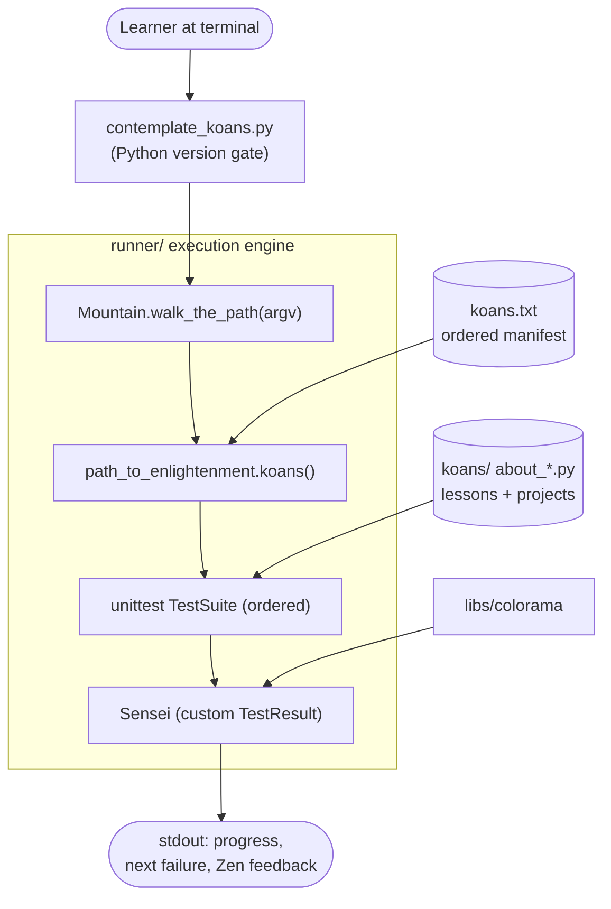
```mermaid
flowchart TD
    User([Learner at terminal]) --> Launch["contemplate_koans.py<br/>(Python version gate)"]
    subgraph Engine["runner/ execution engine"]
        Mountain["Mountain.walk_the_path(argv)"]
        PTE["path_to_enlightenment.koans()"]
        Suite["unittest TestSuite (ordered)"]
        Sensei["Sensei (custom TestResult)"]
        Mountain --> PTE
        PTE --> Suite
        Suite --> Sensei
    end
    Launch --> Mountain
    Manifest[("koans.txt<br/>ordered manifest")] --> PTE
    Koans[("koans/ about_*.py<br/>lessons + projects")] --> Suite
    Colorama["libs/colorama"] --> Sensei
    Sensei --> Out([stdout: progress,<br/>next failure, Zen feedback])
```

### 1.2.3 Success Criteria

The only measurable objectives evidenced in the repository are the runner's own learning-progress metrics; the project contains no business KPIs, SLAs, throughput targets, or uptime goals. Success is therefore defined in learning terms for the learner audience and in regression terms for the maintainer audience.

**Measurable objectives (as reported by the runner).** After each run, `runner/sensei.py` reports completion via `report_progress()` — *"You have completed {n} ({pct} %) koans and {m} (out of {total}) lessons."* — and, while any test still fails, `report_remaining()` states how many koans and lessons remain "away from reaching enlightenment." Full completion is signaled by the terminal message *"That was the last one, well done!"* and a pointer to `about_extra_credit.py`.

**Critical success factors.** For learners, the critical factor is making every koan pass (green); the process exits with a non-zero status (`sys.exit(-1)`) while failures remain, and reports success only when the suite is entirely green. For maintainers, the critical factor is that the engine itself remains correct — enforced by the `runner/runner_tests/` regression suite, which Travis CI executes via `python _runner_tests.py` on Python 3.9 (`.travis.yml`).

**Key performance indicators (KPIs).** The indicators below are computed and displayed by the runner; they are learning-progress measures, not operational service metrics.

| KPI (runner-reported) | How it is computed | Source |
|---|---|---|
| Koans passed and % complete | `pass_count`; `pass_count * 100 // total_koans()` | `runner/sensei.py` |
| Lessons completed / total | `lesson_pass_count` out of `total_lessons()` (globs `koans/about*.py`, excludes `about_extra_credit`) | `runner/sensei.py` |
| Koans / lessons remaining | totals minus completed counts | `runner/sensei.py` |
| Engine regression status | Pass/fail of the runner self-tests in CI | `.travis.yml`, `_runner_tests.py` |

## 1.3 Scope

This section defines what the Python Koans repository does and does not deliver, based strictly on the artifacts present in the codebase. In-scope elements are those implemented and exercised by the launcher, the `runner/` engine, and the `koans/` curriculum; out-of-scope elements are those explicitly excluded, absent, or deferred to the learner.

### 1.3.1 In-Scope

**Core features and functionalities (must-have capabilities).**

- A command-line koan runner that executes the ordered curriculum end-to-end, driven by `contemplate_koans.py` → `runner/mountain.py`, or executes a single named case/method when one is passed as an argument.
- An interactive learning curriculum of 38 `about_*.py` lesson modules (39 ordered test classes listed in `koans.txt`) covering core Python — assertions, strings, `None`, lists and list assignment, dictionaries, tuples, methods, control flow, truthiness, sets, exceptions, iteration/comprehensions/generators, lambdas, classes and inheritance (including multiple inheritance), scope, `with` statements, monkey-patching, decorators, method bindings, class attributes and attribute access, object deletion, modules/packages, and regular expressions.
- Four "implement-the-code" capstone projects the learner must complete: the Triangle classifier (`koans/triangle.py`), the Dice set (`koans/about_dice_project.py`), the Greed scoring game (`koans/about_scoring_project.py` with `koans/GREEDS_RULES.txt`), and the Proxy object (`koans/about_proxy_object_project.py`).
- Two exercise styles: fill-in-the-blank assertions using the markers exported by `runner/koan.py` (`__`, `___`, `____`, `_____`), and completing stubbed implementations.
- Guided reporting: colored pass/fail narration, first-unsolved-failure focus with source location, running progress/remaining counts, and Zen-of-Python messaging, all from `runner/sensei.py`.
- A maintainer-facing regression suite for the engine itself (`runner/runner_tests/`, aggregated by `_runner_tests.py`).

**Primary user workflows.**

1. The core learning loop (red → green → refactor): run `python3 contemplate_koans.py`, read the first failing koan and its reported location, edit the corresponding `koans/*.py` file to make it pass, and rerun — as described in `README.rst`.
2. Targeted practice: run a whole case (`python3 contemplate_koans.py about_strings`) or a single test (`...about_strings.AboutStrings.test_...`), per `Contributor Notes.txt` and `runner/mountain.py`.
3. Continuous feedback (optional): let Sniffer re-run the koans automatically on file changes via `scent.py`.

**Essential integrations and key technical requirements.**

| Requirement / Integration | In-Scope Detail | Evidence |
|---|---|---|
| Python 3 runtime | Python 2 rejected; below 3.7 warns but continues; CI on 3.9; policy targets latest production version | `contemplate_koans.py`, `README.rst`, `.travis.yml` |
| Standard-library `unittest` | Core suite construction and custom result reporting | `runner/path_to_enlightenment.py`, `runner/sensei.py` |
| UTF-8 source + run-in-place | Manifest read as UTF-8; no install step; deps vendored | `runner/path_to_enlightenment.py`, `libs/` |
| ANSI-capable terminal (colorama) | Cross-platform colored output initialized at import | `runner/sensei.py`, `libs/colorama/` |
| Optional dev tooling | Sniffer, Travis CI, Gitpod/Eclipse Che cloud workspace | `scent.py`, `.travis.yml`, `.gitpod.yml`, `.gitpod.Dockerfile` |

**Implementation boundaries.**

| Dimension | Coverage | Evidence |
|---|---|---|
| System boundary | Single OS process from a local checkout or cloud workspace; reads local files, writes to stdout, sets a process exit code; no network, database, or server | `runner/mountain.py`, `runner/sensei.py` |
| User groups | Individual Python learners; project contributors and maintainers | `README.rst`, `Contributor Notes.txt` |
| Geographic / market coverage | Globally available open-source project on GitHub; curriculum content is in English; external community translations are referenced but not bundled | `README.rst` |
| Data domains | Instructional test fixtures and small sample data only; no user accounts, PII, or production data; learners' own answers are intentionally left untracked | `koans/`, `example_file.txt`, `.gitignore`, `.hgignore` |

### 1.3.2 Out-of-Scope

The following are explicitly excluded from the product, absent from the repository, or deferred to the learner. Where an item is "absent," it means no corresponding artifact was found in the codebase.

| Area | Excluded / Not Covered | Evidence |
|---|---|---|
| Packaging & distribution | Not a pip-installable package; no build/dependency manifests; dependencies are vendored instead | No `setup.py`/`pyproject.toml`/`requirements.txt`; `libs/` |
| User interface / front-end | Terminal (stdout) only; no GUI, web application, or IDE plugin | `runner/sensei.py` |
| Answer key / solutions | No shipped solutions; the `answers` path is deliberately version-control-ignored | `.gitignore`, `.hgignore` |
| Alternative test frameworks | The launcher and CI use standard-library `unittest`; `pytest` is only pre-installed inside the Gitpod image and is not invoked by the project's scripts | `.travis.yml`, `.gitpod.Dockerfile` |
| Backend / enterprise integrations | No database, web service, authentication, or message-queue integration | Absent across the repository |
| CI as a deployment mechanism | Travis runs only the runner self-tests; the koan-execution lines are commented out, so CI does not build or deploy an artifact | `.travis.yml` |
| Non-Python and Python 2 targets | Only Python 3 is supported; the launcher stops on Python 2 with a corrective message | `contemplate_koans.py` |
| Bundled Git submodule | `Submodule_01_Do_not_use_15Jun` is explicitly named "Do not use" and is not part of the product | `.gitmodules` |

**Future-phase considerations.** The repository contains no formal roadmap or phased-delivery plan. The single evidenced "future work" item is learner-driven rather than a product deliverable: `koans/about_extra_credit.py` invites the learner to assemble a complete Greed game from the `DiceSet` and `score` building blocks and the rules in `koans/GREEDS_RULES.txt`. This extra-credit exercise is an open-ended practice prompt, not shipped functionality, and is therefore out of scope as a delivered capability.

## 1.4 References

The following repository files and folders were examined and cited as evidence for this Introduction. No external web sources were used.

**Root files**

- `README.rst` — Project purpose ("interactive tutorial ... by making tests pass"), Ruby Koans lineage, TDD framing, install/run instructions, Sniffer setup, version policy, acknowledgments, and maintainers.
- `contemplate_koans.py` — Executable launcher; Python version gating (rejects Python 2, warns below 3.7); delegates to `Mountain().walk_the_path(sys.argv)`.
- `Contributor Notes.txt` — Command syntax for running a single case or a single test method.
- `koans.txt` — Ordered curriculum manifest of 39 fully-qualified koan test classes.
- `MIT-LICENSE` — MIT license text; "Copyright 2021 Greg Malcolm and The Status Is Not Quo."
- `_runner_tests.py` — Aggregate entrypoint for the runner regression suite (the target run by CI).
- `run.sh` / `run.bat` — POSIX and Windows launch wrappers for `contemplate_koans.py`.
- `scent.py` — Sniffer configuration for continuous re-running of the koans on file change.
- `.travis.yml` — Travis CI configuration (Python 3.9; runs `python _runner_tests.py`; koan runs commented out).
- `.gitpod.yml` / `.gitpod.Dockerfile` — Gitpod/Eclipse Che cloud-workspace task and image (pre-installs pytest/pytest-testdox/mock).
- `.gitmodules` — Defines the `Submodule_01_Do_not_use_15Jun` submodule (excluded from product scope).
- `.gitignore` / `.hgignore` — Version-control ignore rules, including the untracked `answers` path.
- `example_file.txt` — Small sample text file consumed by the `with`-statement koans.

**`runner/` — execution engine**

- `runner/mountain.py` — `Mountain` orchestrator; builds stream/suite/`Sensei` and runs the full suite or a single CLI-selected target.
- `runner/sensei.py` — Custom `unittest.TestResult` (`Sensei`); colored feedback, ordered first-failure reporting, progress/remaining metrics, Zen messaging, and koan/lesson counting.
- `runner/path_to_enlightenment.py` — Parses `koans.txt` (comment/blank aware) and builds an ordered `unittest.TestSuite`.
- `runner/koan.py` — Shared `Koan` base class and fill-in markers (`__`, `___`, `____`, `_____`).
- `runner/mockable_test_result.py` — `MockableTestResult` base that `Sensei` extends (mocking seam for tests).
- `runner/runner_tests/` — Maintainer regression suite validating the engine (Sensei, helper, path_to_enlightenment, mountain).

**`koans/` — learner curriculum**

- `koans/` — Curriculum package of 38 `about_*.py` lesson modules, project stubs, fixtures, and the `a_package_folder` sub-package.
- `koans/about_asserts.py` — Representative fill-in-the-blank lesson (first koan in the manifest).
- `koans/triangle.py`, `koans/about_dice_project.py`, `koans/about_scoring_project.py`, `koans/about_proxy_object_project.py` — The four implement-the-code capstone projects.
- `koans/about_extra_credit.py` — Learner-driven extra-credit prompt (future practice, not a shipped deliverable).
- `koans/GREEDS_RULES.txt` — Prose rulebook for the Greed scoring project.

**`libs/` — vendored third-party libraries**

- `libs/` — Container package for locally bundled dependencies (no install step required).
- `libs/colorama/` — Vendored Colorama 0.2.7 providing cross-platform ANSI color.
- `libs/mock.py` — Vendored legacy `mock` 0.6.0 used to support the runner self-tests.

# 2. Product Requirements

## 2.1 Feature Catalog Overview

Python Koans is a single-process, command-line Python 3 learning application that exposes no network, database, or graphical surface (see Section 1.2 System Overview). Because the repository contains no pre-existing product-requirements document, the features catalogued here are **reverse-engineered** from the launcher (`contemplate_koans.py`), the `runner/` execution engine, the `koans/` curriculum, the vendored `libs/`, and the maintainer self-test suite. Each feature is cross-checked against the `unittest` test methods, `README.rst`, and the ordered `koans.txt` manifest that exercise it, so every feature is a discrete, independently testable capability whose acceptance criteria trace to specific source files and, where present, to executable tests.

The product decomposes into three functional groups that mirror the component model in Section 1.2.2 and the in-scope boundaries in Section 1.3.1:

1. **Runner engine (F-001–F-006)** — launches and version-gates the interpreter, loads the ordered curriculum, executes it against a custom result object, and renders progress-aware, single-failure-focused feedback.
2. **Learning curriculum (F-007, F-008)** — the fill-in-the-blank concept lessons and the "implement-the-code" capstone projects that constitute the actual instructional content.
3. **Developer & operations tooling (F-009–F-011)** — optional continuous-re-run watching, the engine regression suite, and the cloud-workspace / continuous-integration configuration.

### 2.1.1 Feature Catalog Summary

The following catalog enumerates every feature evidenced in the repository. All eleven features carry **Status = Completed**: each is implemented and exercised in the current checkout. The only intentional "incompleteness" is the learner-facing answer code embedded inside the exercise stubs (F-008 capstones and F-007 blanks), which is deliberately left blank by design (per Section 1.3.2) and therefore represents the feature working as intended rather than an unfinished feature.

| Feature ID | Feature Name | Category | Priority |
|---|---|---|---|
| F-001 | Guarded Launcher & Interpreter Version Gating | Launch & Bootstrapping | Critical |
| F-002 | Manifest-Driven Ordered Curriculum Loading | Curriculum Orchestration | Critical |
| F-003 | Koan Suite Execution & Targeted Selection | Curriculum Orchestration | Critical |
| F-004 | Progress-Aware Result Reporting & Feedback | Feedback & Reporting | Critical |
| F-005 | Guided First-Failure Focus & Diagnostics | Feedback & Reporting | High |
| F-006 | Koan Exercise Scaffold & Fill-in Markers | Exercise Framework | Critical |
| F-007 | Fill-in-the-Blank Concept Curriculum | Learning Content | Critical |
| F-008 | Implement-the-Code Capstone Projects | Learning Content | High |
| F-009 | Continuous Re-Run on File Change (Sniffer) | Developer Tooling | Low |
| F-010 | Runner Engine Regression Test Suite | Quality Assurance | Medium |
| F-011 | Cloud Workspace & Continuous Integration | Developer Tooling | Low |

**Priority legend.** *Critical* — the learning loop cannot function if the feature is absent (bootstrap, curriculum load, execution, reporting, exercise scaffold, concept content). *High* — materially shapes the learning experience but the loop still runs without it (focused diagnostics, advanced capstone projects). *Medium* — protects maintainer quality (engine regression suite executed in CI). *Low* — optional developer convenience (file-watch re-run, cloud/CI workspace).

### 2.1.2 Identifier Conventions & Requirement Versioning

The section uses the identifier and grading conventions below consistently across every feature.

| Element | Format / Allowed Values | Notes |
|---|---|---|
| Feature ID | `F-XXX` (`F-001` … `F-011`) | One per catalogued feature |
| Requirement ID | `F-XXX-RQ-YYY` | Requirements numbered per feature, starting at `RQ-001` |
| Feature Priority | Critical / High / Medium / Low | Assigned per the legend in 2.1.1 |
| Requirement Priority | Must-Have / Should-Have / Could-Have | MoSCoW grading per requirement |
| Complexity | High / Medium / Low | Relative implementation complexity observed in code |
| Requirement Version | 1.0 | Baseline; see note below |

All requirements are baselined at **version 1.0**, established against the current repository checkout; the repository carries no versioned requirement history, so a single baseline applies uniformly and is stated once here rather than repeated per requirement.

### 2.1.3 Assumptions and Constraints

The following assumptions and constraints govern the whole catalog and are grounded in the repository and in Section 1:

- **No operational SLAs/KPIs exist.** Per Section 1.2.3, the repository defines no business KPIs, SLAs, throughput, or uptime targets. Acceptance and performance criteria in this section are therefore strictly functional/behavioral (correct output, correct exit code, correct ordering) rather than service-level.
- **Verification basis varies by feature.** Runner-engine features (F-002–F-006) and F-010 are directly verified by the `unittest` suites in `runner/runner_tests/`; the launcher (F-001), curriculum content (F-007, F-008), and tooling (F-009, F-011) are verified by direct code reading, the `README.rst` instructions, and the CI/workspace configuration files, because no automated test targets them.
- **Learner answers are intentionally absent.** The "blanks" in lessons and the `pass` stubs in capstone projects are the designed exercise surface (Section 1.3.2); no answer key ships in the repository.
- **Run-in-place, vendored dependencies.** There is no packaging/build manifest; the application runs directly from a checkout with `colorama` and `mock` vendored under `libs/` (Section 1.3).
- **Excluded artifact.** The `Submodule_01_Do_not_use_15Jun` Git submodule is explicitly out of scope (Section 1.3.2) and is not represented by any feature.

Detailed feature entries follow in Sections 2.2–2.12; cross-feature relationships appear in Section 2.13 and the end-to-end requirement traceability matrix in Section 2.14. Readers should consult the end-to-end process flow diagram in Section 1.2.2, which depicts the runtime interaction of the F-001–F-006 engine features referenced throughout this section.

## 2.2 F-001: Guarded Launcher & Interpreter Version Gating

F-001 is the single executable entry point of Python Koans. It bootstraps a run by validating the interpreter version and, when acceptable, constructing and invoking the runner engine. It is implemented by `contemplate_koans.py` with cross-platform convenience wrappers `run.sh` (POSIX) and `run.bat` (Windows).

### 2.2.1 Feature Metadata, Description & Dependencies

| Attribute | Value |
|---|---|
| Unique ID | F-001 |
| Feature Name | Guarded Launcher & Interpreter Version Gating |
| Feature Category | Launch & Bootstrapping |
| Priority Level | Critical |
| Status | Completed |

**Overview.** `contemplate_koans.py` executes only under the `__main__` guard (`contemplate_koans.py` L14). It inspects `sys.version_info`: interpreters below `(3, 0)` receive a corrective "Python 3 version … running it with Python 2" message and the runner is **not** started (L15–L19); interpreters in the range `(3, 0)`–`(3, 6)` receive a prominent compatibility warning banner but execution continues (L21–L30); for any Python 3 the launcher imports `Mountain` from `runner.mountain` and calls `Mountain().walk_the_path(sys.argv)` (L32–L34). `run.sh` invokes `python3 -B contemplate_koans.py` (`run.sh` L3); `run.bat` resolves a Python executable and invokes the same launcher on Windows.

**Business Value.** Guarantees learners start under a supported interpreter, preventing the confusing, cryptic failures that Python 2 would otherwise produce, and delivering a zero-install, single-command onboarding path consistent with the run-in-place model (Section 1.3.1).

**User Benefits.** A single command (`python3 contemplate_koans.py`, per `README.rst` L103–L113) starts the whole curriculum; a clear corrective message appears if the wrong interpreter is used; POSIX and Windows users each have a ready-made launch script.

**Technical Context.** The launcher depends only on the standard library (`import sys`); it has no third-party imports and defines no functions or classes. The `-B` flag used by both wrappers suppresses `.pyc` bytecode-cache writes, keeping the checkout clean.

**Dependencies.**

| Dependency Type | Detail |
|---|---|
| Prerequisite Features | None — F-001 is the root entry point |
| System Dependencies | Delegates all work to F-003 (Mountain execution), which transitively drives F-002, F-004, F-005 |
| External Dependencies | A Python 3 interpreter reachable as `python3` / `python.exe` on the system PATH |
| Integration Requirements | Passes `sys.argv` unchanged into `walk_the_path`, enabling F-003 targeted selection |

### 2.2.2 Functional Requirements

**Requirement Details**

| Requirement ID | Description | Priority | Complexity |
|---|---|---|---|
| F-001-RQ-001 | Reject Python 2 with corrective guidance and do not start the runner | Must-Have | Low |
| F-001-RQ-002 | Warn on Python 3.0–3.6 but continue execution | Should-Have | Low |
| F-001-RQ-003 | Launch the runner engine under supported Python 3 | Must-Have | Low |
| F-001-RQ-004 | Provide cross-platform launch entry points | Could-Have | Low |

**Acceptance Criteria**

| Requirement ID | Acceptance Criteria |
|---|---|
| F-001-RQ-001 | Given `sys.version_info < (3, 0)`, the Python-2 message is printed and neither `runner.mountain` is imported nor `walk_the_path` invoked |
| F-001-RQ-002 | Given `(3, 0) <= sys.version_info < (3, 7)`, the warning banner is printed and control then proceeds to launch the runner |
| F-001-RQ-003 | Given Python ≥ 3.0, `Mountain()` is constructed and `walk_the_path(sys.argv)` is called exactly once |
| F-001-RQ-004 | `run.sh` runs `python3 -B contemplate_koans.py`; `run.bat` invokes the launcher via a resolved `python.exe`, else prints path-fix guidance |

**Technical Specifications**

| Requirement ID | Input Parameters | Output / Response | Data Requirements |
|---|---|---|---|
| F-001-RQ-001 | `sys.version_info` tuple | Multi-line stdout message; no runner start | None |
| F-001-RQ-002 | `sys.version_info` tuple | Warning banner on stdout; execution continues | None |
| F-001-RQ-003 | `sys.argv` list | Runner engine started (delegates to F-003) | None |
| F-001-RQ-004 | Shell/CMD environment, `PYTHON_PATH` | Launcher process invoked, or guidance text | `PYTHON_PATH` variable (default `C:\Python311`) in `run.bat` |

Performance Criteria: negligible — the gate performs two tuple comparisons and one import; no quantitative SLA is defined for the CLI (Section 1.2.3).

**Validation Rules**

| Requirement ID | Business Rules | Data Validation | Security & Compliance |
|---|---|---|---|
| F-001-RQ-001 | Python 2 is unsupported (Section 1.3.2) | Compare version tuple `< (3, 0)` | No elevated privileges; no external input beyond argv |
| F-001-RQ-002 | 3.7+ is the design target; older 3.x is best-effort | Compare `< (3, 7)` after `>= (3, 0)` | None |
| F-001-RQ-003 | Only Python 3 reaches the runner | Implicit `else` branch of the Python-2 check | Runs with the caller's own OS privileges only |
| F-001-RQ-004 | `run.bat` note states the script is optional | `run.bat` checks `python.exe`, `PYTHON_PATH`, `%PYTHON%` in order | No credentials; MIT-licensed scripts |

### 2.2.3 Implementation Considerations

| Aspect | Consideration |
|---|---|
| Technical Constraints | Standard-library `sys` only; logic lives entirely under the `__main__` guard; version thresholds `(3, 0)` and `(3, 7)` are hard-coded literals |
| Performance Requirements | Constant-time gate; overhead dominated by importing the `runner` package, not by the checks |
| Scalability Considerations | Not applicable — a single, short-lived OS process per invocation (Section 1.3.1) |
| Security Implications | Accepts only `sys.argv`; performs no file writes (uses `-B` to avoid `.pyc`); requires no privilege escalation |
| Maintenance Requirements | Version thresholds and messages are string literals in one file; Windows users must set `PYTHON_PATH` in `run.bat` (`README.rst` L88–L91 shows `C:\Python39`) |

## 2.3 F-002: Manifest-Driven Ordered Curriculum Loading

F-002 converts the ordered text manifest `koans.txt` into an executable, correctly-ordered `unittest.TestSuite`. It is implemented by `runner/path_to_enlightenment.py` and driven by the `koans.txt` manifest.

### 2.3.1 Feature Metadata, Description & Dependencies

| Attribute | Value |
|---|---|
| Unique ID | F-002 |
| Feature Name | Manifest-Driven Ordered Curriculum Loading |
| Feature Category | Curriculum Orchestration |
| Priority Level | Critical |
| Status | Completed |

**Overview.** The module declares `KOANS_FILENAME = 'koans.txt'` (`path_to_enlightenment.py` L14). `filter_koan_names(lines)` strips each line, skips lines beginning with `#` and blank lines, and lazily yields the remaining fully-qualified test-class names in input order (L17–L28). `names_from_file(filename)` opens the manifest through `io.open(..., 'rt', encoding='utf8')` in a context manager and yields the filtered names (L31–L39). `koans_suite(names)` constructs a fresh `unittest.TestSuite` and `unittest.TestLoader`, sets `loader.sortTestMethodsUsing = None`, loads each name via `loadTestsFromName`, and adds the results to the suite in supplied order (L42–L53). `koans(filename=KOANS_FILENAME)` composes reading and suite construction, defaulting to `koans.txt` (L56–L62). The manifest itself begins with the comment "Lines starting with # are ignored." and lists 39 ordered test classes (`koans.txt` L1–L40).

**Business Value.** The manifest is the single source of truth for *what* runs and *in what sequence*, encoding the pedagogical progression (assertions → strings → collections → control flow → functions/classes → metaprogramming → modules → regex). Comment-awareness lets maintainers annotate or disable lessons without deleting them.

**User Benefits.** Lessons are presented in a deliberate learning order rather than an arbitrary or alphabetical one, and the sequence is transparent and editable in a single plain-text file.

**Technical Context.** Implementation uses only the standard library (`io`, `unittest`); generators provide lazy evaluation and the manifest is decoded as UTF-8. Setting `loader.sortTestMethodsUsing = None` is essential: it disables `unittest`'s default alphabetical ordering of test methods so that koans execute top-to-bottom as written.

**Dependencies.**

| Dependency Type | Detail |
|---|---|
| Prerequisite Features | F-006 (the named classes subclass the `Koan` base); F-007 / F-008 (the lesson/project modules named in the manifest must be importable) |
| System Dependencies | The `koans/` package modules; `koans.txt` present in the working directory |
| External Dependencies | None beyond the Python standard library |
| Integration Requirements | Consumed by F-003 (`Mountain.__init__`) and F-004 (`Sensei.__init__`), both of which call `path_to_enlightenment.koans()` |

### 2.3.2 Functional Requirements

**Requirement Details**

| Requirement ID | Description | Priority | Complexity |
|---|---|---|---|
| F-002-RQ-001 | Parse the manifest, ignoring comment (`#`) and blank lines | Must-Have | Low |
| F-002-RQ-002 | Read the manifest from file as UTF-8 | Must-Have | Low |
| F-002-RQ-003 | Build a TestSuite preserving manifest order and disabling method sorting | Must-Have | Medium |
| F-002-RQ-004 | Default the source manifest to `koans.txt` | Must-Have | Low |

**Acceptance Criteria**

| Requirement ID | Acceptance Criteria |
|---|---|
| F-002-RQ-001 | Given mixed lines, `filter_koan_names` yields only stripped non-blank, non-`#` names, in input order (verified by `TestFilterKoanNames`) |
| F-002-RQ-002 | `names_from_file` opens the file with `encoding='utf8'` inside a `with` block and yields the filtered names |
| F-002-RQ-003 | `koans_suite` sets `loader.sortTestMethodsUsing = None`, loads each name via `loadTestsFromName`, and produces a suite whose case order equals the input order (verified by `TestKoansSuite`) |
| F-002-RQ-004 | Calling `koans()` with no argument reads `koans.txt` |

**Technical Specifications**

| Requirement ID | Input Parameters | Output / Response | Data Requirements |
|---|---|---|---|
| F-002-RQ-001 | Iterable of text lines | Lazy generator of name strings | Manifest line syntax: `#` = comment |
| F-002-RQ-002 | `filename` (str) | Lazy generator of names | UTF-8-encoded manifest file |
| F-002-RQ-003 | Iterable of names | `unittest.TestSuite` | Names must resolve to importable dotted classes |
| F-002-RQ-004 | Optional `filename` (defaults `koans.txt`) | `unittest.TestSuite` | `koans.txt` present in CWD |

Performance Criteria: linear in the number of manifest lines (39 classes); lazy generators avoid materializing the file; no quantitative SLA defined.

**Validation Rules**

| Requirement ID | Business Rules | Data Validation | Security & Compliance |
|---|---|---|---|
| F-002-RQ-001 | Curated manifest order is authoritative | `line.strip()`; skip `startswith('#')` and empty lines | Reads a repository-controlled text file only |
| F-002-RQ-002 | Manifest is UTF-8 source (Section 1.3.1) | Enforced `encoding='utf8'` | No writes; context-managed file handle |
| F-002-RQ-003 | Execution order must equal file order | `sortTestMethodsUsing = None` disables reordering | Dynamic import resolves names via `unittest` loader |
| F-002-RQ-004 | `koans.txt` is the default curriculum | Default parameter value | None |

### 2.3.3 Implementation Considerations

| Aspect | Consideration |
|---|---|
| Technical Constraints | `loadTestsFromName` requires each dotted name to be importable; `koans.txt` is opened by relative name, so the working directory must contain it; disabling `sortTestMethodsUsing` is mandatory for ordered lessons |
| Performance Requirements | O(n) over manifest entries; suite construction cost dominated by importing the named modules, not parsing |
| Scalability Considerations | Suite size is bounded by the manifest (39 classes); no scaling concern for the intended single-user run |
| Security Implications | Classes are imported dynamically by name from a repository-controlled manifest; a manifest is trusted input, so no untrusted-code evaluation occurs in normal use |
| Maintenance Requirements | Reordering or adding a lesson is a one-line manifest edit; a lesson can be disabled by prefixing its line with `#` |

## 2.4 F-003: Koan Suite Execution & Targeted Selection

F-003 is the orchestration feature that runs the loaded curriculum against the reporting result object and supports narrowing a run to a single case or test method. It is implemented by the `Mountain` class in `runner/mountain.py`.

### 2.4.1 Feature Metadata, Description & Dependencies

| Attribute | Value |
|---|---|
| Unique ID | F-003 |
| Feature Name | Koan Suite Execution & Targeted Selection |
| Feature Category | Curriculum Orchestration |
| Priority Level | Critical |
| Status | Completed |

**Overview.** `Mountain.__init__` wraps `sys.stdout` in a `WritelnDecorator` output stream, loads the ordered suite via `path_to_enlightenment.koans()`, and constructs the `Sensei` result object bound to that stream (`mountain.py` L12–L15). `walk_the_path(args=None)` (L17) branches on the arguments: when `args` is present and `len(args) >= 2`, it replaces the full suite with a single target loaded via `unittest.TestLoader().loadTestsFromName("koans." + args[1])` (L20–L21); it then executes the suite with the `unittest` "suite-as-callable" pattern `self.tests(self.lesson)` (L23), invokes `self.lesson.learn()` to emit the final report (L24), and returns the result object (L25).

**Business Value.** Supports both primary learning workflows from Section 1.3.1: running the full curriculum end-to-end, and targeted practice on a single lesson or test, which lets learners iterate quickly on one concept.

**User Benefits.** `python3 contemplate_koans.py` runs the whole curriculum; supplying `about_strings` runs just that case; supplying a dotted path such as `about_strings.AboutStrings.test_...` runs a single method (`Contributor Notes.txt`, Section 1.3.1).

**Technical Context.** The launcher prepends the `koans.` package prefix so the learner passes only the bare module/case name. Only the first positional argument (`args[1]`) is consumed by the selection branch; additional arguments are not individually loaded. (The commented "run a subset" example in `.travis.yml` lists multiple names, but the current `walk_the_path` code path loads a single `args[1]` target.)

**Dependencies.**

| Dependency Type | Detail |
|---|---|
| Prerequisite Features | F-002 (`koans()` loader), F-004 (`Sensei` result), F-006 (koan base classes) |
| System Dependencies | `runner/writeln_decorator.py` (`WritelnDecorator`), `runner/sensei.py` (`Sensei`), `runner/path_to_enlightenment.py` |
| External Dependencies | None beyond the standard-library `unittest` |
| Integration Requirements | Invoked by F-001 with `sys.argv`; delegates all reporting to F-004 / F-005 |

### 2.4.2 Functional Requirements

**Requirement Details**

| Requirement ID | Description | Priority | Complexity |
|---|---|---|---|
| F-003-RQ-001 | Run the full ordered curriculum by default | Must-Have | Low |
| F-003-RQ-002 | Run a single named case or method when an argument is supplied | Must-Have | Medium |
| F-003-RQ-003 | Emit the final report and return the result object | Must-Have | Low |
| F-003-RQ-004 | Bind output to a decorated stdout stream | Should-Have | Low |

**Acceptance Criteria**

| Requirement ID | Acceptance Criteria |
|---|---|
| F-003-RQ-001 | With no extra argument, the manifest-loaded suite runs against the `Sensei` result and `learn()` is then called |
| F-003-RQ-002 | Given `len(args) >= 2`, the suite is reloaded from `"koans." + args[1]`, so `about_strings` runs the whole case and a dotted name runs one method |
| F-003-RQ-003 | After execution, `self.lesson.learn()` is invoked once and the `Sensei` result is returned (verified by `TestMountain`) |
| F-003-RQ-004 | `Mountain.__init__` wraps `sys.stdout` in `WritelnDecorator` and passes it to `Sensei` |

**Technical Specifications**

| Requirement ID | Input Parameters | Output / Response | Data Requirements |
|---|---|---|---|
| F-003-RQ-001 | None (or `args` of length < 2) | Executed suite + printed report | Manifest-loaded suite from F-002 |
| F-003-RQ-002 | `args` list; `args[1]` = target name | Suite narrowed to one case/method | `args[1]` must resolve under `koans.` |
| F-003-RQ-003 | `Sensei` result object | Final report; returned result | None persisted |
| F-003-RQ-004 | `sys.stdout` | `WritelnDecorator`-wrapped stream | None |

Performance Criteria: negligible orchestration overhead; total runtime dominated by executing the koan test methods; no quantitative SLA defined.

**Validation Rules**

| Requirement ID | Business Rules | Data Validation | Security & Compliance |
|---|---|---|---|
| F-003-RQ-001 | Default action is the full curriculum | Branch guarded by `args and len(args) >= 2` | Local process; no network |
| F-003-RQ-002 | Selection targets the `koans.` package only | Fixed `"koans."` prefix on `args[1]` | Dynamic load by name from a local CLI argument |
| F-003-RQ-003 | Every run ends with a report | `learn()` always invoked after execution | Exit code side effect delegated to F-004 |
| F-003-RQ-004 | Output is line-oriented stdout | `WritelnDecorator` delegates to the wrapped stream | stdout only; no file writes |

### 2.4.3 Implementation Considerations

| Aspect | Consideration |
|---|---|
| Technical Constraints | Relies on `unittest.TestSuite` being callable with a result object; only `args[1]` is honored for selection; the `koans.` prefix is hard-coded |
| Performance Requirements | Constant orchestration cost; run time scales with the number of executed koan methods |
| Scalability Considerations | Single short-lived process; no concurrency or parallel execution present |
| Security Implications | `args[1]` is loaded dynamically (prefixed with `koans.`); this is a local developer tool operating with the caller's privileges |
| Maintenance Requirements | The selection branch is two lines; extending it to honor multiple names would require iterating over `args[1:]` |

## 2.5 F-004: Progress-Aware Result Reporting & Feedback

F-004 is the reporting heart of the product: a custom `unittest` result object that turns a plain test run into guided, colored, progress-aware narration with a clear finish line and a meaningful process exit status. It is implemented by the `Sensei` class in `runner/sensei.py`, using `runner/writeln_decorator.py`, `runner/helper.py`, and the vendored `libs/colorama`.

### 2.5.1 Feature Metadata, Description & Dependencies

| Attribute | Value |
|---|---|
| Unique ID | F-004 |
| Feature Name | Progress-Aware Result Reporting & Feedback |
| Feature Category | Feedback & Reporting |
| Priority Level | Critical |
| Status | Completed |

**Overview.** `Sensei` subclasses `MockableTestResult` (itself a thin `unittest.TestResult` subclass) and initializes tracking state — `prevTestClassName`, its own loaded `tests` suite for totals, `pass_count`, `lesson_pass_count`, and a lazy `all_lessons` cache (`sensei.py` L18–L25). `colorama.init()` runs at import for portable ANSI color (L15). On entering a new test class, `startTest` prints "Thinking {ClassName}" and increments `lesson_pass_count` — but only while no failure has yet occurred, and never for `AboutAsserts` or `AboutExtraCredit` (L27–L37). `addSuccess` prints "  {method} has expanded your awareness." in bright green and increments `pass_count`, gated by `passesCount()` (L39–L46). The finalizer `learn()` prints `report_progress()`, then `report_remaining()` when failures remain, then a Zen line, and finally either exits with `sys.exit(-1)` or prints "That was the last one, well done!" and points to `about_extra_credit.py` (L83–L102). `report_progress` computes percent complete as `pass_count*100//total_koans()` (L169–L175); `total_koans()` returns `self.tests.countTestCases()` (L258–L259); `total_lessons()` counts `koans/about*.py` files excluding `about_extra_credit` via `filter_all_lessons()` (L251–L269).

**Business Value.** This feedback is the product's core user experience: it converts an ordinary red/green test run into a motivational, self-paced learning journey with visible momentum ("expanded your awareness"), a quantified finish line, and a scriptable exit code.

**User Benefits.** Learners see exactly which koans passed, a running percentage and lesson tally, how much remains, encouraging Zen-of-Python lines, and a celebratory completion message; the non-zero exit code while incomplete lets tools detect an unfinished run.

**Technical Context.** Uses the standard-library `unittest` result protocol; color via vendored `colorama` (no external install); progress totals derived from an independently loaded suite plus a filesystem glob of lesson files; `WritelnDecorator.writeln` appends newlines while delegating writes to the wrapped stream.

**Dependencies.**

| Dependency Type | Detail |
|---|---|
| Prerequisite Features | F-002 (loads `koans()` for `total_koans`), F-006 (koan classes provide the results being reported) |
| System Dependencies | `runner/helper.py` (`cls_name`), `runner/mockable_test_result.py`, `runner/writeln_decorator.py` |
| External Dependencies | Vendored `libs/colorama` (`init`, `Fore`, `Style`) |
| Integration Requirements | Instantiated and driven by F-003 (`Mountain`); shares the failure list consumed by F-005 |

### 2.5.2 Functional Requirements

**Requirement Details**

| Requirement ID | Description | Priority | Complexity |
|---|---|---|---|
| F-004-RQ-001 | Announce each lesson and count completed lessons | Must-Have | Medium |
| F-004-RQ-002 | Acknowledge each passing koan and count it | Must-Have | Medium |
| F-004-RQ-003 | Report cumulative progress (koans %, lessons) | Must-Have | Medium |
| F-004-RQ-004 | Report remaining koans/lessons while incomplete | Should-Have | Low |
| F-004-RQ-005 | Signal completion via message and process exit code | Must-Have | Medium |
| F-004-RQ-006 | Provide rotating motivational Zen messaging | Could-Have | Low |
| F-004-RQ-007 | Render cross-platform colored output | Should-Have | Low |

**Acceptance Criteria**

| Requirement ID | Acceptance Criteria |
|---|---|
| F-004-RQ-001 | Entering a new class (before any failure) prints "Thinking {ClassName}" and increments `lesson_pass_count`, except for `AboutAsserts`/`AboutExtraCredit` |
| F-004-RQ-002 | `addSuccess` prints "{method} has expanded your awareness." and increments `pass_count` only when `passesCount()` is true |
| F-004-RQ-003 | `report_progress` returns the "completed N (P %) koans and M (out of T) lessons" string with `P = pass_count*100//total_koans()` |
| F-004-RQ-004 | `report_remaining` returns the "N koans and M lessons away" string and is printed only when failures remain |
| F-004-RQ-005 | `learn()` calls `sys.exit(-1)` if any failure exists; otherwise prints the completion banner and the `about_extra_credit.py` pointer |
| F-004-RQ-006 | `say_something_zenlike` returns a Zen line selected by `pass_count % 37` when failures exist, else "Nobody ever expects the Spanish Inquisition." |
| F-004-RQ-007 | `colorama.init()` is called at import and messages are wrapped with `Fore`/`Style` codes |

**Technical Specifications**

| Requirement ID | Input Parameters | Output / Response | Data Requirements |
|---|---|---|---|
| F-004-RQ-001 | `test` instance (via `startTest`) | "Thinking …" line; `lesson_pass_count` update | `prevTestClassName`, excluded-class list |
| F-004-RQ-002 | `test` instance (via `addSuccess`) | Green success line; `pass_count` update | `passesCount()` state |
| F-004-RQ-003 | Accumulated counts | Progress string | `total_koans()`, `total_lessons()` |
| F-004-RQ-004 | Accumulated counts | Remaining string | Totals minus completed counts |
| F-004-RQ-005 | Failure list | Exit code -1 or completion banner | `self.failures` |
| F-004-RQ-006 | `pass_count` | Zen/Spanish-Inquisition line | 19 Zen strings; modulus 37 |
| F-004-RQ-007 | Message text | Colorized stdout | `colorama` `Fore`/`Style` |

Performance Criteria: negligible per-callback cost; the lesson-file glob is computed once and cached in `all_lessons`; no quantitative SLA is defined (Section 1.2.3).

**Validation Rules**

| Requirement ID | Business Rules | Data Validation | Security & Compliance |
|---|---|---|---|
| F-004-RQ-001 | `AboutAsserts`/`AboutExtraCredit` excluded from the completed-lesson count | Class-transition check via `helper.cls_name` | stdout only |
| F-004-RQ-003 | `about_extra_credit` excluded from `total_lessons()` denominator | Integer floor division for percent | Reads local `koans/about*.py` paths only |
| F-004-RQ-005 | Any remaining failure means the run is incomplete | `if self.failures` branch | Process exit code side effect |
| F-004-RQ-006 | Zen line rotates with progress | `turn = pass_count % 37` | No external data |

### 2.5.3 Implementation Considerations

| Aspect | Consideration |
|---|---|
| Technical Constraints | Implemented through `MockableTestResult` so tests can mock it without mocking `unittest.TestResult`; loads its own suite copy for totals; `total_lessons` uses a `glob` relative to `__file__`; `colorama.init()` is a global import-time side effect |
| Performance Requirements | Constant work per test callback; the lesson glob is memoized in `self.all_lessons` |
| Scalability Considerations | Single process; counts bounded by curriculum size (39 classes / 38 lesson files) |
| Security Implications | Writes only to the injected stream; `sys.exit(-1)` terminates the process; no external I/O |
| Maintenance Requirements | Message text, the 19 Zen strings, the `% 37` rotation, and the excluded-class names are hard-coded literals in `sensei.py` |

## 2.6 F-005: Guided First-Failure Focus & Diagnostics

F-005 delivers the "one failure at a time" pedagogy: when koans fail, `Sensei` surfaces exactly one — the first unsolved koan in source order — with a focused, colorized diagnostic that pinpoints the file and line to edit. It is implemented by the failure-handling methods of `runner/sensei.py`.

### 2.6.1 Feature Metadata, Description & Dependencies

| Attribute | Value |
|---|---|
| Unique ID | F-005 |
| Feature Name | Guided First-Failure Focus & Diagnostics |
| Feature Category | Feedback & Reporting |
| Priority Level | High |
| Status | Completed |

**Overview.** `addError` delegates to `addFailure` so a single ordered list holds both errors and failures (`sensei.py` L48–L51). `sortFailures(testClassName)` scans `self.failures`, extracts each failure's source line number from its traceback via the regex `(?<= line )\d+`, and returns `(lineno, test, err)` tuples sorted ascending, or `None` when none match (L59–L71). `firstFailure()` sorts the failures of the first failing class and returns the earliest-line `(test, err)` pair (L73–L81). `errorReport()` — invoked first by `learn()` — prints "{method} has damaged your karma.", "You have not yet reached enlightenment …", the scraped assertion error, "Please meditate on the following code:", and the scraped stack dump (L104–L119). `scrapeAssertionError` extracts the assertion message text (L121–L133); `scrapeInterestingStackDump` keeps only stack frames whose path contains `koans` and colorizes `about_*.py` filenames and `line N` references (L135–L167). `passesCount()` prevents success narration once the pending first failure belongs to a class other than the current one (L53–L54).

**Business Value.** Enforces the red → green → refactor discipline (`README.rst` L197–L203) by presenting a single, actionable failure instead of an overwhelming wall of tracebacks, and by directing the learner precisely to the code to change.

**User Benefits.** The learner sees the next koan to solve, the exact assertion error, and the source location (file and line), with irrelevant framework stack frames filtered away and the essentials highlighted in color.

**Technical Context.** Diagnostics are produced by regex-scraping the standard CPython traceback text (`File …`, `line N`, `koans` path), so the feature is coupled to that text format; failure ordering is derived purely from the parsed line numbers.

**Dependencies.**

| Dependency Type | Detail |
|---|---|
| Prerequisite Features | F-004 (shares the `Sensei` failure list; `learn()` calls `errorReport()`), F-006 (koan source produces the tracebacks) |
| System Dependencies | `runner/helper.py` (`cls_name`); standard-library `re` |
| External Dependencies | Vendored `libs/colorama` for highlighting |
| Integration Requirements | `errorReport()` is invoked by F-004's `learn()`; consumes `self.failures` populated by the `unittest` run |

### 2.6.2 Functional Requirements

**Requirement Details**

| Requirement ID | Description | Priority | Complexity |
|---|---|---|---|
| F-005-RQ-001 | Merge errors into the single failure sequence | Must-Have | Low |
| F-005-RQ-002 | Sort a class's failures by source line number | Must-Have | Medium |
| F-005-RQ-003 | Select the first unsolved koan to present | Must-Have | Medium |
| F-005-RQ-004 | Present a focused failure diagnostic | Must-Have | Medium |
| F-005-RQ-005 | Scrape the assertion message from the traceback | Should-Have | Medium |
| F-005-RQ-006 | Show only koans-relevant, colorized source frames | Should-Have | High |
| F-005-RQ-007 | Suppress success narration once an earlier failure is pending | Should-Have | Medium |

**Acceptance Criteria**

| Requirement ID | Acceptance Criteria |
|---|---|
| F-005-RQ-001 | `addError` invokes `addFailure`, so errors and failures share one ordered list |
| F-005-RQ-002 | `sortFailures` returns line-ascending `(lineno, test, err)` tuples for the named class, or `None` when no line numbers parse (verified by `TestSensei`) |
| F-005-RQ-003 | `firstFailure` returns the earliest-line failure of the first failing class, or `None` when there are no failures |
| F-005-RQ-004 | `errorReport` prints the karma/enlightenment narration plus the scraped assertion error and stack dump |
| F-005-RQ-005 | `scrapeAssertionError` returns the assertion message text and empty string for empty input |
| F-005-RQ-006 | `scrapeInterestingStackDump` retains only frames whose path contains `koans` and wraps `about_*.py`/`line N` in color codes |
| F-005-RQ-007 | `passesCount` returns `False` when the first failure's class differs from `prevTestClassName` |

**Technical Specifications**

| Requirement ID | Input Parameters | Output / Response | Data Requirements |
|---|---|---|---|
| F-005-RQ-001 | `test`, `err` | Appended to `self.failures` | Shared failure list |
| F-005-RQ-002 | `testClassName` | Sorted tuple list or `None` | Traceback contains `line N` |
| F-005-RQ-003 | (none) | `(test, err)` or `None` | `self.failures` populated |
| F-005-RQ-004 | `firstFailure()` result | Multi-line colorized diagnostic | Traceback string |
| F-005-RQ-005 | `err` traceback string | Assertion message text | CPython assertion format |
| F-005-RQ-006 | `err` traceback string | Filtered, colorized frames | Frame paths containing `koans` |
| F-005-RQ-007 | Current class vs. first failure | Boolean gate for `addSuccess` | `prevTestClassName` |

Performance Criteria: linear scans over the failure list and traceback lines; negligible; no quantitative SLA defined.

**Validation Rules**

| Requirement ID | Business Rules | Data Validation | Security & Compliance |
|---|---|---|---|
| F-005-RQ-002 | Only one failing class is considered at a time | Regex `(?<= line )\d+` on traceback | Parses in-memory strings only |
| F-005-RQ-003 | Present the earliest-line failure first | Sorted-table head selection | No external I/O |
| F-005-RQ-004 | Exactly one failure is shown per run | Guard `if not problem: return` | stdout only |
| F-005-RQ-006 | Only learner-editable koan frames are shown | Path filter matching `[/\\]koans[/\\]` | No secrets in output |

### 2.6.3 Implementation Considerations

| Aspect | Consideration |
|---|---|
| Technical Constraints | Coupled to CPython traceback text (`  File …`, `line N`); failures without a parseable line number are omitted by `sortFailures`; regexes are format-sensitive |
| Performance Requirements | Linear in the number of failures and traceback lines; no measurable overhead for the intended workloads |
| Scalability Considerations | Bounded by the number of failures in a single run; no concurrency |
| Security Implications | Operates only on in-memory traceback strings; emits to stdout; no file or network access |
| Maintenance Requirements | Regex patterns and narration strings are literals; a change to Python's traceback format could require regex updates |

## 2.7 F-006: Koan Exercise Scaffold & Fill-in Markers

F-006 is the shared exercise scaffold every lesson builds on: a common `Koan` base test class and a small vocabulary of fill-in placeholder markers. It is implemented by `runner/koan.py` and imported by all curriculum modules via `from runner.koan import *`.

### 2.7.1 Feature Metadata, Description & Dependencies

| Attribute | Value |
|---|---|
| Unique ID | F-006 |
| Feature Name | Koan Exercise Scaffold & Fill-in Markers |
| Feature Category | Exercise Framework |
| Priority Level | Critical |
| Status | Completed |

**Overview.** `runner/koan.py` declares `__all__ = ['__', '___', '____', '_____', 'Koan']` (L10) and defines four placeholder markers plus the base class: `__ = "-=> FILL ME IN! <=-"` (L12); `___` is an empty `Exception` subclass (L14–L15); `____ = "-=> TRUE OR FALSE? <=-"` (L17); `_____ = 0` (L19); and `Koan(unittest.TestCase)` is an otherwise-empty subclass (L22–L23). Because the markers are deliberately set to values that do not equal the expected answers, any assertion referencing a marker fails until the learner replaces it — as illustrated by `about_asserts.py` `test_fill_in_values`, which asserts `self.assertEqual(__, 1 + 1)`.

**Business Value.** Provides one uniform, discoverable exercise vocabulary shared across all 38 lesson modules and centralizes the test base class, so each lesson imports a single module and the "what do I fill in" convention is consistent product-wide.

**User Benefits.** The distinct markers hint at the kind of answer expected — a value (`__`), a truth value (`____`), an exception type (`___`), or a numeric placeholder (`_____`); inheriting `unittest.TestCase` gives learners the full assertion API (`assertEqual`, `assertTrue`, `assertRaises`, and so on).

**Technical Context.** Pure standard library (`unittest`; `re` is imported but unused). The intentionally underscore-prefixed export names are documented in the module as a deliberate exception to the "private name" convention (L7–L9).

**Dependencies.**

| Dependency Type | Detail |
|---|---|
| Prerequisite Features | None — this is a leaf scaffold |
| System Dependencies | Standard-library `unittest` |
| External Dependencies | None |
| Integration Requirements | Imported by every `koans/about_*.py` lesson and every capstone module; the resulting `Koan` subclasses are what F-002 loads and F-003 executes |

### 2.7.2 Functional Requirements

**Requirement Details**

| Requirement ID | Description | Priority | Complexity |
|---|---|---|---|
| F-006-RQ-001 | Export a shared `Koan` base test class | Must-Have | Low |
| F-006-RQ-002 | Export typed fill-in placeholder markers | Must-Have | Low |
| F-006-RQ-003 | Ensure marker-based assertions fail until replaced | Must-Have | Low |

**Acceptance Criteria**

| Requirement ID | Acceptance Criteria |
|---|---|
| F-006-RQ-001 | `Koan` subclasses `unittest.TestCase` and appears in `__all__`, so `from runner.koan import *` provides it |
| F-006-RQ-002 | `__`, `___`, `____`, `_____` are all defined and exported with their documented placeholder values/types |
| F-006-RQ-003 | An assertion such as `assertEqual(__, 1 + 1)` fails while `__` retains its sentinel string and passes once the learner substitutes the correct value |

**Technical Specifications**

| Requirement ID | Input Parameters | Output / Response | Data Requirements |
|---|---|---|---|
| F-006-RQ-001 | `from runner.koan import *` | `Koan` name in the importer's namespace | None |
| F-006-RQ-002 | Same wildcard import | Four marker names in namespace | Constant string/int/exception values |
| F-006-RQ-003 | Marker used in an assertion | Assertion failure until replaced | Sentinel value not equal to expected |

Performance Criteria: constant-time module import defining a handful of constants and one class; no measurable overhead.

**Validation Rules**

| Requirement ID | Business Rules | Data Validation | Security & Compliance |
|---|---|---|---|
| F-006-RQ-001 | One canonical base class for all koans | N/A — static definition | No I/O; MIT-licensed source |
| F-006-RQ-002 | Underscore names exported deliberately | Explicit `__all__` surface | None |
| F-006-RQ-003 | Markers are intentionally-wrong sentinels | Placeholder ≠ expected answer | None |

### 2.7.3 Implementation Considerations

| Aspect | Consideration |
|---|---|
| Technical Constraints | Relies on wildcard import plus `__all__`; the exported names are underscore-prefixed by design; the module contains an unused `import re` |
| Performance Requirements | Trivial — the module only binds constants and one empty class |
| Scalability Considerations | Not applicable |
| Security Implications | No I/O, no external dependencies, no dynamic behavior |
| Maintenance Requirements | Introducing a new marker requires adding it to `__all__`; the base class is intentionally minimal and stable |

## 2.8 F-007: Fill-in-the-Blank Concept Curriculum

F-007 is the instructional core of the product: the ordered body of concept lessons that teach core Python by making intentionally-failing tests pass. It comprises the 32 concept-lesson modules within `koans/` — every `about_*.py` module except the six capstone/extra-credit modules covered by F-008.

### 2.8.1 Feature Metadata, Description & Dependencies

| Attribute | Value |
|---|---|
| Unique ID | F-007 |
| Feature Name | Fill-in-the-Blank Concept Curriculum |
| Feature Category | Learning Content |
| Priority Level | Critical |
| Status | Completed |

**Overview.** Each concept lesson is a `Koan` subclass whose `test_*` methods are intentionally incomplete: the learner either corrects a wrong literal (e.g., `about_asserts.py` `test_assert_truth` asserts `self.assertTrue(False)` "# This should be True") or fills a marker (e.g., `test_fill_in_values` asserts `self.assertEqual(__, 1 + 1)`). Editing the `koans/*.py` file to satisfy the assertions advances the run. The lessons import their scaffold via `from runner.koan import *` and use inherited `unittest` assertions. The curriculum breadth is enumerated in Section 1.3.1; the groups below summarize the coverage.

| Lesson Group | Representative Modules | Concepts Covered |
|---|---|---|
| Fundamentals & assertions | `about_asserts`, `about_none`, `about_true_and_false` | assertions, `None` singleton, truthiness |
| Strings | `about_strings`, `about_string_manipulation` | literals, slicing, formatting, methods |
| Collections | `about_lists`, `about_list_assignments`, `about_dictionaries`, `about_tuples`, `about_sets` | sequences, mappings, sets, (un)packing |
| Control flow & iteration | `about_control_statements`, `about_iteration`, `about_comprehension`, `about_generators` | loops, comprehensions, generators |
| Functions | `about_methods`, `about_lambdas`, `about_method_bindings` | methods, lambdas, bound methods |
| Classes & OO | `about_classes`, `about_inheritance`, `about_multiple_inheritance`, `about_class_attributes`, `about_attribute_access`, `about_deleting_objects` | class definition, inheritance, attributes |
| Metaprogramming & scope | `about_monkey_patching`, `about_decorating_with_functions`, `about_decorating_with_classes`, `about_scope` | monkey-patching, decorators, scope |
| Context & exceptions | `about_with_statements`, `about_exceptions` | `with`/context managers, exception handling |
| Modules & regex | `about_modules`, `about_packages`, `about_regex` | import system, packages, regular expressions |

**Business Value.** This is the delivered educational content — a curated, progressively ordered path through the Python language taught in a test-driven-development style (`README.rst` L50–L51), which is the entire reason the product exists (Section 1.2.1).

**User Benefits.** Hands-on, incremental practice with immediate red/green feedback across a broad sweep of language features, from basic assertions through regular expressions.

**Technical Context.** Lessons rely on the wildcard import of F-006 markers and the inherited assertion API. Several lessons import standard-library modules to demonstrate features (for example `re`, `functools`, `random`, `math`), and a few require small code completions rather than pure fill-ins (for example `truth_value` in `about_true_and_false.py` and `find_line2` in `about_with_statements.py`). Import/package and file exercises are backed by small support fixtures.

**Dependencies.**

| Dependency Type | Detail |
|---|---|
| Prerequisite Features | F-006 (`Koan` base class and fill-in markers) |
| System Dependencies | The runner engine (F-002 load, F-003 execute, F-004/F-005 report); support fixtures `koans/local_module.py`, `koans/another_local_module.py`, `koans/local_module_with_all_defined.py`, `koans/jims.py`, `koans/joes.py`, `koans/a_package_folder/`, and `example_file.txt` |
| External Dependencies | None — lessons use only the Python standard library |
| Integration Requirements | Each lesson class is listed in `koans.txt` (F-002) and executed by F-003 |

### 2.8.2 Functional Requirements

**Requirement Details**

| Requirement ID | Description | Priority | Complexity |
|---|---|---|---|
| F-007-RQ-001 | Provide ordered concept lessons covering core Python | Must-Have | Medium |
| F-007-RQ-002 | Present each lesson as a runnable `Koan` subclass | Must-Have | Low |
| F-007-RQ-003 | Offer correct-the-value and fill-the-marker exercise styles | Must-Have | Low |
| F-007-RQ-004 | Provide import/file fixtures for the modules and file lessons | Should-Have | Low |

**Acceptance Criteria**

| Requirement ID | Acceptance Criteria |
|---|---|
| F-007-RQ-001 | The concept `about_*.py` modules named in `koans.txt` collectively cover the topics enumerated in Section 1.3.1, in curated order |
| F-007-RQ-002 | Each concept module defines an `About…(Koan)` class with `test_*` methods discoverable by the runner |
| F-007-RQ-003 | Lessons contain intentionally-failing assertions (wrong literals or markers) that pass only after the learner edits the file |
| F-007-RQ-004 | `about_modules`/`about_packages` resolve against the local module and `a_package_folder` fixtures, and file lessons read `example_file.txt` |

**Technical Specifications**

| Requirement ID | Input Parameters | Output / Response | Data Requirements |
|---|---|---|---|
| F-007-RQ-001 | Curriculum run via F-003 | Per-lesson pass/fail narration | Manifest ordering (`koans.txt`) |
| F-007-RQ-002 | `test_*` method execution | `unittest` success/failure | Inherited assertion API |
| F-007-RQ-003 | Learner edits to `koans/*.py` | Assertion pass on correct answer | In-lesson literals and markers |
| F-007-RQ-004 | Fixture imports / file reads | Successful import / file contents | `local_module.*`, `a_package_folder/`, `example_file.txt` |

Performance Criteria: lessons are lightweight unit tests executing in-process; no quantitative SLA is defined.

**Validation Rules**

| Requirement ID | Business Rules | Data Validation | Security & Compliance |
|---|---|---|---|
| F-007-RQ-001 | Lessons run in the curated manifest order | Topic coverage per Section 1.3.1 | MIT-licensed instructional content only |
| F-007-RQ-003 | A lesson passes only when all its assertions hold | Per-assertion equality/truth checks | Learner answers are `.gitignore`-excluded (Section 1.3.1) |
| F-007-RQ-004 | Fixtures exist solely to support import/file lessons | Resolvable module/package/file paths | No external data or PII |

### 2.8.3 Implementation Considerations

| Aspect | Consideration |
|---|---|
| Technical Constraints | Lessons depend on the wildcard import of F-006 markers; execution order is fixed by `koans.txt`; a minority of lessons require small implementations, not only fill-ins |
| Performance Requirements | Fast, in-process unit tests; no measurable resource pressure |
| Scalability Considerations | Not applicable — single-user, single-process learning tool |
| Security Implications | Learners edit local files only; no network, database, or privileged access; answers are intentionally untracked |
| Maintenance Requirements | Adding a lesson requires a new `about_*.py` module and a corresponding line in `koans.txt`; support fixtures must remain importable |

## 2.9 F-008: Implement-the-Code Capstone Projects

F-008 is the advanced learning-content feature: four "implement-the-code" assignments in which the specification tests already exist and the learner must complete a stubbed implementation to make them pass. It also includes the open-ended extra-credit bridge. It is implemented across the project modules in `koans/`.

### 2.9.1 Feature Metadata, Description & Dependencies

| Attribute | Value |
|---|---|
| Unique ID | F-008 |
| Feature Name | Implement-the-Code Capstone Projects |
| Feature Category | Learning Content |
| Priority Level | High |
| Status | Completed |

**Overview.** Each capstone pairs a learner-editable stub with a fixed contract test class:

| Project | Stub to Complete | Contract / Fixtures |
|---|---|---|
| Triangle classifier | `triangle(a, b, c)` in `koans/triangle.py` (`pass`) | `AboutTriangleProject`, `AboutTriangleProject2`; `TriangleError` pre-provided |
| Dice set | `DiceSet.roll(n)` in `koans/about_dice_project.py` (`pass`) | `AboutDiceProject`; `values` property pre-provided |
| Greed scoring | `score(dice)` in `koans/about_scoring_project.py` (`pass`) | `AboutScoringProject`; rulebook `koans/GREEDS_RULES.txt` |
| Proxy object | `Proxy` in `koans/about_proxy_object_project.py` | `AboutProxyObjectProject`; `Television` + `TelevisionTest` ship complete |

The Triangle assignment is split into classification (`about_triangle_project.py`) and error handling (`about_triangle_project2.py`). `about_extra_credit.py` invites the learner to assemble a full multiplayer Greed game from `DiceSet`, `score`, and `GREEDS_RULES.txt`; per Section 1.3.2 this is an open-ended practice prompt rather than a delivered, shipped capability.

**Business Value.** Moves learners from filling blanks to designing and implementing small components against a fixed specification, delivering an authentic test-driven-development experience (Section 1.2.1).

**User Benefits.** Realistic, self-contained coding challenges with unambiguous acceptance tests; the fully-implemented `Television`/`TelevisionTest` pair serves as a working reference model for the Proxy exercise.

**Technical Context.** Contract classes and support code are marked "no need to change"; the `Television` support class and `TelevisionTest` ship complete and passing. The Dice contract explicitly notes that two random rolls could coincide, acknowledging a probabilistic edge case in `test_dice_values_should_change_between_rolls`.

**Dependencies.**

| Dependency Type | Detail |
|---|---|
| Prerequisite Features | F-006 (`Koan` base), F-007 (concept lessons precede the capstones in the curriculum) |
| System Dependencies | Runner engine (F-002/F-003/F-004/F-005); `koans/triangle.py` imported by both Triangle parts; `koans/GREEDS_RULES.txt` reference document |
| External Dependencies | None — the intended Dice implementation uses standard-library `random` |
| Integration Requirements | Project classes are listed in `koans.txt` (F-002) and executed by F-003; the extra-credit game builds on completed Dice (RQ-003) and scoring (RQ-004) |

### 2.9.2 Functional Requirements

**Requirement Details**

| Requirement ID | Description | Priority | Complexity |
|---|---|---|---|
| F-008-RQ-001 | Triangle side classification | Must-Have | Medium |
| F-008-RQ-002 | Triangle invalid-input error handling | Must-Have | Medium |
| F-008-RQ-003 | Dice set rolling behavior | Must-Have | Medium |
| F-008-RQ-004 | Greed roll scoring | Must-Have | High |
| F-008-RQ-005 | Proxy forwarding and message recording | Must-Have | High |
| F-008-RQ-006 | Extra-credit full Greed game (open-ended) | Could-Have | High |

**Acceptance Criteria**

| Requirement ID | Acceptance Criteria |
|---|---|
| F-008-RQ-001 | `triangle` returns `'equilateral'` for three equal sides, `'isosceles'` for exactly two equal, and `'scalene'` otherwise (e.g., `(2,2,2)`, `(3,4,4)`, `(3,4,5)`) |
| F-008-RQ-002 | `triangle` raises `TriangleError` for any side ≤ 0 and when the sum of two sides does not exceed the third (`(0,0,0)`, `(3,4,-5)`, `(1,1,3)`, `(2,5,2)`) |
| F-008-RQ-003 | After `roll(n)`, `values` is a list of `n` integers each in 1–6, stable across reads until re-rolled, changing between rolls, for varying `n` |
| F-008-RQ-004 | `score([])`=0, `score([5])`=50, `score([1])`=100, `score([1,1,1])`=1000, other triples=100×face, extra ones=100 each, extra fives=50 each, others=0 |
| F-008-RQ-005 | `Proxy` forwards reads/writes/calls, records message names in order via `messages()`, raises `AttributeError` for unknown attributes, reports `was_called`/`number_of_times_called`, and wraps both `Television` and strings |
| F-008-RQ-006 | `about_extra_credit.py` provides a prompt to build the full Greed game; no solution ships in the repository |

**Technical Specifications**

| Requirement ID | Input Parameters | Output / Response | Data Requirements |
|---|---|---|---|
| F-008-RQ-001 | Three side lengths `a, b, c` | Classification string | None |
| F-008-RQ-002 | Three side lengths `a, b, c` | Raised `TriangleError` | `TriangleError` class |
| F-008-RQ-003 | Dice count `n` | `values` list of `n` ints in 1–6 | `random`-generated faces |
| F-008-RQ-004 | List of dice faces | Integer score | Greed scoring table / `GREEDS_RULES.txt` |
| F-008-RQ-005 | Target object + attribute access | Forwarded result + message log | Ordered recorded-message list |

Performance Criteria: all capstones are small in-process computations; no quantitative SLA is defined.

**Validation Rules**

| Requirement ID | Business Rules | Data Validation | Security & Compliance |
|---|---|---|---|
| F-008-RQ-001 | Classification follows equal-side counts | Compare the three side values | Local edits only |
| F-008-RQ-002 | Sides must be positive and satisfy the triangle inequality | `side > 0`; sum of any two > third | Local edits only |
| F-008-RQ-003 | Faces are bounded dice values | `1 <= value <= 6`; `len(values) == n` | Answers untracked (Section 1.3.1) |
| F-008-RQ-004 | Triples and leftover 1s/5s score; other singles score 0 | Only faces 1–6 contribute | No external data |
| F-008-RQ-005 | Unknown attributes are invalid | Raise `AttributeError` on missing message | No external data |

### 2.9.3 Implementation Considerations

| Aspect | Consideration |
|---|---|
| Technical Constraints | Stubs are `pass`/minimal; contract classes and support code must not be modified; the Dice "differs between rolls" test carries an inherent (documented) probabilistic edge case |
| Performance Requirements | Trivial computation; instantaneous for the intended inputs |
| Scalability Considerations | Not applicable |
| Security Implications | Learners edit local project files only; no network, database, or privilege use; answers are intentionally untracked |
| Maintenance Requirements | Contracts are stable; `TriangleError` and the `Television` reference class are pre-provided so the exercise surface stays fixed |

## 2.10 F-009: Continuous Re-Run on File Change (Sniffer)

F-009 is an optional developer-experience feature that re-executes the curriculum automatically whenever a watched Python file changes, tightening the edit/run feedback loop. It is configured by `scent.py` and driven by the third-party Sniffer tool.

### 2.10.1 Feature Metadata, Description & Dependencies

| Attribute | Value |
|---|---|
| Unique ID | F-009 |
| Feature Name | Continuous Re-Run on File Change (Sniffer) |
| Feature Category | Developer Tooling |
| Priority Level | Low |
| Status | Completed |

**Overview.** `scent.py` sets `watch_paths = ['.', 'koans/']` (L4), registers a `@file_validator` `py_files(filename)` that accepts only non-hidden `.py` basenames (L6–L8), and registers a `@runnable` `execute_koans(*args)` that runs `os.system('python3 -B contemplate_koans.py')` (L10–L12). Running the `sniffer` command re-launches the full curriculum on every qualifying file change. Setup instructions (installing `sniffer` plus an OS-specific watcher — `pyinotify`, `pywin32`, or `MacFSEvents`) are given in `README.rst` L145–L190.

**Business Value.** Removes the manual "rerun the command" step, shortening the red → green cycle during focused practice.

**User Benefits.** Saving a koan file automatically triggers the run, so the learner sees updated feedback without switching windows.

**Technical Context.** Sniffer and its platform watcher are third-party packages that are **not** vendored; the learner installs them (Section 1.3.2 notes optional dev tooling). `execute_koans` simply shells out to the same launcher used everywhere else (F-001).

**Dependencies.**

| Dependency Type | Detail |
|---|---|
| Prerequisite Features | F-001 (it shells out to `contemplate_koans.py`) |
| System Dependencies | `os` standard-library module |
| External Dependencies | Third-party `sniffer`; OS watcher `pyinotify` (Linux) / `pywin32` (Windows) / `MacFSEvents` (macOS) |
| Integration Requirements | Invokes the launcher via `os.system`; watches the repo root and `koans/` |

### 2.10.2 Functional Requirements

**Requirement Details**

| Requirement ID | Description | Priority | Complexity |
|---|---|---|---|
| F-009-RQ-001 | Re-run the full curriculum on a watched `.py` change | Should-Have | Low |
| F-009-RQ-002 | Restrict watching to non-hidden Python files | Should-Have | Low |

**Acceptance Criteria**

| Requirement ID | Acceptance Criteria |
|---|---|
| F-009-RQ-001 | A change to a qualifying file under `.` or `koans/` triggers `execute_koans`, which runs `python3 -B contemplate_koans.py` |
| F-009-RQ-002 | `py_files` returns `True` only when the basename ends in `.py` and does not start with `.` |

**Technical Specifications**

| Requirement ID | Input Parameters | Output / Response | Data Requirements |
|---|---|---|---|
| F-009-RQ-001 | File-change events on `watch_paths` | New launcher process invocation | None |
| F-009-RQ-002 | Candidate `filename` | Boolean watch decision | Basename string |

Performance Criteria: re-run latency is dominated by the koan run itself; the validator is a constant-time string check.

**Validation Rules**

| Requirement ID | Business Rules | Data Validation | Security & Compliance |
|---|---|---|---|
| F-009-RQ-001 | Optional convenience; not required to use the product | Delegates to the standard launcher | `os.system` runs a fixed local command |
| F-009-RQ-002 | Only source files, not hidden/temp files, trigger runs | `endswith('.py')` and not `startswith('.')` | No external input |

### 2.10.3 Implementation Considerations

| Aspect | Consideration |
|---|---|
| Technical Constraints | Requires an external `sniffer` install plus an OS-specific watcher; not vendored; uses `os.system` shell-out |
| Performance Requirements | Negligible watcher overhead; run time equals a normal curriculum execution |
| Scalability Considerations | Not applicable — single developer workstation |
| Security Implications | Shells out to a fixed, repository-defined command; no untrusted input |
| Maintenance Requirements | Watch scope and the launch command are literals in `scent.py` |

## 2.11 F-010: Runner Engine Regression Test Suite

F-010 is the maintainer-facing quality gate: an automated `unittest` suite that verifies the runner engine itself (not the koans). It is aggregated by `_runner_tests.py` and implemented by the modules in `runner/runner_tests/`, using the vendored `libs/mock.py`.

### 2.11.1 Feature Metadata, Description & Dependencies

| Attribute | Value |
|---|---|
| Unique ID | F-010 |
| Feature Name | Runner Engine Regression Test Suite |
| Feature Category | Quality Assurance |
| Priority Level | Medium |
| Status | Completed |

**Overview.** `_runner_tests.py` `suite()` loads five test cases via fresh `TestLoader().loadTestsFromTestCase` calls — `TestMountain`, `TestSensei`, `TestHelper`, `TestFilterKoanNames`, `TestKoansSuite` (L14–L21) — and its `__main__` block runs them with `unittest.TextTestRunner(verbosity=2)` and exits via `sys.exit(not res.wasSuccessful())` (L24–L26). The `runner/runner_tests/` package covers the engine components: `test_mountain.py` verifies that `walk_the_path` delegates to `lesson.learn`; `test_sensei.py` (the largest) covers pass counting, failure filtering/numeric sorting/first-failure selection, `errorReport`→stack-dump delegation, Zen-of-Python/Spanish-Inquisition messaging and wraparound, and lesson/koan counting; `test_helper.py` checks `cls_name`; and `test_path_to_enlightenment.py` exercises `filter_koan_names` and `koans_suite`.

**Business Value.** Protects the correctness of the F-002–F-006 engine as it evolves, and provides the pass/fail signal consumed by continuous integration (F-011).

**User Benefits (maintainer).** Confidence that changes to the runner do not silently break the learner experience.

**Technical Context.** Built on standard-library `unittest` plus vendored `libs/mock.py`; collaborators are isolated with mocks and in-memory streams (for example `Sensei(WritelnDecorator(Mock()))`); the suite does not execute any koans.

**Dependencies.**

| Dependency Type | Detail |
|---|---|
| Prerequisite Features | The engine features under test — F-002, F-003, F-004, F-005 (and `helper.cls_name` used by F-004/F-005) |
| System Dependencies | Vendored `libs/mock.py`; `runner/mockable_test_result.py` seam that keeps `unittest.TestResult` mockable |
| External Dependencies | None — dependencies are vendored |
| Integration Requirements | Executed by F-011 (`.travis.yml` runs `python _runner_tests.py`) |

### 2.11.2 Functional Requirements

**Requirement Details**

| Requirement ID | Description | Priority | Complexity |
|---|---|---|---|
| F-010-RQ-001 | Aggregate and run the engine self-tests | Must-Have | Low |
| F-010-RQ-002 | Reflect pass/fail in the process exit code | Must-Have | Low |
| F-010-RQ-003 | Cover the core engine components with isolated tests | Should-Have | Medium |

**Acceptance Criteria**

| Requirement ID | Acceptance Criteria |
|---|---|
| F-010-RQ-001 | `suite()` includes all five test cases and running the module executes them at verbosity 2 |
| F-010-RQ-002 | The process exits `0` when `res.wasSuccessful()` and non-zero otherwise |
| F-010-RQ-003 | `mountain`, `sensei`, `helper`, and `path_to_enlightenment` are each exercised using mocks and in-memory data |

**Technical Specifications**

| Requirement ID | Input Parameters | Output / Response | Data Requirements |
|---|---|---|---|
| F-010-RQ-001 | None (module entry point) | Aggregated `unittest.TestSuite` run | Five registered test cases |
| F-010-RQ-002 | `TextTestRunner` result | Process exit code | `res.wasSuccessful()` |
| F-010-RQ-003 | Synthetic fixtures / mocks | Assertions over engine behavior | Traceback-string fixtures, marker classes |

Performance Criteria: fast in-process unit tests with no I/O; no quantitative SLA defined.

**Validation Rules**

| Requirement ID | Business Rules | Data Validation | Security & Compliance |
|---|---|---|---|
| F-010-RQ-001 | Engine must remain green (Section 1.2.3) | Fresh loaders add each case in order | Local, offline test run |
| F-010-RQ-002 | CI relies on the exit code | `not res.wasSuccessful()` mapping | No external I/O |
| F-010-RQ-003 | Tests isolate collaborators | Mocks/patches from `libs.mock` | No koan/learner code involved |

### 2.11.3 Implementation Considerations

| Aspect | Consideration |
|---|---|
| Technical Constraints | Relies on the `MockableTestResult` seam so `Sensei` can be mocked without mocking `unittest.TestResult`; tests use synthetic fixtures rather than real koan runs |
| Performance Requirements | Sub-second unit tests; no measurable resource pressure |
| Scalability Considerations | Not applicable — fixed, small suite |
| Security Implications | Runs locally/offline with vendored mocks; no network or filesystem writes |
| Maintenance Requirements | Adding an engine test case requires registering it in `_runner_tests.py` `suite()` and importing it |

## 2.12 F-011: Cloud Workspace & Continuous Integration

F-011 is the optional hosted-environment feature: a one-click cloud workspace that launches the koans and a continuous-integration pipeline that verifies the engine on each push. It is defined entirely by configuration files: `.gitpod.yml`, `.gitpod.Dockerfile`, and `.travis.yml`.

### 2.12.1 Feature Metadata, Description & Dependencies

| Attribute | Value |
|---|---|
| Unique ID | F-011 |
| Feature Name | Cloud Workspace & Continuous Integration |
| Feature Category | Developer Tooling |
| Priority Level | Low |
| Status | Completed |

**Overview.** `.travis.yml` declares `language: python`, targets Python `3.9`, and runs `script: python _runner_tests.py` (L1–L7); the koan-execution lines are commented out (L8–L14), so CI runs only the engine self-tests (F-010) and neither executes the koans nor builds/deploys an artifact (Section 1.3.2), with `email` notifications enabled (L16–L17). `.gitpod.yml` builds its image from `.gitpod.Dockerfile`, runs `python contemplate_koans.py` as the workspace task, and enables prebuilds for `master` only (`pullRequests: false`, `addComment: false`) (L1–L14). `.gitpod.Dockerfile` starts `FROM gitpod/workspace-full:latest`, switches to `USER gitpod`, and runs `pip3 install pytest==4.4.2 pytest-testdox mock` (L7–L11). `README.rst` exposes one-click Gitpod / Eclipse Che buttons and a Travis status badge.

**Business Value.** Lets prospective learners try the koans with zero local setup, and gives maintainers automated regression status on every push.

**User Benefits.** A "ready-to-code" browser workspace that starts the curriculum automatically, plus a visible CI badge indicating engine health.

**Technical Context.** `pytest`, `pytest-testdox`, and `mock` are pre-installed only inside the Gitpod image and are **not** invoked by the project's own scripts (Section 1.3.2); Travis is pinned to Python 3.9; deployment is intentionally absent.

**Dependencies.**

| Dependency Type | Detail |
|---|---|
| Prerequisite Features | F-010 (CI executes the self-test suite); F-001 (the Gitpod task launches `contemplate_koans.py`) |
| System Dependencies | `_runner_tests.py` (CI target); `contemplate_koans.py` (workspace task) |
| External Dependencies | Travis CI service; Gitpod / Eclipse Che platform; `gitpod/workspace-full` Docker base image |
| Integration Requirements | Configuration-only; no code changes required to enable either integration |

### 2.12.2 Functional Requirements

**Requirement Details**

| Requirement ID | Description | Priority | Complexity |
|---|---|---|---|
| F-011-RQ-001 | Continuously verify the engine on push | Should-Have | Low |
| F-011-RQ-002 | Provide a one-click cloud workspace that launches the koans | Could-Have | Low |
| F-011-RQ-003 | Provision the cloud workspace image dependencies | Could-Have | Low |

**Acceptance Criteria**

| Requirement ID | Acceptance Criteria |
|---|---|
| F-011-RQ-001 | `.travis.yml` runs `python _runner_tests.py` on Python 3.9; koan-run and deploy lines remain commented out |
| F-011-RQ-002 | `.gitpod.yml` runs `python contemplate_koans.py` in an image built from `.gitpod.Dockerfile`, with prebuilds enabled for `master` |
| F-011-RQ-003 | `.gitpod.Dockerfile` installs `pytest==4.4.2`, `pytest-testdox`, and `mock` on the `gitpod/workspace-full` base |

**Technical Specifications**

| Requirement ID | Input Parameters | Output / Response | Data Requirements |
|---|---|---|---|
| F-011-RQ-001 | Push/PR event on Travis | Self-test run + email notification | Python 3.9 environment |
| F-011-RQ-002 | Gitpod workspace open | Running koans in the browser | `.gitpod.Dockerfile` image |
| F-011-RQ-003 | Image build | Provisioned dev tools | Pinned pip package versions |

Performance Criteria: governed by the hosted CI/workspace platforms; no repository-defined SLA.

**Validation Rules**

| Requirement ID | Business Rules | Data Validation | Security & Compliance |
|---|---|---|---|
| F-011-RQ-001 | CI is verification-only, not deployment (Section 1.3.2) | Only the self-test line is active | Runs in hosted CI with repo scope |
| F-011-RQ-002 | Workspace launches the standard entry point | Task command = launcher | Hosted browser workspace |
| F-011-RQ-003 | Cloud image tooling is separate from project scripts | Pinned versions in Dockerfile | Public base image |

### 2.12.3 Implementation Considerations

| Aspect | Consideration |
|---|---|
| Technical Constraints | Travis pinned to Python 3.9; deployment intentionally disabled; `pytest`/`mock` present in the cloud image but never invoked by the project's scripts |
| Performance Requirements | Determined by external CI/workspace platforms; not repository-controlled |
| Scalability Considerations | Not applicable — per-push CI job and per-user cloud workspace |
| Security Implications | Runs in hosted environments with repository scope; no secrets are stored in the config files |
| Maintenance Requirements | Bumping the CI Python version or enabling koan runs is a one-line edit in `.travis.yml`; workspace tooling versions live in `.gitpod.Dockerfile` |

## 2.13 Feature Relationships

This section documents only the inter-feature relationships that are directly evident in the source code — module imports, function calls, shared classes, and the manifest — and does not infer any relationship that the code does not exhibit. It complements the runtime process flow in Section 1.2.2.

### 2.13.1 Feature Dependency Map

The diagram below shows the observed dependency direction (an arrow "A → B" means feature A invokes, loads, or is verified against feature B).

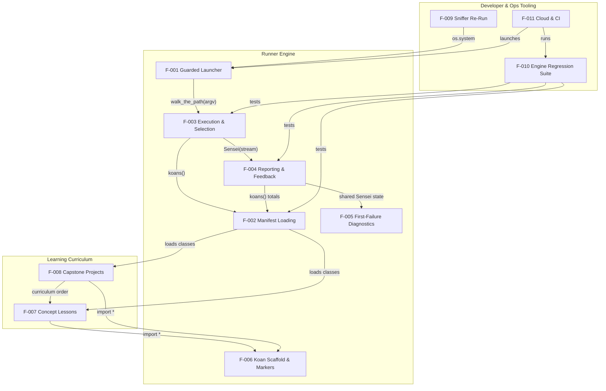
```mermaid
flowchart TD
    subgraph ENG["Runner Engine"]
        F001["F-001 Guarded Launcher"]
        F002["F-002 Manifest Loading"]
        F003["F-003 Execution & Selection"]
        F004["F-004 Reporting & Feedback"]
        F005["F-005 First-Failure Diagnostics"]
        F006["F-006 Koan Scaffold & Markers"]
    end
    subgraph CUR["Learning Curriculum"]
        F007["F-007 Concept Lessons"]
        F008["F-008 Capstone Projects"]
    end
    subgraph OPS["Developer & Ops Tooling"]
        F009["F-009 Sniffer Re-Run"]
        F010["F-010 Engine Regression Suite"]
        F011["F-011 Cloud & CI"]
    end
    F001 -->|"walk_the_path(argv)"| F003
    F003 -->|"koans()"| F002
    F003 -->|"Sensei(stream)"| F004
    F004 -->|"shared Sensei state"| F005
    F004 -->|"koans() totals"| F002
    F002 -->|"loads classes"| F007
    F002 -->|"loads classes"| F008
    F007 -->|"import *"| F006
    F008 -->|"import *"| F006
    F008 -->|"curriculum order"| F007
    F009 -->|"os.system"| F001
    F010 -->|"tests"| F002
    F010 -->|"tests"| F003
    F010 -->|"tests"| F004
    F011 -->|"runs"| F010
    F011 -->|"launches"| F001
```

The engine forms a single call chain (F-001 → F-003 → {F-002, F-004}), the curriculum (F-007, F-008) sits on the shared scaffold (F-006) and is loaded/executed by the engine, and the tooling layer (F-009, F-010, F-011) attaches to the engine from the outside without the engine depending on it.

### 2.13.2 Integration Points

| Integration Point | Type | Mechanism / Evidence |
|---|---|---|
| Launcher → Engine | Internal | `contemplate_koans.py` imports `runner.mountain` and calls `walk_the_path(sys.argv)` |
| Engine → Curriculum | Internal | `loadTestsFromName` resolves `koans.*` classes named in `koans.txt` |
| Engine → Terminal | External | `WritelnDecorator(sys.stdout)` writes narration; `sys.exit(-1)` sets the exit code |
| Engine → colorama | Internal (vendored) | `libs.colorama` `init()` + `Fore`/`Style` codes in `sensei.py` |
| Sniffer → Launcher | Internal | `scent.py` `os.system('python3 -B contemplate_koans.py')` |
| CI → Self-tests | External | `.travis.yml` runs `python _runner_tests.py` on Python 3.9 |
| Cloud workspace → Launcher | External | `.gitpod.yml` task `python contemplate_koans.py` |
| Learner → koan files | External | Manual edits to `koans/*.py` and `koans/triangle.py` (the exercise surface) |

### 2.13.3 Shared Components

| Shared Component | Path | Consuming Features |
|---|---|---|
| `Koan` base class + fill-in markers | `runner/koan.py` | F-006 owner; imported by F-007, F-008; loaded by F-002 |
| Ordered suite builder `koans()` | `runner/path_to_enlightenment.py` | F-002 owner; called by F-003 and F-004 |
| `Sensei` result object | `runner/sensei.py` | F-004 and F-005 are the same `Sensei` instance |
| `WritelnDecorator` output stream | `runner/writeln_decorator.py` | F-003 (constructs it), F-004 (writes through it) |
| `cls_name` introspection helper | `runner/helper.py` | F-004 (lesson transitions), F-005 (failure grouping) |
| `MockableTestResult` seam | `runner/mockable_test_result.py` | F-004 (base class), F-010 (mock isolation) |
| Vendored `colorama` | `libs/colorama/` | F-004, F-005 (colored output) |
| Vendored `mock` | `libs/mock.py` | F-010 (test doubles) |
| Curriculum manifest | `koans.txt` | F-002 (parsed); defines order for F-007, F-008 |

### 2.13.4 Common Services

Because Python Koans has no network, database, or server tier (Section 1.3.1), its "common services" are the cross-cutting, in-process capabilities that multiple features reuse:

| Common Service | Provided By | Reused By |
|---|---|---|
| Dynamic test loading by dotted name | `unittest.TestLoader.loadTestsFromName` | F-002 (manifest classes), F-003 (targeted selection) |
| Ordered `unittest.TestSuite` construction | `runner/path_to_enlightenment.py` | F-003 (execution), F-004 (totals) |
| `unittest` result protocol | `Sensei` / `MockableTestResult` | F-004 (progress), F-005 (diagnostics) |
| Line-oriented colored console output | `WritelnDecorator` + `libs/colorama` | F-004, F-005 |
| Process exit-code signaling | `sys.exit` | F-004 (`learn()` on failure), F-010 (`wasSuccessful()`) |

## 2.14 Requirements Traceability Matrix

This matrix links every feature and its requirements to the source artifacts that implement them and to the method by which each is verified. All requirements are at baseline version 1.0 (Section 2.1.2).

### 2.14.1 Feature-to-Requirement Traceability

| Feature | Primary Source Artifact(s) | Requirement IDs | Verification Method |
|---|---|---|---|
| F-001 | `contemplate_koans.py`, `run.sh`, `run.bat` | F-001-RQ-001…004 | Code review + `README.rst` |
| F-002 | `runner/path_to_enlightenment.py`, `koans.txt` | F-002-RQ-001…004 | Automated (`TestFilterKoanNames`, `TestKoansSuite`) |
| F-003 | `runner/mountain.py` | F-003-RQ-001…004 | Automated (`TestMountain`) |
| F-004 | `runner/sensei.py`, `runner/writeln_decorator.py`, `libs/colorama/` | F-004-RQ-001…007 | Automated (`TestSensei`) |
| F-005 | `runner/sensei.py`, `runner/helper.py` | F-005-RQ-001…007 | Automated (`TestSensei`, `TestHelper`) |
| F-006 | `runner/koan.py` | F-006-RQ-001…003 | Code review + `about_asserts.py` exemplar |
| F-007 | `koans/about_*.py` (concept modules) | F-007-RQ-001…004 | Runtime contract (per-koan pass/fail) + code review |
| F-008 | `koans/triangle.py`, `koans/about_triangle_project.py`, `koans/about_triangle_project2.py`, `koans/about_dice_project.py`, `koans/about_scoring_project.py`, `koans/about_proxy_object_project.py`, `koans/GREEDS_RULES.txt` | F-008-RQ-001…006 | Runtime contract (project test classes) |
| F-009 | `scent.py` | F-009-RQ-001…002 | Code review + `README.rst` |
| F-010 | `_runner_tests.py`, `runner/runner_tests/` | F-010-RQ-001…003 | Self-executing (`TextTestRunner`) |
| F-011 | `.travis.yml`, `.gitpod.yml`, `.gitpod.Dockerfile` | F-011-RQ-001…003 | Configuration review + CI execution |

**Verification-method legend.** *Automated* — exercised by the engine self-tests in `runner/runner_tests/` aggregated by `_runner_tests.py` (F-002, F-003, F-004, F-005, F-010). *Runtime contract* — the koan test classes themselves assert correctness when the learner runs the curriculum (F-007, F-008). *Code/config review* — verified by direct inspection plus `README.rst`/CI configuration, as no dedicated automated test targets the feature (F-001, F-006, F-009, F-011).

### 2.14.2 Automated Test Coverage

The following requirements are backed by specific engine self-tests, providing repeatable regression protection (all live under `runner/runner_tests/` and run via F-010):

| Requirement(s) | Backing Test Case | Aspect Verified |
|---|---|---|
| F-002-RQ-001 | `TestFilterKoanNames` | Comment/blank filtering, whitespace normalization, order |
| F-002-RQ-003 | `TestKoansSuite` | Suite construction from names; empty-input handling |
| F-003-RQ-003 | `TestMountain` | `walk_the_path` delegates to `lesson.learn` |
| F-004-RQ-002, RQ-003 | `TestSensei` | Pass counting; lesson discovery + koan counting |
| F-004-RQ-006 | `TestSensei` | Zen / Spanish-Inquisition messaging and wraparound |
| F-005-RQ-002, RQ-003 | `TestSensei` | Failure sorting and first-relevant-failure selection |
| F-005-RQ-004, RQ-005 | `TestSensei` | `errorReport`→scrape delegation; assertion/syntax extraction |
| (supports F-005) | `TestHelper` | `cls_name` against `str`, `int`, `tuple` |

Requirements not listed above (for example the F-001 version gate, F-006 markers, F-007/F-008 learner exercises, F-009 watching, and F-011 configuration) have no dedicated automated test and are verified by code/config review and, for F-007/F-008, by their own runtime contract tests.

### 2.14.3 Process-Flow Cross-Reference

Each stage of the end-to-end runtime flow diagrammed in Section 1.2.2 maps to the features documented here:

| Section 1.2.2 Flow Element | Feature(s) |
|---|---|
| `contemplate_koans.py` (Python version gate) | F-001 |
| `Mountain.walk_the_path(argv)` | F-003 |
| `path_to_enlightenment.koans()` + `koans.txt` manifest | F-002 |
| `unittest TestSuite` (ordered) | F-002, F-003 |
| `koans/ about_*.py` lessons + projects | F-006, F-007, F-008 |
| `Sensei` (custom `TestResult`) | F-004, F-005 |
| `libs/colorama` | F-004, F-005 |
| stdout: progress, next failure, Zen feedback | F-004, F-005 |

## 2.15 References

The following repository artifacts and specification sections were examined as evidence for the features and requirements documented in Section 2.

**Launcher & entry points**

- `contemplate_koans.py` - Established F-001: the `__main__` version gate (Python 2 rejection, sub-3.7 warning) and the dispatch into `Mountain().walk_the_path(sys.argv)`.
- `run.sh` - Established the POSIX launch wrapper (`python3 -B contemplate_koans.py`) for F-001.
- `run.bat` - Established the Windows launch wrapper, `PYTHON_PATH` handling, and the optional re-run loop for F-001.

**Runner engine (`runner/`)**

- `runner/mountain.py` - Established F-003: suite construction, `args[1]` targeted selection, execution, and delegation to `learn()`.
- `runner/path_to_enlightenment.py` - Established F-002: comment/blank filtering, UTF-8 read, ordered suite construction with method sorting disabled.
- `runner/sensei.py` - Established F-004 and F-005: progress counting, completion/exit behavior, Zen messaging, failure sorting, first-failure selection, and traceback scraping.
- `runner/koan.py` - Established F-006: the `Koan` base class and the `__`, `___`, `____`, `_____` fill-in markers.
- `runner/helper.py` - Established the shared `cls_name` introspection helper used by F-004/F-005.
- `runner/writeln_decorator.py` - Established the `WritelnDecorator` output-stream component shared by F-003/F-004.
- `runner/mockable_test_result.py` - Established the `MockableTestResult` seam used by F-004 and F-010.

**Engine self-tests (`runner/runner_tests/`)**

- `_runner_tests.py` - Established F-010: aggregation of the five engine test cases and exit-code signaling.
- `runner/runner_tests/` - Contained the engine regression tests (`test_mountain.py`, `test_sensei.py`, `test_helper.py`, `test_path_to_enlightenment.py`) that verify F-002–F-005.

**Curriculum (`koans/`)**

- `koans.txt` - Established F-002 manifest content and the curated 39-class ordering for F-007/F-008.
- `koans/about_asserts.py` - Established the F-007 fill-in / correct-the-value exercise patterns.
- `koans/triangle.py`, `koans/about_triangle_project.py`, `koans/about_triangle_project2.py` - Established the F-008 Triangle classification and error-handling contracts.
- `koans/about_dice_project.py` - Established the F-008 Dice set rolling contract.
- `koans/about_scoring_project.py`, `koans/GREEDS_RULES.txt` - Established the F-008 Greed scoring contract and rulebook.
- `koans/about_proxy_object_project.py` - Established the F-008 Proxy forwarding/recording contract and the complete `Television`/`TelevisionTest` reference.
- `koans/` - Contained the 38 `about_*.py` lesson modules and support fixtures (`local_module.py`, `a_package_folder/`, and others) backing F-007.

**Vendored libraries (`libs/`)**

- `libs/colorama/` - Established the cross-platform colored-output dependency for F-004/F-005.
- `libs/mock.py` - Established the vendored mocking dependency used by F-010.

**Tooling & configuration**

- `scent.py` - Established F-009: Sniffer watch paths, file validator, and launcher shell-out.
- `.travis.yml` - Established F-011 CI (Python 3.9, self-tests only, koan/deploy lines commented out).
- `.gitpod.yml`, `.gitpod.Dockerfile` - Established F-011 cloud workspace task and image provisioning.
- `README.rst` - Confirmed business context, the two exercise styles, the red→green→refactor workflow, the version policy, and Sniffer setup.
- `Contributor Notes.txt` - Corroborated the targeted single-case/method run workflow for F-003.
- `example_file.txt` - Confirmed the file fixture used by the F-007 `with`-statement lessons.

**Cross-referenced specification sections**

- Section 1.2 System Overview - Provided the component model, capability list, and the runtime process flow referenced by Sections 2.1 and 2.13–2.14.
- Section 1.3 Scope - Provided the in-scope/out-of-scope boundaries governing feature selection and the assumptions in Section 2.1.3.

# 3. Technology Stack

## 3.1 Programming Languages

Python Koans is implemented almost entirely in **Python 3**. Because the product's purpose is to teach Python through executable `unittest` exercises (`README.rst`, `runner/koan.py`), the launcher, the runner engine, the curriculum, and the maintainer self-tests are all written in Python. The only non-Python code is a pair of thin operating-system launch wrappers; everything else is declarative configuration or documentation. No compiled, web/front-end, or mobile/native languages are present in the repository — none of the generic default-stack languages (Swift, Kotlin, Objective-C, JavaScript/TypeScript) apply to this single-process command-line tool.

| Component | Language | Target / Version | Evidence |
|---|---|---|---|
| Launcher, runner engine, curriculum, self-tests, Sniffer config | Python | Python 3 (≥ 3.7 recommended) | `contemplate_koans.py`, `runner/`, `koans/`, `_runner_tests.py`, `scent.py` |
| POSIX launch wrapper | Shell (`/bin/sh`) | POSIX `sh` | `run.sh` |
| Windows launch wrapper | Batch | `cmd.exe` batch | `run.bat` |
| CI / cloud-workspace config | YAML | — | `.travis.yml`, `.gitpod.yml` |
| Cloud image definition | Dockerfile directives | — | `.gitpod.Dockerfile` |
| Project documentation | reStructuredText | — | `README.rst` |

### 3.1.1 Python 3 — Primary Application Language

All executable product code is Python 3: the guarded launcher `contemplate_koans.py`, the entire `runner/` execution engine, the 38 `koans/about_*.py` lesson and project modules, the `_runner_tests.py` regression harness, and the `scent.py` Sniffer configuration. The learner edits Python and the runner executes Python, so a single language and runtime spans both the exercises and the tool that grades them.

**Version gating and constraints.** The launcher inspects `sys.version_info` before doing any work and enforces a hard Python-3 floor with a soft 3.7 recommendation:

| Interpreter condition | Launcher behavior | Source |
|---|---|---|
| Python < 3.0 (i.e., Python 2) | Prints an explanatory "Python 3 version … running it with Python 2" message and does **not** start the runner | `contemplate_koans.py` |
| 3.0 ≤ Python < 3.7 | Prints a prominent compatibility WARNING ("designed for Python 3.7 or greater") but continues | `contemplate_koans.py` |
| Python ≥ 3.7 | Imports `runner.mountain.Mountain` and calls `Mountain().walk_the_path(sys.argv)` | `contemplate_koans.py` |

Additional version reference points observed in the repository:

- **Continuous integration targets Python 3.9** — `.travis.yml` declares `python: 3.9`.
- **The Windows wrapper defaults to Python 3.11** — `run.bat` sets `PYTHON_PATH=C:\Python311`, while `README.rst` instructs Windows users to set `C:\Python39` (a minor documentation/script mismatch worth noting, but both target Python 3).
- **The stated version policy is forward-looking** — `README.rst` says the project supports Python 3 and aims "to try to keep current with the latest production version," warning that older interpreters "will likely give you problems."

**Selection criteria and justification.** The choice of Python 3 is intrinsic to the product rather than a discretionary architectural preference: the tool exists to teach Python, so it must be authored in the language it teaches. The standard-library `unittest` framework is the pedagogical vehicle for the red → green → refactor workflow described in `README.rst`, which in turn fixes the runtime as CPython 3. The explicit rejection of Python 2 keeps the curriculum aligned with the only supported, actively maintained major version.

**Runtime dependencies.** Running the koans requires a Python 3 interpreter reachable on the system `PATH` — invoked as `python3` on \*nix or `python.exe` on Windows (`README.rst`, `run.sh`, `run.bat`). Source files carry `# -*- coding: utf-8 -*-` declarations and the curriculum manifest is opened with `io.open(filename, 'rt', encoding='utf8')` in `runner/path_to_enlightenment.py`, so a UTF-8-capable environment is assumed. There is no package-installation step; the interpreter plus the checked-out source (including the vendored `libs/`) is sufficient.

### 3.1.2 Shell and Batch Launch Wrappers

Two optional operating-system wrappers exist purely as convenience entry points around the Python launcher:

- **`run.sh`** — a four-line POSIX shell script (`#!/bin/sh`) that runs exactly `python3 -B contemplate_koans.py`. The `-B` flag suppresses writing `.pyc` bytecode caches to disk.
- **`run.bat`** — a Windows `cmd.exe` batch script that resolves a Python interpreter (probing `python.exe` on the path, then `PYTHON_PATH=C:\Python311`, then the `%PYTHON%` variable), invokes `python.exe -B contemplate_koans.py`, and offers a "Test again? y or n" re-run loop. Its own comment states "You don't actually need this script!", confirming the wrappers are conveniences rather than required components.

### 3.1.3 Ancillary Configuration and Documentation Formats

The remaining file formats in the repository are declarative configuration and documentation rather than application logic, but they are part of the stack's surface area: **YAML** for CI and cloud-workspace configuration (`.travis.yml`, `.gitpod.yml`); **Dockerfile** directives for the cloud image (`.gitpod.Dockerfile`); a plain-text, line-oriented **manifest** for the curriculum order (`koans.txt`, where `#`-prefixed lines are comments); **reStructuredText** for documentation (`README.rst`); and Mercurial/Git ignore globs (`.hgignore`, `.gitignore`).

## 3.2 Frameworks & Libraries

The system is built on exactly one framework — the **Python standard-library `unittest` module** — extended by a small custom result/loader layer inside `runner/`, and supported by two lightweight libraries vendored under `libs/`: **colorama 0.2.7** for cross-platform colored output and a modified **mock 0.6.0** for the maintainer self-tests. There is no web, application, ORM, or dependency-injection framework in the repository; the entire product is a thin, purpose-built extension of `unittest`.

| Framework / Library | Version | Role | Source |
|---|---|---|---|
| `unittest` (Python standard library) | Bundled with the Python 3 interpreter (no independent version) | Core test framework — `TestCase`, `TestResult`, `TestSuite`, `TestLoader`, `TextTestRunner` | `runner/`, `_runner_tests.py` |
| colorama | 0.2.7 (vendored) | Cross-platform ANSI colored terminal output | `libs/colorama/`, `runner/sensei.py` |
| mock | 0.6.0 "modified by Greg Malcolm" (vendored) | Test doubles (patching/mocking) for the runner self-tests | `libs/mock.py`, `runner/runner_tests/` |

### 3.2.1 Core Framework — Python Standard-Library `unittest`

Every executable exercise and every engine component is anchored on `unittest`. Learner lessons subclass a shared `Koan` base that is itself a `unittest.TestCase` (`runner/koan.py`), and the engine drives them through the standard framework primitives:

- `runner/path_to_enlightenment.py` builds a `unittest.TestSuite` with a `unittest.TestLoader`, disabling method reordering (`loader.sortTestMethodsUsing = None`) so lessons execute in the curated order declared in `koans.txt`.
- `runner/sensei.py` defines `Sensei`, a custom `unittest.TestResult` subclass, to render lesson-aware, colorized narration instead of the default dotted output.
- `_runner_tests.py` aggregates the engine's regression tests with `unittest.TestLoader().loadTestsFromTestCase(...)` and executes them via `unittest.TextTestRunner(verbosity=2)`.

**Justification.** `unittest` is part of the Python standard library, so it requires no installation and is guaranteed present wherever a supported interpreter is — directly enabling the project's "run in place, no packaging" model. It also *is* the subject matter: the koans teach the very `assert*` vocabulary (`assertTrue`, `assertEqual`, `assertRaises`, …) that `unittest` provides, making the framework both the delivery mechanism and part of the lesson.

### 3.2.2 Custom Runner Extensions Built on `unittest`

The `runner/` package is a small framework-level layer that specializes `unittest` for guided, single-failure-at-a-time learning:

- **`Koan` base class** (`runner/koan.py`) — an empty `unittest.TestCase` subclass exported alongside the fill-in markers `__`, `___`, `____`, and `_____`, which every lesson imports via `from runner.koan import *`.
- **`Sensei` reporter** (`runner/sensei.py`) — subclasses `MockableTestResult` (itself `unittest.TestResult`) and overrides `startTest`, `addSuccess`, and `addFailure`/`addError` to accumulate `pass_count`/`lesson_pass_count`, focus on the first unsolved failure, and print progress and Zen-of-Python feedback.
- **`MockableTestResult`** (`runner/mockable_test_result.py`) — a deliberate seam: an empty `unittest.TestResult` subclass that exists so the self-tests can mock the result object without mocking `unittest.TestResult` itself.
- **`WritelnDecorator`** (`runner/writeln_decorator.py`) — a file-like stream wrapper adding a `writeln` method, noted in-source as "Taken from legacy python unittest."

### 3.2.3 Supporting Libraries

**colorama 0.2.7 (vendored).** `libs/colorama/__init__.py` declares `VERSION = '0.2.7'`. It is imported only by the reporter — `runner/sensei.py` does `from libs.colorama import init, Fore, Style` and calls `init()` at module import — to produce cross-platform ANSI colored terminal output. The vendored package includes the Windows-console translation modules (`win32.py`, `winterm.py`, `ansitowin32.py`), which is what lets the same escape-sequence coloring work on both \*nix terminals and legacy Windows consoles. It justifies its place because colored pass/fail narration is a core F-004 capability and colorama is the minimal way to achieve it portably without requiring learners to install anything.

**mock 0.6.0, modified (vendored).** `libs/mock.py` declares `__version__ = '0.6.0 modified by Greg Malcolm'` and exports `Mock`, `patch`, `patch_object`, `sentinel`, and `DEFAULT`. It is used exclusively by the runner's own regression tests — `runner/runner_tests/test_mountain.py` and `runner/runner_tests/test_sensei.py` both do `from libs.mock import *` — to substitute test doubles for streams and results while exercising the engine. It is *not* used by any learner koan.

### 3.2.4 Standard-Library Modules in Use

Beyond `unittest`, the engine and curriculum rely only on modules bundled with Python 3, reinforcing the zero-dependency runtime: `sys` and `os` (launcher, process control, path handling), `io` (UTF-8 manifest reading), `re` (assertion/stack scraping and regex lessons), `glob` (lesson counting in `runner/sensei.py`), and `functools`, `random`, and `math` within specific koans. No third-party package is required at runtime beyond the two vendored libraries above.

### 3.2.5 Compatibility Requirements

- **`unittest` API surface** — the engine uses long-stable APIs (`TestCase`, `TestResult`, `TestSuite`, `TestLoader.loadTestsFromName`/`loadTestsFromTestCase`, `sortTestMethodsUsing`, `TextTestRunner`) that are consistent across Python 3.x, which is why the project can recommend "3.7 or greater" (`contemplate_koans.py`), verify on 3.9 (`.travis.yml`), and launch on 3.11 (`run.bat`) without code changes.
- **colorama 0.2.7** — an intentionally pinned, older release; because it is vendored and the reporter uses only `init`, `Fore`, and `Style`, it remains compatible without any upgrade or install step.
- **mock 0.6.0 (modified)** — a legacy standalone mocking library retained even though Python 3.3+ ships `unittest.mock`; vendoring the modified copy keeps the self-tests dependency-free and independent of interpreter-bundled mock behavior.

### 3.2.6 Framework & Library Integration

The following diagram shows how the standard-library framework, the custom runner extensions, and the vendored libraries fit together.

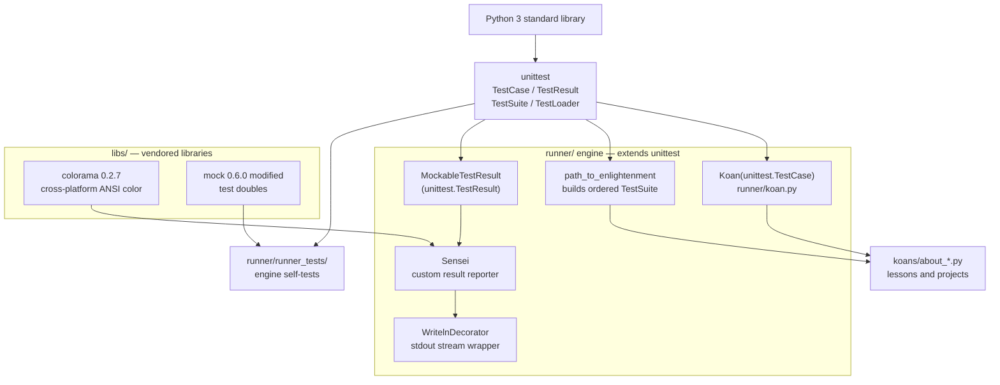
```mermaid
flowchart TD
    STD["Python 3 standard library"]
    UT["unittest<br/>TestCase / TestResult<br/>TestSuite / TestLoader"]
    STD --> UT

    subgraph Engine["runner/ engine — extends unittest"]
        KOAN["Koan(unittest.TestCase)<br/>runner/koan.py"]
        PTE["path_to_enlightenment<br/>builds ordered TestSuite"]
        MTR["MockableTestResult<br/>(unittest.TestResult)"]
        SENSEI["Sensei<br/>custom result reporter"]
        WLD["WritelnDecorator<br/>stdout stream wrapper"]
        MTR --> SENSEI
    end

    UT --> KOAN
    UT --> PTE
    UT --> MTR

    subgraph Vendored["libs/ — vendored libraries"]
        COLOR["colorama 0.2.7<br/>cross-platform ANSI color"]
        MOCK["mock 0.6.0 modified<br/>test doubles"]
    end

    KOAN --> Lessons["koans/about_*.py<br/>lessons and projects"]
    PTE --> Lessons
    COLOR --> SENSEI
    SENSEI --> WLD
    UT --> RT["runner/runner_tests/<br/>engine self-tests"]
    MOCK --> RT
```

## 3.3 Open Source Dependencies

Python Koans has an unusually small open-source dependency footprint, and it manages dependencies in a way that is itself an architectural decision. There is **no dependency manifest** anywhere in the repository — no `requirements.txt`, `setup.py`, `setup.cfg`, `pyproject.toml`, `Pipfile`, `poetry.lock`, or `environment.yml`. The two libraries the product actually needs at runtime are **vendored** (copied directly into `libs/`), and every other open-source package is optional developer tooling that is installed on demand from PyPI.

### 3.3.1 Dependency Management Strategy

Dependencies fall into three tiers, in decreasing order of coupling to the product:

1. **Python standard library** — the entire runtime (see 3.2.4); nothing to install.
2. **Vendored libraries** (`libs/`) — `colorama` and a modified `mock`, committed into the repository so the tool "runs in place" from a clone or download with no install step. `libs/__init__.py` is a "Dummy file to support python package hierarchy," making `libs` an importable package.
3. **Optional, on-demand tooling** — Sniffer and its OS-specific file-watch backends, plus the Gitpod image's pre-installed test tools, fetched from PyPI only when a developer opts in.

Because there is no manifest, the effective "lockfile" for the runtime dependencies is the vendored source itself: the exact code that ships is the exact code that runs.

### 3.3.2 Vendored Runtime Dependencies

Both libraries originate from the Python Package Index (PyPI) but are bundled rather than fetched. Versions and licenses are taken directly from the vendored source.

| Dependency | Version | License | Location |
|---|---|---|---|
| colorama | 0.2.7 | BSD 3-Clause (Copyright Jonathan Hartley 2013) | `libs/colorama/` (incl. `LICENSE-colorama`) |
| mock | 0.6.0 "modified by Greg Malcolm" | BSD License (Copyright Michael Foord 2007–2009) | `libs/mock.py` |

- **colorama 0.2.7** — declared as `VERSION = '0.2.7'` in `libs/colorama/__init__.py`, licensed BSD 3-Clause per its header comment and the bundled `LICENSE-colorama`. Used only by `runner/sensei.py`.
- **mock 0.6.0 (modified)** — declared as `__version__ = '0.6.0 modified by Greg Malcolm'` in `libs/mock.py`; the header credits Michael Foord and points to the original project home (voidspace.org.uk). Used only by the runner self-tests in `runner/runner_tests/`.

### 3.3.3 Optional Developer & Tooling Dependencies

None of the following are required to run the koans; they are documented conveniences installed from PyPI at the developer's discretion.

| Dependency | Version | Purpose | Declared in |
|---|---|---|---|
| sniffer | unpinned | Continuous re-run of the koans on file change | `README.rst`, `scent.py` |
| pyinotify | unpinned (Linux) | File-change notification backend for Sniffer | `README.rst` |
| pywin32 | unpinned (Windows) | File-change notification backend for Sniffer | `README.rst` |
| MacFSEvents | unpinned (macOS) | File-change notification backend for Sniffer | `README.rst` |
| pytest | 4.4.2 (pinned) | Pre-installed in the Gitpod image; **not** invoked by the project's own scripts | `.gitpod.Dockerfile` |
| pytest-testdox | unpinned | Pre-installed in the Gitpod image | `.gitpod.Dockerfile` |
| mock | unpinned | Pre-installed in the Gitpod image | `.gitpod.Dockerfile` |

`README.rst` documents the Sniffer install path (`python3 -m pip install sniffer`, plus one OS-specific watcher), and `scent.py` is the Sniffer control file. The Gitpod-image tools are installed by `.gitpod.Dockerfile` for the browser workspace only; the launcher and `_runner_tests.py` never call `pytest`.

### 3.3.4 Dependency Security Considerations

- **Deterministic supply chain for runtime code.** Vendoring `colorama` and `mock` eliminates install-time dependency resolution for the runtime, removing exposure to typosquatting and registry-substitution attacks and guaranteeing the executed code matches what is committed.
- **Aging, unpatched pins.** The trade-off is that the vendored versions (colorama 0.2.7, mock 0.6.0) are old and receive no upstream security or bug fixes, and the absence of a manifest means standard software-composition-analysis tooling (which keys off `requirements.txt`/lockfiles) cannot automatically flag known vulnerabilities. The practical risk is low because the tool has no network, database, or server surface (see the System Overview and Scope sections) — it runs locally and processes only local instructional files.
- **Unpinned optional tooling.** Sniffer and its watch backends (`pyinotify`, `pywin32`, `MacFSEvents`) and two of the three Gitpod tools (`pytest-testdox`, `mock`) are unpinned and float to the latest PyPI release at install time; only `pytest==4.4.2` is pinned. These affect the developer/cloud environment, not the shipped product.
- **Learner-supplied code execution.** By design the runner imports and executes learner-edited `koans/*.py` files; arbitrary code execution is inherent to the exercise but is confined to the learner's own machine and is not introduced by third-party dependencies.

## 3.4 Third-Party Services

The Python Koans **product makes no network calls at runtime** — it reads local files and writes to the terminal, with no external APIs, authentication providers, telemetry, or cloud infrastructure involved in executing the koans (see the System Overview and Scope sections). Every third-party service in the repository is an *optional* developer, continuous-integration, or hosting integration declared entirely in configuration files, and each is configuration-only: no code changes are required to enable or disable it.

| Service | Category | Role | Evidence |
|---|---|---|---|
| Travis CI | Continuous Integration | Runs the runner self-tests on push (Python 3.9) | `.travis.yml` |
| Gitpod | Cloud IDE workspace | One-click browser workspace that launches the koans | `.gitpod.yml`, `.gitpod.Dockerfile`, `README.rst` |
| Eclipse Che / OpenShift | Cloud IDE workspace | Alternative one-click workspace entry point | `README.rst` |
| GitHub | Source hosting | Repository hosting, Gitpod prebuild integration, submodule origin | `README.rst`, `.gitpod.yml`, `.gitmodules` |
| python.org | Distribution | Referenced source for downloading the Python interpreter | `README.rst` |

### 3.4.1 Continuous Integration — Travis CI

`.travis.yml` configures Travis CI as a Python project pinned to Python 3.9, whose only active step is `script: python _runner_tests.py` — it runs the engine's regression suite (F-010) and nothing else, because the koan-execution lines are commented out. `README.rst` displays a Travis status badge (`travis-ci.org/gregmalcolm/python_koans`). The integration is verification-only: it neither runs the learner koans nor builds or deploys any artifact.

### 3.4.2 Cloud Development Workspaces — Gitpod & Eclipse Che / OpenShift

`.gitpod.yml` defines a Gitpod workspace whose image is built from `.gitpod.Dockerfile`, whose startup task is `python contemplate_koans.py`, and which enables prebuilds for the `master` branch only (`pullRequests: false`, `addComment: false`). `README.rst` surfaces "ready-to-code" one-click buttons for both Gitpod and Eclipse Che / OpenShift workspaces, letting a prospective learner start the curriculum in a browser with zero local setup. The Eclipse Che / OpenShift button ultimately routes through the same Gitpod launch URL per `README.rst`.

### 3.4.3 Source Hosting & Distribution — GitHub and python.org

`README.rst` identifies GitHub as the canonical home of the project and the download source, and the Gitpod prebuild configuration in `.gitpod.yml` integrates with GitHub events. `.gitmodules` also references a GitHub-hosted repository as the origin of the declared submodule (documented in 3.6, and treated as out of scope). For installation, `README.rst` points learners to `python.org` to obtain the interpreter. These are hosting/distribution touch-points, not runtime service dependencies.

### 3.4.4 Notifications & Monitoring

The only notification mechanism in the repository is Travis CI email notifications, enabled via `notifications: email: true` in `.travis.yml`. There is **no application performance monitoring (APM), logging service, error-tracking, analytics, or uptime monitoring** anywhere in the codebase — consistent with a local, single-process command-line tool that reports progress only to its own stdout.

### 3.4.5 Explicitly Absent Service Categories

To be unambiguous about what the default technology stack would suggest but this system does **not** use:

- **Authentication services** — none. There is no Auth0/OAuth/OIDC, no user accounts, and no login of any kind; the tool has no notion of identity.
- **Cloud infrastructure** — none. There is no AWS/GCP/Azure usage, no infrastructure-as-code, and no managed compute, storage, or networking. The only "cloud" is the Gitpod/Eclipse Che developer workspace.
- **External APIs / integrations** — none consumed at runtime. The product performs no HTTP, RPC, messaging, or database traffic.

### 3.4.6 Integration & Security Considerations

- All integrations are **configuration-only**; enabling Travis, Gitpod, or the workspace buttons requires editing YAML/Dockerfile/README, not the product code.
- **No secrets** are stored in any configuration file; the hosted CI and workspaces operate with repository scope only.
- The Gitpod base image is referenced by the mutable tag `gitpod/workspace-full:latest` in `.gitpod.Dockerfile`, so workspace builds are not fully reproducible over time — a minor supply-chain/reproducibility consideration confined to the cloud developer environment.
- Because Travis runs only the self-tests and performs no deployment, no deployment credentials or production secrets are needed.

## 3.5 Databases & Storage

Python Koans uses **no database, no cache, and no storage service of any kind**. A repository-wide search finds no database, cache, or object-store client (no `sqlite3`, `sqlalchemy`, `pymongo`/MongoDB, `redis`, `boto3`/S3, `psycopg2`, MySQL, etc.), and there are no data files beyond plain-text and Python sources. The default stack's MongoDB — and databases in general — are not applicable to this tool. Its only persistence surface is the **local filesystem, read-only**, for loading curriculum inputs; all runtime state is held **in memory** and discarded when the process exits.

| Storage concern | Mechanism | Persistence | Evidence |
|---|---|---|---|
| Curriculum order | `koans.txt` plain-text manifest, read at startup as UTF-8 | Read-only local file | `runner/path_to_enlightenment.py` |
| Lessons & projects | `koans/*.py` modules imported by the loader | Read-only local files | `koans/`, `runner/mountain.py` |
| Sample data fixture | `example_file.txt` opened by file-I/O koans | Read-only local file | `koans/about_with_statements.py`, `koans/about_iteration.py` |
| Runtime progress | `pass_count` / `lesson_pass_count` counters | In-memory only; discarded at exit | `runner/sensei.py` |
| Learner answers | Learner-edited `koans/*.py`; `answers` path VCS-ignored | Local filesystem, untracked | `.gitignore`, `.hgignore` |

### 3.5.1 Data Persistence Model

The persistence model is deliberately minimal. At startup the engine reads the ordered manifest `koans.txt` with `io.open(filename, 'rt', encoding='utf8')` (`runner/path_to_enlightenment.py`) and imports the named `koans/*.py` modules; those files are the "data." During a run, the custom `Sensei` result object (`runner/sensei.py`) accumulates counters such as `pass_count` and `lesson_pass_count` purely in memory and computes lesson totals on the fly by globbing `koans/about*.py`. Results are emitted to stdout and encoded into the process exit code; nothing is written to a datastore, and no progress is persisted between runs.

### 3.5.2 File-Based Inputs

Two categories of files serve as read-only inputs:

- **Curriculum files** — `koans.txt` (the ordered, comment-aware list of test classes) and the `koans/*.py` lesson/project modules and their support fixtures (e.g., `koans/triangle.py`, `koans/a_package_folder/`).
- **Sample data fixture** — `example_file.txt` (a small four-line text file) is opened read-only by the file-handling exercises in `koans/about_with_statements.py` (via `count_lines`, `find_line`, etc.) and by `koans/about_iteration.py`. This is instructional sample input, not application data.

All observed file access in the koans is read-only `open()`/`io.open()`; the product never writes user data to disk.

### 3.5.3 Learner Answers and Version-Ignored Paths

The only "state" a learner produces is their edits to the `koans/*.py` files themselves, saved on the local filesystem by their editor. Both `.gitignore` and `.hgignore` list an `answers` path (alongside `*.pyc`, `*.swp`, `.DS_Store`, `.idea`), so any answers directory a learner creates is intentionally kept out of version control. This is a source-control hygiene decision, not a storage or persistence service.

### 3.5.4 Explicitly Absent Storage Components

For clarity against the default technology stack: there is **no primary or secondary database**, **no caching layer** (no Redis/Memcached), **no object/blob storage** (no S3 or equivalent), and **no serialization store** (no `pickle`/`shelve`/embedded DB). None are needed — the tool's entire data domain is a set of instructional files read from the working directory.

## 3.6 Development & Deployment

Python Koans has an intentionally lightweight development and delivery model: it is version-controlled with Git, has **no build system** (it runs in place from source), uses **Sniffer** as its continuous local test loop, and is verified — but never deployed — by **Travis CI**. Docker appears only to provision the optional Gitpod cloud workspace, not to package or deploy the product. There is no GitHub Actions pipeline, no infrastructure-as-code, and no continuous-delivery stage anywhere in the repository.

### 3.6.1 Version Control

The repository is managed with **Git**: it contains `.gitignore`, `.gitmodules`, and a `.git` checkout. A legacy **Mercurial** ignore file (`.hgignore`, beginning with `syntax: glob`) is retained alongside it, and the two ignore lists mirror each other (`*.pyc`, `*.swp`, `.DS_Store`, `answers`, `.idea`), each also ignoring the other tool's metadata directory (`.gitignore` ignores `.hg`; `.hgignore` ignores `.git`). This dual-VCS ignore setup reflects the project's history across both systems.

`.gitmodules` declares a single Git submodule, `Submodule_01_Do_not_use_15Jun`, pointing at a GitHub-hosted URL. Its name explicitly marks it "Do not use," and it is treated as out of scope (Scope section); its contents are not part of the technology stack and are not documented here. Its presence is a supply-chain touch-point only in that Git would resolve it from the external URL.

### 3.6.2 Build System

There is **no build step**. The project ships no `Makefile`, `setup.py`, `pyproject.toml`, or any other build/packaging manifest (see 3.3), and Python 3 is interpreted, so "building" consists solely of obtaining the interpreter and the source tree. The launch wrappers invoke the interpreter with the `-B` flag (`run.sh`, `run.bat`, and the Sniffer command in `scent.py`), which prevents writing `.pyc` bytecode caches — keeping the working tree clean and avoiding stale-bytecode surprises. Distribution is by cloning or downloading the repository, not by publishing a package artifact.

### 3.6.3 Development Tooling

- **Continuous local test loop — Sniffer.** `scent.py` configures Sniffer to watch `['.', 'koans/']`, accept only non-hidden `*.py` files (`@file_validator py_files`), and, on change, re-run the koans via `os.system('python3 -B contemplate_koans.py')` (`@runnable execute_koans`). `README.rst` documents installing Sniffer plus one OS-specific watch backend (`pyinotify`/`pywin32`/`MacFSEvents`) for event-driven rather than polling behavior.
- **Engine regression suite.** `_runner_tests.py` aggregates the `runner/runner_tests/` test cases (`TestMountain`, `TestSensei`, `TestHelper`, `TestFilterKoanNames`, `TestKoansSuite`) into a single `unittest` suite and runs them with `TextTestRunner(verbosity=2)`, exiting non-zero on failure. This is the maintainer-facing quality gate and the exact command Travis executes.
- **Contributor workflow.** `Contributor Notes.txt` documents how to run a single case (`python3 contemplate_koans.py about_strings`) or a single test method (dotted path), supporting targeted development of individual koans.

### 3.6.4 Containerization

Docker is used **only** to define the Gitpod cloud workspace image, not to containerize the product for deployment. `.gitpod.Dockerfile` starts `FROM gitpod/workspace-full:latest`, switches to `USER gitpod`, and runs `pip3 install pytest==4.4.2 pytest-testdox mock` to provision developer tooling inside the browser workspace. There is no application `Dockerfile`, no `docker-compose` file, and no container registry or image-publishing step; the tools installed in the image are not invoked by the project's own scripts.

### 3.6.5 Continuous Integration & Deployment

- **CI — Travis CI.** `.travis.yml` runs `python _runner_tests.py` on Python 3.9 for each push/PR, verifying the runner engine, with email notifications enabled. The koan-execution lines are commented out, so CI does not run the learner koans, and there is no build or artifact step.
- **No CD / deployment.** Nothing in the repository builds, publishes, or deploys an artifact; CI is verification-only. There is no GitHub Actions workflow (no `.github/` directory exists), no Terraform or other infrastructure-as-code, and no release automation.
- **Prebuilds.** `.gitpod.yml` enables Gitpod prebuilds for the `master` branch so the cloud workspace starts quickly; this is a workspace-provisioning optimization, not a deployment.

### 3.6.6 Development & CI Workflow

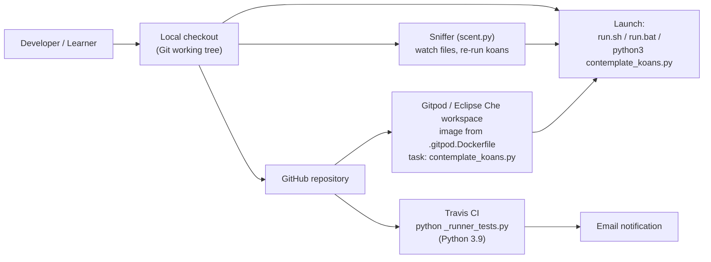
```mermaid
flowchart LR
    Dev["Developer / Learner"]
    Local["Local checkout<br/>(Git working tree)"]
    Launch["Launch:<br/>run.sh / run.bat /<br/>python3 contemplate_koans.py"]
    Sniff["Sniffer (scent.py)<br/>watch files, re-run koans"]
    GH["GitHub repository"]
    Travis["Travis CI<br/>python _runner_tests.py<br/>(Python 3.9)"]
    Email["Email notification"]
    Gitpod["Gitpod / Eclipse Che workspace<br/>image from .gitpod.Dockerfile<br/>task: contemplate_koans.py"]

    Dev --> Local
    Local --> Launch
    Local --> Sniff
    Sniff --> Launch
    Local --> GH
    GH --> Travis
    Travis --> Email
    GH --> Gitpod
    Gitpod --> Launch
```

### 3.6.7 Integration & Security Considerations

- CI and workspace integrations are **configuration-only** and store **no secrets**; because CI performs no deployment, no production or registry credentials are required.
- The Gitpod base image is pinned only to the mutable `:latest` tag, so workspace builds are not fully reproducible over time — a minor reproducibility consideration limited to the cloud developer environment.
- The `-B` no-bytecode launch convention avoids committing or executing stale `.pyc` files.
- The declared submodule resolves from an external GitHub URL; it is explicitly "Do not use" and excluded from the product, so it introduces no runtime or deployment dependency.

## 3.7 References

The following repository files and folders were inspected as evidence for this Technology Stack section.

**Root launch, configuration, and documentation files**

- `contemplate_koans.py` - Guarded launcher; `sys.version_info` interpreter gating (Python 2 rejected, < 3.7 warned); imports `runner.mountain.Mountain`.
- `run.sh` - POSIX `/bin/sh` launch wrapper running `python3 -B contemplate_koans.py`.
- `run.bat` - Windows Batch launch wrapper; `PYTHON_PATH=C:\Python311`; interpreter discovery and re-run loop.
- `scent.py` - Sniffer configuration (`sniffer.api`, `watch_paths`, `@runnable execute_koans`) for the continuous local test loop.
- `koans.txt` - Plain-text, comment-aware ordered curriculum manifest.
- `_runner_tests.py` - `unittest` aggregate harness for the runner self-tests; CI entry command.
- `example_file.txt` - Small read-only text fixture consumed by the file-I/O koans.
- `README.rst` - reStructuredText docs establishing purpose, Python 3 version policy, install steps, Sniffer setup (with `pyinotify`/`pywin32`/`MacFSEvents`), and CI/Gitpod badges.
- `.travis.yml` - Travis CI configuration (Python 3.9; `script: python _runner_tests.py`; email notifications; koan/deploy lines commented out).
- `.gitpod.yml` - Gitpod workspace configuration (image from `.gitpod.Dockerfile`; task `python contemplate_koans.py`; `master` prebuilds).
- `.gitpod.Dockerfile` - Cloud workspace image (`FROM gitpod/workspace-full:latest`; `pip3 install pytest==4.4.2 pytest-testdox mock`).
- `.gitignore` - Git ignore rules (`*.pyc`, `*.swp`, `.DS_Store`, `answers`, `.idea`, `.hg`).
- `.hgignore` - Legacy Mercurial ignore rules (`syntax: glob`; mirrors `.gitignore`, also ignores `.git`).
- `.gitmodules` - Declares the out-of-scope `Submodule_01_Do_not_use_15Jun` and its GitHub origin URL.
- `Contributor Notes.txt` - Targeted single-case / single-test run workflow for contributors.

**Runner engine (`runner/`)**

- `runner/` - The Python 3 execution-engine package.
- `runner/koan.py` - `Koan(unittest.TestCase)` base and fill-in markers `__`, `___`, `____`, `_____`.
- `runner/sensei.py` - Custom `unittest.TestResult` reporter; sole `from libs.colorama import init, Fore, Style` site with `init()` at import; progress/lesson counters and `glob`-based lesson counting.
- `runner/mountain.py` - `Mountain.walk_the_path(argv)` orchestrator; targeted selection via `loadTestsFromName("koans." + args[1])`.
- `runner/path_to_enlightenment.py` - Reads `koans.txt` via `io.open(..., encoding='utf8')`; builds an ordered `unittest.TestSuite` with `sortTestMethodsUsing = None`.
- `runner/helper.py` - `cls_name(obj)` utility.
- `runner/writeln_decorator.py` - `WritelnDecorator` stdout stream wrapper.
- `runner/mockable_test_result.py` - `MockableTestResult(unittest.TestResult)` mocking seam.
- `runner/runner_tests/` - Engine regression-test package executed by CI.
- `runner/runner_tests/test_mountain.py` - Self-test importing the vendored mock (`from libs.mock import *`).
- `runner/runner_tests/test_sensei.py` - Self-test importing the vendored mock (`from libs.mock import *`).

**Curriculum (`koans/`)**

- `koans/` - The learner curriculum package (`about_*.py` lessons and capstone projects).
- `koans/about_with_statements.py` - File-handling koan that opens `example_file.txt` (read-only).
- `koans/about_iteration.py` - Koan that opens `example_file.txt` (read-only).
- `koans/triangle.py` - Capstone-project support fixture referenced as an example lesson file.
- `koans/a_package_folder/` - Package-import lesson fixture.

**Vendored libraries (`libs/`)**

- `libs/` - Bundled third-party runtime dependencies (no install step).
- `libs/__init__.py` - "Dummy file to support python package hierarchy."
- `libs/colorama/` - Vendored colorama package (incl. Windows-console modules `win32.py`, `winterm.py`, `ansitowin32.py`).
- `libs/colorama/__init__.py` - Declares `VERSION = '0.2.7'` and the BSD 3-Clause header.
- `libs/colorama/LICENSE-colorama` - colorama BSD 3-Clause license text.
- `libs/mock.py` - Declares `__version__ = '0.6.0 modified by Greg Malcolm'`; BSD-licensed legacy mock used only by the runner self-tests.

**Cross-referenced specification sections**

- 1.1 Executive Summary, 1.2 System Overview, 1.3 Scope, and 2.12 F-011 — used to align terminology and confirm the vendored-dependency model, the CI-verification-only posture, and the out-of-scope submodule.

**Absent artifacts (verified not present)**

- No dependency manifest (`requirements.txt`, `setup.py`, `setup.cfg`, `pyproject.toml`, `Pipfile`, `poetry.lock`, `environment.yml`), no `.github/` workflows, no application `Dockerfile`/`docker-compose`, and no database/cache/object-store clients were found anywhere in scope.

# 4. Process Flowchart

## 4.1 System Workflow Overview

Python Koans is a single-process, terminal-driven Python 3 application whose runtime is a short, deterministic pipeline rather than a distributed transactional system (Section 1.2). Control flows from the `contemplate_koans.py` launcher into `runner.mountain.Mountain`, which loads an ordered `unittest.TestSuite` from the `koans.txt` manifest and executes it against the custom `runner.sensei.Sensei` result object, which renders colored, progress-aware feedback to the terminal. Because the system performs no network, database, or persistent I/O of its own, its "business process" is the learner's iterative *red → green → refactor* loop: run the koans, read the first failing koan, edit its source to make it pass, and re-run until the whole curriculum is green.

This section documents that workflow at the system level; Sections 4.2–4.3 decompose the individual core and integration flows, Section 4.4 consolidates every decision point and validation rule, Section 4.5 covers state and persistence, and Section 4.6 covers error handling and recovery. All diagrams are derived directly from the source files cited in Section 4.7 and do not assert behavior beyond what the code exhibits.

### 4.1.1 Actors, Systems, and Boundaries

The workflow crosses a small, well-defined set of boundaries. The engine is entirely in-process; every other participant is either a human actor, the filesystem, the operating-system terminal, or an optional developer/CI tool that attaches to the launcher from the outside (Section 2.13.2).

| Actor / System | Role in the Workflow | Boundary Type | Evidence |
|---|---|---|---|
| Learner | Human actor who runs the koans, reads feedback, and edits koan source to make tests pass | External (human) | `README.rst`, `koans/about_*.py` |
| Launch layer | Version-gates the interpreter and starts the engine | Process entry point | `contemplate_koans.py`, `run.sh`, `run.bat` |
| Runner engine | Orchestrates loading, execution, reporting, and scaffolding | In-process (Python) | `runner/mountain.py`, `runner/sensei.py`, `runner/path_to_enlightenment.py`, `runner/koan.py` |
| Curriculum & manifest | Supplies the ordered lesson list and the exercise source that is executed | Filesystem (read) | `koans.txt`, `koans/about_*.py`, `example_file.txt` |
| Terminal (stdout) | Receives colored narration; carries the process exit code | External (OS) | `runner/writeln_decorator.py`, `libs/colorama/`, `sys.exit` |
| Sniffer (optional) | Watches files and re-runs the koans on change | Developer tooling | `scent.py` |
| Travis CI / Gitpod (optional) | Verifies the engine in CI; provides a one-click cloud workspace | External services | `.travis.yml`, `.gitpod.yml`, `.gitpod.Dockerfile` |

### 4.1.2 High-Level End-to-End System Workflow

The following swim-lane diagram shows the complete runtime, from a learner starting the program through the version gate, curriculum loading, ordered execution, and the two terminal outcomes (green completion or red first-failure with a non-zero exit). Each lane is a system boundary; cross-lane arrows are the interactions between them. The learner's edit-and-re-run loop closes the cycle on the left.

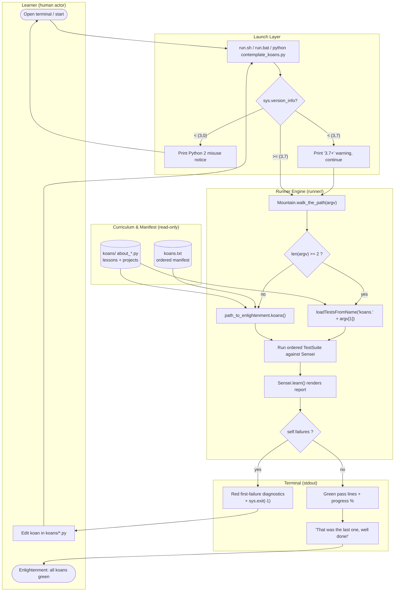
```mermaid
flowchart TD
    subgraph LANE_LEARNER["Learner (human actor)"]
        L1([Open terminal / start])
        L2["Edit koan in koans/*.py"]
        L3([Enlightenment: all koans green])
    end
    subgraph LANE_LAUNCH["Launch Layer"]
        LB1["run.sh / run.bat / python contemplate_koans.py"]
        LB2{"sys.version_info?"}
        LB3["Print Python 2 misuse notice"]
        LB4["Print '3.7+' warning, continue"]
    end
    subgraph LANE_ENGINE["Runner Engine (runner/)"]
        E1["Mountain.walk_the_path(argv)"]
        E2{"len(argv) >= 2 ?"}
        E3["loadTestsFromName('koans.' + argv[1])"]
        E4["path_to_enlightenment.koans()"]
        E5["Run ordered TestSuite against Sensei"]
        E6["Sensei.learn() renders report"]
        E7{"self.failures ?"}
    end
    subgraph LANE_DATA["Curriculum & Manifest (read-only)"]
        M1[("koans.txt<br/>ordered manifest")]
        C1[("koans/ about_*.py<br/>lessons + projects")]
    end
    subgraph LANE_TERM["Terminal (stdout)"]
        T1["Green pass lines + progress %"]
        T2["Red first-failure diagnostics<br/>+ sys.exit(-1)"]
        T3["'That was the last one, well done!'"]
    end
    L1 --> LB1 --> LB2
    LB2 -->|"< (3,0)"| LB3 --> L1
    LB2 -->|"< (3,7)"| LB4 --> E1
    LB2 -->|">= (3,7)"| E1
    E1 --> E2
    E2 -->|"yes"| E3 --> E5
    E2 -->|"no"| E4 --> E5
    M1 --> E4
    C1 --> E4
    C1 --> E3
    E5 --> E6 --> E7
    E7 -->|"yes"| T2 --> L2 --> LB1
    E7 -->|"no"| T1 --> T3 --> L3
```

The single continuously repeated business process is the loop `T2 → Edit → re-run`: a red result routes the learner back to editing a koan and re-launching, while a fully green result terminates the journey at "enlightenment." This master flow is expanded feature-by-feature in Section 4.2.

### 4.1.3 Diagram Conventions

To keep the flowcharts in this section readable, the following conventions are applied consistently:

- **Stadium/rounded nodes** (`([ ... ])`) mark start and end points of a flow.
- **Rectangles** (`[ ... ]`) are process steps (a function call or an action).
- **Diamonds** (`{ ... }`) are decision points; edge labels state the branch condition.
- **Cylinders** (`[( ... )]`) are read-only data stores on the filesystem (the manifest and lesson files).
- **Subgraphs** delineate a system boundary or an actor swim lane.
- **Sequence diagrams** are used for the multi-party integration flows (CI and cloud workspace) in Section 4.3, and **state diagrams** for the reporting and per-koan lifecycles in Section 4.5.

Because Python Koans is a local CLI tool with no service tier, edges labeled with an exit code (`0` or `-1`) represent the only externally observable signal other than the printed text; there are no asynchronous callbacks, queues, or remote responses in the core runtime.


## 4.2 Core Business Process Flows

This section provides a detailed process flow for each core feature of the runner engine (F-001 through F-005, per Section 2.14). Each flow includes its start and end points, process steps, decision diamonds, and error/recovery paths. Because the entire runtime is synchronous and in-process, there are no asynchronous touchpoints in these core flows; user touchpoints occur only at the terminal (invocation) and in the source editor (fixing a koan).

### 4.2.1 End-to-End Learner Journey (Red → Green → Refactor)

The learner journey is the top-level business process. `README.rst` describes two exercise styles that both resolve through the same loop: filling in a `__` marker so an assertion passes, and implementing code so an already-written failing test passes. The runner exits non-zero while any koan fails and reports success only when the suite is entirely green (Section 1.2.3), which is what drives the learner back into the loop.

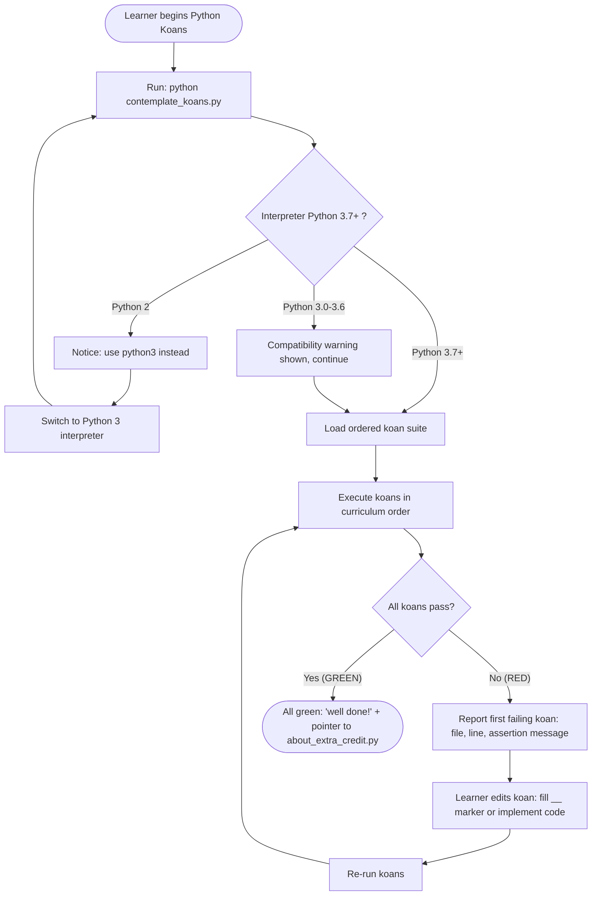
```mermaid
flowchart TD
    Start([Learner begins Python Koans]) --> Run["Run: python contemplate_koans.py"]
    Run --> Gate{"Interpreter Python 3.7+ ?"}
    Gate -->|"Python 2"| Stop2["Notice: use python3 instead"]
    Stop2 --> Fix2["Switch to Python 3 interpreter"]
    Fix2 --> Run
    Gate -->|"Python 3.0-3.6"| Warn["Compatibility warning shown, continue"]
    Gate -->|"Python 3.7+"| Load["Load ordered koan suite"]
    Warn --> Load
    Load --> Exec["Execute koans in curriculum order"]
    Exec --> Result{"All koans pass?"}
    Result -->|"No (RED)"| Report["Report first failing koan: file, line, assertion message"]
    Report --> Edit["Learner edits koan: fill __ marker or implement code"]
    Edit --> Rerun["Re-run koans"]
    Rerun --> Exec
    Result -->|"Yes (GREEN)"| Done(["All green: 'well done!' + pointer to about_extra_credit.py"])
```

**User touchpoints:** the `Run`/`Rerun` invocation and the `Edit` step. **Decision points:** the interpreter gate and the pass/fail check. **Error state:** the Python-2 notice, from which the only recovery is switching interpreters. The `Edit → Rerun` cycle is the "refactor" leg of the TDD mantra quoted from Ruby Koans in `README.rst`.

### 4.2.2 Guarded Launch & Interpreter Version Gating (F-001)

`contemplate_koans.py` performs all work under an `if __name__ == '__main__'` guard (line 14) and applies a two-tier version gate before importing the engine, satisfying requirements F-001-RQ-001…004. The POSIX wrapper `run.sh` invokes `python3 -B contemplate_koans.py`; the Windows wrapper `run.bat` resolves an interpreter and adds a re-run loop (detailed in Sections 4.6.2–4.6.3).

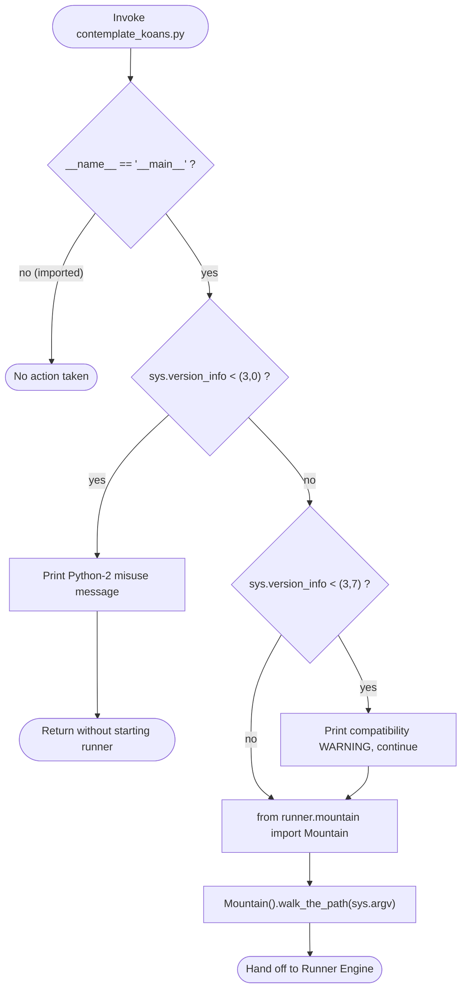
```mermaid
flowchart TD
    A([Invoke contemplate_koans.py]) --> B{"__name__ == '__main__' ?"}
    B -->|"no (imported)"| Z([No action taken])
    B -->|"yes"| C{"sys.version_info < (3,0) ?"}
    C -->|"yes"| D["Print Python-2 misuse message"]
    D --> E([Return without starting runner])
    C -->|"no"| F{"sys.version_info < (3,7) ?"}
    F -->|"yes"| G["Print compatibility WARNING, continue"]
    F -->|"no"| H["from runner.mountain import Mountain"]
    G --> H
    H --> I["Mountain().walk_the_path(sys.argv)"]
    I --> J([Hand off to Runner Engine])
```

**Timing/SLA:** none is defined; the gate is a synchronous comparison. **Error/recovery:** a Python-2 interpreter is a hard stop (the engine is never imported); Python 3.0–3.6 is a soft degradation — the warning is printed and execution continues ("let's see how far we get…").

### 4.2.3 Manifest-Driven Curriculum Loading (F-002)

`runner/path_to_enlightenment.py` builds the ordered suite. `koans()` opens `koans.txt` as UTF-8 (`io.open(..., 'rt', encoding='utf8')`), filters the lines, resolves each fully-qualified class name with `loadTestsFromName`, and appends the results to a `unittest.TestSuite`. Loader method sorting is explicitly disabled (`loader.sortTestMethodsUsing = None`, line 49) so the curated curriculum order is preserved, satisfying F-002-RQ-001…004. `TestFilterKoanNames` and `TestKoansSuite` (in `runner/runner_tests/`) regression-test this behavior.

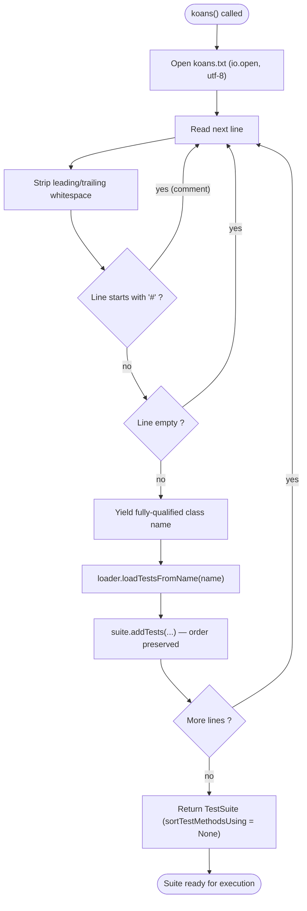
```mermaid
flowchart TD
    A(["koans() called"]) --> B["Open koans.txt (io.open, utf-8)"]
    B --> C["Read next line"]
    C --> D["Strip leading/trailing whitespace"]
    D --> E{"Line starts with '#' ?"}
    E -->|"yes (comment)"| C
    E -->|"no"| F{"Line empty ?"}
    F -->|"yes"| C
    F -->|"no"| G["Yield fully-qualified class name"]
    G --> H["loader.loadTestsFromName(name)"]
    H --> I["suite.addTests(...) — order preserved"]
    I --> J{"More lines ?"}
    J -->|"yes"| C
    J -->|"no"| K["Return TestSuite (sortTestMethodsUsing = None)"]
    K --> L([Suite ready for execution])
```

**Validation at this step:** comment lines (`#…`) and blank lines are skipped; every surviving line must resolve to an importable `koans.*` class. **Error path:** a malformed or unresolvable name raises during `loadTestsFromName`; this surfaces through `unittest` as a load-error entry that the reporting layer treats like any other failure (Section 4.6).

### 4.2.4 Koan Suite Execution & Targeted Selection (F-003)

`runner/mountain.py` orchestrates execution. `Mountain.__init__` eagerly builds the full ordered suite via `path_to_enlightenment.koans()` and constructs the `Sensei` result over a `WritelnDecorator(sys.stdout)` stream. `walk_the_path(args)` then decides whether to **override** that full suite with a targeted selection: when two or more arguments are present it loads only `koans.<args[1]>` (a whole case such as `about_strings`, or a single test via the dotted path shown in `Contributor Notes.txt`). It then runs the suite against `Sensei` and calls `learn()`. This satisfies F-003-RQ-001…004 and is regression-tested by `TestMountain`.

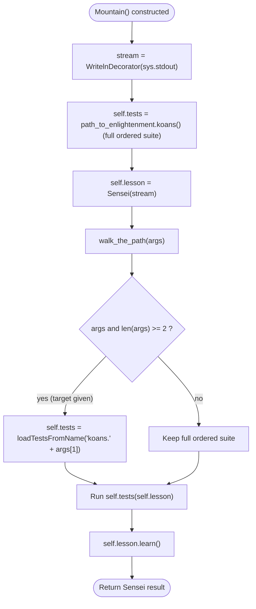
```mermaid
flowchart TD
    A(["Mountain() constructed"]) --> B["stream = WritelnDecorator(sys.stdout)"]
    B --> C["self.tests = path_to_enlightenment.koans() (full ordered suite)"]
    C --> D["self.lesson = Sensei(stream)"]
    D --> E["walk_the_path(args)"]
    E --> F{"args and len(args) >= 2 ?"}
    F -->|"yes (target given)"| G["self.tests = loadTestsFromName('koans.' + args[1])"]
    F -->|"no"| H["Keep full ordered suite"]
    G --> I["Run self.tests(self.lesson)"]
    H --> I
    I --> J["self.lesson.learn()"]
    J --> K([Return Sensei result])
```

**Decision point:** only `args[1]` is consulted; additional positional arguments are ignored by this code path (the multi-argument example in `.travis.yml` is commented out). **Boundary note:** because `__init__` always builds the full suite first, a targeted run still pays the cost of the initial manifest load before the override.

### 4.2.5 Progress-Aware Reporting & First-Failure Focus (F-004 / F-005)

`runner/sensei.py` is the reporting engine — a custom `unittest.TestResult` (via `MockableTestResult`) that narrates the run as it happens and produces the final report in `learn()`. Two behaviors are central: **progress accounting** (`pass_count`, `lesson_pass_count`, and the `report_progress`/`report_remaining` messages — F-004-RQ-001…007) and **first-failure focus** (`sortFailures`/`firstFailure`/`errorReport` isolate the single lowest-line failing koan in the first failing class — F-005-RQ-001…007). The `passesCount()` gate is what stops success narration and counting once execution moves past the first failing class, keeping the learner focused on one problem at a time. `TestSensei` regression-tests these paths.

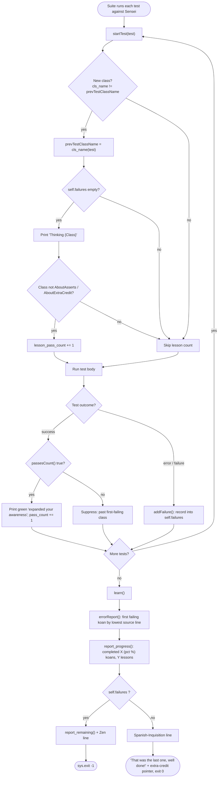
```mermaid
flowchart TD
    A([Suite runs each test against Sensei]) --> B["startTest(test)"]
    B --> C{"New class?<br/>cls_name != prevTestClassName"}
    C -->|"yes"| D["prevTestClassName = cls_name(test)"]
    D --> E{"self.failures empty?"}
    E -->|"yes"| F["Print 'Thinking {Class}'"]
    F --> G{"Class not AboutAsserts / AboutExtraCredit?"}
    G -->|"yes"| H["lesson_pass_count += 1"]
    G -->|"no"| I["Skip lesson count"]
    E -->|"no"| I
    C -->|"no"| I
    H --> J["Run test body"]
    I --> J
    J --> K{"Test outcome?"}
    K -->|"success"| L{"passesCount() true?"}
    L -->|"yes"| M["Print green 'expanded your awareness'; pass_count += 1"]
    L -->|"no"| N["Suppress: past first-failing class"]
    K -->|"error / failure"| O["addFailure(): record into self.failures"]
    M --> P{"More tests?"}
    N --> P
    O --> P
    P -->|"yes"| B
    P -->|"no"| Q["learn()"]
    Q --> R["errorReport(): first failing koan by lowest source line"]
    R --> S["report_progress(): completed X (pct %) koans, Y lessons"]
    S --> T{"self.failures ?"}
    T -->|"yes"| U["report_remaining() + Zen line"]
    T -->|"no"| V["Spanish-Inquisition line"]
    U --> W([sys.exit -1])
    V --> X(["'That was the last one, well done!' + extra-credit pointer, exit 0"])
```

**Decision points:** class transition (`startTest`), the `AboutAsserts`/`AboutExtraCredit` lesson-count exemption, the `passesCount()` success gate, and the final `self.failures` branch that selects the exit code. **Error state:** the first failure triggers `errorReport()`, which prints the offending method ("has damaged your karma"), the scraped assertion message, and a stack dump filtered to `koans/` paths and colorized on the `about_*.py` filename and `line N`. **Notification/exit:** a failing run ends with `sys.exit(-1)` (non-zero), which is how CI, the Sniffer, and `run.bat` detect that koans remain.

## 4.3 Integration Workflows

Python Koans has no network, database, or service tier, so it exposes no request/response APIs and no message queues (Sections 1.3.1, 3.4). Its "integration workflows" are therefore process-level and filesystem-level: an optional file-watch event loop (Sniffer), a batch verification pipeline (Travis CI), a cloud-workspace provisioning flow (Gitpod), and the in-process data flow that connects the read-only inputs to the terminal output. Each optional integration attaches to the launcher from the outside without the engine depending on it (Section 2.13.1).

### 4.3.1 Continuous Re-Run Sniffer — Event Processing Flow (F-009)

`scent.py` configures the third-party Sniffer file-watcher (F-009-RQ-001…002). It exposes `watch_paths = ['.', 'koans/']`, a `@file_validator` (`py_files`) that accepts only non-hidden `*.py` files, and a `@runnable` (`execute_koans`) that shells out with `os.system('python3 -B contemplate_koans.py')`. The Sniffer daemon supplies the event loop; `scent.py` supplies the filter and the action, giving the learner an automatic red/green cycle on every save.

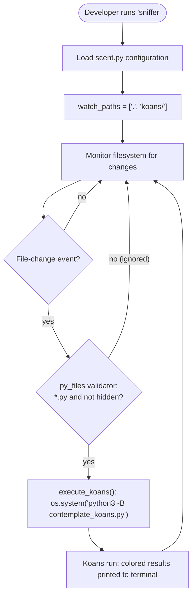
```mermaid
flowchart TD
    A([Developer runs 'sniffer']) --> B["Load scent.py configuration"]
    B --> C["watch_paths = ['.', 'koans/']"]
    C --> D["Monitor filesystem for changes"]
    D --> E{"File-change event?"}
    E -->|"no"| D
    E -->|"yes"| F{"py_files validator:<br/>*.py and not hidden?"}
    F -->|"no (ignored)"| D
    F -->|"yes"| G["execute_koans(): os.system('python3 -B contemplate_koans.py')"]
    G --> H["Koans run; colored results printed to terminal"]
    H --> D
```

**Event source:** OS filesystem notifications (backend depends on platform — `README.rst` lists `pyinotify`/`pywin32`/`MacFSEvents`). **Timing:** event-driven, not polled at a fixed interval in this configuration; there is no SLA. **Data flow:** each event spawns a fresh, independent koan run in a child process, so no state carries between runs.

### 4.3.2 Continuous Integration — Batch Verification Sequence (F-010 / F-011)

The only batch-processing sequence in the repository is CI verification of the runner engine. `.travis.yml` pins Python 3.9 and runs `python _runner_tests.py`; the koan-execution lines are commented out, so CI verifies the **engine self-tests only**, not the learner koans. `_runner_tests.py` aggregates the five engine `TestCase`s (`TestMountain`, `TestSensei`, `TestHelper`, `TestFilterKoanNames`, `TestKoansSuite`) and encodes the outcome as the process exit code via `sys.exit(not res.wasSuccessful())`. Email notifications are enabled (F-010-RQ-001…003, F-011-RQ-001…003).

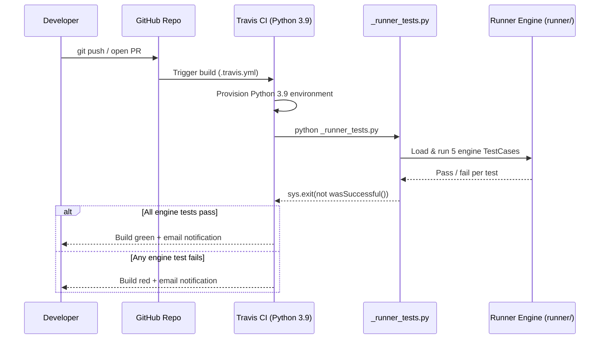
```mermaid
sequenceDiagram
    participant Dev as Developer
    participant GH as GitHub Repo
    participant CI as Travis CI (Python 3.9)
    participant RT as _runner_tests.py
    participant Eng as Runner Engine (runner/)
    Dev->>GH: git push / open PR
    GH->>CI: Trigger build (.travis.yml)
    CI->>CI: Provision Python 3.9 environment
    CI->>RT: python _runner_tests.py
    RT->>Eng: Load & run 5 engine TestCases
    Eng-->>RT: Pass / fail per test
    RT-->>CI: sys.exit(not wasSuccessful())
    alt All engine tests pass
        CI-->>Dev: Build green + email notification
    else Any engine test fails
        CI-->>Dev: Build red + email notification
    end
```

**Batch boundary:** one CI build = one atomic `_runner_tests.py` invocation. **Notification flow:** the build result is delivered by Travis email; there is no deployment or artifact-publishing step (Section 3.6).

### 4.3.3 Cloud Workspace Provisioning (Gitpod) (F-011)

`.gitpod.yml` and `.gitpod.Dockerfile` describe a one-click cloud IDE. The image extends `gitpod/workspace-full:latest` and installs `pytest==4.4.2`, `pytest-testdox`, and `mock` (tooling used only inside the cloud image, not by the project scripts — Section 3.3). The workspace start task runs `python contemplate_koans.py`, and prebuilds are enabled for the `master` branch.

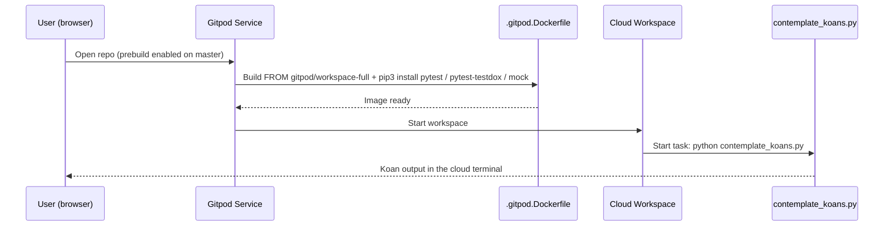
```mermaid
sequenceDiagram
    participant User as User (browser)
    participant Gitpod as Gitpod Service
    participant Img as .gitpod.Dockerfile
    participant WS as Cloud Workspace
    participant Koans as contemplate_koans.py
    User->>Gitpod: Open repo (prebuild enabled on master)
    Gitpod->>Img: Build FROM gitpod/workspace-full + pip3 install pytest / pytest-testdox / mock
    Img-->>Gitpod: Image ready
    Gitpod->>WS: Start workspace
    WS->>Koans: Start task: python contemplate_koans.py
    Koans-->>User: Koan output in the cloud terminal
```

**Provisioning boundary:** the image build (prebuild) is separated from workspace start, so the interactive session begins with the koans already running.

### 4.3.4 In-Process Data Flow Across Components

The following diagram traces data — not control — from the read-only filesystem inputs, through the in-memory transformations, to the transient outputs. There is no persistent data store on the output side; the only durable artifact the workflow touches is the learner's own edits to the koan source (Section 4.5.3).

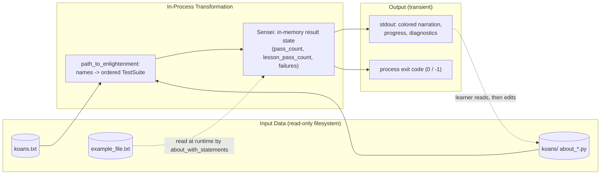
```mermaid
flowchart LR
    subgraph Inputs["Input Data (read-only filesystem)"]
        DF1[("koans.txt")]
        DF2[("koans/ about_*.py")]
        DF3[("example_file.txt")]
    end
    subgraph Proc["In-Process Transformation"]
        P1["path_to_enlightenment:<br/>names -> ordered TestSuite"]
        P2["Sensei: in-memory result state<br/>(pass_count, lesson_pass_count, failures)"]
    end
    subgraph Outputs["Output (transient)"]
        O1["stdout: colored narration,<br/>progress, diagnostics"]
        O2["process exit code (0 / -1)"]
    end
    DF1 --> P1
    DF2 --> P1
    P1 --> P2
    DF3 -.->|"read at runtime by about_with_statements"| P2
    P2 --> O1
    P2 --> O2
    O1 -.->|"learner reads, then edits"| DF2
```

**Data-flow notes:** `koans.txt` is parsed into an ordered list of class names; `koans/about_*.py` supplies both the loadable classes and the executable test logic; `example_file.txt` is opened at runtime by the with-statement lesson. All engine state is in memory and discarded at process exit; the feedback loop to `koans/about_*.py` is the manual learner edit that carries "progress" forward between runs.


## 4.4 Validation Rules and Decision Logic

This section consolidates every decision diamond that appears in the flowcharts above and states the validation rules that gate each transition. Because Python Koans is a local, single-user educational CLI, several categories that a networked enterprise system would require (authorization, regulatory compliance, SLAs) are not present in the code; those are documented as evidenced absences rather than invented.

### 4.4.1 Consolidated Decision Points

Every decision point in the process flows, with its exact condition, branches, and source location.

| ID | Decision (condition) | Branches | Source |
|---|---|---|---|
| D1 | `sys.version_info < (3, 0)` | yes → print misuse notice, do not start; no → continue | `contemplate_koans.py` L15 |
| D2 | `sys.version_info < (3, 7)` | yes → print warning, continue; no → import & run | `contemplate_koans.py` L21 |
| D3 | `args and len(args) >= 2` | yes → load only `koans.<args[1]>`; no → run full suite | `runner/mountain.py` L20 |
| D4 | line `startswith('#')` | yes → skip line; no → evaluate D5 | `runner/path_to_enlightenment.py` L24 |
| D5 | line empty after `strip()` | yes → skip line; no → yield class name | `runner/path_to_enlightenment.py` L26 |
| D6 | `cls_name(test) != prevTestClassName` | yes → class transition; no → same class | `runner/sensei.py` L30 |
| D7 | `not self.failures` (none recorded yet) | yes → print "Thinking …"; no → stay silent | `runner/sensei.py` L32 |
| D8 | class ∉ `{AboutAsserts, AboutExtraCredit}` | yes → `lesson_pass_count += 1`; no → skip | `runner/sensei.py` L36 |
| D9 | `passesCount()` true | yes → narrate + `pass_count += 1`; no → suppress | `runner/sensei.py` L40, L53 |
| D10 | `self.failures` present at `learn()` | yes → remaining + `sys.exit(-1)`; no → success + exit 0 | `runner/sensei.py` L89, L94 |
| D11 | `self.failures` in `say_something_zenlike` | yes → Zen line (`pass_count % 37`); no → Spanish-Inquisition line | `runner/sensei.py` L193 |
| D12 | `filename.endswith('.py')` and not hidden | yes → re-run koans; no → ignore event | `scent.py` L8 |
| D13 | `python.exe` / `PYTHON_PATH` / `%PYTHON%` resolvable | resolvable → run; none → print path guidance | `run.bat` L15–23 |
| D14 | `keepgoing == "y"` | yes → `goto loop`; else → `:end` | `run.bat` L40 |
| D15 | `res.wasSuccessful()` | true → exit 0 (green); false → exit 1 (red) | `_runner_tests.py` L26 |

### 4.4.2 Business Rules and Data Validation

**Business rules enforced by the engine.** These are the invariants the runner applies regardless of curriculum content:

| Business Rule | Where Enforced | Effect |
|---|---|---|
| Curriculum runs in the exact `koans.txt` order | `path_to_enlightenment.koans_suite` (`sortTestMethodsUsing = None`) | Lessons/projects are never reordered by the loader |
| One failing koan is surfaced at a time (first-failure focus) | `sensei.sortFailures` / `firstFailure` / `passesCount` | Learner sees the lowest-line failure in the first failing class only |
| `AboutAsserts` and `AboutExtraCredit` do not count as "lessons" | `sensei.startTest` (D8) | Lesson totals reflect graded concept lessons |
| `about_extra_credit` is excluded from the lesson glob | `sensei.filter_all_lessons` | `total_lessons()` matches the graded set |
| Failing run must signal non-zero exit | `sensei.learn` (`sys.exit(-1)`) | CI / Sniffer / `run.bat` can detect incompletion |

**Data validation requirements.** The runtime validates its inputs at three points; the koan content itself validates learner answers through `unittest` assertions.

| Input | Validation | Source |
|---|---|---|
| Interpreter version | Two-tier gate (reject Python 2; warn < 3.7) | `contemplate_koans.py` |
| Manifest lines | `strip()`, skip `#` comments and blanks, remaining must resolve via `loadTestsFromName` | `runner/path_to_enlightenment.py` |
| Watched files (Sniffer) | Only non-hidden `*.py` trigger a re-run | `scent.py` |
| Learner answers | Per-koan `assert*` methods and fill-in markers (`__`, `___`, `____`, `_____`) | `runner/koan.py`, `koans/about_*.py` |
| Capstone domain rules | e.g. `triangle()` must raise `TriangleError` on non-positive sides / triangle-inequality violations; Greed scoring per `GREEDS_RULES.txt` | `koans/triangle.py`, `koans/about_triangle_project2.py`, `koans/about_scoring_project.py` |

### 4.4.3 Authorization Checkpoints

There are **no authentication or authorization checkpoints** anywhere in the workflow. The program runs entirely with the invoking user's operating-system privileges, reads local files, and writes to `stdout`; it opens no sockets, requests no credentials, and consults no permission model (consistent with Sections 1.3.1 and 3.4). The only "gate" before execution is the interpreter version check (D1/D2), which is a compatibility guard, not an access-control mechanism.

### 4.4.4 Regulatory Compliance Checks

The repository contains **no regulatory-compliance logic** — no PII handling, no data-collection/consent flows, no audit logging, and no jurisdiction-specific checks. Python Koans processes only its own bundled lesson files and the sample `example_file.txt`; it neither ingests user data nor transmits anything off the machine. Its sole legal artifact is the `MIT-LICENSE` grant. No compliance decision points appear in any flow, so none are diagrammed.

### 4.4.5 Timing and SLA Considerations

No numeric SLAs, timeouts, latency budgets, or throughput targets are defined in the repository; the only success metrics evidenced are the runner's learning-progress counts (Section 1.2.3). The timing-relevant behaviors that *do* exist are qualitative:

| Timing Aspect | Behavior | Evidence |
|---|---|---|
| Run duration | Bounded by the synchronous execution time of the loaded `unittest.TestSuite`; no timeout is imposed | `runner/mountain.py`, `runner/sensei.py` |
| Re-run latency (Sniffer) | Event-driven on file change; no fixed polling interval is configured in `scent.py` | `scent.py` |
| Byte-code overhead | `-B` disables `.pyc` writes on every scripted launch | `run.sh`, `run.bat`, `scent.py` |
| Interactive wait | `run.bat` `pause` and the `Test again? y or n` prompt block on user input | `run.bat` |
| CI duration | Bounded by the engine self-test run on Python 3.9; no time limit set in `.travis.yml` | `.travis.yml`, `_runner_tests.py` |


## 4.5 State Management

All engine state is held in memory and scoped to a single process invocation; there is no database, cache server, or session store (Sections 3.4, 3.5). The meaningful state transitions happen inside the `Sensei` result object as the suite runs, and each koan progresses through a learner-observable lifecycle. The only durable "state" is the learner's edits to the koan source files.

### 4.5.1 Sensei Reporting State Model and Transitions

`Sensei` begins each run with zeroed counters (`pass_count`, `lesson_pass_count`) and `prevTestClassName = None`. As tests execute, it moves between narration modes driven entirely by whether a failure has been recorded (`self.failures`) and whether execution has moved past the class of the first failure (the `passesCount()` gate). The run ends in one of two terminal states selected by `learn()`.

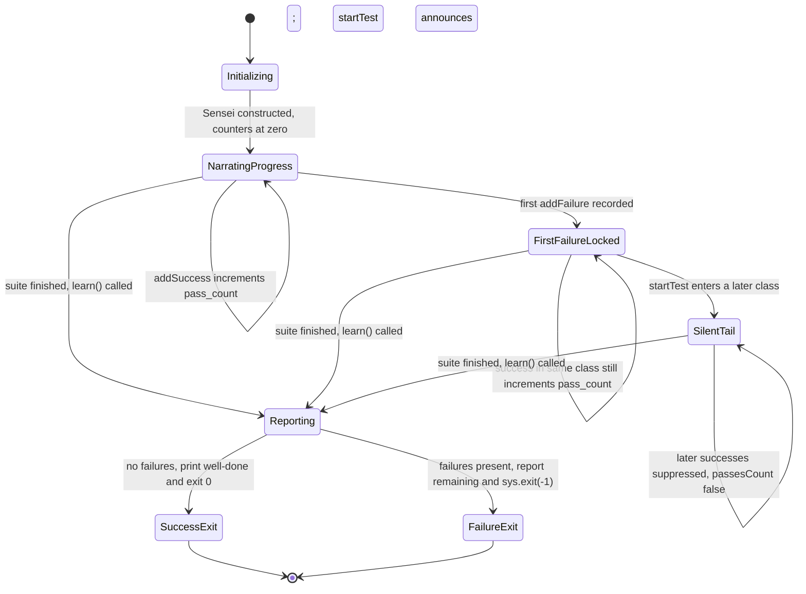
```mermaid
stateDiagram-v2
    [*] --> Initializing
    Initializing --> NarratingProgress: Sensei constructed, counters at zero
    NarratingProgress --> NarratingProgress: addSuccess increments pass_count; startTest announces class and increments lesson_pass_count
    NarratingProgress --> FirstFailureLocked: first addFailure recorded
    FirstFailureLocked --> FirstFailureLocked: success in same class still increments pass_count
    FirstFailureLocked --> SilentTail: startTest enters a later class
    SilentTail --> SilentTail: later successes suppressed, passesCount false
    NarratingProgress --> Reporting: suite finished, learn() called
    FirstFailureLocked --> Reporting: suite finished, learn() called
    SilentTail --> Reporting: suite finished, learn() called
    Reporting --> SuccessExit: no failures, print well-done and exit 0
    Reporting --> FailureExit: failures present, report remaining and sys.exit(-1)
    SuccessExit --> [*]
    FailureExit --> [*]
```

The key insight is that `prevTestClassName` always advances with each class transition, but `pass_count`/`lesson_pass_count` freeze at the first failing class because `passesCount()` returns false once the current class differs from the class of `self.failures[0]`. This is the state mechanism behind the "one koan at a time" experience.

### 4.5.2 Per-Koan Lifecycle State Transitions

From the learner's perspective, each individual koan moves through a small lifecycle. A koan begins "unsolved" (containing a fill-in marker or an unimplemented function), fails on the first run, and reaches "green" only after the learner edits its source and re-runs.

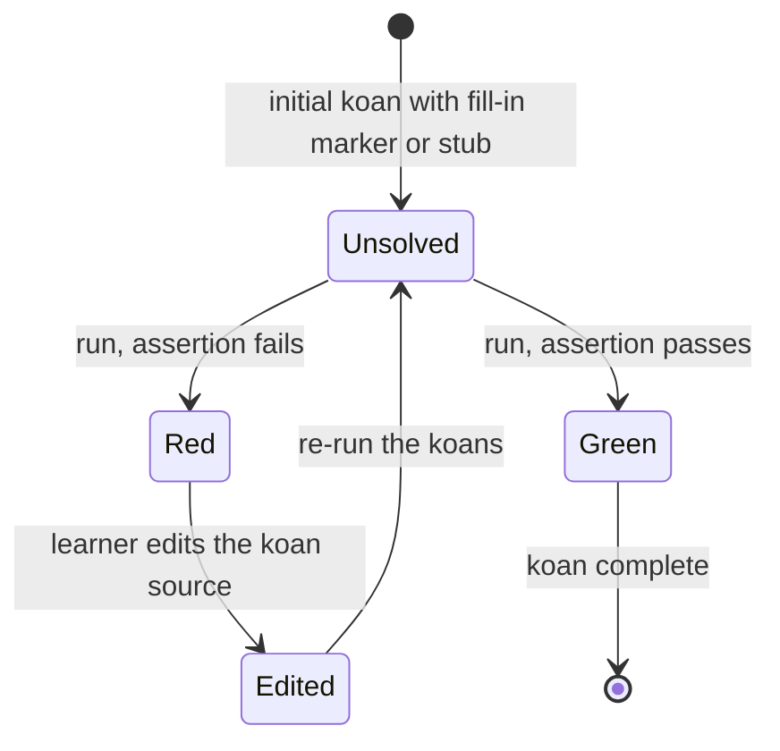
```mermaid
stateDiagram-v2
    [*] --> Unsolved: initial koan with fill-in marker or stub
    Unsolved --> Red: run, assertion fails
    Red --> Edited: learner edits the koan source
    Edited --> Unsolved: re-run the koans
    Unsolved --> Green: run, assertion passes
    Green --> [*]: koan complete
```

### 4.5.3 Data Persistence Points

The workflow touches persistent data only on the read side (bundled inputs) and through the learner's own source edits; the engine writes no data files of its own.

| Data | Lifetime | Storage | Evidence |
|---|---|---|---|
| `pass_count`, `lesson_pass_count`, `failures`, `prevTestClassName` | Single run | In-memory (`Sensei`) | `runner/sensei.py` |
| Ordered `TestSuite` | Single run | In-memory | `runner/mountain.py`, `runner/path_to_enlightenment.py` |
| Manifest and lesson source | Persistent | Read-only filesystem | `koans.txt`, `koans/about_*.py`, `example_file.txt` |
| Learner solutions | Persistent | Learner-edited source files in `koans/` | `koans/*.py` |
| `stdout` narration | Transient | Terminal stream | `runner/writeln_decorator.py`, `libs/colorama/` |
| Process exit code | Transient | OS process status | `runner/sensei.py`, `_runner_tests.py` |

Progress is "saved" implicitly by the learner's edits to the koan files. Notably, `.gitignore` and `.hgignore` both ignore an `answers` path, reflecting the convention that a learner's work is kept out of version control rather than persisted by the tool.

### 4.5.4 Caching Requirements

The system uses only one in-memory cache and one build-artifact suppression; there is no external or persistent cache.

| Cache / Suppression | Purpose | Evidence |
|---|---|---|
| `Sensei.all_lessons` memoization | `filter_all_lessons()` globs `koans/about*.py` once and caches the filtered list, so repeated `total_lessons()` calls do not re-scan the directory | `runner/sensei.py` L261–269 |
| `-B` byte-code suppression | Scripted launches disable `.pyc` writing, so no compiled cache is produced | `run.sh`, `run.bat`, `scent.py` |

No result caching, HTTP caching, or memoization of test outcomes exists — every run re-loads the manifest and re-executes the suite from scratch.

### 4.5.5 Transaction Boundaries

There are no database transactions; the atomic unit of work is a **single process invocation**: load the manifest, build the suite, execute it against `Sensei`, print the report, and exit. Within a run, state accumulates monotonically (counters only increase) and there is no rollback — a failure simply causes `learn()` to print diagnostics and call `sys.exit(-1)`. Each invocation is independent: no state is carried between runs, so the Sniffer's child-process re-run (Section 4.3.1) and the `run.bat` retry loop each start a fresh, self-contained boundary. Learner edits to source files occur entirely outside any engine-managed transaction.


## 4.6 Error Handling

Error handling in Python Koans is intentionally minimal and terminal-oriented. There is no exception-catching middleware, no logging framework, and no automated remediation. Two error classes exist: an expected koan **failure** (an unsatisfied assertion), which `Sensei` formats into guided feedback and a non-zero exit; and an unexpected **error** (e.g. an exception raised in the code under test or a bad manifest entry), which `unittest` records and `Sensei` routes through the same failure list (`addError` delegates to `addFailure`). Recovery in every context reduces to re-running after a fix.

### 4.6.1 Error Handling Flowchart

The following flow shows how an error is detected, reported, and recovered from, and how the recovery path differs by run context (manual, Sniffer, `run.bat`, or CI).

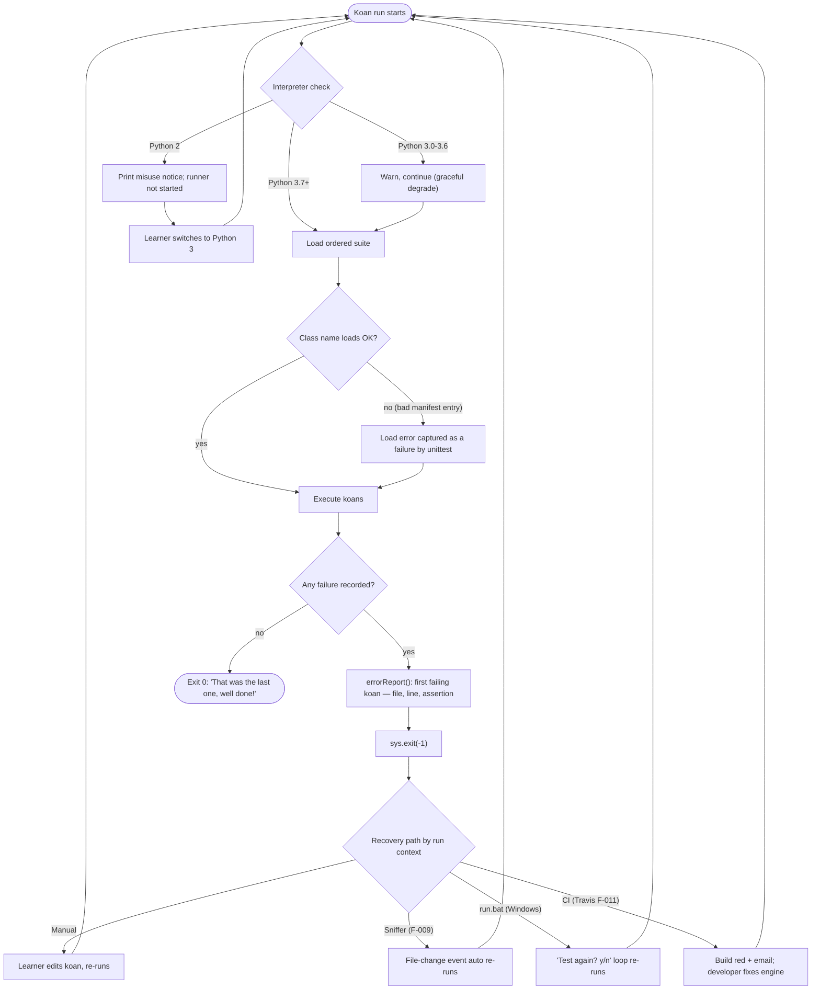
```mermaid
flowchart TD
    A([Koan run starts]) --> B{"Interpreter check"}
    B -->|"Python 2"| E1["Print misuse notice; runner not started"]
    B -->|"Python 3.0-3.6"| WN["Warn, continue (graceful degrade)"]
    B -->|"Python 3.7+"| L["Load ordered suite"]
    WN --> L
    L --> LE{"Class name loads OK?"}
    LE -->|"no (bad manifest entry)"| LF["Load error captured as a failure by unittest"]
    LE -->|"yes"| RUN["Execute koans"]
    LF --> RUN
    RUN --> OUT{"Any failure recorded?"}
    OUT -->|"yes"| ER["errorReport(): first failing koan — file, line, assertion"]
    ER --> EX["sys.exit(-1)"]
    EX --> REC{"Recovery path by run context"}
    REC -->|"Manual"| R1["Learner edits koan, re-runs"]
    REC -->|"Sniffer (F-009)"| R2["File-change event auto re-runs"]
    REC -->|"run.bat (Windows)"| R3["'Test again? y/n' loop re-runs"]
    REC -->|"CI (Travis F-011)"| R4["Build red + email; developer fixes engine"]
    R1 --> A
    R2 --> A
    R3 --> A
    R4 --> A
    OUT -->|"no"| OK(["Exit 0: 'That was the last one, well done!'"])
    E1 --> RECM["Learner switches to Python 3"]
    RECM --> A
```

### 4.6.2 Retry Mechanisms

There is **no in-process retry** — a failing test is not re-attempted, and the suite runs exactly once per invocation. Retry is provided at the invocation level by two optional loops:

| Mechanism | Trigger | Behavior | Evidence |
|---|---|---|---|
| Sniffer auto re-run | Any validated `*.py` file change | Spawns a fresh full koan run per event | `scent.py` |
| `run.bat` prompt loop | User answers `y` to "Test again? y or n" | Re-resolves the interpreter and re-runs | `run.bat` L39–42 |

### 4.6.3 Fallback Processes

Because there is no service tier, there are no circuit breakers or failover endpoints. The fallbacks that exist are compatibility- and environment-oriented:

| Fallback | Chain / Degradation | Evidence |
|---|---|---|
| Interpreter version tolerance | Python 3.0–3.6 does not hard-stop; it prints a warning and proceeds "best effort" | `contemplate_koans.py` (D2) |
| Windows interpreter resolution | Try `python.exe`, then `%PYTHON_PATH%` (`C:\Python311`), then `%PYTHON%`; if none, print path-fix guidance | `run.bat` L15–37 (D13) |

### 4.6.4 Error Notification Flows

Notification is entirely out-of-band via the terminal and process status; there is no log file, alerting, paging, or telemetry.

| Channel | Content | Evidence |
|---|---|---|
| Terminal diagnostic | `errorReport()` prints the failing method ("has damaged your karma"), the scraped assertion text, and a `koans/`-filtered, colorized stack dump ("Please meditate on the following code") | `runner/sensei.py` L104–167 |
| Process exit code | `sys.exit(-1)` on any failure (learner run); `sys.exit(not wasSuccessful())` in CI | `runner/sensei.py`, `_runner_tests.py` |
| CI email | Travis build result delivered by email | `.travis.yml` (`notifications: email: true`) |
| `run.bat` guidance | "Python.exe is not in the path!" plus a direct-invocation hint when no interpreter resolves | `run.bat` L28–37 |

### 4.6.5 Recovery Procedures

All recovery is manual and re-run based; each run is independent, so there is nothing to roll back (Section 4.5.5).

| Scenario | Recovery Procedure | Evidence |
|---|---|---|
| Koan fails (RED) | Learner reads the first-failure report, edits the koan (fills a marker or implements code), and re-runs | `runner/sensei.py`, `README.rst` |
| Python-2 hard stop | Learner switches to a Python 3 interpreter and re-launches | `contemplate_koans.py` |
| Interpreter not found (Windows) | Fix `PYTHON_PATH` in `run.bat` or invoke `python.exe contemplate_koans.py` directly per the printed hint | `run.bat` |
| Engine regression (CI red) | Developer fixes `runner/` code and re-pushes; correctness re-verified by `_runner_tests.py` | `_runner_tests.py`, `runner/runner_tests/` |


## 4.7 References

The following repository artifacts and specification sections were inspected as the evidentiary basis for the workflows, decision points, state models, and error paths documented in Section 4.

**Launch and entry points**

- `contemplate_koans.py` — the guarded launcher; established the `__main__` guard and the two-tier interpreter version gate (D1/D2, F-001).
- `run.sh` — POSIX wrapper; established the `python3 -B contemplate_koans.py` launch and `-B` byte-code suppression.
- `run.bat` — Windows wrapper; established the interpreter-resolution fallback chain (D13) and the "Test again? y/n" retry loop (D14).

**Runner engine (`runner/`)**

- `runner/` — the in-process execution engine package.
- `runner/mountain.py` — `Mountain.walk_the_path`; established orchestration, full-suite construction, and targeted selection (D3, F-003).
- `runner/path_to_enlightenment.py` — established manifest parsing, comment/blank filtering (D4/D5), and ordered suite construction with `sortTestMethodsUsing = None` (F-002).
- `runner/sensei.py` — established the reporting state machine, first-failure focus (`passesCount`/`sortFailures`/`firstFailure`), progress/remaining accounting, the `learn()` sequence and exit codes, error reporting, and lesson caching (D6–D11, F-004/F-005).
- `runner/koan.py` — established the `Koan` base class and fill-in markers used by learner exercises (F-006).
- `runner/helper.py` — `cls_name` used for class-transition detection.
- `runner/writeln_decorator.py` — the `stdout` output stream wrapper.
- `runner/mockable_test_result.py` — the mockable `TestResult` base for `Sensei`.
- `runner/runner_tests/` — the engine regression suite (`TestMountain`, `TestSensei`, `TestHelper`, `TestFilterKoanNames`, `TestKoansSuite`); established verification methods and the CI recovery path (F-010).

**Curriculum, manifest, and data**

- `koans.txt` — the ordered curriculum manifest parsed by the loader.
- `koans/` — the lesson and capstone-project package (the learner's editable exercise surface).
- `koans/about_with_statements.py` — established the runtime read of `example_file.txt`.
- `koans/triangle.py`, `koans/about_triangle_project2.py`, `koans/about_scoring_project.py`, `koans/GREEDS_RULES.txt` — established capstone domain-rule validation examples (F-008).
- `example_file.txt` — sample read-only input consumed during a lesson.

**Optional tooling, CI, and cloud workspace**

- `scent.py` — established the Sniffer file-watch event-processing flow, validator (D12), and child-process re-run (F-009).
- `_runner_tests.py` — established the aggregate self-test batch and exit-code encoding (D15, F-010).
- `.travis.yml` — established the CI batch pipeline (Python 3.9, `python _runner_tests.py`) and email notifications (F-011).
- `.gitpod.yml`, `.gitpod.Dockerfile` — established the cloud-workspace provisioning sequence and its pre-installed tooling (F-011).

**Vendored libraries**

- `libs/colorama/` — vendored ANSI color library used by `Sensei` for colored narration.

**Documentation, licensing, and configuration**

- `README.rst` — established the learner journey, exercise styles, TDD framing, version policy, and Sniffer setup.
- `Contributor Notes.txt` — established the CLI targeted-selection syntax (whole case and single dotted test).
- `MIT-LICENSE` — established the absence of commercial/regulatory obligations (Section 4.4.4).
- `.gitignore`, `.hgignore` — established the `answers` ignore convention referenced in Section 4.5.3.

**Technical Specification cross-references**

- Section 1.2 System Overview — system identity, the existing end-to-end runtime flow diagram, and the success-criteria/KPI position (no business SLAs).
- Section 1.3 Scope — system boundaries and the absence of a network/DB/server tier.
- Section 2.13 Feature Relationships — the feature dependency map, integration points, shared components, and common services.
- Section 2.14 Requirements Traceability Matrix — the requirement IDs (F-XXX-RQ-YYY) and the process-flow-to-feature cross-reference.
- Sections 3.3–3.6 — dependency, third-party-service, storage, and development/deployment context confirming the absence of databases, caches, auth services, and CD/IaC.


# 5. System Architecture

## 5.1 High-Level Architecture

Python Koans is a single-process, terminal-driven Python 3 command-line application. It is deliberately small: a thin, guarded launcher hands control to an in-process test-running engine (`runner/`) that loads an ordered curriculum of `unittest` "koans" (`koans/`, `koans.txt`) and reports colored, progress-aware feedback to the terminal. There is no service tier, network listener, database, message broker, or scheduler anywhere in the repository; the whole system runs to completion inside one interpreter invocation and communicates its result through printed text and a process exit code. This section presents the architectural view of that system — its style, components, data flow, and external touch-points — and cross-references the runtime workflow (Section 4) and technology stack (Section 3) rather than repeating them.

### 5.1.1 System Overview

**Architecture style and rationale.** The system follows a **layered, single-process pipeline** built directly on the Python standard-library `unittest` framework, extended by exactly two custom pieces: an ordered, manifest-driven suite loader (`runner/path_to_enlightenment.py`) and a custom `unittest.TestResult` observer that renders learner-facing narration (`runner/sensei.py`). The composition is assembled at a single **composition root** — the `Mountain` class (`runner/mountain.py`), whose constructor wires the output stream, the loaded test suite, and the result object together before `walk_the_path()` runs them. This style is appropriate because the product is an *educational CLI tool*: the entire "business process" is a learner's local `red → green → refactor` loop (Section 4.1), so a distributed, event-driven, or client/server architecture would add cost without serving any requirement observed in the repository.

**Key architectural principles and patterns.** The following patterns are directly evidenced in the code:

- **Standard-library-first.** The runtime substrate is `unittest`; the engine adds thin extensions rather than adopting a heavyweight framework (`runner/mountain.py`, `runner/path_to_enlightenment.py`, `runner/sensei.py`).
- **Composition root.** `Mountain.__init__` constructs `WritelnDecorator(sys.stdout)`, `path_to_enlightenment.koans()`, and `Sensei(stream)`, centralizing object wiring (`runner/mountain.py`).
- **Observer pattern.** `Sensei` subclasses `unittest.TestResult` (via `MockableTestResult`) and receives `startTest`, `addSuccess`, `addFailure`, and `addError` callbacks as the suite executes (`runner/sensei.py`, `runner/mockable_test_result.py`).
- **Decorator pattern.** `WritelnDecorator` wraps any file-like stream and delegates via `__getattr__`, adding a `writeln()` method (`runner/writeln_decorator.py`).
- **Template/subclass hook.** Every lesson subclasses the shared `Koan(unittest.TestCase)` base and consumes the fill-in markers exported from `runner/koan.py`.
- **Manifest-driven configuration (externalized ordering).** The curated lesson order lives in the `koans.txt` data file, not in code, and is parsed at startup (`runner/path_to_enlightenment.py`).
- **Convention over configuration.** Lessons follow the `koans/about_*.py` naming convention, which the reporter itself relies on when counting lessons (`filter_all_lessons()` globs `koans/about*.py`).
- **Vendoring / self-containment.** Third-party libraries are bundled under `libs/` (`colorama` 0.2.7, `mock` 0.6.0) so the tool runs from a checkout with no package installation.
- **Stateless, idempotent runs (fail-fast at the boundary).** No progress is persisted; every invocation re-reads the manifest and re-executes from scratch, and the launcher gates the interpreter version before any engine code loads (`contemplate_koans.py`).

**System boundaries and major interfaces.** The system's boundaries are narrow and all local:

- **Process entry interface** — the `python contemplate_koans.py [name]` command line, including optional single-case/method targeting via `argv[1]` (`contemplate_koans.py`, `runner/mountain.py`, `Contributor Notes.txt`).
- **Filesystem read interface** — the `koans.txt` manifest and the `koans/*.py` lesson/project source, read but never written by the engine.
- **Terminal output interface** — colored, line-oriented narration emitted through `WritelnDecorator` over `sys.stdout`, with ANSI sequences produced by the vendored `colorama`.
- **Process-status interface** — the exit code (`sys.exit(-1)` on any failure; `0` on full completion) is the only machine-readable signal.
- **Optional external attach-points** — the Sniffer file-watcher (`scent.py`), Travis CI (`.travis.yml`), and Gitpod/Eclipse Che (`.gitpod.yml`, `.gitpod.Dockerfile`) invoke the launcher or the self-tests *from the outside* without the engine depending on them.

There is no network, database, or inter-process interface in the core runtime. A declared Git submodule (`Submodule_01_Do_not_use_15Jun`, per `.gitmodules`) is explicitly named "Do not use" and is out of scope (Sections 1.3, 3.6); it is not part of this architecture.

### 5.1.2 Core Components

The codebase decomposes into a launcher, an in-process runner engine (several cooperating modules), the read-only curriculum, vendored libraries, and a maintainer-facing regression/tooling layer. Because the output-format standard caps tables at four columns, the component inventory is presented as two complementary tables: the first captures responsibility and dependencies, the second captures integration points and critical considerations.

**Table A — Responsibility and dependencies**

| Component | Primary Responsibility | Key Dependencies |
|---|---|---|
| Launcher (`contemplate_koans.py`, `run.sh`, `run.bat`) | Version-gate the interpreter and start the engine | `sys`, `runner.mountain.Mountain` |
| Runner Orchestrator — `Mountain` (`runner/mountain.py`) | Composition root; build suite + result + stream, run the path | `path_to_enlightenment`, `Sensei`, `WritelnDecorator`, `unittest` |
| Curriculum Loader (`runner/path_to_enlightenment.py`) | Parse `koans.txt` and build an ordered `TestSuite` | `unittest`, `io`, `koans.txt` |
| Reporting Engine — `Sensei` (`runner/sensei.py`) | Observe results; narrate progress, first failure, and completion | `unittest.TestResult`, `helper`, `libs.colorama`, `re`/`glob` |
| Output Stream (`runner/writeln_decorator.py`) | Add `writeln()` to `sys.stdout` for narration | `sys` |
| Koan Scaffold (`runner/koan.py`, `runner/helper.py`) | Base `Koan` class + fill-in markers; class-name introspection | `unittest`, `re` |
| Curriculum & Manifest (`koans/`, `koans.txt`) | Ordered lessons and capstone projects (the exercise surface) | `runner.koan`, Python standard library |
| Vendored `colorama` 0.2.7 (`libs/colorama/`) | Cross-platform ANSI colored terminal output | `sys`, `re`, `ctypes` (Windows) |
| Vendored `mock` 0.6.0 (`libs/mock.py`) | Test doubles for the engine's own regression tests | (standalone) |
| Regression Suite (`_runner_tests.py`, `runner/runner_tests/`) | Verify the engine's correctness (CI quality gate) | `unittest`, `libs.mock`, `runner.*` |
| Sniffer config (`scent.py`) | Re-run the koans on watched file changes | external `sniffer` + OS watch backend |
| CI / Cloud (`.travis.yml`, `.gitpod.yml`, `.gitpod.Dockerfile`) | Verify engine in CI; provide a one-click cloud workspace | Travis CI, Gitpod/Eclipse Che, Docker base image |

**Table B — Integration points and critical considerations**

| Component | Integration Points | Critical Considerations |
|---|---|---|
| Launcher | CLI `argv` → `Mountain.walk_the_path`; OS interpreter | Hard-stops on Python 2; warns but continues below 3.7 |
| Runner Orchestrator | Calls loader, constructs `Sensei`, runs `suite(result)` | Single entry `walk_the_path(argv)`; targeted selection when `len(argv) >= 2` |
| Curriculum Loader | Reads `koans.txt`; `loadTestsFromName('koans.*')` | Disables method sorting (`sortTestMethodsUsing = None`) to preserve curated order |
| Reporting Engine (`Sensei`) | Callbacks from suite; writes via stream; `sys.exit` | Freezes counters at the first failing class (the "one koan at a time" effect) |
| Output Stream | Wraps `sys.stdout`; consumed by `Sensei` | Text-mode `\n` write; ANSI codes rely on `colorama.init()` |
| Koan Scaffold | Imported (`import *`) by every lesson/project | Markers `__`, `___`, `____`, `_____` are the intentional-failure mechanism |
| Curriculum & Manifest | Loaded by the engine; edited by the learner | Learner edits are the only durable state; `answers/` kept out of VCS |
| Vendored `colorama` | `init()` + `Fore`/`Style` used in `Sensei` | Bundled (no install); pinned at 0.2.7 |
| Vendored `mock` | Imported only by `runner_tests` | Legacy 0.6.0; supports the `MockableTestResult` seam |
| Regression Suite | Run by `python _runner_tests.py` (Travis) | Encodes pass/fail in exit code; does not run the learner koans |
| Sniffer config | `os.system('python3 -B contemplate_koans.py')` | Optional; requires external packages not vendored |
| CI / Cloud | Git push → Travis; Gitpod task → launcher | Verification/provisioning only — never deploys an artifact |

### 5.1.3 Data Flow Description

**Primary data flow.** Control and data move in one short, deterministic pipeline per invocation. The launcher (`contemplate_koans.py`) checks `sys.version_info` and then instantiates `Mountain`. `Mountain.__init__` builds the output stream (`WritelnDecorator(sys.stdout)`), asks `path_to_enlightenment.koans()` for the ordered suite, and constructs the `Sensei` result object. `walk_the_path(argv)` then either narrows the suite to a single dotted target (`koans.<argv[1]>`) or keeps the full suite, calls the suite with the `Sensei` instance as its result object (`self.tests(self.lesson)`), and finally calls `Sensei.learn()` to emit the report. Each executed test pushes an outcome to `Sensei` through the `unittest` result callbacks, and `Sensei` writes narration back out through the decorated stream to the terminal. The end-to-end runtime flow (with the version gate and the green/red outcomes) is diagrammed in Sections 1.2.2 and 4.1.2 and is not duplicated here.

**Integration patterns and protocols.** All integration inside the runtime is **in-process**: Python `import` wiring and direct method calls, plus the `unittest` **observer callback protocol** (`startTest`/`addSuccess`/`addFailure`/`addError`) between the executing suite and `Sensei`. The only externally observable "protocol" is the pair of **stdout text + process exit code**; there are no sockets, RPCs, queues, or callbacks. Two optional integrations sit outside the engine: the Sniffer re-runs the launcher as a **child process** (`os.system(...)`), and CI/cloud tools invoke the launcher or the self-test entry point as ordinary shell commands (Section 4.3).

**Data transformation points.** The pipeline performs a small number of well-defined transformations:

- **Manifest → names.** `filter_koan_names()` strips whitespace and drops blank/`#`-comment lines, turning raw `koans.txt` lines into fully-qualified TestCase names (`runner/path_to_enlightenment.py`).
- **Names → suite.** `koans_suite()` resolves each name with `unittest.TestLoader.loadTestsFromName` and appends it to a `TestSuite`, preserving manifest order (method sorting disabled).
- **Outcomes → counters and failure list.** `Sensei` increments `pass_count`/`lesson_pass_count` on success and accumulates `self.failures` (with `addError` delegating to `addFailure` so a single ordered list is maintained).
- **Traceback → guided diagnostic.** `sortFailures()` extracts source line numbers by regex to select the first failing koan; `scrapeAssertionError()` and `scrapeInterestingStackDump()` filter a raw traceback down to the `koans/`-relevant frames and colorize the file names and line numbers (`runner/sensei.py`).
- **Counters → progress prose.** `report_progress()`/`report_remaining()` format the counters into "koans/lessons completed" and "…away from enlightenment" messages.

**Key data stores and caches.** There is no database, cache server, or session store. The persistent inputs are read-only files on the filesystem: the `koans.txt` manifest and the `koans/*.py` source (which the learner edits to record progress). The only durable "state" produced by using the tool is the learner's own edits; `.gitignore`/`.hgignore` deliberately ignore an `answers` path so that work stays out of version control. All engine state — the suite, `pass_count`, `lesson_pass_count`, `failures`, `prevTestClassName` — is in-memory and scoped to a single process. The only cache-like behaviors are `Sensei.all_lessons` memoization (so `total_lessons()` scans `koans/about*.py` once) and the `-B` launch flag that suppresses `.pyc` bytecode files; both are detailed in Section 4.5.4.

### 5.1.4 External Integration Points

The system's external surface is intentionally minimal and developer-oriented; every touch-point below is either a local host resource or an optional tool. No formal Service-Level Agreements (SLAs), uptime targets, throughput budgets, or latency guarantees exist anywhere in the repository — the tool is a synchronous, local, best-effort CLI — so the availability column records that fact honestly rather than inventing numbers. (The prompt's five requested attributes are folded into four columns to respect the table-width standard; protocol and data-exchange pattern are combined.)

| External System | Integration Type | Protocol / Data Exchange | Availability / SLA |
|---|---|---|---|
| Python 3 interpreter + OS terminal | Runtime host & console output | Process invocation; ANSI text over `stdout`; exit code | Local, synchronous; no formal SLA |
| Filesystem (`koans.txt`, `koans/*.py`, `example_file.txt`) | Read-only input (learner-edited source) | UTF-8 text file reads | Local; no SLA (availability = local disk) |
| Sniffer + OS watch backend (`pyinotify`/`pywin32`/`MacFSEvents`) | Optional dev tooling | File-change event → `os.system` child re-run | Optional, best-effort; not vendored |
| Travis CI (Python 3.9) | CI verification (no deploy) | Git push → `python _runner_tests.py` → email + exit code | Best-effort hosted CI; no SLA in repo |
| Gitpod / Eclipse Che | One-click cloud workspace | Docker image + task command running the launcher | Best-effort; `:latest` base image (Section 3.6.7) |
| GitHub (repo + declared submodule URL) | Source hosting / VCS | `git clone`/`pull` over HTTPS/SSH | External; no SLA in repo |
| python.org (documented in `README.rst`) | Interpreter acquisition | HTTPS download (manual, one-time) | External; no SLA in repo |

## 5.2 Component Details

This section details each major component of the system, specifying its purpose, the technologies and frameworks it uses, its key interfaces and APIs, its data-persistence behavior, and its scaling considerations. Because the product is a single-process CLI, "scaling" is described honestly — most components are single-threaded and synchronous, bounded only by the size of the loaded suite — rather than being described in service-tier terms the code does not support. The subsection closes with the three required diagrams: a module-level component-interaction graph, an application run-lifecycle state diagram, and an end-to-end sequence diagram.

### 5.2.1 Launcher & Interpreter Version Gate

- **Purpose and responsibilities.** `contemplate_koans.py` is the process entry point (Feature F-001). Its only job is to guard the interpreter and hand off to the engine: it hard-stops on Python 2 (printing a "use python3" notice and running no engine code), prints a non-fatal warning below Python 3.7, and otherwise imports and starts the runner. `run.sh` and `run.bat` are convenience wrappers around it.
- **Technologies and frameworks.** Pure Python 3 using only `sys`; a POSIX `sh` script (`run.sh`) and a Windows batch script (`run.bat`).
- **Key interfaces and APIs.** The CLI form `python contemplate_koans.py [name]`; internally, `from runner.mountain import Mountain` followed by `Mountain().walk_the_path(sys.argv)`. `run.sh` invokes `python3 -B contemplate_koans.py`; `run.bat` resolves an interpreter (`python.exe`, then `%PYTHON_PATH%` = `C:\Python311`, then `%PYTHON%`) and offers a "Test again? y or n" retry loop.
- **Data persistence.** None. The gate holds no state and writes no files; the `-B` flag in the wrappers suppresses `.pyc` output.
- **Scaling considerations.** A single synchronous invocation with an O(1) version check; there is no concurrency and no long-running process.

### 5.2.2 Runner Orchestrator — `Mountain`

- **Purpose and responsibilities.** `runner/mountain.py` defines `Mountain`, the composition root and run coordinator (Feature F-003). It wires the collaborating objects together and drives the single run.
- **Technologies and frameworks.** Python standard-library `unittest` (`TestLoader`, `TestSuite` execution) and `sys`.
- **Key interfaces and APIs.** The `Mountain()` constructor builds `self.stream = WritelnDecorator(sys.stdout)`, `self.tests = path_to_enlightenment.koans()`, and `self.lesson = Sensei(self.stream)`. `walk_the_path(args=None)` performs targeted selection when `args and len(args) >= 2` (`self.tests = unittest.TestLoader().loadTestsFromName("koans." + args[1])`), then executes the suite by calling it with the result object (`self.tests(self.lesson)`), invokes `self.lesson.learn()`, and returns the lesson object.
- **Data persistence.** None; it holds transient references to the stream, suite, and result object for the duration of one run.
- **Scaling considerations.** Work is bounded by the number of test cases in the suite and executed in a single synchronous pass; there is no parallelism or batching.

### 5.2.3 Curriculum Loader — `path_to_enlightenment`

- **Purpose and responsibilities.** `runner/path_to_enlightenment.py` converts the `koans.txt` manifest into an ordered `unittest.TestSuite` (Feature F-002), preserving the curated teaching sequence.
- **Technologies and frameworks.** `unittest.TestLoader`/`TestSuite` and `io` (UTF-8 file reading).
- **Key interfaces and APIs.** `koans(filename=KOANS_FILENAME)` is the top-level entry; it composes `names_from_file()` → `filter_koan_names()` (strip, drop blank and `#`-comment lines) → `koans_suite(names)`. The loader sets `loader.sortTestMethodsUsing = None` so test methods run in source order rather than alphabetically, and appends each resolved case with `loadTestsFromName`.
- **Data persistence.** Reads `koans.txt` read-only; writes nothing.
- **Scaling considerations.** Loading is linear in the number of manifest entries and executed at startup. Notably, `koans()` is invoked **twice per run** — once in `Mountain.__init__` (to execute) and once in `Sensei.__init__` (to compute totals) — so the manifest is parsed and the suite built two times; this is inexpensive at the curriculum's current size but is a genuine redundancy in the design.

### 5.2.4 Reporting Engine — `Sensei` (and the output stream)

- **Purpose and responsibilities.** `runner/sensei.py` defines `Sensei`, the custom `unittest` result object that produces all learner-facing feedback (Features F-004 and F-005): colored per-test narration, guided first-failure diagnostics, progress/remaining accounting, a closing Zen-of-Python line, and the process exit code. The output stream (`runner/writeln_decorator.py`) and helpers (`runner/helper.py`, `runner/mockable_test_result.py`) support it.
- **Technologies and frameworks.** Subclasses `unittest.TestResult` indirectly through `MockableTestResult`; uses `re`, `os`, and `glob`; imports the vendored `libs.colorama` (`init`, `Fore`, `Style`) and calls `init()` at import; writes through `WritelnDecorator`.
- **Key interfaces and APIs.** Overrides the result callbacks `startTest` (announces each class with "Thinking …" and increments `lesson_pass_count`, excluding `AboutAsserts`/`AboutExtraCredit`), `addSuccess` (prints "… has expanded your awareness", increments `pass_count`), and `addFailure`/`addError` (`addError` delegates to `addFailure` for one ordered failure list). The guided-failure logic is `passesCount()`, `sortFailures()` (regex `(?<= line )\d+`), and `firstFailure()`. `learn()` orchestrates `errorReport()`, `report_progress()`, `report_remaining()`, and `say_something_zenlike()` and calls `sys.exit(-1)` when failures remain. Traceback shaping is done by `scrapeAssertionError()` and `scrapeInterestingStackDump()` (filter to `koans/` frames, colorize file names and line numbers). Totals come from `total_koans()` (`self.tests.countTestCases()`) and `total_lessons()`/`filter_all_lessons()` (glob `koans/about*.py`, exclude `about_extra_credit`). `WritelnDecorator` exposes `writeln()` and delegates every other attribute to the wrapped `sys.stdout` via `__getattr__`.
- **Data persistence.** In-memory only: `pass_count`, `lesson_pass_count`, `failures`, and `prevTestClassName` for one run, plus the `all_lessons` memoization; nothing is written to disk. See Section 4.5 for the full state model.
- **Scaling considerations.** Narration is linear in the number of executed tests; failure sorting is roughly O(f log f) in the failure count; all writes are synchronous to `stdout`. The `all_lessons` glob is memoized so `total_lessons()` scans the directory once.

### 5.2.5 Koan Scaffold and Curriculum

- **Purpose and responsibilities.** `runner/koan.py` provides the shared exercise scaffold (Feature F-006): the `Koan(unittest.TestCase)` base class and the fill-in markers that make koans fail until edited. `koans/` holds the curriculum itself — the concept lessons (Feature F-007) and the "implement-the-code" capstone projects (Feature F-008).
- **Technologies and frameworks.** `unittest.TestCase` subclassing; the lessons use only the Python standard library (e.g., `re`, `random`, `math`, `functools`). `koans.txt` is the plain-text manifest.
- **Key interfaces and APIs.** `runner/koan.py` exports `__all__ = ["__", "___", "____", "_____", "Koan"]`, where `__ = "-=> FILL ME IN! <=-"`, `____ = "-=> TRUE OR FALSE? <=-"`, `_____ = 0`, and `___` is an empty `Exception` subclass. Every lesson begins with `from runner.koan import *` and defines a `class About…(Koan)`; capstone projects additionally import a companion module the learner must implement (e.g., `about_triangle_project.py` imports `from .triangle import *`, whose `triangle(a, b, c)` is a `pass` stub). `helper.cls_name(obj)` returns `obj.__class__.__name__` and underpins lesson/failure grouping.
- **Data persistence.** The lesson and project source files are the persistent, read-only inputs at load time; the learner's edits to them are the only durable "progress" the tool produces (kept out of VCS via the ignored `answers` path).
- **Scaling considerations.** The curriculum extends in O(1): add an `about_*.py` module and a line in `koans.txt`. Ordering is data-driven, so re-sequencing requires no code change.

### 5.2.6 Vendored Libraries — `colorama` and `mock`

- **Purpose and responsibilities.** `libs/colorama/` supplies cross-platform ANSI colored terminal output consumed by `Sensei`; `libs/mock.py` supplies test doubles used exclusively by the engine's own regression tests. Vendoring keeps the tool runnable from a bare checkout with no installation step.
- **Technologies and frameworks.** `colorama` version 0.2.7 (`ansi.py`, `ansitowin32.py`, `initialise.py`, `win32.py`, `winterm.py`), using `sys`/`re`/`ctypes` on Windows; `mock` version 0.6.0 (a legacy build attributed to Michael Foord).
- **Key interfaces and APIs.** `from libs.colorama import init, Fore, Style` (with `init()` called once); `from libs.mock import *`, exporting `Mock`, `patch`, `patch_object`, `sentinel`, and `DEFAULT`.
- **Data persistence.** None.
- **Scaling considerations.** Not applicable — these are in-process libraries with a fixed, pinned footprint; being vendored, they introduce no runtime dependency resolution.

### 5.2.7 Developer & CI Tooling

- **Purpose and responsibilities.** This layer verifies and re-runs the system from the outside without the engine depending on it: Sniffer for a continuous local test loop (Feature F-009), the regression suite as the maintainer quality gate (Feature F-010), and CI/cloud configuration (Feature F-011).
- **Technologies and frameworks.** `scent.py` uses the external `sniffer` API plus an OS watch backend (`pyinotify`/`pywin32`/`MacFSEvents`); `_runner_tests.py` and `runner/runner_tests/` use stdlib `unittest` with `libs.mock`; `.travis.yml` uses Travis CI on Python 3.9; `.gitpod.yml`/`.gitpod.Dockerfile` use Gitpod/Eclipse Che with a Docker base image.
- **Key interfaces and APIs.** `scent.py` declares `watch_paths = ['.', 'koans/']`, a `@file_validator py_files` predicate, and a `@runnable execute_koans` that runs `os.system('python3 -B contemplate_koans.py')`. `_runner_tests.py` aggregates `TestMountain`, `TestSensei`, `TestHelper`, `TestFilterKoanNames`, and `TestKoansSuite` into one suite, runs it with `TextTestRunner(verbosity=2)`, and exits `not res.wasSuccessful()`. Travis runs `python _runner_tests.py`; the Gitpod task runs `python contemplate_koans.py`.
- **Data persistence.** None; CI/cloud configs store no secrets and deploy no artifact (Section 3.6.7).
- **Scaling considerations.** Not applicable — Sniffer spawns one fresh full run per change event; CI runs one verification job per push.

### 5.2.8 Component Interaction Diagram

The following diagram shows the module-level dependency and call graph (an arrow "A → B" means A imports, constructs, or calls B). It is the architectural counterpart to the feature-level map in Section 2.13.1.

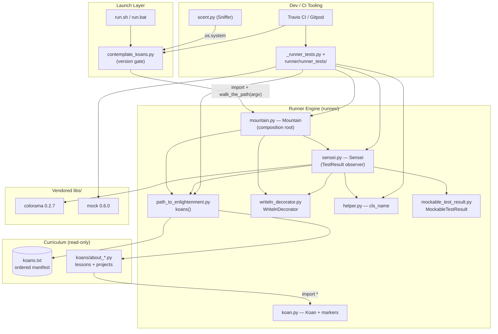
```mermaid
flowchart TD
    subgraph LAUNCH["Launch Layer"]
        RUNSH["run.sh / run.bat"]
        CK["contemplate_koans.py<br/>(version gate)"]
    end
    subgraph ENGINE["Runner Engine (runner/)"]
        MT["mountain.py — Mountain<br/>(composition root)"]
        PTE["path_to_enlightenment.py<br/>koans()"]
        SEN["sensei.py — Sensei<br/>(TestResult observer)"]
        WD["writeln_decorator.py<br/>WritelnDecorator"]
        HP["helper.py — cls_name"]
        MTR["mockable_test_result.py<br/>MockableTestResult"]
        KO["koan.py — Koan + markers"]
    end
    subgraph CURR["Curriculum (read-only)"]
        MAN[("koans.txt<br/>ordered manifest")]
        LES["koans/about_*.py<br/>lessons + projects"]
    end
    subgraph LIBS["Vendored libs/"]
        COL["colorama 0.2.7"]
        MOCK["mock 0.6.0"]
    end
    subgraph TOOL["Dev / CI Tooling"]
        SC["scent.py (Sniffer)"]
        RT["_runner_tests.py +<br/>runner/runner_tests/"]
        CI["Travis CI / Gitpod"]
    end
    RUNSH --> CK
    CK -->|"import + walk_the_path(argv)"| MT
    MT --> PTE
    MT --> SEN
    MT --> WD
    PTE --> MAN
    PTE --> LES
    SEN --> MTR
    SEN --> HP
    SEN --> PTE
    SEN --> COL
    SEN --> WD
    LES -->|"import *"| KO
    SC -->|"os.system"| CK
    RT --> MOCK
    RT --> MT
    RT --> SEN
    RT --> PTE
    RT --> HP
    CI --> RT
    CI --> CK
```

### 5.2.9 Application Run-Lifecycle State Transitions

The state machine below describes the **application-level** lifecycle of a single invocation — from launch through the version gate, engine assembly, execution, and the two terminal exits. It complements the finer-grained, `Sensei`-internal narration state model in Section 4.5.1.

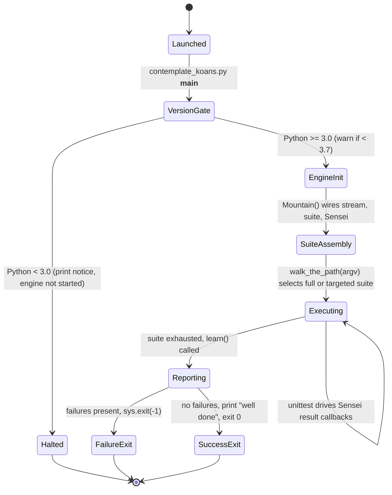
```mermaid
stateDiagram-v2
    [*] --> Launched
    Launched --> VersionGate: contemplate_koans.py __main__
    VersionGate --> Halted: Python < 3.0 (print notice, engine not started)
    VersionGate --> EngineInit: Python >= 3.0 (warn if < 3.7)
    EngineInit --> SuiteAssembly: Mountain() wires stream, suite, Sensei
    SuiteAssembly --> Executing: walk_the_path(argv) selects full or targeted suite
    Executing --> Executing: unittest drives Sensei result callbacks
    Executing --> Reporting: suite exhausted, learn() called
    Reporting --> FailureExit: failures present, sys.exit(-1)
    Reporting --> SuccessExit: no failures, print "well done", exit 0
    Halted --> [*]
    FailureExit --> [*]
    SuccessExit --> [*]
```

### 5.2.10 Sequence Diagram — End-to-End Koan Run

This sequence diagram traces one full run across components, reflecting the actual construction order (the suite and `Sensei` are built in `Mountain.__init__`, before `walk_the_path` optionally narrows the suite and executes it).

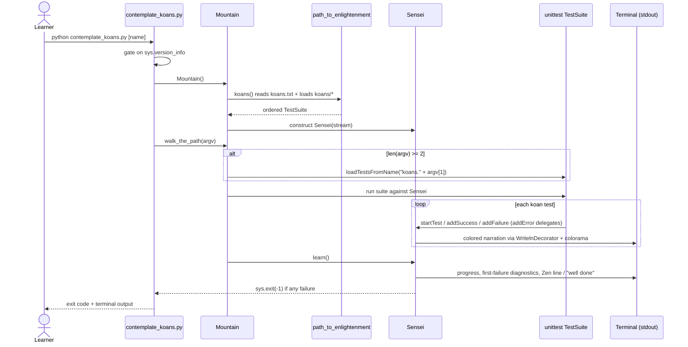
```mermaid
sequenceDiagram
    actor Learner
    participant CK as contemplate_koans.py
    participant M as Mountain
    participant PTE as path_to_enlightenment
    participant SEN as Sensei
    participant SU as unittest TestSuite
    participant T as Terminal (stdout)

    Learner->>CK: python contemplate_koans.py [name]
    CK->>CK: gate on sys.version_info
    CK->>M: Mountain()
    M->>PTE: koans() reads koans.txt + loads koans/*
    PTE-->>M: ordered TestSuite
    M->>SEN: construct Sensei(stream)
    CK->>M: walk_the_path(argv)
    alt len(argv) >= 2
        M->>SU: loadTestsFromName("koans." + argv[1])
    end
    M->>SU: run suite against Sensei
    loop each koan test
        SU->>SEN: startTest / addSuccess / addFailure (addError delegates)
        SEN->>T: colored narration via WritelnDecorator + colorama
    end
    M->>SEN: learn()
    SEN->>T: progress, first-failure diagnostics, Zen line / "well done"
    SEN-->>CK: sys.exit(-1) if any failure
    CK-->>Learner: exit code + terminal output
```

## 5.3 Technical Decisions

This section records the architecturally significant decisions evidenced in the repository and the tradeoffs each one accepts. Because Python Koans is a small, local educational tool, several decisions are decisions *not* to adopt a capability (a service tier, a database, a cache server, authentication); those are documented as deliberate, requirement-justified choices rather than omissions. Each theme is presented with prose plus a three-column table, followed by a consolidated Architecture Decision Record (ADR) catalog and a decision-tree diagram.

### 5.3.1 Architecture Style and Tradeoffs

The system is a **single-process, layered pipeline** built on the standard-library `unittest` framework and assembled at one composition root (`Mountain`). This style is chosen because the entire product requirement is a learner's local `red → green → refactor` loop (Section 4.1): the tool must start instantly from a checkout, run a curated sequence of tests, and print human-readable feedback. A microservice, plugin, or client/server architecture would introduce infrastructure with no corresponding requirement in the repository. The accepted cost is that the tool is inherently local and single-user, and its components are wired together directly rather than being independently deployable.

| Dimension | Decision | Tradeoff Accepted |
|---|---|---|
| Deployment model | Single-process local CLI | No remote access or multi-user concurrency |
| Runtime substrate | Stdlib `unittest` + two custom extensions | Must implement a custom `TestResult` (`Sensei`) |
| Extensibility | Data-driven manifest + `about_*` naming convention | Manifest and source must be kept in sync |
| Component coupling | Direct in-process composition (`Mountain`) | Components are not independently deployable |

### 5.3.2 Communication and Coordination Patterns

All coordination inside a run is **in-process**: Python `import` wiring plus direct method calls, with the `unittest` result callbacks (`startTest`/`addSuccess`/`addFailure`/`addError`) acting as the **observer** channel between the executing suite and `Sensei`. The only externally observable contract is the pair of **terminal text and a process exit code** (`sys.exit(-1)` on failure, `0` on success) — deliberately chosen so the tool composes cleanly with CI, the Sniffer, and shell scripts. The Sniffer is the one place a new process is spawned (`os.system`), and even there the contract is just the launcher command. There are no sockets, RPC, message queues, or asynchronous callbacks.

| Interaction | Mechanism | Rationale |
|---|---|---|
| Launcher → engine | Python import + method call | Simplicity; no IPC needed in-process |
| Suite → reporter | `unittest` result callbacks (observer) | Standard, well-understood extension point |
| Engine → terminal | `WritelnDecorator` over `stdout` + `colorama` | Human-readable, colorized feedback |
| Run outcome → outside | Process exit code (`0` / `-1`) | Composable with CI, Sniffer, and shells |

### 5.3.3 Data Storage and Caching Strategy

There is **no database, object store, or cache server**, and this is the correct choice because the tool holds no data that must survive across runs: the manifest (`koans.txt`) and lesson source (`koans/*.py`) are read-only inputs, and the learner's *own edits* to those source files are the only durable record of progress (kept out of version control via the ignored `answers` path). Consequently every invocation re-reads the manifest and re-executes the suite from scratch, which keeps runs deterministic and is inexpensive at the curriculum's size. The only cache-like behaviors are the in-memory `Sensei.all_lessons` memoization (so `total_lessons()` scans `koans/about*.py` once) and the `-B` launch flag that suppresses `.pyc` bytecode files. This aligns with Sections 3.5 and 4.5.4.

| Concern | Approach | Rationale |
|---|---|---|
| Persistent data | Read-only manifest + lesson source files | No cross-run data the tool must own |
| Progress "save" | Learner's own source edits (`answers/` untracked) | Progress is a learning artifact, not tool data |
| Cross-run caching | None — reload and re-run every time | Determinism; recompute is cheap at this scale |
| In-run caching | `all_lessons` memoization; `-B` disables `.pyc` | Avoid directory rescans; keep the tree clean |

### 5.3.4 Security Mechanism Selection

Security posture is intentionally minimal because the system is a **local, single-user tool with no network surface, no protected resources, and no personal data**. The only "gate" in the code is the interpreter version check in `contemplate_koans.py`, which is a compatibility safeguard rather than a security control. The trust model is that the tool executes ordinary Python — the shipped koans plus the learner's own edits — under the invoking user's OS privileges; no sandboxing is implemented or required, since the learner authors the very code under test. Supply-chain risk is minimized by **vendoring** pinned copies of `colorama` (0.2.7) and `mock` (0.6.0) so no dependency resolution happens at runtime, and the declared submodule is explicitly excluded (Sections 3.6.1/3.6.7). CI and cloud configs store no secrets because CI only verifies and never deploys.

| Security Concern | Mechanism | Rationale / Note |
|---|---|---|
| Authentication / authorization | None | Local single-user tool; no protected resource exists |
| Code-execution trust | Runs with the user's own OS privileges | Learner authors the code under test; no sandbox observed |
| Supply chain | Vendored, pinned `colorama`/`mock`; submodule excluded | Reproducible from a checkout; no runtime dependency fetch |
| Secrets management | No secrets in CI/cloud config | CI verifies only; performs no deployment |

### 5.3.5 Architecture Decision Records

The table below consolidates the significant decisions as compact ADRs. All are effectively **Accepted** and reflected in the current codebase; each row states the decision and its rationale together with the principal tradeoff.

| ADR | Decision | Rationale & Key Tradeoff |
|---|---|---|
| ADR-01 | Build on stdlib `unittest` (not pytest/nose) | Zero-install, teaches TDD with the batteries-included framework; requires a custom result object |
| ADR-02 | Implement a custom `TestResult` (`Sensei`) | Enables pedagogical narration and first-failure focus; couples to the `unittest` result protocol |
| ADR-03 | Externalize lesson order in `koans.txt` | Curated, data-driven sequence; manifest must stay in sync and is parsed twice per run |
| ADR-04 | Single-process CLI, no service tier | Matches the local `red→green→refactor` need; no remote/multi-user capability |
| ADR-05 | Vendor `colorama`/`mock` under `libs/` | Runs from a bare checkout without `pip`; versions are pinned and updated manually |
| ADR-06 | Cross-platform color via `colorama` | Consistent colored output incl. Windows consoles; adds a bundled dependency + `init()` |
| ADR-07 | Fail-fast interpreter version gate at entry | Avoids confusing Python-2 tracebacks for beginners; gate lives in the launcher |
| ADR-08 | Stateless runs; no progress persistence | Progress lives in the learner's source edits; recomputed each run, no run history |
| ADR-09 | Exit code + stdout as the only external contract | Composable with CI/Sniffer/shells; no structured/machine-readable report beyond the code |
| ADR-10 | No build/packaging — run in place | Lowest barrier for learners; not distributable as a `pip` package |

### 5.3.6 Decision Tree Diagram

The following decision tree reconstructs the requirement-driven reasoning behind the minimal architecture: each capability that a larger system might add is evaluated against an actual repository requirement, and because none of them applies, the design converges on a single-process standard-library CLI with a small set of vendored dependencies.

```mermaid
flowchart TD
    Start(["Capability considered for the architecture"]) --> Q1{"Multiple concurrent<br/>remote users?"}
    Q1 -->|"No (not a requirement)"| Q2{"Must persist state<br/>across runs?"}
    Q1 -->|"Yes"| SvcTier["Would need a service tier<br/>— NOT required"]
    Q2 -->|"No (edits are the state)"| Q3{"Structured or remote<br/>data exchange?"}
    Q2 -->|"Yes"| DB["Would need a database/store<br/>— NOT required"]
    Q3 -->|"No (stdout + exit code)"| Q4{"Third-party runtime<br/>dependency needed?"}
    Q3 -->|"Yes"| Net["Would need a network protocol<br/>— NOT required"]
    Q4 -->|"No"| CLI["Single-process stdlib CLI<br/>on unittest — CHOSEN"]
    Q4 -->|"Yes, but minimal"| Vendor["Vendor it under libs/<br/>(colorama, mock)"]
    Vendor --> CLI
```

## 5.4 Cross-Cutting Concerns

This section addresses the concerns that span the whole system: observability, logging/tracing, error handling, authentication/authorization, performance, and disaster recovery. For a single-process local CLI, several of these are handled by convention or are deliberately absent; where a concern has no dedicated mechanism, that fact is stated plainly and the actual behavior in its place is documented. Operational error-handling detail already appears in Section 4.6 and is cross-referenced rather than repeated; the diagram here takes the complementary architectural (layer/ownership) view.

### 5.4.1 Monitoring and Observability

There is **no metrics pipeline, telemetry, APM, health check, or dashboard** in the repository. The system's observability *is* its terminal narration: `Sensei` reports what is happening in real time (per-test "Thinking …" / "has expanded your awareness" lines), and at the end it reports learning-progress indicators via `report_progress()` and `report_remaining()`. The machine-observable signals are the process exit code and — in CI — the Travis build result delivered by email. These are learning- and correctness-oriented signals, not operational service metrics (Section 1.2.3).

| Signal | Emitted By | Consumer |
|---|---|---|
| Per-test narration | `Sensei` → `stdout` | Learner (interactive) |
| Progress % and remaining counts | `report_progress()` / `report_remaining()` | Learner |
| Process exit code (`0` / `-1`) | `sys.exit` in `learn()` | Shell, Sniffer, CI |
| CI build result | Travis CI (`notifications: email`) | Maintainer |

### 5.4.2 Logging and Tracing Strategy

The system uses **no logging framework and writes no log files**, and — being single-process — it has **no distributed tracing**. In place of logging, all output is written directly and synchronously through `WritelnDecorator` to `stdout`, colorized by the vendored `colorama`; this output is transient terminal text, not a persisted log. The nearest analog to a "trace" is the guided stack dump for the first failing koan: `scrapeInterestingStackDump()` reduces a raw Python traceback to only the `koans/`-relevant frames and colorizes the file names and line numbers, giving the learner a focused, human-oriented trace rather than machine-readable spans. The maintainer regression run raises verbosity explicitly (`TextTestRunner(verbosity=2)` in `_runner_tests.py`), which is the only verbosity control observed.

| Aspect | Approach in this System |
|---|---|
| Logging framework | None — narration written straight to `stdout` |
| Log persistence | None — terminal output is transient |
| Verbosity control | Not configurable in a learner run; `verbosity=2` for the regression suite |
| Tracing | `koans/`-filtered, colorized stack scrape for the first failure only |

### 5.4.3 Error Handling Patterns

Error handling is intentionally minimal and terminal-oriented; the full operational treatment (retry loops, fallbacks, notification channels, recovery procedures by run context) is in Section 4.6. Architecturally, the pattern has three ideas. First, a **pre-execution guard**: the launcher's interpreter version gate stops a Python-2 run before any engine code loads and warns (but proceeds) below 3.7. Second, **unified error classification**: the engine distinguishes an expected koan *failure* (an unmet assertion) from an unexpected *error* (an exception in the code under test, or a bad manifest entry that fails to import), but `Sensei.addError` delegates to `addFailure` so both flow into a single ordered list and receive the same guided treatment. Third, **guided rendering with a single external signal**: `sortFailures()`/`firstFailure()` select the first failing koan by source line, `errorReport()` renders it (scraped assertion text plus a `koans/`-filtered, colorized stack), and `sys.exit(-1)` communicates the result. There is no exception-catching middleware and no in-process retry — retries exist only at the invocation level (the Sniffer and the `run.bat` loop).

The diagram below shows how an error is classified and routed **through the architectural layers** — the entry guard, the execution layer, the `Sensei` result layer, and the output contract — which complements the recovery-by-context flow in Section 4.6.1.

```mermaid
flowchart TD
    subgraph GATE["Entry Guard — contemplate_koans.py"]
        V{"Interpreter<br/>version OK?"}
        VH["Python 2: print notice;<br/>engine never starts"]
    end
    subgraph EXEC["Execution — unittest + koans"]
        R["Run a koan"]
        C{"Outcome?"}
        F1["Assertion unmet<br/>= FAILURE"]
        F2["Exception / bad manifest<br/>= ERROR"]
    end
    subgraph RESULT["Result Layer — Sensei"]
        AF["addFailure() list<br/>(addError delegates here)"]
        SEL["sortFailures + firstFailure<br/>(by source line)"]
        SCR["scrapeAssertionError +<br/>scrapeInterestingStackDump"]
        REP["errorReport(): koans-filtered,<br/>colorized diagnostic"]
    end
    subgraph OUT["Output Contract"]
        T["stdout diagnostic"]
        EX["sys.exit(-1)"]
        OK(["All pass: exit 0 + well done"])
    end
    V -->|"No (Python 2)"| VH
    V -->|"Yes"| R
    R --> C
    C -->|"pass"| OK
    C -->|"assertion fails"| F1
    C -->|"raises exception"| F2
    F1 --> AF
    F2 --> AF
    AF --> SEL --> SCR --> REP --> T
    REP --> EX
```

### 5.4.4 Authentication and Authorization

The system has **no authentication or authorization framework** — there are no user accounts, credentials, roles, tokens, or protected resources, because it is a local single-user tool that owns no data and exposes no network endpoint. The only access controls in effect are those the operating system already applies to the checkout (filesystem permissions on the source files the learner reads and edits). The interpreter version gate is a *compatibility* safeguard, not an authorization check. Where identity does matter — pushing to GitHub, triggering Travis, or opening a Gitpod workspace — it is handled entirely by those external platforms and their own credentials, which live outside this repository (Section 3.4).

| Concern | Mechanism | Note |
|---|---|---|
| End-user authentication | None | No accounts or credentials in the product |
| Authorization / RBAC | None | No protected resources exist |
| Local access control | OS filesystem permissions | Applies to the checkout the learner runs |
| External platform identity | GitHub / Travis / Gitpod auth | Managed by those services, not in-repo |

### 5.4.5 Performance Requirements and SLAs

No formal performance requirements, SLAs, latency or throughput budgets, or benchmarks exist anywhere in the repository (Section 1.2.3), so none are asserted here. The observed performance *character* follows directly from the architecture: a single run is synchronous, single-threaded, and entirely in-memory, and its cost is dominated by executing the loaded `unittest` suite. The design keeps that cost low and predictable — narration is linear in the number of tests, failure sorting is roughly O(f log f), and the lesson glob is memoized — while one minor inefficiency is the redundant double `koans()` load (Section 5.2.3). Two conventions are performance-adjacent rather than requirements: the `-B` flag avoids `.pyc` churn on scripted launches, and Gitpod `master` prebuilds speed up cloud-workspace start.

| Aspect | Observed Characteristic | Note |
|---|---|---|
| Formal SLA / latency target | None in the repository | Not asserted; would be invented if stated |
| Concurrency model | Single-threaded, synchronous, one process | No parallel test execution |
| Dominant cost | Executing the loaded suite; linear narration | Bounded by curriculum size |
| Efficiency conventions | Memoized lesson glob; `-B`; Gitpod prebuilds | Redundant double manifest load is minor |

### 5.4.6 Disaster Recovery

There is **no disaster-recovery plan, RTO/RPO target, backup job, or failover** in the repository, because there is no running service, no server, and no tool-owned data to lose. Recovery is implied by the architecture: the tool is stateless and fully reproducible from version control, so "recovery" of the tool itself means re-obtaining the source (clone or download) and re-running it (Section 3.6.2). The only at-risk data is the learner's own local edits to koan files, which the tool deliberately keeps out of version control (the ignored `answers` path) and whose backup is the learner's responsibility. The optional external environments are reconstituted from their declarative configuration (`.travis.yml`, `.gitpod.yml`, `.gitpod.Dockerfile`), with the one caveat that the Gitpod base image is pinned to the mutable `:latest` tag and so is not perfectly reproducible over time (Section 3.6.7).

| Scenario | Recovery Approach | Note |
|---|---|---|
| Tool/source lost locally | Re-clone or re-download the repository | Stateless; nothing tool-owned to restore |
| Learner work lost | Learner's own backup of edited koan files | `answers/` intentionally untracked |
| CI / cloud environment lost | Reprovision from `.travis.yml` / `.gitpod.*` | Config-as-code; `:latest` base not fully reproducible |
| Interpreter unavailable | Reinstall Python 3 (per `README.rst`) | Version gate guards mismatched interpreters |

## 5.5 References

The following repository files, folders, and specification sections were inspected as evidence for Section 5. No external web sources were used.

**Source files examined**

- `contemplate_koans.py` - Established the guarded launcher and interpreter version gate, and the `Mountain().walk_the_path(sys.argv)` hand-off.
- `run.sh` - Confirmed the POSIX launch wrapper (`python3 -B contemplate_koans.py`).
- `run.bat` - Confirmed the Windows interpreter resolution and "Test again?" retry loop.
- `runner/mountain.py` - Established the `Mountain` composition root, targeted-selection logic, and run coordination.
- `runner/path_to_enlightenment.py` - Established the manifest parsing, ordered `TestSuite` construction, and `sortTestMethodsUsing = None` ordering.
- `runner/sensei.py` - Established the `Sensei` result observer: narration, first-failure focus, traceback scraping, progress accounting, Zen line, and `sys.exit(-1)`.
- `runner/writeln_decorator.py` - Established the `WritelnDecorator` output stream (decorator pattern over `sys.stdout`).
- `runner/helper.py` - Established the `cls_name()` introspection helper.
- `runner/mockable_test_result.py` - Established the `MockableTestResult` base/mock seam.
- `runner/koan.py` - Established the `Koan` base class and the fill-in markers (`__`, `___`, `____`, `_____`).
- `koans.txt` - Established the ordered, comment-aware curriculum manifest.
- `koans/about_asserts.py` - Representative fill-in-the-blank concept lesson.
- `koans/about_triangle_project.py`, `koans/triangle.py` - Representative "implement-the-code" capstone project and its stub module.
- `libs/colorama/__init__.py` - Confirmed vendored `colorama` version `0.2.7` (cross-platform ANSI color).
- `libs/mock.py` - Confirmed vendored `mock` version `0.6.0` (test doubles for the regression suite).
- `_runner_tests.py` - Established the aggregated regression suite and its pass/fail exit code.
- `scent.py` - Established the Sniffer watch paths, file validator, and `os.system` re-run.
- `.travis.yml` - Established CI on Python 3.9 running `python _runner_tests.py` with email notifications.
- `.gitpod.yml`, `.gitpod.Dockerfile` - Established the cloud-workspace task, prebuilds, and Docker base image.
- `.gitmodules` - Established the declared, out-of-scope `Submodule_01_Do_not_use_15Jun`.
- `.gitignore`, `.hgignore` - Established the ignored `answers` path (learner work kept out of VCS).
- `example_file.txt` - A read-only fixture consumed by a file-reading koan.
- `README.rst`, `Contributor Notes.txt` - Confirmed the `red → green → refactor` workflow, run commands, and single-case/method invocation.

**Source folders examined**

- `runner/` - The in-process runner engine (orchestrator, loader, reporter, scaffold, helpers).
- `runner/runner_tests/` - The engine regression tests (`TestMountain`, `TestSensei`, `TestHelper`, `TestFilterKoanNames`, `TestKoansSuite`).
- `koans/` - The curriculum: `about_*.py` concept lessons plus the capstone projects and their support modules.
- `libs/`, `libs/colorama/` - The vendored third-party libraries.

**Cross-referenced specification sections**

- `1.2 System Overview` - Terminology, component roster, and the absence of business KPIs/SLAs.
- `1.3 Scope` - Confirmed the submodule exclusion.
- `2.13 Feature Relationships` - Feature-level dependency map, integration points, and shared components.
- `3.4 Third-Party Services` - External services and the absence of auth/monitoring/cloud infrastructure.
- `3.5 Databases & Storage` - Confirmed no database, cache tier, or object store.
- `3.6 Development & Deployment` - Build/CI/containerization model and the `:latest` reproducibility caveat.
- `4.1 System Workflow Overview` - End-to-end runtime workflow and system boundaries.
- `4.5 State Management` - In-memory state model, caching, and transaction boundaries.
- `4.6 Error Handling` - Operational error detection, retry, notification, and recovery detail.

# 6. SYSTEM COMPONENTS DESIGN

## 6.1 Core Services Architecture

### 6.1.1 Architectural Assessment and Applicability Determination

**Core Services Architecture is not applicable for this system.**

Python Koans is a single-process, terminal-driven Python 3 command-line application. It is **not** composed of microservices, it does **not** employ a distributed or client/server architecture, and it contains **no distinct service components** that communicate across a network or process boundary. The whole system runs to completion inside a single interpreter invocation launched by `contemplate_koans.py`, which hands control to an in-process test-running engine (`runner/`) and communicates its result exclusively through printed terminal text and a process exit code. This determination is consistent with the high-level architecture (Section 5.1), which records that there is "no service tier, network listener, database, message broker, or scheduler anywhere in the repository."

Because the section applies only when a system requires microservices, a distributed architecture, or distinct service components, and none of those conditions hold here, the traditional Core Services Architecture concerns — service boundaries, inter-service communication, service discovery, load balancing, circuit breakers, auto-scaling, failover clusters, and disaster-recovery topology — have **no corresponding implementation** in the repository. The remainder of this section documents the actual monolithic, in-process design that stands in place of a service architecture (Section 6.1.2) and then walks through each service-oriented concern area — Service Components (6.1.3), Scalability Design (6.1.4), and Resilience Patterns (6.1.5) — stating plainly why each is not applicable and describing the local behavior that exists in its place. Where a concern is treated in depth elsewhere (error handling in Section 4.6; performance and disaster recovery in Section 5.4), this section cross-references rather than duplicates.

The determination rests on the following evidence, gathered directly from the repository:

| Determination Criterion | Repository Finding | Supporting Evidence |
|---|---|---|
| Multiple independently deployable services / microservices | None — one entrypoint, one process, run to completion | `contemplate_koans.py`, `runner/mountain.py` |
| Network service tier (listeners, ports, endpoints, RPC) | None — no sockets, HTTP servers, web frameworks, or ports | Repository-wide source scan; Sections 5.1, 3.4 |
| Inter-service / inter-process communication | None — in-process `import` wiring and direct method calls only | `runner/mountain.py`, `runner/sensei.py`, `runner/path_to_enlightenment.py` |
| Concurrency / distribution model | Single-threaded, synchronous, one interpreter invocation | Section 5.4.5; absence of `threading`/`asyncio`/`multiprocessing` |
| Shared datastore or state store across services | None — read-only files loaded at startup; in-memory run state | Section 3.5; `runner/sensei.py` |
| Service-infrastructure dependencies (discovery, brokers, load balancers) | None — no runtime network calls; only optional config-only tooling | Section 3.4; `.travis.yml`, `.gitpod.yml` |

In short, the "architecture" that would normally be described here is a **layered, single-process pipeline** rather than a set of cooperating services. That pipeline — its components, their in-process interactions, and its single external contract (stdout text plus an exit code) — is documented next so that the non-applicability of each service-oriented concern can be assessed against a concrete design.

### 6.1.2 Actual System Architecture: Monolithic In-Process Design

In place of a service architecture, Python Koans implements a **layered, single-process pipeline** built directly on the Python standard-library `unittest` framework (Section 5.1). Every unit of the system is an in-process Python module or object, assembled at a single composition root and invoked through ordinary `import` wiring and direct method calls. There are no service processes, no network protocols, and no message passing between components — the only externally observable contract is the pair of **terminal text (stdout) and a process exit code**.

The components below are frequently described with design-pattern names (composition root, observer, decorator, template hook), but they are **objects inside one interpreter**, not deployable services. This distinction is what renders the service-oriented concerns in Sections 6.1.3–6.1.5 non-applicable.

**Component inventory (in-process modules, not services).** The output-format standard caps tables at four columns; responsibilities and interaction mechanisms are presented together below.

| Component | In-Process Responsibility | Interaction Mechanism |
|---|---|---|
| `contemplate_koans.py` (launcher) | Version-gate the interpreter, then start the engine | Direct call: `Mountain().walk_the_path(sys.argv)` |
| `runner/mountain.py` — `Mountain` | Composition root; wire stream + suite + result; run then report | Constructor wiring; `self.tests(self.lesson)`; `self.lesson.learn()` |
| `runner/path_to_enlightenment.py` | Parse `koans.txt`; build the ordered `unittest.TestSuite` | `io.open` file read; `unittest.TestLoader` |
| `runner/sensei.py` — `Sensei` | Observe outcomes; narrate progress/first failure; set exit code | `unittest` observer callbacks; writes via stream; `sys.exit` |
| `runner/writeln_decorator.py` — `WritelnDecorator` | Add `writeln()` to `sys.stdout` for narration | Wraps stream; `__getattr__` delegation |
| `runner/koan.py` — `Koan` + markers | Base `TestCase` and fill-in markers consumed by lessons | `from runner.koan import *` in every lesson |
| `koans/` + `koans.txt` | Read-only curriculum: ordered manifest + lesson/project source | Loaded once by the engine at startup |
| `libs/colorama` 0.2.7 (vendored) | Cross-platform ANSI colored terminal output | `import`; `init()` / `Fore` / `Style` used in `Sensei` |

**Interaction model.** Control and data move in one short, deterministic path per invocation: the launcher gates `sys.version_info` and constructs `Mountain`; `Mountain.__init__` wires `WritelnDecorator(sys.stdout)`, the ordered suite from `path_to_enlightenment.koans()`, and a `Sensei` result object; `walk_the_path(argv)` optionally narrows the suite to a single dotted target (`koans.<argv[1]>`), runs the suite against `Sensei` via the `unittest` observer callback protocol (`startTest`/`addSuccess`/`addFailure`/`addError`), and finally calls `Sensei.learn()` to emit the report and exit. Every edge in the diagram below is an in-process call or a local filesystem read — there is not a single network hop.

The following diagram is the **service-interaction diagram** requested by the section prompt, reframed for a non-service system: it shows the in-process components and their interactions, and deliberately illustrates that all "integration" is in-process while the only external invokers sit *outside* the process and merely (re)launch it.

**Diagram 6.1.2-A — In-Process Component Interaction (single-process "service interaction" view)**

```mermaid
flowchart TD
    subgraph PROC["Single OS Process (one Python 3 interpreter)"]
        CLI["contemplate_koans.py<br/>guarded launcher"]
        MT["Mountain<br/>(composition root)"]
        PTE["path_to_enlightenment<br/>suite loader"]
        SUITE["unittest.TestSuite<br/>of Koan test cases"]
        SEN["Sensei<br/>custom unittest.TestResult"]
        WD["WritelnDecorator<br/>(sys.stdout wrapper)"]
        CLI -->|"walk_the_path(argv)"| MT
        MT -->|"koans()"| PTE
        PTE -->|"ordered suite"| SUITE
        MT -->|"construct"| SEN
        MT -->|"run suite(result)"| SUITE
        SUITE -->|"observer callbacks"| SEN
        SEN -->|"writeln()"| WD
    end

    subgraph INPUTS["Read-Only Filesystem Inputs"]
        MAN["koans.txt<br/>(ordered manifest)"]
        LES["koans/*.py<br/>(lessons + projects)"]
    end

    subgraph EXT["Optional External Invokers (out-of-process)"]
        SNIFF["Sniffer (scent.py)"]
        SH["run.sh / run.bat"]
        CI["Travis CI / Gitpod"]
    end

    TERM(["Terminal stdout + process exit code"])

    PTE -.->|"read UTF-8"| MAN
    SUITE -.->|"import lessons"| LES
    WD -->|"ANSI text"| TERM
    SEN -->|"exit -1 fail / 0 pass"| TERM
    SNIFF -.->|"os.system spawn"| CLI
    SH -.->|"invoke"| CLI
    CI -.->|"invoke"| CLI
```

The diagram makes the architectural conclusion visible: the box labeled *Single OS Process* is the entire runtime, the *External Invokers* only start (or restart) that one process, and no arrow represents a network call or an inter-service message. Consequently, the service-component, scalability, and resilience concerns evaluated in the following sub-sections have no service topology to describe.

### 6.1.3 Service Components — Non-Applicability Analysis

The section prompt enumerates six Service Component concerns. Because the system has no services (Section 6.1.1), none of the six has a service-oriented implementation. The table below evaluates each concern, states its applicability, and records the actual in-process behavior that exists in its place. The only concern with a concrete (though non-service) implementation is retry/fallback, which exists at the *invocation* level and is detailed separately afterward.

| Service Component Concern | Applicable? | Actual Behavior / Rationale |
|---|---|---|
| Service boundaries & responsibilities | No | Only *module* boundaries within one process — launcher, `runner/` engine, `koans/` curriculum, vendored `libs/` — wired by `import` (Sections 6.1.2, 5.1.2) |
| Inter-service communication patterns | No | In-process `import` wiring, direct method calls, and the `unittest` observer callback protocol; no REST/RPC/messaging (Section 5.1.3) |
| Service discovery mechanisms | No | Nothing to discover; components resolve by static `import`, and the curriculum resolves by filename from `koans.txt` (`runner/path_to_enlightenment.py`) |
| Load balancing strategy | No | Single-threaded, one process, one suite run; there are no replicas or instances to balance (Section 5.4.5) |
| Circuit breaker patterns | No | No downstream/service calls to protect; failure handling is fail-fast via `sys.exit(-1)` (Sections 4.6.3, 6.1.5) |
| Retry & fallback mechanisms | Only at invocation level | No in-process retry — the suite runs exactly once per invocation; optional external re-run loops and compatibility fallbacks exist (see below) |

**Service boundaries.** What would be "service boundaries" in a distributed system are here simple **module responsibilities inside a single interpreter**: the launcher gates the interpreter and starts the run; `Mountain` composes and drives the pipeline; `path_to_enlightenment` loads the ordered suite; `Sensei` observes and narrates; `WritelnDecorator` adapts the output stream; and the `koans/` package supplies the read-only exercise content. These boundaries are enforced by Python packaging and imports, not by process isolation, network contracts, or APIs.

**Inter-service communication and discovery.** There is no communication *between services* because there is one process. The nearest analogs are entirely in-process: the `unittest` result-callback protocol (`startTest`/`addSuccess`/`addFailure`/`addError`) carries outcomes from the executing suite to `Sensei`, and `Sensei` writes narration back through the decorated stream (Section 5.1.3). "Discovery" is static: the manifest `koans.txt` names fully-qualified test classes that `unittest.TestLoader.loadTestsFromName` resolves at startup, preserving curated order.

**Load balancing and circuit breakers.** Both presuppose multiple service instances or protected downstream dependencies. Neither exists: the run is single-threaded and synchronous (Section 5.4.5), and the only "downstream" is the local filesystem read of the curriculum. The failure posture is therefore fail-fast rather than circuit-broken — the first failing koan is reported and the process exits with a non-zero code (Sections 4.6, 6.1.5).

**Retry and fallback mechanisms (invocation-level only).** There is **no in-process retry**: a failing koan is not re-attempted and the suite executes once per invocation (Section 4.6.2). The retry/fallback behavior that does exist operates outside the engine, at the level of *how the process is launched*, and is optional. The following mechanisms are the complete set observed in the repository:

| Mechanism | Type | Evidence |
|---|---|---|
| Sniffer auto re-run on file change | Invocation-level retry (external loop) | `scent.py` (`os.system('python3 -B contemplate_koans.py')`) |
| `run.bat` "Test again? y or n" prompt loop | Invocation-level retry (user-driven) | `run.bat` (lines 39–42) |
| Interpreter version tolerance (3.0–3.6 warn + proceed) | Compatibility fallback | `contemplate_koans.py` |
| Windows interpreter resolution chain | Environment fallback | `run.bat` (lines 15–37) |

The Windows launcher's fallback chain tries `python.exe`, then the configured `%PYTHON_PATH%` (`C:\Python311`), then `%PYTHON%`, printing path-fix guidance if none resolves (Section 4.6.3). These are compatibility and convenience fallbacks for *starting the tool*, not service-degradation or failover strategies. The full error-handling and recovery treatment — including the recovery path per run context — is documented in Section 4.6 and is not repeated here.

### 6.1.4 Scalability Design — Non-Applicability Analysis

Scalability design in the elastic, service-oriented sense — horizontal/vertical scaling of a shared tier, auto-scaling, and capacity planning against throughput targets — is **not applicable**. Python Koans is a single-user, single-process local tool with no shared service to scale and no formal performance requirements, SLAs, or throughput budgets anywhere in the repository (Section 5.4.5). What stands in place of a scaling strategy is the **independent replication of the whole tool** across learner machines, CI jobs, and cloud workspaces, plus a handful of micro-optimizations. The table below evaluates each required concern.

| Scalability Concern | Applicable? | Actual Approach / Rationale |
|---|---|---|
| Horizontal / vertical scaling approach | No (elastic sense) | "Scale-out" = replicating independent instances (one process per learner / CI job / workspace); no shared tier; vertical needs are minimal (one interpreter) |
| Auto-scaling triggers & rules | No | No orchestrator and no metrics-driven scaling; the number of running processes is simply how many people launch the tool |
| Resource allocation strategy | Minimal / local | Requires only a Python 3 interpreter and a terminal; no dependency manifests; dependencies vendored under `libs/`; run state is in-memory (Sections 3.5, 3.6) |
| Performance optimization techniques | Present (micro-level) | Memoized lesson glob, `-B` no-bytecode launch, Gitpod prebuilds, preserved curriculum order (see below; Section 5.4.5) |
| Capacity planning guidelines | No (no capacity model) | Per-run cost is linear in the number of tests and bounded by curriculum size; no concurrency/throughput target exists (Section 5.4.5) |

**Horizontal/vertical scaling and auto-scaling.** These concepts do not map onto the system because there is nothing to replicate behind a load balancer and no elastic pool to grow. Each execution is an entirely self-contained process that reads the curriculum, runs the suite once, prints its report, and exits. "Scaling to more users" simply means more people independently cloning and running the same source; the instances share no state and never coordinate. There is no scheduler, orchestrator, or auto-scaling policy in the repository (Sections 3.4, 3.6).

**Resource allocation.** The runtime footprint is deliberately small and fixed: the tool needs only a Python 3 interpreter and a console. It declares no dependency manifest, and its two third-party libraries (`colorama` 0.2.7 and `mock`) are vendored under `libs/` so no installation or resource provisioning is required (Sections 3.3, 3.6). All run state — the loaded suite, `pass_count`, `lesson_pass_count`, and the failure list — lives in memory and is discarded at process exit (Section 3.5).

**Performance optimization techniques.** The design keeps per-run cost low and predictable. The concrete techniques observed in the repository are:

| Technique | Effect | Evidence |
|---|---|---|
| Memoized lesson glob (`all_lessons` cache) | Scans `koans/about*.py` only once per run | `runner/sensei.py` (`filter_all_lessons`) |
| `-B` launch flag | Avoids `.pyc` bytecode-cache churn | `run.sh`, `run.bat`, `scent.py` |
| Gitpod `master` prebuilds | Faster cloud-workspace startup | `.gitpod.yml` |
| Preserved manifest order (`sortTestMethodsUsing = None`) | Deterministic curated ordering without re-sorting | `runner/path_to_enlightenment.py` |

These are convenience optimizations, not scaling levers; Section 5.4.5 also notes one minor inefficiency (a redundant second `koans()` load) that is immaterial at this scale.

**Capacity planning.** With no concurrency, no shared resources, and no throughput target, there is no capacity model to plan. The dominant cost of a run is executing the loaded `unittest` suite, which grows linearly with the number of test cases and is bounded by the size of the curriculum (Section 5.4.5). The diagram below presents the **scalability architecture** requested by the prompt, reframed as the execution/deployment topology: independent, non-clustered instances fanned out from a single source of truth.

**Diagram 6.1.4-A — Execution / Deployment Topology ("scalability architecture" view)**

```mermaid
flowchart TD
    REPO["Git repository on GitHub<br/>single source of truth"]
    subgraph INST["Independent, Non-Clustered Instances (each = one Python process)"]
        DEV1["Learner machine A<br/>python3 contemplate_koans.py"]
        DEV2["Learner machine B<br/>python3 contemplate_koans.py"]
        WS["Gitpod / Eclipse Che workspace<br/>contemplate_koans.py"]
        CIJOB["Travis CI job (Python 3.9)<br/>python _runner_tests.py"]
    end
    REPO -->|"clone / pull"| DEV1
    REPO -->|"clone / pull"| DEV2
    REPO -->|"prebuild / open"| WS
    REPO -->|"push / PR triggers"| CIJOB
```

Each instance in the diagram is fully independent: there is **no load balancer, shared service tier, session store, or orchestrator** between them. "Scaling" therefore means adding more independent copies, and every copy runs to completion on its own hardware or hosted environment. This topology is a natural consequence of the monolithic in-process design in Section 6.1.2 and is why the elastic-scaling concerns above do not apply.

### 6.1.5 Resilience Patterns — Non-Applicability Analysis and Local Reliability Mechanisms

Service-level resilience patterns — fault-tolerant clusters, disaster-recovery topology, data redundancy, failover, and service-degradation policies — are **not applicable**, because there is no long-running service to keep available, no tool-owned data to lose, and no redundant instances to fail over between (Sections 5.4.6, 6.1.1). The system nonetheless embodies a small set of deliberate **reliability mechanisms** appropriate to a stateless local CLI: a pre-execution compatibility guard, a unified failure classification, a guided first-failure diagnostic, a fail-fast exit contract, optional invocation-level re-run, and full reproducibility from version control. The table below maps each required resilience concern to its actual treatment.

| Resilience Concern | Applicable? | Actual Behavior / Rationale |
|---|---|---|
| Fault tolerance mechanisms | No (service sense) | Pre-execution version guard, unified failure classification (`addError` → `addFailure`), and fail-fast `sys.exit(-1)`; no fault masking (Sections 4.6, 5.4.3) |
| Disaster recovery procedures | No | No running service/server and no tool-owned data; the tool is stateless and reproducible from VCS, so "recovery" is re-clone/re-download and re-run (Section 5.4.6) |
| Data redundancy approach | No | No datastore; curriculum inputs are read-only; the only durable state is the learner's own edits (`answers/` is VCS-ignored), whose backup is the learner's responsibility (Sections 3.5, 5.4.6) |
| Failover configurations | No | No redundant instances or endpoints to fail over to; a single synchronous process (Section 5.4.3) |
| Service degradation policies | Compatibility degradation only | No service to degrade; the one graceful-degradation behavior is running "best effort" on Python 3.0–3.6 after a printed warning (Section 4.6.3) |

**Fault tolerance and degradation.** Rather than tolerating faults transparently, the tool is intentionally fail-fast and educational. Its resilience begins at the boundary with a **pre-execution guard**: the launcher inspects `sys.version_info`, hard-stops a Python-2 run with an explanatory message before any engine code loads, and — as its sole graceful-degradation behavior — warns but proceeds on Python 3.0–3.6 (`contemplate_koans.py`). During execution, `Sensei` applies a **unified failure classification**, delegating `addError` to `addFailure` so that assertion failures and unexpected exceptions (including a bad manifest entry that fails to import) flow into one ordered list and receive identical guided treatment (Sections 4.6, 5.4.3). The result is communicated through a **single external contract**: `sys.exit(-1)` on any learner-run failure, and `sys.exit(not wasSuccessful())` for the CI self-test entry point (Section 4.6.4).

**Disaster recovery, redundancy, and failover.** These have no counterpart because the system holds no state a disaster could destroy. It is fully reproducible from version control, so recovering "the tool" means re-obtaining the source and re-running it (Section 5.4.6). There is no database to replicate and no cluster to fail over; the only at-risk data is the learner's local edits to koan files, which the project deliberately keeps out of version control (the ignored `answers` path) and whose backup is the learner's responsibility (Sections 3.5, 5.4.6). Optional CI and cloud environments are reconstituted from their declarative configuration (`.travis.yml`, `.gitpod.yml`, `.gitpod.Dockerfile`), with the caveat that the Gitpod base image is pinned to the mutable `:latest` tag and is therefore not perfectly reproducible over time (Sections 5.4.6, 3.6.7).

The diagram below presents the **resilience pattern implementation** requested by the prompt, reframed as a mapping from each service-oriented resilience concern to the actual mechanism (or explicit non-applicability) in Python Koans.

**Diagram 6.1.5-A — Resilience Concern to Actual Mechanism Mapping**

```mermaid
flowchart LR
    subgraph CONCERNS["Resilience Concern (service pattern)"]
        FT["Fault tolerance"]
        DEG["Service degradation"]
        DRC["Disaster recovery"]
        RED["Data redundancy"]
        FO["Failover"]
    end
    subgraph MECH["Actual Mechanism in Python Koans"]
        G["Pre-execution version guard<br/>(block Python 2 / warn below 3.7)"]
        FF["Fail-fast: sys.exit(-1) +<br/>guided first-failure report"]
        RR["Invocation-level re-run<br/>(Sniffer / run.bat loop)"]
        REPRO["Stateless and reproducible<br/>from version control"]
        NA["No equivalent — not applicable<br/>(no datastore, cluster, or endpoints)"]
    end
    FT --> G
    FT --> FF
    FT --> RR
    DEG --> G
    DRC --> REPRO
    RED --> NA
    FO --> NA
```

As the mapping shows, the mechanisms that do exist are compatibility- and correctness-oriented reliability features for a single local process, not availability patterns for a distributed service. The detailed error-classification flow, retry loops, notification channels, and recovery-by-context procedures are documented in Section 4.6, and the architectural (layer-ownership) view of error routing appears in Section 5.4.3; this sub-section maps those mechanisms onto the resilience vocabulary rather than duplicating them.

### 6.1.6 References

The following repository files and folders were examined as direct evidence for this section:

- `contemplate_koans.py` - Guarded single entrypoint; interpreter version gating; `Mountain().walk_the_path(sys.argv)` — established the single-process launch model and the compatibility guard/degradation behavior.
- `runner/mountain.py` - `Mountain` composition root/orchestrator; in-process wiring of stream, suite, and result; targeted single-suite selection — established the interaction model.
- `runner/sensei.py` - `Sensei` custom `unittest` result; unified failure classification (`addError` → `addFailure`); guided first-failure focus; `sys.exit(-1)` fail-fast contract; memoized lesson glob; progress metrics.
- `runner/path_to_enlightenment.py` - Manifest-driven suite loader; reads `koans.txt`; preserves curated order (`sortTestMethodsUsing = None`) — established "discovery is static file loading."
- `runner/writeln_decorator.py` - `WritelnDecorator` stdout wrapper — the output-stream adapter.
- `runner/koan.py` - Base `Koan(unittest.TestCase)` and fill-in markers consumed by lessons.
- `runner/` - Runner engine package (also contains `helper.py` and `mockable_test_result.py`) — the in-process component set that stands in for "services."
- `_runner_tests.py` - CI self-test aggregate entry point; `sys.exit(not wasSuccessful())` — the CI exit-code contract.
- `koans.txt` - Ordered, comment-aware curriculum manifest loaded at startup (read-only input).
- `koans/` - Read-only curriculum package (lessons and capstone projects) imported by the engine.
- `libs/` - Vendored third-party libraries directory (no dependency manifest; self-contained runtime).
- `libs/colorama/__init__.py` - Confirmed vendored `colorama` `VERSION = '0.2.7'` used for cross-platform colored narration.
- `scent.py` - Sniffer file-watcher configuration; `os.system('python3 -B contemplate_koans.py')` — invocation-level auto re-run (not a service/daemon).
- `run.sh` - POSIX launcher (`python3 -B contemplate_koans.py`, `-B` no-bytecode) — single-process launch.
- `run.bat` - Windows launcher; interpreter-resolution fallback chain; "Test again? y or n" re-run loop.
- `.travis.yml` - Travis CI single Python 3.9 job running `python _runner_tests.py` — verification-only, single-job CI.
- `.gitpod.yml` - Gitpod cloud workspace task (`python contemplate_koans.py`) and `master` prebuilds.
- `.gitpod.Dockerfile` - Gitpod workspace base image (`gitpod/workspace-full:latest`) and optional dev tooling.
- `.gitmodules` - Declares the `Submodule_01_Do_not_use_15Jun` submodule, explicitly "Do not use" and out of scope (not part of this architecture).

A repository-wide source scan (excluding the out-of-scope submodule) was also used to confirm the **absence** of sockets, HTTP servers, web frameworks, `asyncio`/`threading`/`multiprocessing`, message brokers, service discovery, load balancers, and circuit breakers.

Cross-referenced Technical Specification sections (for consistency; detail not duplicated here):

- Section 5.1 High-Level Architecture - Single-process layered pipeline; "no service tier, network listener, database, message broker, or scheduler."
- Section 5.2 Component Details - Component responsibilities and the redundant double manifest-load note.
- Section 5.4 Cross-Cutting Concerns - 5.4.3 error routing (architectural view), 5.4.5 performance/concurrency (single-threaded, no SLA), 5.4.6 disaster recovery.
- Section 4.6 Error Handling - Retry mechanisms (invocation-level), fallback processes, notification flows, recovery procedures.
- Section 3.3 Open Source Dependencies, 3.4 Third-Party Services, 3.5 Databases & Storage, 3.6 Development & Deployment - No runtime network calls, no datastore, no build/CD, vendored dependencies.

## 6.2 Database Design

### 6.2.1 Database Applicability Assessment and Determination

**Database Design is not applicable to this system.**

Python Koans is a single-process, terminal-driven Python 3 command-line tool that uses **no database, no cache server, and no persistent datastore of any kind**. There is no relational database, no document/NoSQL store, no key-value or graph store, no object/blob storage, and no embedded/serialization store (no `sqlite3`, `pickle`, `shelve`, or `dbm`). A repository-wide source scan (excluding the out-of-scope `Submodule_01_Do_not_use_15Jun/`) returns no database engine or driver, no ORM, no connection string or DSN, no SQL statements, and no migration or schema-definition artifacts. This determination is consistent with the technology stack (Section 3.5, "no database, no cache, and no storage service of any kind"), the storage decision record (Section 5.3.3, ADR-08 "stateless runs; no progress persistence"), and the state-management model (Section 4.5).

Because a database layer does not exist, the classic Database Design concerns — schema/ERD design, indexing, partitioning, replication, backup architecture, migrations, retention, connection pooling, read/write splitting, and query optimization — have **no corresponding implementation** in the repository. Rather than omit the required areas, the remainder of this section documents the tool's **actual persistence model** and the logical data entities that stand in place of a schema (Section 6.2.2), then walks through each Database Design concern area — Schema Design (6.2.3), Data Management (6.2.4), Compliance Considerations (6.2.5), and Performance Optimization (6.2.6) — stating plainly why each is not applicable and describing the file-based or in-memory behavior that exists in its place. Where a concern is treated in depth elsewhere, this section cross-references rather than duplicates.

The determination rests on the following evidence, gathered directly from the repository:

| Determination Criterion | Repository Finding | Supporting Evidence |
|---|---|---|
| Relational / NoSQL / KV / graph database | None — no engine, driver, or client anywhere | Repository-wide scan; Section 3.5 |
| ORM / query builder / data-access layer | None — no `sqlalchemy`, `django.db`, `peewee`, etc. | Repository-wide scan |
| Connection string / DSN / session / cursor | None — no `create_engine`, `connect()`, `DATABASE_URL` | Repository-wide scan |
| SQL / migrations / schema definitions | None — no DDL/DML, no migration tool (`alembic` etc.) | Repository-wide scan |
| Serialization / embedded persistence store | None — no `pickle`/`shelve`/`dbm`/`json`/`csv` persistence | Repository-wide scan of `*.py` |
| Persistent write operations | None — no write/append file modes; only stdout writes | `runner/writeln_decorator.py`, `libs/colorama/` |
| Datastore files (`.db`/`.sqlite`/`.json` data) | None — only `.yml`/`.Dockerfile` CI/workspace config exist | Repository file inventory |

In short, the tool owns no data that must survive between runs. Its only "data domain" is a small set of **read-only instructional files** loaded from the working directory, plus **transient in-memory run state** that is discarded at process exit. The concrete persistence model that stands in for a database schema is documented next so that the non-applicability of each Database Design concern can be assessed against it.

### 6.2.2 Actual Persistence Model and Logical Data Entities

In place of a database, Python Koans has a deliberately minimal persistence model with three tiers: **read-only filesystem inputs** (the curriculum), **transient in-memory run state** (discarded at process exit), and **durable learner edits** that are owned by the operating-system filesystem and the developer's own version-control tool rather than by the application. The engine performs exactly one file read at startup — the ordered manifest `koans.txt` via `io.open(filename, 'rt', encoding='utf8')` in `runner/path_to_enlightenment.py` — and imports the `koans/*.py` modules it names; those files are the "data." All observed writes go to the terminal stream only (`runner/writeln_decorator.py`, `libs/colorama/`); nothing is written to any datastore. This model aligns with Sections 3.5 and 4.5, which are cross-referenced here rather than duplicated.

#### 6.2.2.1 Data Stores and Persistence Surface

The table below enumerates every "store" the system touches, its persistence characteristic, and its evidence. There is no server-side store; the entire surface is local files plus process memory.

| Store | Persistence | Evidence |
|---|---|---|
| `koans.txt` ordered manifest | Read-only local file (UTF-8) | `runner/path_to_enlightenment.py` |
| `koans/*.py` lesson & project modules | Read-only local files (imported) | `koans/`, `runner/mountain.py` |
| `example_file.txt` sample fixture | Read-only local file | `koans/about_iteration.py`, `koans/about_with_statements.py` |
| `Sensei` run counters & failure list | In-memory only; discarded at exit | `runner/sensei.py` |
| Loaded `unittest.TestSuite` | In-memory only; discarded at exit | `runner/mountain.py`, `runner/path_to_enlightenment.py` |
| Learner solutions | Durable edits to `koans/*.py`; not tool-managed | `.gitignore`, `.hgignore` (`answers` ignored) |

#### 6.2.2.2 Logical Data Entities (Conceptual ERD)

Although no physical tables exist, the read-only inputs form a small, well-defined logical data model. The entity-relationship diagram below is a **conceptual model of the file-based curriculum data** — it does not represent database tables, columns, or keys. Entities correspond to the manifest, its entries, the lesson modules, the koan test classes those modules define, the test methods within them, and the sample fixture that a few file-I/O lessons read.

```mermaid
erDiagram
    MANIFEST ||--o{ MANIFEST_ENTRY : "orders"
    LESSON_MODULE ||--|{ KOAN_CLASS : "defines"
    MANIFEST_ENTRY }o--|| KOAN_CLASS : "names"
    KOAN_CLASS ||--|{ TEST_METHOD : "contains"
    TEST_METHOD }o--o| SAMPLE_FIXTURE : "may read"

    MANIFEST {
        file filename "koans.txt UTF-8"
        string comment_rule "hash lines ignored"
        int line_order "curated sequence"
    }
    MANIFEST_ENTRY {
        int line_number "ordinal position"
        string fq_class_name "fully qualified name"
    }
    LESSON_MODULE {
        path file_path "koans about star py"
        bool is_lesson "excludes extra_credit"
    }
    KOAN_CLASS {
        string class_name "subclass of Koan"
        string base_class "runner.koan.Koan"
    }
    TEST_METHOD {
        string method_name "test prefix"
        string fill_marker "underscore markers"
    }
    SAMPLE_FIXTURE {
        file filename "example_file.txt"
        int line_count "four lines"
    }
```

The relationships are enforced by Python import resolution and the `unittest` loader, not by referential integrity in a database: each `MANIFEST_ENTRY` is a fully-qualified name that `unittest.TestLoader.loadTestsFromName` resolves to a `KOAN_CLASS` at startup, and a `LESSON_MODULE` may contribute more than one class (for example, `about_proxy_object_project.py` defines both `AboutProxyObjectProject` and `TelevisionTest`).

#### 6.2.2.3 Data Flow

The data-flow diagram below traces data from the read-only inputs, through the transient in-memory pipeline, to the two non-persistent outputs (terminal text and exit code), and shows the only durable loop: the learner's own source edits, which the next invocation re-reads.

```mermaid
flowchart TD
    subgraph SRC["Read-Only Filesystem Inputs"]
        MAN["koans.txt<br/>ordered manifest"]
        MOD["koans/*.py<br/>lesson and project source"]
        FIX["example_file.txt<br/>sample fixture"]
    end
    subgraph MEM["In-Process Memory (transient; discarded at exit)"]
        LOADER["path_to_enlightenment<br/>io.open rt utf8"]
        SUITE["unittest.TestSuite<br/>ordered, in-memory"]
        SENSEI["Sensei counters<br/>pass_count / lesson_pass_count / failures"]
    end
    subgraph OUT["Outputs (nothing persisted)"]
        TERM["Terminal stdout<br/>colorized narration"]
        CODE["Process exit code<br/>0 pass / -1 fail"]
    end
    subgraph DUR["Durable State — Outside the Application"]
        EDITS["Learner edits to koans/*.py<br/>on local filesystem"]
        VCS["Developer VCS (git/hg)<br/>answers path ignored"]
    end
    MAN -->|"read once"| LOADER
    LOADER --> SUITE
    MOD -->|"import via TestLoader"| SUITE
    FIX -.->|"read during lesson"| SUITE
    SUITE -->|"observer callbacks"| SENSEI
    SENSEI --> TERM
    SENSEI --> CODE
    EDITS -.->|"next run re-reads"| MOD
    EDITS -.-> VCS
```

#### 6.2.2.4 Logical Indexes and Constraints

Because there is no database, there are **no physical indexes, primary/foreign keys, unique constraints, or check constraints**. The equivalents that exist are ordering and filtering rules applied to the file inputs at load time, documented below for completeness.

| Logical Constraint / "Index" | File-Domain Mechanism | Enforced By |
|---|---|---|
| Curriculum ordering ("clustered index") | Line order in `koans.txt`; `loader.sortTestMethodsUsing = None` preserves method order | `runner/path_to_enlightenment.py` (L49) |
| Comment/blank exclusion (filter) | Lines starting with `#` and blank lines are skipped | `filter_koan_names` (L17–28) |
| Entry→class resolution (referential) | `loadTestsFromName` imports the named class; a bad name fails fast at load | `runner/path_to_enlightenment.py`, `runner/sensei.py` |
| Lesson-membership filter | Glob `koans/about*.py` excluding `about_extra_credit` | `runner/sensei.py` `filter_all_lessons` (L261–269) |
| Encoding constraint | Manifest is read strictly as UTF-8 | `io.open(..., 'rt', encoding='utf8')` (L36) |

These rules give the curriculum deterministic order and clean parsing without any indexing infrastructure; every run re-reads and re-resolves them from scratch (Section 5.3.3).

### 6.2.3 Schema Design — Non-Applicability Analysis

Schema Design in the database sense is **not applicable**: there is no schema because there are no tables, collections, or documents. The six required Schema Design concerns are evaluated below against the file-based data model of Section 6.2.2, with the actual treatment (or explicit absence) recorded for each.

| Schema Design Concern | Applicable? | Actual Treatment / Rationale |
|---|---|---|
| Entity relationships | No | Only the logical file-domain entities of Section 6.2.2 (manifest → entries → classes → methods); relationships are resolved by Python `import` and the `unittest` loader, not by foreign-key integrity |
| Data models & structures | No | "Data" is a read-only text manifest plus Python source modules plus one 4-line sample file; the only runtime structures are an in-memory `unittest.TestSuite` and `Sensei` counters |
| Indexing strategy | No | No indexes exist; curriculum order is the line order of `koans.txt` with `sortTestMethodsUsing = None`, and the lesson set is a glob filter (Section 6.2.2.4) |
| Partitioning approach | No | No tables to partition; the only workload "narrowing" is targeted selection loading a single named class via `loadTestsFromName("koans." + args[1])` (`runner/mountain.py`) |
| Replication configuration | No | No DBMS replication of any kind (see below and diagram) |
| Backup architecture | No | The tool owns no data to back up; source is reproducible from version control (Sections 5.4.6, 3.5) |

**Entity relationships and data structures.** The closest analog to a schema is the conceptual ERD in Section 6.2.2.2. It is enforced procedurally at load time rather than declaratively: a manifest entry that names a missing or broken class simply fails to import and is surfaced through the same failure path as an assertion failure (`Sensei.addError` delegates to `addFailure`, Section 4.6). There is no normalization, denormalization, or referential-integrity concept because nothing is stored relationally.

**Indexing and partitioning.** No index structures are built or maintained. Deterministic ordering — the property an index would otherwise provide — comes for free from the curated line order in `koans.txt` and from disabling `unittest`'s method-name sorting (`loader.sortTestMethodsUsing = None`). The nearest thing to "partitioning" is the optional single-target run: passing a koan name on the command line narrows execution to one class or method instead of the full suite, which is a runtime workload selection, not stored-data partitioning.

**Replication and backup.** There is no primary/replica topology, no write-ahead-log or log shipping, no read replicas, and no shared datastore — because there is no datastore. The read-only curriculum is "replicated" only in the ordinary source-distribution sense: it is cloned as an independent full copy into each learner machine, cloud workspace, or CI job, and those copies never synchronize with one another. Correspondingly, there is no tool-managed backup architecture; the authoritative source is reproducible from version control, and the only at-risk data — the learner's own edits — is the learner's responsibility to preserve (the `answers` path is deliberately VCS-ignored; Sections 3.5, 5.4.6). The diagram below is the **replication architecture** requested by the prompt, reframed for a system whose only "replication" is source distribution (the fuller deployment topology appears in Section 6.1.4).

**Diagram 6.2.3-A — Source Distribution ("replication architecture" view)**

```mermaid
flowchart TD
    GH["GitHub repository<br/>koans.txt + koans/*.py<br/>authoritative read-only source"]
    subgraph COPIES["Independent Full Copies — no DBMS replication, no primary/replica, no sync"]
        C1["Learner clone A<br/>working tree + private in-memory state"]
        C2["Learner clone B<br/>working tree + private in-memory state"]
        C3["Gitpod / Eclipse Che<br/>ephemeral checkout"]
        C4["Travis CI checkout<br/>Python 3.9 job"]
    end
    GH -->|"git clone / pull (full copy)"| C1
    GH -->|"git clone / pull (full copy)"| C2
    GH -->|"prebuild / open"| C3
    GH -->|"push / PR trigger"| C4
```

Each copy is fully self-contained: it reads its own local files and holds its own in-memory run state, with no cross-copy data channel. This is why the replication, partitioning, and backup concerns above have no database implementation to describe.

### 6.2.4 Data Management — Non-Applicability Analysis

Data Management activities presuppose a managed datastore whose contents change and must be migrated, versioned, archived, stored/retrieved, and cached. Because there is no datastore, most of these are **not applicable**; the two that have real analogs — storage/retrieval of read-only inputs and a small in-memory cache — are file-based and in-process. Each required concern is evaluated below.

| Data Management Concern | Applicable? | Actual Treatment / Rationale |
|---|---|---|
| Migration procedures | No | No schema or stored data to migrate; changing the curriculum means editing `koans.txt` / `koans/*.py` and committing to version control |
| Versioning strategy | Source-level only | No data/schema versioning; curriculum is versioned as source in git/hg, and vendored libraries are pinned (`colorama` 0.2.7, `mock` 0.6.0) |
| Archival policies | No | Runs are stateless; counters are discarded at exit and no run history accrues, so there is nothing to archive |
| Data storage & retrieval | Read-only file I/O | Retrieval is `io.open` of `koans.txt` plus `TestLoader` import of `koans/*.py`; there is no write path and no query engine |
| Caching policies | Minimal, in-memory | `Sensei.all_lessons` memoization and the `-B` no-bytecode flag; no result cache (Section 4.5.4) |

**Migration and versioning.** There is no migration tooling (no `alembic` or equivalent) because there is no persisted schema or data whose shape could drift. The functional equivalent of a "migration" is an ordinary source change — reordering or adding a line in `koans.txt`, or adding a new `koans/about_*.py` module — reviewed and tracked through the project's version control. The manifest and the module set must be kept consistent by hand (Section 5.3.1, ADR-03). Versioning therefore operates at the source-code level, not the data level; the tool additionally pins its two vendored dependencies so runs are reproducible from a bare checkout (Sections 3.3, 5.3.4).

**Archival and retention of run data.** No data accumulates across runs. Each invocation recomputes progress in memory and discards it at exit (Section 4.5), so there is no run log, no history table, and nothing to archive or age out. Progress is "remembered" only implicitly, as the learner's saved edits to the koan source.

**Storage/retrieval and caching.** Storage and retrieval are the read-only file operations documented in Section 6.2.2: the manifest is read once as UTF-8, the named modules are imported, and a few lessons additionally open `example_file.txt` for read. Caching is limited to the single in-memory memoization of the lesson glob (`filter_all_lessons`) and the `-B` suppression of `.pyc` files; there is no cross-run cache, no result cache, and no external cache tier — every run reloads the manifest and re-executes the suite from scratch (Sections 4.5.4, 5.3.3). A dedicated treatment of caching as a performance concern appears in Section 6.2.6.

### 6.2.5 Compliance Considerations — Non-Applicability Analysis

Database compliance controls govern how stored data is retained, protected, kept private, audited, and access-controlled. Because Python Koans stores no data and collects no personal information, the database-oriented compliance concerns are **not applicable**; the only real controls are operating-system file permissions and the process's own execution privileges. Each required concern is evaluated below.

| Compliance Concern | Applicable? | Actual Treatment / Rationale |
|---|---|---|
| Data retention rules | No | No data is retained; run state is in-memory and discarded at exit, and no logs or history are persisted (Section 4.5) |
| Backup & fault-tolerance policies | No (tool-owned data) | Nothing tool-owned to back up; reproducible from version control; reliability is fail-fast + version guard (Sections 5.4.6, 6.1.5) |
| Privacy controls | Not needed | No personal data is collected, stored, or transmitted, and there is no network surface (Sections 3.4, 5.3.4) |
| Audit mechanisms | None (no DB audit) | No database audit log; the only observable trail is transient terminal output, the exit code, and optional Travis email |
| Access controls | OS-level only | No database users/roles/grants; access is governed by OS file permissions and the invoking user's privileges (Section 5.3.4) |

**Data retention and privacy.** There is no retention policy to define because the tool keeps nothing: it reads instructional files, prints feedback, and exits, discarding all in-memory state (Section 4.5). It collects, stores, and transmits **no personal or user-identifying data**, makes no network calls at runtime (Section 3.4), and therefore has no privacy surface that data-protection regulations would govern. The only user-produced content is the learner's own edits to koan source files on their own machine, which the tool never uploads or shares.

**Audit mechanisms.** No database audit facility exists because there is no database. Execution is observable only through the `Sensei` terminal narration and the process exit code (`sys.exit(-1)` on failure), plus the optional Travis CI email notification for the runner self-tests (Section 4.6.4). None of these is persisted as a tamper-evident audit record by the tool; they are transient, human-facing signals.

**Access controls.** Access control is delegated entirely to the operating system. There are no database accounts, roles, privileges, or row/column security because there is no database. The read-only curriculum files and the learner's edits are protected by ordinary filesystem permissions, and the interpreter runs the koans — the shipped code plus the learner's own edits — with the invoking user's OS privileges, without sandboxing (this trust model is documented in Section 5.3.4). No regulatory-compliance checks are implemented in the code (Section 4.4).

### 6.2.6 Performance Optimization — Non-Applicability Analysis

Database performance-optimization techniques all target a database engine and its connections. With no database, query engine, or connection layer, these techniques are **not applicable**; the tool's performance posture is instead a single synchronous in-process pass with a couple of micro-optimizations. Each required concern is evaluated below.

| Performance Concern | Applicable? | Actual Treatment / Rationale |
|---|---|---|
| Query optimization patterns | No (no queries) | No database queries; the analog is deterministic ordered suite loading and fail-fast resolution of bad manifest names (`runner/path_to_enlightenment.py`) |
| Caching strategy | Minimal, in-memory | `Sensei.all_lessons` memoization and `-B` no-bytecode; no query/result cache (Sections 4.5.4, 5.3.3) |
| Connection pooling | No | No database connections to pool; each run performs one read-only file open of the manifest |
| Read/write splitting | No | No replicas and no writes to split; all data access is read-only and all output goes to stdout |
| Batch processing approach | Single synchronous batch | The full suite runs in one synchronous in-process pass; CI runs a single job; no queue, worker pool, or bulk load |

**Query optimization and caching.** There are no queries and therefore no execution plans, joins, or index hints to tune. The equivalent optimization is keeping suite loading cheap and deterministic: the manifest is read once, order is preserved without a sort (`loader.sortTestMethodsUsing = None`), and the lesson-count glob is memoized so `total_lessons()` scans `koans/about*.py` only once per run (`runner/sensei.py` `filter_all_lessons`, L261–269). The `-B` launch flag avoids `.pyc` bytecode-cache churn (`run.sh`, `run.bat`, `scent.py`). No result caching exists — every invocation reloads and re-executes from scratch, trading a negligible recompute cost for determinism (Sections 4.5.4, 5.3.3). Section 5.4.5 notes one minor known inefficiency (a redundant second `koans()` load) that is immaterial at the curriculum's size.

**Connection pooling and read/write splitting.** Both concepts require a database: pooling amortizes the cost of opening database connections, and read/write splitting routes reads to replicas and writes to a primary. Neither has any counterpart here — the only I/O "connection" is a single read-only file handle per run, and there is no write side to a datastore to split (all writes are to the terminal stream). Concurrency is single-threaded and synchronous, with no SLA, latency, or throughput target defined anywhere in the repository (Section 5.4.5).

**Batch processing.** Processing is a single, synchronous batch per invocation: load the ordered suite, execute every koan against `Sensei` in one pass, print the report, and exit. There is no incremental processing, job queue, worker pool, or bulk data load. At the invocation level, the Sniffer (`scent.py`) and the `run.bat` prompt loop simply re-launch this same whole-suite batch on demand, and Travis CI executes the runner self-tests as one batch job (`python _runner_tests.py`). The per-run cost grows linearly with the number of test cases and is bounded by the curriculum size (Sections 5.4.5, 6.1.4).

### 6.2.7 References

The following repository files and folders were examined as direct evidence for this section:

- `runner/path_to_enlightenment.py` - Read-only manifest load (`io.open('koans.txt', 'rt', encoding='utf8')`), comment/blank filtering, ordered `TestSuite` build with `sortTestMethodsUsing = None` — established the sole file-read path and the logical ordering "index."
- `runner/sensei.py` - In-memory run state (`pass_count`, `lesson_pass_count`, `failures`), the `all_lessons` memoization (L261–269), `total_koans()`/`total_lessons()`, and `sys.exit(-1)` — established transient-state and the only cache.
- `runner/mountain.py` - Orchestrator; targeted single-class selection via `loadTestsFromName("koans." + args[1])` — the only workload "narrowing."
- `runner/writeln_decorator.py` - `WritelnDecorator` stdout wrapper (`write`/`writeln`) — confirmed all writes target the terminal, not storage.
- `runner/koan.py` - Base `Koan(unittest.TestCase)` and fill-in markers — referenced by the conceptual ERD.
- `koans.txt` - Ordered, comment-aware curriculum manifest (read-only input) — the `MANIFEST` entity.
- `koans/` - Read-only lesson and capstone-project modules (the curriculum "data").
- `koans/about_iteration.py`, `koans/about_with_statements.py` - `open("example_file.txt")` / `open(file_name)` read-only file-I/O lessons — established the sample-fixture reads.
- `koans/about_proxy_object_project.py` - Module defining two koan classes (`AboutProxyObjectProject`, `TelevisionTest`) — evidence for the module-to-class cardinality in the ERD.
- `example_file.txt` - Four-line sample text fixture (`SAMPLE_FIXTURE`), read-only.
- `.gitignore`, `.hgignore` - Ignore the `answers` path and `*.pyc` — confirmed learner edits/answers are kept out of version control and no bytecode cache is tracked.
- `run.sh`, `run.bat`, `scent.py` - `-B` no-bytecode launch and invocation-level re-run mechanisms.
- `_runner_tests.py` - CI self-test batch entry point (`python _runner_tests.py`).
- `.travis.yml`, `.gitpod.yml`, `.gitpod.Dockerfile` - Single-job CI and cloud-workspace copies (independent full checkouts) — evidence for the source-distribution "replication" diagram.
- `libs/colorama/` - Vendored terminal-color library whose `ansitowin32.py` `write()`/`flush()` calls target the console stream (not persistence).
- `.gitmodules` - Declares the `Submodule_01_Do_not_use_15Jun` submodule, explicitly "Do not use" and excluded from this analysis.

A repository-wide source scan (excluding the out-of-scope submodule) was used to confirm the **absence** of any database engine/driver/ORM, connection string/DSN/session, SQL/DDL/DML, migration or schema-definition tooling, serialization store (`pickle`/`shelve`/`dbm`/`json`/`csv`), and persistent write operations.

Cross-referenced Technical Specification sections (for consistency; detail not duplicated here):

- Section 3.4 Third-Party Services - No runtime network calls or external data services.
- Section 3.5 Databases & Storage - Authoritative determination of "no database, no cache, and no storage service of any kind"; file-based read-only inputs and in-memory state.
- Section 4.4 Validation Rules and Decision Logic - No regulatory-compliance checks in the code.
- Section 4.5 State Management - In-memory state, persistence points, `all_lessons`/`-B` caching (4.5.4), and single-invocation transaction boundary (4.5.5).
- Section 4.6 Error Handling - Fail-fast exit contract and unified `addError` → `addFailure` classification.
- Section 5.3 Technical Decisions - 5.3.3 data-storage/caching strategy and ADR-01/03/05/08/10; 5.3.4 security and access model.
- Section 5.4 Cross-Cutting Concerns - 5.4.5 performance/concurrency (single-threaded, no SLA) and 5.4.6 disaster recovery.
- Section 6.1 Core Services Architecture - 6.1.4 execution/deployment topology and 6.1.5 resilience mechanisms.

## 6.3 Integration Architecture

### 6.3.1 Integration Architecture Assessment and Scope

Python Koans is a single-process, terminal-driven Python 3 command-line application that runs to completion inside one interpreter invocation (Sections 5.1, 6.1). Its core educational function — loading an ordered curriculum of `unittest` "koans" and narrating pass/fail feedback — is performed entirely against the local filesystem and terminal. There are **no runtime network calls, no request/response API surface, no message broker or queue, no stream-processing engine, and no consumed external service dependency** anywhere in the runtime path; `contemplate_koans.py` imports `runner.mountain.Mountain` and calls `walk_the_path(sys.argv)`, and the engine communicates only through printed text and a process exit code (`runner/mountain.py`, `runner/sensei.py`). A learner can clone the repository and complete the entire curriculum fully offline.

A strict reading of this section's applicability gate would therefore classify the traditional *runtime* integration concerns — network protocols, API authentication/authorization, rate limiting, message queues, stream/batch engines, and consumed external service contracts — as **not applicable**, exactly as Section 6.1 classifies the service-oriented concerns as not applicable for the same reasons. The system is **not**, however, entirely without external touch-points. The repository declares a small set of *optional, configuration-only* integrations with external developer-tooling, continuous-integration (CI), cloud-workspace, and version-control (VCS) platforms. None is required to run the koans; each attaches to the launcher (or to the self-test entry point) *from the outside* without the engine depending on it (Sections 5.1.4, 2.13.1).

Because the section prompt requires that **all external dependencies be documented**, this section takes the "otherwise" branch. It documents both (a) the in-process interfaces that stand in for a conventional API and message layer, and (b) the genuine external integrations, while stating plainly, concern by concern, where a conventional integration pattern has no counterpart in this codebase. The table below records the determination for each concern and points to the sub-section that treats it in detail.

| Integration Concern | Applicable? | Actual Treatment (Evidence) |
|---|---|---|
| Runtime network / API protocol | No | No sockets/HTTP/RPC; only a command-line invocation contract plus `stdout` text and an exit code (§6.3.2; `contemplate_koans.py`, `runner/mountain.py`) |
| API authentication | No | No identity, accounts, tokens, or login of any kind (§6.3.2; Section 3.4.5) |
| Authorization framework | Admission gate only | No role/scope model; the interpreter version gate is the sole pre-execution admission control (§6.3.2; `contemplate_koans.py`) |
| Rate limiting | No | Single-user, single-process local tool; no shared endpoint to throttle (§6.3.2) |
| Message queue / broker | No | In-process `unittest` observer callbacks only; no broker or queue (§6.3.3; `runner/sensei.py`) |
| Stream / batch engine | Local analogs only | Line-oriented `stdout` narration; one batch CI self-test run (§6.3.3; `runner/writeln_decorator.py`, `_runner_tests.py`) |
| External service integrations | Yes — optional, config-only | Travis CI, Gitpod/Eclipse Che, GitHub (§6.3.4; `.travis.yml`, `.gitpod.yml`, `.gitmodules`) |
| API gateway | No | No API surface and therefore no gateway component (§6.3.4) |

**External integration ecosystem.** The complete external surface is developer- and delivery-oriented, and every touch-point is declared purely in configuration or documentation files (consistent with the third-party service catalog in Section 3.4 and the external integration points in Section 5.1.4, which this section cross-references rather than restates):

- **GitHub** — source hosting, the origin of a declared Git submodule (`.gitmodules`), and the trigger source for CI and cloud-workspace prebuilds.
- **Travis CI** — hosted continuous integration that runs the runner engine's self-tests on Python 3.9 (`.travis.yml`).
- **Gitpod** (and the **Eclipse Che / OpenShift** entry point that routes through it) — one-click browser workspaces that launch the koans (`.gitpod.yml`, `.gitpod.Dockerfile`, `README.rst`).
- **Sniffer** — an *optional local* file-watch tool (not a remote service) that re-runs the koans on file change (`scent.py`).
- **python.org** — the documented, manual source for obtaining the Python interpreter (`README.rst`).

The submodule declared in `.gitmodules` (`Submodule_01_Do_not_use_15Jun`) is explicitly named "Do not use" and is out of scope; it is noted here only as a VCS integration artifact and its contents are not part of this architecture (Sections 1.3, 6.1.6).

**Diagram 6.3.1-A — Integration Flow (external ecosystem around the single-process tool).** Solid arrows are direct invocations or reads; dashed arrows are asynchronous/optional or out-of-band signals. The boxed *Local Host* is the entire runtime; every external platform sits outside it and only launches, verifies, or hosts the same source.

```mermaid
flowchart TD
    LEARNER(["Learner / Contributor"])
    subgraph HOST["Local Host — one Python 3 process"]
        LAUNCH["contemplate_koans.py<br/>guarded launcher"]
        ENGINE["runner/ engine<br/>(unittest-based)"]
        FS[("Local filesystem<br/>koans.txt + koans/*.py")]
        TERM["Terminal stdout<br/>+ process exit code"]
        LAUNCH --> ENGINE
        ENGINE -->|"read-only"| FS
        ENGINE --> TERM
    end
    subgraph TOOL["Optional Local Tooling"]
        SN["Sniffer (scent.py)<br/>file-watch re-run"]
    end
    subgraph EXT["External Platforms — optional, config-only"]
        GH["GitHub<br/>hosting + submodule remote"]
        TRAVIS["Travis CI<br/>Python 3.9"]
        GITPOD["Gitpod / Eclipse Che<br/>cloud workspace"]
    end
    LEARNER -->|"run.sh / run.bat"| LAUNCH
    LEARNER -->|"git clone / push"| GH
    SN -.->|"os.system spawn"| LAUNCH
    GH -->|"push / PR trigger"| TRAVIS
    GH -->|"prebuild / open"| GITPOD
    TRAVIS -->|"python _runner_tests.py"| ENGINE
    GITPOD -->|"python contemplate_koans.py"| LAUNCH
    TRAVIS -.->|"email result"| LEARNER
    TERM -.->|"read, then edit koans"| LEARNER
```

As the diagram makes explicit, no arrow crossing the *Local Host* boundary is a network call *from* the running koans; the external platforms either host the source (GitHub), verify the engine out-of-band (Travis CI), or re-host the same launch in the cloud (Gitpod/Eclipse Che). The remaining sub-sections examine the API design surface (§6.3.2), the message/event processing model (§6.3.3), and these external systems and their contracts (§6.3.4) in turn.

### 6.3.2 API Design

Python Koans exposes **no programmatic or network API** — there is no REST, GraphQL, or gRPC endpoint, no published SDK, and no socket- or RPC-based inter-process interface (Sections 5.1, 6.1). Consequently, the six API-design concerns below are documented against the system's *only* externally observable interface: the **process-invocation contract** — command-line arguments in, and colored `stdout` narration plus a process exit code out. Where a concern (API authentication, rate limiting, or versioning of an API) has no counterpart, that is stated explicitly, along with the local mechanism, if any, that occupies its place. The internal module interface — `Mountain.walk_the_path(argv)` and the `unittest` observer callback protocol — is the closest analog to an application-level API and is included for completeness (`runner/mountain.py`, `runner/sensei.py`).

**Diagram 6.3.2-A — Interface (API-analog) Architecture.** The inbound "request" is a process invocation (arguments plus interpreter capability); the outbound "response" is line-oriented ANSI text and an exit code. All handling is in-process within one interpreter.

```mermaid
flowchart LR
    subgraph IN["Invocation Interface (inbound)"]
        ARGV["CLI argv<br/>optional dotted target"]
        VER["sys.version_info<br/>capability gate"]
    end
    subgraph CORE["In-Process Handler (one interpreter)"]
        GATE["contemplate_koans.py<br/>version gate"]
        MT["Mountain<br/>composition root"]
        LOAD["path_to_enlightenment<br/>suite loader"]
        SEN["Sensei<br/>unittest observer"]
        WD["WritelnDecorator<br/>stdout wrapper"]
        GATE --> MT
        MT --> LOAD
        MT --> SEN
        SEN --> WD
    end
    subgraph OUT["Result Interface (outbound)"]
        TXT["ANSI text narration<br/>on stdout"]
        CODE["process exit code<br/>0 / -1"]
    end
    ARGV --> GATE
    VER --> GATE
    LOAD -->|"ordered TestSuite"| SEN
    WD --> TXT
    SEN --> CODE
```

#### 6.3.2.1 Protocol Specifications

The only "protocol" is standard **operating-system process invocation** with POSIX-style command-line arguments and text streams; there is no application-level wire protocol and no serialization format (no JSON/XML/Protobuf). The contract has a small, well-defined inbound and outbound surface.

| Channel | Direction | Mechanism & Format |
|---|---|---|
| Command-line arguments | Inbound | `sys.argv`; optional `argv[1]` is a dotted koan target resolved as `koans.<name>` (`runner/mountain.py`) |
| Interpreter capability | Inbound (gate) | `sys.version_info` read before any engine import (`contemplate_koans.py`) |
| Filesystem inputs | Inbound | UTF-8 text reads of `koans.txt` and `koans/*.py` (`runner/path_to_enlightenment.py`) |
| Narration output | Outbound | Line-oriented ANSI/UTF-8 text on `sys.stdout` via `WritelnDecorator`, colorized by vendored `colorama` (`runner/sensei.py`, `runner/writeln_decorator.py`) |
| Process status | Outbound | Exit code — `0` on full completion; `-1` on any learner-run failure (`runner/sensei.py`) |

The optional single positional argument narrows the run from the full curriculum to one class or one test method, as documented for contributors:

| Invocation | Effect | Evidence |
|---|---|---|
| `python contemplate_koans.py` | Run the full ordered curriculum defined by `koans.txt` | `runner/mountain.py`, `README.rst` |
| `python contemplate_koans.py about_strings` | Run a single koan test-case module | `Contributor Notes.txt`, `runner/mountain.py` |
| `python contemplate_koans.py about_strings.AboutStrings.test_...` | Run one specific test method | `Contributor Notes.txt` |

Internally, `Mountain.walk_the_path(args)` branches on `len(args) >= 2` to call `unittest.TestLoader().loadTestsFromName("koans." + args[1])`; otherwise it runs the ordered suite loaded from the manifest. The suite is then executed against the `Sensei` result object, which receives outcomes through the `unittest` observer callbacks (`startTest`, `addSuccess`, `addFailure`, `addError`) — the in-process "protocol" between the executing suite and the reporter (Section 5.1.3).

#### 6.3.2.2 Authentication Methods

**None.** The system has no notion of user identity: there are no accounts, credentials, tokens, API keys, sessions, or login flow anywhere in the codebase, consistent with Section 3.4.5, which records the explicit absence of any authentication service (no OAuth/OIDC/Auth0). The only trust boundary is the operating system's own process-execution and file-permission model — whoever can run the Python interpreter against the checkout can run the koans. This is appropriate for a local, single-user, offline educational CLI that performs no networked or multi-tenant operation, and there is therefore nothing to authenticate. The optional hosted integrations (Travis CI, Gitpod, GitHub) authenticate through their respective platform accounts, entirely outside this repository, and store **no secrets** in any configuration file (Section 3.4.6).

#### 6.3.2.3 Authorization Framework

There is **no runtime authorization model** — no roles, scopes, permissions, or access-control lists, because there is no protected resource, multi-user context, or API to guard. The nearest analog to an authorization decision is a **pre-execution admission gate** on interpreter capability implemented in `contemplate_koans.py`: it inspects `sys.version_info` and (a) hard-stops a Python 2 invocation with an explanatory message *before any engine code is imported*, denying execution to an incompatible interpreter, and (b) warns but proceeds ("best effort") on Python 3.0–3.6. This admits or rejects a *run* based on the environment, not a *user* based on identity (Sections 6.1.5, 4.6.3). At the delivery layer, `.gitpod.yml` encodes a repository-scoped access decision — prebuilds are enabled only for the `master` branch, with pull-request prebuilds and PR comments disabled — but this governs the cloud-workspace platform, not the runtime, and is documented under external systems (§6.3.4).

#### 6.3.2.4 Rate Limiting Strategy

**Not applicable.** Rate limiting presupposes a shared server or endpoint whose request volume must be constrained; Python Koans has neither. Each execution is a self-contained local process that reads the curriculum, runs the suite once, prints its report, and exits, sharing no state with any other run (Section 6.1.4). There is no throttling, quota, concurrency cap, or back-pressure mechanism, and none is needed. The only cadence-controlling behaviors are user- or event-driven convenience loops that determine *how often the learner chooses to re-run* the tool — the Sniffer file-watch re-run (`scent.py`) and the `run.bat` "Test again? y or n" prompt loop — and neither limits a request rate; they are documented as invocation-level re-run mechanisms in Sections 6.1.3 and 6.3.3.

#### 6.3.2.5 Versioning Approach

There is **no API versioning** because there is no API. Four concrete, version-related mechanisms exist in the repository, none of which is a semantic-version scheme for an interface:

| Versioning Dimension | Approach | Evidence |
|---|---|---|
| Python interpreter | Support Python 3, "keep current with the latest production version"; warn below 3.7; CI pinned to 3.9 | `README.rst`, `contemplate_koans.py`, `.travis.yml` |
| Curriculum content/order | Externalized as data in the `koans.txt` manifest and the `koans/` sources, versioned in VCS (not in code) | `koans.txt`, `runner/path_to_enlightenment.py` |
| Vendored dependencies | Pinned by bundling exact copies — `colorama` 0.2.7, `mock` 0.6.0 under `libs/` | `libs/colorama/`, `libs/mock.py` |
| Cloud/CI tooling | `pytest==4.4.2` pinned in the Gitpod image; base image uses the mutable `:latest` tag | `.gitpod.Dockerfile` |

The curriculum's ordering is deliberately treated as *versioned configuration data* rather than code: `runner/path_to_enlightenment.py` reads the manifest and disables loader method sorting (`sortTestMethodsUsing = None`) to preserve the curated order exactly as edited in `koans.txt` (Section 5.1.1). No release tag, changelog, or published version number for the Python Koans product itself was observed among the files examined; the product is distributed as source from GitHub (Section 3.4.3). The mutable Gitpod base-image tag is a known reproducibility caveat (Sections 3.4.6, 3.6).

#### 6.3.2.6 Documentation Standards

Because there is no API, there is **no API-description artifact** (no OpenAPI/Swagger specification, GraphQL schema, or generated reference site) and no docstring-extraction tooling configured. Documentation is delivered as human-readable prose and inline source commentary:

- **`README.rst`** (reStructuredText) is the primary document: it covers installation, the two exercise styles (fill-in-the-blank and implement-the-code), running the tool, Sniffer setup with OS-specific watch backends, the TDD red/green/refactor workflow, and status badges linking to Travis CI and Gitpod.
- **`Contributor Notes.txt`** documents the targeted-invocation contract for people adding or modifying koans (running a single case or a single test).
- **Inline docstrings and comments** describe intent at the source level — for example, the module docstring in `runner/path_to_enlightenment.py` and the `walk_the_path` docstring "Run the koans tests with a custom runner output." (`runner/mountain.py`), plus the `.travis.yml` comments explaining how a fork can enable koan execution on CI.
- **The curriculum is self-documenting**: each koan states its own expectation through `unittest` assertions, and the `Sensei` reporter narrates the next step and the first failing location at runtime (Section 6.3.3.5).

The documentation standard is therefore "prose-and-inline," appropriate to a local educational CLI whose runtime interface is the command line and the terminal narration rather than a machine-consumable API.

### 6.3.3 Message Processing

Python Koans employs **no message-oriented middleware** — there is no message broker, queue, topic, event bus, or stream-processing engine, and no asynchronous or distributed messaging of any kind (Sections 5.1, 6.1). What the section prompt calls "message processing" is realized here through three concrete, in-process or process-level patterns: (1) a synchronous **observer/callback event model** by which the executing test suite notifies the `Sensei` reporter; (2) an optional **filesystem-event loop** (Sniffer) that re-runs the tool on file change; and (3) a single **batch verification** pass on continuous integration. Each is documented below, with the message-queue and stream-engine concerns recorded as not applicable and explained. The following sequence diagram traces the primary in-process event/message flow of a single run.

**Diagram 6.3.3-A — Message Flow (in-process event dispatch for one run).** The "messages" are `unittest` result callbacks delivered by direct synchronous method calls; there is no queue between the sender and the receiver.

```mermaid
sequenceDiagram
    participant MT as Mountain
    participant Suite as TestSuite
    participant Sensei as Sensei
    participant Stream as WritelnDecorator
    participant Term as Terminal
    MT->>Suite: run suite with Sensei as result
    loop For each koan test (synchronous callbacks)
        Suite->>Sensei: startTest(test)
        opt New lesson class and no prior failure
            Sensei->>Stream: writeln Thinking ClassName
            Stream->>Term: header line
        end
        alt Test passes
            Suite->>Sensei: addSuccess(test)
            Sensei->>Stream: writeln expanded your awareness
            Stream->>Term: green line
        else Fails or errors
            Suite->>Sensei: addFailure / addError delegates to addFailure
            Note over Sensei: append to one ordered failures list
        end
    end
    MT->>Sensei: learn()
    Sensei->>Sensei: firstFailure picks earliest failure by line number
    Sensei->>Stream: writeln errorReport + progress + zen line
    Stream->>Term: colored diagnostic + progress
    alt Any failure
        Sensei->>Term: sys.exit(-1)
    else All passed
        Sensei->>Stream: writeln that was the last one, well done
        Stream->>Term: exit code 0
    end
```

#### 6.3.3.1 Event Processing Patterns

Two event-processing patterns are present, both grounded in the code:

- **In-process observer / callback dispatch (primary).** The system implements the classic Observer pattern on top of `unittest` (Section 5.1.1). As the `TestSuite` executes, it invokes lifecycle callbacks on the `Sensei` result object — `startTest`, `addSuccess`, `addFailure`, and `addError` — which are the "events" of a run (`runner/sensei.py`). `Sensei` reacts synchronously: on a class transition it prints a "Thinking ClassName" header and advances the lesson counter (excluding `AboutAsserts` and `AboutExtraCredit`); on success it prints the "expanded your awareness" line and increments `pass_count`; and it routes `addError` into `addFailure` so both event kinds share one handler. Dispatch is a direct method call within a single thread — there is no event loop, subscription registry, or asynchrony.
- **Filesystem-event loop (optional).** When the learner runs Sniffer, `scent.py` supplies the filter and action while the Sniffer daemon supplies the event loop: it subscribes to OS filesystem-change notifications (backend `pyinotify` on Linux, `pywin32` on Windows, or `MacFSEvents` on macOS per `README.rst`) for `watch_paths = ['.', 'koans/']`, filters events through the `py_files` validator (non-hidden `*.py` only), and on a qualifying event fires `execute_koans`, which shells out with `os.system('python3 -B contemplate_koans.py')`. This is event-driven (not fixed-interval polling in this configuration) and spawns a fresh child-process run per event. The full Sniffer event flow, including the ignore path, is diagrammed in Section 4.3.1 and is cross-referenced rather than duplicated here.

#### 6.3.3.2 Message Queue Architecture

**Not applicable.** There is no message queue, broker, or message-oriented middleware in the repository — no RabbitMQ, Kafka, SQS, Redis, or in-memory queue abstraction — and therefore no exchanges, topics, partitions, consumer groups, acknowledgements, dead-letter handling, or delivery-semantics configuration to describe. The events described in §6.3.3.1 are delivered by **direct synchronous method calls** (the `unittest` observer callbacks), so ordering is simply call order, "delivery" is guaranteed by the function invocation, and there is no durability, buffering, or back-pressure. This follows directly from the single-process, single-threaded design (Sections 5.4.5, 6.1.1): with one producer (the executing suite) and one in-process consumer (`Sensei`) running in lock-step, a queue would add machinery without serving any requirement observed in the code.

#### 6.3.3.3 Stream Processing Design

There is **no stream-processing engine** (no Kafka Streams, Flink, Spark, or reactive-stream framework) and no unbounded data stream to process. Two narrower, genuinely present behaviors are the closest analogs, and both are local and synchronous:

- **Output narration stream.** `Sensei` writes line-oriented feedback *incrementally as the suite executes*, pushing each line through `WritelnDecorator` (which adds `writeln()` over `sys.stdout`) so that colored narration appears progressively rather than as one buffered block (`runner/sensei.py`, `runner/writeln_decorator.py`). This is an append-only text stream to the terminal, not a processed data stream.
- **In-memory traceback filtering.** On failure, `scrapeInterestingStackDump` and `scrapeAssertionError` process the raw traceback text line by line with regular expressions — keeping only frames under a `koans/` path and colorizing file names and line numbers — to distill a focused diagnostic (`runner/sensei.py`). This is a bounded, in-memory line transformation applied once per failing run, not a continuous stream pipeline.

No windowing, partitioning, watermarking, or stateful stream operators exist; the "stream" begins and ends within one process invocation.

#### 6.3.3.4 Batch Processing Flows

The repository contains **no scheduler, cron entry, or job queue**, so there is no scheduled or recurring batch processing. Two flows execute a whole workload in a single atomic pass and are therefore "batch-like":

| Batch Flow | Trigger | Boundary & Outcome |
|---|---|---|
| CI engine self-test | Git push / PR to GitHub | One `python _runner_tests.py` run over the 5 engine `TestCase`s; result encoded as exit `0`/`1` via `sys.exit(not res.wasSuccessful())`; Travis email (`.travis.yml`, `_runner_tests.py`) |
| Full curriculum run | Manual launch with no argument | One pass over the ordered suite loaded from `koans.txt`; exit `0` on completion or `-1` on first failure (`runner/mountain.py`, `runner/sensei.py`) |

The CI self-test is the only automated batch in the system and verifies the *engine*, not the learner koans (the koan-execution lines in `.travis.yml` are commented out). Its atomic boundary — one build equals one `_runner_tests.py` invocation whose aggregate pass/fail becomes the process exit code — and its notification flow are detailed as a sequence in Section 4.3.2 and cross-referenced here.

#### 6.3.3.5 Error Handling Strategy

Error handling in the message/event path is deliberately **fail-fast and pedagogical**, centered in `Sensei` (the full cross-cutting treatment is Section 4.6, with the architectural error-routing view in Section 5.4.3; this sub-section covers only the event-processing aspects):

- **Unified failure classification.** `addError` delegates to `addFailure`, so assertion failures and unexpected exceptions — including a malformed manifest entry that fails to import — collapse into one ordered `self.failures` list and receive identical guided treatment (`runner/sensei.py`; Section 4.6).
- **First-failure focus.** `sortFailures` extracts source line numbers from the traceback via the regex `(?<= line )\d+` and `firstFailure` selects the earliest failing koan, so exactly one problem is surfaced at a time; `errorReport` then prints the "damaged your karma" cue, the scraped assertion message, and the colorized, `koans/`-filtered stack dump.
- **Progress freeze on failure.** `passesCount` suppresses further success narration once the current class has a failure, freezing the counters at the first failing class — reinforcing the "one koan at a time" learning loop.
- **Fail-fast exit contract.** `learn()` calls `sys.exit(-1)` when any failure exists (otherwise it prints the completion message); the CI entry point encodes the same idea as `sys.exit(not res.wasSuccessful())`. This exit code is the single machine-readable error signal consumed by Sniffer, `run.bat`, and Travis CI (Sections 6.1.5, 4.6.4).

There is no retry, dead-letter, compensation, or circuit-breaker logic in the event path; a failing koan is reported and the process exits, and any "retry" happens at the invocation level when the learner re-runs the tool (Sections 6.1.3, 6.3.2.4).

### 6.3.4 External Systems Integration

Unlike the runtime concerns above, external-systems integration is where Python Koans has genuine — if optional — touch-points. Every one is declared in a root configuration or documentation file, attaches to the tool *from the outside*, requires no change to the engine to enable or disable, and stores **no secrets** (Sections 3.4, 5.1.4). This sub-section documents the integration *patterns* and *contracts*; the third-party service catalog itself (roles and evidence) is maintained in Section 3.4 and cross-referenced rather than repeated. The diagram below shows the two principal external contracts as a parallel fan-out from a single Git event.

**Diagram 6.3.4-A — External service contract fan-out.** A single push to GitHub can independently satisfy the CI-verification contract and the cloud-workspace contract; the runtime engine is unaffected by either.

```mermaid
sequenceDiagram
    participant Dev as Developer
    participant GH as GitHub
    participant CI as Travis CI
    participant WS as Gitpod / Eclipse Che
    Dev->>GH: git push / open PR
    par CI verification contract
        GH->>CI: trigger build (.travis.yml)
        CI->>CI: provision Python 3.9#59; run python _runner_tests.py
        CI-->>Dev: exit code 0 or 1 + email
    and Cloud workspace contract
        GH->>WS: master prebuild (.gitpod.yml)
        WS->>WS: build image#59; run python contemplate_koans.py
        WS-->>Dev: ready-to-code browser terminal
    end
    Note over Dev,WS: Both contracts are optional and config-only#59; the runtime engine is unaffected
```

#### 6.3.4.1 Third-Party Integration Patterns

All third-party integrations follow one consistent pattern: **declarative, configuration-file-driven attachment from outside the process, with no runtime code coupling.** The engine never imports an SDK, opens a socket, or calls a remote service; instead, each external platform reads a root configuration file and then invokes the launcher or the self-test entry point as an ordinary shell command. Because the wiring lives entirely in configuration, any integration can be removed by deleting its file without touching the product code (Section 3.4.6).

| Platform | Integration Pattern | Coupling to Runtime |
|---|---|---|
| Travis CI | YAML-declared CI job invokes `python _runner_tests.py`; consumes exit code; emits email (`.travis.yml`) | None — external process; verifies engine only |
| Gitpod / Eclipse Che | Dockerfile + YAML declare an image and a start task running the launcher (`.gitpod.yml`, `.gitpod.Dockerfile`) | None — hosts the same CLI in a cloud container |
| GitHub | Source hosting; supplies push/PR events that trigger CI and prebuilds; hosts the submodule remote (`.gitmodules`) | None — VCS/host; not called at runtime |
| Sniffer (local) | `scent.py` config re-launches the CLI on file change via `os.system` | None — local tool, out-of-process spawn |

Sniffer is a *local* developer tool rather than a remote third-party service, but it shares the same "attach from outside, spawn a child process" pattern (Sections 4.3.1, 6.3.3.1). The Eclipse Che / OpenShift entry point ultimately routes through the same Gitpod launch URL (Section 3.4.2), so it is a distinct entry surface over the same integration.

#### 6.3.4.2 Legacy System Interfaces

The repository carries several deliberate legacy/backward-compatibility interfaces, all local and configuration- or launcher-level:

- **Dual version-control ignore files.** Both a Git ignore (`.gitignore`) and a Mercurial ignore (`.hgignore`, declared `syntax: glob`) are maintained, so the project can be managed under either the modern Git or the legacy Mercurial VCS. Each even ignores the other tool's metadata directory (`.gitignore` ignores `.hg`; `.hgignore` ignores `.git`), and both ignore an `answers` path so learner solutions stay untracked (Section 3.6).
- **Legacy interpreter rejection and tolerance.** `contemplate_koans.py` explicitly detects the legacy Python 2 interpreter and stops with a guidance message before loading the engine, and it warns-but-proceeds on the older Python 3.0–3.6 line — an interface toward interpreters the project no longer targets (Sections 6.1.5, 6.3.2.3).
- **Windows batch launcher with interpreter discovery.** `run.bat` is a legacy-style Windows wrapper that resolves an interpreter through a fallback chain — `python.exe` on `PATH`, then `%PYTHON_PATH%` (set to `C:\Python311`), then `%PYTHON%` — and offers a "Test again? y or n" re-run loop; the script itself notes "You don't actually need this script!" `README.rst` documents editing the path but shows `C:\Python39`, a minor documentation-versus-script drift (Sections 6.1.3, 3.1).
- **Vendored legacy libraries.** Rather than depending on a package registry, the project bundles a modified legacy `mock` 0.6.0 (`libs/mock.py`, pre-dating `unittest.mock`) used only by the engine self-tests, and an older pinned `colorama` 0.2.7 (`libs/colorama/`) used for cross-platform colored output. Vendoring is a self-containment strategy that also insulates the tool from registry availability and version drift (Sections 3.3, 5.1.1).

#### 6.3.4.3 API Gateway Configuration

**Not applicable.** With no API, no HTTP listener, and no network surface (Sections 5.1, 6.3.2), there is no API gateway, reverse proxy, ingress controller, load balancer, or request-routing layer in the repository — nothing terminates, authenticates, or routes requests because the system receives none. The hosted environments are sometimes mistaken for a gateway tier, so to be unambiguous: Travis CI and Gitpod/Eclipse Che are **execution environments** that run the command-line tool directly (via `python _runner_tests.py` and `python contemplate_koans.py` respectively); they do not front, proxy, or route traffic to a service, and no gateway configuration (routes, rate policies, TLS termination, upstream pools) exists anywhere in the codebase.

#### 6.3.4.4 External Service Contracts

Each external touch-point has a small, declarative contract — its trigger/input, the action it performs, and the signal it returns. The table consolidates them (the runtime host contract of interpreter + terminal + exit code is detailed in Section 5.1.4 and §6.3.2.1):

| External Service | Trigger / Input | Action | Output / Signal |
|---|---|---|---|
| Travis CI | Git push / PR from GitHub | Provision Python 3.9; run `python _runner_tests.py` | Exit `0`/`1` + email; no artifact/deploy |
| Gitpod / Eclipse Che | Open repo URL; `master` prebuild | Build image from `.gitpod.Dockerfile`; run `python contemplate_koans.py` | Live browser terminal running the koans |
| GitHub | `git clone` / `pull` / `push` | Host source + submodule remote; fire CI/prebuild events | Repository content; trigger events |
| python.org | Manual visit (one-time) | Provide the Python 3 interpreter download | Locally installed interpreter |
| Terminal + `colorama` 0.2.7 | Narration writes from `Sensei` | Translate ANSI to the Windows console API (`ctypes`) or pass ANSI through on POSIX | Colored terminal text |

Salient contract characteristics observed in the repository: the Gitpod base image is referenced by the mutable `gitpod/workspace-full:latest` tag, so the workspace contract is not perfectly reproducible over time (Sections 3.4.6, 3.6); Travis performs verification only and never deploys, so no deployment credentials or production secrets are part of any contract (Section 3.4.6); and the GitHub submodule contract points at `Submodule_01_Do_not_use_15Jun` (`https://github.com/lakshya-blitzy/Submodule_01_Do_not_use_15Jun.git`), which is explicitly out of scope and not consumed by the runtime (Sections 1.3, 6.1.6). No external service contract is exercised while the koans execute — every contract above is satisfied at build, provisioning, hosting, or install time, never at koan runtime.

### 6.3.5 References

The following repository files and folders were examined as direct evidence for this section:

- `contemplate_koans.py` - Guarded launcher; interpreter version admission gate; `Mountain().walk_the_path(sys.argv)` — established the process-invocation contract and the version-gating "authorization" analog.
- `runner/mountain.py` - `Mountain.walk_the_path(args)`; optional targeted selection via `loadTestsFromName("koans." + args[1])` — established the CLI targeting contract and the in-process composition/run flow.
- `runner/sensei.py` - `unittest` observer callbacks (`startTest`/`addSuccess`/`addFailure`/`addError`), unified failure classification, first-failure focus (`sortFailures`/`firstFailure`), progress freeze (`passesCount`), incremental narration, traceback scraping, and the `sys.exit(-1)` fail-fast contract — the core of the message-processing and error-handling narrative.
- `runner/path_to_enlightenment.py` - Manifest loading from `koans.txt`; `sortTestMethodsUsing = None` — established curriculum-as-versioned-data.
- `runner/writeln_decorator.py` - `WritelnDecorator` over `sys.stdout` — the outbound narration stream mechanism.
- `runner/` - Runner engine package (in-process components; no sockets/servers/brokers).
- `_runner_tests.py` - CI self-test aggregate entry point; `sys.exit(not res.wasSuccessful())` — the CI batch exit-code contract.
- `koans.txt` - Ordered, comment-aware curriculum manifest (read-only input).
- `koans/` - Read-only curriculum package (lessons and capstone projects) imported by the engine.
- `Contributor Notes.txt` - Documented single-case and single-test CLI invocation contract.
- `README.rst` - Documentation standard; external references (Travis, Gitpod, Eclipse Che/OpenShift, GitHub, python.org); Sniffer setup with OS watch backends; Python version policy.
- `scent.py` - Sniffer configuration; `watch_paths`, `py_files` validator, `os.system('python3 -B contemplate_koans.py')` — the optional filesystem-event re-run loop.
- `run.sh` - POSIX launcher (`python3 -B contemplate_koans.py`).
- `run.bat` - Windows launcher; interpreter-resolution fallback chain (`C:\Python311`); "Test again? y or n" re-run loop — a legacy launch interface.
- `.travis.yml` - Travis CI contract: Python 3.9, `python _runner_tests.py`, email notifications, koan runs commented out.
- `.gitpod.yml` - Gitpod cloud-workspace contract: start task `python contemplate_koans.py`; `master`-only prebuilds.
- `.gitpod.Dockerfile` - Gitpod image (`gitpod/workspace-full:latest`) and pinned tooling (`pytest==4.4.2`, `pytest-testdox`, `mock`).
- `.gitmodules` - Declared submodule remote `Submodule_01_Do_not_use_15Jun` (out of scope; VCS artifact only).
- `.gitignore` - Git ignore rules (dual-VCS support; `answers` untracked).
- `.hgignore` - Mercurial (legacy VCS) ignore rules (`syntax: glob`).
- `libs/` - Vendored third-party libraries directory (no dependency manifest; self-contained).
- `libs/colorama/` - Vendored `colorama` 0.2.7 (ANSI + Windows console via `ctypes`) — the terminal-output contract.
- `libs/mock.py` - Vendored legacy `mock` 0.6.0 used only by the engine self-tests.

A repository-wide review (excluding the out-of-scope submodule) confirmed the **absence** of any HTTP server, socket listener, web framework, message broker/queue, stream-processing engine, API gateway, and authentication/authorization service — the basis for the not-applicable determinations above.

Cross-referenced Technical Specification sections (for consistency; detail not duplicated here):

- Section 3.3 Open Source Dependencies - Vendored dependency versions/registries and the no-manifest strategy.
- Section 3.4 Third-Party Services - The external service catalog (Travis CI, Gitpod, Eclipse Che/OpenShift, GitHub, python.org); explicit absence of auth/monitoring/cloud infrastructure; configuration-only and no-secrets posture.
- Section 3.6 Development & Deployment - Dual VCS ignores, no build system/CD, Docker only via the Gitpod image, Travis verification-only, mutable `:latest` reproducibility caveat.
- Section 4.3 Integration Workflows - Sniffer event flow (4.3.1), CI batch verification sequence (4.3.2), Gitpod provisioning sequence (4.3.3), in-process data flow (4.3.4).
- Section 4.6 Error Handling - Full error classification, retry (invocation-level), notification, and recovery treatment.
- Section 5.1 High-Level Architecture - Single-process layered pipeline; 5.1.3 in-process integration patterns/protocols; 5.1.4 external integration points and "no formal SLA."
- Section 5.4 Cross-Cutting Concerns - 5.4.3 error routing, 5.4.5 single-threaded performance/no SLA, 5.4.6 disaster recovery/reproducibility.
- Section 6.1 Core Services Architecture - The not-applicable determination pattern, the monolithic in-process design, and invocation-level retry/fallback.

No external web sources were consulted; all evidence for this section is internal to the repository and the cross-referenced Technical Specification sections.

## 6.4 Security Architecture

### 6.4.1 Security Architecture Applicability

**Detailed Security Architecture is not applicable for this system.** Python Koans is a local, single-user, single-process command-line educational tool. It runs to completion inside one Python 3 interpreter invocation (`contemplate_koans.py` → `runner/mountain.py`), reading local files and writing colored narration to the terminal, and it sets a process exit code as its only machine-readable signal. There is no server, no network endpoint, no database, no user identity, and no cryptographic material anywhere in the runtime path. The system boundary is documented in Section 1.3.1 as a "single OS process from a local checkout or cloud workspace … no network, database, or server," and the enterprise-security concerns are recorded as explicitly absent in Section 1.3.2 ("No database, web service, authentication, or message-queue integration").

Because a conventional security architecture presupposes components this codebase does not contain — an identity/credential store, protected multi-tenant resources, and sensitive data held at rest or moved in transit — the three domains the section prompt enumerates (Authentication Framework, Authorization System, and Data Protection) have no counterpart in the product. This determination is corroborated by sibling sections that reached the same conclusion from other angles: Section 3.4.5 records that authentication services are absent ("no Auth0/OAuth/OIDC, no user accounts, and no login of any kind"); Section 5.4.4 records "no authentication or authorization framework … no user accounts, credentials, roles, tokens, or protected resources"; and Section 6.3.2.2 records that the "only trust boundary is the operating system's own process-execution and file-permission model."

A direct, repository-wide scan for security-relevant terms (password, secret, token, API key, credential, OAuth, encrypt, TLS/SSL, JWT, login, session, certificate, private key) confirmed the absence of any real security mechanism. Every match was either (a) **pedagogical koan content** that teaches Python language features — for example `koans/local_module.py` (`self._password = 'password'`), `koans/about_methods.py` (name-mangling via `_Dog__password`), and `koans/about_modules.py` (`_SecretSquirrel` / attribute privacy) — which are lesson fixtures rather than security controls, or (b) documentation and status-badge URLs in `README.rst`. No credentials, keys, or secrets exist in any file (consistent with Section 3.4.6, "No secrets are stored in any configuration file").

This section therefore takes the prompt's first branch. It states each prompt-mandated domain as **Not Applicable** with the evidence supporting that determination (§§6.4.2–6.4.4), and then documents the **standard, defensive security practices the project actually follows** in their place (§6.4.5). The table below records the determination per domain.

| Security Domain (Prompt Area) | Applicable to This System | Basis in the Codebase |
|---|---|---|
| Authentication Framework | No | No identity store, accounts, credentials, sessions, or tokens; the OS user simply runs the tool (`contemplate_koans.py`, `runner/`; Sections 3.4.5, 5.4.4, 6.3.2.2) |
| Authorization System | No | No roles, permissions, ACLs, or protected resources; access governed solely by OS file permissions (`runner/`; Sections 5.4.4, 6.3.2.3) |
| Data Protection (encryption, keys, masking) | No | No PII/production/sensitive data, no network I/O, no keys or secrets (`koans/`, `example_file.txt`; Sections 1.3.1, 3.4.6) |
| Secure communication in the product | No — external only | Product makes no network calls; TLS is provided out-of-band by GitHub/Travis/Gitpod (`.travis.yml`, `.gitpod.yml`; Section 3.4) |
| Standard / defensive practices | Yes | Interpreter version gating, vendored + pinned dependencies, no-secrets configuration, non-root workspace, VCS hygiene (documented in §6.4.5) |

#### Security Zones and Trust Boundaries

Although there is no application-level security model, the system does have a clear trust topology defined by the operating system and by the boundary between the local runtime and the optional external platforms. Everything that executes a koan run lives inside a single **local trust boundary** — one OS user, one Python 3 process — within which the OS process-and-file-permission model is the sole access control (Section 6.3.2.2). The optional developer/CI/workspace platforms (GitHub, Travis CI, Gitpod/Eclipse Che) are **separate trust domains** with their own credentials; they are reached only out-of-band (a `git` push, a CI trigger, a workspace prebuild) and are never contacted while the koans execute (Sections 3.4, 6.3.1). The diagram distinguishes the local runtime path (solid) from the optional, out-of-band platform interactions (dashed).

```mermaid
flowchart TD
    LEARNER(["Learner / Contributor<br/>single OS user"])

    subgraph ZLOCAL["Zone 1 - Local Trust Boundary (one OS user, one Python 3 process)"]
        direction TB
        OSGUARD{{"OS process + file<br/>permission model"}}
        GATE["contemplate_koans.py<br/>interpreter version gate"]
        ENGINE["runner/ engine + libs/<br/>stdlib unittest, vendored colorama/mock"]
        FS[("Local filesystem<br/>koans.txt, koans/*.py, answers/")]
        TERM["Terminal stdout +<br/>exit code 0 / -1"]
        OSGUARD --> GATE
        GATE --> ENGINE
        ENGINE -->|"read + import"| FS
        ENGINE --> TERM
    end

    subgraph ZEXT["Zone 2 - External Trust Domains (optional, config-only, own credentials)"]
        direction TB
        GH["GitHub<br/>source hosting + submodule origin"]
        TRAVIS["Travis CI<br/>Python 3.9 self-tests"]
        GITPOD["Gitpod / Eclipse Che<br/>cloud workspace"]
    end

    LEARNER -->|"run.sh / run.bat local exec"| OSGUARD
    LEARNER -.->|"git over HTTPS/SSH"| GH
    GH -.->|"push / PR trigger"| TRAVIS
    GH -.->|"master prebuild"| GITPOD
```

As the diagram shows, no arrow crossing the local trust boundary is a network call made *by* the running koans; the external domains only host the source (GitHub), verify the engine out-of-band (Travis CI), or re-host the same command-line launch in the cloud (Gitpod/Eclipse Che). The single-user, offline character of the runtime is what makes a formal security architecture unnecessary and is the premise for the not-applicable determinations that follow.

### 6.4.2 Authentication Framework

**Authentication is not applicable to this system.** Python Koans has no notion of user identity: there are no accounts, credentials, tokens, API keys, sessions, or login flow anywhere in the codebase, consistent with Section 6.3.2.2 and Section 3.4.5. Whoever can run the Python interpreter against the checkout runs the koans — the actor is simply the invoking operating-system user, established and enforced by the OS before the process starts, not by any application logic. Each of the five authentication concerns the prompt enumerates is addressed below against the actual behavior of the code.

- **Identity management.** No identity store, user directory, or account model exists. `contemplate_koans.py` performs no lookup of who is running it; it inspects only the interpreter version and then hands control to `runner.mountain.Mountain.walk_the_path(sys.argv)`. The only identity in effect is the OS user, which the tool never reads or records (Section 3.4.5).
- **Multi-factor authentication (MFA).** Not applicable. MFA strengthens a primary authentication step; because there is no primary authentication, there is no factor — first or second — to verify.
- **Session management.** Not applicable. Every invocation is a self-contained process that loads the curriculum, runs the suite once, prints its narration, and exits, sharing no state with any other run (Sections 6.1.4, 6.3.2.4). There is no session token, no session store, no timeout, and nothing to invalidate.
- **Token handling.** Not applicable. The product issues, stores, and validates no tokens of any kind, and it makes no network call that would require a bearer credential (Section 6.3.1). No token, key, or secret is present in any file (Section 3.4.6).
- **Password policies.** Not applicable. The product defines, stores, and checks no passwords. The only `password` strings in the repository are **pedagogical fixtures** that teach Python's attribute-privacy and name-mangling behavior — for example `koans/local_module.py` (`self._password = 'password'`) and `koans/about_methods.py` (`_Dog__password`) — and are never used as an authentication secret.

| Authentication Concern | Status | Rationale / Mechanism in Place |
|---|---|---|
| Identity management | Not applicable | No accounts, directory, or identity store; the invoking OS user is the only actor (`contemplate_koans.py`, `runner/mountain.py`; Section 3.4.5) |
| Multi-factor authentication | Not applicable | No primary authentication exists, so no additional factor applies |
| Session management | Not applicable | Each run is a self-contained process — read, run once, print, exit; no state shared across runs (Sections 6.1.4, 6.3.2.4) |
| Token handling | Not applicable | No tokens/API keys/bearer credentials; no network call to authenticate (Sections 6.3.1, 3.4.6) |
| Password policies | Not applicable | No product passwords; `password` strings are koan teaching fixtures (`koans/local_module.py`, `koans/about_methods.py`) |
| External platform sign-in | Out of repository | GitHub/Travis/Gitpod authenticate via their own accounts; no in-repo secrets (Sections 3.4.6, 6.3.2.2) |

#### Startup "Authentication" Flow

The closest structural analog to an authentication gate at startup is the launcher's **interpreter version check** in `contemplate_koans.py`. It is important to be precise that this is a *compatibility* safeguard, not an identity check (Section 5.4.4): it admits or rejects a *run* based on the Python version present in the environment, and never challenges, identifies, or authorizes a *user*. The flow below makes explicit that no identity, password, token, or MFA step occurs at any point — the run proceeds under the identity the OS already assigned to the process.

```mermaid
flowchart TD
    START(["Learner invokes<br/>python contemplate_koans.py"])
    NOAUTH["No identity challenge:<br/>no username / password / token / MFA"]
    VER{"sys.version_info<br/>>= 3.0 ?"}
    PY2["Print Python-2 notice;<br/>engine never starts"]
    WARN{"sys.version_info<br/>>= 3.7 ?"}
    WARNMSG["Print compatibility WARNING;<br/>continue best-effort"]
    RUN["Import runner.mountain.Mountain;<br/>walk_the_path(sys.argv)"]
    DONE(["Koans execute under the<br/>invoking OS user identity"])

    START --> NOAUTH --> VER
    VER -->|"No (Python 2)"| PY2
    VER -->|"Yes"| WARN
    WARN -->|"No (3.0 - 3.6)"| WARNMSG --> RUN
    WARN -->|"Yes (3.7+)"| RUN
    RUN --> DONE
```

**External platform authentication.** Where identity genuinely matters — pushing to GitHub, triggering a Travis CI build, or opening a Gitpod/Eclipse Che workspace — it is handled entirely by those external platforms and their own credentials, which live outside this repository and are governed by each platform's own authentication system (Sections 3.4, 5.4.4). The repository stores no secret, deploy key, or encrypted variable to support them: the hosted CI and workspaces operate with repository scope only, and because Travis performs verification and never deploys, no deployment credential is part of any configuration file (Section 3.4.6).

### 6.4.3 Authorization System

**A runtime authorization system is not applicable to this system.** There are no roles, scopes, permissions, or access-control lists in the codebase, because there is no protected resource, multi-user context, or API to guard (Section 6.3.2.3). The only access control genuinely in effect is the one the operating system already applies to the checkout — the filesystem permissions on the source files the learner reads and edits, and the execute permission on the interpreter (Sections 5.4.4, 6.3.2.2). Each authorization concern the prompt enumerates is addressed below.

- **Role-based access control (RBAC).** Not applicable. The tool defines no roles, groups, or user classes and has no multi-user context in which to differentiate them; a single OS user performs every operation.
- **Permission management.** Delegated to the operating system. The product maintains no permission model of its own; the POSIX/Windows file permissions on the cloned repository determine who may read the koans, edit them, and execute the interpreter. Nothing in `runner/` grants, checks, or elevates a permission.
- **Resource authorization.** Not applicable. There is no protected resource, network endpoint, or API to authorize against (Section 6.3.1). The only "resources" are local files (`koans.txt`, `koans/*.py`, the ignored `answers/` path), and access to them is mediated entirely by the OS.
- **Policy enforcement points (PEP).** No runtime PEP exists. The nearest structural analog is the **interpreter version admission gate** in `contemplate_koans.py`, which admits or rejects a *run* based on the Python version present — hard-stopping a Python 2 invocation before any engine code loads and warning-but-proceeding on Python 3.0–3.6 (Sections 6.3.2.3, 4.6.3). This decides on the *environment*, not on a *user's* identity or rights. At the delivery layer, `.gitpod.yml` encodes a repository-scoped policy — prebuilds enabled for the `master` branch only, with pull-request prebuilds and comments disabled — but this governs the cloud-workspace platform, not the runtime.
- **Audit logging.** Not applicable. The system uses no logging framework and writes no log files (Section 5.4.2). Its only observable signals are the transient, colorized terminal narration produced by `Sensei` and the process exit code (`0` on completion, `-1` on failure); these are learning- and correctness-oriented signals, not a security audit trail, and nothing is persisted for later review (Sections 5.4.1, 5.4.2).

| Authorization Concern | Status | Actual Control in Effect |
|---|---|---|
| Role-based access control | Not applicable | No roles/scopes/user classes; no multi-user context to differentiate (Section 6.3.2.3) |
| Permission management | OS-delegated | No application permission model; OS file permissions on the checkout are the only permissions (Sections 5.4.4, 6.3.2.2) |
| Resource authorization | Not applicable | No protected resource, API, or endpoint; the only "resources" are local files under OS control (Section 6.3.1) |
| Policy enforcement points | Environment gate only | Version admission gate (`contemplate_koans.py`) admits/rejects a run by environment, not identity; no runtime PEP (Sections 6.3.2.3, 4.6.3) |
| Delivery-layer policy | Platform config | `.gitpod.yml` limits prebuilds to `master`, PR prebuilds/comments disabled — governs the platform, not the runtime (Section 6.3.2.3) |
| Audit logging | Not applicable | No logging framework/log files; only transient stdout narration + exit code 0/-1 (Sections 5.4.1, 5.4.2) |

#### Authorization Flow

Because the operating system is the sole enforcement point at runtime, the "authorization" flow is simply the OS mediating the learner's file and execute permissions on the checkout, followed by the launcher's environment-based admission gate. No application-level role or permission is ever evaluated; if the OS denies an operation there is no in-process fallback or override.

```mermaid
flowchart TD
    USER(["Invoking OS user"])

    subgraph OSZONE["Operating System - sole runtime Policy Enforcement Point"]
        direction TB
        PERM{{"File + execute permission<br/>check on the checkout"}}
        READ["Read koans.txt + koans/*.py"]
        EDIT["Edit koan files, write answers/"]
        EXEC["Run the python3 interpreter"]
        DENY["Operation denied by OS<br/>(no app-level ACL or fallback)"]
    end

    ADMIT{"Version admission gate<br/>contemplate_koans.py"}
    RUN["runner/ executes the suite<br/>as the same OS user"]
    STOP["Run refused:<br/>Python-2 notice printed"]

    USER --> PERM
    PERM -->|"permitted"| READ
    PERM -->|"permitted"| EDIT
    PERM -->|"permitted"| EXEC
    PERM -->|"denied"| DENY
    EXEC --> ADMIT
    ADMIT -->|"Python 3"| RUN
    ADMIT -->|"Python 2"| STOP
```

The flow reinforces the determination: authorization is a property of the environment (OS user, file permissions, interpreter version), not of any construct the application defines. This is appropriate for a local, single-user, offline educational tool that owns no data and exposes no protected operation.

### 6.4.4 Data Protection

**Data protection controls are not applicable to this system**, because the system handles no sensitive data and moves no data over a network. Section 1.3.1 classifies the tool's data domains as "instructional test fixtures and small sample data only; no user accounts, PII, or production data," and Section 6.3.1 confirms there are no runtime network calls. The data the tool touches is public, MIT-licensed source text that the learner has already cloned onto their own machine. The classification table below establishes exactly what data exists and how each domain is handled.

| Data Domain | Sensitivity | Handling |
|---|---|---|
| Curriculum manifest & lessons (`koans.txt`, `koans/*.py`) | Public / non-sensitive | Read-only, version-controlled MIT-licensed source; read as UTF-8 and imported by the engine |
| Sample fixture data (`example_file.txt`) | Public / non-sensitive | Literal test text ("this/is/a/test") consumed by file-reading koans |
| Learner's own edits / answers (`answers/`) | Personal, non-sensitive | Kept strictly local; deliberately untracked by `.gitignore`/`.hgignore`; backup is the learner's responsibility (Section 5.4.6) |
| Runtime state (pass counts, narration) | Ephemeral | In-memory only; printed to `stdout` and never persisted (Section 5.4.2) |
| Secrets / credentials / PII | None present | None exist anywhere in the repository (Sections 1.3.1, 3.4.6) |

Each data-protection concern the prompt enumerates is addressed against this reality:

- **Encryption standards.** Not applicable. There is no sensitive data to encrypt at rest — the source files are plain text under version control — and the product performs no network transfer to encrypt in transit. Whole-disk or filesystem encryption of the learner's own machine is an environment concern outside the tool's scope, and the tool neither requires nor manages it.
- **Key management.** Not applicable. The system uses no cryptographic keys, certificates, or secrets, and none are stored in any configuration file (Section 3.4.6). There is therefore no key generation, rotation, storage, or revocation lifecycle to describe.
- **Data masking rules.** Not applicable. No sensitive data exists to mask or redact. The only redaction-like behavior in the codebase is the `Sensei` diagnostic that filters a raw Python traceback down to `koans/`-relevant frames (`scrapeInterestingStackDump`); this exists to focus the learner on the relevant failure, not to protect sensitive information (Sections 5.4.2, 6.3.3.3).
- **Secure communication.** Not applicable in the product. The koans open no socket and speak no wire protocol (Section 6.3.1). Any transport-layer encryption occurs entirely outside the runtime and is provided by the external platforms — for example `git` transport to GitHub over HTTPS/SSH, Travis CI, and Gitpod — none of which the tool itself implements or configures (Section 3.4).
- **Compliance controls.** The single formal control present is **licensing**: `MIT-LICENSE` grants broad permission to use, copy, modify, and distribute the software and provides it "AS IS" without warranty (Copyright 2021 Greg Malcolm). Because the system processes no personally identifiable, payment, health, or otherwise regulated data (Section 1.3.1), no regulatory regime such as PCI DSS, HIPAA, or GDPR is triggered, and none is claimed.

| Protection Concern | Status | Rationale / What Stands in Its Place |
|---|---|---|
| Encryption at rest | Not applicable | No sensitive data; source stored as plain text under VCS; disk encryption is the user's environment concern (Section 1.3.1) |
| Encryption in transit | Not applicable in product | Product makes no network calls; transport encryption is provided by external platforms (Sections 3.4, 6.3.1) |
| Key management | Not applicable | No keys/certificates/secrets to manage; none stored in any config file (Section 3.4.6) |
| Data masking | Not applicable | No sensitive data to mask; `koans/`-filtered traceback scrape is a learning-focus feature, not a control (Sections 5.4.2, 6.3.3.3) |
| Secure communication | External / out-of-band | TLS terminated by GitHub/Travis/Gitpod; the koans never open a socket (Sections 3.4, 6.3.1) |
| Compliance controls | Licensing only | MIT license, "AS IS"; no PII/payment/health/regulated data, so no PCI/HIPAA/GDPR scope (`MIT-LICENSE`, Section 1.3.1) |

In summary, the data-protection posture is a direct consequence of the architecture: a tool that owns no sensitive data, persists nothing, and communicates over no network has nothing to encrypt, mask, or key-manage, and its only compliance obligation is to preserve the MIT copyright and permission notice when the software is redistributed.

### 6.4.5 Standard Security Practices and Controls

Although a formal security architecture is not applicable, the repository is not without security-relevant engineering discipline. In place of authentication, authorization, and data-protection subsystems, the project follows a set of **standard, defensive practices** that keep its already-small attack surface small and its configuration free of anything worth stealing. These are the controls that will be followed instead of a dedicated security architecture, and every one is evidenced directly in the codebase.

- **Environment and execution safety.** The launcher validates its execution environment before doing any work: `contemplate_koans.py` reads `sys.version_info` and refuses to start the engine on Python 2, warning-but-proceeding on Python 3.0–3.6 (Section 4.6.3). The runtime opens no network socket, so there is no remote attack surface at all (Section 6.3.1). The optional Sniffer re-run shells out with a **fixed command string** — `os.system('python3 -B contemplate_koans.py')` in `scent.py` — with no interpolation of watched filenames or other external input, so there is no command-injection vector.
- **Supply-chain self-containment.** Third-party dependencies are **vendored and version-pinned** rather than fetched from a registry at runtime: `libs/colorama` (0.2.7) and `libs/mock.py` (0.6.0) are bundled copies, so a normal koan run installs nothing and cannot be affected by registry compromise, typosquatting, or version drift (Sections 3.3, 6.3.4.2). Where tooling is installed for the cloud image, its version is pinned (`pytest==4.4.2` in `.gitpod.Dockerfile`).
- **No-secrets configuration.** No credentials, tokens, keys, or encrypted variables appear in any file; the hosted CI and workspaces operate with repository scope only, and because Travis performs verification and never deploys, no deployment secret is needed (Section 3.4.6).
- **Least-privilege and minimal CI surface.** The Gitpod image drops from root to a non-privileged user (`USER gitpod` in `.gitpod.Dockerfile`), and the CI job is verification-only — it runs `python _runner_tests.py`, builds and deploys nothing, and emits only an email notification (`.travis.yml`).
- **Version-control hygiene.** Both `.gitignore` and `.hgignore` exclude compiled bytecode (`*.pyc`), editor/OS artifacts (`*.swp`, `.DS_Store`, `.idea`), and — importantly — the `answers` path, so a learner's local solutions and transient artifacts are kept out of version control. Scripted launches pass Python's `-B` flag (`run.sh`, `run.bat`, `scent.py`) to suppress `.pyc` cache writes entirely.

The matrix below consolidates these controls, where each is implemented, and the security purpose it serves.

| Control | Where Implemented | Security Purpose |
|---|---|---|
| Interpreter version gating | `contemplate_koans.py` | Reject Python 2 and warn below 3.7 before any engine code loads |
| Local-only execution (no network) | `runner/` (no sockets) | Eliminates remote attack surface; fully offline operation (Section 6.3.1) |
| Fixed-command subprocess | `scent.py` (`os.system('python3 -B …')`) | No external-input interpolation, so no command-injection vector |
| No-secrets configuration | all config files | Nothing to leak or rotate; CI/workspaces repository-scoped only (Section 3.4.6) |
| Vendored + pinned dependencies | `libs/colorama` 0.2.7, `libs/mock.py` 0.6.0 | Supply-chain self-containment; no runtime registry fetch (Sections 3.3, 6.3.4.2) |
| Pinned dev tooling | `.gitpod.Dockerfile` (`pytest==4.4.2`) | Reproducible developer/CI environment |
| Least-privilege workspace user | `.gitpod.Dockerfile` (`USER gitpod`) | Runs the cloud container as a non-root user |
| Verification-only CI | `.travis.yml` | No build/deploy, no secrets, email notification only |
| Version-control hygiene | `.gitignore`, `.hgignore` | Keeps bytecode, editor/OS files, and learner `answers/` out of VCS |
| Bytecode-cache suppression | `run.sh`, `run.bat`, `scent.py` (`-B`) | Avoids stale `.pyc` artifacts on scripted launches |

#### Residual Considerations

Two properties are documented plainly rather than treated as defects, because they follow from the tool's purpose and deployment model:

- **Intentional local code execution.** By design, the learner edits `koans/*.py` files and the engine imports and executes them via `unittest.TestLoader` (Section 6.3.2.1). This is the core pedagogy (a test-driven red/green/refactor loop), and the trust model is simply that the learner runs their own code on their own machine as their own OS user; no sandboxing exists or is required for a single-user, offline tool.
- **Mutable cloud base image.** `.gitpod.Dockerfile` references the base image by the mutable `gitpod/workspace-full:latest` tag, so cloud-workspace builds are not perfectly reproducible over time — a minor supply-chain/reproducibility consideration confined to the optional cloud developer environment and not present in a local run (Sections 3.4.6, 5.4.6).
- **Declared out-of-scope submodule.** `.gitmodules` declares `Submodule_01_Do_not_use_15Jun`, which is explicitly named "Do not use," is not consumed by the runtime, and is out of scope; it is noted here only as a version-control supply-chain artifact to be aware of, not a component of the product (Sections 1.3.2, 6.3.4.4).

### 6.4.6 References

The following repository files and folders were examined as direct evidence for this section:

- `contemplate_koans.py` - Guarded launcher; interpreter version gate (`sys.version_info`) — the sole defensive startup control and the version-admission "authorization" analog.
- `run.sh` - POSIX launcher invoking `python3 -B contemplate_koans.py` — the `-B` bytecode-cache suppression control.
- `run.bat` - Windows launcher (`-B`, `PYTHON_PATH=C:\Python311`) — cross-platform launch with no secret handling.
- `scent.py` - Sniffer configuration; `os.system('python3 -B contemplate_koans.py')` fixed command with no external-input interpolation — established the absence of a command-injection vector.
- `koans.txt` - Ordered curriculum manifest (read-only, public source input).
- `koans/` - Curriculum package (public, non-sensitive, MIT-licensed source) imported and executed by the engine.
- `koans/local_module.py` - Pedagogical `self._password = 'password'` fixture — evidence that "password" strings are lessons, not credentials.
- `koans/about_methods.py` - Pedagogical name-mangling (`_Dog__password`) fixture.
- `koans/about_modules.py` - Pedagogical `_SecretSquirrel` / attribute-privacy fixture.
- `example_file.txt` - Non-sensitive sample fixture data ("this/is/a/test") read by file-reading koans.
- `runner/` - Execution/reporting engine; contains no sockets, no network I/O, no logging framework.
- `runner/mountain.py` - `walk_the_path(sys.argv)`; targeted `loadTestsFromName("koans." + args[1])` — established the local code-loading trust model.
- `runner/sensei.py` - Transient `stdout` narration and `sys.exit` signal; `scrapeInterestingStackDump` traceback filtering (a learning-focus feature, not data masking).
- `runner/path_to_enlightenment.py` - Reads `koans.txt` as UTF-8 and dynamically loads named classes — the local execution trust model.
- `_runner_tests.py` - CI self-test entry point (`sys.exit(not res.wasSuccessful())`) — verification-only CI target.
- `.travis.yml` - Travis CI: Python 3.9, `python _runner_tests.py`, email notifications, no secrets/deploy — the minimal, verification-only CI surface.
- `.gitpod.yml` - Gitpod workspace: `master`-only prebuilds, PR prebuilds/comments disabled — the delivery-layer platform policy.
- `.gitpod.Dockerfile` - `FROM gitpod/workspace-full:latest`, `USER gitpod` (non-root), pinned `pytest==4.4.2` — least-privilege workspace + mutable-base-tag caveat.
- `.gitignore` - Git ignore rules (`*.pyc`, `*.swp`, `.DS_Store`, `.idea`, `answers`) — version-control hygiene; learner answers untracked.
- `.hgignore` - Mercurial ignore rules (`syntax: glob`) mirroring the Git hygiene rules.
- `.gitmodules` - Declared submodule `Submodule_01_Do_not_use_15Jun` — an out-of-scope VCS supply-chain artifact only.
- `libs/` - Vendored third-party dependency directory (no runtime registry fetch) — supply-chain self-containment.
- `libs/colorama/` - Vendored `colorama` 0.2.7 (pinned by bundling).
- `libs/mock.py` - Vendored legacy `mock` 0.6.0 used only by the engine self-tests.
- `MIT-LICENSE` - MIT license, "AS IS" (Copyright 2021 Greg Malcolm) — the sole formal compliance/licensing control.

A repository-wide scan for security-relevant terms (password, secret, token, API key, credential, OAuth, encrypt, TLS/SSL, JWT, login, session, certificate, private key), excluding the out-of-scope submodule, returned only pedagogical koan content and documentation URLs — the basis for the not-applicable determinations throughout this section.

Cross-referenced Technical Specification sections (for consistency; detail not duplicated here):

- Section 1.3 Scope - System boundary (no network/database/server) and data domains (fixtures + small sample data only; no PII/production data); enterprise integrations and the submodule marked out of scope.
- Section 3.3 Open Source Dependencies - Vendored, version-pinned dependency strategy.
- Section 3.4 Third-Party Services - 3.4.5 explicit absence of authentication services and cloud infrastructure; 3.4.6 no-secrets, configuration-only posture and the mutable `:latest` reproducibility caveat.
- Section 4.6 Error Handling - The launcher's interpreter version gate as a pre-execution guard (4.6.3).
- Section 5.4 Cross-Cutting Concerns - 5.4.1 observability signals; 5.4.2 no logging framework or log files; 5.4.4 no authentication/authorization framework; 5.4.6 stateless recovery/reproducibility.
- Section 6.1 Core Services Architecture - Single-process design and self-contained runs (6.1.4).
- Section 6.3 Integration Architecture - 6.3.1 no runtime network; 6.3.2.1 process-invocation contract; 6.3.2.2 no authentication; 6.3.2.3 authorization/admission gate; 6.3.3.3 in-memory traceback filtering; 6.3.4.2 vendored legacy libraries; 6.3.4.4 external service contracts and the out-of-scope submodule.

No external web sources were consulted; all evidence for this section is internal to the repository and the cross-referenced Technical Specification sections.

## 6.5 Monitoring and Observability

### 6.5.1 Monitoring Architecture Applicability Assessment

**Detailed Monitoring Architecture is not applicable for this system.**

Python Koans is a single-process, terminal-driven Python 3 command-line application. Every execution is a short-lived, foreground process that a single learner (or a CI job) launches through `contemplate_koans.py`, runs to completion in one interpreter invocation, prints a report, and exits. There is **no long-running service, server, daemon, network listener, database, or scheduled job** to observe over time, and the program emits **no telemetry** — there is no metrics pipeline, no log aggregator, no distributed-tracing backend, no alert manager, and no dashboard system anywhere in the repository. A repository-wide source scan (excluding the out-of-scope `Submodule_01_Do_not_use_15Jun/`) found no monitoring, telemetry, health-check, or alerting library, and the only two machine-readable status signals in the whole codebase are the process exit codes emitted by `runner/sensei.py` (`sys.exit(-1)`) and `_runner_tests.py` (`sys.exit(not res.wasSuccessful())`).

Because a monitoring stack presupposes a persistent, remotely observed service that outlives any single user interaction — precisely so its health, performance, and error rates can be tracked continuously — and none of those conditions hold here, the traditional monitoring-infrastructure concerns (metrics collection, log aggregation, distributed tracing, alert management, and dashboards) have **no corresponding implementation**. This determination is consistent with the cross-cutting summary in Section 5.4.1, which records that there is "no metrics pipeline, telemetry, APM, health check, or dashboard" in the repository, and with the architectural finding in Section 6.1 that there is "no service tier, network listener, database, message broker, or scheduler anywhere in the repository." Section 5.4.1 provides the concise cross-cutting view; this section (6.5) is the dedicated deep-dive and elaborates each monitoring concern rather than duplicating that summary.

The determination rests on the following evidence, gathered directly from the repository:

| Determination Criterion | Repository Finding | Supporting Evidence |
|---|---|---|
| Long-running / remotely observed service to monitor | None — each run is a short-lived foreground process that runs to completion and exits | `contemplate_koans.py`, `runner/mountain.py` |
| Telemetry emission (metrics, traces, structured logs) | None — no logging framework, metrics client, or trace SDK; output is transient `stdout` | Repository-wide scan; Sections 5.4.1, 5.4.2 |
| Monitoring backend (TSDB, log store, APM, tracing) | None — nothing collects, stores, or aggregates any signal | Section 3.4.4 |
| Alerting / dashboard system | None — no alert manager or dashboard server; the terminal report is the only "dashboard" | `runner/sensei.py`; Section 3.4.4 |
| Persistent state / SLA to track over time | None — in-memory run state discarded at exit; no SLAs/SLOs in the repository | Sections 5.4.5, 5.4.6, 1.2.3 |

**Basic monitoring and observability practices that are followed instead.** In place of an operational monitoring stack, the tool's observability *is* its synchronous terminal feedback, augmented by a process exit code and an optional CI signal. The complete set of practices actually present in the repository — each documented in the sub-sections that follow — is:

- **Pre-execution health/precondition check** — the interpreter version gate in `contemplate_koans.py` verifies the runtime before any engine code loads (detailed in Section 6.5.3.1).
- **Real-time narration and an end-of-run progress report** — `runner/sensei.py` (the `Sensei` custom `unittest` result) narrates each test outcome and prints learning-progress indicators; this terminal report is the system's only "dashboard" (Sections 6.5.2.5 and 6.5.3.3).
- **Guided first-failure diagnostic** — the nearest analog to a trace: the raw traceback is reduced to `koans/`-relevant frames and colorized (Sections 6.5.2.3 and 6.5.4.1).
- **A single machine-observable status signal** — the process exit code (`0` on all-pass, `-1` on any failure) consumed by the shell, Sniffer, and CI (Sections 6.5.2.4 and 6.5.4.1).
- **Engine health verification in CI** — the runner regression suite (`_runner_tests.py` + `runner/runner_tests/`) is executed by Travis CI on Python 3.9, with an email notification on the build result (Sections 6.5.3.1 and 6.5.4.1).
- **Continuous feedback loop** — the optional Sniffer watcher (`scent.py`) re-runs the koans automatically when a file changes (Section 6.5.4.1).

**Diagram 6.5.1-A — Observability / Feedback Architecture (monitoring-architecture view).** The diagram below is the "monitoring architecture" requested by the section prompt, reframed for a non-service system. It shows the actual in-process feedback path and the signals that leave the process, and it deliberately depicts the production-monitoring components that are *absent* from the repository.

```mermaid
flowchart TD
    subgraph PROC["Single OS Process — one Python 3 interpreter"]
        GATE{"Interpreter<br/>version gate"}
        SUITE["unittest suite<br/>(loaded koans)"]
        SEN["Sensei observer<br/>(in-memory counters)"]
        WD["WritelnDecorator<br/>+ colorama"]
        GATE -->|"3.7+ / warn 3.0-3.6"| SUITE
        SUITE -->|"observer callbacks"| SEN
        SEN -->|"writeln narration + report"| WD
    end

    subgraph CONS["Signal Consumers"]
        LEARN(["Learner terminal"])
        SHELL["Shell / Sniffer"]
        MAINT(["Maintainer"])
    end

    subgraph ABSENT["Absent Production Monitoring — not present in repository"]
        NX1["Metrics pipeline /<br/>time-series DB"]
        NX2["Log aggregator /<br/>log store"]
        NX3["APM /<br/>distributed tracing"]
        NX4["Dashboard server /<br/>alert manager"]
    end

    GATE -.->|"Python 2: notice, no run"| LEARN
    WD -->|"stdout (transient)"| LEARN
    SEN -->|"sys.exit 0 pass / -1 fail"| SHELL
    SHELL -.->|"re-launch on change"| GATE
    CI["Travis CI job:<br/>python _runner_tests.py"] -->|"build result"| MAINT
    CI -.->|"invoke"| GATE
```

The single box labeled *Single OS Process* is the entire runtime; the *Signal Consumers* receive only transient terminal text, a process exit code, and (in CI) an email; and the *Absent Production Monitoring* boxes are unconnected precisely because no such component exists or is wired in this system. The sub-sections that follow evaluate each monitoring-infrastructure capability (Section 6.5.2), observability pattern (Section 6.5.3), and incident-response concern (Section 6.5.4) against this architecture, stating plainly where a concern is not applicable and describing the local behavior that stands in its place.

### 6.5.2 Monitoring Infrastructure

The section prompt enumerates five monitoring-infrastructure capabilities. Because the system emits no telemetry and runs no persistent service (Section 6.5.1), none of the five has a production implementation. The table below evaluates each capability and records the actual in-tool mechanism (or explicit absence) that stands in its place; the detailed treatment for each follows.

| Infrastructure Capability | Applicable? | Actual Mechanism / Rationale |
|---|---|---|
| Metrics collection | No (no external system) | In-memory run counters computed by `Sensei`, emitted once, discarded at process exit (Section 6.5.3.3) |
| Log aggregation | No | No logging framework or files; transient `stdout` via `WritelnDecorator` + `colorama` (Section 5.4.2) |
| Distributed tracing | No (single process) | Nearest analog is the `koans/`-filtered, colorized first-failure stack scrape (Section 6.5.2.3) |
| Alert management | No (no alert manager) | Process exit code + first-failure diagnostic + Travis CI email (Sections 6.5.4.1, 3.4.4) |
| Dashboard design | No (no dashboard server) | The end-of-run terminal report rendered by `Sensei.learn()` (Diagram 6.5.2-A) |

#### 6.5.2.1 Metrics Collection

There is **no metrics-collection agent, exporter, scrape endpoint, push gateway, or time-series database** (no Prometheus, StatsD, Datadog, or OpenTelemetry). The only quantities that resemble metrics are in-memory counters maintained by `runner/sensei.py` during a single run: `pass_count` (koans passed) and `lesson_pass_count` (lessons entered), with `total_koans()` computed on demand from `self.tests.countTestCases()` and `total_lessons()` from a filesystem glob of `koans/about*.py`. These values are computed inside the process, surfaced exactly once in the end-of-run report, and discarded when the process exits — they are never persisted, aggregated across runs, or exported. Consequently there is **no historical or trended metric data**: every invocation recomputes its counters from zero. The precise definition of each counter is given in the metrics table in Section 6.5.3.3.

#### 6.5.2.2 Log Aggregation

The system uses **no logging framework and writes no log files**, so there is nothing to aggregate and no log shipper, index, or store (no syslog, ELK/Loki, CloudWatch Logs, or Splunk). As documented in Section 5.4.2, all output is human-oriented narration written directly and synchronously through `runner/writeln_decorator.py` (`WritelnDecorator`) to `sys.stdout`, colorized by the vendored `libs/colorama` (0.2.7). This output is transient terminal text that disappears with the session; it is not captured to a persistent log. The no-artifact posture is reinforced by the `-B` launch flag used in `run.sh`, `run.bat`, and `scent.py`, which suppresses even `.pyc` bytecode writes. The only verbosity control observed anywhere is `TextTestRunner(verbosity=2)` in `_runner_tests.py`, which applies to the maintainer regression run, not to a learner run.

#### 6.5.2.3 Distributed Tracing

Distributed tracing is **not applicable**: the tool is single-threaded and runs entirely within one interpreter invocation, so there are no spans, trace contexts, correlation IDs, or tracing backends (no OpenTelemetry, Jaeger, or Zipkin), and there is no `asyncio`/`threading`/`multiprocessing` to trace across (Section 5.4.5). The nearest analog to a trace is the guided diagnostic for a single failure: `Sensei.scrapeInterestingStackDump()` reduces the raw Python traceback to only the frames located under `koans/` and colorizes the `about_*.py` file names and `line N` references, producing a focused, human-readable "trace" of the first failing koan rather than machine-readable spans. Because failures are reported one at a time by source-line order (Section 6.5.4.1), this diagnostic always describes a single execution path.

#### 6.5.2.4 Alert Management

There is **no alert manager, rules engine, or threshold evaluator** run by a monitoring backend (no Alertmanager, PagerDuty, or OpsGenie). The de facto "alerts" are generated inline during a run and delivered through the same synchronous channels the tool already uses:

- the **non-zero process exit code** (`sys.exit(-1)` in `Sensei.learn()`) raised on any failing koan;
- the **guided first-failure diagnostic** printed to the terminal (the red "`… has damaged your karma.`" line, the scraped assertion, and the filtered stack); and
- the **Travis CI email** (`notifications: email: true`), which is the only external notification anywhere in the repository (Section 3.4.4).

No condition is evaluated by a separate alerting service; the "threshold" logic is the version gate and the pass/fail branch inside the engine itself. The complete alert-routing model and the threshold matrix are documented in Section 6.5.4.1.

#### 6.5.2.5 Dashboard Design

There is **no dashboard server or UI** (no Grafana, Kibana, or hosted dashboards). The system's single "dashboard" is the **end-of-run textual report** that `Sensei.learn()` prints to the terminal, colorized by `colorama`. It is composed of a fixed sequence of regions rendered top-to-bottom: the live per-test narration stream produced during execution, followed (only on failure) by the first-failure diagnostic block, then the progress summary, then (only on failure) the remaining-work summary, and finally a closing line. The diagram below presents the "dashboard layout" requested by the prompt as this terminal report layout.

**Diagram 6.5.2-A — Terminal Report "Dashboard" Layout**

```mermaid
flowchart TB
    subgraph SCREEN["Learner Terminal — End-of-Run Report Layout (top to bottom)"]
        R1["1 - Live narration stream<br/>'Thinking AboutX'; 'method has expanded your awareness' (green)"]
        R2["2 - First-failure diagnostic (only on failure)<br/>'method has damaged your karma' (red) + scraped assertion + koans-filtered stack (yellow)"]
        R3["3 - Progress summary<br/>'You have completed N (P %) koans and L (out of T) lessons.'"]
        R4["4 - Remaining summary (only on failure)<br/>'You are now K koans and M lessons away from reaching enlightenment.'"]
        R5["5 - Closing line<br/>failure: a Zen-of-Python maxim; success: closing remark + 'well done' + about_extra_credit pointer"]
        R1 --> R2 --> R3 --> R4 --> R5
    end
```

This report is regenerated in full on every run and is not stored; there is no drill-down, time range, or refresh interval as a graphical dashboard would provide. Its content is the same learning-progress information described in Sections 6.5.3.3 and 5.4.1.

### 6.5.3 Observability Patterns

The prompt enumerates five observability patterns — health checks, performance metrics, business metrics, SLA monitoring, and capacity tracking. Only two of these have a concrete (non-operational) counterpart in the repository: a pair of health checks and a set of learning-progress metrics. The remaining three are documented as not applicable, with the evidence-based reason for each.

#### 6.5.3.1 Health Checks

There are **no liveness or readiness endpoints**, because there is no server to probe. The two genuine "health checks" that exist are both pre-execution / build-time correctness gates rather than continuous probes:

- **Interpreter version gate** (`contemplate_koans.py`) — the closest analog to a readiness/precondition check. On every launch it inspects `sys.version_info`: a Python-2 interpreter receives an explanatory notice and the engine **never starts**; Python 3.0–3.6 receives a prominent warning banner but proceeds "best effort"; Python 3.7+ proceeds normally. This gate protects the run before any engine code loads (Sections 5.4.3, 6.1.5).
- **Runner regression suite** (`_runner_tests.py` + `runner/runner_tests/`) — a health check of the reporting engine *itself* (feature F-010, Section 2.11). It aggregates `TestMountain`, `TestSensei`, `TestHelper`, `TestFilterKoanNames`, and `TestKoansSuite`, runs them via `TextTestRunner`, and exits with `sys.exit(not res.wasSuccessful())`. Travis CI executes it on Python 3.9 on every push/PR, giving continuous verification that the narration, counting, first-failure selection, and suite-loading logic still behave correctly.

| Health Check | Trigger | Pass / Fail Signal |
|---|---|---|
| Interpreter version gate | Every launch of `contemplate_koans.py` | Python 2 → notice, engine not started; < 3.7 → warning, proceed; 3.7+ → proceed |
| Runner regression suite | Every push/PR via Travis CI; manual `python _runner_tests.py` | Exit `0` if all pass; non-zero exit + Travis email if any fail |

#### 6.5.3.2 Performance Metrics

**No latency, throughput, or resource-utilization metrics are captured or emitted.** A learner run does not even report its own elapsed time — `Sensei.learn()` prints only correctness and progress information (Section 6.5.2.5). As established in Section 5.4.5, no formal performance requirements, SLAs, latency/throughput budgets, or benchmarks exist anywhere in the repository, and a run is single-threaded, synchronous, and entirely in-memory, with cost dominated by executing the loaded `unittest` suite (linear in the number of test cases, bounded by curriculum size). The performance-adjacent conventions that do exist are design choices rather than measured metrics: the memoized lesson glob (`all_lessons` cache in `filter_all_lessons`), the `-B` no-bytecode launch flag, deterministic curriculum ordering (`sortTestMethodsUsing = None`), and Gitpod `master` prebuilds (Sections 5.4.5, 6.1.4). The only execution-timing figure produced anywhere is the summary line that `TextTestRunner(verbosity=2)` emits for the regression suite — a standard-library convenience consumed by maintainers/CI, not stored or trended.

#### 6.5.3.3 Business Metrics (Learning-Progress Indicators)

The system has no commercial or transactional business metrics; its domain is education, so the equivalent of "business metrics" are the **learning-progress indicators** that the runner computes and surfaces to the learner (feature F-004, Section 2.5). Here a *koan* is an individual test method and a *lesson* is an `about_*.py` test class/file. All indicators are counted only while the run has encountered no failure, so they represent **progress up to the first failing koan**, reinforcing the guided first-failure focus (Section 6.5.4.1). They are computed in `runner/sensei.py` and surfaced once in the end-of-run report.

| Metric | Definition & Source (`runner/sensei.py`) | Where Surfaced |
|---|---|---|
| Koans passed (`pass_count`) | Individual koan methods passed; incremented in `addSuccess()` while passing | Progress line |
| Percent complete | `pass_count * 100 // total_koans()` (integer division) | Progress line, shown as "(P %)" |
| Lessons entered (`lesson_pass_count`) | Lesson classes advanced into with no failure yet, excluding `AboutAsserts` and `AboutExtraCredit`; incremented in `startTest()` | Progress line |
| Total koans (`total_koans()`) | `self.tests.countTestCases()` on the loaded suite | Progress-line denominator |
| Total lessons (`total_lessons()`) | Count of `koans/about*.py` files excluding `about_extra_credit` (glob) | Progress line, "out of T" |
| Koans remaining | `total_koans() - pass_count` | Remaining line (failure only) |
| Lessons remaining | `total_lessons() - lesson_pass_count` | Remaining line (failure only) |

These indicators are per-run and in-memory: every invocation recomputes them from zero, none is persisted, and there is no cross-run history or trend (Section 6.5.2.1). They are learning- and correctness-oriented signals, not operational service metrics (Section 5.4.1).

#### 6.5.3.4 SLA Monitoring

**SLA monitoring is not applicable.** No service-level agreements, objectives (SLOs), indicators (SLIs), or error budgets exist anywhere in the repository (Sections 5.4.5, 1.2.3), and there is no running service against which such levels could be measured. The prompt requires that SLA requirements be documented; the honest, evidence-based position is that there are **no formal SLAs**, as summarized below.

| Service-Level Dimension | Formal SLA / Target | Basis in Repository |
|---|---|---|
| Availability / uptime | None defined | No running service to be "up"; local, on-demand process (Section 5.4.6) |
| Latency / response time | None defined | No latency budget or benchmark present (Section 5.4.5) |
| Throughput | None defined | Single-threaded; one suite executed per invocation (Section 5.4.5) |
| Error rate / error budget | None defined | Fail-fast — any failing koan yields exit `-1`; no budget concept (Section 6.5.4.1) |
| Durability / data retention | None defined | No tool-owned data; stateless run state discarded at exit (Sections 5.4.6, 6.2) |

The only implicit, evidence-based expectations that function like informal service levels — and which are correctness/compatibility gates rather than time-bound commitments — are: (1) the runner regression suite must pass (exit `0`) for a CI build to be green; (2) the interpreter must satisfy the version gate (Python 3, with 3.7+ the intended floor, 3.0–3.6 best-effort, Python 2 refused); and (3) a learner run exits `0` only when *all* koans pass ("reaching enlightenment"). None of these is a monitored, contractual SLA.

#### 6.5.3.5 Capacity Tracking

**Capacity tracking is not applicable.** There is no shared resource, no concurrency, and no throughput target to track (Sections 6.1.4, 5.4.5). The only fixed "capacity" dimension is the size of the curriculum: `koans/` contains 38 `about_*.py` lesson modules and `koans.txt` names 39 ordered test classes (two of which — `AboutProxyObjectProject` and `TelevisionTest` — share one file), while the exact number of koan test cases is computed at runtime via `self.tests.countTestCases()` rather than fixed in configuration. Each run's cost grows linearly with the number of test cases and is bounded by that curriculum size (Section 5.4.5); the runtime footprint is a single Python 3 interpreter plus a terminal, with the two third-party libraries vendored under `libs/` so no provisioning is required (Sections 3.5, 6.1.4). "Growing capacity" therefore means authoring additional koans and manifest entries — a source-editing activity — not a runtime scaling event, so there is no capacity model, forecast, or utilization signal to monitor.

### 6.5.4 Incident Response

There is **no operational incident-response process** — no on-call rotation, paging, ticketing, or incident-management tooling — because there is no production service that can suffer an incident. The concerns below are therefore reframed to the actual developer/learner feedback workflow that exists in the repository, and each is grounded in observed files.

#### 6.5.4.1 Alert Routing

As established in Section 6.5.2.4, the tool has no alert manager; its "alerts" are inline signals generated during a run and routed to whichever party consumes each channel — the **learner** (terminal text), the **shell / Sniffer** (process exit code), and the **maintainer** (Travis CI email). The matrix below lists every condition that produces a signal, the threshold that triggers it, and where it is routed.

| Condition | Threshold / Trigger | Signal & Route |
|---|---|---|
| Interpreter is Python 2 | `sys.version_info < (3, 0)` | Explanatory notice to terminal; engine not started → learner |
| Interpreter is Python 3.0–3.6 | `(3,0) <= version < (3,7)` | Warning banner to terminal; run proceeds → learner |
| Koan failure | Any unmet assertion or exception during a koan run | Red first-failure diagnostic + progress/remaining lines + `exit -1` → learner; shell/Sniffer read the exit code |
| All koans pass | Zero failures in the run | "well done" + `about_extra_credit` pointer + `exit 0` → learner; shell/Sniffer |
| Regression suite fails (CI) | `not res.wasSuccessful()` in `_runner_tests.py` | Non-zero exit → Travis build fails → email → maintainer |
| Regression suite passes (CI) | `res.wasSuccessful()` | `exit 0` → Travis build passes (email per config) → maintainer |

**Diagram 6.5.4-A — Alert / Signal Flow**

```mermaid
flowchart TD
    START(["contemplate_koans.py launch"]) --> VG{"Interpreter<br/>version?"}
    VG -->|"Python 2 (below 3.0)"| A1["Explanatory notice;<br/>engine not started"]
    VG -->|"3.0 - 3.6"| A2["Warning banner;<br/>proceed best-effort"]
    VG -->|"3.7 or newer"| RUN["Run koans<br/>(unittest suite)"]
    A2 --> RUN
    RUN --> OUT{"Any failure?"}
    OUT -->|"No"| P1["'well done' + extra-credit pointer;<br/>exit 0"]
    OUT -->|"Yes"| F1["First-failure diagnostic<br/>+ progress/remaining; exit -1"]
    A1 --> LT(["Learner (terminal)"])
    F1 --> LT
    P1 --> LT
    P1 --> SH["Shell / Sniffer<br/>(reads exit code)"]
    F1 --> SH

    subgraph CI["Continuous Integration — Travis (Python 3.9)"]
        CIR["python _runner_tests.py"]
        CIX{"wasSuccessful()?"}
        CIR --> CIX
        CIX -->|"No: exit non-zero"| CIE["Build failed"]
        CIX -->|"Yes: exit 0"| CIP["Build passed"]
    end
    CIE --> MAIL(["Travis email to maintainer"])
    CIP --> MAIL
```

#### 6.5.4.2 Escalation Procedures

There is **no formal escalation** — no severity tiers, on-call schedule, paging, or time-based escalation policy. The single immediate "escalation" is architectural: the engine is fail-fast and attention-focusing. `runner/sensei.py` sorts failures by source line (`sortFailures`) and surfaces only the **first** failing koan (`firstFailure`), so the learner is directed to exactly one problem at a time rather than a flood of failures (feature F-005, Sections 2.6, 6.5.2.3). In CI, the only escalation is that a failed build is delivered by Travis email to the maintainer (Section 6.5.4.1). There is no secondary contact, acknowledgement, or hand-off mechanism in the repository.

#### 6.5.4.3 Runbooks

There are **no operational runbooks**, but the repository contains three functional equivalents that guide a user or maintainer through the recurring procedures of the tool:

| Runbook Analog | Source | Purpose |
|---|---|---|
| Install / getting-started / troubleshooting guide | `README.rst` | Interpreter setup, how to launch, interpreting a failure (e.g., change `False` to `True`), and enabling Sniffer |
| Targeted-run instructions | `Contributor Notes.txt` | Reproduce/verify a single lesson (`python3 contemplate_koans.py about_strings`) or a single test via its dotted path |
| TDD "red → green → refactor" loop | `README.rst` (quoted from Ruby Koans) | The learner's step-by-step procedure for resolving a failing koan |

These documents describe *how to operate and debug the tool*, which is the closest counterpart to a runbook for a system with no production runtime to operate.

#### 6.5.4.4 Post-Mortem Processes

There are **no incident post-mortems**, because there are no operational incidents. Two preventive/reflective analogs exist instead. For the *learner*, the "refactor" step of the TDD loop documented in `README.rst` is a built-in reflection step — after making a koan pass, the learner is prompted to reconsider the code and understand what the exercise taught. For the *engine*, defects are intended to be caught **before** they ship: the runner regression suite (`_runner_tests.py` + `runner/runner_tests/`) and its Travis CI execution act as a pre-merge quality gate (feature F-010, Sections 2.11, 6.5.3.1), so quality feedback is preventive rather than a retrospective root-cause analysis. No RCA template, incident log, or blameless post-mortem artifact is present in the repository.

#### 6.5.4.5 Improvement Tracking

There is **no SRE-style improvement backlog or error-budget-driven work**, and — consistent with the absence of any metrics store (Section 6.5.2.1) — no monitoring data feeds an improvement loop. Improvement is tracked through the ordinary open-source software-development lifecycle evidenced in the repository: source history and collaboration on GitHub (`.gitmodules` and `README.rst` reference the canonical `gregmalcolm/python_koans` project), change verification via Travis CI on Python 3.9, and regression protection via the runner self-test suite (features F-010 and F-011, Sections 2.11, 2.12; Sections 3.6, 4.3.2, 6.1.4). Contributions and translations are explicitly invited in `README.rst`. In short, changes are validated by tests and CI rather than by production monitoring signals, which is appropriate for a tool with no running service to observe.

### 6.5.5 References

The following repository files and folders were examined as direct evidence for this section:

- `contemplate_koans.py` - Guarded launcher; interpreter version gate (the pre-execution health/precondition check) and the Python-2/3.0–3.6/3.7+ branches used in the health-check and alert matrices.
- `runner/sensei.py` - The reporting engine: in-memory counters (`pass_count`, `lesson_pass_count`), `total_koans()`/`total_lessons()`, `report_progress()`/`report_remaining()`, first-failure selection (`sortFailures`/`firstFailure`), the `koans/`-filtered stack scrape, the colorized terminal report, and the `sys.exit(-1)` fail signal.
- `runner/mountain.py` - Composition root; wires `WritelnDecorator(sys.stdout)`, the loaded suite, and `Sensei`; confirms `stdout` is the sole output sink.
- `runner/writeln_decorator.py` - `WritelnDecorator` `stdout` wrapper — established that narration is written synchronously to the terminal, not to a log.
- `runner/path_to_enlightenment.py` - Manifest-driven suite loader (`koans.txt`); basis for `total_koans()` via `countTestCases()` and for curriculum-size (capacity) statements.
- `_runner_tests.py` - CI self-test aggregate entry point; `sys.exit(not res.wasSuccessful())` — the CI health/exit-code signal.
- `runner/runner_tests/` - Runner regression test package (`test_mountain.py`, `test_sensei.py`, `test_helper.py`, `test_path_to_enlightenment.py`) — the engine health check verified by CI.
- `scent.py` - Sniffer file-watcher configuration (`os.system('python3 -B contemplate_koans.py')`) — the continuous re-run feedback loop.
- `run.sh` / `run.bat` - Launchers; `-B` no-bytecode flag and the `run.bat` re-run prompt loop (invocation-level retry).
- `.travis.yml` - Travis CI (Python 3.9) running `python _runner_tests.py` with `notifications: email: true` — the only external notification.
- `.gitpod.yml` / `.gitpod.Dockerfile` - Gitpod cloud workspace task and `master` prebuilds.
- `koans.txt` - Ordered curriculum manifest (39 test-class entries) — curriculum-capacity evidence.
- `koans/` - Read-only curriculum package (38 `about_*.py` lesson modules) — curriculum-capacity evidence.
- `libs/colorama/` - Vendored `colorama` 0.2.7 used to colorize the terminal report.
- `README.rst` - Install/getting-started/troubleshooting guide, the TDD "red → green → refactor" loop, Sniffer setup, and the Python version policy.
- `Contributor Notes.txt` - Targeted-run instructions (whole case / single test) — the maintainer runbook analog.
- `.gitmodules` - References the canonical `gregmalcolm/python_koans` GitHub project (improvement-tracking context) and declares the out-of-scope `Submodule_01_Do_not_use_15Jun/`.

A repository-wide source scan (excluding the out-of-scope submodule) was also used to confirm the **absence** of any logging framework, metrics client, tracing SDK, monitoring/observability library, alert manager, dashboard system, daemon, or scheduler; the only machine-readable status signals found were `runner/sensei.py` `sys.exit(-1)` and `_runner_tests.py` `sys.exit(not res.wasSuccessful())`, plus the Travis email notification.

Cross-referenced Technical Specification sections (for consistency; detail not duplicated here):

- Section 1.2.3 Success Criteria - No business KPIs or SLAs defined for the product.
- Section 2.5 (F-004 Progress-Aware Result Reporting) and Section 2.6 (F-005 Guided First-Failure Focus & Diagnostics) - The reporting and first-failure features underlying the metrics and alert-routing behavior.
- Section 2.11 (F-010 Runner Engine Regression Test Suite) and Section 2.12 (F-011 Cloud Workspace & Continuous Integration) - The engine health check and CI/workspace context.
- Section 3.4 Third-Party Services - 3.4.4 Notifications & Monitoring (Travis email only; no APM/logging/error-tracking/analytics/uptime).
- Section 3.5 Databases & Storage and Section 6.2 Database Design - No datastore and no tool-owned persistent data.
- Section 3.6 Development & Deployment and Section 4.3 Integration Workflows (4.3.2 CI batch verification) - SDLC/CI improvement-tracking basis.
- Section 4.6 Error Handling - Error classification, retry (invocation-level), and recovery detail.
- Section 5.4 Cross-Cutting Concerns - 5.4.1 Monitoring and Observability (cross-cutting summary), 5.4.2 Logging and Tracing, 5.4.3 Error Handling Patterns, 5.4.5 Performance Requirements and SLAs, 5.4.6 Disaster Recovery.
- Section 6.1 Core Services Architecture - Single-process determination pattern, 6.1.4 execution/deployment topology and capacity, 6.1.5 resilience mechanisms.

## 6.6 Testing Strategy

### 6.6.1 Testing Approach

**A detailed, multi-tier Testing Strategy is not applicable for this system in the conventional enterprise sense.** Python Koans is a single-process, terminal-driven Python 3 command-line application with no web UI, no HTTP/network API, no database, no message broker, and no external service integrations (established in Sections 6.1, 6.2, and 6.3). Consequently, the layers that normally dominate an enterprise testing strategy — cross-service integration testing, end-to-end UI automation, cross-browser testing, and quantitative performance/load testing — have no subject matter in this repository and are documented below as *not applicable*, with evidence.

Testing is nonetheless not peripheral to this product; it *is* the product's core mechanic, and the repository contains a real, well-defined, unit-level testing approach with two complementary faces:

1. **Learner-facing "tests as curriculum."** Every lesson in `koans/about_*.py` is a `unittest.TestCase` subclass (via `from runner.koan import *`, which supplies the `Koan` base class from `runner/koan.py`). The learner makes the curriculum pass by filling in blanks or implementing code — the "interactive tutorial for learning Python by making tests pass" described in `README.rst`. These are intentionally *failing* tests by design, so they are not a pass/fail quality gate for the product.
2. **Maintainer-facing engine regression suite (F-010).** `_runner_tests.py` and the `runner/runner_tests/` package are a genuine `unittest` suite that verifies the runner engine itself (not the koans). This is the maintainer-facing quality gate that must stay green and is executed by continuous integration (Section 6.6.2).

The following matrix summarizes which test layers apply and their basis in the repository.

| Test Layer | Applicability | Basis in This Repository |
|---|---|---|
| Unit testing | Applicable | Engine regression suite (F-010) plus koans as `unittest` fixtures |
| In-process integration | Applicable (narrow) | `walk_the_path` wiring and real suite construction from koan names |
| Service / API / database integration | Not applicable | No services, HTTP API, or database exist |
| End-to-end (curriculum walk) | Partial / manual | Full koan run via `contemplate_koans.py`; CI self-test run |
| UI / cross-browser automation | Not applicable | Terminal CLI; no GUI or browser surface |
| Performance / load testing | Not applicable | No repository-defined thresholds or SLAs (Section 5.4.5) |
| Security testing | Standard practices only | Offline; no secrets/network/DB (Sections 6.4, 6.6.3) |

#### 6.6.1.1 Unit Testing

Unit testing is the substantive, actively-maintained testing tier in this repository. It is delivered entirely through the Python standard-library `unittest` framework, extended by a thin custom runner layer and supported by two vendored libraries.

**Testing frameworks and tools.** The system is built on exactly one test framework — Python's standard-library `unittest` — consistent with Section 3.2. There is no `pytest`, `nose`, or other third-party runner in the execution path; `pytest`, `pytest-testdox`, and `mock` appear only inside the Gitpod image (`.gitpod.Dockerfile`) and are never invoked by the project's own scripts (Section 6.6.2). The tooling actually used is:

| Tool / Component | Version | Testing Role |
|---|---|---|
| `unittest` (Python stdlib) | Bundled with Python 3 | Core framework: `TestCase`, `TestResult`, `TestSuite`, `TestLoader`, `TextTestRunner` |
| `libs/mock.py` | 0.6.0 (modified, vendored) | Test doubles: `Mock`, `patch`, `patch_object` |
| `libs/colorama` | 0.2.7 (vendored) | Colorized result narration during runs |
| `_runner_tests.py` | Repository script | Aggregate entry point for the engine regression suite |
| `runner/` extensions | Repository package | `Koan` base, `Sensei` reporter, `MockableTestResult` seam, `WritelnDecorator` |

**Test organization structure.** The engine regression suite lives in the `runner/runner_tests/` package (one module per engine component) and is aggregated by the root script `_runner_tests.py`, whose `suite()` function registers five test cases through fresh `TestLoader().loadTestsFromTestCase(...)` calls and runs them under `TextTestRunner(verbosity=2)`. The learner curriculum lives separately in `koans/about_*.py` (38 lesson modules; `koans.txt` orders 39 test classes because `about_proxy_object_project.py` contributes both `AboutProxyObjectProject` and `TelevisionTest`). File- and class-naming cleanly separates the two audiences: regression modules are `test_*.py` with `Test*` classes; lessons are `about_*.py` with `About*` classes.

| Test Case (Class) | Module | Engine Component & Focus |
|---|---|---|
| `TestMountain` | `test_mountain.py` | `Mountain.walk_the_path` delegates to `lesson.learn` |
| `TestSensei` | `test_sensei.py` | `Sensei` pass counting, failure sorting, error scraping, Zen messaging |
| `TestHelper` | `test_helper.py` | `helper.cls_name` class-name resolution |
| `TestFilterKoanNames` | `test_path_to_enlightenment.py` | `filter_koan_names` manifest parsing |
| `TestKoansSuite` | `test_path_to_enlightenment.py` | `koans_suite` ordered suite construction |

The execution flow of the regression suite is deterministic and in-process:

```mermaid
flowchart TD
    Start(["python _runner_tests.py"]) --> Suite["suite(): build unittest.TestSuite"]
    Suite --> Load["TestLoader.loadTestsFromTestCase x5"]
    Load --> Cases["TestMountain / TestSensei / TestHelper /<br/>TestFilterKoanNames / TestKoansSuite"]
    Cases --> Runner["TextTestRunner(verbosity=2)"]
    Runner --> SetUp["per test: setUp() builds<br/>mocks and fixtures"]
    SetUp --> Exec["run test method:<br/>assert* verification"]
    Exec --> More{"more tests?"}
    More -->|Yes| SetUp
    More -->|No| Result{"res.wasSuccessful()?"}
    Result -->|Yes| Pass["sys.exit(0) — green"]
    Result -->|No| Fail["sys.exit(non-zero) — red"]
```

**Mocking strategy.** Test doubles come exclusively from the vendored `libs/mock.py` (legacy `mock` 0.6.0, modified), wildcard-imported (`from libs.mock import *`) by `test_mountain.py` and `test_sensei.py`. Three patterns are used: constructing bare doubles with `Mock()`; patching an attribute in place with `patch_object(...)` as a context manager; and patching a dotted target with `patch('runner.mockable_test_result.MockableTestResult.addSuccess', Mock())`. A deliberate design seam enables this — `runner/mockable_test_result.py` defines an empty `MockableTestResult(unittest.TestResult)` subclass specifically so tests can mock the result object's methods without mocking `unittest.TestResult` itself (which would confuse the runner). `TestSensei` isolates output by constructing `Sensei(WritelnDecorator(Mock()))`, so no test writes to a real terminal.

An illustrative mocking test (from `test_mountain.py`):

```python
with patch_object(self.mountain.lesson, 'learn', Mock()):
    self.mountain.walk_the_path()
    self.assertTrue(self.mountain.lesson.learn.called)
```

**Code coverage requirements.** No code-coverage instrumentation (for example `coverage.py`) is configured anywhere in the repository, and no numeric coverage target is defined — consistent with the project's zero-manifest, run-in-place model (Section 3.3). Coverage is therefore qualitative: the regression suite exercises `runner/mountain.py`, `runner/sensei.py`, `runner/helper.py`, and `runner/path_to_enlightenment.py`, with `Sensei` covered most heavily (roughly two dozen tests spanning pass counting, failure sorting, stack/assertion scraping, Zen-of-Python messaging, and lesson/koan counting). The trivial modules `runner/koan.py`, `runner/writeln_decorator.py`, and `runner/mockable_test_result.py` have no dedicated tests but are exercised transitively.

**Test naming conventions.** Regression tests use descriptive, behavior-oriented `snake_case` method names that read as sentences, prefixed with the `unittest`-required `test_`:

- `test_it_gets_test_results`
- `test_that_get_class_name_works_with_a_string_instance`
- `test_empty_input_produces_empty_output`
- `test_that_if_there_are_10_successes_it_will_say_the_sixth_zen_of_python_koans`

Assertions favor `assertEqual`, `assertTrue`, and `assertListEqual` (the deprecated `assertEquals` alias also appears in `test_helper.py`). Because discovery keys off the `test_` prefix, methods lacking it are silently skipped — `test_path_to_enlightenment.py` contains one such method (`all_blank_or_comment_lines_produce_empty_output`) that is defined but never executed as a test.

**Test data management.** The regression suite uses only in-memory, self-contained fixtures — there is no external test database and no fixture-file loading. Sources include `io.StringIO` streams (for `filter_koan_names` inputs), literal expected lists, five module-level traceback strings in `test_sensei.py` (covering messaged assertions, `assertEqual` diffs, bare assertions, a nested-import `SyntaxError`, and a multiline list diff), and nine empty Monty-Python-themed marker classes (`AboutParrots`, `AboutTennis`, …) that stand in as synthetic lesson identities. The learner curriculum, by contrast, is backed by on-disk fixtures: the `koans.txt` manifest, the `example_file.txt` sample consumed by `about_with_statements.py`, the `koans/GREEDS_RULES.txt` rulebook for the scoring capstone, and support modules (`local_module.py`, `another_local_module.py`, `local_module_with_all_defined.py`, `jims.py`, `joes.py`, plus `koans/a_package_folder/`) that back the module/package import lessons.

Example unit-test patterns actually used in the repository:

```python
# Plain assertion unit test (test_helper.py)

def test_that_get_class_name_works_with_a_tuple(self):
    self.assertEquals("tuple", helper.cls_name((3, "pie", [])))
```

```python
# Learner koan fill-in pattern (README.rst): replace __ to make it pass

self.assertEqual(__, 1 + 2)   # learner edits __ to 3
```

#### 6.6.1.2 Integration Testing

Conventional integration testing — verifying interactions across independently deployed services, network APIs, or databases — **is not applicable for this system**, because no such boundaries exist (Sections 6.2 and 6.3). What the repository does contain is a narrow band of *in-process* integration tests that verify the real wiring of engine components against real collaborators rather than isolated units.

**Service integration test approach.** There are no services to integrate. The nearest analog is `test_mountain.py`, which constructs a real `Mountain()` in `setUp` (wiring together `WritelnDecorator`, the real `path_to_enlightenment.koans()` suite, and a real `Sensei`), then patches only the terminal-facing `stream.writeln` and `lesson.learn` before invoking the genuine `walk_the_path` orchestration path. This validates the composition root end-to-end while keeping output side effects out of the test. Similarly, `TestKoansSuite.test_testcase_names_appear_in_testsuite` performs a real integration of the loader with the real curriculum modules — it calls `koans_suite(['koans.about_asserts.AboutAsserts', 'koans.about_none.AboutNone', 'koans.about_strings.AboutStrings'])` and asserts those `TestCase` classes appear in the constructed `unittest.TestSuite`.

**API testing strategy.** There is no network or HTTP API to test. The system's only external "API" is its command-line contract: the process arguments passed to `contemplate_koans.py` and forwarded to `Mountain.walk_the_path(sys.argv)`. That contract's behavior — class-level and method-level targeted selection via `loadTestsFromName("koans." + args[1])` — is documented in `Contributor Notes.txt` and is verifiable manually (Section 6.6.1.3); it is not covered by an automated API test.

**Database integration testing.** Not applicable — the system has no database, ORM, connection layer, SQL, or migrations of any kind (Section 6.2). There is therefore no database integration surface to test. The only persistence is read-only file input (the `koans.txt` manifest and lesson source) plus transient in-memory state discarded at process exit.

**External service mocking.** Not applicable in the usual sense — there are no external services (payment gateways, third-party APIs, queues) to stub. All mocking in the suite targets *internal* collaborators only: the output stream (`WritelnDecorator(Mock())`) and result-object methods (`addSuccess`, `learn`, `writeln`). No test performs or fakes any network call.

**Test environment management.** Every test environment is a plain Python 3 interpreter with the source tree present; nothing is installed or provisioned beyond the interpreter because the framework (`unittest`) and helpers (`libs/`) are vendored and run in place.

| Environment | Provisioning | Test / Run Command |
|---|---|---|
| Local developer | Any Python 3 (3.7+ recommended); run in place | `python _runner_tests.py`; `python3 contemplate_koans.py` |
| Local continuous loop | Sniffer + OS watch backend | `sniffer` → `python3 -B contemplate_koans.py` |
| Travis CI | Python 3.9 | `python _runner_tests.py` |
| Gitpod / Eclipse Che | `gitpod/workspace-full:latest` image | `python contemplate_koans.py` |

The following diagram shows how test data flows through both the regression suite and the real koan run — from manifest/fixtures, through parsing and suite construction, into the result object under assertion:

```mermaid
flowchart LR
    subgraph Sources["Test data sources"]
        Manifest["koans.txt<br/>ordered FQ names"]
        Literals["io.StringIO /<br/>literal name lists"]
        Traces["module-level<br/>traceback strings"]
        Doubles["Mock() doubles"]
    end

    Filter["filter_koan_names()"]
    Build["koans_suite() +<br/>TestLoader.loadTestsFromName"]
    SuiteObj["unittest.TestSuite"]
    Sensei["Sensei / TestResult<br/>under assertion"]
    Sink["WritelnDecorator(Mock())<br/>captured output"]

    Manifest --> Filter
    Literals --> Filter
    Filter --> Build --> SuiteObj --> Sensei
    Traces --> Sensei
    Doubles --> Sensei
    Sensei --> Sink
```

#### 6.6.1.3 End-to-End Testing

Automated end-to-end testing with UI automation and cross-browser coverage **is not applicable for this system**, because the product has no graphical or browser-based interface — it is a terminal CLI whose entire output surface is colorized text on standard output (Sections 5.4.1 and 6.5). The closest end-to-end behaviors are the manual, learner-driven walk of the full curriculum and the automated engine self-test run in CI.

**E2E test scenarios.** The end-to-end scenarios exercised in practice are process-level invocations of the launcher and the regression runner:

| Scenario | Invocation | Expected Outcome |
|---|---|---|
| Full curriculum walk | `python3 contemplate_koans.py` | Runs the ordered suite; halts at the first failure; exit `-1` until all pass |
| Targeted lesson | `python3 contemplate_koans.py about_strings` | Runs only the `AboutStrings` koans |
| Single koan method | `python3 contemplate_koans.py about_strings.AboutStrings.test_...` | Runs one test method |
| Engine self-test (CI) | `python _runner_tests.py` | All five cases pass; process exits `0` |

**UI automation approach.** Not applicable — there is no GUI, web page, or interactive widget to drive. The user "interface" is the sequence of colorized lines emitted by `Sensei` through `colorama`, and the exit code. No Selenium/Playwright/Cypress-style automation exists or is warranted.

**Test data setup/teardown.** Setup is handled by `unittest` `setUp` hooks (each regression test builds a fresh `Sensei` or `Mountain`); there is no explicit teardown because tests hold only transient in-memory state that the interpreter reclaims at process exit. Each koan run is likewise stateless and idempotent: the suite is rebuilt from `koans.txt` on every invocation, and the `-B` launch flag (`run.sh`, `run.bat`, `scent.py`) suppresses `.pyc` bytecode writes so no build artifacts accumulate between runs. The only durable "state" is the learner's own edits to `koans/*.py`, which are managed by the developer's VCS, not by any test harness.

**Performance testing requirements.** None are defined. No formal performance requirements, SLAs, latency/throughput budgets, or benchmarks exist anywhere in the repository (Section 5.4.5); the regression suite is a set of fast, in-process unit tests with no I/O, and koan execution cost is simply linear in the number of tests in the curriculum. No load, stress, or soak testing applies to a single-user, single-process, offline CLI.

**Cross-browser testing strategy.** Not applicable — there is no browser surface. (Gitpod and Eclipse Che run *in* a browser, but that is the hosted IDE, not the product's own interface; the product still executes as a Python process inside that workspace.) The only cross-*platform* concern the project actually addresses is interpreter and operating-system portability: the launcher recommends Python "3.7 or greater," CI verifies on Python 3.9, `run.bat` targets Python 3.11 on Windows, and `libs/colorama` provides the cross-platform (including legacy Windows console) coloring.

### 6.6.2 Test Automation

Test automation in this repository is deliberately minimal and configuration-driven. It centers on a single continuous-integration job that runs the engine regression suite, an optional local file-watch loop that re-runs the koans, and the launcher's own exit-code contract. There is no build/artifact stage, no deployment pipeline, no test sharding, and no flaky-test tooling — consistent with the "run in place, verification-only" model described in Section 3.6.

**CI/CD integration.** Continuous integration is provided by **Travis CI**, configured in `.travis.yml`. The job declares `language: python`, targets a single interpreter version (`python: 3.9`), and runs exactly one command: `python _runner_tests.py`. This executes the F-010 regression suite (the koan-execution lines are present but commented out, so CI does not run the learner koans, and there is no build or artifact step). There is no continuous *delivery*: nothing in the repository builds, publishes, or deploys an artifact, there is no GitHub Actions workflow (no `.github/` directory), and no infrastructure-as-code exists (Section 3.6.5). The Gitpod cloud workspace (`.gitpod.yml`, `.gitpod.Dockerfile`) is a developer environment, not a CI/CD stage; its image pre-installs `pytest==4.4.2`, `pytest-testdox`, and `mock`, but the project's own scripts never invoke them.

The test environment topology across local, CI, and cloud contexts:

```mermaid
flowchart TD
    subgraph Local["Local developer / learner"]
        Py["Python 3 interpreter (3.7+)"]
        Src["Source tree — run in place<br/>runner/ koans/ libs/"]
        LocalRun["python _runner_tests.py<br/>python3 contemplate_koans.py"]
        Sniff["Sniffer (scent.py)<br/>file watcher"]
    end

    GH["GitHub repository"]

    subgraph CI["Travis CI (verification only)"]
        TravisEnv["Python 3.9"]
        RegCmd["python _runner_tests.py"]
        EmailN["email notification"]
    end

    subgraph Cloud["Gitpod / Eclipse Che workspace"]
        Image["gitpod/workspace-full:latest<br/>pytest 4.4.2, pytest-testdox, mock"]
        Task["task: python contemplate_koans.py"]
    end

    Py --> Src
    Src --> LocalRun
    Sniff --> LocalRun
    Src --> GH
    GH --> TravisEnv
    TravisEnv --> RegCmd --> EmailN
    GH --> Image
    Image --> Task
```

**Automated test triggers.** Three distinct trigger mechanisms exist, each targeting a different audience:

| Trigger | Environment | Command / Effect |
|---|---|---|
| Push / pull request | Travis CI (Python 3.9) | `python _runner_tests.py` → email + status badge |
| Local file change | Sniffer (`scent.py`) | Re-runs `python3 -B contemplate_koans.py` |
| Workspace open | Gitpod / Eclipse Che | Runs `python contemplate_koans.py` as the workspace task |
| Manual | Local shell | `run.sh` / `run.bat` / `python3 contemplate_koans.py` |

The Sniffer trigger (F-009) watches `['.', 'koans/']`, accepts only non-hidden `*.py` files (the `py_files` validator), and re-runs the koans on every save; `README.rst` documents installing `sniffer` plus one OS-specific watch backend (`pyinotify` on Linux, `pywin32` on Windows, `MacFSEvents` on macOS) for event-driven rather than polling behavior.

**Parallel test execution.** No parallel or distributed execution is configured. The regression suite is a single `unittest.TestSuite` run sequentially by one `TextTestRunner` in one process; `koans_suite`/`_runner_tests.py` add cases in a fixed order and `runner/path_to_enlightenment.py` explicitly sets `loader.sortTestMethodsUsing = None` to preserve declaration order. Sequential execution is appropriate here: the suite is small, fully in-memory, and ordering is pedagogically meaningful for the koans. There is no test-sharding, `xdist`-style worker pool, or matrix build (Travis pins a single Python version).

**Test reporting requirements.** Reporting is text- and signal-based:

- The regression suite reports through `unittest.TextTestRunner(verbosity=2)`, which prints each test's name and pass/fail status to the console.
- Travis CI emits **email notifications** (`notifications: email: true`) and surfaces a build-status **badge** rendered in `README.rst`.
- For koan runs, `Sensei` provides rich, colorized narration (via `colorama`): per-koan "has expanded your awareness" success lines, an aggregate progress line, and a "remaining" line — the learner-facing report described in Section 6.5. There is no JUnit-XML, HTML, or coverage report generation configured anywhere.

**Failed test handling.** Failure is communicated through process exit codes, which both CI and the Sniffer/shell loops rely on:

- Regression suite: `_runner_tests.py` ends with `sys.exit(not res.wasSuccessful())`, so the process exits `0` when every test passes and non-zero otherwise; a non-zero exit fails the Travis build and triggers the email notification.
- Koan run: `Sensei.learn()` calls `sys.exit(-1)` as soon as there are any failures, implementing a fail-fast, first-failure-focused experience (F-005) — the runner reports only the first unsolved koan (selected by `firstFailure`/`sortFailures`), scrapes the assertion message, and prints a `koans/`-filtered stack excerpt so the learner fixes one thing at a time.

**Flaky test management.** No flaky-test detection, quarantine, or automatic-retry mechanism is configured, and none is needed for the regression suite: its tests are deterministic, operating purely on in-memory fixtures with no clock, network, filesystem-write, randomness, or concurrency to introduce nondeterminism. The one reliability caveat is structural rather than flaky — the method `all_blank_or_comment_lines_produce_empty_output` in `test_path_to_enlightenment.py` lacks the `test_` prefix and is therefore silently never executed; adding the prefix would enroll it in the suite. (The koan curriculum is intentionally failing until solved, so it is never expected to be "green" and is out of scope for flakiness management.)

**Resource requirements.** Automated test execution is lightweight: the regression suite runs in a single Python 3 process, entirely in memory, with no I/O, database, or network dependency, so it imposes no measurable resource pressure and needs only a Python interpreter. CI requires a hosted Python 3.9 environment (provisioned by Travis); the cloud workspace requires the `gitpod/workspace-full:latest` image. No dedicated test database, broker, container fleet, or CI secrets are required, because none of those components exist in the system.

### 6.6.3 Quality Metrics

Quality assurance for this system is expressed as a small set of binary, exit-code-based gates rather than quantitative metrics. The repository defines **no numeric quality targets** — no coverage percentage, no latency/throughput budget, and no formal success-rate SLA — which is consistent with a single-user, offline educational CLI whose only machine-readable status signals are process exit codes and the Travis email (Sections 5.4.5 and 6.5). The metrics that genuinely govern quality are summarized below and then detailed.

| Quality Dimension | Target Defined in Repo? | Actual Measure / Gate |
|---|---|---|
| Code coverage | No | Qualitative; engine components exercised, no instrumentation |
| Regression success rate | Yes (implicit) | 100% of `runner/runner_tests/` must pass (green engine) |
| Koan pass rate | No (by design) | Learner-driven; intentionally failing until solved |
| Performance threshold | No | None; fast in-process tests, cost linear in test count |
| Security testing | Standard practices | Offline, no secrets/network/DB (Section 6.4) |

**Code coverage targets.** No coverage target is defined and no coverage tooling (for example `coverage.py`) is configured; CI runs only `python _runner_tests.py` with no coverage flags. Quality is therefore judged by whether the maintained engine components (`mountain`, `sensei`, `helper`, `path_to_enlightenment`) remain covered by passing tests, not by a percentage. `Sensei` — the most complex component — carries the deepest coverage, while the trivial scaffold modules (`koan.py`, `writeln_decorator.py`, `mockable_test_result.py`) are covered only transitively.

**Test success-rate requirements.** For the maintainer-facing engine suite, the effective requirement is 100% pass: `_runner_tests.py` exits non-zero if *any* test fails (`sys.exit(not res.wasSuccessful())`), which fails the Travis build. The engine "must remain green" is the operative rule (Section 2.11). For the learner curriculum, there is deliberately *no* success-rate requirement — the koans start red and are expected to fail until the learner solves them, so koan pass rate is a personal progress indicator (reported as a percentage by `Sensei.report_progress`), not a project quality gate.

**Performance test thresholds.** None are defined anywhere in the repository. There are no latency, throughput, memory, or duration thresholds, no benchmarks, and no load/stress tests; the regression suite is intended to run as fast, in-memory unit tests, and koan-run cost scales linearly with the number of tests in the curriculum (Section 5.4.5). No quantitative performance SLA is asserted here because none exists in the code.

**Quality gates.** Two concrete gates exist, both realized as exit codes rather than dashboards or thresholds:

| Quality Gate | Signal | Enforcement Point |
|---|---|---|
| Engine remains green | `res.wasSuccessful()` | `_runner_tests.py` exit code → Travis build status/email |
| Koan solved | No failures in the run | `Sensei.learn()` → `sys.exit(-1)` on first failure |
| Interpreter supported | `sys.version_info` check | `contemplate_koans.py` pre-execution admission gate |

The interpreter version gate (F-001) acts as a pre-execution quality/precondition check: Python 2 is refused outright and versions below 3.7 receive a compatibility warning before the runner starts.

**Documentation requirements.** Testing-related documentation is prose-based and lives in three places: `README.rst` (how to run the koans, the fill-in and implement-the-code patterns, the TDD red-green-refactor loop, and Sniffer setup), `Contributor Notes.txt` (how to run a single lesson class or a single test method when adding or modifying koans), and inline comments/docstrings within the koan and runner modules (for example the module docstring in `runner/path_to_enlightenment.py`). Adding a new engine test requires the documented convention of importing it into `_runner_tests.py` and registering it in `suite()` (Section 2.11.3). No separate formal test plan or coverage report is required or produced.

**Security testing requirements.** There is no dedicated security-testing tier (SAST/DAST scanners, dependency-audit gates, or penetration tests are neither present nor configured), and detailed security architecture is not applicable to this system (Section 6.4). The security posture that testing must preserve is instead a set of standard, defensive properties verifiable by inspection: the regression suite performs no network, database, or filesystem-write operations and runs fully offline; the CI and workspace configurations store no secrets; runtime dependencies are vendored and version-pinned under `libs/` rather than fetched at test time; and the launcher's interpreter version gate prevents execution on unsupported interpreters. The out-of-scope `Submodule_01_Do_not_use_15Jun` submodule is excluded from the system and is not exercised by any test.

### 6.6.4 References

The following repository files, folders, and Technical Specification sections were examined as direct evidence for this section. No web sources were used.

**Files — engine regression suite (F-010)**

- `_runner_tests.py` - Aggregate runner; `suite()` composition of five test cases and `TextTestRunner(verbosity=2)` + `sys.exit(not res.wasSuccessful())` exit-code contract.
- `runner/runner_tests/__init__.py` - Test-package marker.
- `runner/runner_tests/test_mountain.py` - `TestMountain`; in-process integration of `Mountain.walk_the_path` with `patch_object`/`Mock` and `learn.called` assertion.
- `runner/runner_tests/test_sensei.py` - `TestSensei`; mocking via `libs.mock`, traceback-string and marker-class fixtures, pass-count/failure-sort/scrape/Zen-message coverage.
- `runner/runner_tests/test_helper.py` - `TestHelper`; `helper.cls_name` assertions and naming conventions (`assertEqual`/`assertEquals`).
- `runner/runner_tests/test_path_to_enlightenment.py` - `TestFilterKoanNames`/`TestKoansSuite`; `io.StringIO` fixtures, `assertListEqual`, and the non-`test_`-prefixed (unrun) method.

**Files — runner engine under test**

- `runner/mountain.py` - `Mountain` composition root and `walk_the_path` targeted-selection contract.
- `runner/sensei.py` - `Sensei` custom `TestResult`; `learn()` reporting, `sys.exit(-1)` fail-fast, first-failure focus, progress narration.
- `runner/helper.py` - `cls_name` introspection helper.
- `runner/path_to_enlightenment.py` - Manifest parsing and ordered suite construction (`loader.sortTestMethodsUsing = None`).
- `runner/koan.py` - `Koan(unittest.TestCase)` base and fill-in markers imported by every lesson.
- `runner/mockable_test_result.py` - `MockableTestResult` mocking seam.
- `runner/writeln_decorator.py` - `WritelnDecorator` output-stream wrapper.

**Files — launcher, automation, and docs**

- `contemplate_koans.py` - Guarded launcher; interpreter version gate and `walk_the_path(sys.argv)` entry point.
- `run.sh` / `run.bat` - POSIX/Windows launch wrappers (`-B` no-bytecode flag; `PYTHON_PATH=C:\Python311`).
- `scent.py` - Sniffer configuration for continuous local re-run of the koans.
- `.travis.yml` - Travis CI job: `python _runner_tests.py` on Python 3.9, email notifications, commented-out koan runs.
- `.gitpod.yml` / `.gitpod.Dockerfile` - Gitpod workspace task and image (`pytest==4.4.2`, `pytest-testdox`, `mock` provisioned but not invoked by project scripts).
- `README.rst` - Fill-in/implement-the-code patterns, TDD loop, Sniffer setup, Travis badge, Python-version policy.
- `Contributor Notes.txt` - Class-level and method-level targeted koan testing commands.
- `koans.txt` - Ordered curriculum manifest (39 test classes; `#` comments ignored).
- `example_file.txt` - Sample input fixture read by the `about_with_statements.py` koans.

**Files — vendored test/support libraries and curriculum fixtures**

- `libs/mock.py` - Vendored `mock` 0.6.0 (modified); `Mock`, `patch`, `patch_object` used by the regression suite.
- `koans/about_with_statements.py` - Koan that consumes `example_file.txt` (test-data fixture usage).
- `koans/about_proxy_object_project.py` - Source of the two manifest classes `AboutProxyObjectProject` and `TelevisionTest`.
- `koans/GREEDS_RULES.txt` - Rulebook fixture for the scoring capstone.
- `koans/local_module.py`, `koans/another_local_module.py`, `koans/local_module_with_all_defined.py`, `koans/jims.py`, `koans/joes.py` - Support modules backing the module/package import lessons.

**Folders**

- `runner/` - Custom `unittest` extension layer (engine under test).
- `runner/runner_tests/` - The engine regression test package (F-010).
- `koans/` - Learner curriculum delivered as `unittest` fixtures (the "tests as curriculum").
- `koans/a_package_folder/` - Package fixture for the import/packages lessons.
- `libs/` - Vendored libraries directory.
- `libs/colorama/` - Vendored colorama 0.2.7 used for colorized result narration.

**Cross-referenced Technical Specification sections**

- `2.11 F-010: Runner Engine Regression Test Suite` - Suite composition, exit-code acceptance criteria, mocking seam, "no quantitative SLA."
- `2.12 F-011: Cloud Workspace & Continuous Integration` - Travis 3.9 verification-only CI and Gitpod workspace tooling.
- `3.2 Frameworks & Libraries` - Single-framework `unittest` plus vendored colorama 0.2.7 and mock 0.6.0.
- `3.3 Open Source Dependencies` / `3.6 Development & Deployment` - Zero-manifest vendoring, Sniffer loop, no build/CD.
- `5.4.1`, `5.4.5` (Cross-Cutting Concerns) - Observability-as-narration and the explicit absence of performance SLAs.
- `6.1`, `6.2`, `6.3`, `6.4`, `6.5` - Single-process architecture, no database, no runtime integration, security non-applicability, and monitoring non-applicability that scope this section.

# 7. User Interface Design

## 7.1 User Interface Overview and Paradigm

This system **does** present a user interface, but it is a **command-line / terminal (text-based) interface**, not a graphical, web, or desktop GUI. Python Koans is described in its own documentation as an <cite index="1052-1">interactive tutorial for learning the Python programming language by making tests pass</cite>, and that interactivity is delivered entirely through colored, narrated text written to the terminal by the runner engine and through the learner editing plain-text Python source files in an editor of their choice.

Because the section prompt requires that an actual UI be documented when one exists, this section documents the terminal UI in full. It is important to state the boundary of that decision precisely: a repository-wide scan found **no** graphical front-end artifacts of any kind — no `.html`, `.css`, `.js`, `.jsx`, `.ts`, `.tsx`, `.vue`, or `.svelte` files, no `package.json`, and no web/GUI framework. Consequently, the "screens," "schemas," and "visual design" documented below refer to **terminal display states and text output structures**, not to rendered graphical pages or component trees.

### 7.1.1 Interface Classification

| Attribute | Determination | Evidence |
|---|---|---|
| Interface type | Command-line / terminal (text-based output) | `runner/sensei.py`, `runner/mountain.py` write to `sys.stdout` |
| Rendering surface | The user's terminal / console (stdout) | `runner/mountain.py` wraps `sys.stdout` in `WritelnDecorator` |
| Graphical UI (web/desktop) | Not present | No HTML/CSS/JS/templates; no web or GUI framework in the repository |
| Styling technology | ANSI escape sequences via vendored `libs/colorama` | `runner/sensei.py` imports `init, Fore, Style` |
| Input surface | CLI arguments + learner-edited `.py` source files | `sys.argv` in `contemplate_koans.py`; `koans/*.py` fill-in exercises |

### 7.1.2 The Two-Part Interface Surface

The learner-facing interface is composed of two complementary surfaces working in a tight feedback loop rather than a single graphical application:

1. **The output surface (primary UI).** When the learner runs the launcher, the runner engine renders a narrated, colorized report to the terminal — lesson announcements, per-koan success/failure lines, a focused diagnostic for the next failure, a progress tally, a Zen aphorism, and a completion banner. This output is produced almost entirely by the `Sensei` class in `runner/sensei.py`.

2. **The input/content surface.** The learner does not type answers into the running program. Instead, they open the `koans/about_*.py` files in their own text editor or IDE and replace fill-in markers or implement stub functions, then re-run the launcher. The runner communicates *where* to make the next edit (file and line number) through the output surface. This closed loop is the interface.

### 7.1.3 Presentation-Layer Component Map

The following diagram summarizes the presentation-layer components and how learner actions flow through them to the terminal and back.

```mermaid
flowchart LR
    User([Learner]) -->|"runs python contemplate_koans.py"| CLI[Command-Line Invocation]
    User -->|"edits markers and stub code"| Editor[External Editor or IDE]
    Editor -->|"saves source files"| Files[(koans source files)]

    CLI --> Launcher["contemplate_koans.py<br/>version-gate messages"]
    Launcher --> Mountain["runner/mountain.py<br/>Mountain orchestrator"]
    Files --> Mountain
    Mountain --> Sensei["runner/sensei.py<br/>Sensei text renderer"]
    Sensei -->|"writeln"| Decorator["runner/writeln_decorator.py<br/>WritelnDecorator"]
    Sensei -->|"Fore / Style codes"| Colorama["libs/colorama<br/>ANSI + Windows console"]
    Decorator --> Stdout[["sys.stdout"]]
    Colorama --> Stdout
    Stdout -->|"colored narration"| Terminal[Terminal / Console]
    Terminal -->|"reads feedback"| User
```

The remaining sub-sections detail the technologies (7.2), use cases (7.3), the UI/backend boundary (7.4), the output and content schemas (7.5), the terminal display states or "screens" (7.6), the user interactions (7.7), and the visual design considerations (7.8) of this terminal interface.

## 7.2 Core UI Technologies

The terminal UI is built from a deliberately small, dependency-light technology set. There is no rendering framework, template engine, or widget toolkit; the "UI stack" consists of the Python 3 standard output stream, the standard-library `unittest` result protocol used as a rendering hook, a thin stream decorator, and a vendored ANSI color library.

### 7.2.1 UI Technology Inventory

| Technology | Version | Role in the UI | Location |
|---|---|---|---|
| Python 3 standard output (`sys.stdout`) | Python 3 (3.7+ recommended) | Physical rendering surface for all text | Wrapped in `runner/mountain.py` |
| `unittest` result protocol | Python standard library | Rendering hook — callbacks fire the output | `runner/sensei.py` (`Sensei`) |
| `WritelnDecorator` | Local (from legacy unittest) | Adds `writeln()` newline convenience over the stream | `runner/writeln_decorator.py` |
| Colorama (vendored) | 0.2.7 | Cross-platform ANSI color / style output | `libs/colorama/` |
| `str.format` + ANSI escape wrapping | Python standard library | Composes each colored message string | `runner/sensei.py` |

### 7.2.2 Rendering Hook: the `unittest` Result Protocol

Unlike a conventional application that owns an explicit render loop, the Python Koans UI is driven by the `unittest` test-result callback protocol. `Sensei` subclasses `MockableTestResult` (a thin `unittest.TestResult` subclass) and overrides the lifecycle callbacks so that each event in a test run becomes a line of user-facing output. `startTest` emits a lesson banner, `addSuccess` emits a success line, `addFailure`/`addError` accumulate failures, and a final `learn()` method emits the diagnostic, progress, and completion text. The terminal display is therefore a *side effect* of running the koan suite, with the result object acting as the view layer.

### 7.2.3 Output Stream and the `WritelnDecorator`

`Mountain.__init__` wraps the process standard output stream in a `WritelnDecorator` before handing it to `Sensei`, so the entire UI writes through a single injected stream object. `WritelnDecorator` is a minimal wrapper that delegates all attributes to the underlying stream via `__getattr__` and adds one convenience method, `writeln(arg=None)`, which writes the argument (when truthy) followed by a newline. Its own comment notes that text-mode streams translate the newline to `\r\n` when needed, which is part of what keeps the output portable across platforms. Injecting the stream (rather than writing to `sys.stdout` directly) is also what allows the runner's own regression tests to capture output against a mock stream.

### 7.2.4 Colored Output: Vendored Colorama 0.2.7

Color is the only "styling technology" in the UI, and it is supplied by a **vendored** copy of Colorama version `0.2.7` under `libs/colorama/` (no external installation is required). `runner/sensei.py` imports the library and initializes it at module import time:

```python
from libs.colorama import init, Fore, Style
init() # init colorama
```

`Fore` and `Style` are objects whose attributes are ready-to-write ANSI escape sequences generated from numeric SGR codes defined in `libs/colorama/ansi.py` (for example `Fore.GREEN` → code 32, `Style.BRIGHT` → code 1, `Fore.RESET` → code 39). Calling `init()` wraps `sys.stdout`/`sys.stderr` with Colorama's `AnsiToWin32` adapter, which translates ANSI sequences into native Windows console calls where required and registers a reset handler via `atexit`. This is what lets the same colored output render on POSIX terminals and Windows `cmd.exe` alike. The specific palette used by the UI is detailed in section 7.8.

### 7.2.5 Technologies Deliberately Absent

To bound the scope of this section precisely, the following are confirmed **not** present in the repository and therefore play no part in the UI: HTML/CSS/JavaScript, any web framework or HTTP server, template engines, browser-based rendering, desktop GUI toolkits (e.g., Tk/Qt), and any front-end package manager (`package.json`). The interface is text-only. Any richer visual experience the learner enjoys (syntax highlighting while editing, split-screen layouts, etc.) comes from the learner's own editor/IDE or from a hosted workspace such as Gitpod, not from code in this repository.

## 7.3 UI Use Cases

The terminal UI serves a single primary actor — the **learner** — pursuing the overarching goal of progressing through the curriculum by making failing tests pass. All UI use cases are variations on the run → read feedback → edit → re-run loop that the tool is built around. A secondary actor, the **contributor/maintainer**, uses the same launcher UI in a targeted mode (documented in `Contributor Notes.txt`) when working on a single lesson.

### 7.3.1 Use Case Catalog

| Use Case | Actor | Trigger | UI Response |
|---|---|---|---|
| Start or resume the curriculum | Learner | Runs `python contemplate_koans.py` | Renders lesson banners, success lines, the first failure, and a progress tally |
| Fix a fill-in-the-blank koan | Learner | Re-runs after editing a `__` marker | Advances past the solved koan; surfaces the next failing one |
| Implement a capstone stub | Learner | Re-runs after writing stub code (e.g. `triangle`) | Reports the project's assertions passing or the next failing assertion |
| Read the next failure diagnostic | Learner | A koan fails during a run | Prints one focused diagnostic with the file and line to edit |
| Track progress to enlightenment | Learner | Any completed run | Prints "completed N (P %) koans and M lessons" and remaining counts |
| Target one lesson or test | Learner / Contributor | Passes a koan name as a CLI argument | Runs only the named case/method and reports on it |
| Auto re-run on file save | Learner | Saves a `.py` file while `sniffer` runs | Re-invokes the launcher and re-renders the report automatically |
| Confirm interpreter compatibility | Learner | Runs under an unsupported Python | Prints a Python-3-only message (Py2) or a compatibility warning (< 3.7) |

### 7.3.2 Use Case Diagram

```mermaid
flowchart LR
    Learner([Learner])
    Contributor([Contributor])

    subgraph UI[Terminal UI Use Cases]
        UC1(("Start or resume<br/>the curriculum"))
        UC2(("Fix a fill-in<br/>blank koan"))
        UC3(("Implement a<br/>capstone stub"))
        UC4(("Read the next<br/>failure diagnostic"))
        UC5(("Track progress<br/>to enlightenment"))
        UC6(("Target one<br/>lesson or test"))
        UC7(("Auto re-run<br/>on file save"))
    end

    Learner --> UC1
    Learner --> UC2
    Learner --> UC3
    Learner --> UC4
    Learner --> UC5
    Learner --> UC7
    Contributor --> UC6
    Learner --> UC6
```

### 7.3.3 The Core Interaction Loop

The dominant use case — working through the curriculum — is realized as a repeating loop that the UI both drives and reports on. The learner runs the launcher and reads the narrated output; the UI presents exactly one failure (the next unsolved koan) together with the source file and line to change; the learner opens that file in an editor, replaces a fill-in marker or completes a stub, saves, and runs again. The README frames this as the test-driven-development discipline of <cite index="1052-4,1052-5">red, green, refactor</cite>, and the runner reinforces it by refusing to move on: while any failure remains, the process exits with a non-zero status. This is the essence of every UI use case above; sections 7.6 and 7.7 detail the display states and the interaction mechanics respectively.

## 7.4 UI / Backend Interaction Boundaries

Python Koans is a **single-process, in-memory application**: there is no client/server split, no network transport, no HTTP API, and no serialization format between the interface and its logic. The "UI / backend boundary" is therefore an **architectural separation of concerns within one Python process**, realized entirely through ordinary synchronous method calls and the `unittest` result-callback protocol — not a deployment or wire boundary. This sub-section documents where the presentation layer (the `Sensei` text renderer) begins and ends relative to the execution "backend" (curriculum loading plus the `unittest` engine).

### 7.4.1 Layered Responsibilities

| Layer | Responsibility | Components |
|---|---|---|
| CLI / entry | Version gating; forwarding arguments | `contemplate_koans.py`, `run.sh`, `run.bat` |
| Orchestration | Wire the stream, suite, and renderer; drive the run | `runner/mountain.py` (`Mountain`) |
| Backend — data | Load ordered curriculum from the manifest and source | `runner/path_to_enlightenment.py`, `koans.txt`, `koans/*.py` |
| Backend — engine | Execute tests, produce success/failure events | Standard-library `unittest` suite |
| UI — presentation | Turn events into colored narration; compute progress | `runner/sensei.py` (`Sensei`) |
| UI — output | Physical write + ANSI rendering + exit code | `WritelnDecorator`, `libs/colorama`, `sys.stdout`, `sys.exit` |

### 7.4.2 Boundary Crossings

The interface interacts with the backend across a small number of well-defined crossings. Note the direction of each: the engine pushes *events* into the UI, and the UI pushes *text and an exit code* back out to the shell.

| Crossing | Mechanism | Payload |
|---|---|---|
| Shell → launcher | Process arguments | `sys.argv` (optional koan name) |
| Launcher → orchestrator | Function call | `Mountain().walk_the_path(sys.argv)` |
| Orchestrator → data layer | Function call | `path_to_enlightenment.koans()` returns an ordered `TestSuite` |
| Orchestrator ↔ engine/UI | Callable invocation | `self.tests(self.lesson)` runs the suite against `Sensei` |
| Engine → UI (inbound) | `unittest` callbacks | `startTest(test)`, `addSuccess(test)`, `addFailure/addError(test, err)` |
| UI → terminal (outbound) | Buffered writes | `stream.writeln(...)` with `Fore`/`Style` codes |
| UI → shell (outbound) | Process exit code | `sys.exit(-1)` while any failure remains |
| Learner → data layer (input) | Filesystem edits | Edited `koans/*.py` re-read on the next run |

### 7.4.3 Interaction Sequence

```mermaid
sequenceDiagram
    actor Learner
    participant Shell as Shell / Terminal
    participant Launcher as contemplate_koans.py
    participant Mountain as Mountain
    participant Loader as path_to_enlightenment
    participant Suite as unittest suite
    participant Sensei as Sensei (UI)
    participant Out as stdout + colorama

    Learner->>Shell: python contemplate_koans.py [name]
    Shell->>Launcher: sys.argv
    Launcher->>Launcher: version-gate check
    Launcher->>Mountain: walk_the_path(sys.argv)
    Mountain->>Loader: koans() from koans.txt
    Loader-->>Mountain: ordered TestSuite
    Mountain->>Suite: run against Sensei
    Suite-->>Sensei: startTest / addSuccess / addFailure
    Sensei->>Out: colored writeln(...)
    Mountain->>Sensei: learn()
    Sensei->>Out: diagnostic + progress + zen
    Sensei-->>Shell: sys.exit(-1) if failures
    Out-->>Learner: rendered narration
```

### 7.4.4 Boundary Characteristics and Constraints

Two properties of this boundary are worth highlighting for maintainers. First, the presentation layer is **injected with its output stream** rather than reaching for `sys.stdout` itself: `Mountain` constructs `WritelnDecorator(sys.stdout)` and passes it into `Sensei`. This keeps the write target swappable and is precisely what enables the runner's own regression tests to substitute a mock stream. Second, part of the diagnostic UI is **coupled to the backend's text format**: `Sensei.scrapeInterestingStackDump` and `sortFailures` parse standard CPython traceback text with regular expressions (matching `File …`, `line N`, and paths containing `koans`) to decide what to show and in what order. This means the diagnostic view depends on the traceback string produced by the `unittest`/CPython engine — a coupling already noted in the feature-level specification (section 2.6). There is no formal schema or contract at this boundary beyond the `unittest.TestResult` method signatures and the traceback text layout.

## 7.5 UI Schemas (Output and Content Schemas)

A text-based UI has no component tree, form model, or JSON view-model to schematize. The equivalent "schemas" for this interface are the **fixed text templates** the runner emits, the **content schema of the exercise files** the learner edits, the **manifest schema** that orders the curriculum, and the **session-state schema** the renderer maintains to compute progress. All four are defined as literals in code, so they are stable and fully enumerable.

### 7.5.1 Output Message Schema

Every user-facing line is produced from a hard-coded format string in `runner/sensei.py`. The message "schema" is therefore the set of these templates and the state they interpolate. Placeholders below use braces for interpolated values.

| Message | Template (text skeleton) | Source method |
|---|---|---|
| Lesson banner | `Thinking {ClassName}` | `startTest` |
| Koan success | `  {method} has expanded your awareness.` | `addSuccess` |
| Failure headline | `  {method} has damaged your karma.` | `errorReport` |
| Not-yet-enlightened | `You have not yet reached enlightenment ...` | `errorReport` |
| Scraped assertion error | assertion message text extracted from the traceback | `scrapeAssertionError` |
| Meditate prompt | `Please meditate on the following code:` | `errorReport` |
| Focused stack dump | koans-only traceback frames (file + `line N`) | `scrapeInterestingStackDump` |
| Progress | `You have completed {n} ({pct} %) koans and {m} (out of {t}) lessons.` | `report_progress` |
| Remaining | `You are now {k} koans and {l} lessons away from reaching enlightenment.` | `report_remaining` |
| Zen line | one of 19 Zen-of-Python aphorisms, else the "Spanish Inquisition" line | `say_something_zenlike` |
| Completion banner | `That was the last one, well done!` + pointer to `about_extra_credit.py` | `learn` |

### 7.5.2 Exercise Content Schema: Fill-in Markers and the Koan Base

The content the learner manipulates conforms to a tiny schema defined in `runner/koan.py` and imported into every lesson via `from runner.koan import *`. The exported names (`__all__ = ["__", "___", "____", "_____", "Koan"]`) are the interface between the curriculum content and the learner:

```python
__ = "-=> FILL ME IN! <=-"
____ = "-=> TRUE OR FALSE? <=-"
_____ = 0
```

| Symbol | Value / Type | Meaning in the content model |
|---|---|---|
| `__` | `"-=> FILL ME IN! <=-"` | Replace with the expected value |
| `____` | `"-=> TRUE OR FALSE? <=-"` | Replace with a boolean |
| `_____` | `0` | Numeric fill-in placeholder |
| `___` | empty `Exception` subclass | Placeholder exception type |
| `Koan` | `unittest.TestCase` subclass | Base class every `About*` lesson extends |

These marker values are what surface inside the failure diagnostic. For example, `koans/about_asserts.py` embeds the canonical feedback form a learner sees when a `__` remains unfilled, i.e. an `AssertionError` comparing `'-=> FILL ME IN! <=-'` against the real value. Thus the content schema and the output schema are directly linked: an unfilled marker renders verbatim in the diagnostic, telling the learner exactly what to replace.

### 7.5.3 Curriculum Manifest Schema

The order in which the UI walks the learner through lessons is defined by `koans.txt`, a line-oriented manifest parsed by `runner/path_to_enlightenment.py`. Its schema is minimal: comment lines beginning with `#` and blank lines are ignored; every other line is one fully-qualified, dotted `unittest` test-class name of the form `koans.<module>.<TestClass>`; file order defines curriculum order (the loader sets `sortTestMethodsUsing = None` to preserve it).

```
# Lines starting with # are ignored.

koans.about_asserts.AboutAsserts
koans.about_strings.AboutStrings
```

### 7.5.4 Session / Progress-State Schema

To render progress, `Sensei` maintains a small in-memory state record for the duration of a single run. This is the "view-model" of the progress display.

| Field | Type | Purpose |
|---|---|---|
| `prevTestClassName` | `str` / `None` | Detects lesson (class) transitions to print the banner |
| `pass_count` | `int` | Number of koans passed this run |
| `lesson_pass_count` | `int` | Number of lessons completed (excludes `AboutAsserts`, `AboutExtraCredit`) |
| `all_lessons` | `list` / `None` | Cached glob of `koans/about*.py` (excluding `about_extra_credit`) |
| `tests` | `TestSuite` | Loaded suite used for `total_koans()` = `countTestCases()` |
| `failures` | `list` | Inherited failure/error accumulator; drives the diagnostic and exit code |

The displayed percentage is derived as `pass_count * 100 // total_koans()`, and the "remaining" figures are the totals minus the completed counts. No values in this record are persisted between runs; each invocation recomputes progress from scratch (see section 7.7.4).

## 7.6 Screens and Display States

Because the interface is a terminal, its "screens" are **distinct display states** written to stdout rather than navigable pages. There are five such states, all produced by `contemplate_koans.py` (the version gate) and `runner/sensei.py` (everything else). The text mock-ups below are faithful reconstructions assembled from the exact format strings in the source; volatile values (counts, line numbers) are shown schematically. The repository additionally ships **actual screen captures** of these states, embedded in `README.rst` (see 7.6.6).

The following state diagram shows how a session moves between display states.

```mermaid
stateDiagram-v2
    [*] --> VersionGate
    VersionGate --> Aborted: Python 2
    VersionGate --> Narration: Python 3
    Narration --> Diagnostic: a koan fails
    Narration --> Completion: all koans pass
    Diagnostic --> Progress
    Progress --> ExitNonZero: failures remain
    Completion --> ExitZero
    Aborted --> [*]
    ExitNonZero --> [*]
    ExitZero --> [*]
```

### 7.6.1 Interpreter Version-Gate Screen

Emitted by `contemplate_koans.py` before the runner starts. Running under Python 2 prints a redirect message and the runner never launches; running under Python 3 older than 3.7 prints a warning banner but continues.

```
********************************************************
WARNING:
This version of Python Koans was designed for Python 3.7 or greater.
Your version of Python is older, so you may run into problems!

But let's see how far we get...
********************************************************
```

### 7.6.2 Lesson-Narration (Run-in-Progress) Screen

As the suite runs, `startTest` prints a `Thinking {ClassName}` banner on each lesson transition and `addSuccess` prints an indented success line for each koan that passes, so the learner watches solved koans scroll by until the first unsolved one halts progress.

```
Thinking AboutAsserts
  test_assert_truth has expanded your awareness.
  test_assert_with_message has expanded your awareness.

Thinking AboutStrings
  test_double_quoted_strings_are_strings has expanded your awareness.
```

### 7.6.3 First-Failure Diagnostic Screen

When a koan fails, `errorReport` renders one focused diagnostic — the single next koan to solve — comprising a headline, an encouragement line, the scraped assertion error, a prompt, and a koans-only stack frame pointing at the file and line to edit. The README documents the canonical example of this state, where a failed assertion reports `AssertionError: False is not True` together with the exact file and line to change.

```
  test_assert_truth has damaged your karma.

You have not yet reached enlightenment ...
  AssertionError: False is not True

Please meditate on the following code:
  File about_asserts.py, line N, in test_assert_truth
    self.assertTrue(False) # This should be True
```

### 7.6.4 Progress-Summary Screen

After the diagnostic (on a failing run), `learn` prints the cumulative progress line, the remaining-work line, and a rotating Zen-of-Python aphorism, then exits with a non-zero status so tooling can detect an incomplete run.

```
You have completed 2 (0 %) koans and 1 (out of 37) lessons.
You are now N koans and M lessons away from reaching enlightenment.

Beautiful is better than ugly.
```

### 7.6.5 Completion / Enlightenment Screen

When no failures remain, the diagnostic and remaining-work lines are skipped; the Zen line becomes the fixed "Spanish Inquisition" message and `learn` prints the celebratory banner and a pointer to the extra-credit exercise. This is the only state that exits with a zero status.

```
You have completed N (100 %) koans and M (out of 37) lessons.

Nobody ever expects the Spanish Inquisition.

**************************************************

That was the last one, well done!

If you want more, take a look at about_extra_credit.py
```

### 7.6.6 Referenced Screen Captures in the Repository

The repository does not contain screen mock-up files of its own, but `README.rst` embeds three externally hosted PNG **screenshots** of the live terminal UI, which serve as the canonical visual reference for the states above:

| Location | Depicts |
|---|---|
| `README.rst` line 28 | The Python Koans banner / overall look of a run |
| `README.rst` line 118 | A run in the Windows `cmd.exe` shell showing a failing koan |
| `README.rst` line 143 | Using the Python REPL to explore an expected value |

Because these are images referenced by URL rather than source files, they are cited here as evidence of the intended appearance rather than reproduced. Section 7.8 documents the color and layout conventions visible in them.

## 7.7 User Interactions

Interaction with this UI happens through the shell and an external editor rather than through in-application controls. The program itself reads no keystrokes during a run (with the single exception of the Windows batch wrapper's replay prompt); instead the learner *drives* the tool by issuing commands, editing source files, and re-running. The interactions below are all grounded in the launcher, orchestrator, and documentation.

### 7.7.1 Launching a Run

| Command | Platform | Behavior |
|---|---|---|
| `python contemplate_koans.py` / `python3 contemplate_koans.py` | Any | Runs the full curriculum in `koans.txt` order |
| `sh run.sh` | POSIX | Runs `python3 -B contemplate_koans.py` |
| `run.bat` | Windows | Resolves a Python interpreter, runs the launcher, then offers to run again |

The `-B` flag used by `run.sh` (and `run.bat`) suppresses `.pyc` bytecode-cache writes, keeping the working tree clean during the many edit/re-run cycles a learner performs.

### 7.7.2 Targeting a Single Lesson or Test

The launcher forwards `sys.argv` to `Mountain.walk_the_path`, which — when an argument is present — loads only the named target via `loadTestsFromName("koans." + args[1])` instead of the whole suite. `Contributor Notes.txt` documents both granularities:

```sh
python3 contemplate_koans.py about_strings
python3 contemplate_koans.py about_strings.AboutStrings.test_triple_quoted_strings_need_less_escaping
```

This lets a learner or contributor focus the UI on one lesson (class) or even one method, which is especially useful while iterating on a single tricky koan.

### 7.7.3 The Edit-and-Re-Run Interaction

The central interaction is not typed into the program at all. The diagnostic screen (7.6.3) tells the learner which file and line to change; the learner opens that `koans/about_*.py` file in their own editor, performs one of the two documented edit styles, saves, and re-runs:

- **Fill-in-the-blank** — replace a marker with the expected value, e.g. changing `self.assertEqual(__, 1 + 2)` to `self.assertEqual(3, 1 + 2)`, or changing a deliberately wrong literal such as `self.assertTrue(False)` to `True`.
- **Implement-the-code** — for capstone projects, replace a `pass` stub with a working implementation (for example, the `triangle` function scaffold in `koans/triangle.py`, which carries the instruction to delete `pass` and write the classification logic).

Each re-run re-reads the edited source, so the interface reflects the change immediately on the next invocation.

### 7.7.4 Continuous Re-Run (Sniffer)

To remove the manual re-run step, `scent.py` configures the optional third-party **Sniffer** tool to watch the filesystem and re-invoke the launcher automatically. It sets `watch_paths = ['.', 'koans/']`, accepts only non-hidden `.py` files via its `@file_validator`, and its `@runnable` executes `os.system('python3 -B contemplate_koans.py')`. The README summarizes the resulting interaction: with `sniffer` running, modifying a file in the koans directory reruns the tests automatically, so the learner simply edits and saves while the terminal continuously refreshes the report.

### 7.7.5 Exploratory Interaction via the Python REPL

For koans where the expected value is not obvious, the README explicitly recommends a companion interaction outside the tool: opening the Python command line to recreate the scenario and query it directly (illustrated by one of the embedded screenshots). This is not part of the runner, but it is a documented part of how a learner is expected to interact with the exercises to discover the answer to fill in.

### 7.7.6 Machine-Facing Interaction: Exit Codes

The UI also "interacts" with automated tooling through the process exit status. `Sensei.learn()` calls `sys.exit(-1)` whenever any failure remains and otherwise returns normally (exit `0`) after printing the completion banner. This lets shells, editors' task runners, Sniffer, and CI detect whether a run is complete without parsing the text output.

### 7.7.7 Windows Replay Prompt

The only in-process keyboard interaction in the codebase is in `run.bat`: after a run it pauses and prompts the user, repeating the run while the user answers with an exact `y`. This provides a simple "run again?" loop for Windows users who launch by double-clicking rather than from a persistent shell.

## 7.8 Visual Design Considerations

The visual design of a terminal UI reduces to three levers: **color**, **whitespace/layout**, and **tone of language**. Python Koans uses all three deliberately to turn a plain red/green test run into an encouraging, self-paced "path to enlightenment." Every design choice below is a hard-coded literal in `runner/sensei.py`, so the appearance is fixed rather than themeable.

### 7.8.1 Color Palette and Semantics

Color is applied by wrapping message text in `Fore`/`Style` escape codes and then resetting, following a consistent pattern:

```python
"  {0}{1}{2} has expanded your awareness.{3}{4}".format(
    Fore.GREEN, Style.BRIGHT, method, Fore.RESET, Style.NORMAL)
```

The palette maps colors to meaning consistently across the UI:

| UI element | Foreground | Style | Semantic intent |
|---|---|---|---|
| Passed koan line | GREEN | BRIGHT | Success / positive momentum |
| Failure headline and assertion error | RED | BRIGHT | Error / what went wrong |
| "Meditate on" code block (stack dump) | YELLOW | BRIGHT | The code needing attention |
| File name and `line N` within the stack | BLUE | — | Pinpoint the exact edit location |
| Zen aphorism / "Spanish Inquisition" line | CYAN | — | Reflection and light humor |
| Completion banner | MAGENTA | — | Celebration of finishing |
| Lesson banners, prompts, neutral text | RESET | NORMAL | Default, unemphasized narration |

### 7.8.2 Layout and Typographic Conventions

With no graphical layout system, structure is conveyed through spacing and simple ASCII devices:

- **Indentation as hierarchy** — per-koan outcome lines are indented two spaces (`  test_x has …`) so they read as children of the un-indented `Thinking {ClassName}` lesson banner.
- **Blank lines as section separators** — `learn()` emits empty `writeln("")` calls to visually separate the diagnostic, the progress lines, and the Zen line into distinct blocks.
- **A rule of asterisks** — the completion screen prints a `**************************************************` divider before the "well done" banner to make the finish line unmistakable.
- **Lesson banners** — each new lesson is introduced by a blank line followed by `Thinking {ClassName}`, giving the scrolling output a chapter-like rhythm.

### 7.8.3 Tone, Metaphor, and Voice

The most distinctive design element is the consistent Zen/martial-arts metaphor carried through both the code identifiers and the user-facing copy. The runner is a `Sensei`; the orchestrator is a `Mountain` that lets the learner `walk_the_path`; the curriculum module is `path_to_enlightenment`; exercises are `koans`. User-facing lines extend the metaphor: passing "expands your awareness," failing "damages your karma," the learner has "not yet reached enlightenment," and is invited to "meditate on the following code." Motivational variety comes from a rotating set of 19 Zen-of-Python (PEP 20) aphorisms selected by `pass_count % 37`, while completing the whole path is rewarded with a Monty Python "Spanish Inquisition" punchline. This voice is intentional and is what differentiates the experience from a bare `unittest` runner.

### 7.8.4 Cross-Platform Rendering and Accessibility

Portability of the colored output is handled by Colorama's `init()`, which adapts ANSI sequences to native Windows console calls so the same palette renders on Windows `cmd.exe` and POSIX terminals alike (one of the embedded README screenshots shows the Windows shell). A notable accessibility strength falls out of the design: **color reinforces meaning but is never the sole carrier of it** — the wording itself ("expanded your awareness" vs. "damaged your karma," "completed N koans," "That was the last one") communicates state without relying on the reader distinguishing green from red. This makes the UI usable on monochrome terminals and by color-blind users.

### 7.8.5 Design Constraints and Limitations

For completeness, the following constraints are evident in the code and bound what the visual design can do:

- **No theming or configuration** — colors, messages, the 19 Zen strings, and the `% 37` rotation are hard-coded literals; there is no palette or verbosity setting.
- **No layout/width management** — output is a linear stream with no columns, tables, or terminal-width awareness; wrapping is left to the terminal.
- **Format coupling** — the highlighted diagnostic depends on parsing CPython traceback text (section 7.4.4), so a change in that format could affect what the diagnostic shows.
- **Color pass-through when redirected** — Colorama translates or strips codes for Windows and TTYs, but ANSI escapes can appear literally when POSIX output is redirected to a non-terminal, since color is emitted unconditionally by the renderer.

## 7.9 References

The following repository artifacts were inspected directly and cited as evidence for this section.

### 7.9.1 Source Files

- `contemplate_koans.py` — Guarded launcher; interpreter version-gate messages (7.6.1) and `sys.argv` forwarding to `Mountain.walk_the_path`.
- `runner/mountain.py` — `Mountain` orchestrator; wraps `sys.stdout` in `WritelnDecorator`, injects the stream into `Sensei`, drives the run, and implements targeted selection via `loadTestsFromName`.
- `runner/sensei.py` — `Sensei` text renderer; source of all output message templates, the color palette, progress/remaining computation, the first-failure diagnostic, the Zen/completion messaging, and the `sys.exit(-1)` exit code.
- `runner/writeln_decorator.py` — `WritelnDecorator`; the injected stream wrapper adding `writeln()`.
- `runner/mockable_test_result.py` — `MockableTestResult`; the `unittest.TestResult` subclass that `Sensei` extends (the rendering hook).
- `runner/koan.py` — Fill-in markers (`__`, `___`, `____`, `_____`) and the `Koan` base class — the exercise content schema (7.5.2).
- `runner/path_to_enlightenment.py` — Manifest parsing and ordered suite construction (`sortTestMethodsUsing = None`).
- `koans.txt` — Curriculum manifest; the line-oriented `koans.<module>.<TestClass>` schema and ordering (7.5.3).
- `koans/about_asserts.py` — Representative fill-in-the-blank lesson; canonical unfilled-marker diagnostic form.
- `koans/triangle.py` — Implement-the-code capstone scaffold (delete `pass`, write the classifier).
- `libs/colorama/ansi.py` — Exact `Fore`/`Style` ANSI SGR codes used by the palette.
- `libs/colorama/__init__.py` — Colorama version `0.2.7` (vendored, no external install).
- `libs/colorama/initialise.py` — `init()` behavior: wraps stdout/stderr for cross-platform color and registers an `atexit` reset.
- `scent.py` — Sniffer configuration for continuous re-run (`watch_paths`, `@file_validator`, `@runnable` invoking the launcher).
- `run.sh` — POSIX launcher (`python3 -B contemplate_koans.py`); the `-B` no-bytecode-cache behavior.
- `run.bat` — Windows launcher and the "run again?" replay prompt loop.
- `README.rst` — User-facing framing ("interactive tutorial … by making tests pass"), run commands, the documented failure example, REPL exploration guidance, Sniffer usage, and the three embedded terminal screen captures (lines 28, 118, 143).
- `Contributor Notes.txt` — Documented targeted-selection commands (whole case and single method).

### 7.9.2 Directories

- `runner/` — The presentation + execution package containing the renderer, orchestrator, stream, and curriculum loader.
- `koans/` — The curriculum content (`about_*.py` lessons and capstone scaffolds) that the learner edits as the UI's input surface.
- `libs/colorama/` — Vendored Colorama package providing the only styling technology (ANSI color + Windows console adaptation).

### 7.9.3 Cross-Referenced Specification Sections

- Section 2.5 (F-004: Progress-Aware Result Reporting & Feedback) — Consistency check for the reporting/progress behavior documented in 7.5 and 7.6.
- Section 2.6 (F-005: Guided First-Failure Focus & Diagnostics) — Consistency check for the diagnostic screen and the traceback-format coupling noted in 7.4.4.

### 7.9.4 Verification Notes

- A repository-wide scan confirmed the absence of any graphical/web front-end artifacts (no HTML/CSS/JS/`package.json`/templates), establishing the terminal-only paradigm (7.1).
- No external/web sources were used for this section; all evidence is drawn from the repository.
- The `Submodule_01_Do_not_use_15Jun/` submodule was intentionally excluded from analysis and is not part of this system's user interface.

# 8. Infrastructure

## 8.1 Infrastructure Architecture Applicability Assessment

**Detailed Infrastructure Architecture is not applicable for this system.**

Python Koans is a standalone, single-process, command-line Python 3 educational application that runs entirely on the end user's own machine (or an optional browser workspace). Every execution is a short-lived, foreground process launched through `contemplate_koans.py`, which loads an ordered `unittest` suite named in `koans.txt`, prints colorized progress feedback to the terminal, and exits. As established in Section 1.2 and Section 6.1, the product contains **no server, no network listener, no database, no message broker, and no scheduled job** — there is nothing to deploy, host, scale, or operate as a persistent service. Consequently, the conventional infrastructure concerns that presuppose a deployed, remotely hosted service (provisioned compute/storage, load balancing, orchestration clusters, deployment pipelines, and continuous production monitoring) **have no corresponding implementation** in the repository.

This determination is corroborated directly by the codebase and by sibling sections that reached the same conclusion from other angles: Section 3.6 records that the project has "no build system" and is "verified — but never deployed — by Travis CI"; Section 6.4 records that "Detailed Security Architecture is not applicable" because there is "no server, no network endpoint, no database"; and Section 6.5 records that "Detailed Monitoring Architecture is not applicable" because each run is a short-lived foreground process that emits no telemetry. A repository-wide scan (excluding the out-of-scope `Submodule_01_Do_not_use_15Jun/`) found **no** Infrastructure-as-Code (`*.tf`, CloudFormation, Pulumi), **no** container orchestration manifests (Kubernetes, Helm, `docker-compose`), and **no** packaging/build manifest (`setup.py`, `pyproject.toml`, `requirements.txt`, `Pipfile`, `Makefile`).

This section therefore follows the prompt's first branch. It states the not-applicable determination with evidence, documents the **minimal build and distribution requirements** that do exist (Section 8.1.1–8.1.3), and then documents the small set of **optional developer/CI/workspace assets** that are genuinely present in the repository — a Travis CI verification pipeline (`.travis.yml`), a Gitpod/Eclipse Che cloud workspace (`.gitpod.yml`), and a Gitpod developer container image (`.gitpod.Dockerfile`) — treating each prompt area (Deployment Environment, Cloud Services, Containerization, Orchestration, CI/CD, Monitoring) explicitly, marking as *Not Applicable* those with no counterpart in the code.

| Infrastructure Domain (Prompt Area) | Applicable to This System | Basis in the Repository |
|---|---|---|
| Deployment environment (provisioned hosting) | No — reframed to local/CI/workspace environments | No server/DB/network; runs in place from source (`contemplate_koans.py`, Sections 1.2, 6.1) |
| Cloud services (application hosting) | No for hosting; Yes for dev/CI/workspace | GitHub, Travis CI, Gitpod/Eclipse Che host source, verification, and workspaces only (Section 3.4) |
| Containerization | Yes — developer workspace only | `.gitpod.Dockerfile` provisions the Gitpod browser workspace; no application/runtime image |
| Orchestration | No | No Kubernetes/Helm/`docker-compose`/scheduler anywhere in the repository |
| CI/CD pipeline | CI only (verification); no CD | `.travis.yml` runs `python _runner_tests.py`; nothing is built, published, or deployed |
| Infrastructure monitoring | No — minimal build-status signal only | Only signals are process exit codes + a Travis email (Section 6.5) |

**Diagram 8.1-A — Infrastructure Architecture (reframed for a non-service system).** The solid path is the entire product runtime — one Python 3 process on user-provided hardware. The dashed path shows the optional, out-of-band interactions with free hosted platforms (source hosting, verification, cloud workspace). The *Absent Production Infrastructure* boxes are deliberately unconnected because no such component exists or is wired in this system.

```mermaid
flowchart TD
    LEARNER([Learner / Contributor])

    subgraph LOCAL["Local Runtime Environment - user hardware, offline"]
        direction TB
        LAUNCH["Launch: run.sh / run.bat /<br/>python3 contemplate_koans.py"]
        GATE{"Interpreter version gate<br/>contemplate_koans.py"}
        ENGINE["runner/ engine + libs/<br/>stdlib unittest + vendored colorama/mock"]
        FS[("Local filesystem<br/>koans.txt, koans/*.py")]
        TERM["Terminal stdout +<br/>exit code 0 / -1"]
        LAUNCH --> GATE
        GATE --> ENGINE
        ENGINE -->|"read + import"| FS
        ENGINE --> TERM
    end

    subgraph EXT["Optional Hosted Platforms - config-only, out-of-band, free tiers"]
        direction TB
        GH["GitHub<br/>source hosting"]
        TRAVIS["Travis CI - Python 3.9<br/>python _runner_tests.py"]
        GITPOD["Gitpod / Eclipse Che<br/>browser workspace"]
    end

    subgraph ABSENT["Absent Production Infrastructure - not present in repository"]
        direction TB
        NX1["App servers /<br/>load balancers"]
        NX2["Databases /<br/>object storage"]
        NX3["Kubernetes /<br/>orchestrator"]
        NX4["IaC / CD pipeline /<br/>artifact registry"]
    end

    LEARNER -->|"local exec"| LAUNCH
    LEARNER -.->|"git over HTTPS/SSH"| GH
    GH -.->|"push / PR trigger"| TRAVIS
    GH -.->|"master prebuild"| GITPOD
    GITPOD -.->|"re-hosts same launch"| LAUNCH
```

### 8.1.1 Minimal Build Requirements

There is **no build step**. Because Python 3 is interpreted and the project ships no build or packaging manifest (`setup.py`, `pyproject.toml`, `Makefile`), "building" consists solely of obtaining a Python 3 interpreter and the source tree (consistent with Section 3.6.2). The two third-party libraries the engine relies on — `colorama` 0.2.7 and `mock` 0.6.0 — are **vendored** under `libs/`, so a normal learner run installs nothing and requires no package resolution at build or run time.

| Build Requirement | Detail | Evidence |
|---|---|---|
| Compiler / build tool | None — interpreted, no compilation or bundling | Absence of any build manifest (Section 3.6.2) |
| Interpreter | Python 3 (intended floor 3.7; 3.0–3.6 warns and proceeds; Python 2 refused) | `contemplate_koans.py` version gate |
| Runtime dependencies | Python 3 standard library only; `colorama`/`mock` are vendored | `libs/colorama/`, `libs/mock.py` |
| Bytecode policy | Launch scripts pass `-B` to suppress `.pyc` cache writes | `run.sh`, `run.bat`, `scent.py` |

### 8.1.2 Distribution and Packaging Requirements

Python Koans is distributed as **source only**. `README.rst` instructs users to obtain it from GitHub (`gregmalcolm/python_koans`) by cloning with Git or downloading a source archive (`zip`/`gz`/`bz2`); there is no PyPI package, artifact registry, or published binary. The only formal distribution obligation is the **MIT license** (`MIT-LICENSE`, "Copyright 2021 Greg Malcolm and The Status Is Not Quo"), whose copyright and permission notice must be retained in redistributions.

| Distribution Aspect | Approach | Evidence |
|---|---|---|
| Delivery channel | Git clone or source archive download from GitHub | `README.rst` ("Downloading Python Koans") |
| Package artifact | None — no wheel/sdist, no registry publish | No packaging manifest present (Section 3.3) |
| License / redistribution | MIT — retain copyright + permission notice | `MIT-LICENSE` |
| Optional dev tooling | Installed separately by the user via `pip` (Sniffer + OS watch backend) | `README.rst` ("Sniffer Support"), `scent.py` |

### 8.1.3 Runtime Environment and Resource Sizing

The runtime footprint is a single Python 3 interpreter plus a terminal; the entire product source tree is approximately **432 KB** (excluding the out-of-scope submodule and `.git`), and the workload is a single-threaded, in-memory `unittest` run whose cost grows linearly with the number of loaded test cases (curriculum size: 38 `koans/about_*.py` lesson modules; `koans.txt` names 39 ordered test classes). There is **no incremental infrastructure cost** for a local run — it executes on the learner's own hardware and performs no network, database, or persistent I/O. The guidelines below are floors sufficient to run the koans, not provisioned capacity.

| Resource Dimension | Sizing Guideline | Basis |
|---|---|---|
| Compute (CPU) | Any CPU able to run Python 3; single-threaded, synchronous execution | `runner/` engine; no concurrency (Section 5.4.5) |
| Memory | Minimal — holds one loaded `unittest` suite in memory; no large data sets | `runner/path_to_enlightenment.py`, `runner/sensei.py` |
| Storage | ~432 KB source tree; no runtime writes with `-B` (learner `answers/` untracked) | On-disk measurement; `.gitignore`/`.hgignore` |
| Network | None at runtime; only out-of-band Git/CI/workspace use HTTPS/SSH | No sockets in `runner/` (Section 6.3.1) |

## 8.2 Deployment Environment

There is **no provisioned deployment environment** in the traditional sense — no dev/staging/prod tiers, no hosted servers, and no infrastructure the project owns or operates. Because the product runs in place from source, the meaningful "environments" are the three places a koan run actually executes: the **learner's local machine**, the **Travis CI runner**, and the optional **Gitpod / Eclipse Che browser workspace**. This sub-section assesses those environments and how they are managed, consistent with Section 3.6 (no build system, verified-but-never-deployed) and Section 6.1 (single-process, self-contained runs).

### 8.2.1 Target Environment Assessment

**Environment type.** The primary environment is **on-device / local** — a Python 3 interpreter and a terminal on the user's own operating system, launched via `run.sh` (POSIX), `run.bat` (Windows), or `python3 contemplate_koans.py` directly. Two optional **provider-managed cloud** environments supplement it: Travis CI (for engine verification) and Gitpod/Eclipse Che (a one-click browser workspace). The project neither owns nor configures the underlying hosts for these hosted environments beyond the small config files it commits.

| Environment | Type / Host | Purpose | Provisioning |
|---|---|---|---|
| Local | On-device (user OS) | Primary — learner runs and edits koans | User installs Python 3; clones/downloads source |
| Travis CI | Provider-managed cloud (Python 3.9) | Verify the runner engine on push/PR | `.travis.yml` (config-only) |
| Gitpod / Eclipse Che | Provider-managed cloud workspace | One-click browser environment that auto-launches koans | `.gitpod.yml` + `.gitpod.Dockerfile` |

**Geographic distribution requirements.** None. The tool is single-user and offline at runtime, so there is no multi-region, latency, or data-residency requirement. Where the optional hosted platforms run geographically is entirely at the vendor's discretion and is not configured or constrained by the repository.

**Resource requirements.** Minimal and identical across environments — a single Python 3 interpreter, a terminal, and roughly 432 KB of source (detailed sizing in Section 8.1.3). The Gitpod environment additionally installs `pytest==4.4.2`, `pytest-testdox`, and `mock` into its image, but those tools are **not** invoked by the project's own scripts (Section 2.12).

**Compliance and regulatory requirements.** The only formal control present is **licensing** (MIT). Because the system processes no personally identifiable, payment, health, or otherwise regulated data (Section 6.4.4), no regulatory regime (PCI DSS, HIPAA, GDPR) is triggered or claimed.

| Compliance Concern | Determination | Basis |
|---|---|---|
| Regulated data handling (PII/PCI/PHI) | None — only public MIT-licensed source and sample fixtures | Section 6.4.4; `example_file.txt`, `koans/` |
| Licensing obligation | Retain MIT copyright + permission notice on redistribution | `MIT-LICENSE` |
| Secrets / credential handling | None stored in any config file | Section 6.4.5; `.travis.yml`, `.gitpod.yml` |

### 8.2.2 Environment Management

**Infrastructure as Code (IaC).** There is **no production IaC** (no Terraform, CloudFormation, Pulumi, Ansible, Chef, or Puppet). The only declarative "environment-as-code" artifacts are the committed developer/CI configuration files, which define the hosted environments rather than any deployed infrastructure: `.gitpod.Dockerfile` and `.gitpod.yml` define the cloud workspace, and `.travis.yml` defines the CI runner.

**Configuration management.** The system requires almost no configuration. The runtime "configuration" is effectively the ordered curriculum manifest `koans.txt` plus the interpreter version gate in `contemplate_koans.py`; the only environment-specific knob is `PYTHON_PATH` in `run.bat` (default `C:\Python311`), which `README.rst` advises Windows users to adjust to match their install. No configuration-management server or externalized settings store exists.

**Environment promotion strategy (dev / staging / prod).** A dev → staging → prod promotion pipeline is **not applicable** because there are no such tiers and nothing is deployed. The promotion that genuinely exists is **source promotion through Git**: changes are made on a branch, pushed to GitHub, verified by Travis CI, and merged to `master`; Gitpod then prebuilds the `master` branch so learners get a fast workspace, and learners obtain the software by cloning/downloading. Diagram 8.2-A depicts this flow (the closest analog to an environment promotion flow for this project).

| Management Area | Approach in This Project | Evidence |
|---|---|---|
| Infrastructure as Code | None for production; workspace/CI defined as config-as-code | `.gitpod.Dockerfile`, `.gitpod.yml`, `.travis.yml` |
| Configuration management | Minimal; manifest + version gate; `PYTHON_PATH` on Windows | `koans.txt`, `contemplate_koans.py`, `run.bat` |
| Promotion strategy | Git branch → verify → `master`; no deploy tiers | `.travis.yml`, `.gitpod.yml` (Section 3.6.5) |
| Backup & disaster recovery | Canonical source on GitHub; re-clone; learner owns answers | `.gitmodules`/`README.rst`; `.gitignore` (`answers`) |

**Diagram 8.2-A — Environment / Source Promotion Flow.**

```mermaid
flowchart LR
    DEV["Local dev branch<br/>edit runner/ or koans/"]
    PUSH["git push / open PR"]
    GH["GitHub<br/>gregmalcolm/python_koans"]
    CI{"Travis CI<br/>python _runner_tests.py<br/>Python 3.9"}
    FIX["Fix on branch<br/>(email notifies maintainer)"]
    MASTER["Merge to master"]
    PREBUILD["Gitpod master prebuild"]
    USERS["Learners clone / open workspace<br/>run contemplate_koans.py"]

    DEV --> PUSH --> GH --> CI
    CI -->|"fail"| FIX --> DEV
    CI -->|"pass"| MASTER --> PREBUILD --> USERS
```

**Backup and disaster recovery.** The tool owns no runtime data, so there is nothing operational to back up. The **canonical source of truth is the GitHub repository**; disaster recovery for the software is simply re-cloning or re-downloading it, and any local checkout is itself a full copy of the history. A learner's own solutions live in an untracked `answers` path (excluded by both `.gitignore` and `.hgignore`), so backing those up is the learner's responsibility (consistent with Section 5.4.6 and Section 6.4.4). Run state (pass counts, narration) is in-memory only and is discarded at process exit, so there is no state to restore.

| Asset | Recovery Approach | Evidence |
|---|---|---|
| Product source | Re-clone/re-download from GitHub; every checkout is a full copy | `README.rst`, `.gitmodules` |
| Learner solutions (`answers/`) | Learner-owned; deliberately untracked by VCS | `.gitignore`, `.hgignore` |
| Runtime state | None to recover — in-memory, discarded at exit | Section 6.5 (no persistence) |

## 8.3 Cloud Services

**The system uses no cloud services for application hosting** — it runs entirely on-device and exposes no service to host (Sections 8.1, 6.1). It does, however, rely on a small set of **free, hosted developer/CI/workspace services** that support source hosting, engine verification, and zero-setup onboarding. Those services are documented here because they are the only cloud infrastructure the repository references (via `.travis.yml`, `.gitpod.yml`, `.gitpod.Dockerfile`, and `README.rst`); none of them hosts, stores, or serves the product to end users at runtime.

**Provider selection and justification.** The providers are the conventional free tier for an open-source Python project on GitHub: GitHub for source hosting, Travis CI for continuous verification, and Gitpod/Eclipse Che for a one-click browser workspace. The justification evidenced in the repository is zero-cost hosting for a public project, automated regression status on every push, and a "ready-to-code" trial with no local install (Section 2.12).

| Service | Role | Justification (evidenced) |
|---|---|---|
| GitHub | Source hosting; submodule origin | Canonical repository; download/clone channel (`README.rst`, `.gitmodules`) |
| Travis CI | Continuous verification of the engine | Runs `python _runner_tests.py` on push/PR; email status (`.travis.yml`) |
| Gitpod | One-click browser workspace | Auto-launches koans; `master` prebuilds for fast start (`.gitpod.yml`) |
| Eclipse Che / OpenShift | Alternative browser workspace | "One click installation" badge in `README.rst` |

**Core services required, with versions.** The only version pins in the repository are the CI Python runtime and the Gitpod image tooling.

| Service | Version / Pinned Detail | Configuration Source |
|---|---|---|
| Travis CI runtime | Python `3.9` | `.travis.yml` |
| Gitpod base image | `gitpod/workspace-full:latest` (mutable tag) | `.gitpod.Dockerfile` |
| Gitpod dev tooling | `pytest==4.4.2` (pinned); `pytest-testdox`, `mock` (unpinned) | `.gitpod.Dockerfile` |
| Interpreter source | Python 3 (policy: "latest production version") | `README.rst`; python.org |

**High availability design.** No high-availability design is owned or configured by the project. Each cloud interaction is inherently ephemeral and independent — a per-push CI job and a per-user workspace — so there is no cluster, replica, failover, or uptime target defined anywhere in the repository (Section 2.12). Availability of the hosted platforms is entirely the vendors' responsibility; a platform outage affects only optional convenience workflows (a CI run or a browser workspace), never the ability to run the koans locally.

**Cost optimization strategy.** The project incurs **no direct infrastructure cost**: it relies on the free tiers these platforms offer to public/open-source repositories and provisions no paid resources. The single cost-adjacent optimization present is limiting Gitpod prebuilds to the `master` branch (with pull-request prebuilds and comments disabled) in `.gitpod.yml`, which avoids prebuild work on every PR. Local execution costs only the electricity of the learner's own machine.

| Cloud Service | Estimated Monthly Cost | Basis |
|---|---|---|
| GitHub (public repo) | $0 | Free for public open-source repositories |
| Travis CI | $0 | Free tier for open-source; verification-only, no build minutes for deploy |
| Gitpod / Eclipse Che | $0 | Free workspace tier; `master`-only prebuilds limit usage (`.gitpod.yml`) |
| Local runtime | $0 (user hardware) | No provisioned infrastructure (Section 8.1.3) |

**Security and compliance considerations.** These are consistent with Section 6.4.5. No credentials, tokens, or encrypted variables appear in any configuration file; the hosted CI and workspaces operate with **repository scope only**, and because Travis performs verification and never deploys, **no deployment secret is required**. The Gitpod image drops from root to a non-privileged user (`USER gitpod`). One residual consideration is that the Gitpod base image is pinned to the **mutable `:latest` tag**, so workspace builds are not perfectly reproducible over time — a minor supply-chain/reproducibility caveat confined to the optional cloud developer environment.

**Network architecture.** A dedicated network architecture is **not applicable**: the product opens no sockets and makes no network calls at runtime (Section 6.3.1). The only network activity is out-of-band and provider-terminated — `git` over HTTPS/SSH to GitHub, the Travis CI trigger, and the Gitpod workspace connection — all of which are depicted as the dashed, out-of-band paths in Diagram 8.1-A and in the trust-boundary diagram of Section 6.4.1. There is no VPC, subnet, firewall rule, DNS record, or load-balancer topology to document because the project provisions none.

**External dependencies (cloud).** The complete set of external cloud dependencies is: the Travis CI service, the Gitpod/Eclipse Che platform, the `gitpod/workspace-full` Docker base image, GitHub (source hosting and the out-of-scope submodule origin declared in `.gitmodules`), and python.org (interpreter downloads). All are optional to a local run except GitHub as the distribution channel.

## 8.4 Containerization

**The product itself is not containerized for deployment.** There is no application `Dockerfile`, no `docker-compose` file, no container registry, and no image-publishing step (Section 3.6.4). The **only** container artifact in the repository is `.gitpod.Dockerfile`, which exists solely to provision the optional Gitpod browser workspace — a developer convenience, not a runtime packaging or deployment mechanism. The koans always run as a plain Python 3 process; they are never packaged into or shipped as a container image. This sub-section therefore documents the single developer-workspace container that does exist.

**Container platform selection.** The platform is **Docker** (a standard `Dockerfile`), consumed by the **Gitpod** cloud-workspace service via `.gitpod.yml` (`image.file: .gitpod.Dockerfile`). No other container runtime (Podman, containerd) or build tool is referenced, and the tools installed into the image are not invoked by the project's own scripts (Section 2.12).

**Base image strategy.** The image builds `FROM gitpod/workspace-full:latest` — Gitpod's general-purpose "full" workspace base — then switches to the non-root `USER gitpod` and installs three developer tools with `pip3` (`pytest==4.4.2 pytest-testdox mock`). The strategy is minimal: inherit a batteries-included workspace base and layer only the extra Python test tooling on top.

| Container Aspect | Value | Evidence |
|---|---|---|
| Platform / format | Docker `Dockerfile`, consumed by Gitpod | `.gitpod.yml`, `.gitpod.Dockerfile` |
| Base image | `gitpod/workspace-full:latest` | `.gitpod.Dockerfile` |
| Runtime user | `gitpod` (non-root, least privilege) | `.gitpod.Dockerfile` |
| Added tooling | `pytest==4.4.2` (pinned); `pytest-testdox`, `mock` (unpinned) | `.gitpod.Dockerfile` |

**Image versioning approach.** The image is not versioned or published by the project. The base is referenced by the **mutable `:latest` tag** (no pinned digest), so a rebuilt workspace may pick up a newer base over time; only the project's added `pytest` is pinned (`==4.4.2`). As noted in Sections 6.4.5 and 8.3, this is a minor reproducibility caveat confined to the optional cloud workspace and absent from a local run.

**Build optimization techniques.** Optimization is limited and appropriate to a single dev image: a single `RUN` layer installs the three tools, and — more importantly — `.gitpod.yml` enables **Gitpod prebuilds for the `master` branch** (with pull-request prebuilds and comments disabled), so the workspace image and checkout are prepared ahead of time and open quickly rather than being rebuilt on each visit. There is no multi-stage build, layer-cache tuning, or image-size minimization because the image is never distributed.

**Security scanning requirements.** No container image security scanning is configured anywhere in the repository — there is no Trivy, Snyk, Clair, or equivalent scan step, and none is required because the image is a throwaway developer workspace that is never published or deployed and holds no secrets (Section 6.4.5). The defensive properties that do apply are the non-root `USER gitpod` and the absence of any credentials in the image definition. Keeping the base current is handled implicitly by the mutable `:latest` tag rather than by an explicit scan-and-patch policy.

## 8.5 Orchestration

**Orchestration is not applicable to this system.** Python Koans runs as a single, short-lived Python 3 process on one host and comprises no long-running services, no multi-container topology, and no distributed components that would need to be scheduled, discovered, balanced, or scaled. A repository-wide scan (excluding the out-of-scope submodule) found **no** container-orchestration or scheduling artifacts of any kind — no Kubernetes manifests, Helm charts, `docker-compose`, Nomad, ECS/Swarm definitions, or cron/scheduler configuration. The one container in the repository (`.gitpod.Dockerfile`, Section 8.4) is a single developer-workspace image whose lifecycle is managed by the Gitpod platform itself, not by any orchestration layer the project owns.

Because there is nothing to orchestrate, each orchestration concern the prompt enumerates is recorded below as *Not Applicable* with its evidence-based rationale.

| Orchestration Concern | Status | Rationale (evidenced) |
|---|---|---|
| Orchestration platform selection | Not applicable | No Kubernetes/Helm/Nomad/`docker-compose`/Swarm in the repository |
| Cluster architecture | Not applicable | No cluster; a run is one process on a single host (Section 6.1) |
| Service deployment strategy | Not applicable | No service is deployed — CI is verification-only (Section 3.6.5) |
| Auto-scaling configuration | Not applicable | Single-threaded; one `unittest` suite per invocation; no scaling unit (Section 5.4.5) |
| Resource allocation policies | Not applicable | No pooled/shared resources; the OS schedules the single process (Section 8.1.3) |

"Scaling" for this project means authoring additional koans and manifest entries — a source-editing activity, not a runtime scaling event (Section 6.5.3.5) — so no orchestration, capacity model, or allocation policy is warranted or present.

## 8.6 CI/CD Pipeline

The repository defines a **continuous-integration (verification) pipeline only**; there is **no continuous-delivery/deployment pipeline** because nothing is built, published, or deployed (Section 3.6.5). CI is implemented entirely by `.travis.yml`, which runs the runner engine's regression suite on every push/PR. The two sub-sections below document the build pipeline that exists and record the deployment pipeline as not applicable with its evidence-based analogs.

### 8.6.1 Build Pipeline

Although there is no compilation or artifact "build," Travis CI functions as the project's build/verification pipeline: it provisions a Python environment, checks out the source, and runs the maintainer regression suite as a quality gate.

**Source control triggers.** `.travis.yml` declares no branch filter, so Travis runs on pushes and pull requests for the GitHub-connected repository; the `README.rst` status badge tracks the `master` branch. **Build environment requirements.** A single Travis-hosted **Python 3.9** environment (`language: python`, `python: [3.9]`). **Dependency management.** None is performed in CI — the engine runs on the Python standard library plus the vendored `libs/` (`colorama`, `mock`), so `.travis.yml` installs nothing and its `script` is simply the test command. **Artifact generation and storage.** None — the pipeline produces and stores no artifacts (no wheel, image, or package); it is verification-only. **Quality gates.** The gate is `python _runner_tests.py`, which aggregates the five runner test classes (`TestMountain`, `TestSensei`, `TestHelper`, `TestFilterKoanNames`, `TestKoansSuite`) and exits non-zero on any failure (`sys.exit(not res.wasSuccessful())`); a non-zero exit fails the build and triggers an email notification (`notifications: email: true`). The learner koan-execution lines in `.travis.yml` remain commented out, so CI does not run the curriculum.

| Build Concern | Detail | Evidence |
|---|---|---|
| Source control triggers | Push/PR events on the GitHub-connected repo; badge tracks `master` | `.travis.yml`, `README.rst` |
| Build environment | Travis-hosted, Python `3.9` | `.travis.yml` |
| Dependency management | None installed — stdlib + vendored `libs/` only | `.travis.yml`, `libs/` |
| Artifact generation / storage | None — verification-only, no artifacts | `.travis.yml` (no build/deploy stage) |
| Quality gate | `python _runner_tests.py` must exit `0` (5 test classes) | `_runner_tests.py`, `runner/runner_tests/` |

**Diagram 8.6-A — Build / CI (Deployment) Workflow.**

```mermaid
flowchart TD
    TRIG["Push / Pull Request to GitHub"]
    PROV["Travis provisions<br/>Python 3.9 environment"]
    CHK["Checkout source<br/>stdlib + vendored libs; no pip install"]
    RUN["Quality gate:<br/>python _runner_tests.py"]
    GATE{"wasSuccessful()?"}
    PASS["Build passes (exit 0)"]
    FAIL["Build fails (non-zero exit)"]
    EMAIL["Email notification<br/>to maintainer"]

    TRIG --> PROV --> CHK --> RUN --> GATE
    GATE -->|"yes"| PASS --> EMAIL
    GATE -->|"no"| FAIL --> EMAIL
```

### 8.6.2 Deployment Pipeline

**A deployment pipeline is not applicable to this system.** Nothing is deployed: CI is verification-only, and the software is distributed as source that users clone or download (Sections 8.1.2, 3.6.5). The prompt's deployment concerns are therefore recorded below against their nearest evidence-based analogs rather than an actual deployment mechanism.

- **Deployment strategy (blue-green/canary/rolling).** Not applicable — there is no runtime target to cut over. The distribution model is closest to "rolling" only in the loose sense that the latest `master` source is always the current version.
- **Environment promotion workflow.** The only promotion is **source promotion through Git** (branch → Travis verification → merge to `master` → Gitpod prebuild), documented and diagrammed in Section 8.2.2 (Diagram 8.2-A). There is no promotion of a built artifact across deploy tiers.
- **Rollback procedures.** Rollback is **Git-based**: reverting a commit or checking out a prior commit/tag on `master`; a learner simply re-clones or re-pulls. There is no deployed instance to roll back.
- **Post-deployment validation.** Not applicable; the standing-in validations are the **pre-merge CI run** (`python _runner_tests.py`) and the learner's own local koan run, whose exit code signals success/failure.
- **Release management.** Informal — the repository contains no version-tagging scheme, changelog file, or release-automation workflow; "the release" is effectively the current source on GitHub, and contributions/translations are invited in `README.rst`.

| Deployment Concern | Status | Rationale / Analog |
|---|---|---|
| Deployment strategy | Not applicable | Nothing deployed; CI verification-only (Section 3.6.5) |
| Environment promotion workflow | Source promotion only | Git branch → verify → `master` (Diagram 8.2-A) |
| Rollback procedures | Git-based | Revert/checkout prior commit; learner re-clones |
| Post-deployment validation | Not applicable | Pre-merge CI + learner's local run stand in |
| Release management | Informal | No version tags/release automation; latest source is the release |

## 8.7 Infrastructure Monitoring

**There is no infrastructure monitoring stack, because there is no infrastructure to monitor.** As established in Section 6.5 ("Detailed Monitoring Architecture is not applicable"), the product emits no telemetry and runs no persistent service; a repository-wide scan found no monitoring, metrics, logging, tracing, alerting, or dashboard tooling. The only machine-observable signals in the entire system are the **process exit codes** (`0` on all-pass, `-1` on any failure) and, in CI, the **Travis build result and its email notification**. This sub-section addresses each infrastructure-monitoring concern from the prompt against that reality; the detailed observability deep-dive is in Section 6.5 and is not duplicated here.

**Resource monitoring approach.** No resource-monitoring agents, exporters, or host metrics exist. The project owns no hosts: a local run is monitored (if at all) by the learner's own operating-system tools, and the hosted Travis/Gitpod environments are monitored by those vendors, not by the project. **Performance metrics collection.** None are collected — no latency, throughput, or resource-utilization metrics are captured or emitted, and a learner run does not even report its own elapsed time (Section 6.5.3.2). **Cost monitoring and optimization.** Not applicable in the billing sense — all hosted services run on free tiers with no billing to monitor (Section 8.3); the single cost-limiting control is restricting Gitpod prebuilds to `master`. **Security monitoring.** None is implemented in the product, and none is needed: the runtime opens no network socket and stores no secret (Section 6.4), so there is no attack surface, access log, or intrusion signal to watch; the hosted platforms provide their own security monitoring out of band. **Compliance auditing.** There is no audit-logging subsystem (no logging framework or log files at all, per Section 6.5.2.2); the functional analogs are the **Git commit history** and the **Travis CI build history**, which together provide a traceable record of changes and their verification status, plus the MIT license as the sole compliance artifact.

| Monitoring Concern | Status | Actual Mechanism / Rationale |
|---|---|---|
| Resource monitoring | Not applicable | No owned hosts; OS tools locally; vendors monitor Travis/Gitpod |
| Performance metrics collection | None | No metrics emitted; single-threaded in-memory run (Section 6.5.3.2) |
| Cost monitoring & optimization | Not applicable | $0 free tiers; `master`-only prebuilds limit usage (Section 8.3) |
| Security monitoring | None in product | No network/secrets to watch; platforms self-monitor (Section 6.4) |
| Compliance auditing | Git + CI history | No audit log; VCS + Travis build history; MIT license |

**Maintenance procedures.** Ongoing maintenance is limited to source-level activities that need no monitoring infrastructure: bumping the CI Python version or enabling koan runs is a one-line edit in `.travis.yml`; workspace tooling versions live in `.gitpod.Dockerfile`; and engine changes are protected by the runner regression suite executed in CI (Section 2.12). The health of a change is verified by the CI build result rather than by any production monitoring signal.

## 8.8 References

The following repository files and folders were examined as direct evidence for this section:

- `.travis.yml` - The entire CI (build/verification) pipeline: `language: python`, Python `3.9`, `script: python _runner_tests.py`, commented-out koan-run lines, `notifications: email: true`, and the absence of any build/deploy stage.
- `.gitpod.yml` - Gitpod cloud-workspace configuration: image built from `.gitpod.Dockerfile`, workspace task `python contemplate_koans.py`, and `master`-only prebuilds (PR prebuilds/comments disabled).
- `.gitpod.Dockerfile` - The only container definition: `FROM gitpod/workspace-full:latest`, non-root `USER gitpod`, and `pip3 install pytest==4.4.2 pytest-testdox mock` — the base-image strategy, mutable `:latest` caveat, and dev tooling.
- `contemplate_koans.py` - Guarded launcher and interpreter version gate (Python 2 refused, 3.0–3.6 warns, 3.7+ proceeds) — the runtime/build interpreter requirement.
- `run.sh` - POSIX launcher `python3 -B contemplate_koans.py` — local launch and the `-B` no-bytecode build convention.
- `run.bat` - Windows launcher; `PYTHON_PATH=C:\Python311` — the only environment-specific configuration knob.
- `scent.py` - Sniffer file-watcher (`os.system('python3 -B contemplate_koans.py')`) — optional local continuous-run tooling.
- `_runner_tests.py` - CI quality-gate entry point aggregating the five runner test classes; `sys.exit(not res.wasSuccessful())` — the build pass/fail signal.
- `runner/runner_tests/` - Runner regression test package verified by CI (the quality gate's content).
- `runner/` - Execution engine; contains no sockets/network I/O — basis for the single-process, no-network determination and resource sizing.
- `runner/path_to_enlightenment.py` - Manifest-driven suite loader — basis for curriculum-size (capacity) statements.
- `runner/sensei.py` - Emits the process exit code and progress report — the only in-tool status signal referenced by monitoring.
- `koans.txt` - Ordered curriculum manifest (39 test-class entries) — curriculum-capacity evidence.
- `koans/` - Curriculum package (38 `about_*.py` lesson modules) — curriculum-capacity evidence.
- `libs/` - Vendored third-party dependency directory — runtime dependencies require no registry fetch.
- `libs/colorama/` - Vendored `colorama` 0.2.7 (runtime dependency, bundled).
- `libs/mock.py` - Vendored legacy `mock` 0.6.0 (used by the CI self-tests).
- `README.rst` - Distribution instructions (GitHub clone / source archive), the Python version policy ("latest production version"), Sniffer setup, and the Travis/Gitpod/Eclipse Che badges.
- `Contributor Notes.txt` - Targeted-run instructions (whole case / single test).
- `MIT-LICENSE` - MIT license (Copyright 2021 Greg Malcolm) — the sole formal distribution/compliance obligation.
- `.gitignore` - Git ignore rules (`*.pyc`, `*.swp`, `.DS_Store`, `.idea`, `answers`) — VCS hygiene; learner solutions untracked (DR responsibility).
- `.hgignore` - Mercurial ignore rules mirroring the Git hygiene rules.
- `.gitmodules` - GitHub origin for the canonical project and the declared out-of-scope `Submodule_01_Do_not_use_15Jun/`.
- `example_file.txt` - Non-sensitive sample fixture — compliance/data-domain evidence.

Repository-wide scans (excluding the out-of-scope `Submodule_01_Do_not_use_15Jun/`) were used to confirm the **absence** of: Infrastructure-as-Code (`*.tf`, CloudFormation, Pulumi, Ansible/Chef/Puppet); container orchestration (Kubernetes, Helm, `docker-compose`, Nomad, Swarm) and schedulers; and any build/packaging manifest (`setup.py`, `pyproject.toml`, `setup.cfg`, `requirements*.txt`, `Pipfile`, `poetry.lock`, `Makefile`, `Jenkinsfile`). The only `.github/` directories present are inside the out-of-scope submodule.

Cross-referenced Technical Specification sections (for consistency; detail not duplicated here):

- Section 1.2 System Overview - Single-process, terminal-driven CLI nature of the product.
- Section 2.12 (F-011 Cloud Workspace & Continuous Integration) - The CI/workspace feature this section operationalizes.
- Section 3.3 Open Source Dependencies - Vendored, no-manifest dependency strategy.
- Section 3.4 Third-Party Services - The hosted GitHub/Travis/Gitpod/Eclipse Che services.
- Section 3.6 Development & Deployment - No build system; verification-only CI; Docker used only for the Gitpod workspace; no CD/IaC.
- Section 5.4 Cross-Cutting Concerns - Performance characteristics (5.4.5) and disaster recovery/reproducibility (5.4.6).
- Section 6.1 Core Services Architecture - Single-process execution topology and capacity.
- Section 6.3 Integration Architecture - No runtime network calls.
- Section 6.4 Security Architecture - No secrets, non-root workspace user, mutable `:latest` caveat, out-of-scope submodule.
- Section 6.5 Monitoring and Observability - No telemetry; exit codes and the Travis email as the only status signals.

No external web sources were consulted; all evidence for this section is internal to the repository and the cross-referenced Technical Specification sections.

# 9. Appendices

## 9.1 Additional Technical Information

This appendix consolidates supplementary reference material that is *referenced by* — but not enumerated in full within — the preceding sections of this document. Every item below is grounded directly in the repository and cross-referenced to the section that governs it; nothing here introduces new system behavior. Two paths are excluded throughout, consistent with the rest of this specification: the Git submodule `Submodule_01_Do_not_use_15Jun` (declared in `.gitmodules`, explicitly named "Do not use") and any agent/host directories outside the product checkout.

### 9.1.1 Complete Curriculum Manifest Reference

Section 2.3 (F-002) documents *how* the manifest `koans.txt` is parsed into an ordered `unittest.TestSuite`, and describes the thematic progression at a high level, but does not enumerate the individual entries. The table below is the complete, ordered listing exactly as it appears in `koans.txt` (line 1 is the comment `# Lines starting with # are ignored.`; the 39 fully-qualified test classes occupy lines 2–40). Execution order equals this file order because `runner/path_to_enlightenment.py` sets `loader.sortTestMethodsUsing = None`.

| # | Manifest Entry (fully-qualified test class) | Curriculum Theme |
|---|---|---|
| 1 | `koans.about_asserts.AboutAsserts` | Assertions & test basics |
| 2 | `koans.about_strings.AboutStrings` | Strings |
| 3 | `koans.about_none.AboutNone` | `None` / null semantics |
| 4 | `koans.about_lists.AboutLists` | Lists |
| 5 | `koans.about_list_assignments.AboutListAssignments` | List assignment & slicing |
| 6 | `koans.about_dictionaries.AboutDictionaries` | Dictionaries |
| 7 | `koans.about_string_manipulation.AboutStringManipulation` | String manipulation |
| 8 | `koans.about_tuples.AboutTuples` | Tuples |
| 9 | `koans.about_methods.AboutMethods` | Methods |
| 10 | `koans.about_control_statements.AboutControlStatements` | Control flow |
| 11 | `koans.about_true_and_false.AboutTrueAndFalse` | Truthiness / booleans |
| 12 | `koans.about_sets.AboutSets` | Sets |
| 13 | `koans.about_triangle_project.AboutTriangleProject` | Capstone — Triangle (part 1) |
| 14 | `koans.about_exceptions.AboutExceptions` | Exceptions |
| 15 | `koans.about_triangle_project2.AboutTriangleProject2` | Capstone — Triangle (part 2) |
| 16 | `koans.about_iteration.AboutIteration` | Iteration |
| 17 | `koans.about_comprehension.AboutComprehension` | Comprehensions |
| 18 | `koans.about_generators.AboutGenerators` | Generators |
| 19 | `koans.about_lambdas.AboutLambdas` | Lambdas |
| 20 | `koans.about_scoring_project.AboutScoringProject` | Capstone — Greed / Scoring |
| 21 | `koans.about_classes.AboutClasses` | Classes / OOP |
| 22 | `koans.about_with_statements.AboutWithStatements` | Context managers (`with`) |
| 23 | `koans.about_monkey_patching.AboutMonkeyPatching` | Monkey patching |
| 24 | `koans.about_dice_project.AboutDiceProject` | Capstone — Dice |
| 25 | `koans.about_method_bindings.AboutMethodBindings` | Method bindings |
| 26 | `koans.about_decorating_with_functions.AboutDecoratingWithFunctions` | Decorators (functions) |
| 27 | `koans.about_decorating_with_classes.AboutDecoratingWithClasses` | Decorators (classes) |
| 28 | `koans.about_inheritance.AboutInheritance` | Inheritance |
| 29 | `koans.about_multiple_inheritance.AboutMultipleInheritance` | Multiple inheritance |
| 30 | `koans.about_scope.AboutScope` | Scope |
| 31 | `koans.about_modules.AboutModules` | Modules |
| 32 | `koans.about_packages.AboutPackages` | Packages |
| 33 | `koans.about_class_attributes.AboutClassAttributes` | Class attributes |
| 34 | `koans.about_attribute_access.AboutAttributeAccess` | Attribute access |
| 35 | `koans.about_deleting_objects.AboutDeletingObjects` | Object deletion / lifecycle |
| 36 | `koans.about_proxy_object_project.AboutProxyObjectProject` | Capstone — Proxy |
| 37 | `koans.about_proxy_object_project.TelevisionTest` | Capstone — Proxy (support fixture) |
| 38 | `koans.about_extra_credit.AboutExtraCredit` | Extra credit |
| 39 | `koans.about_regex.AboutRegex` | Regular expressions |

Two counting nuances are worth recording because they reconcile figures cited elsewhere in this document: the `koans/` package contains **38** `about_*.py` modules but the manifest lists **39** test classes, because `about_proxy_object_project.py` contributes two classes (`AboutProxyObjectProject` and the support fixture `TelevisionTest`). Also, the ordering places `about_extra_credit` at position 38 (second-to-last) and `about_regex` last; separately, `Sensei.filter_all_lessons()` excludes `about_extra_credit` from the "lessons" denominator (see Sections 1.2.3 and 2.5).

### 9.1.2 Repository Directory Layout Reference

No single section presents the product's on-disk layout as a consolidated tree. The following reflects the repository checkout with the out-of-scope submodule, VCS internals, and bytecode caches omitted. The 38 lesson/project modules under `koans/` are enumerated in Section 9.1.1 and are collapsed here for readability.

```text
.
├── contemplate_koans.py          # Guarded launcher / interpreter version gate (F-001)
├── run.sh                        # POSIX launch wrapper: python3 -B contemplate_koans.py
├── run.bat                       # Windows launch wrapper (re-run loop)
├── scent.py                      # Sniffer continuous re-run config (F-009)
├── koans.txt                     # Ordered curriculum manifest (39 classes)
├── _runner_tests.py              # Aggregate entrypoint for the runner regression suite (F-010)
├── example_file.txt              # Sample text consumed by file-reading koans
├── README.rst                    # Project documentation
├── Contributor Notes.txt         # Targeted-run command syntax
├── MIT-LICENSE                   # MIT license (Copyright 2021 Greg Malcolm)
├── .travis.yml                   # Travis CI (Python 3.9)
├── .gitpod.yml / .gitpod.Dockerfile   # Gitpod cloud-workspace task + image
├── .gitmodules                   # Declares Submodule_01_Do_not_use_15Jun (out of scope)
├── .gitignore / .hgignore        # Git + Mercurial ignore rules
├── runner/                       # Execution engine
│   ├── __init__.py
│   ├── mountain.py               # Orchestrator (Mountain.walk_the_path)
│   ├── path_to_enlightenment.py  # Manifest loader -> ordered TestSuite
│   ├── sensei.py                 # Custom unittest TestResult (reporting)
│   ├── koan.py                   # Koan base class + fill-in markers
│   ├── helper.py                 # cls_name()
│   ├── writeln_decorator.py      # Stream wrapper
│   ├── mockable_test_result.py   # Mocking seam
│   └── runner_tests/             # Maintainer regression suite (F-010)
├── koans/                        # Learner curriculum
│   ├── __init__.py
│   ├── about_*.py                # 38 lesson/project modules (see 9.1.1)
│   ├── triangle.py               # Triangle project stub
│   ├── local_module.py, another_local_module.py, local_module_with_all_defined.py
│   ├── jims.py, joes.py          # Lesson support fixtures
│   ├── a_package_folder/         # Package-import lesson fixture
│   └── GREEDS_RULES.txt          # Greed scoring rulebook (prose)
└── libs/                         # Vendored third-party libraries
    ├── __init__.py
    ├── colorama/                 # Colorama 0.2.7 (cross-platform ANSI color)
    └── mock.py                   # mock 0.6.0 (test doubles)
```

For the architectural interpretation of this layout, see Sections 1.2.2 (major components) and 5.1 (high-level architecture); for the infrastructure/distribution view, see Section 8.

### 9.1.3 Python Interpreter Version Reference

Version-related facts are stated across several sections (F-001 in 2.2, the language stack in 3.1). They are consolidated here into a single reference. All values are taken verbatim from the repository.

| Context (source) | Version / setting | Behavior |
|---|---|---|
| Hard floor — `contemplate_koans.py` (`sys.version_info < (3, 0)`) | Python 2.x | Prints a Python-3-only message; does **not** start the runner |
| Soft floor — `contemplate_koans.py` (`sys.version_info < (3, 7)`) | Python 3.0–3.6 | Prints a compatibility **warning** but continues |
| Recommended — `README.rst` policy | "latest production version" of Python 3 | Supported/intended target |
| Continuous integration — `.travis.yml` | Python 3.9 | Interpreter the runner regression suite is verified on |
| Windows launcher default — `run.bat` | `C:\Python311` (Python 3.11) | Interpreter directory the batch wrapper probes |

**Documentation/configuration discrepancy (noted for maintainers).** The Windows setup instructions in `README.rst` (line 91) advise `SET PYTHON_PATH=C:\Python39`, whereas the shipped `run.bat` (line 8) sets `SET PYTHON_PATH=C:\Python311`. The two disagree on the Python minor version in the example path; neither value is authoritative for execution (the wrapper first probes a `python.exe` already on `PATH`), but the mismatch is a minor documentation-vs-script inconsistency worth tracking.

### 9.1.4 Curriculum Support and Fixture Inventory

Beyond the `about_*.py` lessons (Section 9.1.1), the curriculum relies on non-lesson support modules, fixtures, and data files. These are the inputs that make the module/package/attribute/file-reading and capstone lessons runnable.

| File / path | Role | Consumed by |
|---|---|---|
| `example_file.txt` | Small sample text (`this / is / a / test`) | `about_with_statements.py`, `about_iteration.py` |
| `koans/triangle.py` | `triangle()` stub + `TriangleError` | `about_triangle_project.py`, `about_triangle_project2.py` |
| `koans/GREEDS_RULES.txt` | Prose rulebook for the Greed scoring game | `about_scoring_project.py` (reference) |
| `koans/local_module.py` | Module fixture (functions, `_private` attrs) | `about_modules.py` |
| `koans/another_local_module.py` | Secondary module fixture | `about_modules.py` |
| `koans/local_module_with_all_defined.py` | Module defining `__all__` | `about_modules.py` |
| `koans/jims.py`, `koans/joes.py` | Same-named class fixtures | `about_class_attributes.py` |
| `koans/a_package_folder/` | Sub-package (`__init__.py` + `a_module.py`) | `about_packages.py` |

Capstone project stubs and their acceptance tests are documented in Section 2.9 (F-008); the fill-in-the-blank concept lessons are documented in Section 2.8 (F-007).

### 9.1.5 Vendored Library Provenance

The project bundles (vendors) its two third-party dependencies under `libs/` so that no `pip install` step is required to run the koans. The stack-level treatment is in Sections 3.2 and 3.3; the provenance detail is consolidated here.

| Library | Version (as vendored) | License / attribution |
|---|---|---|
| `libs/colorama/` | `0.2.7` (`libs/colorama/__init__.py`) | New BSD (3-Clause); Copyright Jonathan Hartley |
| `libs/mock.py` | `0.6.0 modified by Greg Malcolm` (`__version__`) | BSD License; Copyright (C) 2007–2009 Michael Foord |

Colorama (imported only by `runner/sensei.py`, initialized at import) provides cross-platform ANSI color, including translation to native Windows console operations. The vendored `mock` is imported only by the runner self-tests (`runner/runner_tests/test_mountain.py`, `test_sensei.py`), not by the learner curriculum. The whole product is itself distributed under the MIT license (`MIT-LICENSE`, "Copyright 2021 Greg Malcolm and The Status Is Not Quo").

### 9.1.6 Project Provenance and Acknowledgments

Section 1.2.1 establishes the Ruby Koans lineage in prose. This table consolidates the full acknowledgment set from `README.rst` (including contributors not named in 1.2.1) for completeness.

| Party | Contribution |
|---|---|
| Greg Malcolm | Current maintainer/author (per `MIT-LICENSE`) |
| Jim Weirich, Joe O'Brien | Authors of the original Ruby Koans (Edgecase) that this project ports |
| Ara Howard | Author of Metakoans, from which Ruby Koans borrows |
| "The combined Mikes of FPIP" | Initiated the code base the maintainer took over (From Python Import Podcast) |
| Mike Pirnat, Kevin Chase | Co-maintainers "at various times" |

`README.rst` also links a community Brazilian-Portuguese translation of the project, reflecting the tool's open, translation-friendly posture. None of this affects runtime behavior; it is recorded here as attribution/context.


## 9.2 Glossary

The following terms are used throughout this document with meanings specific to the Python Koans project or to its technical context. Definitions are grounded in the repository's own usage.

| Term | Definition |
|---|---|
| Bytecode cache (`-B`) | The Python interpreter flag passed by `run.sh`, `run.bat`, and `scent.py` (`python3 -B ...`) to suppress writing `.pyc` bytecode files during a run. |
| Capstone project | A koan exercise where the learner writes real implementation code (rather than filling a single blank) to make already-authored failing tests pass. The four shipped capstones are Triangle, Greed/Scoring, Dice, and Proxy (F-008). |
| Cloud workspace | A hosted, browser-based development environment (Gitpod, or Eclipse Che/OpenShift) provisioned from the repository's `.gitpod.yml`/`.gitpod.Dockerfile` (F-011). |
| Colorama | The vendored third-party library (`libs/colorama/`, v0.2.7) that produces cross-platform ANSI colored terminal output, including translation to native Windows console operations. |
| Composition root | The single location — `Mountain.__init__` — where the runner's collaborators (output stream, test suite, and `Sensei`) are constructed and wired together. |
| Enlightenment | The project's metaphor for completing the entire curriculum (every koan passing). The runner reports how many koans and lessons remain "away from reaching enlightenment." |
| Extra credit | `koans/about_extra_credit.py`, an open-ended prompt inviting further self-directed practice; it is excluded from the lesson count and is pointed to upon completion. |
| Fill-in marker | A placeholder value exported by `runner/koan.py` — `__`, `___`, `____`, `_____` — that the learner replaces with the correct value/expression to make a test pass (F-006). |
| Guarded launcher | `contemplate_koans.py`, the entry point that validates the running Python interpreter version before starting the engine (F-001). |
| Guided first-failure focus | `Sensei`'s behavior of sorting failures by source line and surfacing only the first unsolved koan at a time so the learner concentrates on one problem (F-005). |
| Koan | A single unit-test exercise (test method/class) the learner must make pass. The term is borrowed from Zen Buddhism by way of the upstream Ruby Koans. |
| Koan (base class) | The shared `unittest.TestCase` subclass defined in `runner/koan.py` that every lesson class extends (via `from runner.koan import *`). |
| Lesson | An `about_*.py` module in `koans/`. The "lessons completed / total" metric counts these modules, excluding `about_extra_credit`. |
| Manifest | `koans.txt`, the ordered, comment-aware list of fully-qualified koan classes that defines the curriculum sequence (F-002). |
| Mercurial (`hg`) | A distributed version-control system; the repository ships a `.hgignore` alongside `.gitignore` for legacy support. |
| Mock (vendored) | `libs/mock.py` (v0.6.0), a bundled test-double library used only by the runner self-tests. |
| `MockableTestResult` | An empty `unittest.TestResult` subclass (`runner/mockable_test_result.py`) that `Sensei` extends, providing a seam so tests can mock result methods without mocking `unittest.TestResult` itself. |
| Mountain | The orchestrator class in `runner/mountain.py`; its `walk_the_path(argv)` method builds/loads the suite and runs it against `Sensei`. |
| Path to Enlightenment | `runner/path_to_enlightenment.py`, the module that reads the manifest and constructs the ordered `unittest.TestSuite`. |
| Prebuild (Gitpod) | A Gitpod feature (`github.prebuilds` in `.gitpod.yml`) that builds the workspace ahead of time; enabled for the `master` branch only. |
| Red-green-refactor | The Test-Driven Development cycle (write a failing "red" test, make it pass "green," then refactor) that the koans model, quoted from Ruby Koans in `README.rst`. |
| Sensei | The custom `unittest` result object (`runner/sensei.py`) that narrates progress, focuses on the first failure, reports metrics, and sets the process exit code. "Sensei" means teacher. |
| Sniffer | The optional external file-watching tool that re-runs the koans automatically when watched files change, configured by `scent.py` (F-009). |
| Targeted selection | Running a single koan class or test method by naming it on the command line, which `Mountain` resolves as `koans.<name>` (F-003). |
| Test-Driven Development | A development discipline in which tests are written before/with the code; `README.rst` frames the koans as "a good way to get a taste of" it. |
| Vendoring | Bundling third-party library source directly in the repository (`libs/`) instead of installing it through a package manager. |
| `WritelnDecorator` | A stream wrapper (`runner/writeln_decorator.py`) that adds a `writeln()` convenience method around `sys.stdout`. |
| Zen of Python | The collection of Python design aphorisms (PEP 20) that `Sensei` cycles through as feedback while koans remain unsolved. |


## 9.3 Acronyms

The acronyms below appear across this Technical Specification. Several denote technologies or practices that this document explicitly records as **not applicable** to Python Koans (a local, single-process, command-line educational tool); the context column notes where and how each is used.

| Acronym | Expanded Form | Context in this document |
|---|---|---|
| ADR | Architecture Decision Record | Decision log in Section 5.3 |
| ANSI | American National Standards Institute | ANSI color/escape codes via Colorama (Section 7.8) |
| APM | Application Performance Monitoring | Recorded as absent (Sections 3.4, 6.5) |
| API | Application Programming Interface | Integration architecture (Section 6.3) |
| AWS | Amazon Web Services | Cloud provider, recorded as not used (Section 3.4) |
| BSD | Berkeley Software Distribution | License of the vendored libraries (Sections 3.3, 9.1.5) |
| CD | Continuous Delivery / Deployment | No deployment stage exists (Sections 3.6, 8.6) |
| CI | Continuous Integration | Travis CI verification of the engine (Sections 3.6, 8.6) |
| CI/CD | Continuous Integration / Continuous Delivery (Deployment) | Pipeline discussion (Section 8.6) |
| CLI | Command-Line Interface | The primary interaction paradigm (Section 7.1) |
| CSS | Cascading Style Sheets | Web technology, confirmed absent (Section 7) |
| CWD | Current Working Directory | Manifest opened by relative name (Section 2.3) |
| DR | Disaster Recovery | Recorded as not applicable (Sections 5.4, 6.1) |
| E2E | End-to-End | Testing tier discussion (Section 6.6) |
| ERD | Entity-Relationship Diagram | Reframed conceptually; no physical DB (Section 6.2) |
| FPIP | From Python Import Podcast | Origin of the initial code base (Sections 1.2.1, 9.1.6) |
| GCP | Google Cloud Platform | Cloud provider, recorded as not used (Section 3.4) |
| GUI | Graphical User Interface | Confirmed absent; the UI is terminal-based (Section 7.1) |
| HTML | HyperText Markup Language | Web technology, confirmed absent (Section 7) |
| IaC | Infrastructure as Code | Recorded as absent (Sections 3.6, 8) |
| IDE | Integrated Development Environment | Gitpod / Eclipse Che cloud IDE (Section 8.3) |
| JS | JavaScript | Web technology, confirmed absent (Section 7) |
| KPI | Key Performance Indicator | Runner-reported learning-progress metrics (Section 1.2.3) |
| MFA | Multi-Factor Authentication | Recorded as not applicable (Section 6.4) |
| MIT | Massachusetts Institute of Technology | The MIT License (`MIT-LICENSE`) |
| OIDC | OpenID Connect | Auth protocol, recorded as not used (Section 6.4) |
| ORM | Object-Relational Mapping | Recorded as absent (Section 6.2) |
| OS | Operating System | Host environment; file-permission trust model |
| PEP | Python Enhancement Proposal | PEP 20 is the Zen of Python (Section 7.8) |
| PII | Personally Identifiable Information | None collected (Sections 1.3, 6.4) |
| POSIX | Portable Operating System Interface | `run.sh` POSIX shell wrapper (Section 3.1) |
| RBAC | Role-Based Access Control | Recorded as not applicable (Section 6.4) |
| REPL | Read-Eval-Print Loop | Suggested for exploration in `README.rst` (Section 7.7) |
| RPO | Recovery Point Objective | Recorded as not applicable (Section 5.4) |
| RTO | Recovery Time Objective | Recorded as not applicable (Section 5.4) |
| SLA | Service Level Agreement | None defined anywhere in the repository |
| TDD | Test-Driven Development | Core pedagogy of the koans |
| UTF-8 | Unicode Transformation Format, 8-bit | Manifest file encoding (Section 2.3) |
| VCS | Version Control System | Git / Mercurial ignore rules (Section 3.6) |


## 9.4 References

The following repository files and folders were examined and cited as evidence for this Appendices section. No external web sources were used; all facts derive from the repository checkout and from cross-referencing the sections listed at the end. The Git submodule `Submodule_01_Do_not_use_15Jun` and any directories outside the product checkout were deliberately excluded.

**Root files**

- `koans.txt` — Complete ordered curriculum manifest; source for the 39-entry listing in 9.1.1.
- `contemplate_koans.py` — Interpreter version gate (`sys.version_info` checks at (3, 0) and (3, 7)); source for 9.1.3.
- `run.sh` — POSIX launch wrapper (`python3 -B contemplate_koans.py`); the `-B` bytecode-cache flag.
- `run.bat` — Windows launch wrapper; `SET PYTHON_PATH=C:\Python311` (the version-reference discrepancy in 9.1.3).
- `scent.py` — Sniffer continuous re-run configuration.
- `_runner_tests.py` — Aggregate entrypoint for the runner regression suite (referenced in the layout, 9.1.2).
- `README.rst` — Version policy ("latest production version"), the `C:\Python39` Windows example, REPL suggestion, translations link, and the Acknowledgments list (9.1.3, 9.1.6).
- `Contributor Notes.txt` — Targeted-run command syntax (layout, 9.1.2).
- `MIT-LICENSE` — "Copyright 2021 Greg Malcolm and The Status Is Not Quo" (9.1.5, 9.1.6).
- `.travis.yml` — Travis CI on Python 3.9 (9.1.3).
- `.gitpod.yml` / `.gitpod.Dockerfile` — Gitpod cloud-workspace task and image (layout, 9.1.2).
- `.gitmodules` — Declares the out-of-scope `Submodule_01_Do_not_use_15Jun` submodule.
- `.gitignore` / `.hgignore` — Git and Mercurial ignore rules (Glossary: Mercurial).
- `example_file.txt` — Sample text fixture consumed by file-reading koans (9.1.4).

**`runner/` — execution engine**

- `runner/mountain.py` — `Mountain` orchestrator / composition root (Glossary).
- `runner/sensei.py` — `Sensei` reporting object; `filter_all_lessons()` lesson exclusion and the Colorama import (9.1.1, 9.1.5, Glossary).
- `runner/path_to_enlightenment.py` — Manifest parsing and ordered-suite construction (`loader.sortTestMethodsUsing = None`), 9.1.1.
- `runner/koan.py` — `Koan` base class and fill-in markers (Glossary).
- `runner/writeln_decorator.py` — `WritelnDecorator` stream wrapper (Glossary).
- `runner/mockable_test_result.py` — `MockableTestResult` mocking seam (Glossary).
- `runner/helper.py` — `cls_name()` helper (layout, 9.1.2).
- `runner/runner_tests/` — Maintainer regression suite; `test_mountain.py` / `test_sensei.py` import the vendored `mock` (9.1.5).

**`koans/` — learner curriculum**

- `koans/` — Curriculum package of 38 `about_*.py` modules plus fixtures (9.1.1, 9.1.2).
- `koans/about_proxy_object_project.py` — Contributes two manifest classes (`AboutProxyObjectProject`, `TelevisionTest`), reconciling the 38-files / 39-classes count (9.1.1).
- `koans/about_extra_credit.py` — Extra-credit prompt, excluded from the lesson count (9.1.1, Glossary).
- `koans/triangle.py`, `koans/GREEDS_RULES.txt`, `koans/local_module.py`, `koans/another_local_module.py`, `koans/local_module_with_all_defined.py`, `koans/jims.py`, `koans/joes.py`, `koans/a_package_folder/` — Support/fixture inventory (9.1.4).

**`libs/` — vendored third-party libraries**

- `libs/colorama/__init__.py` — `VERSION = '0.2.7'` and BSD 3-Clause attribution (Jonathan Hartley), 9.1.5.
- `libs/colorama/LICENSE-colorama` — New BSD license text for Colorama (9.1.5).
- `libs/mock.py` — `__version__ = '0.6.0 modified by Greg Malcolm'`; BSD, Copyright (C) 2007–2009 Michael Foord (9.1.5).

**Cross-referenced Technical Specification sections**

- Sections 1.2 (System Overview, incl. 1.2.1–1.2.3), 1.3 (Scope), 1.4 (References) — provenance, KPIs, and reference-format precedent.
- Sections 2.2 (F-001), 2.3 (F-002), 2.5 (F-004), 2.8 (F-007), 2.9 (F-008) — launcher, manifest loading, reporting, lessons, and capstones.
- Sections 3.1, 3.2, 3.3, 3.4, 3.6 — languages, frameworks, open-source/vendored dependencies, third-party services, development & deployment.
- Sections 5.1, 5.3, 5.4 — high-level architecture, technical decisions (ADRs), cross-cutting concerns.
- Sections 6.1, 6.2, 6.4, 6.5, 6.6 — core-services, database, security, monitoring, and testing applicability determinations (source of several "not applicable" acronym contexts).
- Sections 7.1, 7.7, 7.8 — terminal UI paradigm, user interactions (REPL), and visual design (ANSI/PEP 20).
- Section 8 (incl. 8.3, 8.6) — infrastructure, cloud IDE workspaces, and CI/CD pipeline.


