# Technical Specification

# 1. Introduction

## 1.1 Executive Summary

Python Koans is an interactive, self-paced tutorial for learning the Python 3 programming language by making a curated sequence of failing tests pass. As documented in `README.rst`, it is "an interactive tutorial for learning the Python programming language by making tests pass," and it is a direct port of Edgecase's "Ruby Koans." The learner works through an ordered set of exercises — the *koans* — where most tests are fixed by filling in the missing part of an assertion (for example, changing `self.assertEqual(__, 1+2)` into `self.assertEqual(3, 1+2)`), while a smaller number require the learner to finish implementing real code (for example, classifying a triangle as equilateral, isosceles, or scalene). The entire experience is delivered as a command-line program (`contemplate_koans.py`) driven by Python's standard-library `unittest` framework.

**Core Business Problem.** Learning a programming language and its idioms is difficult to do passively; it requires hands-on, feedback-driven practice with immediate, focused correction. Python Koans addresses this by turning language acquisition into a guided, incremental, test-driven journey. The runner (`runner/sensei.py`) deliberately stops at the *first* failing koan and reports exactly where and why it failed, so the learner solves one small problem at a time rather than being overwhelmed. `README.rst` frames the tool as not only a way to learn Python but also "a good way to get a taste of Test Driven Development (TDD)," reinforcing the red-green-refactor discipline as a secondary learning outcome.

**Key Stakeholders and Users.** The project is a community-maintained, open-source educational tool hosted on GitHub (`https://github.com/gregmalcolm/python_koans`). The stakeholders identified directly from the repository are summarized below.

| Stakeholder / User | Role | Interaction with the System |
|---|---|---|
| Python learners | Primary end users | Run the koans, edit lesson files to fix failing tests, advance the curriculum |
| Maintainer & co-maintainers (Greg Malcolm; Mike Pirnat; Kevin Chase) | Project stewardship | Maintain the curriculum and runner; keep current with Python releases |
| Contributors & translators | Curriculum and framework evolution | Add or modify koans, contribute language translations |
| Educators & self-learners | Instructional adopters | Adopt the koans for coursework or self-study of Python and TDD |

**Expected Value Proposition.** The system's value is that it is free, open-source, fully self-contained, and cross-platform. It has no third-party runtime dependency (its two external libraries — a `mock` implementation and `colorama` — are vendored inside `libs/`), so a learner needs only a Python 3 interpreter to begin. It runs from any terminal via `run.sh` (POSIX) or `run.bat` (Windows), supports one-click cloud setup through Gitpod (per the badges and `.gitpod.yml` in the repository), and offers an optional continuous-testing workflow via Sniffer (`scent.py`). The result is a low-friction, zero-cost, immediately usable environment for building practical Python fluency.

## 1.2 System Overview

Python Koans is a single-purpose, command-line, educational application. It is not a service, a library published to a package index, or a web application; it is a locally executed Python program whose "output" is the learner's progress through a fixed curriculum of tests. This overview describes the project's context, its high-level capabilities and components, and the code-observable criteria by which its success can be judged.

### 1.2.1 Project Context

**Business Context and Market Positioning.** Python Koans occupies the "koans" niche of programming education — a family of test-driven, fix-the-failing-test tutorials. `README.rst` states plainly that Python Koans "is a port of Edgecase's 'Ruby Koans'," and both `README.rst` and the header comment of `contemplate_koans.py` credit the original Ruby Koans authors, Jim Weirich and Joe O'Brien. The `README.rst` acknowledgments further trace the lineage to Ara Howard's Metakoans and note that the current Python code base grew from an effort initiated by the "combined Mikes of FPIP." The project is positioned as a free, open-source, community-maintained learning resource distributed through GitHub, and it explicitly points learners toward other koan projects on GitHub and Bitbucket, situating itself within a broader ecosystem rather than as a commercial product.

**System Constraints and Heritage.** The repository is not a replacement for a pre-existing internal system; it is a language port that has evolved over a long period. Several observable characteristics reflect that heritage and define its practical constraints:

- **Python 3 only.** `contemplate_koans.py` prints an explanatory message and refuses to run the lesson flow under Python 2 (`sys.version_info < (3, 0)`), and emits a compatibility warning for versions below 3.7. `README.rst` records the policy: "we support Python 3 ... try to keep current with the latest production version," and warns that older versions "will likely give you problems."
- **Vendored, dated dependencies.** Rather than depend on external packages at runtime, the project bundles its own copies in `libs/`: a legacy mocking utility (`libs/mock.py`, labeled version `0.6.0 modified by Greg Malcolm`) and Colorama (`libs/colorama/`, `VERSION = '0.2.7'`).
- **Legacy tooling artifacts.** A Mercurial ignore file (`.hgignore`) coexists with the Git/GitHub distribution, and there is a minor documentation drift between `README.rst` (which suggests `SET PYTHON_PATH=C:\Python39`) and `run.bat` (which sets `C:\Python311`).

**Integration with the Existing Landscape.** The system's integration surface is intentionally small and consists of the developer's local toolchain and a few optional developer-experience integrations:

| Integration Point | Mechanism | Purpose |
|---|---|---|
| Python 3 interpreter & `unittest` | Standard library | Test discovery, execution, and result handling |
| Terminal / console | `run.sh`, `run.bat`, stdout | Program invocation and colored progress output |
| Sniffer (optional) | `scent.py` (`watch_paths=['.', 'koans/']`) | Continuous re-running of koans on file change |
| Travis CI & Gitpod | `.travis.yml`, `.gitpod.yml`, `.gitpod.Dockerfile` | Continuous integration and one-click cloud workspace |

The system performs no network calls, uses no database, and maintains no persistence layer; its only file I/O is reading the `koans.txt` manifest, reading lesson fixtures such as `example_file.txt`, and writing colored progress to standard output.

### 1.2.2 High-Level Description

**Primary Capabilities.** The system's capabilities, all grounded in the runner code and documentation, are:

| Capability | Description |
|---|---|
| Ordered curriculum execution | Runs the koans in the fixed order declared by `koans.txt`, preserving sequence via `sortTestMethodsUsing = None` |
| Focused, one-at-a-time feedback | `runner/sensei.py` surfaces only the first failing koan, with the offending file and line, so learners fix one thing at a time |
| Selective execution | `runner/mountain.py` accepts an argument to run a single test case or a single test method (e.g., `about_strings` or `about_strings.AboutStrings.test_...`) |
| Progress & motivational reporting | Colored "Thinking" headings, completed/remaining counts, rotating Zen-style messages, and a completion banner on full success |
| Optional continuous testing | `scent.py` integrates Sniffer to re-run the koans whenever a watched `.py` file changes |

**Major System Components.** The application is organized into a thin entry point, an execution framework (`runner/`), the curriculum content (`koans/`), and vendored support libraries (`libs/`).

| Component | Path | Responsibility |
|---|---|---|
| CLI entry point | `contemplate_koans.py` | Guards the Python version, then launches the runner |
| Runner coordinator | `runner/mountain.py` | Builds/loads the suite, runs it, triggers reporting via `Sensei` |
| Suite builder | `runner/path_to_enlightenment.py` | Reads `koans.txt` and assembles an ordered `unittest.TestSuite` |
| Custom reporter | `runner/sensei.py` | `unittest.TestResult` subclass: progress, first-failure focus, Zen output, exit control |
| Learner scaffold | `runner/koan.py` | The `Koan` base class plus fill-in placeholders `__`, `___`, `____`, `_____` |
| Curriculum | `koans/` | 38 `About*.py` lessons, support modules, and the `a_package_folder/` subpackage |
| Ordered manifest | `koans.txt` | Declares the 39 koan test classes and their execution order |
| Vendored libraries | `libs/` | `mock` 0.6.0 and Colorama 0.2.7, used by tests and colored output |

**Core Technical Approach.** The core approach is to layer a custom presentation and sequencing framework on top of the Python standard library's `unittest` machinery. `runner/path_to_enlightenment.py` reads the newline-delimited class names from `koans.txt` (skipping blank and `#`-comment lines), then loads each fully qualified `unittest.TestCase` in file order into a single `TestSuite`. Lesson modules in `koans/` import the framework via `from runner.koan import *` and subclass `Koan` (an empty `unittest.TestCase` subclass), using the placeholder constants as unresolved "answers" that intentionally cause failures until the learner edits them. `runner/mountain.py` coordinates the run: it wraps `sys.stdout` in a `WritelnDecorator`, builds the default suite, and executes it against a `Sensei` result object, whose `learn()` method renders the outcome and calls `sys.exit(-1)` while any koan still fails. The following diagram summarizes the runtime flow.

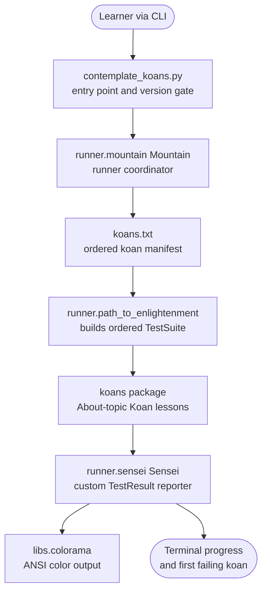

### 1.2.3 Success Criteria

Because the repository defines no numeric service-level agreements, business metrics, or performance targets, the criteria below are derived strictly from behavior observable in the code and configuration. They are expressed as concrete, verifiable outcomes rather than invented figures.

**Measurable Objectives.**

- *Learner objective:* complete the "Path to Enlightenment" — make every koan in `koans.txt` pass. When no failures remain, `runner/sensei.py` prints a colored completion banner referencing `about_extra_credit.py`; while any failure remains, the run terminates with `sys.exit(-1)`.
- *Engineering objective:* keep the runner framework correct and green. The Travis CI configuration (`.travis.yml`) runs `python _runner_tests.py` on Python 3.9, exercising the runner's own `unittest` suite in `runner/runner_tests/`.

**Critical Success Factors.**

- Tests that are intentionally failing (via the placeholder scaffold in `runner/koan.py`) so that progress requires genuine learning.
- Deterministic, ordered progression enforced by `koans.txt` and `sortTestMethodsUsing = None`, combined with the reporter surfacing only the first failing koan.
- Zero-setup runnability: standard-library `unittest` plus vendored `libs/`, so no external installation is required to start.
- Cross-platform launch paths (`run.sh`, `run.bat`) and a reproducible cloud workspace (`.gitpod.yml`, `.gitpod.Dockerfile`).

**Key Indicators (code-observable).** The table below lists the signals the system itself produces or that CI verifies; these stand in for KPIs, as no formal KPI targets exist in the repository.

| Indicator | Source | What It Signals |
|---|---|---|
| Process exit code (0 vs. -1) | `runner/sensei.py` `learn()` | Whether any koan still fails |
| Completed-koan progress count | `runner/sensei.py` | How far along the Path the learner is |
| Completion banner shown | `runner/sensei.py` | All koans solved (reaches `about_extra_credit.py`) |
| CI build status | `.travis.yml` + `_runner_tests.py` | Runner framework integrity on Python 3.9 |

## 1.3 Scope

This section defines what the Python Koans repository does and does not deliver, based solely on the artifacts present in the codebase. In-scope items are those directly implemented or configured in the repository; out-of-scope items are those explicitly excluded, absent, or unsupported.

### 1.3.1 In-Scope

**Core Features and Functionalities.** The must-have capabilities delivered by the repository are the interactive curriculum and the runner that executes it:

| Feature | Description | Primary Location |
|---|---|---|
| Interactive koan curriculum | 38 lesson modules (`About*.py`) covering the Python language surface, plus five "project" exercises requiring real implementations | `koans/` |
| Ordered suite execution | Loads and runs the 39 koan classes in `koans.txt` order into one `unittest.TestSuite` | `runner/path_to_enlightenment.py` |
| Learner-focused reporting | First-failure focus, colored progress, remaining-work counts, Zen messages, and a completion banner | `runner/sensei.py` |
| Selective run of a case/method | Run a whole test case or a single test via a command-line argument | `runner/mountain.py`, `Contributor Notes.txt` |
| Continuous testing (optional) | Sniffer re-runs the koans when a watched `.py` file changes | `scent.py` |

**Primary User Workflows.** The intended workflow, per `README.rst`, is the test-driven "red, green, refactor" loop: run the koans and observe the first failure (red), edit the relevant `koans/` lesson to make the test pass (green), then reflect and refine (refactor). Learners invoke the full curriculum with `python contemplate_koans.py` (or the `run.sh` / `run.bat` launchers), and may narrow execution to a single case or method as documented in `Contributor Notes.txt`.

**Essential Integrations and Technical Requirements.** The system depends on the Python 3 interpreter and its `unittest` module, the terminal for input/output, the vendored Colorama (`libs/colorama/`) for cross-platform colored output, and the vendored `mock` (`libs/mock.py`) for the runner's own tests. Optional developer-experience integrations include Sniffer (`scent.py`), Travis CI (`.travis.yml`, Python 3.9), and Gitpod/Eclipse Che workspaces (`.gitpod.yml`, `.gitpod.Dockerfile`). The key technical requirement is a Python 3 interpreter (version 3.7 or greater recommended, per the warning in `contemplate_koans.py`); no third-party packages are required at runtime.

**Implementation Boundaries.** The following table captures the boundaries of the system as implemented.

| Boundary Dimension | In-Scope Coverage |
|---|---|
| System boundary | A single, synchronous, local Python process exposed only as a CLI; reads `koans.txt` and lesson fixtures, writes colored progress to stdout |
| User groups | Individual learners (running/editing koans) and contributors/maintainers (evolving koans and the runner + its `runner/runner_tests/` suite) |
| Geographic / market coverage | Global, open-source distribution via GitHub; in-repository lesson content is in English |
| Data domains | Instructional content and small local fixtures only — the Python-topic curriculum, the "Greed" game spec (`koans/GREEDS_RULES.txt`), the `example_file.txt` text fixture, and the `koans/a_package_folder/` sample package |

The curriculum's instructional data domains span the core areas of the Python language, grouped below.

| Domain Group | Representative Koan Topics |
|---|---|
| Core syntax & values | asserts, none, true/false, strings, string manipulation, regex |
| Collections | lists, list assignments, tuples, dictionaries, sets, comprehensions |
| Control flow & functions | control statements, iteration, generators, lambdas, methods, method bindings, scope |
| Object orientation & modules | classes, class/instance attributes, attribute access, inheritance, multiple inheritance, monkey patching, `with` statements, deleting objects, decorators, modules, packages, exceptions |
| Implementation projects | triangle project (×2), scoring/"Greed" project, dice project, proxy object project, extra credit |

### 1.3.2 Out-of-Scope

**Explicitly Excluded Features and Capabilities.** The repository declares a Git submodule, `Submodule_01_Do_not_use_15Jun` (defined in `.gitmodules`), whose name marks it as "do not use." It is an unrelated collection and is **not** part of the Python Koans system, its curriculum, or its runtime; it is excluded from this specification and was not inspected. Beyond that explicit exclusion, the codebase contains no graphical, web, mobile, or IDE-embedded user interface — interaction is exclusively through the command line. There is likewise no persistence layer, database, network communication, authentication, authorization, or telemetry anywhere in the runner or curriculum.

**Integration Points Not Covered.** The system does not integrate with any learning-management system (LMS), grading service, cloud backend, analytics platform, or answer-verification service. Correctness is determined entirely locally by `unittest` assertions; learner "answers" are simply local file edits (the `.hgignore` file even lists an `answers` path to be ignored by version control), and there is no server-side submission, scoring, or credentialing.

**Unsupported Use Cases and Distribution.** The following are outside the repository's scope:

| Category | Out-of-Scope Detail |
|---|---|
| Python 2 execution | Explicitly rejected in `contemplate_koans.py` with a corrective message |
| Packaged distribution | No `setup.py`, `requirements.txt`, `pyproject.toml`, or other manifest — the koans are obtained by cloning or downloading the source, not installed from a package index |
| Assessment / certification | Not an exam, grading, or certification tool; there is no formal scoring of learner performance |
| Production library use | The `runner/` framework and `koans/` content are teaching artifacts, not a reusable production package |

**Future Phase Considerations.** The repository does not define a formal roadmap or enumerate future phases. The only forward-looking intent recorded in the codebase is the maintenance policy in `README.rst` to "keep current with the latest production version" of Python. Community translations are welcomed but are hosted in separate repositories (for example, the Brazilian-Portuguese fork referenced in `README.rst`) rather than delivered within this repository.

## 1.4 References

The following repository files and folders were examined and cited as evidence for this Introduction.

**Documentation**

- `README.rst` - Established the system purpose (interactive Python tutorial), its origin as a port of Edgecase's Ruby Koans, the fill-in/implement mechanics, the TDD framing, the Python 3 support policy, Sniffer usage, the Gitpod one-click install, acknowledgments, and maintainer/co-maintainer names.
- `Contributor Notes.txt` - Established the syntax for running a single test case or a single test method.

**Entry Point and Launchers**

- `contemplate_koans.py` - Established the CLI entry point, the Python 2 rejection and sub-3.7 warning, and delegation to `Mountain().walk_the_path(sys.argv)`.
- `run.sh` - Established the POSIX launcher (`python3 -B contemplate_koans.py`).
- `run.bat` - Established the interactive Windows launcher and its `PYTHON_PATH` default (`C:\Python311`).
- `scent.py` - Established the optional Sniffer continuous-testing integration and its watch paths.

**Runner Framework**

- `runner/` - Contained the koan execution framework package.
- `runner/mountain.py` - Established the runner coordinator (`Mountain`), suite loading, single-koan selection, and the `learn()` invocation.
- `runner/path_to_enlightenment.py` - Established the file-driven ordered suite construction from `koans.txt` (`KOANS_FILENAME`, `sortTestMethodsUsing = None`).
- `runner/sensei.py` - Established the custom `unittest.TestResult` reporter: first-failure focus, progress/remaining counts, Zen messages, completion banner, and `sys.exit(-1)` on remaining failures.
- `runner/koan.py` - Established the learner scaffold: the `Koan` base class and the placeholder constants `__`, `___`, `____`, `_____`.
- `runner/writeln_decorator.py` - Established the stdout stream wrapper (`WritelnDecorator`) used by the coordinator.
- `runner/runner_tests/` - Contained the framework's own `unittest` suite exercised by CI.
- `_runner_tests.py` - Established the runner-layer test entry point invoked by Travis CI.

**Curriculum and Fixtures**

- `koans.txt` - Established the ordered manifest of 39 koan test classes (38 distinct modules).
- `koans/` - Contained the 38 `About*.py` lessons, support modules, and the sample subpackage.
- `koans/GREEDS_RULES.txt` - Established the "Greed" dice-game specification backing the scoring project.
- `koans/a_package_folder/` - Contained the sample package used by the packages lesson.
- `example_file.txt` - Established the text fixture used by file-handling lessons.

**Support Libraries and Configuration**

- `libs/` - Contained the vendored third-party support libraries.
- `libs/mock.py` - Established the vendored legacy mocking utility (version `0.6.0 modified by Greg Malcolm`).
- `libs/colorama/` - Established the vendored Colorama package (`VERSION = '0.2.7'`) for colored output.
- `.travis.yml` - Established the CI configuration (Python 3.9, runs `python _runner_tests.py`, email notifications).
- `.gitpod.yml` - Established the Gitpod workspace task (`python contemplate_koans.py`) and prebuild settings.
- `.gitpod.Dockerfile` - Established the Gitpod image and dev tooling (`pytest==4.4.2`, `pytest-testdox`, `mock`).
- `.hgignore` - Established the legacy Mercurial ignore rules, including the ignored `answers` path.
- `.gitmodules` - Established the declared `Submodule_01_Do_not_use_15Jun` submodule, documented as explicitly out-of-scope.

# 2. Product Requirements

## 2.1 Feature Catalog

This section decomposes Python Koans into discrete, testable features derived directly from the repository's source code and configuration. The catalog reflects the system as it actually exists — a single, synchronous, local command-line educational program built on Python's standard-library `unittest` — rather than any aspirational roadmap. The primary capabilities and components summarized in Section 1.2 (System Overview) and the scope boundaries in Section 1.3 (Scope) are the authoritative framing for the features enumerated here.

**Identification and Versioning Conventions.** Features use the identifier format `F-XXX`; individual functional requirements (Section 2.2) use `F-XXX-RQ-YYY`. The repository defines no version tags, release manifest, or changelog that assigns per-feature versions; accordingly, every feature below is baselined at **v1.0**, representing the current observed state of the codebase. Where the repository lacks packaging metadata (there is no `setup.py`, `requirements.txt`, or `pyproject.toml`), that absence is treated as a factual constraint rather than a gap to be filled.

**Assumptions and Constraints (catalog-wide).**

| Assumption / Constraint | Evidence |
|---|---|
| The runtime is a single synchronous local process with no network, database, persistence, or concurrency | `runner/` modules use only `unittest`, `sys`, `io`, `os`, `glob`, `re` |
| Python 3 is required; 3.7+ is recommended | Version gate in `contemplate_koans.py` (lines 15, 21) |
| No third-party packages are required at runtime; the two external libraries are vendored | `libs/colorama/` (0.2.7), `libs/mock.py` (0.6.0) |
| No numeric SLAs, KPIs, or performance targets exist in the repository | No such values found in any source or config file |

**Feature Status.** All twelve catalogued features are marked **Completed**: each is present and operational in the current codebase, and the runner-layer features are additionally exercised by the `runner/runner_tests/` suite (Section 2.2, F-012). The status is a factual statement about the code as observed, not a projected milestone.

**Feature Overview and Prioritization.** The following table indexes every feature, its category, and its priority. Statuses are restated per feature in the metadata tables that follow.

| Feature ID | Feature Name | Category | Priority |
|---|---|---|---|
| F-001 | Version-Guarded CLI Entry Point | Application Bootstrap | Critical |
| F-002 | Ordered Curriculum Suite Construction | Test Orchestration | Critical |
| F-003 | Runner Coordination & Suite Execution | Test Orchestration | Critical |
| F-004 | Selective Koan Execution | Test Orchestration | Medium |
| F-005 | First-Failure Focused Feedback | Feedback & Reporting | Critical |
| F-006 | Progress Tracking & Motivational Reporting | Feedback & Reporting | High |
| F-007 | Colored Cross-Platform Terminal Output | Presentation / Output | Medium |
| F-008 | Learner Scaffold (Koan Base & Placeholders) | Learner Framework | Critical |
| F-009 | Interactive Koan Curriculum & Projects | Curriculum Content | Critical |
| F-010 | Optional Continuous Testing (Watch Mode) | Developer Experience | Low |
| F-011 | Cross-Platform Launch Scripts | Developer Experience | Medium |
| F-012 | Runner Self-Test Suite & Continuous Integration | Quality Assurance | High |

### 2.1.1 F-001 Version-Guarded CLI Entry Point

**Metadata**

| Attribute | Value |
|---|---|
| Unique ID | F-001 |
| Feature Name | Version-Guarded CLI Entry Point |
| Feature Category | Application Bootstrap |
| Priority Level | Critical |
| Status | Completed |

**Description**

| Dimension | Detail |
|---|---|
| Overview | `contemplate_koans.py` is the sole executable entry point. Under its `__main__` guard it verifies the running interpreter version, then hands control to the runner. |
| Business Value | Prevents confusing runtime errors by refusing/​warning on unsupported interpreters and provides a single, memorable launch command for the whole curriculum. |
| User Benefits | A learner runs one command to begin; if they use the wrong interpreter they receive an actionable message (`Try: python3 contemplate_koans.py`). |
| Technical Context | `sys.version_info < (3, 0)` prints a Python-2 corrective message and does not launch; `< (3, 7)` prints a compatibility WARNING banner and continues; supported versions execute `from runner.mountain import Mountain` and `Mountain().walk_the_path(sys.argv)`. |

**Dependencies**

| Dimension | Detail |
|---|---|
| Prerequisite Features | F-003 (Runner Coordination) — imported and invoked to perform the actual run |
| System Dependencies | Python 3 interpreter; standard-library `sys` |
| External Dependencies | None |
| Integration Requirements | Invoked by launch scripts (F-011), the watch runner (F-010, via `os.system`), and the Gitpod task in `.gitpod.yml` |

### 2.1.2 F-002 Ordered Curriculum Suite Construction

**Metadata**

| Attribute | Value |
|---|---|
| Unique ID | F-002 |
| Feature Name | Ordered Curriculum Suite Construction |
| Feature Category | Test Orchestration |
| Priority Level | Critical |
| Status | Completed |

**Description**

| Dimension | Detail |
|---|---|
| Overview | `runner/path_to_enlightenment.py` reads the `koans.txt` manifest and assembles a single `unittest.TestSuite` containing the koan classes in the exact declared order. |
| Business Value | Establishes a single source of truth for the curriculum sequence and a deterministic, curated learning order from basics to advanced topics. |
| User Benefits | Learners always progress through the same predictable ordering, so guidance and community references remain consistent. |
| Technical Context | `filter_koan_names` strips lines and skips blank/`#`-comment lines; `names_from_file` opens the manifest with `io.open(..., encoding='utf8')`; `koans_suite` sets `loader.sortTestMethodsUsing = None` to preserve method order and `loadTestsFromName` each fully qualified class; `koans()` composes the reader and builder with `KOANS_FILENAME = 'koans.txt'`. |

**Dependencies**

| Dimension | Detail |
|---|---|
| Prerequisite Features | F-008 (Koan scaffold that lessons subclass); F-009 (the curriculum modules that are loaded) |
| System Dependencies | Standard-library `unittest`, `io`; the `koans.txt` manifest file |
| External Dependencies | None |
| Integration Requirements | Consumed by F-003 (`Mountain`) to build the default suite and by F-005/F-006 (`Sensei`) which builds its own copy to compute totals |

### 2.1.3 F-003 Runner Coordination & Suite Execution

**Metadata**

| Attribute | Value |
|---|---|
| Unique ID | F-003 |
| Feature Name | Runner Coordination & Suite Execution |
| Feature Category | Test Orchestration |
| Priority Level | Critical |
| Status | Completed |

**Description**

| Dimension | Detail |
|---|---|
| Overview | `runner/mountain.py` defines `Mountain`, the thin coordinator that assembles the output stream, the default suite, and the custom reporter, then runs the suite and triggers reporting. |
| Business Value | Provides a single wiring point that binds together suite construction, execution, and reporting, keeping the entry point trivially small. |
| User Benefits | One invocation runs the entire curriculum and produces the learner-facing report. |
| Technical Context | `__init__` sets `self.stream = WritelnDecorator(sys.stdout)`, `self.tests = path_to_enlightenment.koans()`, and `self.lesson = Sensei(self.stream)`; `walk_the_path(args)` runs `self.tests(self.lesson)`, calls `self.lesson.learn()`, and returns the `Sensei` result. |

**Dependencies**

| Dimension | Detail |
|---|---|
| Prerequisite Features | F-002 (suite building); F-005 & F-006 (`Sensei` reporter); F-007 (`WritelnDecorator` stream) |
| System Dependencies | Standard-library `unittest`, `sys` |
| External Dependencies | None |
| Integration Requirements | Instantiated and invoked by F-001 (`contemplate_koans.py`) |

### 2.1.4 F-004 Selective Koan Execution

**Metadata**

| Attribute | Value |
|---|---|
| Unique ID | F-004 |
| Feature Name | Selective Koan Execution |
| Feature Category | Test Orchestration |
| Priority Level | Medium |
| Status | Completed |

**Description**

| Dimension | Detail |
|---|---|
| Overview | The runner can execute a single test case (module class) or a single test method instead of the full curriculum, selected by a command-line argument. |
| Business Value | Enables fast, focused iteration for contributors adding or modifying koans and for learners drilling into one lesson. |
| User Benefits | Avoids running the entire ordered suite when only one koan or method is under work. |
| Technical Context | In `walk_the_path`, when `args and len(args) >= 2`, the default suite is replaced by `unittest.TestLoader().loadTestsFromName("koans." + args[1])`. Usage is documented in `Contributor Notes.txt`, e.g. `python3 contemplate_koans.py about_strings` or `...about_strings.AboutStrings.test_...`. |

**Dependencies**

| Dimension | Detail |
|---|---|
| Prerequisite Features | F-003 (the `walk_the_path` method that hosts the selective branch) |
| System Dependencies | `unittest.TestLoader.loadTestsFromName` |
| External Dependencies | None |
| Integration Requirements | Argument is forwarded from F-001 via `sys.argv`; documented in `Contributor Notes.txt` |

### 2.1.5 F-005 First-Failure Focused Feedback

**Metadata**

| Attribute | Value |
|---|---|
| Unique ID | F-005 |
| Feature Name | First-Failure Focused Feedback |
| Feature Category | Feedback & Reporting |
| Priority Level | Critical |
| Status | Completed |

**Description**

| Dimension | Detail |
|---|---|
| Overview | The `Sensei` reporter surfaces only the single earliest failing koan, with a cleaned assertion message and a traceback trimmed to koan source frames. |
| Business Value | Implements the core one-problem-at-a-time pedagogy that differentiates the koans format from a standard test runner dump. |
| User Benefits | Learners see exactly the next file and line to fix, without being overwhelmed by many simultaneous failures. |
| Technical Context | `addError` funnels into `addFailure` so errors and failures share one ordered list; `sortFailures` extracts source line numbers via the regex `(?<= line )\d+` and sorts; `firstFailure` returns the lowest-line failure of the first failing class; `errorReport` prints the "has damaged your karma" heading plus `scrapeAssertionError` output and `scrapeInterestingStackDump` (which keeps only frames whose path contains `/koans/` and colorizes `about_*.py` and `line N`). |

**Dependencies**

| Dimension | Detail |
|---|---|
| Prerequisite Features | F-008 (scaffold placeholders produce the failures); F-002 (suite context); F-007 (color output) |
| System Dependencies | `unittest.TestResult`, standard-library `re` |
| External Dependencies | None |
| Integration Requirements | Uses `runner/helper.py` `cls_name`; subclasses `MockableTestResult` (`runner/mockable_test_result.py`) |

### 2.1.6 F-006 Progress Tracking & Motivational Reporting

**Metadata**

| Attribute | Value |
|---|---|
| Unique ID | F-006 |
| Feature Name | Progress Tracking & Motivational Reporting |
| Feature Category | Feedback & Reporting |
| Priority Level | High |
| Status | Completed |

**Description**

| Dimension | Detail |
|---|---|
| Overview | Beyond first-failure diagnostics, `Sensei` prints per-class "Thinking" headings, success acknowledgements, completed/remaining koan and lesson counts, a rotating Zen message, and a completion banner, and it controls the process exit code. |
| Business Value | Provides measurable progress signals and motivational feedback that sustain engagement through a long curriculum. |
| User Benefits | Learners see how far they have advanced, what remains, and a clear "done" state when all koans pass. |
| Technical Context | `startTest` prints `Thinking <Class>` and increments `lesson_pass_count` (except for `AboutAsserts` and `AboutExtraCredit`); `addSuccess` prints "has expanded your awareness" and increments `pass_count`; `report_progress` computes percentage as `pass_count*100//total_koans()` (integer division); `say_something_zenlike` rotates 37 Zen-of-Python messages by `pass_count % 37` while failures remain, else returns the completion message; `learn` calls `sys.exit(-1)` while any koan fails, otherwise prints the "That was the last one, well done!" banner referencing `about_extra_credit.py`. |

**Dependencies**

| Dimension | Detail |
|---|---|
| Prerequisite Features | F-005 (same `Sensei` class); F-002 (`total_koans`/`total_lessons` derive from the suite and lesson glob) |
| System Dependencies | Standard-library `unittest`, `sys`, `os`, `glob` |
| External Dependencies | None |
| Integration Requirements | Renders through F-007 color codes; `filter_all_lessons` globs `../koans/about*.py` (excluding `about_extra_credit`) |

### 2.1.7 F-007 Colored Cross-Platform Terminal Output

**Metadata**

| Attribute | Value |
|---|---|
| Unique ID | F-007 |
| Feature Name | Colored Cross-Platform Terminal Output |
| Feature Category | Presentation / Output |
| Priority Level | Medium |
| Status | Completed |

**Description**

| Dimension | Detail |
|---|---|
| Overview | Colored console output is provided by the vendored Colorama library and a small stream decorator that adds a `writeln` convenience method. |
| Business Value | Makes feedback readable and engaging on POSIX and Windows terminals without requiring any external installation. |
| User Benefits | Diagnostics highlight the failing file and line in color; success and Zen messages are visually distinct. |
| Technical Context | `runner/sensei.py` imports `init, Fore, Style` from `libs.colorama` and calls `init()`; `runner/writeln_decorator.py` `WritelnDecorator` wraps a stream, delegates attributes via `__getattr__`, and `writeln(arg)` writes the argument (if truthy) followed by a newline. Colorama is vendored at `VERSION = '0.2.7'`. |

**Dependencies**

| Dimension | Detail |
|---|---|
| Prerequisite Features | None |
| System Dependencies | `sys.stdout` (the wrapped stream) |
| External Dependencies | Vendored `libs/colorama/` (0.2.7) — no external installation required |
| Integration Requirements | Consumed by F-005/F-006 (`Sensei`) and by F-003 (`Mountain` wraps `sys.stdout`) |

### 2.1.8 F-008 Learner Scaffold (Koan Base & Placeholders)

**Metadata**

| Attribute | Value |
|---|---|
| Unique ID | F-008 |
| Feature Name | Learner Scaffold (Koan Base & Placeholders) |
| Feature Category | Learner Framework |
| Priority Level | Critical |
| Status | Completed |

**Description**

| Dimension | Detail |
|---|---|
| Overview | `runner/koan.py` provides the `Koan` base class and the "fill me in" placeholder constants that all lessons import and use. |
| Business Value | Standardizes lesson authoring on a single API and encodes the pedagogy: placeholders create intentional failures that only genuine learning resolves. |
| User Benefits | A consistent "fill in the blank" idiom across every lesson makes expectations obvious. |
| Technical Context | `__all__ = ["__", "___", "____", "_____", "Koan"]`; `__ = "-=> FILL ME IN! <=-"`, `____ = "-=> TRUE OR FALSE? <=-"`, `_____ = 0`, `___` is an empty `Exception` subclass, and `Koan` is an empty `unittest.TestCase` subclass. `runner/helper.py` `cls_name(obj)` supports class-name introspection used by the reporter. |

**Dependencies**

| Dimension | Detail |
|---|---|
| Prerequisite Features | None (foundational) |
| System Dependencies | Standard-library `unittest` |
| External Dependencies | None |
| Integration Requirements | Imported by every `koans/` lesson via `from runner.koan import *` |

### 2.1.9 F-009 Interactive Koan Curriculum & Projects

**Metadata**

| Attribute | Value |
|---|---|
| Unique ID | F-009 |
| Feature Name | Interactive Koan Curriculum & Projects |
| Feature Category | Curriculum Content |
| Priority Level | Critical |
| Status | Completed |

**Description**

| Dimension | Detail |
|---|---|
| Overview | The `koans/` package is the educational product: 38 `About*` lesson modules (39 test classes; the proxy module supplies two) covering the Python language surface, plus five implementation "project" exercises. |
| Business Value | This is the actual content that delivers the tutorial's value — a structured, hands-on Python curriculum that also teaches a taste of TDD. |
| User Benefits | Broad coverage (syntax, collections, control flow, functions, OO, modules/packages, exceptions, regex) with two fix styles: filling placeholders and implementing real code. |
| Technical Context | Lessons subclass `Koan` and expose `test_*` methods. Fill-in style example: `self.assertEqual(__, 1 + 1)` in `about_asserts.py`. Implementation style example: `koans/triangle.py` `def triangle(a, b, c): pass` must be written so `about_triangle_project.py` passes ('equilateral'/'isosceles'/'scalene'). Projects: triangle (×2), scoring/"Greed" (`koans/GREEDS_RULES.txt`), dice, and proxy object. Content uses standard-library `re`, `math`, `functools`, `random`, the `example_file.txt` fixture, and the `koans/a_package_folder/` sample package. |

**Dependencies**

| Dimension | Detail |
|---|---|
| Prerequisite Features | F-008 (the `Koan` base class and placeholders the lessons import) |
| System Dependencies | Standard-library `unittest` and topic modules (`re`, `math`, `functools`, `random`); the `koans.txt` manifest enumerates each class |
| External Dependencies | None |
| Integration Requirements | Loaded by F-002 in `koans.txt` order; learner edits are the "answers" (the `.hgignore` even lists an `answers` path) |

### 2.1.10 F-010 Optional Continuous Testing (Watch Mode)

**Metadata**

| Attribute | Value |
|---|---|
| Unique ID | F-010 |
| Feature Name | Optional Continuous Testing (Watch Mode) |
| Feature Category | Developer Experience |
| Priority Level | Low |
| Status | Completed |

**Description**

| Dimension | Detail |
|---|---|
| Overview | `scent.py` integrates the third-party Sniffer tool to automatically re-run the koans whenever a watched Python file changes. |
| Business Value | Tightens the edit-run feedback loop, reinforcing the red-green-refactor rhythm without manual re-invocation. |
| User Benefits | Saving an edited koan triggers an automatic re-run, giving near-immediate feedback. |
| Technical Context | `watch_paths = ['.', 'koans/']`; the `@file_validator` `py_files` accepts non-hidden `.py` files; the `@runnable` `execute_koans` calls `os.system('python3 -B contemplate_koans.py')`. |

**Dependencies**

| Dimension | Detail |
|---|---|
| Prerequisite Features | F-001 (the entry point the watcher invokes) |
| System Dependencies | `os.system`; a Python 3 interpreter on the path |
| External Dependencies | Sniffer (installed via `pip`), plus a filesystem-event backend — `pyinotify` (Linux), `pywin32` (Windows), or `MacFSEvents` (macOS); none are vendored |
| Integration Requirements | The `sniffer` CLI discovers and executes `scent.py`; documented under "Sniffer Support" in `README.rst` |

### 2.1.11 F-011 Cross-Platform Launch Scripts

**Metadata**

| Attribute | Value |
|---|---|
| Unique ID | F-011 |
| Feature Name | Cross-Platform Launch Scripts |
| Feature Category | Developer Experience |
| Priority Level | Medium |
| Status | Completed |

**Description**

| Dimension | Detail |
|---|---|
| Overview | Two convenience launchers wrap the entry point: `run.sh` for POSIX shells and `run.bat` for Windows command prompt. |
| Business Value | Lowers the barrier to launching on any OS and provides an interactive re-run loop on Windows. |
| User Benefits | Learners need not remember the exact command; `run.bat` also hunts for the interpreter and offers "Test again?". |
| Technical Context | `run.sh` is `#!/bin/sh` then `python3 -B contemplate_koans.py`. `run.bat` sets `RUN_KOANS=python.exe -B contemplate_koans.py` and `PYTHON_PATH=C:\Python311`, searches for `python.exe` on `PATH`/`%PYTHON_PATH%`/`%PYTHON%`, runs and `pause`s, and prompts `Test again? y or n`. (Note: `README.rst` suggests `C:\Python39`, a minor documentation drift.) |

**Dependencies**

| Dimension | Detail |
|---|---|
| Prerequisite Features | F-001 (the entry point being launched) |
| System Dependencies | `/bin/sh` (POSIX) or `cmd.exe` (Windows); a Python 3 interpreter (`python3` / `python.exe`) |
| External Dependencies | None |
| Integration Requirements | Both scripts invoke `contemplate_koans.py`; neither is strictly required (`run.bat` comments note "You don't actually need this script!") |

### 2.1.12 F-012 Runner Self-Test Suite & Continuous Integration

**Metadata**

| Attribute | Value |
|---|---|
| Unique ID | F-012 |
| Feature Name | Runner Self-Test Suite & Continuous Integration |
| Feature Category | Quality Assurance |
| Priority Level | High |
| Status | Completed |

**Description**

| Dimension | Detail |
|---|---|
| Overview | The framework validates itself through `_runner_tests.py` and the `runner/runner_tests/` package, and this suite is run in CI (Travis) and available in a Gitpod cloud workspace. |
| Business Value | Protects the runner (the code learners depend on but do not edit) against regressions as koans and the framework evolve. |
| User Benefits | Contributors gain confidence that changes to `runner/` or the curriculum do not break the execution/reporting engine. |
| Technical Context | `_runner_tests.py` `suite()` loads `TestMountain`, `TestSensei`, `TestHelper`, `TestFilterKoanNames`, and `TestKoansSuite`, runs at verbosity 2, and exits non-zero on failure (`sys.exit(not res.wasSuccessful())`). Tests use the vendored `libs/mock.py` for patching. `.travis.yml` runs `python _runner_tests.py` on Python 3.9; `.gitpod.yml`/`.gitpod.Dockerfile` provide a one-click workspace. |

**Dependencies**

| Dimension | Detail |
|---|---|
| Prerequisite Features | F-002, F-003, F-005, F-006, F-008 (the modules exercised by the tests) |
| System Dependencies | Standard-library `unittest` |
| External Dependencies | Vendored `libs/mock.py` (0.6.0); Travis CI; Gitpod (which additionally `pip3 install`s `pytest==4.4.2`, `pytest-testdox`, `mock`) |
| Integration Requirements | CI configured in `.travis.yml`; cloud workspace in `.gitpod.yml` and `.gitpod.Dockerfile` |

## 2.2 Functional Requirements

Each feature from Section 2.1 is expanded here into testable functional requirements. Requirement identifiers follow the `F-XXX-RQ-YYY` convention. To respect the four-column limit while capturing every prescribed attribute, each feature is documented with four tables: **Requirement Details** (ID, Description, Priority, Complexity), **Acceptance Criteria** (ID, criteria), **Technical Specifications** (Input Parameters, Output/Response, Performance Criteria, Data Requirements), and **Validation Rules** (Business Rules, Data Validation, Security, Compliance). Priorities use MoSCoW values (Must-Have/Should-Have/Could-Have); complexity is rated High/Medium/Low. Because the repository declares no numeric performance targets, performance criteria are stated qualitatively from observed behavior. Many acceptance criteria are directly verifiable by the existing `runner/runner_tests/` suite (see F-012).

### 2.2.1 F-001 Version-Guarded CLI Entry Point

**Requirement Details**

| Requirement ID | Description | Priority | Complexity |
|---|---|---|---|
| F-001-RQ-001 | Reject Python 2 execution with corrective guidance and do not launch the runner | Must-Have | Low |
| F-001-RQ-002 | Warn on Python 3.0–3.6 but continue execution | Should-Have | Low |
| F-001-RQ-003 | Launch the runner on supported versions, forwarding `sys.argv` | Must-Have | Low |

**Acceptance Criteria**

| Requirement ID | Acceptance Criteria |
|---|---|
| F-001-RQ-001 | When `sys.version_info < (3, 0)`, output includes the instruction `python3 contemplate_koans.py` and `Mountain` is never imported/invoked |
| F-001-RQ-002 | When `(3,0) <= version < (3,7)`, the WARNING banner is printed and control proceeds to the runner |
| F-001-RQ-003 | When `version >= (3,7)`, `Mountain().walk_the_path(sys.argv)` is invoked |

**Technical Specifications**

| Aspect | Specification |
|---|---|
| Input Parameters | Process invocation; `sys.version_info`; `sys.argv` |
| Output/Response | Console messages (Python-2 message or warning banner) or delegation to the runner |
| Performance Criteria | Constant-time version comparison; negligible startup overhead |
| Data Requirements | None persisted; reads interpreter version only |

**Validation Rules**

| Aspect | Rule |
|---|---|
| Business Rules | Python-3-only policy; Python 2 is explicitly unsupported |
| Data Validation | Tuple comparison of `sys.version_info` against `(3,0)` and `(3,7)` |
| Security | Local process only; no external or untrusted input consumed |
| Compliance | None defined in the repository |

### 2.2.2 F-002 Ordered Curriculum Suite Construction

**Requirement Details**

| Requirement ID | Description | Priority | Complexity |
|---|---|---|---|
| F-002-RQ-001 | Parse the manifest, ignoring comment (`#`) and blank lines | Must-Have | Low |
| F-002-RQ-002 | Build a single `TestSuite` preserving the declared class order | Must-Have | Medium |
| F-002-RQ-003 | Read the manifest as UTF-8 from `KOANS_FILENAME` (`koans.txt`) | Should-Have | Low |

**Acceptance Criteria**

| Requirement ID | Acceptance Criteria |
|---|---|
| F-002-RQ-001 | `filter_koan_names` excludes `#`-prefixed and blank lines and yields remaining names in order (verified by `TestFilterKoanNames`) |
| F-002-RQ-002 | `koans_suite` returns a `unittest.TestSuite`; loading three names yields classes resolving to `AboutAsserts`, `AboutNone`, `AboutStrings` (verified by `TestKoansSuite`); `sortTestMethodsUsing` is set to `None` |
| F-002-RQ-003 | `names_from_file` opens `koans.txt` with `encoding='utf8'`; file/discovery errors propagate rather than being silently swallowed |

**Technical Specifications**

| Aspect | Specification |
|---|---|
| Input Parameters | `filename` (defaults to `koans.txt`); manifest text lines |
| Output/Response | A `unittest.TestSuite` populated in manifest order |
| Performance Criteria | Linear in the number of manifest entries (39 lines) |
| Data Requirements | `koans.txt` manifest file present in the working directory |

**Validation Rules**

| Aspect | Rule |
|---|---|
| Business Rules | The manifest is the authoritative curriculum order |
| Data Validation | Each line stripped; `#`-comment and blank lines skipped |
| Security | Reads a local repository file only; no network access |
| Compliance | None defined in the repository |

### 2.2.3 F-003 Runner Coordination & Suite Execution

**Requirement Details**

| Requirement ID | Description | Priority | Complexity |
|---|---|---|---|
| F-003-RQ-001 | Assemble the output stream, default suite, and reporter on construction | Must-Have | Low |
| F-003-RQ-002 | Execute the suite against `Sensei` and trigger `learn()` reporting | Must-Have | Medium |

**Acceptance Criteria**

| Requirement ID | Acceptance Criteria |
|---|---|
| F-003-RQ-001 | Constructing `Mountain()` yields `stream` = `WritelnDecorator`, `tests` from `path_to_enlightenment.koans()`, and `lesson` = `Sensei` |
| F-003-RQ-002 | `walk_the_path()` runs the suite and calls `lesson.learn()` (verified by `TestMountain` asserting `mountain.lesson.learn.called`); the `Sensei` result is returned |

**Technical Specifications**

| Aspect | Specification |
|---|---|
| Input Parameters | Optional `args` list (typically `sys.argv`) |
| Output/Response | Returns the `Sensei` result object; side-effect is console reporting |
| Performance Criteria | Bounded by the number of test cases in the suite |
| Data Requirements | None persisted; depends on F-002 for suite content |

**Validation Rules**

| Aspect | Rule |
|---|---|
| Business Rules | Full curriculum runs by default when no selective argument is provided |
| Data Validation | Guarded by `if args and len(args) >= 2` before overriding the suite |
| Security | Local, in-process orchestration only |
| Compliance | None defined in the repository |

### 2.2.4 F-004 Selective Koan Execution

**Requirement Details**

| Requirement ID | Description | Priority | Complexity |
|---|---|---|---|
| F-004-RQ-001 | Run a single test case or single test method from a CLI argument | Should-Have | Medium |
| F-004-RQ-002 | Default to the full curriculum when no selective argument is supplied | Must-Have | Low |

**Acceptance Criteria**

| Requirement ID | Acceptance Criteria |
|---|---|
| F-004-RQ-001 | With `len(args) >= 2`, the suite becomes `loadTestsFromName("koans." + args[1])`; `about_strings` runs the case and `about_strings.AboutStrings.test_...` runs one method (per `Contributor Notes.txt`) |
| F-004-RQ-002 | With no extra argument, the `koans.txt`-built suite is executed unchanged |

**Technical Specifications**

| Aspect | Specification |
|---|---|
| Input Parameters | `args[1]` — a dotted module/class/method name under `koans.` |
| Output/Response | Execution and reporting scoped to the selected case/method |
| Performance Criteria | Proportional to the selected subset (faster than a full run) |
| Data Requirements | None; resolves against importable `koans/` modules |

**Validation Rules**

| Aspect | Rule |
|---|---|
| Business Rules | Documented contributor/learner workflow in `Contributor Notes.txt` |
| Data Validation | `len(args) >= 2` guard; unresolved names raise loader errors that propagate |
| Security | Local module resolution only |
| Compliance | None defined in the repository |

### 2.2.5 F-005 First-Failure Focused Feedback

**Requirement Details**

| Requirement ID | Description | Priority | Complexity |
|---|---|---|---|
| F-005-RQ-001 | Report only the single first failing koan | Must-Have | High |
| F-005-RQ-002 | Order candidate failures by source line number within the first failing class | Must-Have | Medium |
| F-005-RQ-003 | Trim the traceback to koan frames and colorize file/line references | Should-Have | Medium |

**Acceptance Criteria**

| Requirement ID | Acceptance Criteria |
|---|---|
| F-005-RQ-001 | `firstFailure` returns the lowest-line failure of the first failing class; only that koan's diagnostics are emitted by `errorReport` |
| F-005-RQ-002 | `sortFailures` extracts line numbers via `(?<= line )\d+`, sorts ascending, and excludes irrelevant/malformed entries (verified by `TestSensei` sort cases) |
| F-005-RQ-003 | `scrapeInterestingStackDump` retains only frames whose path contains `/koans/` and colorizes `about_*.py` and `line N` |

**Technical Specifications**

| Aspect | Specification |
|---|---|
| Input Parameters | Accumulated `(test, err)` failure records where `err` is a traceback string |
| Output/Response | A cleaned assertion segment plus a focused, colorized stack excerpt |
| Performance Criteria | Linear in the number of failures and traceback lines |
| Data Requirements | In-memory only; no persistence |

**Validation Rules**

| Aspect | Rule |
|---|---|
| Business Rules | One-problem-at-a-time: surface only the earliest failure |
| Data Validation | Regex parsing with guards for empty `err`; non-matching lines skipped |
| Security | Operates on locally generated strings only |
| Compliance | None defined in the repository |

### 2.2.6 F-006 Progress Tracking & Motivational Reporting

**Requirement Details**

| Requirement ID | Description | Priority | Complexity |
|---|---|---|---|
| F-006-RQ-001 | Print per-class "Thinking" headings and per-test success acknowledgements | Should-Have | Low |
| F-006-RQ-002 | Report completed and remaining koan/lesson counts with a percentage | Must-Have | Medium |
| F-006-RQ-003 | Emit a Zen message and control exit code / completion banner | Must-Have | Medium |

**Acceptance Criteria**

| Requirement ID | Acceptance Criteria |
|---|---|
| F-006-RQ-001 | A newly encountered class prints `Thinking <Class>`; a passing test prints "has expanded your awareness" and increments `pass_count` |
| F-006-RQ-002 | `report_progress` prints completed koans, percentage `pass_count*100//total_koans()`, and lessons out of `total_lessons()`; `report_remaining` shows remaining counts when failures exist |
| F-006-RQ-003 | While failures remain, a Zen message (index `pass_count % 37`) is printed and the process exits with `-1`; on full success the completion banner referencing `about_extra_credit.py` prints and the process exits normally |

**Technical Specifications**

| Aspect | Specification |
|---|---|
| Input Parameters | `pass_count`, `lesson_pass_count`, suite case count, lesson-file glob |
| Output/Response | Console progress text, Zen message, banner; process exit code |
| Performance Criteria | Constant/linear; a single glob of `koans/about*.py` (cached) |
| Data Requirements | `koans/about*.py` file listing for lesson totals |

**Validation Rules**

| Aspect | Rule |
|---|---|
| Business Rules | Lesson counting excludes `AboutAsserts` and `AboutExtraCredit`; `total_lessons` excludes `about_extra_credit` |
| Data Validation | Guards for empty lesson list (`total_lessons` returns 0) |
| Security | Local stdout only |
| Compliance | None defined in the repository |

### 2.2.7 F-007 Colored Cross-Platform Terminal Output

**Requirement Details**

| Requirement ID | Description | Priority | Complexity |
|---|---|---|---|
| F-007-RQ-001 | Initialize and apply ANSI colors, working cross-platform including Windows | Should-Have | Low |
| F-007-RQ-002 | Provide a `writeln` convenience method on the output stream | Must-Have | Low |

**Acceptance Criteria**

| Requirement ID | Acceptance Criteria |
|---|---|
| F-007-RQ-001 | `runner/sensei.py` calls Colorama `init()`; `Fore`/`Style` codes are applied to headings and diagnostics; Colorama (0.2.7) provides Windows console translation |
| F-007-RQ-002 | `WritelnDecorator.writeln(arg)` writes `arg` when truthy then a newline; unknown attribute access delegates to the wrapped stream via `__getattr__` |

**Technical Specifications**

| Aspect | Specification |
|---|---|
| Input Parameters | Strings to write; the wrapped `sys.stdout` stream |
| Output/Response | Text written to stdout with embedded ANSI color codes |
| Performance Criteria | Negligible per-write overhead |
| Data Requirements | None |

**Validation Rules**

| Aspect | Rule |
|---|---|
| Business Rules | Feedback should be readable and visually differentiated |
| Data Validation | `writeln` writes its argument only when truthy |
| Security | Local stdout; no external I/O |
| Compliance | None defined in the repository |

### 2.2.8 F-008 Learner Scaffold (Koan Base & Placeholders)

**Requirement Details**

| Requirement ID | Description | Priority | Complexity |
|---|---|---|---|
| F-008-RQ-001 | Expose a `Koan` base class for lessons to subclass | Must-Have | Low |
| F-008-RQ-002 | Expose fill-in placeholder constants used to force intentional failures | Must-Have | Low |

**Acceptance Criteria**

| Requirement ID | Acceptance Criteria |
|---|---|
| F-008-RQ-001 | `Koan` is a `unittest.TestCase` subclass importable via `from runner.koan import *` |
| F-008-RQ-002 | `__`, `___`, `____`, `_____` are exported with their documented values (`"-=> FILL ME IN! <=-"`, an `Exception` subclass, `"-=> TRUE OR FALSE? <=-"`, `0`) |

**Technical Specifications**

| Aspect | Specification |
|---|---|
| Input Parameters | None (module import) |
| Output/Response | Importable names via `__all__` |
| Performance Criteria | Import-time only; negligible |
| Data Requirements | None |

**Validation Rules**

| Aspect | Rule |
|---|---|
| Business Rules | Placeholders must not equal the expected answers, guaranteeing initial failure |
| Data Validation | Not applicable (static constants and empty classes) |
| Security | None (no runtime input) |
| Compliance | None defined in the repository |

### 2.2.9 F-009 Interactive Koan Curriculum & Projects

**Requirement Details**

| Requirement ID | Description | Priority | Complexity |
|---|---|---|---|
| F-009-RQ-001 | Provide ordered lessons covering the Python language surface | Must-Have | High |
| F-009-RQ-002 | Provide implementation projects that require the learner to write real code | Must-Have | Medium |
| F-009-RQ-003 | Depend only on standard-library topic modules and local fixtures | Should-Have | Low |

**Acceptance Criteria**

| Requirement ID | Acceptance Criteria |
|---|---|
| F-009-RQ-001 | The 38 `About*` modules (39 classes) enumerated in `koans.txt` load and run, spanning the domain groups in Section 1.3 |
| F-009-RQ-002 | Triangle (×2), scoring/"Greed", dice, and proxy projects require implementation — e.g., `triangle(a,b,c)` must return `'equilateral'`/`'isosceles'`/`'scalene'` for `about_triangle_project.py` to pass |
| F-009-RQ-003 | Lessons import only `re`, `math`, `functools`, `random` and read `example_file.txt` / `a_package_folder`; no third-party imports appear |

**Technical Specifications**

| Aspect | Specification |
|---|---|
| Input Parameters | Learner edits to lesson files (filling placeholders / implementing code) |
| Output/Response | Pass/fail outcome per `test_*` method under `unittest` |
| Performance Criteria | Fast, in-memory unit tests |
| Data Requirements | `koans/*.py`, `koans/GREEDS_RULES.txt`, `example_file.txt`, `koans/a_package_folder/` |

**Validation Rules**

| Aspect | Rule |
|---|---|
| Business Rules | Two fix styles supported: fill placeholder or implement code |
| Data Validation | Correctness enforced by `unittest` assertions |
| Security | Learner "answers" are local file edits only; no submission/upload |
| Compliance | None defined in the repository |

### 2.2.10 F-010 Optional Continuous Testing (Watch Mode)

**Requirement Details**

| Requirement ID | Description | Priority | Complexity |
|---|---|---|---|
| F-010-RQ-001 | Re-run the koans when a watched Python file changes | Could-Have | Low |
| F-010-RQ-002 | Validate which files trigger a re-run | Could-Have | Low |

**Acceptance Criteria**

| Requirement ID | Acceptance Criteria |
|---|---|
| F-010-RQ-001 | With Sniffer installed, editing a qualifying `.py` file under `['.', 'koans/']` triggers `execute_koans`, which runs `python3 -B contemplate_koans.py` |
| F-010-RQ-002 | `py_files` returns `True` only for files ending in `.py` whose basename does not start with `.` |

**Technical Specifications**

| Aspect | Specification |
|---|---|
| Input Parameters | Filesystem change events surfaced by Sniffer |
| Output/Response | A subprocess run of the entry point |
| Performance Criteria | Depends on the event backend (native events vs. polling) |
| Data Requirements | None |

**Validation Rules**

| Aspect | Rule |
|---|---|
| Business Rules | Optional developer-experience convenience; not required to use the koans |
| Data Validation | Extension check plus hidden-file exclusion in `py_files` |
| Security | Executes a local command via `os.system` |
| Compliance | None defined in the repository |

### 2.2.11 F-011 Cross-Platform Launch Scripts

**Requirement Details**

| Requirement ID | Description | Priority | Complexity |
|---|---|---|---|
| F-011-RQ-001 | Provide a POSIX launcher that runs the entry point | Should-Have | Low |
| F-011-RQ-002 | Provide a Windows launcher that locates the interpreter and offers re-run | Should-Have | Low |

**Acceptance Criteria**

| Requirement ID | Acceptance Criteria |
|---|---|
| F-011-RQ-001 | `run.sh` executes `python3 -B contemplate_koans.py` |
| F-011-RQ-002 | `run.bat` locates `python.exe` on `PATH`, `%PYTHON_PATH%`, or `%PYTHON%`, runs the koans, and re-runs the loop on input `y` |

**Technical Specifications**

| Aspect | Specification |
|---|---|
| Input Parameters | Shell invocation; on Windows, the `Test again? y or n` prompt |
| Output/Response | Execution of the CLI entry point |
| Performance Criteria | Negligible launcher overhead |
| Data Requirements | None |

**Validation Rules**

| Aspect | Rule |
|---|---|
| Business Rules | Convenience only — running `python contemplate_koans.py` directly is equivalent |
| Data Validation | `run.bat` performs `IF EXIST` checks for the interpreter |
| Security | Local process execution |
| Compliance | None defined in the repository |

### 2.2.12 F-012 Runner Self-Test Suite & Continuous Integration

**Requirement Details**

| Requirement ID | Description | Priority | Complexity |
|---|---|---|---|
| F-012-RQ-001 | Aggregate and run the runner-layer unit tests, exiting non-zero on failure | Must-Have | Medium |
| F-012-RQ-002 | Run the self-test suite in CI on Python 3.9 | Should-Have | Low |
| F-012-RQ-003 | Support mocking/patching without any external installation | Should-Have | Medium |

**Acceptance Criteria**

| Requirement ID | Acceptance Criteria |
|---|---|
| F-012-RQ-001 | `_runner_tests.py` `suite()` includes `TestMountain`, `TestSensei`, `TestHelper`, `TestFilterKoanNames`, `TestKoansSuite`; a failing test yields `sys.exit(not res.wasSuccessful())` (non-zero) |
| F-012-RQ-002 | `.travis.yml` `script` is `python _runner_tests.py` under Python `3.9` |
| F-012-RQ-003 | Tests import `Mock`/`patch`/`patch_object` from vendored `libs.mock` (no `pip install` required) |

**Technical Specifications**

| Aspect | Specification |
|---|---|
| Input Parameters | Test discovery of the five runner-test `TestCase`s |
| Output/Response | `unittest` results at verbosity 2 and a process exit code |
| Performance Criteria | Fast — in-memory fixtures and mocks; no I/O or network |
| Data Requirements | In-memory `io.StringIO` streams and traceback fixture strings |

**Validation Rules**

| Aspect | Rule |
|---|---|
| Business Rules | The runner framework must remain green as koans/framework evolve |
| Data Validation | Assertions in each `TestCase` |
| Security | Local test execution only |
| Compliance | None defined in the repository |

## 2.3 Feature Relationships

The relationships below are drawn strictly from observed imports and calls in the codebase; no relationship is inferred beyond what the source demonstrates. The runtime execution sequence that these relationships serve is depicted in the flowchart in Section 1.2.2 (System Overview → High-Level Description); the map here is the complementary *feature-dependency* view.

### 2.3.1 Feature Dependency Map

In the diagram, an arrow **A → B** reads "feature A depends on / invokes feature B."

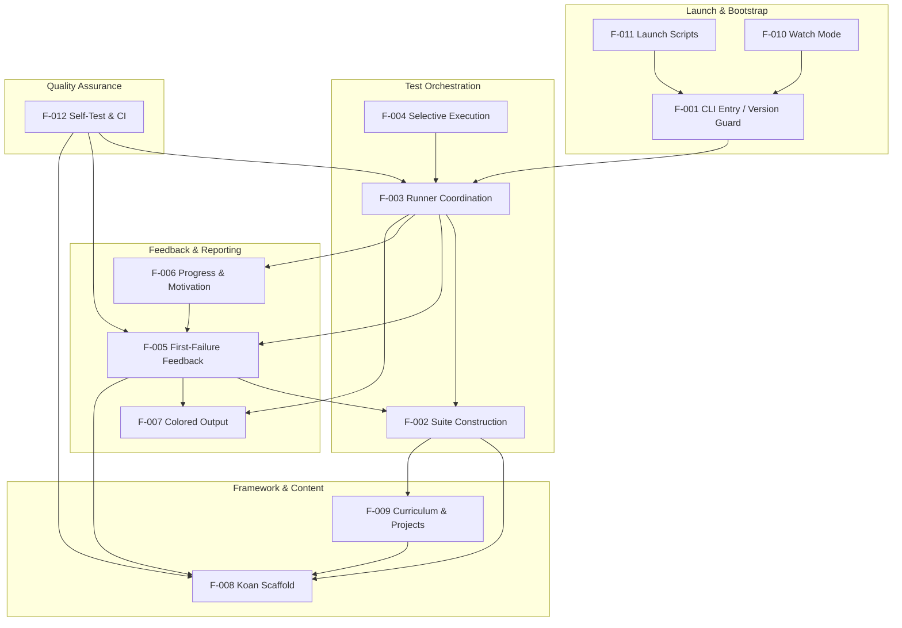

Key chains evidenced in code: the launch surfaces (F-011, F-010) invoke the entry point (F-001), which constructs the coordinator (F-003); the coordinator wires together suite construction (F-002), the reporter (F-005/F-006), and the output stream (F-007); the reporter and suite both rest on the learner scaffold (F-008), which the curriculum (F-009) also consumes; and the self-test suite (F-012) exercises the runner-layer features.

### 2.3.2 Integration Points

These are the external or boundary integration surfaces observed in the repository, mapped to the features that use them.

| Integration Point | Mechanism | Related Features |
|---|---|---|
| Python 3 interpreter & `unittest` | Standard library | F-001, F-002, F-003, F-005, F-006, F-012 |
| Terminal / stdout | `WritelnDecorator` over `sys.stdout` + Colorama | F-007, F-006, F-005 |
| Command-line argument | `sys.argv` → `walk_the_path` | F-001, F-004 |
| `koans.txt` manifest | UTF-8 file read | F-002 |
| Sniffer (optional) | `scent.py` `watch_paths` + `os.system` | F-010 |
| Travis CI | `.travis.yml` runs `python _runner_tests.py` (Python 3.9) | F-012 |
| Gitpod / Eclipse Che | `.gitpod.yml`, `.gitpod.Dockerfile` | F-012 |
| Vendored Colorama 0.2.7 | `from libs.colorama import init, Fore, Style` | F-007 |
| Vendored `mock` 0.6.0 | `from libs.mock import ...` (tests) | F-012 |

### 2.3.3 Shared Components

The following components are reused by multiple features, evidenced by their imports and instantiation across the runner layer.

| Shared Component | Location | Consuming Features |
|---|---|---|
| `Sensei` reporter | `runner/sensei.py` | F-003 (instantiated), F-005, F-006, F-012 (tested) |
| `path_to_enlightenment.koans()` | `runner/path_to_enlightenment.py` | F-002, F-003 (Mountain), F-005/F-006 (Sensei builds its own copy for totals) |
| `WritelnDecorator` | `runner/writeln_decorator.py` | F-003 (wraps stdout), F-005/F-006/F-007 (Sensei writes through it) |
| `helper.cls_name` | `runner/helper.py` | F-005 (failure grouping), F-006 (headings), F-012 (tested) |
| `MockableTestResult` | `runner/mockable_test_result.py` | F-005/F-006 (Sensei base class), F-012 (patch seam) |
| `Koan` + placeholders (`__`, `___`, `____`, `_____`) | `runner/koan.py` | F-008 (defines), F-009 (every lesson imports) |
| Colorama package | `libs/colorama/` | F-007, F-005, F-006 |
| `mock` utility | `libs/mock.py` | F-012 |

### 2.3.4 Common Services

Python Koans has no formal service layer (no network, database, or process boundaries). The "common services" below are the shared internal utilities that cross-cut multiple features, presented in that spirit.

| Common Service | Provided By | Description |
|---|---|---|
| Output-streaming service | `WritelnDecorator` over `sys.stdout` | A single `writeln`-capable stream shared by the coordinator (F-003) and the reporter (F-005/F-006) |
| Curriculum-loading service | `path_to_enlightenment` | Ordered `TestSuite` construction from `koans.txt`, reused by the coordinator and the reporter's total counts |
| Class-introspection service | `helper.cls_name` | Resolves the class name used for "Thinking" headings and for grouping failures by class |
| Colorized-rendering service | `libs.colorama` (`init`, `Fore`, `Style`) | ANSI rendering (with Windows translation) applied to all reporter output |

## 2.4 Implementation Considerations

This section records the technical constraints, performance and scalability characteristics, security implications, and maintenance considerations that apply to the features. All statements are grounded in observed code and configuration; because the repository defines no numeric SLAs, performance and scalability are described qualitatively.

### 2.4.1 System-Wide Considerations

The following cross-cutting considerations apply to the system as a whole and therefore to every feature.

| Dimension | System-Wide Consideration |
|---|---|
| Technical Constraints | Python 3 only (3.7+ recommended per `contemplate_koans.py`); standard-library-only runtime; two dated dependencies vendored under `libs/` (Colorama 0.2.7, `mock` 0.6.0); no packaging metadata (`setup.py`/`requirements.txt`/`pyproject.toml` absent); a single synchronous process with no persistence or concurrency; minor legacy artifacts (a Mercurial `.hgignore`, and a `run.bat` `C:\Python311` vs `README.rst` `C:\Python39` documentation drift) |
| Performance | Startup and execution are effectively instantaneous for the local test suite; there are no performance targets in the repository. One observed inefficiency: the koan suite is built twice per run — once in `Mountain.__init__` (`path_to_enlightenment.koans()`) and again in `Sensei.__init__` for its own `total_koans()` accounting |
| Scalability | The curriculum scales by adding a module and appending its class to `koans.txt`; execution is strictly sequential (single `TestSuite`, `sortTestMethodsUsing = None`) with no parallelism; scale is bounded by the local machine only |
| Security | No network, authentication, authorization, persistence, or telemetry anywhere; the trust boundary is the local machine. The tool inherently executes local Python — learner edits and, in watch mode, an `os.system` subprocess — so it should be run only on trusted local code, as expected for a learning tool |
| Maintenance | The `runner/runner_tests/` suite plus Travis CI guard the framework against regressions; vendored libraries must be updated manually; documentation drift and the Python-version policy ("keep current with the latest production version," per `README.rst`) are the recurring maintenance items; maintained by Greg Malcolm with co-maintainers |

### 2.4.2 Per-Feature Considerations

| Feature | Technical Constraints | Performance & Scalability | Security & Maintenance |
|---|---|---|---|
| F-001 CLI Entry | Hardcoded version thresholds `(3,0)`/`(3,7)`; depends on importing `runner.mountain` | Constant-time checks; no scaling concern | No untrusted input; update thresholds as the support policy changes |
| F-002 Suite Construction | Manifest entries must be importable fully qualified classes; UTF-8; order-preserving loader | Linear in the 39 manifest entries; scales by editing `koans.txt` | Reads a local file only; errors propagate (fail-fast); keep `koans.txt` in sync with `koans/` |
| F-003 Runner Coordination | Thin coordinator coupling suite + `Sensei` + stream | Bounded by suite size; suite built here and again in `Sensei` (double build) | Local only; covered by `TestMountain` |
| F-004 Selective Execution | Relies on a single dotted `args[1]` under `koans.`; only one selector honored | Runs a subset, so faster than a full run | Loader errors on bad names propagate; usage documented in `Contributor Notes.txt` |
| F-005 First-Failure Feedback | Line-number heuristic via regex on traceback text; groups by first failing class | Linear in failures and traceback lines | Parses locally generated strings; heavily covered by `TestSensei` |
| F-006 Progress & Motivation | Counting quirks (excludes `AboutAsserts`/`AboutExtraCredit` from lesson increments; `about_asserts.py` still counts in the denominator); integer-division percentage; glob-based lesson discovery | Single cached `koans/about*.py` glob | Local stdout only; counting logic covered by `TestSensei` |
| F-007 Colored Output | Vendored Colorama 0.2.7 (dated); ANSI codes emitted via `Sensei` without an observed TTY check | Negligible per-write overhead | Update Colorama manually; note the unused `sys`/`os` imports in `writeln_decorator.py` |
| F-008 Koan Scaffold | Module-level placeholder constants; `import *` convention | No runtime cost beyond import | Foundational and stable; changes rarely |
| F-009 Curriculum & Projects | Lessons intentionally fail until edited; several projects intentionally incomplete; large content surface | Fast unit tests; scales by adding lessons (and a `koans.txt` line) | Executes learner-edited code locally; the largest maintenance surface (content + Python currency) |
| F-010 Watch Mode | Requires external Sniffer + an event backend (not vendored); uses an `os.system` subprocess | Backend-dependent (native events vs. polling) | Runs a local command; optional; depends on third-party tool availability |
| F-011 Launch Scripts | `run.bat` hardcodes `C:\Python311` (drifts from `README.rst`); separate POSIX/Windows scripts | Negligible launcher overhead | Keep interpreter-path default and docs in sync; scripts are optional convenience |
| F-012 Self-Test & CI | Uses vendored `mock` 0.6.0; Travis pinned to Python 3.9; Gitpod installs `pytest` though the suite is `unittest`-based | Fast — in-memory fixtures and mocks | Primary regression guard; keep the CI Python version aligned with the support policy |

## 2.5 Traceability Matrix

The matrices below trace each feature to its requirements and source artifacts, then trace each requirement to the means by which its acceptance criteria can be verified. All requirements are baselined at **v1.0** (Section 2.1). The runtime process flow referenced throughout is the flowchart in Section 1.2.2 (System Overview), and the feature-dependency flow is Section 2.3.1.

### 2.5.1 Feature-to-Source Traceability

| Feature | Requirement IDs | Primary Source Artifact(s) | Related Spec Reference |
|---|---|---|---|
| F-001 | F-001-RQ-001..003 | `contemplate_koans.py` | 1.2.1 (Python 3 only); 1.3.2 (Python 2 rejected) |
| F-002 | F-002-RQ-001..003 | `runner/path_to_enlightenment.py`, `koans.txt` | 1.2.2 (Ordered curriculum execution); 1.3.1 |
| F-003 | F-003-RQ-001..002 | `runner/mountain.py` | 1.2.2 (Runner coordinator) |
| F-004 | F-004-RQ-001..002 | `runner/mountain.py`, `Contributor Notes.txt` | 1.2.2 (Selective execution); 1.3.1 |
| F-005 | F-005-RQ-001..003 | `runner/sensei.py`, `runner/helper.py` | 1.2.2 (Focused feedback) |
| F-006 | F-006-RQ-001..003 | `runner/sensei.py` | 1.2.2 (Progress reporting); 1.2.3 |
| F-007 | F-007-RQ-001..002 | `libs/colorama/`, `runner/writeln_decorator.py` | 1.2.1 (Terminal/console) |
| F-008 | F-008-RQ-001..002 | `runner/koan.py` | 1.2.2 (Learner scaffold) |
| F-009 | F-009-RQ-001..003 | `koans/` (lessons + projects), `koans/GREEDS_RULES.txt` | 1.3.1 (Interactive koan curriculum) |
| F-010 | F-010-RQ-001..002 | `scent.py` | 1.2.1/1.2.2 (Sniffer); 1.3.1 |
| F-011 | F-011-RQ-001..002 | `run.sh`, `run.bat` | 1.2.3 (Cross-platform launch) |
| F-012 | F-012-RQ-001..003 | `_runner_tests.py`, `runner/runner_tests/`, `libs/mock.py`, `.travis.yml` | 1.2.3 (Engineering objective); 1.3.1 |

### 2.5.2 Requirement-to-Verification Traceability

| Requirement ID | Acceptance Verification |
|---|---|
| F-001-RQ-001 | Manual run under Python 2 shows the corrective message; runner not invoked |
| F-001-RQ-002 | Manual run under Python 3.0–3.6 shows the WARNING banner then proceeds |
| F-001-RQ-003 | Observed code path `Mountain().walk_the_path(sys.argv)` on 3.7+ |
| F-002-RQ-001 | `runner/runner_tests/test_path_to_enlightenment.py` → `TestFilterKoanNames` |
| F-002-RQ-002 | `test_path_to_enlightenment.py` → `TestKoansSuite` (resolves `AboutAsserts`/`AboutNone`/`AboutStrings`) |
| F-002-RQ-003 | Code review of `names_from_file` (`io.open(..., encoding='utf8')`); errors propagate |
| F-003-RQ-001 | `runner/runner_tests/test_mountain.py` `setUp` constructs `Mountain` fixture |
| F-003-RQ-002 | `test_mountain.py` asserts `mountain.lesson.learn.called` after `walk_the_path()` |
| F-004-RQ-001 | Manual run per `Contributor Notes.txt` (`about_strings`, `...test_...`) |
| F-004-RQ-002 | Observed default branch (no override when `len(args) < 2`) |
| F-005-RQ-001 | `test_sensei.py` error-report / `firstFailure` selection cases |
| F-005-RQ-002 | `test_sensei.py` sort cases (empty/irrelevant/shuffled/malformed/numeric/mixed) |
| F-005-RQ-003 | `test_sensei.py` `scrapeInterestingStackDump` delegation cases |
| F-006-RQ-001 | `test_sensei.py` success handling (`passesCount`, `pass_count` increment) |
| F-006-RQ-002 | `test_sensei.py` `total_lessons`/`total_koans` cases (7/None; mocked 43) |
| F-006-RQ-003 | `test_sensei.py` Zen-selection cases (pass counts 0/1/10/36/37 wraparound) |
| F-007-RQ-001 | Code review of Colorama `init()` and `Fore`/`Style` usage in `sensei.py` |
| F-007-RQ-002 | `WritelnDecorator` used in `test_sensei.py` `setUp`; code review of `writeln` |
| F-008-RQ-001 | `TestKoansSuite` loads `Koan` subclasses; code review of `runner/koan.py` |
| F-008-RQ-002 | Code review of `__all__` and placeholder values in `runner/koan.py` |
| F-009-RQ-001 | Manual/full run of the 39 classes listed in `koans.txt` |
| F-009-RQ-002 | Manual run of project koans (e.g., implement `triangle.py`) |
| F-009-RQ-003 | Code review of lesson imports (`re`/`math`/`functools`/`random`) |
| F-010-RQ-001 | Manual run with Sniffer installed; edit triggers re-run |
| F-010-RQ-002 | Code review of `py_files` predicate in `scent.py` |
| F-011-RQ-001 | Code review / execution of `run.sh` |
| F-011-RQ-002 | Code review / execution of `run.bat` interpreter search + loop |
| F-012-RQ-001 | Execute `python _runner_tests.py` (exit code reflects success) |
| F-012-RQ-002 | Code review of `.travis.yml` (`script`, Python 3.9) |
| F-012-RQ-003 | Code review of `libs.mock` imports across `runner/runner_tests/` |

## 2.6 References

The following repository artifacts and Technical Specification sections were examined as evidence for the features, requirements, relationships, and considerations documented in Section 2.

**Files examined**

- `contemplate_koans.py` - Version-guarded CLI entry point; established F-001 behavior (version gate and runner launch)
- `runner/mountain.py` - `Mountain` coordinator; established F-003 and the selective-execution branch of F-004
- `runner/path_to_enlightenment.py` - Manifest parsing and ordered `TestSuite` construction; established F-002
- `runner/sensei.py` - Custom `TestResult` reporter; established F-005 (first-failure focus) and F-006 (progress/motivation/exit control), plus the double suite-build observation
- `runner/koan.py` - `Koan` base class and fill-in placeholders; established F-008
- `runner/helper.py` - `cls_name` introspection helper; shared component for F-005/F-006
- `runner/writeln_decorator.py` - `WritelnDecorator` stream wrapper; established the `writeln` portion of F-007
- `runner/mockable_test_result.py` - `MockableTestResult` patch seam; shared component for F-005/F-006/F-012
- `koans.txt` - Ordered manifest of 39 koan classes across 38 modules; established F-002 ordering and F-009 enumeration
- `koans/about_asserts.py` - Representative lesson; confirmed the placeholder fix style for F-009
- `koans/triangle.py`, `koans/about_triangle_project.py` - Confirmed the implementation-project fix style for F-009
- `koans/GREEDS_RULES.txt` - "Greed" scoring-project specification backing F-009 project content
- `example_file.txt` - Local fixture referenced by file-handling lessons (F-009)
- `Contributor Notes.txt` - Documented selective-execution usage for F-004
- `README.rst` - Established the learning workflow, Python-3 support policy, Sniffer setup, and maintainers
- `scent.py` - Sniffer watch integration; established F-010
- `run.sh`, `run.bat` - POSIX and Windows launchers; established F-011 (and the `C:\Python311` vs `README` `C:\Python39` drift)
- `_runner_tests.py` - Runner self-test aggregator; established F-012-RQ-001
- `.travis.yml` - CI configuration (Python 3.9, `python _runner_tests.py`); established F-012-RQ-002
- `.gitpod.yml`, `.gitpod.Dockerfile` - Gitpod workspace configuration; supporting evidence for F-012

**Folders examined**

- `runner/` - The koan execution/reporting engine (source of F-002, F-003, F-005, F-006, F-007, F-008)
- `runner/runner_tests/` - Framework self-tests (`test_mountain`, `test_sensei`, `test_helper`, `test_path_to_enlightenment`); basis for the verification traceability in Section 2.5.2 and for F-012
- `koans/` - The interactive curriculum (38 lessons + 5 projects); source of F-009
- `koans/a_package_folder/` - Sample subpackage referenced by the packages lesson (F-009)
- `libs/` - Vendored support libraries directory
- `libs/colorama/` - Vendored Colorama 0.2.7; external dependency for F-007

**Technical Specification sections cross-referenced**

- 1.1 Executive Summary - Product purpose, stakeholders, and value proposition framing
- 1.2 System Overview - Primary capabilities, major components, runtime flow diagram, and code-observable success criteria that shaped the feature list
- 1.3 Scope - In-scope features/boundaries and out-of-scope exclusions used to bound the catalog

# 3. Technology Stack

## 3.1 Programming Languages

Python Koans is a Python-centric application: it is written in Python, it teaches Python, and its runtime is a Python interpreter. Direct inspection of the repository confirms that Python is the dominant implementation language (71 `.py` files totaling ~5,200 lines), complemented by two small launcher scripts and a set of declarative configuration and documentation formats. No compiled languages, transpiled front-end languages (such as the TypeScript/React or Swift/Kotlin/Objective-C found in a typical default stack), or alternative runtimes are present in the codebase.

**Languages by component.** The table below maps each observed language to the components that use it.

| Language | Version / Standard | Components (paths) | Role in the System |
|---|---|---|---|
| Python | Python 3 (3.7+ target — see constraints) | `contemplate_koans.py`; `runner/` (8 modules + `runner_tests/`); `koans/` (45 modules + `a_package_folder/`); `libs/` (`mock.py` + vendored `colorama/`); `_runner_tests.py`; `scent.py` | The entire application: CLI entry/version gate, the `unittest`-based execution framework, the curriculum content, vendored support libraries, and the self-test suite |
| POSIX shell (`sh`) | POSIX `sh` (`#!/bin/sh`) | `run.sh` | Unix/macOS launcher; invokes `python3 -B contemplate_koans.py` |
| Windows batch | `cmd.exe` batch (`@echo off`) | `run.bat` | Windows launcher; locates a `python.exe` interpreter and runs the koans in an interactive retry loop |

**Supporting configuration & documentation formats.** These are declarative/markup formats rather than general-purpose programming languages, but they form part of the technology footprint:

| Format | Files | Purpose |
|---|---|---|
| YAML | `.travis.yml`, `.gitpod.yml` | Continuous-integration and cloud-workspace configuration |
| Dockerfile | `.gitpod.Dockerfile` | Gitpod workspace image definition |
| reStructuredText | `README.rst` | User-facing documentation |
| Plain text | `koans.txt`, `koans/GREEDS_RULES.txt`, `Contributor Notes.txt`, `example_file.txt` | Ordered koan manifest, a project specification, contributor guidance, and a lesson fixture |

**Selection criteria & justification.**

- **Python is the subject matter, not an incidental choice.** `README.rst` describes the project as "an interactive tutorial for learning the Python programming language by making tests pass." Writing the tool in the language it teaches lets learners edit real Python source (the `koans/*.py` lessons) as the primary interaction.
- **Standard-library foundation.** The runtime is deliberately built on the Python standard library's `unittest` module rather than a third-party framework, so the tool runs with zero installation on any conforming Python 3 interpreter (see §3.2).
- **Thin, optional launchers.** The two launcher scripts provide idiomatic one-command entry on the dominant desktop families (POSIX shell for Unix/macOS, batch for Windows). Both are thin wrappers around the same `contemplate_koans.py` entry point; `run.bat` explicitly labels itself optional ("You don't actually need this script!").

**Constraints & dependencies.**

- **Python 3 only.** `contemplate_koans.py` refuses the lesson flow under Python 2 (`sys.version_info < (3, 0)`) with an explanatory message, and emits a compatibility warning below Python 3.7 ("This version of Python Koans was designed for Python 3.7 or greater").
- **Version policy.** `README.rst` records the policy: "we support Python 3 ... try to keep current with the latest production version," warning that older versions "will likely give you problems."
- **Interpreter targets diverge across the toolchain.** Travis CI pins Python 3.9 (`.travis.yml`); `run.bat` defaults `PYTHON_PATH` to `C:\Python311` while `README.rst` documents `C:\Python39` — a minor documentation drift also recorded in §2.4 (Implementation Considerations).
- **Launcher dependencies.** The scripts require a `python3`/`python.exe` binary on `PATH`; `run.bat` additionally probes `%PYTHON_PATH%` and `%PYTHON%`.

## 3.2 Frameworks & Libraries

The system layers a small, project-owned presentation-and-sequencing framework over the Python standard library's `unittest` machinery, and relies on exactly two vendored third-party libraries. There is no web framework, ORM, asynchronous runtime, or application framework anywhere in the codebase (a `grep` for `flask`, `django`, `requests`, `asyncio`, and similar returns nothing), so the "framework" surface is intentionally minimal.

**Core framework — the standard library `unittest`.** `unittest` is the foundational framework; test discovery, execution, and result handling all derive from it. Because it ships with CPython, its effective version is bound to the interpreter (the 3.7+ target of §3.1). The framework is used pervasively:

- `runner/path_to_enlightenment.py` builds an ordered `unittest.TestSuite` via `unittest.TestLoader` (with `sortTestMethodsUsing = None` to preserve manifest order).
- `runner/koan.py` defines the learner base class `Koan(unittest.TestCase)`; every lesson subclasses it via `from runner.koan import *`.
- `runner/mockable_test_result.py` subclasses `unittest.TestResult`, and `runner/sensei.py` extends that as the custom reporter.

**Custom framework layer — the `runner/` package.** This is not an external dependency but the project's own thin framework built directly on `unittest`: `Mountain` (coordinator), `path_to_enlightenment` (ordered suite builder), `Sensei` (custom `TestResult` reporter), `WritelnDecorator` (stream wrapper), `MockableTestResult` (a patchable seam), and the `Koan` scaffold with fill-in placeholders.

**Supporting libraries (with versions).**

| Library | Version | Location | Scope | Consumed By |
|---|---|---|---|---|
| Colorama | `0.2.7` | `libs/colorama/` (vendored) | Runtime | `runner/sensei.py` (`from libs.colorama import init, Fore, Style`) — cross-platform ANSI colored terminal output, including Windows console translation |
| mock | `0.6.0` ("modified by Greg Malcolm") | `libs/mock.py` (vendored) | Test / dev | `runner/runner_tests/test_sensei.py` and `test_mountain.py` (`from libs.mock import *`) — `Mock`/`patch`/`patch_object` test doubles |
| pytest | `4.4.2` | `.gitpod.Dockerfile` (installed in Gitpod only) | Dev (Gitpod) | Not required by the suite (which is `unittest`-based); available for contributors in the hosted workspace |
| pytest-testdox | unpinned | `.gitpod.Dockerfile` (installed in Gitpod only) | Dev (Gitpod) | `pytest` reporting plugin |

**Compatibility requirements.**

- `unittest` features track the interpreter, so the Python 3.7+ target of §3.1 governs available behavior.
- Colorama `0.2.7` and `mock` `0.6.0` are dated but self-contained and dependency-free; vendoring them into `libs/` sidesteps version resolution and transitive-dependency conflicts entirely — they are copied into the tree rather than resolved from a package index.
- Because there is no dependency manifest (no `requirements.txt`/`setup.py`/`pyproject.toml`; see §3.3), the repository declares no version floors or ceilings for any library beyond the interpreter guard in `contemplate_koans.py`.

**Justification for the major choices.**

- **`unittest` for zero-install ubiquity.** It ships with every CPython interpreter, so a learner needs only Python installed — reinforcing the "clone and run" experience and the Test-Driven-Development lesson the project teaches.
- **Vendoring Colorama and `mock` preserves offline runnability.** Colored progress output and the framework self-tests work with no `pip` step, at the cost of manual updates (a maintenance trade-off flagged in §2.4).
- **`pytest` in Gitpod is a contributor convenience,** not a runtime requirement; the authoritative suite remains `unittest` executed via `_runner_tests.py`.

The following diagram summarizes how the language, core framework, vendored libraries, and optional tooling layer together.

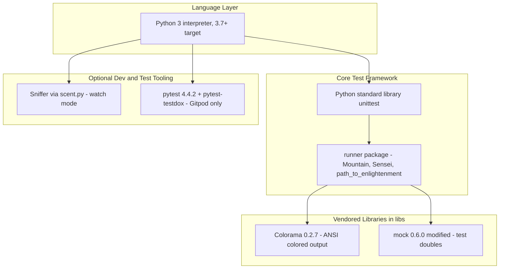

## 3.3 Open Source Dependencies

The defining characteristic of this project's dependency model is that it declares **no dependency manifest at all** — `requirements.txt`, `setup.py`, `setup.cfg`, `pyproject.toml`, `Pipfile`, `poetry.lock`, and `tox.ini` are all absent. Consequently, the runtime open-source dependencies are **vendored in-tree** rather than resolved from a package registry, and the only registry-installed packages appear in the optional developer tooling.

**Vendored (in-tree) open-source libraries.** Two third-party libraries are committed directly into the repository under `libs/`:

| Dependency | Version | Provenance in Repo | Scope | License (observed) |
|---|---|---|---|---|
| Colorama | `0.2.7` (`VERSION = '0.2.7'`) | `libs/colorama/` (6 modules) | Runtime — colored terminal output via `runner/sensei.py` | New BSD — `libs/colorama/LICENSE-colorama` (© 2010 Jonathan Hartley) |
| mock | `0.6.0` (`__version__ = '0.6.0 modified by Greg Malcolm'`) | `libs/mock.py` (single self-contained module) | Test — used by `runner/runner_tests/` | Derived from upstream `mock` 0.6.0, locally modified |

The project itself is distributed under the MIT license (`MIT-LICENSE`, "Copyright 2021 Greg Malcolm and The Status Is Not Quo").

**Optional external dependencies (from PyPI, not vendored, not required for the core flow).** `README.rst` documents the packages needed only for the continuous "watch" workflow (§3.6). These are installed by the user with `pip` and are never imported by the default run path:

| Dependency | Version | Registry | Platform / Scope |
|---|---|---|---|
| `sniffer` | unpinned | PyPI (`python3 -m pip install sniffer`) | All — continuous test runner controlled by `scent.py` |
| `pyinotify` | unpinned | PyPI | Linux — native file-change events for Sniffer |
| `pywin32` | unpinned | PyPI | Windows — native file-change events for Sniffer |
| `MacFSEvents` | unpinned | PyPI | macOS — native file-change events for Sniffer |

**Developer-workspace dependencies (Gitpod only).** `.gitpod.Dockerfile` installs three packages from PyPI into the hosted workspace image:

| Dependency | Version | Registry | Notes |
|---|---|---|---|
| `pytest` | `4.4.2` (pinned) | PyPI | Available for contributors; the authoritative suite is `unittest`-based (`_runner_tests.py`) |
| `pytest-testdox` | unpinned | PyPI | `pytest` reporting plugin |
| `mock` | unpinned | PyPI | Redundant with the vendored `libs/mock.py`, which the self-tests actually import |

**Registries.** The only package registry in play is **PyPI**, reached via `pip3`, and only for the optional watch tooling and the Gitpod image; the runtime resolves everything from the standard library plus `libs/`.

**Security implications.**

- **Dated, manually-maintained vendored libraries.** Colorama `0.2.7` and `mock` `0.6.0` are old and receive no automated patching; updates are manual (a recurring maintenance item noted in §2.4). Practical exposure is low because the runtime performs no network I/O (§3.4).
- **No lockfile / weak pinning.** Aside from `pytest==4.4.2`, the optional and workspace dependencies are unpinned, so their exact versions depend on the day of installation — acceptable for a learning tool, but not reproducible in the strict supply-chain sense.
- **Opt-in native backends.** The Sniffer event backends (`pyinotify`, `pywin32`, `MacFSEvents`) include native code but are entirely optional and only relevant to contributors who enable watch mode.

## 3.4 Third-Party Services

Python Koans is a locally executed command-line program that, as confirmed by §1.2 ("performs no network calls, uses no database, and maintains no persistence layer") and §2.4 ("No network, authentication, authorization, persistence, or telemetry anywhere"), consumes **no runtime third-party services**. A repository-wide search for HTTP/network and cloud client libraries (`requests`, `urllib`, `http`, `socket`, `boto3`, and similar) returns no matches. The only external services present are **developer-facing SaaS integrations** used for continuous integration, cloud editing, and distribution — none of which are reached by the application at runtime.

**Requested service categories — actual status.** Each category the technology-stack template asks about is addressed explicitly below, with evidence.

| Category | Status in This System | Evidence |
|---|---|---|
| External APIs / integrations | None at runtime | No HTTP/network client libraries anywhere; §1.2 states the system "performs no network calls" |
| Authentication services | None (no Auth0/OAuth/identity provider) | No auth libraries or configuration in the codebase; §2.4 confirms "no ... authentication ... anywhere" |
| Monitoring tools | None beyond CI build status + email | No telemetry/APM libraries; §2.4 confirms "no ... telemetry"; `.travis.yml` sets `notifications: email: true` |
| Cloud services | None at runtime | No cloud SDKs (no `boto3`, etc.); "cloud" usage is limited to CI and browser dev workspaces below |

**Developer-facing SaaS integrations (present, but external to the runtime).** These are optional conveniences configured in the repository for contributors and CI; they do not run as part of a learner's local session.

| Service | Type | Configured By | Purpose |
|---|---|---|---|
| Travis CI | Continuous integration (SaaS) | `.travis.yml` | Runs the runner self-tests (`python _runner_tests.py`) on Python 3.9; README badge targets `gregmalcolm/python_koans`; emits email notifications |
| Gitpod | Cloud development workspace | `.gitpod.yml`, `.gitpod.Dockerfile` | One-click browser IDE running `python contemplate_koans.py`; prebuilds enabled for the `master` branch |
| GitHub | Source hosting / VCS remote | `README.rst`, `.gitmodules` | Distribution via clone/download (`github.com/gregmalcolm/python_koans`) and host of the declared git submodule |
| Eclipse Che / OpenShift Workspaces | Cloud development workspace | `README.rst` badges | Alternative one-click workspace launch (`workspaces.openshift.com`) |

**Integration requirements.** The CI and workspace integrations require only a hosted Git remote (GitHub) plus each service's own repository connection; they consume the repository's declarative config files (`.travis.yml`, `.gitpod.yml`, `.gitpod.Dockerfile`) and need no application-level API keys or endpoints. The Travis integration additionally depends on the Python 3.9 image it declares, and the Gitpod integration depends on the `gitpod/workspace-full` base image (§3.6).

**Security implications.** No API keys, tokens, secrets, credential files, or `.env` files are committed anywhere in the repository, consistent with the absence of any authenticated integration. Because every external service is a developer/CI convenience rather than a runtime dependency, the application's trust boundary remains the local machine (§2.4), and a learner can run the full curriculum with no accounts, credentials, or network connectivity.

## 3.5 Databases & Storage

Python Koans uses **no database and no persistent data store of any kind**. A repository-wide search for database drivers and cache clients (`sqlite3`, `sqlalchemy`, `psycopg2`, `pymongo`, `redis`, and similar) returns no matches, and §1.2 states plainly that the system "uses no database, and maintains no persistence layer." The default-stack MongoDB, along with any relational database or caching tier, is therefore intentionally absent. The application is a **stateless, single-run process**: all working state (the `unittest.TestSuite`, pass counters, and cached lesson list held by `Sensei`) lives in memory for the duration of one invocation and is discarded on exit.

**Requested storage categories — actual status.**

| Concern | Status | Evidence |
|---|---|---|
| Primary database (relational) | None | No `sqlite3`/`sqlalchemy`/`psycopg2`; no ORM or connection code |
| Secondary / NoSQL database | None | No `pymongo` or other NoSQL driver; MongoDB from the default stack not used |
| Caching solution | None | No `redis`/`memcached` client anywhere |
| Object / cloud storage | None | No `boto3` or cloud storage SDK |
| Persistence strategy | Local filesystem reads only | See file inventory below |

**The file-based "storage" that does exist.** The only durable artifacts are ordinary files on the local disk, read (and in the case of lesson sources, edited) rather than managed by any storage engine:

| File / Path | Access Pattern | Role |
|---|---|---|
| `koans.txt` | Read via `io.open(..., 'rt', encoding='utf8')` in `runner/path_to_enlightenment.py` | The ordered manifest of koan classes that defines suite composition |
| `koans/*.py` (lesson sources) | Imported by the loader; **edited by the learner** | Both the curriculum content and the interaction surface — a learner's progress persists only as their own edits to these files |
| `example_file.txt` | Read by a file-handling lesson | Small fixture for teaching file I/O |
| `koans/GREEDS_RULES.txt` | Reference text | Specification backing the scoring ("Greed") project |

**Learner "answers."** Both ignore files (`.gitignore` and `.hgignore`) exclude an `answers` path, a convention for keeping personal solution copies out of version control. This is a workflow convenience, not a managed data store. In summary, the runner reads a handful of local files and writes colored progress to standard output; there is nothing to configure, provision, back up, or secure at the data-tier level.

## 3.6 Development & Deployment

The development and delivery model is deliberately lightweight: obtain the source, run it with a local Python 3 interpreter, and (optionally) let CI verify the runner framework. There is no compilation step, no packaged artifact, and no production deployment target.

**Development tools.**

| Tool / Mechanism | Files | Purpose |
|---|---|---|
| CLI launchers | `run.sh` (`python3 -B ...`), `run.bat` (Windows retry loop) | One-command entry on Unix/macOS and Windows; `-B` disables `.pyc` bytecode caching |
| Continuous test watcher | `scent.py` (+ external `sniffer`) | Re-runs `python3 -B contemplate_koans.py` whenever a watched `.py` file changes (`watch_paths = ['.', 'koans/']`) |
| Selective execution | `Contributor Notes.txt` | Run one case (`python3 contemplate_koans.py about_strings`) or a single method during authoring |
| Framework self-tests | `_runner_tests.py`, `runner/runner_tests/` | `unittest` suite (`TestMountain`, `TestSensei`, `TestHelper`, `TestFilterKoanNames`, `TestKoansSuite`) guarding the runner |
| Editor hygiene | `.gitignore`, `.hgignore` | Ignore `.idea` (JetBrains), `.DS_Store`, `*.pyc`, `*.swp`; no editor is mandated |

**Build system.** There is **no build system**. The project ships no `setup.py`, `Makefile`, wheel/`build` configuration, or packaging metadata (§3.3), so no compilation or artifact assembly occurs. Per `README.rst`, acquiring the project is simply cloning with Git or downloading a `zip/gz/bz2` archive; running it invokes the interpreter directly, with `-B` avoiding bytecode-cache writes.

**Containerization.** The single container definition, `.gitpod.Dockerfile`, exists only to provision the **Gitpod cloud development workspace** — `FROM gitpod/workspace-full:latest`, `USER gitpod`, then `RUN pip3 install pytest==4.4.2 pytest-testdox mock`. It is a developer-environment image, **not** a production/deployment container: there is no application `Dockerfile`, no `docker-compose`, no image registry, and no orchestration (Kubernetes/ECS). This is a notable divergence from a default stack in which Docker serves as the deployment unit.

**CI/CD.**

- **CI — Travis CI only.** `.travis.yml` runs `python _runner_tests.py` on Python 3.9 with email notifications, exercising the runner's own regression suite. There is **no `.github/` directory and no GitHub Actions workflow**, so — despite GitHub Actions appearing in a typical default stack — this repository relies exclusively on Travis CI for automated checks.
- **No CD pipeline.** The project is not published to a package index and has no release, tagging, or deployment automation; distribution is manual via GitHub clone/download (§3.4).
- **Gitpod prebuilds.** `.gitpod.yml` enables prebuilds for the `master` branch — a warm-up of the *development* workspace, not application deployment.

**Version control & source management.** Git is the active VCS (`.gitignore`, `.gitmodules`, GitHub hosting), while a legacy Mercurial artifact (`.hgignore`) persists from the project's earlier history — each ignore file even excludes the other VCS's metadata (`.gitignore` ignores `.hg`; `.hgignore` ignores `.git`). One git submodule is declared in `.gitmodules` (`Submodule_01_Do_not_use_15Jun`), an unrelated collection that is not part of the application or its toolchain.

**Deployment model.** There is no server or service to deploy. "Deployment" means a user acquires the source from GitHub (clone or archive) and runs it locally, or launches a browser-based workspace via Gitpod or Eclipse Che/OpenShift (§3.4). The following diagram summarizes the local-run path and the CI path.

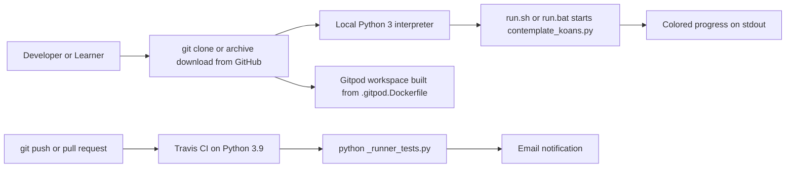

## 3.7 References

The following repository files and folders were inspected as the evidentiary basis for this section.

**Files examined**

- `contemplate_koans.py` - CLI entry point; established the Python-3-only guard (`sys.version_info < (3, 0)`) and the 3.7 compatibility warning
- `run.sh` - POSIX shell launcher (`#!/bin/sh`, `python3 -B contemplate_koans.py`)
- `run.bat` - Windows batch launcher; established the `C:\Python311` interpreter-path default
- `scent.py` - Sniffer watch-mode integration; established the optional `sniffer` dependency
- `_runner_tests.py` - `unittest` self-test runner executed by CI
- `koans.txt` - ordered koan manifest read by the loader
- `README.rst` - established the project purpose, the Python-version policy, Sniffer/`pip` setup (incl. `pyinotify`/`pywin32`/`MacFSEvents`), and the GitHub/Travis/Gitpod/Eclipse Che hosting integrations
- `Contributor Notes.txt` - established the selective-execution developer workflow
- `.travis.yml` - Travis CI configuration (Python 3.9, `python _runner_tests.py`, email notifications)
- `.gitpod.yml` - Gitpod workspace tasks and `master` prebuilds
- `.gitpod.Dockerfile` - Gitpod image (`gitpod/workspace-full:latest`) and the `pytest==4.4.2 pytest-testdox mock` install
- `.gitmodules` - declaration of the `Submodule_01_Do_not_use_15Jun` git submodule
- `.gitignore` - Git ignore rules (ignores `answers`, `.idea`, `.hg`)
- `.hgignore` - legacy Mercurial ignore artifact (dual-VCS heritage)
- `MIT-LICENSE` - established the project's MIT license
- `example_file.txt` - fixture confirming file-based (non-database) I/O
- `runner/mountain.py` - runner coordinator built on `unittest`
- `runner/path_to_enlightenment.py` - ordered `unittest.TestSuite` builder; `io.open(...encoding='utf8')` read of `koans.txt`
- `runner/sensei.py` - custom `TestResult` reporter; `from libs.colorama import init, Fore, Style`
- `runner/koan.py` - `Koan(unittest.TestCase)` learner scaffold
- `runner/mockable_test_result.py` - `MockableTestResult(unittest.TestResult)` patch seam
- `libs/mock.py` - vendored `mock` (`__version__ = '0.6.0 modified by Greg Malcolm'`)
- `libs/colorama/__init__.py` - vendored Colorama version (`VERSION = '0.2.7'`)
- `libs/colorama/LICENSE-colorama` - established Colorama's New BSD license

**Folders examined**

- `runner/` - the `unittest`-based execution framework package (8 modules + tests)
- `runner/runner_tests/` - the framework's own `unittest` suite; `test_sensei.py` and `test_mountain.py` import `libs.mock`
- `koans/` - the curriculum package (45 Python modules + `GREEDS_RULES.txt`)
- `koans/a_package_folder/` - lesson subpackage for the packages koan
- `libs/` - vendored third-party support libraries (`mock`, `colorama/`)
- `libs/colorama/` - vendored Colorama 0.2.7 package (6 modules)
- Repository root (`""`) - confirmed the absence of any Python packaging manifest and any `.github/` CI directory

**Cross-referenced Technical Specification sections**

- §1.2 System Overview - corroborated the "no network, no database, no persistence" runtime profile and the integration-point inventory
- §2.4 Implementation Considerations - corroborated the stdlib-only constraint, the vendored Colorama 0.2.7 / `mock` 0.6.0 versions, the absent packaging metadata, and the CI/tooling notes

# 4. Process Flowchart

## 4.1 System Workflows

Python Koans is a **synchronous, single-process, command-line educational application** built entirely on the Python standard library's `unittest` framework. It has no web server, no network layer, no database, and no persistent datastore; its only I/O boundaries are the command line (`sys.argv`), a manifest file read (`koans.txt`), a small text fixture read (`example_file.txt`) by file-handling lessons, and colored progress text written to standard output. Consequently, the "business processes" documented here are **learner-facing terminal workflows**, and the "integration workflows" are the small set of process-boundary interactions (CLI arguments, manifest ingestion, terminal rendering, the optional file-watch loop, and the continuous-integration self-test).

The single dominant workflow is the **"Path to Enlightenment"** — an iterative *edit-run* loop in which a learner runs the suite, receives feedback on exactly one failing koan, edits that koan, and re-runs until every koan passes. This section documents that journey end-to-end, the per-feature process flows that implement it, and the integration boundaries that feed it. The diagrams below **complement** (rather than duplicate) the high-level runtime flowchart in Section 1.2.2 and the feature-dependency map in Section 2.3.1 by adding decision logic, error paths, swim lanes, and sequence detail.

The following high-level workflow places every actor and system boundary into a swim lane and shows the full closed loop from launch, through version gating, curriculum execution, first-failure reporting, and the learner's edit-and-retry cycle.

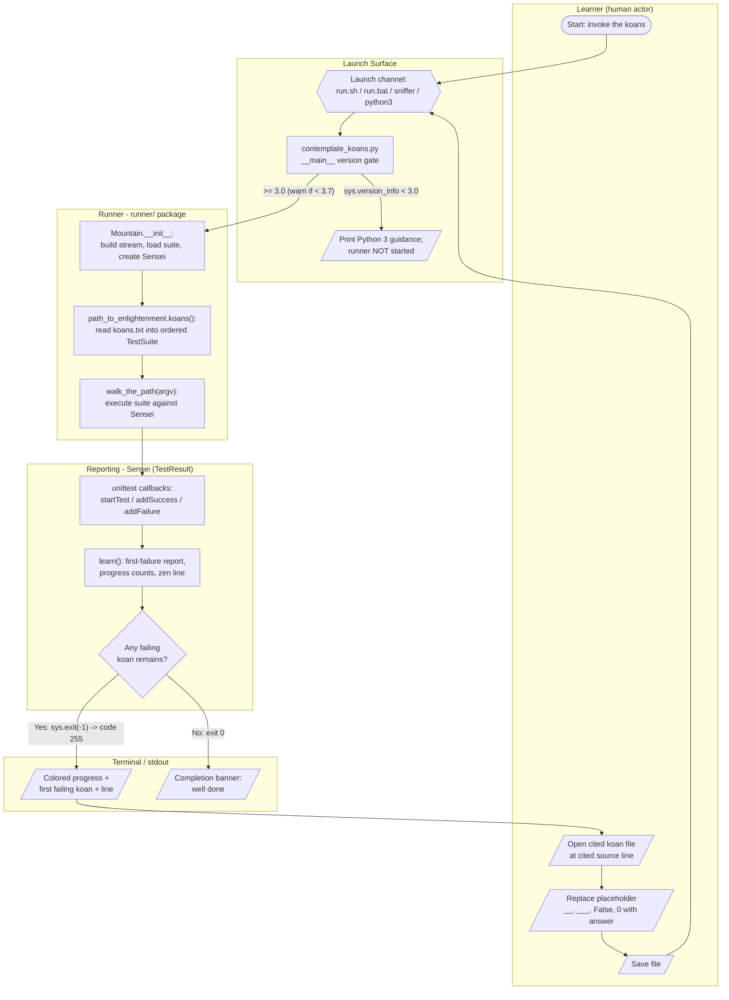

### 4.1.1 Core Business Processes

The application implements one core end-to-end business process — the learner's *Path to Enlightenment* — which is realized by the coordinated execution of features **F-001** (Version-Guarded CLI Entry Point), **F-002** (Ordered Curriculum Suite Construction), **F-003** (Runner Coordination & Suite Execution), **F-004** (Selective Koan Execution), **F-005** (First-Failure Focused Feedback), and **F-006** (Progress Tracking & Motivational Reporting). Each sub-process below is documented with its start/end points, process steps, decision diamonds, and error/recovery paths. Because the application is a local, synchronous CLI, timing is dominated by in-process test execution; there are no network waits, no asynchronous operations, and no formal Service Level Agreements defined anywhere in the repository (see Section 4.2 for the timing discussion).

#### 4.1.1.1 The Path to Enlightenment — End-to-End Learner Journey

The learner journey is a **repeat-until-pass loop**. On each iteration the runner executes the full ordered curriculum, but the `Sensei` reporter surfaces only the **single earliest-failing koan** (see 4.1.1.4), which focuses the learner on exactly one correction at a time. The learner then opens the cited file at the cited line, replaces the intentionally-failing placeholder (e.g., `__`, `___`, `____`, `_____`, `False`, `0`) with a correct value or implementation, saves, and re-runs. The loop terminates only when no koan fails, at which point `learn()` prints the completion banner instead of exiting with a failure code.

The primary user touchpoints are: (1) invoking the runner from the shell, (2) reading the colored terminal feedback, and (3) editing the cited koan source file. The two decision points that gate the loop are the **version gate** (can the runner start at all?) and the **first-failure gate** (does any koan still fail?).

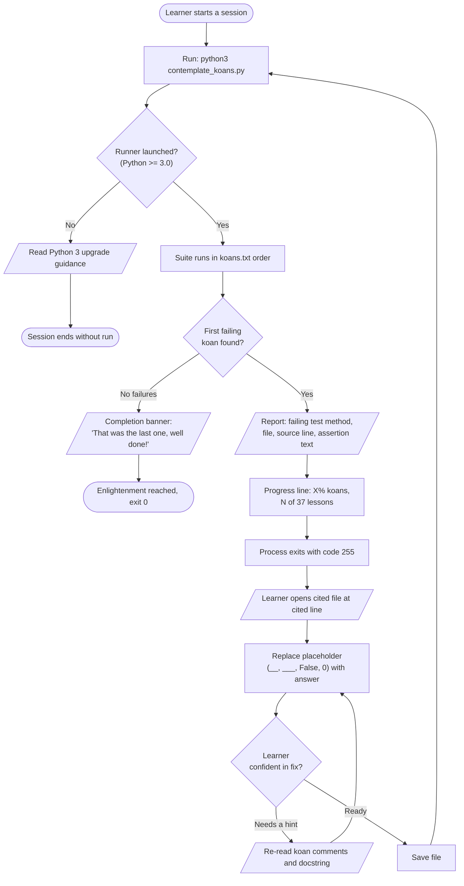

| Decision Point | Location (evidence) | Branches | Effect |
| --- | --- | --- | --- |
| Runner launched? | `contemplate_koans.py` L15 (`sys.version_info < (3,0)`) | Python 2 vs Python 3 | Python 2 prints guidance and never launches the runner |
| First failing koan found? | `runner/sensei.py` `learn()` L83-102 (`if self.failures`) | Failures present vs none | Failures → focused report + `sys.exit(-1)`; none → completion banner |
| Learner confident in fix? | Learner touchpoint (koan source edit) | Ready vs needs a hint | Determines whether the learner re-runs or re-reads the koan |

#### 4.1.1.2 Application Bootstrap and Version Gate (F-001)

The entry point `contemplate_koans.py` performs a **two-stage version gate** before delegating to the runner. Stage 1 (L15) is a hard gate: when `sys.version_info < (3,0)` the program prints Python-2 guidance and ends **without importing or running the runner**. Stage 2 (L21) is a soft gate: when `sys.version_info < (3,7)` it prints a compatibility WARNING banner but still proceeds. Only after passing the hard gate does the module execute `from runner.mountain import Mountain` (L32) and `Mountain().walk_the_path(sys.argv)` (L34). This bootstrap is near-instantaneous; the only work is comparing the interpreter version tuple.

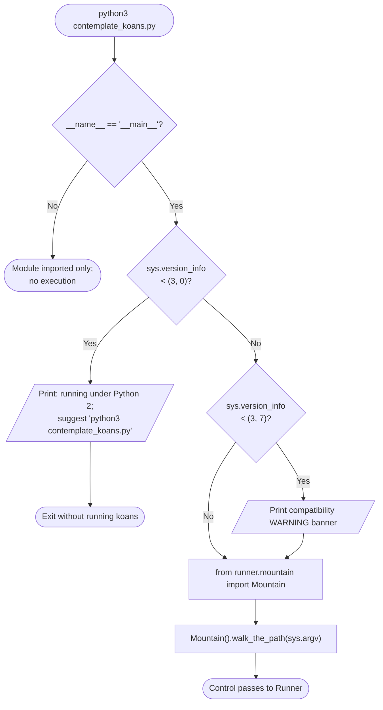

#### 4.1.1.3 Curriculum Assembly and Suite Execution (F-002, F-003, F-004)

`Mountain.__init__` (`runner/mountain.py` L12-15) eagerly assembles the default curriculum by wrapping `sys.stdout` in a `WritelnDecorator`, calling `path_to_enlightenment.koans()` to build the ordered default `TestSuite`, and constructing the `Sensei` reporter. `walk_the_path(args)` (L17-25) then applies the **selective-execution decision** (F-004): when `args and len(args) >= 2`, it replaces the default suite with a single named target via `unittest.TestLoader().loadTestsFromName("koans." + args[1])` (L20-22); otherwise the full ordered curriculum runs. The suite is then executed by the callable-suite idiom `self.tests(self.lesson)` (L23) — a `unittest.TestSuite` invoked with a `TestResult` runs every contained test against that result — after which `self.lesson.learn()` (L24) produces the final report.

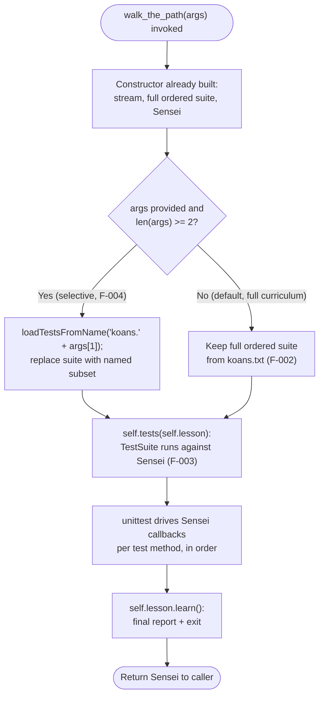

#### 4.1.1.4 First-Failure Focused Feedback and Progress Reporting (F-005, F-006)

`Sensei` (`runner/sensei.py`) subclasses `MockableTestResult(unittest.TestResult)` and receives `unittest` callbacks as the suite runs. On the first test method of each new lesson class, `startTest` (L27-37) prints a colored `Thinking {ClassName}` heading — but only while `self.failures` is empty — and increments `lesson_pass_count` for every class except `AboutAsserts` and `AboutExtraCredit`. Passing tests route through `addSuccess` (L39-46), which prints `{method} has expanded your awareness.` and increments `pass_count`, but only while `passesCount()` (L53-54) is true; that guard **stops counting passes once execution moves past the class containing the first failure**. Errors and failures are merged into one ordered list (`addError` delegates to `addFailure`, L48-51) so that source ordering is preserved.

The focusing logic lives in `firstFailure()` (L73-81) and `sortFailures()` (L59-71): the reporter takes the class of the first recorded failure, extracts each failure's source line number via the regex `(?<= line )\d+`, and returns the **lowest-line failure** as the single koan to present. `learn()` (L83-102) then calls `errorReport()` (which prints the "damaged your karma" line, the scraped assertion text, and only the `/koans/`-path stack frames), prints `report_progress()` / `report_remaining()`, prints one rotating Zen-of-Python line via `say_something_zenlike()` (`pass_count % 37`), and finally `sys.exit(-1)` when failures remain. A **live unedited run confirmed** this flow: the suite reports `test_assert_truth` at `about_asserts.py` line 17, `0 (0 %) koans and 0 (out of 37) lessons`, `304 koans ... away`, the Zen line `Beautiful is better than ugly.`, and terminates with **exit code 255**.

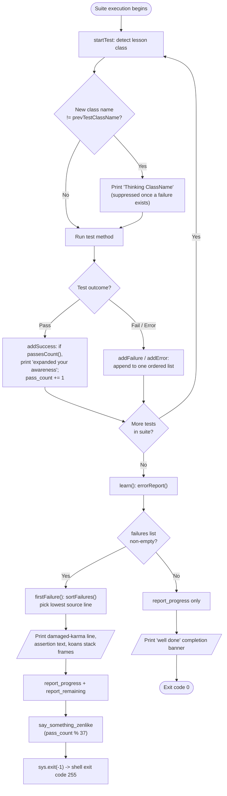

### 4.1.2 Integration Workflows

The system's integration surface is intentionally minimal and fully **offline** — an import-level analysis found no networking, HTTP, database, asyncio, or threading modules anywhere in the runtime code. There are therefore **no external API calls, no message queues, and no remote services** to diagram. The integration workflows that do exist are: (1) inter-component data flow within the process and the `unittest` callback protocol; (2) the manifest-driven curriculum data pipeline; (3) the optional Sniffer file-watch event loop (F-010); and (4) the batch self-test executed in continuous integration (F-012). Each is documented below.

#### 4.1.2.1 Component Data Flow and the unittest Callback Protocol

The following sequence diagram uses one lane per component/system and shows the full in-process data flow, including the **inversion-of-control callback protocol** by which the executing `TestSuite` drives the `Sensei` `TestResult`. The suite is invoked as a callable with the result object, and `unittest` then calls back into `Sensei` (`startTest`, then `addSuccess` / `addFailure` / `addError`) once per test method; `Sensei` writes colored lines through `WritelnDecorator` to standard output.

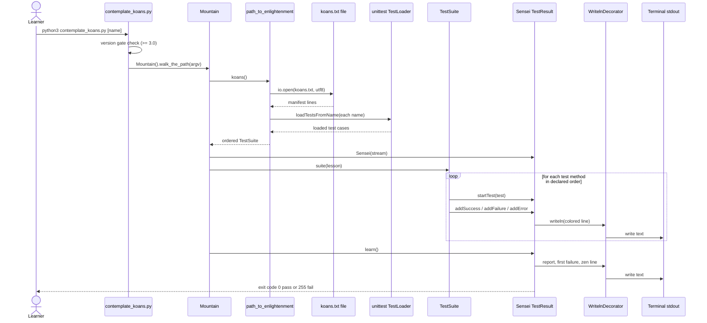

#### 4.1.2.2 Manifest-Driven Curriculum Data Flow (F-002)

Curriculum content is defined by data, not code: the ordered list of lesson classes lives in the **`koans.txt`** manifest (41 lines; 39 fully-qualified class names). `path_to_enlightenment` transforms that file into an executable suite through a small pipeline. `names_from_file()` opens the file as UTF-8 via `io.open(...)`; `filter_koan_names()` strips whitespace, drops blank lines, and drops `#` comment lines; `koans_suite()` sets `loader.sortTestMethodsUsing = None` to **preserve the declared method order**, loads each named class via `TestLoader.loadTestsFromName`, and accumulates them with `suite.addTests(...)`. The resulting suite contained **304 koans across 37 counted lessons** in the live run. File and discovery errors are intentionally **not** caught here, so a missing manifest or an unresolvable name propagates as a normal Python exception (see 4.3.2).

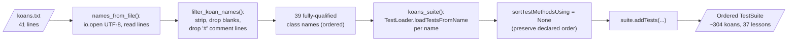

#### 4.1.2.3 Optional Continuous Testing — Watch-Mode Event Processing (F-010)

`scent.py` integrates the third-party **Sniffer** tool to provide an optional continuous-testing loop. It declares `watch_paths = ['.', 'koans/']` and registers a `@file_validator` (`py_files`) that accepts only non-hidden `*.py` files, plus a `@runnable` (`execute_koans`) that shells out via `os.system('python3 -B contemplate_koans.py')`. Sniffer watches the filesystem; when a learner saves a matching Python file, the validator admits the event and Sniffer re-invokes the full koans runner as a subprocess, so the terminal feedback refreshes automatically without a manual re-run. This closes the *edit-run* loop of 4.1.1.1 into a hands-free cycle. Sniffer and its platform watch backends (pyinotify / pywin32 / MacFSEvents) are external prerequisites that are not vendored in the repository.

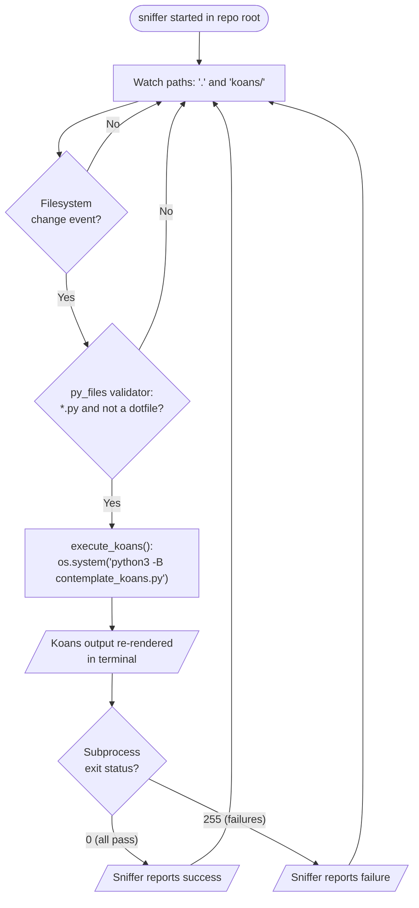

#### 4.1.2.4 Batch Execution — Self-Test Suite and Continuous Integration (F-012)

Separate from the learner curriculum, the repository ships a **runner self-test batch** used in CI. `_runner_tests.py` builds a `suite()` aggregating `TestMountain`, `TestSensei`, `TestHelper`, `TestFilterKoanNames`, and `TestKoansSuite`, runs it with `unittest.TextTestRunner(verbosity=2)`, and exits with `sys.exit(not res.wasSuccessful())` — i.e. exit code 0 on success and 1 on any failure. `.travis.yml` (Python 3.9) invokes `python _runner_tests.py` as its script, so this batch is the automated gate that protects the runner/reporting engine. This is a non-interactive, unattended sequence with a single pass/fail outcome consumed by the CI system.

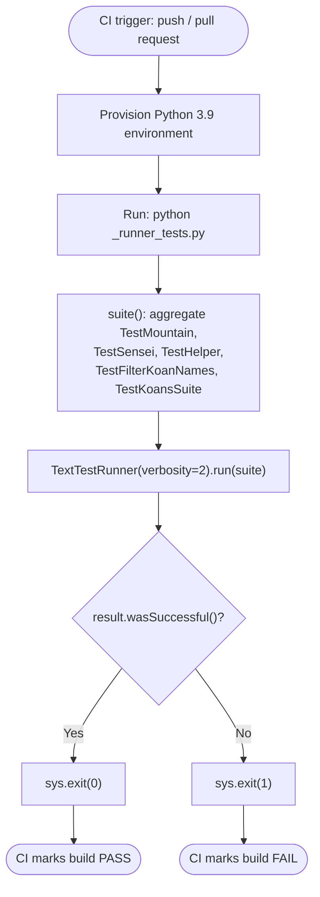

## 4.2 Flowchart Requirements & Validation Rules

This section defines the notation conventions applied to every diagram in Section 4 and catalogs the validation rules that gate each workflow step. Because Python Koans is a local, single-user teaching tool with no external input, its "validation" is concentrated in three places — the interpreter **version gate**, the **manifest/argument parsing** that builds the suite, and the **per-koan assertions** that constitute the learning content itself. There are no authorization or regulatory checkpoints anywhere in the codebase; this absence is documented explicitly in 4.2.2.

### 4.2.1 Workflow Component Standards

All flowcharts in this section follow one consistent visual vocabulary so that start/end points, processing steps, decisions, system boundaries, user touchpoints, and error states are unambiguous. The table below maps each Mermaid shape to its meaning as used throughout Section 4.

| Notation (Mermaid) | Shape | Meaning in this specification | Representative example |
| --- | --- | --- | --- |
| `([ text ])` | Stadium / terminator | Start or end point of a workflow | "Learner starts a session", "Exit code 0" |
| `[ text ]` | Rectangle | A process step / action executed in code | `Mountain.__init__`, `suite.addTests(...)` |
| `[/ text /]` | Parallelogram | Input/output — a terminal read or write, or a learner edit | "Colored progress" output, "Save file" |
| `{ text }` | Diamond | Decision point (branch) evaluated at runtime | "First failing koan found?" |
| `{{ text }}` | Hexagon | Entry selector / launch channel | "run.sh / run.bat / sniffer / python3" |
| `subgraph … end` | Swim lane | System boundary / actor grouping | Learner, Launch Surface, Runner, Reporting, Terminal |
| `-->|label|` | Labeled edge | Control flow with the guard condition on the branch | "Yes: sys.exit(-1) -> code 255" |

**Start and end points.** Every workflow begins at a stadium terminator (learner invocation, CLI launch, CI trigger, or watch start) and ends at a stadium terminator representing a concrete outcome — most importantly the two mutually exclusive process outcomes proven by the live run: **exit code 0** (all koans pass) and **exit code 255** (`sys.exit(-1)`, at least one koan fails).

**Process steps and decision diamonds.** Process steps correspond to named functions/methods in the code (`walk_the_path`, `koans()`, `learn()`, `firstFailure()`). The three runtime decision diamonds in the core workflow are the two version comparisons in `contemplate_koans.py` (L15, L21), the selective-execution `len(args) >= 2` check in `runner/mountain.py` (L20), and the `if self.failures` branch in `Sensei.learn()` (L83-102).

**System boundaries and user touchpoints.** System boundaries are rendered as swim-lane subgraphs. The five recurring lanes are the **Learner** (the only human actor), the **Launch Surface** (`contemplate_koans.py`, `run.sh`, `run.bat`, `scent.py`), the **Runner** (`runner/mountain.py`, `runner/path_to_enlightenment.py`), the **Reporting** engine (`runner/sensei.py`), and the **Terminal** (stdout via `WritelnDecorator`). The three user touchpoints are shell invocation, reading terminal feedback, and editing a koan source file.

**Error states and recovery paths.** The application has no exception-catching recovery logic in its core path; instead, the *learner-facing* error state is a failing koan, and the recovery path is the edit-and-retry loop (4.1.1.1). A failing koan is surfaced as the red "damaged your karma" report plus a source citation, and the process signals the error to the shell via a non-zero exit code. Genuine operational errors (a missing manifest, an unresolvable class name) are **not** caught and propagate as standard Python tracebacks (see 4.3.2).

**Timing and SLA considerations.** No Service Level Agreements, timeouts, deadlines, or performance budgets are defined anywhere in the repository. Execution is **synchronous and in-process**: the runner loads one small manifest file, constructs an in-memory `TestSuite`, and executes it against a single `TestResult` with no network, database, or inter-process waits. The launch scripts and the watch runnable invoke the interpreter with the `-B` flag (`python3 -B contemplate_koans.py`) to skip writing `.pyc` bytecode files. In the live run the full 304-koan suite completed effectively instantaneously; the only meaningful "timing constraint" is that the watch loop (F-010) re-runs the entire suite on every qualifying file save, and CI (F-012) runs the self-test batch once per push/pull-request event.

### 4.2.2 Validation Rules

Validation in Python Koans occurs at four ordered checkpoints as data flows from the shell into the executed suite. The following flowchart shows those checkpoints in sequence, and — critically — marks the two checkpoint categories that are **absent by design** (authorization and regulatory compliance).

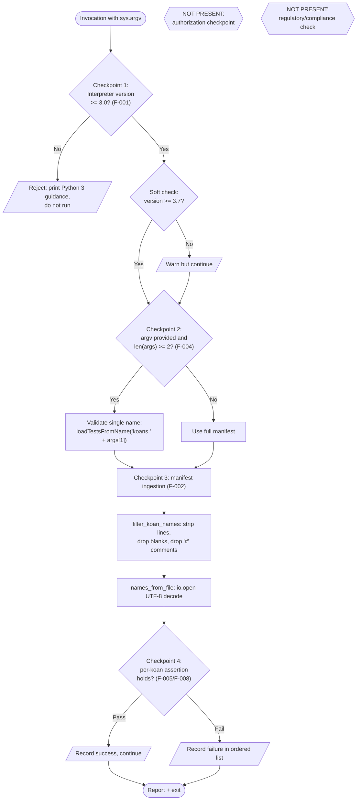

#### 4.2.2.1 Business Rules at Each Step

The domain "business rules" of this system are the **koan assertions themselves** — each test method encodes the correct behavior of a Python language feature, and the learner must satisfy it. For example, `koans/about_asserts.py` enforces rules such as `assertTrue(...)` requiring a truthy value (L17), `assertEqual(__, 1 + 1)` requiring the learner to supply `2` (L29), and `assertEqual(__, "navel".__class__)` requiring the correct type object (L73). These per-step rules are formalized in the functional-requirement tables of Section 2.2 (notably **F-008-RQ-001/002** for the Koan base class and placeholder tokens, and **F-005-RQ-001/002/003** for how a violated rule is selected and reported). The reporting rule at the suite level is enforced in `Sensei`: pass counting is suspended once execution passes the class containing the first failure (`passesCount()`, L53-54), so progress percentages reflect *consecutive* mastery from the top of the curriculum.

#### 4.2.2.2 Data Validation Requirements

Two data-validation rules exist, both in the suite-construction path (F-002):

- **Manifest line filtering** — `filter_koan_names()` (`runner/path_to_enlightenment.py` L17) strips each line, discards blank lines, and discards lines beginning with `#`, so only well-formed fully-qualified class names reach the loader. This is the rule that lets `koans.txt` carry its leading comment line without breaking suite assembly.
- **Encoding validation** — `names_from_file()` (L31) opens the manifest with `io.open(filename, 'rt', encoding='utf8')`, enforcing UTF-8 decoding of the manifest (cross-referenced as **F-002-RQ-003**).

The only argument-level validation is the arity guard `if args and len(args) >= 2` (`runner/mountain.py` L20), which decides between selective and full execution (**F-004-RQ-001/002**). There is no schema validation, no type coercion, and no sanitization of external input, because the sole inputs are a repository-controlled manifest and an optional koan name typed by the local user.

#### 4.2.2.3 Authorization Checkpoints

**None exist.** The application runs entirely as a local process under the invoking user's own account and performs no authentication or authorization of any kind — there are no users, roles, permissions, tokens, or access-control checks in the codebase. The cross-reference analysis of every feature (F-001 through F-012) confirms the security posture is "local process only, no external or untrusted input." Any node labeled "authorization checkpoint" is therefore explicitly marked *NOT PRESENT* in the validation flowchart above.

#### 4.2.2.4 Regulatory Compliance Checks

**None exist.** For every feature in the catalog (Section 2.1) the compliance requirement is recorded as "None defined in the repository." The system processes no personal data, handles no payments, and touches no regulated domain; it reads a manifest and a small example text fixture and writes progress text to the terminal. Consequently there are no audit trails, retention policies, consent flows, or compliance gates to diagram, and the corresponding checkpoint is marked *NOT PRESENT* above.

## 4.3 Technical Implementation Flows

This section documents how the runtime manages state and handles errors. Both topics are shaped by one architectural fact established across the investigation: Python Koans holds all of its runtime state **in memory** for the lifetime of a single process and **persists nothing** except the learner's own edits to koan source files. There is no database, no session store, no log file, and no serialized progress; the process starts, builds an in-memory suite, executes it, prints a report, and exits.

### 4.3.1 State Management

#### 4.3.1.1 State Objects and Persistence Points

The only stateful object in the runtime is the `Sensei` reporter (`runner/sensei.py`), which extends `unittest.TestResult`. Its constructor (L18-25) initializes the complete state set: `prevTestClassName` (the lesson class currently being narrated), `pass_count` and `lesson_pass_count` (the two progress counters), `all_lessons` (a lazy cache, initially `None`), and `tests` (a *second*, independent full curriculum suite obtained from `path_to_enlightenment.koans()`, held purely to compute denominators). The failure/error records themselves live in the inherited `unittest.TestResult` `failures` list. `Mountain` (`runner/mountain.py`) holds the parallel *execution* state: `self.stream`, `self.tests` (the suite that is actually run), and `self.lesson` (the `Sensei` instance).

There are **two distinct persistence points**, and both are intentionally minimal:

| Persistence point | Mechanism | Durability |
| --- | --- | --- |
| Progress counters, first-failure selection, lesson narration | In-memory fields on `Sensei` | Volatile — discarded when the process exits |
| Learner's answers | Edits saved to `koans/about_*.py` source files | Durable — the only cross-run state, owned by the learner |
| Bytecode cache | `.pyc` files (suppressed by the `-B` launch flag) | Suppressed by design |

Because progress is *recomputed from scratch on every run*, the learner's edited source files are effectively the system of record: the suite re-derives the completion percentage each time by re-executing every koan in order. There is no checkpoint, resume, or partial-progress file anywhere in the repository.

#### 4.3.1.2 Caching and Transaction Boundaries

Two caching behaviors exist, both inside `Sensei`. First, `filter_all_lessons()` (L261-269) memoizes its result in `self.all_lessons`: on first call it globs `../koans/about*.py` (excluding `about_extra_credit`) and stores the list, returning the cached list on subsequent calls; this feeds `total_lessons()` (which returned **37** in the live run). Second — a structural design choice worth noting — the reporter constructs its **own** full curriculum suite at initialization (`self.tests = path_to_enlightenment.koans()`) separate from the suite `Mountain` executes, and uses `self.tests.countTestCases()` in `total_koans()` (L258-259) to obtain the **304** koan denominator. The system therefore builds the curriculum suite twice per run: once to execute, once to count.

The **transaction boundary** is the whole-process run. There is no data store and therefore no commit/rollback semantics; instead the unit of work is a single, complete pass over the ordered suite, terminated by `learn()` (L83-102). When failures remain, `learn()` calls `sys.exit(-1)`, which ends the process (shell code **255**); when none remain it prints the completion banner and returns normally (code **0**). Selective execution (`walk_the_path` with `len(args) >= 2`) narrows the boundary to a single named koan class but does not change these semantics.

#### 4.3.1.3 State Transition Diagrams

The first diagram models an individual koan's lifecycle from the learner's perspective — the state that actually persists between runs. The second models the `Sensei` pass-counting state machine *within* a single suite execution, which encodes the "consecutive mastery from the top" rule enforced by `passesCount()` (L53-54).

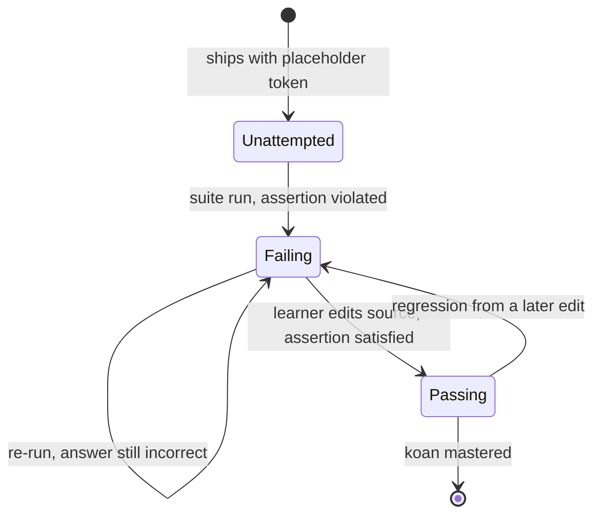

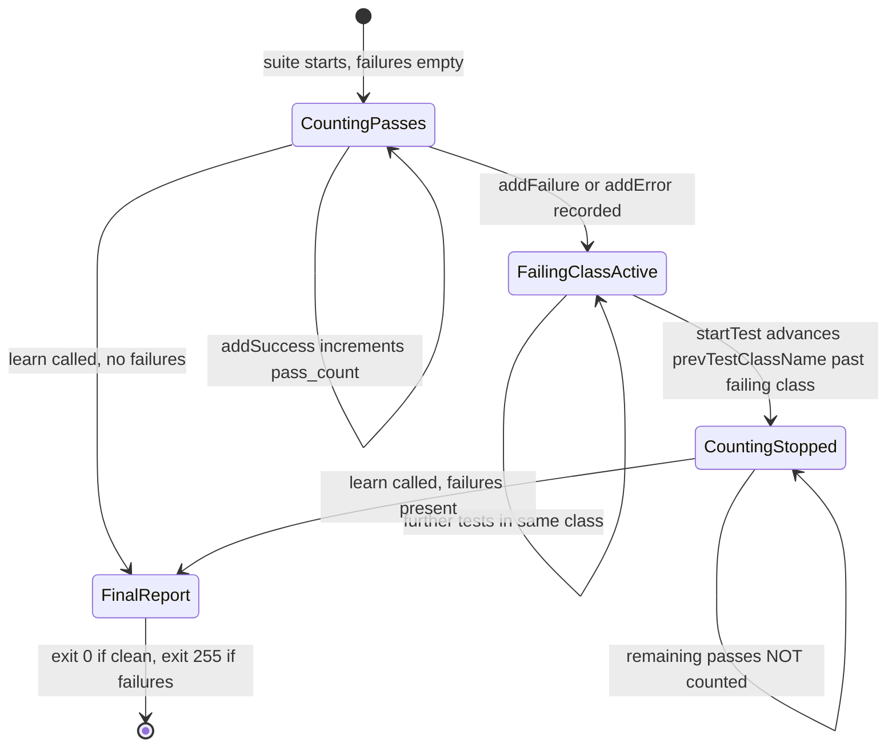

### 4.3.2 Error Handling

Python Koans distinguishes — implicitly, through code structure — between two fundamentally different error classes, and handles them very differently.

#### 4.3.2.1 Two Error Classes: Expected vs Operational

The **expected error** is a *failing koan*. This is not an exceptional condition at all; it is the normal, designed state of an unedited curriculum. `Sensei` catches these through the `unittest` callback protocol (`addFailure`/`addError`, L48-57), merges errors and failures into one ordered list to preserve source sequence, selects the earliest-line failure via `firstFailure()`/`sortFailures()`, and renders a focused, colored report. The process then signals the condition to the shell with `sys.exit(-1)` (code 255).

The **operational error** is an uncaught exception in the bootstrap or suite-construction path — for example a missing `koans.txt`, an unresolvable class name in the manifest, or an import error inside a koan module. The suite-construction functions in `runner/path_to_enlightenment.py` deliberately contain **no** `try`/`except`, so such conditions propagate as a standard Python traceback to stderr and abort the process. This is a deliberate simplicity trade-off: the manifest and koan modules are repository-controlled, so defensive handling is unnecessary for the intended local-learner use case.

#### 4.3.2.2 Notification, Retry, Fallback, and Recovery

**Error notification flow.** All notification is synchronous terminal output — there are no email, webhook, or logging channels. For a failing koan, `errorReport()` (L104-119) prints the red "damaged your karma" line, then `scrapeAssertionError()` (L121-133) extracts the assertion message, and `scrapeInterestingStackDump()` (L135-167) trims the traceback to only the frames whose path contains `/koans/` and colorizes the file and line. The secondary notification channel is the **process exit code**, which is what the watch loop (F-010) and CI (F-012) actually consume.

**Retry mechanisms.** There is no automatic in-process retry. Retry is always a *re-execution of the whole suite*, triggered through one of three channels: a manual re-run by the learner, an automatic re-run by Sniffer on a qualifying file save (`scent.py`, F-010), or a CI re-run on the next push/pull-request (`_runner_tests.py` + `.travis.yml`, F-012).

**Fallback and graceful degradation.** The core execution path has no fallback logic. The only graceful-degradation behavior in the entire runtime is the **soft version gate** in `contemplate_koans.py` (L21): on Python 3.0–3.6 it prints a compatibility WARNING and *proceeds anyway* rather than aborting. A secondary, launch-level fallback exists in `run.bat`, which probes several interpreter locations before reporting that Python is not on the path.

**Recovery procedures.** Recovery for the expected error is the edit-and-retry loop of 4.1.1.1 — open the cited file at the cited line, correct the answer, and re-run. Recovery for an operational error is environmental (restore the manifest, fix the offending name, or repair the interpreter environment) followed by re-invocation. For a CI failure, recovery is fixing the runner/reporting code and re-pushing so the self-test batch passes.

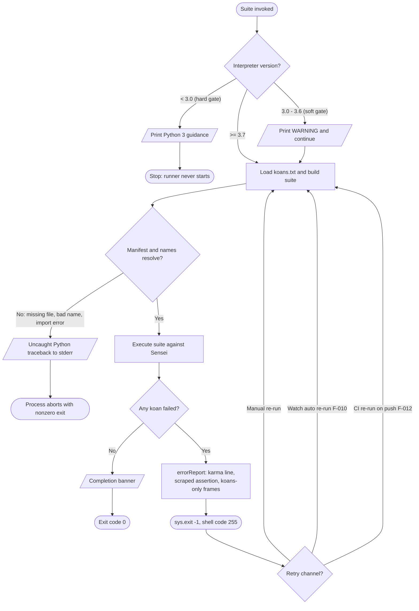

## 4.4 References

The following repository files and folders were examined as direct evidence for the workflows, validation rules, state management, and error-handling flows documented in Section 4. Line references throughout the section correspond to the versions of these files inspected during investigation.

**Files — core execution path**

- `contemplate_koans.py` - Established the version-guarded entry point: the hard gate (`sys.version_info < (3,0)`, L15), the soft gate (`< (3,7)`, L21), and the `Mountain().walk_the_path(sys.argv)` handoff (L34).
- `runner/mountain.py` - Established the `Mountain` orchestrator: constructor wiring of stream/suite/`Sensei` (L12-15), the `walk_the_path` selective-vs-default decision (`len(args) >= 2`, L20), suite execution (L23), and the `learn()` call (L24).
- `runner/path_to_enlightenment.py` - Established suite construction: `KOANS_FILENAME` (L14), `filter_koan_names` line filtering (L17), `names_from_file` UTF-8 `io.open` decoding (L31), `koans_suite` order-preserving assembly with `sortTestMethodsUsing=None` (L42), and `koans()` (L56); confirmed the deliberate absence of `try`/`except`.
- `runner/sensei.py` - Established the reporter/state engine: state fields and the second totals suite (L18-25); the `startTest`/`addSuccess`/`addError`/`addFailure`/`passesCount` callbacks (L27-57); first-failure selection via `sortFailures`/`firstFailure` (L59-81); `learn()` and the `sys.exit(-1)` boundary (L83-102); `errorReport`, `scrapeAssertionError`, `scrapeInterestingStackDump` (L104-167); progress/count/zen reporting and the `filter_all_lessons` lazy cache (L169-269); colorama `init()` at import (L14-15).

**Files — supporting runtime modules**

- `runner/koan.py` - Established the learner scaffold: the `Koan(unittest.TestCase)` base class and the placeholder tokens (`__`, `___`, `____`, `_____`).
- `runner/helper.py` - Established `cls_name()`, the class-name accessor used for lesson-boundary detection.
- `runner/writeln_decorator.py` - Established `WritelnDecorator`, the stdout wrapper providing `writeln()`.
- `runner/mockable_test_result.py` - Established `MockableTestResult`, the `unittest.TestResult` subclass `Sensei` extends.

**Files — inputs, launchers, watch, and quality**

- `koans.txt` - Established the ordered curriculum manifest (leading `#` comment plus 39 fully-qualified class names) that drives suite assembly and order.
- `koans/about_asserts.py` - Established a representative koan and the learner touchpoint (replacing `False`/`__` placeholders); source of the business-rule and line-17 first-failure examples.
- `run.sh` - Established the POSIX launcher invoking `python3 -B contemplate_koans.py`.
- `run.bat` - Established the Windows launcher, its interpreter-path probing fallback, and the "Test again?" re-run loop.
- `scent.py` - Established watch mode (F-010): `watch_paths`, the `.py` file validator, and the `execute_koans` runnable calling `python3 -B contemplate_koans.py`.
- `_runner_tests.py` - Established the self-test aggregator (`suite()`), the `TextTestRunner`, and the `sys.exit(not wasSuccessful())` batch exit contract.
- `.travis.yml` - Established the CI trigger that executes the runner self-test batch (F-012).

**Folders**

- `runner/` - Contained the orchestration, reporting, and support modules that implement the core process flows.
- `koans/` - Contained the 38 curriculum modules / 39 classes (304 koans) that constitute the learning content.
- `runner/runner_tests/` - Contained the runner unit tests (`test_helper.py`, `test_mountain.py`, `test_sensei.py`, `test_path_to_enlightenment.py`) that validate reporting, orchestration, and suite-construction behaviors.
- `libs/` - Contained the vendored `colorama` package used for cross-platform colored output (F-007) and the vendored `mock` package used by the runner tests.

**Cross-referenced Technical Specification sections**

- Section 1.2 (System Overview) - Consulted for the existing high-level runtime flowchart (1.2.2) that Section 4 complements, and for the no-network / no-database / no-persistence heritage facts.
- Section 2.1 (Feature Catalog) - Consulted for feature identifiers F-001 through F-012 and the "None defined in the repository" compliance posture referenced in 4.2.2.
- Section 2.2 (Functional Requirements) - Consulted for the `F-XXX-RQ-YYY` requirement identifiers cross-referenced throughout 4.1, 4.2, and 4.3.
- Section 2.3 (Feature Relationships) - Consulted for the feature-dependency map (2.3.1) and integration-points table (2.3.2) that Section 4's integration workflows complement.

**Live runtime observation**

- Executed `python3 -B contemplate_koans.py` (Python 3.12.3, unedited curriculum) - Established the observed first-failure report (`test_assert_truth`, line 17), the totals **304 koans / 37 lessons**, the turn-0 Zen line, and the process **exit code 255** (`sys.exit(-1)`) used across the state and error-handling flows.

# 5. System Architecture

## 5.1 High-Level Architecture

Python Koans is a **single-purpose, command-line, educational application**: a locally executed Python 3 program that guides a learner through a fixed curriculum of `unittest` tests (the "Path to Enlightenment") by surfacing one failing test at a time. This section documents the architecture that delivers that behavior — its style and guiding patterns, the components that compose it, the data that flows between them, and the (deliberately narrow) set of external integration points. All statements are grounded in the repository's runtime code (`contemplate_koans.py`, the `runner/` package, `koans.txt`, and the `koans/` and `libs/` packages); no runtime networking, database, or service tier exists to document.

### 5.1.1 System Overview

**Architecture style and rationale.** The system is a **monolithic, single-process, single-user command-line application** structured internally as a **layered pipeline** built directly on top of the Python standard library's `unittest` framework. A thin bootstrap (`contemplate_koans.py`) hands control to a coordinator (`Mountain` in `runner/mountain.py`), which assembles an ordered test suite (`runner/path_to_enlightenment.py`), executes it, and renders the outcome through a custom result reporter (`Sensei` in `runner/sensei.py`). This style is a direct consequence of the product's goals: a zero-install, offline, deterministic learning tool that a student can clone and run with nothing but a Python interpreter. There is no service decomposition, no inter-process communication, and no asynchronous machinery — a repository-wide search confirms the complete absence of networking, database, web-framework, and concurrency imports. The architecture optimizes for **simplicity, reproducibility, and pedagogical focus** over scalability or distribution, which are non-goals for a locally run tutorial.

**Key architectural principles and patterns.** The following patterns are observable in the code and define how the system is organized:

- **Layered pipeline** — Control flows in one direction through distinct layers: Launch → Bootstrap → Coordination → Suite Construction → Execution → Reporting → Output. Each layer depends only on the next, keeping responsibilities isolated.
- **Custom `TestResult` / observer callback pattern** — `Sensei` extends `unittest.TestResult` (via `MockableTestResult`) and receives `startTest`, `addSuccess`, `addFailure`, and `addError` callbacks from the running `TestSuite`. The suite is the subject; the reporter is the observer that accumulates state and renders feedback.
- **Decorator pattern** — `WritelnDecorator` (`runner/writeln_decorator.py`) wraps `sys.stdout`, delegating unknown attributes through `__getattr__` and adding a `writeln` convenience method.
- **Template method** — `Koan` (`runner/koan.py`) is an empty `unittest.TestCase` subclass; each lesson subclasses it and overrides `test_*` methods, inheriting the execution skeleton from `unittest`.
- **File-backed manifest / registry with dynamic loading** — `koans.txt` is an ordered registry of fully qualified class names that `unittest.TestLoader.loadTestsFromName` resolves dynamically, decoupling curriculum sequence from code.
- **Test seam** — `MockableTestResult` (`runner/mockable_test_result.py`) exists solely so the framework's own tests can patch result handling without mocking `unittest.TestResult` "out of existence."
- **Convention over configuration** — Lesson discovery relies on the `About*.py` naming convention (`Sensei.filter_all_lessons` globs `koans/about*.py`), and fill-in tokens (`__`, `___`, `____`, `_____`) mark unresolved answers by convention.
- **Vendoring for isolation** — Third-party support code (Colorama, `mock`) is copied into `libs/` rather than resolved from a package index, guaranteeing offline runnability.

**System boundaries and major interfaces.** The system's trust and execution boundary is the learner's local machine; everything runs in one Python process. Its interfaces are:

- **Command-line interface** — `sys.argv` is forwarded by `contemplate_koans.py` to `Mountain.walk_the_path`; an optional positional argument (`args[1]`) selects a single koan class or method for focused execution.
- **`unittest` `TestResult` callback interface** — the internal contract between the executing `TestSuite` and `Sensei`.
- **Filesystem interface** — UTF-8 reads of the `koans.txt` manifest, Python import of `koans/` lesson modules, a `glob` scan for lesson files, and small fixture reads (`example_file.txt`, `koans/GREEDS_RULES.txt`).
- **Terminal interface** — colored progress written through `WritelnDecorator` and `libs/colorama`, plus a process **exit code** (0 on full success; 255 from `sys.exit(-1)` while any koan fails).

The diagram below shows the layered composition and the single-machine boundary within which all components run.

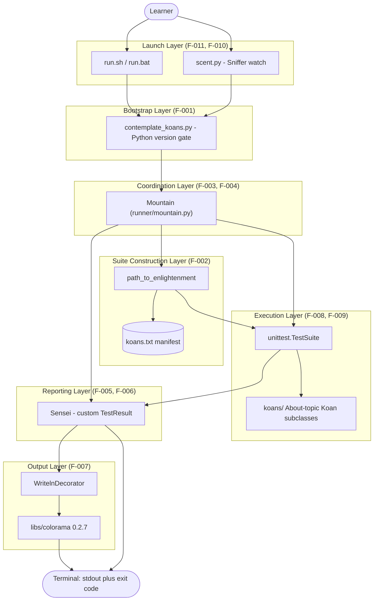

### 5.1.2 Core Components

The system decomposes into a thin entry point, a coordination and reporting framework (`runner/`), the curriculum content (`koans/`), and vendored support libraries (`libs/`), plus launch and quality-assurance auxiliaries. Because the output-format standard limits tables to four columns, the core-components inventory is presented as two complementary tables: the first captures responsibility, dependencies, and integration points; the second captures the critical considerations for each component.

**Table 1 — Responsibilities, Dependencies, and Integration Points**

| Component | Primary Responsibility | Key Dependencies / Integration Points |
|---|---|---|
| CLI entry point (`contemplate_koans.py`) | Guard the interpreter version, then import and launch the coordinator | `sys`; imports `runner.mountain.Mountain`; consumes `sys.argv` |
| Runner coordinator — `Mountain` (`runner/mountain.py`) | Wire stream + suite + reporter; optionally narrow to one koan; run the suite; trigger `learn()` | `path_to_enlightenment`, `Sensei`, `WritelnDecorator`, `unittest.TestLoader`; invoked by entry point |
| Suite builder — `path_to_enlightenment` (`runner/path_to_enlightenment.py`) | Read `koans.txt` and assemble an order-preserving `TestSuite` | `io`, `unittest`; reads `koans.txt`; imports `koans/` modules |
| Ordered manifest (`koans.txt`) | Declare the 39 koan test classes and their fixed execution order | Plain data file; read by the suite builder |
| Custom reporter — `Sensei` (`runner/sensei.py`) | Receive `unittest` callbacks, count progress, select and render the first failure, control process exit | `unittest.TestResult` via `MockableTestResult`, `helper`, `path_to_enlightenment`, `libs.colorama`; writes via `WritelnDecorator` |
| Output stream — `WritelnDecorator` + Colorama | Wrap `sys.stdout` with `writeln`; apply cross-platform ANSI color | `sys.stdout`, `libs/colorama`; the terminal |
| Learner scaffold — `Koan` (`runner/koan.py`) | Provide the `TestCase` base class and fill-in placeholder tokens | `unittest`; imported by every lesson via `from runner.koan import *` |
| Curriculum (`koans/`) | 38 `About*.py` lessons plus five implementation projects | `runner.koan`, stdlib `re`/`math`/`functools`/`random`, `example_file.txt`; loaded by the suite builder, edited by the learner |
| Support utilities (`helper.py`, `mockable_test_result.py`) | Class-name introspection (`cls_name`) and a patchable `TestResult` seam | `unittest`; used by `Sensei` and the self-tests |
| Vendored libraries (`libs/`) | Colorama 0.2.7 (color) and `mock` 0.6.0 (test doubles) | Self-contained; imported by `Sensei` and `runner/runner_tests/` |
| Launch & watch (`run.sh`, `run.bat`, `scent.py`) | Invoke the entry point; optionally re-run continuously on file change | Python 3, OS shell, optional Sniffer package |
| Self-test & CI (`_runner_tests.py`, `runner/runner_tests/`, `.travis.yml`) | Verify the runner framework's correctness | `unittest`, `libs.mock`; Travis CI on Python 3.9 |

**Table 2 — Critical Considerations**

| Component | Critical Considerations |
|---|---|
| CLI entry point | Hard-stops (does not run koans) on Python < 3.0; only warns (and proceeds) on 3.0–3.6; it is the sole version-policy point |
| Runner coordinator | Selective execution replaces the entire default suite; the `TestSuite` is invoked as a *callable* with `Sensei` as its result object |
| Suite builder | Contains **no** `try`/`except` — a missing manifest, bad class name, or import error propagates as a traceback; order is preserved via `sortTestMethodsUsing = None` |
| Ordered manifest | Single source of truth for sequence; the proxy-object module is listed twice; editing the file reshapes the curriculum without code changes |
| Custom reporter | Builds a **second, independent** full suite just to compute denominators (304 koans); pass counting stops once execution moves past the first failing class; calls `sys.exit(-1)` while any koan fails |
| Output stream | `colorama.init()` runs at import; a delegating `__getattr__` means the wrapper transparently exposes the underlying stream |
| Learner scaffold | Placeholder tokens (`__`, `___`, `____`, `_____`) intentionally cause failures until the learner supplies correct values |
| Curriculum | Lessons are stateless; the learner's edits to `koans/*.py` are the only cross-run state (personal `answers` are git-ignored) |
| Vendored libraries | Dated versions (Colorama 0.2.7, `mock` 0.6.0) are updated manually — a maintenance trade-off accepted for offline runnability |
| Self-test & CI | Exercises the **runner**, not the koans; it is the only automated quality gate in the repository |

### 5.1.3 Data Flow Description

**Primary data flows.** A single run is a linear data pipeline with no persistence:

1. **Invocation data.** The shell passes `sys.argv` to `contemplate_koans.py`, which forwards it to `Mountain.walk_the_path`. When two or more arguments are present, `args[1]` is prefixed with `koans.` and used to load a single koan class or method; otherwise the default full suite (already built in `Mountain.__init__`) runs.
2. **Manifest data.** `path_to_enlightenment` opens `koans.txt` as UTF-8 text, `filter_koan_names` strips whitespace and skips blank and `#`-comment lines, and each surviving line is a fully qualified class name handed to `unittest.TestLoader.loadTestsFromName`, which imports the corresponding `koans/` module and resolves the class into the ordered `TestSuite`.
3. **Execution data.** The `TestSuite`, invoked with `Sensei` as its `TestResult`, drives each test method and emits callbacks (`startTest`, `addSuccess`, `addFailure`/`addError`) carrying the test object and, for failures, a formatted traceback string.
4. **Reporting data.** `Sensei` converts callbacks into in-memory counters (`pass_count`, `lesson_pass_count`) and, for the earliest-line failure, scrapes the traceback into an assertion message and a koans-only, colorized stack excerpt.
5. **Output data.** Report strings are written through `WritelnDecorator.writeln` into the Colorama-wrapped `stdout` stream, and the process terminates with an exit code that encodes overall success.

**Integration patterns and protocols.** All component interaction is **synchronous, in-process method invocation** — there is no serialization, message bus, or remote call. The principal internal "protocol" is the `unittest` `TestResult` callback contract between the suite and `Sensei`. External protocols are limited to **filesystem I/O** (UTF-8 text read of `koans.txt`, Python import machinery for lesson modules, and `glob` for lesson discovery) and the **terminal protocol** (ANSI escape sequences produced by Colorama over a text-mode stream whose newlines `writeln` normalizes).

**Data transformation points.** The pipeline contains several well-defined transformations: manifest lines → trimmed class names (`filter_koan_names`); class names → `TestCase` objects (`TestLoader.loadTestsFromName`); raw traceback string → assertion text (`scrapeAssertionError`) and → koans-only colorized frames (`scrapeInterestingStackDump`, which discards any stack frame whose path does not contain `/koans/` and highlights `about_*.py` filenames and line numbers); counters → human-readable progress sentences (`report_progress`, `report_remaining`); and `pass_count` → a rotating Zen message index (`pass_count % 37`).

**Key data stores and caches.** There is **no database and no persistence layer**. The only durable artifacts are ordinary local files: `koans.txt` (the manifest), the `koans/*.py` lesson sources (which double as the interaction surface and the de-facto system of record for a learner's progress), and fixtures such as `example_file.txt` and `koans/GREEDS_RULES.txt`. Three volatile caches exist, all in memory and discarded on exit: (a) `Sensei.all_lessons`, a lazily memoized `glob` of `koans/about*.py` (excluding `about_extra_credit`) that backs `total_lessons()` (37); (b) the **second** curriculum suite `Sensei` constructs at initialization purely to compute `total_koans()` (304) — the suite is therefore built twice per run, once to execute and once to count; and (c) the `.pyc` bytecode cache, which the launchers suppress with the `-B` flag.

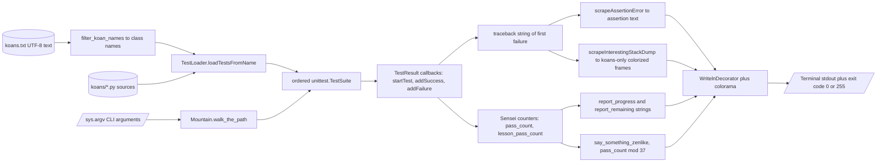

### 5.1.4 External Integration Points

Python Koans has **no external runtime systems** — no remote APIs, databases, message brokers, identity providers, or cloud services. Consequently, "external integration points" are best understood as the **local toolchain and optional developer-experience integrations** that surround the program, as established in Sections 1.2.1 and 2.3.2. The table records each such point together with its integration type, exchange pattern and protocol, and observed service-level guarantees. Because the output-format standard caps tables at four columns, the requested "Data Exchange Pattern" and "Protocol/Format" attributes are combined into a single column.

| Integration Point | Integration Type | Exchange Pattern & Protocol | SLA (observed) |
|---|---|---|---|
| Python 3 interpreter + `unittest` | Runtime host / stdlib framework | In-process API calls; `TestResult` callback protocol | None defined |
| Terminal / console (`stdout`) | Output device | One-way text stream; ANSI escape codes via Colorama | None defined |
| Command line (`sys.argv`) | Invocation input | Process arguments; optional positional `koans.<name>` selector | None defined |
| Local filesystem | Data source | Synchronous UTF-8 file reads; Python import; `glob` discovery | None defined |
| Sniffer (optional, `scent.py`) | Dev tooling — watch mode | Filesystem-change events trigger `os.system` re-invocation | None defined |
| Travis CI (`.travis.yml`) | CI pipeline | Git push/PR trigger runs `python _runner_tests.py` (Python 3.9); consumes exit code | None defined |
| Gitpod / Eclipse Che | Cloud dev workspace | Container image build; runs `contemplate_koans.py` | None defined |
| Vendored Colorama 0.2.7 (`libs/colorama/`) | Bundled library (runtime) | In-tree Python import (`from libs.colorama import ...`) | N/A (vendored) |
| Vendored `mock` 0.6.0 (`libs/mock.py`) | Bundled library (test) | In-tree Python import (`from libs.mock import *`) | N/A (vendored) |

No formal service-level agreements, uptime targets, latency budgets, or throughput guarantees are declared anywhere in the repository; the "SLA (observed)" column reports this fact rather than inventing figures. Two clarifications complete the boundary picture: the vendored libraries in `libs/` are integration *points* only in the sense of being third-party code compiled into the tree (they are not fetched at runtime), and the Git submodule `Submodule_01_Do_not_use_15Jun/` — an unrelated Git-ignore-template collection whose name signals it is not to be used — is explicitly **out of scope** and is not a functional integration of the application.


## 5.2 Component Details

This section details each major component along five dimensions — purpose and responsibilities, technologies and frameworks, key interfaces and APIs, data persistence, and scaling considerations — and then illustrates their collaboration through a component-interaction diagram, sequence diagrams for the two principal execution flows, and a process-lifecycle state machine. The finer-grained pass-counting and koan-lifecycle state machines already appear in Section 4.3.1.3 and are complemented (not repeated) here.

### 5.2.1 Component Interaction Model

At runtime the components form a short call chain rather than a graph of peers: the entry point constructs the coordinator, the coordinator builds and runs the suite while delegating result handling to the reporter, and the reporter renders everything through the decorated stream. The reporter is the only component that talks "back" to shared infrastructure (`helper` and `path_to_enlightenment`) during a run. The diagram below shows the concrete calls, expanding the internal wiring that the higher-level flowchart in Section 1.2.2 summarizes.

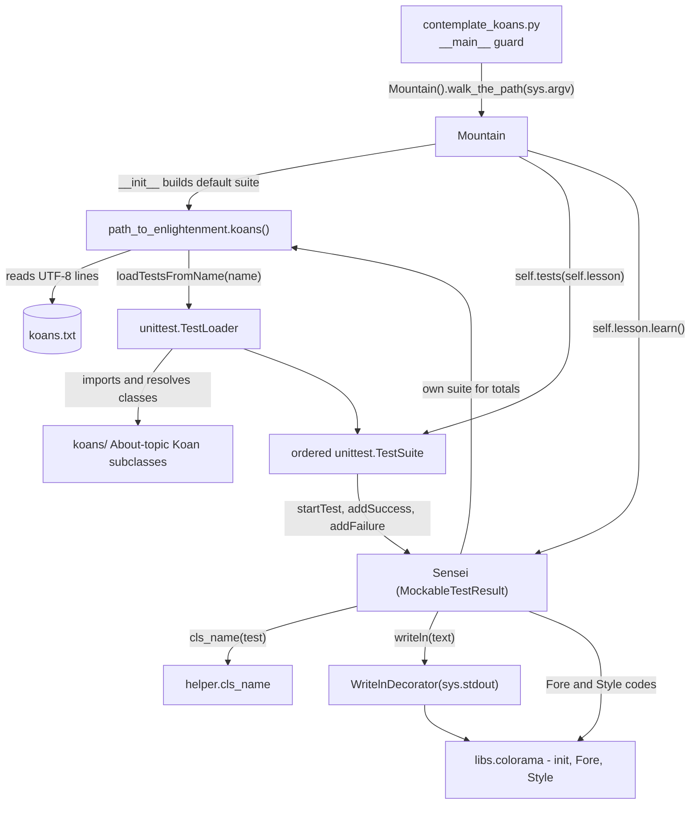

### 5.2.2 CLI Entry Point — `contemplate_koans.py`

- **Purpose and responsibilities:** Serve as the executable entry point (feature F-001). Enforce the interpreter-version policy under a `__main__` guard, then bootstrap the runner. It performs no test logic itself.
- **Technologies and frameworks:** Pure Python 3; imports only `sys` from the standard library. Carries a `#!/usr/bin/env python` shebang.
- **Key interfaces and APIs:** Consumes `sys.version_info` (version gate) and `sys.argv` (forwarded verbatim). Its sole outbound call is `from runner.mountain import Mountain` followed by `Mountain().walk_the_path(sys.argv)`.
- **Data persistence:** None; it holds no state.
- **Scaling considerations:** Not applicable — it is a fixed, constant-cost bootstrap. Its only branching is the two-tier version gate: a hard stop below Python 3.0 (koans never run) and a soft warning for 3.0–3.6 (execution proceeds).

### 5.2.3 Runner Coordinator — `Mountain` (`runner/mountain.py`)

- **Purpose and responsibilities:** Orchestrate a single run (feature F-003) and, when arguments request it, narrow execution to one koan (feature F-004). It wires together the stream, the suite, and the reporter, executes the suite, and triggers final reporting.
- **Technologies and frameworks:** Python 3 with `unittest` (`TestLoader`) and `sys`; composes the project's own `path_to_enlightenment`, `Sensei`, and `WritelnDecorator`.
- **Key interfaces and APIs:** `__init__` sets `self.stream = WritelnDecorator(sys.stdout)`, `self.tests = path_to_enlightenment.koans()`, and `self.lesson = Sensei(self.stream)`. `walk_the_path(args=None)` replaces `self.tests` with `unittest.TestLoader().loadTestsFromName("koans." + args[1])` when `args and len(args) >= 2`, then runs the suite via the callable form `self.tests(self.lesson)`, calls `self.lesson.learn()`, and returns the reporter.
- **Data persistence:** None durable; it holds the transient execution state (`stream`, `tests`, `lesson`) for the process lifetime.
- **Scaling considerations:** The default run loads and executes all 304 koans in memory, so runtime scales linearly with curriculum size; selective execution (F-004) is the explicit mechanism for bounding work to a single class or method. There is no parallelism — execution is strictly sequential to preserve pedagogical order.

### 5.2.4 Suite Builder — `path_to_enlightenment` (`runner/path_to_enlightenment.py`) and `koans.txt`

- **Purpose and responsibilities:** Construct the ordered `unittest.TestSuite` that defines the curriculum (feature F-002) from the `koans.txt` manifest, preserving declared order.
- **Technologies and frameworks:** Python 3 with `io` (UTF-8 file reading) and `unittest` (`TestLoader`, `TestSuite`). `koans.txt` is a plain newline-delimited data file (39 fully qualified class names, comments prefixed `#`).
- **Key interfaces and APIs:** Module-level functions — `filter_koan_names(lines)` (generator that strips whitespace and drops blank/comment lines), `names_from_file(filename)` (UTF-8 `io.open` reader), `koans_suite(names)` (sets `loader.sortTestMethodsUsing = None` to preserve order, then `loadTestsFromName` + `addTests`), and `koans(filename=KOANS_FILENAME)` (the public composition). The constant `KOANS_FILENAME = 'koans.txt'`.
- **Data persistence:** Read-only consumption of `koans.txt`; produces an in-memory suite. It writes nothing.
- **Scaling considerations:** Suite-build cost is O(number of manifest entries); each entry triggers a module import and class resolution. Notably, this builder runs **twice** per invocation — once for `Mountain` (to execute) and once inside `Sensei` (to count totals). It deliberately contains **no** `try`/`except`, so a missing file, unresolvable name, or import error surfaces as a standard traceback.

### 5.2.5 Custom Reporter — `Sensei` (`runner/sensei.py`)

- **Purpose and responsibilities:** Provide focused first-failure feedback (F-005) and progress/motivational reporting (F-006). As a `unittest.TestResult` subclass, it receives execution callbacks, tracks progress counters, selects the earliest-line failure, renders a colored report, and controls the process exit code.
- **Technologies and frameworks:** Python 3 with `unittest`, `re` (traceback scraping and line-number extraction), `os`/`glob` (lesson discovery), and the vendored `libs.colorama` (`init`, `Fore`, `Style`, initialized at import). It extends `MockableTestResult`, which extends `unittest.TestResult`.
- **Key interfaces and APIs:** The `unittest` callback surface — `startTest` (prints the `Thinking <Class>` heading and advances `lesson_pass_count`, excluding `AboutAsserts` and `AboutExtraCredit`), `addSuccess` (guarded by `passesCount()`; prints the green "expanded your awareness" line and increments `pass_count`), and `addError`→`addFailure` (merged into one ordered list). Reporting API — `firstFailure()`/`sortFailures()` (earliest-line selection), `learn()` (final render + exit control), `scrapeAssertionError()`/`scrapeInterestingStackDump()` (traceback distillation), `report_progress()`/`report_remaining()`, `say_something_zenlike()`, `total_koans()`, `total_lessons()`, and the memoizing `filter_all_lessons()`.
- **Data persistence:** None durable; in-memory state only — `prevTestClassName`, `pass_count`, `lesson_pass_count`, the lazily cached `all_lessons`, and a **second, independent** curriculum suite (`self.tests`) built purely to compute the 304-koan denominator.
- **Scaling considerations:** Callback handling is O(1) per test; failure sorting is O(k log k) over failures in the active class only. Because it builds its own full counting suite, memory and setup cost roughly double relative to a single suite build; `filter_all_lessons` caching avoids repeated `glob` scans within a run.

### 5.2.6 Learner Scaffold and Curriculum — `runner/koan.py` and `koans/`

- **Purpose and responsibilities:** `runner/koan.py` supplies the learner scaffold (feature F-008): the `Koan` base class and the fill-in placeholder tokens. `koans/` is the curriculum and projects (feature F-009): 38 `About*.py` lesson modules plus five implementation projects (triangle ×2, scoring/"Greed", dice, proxy object).
- **Technologies and frameworks:** Python 3 with `unittest` (`Koan(unittest.TestCase)`). Lessons `from runner.koan import *` and use only standard-library modules where needed (`re`, `math`, `functools`, `random`); a subpackage `koans/a_package_folder/` supports the packages lesson, and `example_file.txt`/`GREEDS_RULES.txt` are fixtures.
- **Key interfaces and APIs:** `__all__ = ["__", "___", "____", "_____", "Koan"]`; `__ = "-=> FILL ME IN! <=-"`, `____ = "-=> TRUE OR FALSE? <=-"`, `_____ = 0`, and `___` is an empty `Exception` subclass. Lessons expose `test_*` methods discovered by `unittest`.
- **Data persistence:** The curriculum is the system's **only cross-run state** — a learner's progress persists as their edits to `koans/*.py`; personal `answers` are excluded by `.gitignore`/`.hgignore`. `runner/koan.py` itself is stateless.
- **Scaling considerations:** Curriculum size is fixed by `koans.txt`; adding lessons means adding a module and a manifest line (no code change to the runner). Each lesson is independent and stateless, so lessons neither share nor accumulate runtime state.

### 5.2.7 Output Stream and Support Utilities

- **Purpose and responsibilities:** Deliver colored terminal output (feature F-007) and supply small cross-cutting utilities. `WritelnDecorator` adds `writeln` over `sys.stdout`; `libs/colorama` renders ANSI color (with Windows translation); `helper.cls_name` resolves class names for headings and grouping; `MockableTestResult` is the patch seam enabling the self-tests (feature F-012).
- **Technologies and frameworks:** Python 3; `WritelnDecorator` is adapted from legacy `unittest`; Colorama is vendored at version 0.2.7; `mock` 0.6.0 (also vendored) backs the runner tests.
- **Key interfaces and APIs:** `WritelnDecorator.__getattr__` (transparent delegation) and `writeln(arg=None)`; `helper.cls_name(obj)` returns `obj.__class__.__name__`; `libs.colorama` exposes `init`, `Fore`, `Style`; `MockableTestResult` is an empty `unittest.TestResult` subclass.
- **Data persistence:** None — these components are stateless pass-throughs and helpers.
- **Scaling considerations:** Output volume grows with the number of narrated classes and the single failure report; there is no buffering strategy beyond the underlying stream. Vendoring trades automatic upgrades for guaranteed offline availability.

### 5.2.8 Sequence Diagrams for Key Flows

**Default full-suite run.** This is the flow that `run.sh`, `run.bat`, and Sniffer all trigger. The suite is built during `Mountain.__init__`, executed against `Sensei`, and finalized by `learn()`.

```mermaid
sequenceDiagram
    actor Learner
    participant Shell as Shell launcher
    participant Entry as contemplate_koans.py
    participant Mtn as Mountain
    participant PTE as path_to_enlightenment
    participant Suite as unittest.TestSuite
    participant Sensei as Sensei
    participant Out as Output stream

    Learner->>Shell: python3 -B contemplate_koans.py
    Shell->>Entry: execute __main__
    Entry->>Entry: check sys.version_info
    Entry->>Mtn: Mountain()
    Mtn->>PTE: koans()
    PTE-->>Mtn: ordered TestSuite of 304 koans
    Mtn->>Sensei: Sensei(stream) builds 2nd counting suite
    Entry->>Mtn: walk_the_path(sys.argv)
    Mtn->>Suite: self.tests(self.lesson)
    loop each test in manifest order
        Suite->>Sensei: startTest(test)
        Sensei->>Out: writeln Thinking ClassName
        Suite->>Sensei: addSuccess or addFailure
        Sensei->>Out: writeln pass message on success
    end
    Mtn->>Sensei: learn()
    Sensei->>Sensei: firstFailure and scrape traceback
    Sensei->>Out: errorReport, progress, zen message
    Out-->>Learner: colored output and exit code 0 or 255
```

**Selective (single-koan) run.** When invoked with a koan name (for example `about_strings` or `about_strings.AboutStrings.test_...`), the coordinator replaces the default suite before execution; the reporter still computes its totals from the full 304-koan curriculum.

```mermaid
sequenceDiagram
    actor Learner
    participant Entry as contemplate_koans.py
    participant Mtn as Mountain
    participant Loader as unittest.TestLoader
    participant Suite as Selected TestSuite
    participant Sensei as Sensei
    participant Out as Output stream

    Learner->>Entry: python3 contemplate_koans.py about_strings
    Entry->>Mtn: Mountain() then walk_the_path(argv)
    Note over Mtn: args present and len at least 2
    Mtn->>Loader: loadTestsFromName koans.about_strings
    Loader-->>Mtn: selected suite replaces default
    Mtn->>Suite: self.tests(self.lesson)
    Suite->>Sensei: startTest, addSuccess, addFailure
    Mtn->>Sensei: learn()
    Sensei->>Out: focused report for selected koan
    Note over Sensei: totals still from full 304-koan suite
```

### 5.2.9 Process Lifecycle State Transitions

The application progresses through a small set of process-level states from launch to exit. This macro view complements the intra-run pass-counting state machine and the per-koan lifecycle documented in Section 4.3.1.3.

```mermaid
stateDiagram-v2
    [*] --> Launched: shell or watch invokes entry point
    Launched --> VersionGate: __main__ checks sys.version_info
    VersionGate --> Halted: Python below 3.0, print guidance and stop
    VersionGate --> Bootstrapping: Python 3.0 or newer, warn if below 3.7
    Bootstrapping --> SuiteBuilt: Mountain.__init__ builds suite and Sensei
    SuiteBuilt --> Executing: walk_the_path runs suite against Sensei
    Executing --> Executing: per-test callbacks accumulate state
    Executing --> Reporting: learn renders the outcome
    Reporting --> ExitFail: failures present, sys.exit minus 1, code 255
    Reporting --> ExitPass: no failures, completion banner, code 0
    Halted --> [*]
    ExitFail --> [*]
    ExitPass --> [*]
```


## 5.3 Technical Decisions

The architecture of Python Koans reflects a small number of deliberate, mutually reinforcing decisions, all serving one goal: a zero-install, offline, deterministic learning tool. This section states each decision, the alternatives weighed, and the trade-offs accepted, then records them formally as ADRs and visualizes the decision logic as a tree. Every decision is inferred from observable code and configuration, not from external design documents (none exist in the repository).

### 5.3.1 Decision Overview

| Decision Area | Chosen Approach | Key Trade-off Accepted |
|---|---|---|
| Architecture style | Single-process, monolithic CLI; layered pipeline over stdlib `unittest` | No horizontal scaling or distribution (a non-goal for a local tutorial) |
| Communication pattern | In-process synchronous calls plus the `unittest` `TestResult` callback protocol | No async, IPC, or messaging; the exit code is the only cross-boundary signal |
| Data storage | Flat files — `koans.txt` manifest and `koans/*.py` sources; no database | No durable/queryable progress store; state is recomputed every run |
| Caching strategy | Lazy in-memory memoization (`all_lessons`); `-B` disables bytecode cache | The full suite is built twice per run for reporter self-containment |
| Security mechanism | Local-process trust model; no authN/authZ, crypto, or input sanitization | No defense against untrusted input (unnecessary for local, repo-owned code) |

### 5.3.2 Decision Rationale by Area

**Architecture style.** The system is a monolith because the deliverable is a single program a learner runs locally; there are no independently deployable concerns to separate. Building a thin sequencing-and-presentation layer directly on `unittest` (rather than adopting a heavier test framework or plugin ecosystem) gives precise control over ordering and the "one failure at a time" experience while adding no runtime dependency. The alternatives considered and rejected:

| Alternative | Why Not Adopted |
|---|---|
| Web application / hosted service | Requires hosting and networking and breaks the offline "clone and run" model |
| Third-party runner plugin (e.g., a `pytest` plugin) | The strict manifest ordering and custom `Sensei` presentation are simpler to own directly on `unittest`, and it avoids a required external dependency |
| Reusable library published to a package index | The product is a runnable curriculum, not an API; distribution is by GitHub clone, so packaging adds cost without benefit |

**Communication patterns.** All inter-component communication is synchronous, in-process method invocation. The one formalized contract is the `unittest` `TestResult` callback protocol, through which the executing `TestSuite` drives `Sensei` (`startTest`, `addSuccess`, `addFailure`/`addError`). This was chosen for determinism and zero infrastructure — a message bus, RPC layer, or async runtime would add complexity with no user-visible benefit and would jeopardize the guaranteed lesson ordering. The only signal that crosses a process boundary is the **exit code** (0 or 255), which the Sniffer watch loop and Travis CI consume; the only external event source is Sniffer's filesystem-change trigger, which simply re-invokes the whole program.

**Data storage.** There is no database, cache server, or object store (confirmed by repository-wide search and documented in Section 3.5). The manifest and lesson sources are ordinary files, and the learner's edits to `koans/*.py` are the durable system of record. A tutorial has no multi-user, durability, or query requirements that would justify a storage engine, and introducing one would contradict the offline, zero-setup goal. The accepted trade-off is the absence of resume/checkpoint: progress is recomputed from scratch on every run — inexpensive at 304 koans and pedagogically appropriate, since each run re-verifies the learner's answers end to end.

**Caching strategy.** Caching is intentionally minimal and local to `Sensei`. `filter_all_lessons()` memoizes its `glob` result in `self.all_lessons` so the lesson-file scan runs once per process, and the launch scripts pass `-B` to suppress `.pyc` bytecode caching (keeping the frequently edited working tree clean). A conspicuous non-optimization is that `Sensei` builds its **own** full curriculum suite for computing totals rather than reusing the suite `Mountain` executes — the curriculum is therefore assembled twice per run. This is a considered trade-off: it keeps `Sensei` self-contained (it can report `total_koans()` without holding a reference to `Mountain`'s suite), and the duplicated work is negligible for a suite of this size.

**Security mechanism.** The system implements no authentication, authorization, encryption, secrets management, or input sanitization — and, per the code's trust model, none is warranted. The program runs locally under the invoking user, reads only repository-controlled files, performs no network or privileged operations, and dynamically imports only the classes named in the repo-owned `koans.txt`. The single enforcement point is the interpreter-version gate in `contemplate_koans.py`. This is an explicit scope decision consistent with a local educational tool, not an oversight; there is no untrusted input surface to defend.

### 5.3.3 Architecture Decision Records

The following ADRs capture the durable decisions in a consistent Context → Decision → Consequences form. All are **Accepted** and reflected in the current codebase.

**ADR-001 — Build on the standard-library `unittest` framework.**
- *Context:* The curriculum is expressed as failing tests the learner must make pass.
- *Decision:* Use `unittest` (`TestCase`, `TestLoader`, `TestSuite`, `TestResult`) as the execution foundation; every lesson subclasses `Koan(unittest.TestCase)`.
- *Consequences:* Zero external runtime dependency and universal availability with any CPython interpreter; behavior is bound to the interpreter version (hence the 3.7+ target), and the project must supply its own presentation layer since `unittest` output is not learner-friendly.

**ADR-002 — Provide feedback through a custom `TestResult` (`Sensei`).**
- *Context:* Learners benefit from focusing on a single failure at a time rather than a wall of errors.
- *Decision:* Subclass `unittest.TestResult` (via `MockableTestResult`) to intercept callbacks, select the earliest-line failure, render colored guidance, and control the exit code with `sys.exit(-1)`.
- *Consequences:* Full control over pacing and presentation; the reporter carries meaningful state and logic (and its own counting suite), making it the most complex and most heavily tested component.

**ADR-003 — Drive execution order from a file-backed manifest.**
- *Context:* Lessons must run in a fixed pedagogical order, and the sequence should be editable without touching runner code.
- *Decision:* Declare the ordered class list in `koans.txt` and set `loader.sortTestMethodsUsing = None` so declaration order is preserved.
- *Consequences:* Curriculum sequence is data, not code; adding or reordering lessons is a manifest edit. The manifest becomes a critical, untyped input whose correctness is assumed.

**ADR-004 — Vendor third-party libraries into `libs/`.**
- *Context:* Colored output and test doubles require third-party code, but the project must remain installable-free and offline.
- *Decision:* Copy Colorama 0.2.7 and `mock` 0.6.0 into `libs/` and import them from there.
- *Consequences:* No `pip` step and no dependency resolution; libraries must be updated manually and are consequently dated (a maintenance trade-off flagged in Section 2.4).

**ADR-005 — Keep the process stateless; persist nothing but learner edits.**
- *Context:* Progress could be checkpointed, but doing so adds storage and setup.
- *Decision:* Recompute all progress on every run; store no session, log, or progress file.
- *Consequences:* Trivial setup and no data to manage or secure; there is no resume, and totals are recomputed (and the suite rebuilt) each run.

**ADR-006 — Fail fast on operational errors in suite construction.**
- *Context:* Missing manifest entries, bad class names, or import errors are possible but originate from repository-controlled inputs.
- *Decision:* Omit `try`/`except` in `path_to_enlightenment`, letting such errors propagate as standard tracebacks to stderr.
- *Consequences:* Maximum simplicity and transparent diagnostics for maintainers; no graceful degradation for a corrupted manifest, which is acceptable because the manifest ships with the repository.

### 5.3.4 Design Decision Tree

The tree below traces the reasoning that yields the chosen architecture; each "No" follows a product constraint (offline, single-user, zero-install), and each "Yes" leads to an alternative that was evaluated and rejected.

```mermaid
flowchart TD
    Q1{"Remote or multi-user access required?"}
    Q1 -->|No| Q2{"Durable or queryable progress needed?"}
    Q1 -->|Yes| AltWeb["Rejected: service plus database"]
    Q2 -->|No| Q3{"Third-party test-runner features needed?"}
    Q2 -->|Yes| AltDB["Rejected: introduce a database"]
    Q3 -->|No| Q4{"Acceptable to fetch runtime dependencies?"}
    Q3 -->|Yes| AltPlugin["Rejected: adopt a pytest plugin model"]
    Q4 -->|No| Vendor["Vendor libraries into libs/"]
    Q4 -->|Yes| AltPip["Rejected: pip-managed requirements"]
    Vendor --> Result["Chosen: single-process CLI on stdlib unittest,<br/>file-backed manifest, vendored libs, stateless run"]
```


## 5.4 Cross-Cutting Concerns

Cross-cutting concerns in an enterprise system typically span monitoring, distributed tracing, centralized logging, identity, formal SLAs, and disaster recovery. Python Koans is a local, single-process, stateless educational program, so several of these concerns are intentionally minimal or not applicable — and this section documents exactly which, with the code evidence, rather than describing capabilities the repository does not contain. The runtime detail behind state and error handling is established in Section 4.3; this section presents the architectural view and adds a complementary error-handling flow focused on the reporter's internal classification and reporting pipeline.

### 5.4.1 Monitoring and Observability

There is **no application performance monitoring, metrics pipeline, or telemetry** — a search for `opentelemetry`, `prometheus`, `statsd`, `sentry`, and similar libraries returns nothing. Observability is achieved entirely through the program's own console output and its process exit code, plus the CI build status for framework health. These are the signals the system actually produces:

| Signal | Source | What It Indicates |
|---|---|---|
| Progress report (koans %, lessons) | `Sensei.report_progress()` → stdout | How far the learner has advanced along the Path |
| First-failure diagnostic | `Sensei.errorReport()` → stdout | The exact file, line, and assertion to address next |
| Process exit code (0 or 255) | `Sensei.learn()` (`sys.exit(-1)` at `sensei.py:94`) | Machine-readable pass/fail, consumed by the watch loop and CI |
| CI build status | `.travis.yml` running `_runner_tests.py` (Python 3.9) | Health of the runner framework itself |

The exit code is the key machine-observable signal: it is what Sniffer's re-run loop and Travis CI actually act upon.

### 5.4.2 Logging and Tracing

The system uses **no logging framework** — there is no `import logging`, no log files, and no email/webhook channels anywhere in the application code. All human-facing output is written synchronously to standard output: the runner emits through `self.stream.writeln(...)` (the `WritelnDecorator` over `sys.stdout`, colorized by Colorama), while the entry point uses two bare `print()` calls solely for the version-gate messages. "Tracing" in the distributed-systems sense does not exist; the closest analogue is `Sensei`'s **traceback distillation** — `scrapeInterestingStackDump()` trims a failure's Python traceback to only the frames whose path contains `/koans/` and highlights the `about_*.py` filename and line number, so the learner sees a focused, curriculum-relevant excerpt rather than the full internal stack. This is a deliberate design choice: the output *is* the observability surface, so it is optimized for a human learner rather than for aggregation.

### 5.4.3 Error Handling Patterns

The architecture distinguishes two error classes and handles them very differently (see Section 4.3.2 for the full runtime treatment):

| Error Class | Handling Approach | Terminating Signal |
|---|---|---|
| Expected — a failing koan | Captured via `addFailure`/`addError` into one ordered list; earliest-line failure selected and rendered | `sys.exit(-1)` → shell code 255 |
| Operational — uncaught exception (missing `koans.txt`, bad manifest name, import error) | No `try`/`except` in the build path; propagates as a standard traceback to stderr | Non-zero exit from the interpreter |

The dominant pattern is **collect-then-report with first-failure focus**: errors and failures are merged into a single sequence-preserving list so the earliest source-line failure can be surfaced, and only that one is elaborated. There is **no in-process retry**; "retry" is always a re-execution of the whole suite via a manual re-run, a Sniffer-triggered re-run, or a CI re-run. The only graceful-degradation behavior is the **soft version gate** (a WARNING that lets Python 3.0–3.6 proceed), while operational errors follow a **fail-fast** policy. The diagram below traces the reporter-internal path from a `unittest` callback to the final exit code.

```mermaid
flowchart TD
    Cb["unittest callback fires"] --> Kind{"Success or failure/error?"}
    Kind -->|"addSuccess"| Pass{"passesCount() true?"}
    Pass -->|Yes| Count["print awareness line, pass_count plus 1"]
    Pass -->|No| Skip["silently skip - past first failing class"]
    Kind -->|"addError"| Merge["addError delegates to addFailure"]
    Kind -->|"addFailure"| Store["append to single ordered failures list"]
    Merge --> Store
    Store --> Learn["learn() at end of suite"]
    Count --> Learn
    Skip --> Learn
    Learn --> Has{"Any failures recorded?"}
    Has -->|No| Banner["completion banner, exit code 0"]
    Has -->|Yes| First["firstFailure(): sortFailures by source line"]
    First --> Scrape["scrapeAssertionError plus scrapeInterestingStackDump<br/>keep only koans frames"]
    Scrape --> Emit["errorReport: karma line, assertion, frames, progress, zen"]
    Emit --> Exit255["sys.exit minus 1, shell code 255"]
```

### 5.4.4 Authentication and Authorization

There is **no authentication or authorization framework**, and none is applicable. The program runs locally under the invoking operating-system user, exposes no network endpoint, and manages no accounts, roles, permissions, sessions, tokens, or secrets. The only access-control-like construct in the entire runtime is the interpreter-version gate in `contemplate_koans.py`, which is a compatibility check rather than a security control. As established in Section 5.3.2, all inputs (the manifest and koan modules) are repository-controlled and therefore trusted; the local-process trust model makes an identity layer unnecessary.

### 5.4.5 Performance Requirements and SLAs

The repository defines **no performance requirements, latency budgets, throughput targets, or service-level agreements** — appropriately, since there is no service to meet them. The observable performance characteristics are:

| Aspect | Observed Behavior |
|---|---|
| Execution model | Single-threaded, synchronous, in-process; strictly sequential to preserve lesson order |
| Curriculum size | 304 koans across 37 lessons, executed in `koans.txt` order |
| Dominant cost | The curriculum suite is constructed twice per run (once to execute, once for `Sensei` totals) |
| Work-bounding mechanism | Selective execution of a single class or method via the CLI argument |
| Formal SLA / latency / throughput targets | None defined anywhere in the repository |

Performance is a non-goal at the scale of a local tutorial; the design favors clarity (the double suite build) over micro-optimization, and the primary lever a learner has to reduce runtime is running a single koan rather than the whole Path.

### 5.4.6 Disaster Recovery and Resilience

Because the application is **stateless and persists nothing** but the learner's own source edits, there is no data tier to back up, replicate, or restore, and consequently no high-availability, failover, or disaster-recovery procedure in the traditional sense. Resilience is a function of simplicity and reproducibility:

- **Nothing to recover at runtime.** Each invocation rebuilds all state in memory and discards it on exit; a crashed or interrupted run leaves no corrupt state — the learner simply re-runs.
- **Learner progress.** A learner's answers live in their edited `koans/*.py` files; safeguarding them is the learner's responsibility, aided by the convention of keeping personal `answers` out of version control (both `.gitignore` and `.hgignore` exclude them).
- **Source recoverability.** The canonical project is distributed via GitHub (per `README.rst`), so the codebase itself is recoverable by re-cloning; the reproducible Gitpod workspace (`.gitpod.yml`, `.gitpod.Dockerfile`) offers a clean, disposable environment.
- **Regression safety net.** The runner's own `unittest` suite, executed in CI (`_runner_tests.py` via `.travis.yml`), guards against regressions in the framework and is the mechanism for recovering confidence after changes.


## 5.5 References

The following repository files and folders were examined as the evidentiary basis for this section. No web sources were used.

**Runtime source files**

- `contemplate_koans.py` - CLI entry point; two-tier Python version gate and launch of `Mountain`
- `runner/mountain.py` - `Mountain` coordinator; suite/stream/reporter wiring, `walk_the_path`, selective execution
- `runner/path_to_enlightenment.py` - suite builder; manifest parsing and order-preserving `TestSuite` construction (no `try`/`except`)
- `runner/sensei.py` - `Sensei` custom `TestResult`; callbacks, first-failure selection, `learn()`, traceback scraping, counters, `sys.exit(-1)` (line 94), lazy `all_lessons` cache, second counting suite
- `runner/koan.py` - learner scaffold; `Koan(unittest.TestCase)` and placeholder tokens
- `runner/writeln_decorator.py` - `WritelnDecorator` output-stream wrapper (`__getattr__`, `writeln`)
- `runner/helper.py` - `cls_name` class-name introspection
- `runner/mockable_test_result.py` - `MockableTestResult` test seam

**Manifest, fixtures, and launch/watch/CI**

- `koans.txt` - ordered manifest of 39 koan test classes
- `run.sh` - POSIX launcher (`python3 -B contemplate_koans.py`)
- `run.bat` - interactive Windows launcher
- `scent.py` - optional Sniffer watch integration (`os.system` re-invocation)
- `_runner_tests.py` - runner self-test entry point
- `.travis.yml` - Travis CI configuration (Python 3.9)
- `.gitpod.yml`, `.gitpod.Dockerfile` - reproducible cloud workspace
- `.gitignore`, `.hgignore` - ignore rules that exclude learner `answers`
- `example_file.txt` - file-I/O lesson fixture
- `koans/GREEDS_RULES.txt` - specification backing the scoring ("Greed") project

**Vendored libraries and documentation**

- `libs/colorama/` - vendored Colorama 0.2.7 (ANSI color, Windows translation) consumed by `Sensei`
- `libs/mock.py` - vendored `mock` 0.6.0 test doubles used by the runner self-tests
- `README.rst` - project overview, supported-interpreter policy, and GitHub distribution

**Folders**

- `runner/` - the execution-and-reporting framework package
- `runner/runner_tests/` - the framework's own `unittest` suite (the automated quality gate)
- `koans/` - the curriculum (38 `About*.py` lessons plus five implementation projects)
- `koans/a_package_folder/` - subpackage supporting the packages lesson
- `libs/` - vendored third-party support libraries
- `Submodule_01_Do_not_use_15Jun/` - Git submodule (unrelated Git-ignore-template collection); confirmed **out of scope** and not a functional integration

**Cross-referenced specification sections**

- `1.2 System Overview` - system framing, component inventory, and the high-level runtime flowchart
- `2.3 Feature Relationships` - feature IDs (F-001–F-012), integration points, shared components
- `3.2 Frameworks & Libraries` - stdlib `unittest` core and vendored library versions
- `3.5 Databases & Storage` - confirmation of no database/persistence/cache tier
- `4.3 Technical Implementation Flows` - state management, existing state diagrams, and error-handling runtime detail


# 6. SYSTEM COMPONENTS DESIGN

## 6.1 Core Services Architecture

### 6.1.1 Applicability Assessment

**Core Services Architecture is not applicable for this system.** Python Koans is a monolithic, single-process, single-user command-line application — not a microservices or distributed system. It comprises no independently deployable services, exposes no network endpoints, and requires no service discovery, load balancing, or inter-service messaging. This determination is drawn directly from the repository and corroborated by Section 5.1 (High-Level Architecture), which characterizes the system as a "monolithic, single-process, single-user command-line application," and by Section 5.3 (Technical Decisions).

The system's entire runtime is a single Python interpreter process. The launcher `run.sh` executes `python3 -B contemplate_koans.py`; the entry point hands control to one coordinator via `Mountain().walk_the_path(sys.argv)`; and every subsequent interaction — suite construction, test execution, and result reporting — is a synchronous, in-process method call. No second process, host, or network hop exists anywhere in the execution path. The sole process spawn in the codebase is the optional developer watch tool `scent.py`, which merely re-invokes the same one-shot program (`os.system('python3 -B contemplate_koans.py')`) when a watched file changes; it is a convenience loop, not a service.

A repository-wide inspection of the application source (`runner/`, `koans/`, and the root scripts) confirms the complete absence of the building blocks that would necessitate a core-services architecture.

**Table 6.1.1-1 — Distributed-System Traits and Evidence of Their Absence**

| Distributed-System Trait | Evidence of Absence in Repository |
|---|---|
| Network / RPC / web transport | Zero imports of `socket`, `http`, `urllib`, `requests`, `asyncio`, `grpc`, or any web framework (Flask/Django/FastAPI/Tornado) across the application source |
| Message brokers / event bus | Zero imports of `kafka`, `pika`, `amqp`, `nats`, `zmq`, `celery`, or any queue client |
| Concurrency / multi-process runtime | Zero imports of `threading`, `multiprocessing`, `concurrent`, or `subprocess`; execution is strictly sequential to preserve lesson order |
| Persistent data tier | No database driver or ORM (`sqlite`/`sqlalchemy`/`redis`/`pymongo` all absent); the system persists nothing but the learner's own `koans/*.py` edits |
| Deployment / orchestration | No application `Dockerfile`, `docker-compose`, Kubernetes/Helm manifest, `Procfile`, or IaC; the only container file, `.gitpod.Dockerfile`, provisions a developer workspace (per Section 3.6), not a service |

Because the product's goals are a zero-install, offline, deterministic learning tool (Section 5.3), service decomposition, distribution, and horizontal scalability are explicit **non-goals**. The remainder of this section nevertheless documents each mandated concern area — Service Components (6.1.2), Scalability Design (6.1.3), and Resilience Patterns (6.1.4) — through the lens of what the repository actually implements, explaining in each case why the conventional distributed-systems mechanism is absent and what single-process equivalent (if any) stands in its place.

**Table 6.1.1-2 — Mandated Concern Areas and Their Applicability**

| Concern Area | Applicable to This System? | Basis |
|---|---|---|
| Service Components | No | Single process; "components" are in-process modules, not services (see 6.1.2) |
| Scalability Design | No (no service tier) | "Scale" is per-user replication of the whole program; no auto-scaling infrastructure (see 6.1.3) |
| Resilience Patterns | No (distributed sense) | Statelessness + fail-fast + re-run/re-clone recovery; no failover or redundancy tier (see 6.1.4) |

### 6.1.2 Service Components

The concept of discrete, independently deployable **services does not apply**. Python Koans runs as one process in which a small set of cooperating modules invoke one another directly. What a distributed system would model as "services" are here ordinary Python objects instantiated and called within a single interpreter (Section 5.1.2, Section 5.2): the coordinator `Mountain` (`runner/mountain.py`), the suite builder `path_to_enlightenment` (`runner/path_to_enlightenment.py`), the reporter `Sensei` (`runner/sensei.py`), and the output wrapper `WritelnDecorator`. The diagram below shows every runtime interaction; note that all edges are synchronous in-process calls contained within a single OS-process boundary, with no network segment to cross.

**Diagram 6.1.2-1: In-Process Component Interaction (single process — no network services)**

```mermaid
flowchart TD
    Learner(["Learner (single OS user)"])
    Console(["Terminal: stdout plus process exit code"])
    subgraph OneProcess["Single OS Process - one python3 interpreter (no network boundary)"]
        Entry["contemplate_koans.py<br/>entry point / version gate"]
        Mtn["Mountain<br/>runner/mountain.py (coordinator)"]
        PTE["path_to_enlightenment<br/>suite builder"]
        Suite["unittest.TestSuite<br/>koans/ lesson TestCases"]
        Sensei["Sensei<br/>runner/sensei.py (reporter)"]
        Out["WritelnDecorator plus libs/colorama"]
    end
    Learner -->|"sys.argv"| Entry
    Entry -->|"in-process call"| Mtn
    Mtn -->|"builds suite"| PTE
    PTE -->|"returns TestSuite"| Mtn
    Mtn -->|"suite runs against result"| Suite
    Suite -->|"TestResult callbacks"| Sensei
    Mtn -->|"lesson.learn()"| Sensei
    Sensei -->|"writeln"| Out
    Out --> Console
```

Each mandated Service-Components attribute maps to the single-process reality as follows.

**Table 6.1.2-1 — Service-Component Concerns vs. Single-Process Implementation**

| Mandated Attribute | Status | Single-Process Reality (Evidence) |
|---|---|---|
| Service boundaries & responsibilities | Not applicable (no services) | Responsibilities are split across in-process modules in `runner/`; the only trust/execution boundary is the learner's local process (Section 5.1) |
| Inter-service communication patterns | Not applicable | All interaction is synchronous method invocation plus the `unittest` `TestResult` callback contract between the executing suite and `Sensei`; no serialization, RPC, or messaging (Section 5.3.2) |
| Service discovery mechanisms | Not applicable | No registry/DNS/Consul/Eureka; "discovery" is static — `koans.txt` names classes that `unittest.TestLoader.loadTestsFromName` resolves, and `glob` finds `koans/about*.py` |
| Load balancing strategy | Not applicable | No load balancer or traffic distribution; a single process executes one ordered suite sequentially |
| Circuit breaker patterns | Not applicable | No remote or downstream dependency exists to protect, so there is nothing for a breaker to trip on |
| Retry & fallback mechanisms | Not applicable (in-process) | No in-process retry; suite construction contains no `try`/`except` and fails fast (Section 5.4.3). "Retry" is a manual, Sniffer-triggered, or CI re-run of the entire program |

The only signal that crosses a process boundary is the program's **exit code** — `0` on full success and `255` (from `sys.exit(-1)` at `runner/sensei.py`) while any koan still fails. The Sniffer watch loop and Travis CI consume this code, but it is a one-way status value, not an inter-service protocol (Section 5.3.2).

### 6.1.3 Scalability Design

Because there is no service tier, **conventional scalability design is not applicable**. The application is a short-lived, single-threaded process that a learner runs on their own machine; it serves one user per invocation and terminates when the run completes. The only sense in which the repository supports "scale" is independent replication of the entire program across many learners' machines — an embarrassingly parallel model with no shared backend, no coordination, and therefore nothing to scale centrally (Section 5.4.5). The diagram below contrasts several independent invocations against the absent shared tier.

**Diagram 6.1.3-1: Scaling Model — Independent Per-Machine Replication (no shared, auto-scaled tier)**

```mermaid
flowchart TD
    subgraph MachineA["Learner A - local machine"]
        ProcA["python3 -B contemplate_koans.py<br/>full run (304 koans, 37 lessons)"]
    end
    subgraph MachineB["Learner B - local machine"]
        ProcB["python3 contemplate_koans.py about_strings<br/>selective run (one koan)"]
    end
    subgraph CIEnv["CI environment - Travis CI (Python 3.9)"]
        ProcC["python _runner_tests.py<br/>runner self-tests"]
    end
    NoShared{{"No shared runtime tier:<br/>no load balancer, no autoscaler,<br/>no service registry, no database"}}
    ProcA -.->|"independent"| NoShared
    ProcB -.->|"independent"| NoShared
    ProcC -.->|"independent"| NoShared
```

Each mandated Scalability attribute maps to the observed behavior as follows.

**Table 6.1.3-1 — Scalability Concerns vs. Observed Behavior**

| Mandated Attribute | Status | Observed Behavior (Evidence) |
|---|---|---|
| Horizontal / vertical scaling | Not applicable | Horizontal "scale" = each learner runs their own copy; no vertical tuning knobs, threads, or worker pools exist in the code |
| Auto-scaling triggers & rules | Not applicable | No autoscaler, HPA, or replica configuration anywhere; there is no orchestration platform to host one (Section 3.6) |
| Resource allocation strategy | Not applicable | No resource requests/limits; the process uses whatever the local interpreter provides; launchers pass only `-B` (suppress bytecode cache) |
| Performance optimization techniques | Minimal | Sequential execution preserves lesson order; the lesson-file `glob` is lazily memoized (`self.all_lessons`); the only user-facing lever is selective execution of a single koan or method via the CLI argument (`args[1]`) |
| Capacity planning guidelines | Not applicable | No throughput or latency targets are defined; the workload is a fixed 304 koans across 37 lessons, and the curriculum suite is deliberately built twice per run — once to execute, once for `Sensei` totals |

The design accepts one small, deliberate inefficiency for the sake of simplicity: the full curriculum suite is constructed twice per run (Section 5.4.5). At the scale of a local tutorial this cost is negligible, and it is recorded here to show that performance is an explicit non-goal, not an oversight. There is consequently no capacity model, load test, or scaling runbook to document.

### 6.1.4 Resilience Patterns

Distributed **resilience patterns are not applicable** because the system is stateless and has no service tier, data tier, or availability target to protect (Section 5.4.6). Resilience is instead a property of simplicity and reproducibility: every invocation rebuilds all state in memory and discards it on exit, so an interrupted or crashed run leaves nothing corrupt — the learner simply runs again. The diagram below traces the actual resilience-relevant paths: the soft version gate, fail-fast on error, and recovery by re-running or re-cloning.

**Diagram 6.1.4-1: Resilience-Through-Simplicity — Stateless Recompute, Fail-Fast, and Re-Run/Re-Clone Recovery**

```mermaid
flowchart TD
    Start(["Invocation: python3 contemplate_koans.py"])
    Gate{"Interpreter version gate<br/>(contemplate_koans.py)"}
    Gate -->|"below 3.0"| Abort["Print Python 2 guidance;<br/>koans not run"]
    Gate -->|"3.0 to 3.6"| Warn["WARNING banner;<br/>continue anyway (soft degradation)"]
    Gate -->|"3.7 or newer"| Build["Rebuild all state in memory<br/>(stateless; no checkpoint or resume)"]
    Warn --> Build
    Build --> Outcome{"Run outcome"}
    Outcome -->|"operational error<br/>(missing or bad koans.txt)"| FailFast["Uncaught traceback to stderr<br/>(fail-fast; no try/except)"]
    Outcome -->|"any koan fails"| Exit255["sys.exit(-1); shell code 255"]
    Outcome -->|"all koans pass"| Exit0["Completion banner; exit code 0"]
    FailFast --> ReRun(["Retry = re-run whole program<br/>(manual / Sniffer watch / CI)"])
    Exit255 --> ReRun
    Abort --> ReClone(["Recover source: re-clone GitHub<br/>or launch fresh Gitpod workspace"])
    ReRun --> Start
    ReClone --> Start
    Exit0 --> Done(["Path to Enlightenment complete"])
```

Each mandated Resilience attribute maps to the observed mechanism as follows.

**Table 6.1.4-1 — Resilience Concerns vs. Observed Mechanism**

| Mandated Attribute | Status | Observed Mechanism (Evidence) |
|---|---|---|
| Fault-tolerance mechanisms | Fail-fast, not fault-tolerant | Suite construction has no `try`/`except`; operational errors (missing or malformed `koans.txt`) propagate as a traceback, and koan failures end the run with `sys.exit(-1)` (Section 5.4.3) |
| Disaster-recovery procedures | Not applicable (nothing to recover) | Stateless run with no data tier to back up or restore; the source itself is recoverable by re-cloning from GitHub or launching a fresh Gitpod workspace (Section 5.4.6) |
| Data-redundancy approach | Not applicable | No database or replicated store; the only durable artifacts are flat files (`koans.txt`, `koans/*.py`), and safeguarding a learner's answers is the learner's responsibility, aided by `.gitignore`/`.hgignore` excluding the `answers` path |
| Failover configurations | Not applicable | No standby, replica, or cluster; a single local process has nothing to fail over to |
| Service-degradation policies | Single soft gate | The only graceful-degradation behavior is the interpreter-version gate in `contemplate_koans.py`: Python 3.0–3.6 prints a WARNING and proceeds, while Python < 3.0 is refused outright |

In summary, the resilience posture is: hold no durable runtime state, fail fast and visibly on error, and recover by re-running the program or re-acquiring the source. This is appropriate and sufficient for a locally executed, offline tutorial and is consistent with the disaster-recovery and resilience discussion in Section 5.4.6.

### 6.1.5 References

**Repository files examined**

- `contemplate_koans.py` — Single-process entry point; interpreter-version gate and `Mountain().walk_the_path(sys.argv)` handoff; established single-process execution and the soft-degradation version gate.
- `run.sh` — POSIX launcher (`python3 -B contemplate_koans.py`); established local one-shot invocation.
- `run.bat` — Windows launcher; corroborated local, single-user invocation.
- `scent.py` — Sniffer watch integration; confirmed the sole process re-spawn (`os.system('python3 -B contemplate_koans.py')`) is a local convenience loop, not a service.
- `runner/mountain.py` — Coordinator; in-process wiring of stream, suite, and reporter; synchronous suite invocation and selective execution via `args[1]`.
- `runner/path_to_enlightenment.py` — File-manifest suite builder; confirmed no `try`/`except` (fail-fast) and static class resolution via `unittest.TestLoader`.
- `runner/sensei.py` — Reporter; confirmed `sys.exit(-1)` fail-fast exit, stateless in-memory counters, `glob`-based lesson discovery, and the double suite build.
- `koans.txt` — Ordered manifest of 39 koan test classes; the static "discovery" source resolved at load time.
- `_runner_tests.py` — Runner self-test suite executed by CI; the regression safety net referenced under resilience.
- `.travis.yml` — Travis CI (Python 3.9) running `python _runner_tests.py`; a consumer of the exit code, not a deployment pipeline.
- `.gitpod.yml`, `.gitpod.Dockerfile` — Developer-workspace configuration only; confirmed the sole container file is not a production/service artifact.
- `.gitignore`, `.hgignore` — Exclude the learner `answers` path; referenced under data-redundancy responsibility.
- `README.rst` — Acquisition via GitHub clone/archive and Gitpod/Eclipse Che workspaces; the basis for source-recovery statements.

**Repository folders examined**

- `runner/` — In-process execution and reporting modules (coordinator, suite builder, reporter, decorators); confirmed there are no service components.
- `koans/` — Curriculum lesson sources (stateless `About*` `TestCase` subclasses); confirmed no networking/persistence dependencies.
- `libs/` — Vendored Colorama and `mock`; confirmed in-tree imports (not fetched or contacted at runtime).

**Cross-referenced Technical Specification sections**

- Section 1.2 System Overview — "not a service … performs no network calls, uses no database, and maintains no persistence layer."
- Section 3.6 Development & Deployment — No build system or orchestration; `.gitpod.Dockerfile` is a developer image; "no server or service to deploy."
- Section 5.1 High-Level Architecture — Monolithic, single-process characterization; the complete absence of networking, database, web-framework, and concurrency imports; component inventory.
- Section 5.2 Component Details — Details of the in-process components referenced in 6.1.2.
- Section 5.3 Technical Decisions — Monolith rationale, in-process synchronous communication, stateless run (ADR-005), and fail-fast suite construction (ADR-006).
- Section 5.4 Cross-Cutting Concerns — Performance/SLA posture (5.4.5) and disaster-recovery/resilience posture (5.4.6).

_No external web sources were used; all evidence is drawn from the repository and the cross-referenced sections above._

## 6.2 Database Design

### 6.2.1 Applicability Assessment

**Database Design is not applicable to this system.**

Python Koans is a stateless, single-process, single-user command-line learning tool. It neither requires nor implements a database or any persistent-storage layer: it defines no schema, no entities, no tables or collections, no indexes, no constraints, no migrations, and no data-tier configuration. This determination is drawn directly from a repository-wide inspection of the application source — the entry point `contemplate_koans.py`, the execution framework in `runner/`, the curriculum in `koans/`, and the root launchers — and is corroborated by two already-established sections of this specification: Section 1.2 (System Overview), which states the system "performs no network calls, uses no database, and maintains no persistence layer," and Section 3.5 (Databases & Storage), which concludes that "Python Koans uses no database and no persistent data store of any kind."

The evidence for this conclusion is concrete and repository-grounded:

- **No data-tier dependencies are declared or imported.** The repository contains no dependency manifest of any kind (`requirements.txt`, `setup.py`, `setup.cfg`, `pyproject.toml`, `Pipfile`, and `poetry.lock` are all absent), and a keyword scan of the application source for database drivers and cache clients (`sqlite3`, `sqlalchemy`, `psycopg2`, `pymongo`, `redis`, and similar) returns no matches.
- **No schema or data artifacts exist.** There are no `*.sql`, `*.db`, or `*.sqlite` files, no migration tooling (Alembic, Django, Flyway, Prisma), and no ORM or connection-management code anywhere in `runner/` or `koans/`.
- **All runtime state is transient and in-memory.** As detailed in 6.2.2, the only working state (a `unittest.TestSuite`, the `Sensei` pass counters, and a cached lesson list) lives in memory for the duration of a single invocation and is discarded on exit; the only durable artifacts are flat text files the process reads (and, in the case of lesson sources, that a learner edits).

**Table 6.2.1-1 — Data-Tier Capabilities and Evidence of Their Absence**

| Data-Tier Capability | Present? | Evidence |
|---|---|---|
| Relational database (schema/tables) | No | No `sqlite3`/`sqlalchemy`/`psycopg2` imports; no connection or DDL code in `runner/` or `koans/` |
| NoSQL / document store | No | No `pymongo` or other NoSQL driver; the default-stack MongoDB is intentionally absent (Section 3.5) |
| ORM / data-access layer | No | No ORM; the only data access is read-only `io.open()`/`open()` calls on flat text files |
| Migrations / schema versioning | No | No Alembic/Django/Flyway/Prisma artifacts; no `*.sql`, `*.db`, or `*.sqlite` files |
| Caching tier (Redis/Memcached) | No | No `redis`/`memcached` client anywhere in the source |
| Object / cloud storage | No | No `boto3` or cloud-storage SDK |
| Dependency manifest declaring a driver | No | No `requirements.txt`/`setup.py`/`pyproject.toml`/`Pipfile` exists at all |

Because the product's goal is a zero-install, offline, deterministic learning tool, a persistent data tier is an explicit **non-goal**. The remainder of this section nevertheless addresses every concern area mandated by the Database Design template, in each case recording the specific reason — grounded in the repository — that the conventional mechanism does not apply.

**Table 6.2.1-2 — Mandated Database-Design Areas and Their Applicability**

| Requirement Area | Applicable? | Basis |
|---|---|---|
| Schema Design | No | No entities, tables, indexes, partitions, replication, or backups exist (see 6.2.3.1) |
| Data Management | No | No migrations, versioned data, archival, or cache; only transient in-memory state and read-only files (see 6.2.3.2) |
| Compliance Considerations | No | No data is collected or stored, so there is no data-tier retention, privacy, audit, or access control (see 6.2.3.3) |
| Performance Optimization | No | No queries, connections, pools, or batch jobs exist to optimize (see 6.2.3.4) |

**Required diagrams — disposition.** This section's template requests database schema (ERD), data-flow, and replication-architecture diagrams. Because no database, schema, or replicated store exists, an ERD and a replication diagram cannot be produced without fabricating structures that are not present in the repository; they are therefore intentionally omitted. The one requested diagram that reflects real, observable behavior — a data-flow diagram of the process's read-only inputs, transient in-memory state, and ephemeral outputs — is provided in 6.2.2.

**Table 6.2.1-3 — Requested Diagrams: Disposition**

| Requested Diagram | Provided? | Reason |
|---|---|---|
| Database schema / ERD | Omitted | No entities, relationships, indexes, or constraints exist to model |
| Replication architecture | Omitted | No database or replicated store; a single local process has no replica or cluster (Section 6.1) |
| Data-flow diagram | Provided (6.2.2) | Reflects the actual read-only file inputs → in-memory state → terminal output |

### 6.2.2 System State and Data Handling Model

In the absence of a database, this sub-section documents how the system actually handles data: a stateless, single-run model in which the process reads a handful of local files, holds all working state in memory for one invocation, and emits ephemeral output to the terminal. Nothing is written back, indexed, or persisted between runs.

**Transient in-memory state.** Per Section 3.5 and Section 6.1, all working state "lives in memory for the duration of one invocation and is discarded on exit." The observable state objects are:

| State Object | Where Created | Lifetime |
|---|---|---|
| `unittest.TestSuite` (the ordered koan suite) | `runner/path_to_enlightenment.py` builds it from `koans.txt` | One process invocation |
| `Sensei` pass counters (`pass_count`, `lesson_pass_count`) | `runner/sensei.py` reporter | One process invocation |
| Cached lesson-file list (`self.all_lessons`) | `runner/sensei.py`, memoized `glob` of `koans/about*.py` | One process invocation |
| `WritelnDecorator` stream wrapper | `runner/mountain.py` around `sys.stdout` | One process invocation |

None of these objects is serialized, checkpointed, or flushed to storage; the run rebuilds them from scratch each time and abandons them at exit.

**Read-only inputs (the only "storage" that exists).** The durable artifacts are ordinary local files that the process reads — never writes — during a run:

| File / Path | Access Pattern | Role |
|---|---|---|
| `koans.txt` | Read via `io.open(..., 'rt', encoding='utf8')` in `runner/path_to_enlightenment.py` | Ordered manifest defining suite composition |
| `koans/*.py` | Imported by the loader; **edited by the learner** | Curriculum content and interaction surface; progress persists only as the learner's own source edits |
| `example_file.txt` | Read via `open()` in `koans/about_iteration.py` and `koans/about_with_statements.py` | Small fixture for file-I/O lessons |
| `koans/GREEDS_RULES.txt` | Read as reference text | Specification backing the scoring ("Greed") project |

**Ephemeral outputs.** The process produces two outputs, neither persisted by the application: colored progress written to standard output through `WritelnDecorator` and vendored `libs/colorama`, and a process **exit code** — `0` on full success and `255` (from `sys.exit(-1)` in `runner/sensei.py`) while any koan still fails (Section 6.1). The `answers` path excluded by both `.gitignore` and `.hgignore` is a workflow convenience for keeping a learner's personal solutions out of version control; it is not a managed data store (Section 3.5).

**Diagram 6.2.2-1: Data-Flow — Read-Only Inputs → Transient In-Memory State → Ephemeral Output (no persistence)**

```mermaid
flowchart TD
    subgraph Inputs["Read-only local files (never written by the app)"]
        Manifest["koans.txt<br/>ordered koan manifest"]
        Lessons["koans/*.py<br/>lesson TestCases (learner-edited source)"]
        Fixture["example_file.txt<br/>file-I/O lesson fixture"]
        Rules["koans/GREEDS_RULES.txt<br/>scoring-project reference"]
    end
    subgraph Proc["Single python3 process - transient in-memory state (discarded on exit)"]
        Builder["path_to_enlightenment<br/>io.open(rt, utf8) builds suite"]
        Suite["unittest.TestSuite<br/>held in memory"]
        Sensei["Sensei reporter<br/>pass counters + cached lesson glob"]
    end
    subgraph Outputs["Ephemeral outputs (nothing persisted)"]
        Stdout["Terminal stdout<br/>colored progress"]
        Exit["Process exit code<br/>0 = success / 255 = failure"]
    end
    Manifest -->|read| Builder
    Lessons -->|imported| Builder
    Builder --> Suite
    Fixture -.->|read by lesson| Suite
    Rules -.->|reference| Lessons
    Suite -->|TestResult callbacks| Sensei
    Sensei --> Stdout
    Sensei --> Exit
```

This flow contains no write path to any datastore or file: inputs are read once, state is transient, and outputs are the terminal display and the exit code. It is the concrete reason every subsequent database-design concern is marked not applicable.

### 6.2.3 Disposition of Mandated Database-Design Areas

For completeness, each area mandated by the Database Design template — Schema Design, Data Management, Compliance Considerations, and Performance Optimization — is addressed below. In every case the mechanism is **not applicable** because the system stores no data; the tables record the specific, repository-grounded reason.

#### 6.2.3.1 Schema Design

No schema exists. The system defines no persisted entities and therefore has **zero tables/collections, zero indexes, and zero constraints** (no primary keys, foreign keys, unique, check, or not-null constraints). The nearest thing to a "model" is the learner scaffold in `runner/koan.py` — an empty `Koan(unittest.TestCase)` subclass plus fill-in placeholders (`__`, `___`, `____`, `_____`) — which is program code, not a data model.

| Schema Aspect | Status | Evidence / Reason |
|---|---|---|
| Entity relationships | None | No domain entities; no ERD to draw (Section 6.2.1) |
| Data models & structures | In-memory only | Runtime objects are a `unittest.TestSuite` and `Sensei` counters, not persisted records |
| Indexing strategy | None (0 indexes) | No datastore exists to index |
| Partitioning approach | None | No tables/collections to partition |
| Replication configuration | None | Single local process; no replica or cluster (Section 6.1) |
| Backup architecture | None | No data tier; "nothing to … back up … at the data-tier level" (Section 3.5) |

#### 6.2.3.2 Data Management

There is no managed data to migrate, version, archive, or cache. Data access is limited to one-shot, read-only reads of flat text files described in 6.2.2.

| Data-Management Aspect | Status | Evidence / Reason |
|---|---|---|
| Migration procedures | None | No migration framework or files (no Alembic/Django/Flyway/Prisma); no `*.sql` |
| Versioning strategy | None (source-versioned only) | No stored data to version; the source itself is versioned by Git |
| Archival policies | None | Nothing is stored, so there is nothing to archive |
| Data storage & retrieval | Read-only flat-file reads | `koans.txt` via `io.open` in `runner/path_to_enlightenment.py`; `example_file.txt` via `open()` in lessons; no writes |
| Caching policies | None | No cache; `Sensei` memoizes the lesson-file `glob` in-process (`self.all_lessons`) for one run only — not a data cache (Section 6.1) |

#### 6.2.3.3 Compliance Considerations

The application collects and stores no personal or business data and runs entirely offline on the learner's machine, so data-tier compliance controls do not apply.

| Compliance Aspect | Status | Evidence / Reason |
|---|---|---|
| Data retention rules | Not applicable | No personal or business data is collected or stored |
| Backup & fault-tolerance policy | Fail-fast; nothing to back up | No data tier; on error the run fails fast and is simply re-run (Section 6.1) |
| Privacy controls | Not applicable | No PII is processed or persisted; execution is fully local/offline |
| Audit mechanisms | None | No audit log or event store; only ephemeral stdout progress is produced |
| Access controls | OS-level only | No data-tier authn/authz; access is the learner's local OS/file-system account, aided by `.gitignore`/`.hgignore` excluding the `answers` path |

#### 6.2.3.4 Performance Optimization

Database performance techniques presuppose a datastore, queries, and connections — none of which exist here. The only performance-relevant behavior is sequential, in-process suite execution.

| Optimization Aspect | Status | Evidence / Reason |
|---|---|---|
| Query optimization patterns | Not applicable | No query engine or queries exist |
| Caching strategy | Not applicable | No cache tier (see 6.2.3.2) |
| Connection pooling | Not applicable | No database connections to pool |
| Read/write splitting | Not applicable | No writes at all; reads are one-shot flat-file reads |
| Batch processing approach | Not applicable | The suite runs sequentially in one process (order preserved via `sortTestMethodsUsing = None`); there are no batch/ETL jobs |

### 6.2.4 Excluded Submodule Artifacts

The repository's root `.gitmodules` registers one Git submodule, `Submodule_01_Do_not_use_15Jun`, which in turn nests a second submodule, `Submodule_02_Do_not_use_15Jun`. These are unrelated vendored checkouts — the first a GitHub gitignore-template collection, the second a Heroku "nodejs-getting-started" Express sample — and both are explicitly named "Do_not_use." They are not part of the Python Koans system under specification and sit entirely outside its Python runtime path (`contemplate_koans.py → runner/ → koans/`). They are noted here only to explain why the database-adjacent files they contain are excluded from this analysis.

Critically, even the nested Node.js sample does not actually wire up a database: its `package.json` declares only `ejs` and `express` as runtime dependencies (no `pg` or other database client). A `views/pages/db.ejs` view template exists inside that sample, but no database driver is installed or invoked, and none of it is reachable from — or executed by — Python Koans.

| Submodule Artifact | Nature | Why Excluded |
|---|---|---|
| `Submodule_01_Do_not_use_15Jun/` | Git submodule: gitignore-template collection | Unrelated to Python Koans; explicitly named "Do_not_use"; contains no application logic or datastore |
| `…/Submodule_02_Do_not_use_15Jun/` | Nested Git submodule: Heroku Node/Express sample | Different language/runtime; explicitly "Do_not_use"; not on the Python runtime path |
| `…/Submodule_02_Do_not_use_15Jun/views/pages/db.ejs` | View template referencing a DB demo | No DB client declared in that app's `package.json` (only `ejs` + `express`); never wired or used by this system |

Consequently, no database design is inherited or implied from the submodules, and the not-applicable determination in 6.2.1 stands for the system as a whole.

### 6.2.5 References

**Repository files examined**

- `contemplate_koans.py` — CLI entry point; established the single-process, no-persistence execution model.
- `runner/mountain.py` — Coordinator; wraps `sys.stdout` in `WritelnDecorator` and wires the in-memory suite and reporter; confirmed no persistence.
- `runner/path_to_enlightenment.py` — Suite builder; reads `koans.txt` via `io.open(..., 'rt', encoding='utf8')` and assembles an in-memory `unittest.TestSuite`; confirmed read-only file access with no writes.
- `runner/sensei.py` — Reporter; holds in-memory pass counters and a memoized lesson `glob`, and controls the exit code via `sys.exit(-1)`; confirmed transient state discarded on exit.
- `runner/koan.py` — Learner scaffold (empty `Koan(unittest.TestCase)` plus fill-in placeholders); confirmed there is no data model, only program code.
- `runner/writeln_decorator.py` — `sys.stdout` stream wrapper; confirmed output is terminal display, not persistence.
- `koans.txt` — Read-only ordered manifest of koan classes; a flat-file input, not a datastore.
- `koans/about_iteration.py`, `koans/about_with_statements.py` — File-I/O lessons that `open()` `example_file.txt` read-only; confirmed the only lesson-level file access is a read.
- `example_file.txt` — Static 4-line fixture read by the file-I/O lessons.
- `koans/GREEDS_RULES.txt` — Reference text for the scoring project; read-only.
- `.gitignore`, `.hgignore` — Both exclude the `answers` path (a workflow convenience, not a managed store) and `*.pyc`; confirmed no application-managed persistence.
- `.gitmodules` — Registers the `Submodule_01_Do_not_use_15Jun` submodule; used to scope submodule exclusion (6.2.4).
- `Submodule_01_Do_not_use_15Jun/.gitmodules` — Registers the nested `Submodule_02_Do_not_use_15Jun` submodule.
- `Submodule_01_Do_not_use_15Jun/Submodule_02_Do_not_use_15Jun/package.json` — Node sample manifest; confirmed only `ejs` and `express` dependencies (no database driver), supporting the submodule-exclusion rationale.
- Repository-wide manifest scan — Confirmed the absence of `requirements.txt`, `setup.py`, `setup.cfg`, `pyproject.toml`, `Pipfile`, and `poetry.lock`, i.e., no declared database driver.

**Repository folders examined**

- `runner/` — Execution/reporting framework; confirmed no persistence, ORM, or database code.
- `koans/` — Curriculum lesson sources; confirmed only read-only flat-file fixtures, no datastore.
- `libs/` — Vendored Colorama and `mock`; confirmed no data-tier libraries are present.

**Cross-referenced Technical Specification sections**

- Section 1.2 System Overview — "performs no network calls, uses no database, and maintains no persistence layer."
- Section 3.5 Databases & Storage — "Python Koans uses no database and no persistent data store of any kind"; storage-category and file-inventory tables; default-stack MongoDB intentionally absent.
- Section 5.1 High-Level Architecture — Monolithic, single-process characterization underpinning the stateless model.
- Section 6.1 Core Services Architecture — Statelessness, in-memory-only state, exit-code semantics (0 / 255), and the Applicability-Assessment pattern mirrored here.

_No external web sources were used; all evidence is drawn from the repository and the cross-referenced sections above._

## 6.3 Integration Architecture

### 6.3.1 Applicability Assessment

**Integration Architecture is not applicable for this system.**

Python Koans is a locally executed, single-process, offline command-line learning tool. It exposes no service API, consumes no external service, and exchanges no messages with any system beyond the learner's own terminal and local filesystem. This determination is drawn directly from the repository and is fully consistent with three already-established sections of this specification: Section 1.2 (System Overview) states the program "performs no network calls, uses no database, and maintains no persistence layer"; Section 5.1 (High-Level Architecture) confirms there are "no external runtime systems"; and Section 3.4 (Third-Party Services) confirms the system consumes "no runtime third-party services."

The system's entire runtime is a single Python interpreter process. The launcher `run.sh` executes `python3 -B contemplate_koans.py`; the entry point `contemplate_koans.py` performs an interpreter-version check and then hands control to one coordinator via `Mountain().walk_the_path(sys.argv)` (`runner/mountain.py`). Every subsequent action — reading the `koans.txt` manifest, loading lesson classes, executing the `unittest` suite, and rendering results — is a synchronous, in-process method call across the modules of `runner/`, `koans/`, and `libs/`. No network hop, remote endpoint, message broker, or external service participates anywhere in the execution path.

A repository-wide inspection of the application source (`runner/`, `koans/`, and the root scripts) confirms the complete absence of every building block that an integration architecture would document. A scan of all `import` statements resolves only to the Python standard library (`unittest`, `sys`, `re`, `os`, `io`, `functools`, `random`, `math`, `glob`, `atexit`, `ctypes`), internal `runner.*` modules, and the two vendored libraries in `libs/` (`libs.colorama`, `libs.mock`). There are no HTTP, socket, RPC, messaging, or database clients of any kind.

**Table 6.3.1-1 — Integration Building Blocks and Evidence of Their Absence**

| Integration Building Block | Evidence of Absence in the Repository |
|---|---|
| Remote APIs / RPC / web transport | Zero imports of `socket`, `http`, `urllib`, `requests`, `asyncio`, or `grpc`, and no web framework (Flask/Django/FastAPI/Tornado) in any application source file |
| Message broker / event bus | Zero imports of `kafka`, `pika`, `amqp`, `nats`, `zmq`, or `celery`; no publisher, subscriber, topic, or queue client |
| Stream / batch pipelines | No streaming or job-scheduling framework; a run is a single synchronous, sequential `unittest` execution |
| Persistent data tier | No database driver or ORM (`sqlite3`, `sqlalchemy`, `redis`, `pymongo` all absent); the only durable artifacts are flat local files |
| Identity / authentication provider | No auth libraries, tokens, secrets, or `.env` files anywhere; the trust boundary is the local machine |
| API gateway / service mesh | No gateway, reverse proxy, or routing configuration; there is no service tier to front |

Because there is no integration surface to design, each of the three mandated concern areas of this section is itself not applicable. The table below records this and points to the sub-section that explains the basis in detail.

**Table 6.3.1-2 — Applicability of the Mandated Integration Concern Areas**

| Mandated Concern Area | Applicable? | Basis |
|---|---|---|
| API Design (§6.3.2) | No | No network or service API is exposed; the only interfaces are a local CLI and the in-process `unittest` `TestResult` callback contract |
| Message Processing (§6.3.3) | No | No events, queues, streams, or batch pipelines exist; a run is one synchronous suite execution with fail-fast error handling |
| External Systems (§6.3.4) | No (at runtime) | No third-party runtime service, legacy interface, gateway, or service contract exists; every external touchpoint is developer/CI-only and is never reached by the running program |

The remainder of Section 6.3 documents each area through the lens of what the repository actually implements, explaining in every case why the conventional integration mechanism is absent and what local, in-process equivalent (if any) stands in its place. The only cross-boundary signals the program produces are entirely local: synchronous reads of local files, and colored text plus a process exit code written to the terminal. The diagram below renders this boundary and the explicit absence of any external system.

**Diagram 6.3.1-1 — Integration Flow: Single Local Process Boundary with No External Systems**

```mermaid
flowchart LR
    Learner(["Learner<br/>single local user"])
    subgraph Boundary["Local Machine - single OS process trust boundary"]
        direction TB
        CLI["CLI invocation<br/>python3 -B contemplate_koans.py"]
        App["Python Koans single process<br/>runner, koans, libs modules"]
        FS[("Local filesystem<br/>koans.txt, koans lesson sources, example_file.txt")]
        Term(["Terminal<br/>stdout plus exit code 0 or 255"])
        CLI --> App
        App -->|"synchronous file reads"| FS
        FS -->|"class names, lesson sources"| App
        App -->|"colored progress text"| Term
    end
    Learner -->|"sys.argv"| CLI
    Term -->|"reads feedback"| Learner
    Absent{{"No external integration surface:<br/>no remote APIs or RPC, no message brokers,<br/>no databases, no identity providers,<br/>no third-party runtime services"}}
    App -.->|"zero network connections"| Absent
```


### 6.3.2 API Design

**API Design is not applicable** to this system. Python Koans exposes no application programming interface in the networked, service, or published-library sense: it neither serves requests nor issues them, publishes no endpoint, and defines no request/response contract. The program's only points of contact with the outside world are a local command line, an in-process `unittest` callback contract, and a terminal plus a process exit code — none of which constitute an API that would require protocol, authentication, authorization, rate-limiting, versioning, or documentation design.

Each attribute the API-Design template asks for is addressed explicitly below, with the corresponding evidence from the repository.

**Table 6.3.2-1 — API-Design Attributes and Their Disposition**

| Mandated Attribute | Status | Reality in the Repository (Evidence) |
|---|---|---|
| Protocol specifications | Not applicable | No wire protocol exists; the only "protocols" are the OS process-invocation convention (`sys.argv`) and in-process Python method calls, including the `unittest` `TestResult` callback contract (`runner/mountain.py`, `runner/sensei.py`) |
| Authentication methods | Not applicable | No authentication of any kind and no caller to authenticate — the OS user launches the process locally; Section 3.4 confirms no auth libraries, tokens, or secrets exist anywhere |
| Authorization framework | Not applicable | No authorization, roles, scopes, or permission checks; access is governed solely by the local OS user's filesystem permissions |
| Rate limiting strategy | Not applicable | No server and no request stream to throttle; the program runs once per invocation and then exits |
| Versioning approach | Not applicable (no API to version) | No API version exists; the only version gate is on the Python interpreter — `contemplate_koans.py` refuses Python < 3.0 and warns below Python 3.7 |
| Documentation standards | Not applicable (no machine-readable API spec) | No OpenAPI/Swagger, GraphQL SDL, or `.proto` file is present; usage is documented for humans in `README.rst` and `Contributor Notes.txt`, supplemented by module docstrings |

**Actual (local, non-network) interfaces.** Although there is no API, the system does expose a small, well-defined set of local interface contracts. They are documented here for completeness because they are the closest analogue to an "API surface" and are what downstream tooling (a shell, the Sniffer watch loop, or CI) actually consumes.

**Table 6.3.2-2 — The System's Actual Local Interface Contracts**

| Interface | Direction | Contract & Evidence |
|---|---|---|
| Command-line interface (`sys.argv`) | Inbound | `contemplate_koans.py` forwards `sys.argv` to `Mountain.walk_the_path`; an optional positional argument selects a single koan class or method, e.g. `about_strings` or `about_strings.AboutStrings.test_...` (`runner/mountain.py`, `Contributor Notes.txt`) |
| `unittest` `TestResult` callbacks | In-process | The executing `TestSuite` invokes `startTest`, `addSuccess`, `addFailure`, and `addError` on the `Sensei` reporter; no serialization or network crosses this boundary (`runner/sensei.py`) |
| Terminal output stream | Outbound | Colored progress text written via `WritelnDecorator` over `sys.stdout`, using vendored `libs/colorama` (`runner/writeln_decorator.py`, `runner/sensei.py`) |
| Process exit code | Outbound | `0` on full success; `255` (from `sys.exit(-1)`) while any koan still fails — the single status signal consumed by shells, the watch loop, and CI (`runner/sensei.py`) |

The diagram below places the actual local interface surface alongside the conventional network API tier that this system deliberately does not have.

**Diagram 6.3.2-1 — API Architecture: Local Interface Surface vs. the Absent Network API Tier**

```mermaid
flowchart TB
    subgraph Actual["Actual interface surface - local and in-process"]
        direction TB
        In["Inbound: CLI arguments sys.argv<br/>optional koan selector at argv index 1"]
        Coord["Mountain coordinator<br/>runner/mountain.py"]
        Cb["In-process unittest TestResult callbacks<br/>startTest, addSuccess, addFailure"]
        OutText["Outbound: colored text<br/>WritelnDecorator plus colorama"]
        OutCode["Outbound: process exit code 0 or 255"]
        In --> Coord
        Coord --> Cb
        Cb --> OutText
        Cb --> OutCode
    end
    subgraph Missing["Conventional network API tier - NOT PRESENT"]
        direction TB
        NoEndpoint["No REST, GraphQL, or gRPC endpoint"]
        NoGateway["No API gateway or reverse proxy"]
        NoAuth["No authentication or authorization"]
        NoLimit["No rate limiting or quotas"]
        NoSpec["No OpenAPI, Swagger, SDL, or proto file"]
    end
    Coord -.->|"exposes no network API"| NoEndpoint
```


### 6.3.3 Message Processing

**Message Processing is not applicable** to this system. Python Koans contains no messaging tier: no message broker, queue, topic, event bus, stream, or batch-job scheduler exists anywhere in the codebase. A run is a single, synchronous, sequential execution of an in-memory `unittest` suite; the only "messages" exchanged are ordinary in-process method calls between the executing suite and the reporter.

Each attribute the Message-Processing template asks for is addressed explicitly below.

**Table 6.3.3-1 — Message-Processing Attributes and Their Disposition**

| Mandated Attribute | Status | Reality in the Repository (Evidence) |
|---|---|---|
| Event processing patterns | Not applicable (no event bus) | The only event-like mechanism is the in-process observer/callback pattern: the executing `unittest` `TestSuite` synchronously invokes `startTest`, `addSuccess`, `addFailure`, and `addError` on `Sensei`; these are direct method calls, not published events (`runner/sensei.py`) |
| Message queue architecture | Not applicable | No broker or queue client of any kind (no `kafka`, `pika`, `amqp`, `nats`, `zmq`, or `celery`); nothing is enqueued, brokered, routed, or dequeued |
| Stream processing design | Not applicable | No streaming framework or continuous data stream; a run makes a single sequential pass over a fixed, in-memory `TestSuite` |
| Batch processing flows | Not applicable | No batch scheduler, job runner, or staging pipeline; the fixed curriculum (304 koans across 37 lessons) is executed once per invocation, after which the process exits |
| Error handling strategy | Applicable in a local sense only | Fail-fast with no retries: suite construction has no `try`/`except`, so a missing or malformed `koans.txt` propagates as a traceback; koan failures and errors are collected via `addError`→`addFailure` into one ordered list, `Sensei` surfaces only the first failing koan, and `learn()` ends the run with `sys.exit(-1)` (`runner/path_to_enlightenment.py`, `runner/sensei.py`) |

Because there is no messaging tier, the integration-grade error-handling constructs that a message-processing architecture would specify — dead-letter queues, retry with exponential backoff, idempotency keys, and compensating transactions — are all absent and unnecessary. As documented in Section 6.1.4, "retry" here means a manual, Sniffer-triggered, or CI re-run of the entire program, not the reprocessing of a failed message.

The diagram below shows the in-process "messages" (the `unittest` `TestResult` callbacks) that stand in for a messaging system, and makes explicit that no broker or queue exists between producer and consumer.

**Diagram 6.3.3-1 — Message Flow: In-Process Callbacks Only (No Broker or Queue)**

```mermaid
flowchart LR
    subgraph Proc["Single process - synchronous method-call messages, no broker"]
        direction LR
        Suite["unittest.TestSuite<br/>runs koans in koans.txt order"]
        Sensei["Sensei reporter<br/>runner/sensei.py"]
        Stream["WritelnDecorator plus colorama"]
        Suite -->|"startTest"| Sensei
        Suite -->|"addSuccess"| Sensei
        Suite -->|"addFailure or addError"| Sensei
        Sensei -->|"writeln colored text"| Stream
    end
    Stream --> Term(["Terminal stdout"])
    Sensei -.->|"sys.exit minus 1 on failure"| Code(["Exit code 255"])
    NoBroker{{"No message queue, broker, or topic:<br/>no Kafka, RabbitMQ, SQS, or NATS"}}
    Suite -.->|"nothing enqueued"| NoBroker
```

**Key run flow (sequence).** For completeness, the sequence diagram below traces the single synchronous flow of a full run — the closest thing the system has to an end-to-end "message flow" — from CLI invocation through local filesystem reads, suite execution, reporting, and the final terminal output and exit code.

**Diagram 6.3.3-2 — Sequence of a Full Local Run**

```mermaid
sequenceDiagram
    actor Learner
    participant CLI as contemplate_koans.py
    participant Mtn as Mountain coordinator
    participant PTE as path_to_enlightenment
    participant FS as Local filesystem
    participant Suite as unittest TestSuite
    participant Sensei as Sensei reporter
    participant Term as Terminal

    Learner->>CLI: python3 -B contemplate_koans.py optional koan
    CLI->>CLI: check sys.version_info, warn if below 3.7
    CLI->>Mtn: walk_the_path with sys.argv
    Mtn->>PTE: build koans suite
    PTE->>FS: read koans.txt as UTF-8
    FS-->>PTE: ordered class names
    PTE->>FS: import koans lesson modules
    FS-->>PTE: TestCase classes
    PTE-->>Mtn: ordered TestSuite
    Mtn->>Suite: run suite against Sensei result
    loop each koan in koans.txt order
        Suite->>Sensei: startTest, addSuccess, addFailure
        Sensei->>Term: writeln colored progress
    end
    Mtn->>Sensei: learn
    Sensei->>Term: first failing koan, progress, zen line
    alt any koan failed
        Sensei->>Learner: exit code 255 via sys.exit
    else all koans passed
        Sensei->>Learner: completion banner and exit code 0
    end
```


### 6.3.4 External Systems & Dependencies

**Integration with external systems is not applicable at runtime.** The running program contacts no third-party system, interfaces with no legacy system, sits behind no gateway, and honors no external service contract. The external touchpoints that do exist are entirely developer- and CI-facing conveniences that surround the source code; none is reached by a learner's local session. This sub-section addresses each mandated External-Systems attribute and then documents every external dependency the repository declares.

**Table 6.3.4-1 — External-Systems Attributes and Their Disposition**

| Mandated Attribute | Status | Basis / Evidence |
|---|---|---|
| Third-party integration patterns | Not applicable at runtime | No runtime third-party service is contacted; Section 3.4 confirms the program consumes "no runtime third-party services." The services that exist are developer/CI conveniences (below), not application integrations |
| Legacy system interfaces | Not applicable | No legacy system is interfaced with; the only "legacy" traces are heritage artifacts — a Mercurial ignore file (`.hgignore`) alongside Git, and dated vendored libraries — neither of which is an integration endpoint |
| API gateway configuration | Not applicable | No API gateway, reverse proxy, ingress, or routing configuration exists anywhere; there is no service to front |
| External service contracts | Not applicable | No request/response schema or SLA contract is defined; the CI/workspace integrations consume only declarative repository config files and require no application API keys or endpoints (Section 3.4) |

**Documented external dependencies.** For completeness the following tables enumerate every external dependency in the repository, grouped by whether it is required to run the program (runtime), bundled into the source tree (vendored), or used only by contributors and CI (developer-facing). Consistent with Section 5.1.4, no service-level agreements, uptime targets, or latency budgets are declared anywhere; none is invented here.

**Table 6.3.4-2 — Runtime Dependencies (required to execute locally)**

| Dependency | Type | Role & Evidence |
|---|---|---|
| Python 3 interpreter (3.7+ target) | Runtime host | Executes the program; `contemplate_koans.py` refuses Python < 3.0 and warns below 3.7 |
| Standard-library `unittest` | Runtime framework (stdlib) | Test discovery, suite execution, and the `TestResult` callback contract; imported throughout `runner/` |
| Local terminal / console | Output device | Receives colored progress over `sys.stdout` and conveys the process exit code |
| Local filesystem | Data source | Synchronous UTF-8 read of `koans.txt`, Python import of `koans/` modules, and a `glob` scan for lesson files (`runner/path_to_enlightenment.py`, `runner/sensei.py`) |

**Table 6.3.4-3 — Vendored (Bundled, In-Tree) Third-Party Libraries**

| Library | Version | Scope & Evidence |
|---|---|---|
| Colorama | 0.2.7 | Runtime — cross-platform ANSI color; `libs/colorama/` (`VERSION = '0.2.7'`), imported by `runner/sensei.py` |
| `mock` | 0.6.0 | Test only — test doubles for the runner self-tests; `libs/mock.py` (`__version__ = '0.6.0 modified by Greg Malcolm'`) |

The vendored libraries are integration points only in the narrow sense of being third-party code compiled into the tree; they are copied into `libs/` and are never fetched from a package index or contacted over a network at runtime.

**Table 6.3.4-4 — Developer/CI-Facing External Services (not reached at runtime)**

| Service | Configured By | Purpose | Reached at Runtime? |
|---|---|---|---|
| Travis CI | `.travis.yml` | Runs the runner self-tests (`python _runner_tests.py`) on Python 3.9; emits email notifications | No |
| Gitpod | `.gitpod.yml`, `.gitpod.Dockerfile` | Browser IDE that runs `python contemplate_koans.py`; base image `gitpod/workspace-full` plus pip `pytest==4.4.2`, `pytest-testdox`, `mock` | No |
| GitHub | `README.rst`, `.gitmodules` | Source hosting/distribution and the declared git submodule host | No |
| Eclipse Che / OpenShift | `README.rst` badges | Alternative one-click cloud development workspace | No |
| Sniffer (optional) | `scent.py` | Local file-watch that re-runs the koans on change; needs third-party `sniffer` plus a platform watcher (pyinotify/pywin32/MacFSEvents) | No (local dev tool) |

**Out-of-scope submodules.** Consistent with Section 6.2.4, the Git submodule `Submodule_01_Do_not_use_15Jun/` — declared in `.gitmodules` and containing an unrelated collection of `.gitignore` templates, which in turn nests a further `Submodule_02_Do_not_use_15Jun/` (a Heroku Node.js sample) — is explicitly **out of scope**. Its name signals it is not to be used; it is neither imported nor invoked by the Python Koans application and is therefore not a functional integration of the system.

The diagram below situates the runtime boundary against the developer/CI touchpoints and the excluded submodules, making clear that no arrow of runtime communication crosses out of the learner's local process.

**Diagram 6.3.4-1 — Integration Context: Runtime Boundary vs. Developer/CI Touchpoints**

```mermaid
flowchart TB
    subgraph Runtime["Runtime boundary - learner local machine, single process"]
        direction TB
        Py["Python 3 interpreter plus stdlib unittest"]
        App["Python Koans application<br/>runner and koans modules"]
        Vend["Vendored in-tree libs<br/>colorama 0.2.7, mock 0.6.0"]
        IO["Local terminal and filesystem"]
        Py --> App
        Vend --> App
        App --> IO
    end
    subgraph DevCI["Developer and CI touchpoints - not contacted by the running program"]
        direction TB
        GH["GitHub<br/>source hosting and submodule host"]
        Travis["Travis CI<br/>runs runner self-tests on Python 3.9"]
        Gitpod["Gitpod and Eclipse Che<br/>cloud dev workspaces"]
        Sniff["Sniffer optional<br/>local watch that re-runs the koans"]
    end
    Excluded{{"Out of scope git submodules:<br/>Submodule_01 and 02 Do_not_use_15Jun<br/>gitignore templates plus a node sample"}}
    App -.->|"no runtime network call"| GH
    GH -.->|"declares in .gitmodules"| Excluded
```


### 6.3.5 References

**Repository files examined**

- `contemplate_koans.py` — CLI entry point; interpreter-version gate and `Mountain().walk_the_path(sys.argv)` handoff; established single-process launch and the absence of any network client.
- `run.sh` — POSIX launcher (`python3 -B contemplate_koans.py`); established local, one-shot invocation.
- `runner/mountain.py` — Coordinator; synchronous in-process wiring of the stream, suite, and reporter, and the optional `args[1]` koan selector; basis for the local CLI interface contract.
- `runner/path_to_enlightenment.py` — Suite builder; UTF-8 read of `koans.txt` and order-preserving `TestSuite` construction with no `try`/`except`; basis for the filesystem-read data source and the fail-fast error posture.
- `runner/sensei.py` — Reporter; `unittest` `TestResult` callbacks, `from libs.colorama import init, Fore, Style`, `sys.exit(-1)` on failure, and the `glob` of `koans/about*.py`; basis for the in-process callback "messages," terminal output, and exit-code signaling.
- `runner/writeln_decorator.py` — `WritelnDecorator` wrapping `sys.stdout`; basis for the terminal output stream interface.
- `koans.txt` — Ordered manifest of 39 koan test classes; the local data file read at suite-construction time.
- `scent.py` — Optional Sniffer watch integration (`os.system('python3 -B contemplate_koans.py')`); the sole process re-spawn, a local developer convenience rather than an integration.
- `_runner_tests.py` — Runner self-test suite executed by CI; a consumer of the process exit code.
- `Contributor Notes.txt` — Documents selective CLI usage (single koan class or method); basis for the CLI contract detail.
- `README.rst` — Human-facing documentation (acquisition, Sniffer setup, cloud workspaces); basis for documentation-standards and developer-service statements.
- `.travis.yml` — Travis CI configuration (Python 3.9, runs `_runner_tests.py`, email notifications); a developer/CI touchpoint.
- `.gitpod.yml`, `.gitpod.Dockerfile` — Gitpod workspace configuration (runs `contemplate_koans.py`; base image `gitpod/workspace-full`; pip `pytest==4.4.2`, `pytest-testdox`, `mock`); developer touchpoints only.
- `.gitmodules` — Declares the out-of-scope submodule `Submodule_01_Do_not_use_15Jun`.
- `.hgignore` — Mercurial ignore artifact cited as a heritage (non-integration) trace.
- `libs/colorama/__init__.py` — `VERSION = '0.2.7'`; confirmed the vendored Colorama runtime library and its version.
- `libs/mock.py` — `__version__ = '0.6.0 modified by Greg Malcolm'`; confirmed the vendored test-only `mock` library and its version.

**Repository folders examined**

- `runner/` — In-process execution and reporting engine; a repository-wide import scan of this package confirmed no networking, messaging, or database code.
- `koans/` — Curriculum lesson sources; confirmed dependencies are limited to the standard library with no integration clients.
- `libs/` — Vendored Colorama and `mock`; confirmed in-tree imports that are never fetched or contacted at runtime.
- `Submodule_01_Do_not_use_15Jun/` — Out-of-scope Git submodule containing only `.gitignore` template files (no Python code); confirmed it is not a runtime integration.

**Cross-referenced Technical Specification sections**

- Section 1.2 System Overview — Authoritative statement that the system "performs no network calls, uses no database, and maintains no persistence layer," plus the small developer-facing integration surface.
- Section 3.4 Third-Party Services — Confirms "no runtime third-party services," lists the developer-facing SaaS integrations, and confirms no committed keys or secrets.
- Section 5.1 High-Level Architecture — Confirms "no external runtime systems"; Section 5.1.4 (External Integration Points) frames the local toolchain and the observed absence of SLAs.
- Section 6.1 Core Services Architecture — Establishes the single-process/monolithic characterization, the fail-fast posture, and the re-run/re-clone recovery model (6.1.4) referenced under error handling.
- Section 6.2 Database Design — Confirms the stateless, no-persistence model and the treatment of the out-of-scope nested submodules (6.2.4).

_No external web sources were used; all evidence is drawn from the repository and the cross-referenced sections above._

## 6.4 Security Architecture

### 6.4.1 Applicability Assessment and Security Zones

**Detailed Security Architecture is not applicable for this system.**

Python Koans is a locally executed, single-process, single-user, offline command-line educational program. It authenticates no users, authorizes no requests, exposes no network endpoint, stores no credentials or personal data, and transmits nothing over a network at runtime. The conventional pillars of an enterprise security architecture — an authentication framework, an authorization system, and a data-protection layer — have no surface to protect here, because the program runs entirely within, and inherits the security controls of, the invoking operating-system user's own session.

This determination is drawn directly from the repository and is consistent with sections already established in this specification: Section 1.2 (System Overview) states the program "performs no network calls, uses no database, and maintains no persistence layer"; Section 5.4.4 concludes "there is no authentication or authorization framework, and none is applicable"; Section 6.1.1 characterizes the system as a "monolithic, single-process, single-user command-line application"; and Section 6.3.1 confirms "no auth libraries, tokens, secrets, or `.env` files anywhere" with the trust boundary being "the local machine."

Rather than omit the mandated concern areas, the remainder of Section 6.4 documents each one explicitly and with code evidence — because "not applicable" is itself an architectural decision that deserves an evidence trail — and then enumerates the standard security practices the project relies on instead (Section 6.4.5). A repository-wide scan of the application source (`runner/`, `koans/`, and the root scripts) confirms the complete absence of every security building block an enterprise system would document.

**Table 6.4.1-1 — Security Building Blocks and Evidence of Their Absence**

| Security Building Block | Evidence of Absence in the Repository |
|---|---|
| Authentication / identity provider | No auth libraries, tokens, sessions, or `.env`/secret files; no `getpass`, OAuth, SAML, or JWT usage anywhere in the source (Section 3.4, Section 6.3.1) |
| Authorization / access control | No roles, permissions, ACLs, scopes, or policy engine; access is governed solely by the local OS user's filesystem permissions (Section 5.4.4) |
| Cryptography / key management | Zero imports of `hashlib`, `hmac`, `ssl`, `secrets`, `cryptography`, or `bcrypt` in the application source; no keys, certificates, or keystores |
| Network / transport security | No `socket`, `http`, `urllib`, `requests`, or web framework; the running program makes zero network connections (Section 1.2, Section 6.3.1) |
| Persistent / sensitive data store | No database, ORM, or credential store; the process writes nothing to disk (the `-B` launcher flag even suppresses `.pyc` caching) — only the learner's own editor modifies files |

Because there is no security surface to design, each of the three mandated concern areas of this section is itself not applicable in the enterprise sense. The table below records this and points to the sub-section that documents the basis in detail.

**Table 6.4.1-2 — Mandated Security Concern Areas and Their Applicability**

| Concern Area | Applicable? | Basis |
|---|---|---|
| Authentication Framework (Section 6.4.2) | No | No accounts, sessions, or tokens; authentication is delegated to the host OS user session |
| Authorization System (Section 6.4.3) | No | No roles or permissions; authorization is delegated to OS filesystem permissions |
| Data Protection (Section 6.4.4) | No | No sensitive or regulated data; curriculum files and learner edits are local, non-sensitive plaintext by design |

**Security zones.** Although the system defines no security controls of its own, rendering the trust boundaries within which it operates is instructive, because the "not applicable" determination rests entirely on the fact that all execution happens inside a single, already-trusted local zone. Three coarse zones are relevant: (1) an **External Source Zone** (GitHub and PyPI, reached only over HTTPS by developer tooling for one-time acquisition — never by the running program); (2) a **Developer / CI Zone** (Travis CI and Gitpod workspaces that build and self-test the framework, isolated from any learner's machine); and (3) the **Local Execution Zone** — the learner's own OS user session, in which the single Python process runs with exactly the privileges of that user, reads local files, and writes colored text to the terminal.

**Diagram 6.4.1-1 — Security Zones and Trust Boundaries**

```mermaid
flowchart TB
    subgraph ExtZone["External Source Zone - reached only by dev tooling over HTTPS"]
        direction TB
        GitHub["GitHub<br/>source clone / submodule host"]
        PyPI["PyPI<br/>optional pip installs (sniffer, pytest)"]
    end
    subgraph CIZone["Developer / CI Zone - isolated from learner machines"]
        direction TB
        Travis["Travis CI (Python 3.9)<br/>runs runner self-tests"]
        Gitpod["Gitpod workspace<br/>USER gitpod (non-root)"]
    end
    subgraph LocalZone["Local Execution Zone - learner OS user session (trust boundary)"]
        direction TB
        Shell["Shell / OS user session<br/>OS authenticates the user"]
        Proc["Single python3 process<br/>runs with the user's privileges"]
        FS[("Local filesystem<br/>koans.txt, koans/*.py, example_file.txt")]
        Term(["Terminal<br/>colored text plus exit code 0 or 255"])
        Shell -->|"launches"| Proc
        Proc -->|"reads only, no writes"| FS
        Proc -->|"stdout"| Term
    end
    GitHub -.->|"one-time clone over HTTPS"| Shell
    PyPI -.->|"optional dev install"| Shell
    Travis -.->|"CI only, no runtime link"| GitHub
    Gitpod -.->|"cloud dev only"| GitHub
```

Each zone and its trust level maps to concrete repository evidence as follows.

**Table 6.4.1-3 — Security Zone Descriptions**

| Zone | Trust Level | Role and Evidence |
|---|---|---|
| Local Execution Zone | Trusted (user-owned) | The single `python3` process runs under the learner's OS session with that user's privileges, reads local files, and writes only to the terminal (`run.sh`, `runner/mountain.py`, `runner/sensei.py`) |
| Developer / CI Zone | Isolated (build-time only) | Travis CI (`.travis.yml`) and Gitpod (`.gitpod.yml`, `.gitpod.Dockerfile` with non-root `USER gitpod`) build and self-test the framework; never contacted by a learner's local run |
| External Source Zone | Untrusted network (acquisition only) | GitHub and PyPI are reached only over HTTPS by developer tooling for one-time source and optional dependency acquisition; the running program makes zero network connections (Section 6.3.1) |

The single meaningful trust boundary is therefore the edge of the Local Execution Zone: everything the program touches at runtime — the interpreter, the manifest, the lesson modules, and the terminal — lives inside the learner's own OS session, which is precisely why an application-level identity, authorization, or encryption layer would be redundant.

### 6.4.2 Authentication Framework

**No application authentication framework exists, and none is required.** Python Koans performs no login, issues no credentials, and maintains no notion of a user identity distinct from the operating-system account that launches it. Authentication is fully **delegated to the host operating system**: before a learner can invoke `python3 -B contemplate_koans.py` (`run.sh`), the OS has already authenticated them into a user session, and the process then runs with that user's identity and privileges. The program reads only `sys.argv` and local files; it never prompts for or validates a credential — there is no `getpass`, no password prompt, and no `input()` call anywhere in the application source.

Each mandated attribute of an authentication framework is addressed explicitly below, with the corresponding evidence from the repository.

**Table 6.4.2-1 — Authentication Framework Attributes and Their Disposition**

| Attribute | Status | Reality in the Repository (Evidence) |
|---|---|---|
| Identity management | Not applicable | No user records, directory, or account store; the sole "identity" is the OS user running the process (`contemplate_koans.py` → `Mountain().walk_the_path(sys.argv)`) |
| Multi-factor authentication | Not applicable | There is no authentication step to which a factor could be added; any MFA is enforced upstream by the OS/workstation login, outside this codebase |
| Session management | Not applicable | The process is stateless and short-lived — it rebuilds all state in memory per run and exits; no session, cookie, or idle timeout exists (Section 6.1.4) |
| Token handling | Not applicable | No API, bearer, or refresh tokens and no `.env` secrets exist; there is zero token-issuing or token-validating code (Section 6.3.1) |
| Password policies | Not applicable | No password is set, stored, hashed, or verified; the `'password'` literals in `koans/local_module.py` and `koans/about_methods.py` are teaching fixtures for Python name-mangling, not credentials |

**Distinguishing pedagogy from credentials.** A naïve secret-scan of this repository will surface identifiers such as `_password`, `__password`, `_SecretSquirrel`, and `SecretDuck`. These are **curriculum content**, not real secrets: they appear in lesson modules (`koans/about_methods.py`, `koans/about_modules.py`, `koans/local_module.py`, `koans/another_local_module.py`) to teach Python's single-underscore convention and double-underscore name mangling (for example, `rover._Dog__password`). No credential material is stored or transmitted anywhere in the project.

**The only access-control-like construct.** The single access-control-adjacent mechanism in the entire runtime is the interpreter-version gate in `contemplate_koans.py`, which inspects `sys.version_info`, refuses to run the koans under Python 2 (printing guidance to use `python3`), and warns — while still proceeding — under Python 3.0–3.6. This is a runtime-compatibility check, **not** a security control: it authenticates nothing and authorizes nothing; it merely protects the learner from confusing failures on an unsupported interpreter (consistent with Section 5.4.4).

**Diagram 6.4.2-1 — Authentication Flow: OS-Delegated, No Application Authentication**

```mermaid
flowchart TD
    User(["Learner"])
    OSLogin{"OS user login<br/>authenticated by the operating system"}
    User --> OSLogin
    OSLogin -->|"authentication failed"| Denied["No OS session<br/>cannot reach the program"]
    OSLogin -->|"authenticated"| Session["OS user session / shell"]
    Session -->|"python3 -B contemplate_koans.py"| Launch["Process starts with the user's identity"]
    Launch --> Gate{"Interpreter-version gate<br/>compatibility check, not authentication"}
    Gate -->|"Python below 3.0"| Refuse["Print python3 guidance; koans not run"]
    Gate -->|"Python 3.0 to 3.6"| Warn["WARNING banner; continue"]
    Gate -->|"Python 3.7 or newer"| Run["Run koans under the user's privileges"]
    Warn --> Run
    NoAppAuth{{"No application authentication:<br/>no login, MFA, session, token, or password"}}
    Launch -.->|"performs no credential check"| NoAppAuth
```

In summary, the effective authentication controls for a Python Koans session — OS account login and any workstation-level MFA — live entirely outside this repository and are the responsibility of the host environment. The application deliberately adds no identity layer of its own, which is the correct posture for a single-user, local, offline tutorial.

### 6.4.3 Authorization System

**No application authorization system exists, and none is required.** Python Koans defines no roles, permissions, scopes, or access-control policies, and contains no code that grants or denies access to any resource. Authorization is fully **delegated to the operating system's filesystem permissions**: the single process can read the manifest (`koans.txt`), import the lesson modules under `koans/`, and `glob` for `koans/about*.py` only insofar as the invoking OS user is permitted to read those files; a lesson file is modified only through the learner's own editor, again bounded by OS permissions. There is no privileged operation, no privilege escalation, and no second principal to authorize against.

Each mandated attribute of an authorization system is addressed explicitly below.

**Table 6.4.3-1 — Authorization System Attributes and Their Disposition**

| Attribute | Status | Reality in the Repository (Evidence) |
|---|---|---|
| Role-based access control | Not applicable | No roles, groups, or role assignments exist; one OS user runs the whole program at a single, uniform privilege level |
| Permission management | Not applicable | No permission model, grant/revoke logic, or ACL; file access is bounded entirely by OS filesystem permissions, not by application code |
| Resource authorization | Not applicable | The only "resources" are local files read via `io.open`, import, and `glob`; the OS decides readability and the application performs no authorization check (`runner/path_to_enlightenment.py`, `runner/sensei.py`) |
| Policy enforcement points | Not applicable | No request pipeline, middleware, or guard exists to host a PEP; the loader concatenates a fixed `koans.` prefix to the CLI argument and defers resolution to `unittest` |
| Audit logging | Not applicable | No audit log, security event log, or logging framework; the only outputs are human-facing progress on stdout and a process exit code (0/255) — observability, not an audit trail (Section 5.4.2) |

**The nearest thing to a resource-access decision.** The suite loader is the closest analogue to an authorization point, yet it performs no authorization. `runner/mountain.py` builds a test name by concatenating the fixed prefix `koans.` to the optional CLI argument — `unittest.TestLoader().loadTestsFromName("koans." + args[1])` — and `runner/path_to_enlightenment.py` loads each fully-qualified class named in `koans.txt`. Resolution is delegated to `unittest`, the Python import machinery, and ultimately OS file permissions; no application-level check occurs at any stage. The hard-coded `koans.` prefix confines CLI selection to the local curriculum package, but that is an ergonomics and namespacing choice, not a security boundary.

**Access-control vocabulary in the curriculum is pedagogy, not enforcement.** As with authentication, the "private" and "protected" attribute concepts that appear in the lessons (single- and double-underscore naming) are taught as a *language convention*, and the koans explicitly demonstrate that Python does not enforce it — a name-mangled `__password` remains reachable as `_Dog__password` (`koans/about_methods.py`). No runtime authorization derives from these conventions.

**Diagram 6.4.3-1 — Authorization Flow: Delegated to OS Filesystem Permissions**

```mermaid
flowchart TD
    Start(["Process needs a file:<br/>koans.txt, koans/*.py, example_file.txt"])
    Start --> AppCheck{"Application-level<br/>authorization check?"}
    AppCheck -->|"none exists"| OS{"OS filesystem permission check<br/>user ownership and mode bits"}
    OS -->|"permitted"| Allow["Read / import / glob succeeds"]
    OS -->|"denied"| Deny["OSError / ImportError propagates<br/>as an uncaught traceback (fail-fast)"]
    Allow --> Proceed["unittest resolves and runs the koan"]
    NoRBAC{{"No RBAC, permissions, scopes,<br/>PEP, or audit log in the application"}}
    AppCheck -.-> NoRBAC
```

The denied path is consistent with the system's fail-fast posture (Section 5.4.3, Section 6.1.4): suite construction has no `try`/`except`, so a permission or import failure surfaces as a standard traceback rather than a handled authorization error. In short, authorization is a property of the host OS, not of Python Koans — appropriate for a design with one local user, one privilege level, and only local, non-sensitive files in play, where an application authorization layer would add complexity without protecting anything.

### 6.4.4 Data Protection

**No data-protection layer exists, and none is required, because the system processes no sensitive or regulated data.** Every datum Python Koans touches is a local, non-sensitive, plaintext file that is public by design: the curriculum manifest, the lesson source modules, a tiny text fixture, and the learner's own edits. There is nothing confidential to encrypt, no key to manage, no field to mask, and — with zero network I/O at runtime — nothing to protect in transit.

**Table 6.4.4-1 — Data Inventory and Classification**

| Data Asset | Classification | Handling (Evidence) |
|---|---|---|
| `koans.txt` manifest | Public / non-sensitive | Read once as UTF-8 via `io.open` to obtain ordered class names (`runner/path_to_enlightenment.py`) |
| `koans/*.py` lesson sources | Public / non-sensitive | Imported and executed as the test suite; edited by the learner to solve koans |
| `example_file.txt` fixture | Public / non-sensitive | A 4-line text fixture read by file-handling lessons |
| Learner edits / progress | Learner-owned, local | Live in the learner's own `koans/*.py`; never collected, transmitted, or persisted by the program (Section 5.4.6) |

Each mandated data-protection attribute is addressed explicitly below.

**Table 6.4.4-2 — Data-Protection Attributes and Their Disposition**

| Attribute | Status | Reality in the Repository (Evidence) |
|---|---|---|
| Encryption standards | Not applicable | No data-at-rest or in-transit encryption; zero imports of `ssl`, `hashlib`, `secrets`, or `cryptography`; there is no sensitive data to encrypt |
| Key management | Not applicable | No keys, certificates, keystores, HSM, or secrets manager; no `.pem`/`.key`/`.env` files exist anywhere in the repository |
| Data masking rules | Not applicable | No PII, PHI, or financial fields to mask; outputs are colored progress text and a curriculum-focused traceback excerpt (Section 5.4.2) |
| Secure communication | Not applicable at runtime | The running program opens no network connection; HTTPS source/dependency acquisition (GitHub/PyPI) is external developer tooling, not part of the program (Section 6.3.1) |
| Compliance controls | Not applicable | No regulated data is collected or stored; no compliance regime applies (detailed matrix in Section 6.4.5) |

**Data at rest, in transit, and in use.** The three conventional data states map cleanly onto the observed behavior:

- **At rest** — All persistent artifacts are local plaintext files owned by the learner (`koans.txt`, `koans/*.py`, `example_file.txt`). Protection at rest is whatever full-disk or OS-level encryption the host provides; it is outside the application's scope and the application neither weakens nor depends on it.
- **In transit** — There is **no runtime data in transit**. The only network transfer associated with the project is the one-time HTTPS clone of the source from GitHub, or optional `pip` installs from PyPI, both performed by external tools (`git`, `pip`) that supply their own transport security. This flow is rendered as the External Source Zone in Diagram 6.4.1-1.
- **In use** — Runtime state is held only in process memory and is discarded on exit; the process writes nothing to disk (the `-B` launcher flag suppresses even `.pyc` bytecode caching), so there are no residual sensitive artifacts to scrub.

In sum, data protection is satisfied by the **absence of sensitive data** combined with the host operating system's own file and disk protections. Introducing encryption, masking, or a key-management scheme would add operational complexity while protecting nothing, and is therefore correctly omitted from this local, offline tutorial.

### 6.4.5 Standard Security Practices and Control Matrix

Because a dedicated security architecture is not applicable, Python Koans relies on a small set of **standard, mostly environmental security practices** appropriate to a local, offline, open-source learning tool. These are the practices "followed instead," documented here with supporting evidence, followed by a consolidated control matrix and a compliance assessment.

- **Least privilege / no elevation.** The program requires no administrative rights: the launchers invoke `python3 -B contemplate_koans.py` with no `sudo`, and the process runs as the ordinary invoking user. The Gitpod workspace image runs as the non-root `USER gitpod` (`.gitpod.Dockerfile`), and the `-B` flag avoids writing `.pyc` artifacts to disk.
- **No committed secrets.** No credentials, tokens, API keys, or `.env`/`.pem`/`.key` files exist anywhere in the repository (Section 3.4); nothing sensitive can leak through version control.
- **Vendored, license-clean dependencies.** Runtime third-party code is vendored in-tree — Colorama 0.2.7 (`libs/colorama/`, New BSD per `libs/colorama/LICENSE-colorama`) and `mock` 0.6.0 (`libs/mock.py`, test-only) — so a run resolves nothing from a package index and contacts no registry at runtime; the project itself is MIT-licensed (`MIT-LICENSE`).
- **Secure acquisition.** The source is obtained over HTTPS from GitHub, and optional developer dependencies (`sniffer`, `pytest`) install from PyPI over HTTPS (`README.rst`, `.gitpod.Dockerfile`) — external tooling with its own transport security.
- **Constrained code execution.** The program dynamically imports and executes only local, repository-controlled Python (the `koans.` classes named in `koans.txt` and selected via the CLI); there is no untrusted or remote input, no `eval`/`exec`/`pickle`, and the sole shell invocation — `os.system('python3 -B contemplate_koans.py')` in the optional `scent.py` watcher — is a hard-coded constant with no user-controlled interpolation, so it carries no command-injection risk.
- **CI self-testing and PR hardening.** Travis CI runs the framework's own `unittest` suite (`_runner_tests.py`) on Python 3.9 as a regression safety net (`.travis.yml`), and Gitpod prebuilds are enabled for `master` but disabled for pull requests (`pullRequests: false`), so untrusted fork PRs do not automatically trigger workspace builds.
- **Fail-fast, no silent failure.** Operational errors propagate as visible tracebacks rather than being swallowed (Section 5.4.3), reducing the chance of a masked malfunction.

The following matrix consolidates these controls, the standard practice applied in each domain, and its evidence and status.

**Table 6.4.5-1 — Security Control Matrix**

| Control Domain | Standard Practice Applied | Evidence / Status |
|---|---|---|
| Privilege model | Runs as unprivileged invoking user; non-root CI image | `run.sh`, `.gitpod.Dockerfile` (`USER gitpod`) — in effect |
| Secrets management | No secrets committed or required | No `.env`/key/credential files (Section 3.4) — in effect |
| Supply chain | Dependencies vendored in-tree; no runtime registry calls | `libs/colorama/` (0.2.7), `libs/mock.py` (0.6.0) — in effect |
| Dependency currency | Manual update of dated vendored libraries | Colorama 0.2.7 / `mock` 0.6.0 are old; low exposure (no network I/O) — maintenance item (Section 3.3) |
| Transport (acquisition) | HTTPS clone / `pip` install | GitHub + PyPI over HTTPS (`README.rst`) — external tooling |
| Code-execution safety | Local trusted code only; no dynamic `eval`/injection | Hard-coded `koans.` prefix; `scent.py` `os.system` constant — in effect |
| CI / PR hardening | Self-tests on CI; PR prebuilds disabled | `.travis.yml`, `.gitpod.yml` (`pullRequests: false`) — in effect |
| Error visibility | Fail-fast; no silent exception swallowing | No `try`/`except` in suite build (Section 5.4.3) — in effect |
| Excluded third-party code | Declared submodule never imported or executed | `Submodule_01_Do_not_use_15Jun` out of scope (Section 6.3.4) — isolated |

**Compliance requirements.** Python Koans collects, processes, and stores no personal, health, financial, or otherwise regulated data, and provides no online service, so no statutory or industry compliance regime imposes controls on it. The table records the standard regimes and the basis for their non-applicability; the only broadly relevant obligation is open-source license compliance, which the project satisfies.

**Table 6.4.5-2 — Compliance Requirements Assessment**

| Regime / Standard | Applicable? | Basis |
|---|---|---|
| GDPR / CCPA (privacy) | No | No personal data is collected, stored, or transmitted |
| HIPAA (health) | No | No protected health information is handled |
| PCI-DSS (payment) | No | No cardholder or payment data; no payment flow exists |
| SOC 2 / ISO 27001 (service org) | No | No hosted service, tenant, or customer data; the tool runs locally per user |
| OWASP web controls | No (no web surface) | No web application, endpoint, or browser-facing surface exists |
| Open-source license compliance | Yes | MIT (`MIT-LICENSE`) plus vendored New BSD Colorama (`libs/colorama/LICENSE-colorama`) — obligations met |

These practices are sufficient and proportionate for the system's risk profile: a single-user, offline, local tool with no attack surface beyond the learner's own machine. The one standing item worth periodic attention is **dependency currency** — the vendored Colorama and `mock` libraries are dated and are patched only by manual update (Section 3.3, Section 2.4) — though the practical exposure is minimal given the complete absence of network I/O at runtime.

### 6.4.6 References

**Repository files examined**

- `contemplate_koans.py` — Entry point; interpreter-version gate (`sys.version_info`) and `Mountain().walk_the_path(sys.argv)` handoff; established that the sole runtime input is local CLI arguments and that the version gate is a compatibility check, not a security control.
- `run.sh` — POSIX launcher (`python3 -B contemplate_koans.py`); established unprivileged, no-`sudo` invocation and the `-B` no-bytecode-cache behavior.
- `run.bat` — Windows launcher; corroborated local, single-user, unprivileged invocation.
- `scent.py` — Optional Sniffer watcher; confirmed the only shell call, `os.system('python3 -B contemplate_koans.py')`, is a hard-coded constant with no user interpolation (no command-injection vector).
- `runner/mountain.py` — Coordinator; `unittest.TestLoader().loadTestsFromName("koans." + args[1])` established the hard-coded `koans.` namespace confinement of CLI selection.
- `runner/path_to_enlightenment.py` — Suite builder; UTF-8 `io.open` read of `koans.txt` and delegation of class resolution to `unittest`/import/OS with no `try`/`except` (fail-fast, no authorization check).
- `runner/sensei.py` — Reporter; stdout-only output, `glob` of `koans/about*.py`, and `sys.exit(-1)` exit code; established the absence of any logging/audit framework.
- `koans.txt` — Trusted local manifest of koan class names loaded at suite construction.
- `koans/about_methods.py`, `koans/about_modules.py`, `koans/local_module.py`, `koans/another_local_module.py` — Source of the `_password`/`__password`/`_SecretSquirrel`/`SecretDuck` identifiers; established these are name-mangling/privacy pedagogy, not credentials.
- `example_file.txt` — Non-sensitive 4-line text fixture; part of the public, non-sensitive data inventory.
- `libs/colorama/` and `libs/colorama/LICENSE-colorama` — Vendored runtime dependency Colorama 0.2.7 under New BSD; basis for supply-chain and license-compliance statements.
- `libs/mock.py` — Vendored test-only `mock` 0.6.0; part of the in-tree dependency posture.
- `.gitpod.Dockerfile` — Non-root `USER gitpod` and `pip3 install pytest==4.4.2 pytest-testdox mock`; basis for the least-privilege CI image and secure-acquisition statements.
- `.gitpod.yml` — Task and GitHub prebuild settings (`pullRequests: false`); basis for the PR-hardening control.
- `.travis.yml` — Travis CI (Python 3.9) running `python _runner_tests.py`; basis for the CI self-test control.
- `_runner_tests.py` — Runner self-test suite executed by CI; the regression safety net referenced in the control matrix.
- `.gitmodules` — Declares the out-of-scope submodule `Submodule_01_Do_not_use_15Jun`; basis for the excluded-third-party-code control.
- `.gitignore`, `.hgignore` — Exclude the learner `answers` path; version-control hygiene for learner-owned data.
- `MIT-LICENSE` — Project MIT license with the "AS IS" no-warranty clause; basis for the license-compliance row.
- `README.rst` — Acquisition over HTTPS from GitHub and optional PyPI installs; basis for the secure-acquisition statements.

**Repository folders examined**

- `runner/` — In-process execution and reporting engine; a repository-wide scan confirmed no authentication, authorization, cryptography, network, or logging code.
- `koans/` — Curriculum lesson sources; confirmed the privacy-related content is pedagogy and the data handled is local and non-sensitive.
- `libs/` — Vendored Colorama and `mock`; confirmed in-tree third-party code that is never fetched or contacted over a network at runtime.

**Cross-referenced Technical Specification sections**

- Section 1.2 System Overview — "performs no network calls, uses no database, and maintains no persistence layer."
- Section 3.3 Open Source Dependencies — dated vendored libraries, no lockfile/weak pinning, and the low-exposure security implications referenced under dependency currency.
- Section 3.4 Third-Party Services — no runtime third-party services and no committed keys or secrets.
- Section 5.4 Cross-Cutting Concerns — logging/observability posture (5.4.2), fail-fast error handling (5.4.3), the authentication/authorization non-applicability finding (5.4.4), and disaster-recovery/statelessness (5.4.6).
- Section 6.1 Core Services Architecture — the monolithic, single-process, single-user characterization and re-run/re-clone recovery model.
- Section 6.3 Integration Architecture — the local-machine trust boundary (6.3.1) and the out-of-scope treatment of the declared submodule (6.3.4).

_All evidence is drawn from direct repository inspection and the cross-referenced sections above. No external web sources were used in preparing this section._

## 6.5 Monitoring and Observability

### 6.5.1 Monitoring Architecture Applicability Assessment

**Detailed Monitoring Architecture is not applicable for this system.** Python Koans is a local, single-user, single-process, synchronous command-line learning program; it exposes no network endpoint, runs no long-lived service or daemon, persists no data, and terminates at the end of every invocation. There is therefore no running service to instrument, no fleet or host from which to aggregate telemetry, and no availability, latency, or throughput target to defend. This determination is drawn directly from the repository and is consistent with Section 6.1 (which finds *Core Services Architecture is not applicable*) and with Section 5.4.1 (Monitoring and Observability).

A repository-wide search confirms the complete absence of any monitoring, metrics, logging, tracing, or alerting stack. There is no metrics or telemetry client (Prometheus, OpenTelemetry, StatsD), no logging framework (`import logging` appears nowhere in the application code), no application-performance or error-tracking agent (Sentry, New Relic, Jaeger), and no metrics store or dashboard server (Grafana, Datadog). There are also no dependency manifests (`requirements.txt`, `setup.py`, `pyproject.toml`) and no `.github/` workflows; the only runtime third-party libraries are the vendored `libs/colorama` (terminal color) and `libs/mock` (test double). All human-facing output is written synchronously to standard output, and the single machine-readable signal is the process exit code.

In place of an observability platform, the system relies on three basic, in-band practices — detailed in the subsections that follow: (1) the `Sensei` reporter's synchronous console output (`runner/sensei.py`); (2) the process **exit code** — `0` on full success and `255` (from `sys.exit(-1)` at `runner/sensei.py`) while any koan still fails; and (3) the Travis CI build status and email notification that guard the health of the runner framework itself (`.travis.yml`).

**Table 6.5.1-1 — Monitoring/Observability Building Blocks and Evidence of Their Absence**

| Monitoring Building Block | Present? | Repository Evidence |
|---|---|---|
| Metrics / telemetry client (Prometheus, OpenTelemetry, StatsD) | No | Zero imports/config; repository-wide search returns nothing (corroborated by Section 5.4.1) |
| Logging framework and log sinks | No | No `import logging`, no log files; all output is synchronous `stdout` (Section 5.4.2) |
| Distributed tracing / APM agent (Jaeger, Sentry, New Relic) | No | Single in-process program; no agent, SDK, or exporter configured |
| Metrics store / dashboard server (Grafana, Datadog) | No | No configuration, no service, no dependency manifest declaring one |
| Alerting platform (PagerDuty, Opsgenie, webhook) | No (CI email only) | The sole notification channel is `.travis.yml` `notifications: email` |
| Health-probe / metrics HTTP endpoint | No (CLI, no HTTP) | No web server or network endpoint exists anywhere in the codebase |

The diagram below shows the entirety of the system's "monitoring architecture": an in-process feedback loop in which the executing suite drives the `Sensei` reporter, which emits a human-readable report to the terminal and a machine-readable exit code. The only consumers are the learner (reading the terminal), the optional `scent.py` watch loop, and Travis CI — there is no external monitoring backend to integrate with.

**Diagram 6.5.1-1: Monitoring Architecture — In-Process Feedback Loop (no external backend)**

```mermaid
flowchart TD
    subgraph Proc["Single python3 process - one invocation"]
        Entry["contemplate_koans.py<br/>version gate plus handoff"]
        Mtn["Mountain<br/>runner/mountain.py"]
        Suite["unittest.TestSuite<br/>koans/ lessons (304 koans)"]
        Sensei["Sensei reporter<br/>runner/sensei.py"]
    end
    Entry --> Mtn
    Mtn --> Suite
    Suite -->|"TestResult callbacks"| Sensei
    Mtn -->|"learn()"| Sensei
    Sensei -->|"writeln via Colorama"| Stdout["Terminal stdout:<br/>progress, first-failure, zen"]
    Sensei -->|"sys.exit(0 or 255)"| Code["Process exit code"]
    Stdout --> Human(["Learner reads terminal"])
    Code --> Watch["scent.py watch loop<br/>optional re-run"]
    Code --> CI[".travis.yml CI:<br/>_runner_tests.py plus email"]
    Watch -.->|"re-invoke"| Entry
    Absent{{"No external monitoring backend:<br/>no metrics store, no log aggregator,<br/>no trace collector, no dashboard server"}}
    Sensei -.->|"not integrated"| Absent
```

The remainder of this section documents each mandated area — Monitoring Infrastructure (6.5.2), Observability Patterns (6.5.3), and Incident Response (6.5.4) — through the lens of what the repository actually implements, describing in each case the basic practice that stands in for the conventional mechanism and, where a mechanism is genuinely absent, stating so plainly with the supporting evidence.

### 6.5.2 Monitoring Infrastructure

Conventional monitoring infrastructure — a metrics pipeline, a centralized log store, a tracing collector, an alerting platform, and a dashboard server — **does not exist in this repository, and none is required**. Because the program is a short-lived local process, the only infrastructure it uses is the terminal it prints to and the process exit code it returns. Each mandated infrastructure capability is mapped below to the basic practice (if any) that serves the equivalent purpose; the underlying evidence is in `runner/sensei.py`, `runner/writeln_decorator.py`, and `.travis.yml`, and the posture is consistent with Sections 5.4.1 and 5.4.2.

**Table 6.5.2-1 — Monitoring-Infrastructure Capabilities vs. Actual Implementation**

| Infrastructure Capability | Status | Basis (Repository Evidence) |
|---|---|---|
| Metrics collection | Ephemeral, in-process only | `Sensei` keeps in-memory counters (`pass_count`, `lesson_pass_count`) that are printed to `stdout` and discarded on exit; no agent, scrape endpoint, or time-series store |
| Log aggregation | Not implemented | No logging framework, no log files, no shipping; all output is synchronous `stdout` via `WritelnDecorator` over `sys.stdout`, colorized by `libs/colorama` |
| Distributed tracing | Not applicable (single process) | No spans/collector; the closest analogue is `Sensei.scrapeInterestingStackDump()`, which distills a failing traceback to only `/koans/` frames |
| Alert management | Minimal (exit code + CI email) | The exit code (`255`/`0`) and `.travis.yml` `notifications: email` are the only alert channels; no rules engine, thresholds store, or on-call platform |
| Dashboard design | Terminal report only | The `Sensei` `stdout` report is the sole "dashboard" (see 6.5.2.1); there is no dashboard server or web UI |

**Metrics collection.** The system's only quantitative signals are counters that `Sensei` accumulates during a run: `pass_count` is incremented in `addSuccess` for each passing koan, and `lesson_pass_count` is incremented in `startTest` when a new lesson class begins (excluding `AboutAsserts` and `AboutExtraCredit`). These values exist only in memory for the duration of one invocation; they are rendered into the progress report and then lost when the interpreter exits. There is no metrics exporter, no aggregation window, and no historical retention.

**Log aggregation.** There is no logging subsystem to aggregate. As established in Section 5.4.2, the application contains no `import logging`, writes no log files, and defines no email or webhook channel; every message is written synchronously to `stdout` through the thin `WritelnDecorator` stream wrapper (which adds a `writeln` helper) and colorized by the vendored Colorama. The console output is intentionally the observability surface, optimized for a human learner rather than for machine ingestion or centralization.

**Distributed tracing.** Tracing in the distributed-systems sense is inapplicable to a single synchronous process. The functional analogue is `Sensei`'s traceback distillation: `scrapeInterestingStackDump()` trims a failing test's Python traceback to only the frames whose path contains `/koans/` and highlights the `about_*.py` filename and line number, while `scrapeAssertionError()` extracts the cleaned assertion message. The effect is a focused, curriculum-relevant "trace" of exactly where the learner must act next, rather than a request trace across services.

**Alert management.** Two mechanisms carry status out of a run. First, the process **exit code** — `sys.exit(-1)` (shell code `255`) while any koan fails, and `0` on full completion — is the machine-observable signal consumed by the `scent.py` watch loop and by CI. Second, `.travis.yml` enables `notifications: email` for the runner's own self-test build. Neither is a general alerting platform; there are no configurable thresholds, no severity levels, and no routing rules beyond what is documented in 6.5.4.

#### 6.5.2.1 Dashboard Design

The equivalent of a monitoring dashboard is the fixed, top-to-bottom text report that `Sensei.learn()` and its callbacks print to the terminal. Its "widgets" are deterministic regions rendered in a set order: per-lesson `Thinking <ClassName>` headings (from `startTest`), per-koan success lines (`... has expanded your awareness.` from `addSuccess`), a single first-failure diagnostic block (`errorReport()` — the *"has damaged your karma"* line, the scraped assertion, and the koans-only traceback), the progress line (`report_progress()`), the remaining-work line (`report_remaining()`, printed only when failures remain), a rotating Zen-of-Python message (`say_something_zenlike()`), and — only on a fully passing run — the completion banner. Colorama supplies the color coding (green for success, red for failure, cyan for the closing message). The layout of this terminal "dashboard" is shown below.

**Diagram 6.5.2-1: Dashboard Layout — Sensei Terminal Report Regions (top to bottom)**

```mermaid
flowchart TD
    subgraph Report["Sensei terminal report on stdout"]
        R1["Per-lesson heading (startTest):<br/>'Thinking AboutStrings'"]
        R2["Per-koan success lines (addSuccess):<br/>'... has expanded your awareness' - green"]
        R3["First-failure block on failure (errorReport):<br/>karma line, assertion, koans-only traceback - red"]
        R4["Progress line (report_progress):<br/>completed X (P%) koans, Y of Z lessons"]
        R5["Remaining line on failure (report_remaining):<br/>N koans, M lessons away"]
        R6["Zen message (say_something_zenlike) - cyan"]
        R7["Completion banner on success only"]
    end
    R1 --> R2 --> R3 --> R4 --> R5 --> R6 --> R7
```

This single terminal view is the whole dashboard: there is no multi-panel UI, no refresh loop, and no server. It is regenerated from scratch on every invocation, which is appropriate for a tool whose entire lifetime is one short run.

### 6.5.3 Observability Patterns

Even without a monitoring platform, the repository does implement a small, coherent set of observability patterns appropriate to a local learning tool: readiness/health checks at startup and in CI, a set of in-process learning-progress metrics, and a deliberately empty performance/SLA posture. This subsection documents each pattern with its code evidence.

#### 6.5.3.1 Health Checks

There is no HTTP health endpoint (the program has no server), but three check points establish whether the tool can run and whether it is behaving correctly. The **interpreter version gate** in `contemplate_koans.py` is a startup readiness check: for Python below 3.0 it prints guidance to use `python3` and does **not** run the koans; for Python 3.0–3.6 it prints a WARNING banner and proceeds anyway (soft degradation); for Python 3.7+ it runs normally. The **runner self-test suite** (`_runner_tests.py`, executing the `runner/runner_tests/` cases) is the framework's liveness/regression check, run in CI on Python 3.9. The **run status** is the per-invocation health signal carried by the exit code.

**Table 6.5.3.1-1 — Health / Readiness Checks**

| Check | Mechanism (Evidence) | Signal |
|---|---|---|
| Interpreter readiness | Version gate in `contemplate_koans.py` (`sys.version_info`) | `< 3.0`: guidance, koans not run; `3.0–3.6`: WARNING, proceeds; `3.7+`: runs |
| Framework health | `_runner_tests.py` runs `TestMountain`, `TestSensei`, `TestHelper`, `TestFilterKoanNames`, `TestKoansSuite` (`verbosity=2`) | `sys.exit(not res.wasSuccessful())` — non-zero on any framework regression |
| Run status | `Sensei.learn()` exit code | `0` = all koans pass; `255` = at least one koan failing |

#### 6.5.3.2 Performance Metrics

No performance metrics are instrumented — the code contains no timers, counters of duration, or resource probes. As established in Section 5.4.5, performance is an explicit non-goal at the scale of a local tutorial. The observable (but uncollected) performance characteristics are recorded below for completeness.

**Table 6.5.3.2-1 — Observable Performance Characteristics**

| Aspect | Observed Behavior | Instrumented? |
|---|---|---|
| Execution model | Single-threaded, synchronous, strictly sequential to preserve `koans.txt` lesson order | No |
| Workload size | 304 koans across 37 lessons per full run | No (static) |
| Dominant cost | Curriculum suite is constructed twice per run (once to execute, once for `Sensei` totals) | No timing captured |
| Run duration / latency | Determined by local interpreter; no target and no measurement | No |
| Work-bounding lever | Selective execution of one class or method via CLI argument (`args[1]`) | Manual |

#### 6.5.3.3 Business Metrics

The "business" outcome of Python Koans is learner progress along the Path to Enlightenment, and this is the one domain where the system genuinely computes metrics — in memory, per run, from within `Sensei` (`runner/sensei.py`). These are surfaced in the progress and remaining-work report lines.

**Table 6.5.3.3-1 — Learning-Progress (Business) Metrics**

| Metric | Source (Evidence) | Meaning |
|---|---|---|
| `pass_count` | Incremented in `Sensei.addSuccess` | Koans passed in the current run |
| `lesson_pass_count` | Incremented in `Sensei.startTest` (excludes `AboutAsserts`, `AboutExtraCredit`) | Lessons entered in the current run |
| Completion percentage | `report_progress()`: `pass_count * 100 // total_koans()` | Percent of koans completed |
| Remaining koans / lessons | `report_remaining()`: totals minus counts | Distance to enlightenment (shown only on failure) |

The denominators are derived at runtime: `total_koans()` returns `self.tests.countTestCases()` (304 for a full run) and `total_lessons()` globs `koans/about*.py` excluding `about_extra_credit` (37). All of these values are transient — printed to the terminal and discarded when the process exits — and are never persisted or aggregated across runs.

#### 6.5.3.4 SLA Monitoring and Capacity Tracking

**No service-level agreements, objectives, or indicators are defined anywhere in the repository, and SLA monitoring is not applicable** — there is no running service, request/response cycle, or availability target to measure against (Section 5.4.5). The table below documents the SLA posture explicitly.

**Table 6.5.3.4-1 — SLA Requirements Posture**

| SLA / Target Type | Defined? | Basis |
|---|---|---|
| Availability / uptime | None | No long-lived service or daemon; each run is ephemeral |
| Latency / response time | None | No request/response path; execution is a local batch run |
| Throughput | None | Single user, one suite per invocation |
| Error budget / success rate | None | Fail-fast design; koans are *expected* to fail until the learner fixes them |

Capacity tracking is likewise not applicable. The workload is a fixed, known quantity (304 koans across 37 lessons) that grows only when curriculum authors add entries to `koans.txt` and `koans/`; there are no dynamic capacity signals, scaling triggers, or resource limits, consistent with the scaling analysis in Section 6.1.3. "Capacity planning" here reduces to the observation that any modern machine runs the full curriculum comfortably in a single short-lived process.

### 6.5.4 Incident Response

There is no production incident-response process because there is no production service, on-call rotation, or paging platform. "Incidents" in this system are of two ordinary kinds: a **learner-facing incident** — a failing koan, which is the normal, expected state until the learner fixes it — and an **engineering incident** — a regression in the runner framework, caught by the CI self-test build. The lightweight practices that map to alert routing, escalation, runbooks, post-mortems, and improvement tracking are documented below with their evidence.

#### 6.5.4.1 Alert Routing and Escalation

Routing is driven entirely by the process exit code and the CI build result — there is no rules engine or notification broker. On a failing run, `Sensei` routes the **first-failure diagnostic** to the local terminal for the learner and returns exit code `255`, which the optional `scent.py` watch loop and Travis CI observe. For the runner framework itself, `.travis.yml` routes the self-test build result to an **email notification** (`notifications: email`) and to the build badge in `README.rst`. There is no formal escalation or on-call path; the informal escalation route for engineering issues is the public GitHub project referenced in `README.rst` (issues and pull requests to the maintainers). The alert flow across both lanes is shown below.

**Diagram 6.5.4-1: Alert Flow — Local Run Lane and CI Framework-Health Lane**

```mermaid
flowchart TD
    Start(["Trigger"])
    Start --> L1["Local: python3 contemplate_koans.py"]
    Start --> C1["Push to GitHub repo -> Travis CI"]
    L1 --> LRun["Sensei.learn() evaluates the run"]
    LRun --> LDecide{"Any koan failing?"}
    LDecide -->|"Yes"| L255["sys.exit(-1) = exit 255<br/>first-failure diagnostic on stdout"]
    LDecide -->|"No"| L0["exit 0 plus completion banner"]
    L255 --> LWatch["scent.py watch loop re-runs on save<br/>(optional)"]
    L255 --> LLearner(["Learner fixes the indicated koan"])
    LLearner -.->|"re-run"| L1
    C1 --> CRun["_runner_tests.py self-tests"]
    CRun --> CDecide{"wasSuccessful()?"}
    CDecide -->|"No"| CEmail["Email notification<br/>.travis.yml notifications: email"]
    CDecide -->|"Yes"| CBadge["Green build badge in README.rst"]
    CEmail --> CMaint(["Maintainer reviews commit / PR"])
```

The threshold matrix below enumerates every condition that produces a signal, the channel it uses, and the expected response. Because the tool is a deterministic pass/fail program, "thresholds" are exact conditions rather than tunable numeric bounds.

**Table 6.5.4.1-1 — Alert Threshold Matrix**

| Signal | Trigger Condition | Channel | Response |
|---|---|---|---|
| Koan failure | Any koan fails (exit `255`) | Local `stdout` first-failure diagnostic; exit code to watch loop / CI | Learner edits the indicated koan and re-runs |
| Full completion | All 304 koans pass (exit `0`) | Completion banner on `stdout` | None — Path to Enlightenment complete |
| Interpreter too old (hard) | `sys.version_info < (3, 0)` | `stdout` Python-2 guidance; koans not run | Learner switches to `python3` |
| Interpreter below 3.7 (soft) | `(3, 0) <= version < (3, 7)` | `stdout` WARNING banner; run proceeds | Optional Python upgrade |
| Framework regression | `_runner_tests.py` not `wasSuccessful()` | Travis email + red build badge | Maintainer reviews the offending commit/PR |

#### 6.5.4.2 Runbooks

The operational runbooks are the repository's contributor and user documentation rather than a separate operations wiki. For the recurring learner "incident" of a failing koan, `Contributor Notes.txt` documents how to run a single test case or a single test method (`python3 contemplate_koans.py about_strings` / `...AboutStrings.test_...`), and `README.rst` documents installation, invocation, the Windows `run.bat` setup, and the Sniffer continuous-testing workflow (`scent.py`) that re-runs the koans automatically on each save. The `run.sh` and `run.bat` launchers encode the standard run procedure. These artifacts collectively constitute the "how to operate and troubleshoot" guidance for the tool.

**Table 6.5.4.2-1 — Runbook-Equivalent Artifacts**

| Artifact | Documented Procedure |
|---|---|
| `Contributor Notes.txt` | Run a specific koan case or a single test method for focused iteration |
| `README.rst` | Install/run the koans, configure Windows `run.bat`, set up Sniffer continuous testing (red/green/refactor) |
| `run.sh` / `run.bat` | Canonical POSIX / Windows launch commands |
| `scent.py` (Sniffer) | Auto re-run loop that re-executes the koans when a watched file changes |

#### 6.5.4.3 Post-Mortem and Improvement Tracking

There is no formal post-mortem procedure. Improvement and regression tracking are handled through version control and the CI safety net: changes flow through the public GitHub project as commits and pull requests, and the runner's own `unittest` suite (`_runner_tests.py` via `.travis.yml`) must stay green, guarding against regressions in the framework (Section 5.4.6). That self-test suite is notably specific — `test_sensei.py` asserts exact reporter behavior such as pass-count increments, first-failure selection by source line, assertion/stack scraping, and the Zen-message rotation — so any behavioral regression in the observability surface itself is caught mechanically rather than by manual review. On the learner side, the curriculum's pedagogical loop is the red → green → refactor cycle described in `README.rst`, which is the tool's built-in model of continuous improvement.

### 6.5.5 References

**Repository files examined**

- `runner/sensei.py` — The reporter and sole observability surface; established the in-memory progress counters (`pass_count`, `lesson_pass_count`), the report layout (`report_progress`, `report_remaining`, `errorReport`, `say_something_zenlike`, `learn`), the traceback-distillation "tracing" analogue (`scrapeInterestingStackDump`, `scrapeAssertionError`), and the `sys.exit(-1)` / exit-code `255` failure signal.
- `contemplate_koans.py` — Entry point; established the interpreter version gate used as the startup readiness/health check.
- `runner/mountain.py` — Coordinator wiring the `stdout` stream, suite, and `Sensei`; referenced in the monitoring-architecture feedback loop.
- `runner/writeln_decorator.py` — `WritelnDecorator` over `sys.stdout`; established that all output is synchronous console writing (no log sinks).
- `runner/helper.py` — `cls_name()` supplying the lesson class name shown in the `Thinking <ClassName>` heading.
- `runner/path_to_enlightenment.py` — Suite builder behind the run whose case count backs the `total_koans()` denominator.
- `_runner_tests.py` — Runner self-test entry (`sys.exit(not res.wasSuccessful())`); established the framework health/regression check executed by CI.
- `runner/runner_tests/test_sensei.py` — Asserts exact reporter behavior (pass counting, first-failure selection, scraping, Zen rotation); established the mechanical regression guard over the observability surface.
- `koans.txt` — Ordered manifest resolving to the fixed workload; the source of the 304-koan run size.
- `.travis.yml` — Travis CI (Python 3.9) running `_runner_tests.py` with `notifications: email`; established the only alert/notification channel and the build-status signal.
- `README.rst` — Build badge, GitHub project home and maintainers (informal escalation), Sniffer red/green/refactor workflow, and install/run guidance (runbook content).
- `Contributor Notes.txt` — Procedure for running a single koan case or method; runbook-equivalent artifact.
- `scent.py` — Sniffer watch loop that re-invokes the program on file change; the exit-code-driven auto re-run.
- `run.sh`, `run.bat` — POSIX and Windows launchers; the canonical run procedures.

**Repository folders examined**

- `runner/` — The execution and reporting package containing the coordinator, suite builder, reporter, and stream/introspection helpers; confirmed there is no logging, metrics, or telemetry subsystem.
- `runner/runner_tests/` — The framework's own `unittest` cases (`TestMountain`, `TestSensei`, `TestHelper`, `TestFilterKoanNames`, `TestKoansSuite`) that constitute the CI health check.
- `koans/` — The curriculum lesson sources (`about*.py`); the workload denominator (304 koans / 37 lessons) and the `glob` target for `total_lessons()`.
- `libs/` — Vendored `colorama` (terminal color for the report) and `mock` (test double for the self-tests); confirmed the only runtime third-party libraries, neither of which is a monitoring dependency.

**Cross-referenced Technical Specification sections**

- Section 5.4 Cross-Cutting Concerns — 5.4.1 (Monitoring and Observability signals), 5.4.2 (Logging and Tracing; absence of a logging framework), 5.4.5 (Performance Requirements and SLAs; none defined), and 5.4.6 (Disaster Recovery and Resilience; regression safety net).
- Section 6.1 Core Services Architecture — The "not applicable" applicability-assessment pattern, the `0`/`255` exit-code semantics, and the scaling/capacity analysis (6.1.3) reused for capacity tracking.

_No external web sources were used; all evidence is drawn from the repository and the cross-referenced sections above._

## 6.6 Testing Strategy

### 6.6.1 Testing Strategy Applicability Assessment

**Detailed Testing Strategy is not applicable for this system** in the comprehensive, enterprise sense that the mandated outline anticipates. Python Koans is a local, single-user, single-process, synchronous command-line educational program: it starts no service or daemon, exposes no network endpoint or HTTP/RPC API, uses no database or persistence layer, renders no web or graphical user interface (its only output is colored text written to `stdout`), and exits at the end of every invocation. The conventional pillars of a full test strategy — cross-service integration testing, API contract testing, database integration testing, end-to-end UI/browser automation, cross-browser compatibility testing, performance/load testing, and security penetration testing — therefore have no runtime surface to exercise.

This determination is drawn directly from the repository and is consistent with sections already established in this specification: Section 6.1 finds *Core Services Architecture is not applicable*; Section 6.4 finds *Detailed Security Architecture is not applicable*; Section 6.5 finds *Detailed Monitoring Architecture is not applicable*; and Section 1.2 records that the program "performs no network calls, uses no database, and maintains no persistence layer."

What the system *does* have — and what the remainder of Section 6.6 documents with code evidence — is a modest but genuine testing approach organized into **two distinct lanes**, both built on the Python standard-library `unittest` framework:

- **Lane A — Framework self-tests (engineering tests).** `runner/runner_tests/` contains 36 conventional developer unit tests across five `unittest.TestCase` classes that verify the koan runner itself (the coordinator, the reporter, the suite builder, and a helper). They are aggregated by `_runner_tests.py` and executed on every push by Travis CI (`.travis.yml`, Python 3.9). This is the lane to which *unit testing*, *test automation*, and *quality gates* genuinely apply.
- **Lane B — The koan curriculum as executable tests (the product).** The 304 koans across 37 lessons in `koans/` are themselves `unittest.TestCase` subclasses (of `Koan`), executed by the project's custom `Sensei` reporter via `contemplate_koans.py`. Uniquely, these tests are *designed to fail* until the learner edits the source to make them pass — the red → green → refactor Test-Driven-Development loop that `README.rst` describes. Their pass/fail signal represents the learner's progress, not a regression gate.

Rather than omit the mandated concern areas, each is addressed explicitly in the sub-sections that follow — because "not applicable" is itself an engineering decision that deserves an evidence trail — pairing every conventional mechanism either with the basic practice that stands in for it or with a plain "not applicable" and its supporting evidence.

**Table 6.6.1-1 — Testing-Tier Applicability Matrix**

| Testing Tier | Conventional Enterprise Scope | Applicable Here? | Basis (Repository Evidence) |
|---|---|---|---|
| Unit testing (framework) | Isolated function/class tests | **Yes — implemented** | `runner/runner_tests/` (36 tests, 5 classes) on `unittest` + vendored `libs/mock` |
| Koan / acceptance tests | Executable specification the learner fixes | **Yes — the product** | 304 koans / 37 lessons in `koans/` run by `runner/sensei.py` |
| Service integration testing | Cross-service / cross-process contracts | No (in-process analogue only) | Single process; one in-process wiring test (`test_mountain.py`) — see 6.6.2.2 |
| API testing | HTTP/RPC contract & schema tests | No | No network API exists (§1.2, §6.3) |
| Database integration testing | Schema / query / transaction tests | No | No database or persistence layer (§1.2, §6.2) |
| End-to-end UI / browser | Automated UI journeys | No | Terminal-only CLI; no web or GUI surface |
| Cross-browser testing | Multi-browser compatibility | No | No browser-facing surface exists |
| Performance / load testing | Latency / throughput / soak tests | No | No SLAs or performance targets (§5.4.5, §6.5.3.2) |
| Security testing (SAST/DAST/pen) | Vulnerability scanning, penetration tests | No | No security surface to attack (§6.4) |

**Test taxonomy and execution overview.** The diagram below renders the totality of test execution in the repository as the two lanes described above. Lane A is the conventional, CI-gated regression suite that must stay green; Lane B is the learner-facing curriculum whose failures are the normal, expected starting state. Both are ordinary `unittest` suites — the difference is only in *who runs them*, *how results are reported*, and *what a failure means*.

**Diagram 6.6.1-1 — Test Execution Flow (two lanes)**

```mermaid
flowchart TD
    subgraph LaneA["Lane A - Framework self-tests (engineering, CI-gated)"]
        direction TB
        A1["Developer push / Travis CI<br/>python _runner_tests.py"]
        A2["unittest.TextTestRunner<br/>verbosity=2"]
        A3["runner/runner_tests/<br/>36 tests / 5 TestCase classes"]
        A4["libs/mock doubles<br/>Mock / patch / patch_object"]
        A5{"wasSuccessful()?"}
        A6["exit 0 - green build"]
        A7["exit 1 - red build + email"]
        A1 --> A2 --> A3
        A3 -.->|"isolate collaborators"| A4
        A3 --> A5
        A5 -->|"Yes"| A6
        A5 -->|"No"| A7
    end
    subgraph LaneB["Lane B - Koan curriculum tests (learner-facing product)"]
        direction TB
        B1["Learner<br/>python3 contemplate_koans.py [name]"]
        B2["runner.mountain.Mountain<br/>walk_the_path(sys.argv)"]
        B3["path_to_enlightenment<br/>ordered suite from koans.txt"]
        B4["koans/ About* lessons<br/>304 koans / 37 lessons"]
        B5["runner.sensei.Sensei<br/>custom unittest.TestResult"]
        B6{"Any koan failing?"}
        B7["exit 255 + first-failure diagnostic"]
        B8["exit 0 + completion banner"]
        B1 --> B2 --> B3 --> B4
        B4 -->|"TestResult callbacks"| B5
        B5 --> B6
        B6 -->|"Yes"| B7
        B6 -->|"No"| B8
    end
```

The remainder of the section documents the Testing Approach (6.6.2), Test Automation (6.6.3), Quality Metrics and Gates (6.6.4), and the Test Environment Architecture and resource requirements (6.6.5), through the lens of what these two lanes actually implement.

### 6.6.2 Testing Approach

The testing approach spans the two lanes introduced in 6.6.1. **Unit testing (6.6.2.1) is the one substantive, automated tier** and is documented in full; **integration testing (6.6.2.2) and end-to-end testing (6.6.2.3) are largely not applicable** to a single-process CLI tool and are documented here with their in-process analogues and a plain statement of what is genuinely absent, so that the "not applicable" determination carries its own evidence.

#### 6.6.2.1 Unit Testing

**Testing frameworks and tools.** Unit testing rests entirely on the Python standard-library `unittest` framework and a single vendored mocking library; there is no third-party test runner in the authoritative path. Every framework test is a `unittest.TestCase` subclass; the cases are aggregated by `unittest.TestLoader`/`unittest.TestSuite` in `_runner_tests.py` and executed by `unittest.TextTestRunner(verbosity=2)`. Test doubles come from the vendored `libs/mock.py` (`mock` version `0.6.0 modified by Greg Malcolm`), imported wholesale via `from libs.mock import *`. Consistent with Section 3.2, `pytest 4.4.2` and `pytest-testdox` are installed only in the Gitpod workspace image (`.gitpod.Dockerfile`) and are a contributor convenience — they are **not** used by the suite or by CI.

**Table 6.6.2.1-1 — Unit-Testing Tools and Frameworks**

| Tool | Version | Role | Evidence |
|---|---|---|---|
| `unittest` | Standard library (bound to interpreter) | Framework: discovery, assertions, `TestResult` model | `import unittest` in every `runner/runner_tests/*.py` |
| `mock` | `0.6.0` (vendored) | Test doubles: `Mock`, `patch`, `patch_object` | `libs/mock.py`; `from libs.mock import *` |
| `TextTestRunner` | Standard library | Console runner at `verbosity=2` | `_runner_tests.py` |
| `pytest` / `pytest-testdox` | `4.4.2` / unpinned | Optional Gitpod-only convenience (not used by suite) | `.gitpod.Dockerfile` (§3.2, §3.6) |

**Test organization structure.** The framework self-tests live in the `runner/runner_tests/` package, whose modules mirror the runner modules they exercise, and are collected by the root aggregator `_runner_tests.py`. Each test module targets exactly one runtime module, and the depth of coverage tracks each module's complexity — the `Sensei` reporter (`runner/sensei.py`), which holds nearly all of the runner's logic, receives 26 of the 36 tests.

**Table 6.6.2.1-2 — Framework Self-Test Organization**

| Test Module | Test Class(es) | Unit(s) Under Test | Tests |
|---|---|---|---|
| `test_helper.py` | `TestHelper` | `runner/helper.py` (`cls_name`) | 3 |
| `test_mountain.py` | `TestMountain` | `runner/mountain.py` (`Mountain`) | 1 |
| `test_path_to_enlightenment.py` | `TestFilterKoanNames`, `TestKoansSuite` | `runner/path_to_enlightenment.py` | 6 |
| `test_sensei.py` | `TestSensei` | `runner/sensei.py` (`Sensei` reporter) | 26 |

All five classes are explicitly imported and loaded into a single suite by `_runner_tests.py` (`TestMountain`, `TestSensei`, `TestHelper`, `TestFilterKoanNames`, `TestKoansSuite`), totalling **36 collected tests**. One method, `all_blank_or_comment_lines_produce_empty_output` in `test_path_to_enlightenment.py`, lacks the `test` prefix and is therefore silently *not* collected by `unittest` — a latent (effectively disabled) test worth flagging in any future cleanup.

**Mocking strategy.** Mocking is used to isolate the unit under test from its console I/O and its collaborators, and to inject deterministic return values. Three concrete patterns appear:

- **Stub the output stream.** `test_sensei.py` builds its subject as `Sensei(WritelnDecorator(Mock()))`, and `test_mountain.py` wraps the real stream's `writeln` in a `Mock` via `patch_object(...)`, so no test writes to the real terminal.
- **Replace collaborators/methods with `Mock()` to assert interactions or inject results.** Examples include `self.sensei.filter_all_lessons = Mock()` (with a set `return_value`), `self.sensei.tests.countTestCases = Mock()` returning `43`, and `self.sensei.scrapeInterestingStackDump = Mock()` to verify it was `called`.
- **Patch base-class methods.** `with patch('runner.mockable_test_result.MockableTestResult.addSuccess', Mock()):` neutralizes the inherited `unittest.TestResult` behavior so that only `Sensei`'s override is exercised.

That last pattern depends on a deliberate testability seam: `runner/mockable_test_result.py` defines `MockableTestResult(unittest.TestResult)` and `Sensei` extends *it* rather than `unittest.TestResult` directly. The file's own comment explains the intent — the indirection prevents `unittest.TestResult` itself from "getting Mocked out of existence, which is a problem when testing the helper classes." Mocking is therefore confined to **internal collaborators and stdout**; there are no external services to fake (see 6.6.2.2).

**Code coverage requirements.** **No code-coverage measurement is configured, and no numeric coverage target is defined.** A repository scan finds no `coverage.py`, no `.coveragerc`/`.coverage`, no `pytest-cov`, and no coverage step in `.travis.yml`. Coverage here is therefore *structural and implicit* rather than measured: the four runner modules that contain logic (`sensei.py`, `path_to_enlightenment.py`, `mountain.py`, `helper.py`) each have a dedicated test class, while the trivial scaffolding modules (`koan.py`, `mockable_test_result.py`, `writeln_decorator.py`, and the `__init__.py` markers) have no direct tests because they contain essentially no behavior. Introducing a coverage gate is a reasonable future enhancement but is not part of the current design.

**Test naming conventions.** Framework tests use long, behavior-describing `snake_case` names that read as specifications, e.g. `test_that_it_increases_the_passes_on_every_success`, `test_it_gets_test_results`, and `test_that_get_class_name_works_with_a_tuple`. Lane-B koan tests use concise concept names (`test_assert_truth`, `test_fill_in_values`) and rely on method docstrings to carry the lesson prose. All rely on the standard `test`-prefix for `unittest` discovery.

**Test data management.** Test data is entirely static and in-repository; there are no fixtures servers, database seeds, or factory libraries. `test_sensei.py` defines its own data inline: nine empty stand-in koan classes (`AboutParrots`, `AboutTennis`, `AboutMessiahs`, …) and several module-level multi-line **fake-traceback strings** (`error_assertion_equals`, `error_with_list`, …) that feed the assertion-scraping and failure-sorting logic. `test_path_to_enlightenment.py` supplies inputs as in-memory `io.StringIO` buffers rather than real files. For Lane B, `koans.txt` is the ordered manifest that *is* the test data driving the run, and `example_file.txt` (a 4-line fixture) backs the file-handling lessons.

**Example test patterns.** The following 2–3 line excerpts illustrate the dominant patterns. An interaction test that isolates I/O and asserts a collaborator was invoked (`test_mountain.py`):

```python
with patch_object(self.mountain.lesson, 'learn', Mock()):
    self.mountain.walk_the_path()
    self.assertTrue(self.mountain.lesson.learn.called)
```

A state/return test that injects a deterministic value into a mocked collaborator (`test_sensei.py`):

```python
self.sensei.tests.countTestCases = Mock()
self.sensei.tests.countTestCases.return_value = 43
self.assertEqual(43, self.sensei.total_koans())
```

The Lane-B "fill-in-the-blank" koan pattern the learner solves (`koans/about_asserts.py`), where `__` is the placeholder from `runner/koan.py`:

```python
def test_fill_in_values(self):
    self.assertEqual(__, 1 + 1)
```

**Test data flow.** The diagram below traces how static, in-repository data reaches the assertions in each lane: framework fixtures and `io.StringIO` inputs feed the `runner_tests` cases (verified by `unittest` assertions and summarized by `TextTestRunner`), while `koans.txt`, `example_file.txt`, and the `runner/koan.py` placeholders feed the ordered koan suite whose outcomes are tallied by `Sensei`.

**Diagram 6.6.2.1-1 — Test Data Flow (both lanes)**

```mermaid
flowchart LR
    subgraph Sources["Static in-repo test data"]
        direction TB
        S1["In-module fixtures:<br/>fake About* classes,<br/>error_* traceback strings"]
        S2["io.StringIO<br/>in-memory name lists"]
        S3["koans.txt<br/>ordered class manifest"]
        S4["example_file.txt<br/>4-line fixture"]
        S5["runner/koan.py placeholders<br/>__, ___, ____, _____"]
    end
    subgraph LaneAflow["Lane A - framework self-tests"]
        direction TB
        TA["TestSensei / TestFilterKoanNames /<br/>TestKoansSuite / TestHelper / TestMountain"]
        AA["unittest assertions<br/>assertEqual / assertListEqual"]
        RA["TextTestRunner result<br/>wasSuccessful()"]
        TA --> AA --> RA
    end
    subgraph LaneBflow["Lane B - koan curriculum"]
        direction TB
        PTE["path_to_enlightenment<br/>builds ordered suite"]
        KO["koans/ About* lessons"]
        SEN["Sensei counters:<br/>pass_count / lesson_pass_count"]
        RPT["stdout report + exit code 0/255"]
        PTE --> KO --> SEN --> RPT
    end
    S1 --> TA
    S2 --> TA
    S3 --> PTE
    S4 --> KO
    S5 --> KO
```

#### 6.6.2.2 Integration Testing

Conventional integration testing — verifying contracts *across* services, processes, or a database — **is not applicable**, because the system is a single in-process program with no service boundaries, no network API, and no data store. The repository does, however, contain one genuine **in-process integration test** and relies on internal mocking rather than external-service fakes.

**Service integration test approach.** The single integration-style test is `TestMountain.test_it_gets_test_results` in `test_mountain.py`. Its `setUp` constructs a real `Mountain()`, which in turn wires together the real suite builder (`path_to_enlightenment.koans()`), the real `Sensei` reporter, and the real ordered koan suite loaded from `koans.txt`; the test then calls `walk_the_path()` with only the output stream and `Sensei.learn` mocked, and asserts the components integrated correctly (`self.mountain.lesson.learn.called`). This exercises the *collaboration* of `Mountain` + `path_to_enlightenment` + `Sensei` + koan loading in one shot — the closest analogue to an integration test in the codebase.

**API, database, and external-service concerns.** There is no HTTP/RPC or published-library API to contract-test (the project ships no `setup.py`/package metadata, per Section 3.3); the only external interface is the CLI argument passed to `contemplate_koans.py`. There is no database or ORM to integration-test (Section 6.2). There are no external services to mock (Section 3.4) — the mocking described in 6.6.2.1 targets internal collaborators and the console stream, never a remote dependency.

**Test environment management.** No dedicated integration environment (test database, message broker, container fixtures) exists or is needed. Framework tests run in the same local Python interpreter as the application; CI provisions a clean Python 3.9 environment per build via Travis (`.travis.yml`), and Gitpod provisions a disposable workspace (`.gitpod.Dockerfile`). Environment details are consolidated in 6.6.5.

**Table 6.6.2.2-1 — Integration-Testing Concerns and Disposition**

| Concern | Status | Basis / Analogue (Evidence) |
|---|---|---|
| Service integration | In-process analogue only | `test_mountain.py` wires real `Mountain` + `path_to_enlightenment` + `Sensei`; asserts `learn()` called |
| API contract testing | Not applicable | No network/library API; only the CLI argument to `contemplate_koans.py` (§3.3) |
| Database integration | Not applicable | No database, ORM, or persistence layer (§6.2, §1.2) |
| External-service mocking | Not applicable | No runtime external services (§3.4); mocks isolate internal collaborators + stdout only |
| Test environment management | Minimal / shared | Same local interpreter; clean Travis Python 3.9 per build; Gitpod workspace (§6.6.5) |

#### 6.6.2.3 End-to-End Testing

End-to-end testing in the automated-UI sense **is not applicable**: the system has no web or graphical interface, so there is nothing to drive with a browser automation tool. The functional equivalent of an E2E run is executing the whole program from the command line and observing its terminal output and exit code.

**E2E test scenarios.** Running `python3 contemplate_koans.py` exercises the entire stack end to end — the interpreter version gate in `contemplate_koans.py`, the `Mountain` coordinator, the ordered suite built from `koans.txt`, execution of the koan `TestCase`s, `Sensei` reporting, colored `stdout`, and the final exit code. This is a **manual/interactive** scenario: the commented-out lines in `.travis.yml` show that a full or subset `contemplate_koans.py` run *can* be wired into CI, but those lines are disabled, so CI runs only Lane A. `Contributor Notes.txt` documents the targeted E2E scenarios used when authoring koans — running a single lesson (`python3 contemplate_koans.py about_strings`) or a single method (`…AboutStrings.test_…`).

**UI automation approach.** Not applicable. The "UI" is a terminal, and there is no Selenium/Playwright/Cypress dependency anywhere in the repository. Crucially, the terminal report is not screen-scraped for verification; instead, `Sensei`'s exact output behavior (success lines, first-failure selection, assertion/stack scraping, progress math, Zen-message rotation) is asserted directly by the Lane-A `TestSensei` unit tests — a more robust substitute for UI automation.

**Test data setup/teardown.** Setup is the fresh construction of the ordered suite on each invocation (`path_to_enlightenment` re-reads `koans.txt`; `Sensei` independently builds its own suite for the denominators). Because the process is stateless and persists nothing (Section 6.5, Section 5.4.6), there is no teardown to perform — all state is discarded when the interpreter exits. The learner's own work lives in edited `koans/*.py` files, and the `answers` path is git-ignored (`.gitignore`, `.hgignore`).

**Performance and cross-browser testing.** Both are not applicable. No performance/load testing requirement, latency budget, or throughput target exists anywhere in the repository (Section 5.4.5, Section 6.5.3.2); the workload is a fixed 304 koans, and although the curriculum suite is constructed twice per run (once to execute and once for `Sensei`'s totals), that cost is never timed or bounded. Cross-browser testing is meaningless for a tool with no browser surface.

**Table 6.6.2.3-1 — End-to-End Testing Concerns and Disposition**

| Concern | Status | Basis (Evidence) |
|---|---|---|
| Full-run E2E scenario | Manual / interactive | `python3 contemplate_koans.py` exercises entry → `Mountain` → suite → `Sensei` → stdout; CI koan-run lines commented out in `.travis.yml` |
| Selective E2E (authoring) | Manual | `Contributor Notes.txt`: run one lesson case or one method |
| UI automation | Not applicable | Terminal-only; no Selenium/Playwright; report verified by Lane-A `TestSensei` |
| Test data setup/teardown | Stateless per-run | Suite rebuilt each run; nothing persisted; `answers` git-ignored |
| Performance testing | Not applicable | No SLAs/targets; fixed 304-koan workload (§5.4.5, §6.5.3.2) |
| Cross-browser testing | Not applicable | No browser-facing surface |

### 6.6.3 Test Automation

Test automation exists, but only for **Lane A** — the framework self-tests — and it is deliberately lightweight, matching the delivery model described in Section 3.6 (a "clone and run" tool with no build or deployment pipeline). Lane B (the koans) is automated locally for the learner through the Sniffer watch loop but is intentionally excluded from the CI gate.

**CI/CD integration.** The sole continuous-integration system is **Travis CI**, configured by `.travis.yml`: it declares a Python project, targets Python `3.9`, and runs the single command `python _runner_tests.py` with `notifications: email` enabled. It exercises only Lane A; the alternative lines that would run `contemplate_koans.py` (the koans) are present but **commented out**, so CI validates the runner framework, not the curriculum. Consistent with Section 3.6, there is **no `.github/` directory and no GitHub Actions workflow**, and there is no continuous-delivery pipeline — nothing is published or deployed. `.gitpod.yml` enables Gitpod **prebuilds for the `master` branch** (with `pullRequests: false`), which warms the developer workspace image rather than gating tests.

**Automated test triggers.** Three trigger mechanisms exist, each bound to a different lane and environment.

**Table 6.6.3-1 — Automated Test Triggers**

| Trigger | Mechanism | Scope Executed |
|---|---|---|
| Push / pull request to GitHub | Travis CI (`.travis.yml`) | Lane A: `python _runner_tests.py` on Python 3.9 |
| Local file save (watch mode) | Sniffer via `scent.py` (`watch_paths = ['.', 'koans/']`) | Lane B: `python3 -B contemplate_koans.py` |
| `master` branch prebuild | Gitpod (`.gitpod.yml`) | Workspace image build (no test gate) |
| Manual invocation | `run.sh` / `run.bat` / CLI arg | Lane B: full run or selective case/method |

**Parallel test execution.** There is **no parallel execution**; both lanes run strictly sequentially in a single process and thread. This is intentional and, for Lane B, required: `runner/path_to_enlightenment.py` sets `loader.sortTestMethodsUsing = None` to preserve the exact order declared in `koans.txt`, because the curriculum is a graduated progression and the `Sensei` reporter surfaces only the *first* failing koan. Lane A likewise loads its five `TestCase` classes in a fixed order in `_runner_tests.py`. No parallel runner (e.g., `pytest-xdist`) is present, and introducing one would break Lane B's ordered, first-failure semantics.

**Test reporting requirements.** Reporting differs by lane. Lane A uses the standard `unittest.TextTestRunner(verbosity=2)`, which prints a per-test pass/fail line to the console; Travis captures that output, emails the build result, and drives the build badge in `README.rst`. Lane B uses the custom `Sensei` reporter, whose colored terminal report (per-lesson `Thinking …` headings, per-koan success lines, a single first-failure diagnostic block, a progress line, a remaining-work line, a rotating Zen message, and a completion banner) is documented in detail in Section 6.5.2.1. No machine-readable report is produced in either lane — there is no JUnit XML, no HTML report, no coverage report, and no test dashboard.

**Failed test handling.** Failure handling is expressed through process exit codes and, in Lane B, focused diagnostics:

- **Lane A** — `_runner_tests.py` ends with `sys.exit(not res.wasSuccessful())`, yielding exit `0` when every framework test passes and exit `1` when any fails; Travis then marks the build red and sends the email notification.
- **Lane B** — `Sensei.learn()` calls `sys.exit(-1)` (shell code `255`) while any koan is still failing and prints only the first failing koan — the earliest source line within the first failing lesson class — so the learner fixes one thing at a time; on a fully passing run it exits `0` and prints the completion banner.
- **Fail-fast** — suite construction contains no `try`/`except`, so environmental or import errors propagate as visible tracebacks rather than being swallowed (Section 5.4.3, Section 6.4).

**Flaky test management.** There is **no formal flaky-test management** — no retry/rerun plugin, no test quarantine, and no `@flaky`-style decorators anywhere in the repository. Flakiness is instead avoided by construction: the Lane-A tests are deterministic pure-logic checks with all console I/O mocked and fixed in-module fixtures, and CI pins a single interpreter (Python 3.9), which sidesteps version-specific behavior changes (for example, the removal of the deprecated `assertEquals` alias used in `test_helper.py` in newer interpreters). Any non-determinism in the curriculum (e.g., the `random`-based dice lesson) is learner-controlled content that CI never executes, so it is not a source of CI flakiness.

**Test-automation strategy matrix.** The matrix below summarizes how automation is configured differently for the two lanes.

**Table 6.6.3-2 — Test-Automation Strategy by Lane**

| Aspect | Lane A — Framework Self-Tests | Lane B — Koan Curriculum |
|---|---|---|
| Primary trigger | Push / PR → Travis CI | Learner run or Sniffer file-watch |
| Runner | `unittest.TextTestRunner` (verbosity=2) | Custom `Sensei` reporter |
| Environment | Travis, Python 3.9 | Local Python 3.7+ / Gitpod |
| Execution order | Sequential, fixed class order | Sequential, `koans.txt` order (`sortTestMethodsUsing=None`) |
| Reporting | Console + Travis email + README badge | Colored progress, first-failure, banner |
| Failure signal | Exit `1` (`not wasSuccessful()`) | Exit `255` (`sys.exit(-1)`) + first-failure focus |
| Parallelism | None | None (order-critical) |
| Flaky handling | None (deterministic) | None (learner-driven) |

### 6.6.4 Quality Metrics and Gates

Quality is governed by a single automated gate — the Travis CI build of the Lane-A framework self-tests — plus the pass/fail exit-code semantics of each lane. No numeric quality thresholds (coverage percentages, latency budgets, success-rate SLAs) are defined anywhere in the repository, so the metrics below are stated as the concrete, code-observable requirements the project actually enforces, with a plain "none defined / not applicable" where a conventional metric is absent.

**Code coverage targets.** **No coverage target is defined and coverage is not measured** — there is no `coverage.py`, `.coveragerc`, `pytest-cov`, or CI coverage step (see 6.6.2.1). The only meaningful notion of coverage is structural: the four runner modules that contain logic (`sensei.py`, `path_to_enlightenment.py`, `mountain.py`, `helper.py`) are each exercised by a dedicated test class, with the reporter (`sensei.py`) receiving the deepest attention (26 of 36 tests). The scaffolding modules (`koan.py`, `mockable_test_result.py`, `writeln_decorator.py`) are effectively behavior-free and are covered only transitively.

**Test success-rate requirements.** The two lanes have *opposite* success semantics:

- **Lane A requires a 100% pass rate.** The CI gate is binary: `_runner_tests.py` exits non-zero if any framework test fails (`sys.exit(not res.wasSuccessful())`), so a single failure turns the Travis build red. Keeping this suite green is the stated engineering objective in Section 1.2.
- **Lane B inverts the expectation.** Koans are *designed to fail* at first; a failing run is the normal, healthy starting state, and "success" is the learner reaching a 100% pass rate — the completion banner and exit `0` from `Sensei` (Section 6.5.3.3). Progress is reported as `pass_count * 100 // total_koans()` (integer percent of the 304 koans), but this is a learner-facing progress metric, not a gate.

**Performance test thresholds.** **None.** No latency, throughput, memory, or soak thresholds exist, and none is applicable to a short-lived local batch program (Section 5.4.5, Section 6.5.3.2). The workload is a fixed 304-koan suite; it is neither timed nor bounded.

**Quality gates.** The enforceable gates are summarized below. The one true automated gate is the Travis build; the exit codes and the interpreter-version gate are runtime gates. It is worth flagging two honest gaps: there is **no static-analysis/lint gate** (a repository scan finds no `flake8`, `pylint`, `mypy`, `black`, `bandit`, or `pre-commit` configuration), and the latent uncollected test noted in 6.6.2.1 silently narrows the CI gate's effective scope.

**Table 6.6.4-1 — Quality Metrics and Gates**

| Metric / Gate | Target / Requirement | Enforced By | Status |
|---|---|---|---|
| Code coverage | No numeric target defined | — | Not measured |
| Lane A success rate | 100% of framework tests pass | Travis CI `wasSuccessful()` (Python 3.9) | Enforced |
| Lane B completion | 100% koans pass = "enlightenment" | `Sensei` exit `0` + completion banner | Learner-driven |
| Performance threshold | None defined | — | Not applicable (§5.4.5) |
| Static analysis / lint | No linter/type-checker configured | — | Not enforced |
| Security scanning | No SAST/DAST/secret scan configured | — | Not applicable (§6.4) |
| Interpreter readiness | Python 3.7+ (hard-fail below 3.0) | Version gate in `contemplate_koans.py` | Enforced (soft/hard) |

**Documentation requirements.** The tests are largely self-documenting and the pedagogical documentation *is* part of the product. Lane-B koans embed the lesson prose in method docstrings (e.g., `koans/about_asserts.py`), and Lane-A tests use long behavior-describing names (6.6.2.1). Operator/authoring documentation lives in `Contributor Notes.txt` (how to run a single lesson or method) and `README.rst` (the red → green → refactor loop, installation, invocation, and Sniffer setup). There is no separate formal test-plan or test-case management artifact, which is appropriate for the project's scale.

**Security testing requirements.** **No security testing is configured, and none is applicable**, consistent with Section 6.4, which finds *Detailed Security Architecture is not applicable* — the program authenticates no users, exposes no endpoint, stores no secret, and touches no network at runtime. Accordingly, CI runs no SAST, DAST, dependency-vulnerability, or secret-scanning step. The security-relevant properties that *do* matter are addressed by design rather than by a test tier: code execution is constrained to local, repository-controlled koans loaded via a hard-coded `koans.` prefix (Section 6.4.5); no credentials or secrets are committed (Section 3.4); and the pedagogical `_password`/`SecretDuck`-style identifiers that a naïve secret scan would surface are curriculum content teaching Python name-mangling, not real secrets (Section 6.4.2). Should the vendored dependencies ever warrant scrutiny, dependency currency is the single standing maintenance item (Colorama 0.2.7, `mock` 0.6.0 — Section 3.3), mitigated by the complete absence of runtime network I/O.

**Resource requirements.** The compute, environment, and tooling resources needed to execute either lane are minimal and are documented in full in 6.6.5.

### 6.6.5 Test Environment Architecture and Resource Requirements

Because the system is a single-process program with no external dependencies at runtime, its "test environment" is simply a Python 3 interpreter with the in-tree vendored libraries — there is no test database, message broker, mock server, or container to provision. Tests execute in one of four environments that all share this minimal footprint; they differ only in which lane they run and how they are triggered. The environments map cleanly onto the three security/trust zones established in Section 6.4.1.

**Test environments.** The authoritative automated gate is Travis CI (Lane A on Python 3.9); local machines run both lanes; Sniffer adds a local watch loop; and Gitpod provides a disposable cloud workspace.

**Table 6.6.5-1 — Test Environments**

| Environment | Interpreter | Lane / Scope | Notes (Evidence) |
|---|---|---|---|
| Local machine | CPython 3.7+ | Lane B via `run.sh`/`run.bat`/CLI; Lane A optional | Version gate warns below 3.7; `-B` suppresses `.pyc` (`contemplate_koans.py`, `run.sh`) |
| Sniffer watch loop | Local CPython 3.7+ | Lane B, re-run on file save | Needs `sniffer` + `pyinotify`/`pywin32`/`MacFSEvents` (`scent.py`, `README.rst`) |
| Travis CI | CPython 3.9 (clean per build) | Lane A only (authoritative gate) | `python _runner_tests.py`; email + build badge (`.travis.yml`) |
| Gitpod workspace | `gitpod/workspace-full` image | Lane B task; `pytest` available | Non-root `USER gitpod`; `pip3 install pytest==4.4.2 pytest-testdox mock` (`.gitpod.Dockerfile`, `.gitpod.yml`) |

**Test environment needs and resource requirements.** The resources needed to run either lane are deliberately small, in keeping with the "zero-install, clone-and-run" design (Section 3.6). No compilation toolchain is required, and the core suite needs no `pip` step at all because `unittest` is standard-library and the mocking/colour libraries are vendored in `libs/`.

**Table 6.6.5-2 — Resource Requirements for Test Execution**

| Resource | Requirement | Basis (Evidence) |
|---|---|---|
| Interpreter | CPython 3.7+ (3.9 in CI); no build toolchain | Version gate in `contemplate_koans.py`; no build system (§3.6) |
| Test dependencies | None for the core suite (stdlib `unittest` + vendored `libs/`); `sniffer`/`pytest` optional | `libs/mock.py`, `libs/colorama/`; `scent.py`; `.gitpod.Dockerfile` |
| Compute / memory | Negligible; single-threaded, one short-lived process, 304 koans | §6.5.3.2, §6.5.3.4 ("any modern machine runs the full curriculum comfortably") |
| Storage / network | None; no test DB or containers; `-B` writes no bytecode; no runtime network | §6.4.4; `run.sh` |
| Isolation / privilege | CI and Gitpod isolated from learner machines; Gitpod non-root; PR prebuilds disabled | §6.4.1, §6.4.5; `.gitpod.yml` (`pullRequests: false`) |

**Test environment architecture.** The diagram renders the three zones and what each runs. The External Source Zone (GitHub/PyPI) is contacted only for one-time acquisition — never by a running test — while the Local Execution Zone and the isolated Developer/CI Zone each execute the suites against the same vendored, network-free footprint.

**Diagram 6.6.5-1 — Test Environment Architecture**

```mermaid
flowchart TB
    subgraph Ext["External Source Zone - acquisition only (HTTPS)"]
        direction TB
        GH["GitHub repository<br/>source of truth"]
        PYPI["PyPI<br/>optional: sniffer, pytest"]
    end
    subgraph Local["Local Execution Zone - developer / learner machine"]
        direction TB
        PY["CPython 3.7+ interpreter"]
        VEND["Vendored libs/ - no pip:<br/>mock 0.6.0, colorama 0.2.7"]
        LA["Lane A: python _runner_tests.py<br/>unittest TextTestRunner"]
        LB["Lane B: python3 -B contemplate_koans.py<br/>Sensei reporter"]
        SNF["Sniffer watch (scent.py)<br/>+ platform file watcher"]
        PY --> LA
        PY --> LB
        VEND --> LA
        VEND --> LB
        SNF -.->|"re-run on save"| LB
    end
    subgraph CIZone["Developer / CI Zone - isolated"]
        direction TB
        TRV["Travis CI - clean Python 3.9<br/>runs Lane A only"]
        GPWS["Gitpod workspace<br/>USER gitpod (non-root)<br/>pytest 4.4.2 available"]
        RES["Build status:<br/>email + README badge"]
        TRV --> RES
    end
    GH -.->|"clone over HTTPS"| PY
    PYPI -.->|"optional dev install"| SNF
    GH -.->|"push / PR trigger"| TRV
    GH -.->|"prebuild master"| GPWS
```

### 6.6.6 References

**Repository files examined**

- `_runner_tests.py` — Lane-A aggregator; loads the five `TestCase` classes into one suite, runs `unittest.TextTestRunner(verbosity=2)`, and exits `sys.exit(not res.wasSuccessful())`; the basis for the CI success gate and failure signal.
- `runner/runner_tests/test_helper.py` — `TestHelper` (3 tests) over `cls_name`; example of assertion-only tests and the deprecated `assertEquals` alias.
- `runner/runner_tests/test_mountain.py` — `TestMountain` (1 test); the single in-process integration test, using `patch_object`/`Mock` to isolate I/O and assert `learn()` was called.
- `runner/runner_tests/test_sensei.py` — `TestSensei` (26 tests); source of the mocking patterns, the base-class `patch(...)`, the in-module fake `About*` classes, and the fake-traceback test-data strings.
- `runner/runner_tests/test_path_to_enlightenment.py` — `TestFilterKoanNames`/`TestKoansSuite` (6 tests); `io.StringIO` in-memory test data and the latent uncollected `all_blank_or_comment_lines_produce_empty_output` method.
- `runner/sensei.py` — Custom `unittest.TestResult` reporter; `sys.exit(-1)` (exit 255), first-failure focus, and the `pass_count * 100 // total_koans()` progress metric.
- `runner/mountain.py` — Coordinator wiring the suite builder, `Sensei`, and stream; the subject of the integration test.
- `runner/path_to_enlightenment.py` — Ordered suite builder; `sortTestMethodsUsing = None` (order preservation) and the `koans.txt` read.
- `runner/koan.py` — `Koan(unittest.TestCase)` base class and the `__`/`___`/`____`/`_____` fill-in placeholders used by koan tests.
- `runner/mockable_test_result.py` — `MockableTestResult(unittest.TestResult)`; the deliberate testability seam that lets tests patch result methods.
- `runner/helper.py`, `runner/writeln_decorator.py` — Trivial units (`cls_name`, stream wrapper) covered directly/transitively by Lane A.
- `contemplate_koans.py` — Entry point and interpreter-version gate (Python 3.7+ readiness check); the Lane-B E2E entry.
- `koans/about_asserts.py` — Representative koan; the `self.assertEqual(__, …)` fill-in test pattern and docstring-as-lesson prose.
- `koans.txt` — Ordered manifest that is the Lane-B test data (39 classes → 304 koans).
- `example_file.txt` — 4-line fixture for the file-handling koans.
- `.travis.yml` — Sole CI: Travis on Python 3.9 running `python _runner_tests.py` with email notifications; the koan-run lines are commented out.
- `scent.py` — Sniffer watch trigger (`watch_paths = ['.', 'koans/']`) re-running Lane B on file save.
- `.gitpod.yml`, `.gitpod.Dockerfile` — Gitpod workspace: `contemplate_koans.py` task, `master` prebuilds (`pullRequests: false`), non-root `USER gitpod`, and `pip3 install pytest==4.4.2 pytest-testdox mock`.
- `run.sh`, `run.bat` — POSIX/Windows launchers (`python3 -B …`); the manual E2E invocation and `-B` no-bytecode behavior.
- `Contributor Notes.txt` — Selective execution of one lesson or one method (targeted E2E during authoring).
- `README.rst` — The red → green → refactor TDD loop, Sniffer setup (with `pyinotify`/`pywin32`/`MacFSEvents`), and the Python 3 support policy.
- `libs/mock.py` — Vendored `mock` 0.6.0 (`Mock`/`patch`/`patch_object`); the only mocking library.
- `libs/colorama/` — Vendored Colorama 0.2.7; the colored-output dependency used by the Lane-B reporter.
- `.gitignore`, `.hgignore` — Exclude the learner `answers` path (test/answer hygiene).

**Repository folders examined**

- `runner/` — The koan execution/reporting framework; the units under test in Lane A.
- `runner/runner_tests/` — The Lane-A `unittest` suite (5 `TestCase` classes, 36 collected tests).
- `koans/` — The Lane-B curriculum (`about*.py` lessons); the 304-koan / 37-lesson workload.
- `libs/` — Vendored `mock` (test doubles) and `colorama` (reporter output); confirmed no external test dependency is fetched at runtime.

**Cross-referenced Technical Specification sections**

- Section 1.2 System Overview — no network/database/persistence; the two success objectives (learner completion, framework green in CI).
- Section 3.2 Frameworks & Libraries — `unittest` core, vendored `mock` 0.6.0 / Colorama 0.2.7, and `pytest 4.4.2` as Gitpod-only.
- Section 3.3 Open Source Dependencies / Section 3.4 Third-Party Services — vendored dependency posture, dependency-currency maintenance item, and the absence of runtime third-party services/secrets.
- Section 3.6 Development & Deployment — Travis-only CI, no GitHub Actions, no build/CD pipeline, Gitpod prebuilds.
- Section 5.4 Cross-Cutting Concerns — fail-fast error handling (5.4.3), no performance requirements/SLAs (5.4.5), and statelessness/regression safety net (5.4.6).
- Section 6.1 Core Services Architecture / Section 6.2 Database Design / Section 6.3 Integration Architecture — the "not applicable" applicability pattern, and the authoritative findings of no database and no network/API surface.
- Section 6.4 Security Architecture — the "no security surface" determination underpinning the not-applicable security-testing posture and the constrained-code-execution practices.
- Section 6.5 Monitoring and Observability — the `0`/`255` exit-code semantics, the `Sensei` terminal report layout (6.5.2.1), the 304-koan/37-lesson figures, and the health-check/CI signals.

_All evidence is drawn from direct repository inspection and the cross-referenced sections above. No external web sources were used in preparing this section._

# 7. User Interface Design

## 7.1 User Interface Overview and Classification

Python Koans is a **single-purpose, command-line educational application**, and its entire user interface is delivered as **colorized text rendered to the terminal (standard output)**. There is **no graphical, web, or native-GUI interface anywhere in the repository** — a repository-wide search finds no HTML, CSS, JavaScript/TypeScript, JSX/TSX, Vue/Svelte, templating, or GUI-toolkit files, and there is no frontend package manifest (no `package.json`). Consistent with §3.2, the codebase contains no web framework of any kind.

Rather than omit this section as "no user interface," this specification documents the **console (text) user interface** that the program genuinely presents, because Python Koans has a deliberate, non-trivial presentation layer: a custom `unittest` result object, `Sensei` (`runner/sensei.py`), renders every learner-facing message; `WritelnDecorator` (`runner/writeln_decorator.py`) wraps the output stream; and the vendored Colorama library (`libs/colorama/`, version `0.2.7`) colorizes all output. The standard UI-design lenses requested for this section — technologies, use cases, interaction boundaries, schemas, screens, interactions, and visual design — are therefore documented below **adapted to a text-mode context**.

Two framing conventions apply throughout Section 7:

- The **"screens"** documented in §7.6 are the distinct console output *views/states* the program renders (for example, the per-lesson "Thinking" heading, the first-failure diagnostic, and the progress summary). There are no windows, pages, or routes.
- The **"schemas"** documented in §7.5 are the fixed *message templates* and their formatting/color contract emitted by `Sensei`, not data-transfer schemas.

The following table records the definitive classification of the interface, grounded in the repository.

| Attribute | Determination | Evidence |
|---|---|---|
| Interface class | Command-line / console (terminal) **text** user interface only | `contemplate_koans.py`, `runner/sensei.py` |
| Graphical / Web UI | **None** — no HTML/CSS/JS/templates/GUI-toolkit files; no `package.json` | Repository-wide search; §3.2 |
| Primary rendering component | `Sensei`, a custom `unittest.TestResult` subclass | `runner/sensei.py` |
| Output channel | `sys.stdout`, wrapped by `WritelnDecorator` | `runner/mountain.py`, `runner/writeln_decorator.py` |
| Text styling | ANSI escape sequences via vendored Colorama `0.2.7` | `libs/colorama/`, `runner/sensei.py` |
| Input channels | CLI arguments (`sys.argv`) and editing koan source files | `contemplate_koans.py`, `runner/mountain.py`, `koans/*.py` |
| Interactivity model | Edit-source → re-run → read-feedback loop (Test-Driven Development) | `README.rst` |
| Process signaling | Exit code `0` on full success; `255` (from `sys.exit(-1)`) while any koan fails | `runner/sensei.py` |

This overview and its classification are the foundation for the remaining sub-sections, which describe the console UI in the same structured depth that a graphical UI would receive.

## 7.2 Core UI Technologies

The console interface is built from a small, deliberately minimal stack: the Python standard library's `unittest` result-reporting mechanism, the project's own `runner/` presentation classes, and a single vendored styling library (Colorama). No UI framework, template engine, widget toolkit, or client-side runtime is present.

| Technology | Version / Location | Role in the User Interface | Evidence |
|---|---|---|---|
| Python 3 (CPython) | 3.7+ target (interpreter-bound) | Host runtime; `print()` for startup messages; `sys.stdout`/`sys.argv` as the I/O channel | `contemplate_koans.py` |
| `unittest` (stdlib) | Bound to interpreter | Emits `startTest`/`addSuccess`/`addFailure`/`addError` callbacks that the UI turns into on-screen feedback | `runner/sensei.py`, `runner/mockable_test_result.py` |
| `Sensei` (custom reporter) | `runner/sensei.py` | The single rendering component; formats and writes every learner-facing line and controls the process exit code | `runner/sensei.py` |
| `WritelnDecorator` | `runner/writeln_decorator.py` | Wraps `sys.stdout`, adding a `writeln()` convenience and normalizing newlines (text-mode streams translate to `\r\n`) | `runner/writeln_decorator.py`, `runner/mountain.py` |
| Colorama (vendored) | `0.2.7`, `libs/colorama/` | Cross-platform ANSI color; `init()` enables Windows-console translation; supplies `Fore`/`Style` codes | `runner/sensei.py`, `libs/colorama/` |
| `sys.stdout` / terminal | OS-provided | The physical output device that renders the ANSI-styled text | `runner/mountain.py` |
| Launch scripts | `run.sh`, `run.bat` | Terminal launchers; `run.bat` adds an interactive Windows re-run loop | `run.sh`, `run.bat` |
| Sniffer (optional) | `scent.py` | Watch-mode that re-invokes the console UI when a `.py` file changes | `scent.py`, `README.rst` |

Colorama is imported and initialized at module import time in the reporter, which is what makes color work identically on POSIX terminals and the Windows console:

```python
from libs.colorama import init, Fore, Style
init()  # init colorama
```

The output stream itself is a thin decorator over `sys.stdout` whose only added behavior is a newline-terminating `writeln`:

```python
def writeln(self, arg=None):
    if arg: self.write(arg)
    self.write('\n')  # text-mode streams translate to \r\n if needed
```

The end-to-end rendering path — from test execution to styled terminal text — is the following linear stack. It contains no persistence, no networking, and no asynchronous machinery; every hop is a synchronous, in-process method call.

```mermaid
flowchart LR
    Suite["unittest.TestSuite<br/>executes koan tests"]
    Sensei["Sensei<br/>runner/sensei.py<br/>formats feedback"]
    Writeln["WritelnDecorator<br/>writeln() + newline"]
    Colorama["libs/colorama 0.2.7<br/>ANSI / Windows console"]
    Term(["Terminal stdout<br/>styled text + exit code"])
    Suite -->|"TestResult callbacks"| Sensei
    Sensei -->|"writes report strings"| Writeln
    Writeln --> Colorama
    Colorama --> Term
```

## 7.3 UI Use Cases

The interface serves a single primary actor — the **Learner** — with a secondary **Contributor/CI** actor that reuses the same console output. Every use case below is exercised entirely through the terminal (command invocation in, styled text and an exit code out).

| Use Case | Actor | Description | Trigger / Evidence |
|---|---|---|---|
| UC-1 Run the full curriculum | Learner | Execute all koans in the fixed `koans.txt` order and view feedback up to the first failure | `python3 contemplate_koans.py`; `run.sh`, `run.bat` |
| UC-2 Focus a single lesson/test | Learner, Contributor | Run one koan class or one test method for a tighter loop | `python3 contemplate_koans.py about_strings[...]`; `Contributor Notes.txt`; `runner/mountain.py` (`args[1]`) |
| UC-3 Read first-failure guidance | Learner | See which koan failed, the assertion message, and the exact file/line to fix | `Sensei.errorReport`/`firstFailure` in `runner/sensei.py` |
| UC-4 Track progress | Learner | View completed vs. remaining koans and lessons, and percent complete | `Sensei.report_progress`/`report_remaining` |
| UC-5 Confirm completion | Learner | Receive the colored completion banner when every koan passes | `Sensei.learn` completion branch |
| UC-6 Continuous re-run on save | Learner | Auto re-invoke the console UI when a watched `.py` file changes | `scent.py` (`watch_paths=['.', 'koans/']`); `README.rst` |
| UC-7 Windows re-run loop | Learner | Answer an interactive prompt to run again without retyping the command | `run.bat` (`Test again? y or n`) |
| UC-8 Interpreter version guidance | Learner | Receive a corrective message on Python 2 or a warning below Python 3.7 | `contemplate_koans.py` version guard |

The default (no-argument) path runs the whole suite; supplying a positional argument narrows execution. As documented in `Contributor Notes.txt`, both granularities are supported:

```sh
python3 contemplate_koans.py                                   # UC-1: entire path
python3 contemplate_koans.py about_strings                     # UC-2: one lesson
python3 contemplate_koans.py about_strings.AboutStrings.test_x # UC-2: one method
```

The use-case relationships between the actors and the console interface are summarized below.

```mermaid
flowchart LR
    Learner(["Learner"])
    Contributor(["Contributor / CI"])
    UC1["UC-1 Run full curriculum"]
    UC2["UC-2 Focus a single lesson/test"]
    UC3["UC-3 Read first-failure guidance"]
    UC4["UC-4 Track progress"]
    UC5["UC-5 Confirm completion"]
    UC6["UC-6 Continuous re-run on save"]
    UC7["UC-7 Windows re-run loop"]
    UC8["UC-8 Interpreter version guidance"]
    Learner --> UC1
    Learner --> UC2
    Learner --> UC3
    Learner --> UC4
    Learner --> UC5
    Learner --> UC6
    Learner --> UC7
    Learner --> UC8
    Contributor --> UC2
    Contributor --> UC3
```

## 7.4 UI / Backend Interaction Boundaries

Although the application is a single process with no network tier, it exhibits a clean **separation between presentation and execution**. The "backend" is the `unittest`-driven execution of the `koans/` curriculum, assembled by `runner/path_to_enlightenment.py` and coordinated by `Mountain` (`runner/mountain.py`). The "frontend" is the `Sensei` reporter, which is the **only** component that writes to the terminal. The two are bound by the standard `unittest` `TestResult` callback contract — the business logic (the koan assertions) contains no rendering code, and the reporter contains no assertions.

`Mountain` is the wiring point: it constructs the styled output stream, builds the suite, and injects `Sensei` as the suite's result object, then triggers final rendering via `learn()`:

```python
self.stream = WritelnDecorator(sys.stdout)   # output boundary
self.lesson = Sensei(self.stream)            # the UI/reporter
self.tests(self.lesson)                      # run suite -> Sensei callbacks
self.lesson.learn()                          # render summary + exit code
```

The following table enumerates every boundary the interface crosses and the mechanism used.

| Boundary | Direction | Mechanism | Evidence |
|---|---|---|---|
| Shell → application | Input | `sys.argv` forwarded to `Mountain.walk_the_path`; optional `args[1]` selects a single koan via `loadTestsFromName("koans." + args[1])` | `contemplate_koans.py`, `runner/mountain.py` |
| Suite → reporter | Internal contract | `unittest` `TestResult` callbacks: `startTest`, `addSuccess`, `addFailure`, `addError` | `runner/sensei.py`, `runner/mockable_test_result.py` |
| Reporter → terminal | Output | All feedback written through `WritelnDecorator.writeln` to `sys.stdout`; styled by Colorama | `runner/sensei.py`, `runner/writeln_decorator.py` |
| Reporter → OS | Process signal | `sys.exit(-1)` while any koan fails (exit code `255`); normal exit `0` on full success | `runner/sensei.py` |
| Reporter → filesystem | Read-only (UI support) | `glob` of `koans/about*.py` and a second suite build to compute the progress denominators (`total_lessons`, `total_koans`) | `runner/sensei.py` |

A key design consequence of this boundary is **focused output**: `Sensei.passesCount` suppresses further success lines once a failure appears in the current class, and `firstFailure`/`sortFailures` select only the earliest-line failure of the first failing class. The learner therefore always sees exactly one actionable problem at a time, regardless of how many koans remain unsolved downstream.

The runtime interaction across the boundary, for a single invocation, is as follows.

```mermaid
sequenceDiagram
    actor Learner
    participant Entry as contemplate_koans.py
    participant Mtn as Mountain
    participant Suite as unittest.TestSuite
    participant UI as Sensei (reporter)
    participant Term as Terminal (stdout)
    Learner->>Entry: python3 contemplate_koans.py [name]
    Entry->>Mtn: walk_the_path(sys.argv)
    Mtn->>Suite: run with Sensei as TestResult
    loop each koan test
        Suite-->>UI: startTest / addSuccess / addFailure
        UI->>Term: writeln(styled line)
    end
    Mtn->>UI: learn()
    UI->>Term: progress, remaining, Zen, banner
    UI-->>Learner: exit code 0 (pass) or 255 (fail)
```

## 7.5 UI Schemas (Console Output Contract)

Because the interface is text, its "schema" is the fixed set of **message templates** and the **formatting/color contract** that `Sensei` emits, together with the **numeric progress contract** it computes. Every string below is defined literally in `runner/sensei.py`; the templates are stable across runs and constitute the contract a learner (and the framework's own tests) rely upon.

### 7.5.1 Message Template Catalog

Each row is an output event, the exact template it renders, and the ANSI style applied. Placeholders in braces are substituted at runtime.

| Output Event (trigger) | Message Template | Style (Colorama) |
|---|---|---|
| New lesson begins (`startTest`, no prior failure) | `Thinking {ClassName}` | `Fore.RESET`, `Style.NORMAL` |
| Koan passes (`addSuccess`) | `  {test_method} has expanded your awareness.` | `Fore.GREEN`, `Style.BRIGHT` |
| First failure header (`errorReport`) | `  {test_method} has damaged your karma.` | `Fore.RED`, `Style.BRIGHT` |
| Failure preamble | `You have not yet reached enlightenment ...` | `Fore.RESET`, `Style.NORMAL` |
| Assertion detail (`scrapeAssertionError`) | cleaned `AssertionError: ...` text | `Fore.RED`, `Style.BRIGHT` |
| Guidance label | `Please meditate on the following code:` | `Fore.RESET`, `Style.NORMAL` |
| Focused traceback (`scrapeInterestingStackDump`) | koans-only stack frames | `Fore.YELLOW`, with `about_*.py` & `line N` recolored `Fore.BLUE` |
| Progress line (`report_progress`) | `You have completed {n} ({pct} %) koans and {m} (out of {total}) lessons.` | default |
| Remaining line (`report_remaining`, only if failures) | `You are now {k} koans and {l} lessons away from reaching enlightenment.` | default |
| Motivational message (`say_something_zenlike`, on failure) | one of 37 rotating "Zen of Python" lines chosen by `pass_count % 37` | `Fore.CYAN` |
| Motivational message (on full success) | `Nobody ever expects the Spanish Inquisition.` | `Fore.CYAN` |
| Completion banner (`learn`, on full success) | `****...` separator, then `That was the last one, well done!`, then `If you want more, take a look at about_extra_credit.py` | separator `Fore.RESET`; banner `Fore.MAGENTA` |

The literal template definitions illustrate the contract (from `runner/sensei.py`):

```python
"  {0}{1}{2} has expanded your awareness.{3}{4}"  # GREEN/BRIGHT success line
"  {0}{1}{2} has damaged your karma."             # RED/BRIGHT failure header
"You have completed {0} ({2} %) koans and {1} (out of {3}) lessons."
```

### 7.5.2 Progress and Exit-Code Contract

The progress line's numbers are computed, not hard-coded, giving a deterministic numeric contract:

- **Total koans** = `self.tests.countTestCases()` (`total_koans`); observed value in the default repository state is **304**.
- **Total lessons** = count of `koans/about*.py` excluding `about_extra_credit` (`filter_all_lessons`/`total_lessons`); observed value is **37**.
- **Percent complete** = `pass_count * 100 // total_koans()` (integer division, so it advances only in whole-percent steps).
- **Koans/lessons remaining** = totals minus the running `pass_count` / `lesson_pass_count`; `lesson_pass_count` increments once per newly entered class **except** `AboutAsserts` and `AboutExtraCredit`.
- **Exit code** = `sys.exit(-1)` (surfacing as **255**) while any koan fails; **0** on full completion.

This contract was confirmed by execution: a first-run invocation with the default (unedited) curriculum renders `You have completed 0 (0 %) koans and 0 (out of 37) lessons.` followed by `You are now 304 koans and 37 lessons away from reaching enlightenment.`, and the process exits `255`.

Note (observed artifact, not part of the designed UI): on modern Python 3 the interpreter emits `SyntaxWarning: invalid escape sequence` messages to **stderr** at import time — originating from regular-expression string literals in `runner/sensei.py` and `libs/colorama/ansitowin32.py` — which appear before the styled UI output on `stdout`.

## 7.6 Screens Required (Console Views)

The application has no windows, pages, or routes; its "screens" are the distinct **console views/states** it renders to a single scrolling terminal session. All of the following are produced by real code in the repository, and the primary view is reproduced below exactly as captured from a live run of the tool against the default (unedited) curriculum.

| Screen (View) | When Shown | Key Content | Source |
|---|---|---|---|
| Lesson-progression + first-failure diagnostic | Every run with at least one failing koan (the default state) | `Thinking {Class}`, success lines, the single failing koan's assertion, and the file/line to fix | `runner/sensei.py` |
| Progress summary | End of every run | Completed/remaining koans & lessons, percent complete | `runner/sensei.py` |
| Motivational (Zen) message | End of every run | Rotating Zen-of-Python line (failure) or the Spanish-Inquisition line (success) | `runner/sensei.py` |
| Completion banner | Only when all koans pass | Separator, `That was the last one, well done!`, pointer to `about_extra_credit.py` | `runner/sensei.py` |
| Interpreter-version guidance | Python < 3.0 (message) or 3.0–3.6 (warning) | Corrective instruction / compatibility warning | `contemplate_koans.py` |
| Windows re-run prompt & path help | `run.bat` execution | `Test again? y or n` prompt; "Python.exe is not in the path!" help | `run.bat` |

### 7.6.1 Primary View — Lesson Progression and First-Failure Diagnostic

This is the screen a learner iterates against for the entire curriculum. The reporter prints a neutral `Thinking {ClassName}` heading (reset/normal), then — for the first failing koan of the first failing class — a red/bright header, the red/bright assertion text, a neutral guidance label, and a yellow/bright traceback in which the offending `about_*.py` filename and `line N` are recolored blue. It closes with the neutral progress line, the remaining line, and a cyan Zen message. The following is the **actual output** of `python3 contemplate_koans.py` against `koans/about_asserts.py` in its shipped state (ANSI color codes stripped for print; colors annotated above):

```text
Thinking AboutAsserts
  test_assert_truth has damaged your karma.

You have not yet reached enlightenment ...
  AssertionError: False is not true

Please meditate on the following code:
  File ".../koans/about_asserts.py", line 17, in test_assert_truth
    self.assertTrue(False) # This should be True


You have completed 0 (0 %) koans and 0 (out of 37) lessons.
You are now 304 koans and 37 lessons away from reaching enlightenment.

Beautiful is better than ugly.
```

The pointed-to source is a genuine lesson file; line 17 of `koans/about_asserts.py` is literally `self.assertTrue(False) # This should be True`, which the learner edits to make the koan pass.

### 7.6.2 Completion Banner View

When no koan fails, `Sensei.learn` skips the failure/remaining output and instead renders the success banner (magenta) after the progress and Spanish-Inquisition lines. Reconstructed from `runner/sensei.py`:

```text
**************************************************

That was the last one, well done!

If you want more, take a look at about_extra_credit.py
```

### 7.6.3 Launcher and Version-Guidance Views

Before the runner starts, `contemplate_koans.py` may render a version screen. Under Python 2 it refuses to run the lessons and prints a corrective instruction; under Python 3.0–3.6 it prints a warning and proceeds:

```text
This is the Python 3 version of Python Koans, but you are running it with Python 2!

Did you accidentally use the wrong Python script?
Try:

    python3 contemplate_koans.py
```

The Windows launcher `run.bat` adds two interactive views: a path-help screen when the interpreter cannot be located, and a re-run prompt after each run:

```text
Python.exe is not in the path!

Fix the path and try again.
Or better yet, run this with the correct python path:

  python.exe contemplate_koans.py
```

The prompt `Test again? y or n - ` loops back to re-run when the learner types `y`.

## 7.7 User Interactions

Interaction is **indirect**: unlike a form-driven UI, the learner does not type answers into the running program. Instead, the primary interaction is **editing the koan source files in an external editor and re-running**, following the Test-Driven-Development "red, green, refactor" loop that `README.rst` describes. The only in-program prompt is the optional Windows `Test again? y or n` loop in `run.bat`.

| Interaction | How Performed | System Response |
|---|---|---|
| Fill in a placeholder answer | Edit a koan `.py`, replacing a fill-in token with a value | On re-run the koan passes and a green success line is printed |
| Implement required code | Edit a lesson/support module (e.g., `koans/triangle.py`) | The koan passes once the logic is correct |
| Run all koans | `python3 contemplate_koans.py`, `run.sh`, or `run.bat` | Full suite runs; the first failing koan's guidance is shown |
| Focus one lesson or method | Pass a positional name argument | Only that class/method runs (tighter loop) |
| Auto re-run on save | Run `sniffer` (configured by `scent.py`) | Runner is re-invoked whenever a watched `.py` changes |
| Re-run without retyping (Windows) | Type `y` at the prompt | `run.bat` loops back and runs again |

The fill-in vocabulary the learner acts on is defined once in `runner/koan.py` and imported into every lesson via `from runner.koan import *`:

| Token | Definition | Learner Action |
|---|---|---|
| `__` | `"-=> FILL ME IN! <=-"` | Replace with the expected value |
| `____` | `"-=> TRUE OR FALSE? <=-"` | Replace with `True` or `False` |
| `_____` | `0` | Replace with the expected number |
| `___` | an empty `Exception` subclass | Use where an exception type is expected |

A concrete edit, as documented in `README.rst`, converts a failing assertion into a passing one:

```python
self.assertEqual(__, 1 + 2)   # before: fails (placeholder)
self.assertEqual(3, 1 + 2)    # after: passes
```

The overall interaction loop — and how the optional Sniffer watch short-circuits the manual re-run — is shown below.

```mermaid
flowchart TD
    Run["Run koans<br/>(contemplate_koans.py / run.sh / run.bat)"]
    Read["Read first-failure guidance<br/>(file + line + assertion)"]
    Edit["Edit the koan .py<br/>(replace placeholder / implement code)"]
    Save["Save file"]
    Decision{{"All koans pass?"}}
    Done(["Completion banner<br/>exit 0"])
    Run --> Decision
    Decision -->|"No (exit 255)"| Read
    Read --> Edit
    Edit --> Save
    Save -->|"manual re-run"| Run
    Save -.->|"Sniffer auto re-run (scent.py)"| Run
    Decision -->|"Yes"| Done
```

## 7.8 Visual Design Considerations

The visual design is entirely typographic and color-based, applied through Colorama's `Fore` (foreground color) and `Style` (intensity) codes. The design goals observable in `runner/sensei.py` are **semantic color coding**, **focused/uncluttered output**, and a consistent **thematic voice**.

**Color semantics.** Color is used consistently to encode meaning, verified against the ANSI codes emitted at runtime:

| Meaning / Element | Colorama Code | Where Used |
|---|---|---|
| Success ("expanded your awareness") | `Fore.GREEN` + `Style.BRIGHT` | Passing-koan line |
| Failure / assertion detail | `Fore.RED` + `Style.BRIGHT` | "damaged your karma", `AssertionError` text |
| Code to fix ("meditate on") | `Fore.YELLOW` + `Style.BRIGHT` | Focused traceback body |
| Location highlights | `Fore.BLUE` | `about_*.py` filenames and `line N` within the traceback |
| Motivation | `Fore.CYAN` | Zen / completion messages |
| Completion celebration | `Fore.MAGENTA` | "That was the last one, well done!" banner |
| Neutral text | `Fore.RESET` + `Style.NORMAL` | Headings, labels, progress lines |

**Cross-platform rendering.** `init()` is called at import so the same ANSI-based code path works on the Windows console (where Colorama translates escape sequences into Win32 console API calls) as on POSIX terminals. Newline handling is delegated to `WritelnDecorator.writeln`, which appends `\n` (text-mode streams translate to `\r\n` as needed), keeping line breaks correct across platforms. When output is directed to a non-terminal (a pipe or file) on POSIX, the raw ANSI escape sequences were observed to be passed through, so consuming tools should expect embedded escape codes unless they strip them.

**Layout and spacing.** Structure is conveyed with blank lines and a fixed-width separator rather than any layout engine: `Sensei.learn` inserts blank `writeln("")` calls around the progress and Zen blocks, and the completion view uses a `**************************************************` rule to frame the success message. Two-space indentation prefixes per-koan status lines to visually subordinate them under the `Thinking {Class}` heading.

**Thematic voice.** The interface adopts a consistent Zen/meditation metaphor that permeates the naming and copy — the coordinator is `Mountain`, the reporter is `Sensei`, the suite builder is the "Path to Enlightenment", and messages speak of "karma", "awareness", "enlightenment", and "meditate". Motivational copy reinforces this: on failure the reporter rotates through 37 lines of the *Zen of Python* (selected by `pass_count % 37`), and on full completion it prints a single cyan flourish. This voice is a deliberate pedagogical design choice, not incidental text.

**Information design (progressive disclosure).** The most important visual-design decision is restraint: the interface deliberately shows **one problem at a time**. `passesCount` halts success output once the current class has a failure, `firstFailure` surfaces only the earliest-line failure, and `scrapeInterestingStackDump` discards every stack frame whose path does not contain `/koans/` — so the learner sees a minimal, koans-only traceback rather than the full Python stack. Progress is reported in whole-percent steps (integer division), giving a stable, low-noise indicator of advancement.

## 7.9 References

The following repository files, folders, cross-referenced specification sections, and verification steps were used as evidence for Section 7.

**Source files examined**

- `contemplate_koans.py` — CLI entry point; interpreter-version guidance screens; forwards `sys.argv` to the coordinator
- `runner/mountain.py` — coordinator that wraps `sys.stdout` in `WritelnDecorator`, injects `Sensei`, runs the suite, and triggers `learn()`; CLI single-koan selection
- `runner/sensei.py` — the sole rendering component; all message templates, color/style usage, progress and remaining computation, first-failure focus, 37-message Zen rotation, completion banner, and exit-code control
- `runner/writeln_decorator.py` — `WritelnDecorator` stream wrapper and `writeln` newline normalization
- `runner/koan.py` — learner scaffold: the fill-in token vocabulary (`__`, `___`, `____`, `_____`) and the `Koan` base class
- `runner/mockable_test_result.py` — patchable `unittest.TestResult` seam underlying the callback contract
- `runner/helper.py` — `cls_name` introspection used to label the `Thinking {Class}` heading
- `koans/about_asserts.py` — concrete lesson referenced by the primary screen; line 17 (`self.assertTrue(False)`) and placeholder examples
- `run.sh` — POSIX terminal launcher
- `run.bat` — Windows interactive launcher; `Test again? y or n` loop and path-help screen
- `scent.py` — Sniffer watch integration for continuous re-run (`watch_paths=['.', 'koans/']`)
- `koans.txt` — ordered curriculum manifest that fixes lesson sequence
- `README.rst` — usage instructions, fill-in workflow, red-green-refactor TDD loop, Sniffer setup
- `Contributor Notes.txt` — single-lesson and single-method invocation syntax

**Directories examined**

- `runner/` — the presentation-and-execution framework package (coordinator, reporter, stream, scaffold)
- `libs/colorama/` — vendored Colorama `0.2.7` providing `init`, `Fore`, and `Style` for cross-platform colored output
- `koans/` — curriculum lessons that the learner edits; the interaction surface of the UI

**Cross-referenced specification sections**

- 5.1 High-Level Architecture — corroborated the terminal interface, layered pipeline, exit codes (0/255), and dynamic totals
- 3.2 Frameworks & Libraries — corroborated vendored Colorama `0.2.7` and the absence of any web framework
- 1.2 System Overview — corroborated the command-line educational nature and user-facing capabilities

**Runtime verification**

- Executed `python3 contemplate_koans.py` and `python3 contemplate_koans.py about_asserts` against the default (unedited) curriculum to capture the authentic first-failure screen, confirm the progress totals (304 koans / 37 lessons), the ANSI color codes, and the process exit code (255).

# 8. Infrastructure

## 8.1 Infrastructure Architecture Applicability Assessment

**Detailed Infrastructure Architecture is not applicable for this system.**

Python Koans is a standalone, locally executed, single-user command-line educational program — it is *acquired and run*, not *deployed and operated*. It is not a hosted service, a long-lived daemon, a web application, or a package published to an index; it exposes no network endpoint, provisions no servers, and holds no state between invocations. Every runtime concern lives inside a single short-lived Python process on the invoking user's own machine: the launchers `run.sh` and `run.bat` simply call `python3 -B contemplate_koans.py`, and the program reads local files (`koans.txt`, the `koans/` lesson sources, and `example_file.txt`) and writes colored progress and a process exit code to the terminal. Because there is nothing to place on servers, no traffic to route, and no data to persist or protect, the concerns this section would normally cover — provisioned compute, cloud accounts, container registries, orchestration clusters, release/deployment pipelines, and production monitoring — have no target to act upon.

This determination is drawn directly from the repository and is consistent with sections already established in this specification: §1.2 (System Overview) states the program "performs no network calls, uses no database, and maintains no persistence layer"; §3.6 (Development & Deployment) concludes there is "no build system," no packaged artifact, and no production deployment target; §6.1 (Core Services Architecture) characterizes the system as a "monolithic, single-process, single-user command-line application"; and §6.4 and §6.5 independently find that a dedicated **Security** architecture and a dedicated **Monitoring** architecture are, respectively, not applicable.

Rather than omit the mandated concern areas, the remainder of Section 8 documents each one explicitly — because "not applicable" is itself an architectural decision that deserves an evidence trail — and, where an infrastructure capability genuinely exists, documents it in full. Only three infrastructure capabilities exist in this repository: (1) **local execution** on the user's own hardware; (2) **continuous integration** via Travis CI, which runs the framework's self-tests; and (3) an optional **cloud development workspace** (Gitpod, with Eclipse Che / OpenShift as an alternative) built from a single developer Dockerfile. The minimal build and distribution requirements that actually apply are captured in §8.1.1, and the overall shape of what little infrastructure exists is shown in §8.1.2.

**Table 8.1-1 — Infrastructure Building Blocks: Presence vs. Absence**

| Infrastructure Building Block | Present? | Repository Evidence |
|---|---|---|
| Provisioned compute (VMs / servers) | No | Runs as one local process via `run.sh` / `run.bat` → `python3 -B contemplate_koans.py`; no server or service code exists |
| Cloud provider account / IaaS | No (dev workspaces only) | No cloud SDKs and no IaC; the only cloud touchpoints are browser development workspaces (Gitpod, Eclipse Che / OpenShift) declared in `README.rst` |
| Deployment container image | No (dev image only) | The sole container definition `.gitpod.Dockerfile` builds a Gitpod *development* workspace, not a runtime/deployment artifact |
| Orchestration (Kubernetes / ECS / Swarm) | No | No manifests, Helm charts, or `docker-compose` files anywhere in the repository |
| Infrastructure as Code | No | No Terraform / CloudFormation / Pulumi / Ansible; only declarative CI and workspace config files |
| CI service | Yes — Travis CI | `.travis.yml` runs `python _runner_tests.py` on Python 3.9 with email notifications |
| CD / release pipeline | No | Not published to any package index; no tagging, release, or deployment automation (§3.6) |
| Build system / packaged artifact | No | No `setup.py`, `pyproject.toml`, `Makefile`, or `requirements.txt`; nothing is compiled or packaged (§3.6) |
| Persistent datastore / backup target | No | No database or persistence layer; the process writes nothing to disk (`-B` suppresses even `.pyc` caching) |
| Production monitoring / alerting stack | No | No metrics, logging, tracing, or alerting stack (§6.5); the only signals are the exit code and a Travis email |

### 8.1.1 Minimal Build and Distribution Requirements

There is **no build step and no packaged artifact**. As established in §3.6, the repository ships no `setup.py`, `Makefile`, wheel configuration, or packaging metadata, so nothing is compiled or assembled. Acquiring the project means cloning the Git repository or downloading a source archive from GitHub; "installing" it means having a CPython 3 interpreter available; and "running" it means invoking that interpreter against the entry point. The `-B` flag used by both launchers deliberately avoids writing `.pyc` bytecode caches, reinforcing that a run leaves no build products behind.

The only runtime prerequisite is the interpreter itself. `contemplate_koans.py` gates on `sys.version_info`: it refuses to run under Python 2 (printing guidance to use `python3`), warns but proceeds on Python 3.0–3.6, and runs normally on Python 3.7+. `README.rst` records the supporting policy — "we support Python 3 … try to keep current with the latest production version." No third-party packages are required at runtime because the two runtime dependencies are vendored in-tree (`libs/colorama` 0.2.7 for colored output and `libs/mock` 0.6.0 for the self-tests), so a run resolves nothing from a package index and contacts no registry.

**Table 8.1.1-1 — Build & Distribution Lifecycle**

| Lifecycle Stage | Mechanism (Evidence) | Result |
|---|---|---|
| Acquire | `git clone` or download a `zip`/`gz`/`bz2` archive from GitHub (`README.rst`) | Local source tree on the user's machine |
| Provide runtime | Install a CPython 3 interpreter, 3.7+ recommended (`README.rst`, `contemplate_koans.py` version gate) | Interpreter available on `PATH` |
| Build | None — no build system; vendored `libs/` satisfy all runtime dependencies (§3.6) | No artifact produced |
| Run | `python3 -B contemplate_koans.py` via `run.sh` (POSIX) or `run.bat` (Windows) | Colored progress on `stdout`; exit code `0` (all pass) or `255` (any failure) |
| Distribute | GitHub clone/archive; optional one-click Gitpod or Eclipse Che / OpenShift workspace (`README.rst`) | No package index, no image registry, no release channel |

### 8.1.2 Infrastructure Architecture Overview

The system's entire "infrastructure" spans three logical planes, only the first of which is used at runtime: a **Local Execution Plane** (the learner's OS session, where the single process runs), a build-time-only **Developer / CI Plane** (Travis CI running the runner self-tests), and an optional **Cloud Development Workspace** (Gitpod, or Eclipse Che / OpenShift) that provides a browser-based editor and terminal. GitHub is the shared source-and-distribution origin that feeds all three planes. Crucially, there is no runtime link between the planes: the CI and cloud-workspace planes exist only for development and never participate in a learner's local run, and the running program itself makes zero network connections (§1.2, §6.4).

**Diagram 8.1.2-1 — Infrastructure Architecture**

```mermaid
flowchart TB
    subgraph SourceZone["Source & Distribution Origin"]
        GH["GitHub repository<br/>gregmalcolm/python_koans<br/>clone or zip/gz/bz2 download"]
    end
    subgraph CIZone["Developer / CI Plane (build-time only)"]
        Travis["Travis CI<br/>Python 3.9 environment"]
        SelfTest["python _runner_tests.py<br/>runner self-test suite"]
        Email["Email notification<br/>notifications: email"]
        Travis --> SelfTest --> Email
    end
    subgraph CloudDev["Optional Cloud Development Workspace"]
        Gitpod["Gitpod / Eclipse Che-OpenShift<br/>image built from .gitpod.Dockerfile"]
        CloudRun["python contemplate_koans.py<br/>in browser terminal"]
        Gitpod --> CloudRun
    end
    subgraph LocalZone["Local Execution Plane (learner OS session)"]
        Py["CPython 3 interpreter<br/>3.7+ recommended"]
        Entry["contemplate_koans.py<br/>via run.sh / run.bat"]
        Term["Terminal: colored progress<br/>+ exit code 0 / 255"]
        Py --> Entry --> Term
    end
    GH -->|"git clone / archive download"| Py
    GH -->|"push / pull request triggers"| Travis
    GH -->|"one-click open"| Gitpod
```


## 8.2 Deployment Environment

Because the system is acquired and run rather than deployed and operated (§8.1), the "deployment environment" is simply the environment in which a learner runs the program: their own machine. There is no dev/staging/production tiering, no provisioned host, and no environment to manage in the operational sense. This sub-section documents the target environment and the lightweight management practices that stand in for conventional environment management.

### 8.2.1 Target Environment Assessment

**Environment type.** The runtime environment is **local / on-premises to the end user** — i.e., the learner's own desktop, laptop, or workstation OS session. It is **not** cloud, hybrid, or multi-cloud: the running program provisions no infrastructure and makes no network calls (§1.2, §6.4). The only cloud element anywhere in the project is an *optional* browser development workspace (Gitpod, or Eclipse Che / OpenShift), and even that merely hosts an editor and terminal in which the same local-style `python contemplate_koans.py` command runs; it is a development convenience, not an application deployment (documented in §8.3). Cross-platform support is explicit: `run.sh` targets POSIX (Linux/macOS) and `run.bat` targets Windows, and `libs/colorama` exists specifically to make ANSI-colored output work on the Windows console.

**Geographic distribution.** No geographic distribution requirements exist. The application has no servers, regions, availability zones, CDN, or latency-sensitive endpoints to distribute. It is distributed *as source* worldwide through GitHub, and each user runs it entirely on their own machine wherever they are, with no connectivity required after acquisition.

**Network architecture — not applicable.** A network architecture diagram is intentionally omitted because the running program has **no network surface**: it opens no sockets, binds no ports, and calls no remote services (§1.2, §6.4). The only network activity associated with the project is the one-time HTTPS retrieval of the source from GitHub (or optional `pip` installs of developer tools from PyPI), performed by external tooling (`git`, `pip`) and rendered as the "External Source Zone" in the security zones of §6.4. There is therefore no runtime network topology to depict.

**Resource requirements.** The workload is a single short-lived, single-threaded, synchronous Python process executing a fixed curriculum suite; it needs no dedicated compute, no persistent storage, and no network. Any machine capable of running CPython 3.7+ runs the full curriculum comfortably (§6.5). The guidelines below are qualitative because the repository defines no resource quotas or sizing constants.

**Table 8.2.1-1 — Resource Requirements & Sizing Guidelines**

| Resource | Requirement / Guideline | Basis (Evidence) |
|---|---|---|
| CPU | A single core is sufficient; execution is single-threaded and strictly sequential | `runner/` is synchronous with no concurrency (§6.5) |
| Memory | Modest — one in-memory `unittest` suite plus small counters; no caches or datastore | `Sensei` holds only in-memory pass counters (§6.5) |
| Storage | Only the small source tree; **zero** runtime writes | `run.sh` / `run.bat` use `-B` to suppress `.pyc`; no persistence (§6.4) |
| Network | None at runtime | Program makes zero network connections (§1.2, §6.4) |
| Interpreter | CPython 3, 3.7+ recommended (runs with a warning on 3.0–3.6) | `contemplate_koans.py` version gate; Travis pins Python 3.9 |

**Infrastructure cost estimate.** The project provisions and pays for **no infrastructure of its own**. The only real cost of running the tool is the electricity and existing hardware the learner already owns; every external service used is a free-tier-oriented, developer-facing SaaS that the repository connects declaratively without defining any billable resources. Consequently the project-borne infrastructure cost is effectively **$0**; any charges would be governed by the plan of whichever account connects the repository to a given provider, not by anything in this codebase.

**Table 8.2.1-2 — Infrastructure Cost Estimate**

| Cost Component | Basis (Evidence) | Estimated Project-Borne Cost |
|---|---|---|
| Local execution compute | User's existing hardware; one short-lived process (`run.sh` / `run.bat`) | $0 incremental (no dedicated infrastructure) |
| Source hosting | Public open-source GitHub repository (`README.rst`) | $0 (free public hosting) |
| Continuous integration | Travis CI runs self-tests on push (`.travis.yml`) | No billable resources defined in repo; provider-plan dependent |
| Cloud dev workspace | Optional per-user Gitpod / Eclipse Che workspace (`.gitpod.yml`) | No billable resources defined in repo; provider-plan dependent |

**Compliance and regulatory requirements.** None apply to the runtime. As detailed in the §6.4 compliance matrix, the program collects, processes, and stores no personal, health, financial, or otherwise regulated data and offers no online service, so GDPR/CCPA, HIPAA, PCI-DSS, SOC 2 / ISO 27001, and OWASP web controls are all non-applicable. The single relevant obligation is **open-source license compliance**, which the project satisfies: the project is MIT-licensed (`MIT-LICENSE`, "Copyright 2021 Greg Malcolm and The Status Is Not Quo") and the vendored Colorama carries its own New BSD license (`libs/colorama/LICENSE-colorama`).

### 8.2.2 Environment Management

**Infrastructure as Code (IaC) approach.** There is **no deployment IaC** (no Terraform, CloudFormation, Pulumi, or Ansible). The only declarative, reproducible-environment definition in the repository is the **Gitpod development workspace**: `.gitpod.yml` references `.gitpod.Dockerfile` (`FROM gitpod/workspace-full:latest`, `USER gitpod`, `RUN pip3 install pytest==4.4.2 pytest-testdox mock`) and declares the startup task `python contemplate_koans.py`. This is "environment as code" for a *developer workspace* only, not for any production infrastructure; it is documented as containerization in §8.4.

**Configuration management strategy.** Configuration is **code, checked into version control** — there is no configuration server, environment-variable scheme, feature-flag system, or secrets store, consistent with the absence of any committed credentials (§3.4, §6.4). The behavior-shaping "configuration" of the system is limited to: the ordered lesson manifest `koans.txt` (which lessons run and in what order); the launchers `run.sh` and `run.bat`; and, on Windows, the `PYTHON_PATH` variable inside `run.bat`. One documentation drift is worth noting as a maintenance item: `run.bat` sets `PYTHON_PATH=C:\Python311` while `README.rst` suggests `C:\Python39`; users adjust this to match their own interpreter location.

**Environment promotion strategy.** A conventional dev → staging → production promotion pipeline is **not applicable** because there is no deployed environment to promote into. The functional analogue is the source-integration flow: a contributor edits locally, commits, and pushes (or opens a pull request) to GitHub; Travis CI validates the change on Python 3.9; on success the change merges to `master`, which refreshes the Gitpod prebuild (enabled for `master`, disabled for pull requests) and becomes the version that learners subsequently clone or download. The three "environments" that actually exist — the local run environment, the CI environment, and the optional cloud workspace — are peers fed from the same `master` source, not sequential deployment tiers.

**Diagram 8.2.2-1 — Environment Promotion (Source-Integration) Flow**

```mermaid
flowchart LR
    Dev["Local dev environment<br/>edit koans / runner"] --> Commit["git commit"]
    Commit --> Push["git push / open pull request"]
    Push --> GitHub["GitHub master branch"]
    GitHub --> CI{"Travis CI (Python 3.9)<br/>_runner_tests.py successful?"}
    CI -->|"No"| Fix["Email + red build badge<br/>fix and re-push"]
    Fix --> Commit
    CI -->|"Yes"| Merge["Change on master"]
    Merge --> Prebuild["Gitpod prebuild refresh<br/>(master only)"]
    Merge --> Consume["Learners clone / download<br/>latest master"]
```

**Backup and disaster recovery.** There is no runtime data to back up — the program persists nothing (§6.4) — so disaster recovery reduces to source recoverability. The source of truth is the **distributed Git history hosted on GitHub**; because Git is distributed, every clone is a full backup, and recovery is simply re-cloning or re-downloading the archive (§3.6). A learner's in-progress edits live only in their own local `koans/*.py` files and are the learner's responsibility (the `answers` path is intentionally git-ignored via `.gitignore` and `.hgignore`); they are never collected or centralized by the project. The vendoring of runtime dependencies in `libs/` further hardens recovery: a restored clone runs immediately without depending on the availability of any external package index.

**Table 8.2.2-1 — Environment Management Summary**

| Management Concern | Approach in This System | Evidence |
|---|---|---|
| Deployment IaC | None; only a declarative Gitpod dev-workspace definition | `.gitpod.yml`, `.gitpod.Dockerfile` |
| Configuration | Config-as-code (manifest + launchers); no server/secrets | `koans.txt`, `run.sh`, `run.bat` |
| Promotion | Source-integration flow (commit → CI → `master`), not tiered deploy | `.travis.yml`, `.gitpod.yml` |
| Backup / DR | Distributed Git + GitHub; re-clone to recover; no runtime state | `README.rst`, `.gitignore`, `libs/` |


## 8.3 Cloud Services

**The application uses no cloud services at runtime, and no cloud provider is selected to host or run it.** A repository-wide search finds no cloud SDKs or clients (no `boto3`, Google/Azure SDKs, or equivalent), and §3.4 confirms the program "consumes no runtime third-party services." There is therefore no cloud provider selection, no managed-service catalog, no high-availability topology, and no cloud bill attributable to running the software. In the strict sense the section could be skipped — but three **developer-facing cloud SaaS integrations** are configured in the repository and are documented here for completeness, with the explicit caveat that none of them is reached by a learner's local run; they exist only to host source, run CI, and offer an optional browser workspace.

**Provider selection and justification.** No provider is chosen for application hosting. The developer-facing services are selected for zero-setup contribution and learning: **GitHub** for source hosting and distribution, **Travis CI** as the continuous-integration safety net for the runner framework, and **Gitpod** (with **Eclipse Che / OpenShift Workspaces** as a documented alternative) for a one-click, browser-based development environment. Their justification is convenience and reproducibility — a contributor or learner can open a ready-to-code workspace or verify a change without installing anything locally — not application scalability or availability.

**Core services and versions.** The only version pins associated with these services are the interpreter and tooling versions declared in the repository's CI/workspace config: Travis runs on **Python 3.9** (`.travis.yml`), and the Gitpod workspace derives from the **`gitpod/workspace-full:latest`** base image and installs `pytest==4.4.2`, `pytest-testdox`, and `mock` (`.gitpod.Dockerfile`). No cloud-service API versions are otherwise declared, because no cloud APIs are called.

**Table 8.3-1 — Developer-Facing Cloud Services (no runtime application dependency)**

| Service | Role | Config File(s) | Version / Image |
|---|---|---|---|
| GitHub | Source hosting, distribution, submodule host | `README.rst`, `.gitmodules` | N/A (Git remote) |
| Travis CI | CI: runs runner self-tests, emails result | `.travis.yml` | Python 3.9 |
| Gitpod | Optional cloud dev workspace (browser IDE) | `.gitpod.yml`, `.gitpod.Dockerfile` | `gitpod/workspace-full:latest` |
| Eclipse Che / OpenShift | Alternative one-click cloud dev workspace | `README.rst` badges | N/A (external) |

**High availability design.** Not applicable to the application, which has no availability target because it is not a running service (§6.5 defines no SLA). The availability of the developer-facing SaaS is the responsibility of each provider; a temporary outage of Travis or Gitpod affects only CI or the optional cloud workspace, never a learner's ability to run the already-cloned tool locally (which requires no connectivity at all).

**Cost optimization strategy.** The repository incurs no first-party cloud cost (§8.2.1). The one cost-relevant setting present is in `.gitpod.yml`: prebuilds are enabled for `master` but **disabled for pull requests** (`pullRequests: false`, `addComment: false`), which limits workspace prebuild consumption to the default branch and avoids automatically spinning up prebuilds for every fork PR.

**Security and compliance considerations.** Consistent with §6.4, these services are used without any committed credentials — no API keys, tokens, or `.env` files exist anywhere in the repository — and the Gitpod image runs as the **non-root** `USER gitpod`. Disabling PR prebuilds also hardens the CI surface against untrusted fork contributions. Compliance obligations remain limited to open-source licensing (§8.2.1); no regulated data ever reaches these services because the application handles none.


## 8.4 Containerization

**The application is not containerized for deployment.** There is no application `Dockerfile`, no `docker-compose` file, and no image registry anywhere in the repository (§3.6). The single container definition, `.gitpod.Dockerfile`, exists only to provision the optional **Gitpod cloud development workspace**; it is a developer-environment image, not a runtime or deployment artifact, and a learner running the koans locally uses no container at all. This sub-section documents that one image as it actually exists, because it is the project's sole containerization footprint.

The entire definition is three directives:

```dockerfile
FROM gitpod/workspace-full:latest
USER gitpod
RUN pip3 install pytest==4.4.2 pytest-testdox mock
```

**Container platform selection.** The format is a standard Docker `Dockerfile`, consumed by the **Gitpod** platform (referenced from `.gitpod.yml` via `image.file: .gitpod.Dockerfile`). There is no other container platform — no Podman, no container runtime for production, and no orchestrated container fleet (§8.5).

**Base image strategy.** The image builds `FROM gitpod/workspace-full:latest`, Gitpod's general-purpose workspace image that already bundles common language runtimes and developer tooling, and then runs as the non-root `USER gitpod`. The only customization is a single `pip3 install` of the test tooling used during development: `pytest==4.4.2` (pinned), `pytest-testdox`, and `mock` (both unpinned). This is a thin, additive layer over a curated upstream base rather than a purpose-built minimal image.

**Image versioning approach.** The base image is referenced by the mutable **`:latest`** tag rather than a fixed version or content digest, so the workspace tracks whatever `gitpod/workspace-full` currently points to. The workspace's own tool versions are only partially pinned (`pytest==4.4.2` is pinned; `pytest-testdox` and `mock` float). There is no image tagging, registry push, or release-versioning scheme for this image — Gitpod builds it on demand, and prebuilds are enabled for `master` (§8.2.2), which pre-bakes the workspace so a new session starts quickly.

**Build optimization techniques.** Optimization is inherent in the approach: reusing the prebuilt `workspace-full` base avoids reinstalling a toolchain, the customization is a **single `RUN` layer**, and Gitpod `master` prebuilds warm the image ahead of use. No multi-stage build, layer-cache tuning, or image-size minimization is applied or needed for a development workspace.

**Security scanning requirements.** No container image scanning is configured in the repository — there is no Trivy/Clair/Snyk step, and (with no `.github/` directory) no Dependabot or CodeQL scanning of any kind (Phase 1 inventory; §6.4). The only container-hardening measure present is running as the non-root `USER gitpod`. Because the image is a build-time developer convenience isolated from any learner's machine (the "Developer / CI Zone" of §6.4), its risk exposure is limited; keeping the vendored/tooling dependencies current is tracked as a general maintenance item in §6.4.

**Table 8.4-1 — Gitpod Development Container Definition**

| Directive | Value | Purpose |
|---|---|---|
| `FROM` | `gitpod/workspace-full:latest` | Curated base workspace image (mutable `:latest` tag) |
| `USER` | `gitpod` | Runs as a non-root user (least privilege) |
| `RUN` | `pip3 install pytest==4.4.2 pytest-testdox mock` | Installs dev/test tooling (single layer; `pytest` pinned) |


## 8.5 Orchestration

**Container/service orchestration is not applicable to this system.** Orchestration platforms (Kubernetes, ECS, Docker Swarm, Nomad) exist to schedule, scale, network, and heal *many* long-running service instances across a cluster. Python Koans is the opposite: a **single, short-lived, single-process** command-line program that runs to completion on one machine and exits, with no services, no replicas, no inter-service networking, and no runtime containers to schedule (§6.1, §8.1). There is nothing to orchestrate.

The repository bears this out. The Phase 1 inventory confirmed there are **no orchestration artifacts of any kind** — no Kubernetes manifests, no Helm charts, no `docker-compose.yml`, and no `k8s/`, `helm/`, `charts/`, or equivalent directories anywhere in the tree. The only container definition present (`.gitpod.Dockerfile`, §8.4) is a single-user development workspace image that Gitpod runs on its own; the project neither defines nor manages a cluster.

The closest analogue to "orchestration" in the codebase is purely in-process and lives in `runner/mountain.py`: the `Mountain` coordinator wires `sys.stdout`, builds the ordered `unittest` suite from `koans.txt`, and drives execution through the `Sensei` reporter within a single interpreter. That is application-level sequencing of test cases, not infrastructure orchestration, and it requires no external scheduler. Consequently, the mandated orchestration topics — platform selection, cluster architecture, service deployment strategy, auto-scaling configuration, and resource-allocation policies — have no subject matter here and are intentionally not documented further.


## 8.6 CI/CD Pipeline

The project has a **continuous-integration** pipeline but no **continuous-deployment** pipeline, because there is no deployment target (§8.1). CI is a single Travis CI job that runs the runner framework's own self-tests; "delivery" is pull-based distribution of source through GitHub. Both halves are documented below.

### 8.6.1 Build Pipeline

The build pipeline is defined entirely by `.travis.yml`, whose effective (non-comment) content is exactly: `language: python`, `python: [3.9]`, `script: python _runner_tests.py`, and `notifications: email: true`. Notably, CI exercises the **runner framework's regression suite** (`_runner_tests.py`), not the learner curriculum — the koans are *meant* to fail until a learner fixes them, so running them in CI would not be a meaningful health check. Commented lines in `.travis.yml` document how a fork owner could optionally run all or a subset of koans instead.

**Source control triggers.** Travis CI is connected to the GitHub repository (`README.rst` badge targets `gregmalcolm/python_koans`) and runs on pushes and pull requests to the repository. There are no branch filters or scheduled builds declared in `.travis.yml`.

**Build environment requirements.** A single environment: a Travis-provided **Python 3.9** runtime. This is the one place the otherwise "latest Python 3" policy (`README.rst`) is pinned to a specific version.

**Dependency management.** There is **no dependency-installation step** in `.travis.yml` (no `install:` block, no `pip install -r`). The self-tests run against the standard library plus the in-tree vendored libraries (`libs/mock`, `libs/colorama`), which is possible precisely because the project declares no external runtime dependencies and ships them vendored (§3.3).

**Artifact generation and storage.** **None.** Nothing is compiled, packaged, or uploaded — there is no wheel, no image, and no artifact repository, consistent with the "no build system" finding of §3.6.

**Quality gates.** The single, decisive quality gate is `python _runner_tests.py`, which builds a `unittest.TestSuite` of the five framework test cases (`TestMountain`, `TestSensei`, `TestHelper`, `TestFilterKoanNames`, `TestKoansSuite`), runs them at verbosity 2, and calls `sys.exit(not res.wasSuccessful())` — so a single failing framework test fails the build. The result is delivered as an email notification and the build-status badge in `README.rst`.

**Table 8.6.1-1 — Build Pipeline (Travis CI)**

| Stage | Configuration (Evidence) | Detail |
|---|---|---|
| Trigger | Push / pull request to the GitHub repo | No branch filters or cron declared in `.travis.yml` |
| Environment | `language: python`, `python: 3.9` | Single Python 3.9 runtime |
| Dependencies | No install step | Stdlib + vendored `libs/`; no `pip install` |
| Build / compile | None | Interpreted; nothing is compiled or packaged |
| Quality gate | `script: python _runner_tests.py` | 5 framework test cases; `sys.exit(not wasSuccessful())` |
| Artifact | None produced or stored | No packaging, no registry |
| Notification | `notifications: email: true` | Email on build result + README badge |

### 8.6.2 Deployment Pipeline

**Deployment strategy.** There is **no blue-green, canary, or rolling deployment**, because there is no running fleet or environment to cut traffic between. "Delivery" is **pull-based distribution**: the `master` branch on GitHub is the released state, and users obtain it by cloning or downloading an archive whenever they choose (§3.6). Optionally, the Gitpod prebuild for `master` (§8.2.2) refreshes so the browser workspace reflects the latest source.

**Environment promotion workflow.** As detailed in §8.2.2, promotion is a source-integration flow rather than a tiered deploy: a change is committed and pushed (or submitted as a PR), validated by Travis CI on Python 3.9, and — on success — lands on `master`, which is what learners subsequently acquire. The `master`, CI, and cloud-workspace "environments" are peers fed from the same source, not sequential deployment stages.

**Rollback procedures.** Rollback is a **version-control operation**, not an infrastructure operation. Because Git is distributed and distribution is pull-based, reverting to a previous good state is `git revert`/`git checkout` of an earlier commit on `master` (or a user simply re-downloading an earlier archive); the next clone/pull then carries the corrected source. There is no deployed instance to roll back and no traffic to reroute.

**Post-deployment validation.** With nothing deployed, validation happens in two ordinary places instead: (1) CI keeps `master` green by running the framework self-tests before a change is accepted; and (2) each learner's **local run is self-validating** — the koans either pass (process exit `0`, completion banner) or fail (exit `255` with a first-failure diagnostic), so a broken run is immediately visible to the user without any external probe (§6.5).

**Release management process.** There is **no formal release process**: the repository contains **no git tags, no GitHub releases, no `CHANGELOG`/`VERSION`/`HISTORY` file, and no version string** for the application (Phase 8 verification), and the project is not published to any package index. Releasing is therefore continuous and implicit — whatever is on `master` is the current version, and maintenance flows through commits and pull requests on the public GitHub project (§6.5).

**Diagram 8.6.2-1 — Deployment (Distribution) Workflow**

```mermaid
flowchart TD
    Push["Contributor push / pull request to GitHub"] --> CI["Travis CI: python _runner_tests.py<br/>(Python 3.9)"]
    CI --> Gate{"Self-tests successful?"}
    Gate -->|"No — exit non-zero"| Reject["Email + red badge<br/>change not accepted"]
    Reject -.->|"fix & re-push"| Push
    Gate -->|"Yes — exit 0"| Master["Green master branch<br/>(the released state)"]
    Master --> Pull["Pull-based distribution:<br/>learners clone / download master"]
    Master --> Prebuild["Gitpod prebuild refresh (master)"]
    Pull --> Local["Local run self-validates:<br/>exit 0 (pass) / 255 (fail)"]
    Master --> Rollback["Rollback = git revert / checkout prior commit"]
    Rollback -.-> Pull
```


## 8.7 Infrastructure Monitoring

There is **no infrastructure monitoring stack, and none is required**, because there is no provisioned infrastructure to monitor — no servers, containers, cluster, database, or network endpoint (§8.1). §6.5 establishes in detail that the system has no metrics, logging, tracing, or alerting subsystem; this sub-section maps each mandated *infrastructure*-monitoring concern to what the repository actually provides. In total, the system emits exactly three observable signals, none of which is an infrastructure metric: the **process exit code** (`0` all pass / `255` any failure, from `runner/sensei.py`), the **Travis CI build status + email** (`.travis.yml`), and the **`Sensei` terminal report** printed to `stdout`.

**Resource monitoring approach.** Not applicable. With no hosts, containers, or cluster, there is nothing on which to run a resource-monitoring agent, and none is configured. The only resource visibility available is whatever the learner's own operating-system tools provide for the short-lived local process; the program itself collects no CPU, memory, disk, or network telemetry.

**Performance metrics collection.** Not instrumented. As documented in §6.5.3.2, the code contains no timers, duration counters, or resource probes; performance is an explicit non-goal at the scale of a local tutorial. The only in-process "metrics" are learning-progress counters (`pass_count`, `lesson_pass_count`) that `Sensei` accumulates in memory, prints to the terminal, and discards on exit — they are pedagogical progress indicators, not infrastructure performance metrics, and are never aggregated or retained.

**Cost monitoring and optimization.** Not applicable in the FinOps sense: the project provisions no billable infrastructure, so there is no cloud spend to monitor and no budget/alert to configure (§8.2.1, project-borne cost ≈ $0). The single cost-relevant control in the repository is the Gitpod prebuild policy — enabled for `master` but disabled for pull requests (`.gitpod.yml`, `pullRequests: false`) — which bounds development-workspace prebuild consumption to the default branch (§8.3).

**Security monitoring.** None is configured in the repository. There is no SIEM, intrusion detection, runtime security agent, or image/dependency scanner, and — with no `.github/` directory — no Dependabot alerts or CodeQL scanning of any kind (Phase 1 inventory). This is consistent with the §6.4 finding that a dedicated security architecture is not applicable for a single-user, offline, local tool with no attack surface beyond the learner's own machine. The one standing security-maintenance item flagged in §6.4 — keeping the dated vendored dependencies (Colorama 0.2.7, `mock` 0.6.0) current — is handled by manual review rather than automated monitoring, with practical exposure limited by the complete absence of runtime network I/O.

**Compliance auditing.** No audit logging exists: §6.4 confirms there is "no audit log, security event log, or logging framework," and the only outputs are human-facing progress and the exit code. No statutory or industry compliance regime applies (§6.4 matrix: GDPR/CCPA, HIPAA, PCI-DSS, SOC 2 / ISO 27001, and OWASP web controls are all non-applicable), so there are no compliance controls to audit. The sole auditable obligation is **open-source license compliance**, which is verified by inspecting the in-tree license files — `MIT-LICENSE` (project) and `libs/colorama/LICENSE-colorama` (vendored New BSD) — rather than by any automated tooling.

**Table 8.7-1 — Infrastructure Monitoring Areas**

| Monitoring Area | Status | Basis (Evidence) |
|---|---|---|
| Resource monitoring | Not applicable | No hosts/containers/cluster; no agent; local OS tools only |
| Performance metrics | Not instrumented | No timers/probes; in-memory progress counters only (§6.5.3.2) |
| Cost monitoring | Not applicable (≈ $0) | No billable infra (§8.2.1); Gitpod prebuilds limited to `master` |
| Security monitoring | None configured | No SIEM/scanner; no `.github/` (no Dependabot/CodeQL); §6.4 |
| Compliance auditing | License-only | No audit log (§6.4); verify `MIT-LICENSE`, `libs/colorama/LICENSE-colorama` |
| Available signals | Exit code, CI email, terminal report | `runner/sensei.py` (`0`/`255`), `.travis.yml`, `stdout` report |


## 8.8 References

**Repository files examined**

- `.travis.yml` - The only CI configuration; established the build pipeline (Python 3.9, `script: python _runner_tests.py`, `notifications: email: true`) and the absence of any deploy/install steps.
- `.gitpod.yml` - Gitpod workspace config; established the cloud dev workspace task (`python contemplate_koans.py`) and the prebuild cost/security control (`master: true`, `pullRequests: false`, `addComment: false`).
- `.gitpod.Dockerfile` - The sole container definition; established the development-only image (`FROM gitpod/workspace-full:latest`, non-root `USER gitpod`, `pip3 install pytest==4.4.2 pytest-testdox mock`), base-image and versioning (`:latest`) strategy.
- `run.sh` - POSIX launcher (`python3 -B contemplate_koans.py`); established local, unprivileged, no-bytecode-cache execution.
- `run.bat` - Windows launcher; established cross-platform local run and the `PYTHON_PATH=C:\Python311` configuration (documentation drift vs. `README.rst`).
- `contemplate_koans.py` - Entry point; established the interpreter version gate (refuses <3.0, warns 3.0–3.6, runs 3.7+) that defines the runtime prerequisite.
- `_runner_tests.py` - The CI quality gate; established the five-test framework suite run at verbosity 2 with `sys.exit(not res.wasSuccessful())`.
- `README.rst` - Distribution/installation/run documentation; established GitHub clone/archive acquisition, the "latest production Python 3" policy, and the Travis/Gitpod/Eclipse Che–OpenShift badges.
- `koans.txt` - Ordered lesson manifest; the "configuration as code" that determines which koans run and in what order.
- `.gitignore` - Established version-control hygiene, ignoring the learner `answers` path and cross-VCS `.hg` metadata.
- `.hgignore` - Legacy Mercurial ignore file; corroborated the dual-VCS heritage and learner-data exclusion.
- `.gitmodules` - Declared the out-of-scope `Submodule_01_Do_not_use_15Jun` and confirmed GitHub as the source host.
- `MIT-LICENSE` - Project MIT license ("Copyright 2021 Greg Malcolm and The Status Is Not Quo"); basis for the open-source license-compliance obligation.
- `runner/mountain.py` - The `Mountain` coordinator; established the only in-process sequencing analogue to "orchestration."
- `runner/sensei.py` - The reporter; established the observable signals (in-memory progress counters, `stdout` report, and the `0`/`255` exit code).
- `libs/colorama/LICENSE-colorama` - Vendored Colorama's New BSD license; part of the license-compliance evidence.
- `libs/mock.py` - Vendored `mock` 0.6.0 (test-only dependency); part of the no-external-dependency runtime posture.
- `example_file.txt` - Non-sensitive text fixture; one of the only local files the program reads.

**Repository folders examined**

- `runner/` - The synchronous, in-process execution and reporting engine; confirmed no persistence, network, orchestration, or monitoring subsystem.
- `koans/` - The curriculum lesson sources; the fixed workload the local process executes.
- `libs/` - Vendored runtime/test dependencies (Colorama 0.2.7, `mock` 0.6.0); confirmed a run resolves nothing from a package index at runtime.

**Verification performed (repository checkout)**

- Directory scan confirmed the complete **absence** of `.github/`, `.circleci/`, `.gitlab/`, `deploy*/`, `infra*/`, `helm/`, `charts/`, `k8s/`, `kubernetes/`, `terraform/`, `ansible/`, any production `Dockerfile`, `docker-compose`, `Jenkinsfile`, `Makefile`, and all Python packaging manifests (`setup.py`, `requirements*.txt`, `pyproject.toml`, `Pipfile`).
- `git tag` returned no tags and no `CHANGELOG`/`VERSION`/`HISTORY`/`RELEASE` file exists, confirming no formal release-management process.

**Cross-referenced Technical Specification sections**

- §1.2 System Overview - "performs no network calls, uses no database, and maintains no persistence layer."
- §3.3 Open Source Dependencies - vendored, dated dependencies with no lockfile; dependency-currency posture.
- §3.4 Third-Party Services - no runtime third-party services; the developer-facing SaaS set (Travis CI, Gitpod, GitHub, Eclipse Che/OpenShift) and the absence of committed secrets.
- §3.6 Development & Deployment - "no build system," distribution via clone/download, Travis-only CI, and no CD pipeline.
- §6.1 Core Services Architecture - the monolithic, single-process, single-user characterization and re-run/re-clone recovery model.
- §6.4 Security Architecture - the security zones, least-privilege posture, compliance matrix, and the absence of an audit log.
- §6.5 Monitoring and Observability - the absence of a monitoring stack, the `0`/`255` exit-code semantics, and performance as an explicit non-goal.

_No external web sources were used; all evidence is drawn from direct repository inspection and the cross-referenced sections above._


# 9. Appendices

## 9.1 Additional Technical Information

This appendix consolidates residual, cross-cutting technical details that are referenced across Sections 1–8 but are not enumerated in full there. Each item below is drawn directly from the repository and is provided as authoritative quick-reference material — the complete ordered curriculum manifest, the literal learner-placeholder contract, the motivational-message rotation mechanics, a consolidated version reference, the modern-interpreter compatibility warnings, and the excluded nested submodule chain. Where a topic receives its primary treatment elsewhere, that section is cross-referenced rather than restated.

### 9.1.1 Project Provenance, Lineage, and Maintainership

Python Koans is not an original work but a language port, and its heritage is recorded in two places: the acknowledgment header of `contemplate_koans.py` and the "Acknowledgments" block of `README.rst`. Section 1.2.1 summarizes this lineage; the table below captures the specific attributions and the GitHub handles of the co-maintainers, which are additional detail.

| Contributor / Origin | Role in the Lineage | Source |
|---|---|---|
| Jim Weirich & Joe O'Brien (Edgecase) | Authors of the original Ruby Koans that Python Koans ports | `contemplate_koans.py` header; `README.rst` |
| Ara Howard | Author of Metakoans (Ruby Quiz #67), from which Ruby Koans in turn borrowed | `README.rst` acknowledgments |
| "Combined Mikes of FPIP" | Initiated the Python code base (podcast plug in README) | `README.rst` acknowledgments |
| Greg Malcolm; Mike Pirnat (`@pirnat`); Kevin Chase (`@kjc`) | Current maintainer and contributing co-maintainers | `README.rst`; `MIT-LICENSE` (© Greg Malcolm) |

The project is hosted and distributed publicly rather than through a package index. `README.rst` badges target the GitHub project `gregmalcolm/python_koans`, the Travis CI build for that project, and one-click cloud workspaces via Gitpod and OpenShift/Eclipse Che. This distribution posture is documented in Sections 3.6 and 8.6.

### 9.1.2 Complete Ordered Curriculum Manifest

`koans.txt` is the single source of truth for curriculum sequence (Section 5.1.2). It contains one comment line (`# Lines starting with # are ignored.`) followed by **39 fully-qualified `unittest.TestCase` class names**, loaded in file order by `runner/path_to_enlightenment.py`. The full ordering is reproduced below as authoritative reference; no other section lists it in its entirety. Two facts are notable: the module `about_proxy_object_project` supplies **two** class entries (rows 36–37), and `about_extra_credit` (row 38) is deliberately excluded from the lesson count.

| # | Manifest Entry (`koans.<module>.<Class>`) | Kind |
|---|---|---|
| 1 | `about_asserts.AboutAsserts` | Lesson |
| 2 | `about_strings.AboutStrings` | Lesson |
| 3 | `about_none.AboutNone` | Lesson |
| 4 | `about_lists.AboutLists` | Lesson |
| 5 | `about_list_assignments.AboutListAssignments` | Lesson |
| 6 | `about_dictionaries.AboutDictionaries` | Lesson |
| 7 | `about_string_manipulation.AboutStringManipulation` | Lesson |
| 8 | `about_tuples.AboutTuples` | Lesson |
| 9 | `about_methods.AboutMethods` | Lesson |
| 10 | `about_control_statements.AboutControlStatements` | Lesson |
| 11 | `about_true_and_false.AboutTrueAndFalse` | Lesson |
| 12 | `about_sets.AboutSets` | Lesson |
| 13 | `about_triangle_project.AboutTriangleProject` | Project |
| 14 | `about_exceptions.AboutExceptions` | Lesson |
| 15 | `about_triangle_project2.AboutTriangleProject2` | Project |
| 16 | `about_iteration.AboutIteration` | Lesson |
| 17 | `about_comprehension.AboutComprehension` | Lesson |
| 18 | `about_generators.AboutGenerators` | Lesson |
| 19 | `about_lambdas.AboutLambdas` | Lesson |
| 20 | `about_scoring_project.AboutScoringProject` | Project (Greed) |
| 21 | `about_classes.AboutClasses` | Lesson |
| 22 | `about_with_statements.AboutWithStatements` | Lesson |
| 23 | `about_monkey_patching.AboutMonkeyPatching` | Lesson |
| 24 | `about_dice_project.AboutDiceProject` | Project |
| 25 | `about_method_bindings.AboutMethodBindings` | Lesson |
| 26 | `about_decorating_with_functions.AboutDecoratingWithFunctions` | Lesson |
| 27 | `about_decorating_with_classes.AboutDecoratingWithClasses` | Lesson |
| 28 | `about_inheritance.AboutInheritance` | Lesson |
| 29 | `about_multiple_inheritance.AboutMultipleInheritance` | Lesson |
| 30 | `about_scope.AboutScope` | Lesson |
| 31 | `about_modules.AboutModules` | Lesson |
| 32 | `about_packages.AboutPackages` | Lesson |
| 33 | `about_class_attributes.AboutClassAttributes` | Lesson |
| 34 | `about_attribute_access.AboutAttributeAccess` | Lesson |
| 35 | `about_deleting_objects.AboutDeletingObjects` | Lesson |
| 36 | `about_proxy_object_project.AboutProxyObjectProject` | Project |
| 37 | `about_proxy_object_project.TelevisionTest` | Project (2nd entry, same module) |
| 38 | `about_extra_credit.AboutExtraCredit` | Extra credit (excluded from lesson count) |
| 39 | `about_regex.AboutRegex` | Lesson |

These 39 entries span **38 distinct lesson modules** (the proxy module is listed twice). The runtime denominators established elsewhere in this document derive from this manifest: `Sensei.total_koans()` returns `self.tests.countTestCases()` = **304** for a full run, and `Sensei.total_lessons()` globs `koans/about*.py` and excludes `about_extra_credit`, yielding **37** (from 38 files on disk). These figures are the basis for the progress metrics documented in Sections 5.1.3, 6.5.3.3, and the "304 koans / 37 lessons" reference used throughout.

### 9.1.3 Curriculum Support Files and Implementation Projects

Beyond the `about_*.py` lesson modules, the `koans/` package contains non-lesson support files that the lessons import or read as fixtures, and the repository root holds one shared text fixture. These are the collaborators behind the lesson content.

| Support File | Type | Role |
|---|---|---|
| `koans/__init__.py` | Package marker | Makes `koans/` an importable package |
| `koans/triangle.py` | Module | Shared triangle implementation used by the triangle projects |
| `koans/GREEDS_RULES.txt` | Text fixture | Scoring rules that back the Greed / scoring project |
| `koans/local_module.py`, `koans/local_module_with_all_defined.py`, `koans/another_local_module.py` | Modules | Helpers for the modules / scope / `__all__` lessons |
| `koans/jims.py`, `koans/joes.py` | Modules | Helper modules used by module/import lessons |
| `koans/a_package_folder/` (`__init__.py`, `a_module.py`) | Subpackage | Backs the `AboutPackages` lesson |
| `example_file.txt` (repo root) | Text fixture | 4-line file (`this` / `is` / `a` / `test`) read by file-handling lessons |

Five of the manifest entries are **implementation projects** — lessons where the learner writes a working implementation rather than filling in single blanks. They are called out here because they behave differently from the fill-in-the-blank lessons that make up the rest of the curriculum.

| Project Module | Focus | Backing Fixture / Module |
|---|---|---|
| `about_triangle_project.py` | Implement a triangle-classification function | `koans/triangle.py` |
| `about_triangle_project2.py` | Extend the triangle function with error handling | `koans/triangle.py` |
| `about_scoring_project.py` | Implement the "Greed" dice-scoring rules | `koans/GREEDS_RULES.txt` |
| `about_dice_project.py` | Implement a dice-set class (uses stdlib `random`) | — |
| `about_proxy_object_project.py` | Implement a proxy object (two manifest classes) | — |

### 9.1.4 Learner Placeholder Token Contract

Every lesson imports the framework via `from runner.koan import *`, which exports exactly the tokens declared in `runner/koan.py` `__all__`. These placeholder tokens are the mechanism by which koans are "intentionally failing until the learner edits them" (Sections 1.2.3, 5.1.2). Their literal definitions — additional detail not spelled out elsewhere — are:

```python
__ = "-=> FILL ME IN! <=-"
class ___(Exception): pass
____ = "-=> TRUE OR FALSE? <=-"
```

| Token | Literal Definition | Purpose |
|---|---|---|
| `__` | `"-=> FILL ME IN! <=-"` (string) | Generic fill-in answer the learner replaces with a value |
| `___` | `class ___(Exception)` | Placeholder exception type for exception lessons |
| `____` | `"-=> TRUE OR FALSE? <=-"` (string) | Placeholder for a boolean answer |
| `_____` | `0` (int) | Placeholder for a numeric answer |
| `Koan` | `class Koan(unittest.TestCase)` | Empty base class every lesson subclasses |

The comment in `runner/koan.py` notes the intentional convention exception: a leading underscore normally implies private scope, but these underscore-only names are deliberately public and exported so lessons can use them as unresolved answers.

### 9.1.5 Motivational Feedback: Zen-of-Python Rotation Mechanics

Section 6.5.2.1 identifies the "rotating Zen-style message" as one region of the `Sensei` terminal report. The rotation logic in `runner/sensei.py` (`say_something_zenlike`) is documented here in full, as it is not detailed elsewhere. While any koan is still failing, the message shown is selected by the index `turn = self.pass_count % 37`, which cycles through **19 distinct aphorisms from the Zen of Python** (Tim Peters, PEP 20 — credited in the source comment alongside Ara T. Howard's metakoans). The index-to-message structure is:

| Condition | Message Selected |
|---|---|
| `turn == 0` | 1st Zen aphorism |
| `turn` in 1–34 (17 consecutive value-pairs) | Zen aphorisms 2 through 18 |
| `turn` in 35–36 (the `else` branch) | 19th Zen aphorism |
| No failures remain (fully passing run) | `"Nobody ever expects the Spanish Inquisition."` |

All messages are rendered in cyan (`Fore.CYAN`). Because `pass_count` never exceeds the number of koans, `turn` spans only part of its `% 37` range in practice, and a trailing `return "The temple is collapsing! Run!!!"` statement after the `else` branch is **structurally unreachable** (the source comment reads "Hopefully this will never ever happen!"). This rotation is one of the reporter behaviors asserted by the framework self-tests (`runner/runner_tests/test_sensei.py`, Section 6.6.2.1).

### 9.1.6 Consolidated Version Reference and Documentation Drift

Version policy is discussed piecemeal across Sections 1.2.1, 6.4.2, and 8.6. The consolidated reference below is the single authoritative version table. The interpreter gate is the only version-policy point in the runtime (`contemplate_koans.py`).

| Item | Version / Behavior | Evidence |
|---|---|---|
| Interpreter `< 3.0` | Refuses to run the koans; prints `python3` guidance | `contemplate_koans.py` (`sys.version_info < (3, 0)`) |
| Interpreter `3.0`–`3.6` | Prints a `WARNING:` banner, then proceeds | `contemplate_koans.py` (`< (3, 7)`) |
| Interpreter `3.7`+ | Runs normally (target range) | `contemplate_koans.py`; `README.rst` |
| CI runtime | Python `3.9` (single pinned version) | `.travis.yml` |
| Vendored Colorama | `0.2.7` (New BSD) | `libs/colorama/__init__.py` (`VERSION = '0.2.7'`) |
| Vendored `mock` | `0.6.0 modified by Greg Malcolm` (test-only) | `libs/mock.py` (`__version__`) |
| Gitpod-only `pytest` | `4.4.2` (pinned; not used by the suite) | `.gitpod.Dockerfile` |

One minor documentation drift persists between the two Windows launch instructions and is recorded here for completeness (noted in Section 1.2.1):

| Artifact | Windows `PYTHON_PATH` Suggested |
|---|---|
| `run.bat` | `C:\Python311` |
| `README.rst` | `C:\Python39` |

### 9.1.7 Modern-Python Compatibility Warnings

On modern interpreters (Python 3.12+), importing two source files emits `SyntaxWarning: invalid escape sequence` messages to **stderr**, because backslash escape sequences appear inside ordinary (non-raw) string literals. These warnings are cosmetic — they do not halt execution and are **not** part of the designed console output contract (Section 7.5) — but are documented here because they are visible to learners on current interpreters and are not captured elsewhere.

| Source File | Warning (Python 3.12+) | Cause |
|---|---|---|
| `runner/sensei.py` | `invalid escape sequence '\d'` | Backslash sequence in a non-raw string literal |
| `runner/sensei.py` | `invalid escape sequence '\w'` | Backslash sequence in a non-raw string literal |
| `libs/colorama/ansitowin32.py` | `invalid escape sequence '\['` | ANSI-parsing pattern in a non-raw string literal |

These reinforce the "dated, manually-maintained" characterization of the vendored libraries (Section 3.3) and the maintenance item of dependency currency (Section 2.4).

### 9.1.8 Excluded Nested Git Submodules

Sections 5.1.4 and 6.4.1 establish that the declared Git submodule is out of scope. The repository actually declares a **two-level nested submodule chain**, documented here in full so the exclusion boundary is unambiguous. The root `.gitmodules` declares `Submodule_01_Do_not_use_15Jun`, and that submodule's own `.gitmodules` in turn declares `Submodule_02_Do_not_use_15Jun`.

| Submodule | Declared In | Repository URL |
|---|---|---|
| `Submodule_01_Do_not_use_15Jun` | root `.gitmodules` | `github.com/lakshya-blitzy/Submodule_01_Do_not_use_15Jun.git` |
| `Submodule_02_Do_not_use_15Jun` | `Submodule_01_Do_not_use_15Jun/.gitmodules` | `github.com/lakshya-blitzy/Submodule_02_Do_not_use_15Jun.git` |

Both names explicitly signal "Do_not_use," and neither is imported or executed by any application code path (`contemplate_koans.py`, `runner/`, `koans/`, `libs/`). They are therefore excluded from every functional, security, and integration finding in this specification. The chain and its exclusion are shown below.

```mermaid
flowchart TD
    Repo["python_koans repository root"]
    App["Application runtime:<br/>contemplate_koans.py, runner/, koans/, libs/"]
    S1["Submodule_01_Do_not_use_15Jun<br/>(out of scope)"]
    S2["Submodule_02_Do_not_use_15Jun<br/>(out of scope, nested)"]
    Repo --> App
    Repo -->|"root .gitmodules"| S1
    S1 -->|"nested .gitmodules"| S2
    App -.->|"never imports or executes"| S1
```

## 9.2 Glossary

The following definitions clarify domain-specific and technical terms used throughout this specification. Terms are grouped into project/domain vocabulary (specific to Python Koans and its koan-tutorial genre) and general technical vocabulary (broader concepts as they are applied in this repository). Acronyms are expanded separately in Section 9.3.

### 9.2.1 Project and Domain Terms

| Term | Definition |
|---|---|
| Koan | An individual learning exercise — in practice a single `unittest` test method — that is intentionally failing until the learner edits the source to make it pass. |
| Lesson | An `about_*.py` module (a `Koan`-derived `TestCase` class) that groups a set of related koans on one topic; there are 37 counted lessons. |
| Path to Enlightenment | The learner's complete journey of making every koan in `koans.txt` pass; completion is signalled by the completion banner and exit code 0. |
| `Sensei` | The custom `unittest.TestResult` subclass (`runner/sensei.py`) that counts progress, surfaces the first failing koan, prints motivational messages, and controls the process exit code. |
| `Mountain` | The runner coordinator (`runner/mountain.py`) that wires the output stream, test suite, and `Sensei` reporter together and executes the suite. |
| `path_to_enlightenment` | The suite-builder module (`runner/path_to_enlightenment.py`) that reads `koans.txt` and assembles the order-preserving `unittest.TestSuite`. |
| `Koan` (base class) | The empty `unittest.TestCase` subclass in `runner/koan.py` that every lesson subclasses via `from runner.koan import *`. |
| Manifest | The ordered plain-text registry `koans.txt` that declares the 39 koan class names and their fixed execution order. |
| Placeholder token | One of `__`, `___`, `____`, `_____` — unresolved "answer" markers a learner replaces to solve a koan (Section 9.1.4). |
| Fill-in-the-blank | The dominant lesson style in which the learner substitutes a real value for a placeholder token. |
| Implementation project | A lesson requiring the learner to write a working implementation rather than fill a single blank (triangle, scoring/Greed, dice, proxy). |
| First-failure focus | `Sensei`'s behavior of reporting only the earliest failing koan so the learner fixes one thing at a time. |
| Completion banner | The colored message `Sensei` prints only when every koan passes, referencing `about_extra_credit.py`. |
| Zen of Python | The 19 aphorisms by Tim Peters (PEP 20) that `Sensei` rotates as motivational messages while koans remain unsolved (Section 9.1.5). |
| Ruby Koans | The original Edgecase project, by Jim Weirich and Joe O'Brien, that Python Koans ports. |
| Metakoans | Ara Howard's Ruby Quiz project from which Ruby Koans borrowed, part of the lineage (Section 9.1.1). |
| Sniffer / `scent.py` | The optional continuous-testing watcher that re-runs the koans whenever a watched `.py` file changes (`watch_paths = ['.', 'koans/']`). |
| Selective execution | Running a single koan class or method by passing a positional argument on the command line (e.g., `about_strings`). |
| red → green → refactor | The test-driven development loop, described in `README.rst`, that the curriculum embodies. |

### 9.2.2 General Technical Terms

| Term | Definition |
|---|---|
| `unittest` | The Python standard-library testing framework on which the entire system is built (discovery, assertions, and the `TestResult` model). |
| `TestCase` / `TestSuite` / `TestLoader` / `TestResult` | The core `unittest` building blocks: a test class, an ordered collection of tests, the class-name-to-test resolver, and the result/reporting object, respectively. |
| Test seam | A deliberate indirection for testability; here `MockableTestResult` (`runner/mockable_test_result.py`) lets self-tests patch result handling without mocking `unittest.TestResult` itself. |
| Test double / `Mock` / `patch` | Stand-in objects and patching utilities (from the vendored `libs/mock.py`) used by the framework self-tests to isolate collaborators and console I/O. |
| Vendoring | Committing a third-party library's source directly into the repository (`libs/`) instead of resolving it from a package registry, guaranteeing offline runnability. |
| Colorama | The vendored (0.2.7) cross-platform library that produces ANSI color and translates it for the Windows console; initialized at import in `Sensei`. |
| ANSI escape sequences | The in-band terminal control codes Colorama emits to style the console output. |
| Convention over configuration | Deriving behavior from naming conventions rather than explicit config — e.g., discovering lessons by globbing `koans/about*.py`. |
| Fail-fast | The design posture in which errors propagate as visible tracebacks (no `try`/`except` in suite construction) rather than being silently swallowed. |
| Layered pipeline | The one-directional architecture style: Launch → Bootstrap → Coordination → Suite Construction → Execution → Reporting → Output (Section 5.1.1). |
| Decorator / Template method / Observer patterns | Design patterns observed in the code: `WritelnDecorator` wraps `sys.stdout`; `Koan` supplies a test skeleton; `Sensei` observes `TestSuite` callbacks. |
| `WritelnDecorator` | The thin wrapper over `sys.stdout` that adds a newline-terminating `writeln()` and delegates other attributes to the underlying stream. |
| Traceback scraping | `Sensei` distilling a failing test's traceback down to only `/koans/` frames and the cleaned assertion message for focused feedback. |
| CPython | The reference Python interpreter the tool targets (3.7+), the host runtime for all execution. |
| Bytecode cache / `-B` flag | Python's compiled `.pyc` cache; the launchers pass `-B` to suppress writing it, so the run leaves no bytecode artifacts. |
| Submodule | A nested Git-repository reference declared in `.gitmodules`; the two declared here are out of scope (Section 9.1.8). |
| Prebuild | A Gitpod feature that pre-warms the cloud workspace image for the `master` branch (disabled for pull requests). |
| `glob` | Filename pattern matching (used by `Sensei.filter_all_lessons` to discover `koans/about*.py`). |
| Quality gate | The single automated pass/fail check — the Travis CI run of the framework self-tests on Python 3.9 (Section 6.6.4). |

## 9.3 Acronyms

This table expands every acronym used across this specification, with the context in which each appears. A substantial number of these acronyms occur only where the specification documents an enterprise capability that was assessed and found **not applicable** to this local, offline, single-process tool (Sections 6.4, 6.5, 6.6, 8.x); such entries are marked accordingly to preserve the "not applicable, with evidence" intent of those sections.

| Acronym | Expanded Form | Usage in This Document |
|---|---|---|
| ANSI | American National Standards Institute | The color escape sequences Colorama emits to style terminal output |
| API | Application Programming Interface | Assessed as absent — no network or published-library API exists |
| APM | Application Performance Monitoring | Assessed as absent — no APM agent is configured (Section 6.5) |
| BSD | Berkeley Software Distribution (license) | Vendored Colorama is under the New BSD license |
| CCPA | California Consumer Privacy Act | Privacy regime assessed as not applicable (no personal data) |
| CD | Continuous Deployment / Continuous Delivery | Assessed as absent — no deployment target or CD pipeline exists |
| CI | Continuous Integration | The single Travis CI job that runs the framework self-tests |
| CI/CD | Continuous Integration / Continuous Deployment (Delivery) | Umbrella term; CI is present via Travis, CD is absent (Section 8.6) |
| CLI | Command-Line Interface | The program's sole user interface |
| CPython | (C-language implementation of Python) | The reference interpreter the tool targets (3.7+) |
| DAST | Dynamic Application Security Testing | Assessed as not applicable — no security surface to scan (Section 6.6) |
| E2E | End-to-End | Full-run testing scope; exists only as a manual/interactive run |
| ECS | Elastic Container Service (Amazon) | Cited as an example of orchestration that is absent (Section 3.6) |
| GDPR | General Data Protection Regulation | Privacy regime assessed as not applicable |
| GUI | Graphical User Interface | Assessed as absent — the interface is terminal-only |
| HIPAA | Health Insurance Portability and Accountability Act | Health-data regime assessed as not applicable |
| HSM | Hardware Security Module | Assessed as absent — no key management exists |
| HTML | HyperText Markup Language | Assessed as absent — no HTML test report is produced |
| HTTP | HyperText Transfer Protocol | Assessed as absent — no HTTP endpoint or client at runtime |
| HTTPS | HyperText Transfer Protocol Secure | The transport for one-time source/dependency acquisition (GitHub, PyPI) |
| I/O | Input/Output | Filesystem reads and console writes performed by the program |
| ISO 27001 | International Organization for Standardization (ISO/IEC 27001) | Service-org security standard assessed as not applicable |
| KPI | Key Performance Indicator | None defined; code-observable indicators are used instead (Section 1.2.3) |
| MFA | Multi-Factor Authentication | Assessed as not applicable — no application authentication exists |
| MIT | Massachusetts Institute of Technology (license) | The license under which the project itself is distributed |
| ORM | Object-Relational Mapping | Assessed as absent — no database or persistence layer |
| OS | Operating System | The host to which authentication and authorization are delegated |
| OWASP | Open Web Application Security Project | Web-control guidance assessed as not applicable (no web surface) |
| PCI-DSS | Payment Card Industry Data Security Standard | Payment-data regime assessed as not applicable |
| PEP | Policy Enforcement Point; also Python Enhancement Proposal | "Policy Enforcement Point" is assessed absent (Section 6.4.3); "Python Enhancement Proposal" appears as PEP 20 (Zen of Python) credited in `runner/sensei.py` |
| PHI | Protected Health Information | Assessed as absent — no such data is handled |
| PII | Personally Identifiable Information | Assessed as absent — no such data is handled |
| POSIX | Portable Operating System Interface | The `run.sh` launcher and POSIX terminals on Unix/macOS |
| PR | Pull Request | GitHub contribution unit; a CI trigger and prebuild-hardening boundary |
| PyPI | Python Package Index | Source of optional developer tooling; never contacted at runtime |
| RBAC | Role-Based Access Control | Assessed as not applicable — no roles or permissions exist |
| RPC | Remote Procedure Call | Assessed as absent — no RPC API exists |
| SAST | Static Application Security Testing | Assessed as not applicable — no static-analysis/security gate |
| SDK | Software Development Kit | Assessed as absent — no telemetry/tracing SDK is configured |
| SLA | Service-Level Agreement | None defined anywhere in the repository |
| SOC 2 | System and Organization Controls 2 | Service-org compliance assessed as not applicable |
| TDD | Test-Driven Development | The red → green → refactor loop the curriculum embodies (Section 6.6.1) |
| UTF-8 | 8-bit Unicode Transformation Format | The encoding used to read the `koans.txt` manifest |
| VCS | Version Control System | Git is active; a legacy Mercurial artifact (`.hgignore`) persists |
| XML | Extensible Markup Language | Assessed as absent — no JUnit XML report is produced |

## 9.4 References

The following repository files, folders, and previously authored specification sections were examined as the evidence base for Section 9. No external web sources were used.

**Repository files examined**

- `contemplate_koans.py` — Provenance/acknowledgment header (Ruby Koans lineage) and the interpreter-version gate (`< (3, 0)` refuse, `< (3, 7)` warn); basis for Sections 9.1.1 and 9.1.6.
- `README.rst` — Acknowledgments block (Weirich, O'Brien, Metakoans/Ara Howard, FPIP, `@pirnat`, `@kjc`), hosting/badge targets (`gregmalcolm/python_koans`, Gitpod, OpenShift/Eclipse Che), the red → green → refactor loop, and the `C:\Python39` Windows path; basis for Sections 9.1.1 and 9.1.6.
- `MIT-LICENSE` — "Copyright 2021 Greg Malcolm and The Status Is Not Quo"; the project's MIT license.
- `koans.txt` — The ordered manifest of 39 fully-qualified koan classes; basis for the complete-manifest table in Section 9.1.2.
- `runner/koan.py` — The `__all__` export list and literal placeholder-token definitions (`__`, `___`, `____`, `_____`, `Koan`); basis for Section 9.1.4.
- `runner/sensei.py` — The `say_something_zenlike` rotation (`pass_count % 37`, 19 aphorisms, success and unreachable strings), `total_koans()`/`total_lessons()` denominators, and the `'\d'`/`'\w'` SyntaxWarnings; basis for Sections 9.1.2, 9.1.5, and 9.1.7.
- `runner/path_to_enlightenment.py` — Reads `koans.txt` into the ordered `TestSuite`; the suite-builder term in Section 9.2.
- `runner/mountain.py` — The runner coordinator (`Mountain`) term in Section 9.2.
- `runner/writeln_decorator.py` — `WritelnDecorator` over `sys.stdout`; the decorator term in Section 9.2.
- `runner/mockable_test_result.py` — `MockableTestResult`; the test-seam term in Section 9.2.
- `runner/runner_tests/test_sensei.py` — Asserts the reporter's Zen-rotation and first-failure behavior; corroborates Section 9.1.5.
- `_runner_tests.py` — The self-test aggregator; the quality-gate term in Section 9.2.
- `run.sh` — POSIX launcher (`python3 -B ...`); basis for the `-B`/POSIX terms and Section 9.1.6.
- `run.bat` — Windows launcher declaring `SET PYTHON_PATH=C:\Python311`; the documentation-drift row in Section 9.1.6.
- `scent.py` — The optional Sniffer watcher (`watch_paths = ['.', 'koans/']`); the Sniffer term in Section 9.2.
- `libs/colorama/__init__.py` — `VERSION = '0.2.7'`; the vendored Colorama version in Sections 9.1.6 and 9.2.
- `libs/colorama/LICENSE-colorama` — New BSD, "Copyright (c) 2010 Jonathan Hartley"; the BSD/license basis in Sections 9.1.6 and 9.3.
- `libs/colorama/ansitowin32.py` — The `'\['` SyntaxWarning source; basis for Section 9.1.7.
- `libs/mock.py` — `__version__ = '0.6.0 modified by Greg Malcolm'`; the vendored test double in Sections 9.1.6 and 9.2.
- `.travis.yml` — Travis CI on Python 3.9 running `_runner_tests.py`; basis for Sections 9.1.6 and the quality-gate term.
- `.gitpod.yml` — Gitpod prebuilds for `master` (`pullRequests: false`); the prebuild term in Section 9.2.
- `.gitpod.Dockerfile` — `pip3 install pytest==4.4.2 ...` and non-root `USER gitpod`; the pinned `pytest 4.4.2` in Section 9.1.6.
- `.gitmodules` — Declares `Submodule_01_Do_not_use_15Jun`; basis for Section 9.1.8.
- `Submodule_01_Do_not_use_15Jun/.gitmodules` — Declares the nested `Submodule_02_Do_not_use_15Jun`; basis for the nested-submodule chain in Section 9.1.8.
- `.gitignore`, `.hgignore` — Active Git and legacy Mercurial ignore files; the VCS acronym context in Section 9.3.
- `example_file.txt` — The 4-line (`this`/`is`/`a`/`test`) file-handling fixture; Section 9.1.3.
- `koans/GREEDS_RULES.txt` — The Greed scoring rules backing the scoring project; Section 9.1.3.
- `koans/triangle.py` — The shared triangle implementation for the triangle projects; Section 9.1.3.
- `koans/__init__.py`, `koans/local_module.py`, `koans/local_module_with_all_defined.py`, `koans/another_local_module.py`, `koans/jims.py`, `koans/joes.py` — Support modules imported by the module/scope/package lessons; Section 9.1.3.
- `koans/about_triangle_project.py`, `koans/about_triangle_project2.py`, `koans/about_scoring_project.py`, `koans/about_dice_project.py`, `koans/about_proxy_object_project.py` — The five implementation-project modules; Section 9.1.3.

**Repository folders examined**

- `runner/` — The execution and reporting framework; source of the coordinator, suite builder, reporter, scaffold, and self-tests referenced throughout Section 9.
- `runner/runner_tests/` — The framework self-test package corroborating the reporter behaviors in Section 9.1.5.
- `koans/` — The curriculum package; the 38 lesson modules and support files enumerated in Sections 9.1.2 and 9.1.3.
- `koans/a_package_folder/` — The subpackage (`__init__.py`, `a_module.py`) backing the `AboutPackages` lesson; Section 9.1.3.
- `libs/` and `libs/colorama/` — The vendored dependency tree (Colorama 0.2.7, `mock` 0.6.0) cited in Sections 9.1.6, 9.2, and 9.3.

**Cross-referenced Technical Specification sections**

- Section 1.2 System Overview — Project context/lineage and the code-observable success criteria (KPIs) referenced in Sections 9.1.1, 9.1.6, and 9.3.
- Section 2.4 Implementation Considerations — The dependency-currency maintenance item referenced in Section 9.1.7.
- Section 3.3 Open Source Dependencies — Vendored versions/licenses reflected in Sections 9.1.6, 9.2, and 9.3.
- Section 3.6 Development & Deployment — Build/CD absence, VCS posture, and the "Kubernetes/ECS" orchestration reference in Section 9.3.
- Section 5.1 High-Level Architecture — Component names, the layered pipeline, and the out-of-scope submodule finding reused in Sections 9.1.2, 9.1.8, and 9.2.
- Section 6.4 Security Architecture — The "not applicable, with evidence" security/compliance assessments underpinning many Section 9.3 entries (RBAC, MFA, PEP as Policy Enforcement Point, PII/PHI/HSM, GDPR/HIPAA/PCI-DSS/SOC 2/ISO 27001/OWASP).
- Section 6.5 Monitoring and Observability — The APM/SDK/SLA/KPI non-applicability and the `Sensei` report regions (including the Zen message) reflected in Sections 9.1.5 and 9.3.
- Section 6.6 Testing Strategy — TDD, E2E, SAST/DAST, and the quality-gate concepts in Sections 9.2 and 9.3.
- Section 7.2 Core UI Technologies — ANSI/Colorama/`WritelnDecorator`/CPython terminology reflected in Sections 9.2 and 9.3.
- Section 7.5 UI Schemas (Console Output Contract) — The designed console-output contract that the Section 9.1.7 SyntaxWarnings are explicitly *not* part of.
- Section 8.6 CI/CD Pipeline — The CI-present / CD-absent characterization reflected in Sections 9.1.6 and 9.3.

