# Technical Specification

# 1. Introduction

## 1.1 EXECUTIVE SUMMARY

### 1.1.1 Project Overview

Python Koans is an **interactive, self-paced tutorial** that teaches the Python programming language through the discipline of Test-Driven Development (TDD). The project is a faithful Python port of Edgecase's "Ruby Koans" by Jim Weirich and Joe O'Brien, adapted with Python-specific idioms and curriculum extensions. Learners progress through a curated sequence of failing unit tests; by inspecting each failure and editing source code to satisfy the test, they internalize Python language semantics one concept at a time.

The system is delivered as a self-contained, command-line driven Python application with no external runtime dependencies. It bundles its own vendored copies of `colorama` (for cross-platform colored terminal output) and a custom `mock` library, ensuring that learners can clone the repository and immediately begin work without configuring a virtual environment or installing packages from PyPI.

### 1.1.2 Core Problem Statement

The project addresses a recurring pain point in programming education: passive consumption of tutorials does not produce durable language fluency. Traditional learning paths — reading reference manuals, watching screencasts, or completing isolated exercises — fail to integrate three essential skills that practicing Python developers require simultaneously:

| Problem Area | Conventional Approach Limitation | Python Koans Solution |
|---|---|---|
| Language syntax recall | Memorization without context | Failing assertions force engagement with each construct |
| Test-Driven Development | Taught as a separate, advanced topic | TDD red-green-refactor cycle is the *only* interaction model |
| Idiomatic Python style | Often skipped in beginner material | Lessons sequence builtins, comprehensions, generators, decorators, and MRO |

The Koans collapse these three concerns into a single feedback loop, where every lesson is simultaneously a language concept, a unit test, and an exercise in reading test output.

### 1.1.3 Key Stakeholders and Users

The system targets four distinct user constituencies, all served by the same codebase and CLI workflow:

| Stakeholder Group | Primary Use Case | Engagement Mode |
|---|---|---|
| Python beginners | Learning the language from first principles | Sequential progression through `koans.txt` |
| Working developers new to TDD | Practicing red-green-refactor discipline | Reflective workflow, deliberate test reading |
| Cloud-based / classroom learners | Zero-install onboarding | Gitpod and Eclipse Che one-click workspaces |
| Contributors and maintainers | Extending lessons or fixing the runner | `runner/runner_tests/` self-test suite |

Project governance rests with maintainer Greg Malcolm, with historical contributions from co-maintainers Mike Pirnat (@pirnat) and Kevin Chase (@kjc), and lineage traced to the "Mikes of FPIP" (From Python Import Podcast) who authored the original Python port of the Ruby material.

### 1.1.4 Value Proposition

Python Koans delivers measurable educational value through five reinforcing properties:

- **Zero-friction onboarding** — A single Python 3 interpreter is the only prerequisite; no package installation required.
- **Deterministic, ordered curriculum** — The `koans.txt` manifest guarantees that learners encounter prerequisite concepts (asserts, strings, lists) before dependent ones (comprehensions, decorators, MRO).
- **Immediate, expressive feedback** — The custom `Sensei` test reporter delivers color-coded, narrative output (e.g., "test_X has expanded your awareness" on success, "has damaged your karma" on failure) that engages learners emotionally with each pass and fail.
- **Reflective pacing** — Zen-of-Python aphorisms (Tim Peters, PEP 20) cycle into the output, reinforcing Python's design philosophy alongside its mechanics.
- **Open, forkable, free** — The project is open-source and has spawned community translations (e.g., Brazilian Portuguese at `python_koans_br`), demonstrating sustained extensibility.

---

## 1.2 SYSTEM OVERVIEW

### 1.2.1 Project Context

#### Business and Market Positioning

Python Koans sits within the broader "Koans" educational tradition that began with Edgecase's Ruby Koans (`http://rubykoans.com/`). It is a non-commercial, community-maintained open-source project distributed via GitHub (`https://github.com/gregmalcolm/python_koans`). Its market position is complementary to — not competitive with — formal MOOCs, textbooks, and reference documentation: it specifically serves the niche of *hands-on, test-driven* language acquisition that paid platforms rarely address well.

#### Relationship to Predecessor Systems

The project is **not** a replacement for an existing internal system; rather, it is itself a derivative work that translates Ruby idioms to Python while preserving the educational philosophy. Specific adaptations include:

- Curriculum modules covering Python-exclusive constructs (`about_comprehension`, `about_generators`, `about_with_statements`, `about_decorating_with_classes`, `about_multiple_inheritance` for MRO, `about_monkey_patching`)
- Use of the Python `unittest` framework rather than RSpec or Test::Unit
- Sentinel placeholders (`__`, `___`, `____`, `_____`) idiomatic to Python's assignment semantics

#### Integration with Enterprise/Developer Landscape

While the koans themselves are standalone, the repository integrates with several modern developer ecosystems:

| Integration Point | Purpose | Configuration File |
|---|---|---|
| Travis CI | Continuous integration for the runner subsystem | `.travis.yml` |
| Gitpod | Cloud development workspaces | `.gitpod.yml`, `.gitpod.Dockerfile` |
| Eclipse Che (OpenShift) | Alternative cloud workspace provider | One-click launch links |
| Sniffer | Continuous local test re-runs on file save | `scent.py` |

### 1.2.2 High-Level Description

#### Primary System Capabilities

The system provides the following user-facing capabilities, each backed by concrete modules in the codebase:

1. **Sequential lesson execution** — Running `python contemplate_koans.py` executes all 40+ lessons in the order defined by `koans.txt`, stopping at the first failure so the learner can address one koan at a time.
2. **Targeted lesson execution** — Passing a module name (e.g., `python3 contemplate_koans.py about_strings`) or a fully-qualified test method narrows the run to that subset, as documented in `Contributor Notes.txt`.
3. **Fill-in-the-blank tests** — Learners replace `__` placeholders (and typed variants `___`, `____`, `_____`) in assertions such as `self.assertEqual(__, 1+2)`.
4. **Implementation tests** — Mini-projects (`about_triangle_project`, `about_scoring_project`, `about_dice_project`, `about_proxy_object_project`) require writing entire classes or functions to satisfy a pre-existing test specification.
5. **Progress reporting** — After each run, the `Sensei` reporter emits a progress line of the form `"You have completed N (M%) koans and X (out of Y) lessons"`, dynamically computed from `tests.countTestCases()` and the `about_*.py` glob.
6. **Reflective guidance** — On failure, the reporter highlights the offending source location, prints a Zen-of-Python aphorism, and exits with status `-1` so that learners are not tempted to skip ahead.

#### Major System Components

The codebase decomposes into three top-level Python packages, each with a single, well-defined responsibility:

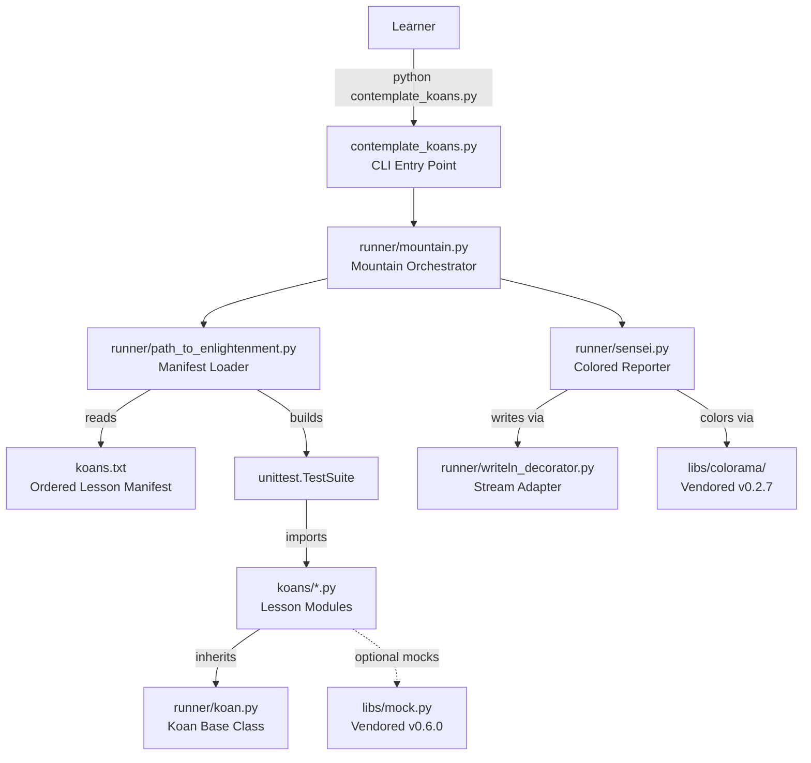

The three packages are:

| Package | Role | Key Modules |
|---|---|---|
| `runner/` | Test execution engine and reporter | `mountain.py`, `sensei.py`, `path_to_enlightenment.py`, `koan.py` |
| `koans/` | The 40+ ordered lesson modules | `about_*.py` files, `triangle.py`, `a_package_folder/` |
| `libs/` | Vendored support libraries | `colorama/` (BSD 3-Clause), `mock.py` (v0.6.0 modified) |

A fourth supporting tree, `runner/runner_tests/`, holds the unit tests that verify the runner itself; these are what Travis CI executes via `_runner_tests.py`, distinct from the koan curriculum.

#### Core Technical Approach

The architectural approach is deliberately minimalist and leverages standard library constructs:

- **Manifest-driven discovery** — `koans.txt` is a plain text file (supporting `#` comments) that lists `module.ClassName` pairs in pedagogical order. `path_to_enlightenment.koans()` parses this file and assembles a `unittest.TestSuite` accordingly.
- **Standard `unittest` substrate** — The `Koan` base class (in `runner/koan.py`) is a thin subclass of `unittest.TestCase`. The `Sensei` reporter subclasses `MockableTestResult`, itself a compatibility shim over `unittest.TestResult`.
- **Sentinel placeholder system** — Module-level constants `__`, `___`, `____`, `_____` exported via `__all__` from `runner/koan.py` give each placeholder type-appropriate semantics (string for general, exception class for `assertRaises`, string for booleans, zero for numerics).
- **Stream decoration** — `WritelnDecorator` wraps `sys.stdout` to add a `writeln()` convenience method, isolating I/O concerns from the reporter logic.
- **No external dependencies at runtime** — The system runs on stdlib alone (`unittest`, `io`, `re`, `sys`, `os`, `glob`), with `colorama` and `mock` bundled in `libs/` to guarantee portability.

### 1.2.3 Success Criteria

#### Measurable Objectives

The system defines success in two complementary dimensions: pedagogical completion for the learner and operational integrity for maintainers.

| Objective | Measurement Mechanism | Source |
|---|---|---|
| Learner completes all koans | `koans_pass_count == tests.countTestCases()` | `runner/sensei.py` progress logic |
| Learner completes all lessons | `lesson_pass_count` equals filtered `about_*.py` count | Excludes `AboutAsserts` and `AboutExtraCredit` |
| Runner subsystem passes CI | `python _runner_tests.py` exits cleanly on Python 3.9 | `.travis.yml` |
| Cloud workspace bootstraps cleanly | `python contemplate_koans.py` auto-runs on Gitpod start | `.gitpod.yml` |

#### Critical Success Factors

- **Curriculum ordering integrity** — Each koan must be solvable using only concepts introduced in prior koans; `koans.txt` is the authoritative ordering and must not be reshuffled lightly.
- **Cross-platform terminal rendering** — Color output must work on POSIX (`run.sh`) and Windows (`run.bat`), achieved via the bundled `colorama` library and a path-separator-agnostic regex in `sensei.py`.
- **Self-bootstrapping test integrity** — The runner subsystem has its own test suite (`runner/runner_tests/`) so that regressions to the framework itself are caught before they confuse learners.
- **Zero-install fidelity** — No introduction of `pip install` dependencies for runtime; pinned versions in `.gitpod.Dockerfile` (`pytest==4.4.2`, `pytest-testdox`, `mock`) are for the cloud workspace developer experience only.

#### Key Performance Indicators (KPIs)

| KPI | Target | Current Baseline (Repository) |
|---|---|---|
| Total koan test cases | All pass | 43 (referenced in `test_sensei.py`) |
| Total ordered lessons | All complete | 40 entries in `koans.txt` |
| Greed game scoring threshold | 300 points to "get in" | Specified in `GREEDS_RULES.txt` |
| Greed game final round trigger | 3000 points | Specified in `GREEDS_RULES.txt` |
| Supported Python version | 3.7+ (CI on 3.9) | Version check in `contemplate_koans.py` |

---

## 1.3 SCOPE

### 1.3.1 In-Scope Elements

#### Core Features and Functionalities

The following capabilities are present in the repository and constitute the supported feature set:

**Must-Have Capabilities**

- Interactive, terminal-based Python language tutorial with 40+ ordered lessons
- Fill-in-the-blank assertion mechanism using `__`, `___`, `____`, `_____` sentinels
- Mini-project workflow requiring full implementation (triangle classifier, Greed dice scoring, DiceSet, Proxy object)
- Test-Driven Development teaching framework built atop `unittest`
- Custom colored terminal feedback via `Sensei` reporter and vendored `colorama`
- Dynamic progress tracking (koans completed, lessons completed, percentages, remaining counts)
- Zen-of-Python quote rotation interleaved with feedback (cycles every 37 passes)
- Targeted single-koan and single-test execution via command-line arguments
- Continuous test running via Sniffer (`scent.py`) watching `.` and `koans/` for `.py` changes

**Primary User Workflows**

1. **Sequential learning** — Run all koans, fix the first failure, re-run, repeat.
2. **Focused drilling** — Re-run a single failing koan module while iterating on the fix.
3. **Mini-project implementation** — Author entire classes and functions to satisfy the project-style test suites.
4. **Extra credit** — Implement the full Greed game (Player and Game classes) using `about_extra_credit.py` as a free-form scaffold.

**Essential Integrations**

| Integration | Purpose | Configuration |
|---|---|---|
| Travis CI on Python 3.9 | Validate runner subsystem on every push | `.travis.yml` runs `_runner_tests.py` |
| Gitpod cloud workspaces | Zero-install browser-based learning | `.gitpod.yml`, `.gitpod.Dockerfile` |
| Eclipse Che / OpenShift Workspaces | Alternative cloud workspace | Documented in README |
| Sniffer with platform backends | Automated test rerun on save | `pyinotify` (Linux), `pywin32` (Windows), `MacFSEvents` (macOS) |

**Key Technical Requirements**

- Python 3 interpreter (Python 2 explicitly rejected by version check; warnings emitted below 3.7)
- Terminal emulator capable of rendering ANSI escape sequences (or Windows console with colorama translation)
- No network connectivity required at runtime
- No persistent storage required

#### Curriculum Coverage

The lesson curriculum spans the following Python topic domains, each represented by one or more `about_*.py` modules:

| Domain | Representative Modules |
|---|---|
| Language fundamentals | `about_asserts`, `about_strings`, `about_none`, `about_true_and_false`, `about_control_statements` |
| Data structures | `about_lists`, `about_list_assignments`, `about_dictionaries`, `about_tuples`, `about_sets` |
| Functions and methods | `about_methods`, `about_lambdas`, `about_method_bindings`, `about_scope` |
| Classes and OOP | `about_classes`, `about_class_attributes`, `about_attribute_access`, `about_inheritance`, `about_multiple_inheritance`, `about_deleting_objects` |
| Advanced constructs | `about_iteration`, `about_comprehension`, `about_generators`, `about_with_statements`, `about_decorating_with_functions`, `about_decorating_with_classes` |
| Module system | `about_modules`, `about_packages`, `about_monkey_patching` |
| Pattern matching | `about_regex` |
| Error handling | `about_exceptions`, `about_triangle_project2` |
| Mini-projects | `about_triangle_project`, `about_scoring_project`, `about_dice_project`, `about_proxy_object_project`, `about_extra_credit` |

#### Implementation Boundaries

| Boundary Dimension | In-Scope Coverage |
|---|---|
| Execution model | Single-user, single-machine, command-line process |
| User interface | Local terminal with colored ANSI text |
| Operating systems | POSIX (Linux, macOS) via `run.sh`; Windows via `run.bat` with retry loop |
| Cloud platforms | Gitpod (primary), Eclipse Che / OpenShift Workspaces |
| Python runtime | CPython 3.7+; CI validated on 3.9 |
| User groups | Self-directed individual learners (no instructor/student roles) |
| Geographic / market | Global; English-language curriculum (external community translations exist) |
| Data domains | In-memory only; no databases, no persistence between runs |

### 1.3.2 Out-of-Scope Elements

The following capabilities are deliberately excluded from the project, inferred from their absence in the repository:

**Excluded Features and Capabilities**

- **No graphical or web user interface** — The system is exclusively a CLI tool; no HTML, no Tkinter, no curses.
- **No user accounts, authentication, or login** — Anonymous local execution only.
- **No progress persistence** — State is recomputed from scratch on every run; nothing is saved between sessions.
- **No networked or server component** — There is no API, no client/server architecture, no telemetry.
- **No grading, certification, or instructor dashboard** — The system is self-paced and unverified.
- **No multi-language internationalization in the main repository** — English-only; translations exist as external forks (e.g., `python_koans_br` for Brazilian Portuguese).
- **No bundled video or audio content** — README links to external YouTube screencasts by Jake Hebbert; no media files in the repository.
- **No PyPI distribution** — There is no `setup.py`, `pyproject.toml`, or root-level `requirements.txt`. Pinned package versions exist only in `.gitpod.Dockerfile` for the cloud workspace environment.

**Curriculum Topics Not Covered**

The curriculum focuses on classic Python idioms and does not currently include lessons on the following post-3.7 features:

| Omitted Topic | Rationale |
|---|---|
| `async`/`await` and `asyncio` | Advanced concurrency outside core language fundamentals |
| Type hints / `typing` module | Optional language feature not required for runtime semantics |
| Dataclasses (PEP 557) | Modern convenience covered by `about_classes` foundationally |
| f-strings as a dedicated topic | Modern string formatting; covered implicitly in string lessons |
| Structural pattern matching (PEP 634, `match`/`case`) | Python 3.10+ feature |
| Walrus operator (PEP 572) | Python 3.8+ syntactic addition |

**Future Phase / Extra-Credit Considerations**

The codebase explicitly identifies one open-ended extension as a future learner exercise rather than a maintained feature:

- **Full Greed game implementation** — `about_extra_credit.py` contains a free-form assignment to "Write a player class and a Game class to complete the project." The scoring function from `about_scoring_project` and the dice mechanics from `about_dice_project` are inputs, but the full game loop is not implemented or test-covered.

**Integration Points Not Covered**

- No integration with learning management systems (LMS) such as Moodle, Canvas, or Blackboard
- No integration with code editors or IDEs (no VS Code extension, no PyCharm plugin)
- No webhook, REST API, or messaging integration
- The git submodule `Submodule_01_Do_not_use_15Jun` is present in `.gitmodules` but is explicitly named "Do_not_use" and contains an unrelated catalog of GitHub `.gitignore` templates; it is not part of the project's functional scope.

**Unsupported Use Cases**

- Multi-user concurrent execution on a shared machine (no concurrency model defined)
- Automated grading or test result aggregation across learners
- Distribution to learners as a pre-built binary or installer
- Use of the koans curriculum for languages other than Python (the Ruby Koans is the upstream source for that purpose)

### 1.3.3 Scope Summary

The following diagram summarizes the boundaries of the system, showing what is included, what is excluded, and what is deferred:

```mermaid
flowchart LR
    subgraph InScope["IN SCOPE — Delivered Capabilities"]
        direction TB
        A1[CLI test runner]
        A2[40+ ordered lessons]
        A3[Fill-in-the-blank sentinels]
        A4[Mini-projects: triangle, dice, scoring, proxy]
        A5[Colored terminal feedback]
        A6[Gitpod / Eclipse Che workspaces]
        A7[Cross-platform launchers]
    end
    subgraph Deferred["DEFERRED — Future / Extra Credit"]
        direction TB
        B1[Full Greed game Player/Game classes]
        B2[Modern Python topics: async, types, dataclasses]
    end
    subgraph OutOfScope["OUT OF SCOPE — Explicitly Excluded"]
        direction TB
        C1[GUI or web UI]
        C2[User accounts and persistence]
        C3[Networked server component]
        C4[Grading or certification]
        C5[PyPI distribution]
        C6[Multi-language i18n]
    end
    InScope -.->|may evolve into| Deferred
    Deferred -.->|will not become| OutOfScope
```

---

## 1.4 References

### 1.4.1 Files Examined

- `README.rst` — Project overview, target audience, installation, Sniffer setup, TDD philosophy, acknowledgments
- `contemplate_koans.py` — Main CLI entry point with Python version check and dispatch to `Mountain`
- `Contributor Notes.txt` — Documentation of targeted koan invocation patterns
- `koans.txt` — Ordered manifest of all 40 koan entries (the authoritative curriculum sequence)
- `run.sh` — POSIX launcher script
- `run.bat` — Windows launcher with path discovery and retry loop
- `.travis.yml` — CI configuration; runs `_runner_tests.py` on Python 3.9
- `.gitpod.yml` — Gitpod workspace configuration; auto-runs `contemplate_koans.py`
- `.gitpod.Dockerfile` — Gitpod base image with pinned `pytest==4.4.2`, `pytest-testdox`, `mock`
- `.gitmodules` — Submodule mapping (single submodule, marked "Do_not_use")
- `scent.py` — Sniffer continuous-test-rerun configuration
- `_runner_tests.py` — Aggregated unittest suite for the runner subsystem
- `example_file.txt` — Trivial test fixture used by file-reading lessons

### 1.4.2 Folders Examined

- `runner/` — Test execution engine (`mountain.py`, `sensei.py`, `path_to_enlightenment.py`, `koan.py`, `writeln_decorator.py`, `mockable_test_result.py`, `helper.py`)
- `runner/runner_tests/` — Self-tests for the runner subsystem (`test_mountain.py`, `test_sensei.py`, `test_helper.py`, `test_path_to_enlightenment.py`)
- `koans/` — The 40+ lesson modules plus supporting helpers (`triangle.py`, `local_module.py`, `another_local_module.py`, `jims.py`, `joes.py`, `GREEDS_RULES.txt`, `a_package_folder/`)
- `libs/` — Vendored support libraries
- `libs/colorama/` — Bundled colorama v0.2.7 under BSD 3-Clause (six modules: `__init__.py`, `ansi.py`, `win32.py`, `winterm.py`, `ansitowin32.py`, `initialise.py`)

### 1.4.3 Representative Lesson Modules Reviewed

- `koans/about_asserts.py` — First lesson; introduces assertion mechanics and the `__` placeholder
- `koans/about_classes.py` — Class basics with a Dog hierarchy example
- `koans/about_triangle_project.py` — Triangle classification mini-project tests
- `koans/about_dice_project.py` — DiceSet implementation mini-project tests
- `koans/about_scoring_project.py` — Greed scoring function mini-project tests
- `koans/about_proxy_object_project.py` — Proxy object class mini-project plus Television demo
- `koans/about_extra_credit.py` — Free-form extra-credit Greed game scaffold
- `koans/triangle.py` — Triangle implementation stub and `TriangleError` exception
- `koans/GREEDS_RULES.txt` — Greed dice game specification (300/3000 point thresholds)

### 1.4.4 External References

- Edgecase Ruby Koans (`http://rubykoans.com/`) — Upstream project from which Python Koans is derived
- PEP 20 — The Zen of Python by Tim Peters, cycled into the `Sensei` reporter output
- Jonathan Hartley's `colorama` library v0.2.7 (BSD 3-Clause) — Bundled in `libs/colorama/`
- Project repository: `https://github.com/gregmalcolm/python_koans`

# 2. Product Requirements

## 2.1 FEATURE CATALOG

This section enumerates the discrete, testable features that constitute the Python Koans system. Each feature is derived directly from observable source artifacts (modules, classes, configuration files, and tests) within the repository. Features are grouped into four logical categories: **Core Runtime**, **Curriculum**, **Platform & Tooling**, and **Support Libraries**.

### 2.1.1 Feature Inventory Overview

The complete feature inventory is summarized below. Detailed metadata, requirements, and dependencies for each feature follow in subsequent subsections.

| Feature ID | Feature Name | Category |
|---|---|---|
| F-001 | CLI Entry Point with Python Version Gating | Core Runtime |
| F-002 | Test Suite Orchestration (Mountain) | Core Runtime |
| F-003 | Manifest-Driven Lesson Discovery | Core Runtime |
| F-004 | Sentinel Placeholder System | Core Runtime |
| F-005 | Sensei Colored Test Reporter | Core Runtime |
| F-006 | Targeted Execution by Module or Test | Core Runtime |
| F-007 | Sequential Lesson Curriculum (40 Modules) | Curriculum |
| F-008 | Triangle Classification Mini-Project | Curriculum |
| F-009 | Greed Scoring Function Mini-Project | Curriculum |
| F-010 | DiceSet Mini-Project | Curriculum |
| F-011 | Proxy Object and Television Mini-Project | Curriculum |
| F-012 | Extra-Credit Free-Form Greed Game | Curriculum |
| F-013 | Cross-Platform Launcher Scripts | Platform & Tooling |
| F-014 | Sniffer Continuous Test Reruns | Platform & Tooling |
| F-015 | Travis CI Validation | Platform & Tooling |
| F-016 | Gitpod Cloud Workspace | Platform & Tooling |
| F-017 | Eclipse Che / OpenShift Workspace Support | Platform & Tooling |
| F-018 | Vendored Colorama Library | Support Libraries |
| F-019 | Vendored Mock Library | Support Libraries |
| F-020 | Runner Subsystem Self-Test Suite | Support Libraries |

---

### 2.1.2 Core Runtime Features

#### 2.1.2.1 F-001: CLI Entry Point with Python Version Gating

| Metadata Field | Value |
|---|---|
| Unique ID | F-001 |
| Feature Name | CLI Entry Point with Python Version Gating |
| Feature Category | Core Runtime |
| Priority Level | Critical |
| Status | Completed |

**Description**

- **Overview**: A single executable Python script, `contemplate_koans.py`, serves as the canonical entry point for all learner interactions. It performs interpreter version validation before delegating to the test orchestration subsystem.
- **Business Value**: Guarantees that learners receive a clear, immediate error if their environment is incompatible, preventing silent failures or cryptic stack traces that would degrade the educational experience.
- **User Benefits**: Single, memorable command (`python contemplate_koans.py`) with zero arguments required for the default sequential walkthrough.
- **Technical Context**: Inspects `sys.version_info` to reject Python 2 outright and emit a non-blocking warning for versions below 3.7. After version validation, it instantiates `runner.mountain.Mountain` and calls `walk_the_path(sys.argv)`.

**Dependencies**

- **Prerequisite Features**: None (this is the topmost feature).
- **System Dependencies**: Python 3 interpreter, `sys` standard library module.
- **External Dependencies**: None at runtime.
- **Integration Requirements**: Invoked by `run.sh`, `run.bat`, `scent.py`, `.gitpod.yml`, and CI workspaces.

---

#### 2.1.2.2 F-002: Test Suite Orchestration (Mountain)

| Metadata Field | Value |
|---|---|
| Unique ID | F-002 |
| Feature Name | Test Suite Orchestration (Mountain) |
| Feature Category | Core Runtime |
| Priority Level | Critical |
| Status | Completed |

**Description**

- **Overview**: The `Mountain` class in `runner/mountain.py` orchestrates the koan execution lifecycle. It wraps `sys.stdout` in a `WritelnDecorator`, loads the curriculum suite, constructs a `Sensei` reporter, executes the suite, and triggers the final report via `lesson.learn()`.
- **Business Value**: Decouples lesson discovery from reporting, allowing each subsystem to be independently evolved without altering the entry-point contract.
- **User Benefits**: Provides a deterministic, single-pass execution model: the same input produces the same output, supporting reproducible learning sessions.
- **Technical Context**: A 26-line orchestrator implemented in `runner/mountain.py`, augmented by two helper modules — `runner/writeln_decorator.py` (a stream adapter that adds a `writeln()` method to any file-like object) and `runner/helper.py` (a `cls_name(obj)` utility for class-name introspection).

**Dependencies**

- **Prerequisite Features**: F-001 (CLI Entry Point).
- **System Dependencies**: `unittest`, `sys`.
- **External Dependencies**: None.
- **Integration Requirements**: Consumes F-003 (manifest loader), F-004 (Koan base class via loaded modules), F-005 (Sensei reporter).

---

#### 2.1.2.3 F-003: Manifest-Driven Lesson Discovery

| Metadata Field | Value |
|---|---|
| Unique ID | F-003 |
| Feature Name | Manifest-Driven Lesson Discovery |
| Feature Category | Core Runtime |
| Priority Level | Critical |
| Status | Completed |

**Description**

- **Overview**: The `runner/path_to_enlightenment.py` module reads `koans.txt`, filters out blank lines and `#` comments, and constructs a `unittest.TestSuite` whose execution order strictly preserves the manifest ordering by setting `loader.sortTestMethodsUsing = None`.
- **Business Value**: Externalizes curriculum ordering as plain text, allowing contributors to reorder or extend lessons without modifying Python code.
- **User Benefits**: Ensures pedagogical prerequisites are honored — learners encounter `about_asserts` before `about_comprehension`, `about_classes` before `about_inheritance`, and so on.
- **Technical Context**: Three internal functions — `filter_koan_names(lines)`, `names_from_file(filename)`, and `koans_suite(names)` — plus the convenience entry point `koans()`. The manifest file is opened with `io.open(filename, 'rt', encoding='utf8')` for cross-platform Unicode safety.

**Dependencies**

- **Prerequisite Features**: F-002 (Mountain orchestrator).
- **System Dependencies**: `unittest.TestLoader`, `unittest.TestSuite`, `io`.
- **External Dependencies**: `koans.txt` file must exist at the repository root.
- **Integration Requirements**: Imports all `koans.about_*` modules referenced by the manifest at suite-build time.

---

#### 2.1.2.4 F-004: Sentinel Placeholder System

| Metadata Field | Value |
|---|---|
| Unique ID | F-004 |
| Feature Name | Sentinel Placeholder System |
| Feature Category | Core Runtime |
| Priority Level | Critical |
| Status | Completed |

**Description**

- **Overview**: Four type-distinct sentinel placeholders exported from `runner/koan.py` — `__` (string), `___` (Exception subclass), `____` (string), `_____` (integer zero) — represent the "blanks" learners must replace to make assertions pass.
- **Business Value**: A consistent, recognizable visual vocabulary for "fill in here" across the entire curriculum, learnable in seconds.
- **User Benefits**: The differing sentinel widths convey type expectations at a glance: `__` for general values, `___` for exception classes inside `assertRaises`, `____` for booleans, `_____` for numerics.
- **Technical Context**: `__ = "-=> FILL ME IN! <=-"`, `___` inherits from `Exception`, `____ = "-=> TRUE OR FALSE? <=-"`, `_____ = 0`. All exported via `__all__` together with the `Koan` base class, a thin `unittest.TestCase` subclass.

**Dependencies**

- **Prerequisite Features**: None within this catalog (foundational primitive).
- **System Dependencies**: `unittest.TestCase`.
- **External Dependencies**: None.
- **Integration Requirements**: Every `koans/about_*.py` module imports these symbols via `from runner.koan import *`.

---

#### 2.1.2.5 F-005: Sensei Colored Test Reporter

| Metadata Field | Value |
|---|---|
| Unique ID | F-005 |
| Feature Name | Sensei Colored Test Reporter |
| Feature Category | Core Runtime |
| Priority Level | Critical |
| Status | Completed |

**Description**

- **Overview**: A custom `unittest.TestResult` subclass (via the `MockableTestResult` compatibility shim in `runner/mockable_test_result.py`) implemented in `runner/sensei.py` (270 lines). It emits color-coded, narratively-styled output for every test outcome, computes progress and remaining counts, scrapes stack traces to focus on koan source locations, and interleaves Zen-of-Python aphorisms.
- **Business Value**: Transforms dry unittest output into an engaging, motivational feedback channel that sustains learner attention through dozens of iterations.
- **User Benefits**: Success messages appear in green/bright (`"test_X has expanded your awareness"`); failures in red (`"test_X has damaged your karma"`); the first failing class is highlighted and the stack trace is filtered to show only relevant koan paths.
- **Technical Context**: Key methods include `startTest`, `addSuccess`, `addError`, `addFailure`, `sortFailures`, `firstFailure`, `errorReport`, `scrapeAssertionError`, `scrapeInterestingStackDump`, `report_progress`, `report_remaining`, `say_something_zenlike`, `total_koans`, `total_lessons`, `filter_all_lessons`, and `learn`. Exit code `-1` is returned on any failure to prevent learners from skipping ahead.

**Dependencies**

- **Prerequisite Features**: F-002 (Mountain instantiates Sensei), F-018 (vendored colorama for cross-platform color).
- **System Dependencies**: `unittest`, `re`, `os`, `glob`, `sys`.
- **External Dependencies**: `libs.colorama` (`init`, `Fore`, `Style`).
- **Integration Requirements**: Receives stream wrapped by `runner.writeln_decorator.WritelnDecorator`; uses `runner.helper.cls_name` for class-name display.

---

#### 2.1.2.6 F-006: Targeted Execution by Module or Test

| Metadata Field | Value |
|---|---|
| Unique ID | F-006 |
| Feature Name | Targeted Execution by Module or Test |
| Feature Category | Core Runtime |
| Priority Level | High |
| Status | Completed |

**Description**

- **Overview**: When `Mountain.walk_the_path` receives a positional argument, it narrows the suite to a single koan module or a single test method using `unittest.TestLoader().loadTestsFromName("koans." + args[1])`.
- **Business Value**: Reduces feedback latency during focused practice; learners can iterate on a single failing test without re-running the full curriculum.
- **User Benefits**: Supports both module-level (`python3 contemplate_koans.py about_strings`) and method-level (`python3 contemplate_koans.py about_strings.AboutStrings.test_triple_quoted_strings_need_less_escaping`) drill-down, as documented in `Contributor Notes.txt`.
- **Technical Context**: Branch in `runner/mountain.py` line 20 (`if len(args) >= 2`) replaces the full suite with the targeted load. No syntax validation is performed; an invalid name raises an exception from the standard `unittest` machinery.

**Dependencies**

- **Prerequisite Features**: F-001, F-002, F-003.
- **System Dependencies**: `unittest.TestLoader`.
- **External Dependencies**: None.
- **Integration Requirements**: None beyond core runtime.

---

### 2.1.3 Curriculum Features

#### 2.1.3.1 F-007: Sequential Lesson Curriculum (40 Modules)

| Metadata Field | Value |
|---|---|
| Unique ID | F-007 |
| Feature Name | Sequential Lesson Curriculum (40 Modules) |
| Feature Category | Curriculum |
| Priority Level | Critical |
| Status | Completed |

**Description**

- **Overview**: 40 entries in `koans.txt` enumerate fully-qualified `module.ClassName` references that, when executed in order, comprise the Python language tutorial. Topics span fundamentals, data structures, OOP, advanced constructs, modules/packages, regex, exceptions, and mini-projects.
- **Business Value**: Provides a complete, opinionated curriculum that takes a learner from `assert` mechanics to multiple inheritance, regex, and small system design — all without external materials.
- **User Benefits**: Predictable, dependency-respecting progression; each lesson builds on prior lessons.
- **Technical Context**: Lessons follow three placeholder patterns: (a) **fill-in** (`self.assertEqual(__, expression)`), (b) **boolean** (`self.assertEqual(____, expression)`), (c) **exception** (`with self.assertRaises(___): …`). Lessons also use stable supporting modules (`koans/local_module.py`, `koans/another_local_module.py`, `koans/jims.py`, `koans/joes.py`, `koans/a_package_folder/`) for module/package-related lessons, plus `example_file.txt` for file-iteration lessons.

**Dependencies**

- **Prerequisite Features**: F-003 (manifest loader), F-004 (sentinel placeholders).
- **System Dependencies**: `unittest`.
- **External Dependencies**: None.
- **Integration Requirements**: All 40 modules must remain importable; ordering changes require updating `koans.txt`.

**Curriculum Topic Coverage**

| Topic Domain | Representative Lesson Modules |
|---|---|
| Language fundamentals | `about_asserts`, `about_strings`, `about_none`, `about_true_and_false`, `about_control_statements` |
| Data structures | `about_lists`, `about_list_assignments`, `about_dictionaries`, `about_tuples`, `about_sets` |
| Functions and methods | `about_methods`, `about_lambdas`, `about_method_bindings`, `about_scope` |
| Object-oriented programming | `about_classes`, `about_class_attributes`, `about_attribute_access`, `about_inheritance`, `about_multiple_inheritance`, `about_deleting_objects` |
| Advanced constructs | `about_iteration`, `about_comprehension`, `about_generators`, `about_with_statements`, `about_decorating_with_functions`, `about_decorating_with_classes` |
| Module system | `about_modules`, `about_packages`, `about_monkey_patching` |
| Pattern matching | `about_regex` |
| Error handling | `about_exceptions` |
| Mini-projects | `about_triangle_project`, `about_triangle_project2`, `about_scoring_project`, `about_dice_project`, `about_proxy_object_project`, `about_extra_credit` |

---

#### 2.1.3.2 F-008: Triangle Classification Mini-Project

| Metadata Field | Value |
|---|---|
| Unique ID | F-008 |
| Feature Name | Triangle Classification Mini-Project |
| Feature Category | Curriculum |
| Priority Level | High |
| Status | Completed |

**Description**

- **Overview**: A two-part mini-project (`about_triangle_project.py` and `about_triangle_project2.py`) that asks the learner to implement `triangle(a, b, c)` in `koans/triangle.py`, classifying inputs as `equilateral`, `isosceles`, or `scalene`, and to raise the custom `TriangleError` exception for invalid inputs.
- **Business Value**: Introduces classification logic, custom exceptions, and the practice of writing code to pass a pre-existing test suite — a foundational TDD experience.
- **User Benefits**: Learners produce a small, complete implementation rather than only filling in blanks, reinforcing the discipline of reading specifications expressed as tests.
- **Technical Context**: `koans/triangle.py` provides a stub `triangle()` function and the `TriangleError(Exception)` class. Part 1 tests classification across cases such as `(2,2,2)→equilateral`, `(3,4,4)/(4,3,4)/(4,4,3)/(10,10,2)→isosceles`, and `(3,4,5)/(10,11,12)/(5,4,2)→scalene`. Part 2 verifies `TriangleError` is raised for `(0,0,0)`, `(3,4,-5)`, `(1,1,3)`, and `(2,5,2)` (triangle-inequality violations).

**Dependencies**

- **Prerequisite Features**: F-007 (curriculum), F-004 (sentinel placeholders).
- **System Dependencies**: `unittest.assertRaises`.
- **External Dependencies**: None.
- **Integration Requirements**: `koans/triangle.py` must export `triangle` and `TriangleError`.

---

#### 2.1.3.3 F-009: Greed Scoring Function Mini-Project

| Metadata Field | Value |
|---|---|
| Unique ID | F-009 |
| Feature Name | Greed Scoring Function Mini-Project |
| Feature Category | Curriculum |
| Priority Level | High |
| Status | Completed |

**Description**

- **Overview**: A mini-project in `koans/about_scoring_project.py` requiring the learner to implement `score(dice)` per the rules in `koans/GREEDS_RULES.txt` (300-point "get in" threshold, 3000-point end-game trigger).
- **Business Value**: Teaches algorithmic decomposition and edge-case handling on a real game-scoring problem.
- **User Benefits**: A self-contained, fun problem whose correctness can be verified mechanically by the test suite.
- **Technical Context**: 9 test cases covering empty input (`[]→0`), single values (single 5 → 50, single 1 → 100), triples (three 1s → 1000, three N → 100×N), and mixed hands (`[1,1,1,5,1]→1150`, `[1,2,2,2]→300`, `[1,5,2,2,2]→350`). The header block in the module file restates the rules in summary form.

**Dependencies**

- **Prerequisite Features**: F-007.
- **System Dependencies**: `unittest`.
- **External Dependencies**: None.
- **Integration Requirements**: Consumed conceptually by F-012 (extra credit Greed game).

---

#### 2.1.3.4 F-010: DiceSet Mini-Project

| Metadata Field | Value |
|---|---|
| Unique ID | F-010 |
| Feature Name | DiceSet Mini-Project |
| Feature Category | Curriculum |
| Priority Level | High |
| Status | Completed |

**Description**

- **Overview**: A class-implementation mini-project in `koans/about_dice_project.py` requiring the learner to implement a `DiceSet` class with a `roll(n)` method and a `values` property.
- **Business Value**: Reinforces stateful object design, the `@property` decorator, and the `random` module.
- **User Benefits**: Produces a reusable component that pairs naturally with F-012 (extra-credit Greed game).
- **Technical Context**: Tests verify (a) basic construction, (b) `roll(5)` returns a 5-element list of integers in `[1, 6]`, (c) values are stable until re-rolled (`first_time == second_time`), (d) values change between rolls (`assertNotEqual`), and (e) variable roll counts (3, 1) work. The lesson hints at `random.randint(min, max)`.

**Dependencies**

- **Prerequisite Features**: F-007.
- **System Dependencies**: `random` standard library module.
- **External Dependencies**: None.
- **Integration Requirements**: Conceptually feeds into F-012.

---

#### 2.1.3.5 F-011: Proxy Object and Television Mini-Project

| Metadata Field | Value |
|---|---|
| Unique ID | F-011 |
| Feature Name | Proxy Object and Television Mini-Project |
| Feature Category | Curriculum |
| Priority Level | High |
| Status | Completed |

**Description**

- **Overview**: A 156-line mini-project in `koans/about_proxy_object_project.py` defining two test classes registered separately in `koans.txt`: `AboutProxyObjectProject` (7 tests) and `TelevisionTest` (4 tests).
- **Business Value**: Teaches metaprogramming techniques (`__getattr__`/`__setattr__` interception, call recording) on a small but realistic abstraction.
- **User Benefits**: Provides a complete, working `Television` class (lines 100–120) as a worked example, then asks the learner to build a `Proxy` capable of wrapping any object — including the `Television` and built-in strings.
- **Technical Context**: The 7 Proxy tests verify wrapping arbitrary objects, forwarding method calls, recording all messages via a `messages()` accessor, raising `AttributeError` for invalid attributes, exposing `was_called(method)` and `number_of_times_called(method)` introspection, and operating on a `"Py Ohio 2010"` string. The 4 Television tests confirm the demo implementation passes.

**Dependencies**

- **Prerequisite Features**: F-007, F-005 (since both test classes are listed in `koans.txt`).
- **System Dependencies**: `unittest`.
- **External Dependencies**: None.
- **Integration Requirements**: Two distinct entries in `koans.txt` (`AboutProxyObjectProject` and `TelevisionTest`) must remain in order.

---

#### 2.1.3.6 F-012: Extra-Credit Free-Form Greed Game

| Metadata Field | Value |
|---|---|
| Unique ID | F-012 |
| Feature Name | Extra-Credit Free-Form Greed Game |
| Feature Category | Curriculum |
| Priority Level | Low |
| Status | Proposed (free-form learner exercise) |

**Description**

- **Overview**: A 19-line scaffold (`koans/about_extra_credit.py`) containing a single placeholder test (`test_extra_credit_task: pass`) and instructions to build a full Greed game with `Player` and `Game` classes.
- **Business Value**: Provides an open-ended capstone that consolidates the scoring (F-009) and dice-rolling (F-010) outputs into a complete program.
- **User Benefits**: Self-directed extension exercise with no rigid acceptance criteria; encourages creativity and design exploration.
- **Technical Context**: Explicitly excluded from `lesson_pass_count` in `runner/sensei.py` (line 36) and from `filter_all_lessons` in the lesson glob (lines 265–267) so that progress reporting is not skewed by an exercise that has no fixed solution.

**Dependencies**

- **Prerequisite Features**: F-009 (Greed scoring), F-010 (DiceSet), conceptually.
- **System Dependencies**: None enforced.
- **External Dependencies**: None.
- **Integration Requirements**: None; the placeholder test always passes.

---

### 2.1.4 Platform and Tooling Features

#### 2.1.4.1 F-013: Cross-Platform Launcher Scripts

| Metadata Field | Value |
|---|---|
| Unique ID | F-013 |
| Feature Name | Cross-Platform Launcher Scripts |
| Feature Category | Platform & Tooling |
| Priority Level | Medium |
| Status | Completed |

**Description**

- **Overview**: Two shell wrappers — `run.sh` (POSIX) and `run.bat` (Windows) — provide one-command invocation of `contemplate_koans.py`.
- **Business Value**: Reduces friction for learners who are not yet comfortable composing command-line invocations.
- **User Benefits**: Windows learners get an interactive experience: the `.bat` file searches for `python.exe` in the current directory, falls back to `%PYTHON_PATH%` (default `C:\Python311`) and `%PYTHON%`, prints a helpful error if not found, calls `pause`, and prompts `"Test again? y or n -"` to loop. POSIX learners get the minimal `python3 -B contemplate_koans.py` invocation (the `-B` flag disables `.pyc` generation).
- **Technical Context**: `run.sh` is 4 lines; `run.bat` is 45 lines including discovery logic and the retry loop.

**Dependencies**

- **Prerequisite Features**: F-001.
- **System Dependencies**: POSIX shell or Windows command processor; Python 3 on PATH or at a discoverable location.
- **External Dependencies**: None.
- **Integration Requirements**: None.

---

#### 2.1.4.2 F-014: Sniffer Continuous Test Reruns

| Metadata Field | Value |
|---|---|
| Unique ID | F-014 |
| Feature Name | Sniffer Continuous Test Reruns |
| Feature Category | Platform & Tooling |
| Priority Level | Low |
| Status | Completed (optional) |

**Description**

- **Overview**: A `scent.py` configuration file enables the optional Sniffer tool to watch source files and rerun the koan suite on each save.
- **Business Value**: Tightens the TDD feedback loop for learners who prefer ambient, automatic verification.
- **User Benefits**: After installing Sniffer plus a platform backend (`pyinotify` on Linux, `pywin32` on Windows, `MacFSEvents` on macOS), saving any `.py` file triggers a rerun automatically.
- **Technical Context**: `watch_paths = ['.', 'koans/']`; `@file_validator` filters `.py` files (excluding hidden); `@runnable` executes `python3 -B contemplate_koans.py`. The 13-line configuration is documented in the README's "Sniffer Support" section.

**Dependencies**

- **Prerequisite Features**: F-001.
- **System Dependencies**: User-installed `sniffer` package plus platform-specific filesystem-watch backend.
- **External Dependencies**: `pyinotify`, `pywin32`, or `MacFSEvents` (unpinned; user installs via `pip`).
- **Integration Requirements**: None beyond the watch configuration.

---

#### 2.1.4.3 F-015: Travis CI Validation

| Metadata Field | Value |
|---|---|
| Unique ID | F-015 |
| Feature Name | Travis CI Validation |
| Feature Category | Platform & Tooling |
| Priority Level | High |
| Status | Completed |

**Description**

- **Overview**: A `.travis.yml` configuration runs the runner-subsystem self-test suite on Python 3.9 on every push.
- **Business Value**: Provides automated regression protection for the test runner itself — defects in `Mountain`, `Sensei`, or `path_to_enlightenment` are caught before reaching learners.
- **User Benefits**: Indirectly ensures the framework is dependable.
- **Technical Context**: `language: python`, `python: - 3.9`, `script: - python _runner_tests.py`. Email notifications are enabled. `_runner_tests.py` aggregates `runner.runner_tests.{test_mountain, test_sensei, test_helper, test_path_to_enlightenment}` (including the `TestFilterKoanNames` and `TestKoansSuite` test classes), executes via `unittest.TextTestRunner(verbosity=2)`, and propagates the success bit via `sys.exit(not res.wasSuccessful())`.

**Dependencies**

- **Prerequisite Features**: F-020 (runner self-test suite).
- **System Dependencies**: Travis CI environment with Python 3.9.
- **External Dependencies**: GitHub webhook.
- **Integration Requirements**: `_runner_tests.py` must remain at repository root.

---

#### 2.1.4.4 F-016: Gitpod Cloud Workspace

| Metadata Field | Value |
|---|---|
| Unique ID | F-016 |
| Feature Name | Gitpod Cloud Workspace |
| Feature Category | Platform & Tooling |
| Priority Level | Medium |
| Status | Completed |

**Description**

- **Overview**: A `.gitpod.yml` and accompanying `.gitpod.Dockerfile` define a one-click, browser-based development workspace.
- **Business Value**: Eliminates local environment setup for learners; supports classroom and workshop scenarios where attendees may have heterogeneous machines.
- **User Benefits**: Workspace auto-runs `python contemplate_koans.py` on open (via `tasks: - command:` in `.gitpod.yml`).
- **Technical Context**: The Dockerfile extends `gitpod/workspace-full:latest`, installs `pytest==4.4.2`, `pytest-testdox`, and `mock` via `pip3` as the `gitpod` user. The workspace configuration enables `master`-branch prebuilds while disabling prebuilds on pull requests and pull-request comments.

**Dependencies**

- **Prerequisite Features**: F-001.
- **System Dependencies**: Gitpod platform.
- **External Dependencies**: `pytest==4.4.2`, `pytest-testdox` (unpinned), `mock` (unpinned) — installed only inside the cloud image.
- **Integration Requirements**: `gitpod/workspace-full:latest` base image must remain available.

---

#### 2.1.4.5 F-017: Eclipse Che / OpenShift Workspace Support

| Metadata Field | Value |
|---|---|
| Unique ID | F-017 |
| Feature Name | Eclipse Che / OpenShift Workspace Support |
| Feature Category | Platform & Tooling |
| Priority Level | Low |
| Status | Completed |

**Description**

- **Overview**: Documentation in `README.rst` links a one-click "Contribute via Che" badge at `https://workspaces.openshift.com/f?url=...` that ultimately re-routes to a Gitpod workspace URL.
- **Business Value**: Reaches learners in Red Hat / OpenShift ecosystems.
- **User Benefits**: Single-click entry from the project README.
- **Technical Context**: No additional configuration files beyond the README badge; the workspace itself leverages F-016.

**Dependencies**

- **Prerequisite Features**: F-016 (the underlying workspace is Gitpod).
- **System Dependencies**: Eclipse Che / OpenShift Workspaces platform.
- **External Dependencies**: None directly maintained by this repository.
- **Integration Requirements**: README link must remain accurate.

---

### 2.1.5 Support Library Features

#### 2.1.5.1 F-018: Vendored Colorama Library

| Metadata Field | Value |
|---|---|
| Unique ID | F-018 |
| Feature Name | Vendored Colorama Library |
| Feature Category | Support Libraries |
| Priority Level | High |
| Status | Completed |

**Description**

- **Overview**: A bundled copy of Jonathan Hartley's `colorama` v0.2.7 (BSD 3-Clause, 2013) lives at `libs/colorama/`, with six modules: `__init__.py`, `ansi.py`, `win32.py`, `winterm.py`, `ansitowin32.py`, `initialise.py`.
- **Business Value**: Eliminates a runtime `pip install` step while delivering colored output on Windows consoles (which historically did not honor ANSI escapes).
- **User Benefits**: Identical Sensei output appearance on Linux, macOS, and Windows terminals.
- **Technical Context**: Exports `init`, `deinit`, `reinit`, `Fore`, `Back`, `Style`, `AnsiToWin32`. `runner/sensei.py` calls `init()` at module load and uses `Fore` and `Style` constants for color codes.

**Dependencies**

- **Prerequisite Features**: None.
- **System Dependencies**: None.
- **External Dependencies**: None at runtime (the library is vendored).
- **Integration Requirements**: License header (BSD 3-Clause) and version constant must be preserved.

---

#### 2.1.5.2 F-019: Vendored Mock Library

| Metadata Field | Value |
|---|---|
| Unique ID | F-019 |
| Feature Name | Vendored Mock Library |
| Feature Category | Support Libraries |
| Priority Level | Medium |
| Status | Completed |

**Description**

- **Overview**: A bundled copy of Michael Foord's `mock` v0.6.0 (modified by Greg Malcolm) at `libs/mock.py`.
- **Business Value**: Allows the runner self-test suite to operate without an external `pip install mock` step; preserves a known-good version against upstream API drift.
- **User Benefits**: Indirect — supports the testing of the runner subsystem.
- **Technical Context**: Exports `Mock`, `patch`, `patch_object`, `sentinel`, `DEFAULT`. Used directly by `runner/runner_tests/test_mountain.py` and `runner/runner_tests/test_sensei.py`.

**Dependencies**

- **Prerequisite Features**: None.
- **System Dependencies**: None.
- **External Dependencies**: None at runtime (vendored).
- **Integration Requirements**: Copyright notice and version constant must be preserved.

---

#### 2.1.5.3 F-020: Runner Subsystem Self-Test Suite

| Metadata Field | Value |
|---|---|
| Unique ID | F-020 |
| Feature Name | Runner Subsystem Self-Test Suite |
| Feature Category | Support Libraries |
| Priority Level | High |
| Status | Completed |

**Description**

- **Overview**: A complete unit-test suite at `runner/runner_tests/` verifies the test runner's own behavior, independent of any koan curriculum.
- **Business Value**: Maintains confidence in the framework so that bugs in the reporter or loader do not corrupt the learning experience.
- **User Benefits**: Indirect; supports framework reliability.
- **Technical Context**: Four test files:
    - `test_helper.py` — 3 tests for `cls_name` covering `str`, `int`, and `tuple`.
    - `test_mountain.py` — 1 test verifying `lesson.learn` is invoked when `walk_the_path()` runs (uses `patch_object`).
    - `test_sensei.py` — ~30 tests across success counting, failure sorting, stack scraping, Zen aphorism cycling (specific expected lines for `pass_count` values 0, 1, 10, 36, 37), total-koan/total-lesson counting (with `countTestCases` mocked to 43), and lesson filtering (`> 10 lessons discovered`).
    - `test_path_to_enlightenment.py` — `TestFilterKoanNames` (empty input, name matching, whitespace stripping, comment exclusion, blank/comment-only inputs) and `TestKoansSuite` (empty input produces empty suite; named koans appear in the assembled suite).

**Dependencies**

- **Prerequisite Features**: F-002, F-003, F-005 (the subjects under test), F-019 (mock library).
- **System Dependencies**: `unittest`.
- **External Dependencies**: None.
- **Integration Requirements**: Executed by `_runner_tests.py` (CI entry).

---

## 2.2 FUNCTIONAL REQUIREMENTS

This section enumerates the testable, atomic requirements derived from each feature. Requirement IDs follow the format `F-XXX-RQ-YYY`. Each requirement is presented with three coordinated tables: **Requirement Details**, **Technical Specifications**, and **Validation Rules**.

### 2.2.1 F-001 Requirements — CLI Entry Point with Python Version Gating

**Requirement Details**

| Requirement ID | Description |
|---|---|
| F-001-RQ-001 | Reject Python 2 with a clear error message and abort execution |
| F-001-RQ-002 | Emit a warning when Python < 3.7 is detected, then continue |
| F-001-RQ-003 | Pass full `sys.argv` to `Mountain().walk_the_path()` |

**Acceptance Criteria, Priority, Complexity**

| Requirement ID | Acceptance Criteria | Priority |
|---|---|---|
| F-001-RQ-001 | Running under Python 2 prints the rejection message and exits non-zero | Must-Have |
| F-001-RQ-002 | Running under Python 3.6 prints the warning then proceeds to the orchestrator | Should-Have |
| F-001-RQ-003 | `Mountain.walk_the_path` is reached with all CLI args preserved | Must-Have |

**Technical Specifications**

| Requirement ID | Input | Output |
|---|---|---|
| F-001-RQ-001 | Python 2.x interpreter | Error message to stdout/stderr; non-zero exit |
| F-001-RQ-002 | Python 3.0–3.6 interpreter | Warning message to stdout; continued execution |
| F-001-RQ-003 | `sys.argv` (positional CLI arguments) | Forwarded to orchestrator unchanged |

**Validation Rules**

- **Business Rules**: Python 3 is the only supported runtime family.
- **Data Validation**: `sys.version_info.major` and `.minor` are compared against constants (2 and 7 respectively).
- **Security Requirements**: No external input is parsed before version validation, preventing untrusted code from running on incompatible interpreters.
- **Compliance Requirements**: None.

---

### 2.2.2 F-002 Requirements — Test Suite Orchestration (Mountain)

**Requirement Details**

| Requirement ID | Description |
|---|---|
| F-002-RQ-001 | Wrap `sys.stdout` in `WritelnDecorator` for downstream consumers |
| F-002-RQ-002 | Load the curriculum suite via `path_to_enlightenment.koans()` |
| F-002-RQ-003 | Construct a `Sensei` result collector bound to the decorated stream |
| F-002-RQ-004 | Invoke `self.lesson.learn()` after `tests.run(self.lesson)` completes |

**Acceptance Criteria, Priority, Complexity**

| Requirement ID | Acceptance Criteria | Priority |
|---|---|---|
| F-002-RQ-001 | `self.stream` exposes both standard stream methods and `writeln()` | Must-Have |
| F-002-RQ-002 | `self.tests` is a `unittest.TestSuite` populated from manifest order | Must-Have |
| F-002-RQ-003 | `self.lesson` is an instance of `Sensei(self.stream)` | Must-Have |
| F-002-RQ-004 | `learn()` is called exactly once per `walk_the_path` invocation | Must-Have |

**Technical Specifications**

| Requirement ID | Input | Output |
|---|---|---|
| F-002-RQ-001 | `sys.stdout` file-like object | `WritelnDecorator`-wrapped stream |
| F-002-RQ-002 | `koans.txt` manifest (read by `path_to_enlightenment`) | Populated `unittest.TestSuite` |
| F-002-RQ-003 | Decorated stream | `Sensei` reporter instance |
| F-002-RQ-004 | Test execution results in `Sensei` state | Final aggregated report on stream |

**Validation Rules**

- **Business Rules**: Each `walk_the_path` invocation produces exactly one summary report.
- **Data Validation**: None at the orchestrator level; defers to constituent subsystems.
- **Security Requirements**: No filesystem writes; reads limited to `koans.txt` and Python source files.
- **Compliance Requirements**: None.

---

### 2.2.3 F-003 Requirements — Manifest-Driven Lesson Discovery

**Requirement Details**

| Requirement ID | Description |
|---|---|
| F-003-RQ-001 | Filter blank lines and lines beginning with `#` from `koans.txt` |
| F-003-RQ-002 | Strip leading/trailing whitespace from each surviving line |
| F-003-RQ-003 | Assemble a `unittest.TestSuite` in manifest order without test re-sorting |
| F-003-RQ-004 | Read the manifest file using `io.open(..., 'rt', encoding='utf8')` |

**Acceptance Criteria, Priority, Complexity**

| Requirement ID | Acceptance Criteria | Priority |
|---|---|---|
| F-003-RQ-001 | Comment and blank lines do not appear as test names | Must-Have |
| F-003-RQ-002 | `"  about_strings.AboutStrings  "` resolves identically to `"about_strings.AboutStrings"` | Must-Have |
| F-003-RQ-003 | `loader.sortTestMethodsUsing = None` preserves source method ordering | Must-Have |
| F-003-RQ-004 | UTF-8 encoded manifest files load without error | Should-Have |

**Technical Specifications**

| Requirement ID | Input | Output |
|---|---|---|
| F-003-RQ-001 | Iterable of manifest lines | Filtered iterable of names |
| F-003-RQ-002 | Raw line text | Stripped line text |
| F-003-RQ-003 | List of fully-qualified test names | `unittest.TestSuite` |
| F-003-RQ-004 | Manifest file path | Text-mode file iterator |

**Validation Rules**

- **Business Rules**: Curriculum ordering is authoritative and externalized in `koans.txt`.
- **Data Validation**: A `#` as the first non-whitespace character marks the entire line as a comment.
- **Security Requirements**: Names are passed directly to `unittest.TestLoader().loadTestsFromName`; the manifest is therefore a trusted file.
- **Compliance Requirements**: None.

---

### 2.2.4 F-004 Requirements — Sentinel Placeholder System

**Requirement Details**

| Requirement ID | Description |
|---|---|
| F-004-RQ-001 | Export `__`, `___`, `____`, `_____`, and `Koan` via `__all__` |
| F-004-RQ-002 | `__` evaluates to the string `"-=> FILL ME IN! <=-"` |
| F-004-RQ-003 | `___` is a subclass of `Exception` usable with `assertRaises` |
| F-004-RQ-004 | `____` evaluates to the string `"-=> TRUE OR FALSE? <=-"` |
| F-004-RQ-005 | `_____` evaluates to the integer `0` |

**Acceptance Criteria, Priority, Complexity**

| Requirement ID | Acceptance Criteria | Priority |
|---|---|---|
| F-004-RQ-001 | `from runner.koan import *` exposes only these five names | Must-Have |
| F-004-RQ-002 | `self.assertEqual(__, "anything")` fails until replaced | Must-Have |
| F-004-RQ-003 | `with self.assertRaises(___): …` fails until replaced with a specific exception class | Must-Have |
| F-004-RQ-004 | `self.assertEqual(____, True)` fails until replaced with the correct boolean | Must-Have |
| F-004-RQ-005 | `self.assertEqual(_____, 42)` fails until replaced with the correct integer | Must-Have |

**Technical Specifications**

| Requirement ID | Input | Output |
|---|---|---|
| F-004-RQ-001 | Module import | Five exported names |
| F-004-RQ-002 to F-004-RQ-005 | Module-level constants | Type-distinct sentinel values |

**Validation Rules**

- **Business Rules**: The visual width of underscores conveys type expectation; substitution is the only valid solution path.
- **Data Validation**: Python's normal assertion semantics enforce the test outcome.
- **Security Requirements**: None.
- **Compliance Requirements**: None.

---

### 2.2.5 F-005 Requirements — Sensei Colored Test Reporter

**Requirement Details (Part 1: Outcome Reporting)**

| Requirement ID | Description |
|---|---|
| F-005-RQ-001 | Print `"Thinking <ClassName>"` header on transition to a new test class |
| F-005-RQ-002 | Print `"test_X has expanded your awareness"` in GREEN/BRIGHT on success |
| F-005-RQ-003 | Route `addError` to `addFailure` so error ordering is preserved |
| F-005-RQ-004 | Print `"test_X has damaged your karma"` in RED on first failure |
| F-005-RQ-005 | Exit with status `-1` when any test fails |

**Requirement Details (Part 2: Progress & Aphorisms)**

| Requirement ID | Description |
|---|---|
| F-005-RQ-006 | Report `"You have completed N (P%) koans and X (out of Y) lessons"` |
| F-005-RQ-007 | Report `"You are now N koans and M lessons away from reaching enlightenment"` on failure |
| F-005-RQ-008 | Cycle Zen-of-Python aphorisms every 37 passes |
| F-005-RQ-009 | On no failures, display `"Nobody ever expects the Spanish Inquisition"` |
| F-005-RQ-010 | Print final success message `"That was the last one, well done!"` and recommend `about_extra_credit.py` |

**Acceptance Criteria, Priority, Complexity**

| Requirement ID | Acceptance Criteria | Priority |
|---|---|---|
| F-005-RQ-001 | Class transitions emit exactly one header line | Must-Have |
| F-005-RQ-002 | Pass message uses Fore.GREEN + Style.BRIGHT escape codes | Must-Have |
| F-005-RQ-004 | Stack trace is scraped to highlight `about_*.py` files and `line N` markers | Must-Have |
| F-005-RQ-005 | Non-zero exit signals failure to shell wrappers and CI | Must-Have |
| F-005-RQ-006 | Counts derived from `tests.countTestCases()` and the `about_*.py` glob | Must-Have |
| F-005-RQ-008 | `pass_count % 37` indexes into a 19-aphorism rotation | Should-Have |

**Technical Specifications**

| Requirement ID | Input | Output |
|---|---|---|
| F-005-RQ-001 to F-005-RQ-005 | `unittest.TestCase` lifecycle callbacks | Colored stream output |
| F-005-RQ-006 to F-005-RQ-007 | `koans_pass_count`, `lesson_pass_count`, totals | Formatted progress lines |
| F-005-RQ-008 to F-005-RQ-009 | `pass_count` and failure list | Aphorism line on stream |
| F-005-RQ-010 | Suite completion without failure | Magenta success banner |

**Performance & Data Notes**

- Stack scraping uses path-separator-agnostic regex (`[/\\\\]koans[/\\\\]`) and a line-number capture (`(?<= line )\d+`) to sort failures.
- `AboutAsserts` and `AboutExtraCredit` are excluded from `lesson_pass_count` to avoid skewing progress.
- `filter_all_lessons` globs `'/../koans/about*.py'` and excludes `about_extra_credit` from the lesson total.

**Validation Rules**

- **Business Rules**: The reporter halts at the first failing class (the learner addresses one koan at a time).
- **Data Validation**: Regex anchors prevent matches on non-koan paths in stack traces.
- **Security Requirements**: No external commands invoked; no shell metacharacters injected.
- **Compliance Requirements**: PEP 20 (Zen of Python) attributions are preserved in source comments.

---

### 2.2.6 F-006 Requirements — Targeted Execution by Module or Test

**Requirement Details**

| Requirement ID | Description |
|---|---|
| F-006-RQ-001 | When `len(args) >= 2`, narrow the suite to a single named test target |
| F-006-RQ-002 | Resolve target by prepending `"koans."` to the user-supplied argument |
| F-006-RQ-003 | Support both module-level and method-level targets |

**Acceptance Criteria, Priority, Complexity**

| Requirement ID | Acceptance Criteria | Priority |
|---|---|---|
| F-006-RQ-001 | `python3 contemplate_koans.py about_strings` runs only that module's tests | Must-Have |
| F-006-RQ-002 | The prefix `koans.` is automatically added; user does not type it | Should-Have |
| F-006-RQ-003 | `about_strings.AboutStrings.test_X` runs only the named test method | Should-Have |

**Technical Specifications**

| Requirement ID | Input | Output |
|---|---|---|
| F-006-RQ-001 | Single positional CLI argument | Narrowed `unittest.TestSuite` |
| F-006-RQ-002 | User-supplied name (no `koans.` prefix) | Fully-qualified name passed to `loadTestsFromName` |
| F-006-RQ-003 | Module, class, or test-method name | Single-test or single-class suite |

**Validation Rules**

- **Business Rules**: Users are not required to remember the `koans.` namespace prefix.
- **Data Validation**: Invalid names raise the standard `unittest` `AttributeError`/`ImportError`.
- **Security Requirements**: Names are resolved via `importlib` mechanisms; the manifest does not constrain this targeted path.
- **Compliance Requirements**: None.

---

### 2.2.7 F-007 Requirements — Sequential Lesson Curriculum (40 Modules)

**Requirement Details**

| Requirement ID | Description |
|---|---|
| F-007-RQ-001 | Provide 40 ordered entries in `koans.txt` covering Python language fundamentals through advanced constructs |
| F-007-RQ-002 | Each `about_*.py` module must be importable and inherit tests from `Koan` (a `unittest.TestCase`) |
| F-007-RQ-003 | Support three placeholder patterns: fill-in (`__`), boolean (`____`), and exception (`___`) |
| F-007-RQ-004 | Ship supporting modules used by module/package lessons (`local_module.py`, `another_local_module.py`, `jims.py`, `joes.py`, `local_module_with_all_defined.py`, `a_package_folder/`) |

**Acceptance Criteria, Priority, Complexity**

| Requirement ID | Acceptance Criteria | Priority |
|---|---|---|
| F-007-RQ-001 | Lesson topics include asserts, strings, dicts, classes, inheritance, regex, exceptions, and mini-projects | Must-Have |
| F-007-RQ-002 | All 40 modules load without error on Python 3.7+ | Must-Have |
| F-007-RQ-003 | Replacement of `__`, `____`, or `___` causes the test to pass | Must-Have |
| F-007-RQ-004 | `about_modules` and `about_packages` complete using only bundled support files | Must-Have |

**Technical Specifications**

| Requirement ID | Input | Output |
|---|---|---|
| F-007-RQ-001 | `koans.txt` | Curriculum sequence |
| F-007-RQ-002 | Lesson source file | Importable test class |
| F-007-RQ-003 | Placeholder constant + learner edit | Passing assertion |
| F-007-RQ-004 | Support helper modules | Imports resolve in `about_modules`, `about_packages` |

**Validation Rules**

- **Business Rules**: Lessons are ordered by pedagogical dependency; no lesson uses a construct introduced later in the sequence.
- **Data Validation**: `__all__` in `local_module_with_all_defined.py` controls export visibility for the relevant lesson.
- **Security Requirements**: Lessons do not write to disk or perform network I/O.
- **Compliance Requirements**: None.

---

### 2.2.8 F-008 Requirements — Triangle Classification Mini-Project

**Requirement Details**

| Requirement ID | Description |
|---|---|
| F-008-RQ-001 | Implement `triangle(a, b, c)` returning `"equilateral"`, `"isosceles"`, or `"scalene"` |
| F-008-RQ-002 | Raise `TriangleError` for zero or negative side lengths |
| F-008-RQ-003 | Raise `TriangleError` when the triangle inequality is violated |

**Acceptance Criteria, Priority, Complexity**

| Requirement ID | Acceptance Criteria | Priority |
|---|---|---|
| F-008-RQ-001 | `(2,2,2)→"equilateral"`; `(3,4,4)`, `(4,3,4)`, `(4,4,3)`, `(10,10,2)→"isosceles"`; `(3,4,5)`, `(10,11,12)`, `(5,4,2)→"scalene"` | Must-Have |
| F-008-RQ-002 | `(0,0,0)`, `(3,4,-5)` raise `TriangleError` | Must-Have |
| F-008-RQ-003 | `(1,1,3)`, `(2,5,2)` raise `TriangleError` | Must-Have |

**Technical Specifications**

| Requirement ID | Input | Output |
|---|---|---|
| F-008-RQ-001 | Three positive numeric arguments | One of three classification strings |
| F-008-RQ-002 | Any side ≤ 0 | `TriangleError` raised |
| F-008-RQ-003 | Sides violating `a + b > c` for any permutation | `TriangleError` raised |

**Validation Rules**

- **Business Rules**: Argument order is irrelevant to classification; `(3,4,4)` and `(4,4,3)` both classify as isosceles.
- **Data Validation**: All three inputs must be positive real numbers.
- **Security Requirements**: None.
- **Compliance Requirements**: None.

---

### 2.2.9 F-009 Requirements — Greed Scoring Function Mini-Project

**Requirement Details**

| Requirement ID | Description |
|---|---|
| F-009-RQ-001 | `score([])` returns `0` |
| F-009-RQ-002 | A single `5` contributes `50`; a single `1` contributes `100` |
| F-009-RQ-003 | Three `1`s score `1000`; three `N`s (N ≠ 1) score `100 × N` |
| F-009-RQ-004 | Non-scoring dice (2, 3, 4, 6 when not in a triple) contribute zero |
| F-009-RQ-005 | Multiple scoring patterns combine additively |

**Acceptance Criteria, Priority, Complexity**

| Requirement ID | Acceptance Criteria | Priority |
|---|---|---|
| F-009-RQ-001 | Empty list returns `0` | Must-Have |
| F-009-RQ-002 | `[5]→50`; `[1]→100` | Must-Have |
| F-009-RQ-003 | `[1,1,1]→1000`; `[5,5,5]→500`; `[2,2,2]→200` | Must-Have |
| F-009-RQ-004 | `[2,3,4,6]→0` | Must-Have |
| F-009-RQ-005 | `[1,1,1,5,1]→1150`; `[1,2,2,2]→300`; `[1,5,2,2,2]→350` | Must-Have |

**Technical Specifications**

| Requirement ID | Input | Output |
|---|---|---|
| F-009-RQ-001 to F-009-RQ-005 | Iterable of integers in [1,6] | Integer score |

**Validation Rules**

- **Business Rules**: Specified in `koans/GREEDS_RULES.txt`: 300-point "get in" threshold, 3000-point end-game trigger (informational for F-012, not enforced by the scoring function itself).
- **Data Validation**: The function accepts any iterable; no length cap is enforced by the scorer.
- **Security Requirements**: None.
- **Compliance Requirements**: None.

---

### 2.2.10 F-010 Requirements — DiceSet Mini-Project

**Requirement Details**

| Requirement ID | Description |
|---|---|
| F-010-RQ-001 | `DiceSet` is instantiable with no arguments |
| F-010-RQ-002 | `roll(n)` populates `values` with `n` integers, each in `[1, 6]` |
| F-010-RQ-003 | `values` is stable between calls until a new `roll(n)` occurs |
| F-010-RQ-004 | Successive `roll(n)` calls produce different `values` (statistically) |

**Acceptance Criteria, Priority, Complexity**

| Requirement ID | Acceptance Criteria | Priority |
|---|---|---|
| F-010-RQ-001 | `DiceSet()` constructs without exception | Must-Have |
| F-010-RQ-002 | `roll(5)` yields a 5-element list of integers in `[1, 6]` | Must-Have |
| F-010-RQ-003 | Reading `values` twice without rolling returns equal lists | Must-Have |
| F-010-RQ-004 | Test asserts `first_roll != second_roll` (probabilistic) | Should-Have |

**Technical Specifications**

| Requirement ID | Input | Output |
|---|---|---|
| F-010-RQ-001 | None | `DiceSet` instance |
| F-010-RQ-002 | Integer `n` | List of `n` integers |
| F-010-RQ-003 | Repeated `values` access | Same list |
| F-010-RQ-004 | Two `roll()` calls | Different lists |

**Validation Rules**

- **Business Rules**: Variable roll counts (3, 1) must work; the class is not fixed to 5 dice.
- **Data Validation**: Random integers are bounded by 1 and 6 inclusive.
- **Security Requirements**: `random` is not used for cryptographic purposes; standard PRNG is sufficient.
- **Compliance Requirements**: None.

---

### 2.2.11 F-011 Requirements — Proxy Object and Television Mini-Project

**Requirement Details**

| Requirement ID | Description |
|---|---|
| F-011-RQ-001 | `Proxy` wraps an arbitrary target object and forwards attribute access |
| F-011-RQ-002 | `Proxy` records all invoked method names retrievable via `messages()` |
| F-011-RQ-003 | `Proxy.was_called(name)` returns `True` if the method was ever invoked |
| F-011-RQ-004 | `Proxy.number_of_times_called(name)` returns the invocation count |
| F-011-RQ-005 | Accessing an invalid attribute raises `AttributeError` |
| F-011-RQ-006 | The provided `Television` demo class passes its 4-test suite unmodified |

**Acceptance Criteria, Priority, Complexity**

| Requirement ID | Acceptance Criteria | Priority |
|---|---|---|
| F-011-RQ-001 | Proxy can wrap a `Television` or a plain string | Must-Have |
| F-011-RQ-002 | After `tv.channel = 10; tv.power()`, `messages()` reflects the calls | Must-Have |
| F-011-RQ-003 | `was_called("power")` is `True` after at least one call | Must-Have |
| F-011-RQ-004 | Counts match the number of explicit invocations | Should-Have |
| F-011-RQ-005 | `proxy.nonexistent_method` raises `AttributeError` | Must-Have |
| F-011-RQ-006 | `TelevisionTest` passes against the bundled `Television` implementation | Must-Have |

**Technical Specifications**

| Requirement ID | Input | Output |
|---|---|---|
| F-011-RQ-001 to F-011-RQ-005 | Arbitrary target object | Wrapped object with introspection methods |
| F-011-RQ-006 | Methods on `Television` (channel property, `power`, `is_on`) | Tests pass |

**Validation Rules**

- **Business Rules**: The Proxy must not interfere with attribute *values* on the target — only intercept calls.
- **Data Validation**: Both `AboutProxyObjectProject` and `TelevisionTest` are listed in `koans.txt`.
- **Security Requirements**: None.
- **Compliance Requirements**: None.

---

### 2.2.12 F-012 Requirements — Extra-Credit Free-Form Greed Game

**Requirement Details**

| Requirement ID | Description |
|---|---|
| F-012-RQ-001 | Provide a single, always-passing placeholder test |
| F-012-RQ-002 | Exclude this lesson from `lesson_pass_count` and from `filter_all_lessons` |

**Acceptance Criteria, Priority, Complexity**

| Requirement ID | Acceptance Criteria | Priority |
|---|---|---|
| F-012-RQ-001 | `test_extra_credit_task` passes by default (`pass` body) | Could-Have |
| F-012-RQ-002 | Sensei progress counters are not skewed by this lesson | Must-Have |

**Technical Specifications**

| Requirement ID | Input | Output |
|---|---|---|
| F-012-RQ-001 | No input | Empty test body |
| F-012-RQ-002 | Sensei `startTest` check | Lesson excluded from `lesson_pass_count` |

**Validation Rules**

- **Business Rules**: No fixed acceptance criteria for the learner's implementation; the assignment is free-form.
- **Data Validation**: None.
- **Security Requirements**: None.
- **Compliance Requirements**: None.

---

### 2.2.13 F-013 Requirements — Cross-Platform Launcher Scripts

**Requirement Details**

| Requirement ID | Description |
|---|---|
| F-013-RQ-001 | `run.sh` invokes `python3 -B contemplate_koans.py` |
| F-013-RQ-002 | `run.bat` discovers a Python interpreter via local directory, `%PYTHON_PATH%` (default `C:\Python311`), then `%PYTHON%` |
| F-013-RQ-003 | `run.bat` prints a helpful error message and pauses if no Python is found |
| F-013-RQ-004 | `run.bat` prompts `"Test again? y or n -"` and loops while the response is `y` |

**Acceptance Criteria, Priority, Complexity**

| Requirement ID | Acceptance Criteria | Priority |
|---|---|---|
| F-013-RQ-001 | `./run.sh` runs the koans without producing `.pyc` files | Must-Have |
| F-013-RQ-002 | `run.bat` finds Python in any of three locations | Must-Have |
| F-013-RQ-003 | Missing-Python error message is actionable | Should-Have |
| F-013-RQ-004 | Loop terminates on any response other than `y` | Should-Have |

**Technical Specifications**

| Requirement ID | Input | Output |
|---|---|---|
| F-013-RQ-001 | Shell invocation | Python process |
| F-013-RQ-002 to F-013-RQ-004 | Windows batch invocation; interactive `y/n` input | Python process; pause; loop |

**Validation Rules**

- **Business Rules**: The `-B` flag prevents pollution of the koans tree with cached bytecode.
- **Data Validation**: Only `y` continues the loop; all other inputs exit.
- **Security Requirements**: No untrusted file is executed; only `contemplate_koans.py`.
- **Compliance Requirements**: None.

---

### 2.2.14 F-014 Requirements — Sniffer Continuous Test Reruns

**Requirement Details**

| Requirement ID | Description |
|---|---|
| F-014-RQ-001 | Watch the repository root and `koans/` for `.py` file changes |
| F-014-RQ-002 | Exclude hidden files from triggering reruns |
| F-014-RQ-003 | Re-execute `python3 -B contemplate_koans.py` on each detected change |

**Acceptance Criteria, Priority, Complexity**

| Requirement ID | Acceptance Criteria | Priority |
|---|---|---|
| F-014-RQ-001 | Saving any non-hidden `.py` file in watched paths triggers a run | Could-Have |
| F-014-RQ-002 | Hidden files (starting with `.`) do not trigger reruns | Could-Have |
| F-014-RQ-003 | The same command is used as a manual invocation | Should-Have |

**Technical Specifications**

| Requirement ID | Input | Output |
|---|---|---|
| F-014-RQ-001 to F-014-RQ-003 | Filesystem change events | Python process re-launched |

**Validation Rules**

- **Business Rules**: Sniffer is optional; the koans must remain runnable without it.
- **Data Validation**: `@file_validator` checks file extension and visibility.
- **Security Requirements**: None.
- **Compliance Requirements**: None.

---

### 2.2.15 F-015 Requirements — Travis CI Validation

**Requirement Details**

| Requirement ID | Description |
|---|---|
| F-015-RQ-001 | Build environment is Python 3.9 |
| F-015-RQ-002 | Build script executes `python _runner_tests.py` |
| F-015-RQ-003 | Build status is determined by `unittest`'s success flag, propagated via `sys.exit(not res.wasSuccessful())` |
| F-015-RQ-004 | Email notifications are emitted on build status changes |

**Acceptance Criteria, Priority, Complexity**

| Requirement ID | Acceptance Criteria | Priority |
|---|---|---|
| F-015-RQ-001 | `.travis.yml` declares `python: - 3.9` | Must-Have |
| F-015-RQ-002 | The CI run aggregates all runner tests | Must-Have |
| F-015-RQ-003 | Exit code zero only on green | Must-Have |
| F-015-RQ-004 | `notifications` block is present in `.travis.yml` | Should-Have |

**Technical Specifications**

| Requirement ID | Input | Output |
|---|---|---|
| F-015-RQ-001 to F-015-RQ-004 | Repository push or PR | Travis build result |

**Validation Rules**

- **Business Rules**: Only the runner subsystem is gated by CI; the koan curriculum is intentionally not enforced (each koan is expected to fail until completed by the learner).
- **Data Validation**: None at the CI layer.
- **Security Requirements**: No secrets configured in `.travis.yml`.
- **Compliance Requirements**: None.

---

### 2.2.16 F-016 Requirements — Gitpod Cloud Workspace

**Requirement Details**

| Requirement ID | Description |
|---|---|
| F-016-RQ-001 | Workspace base image extends `gitpod/workspace-full:latest` |
| F-016-RQ-002 | `pip3 install pytest==4.4.2 pytest-testdox mock` runs as `USER gitpod` during image build |
| F-016-RQ-003 | On workspace open, the auto-task runs `python contemplate_koans.py` |
| F-016-RQ-004 | GitHub prebuilds are enabled for `master`; disabled for pull requests and PR comments |

**Acceptance Criteria, Priority, Complexity**

| Requirement ID | Acceptance Criteria | Priority |
|---|---|---|
| F-016-RQ-001 | `.gitpod.Dockerfile` `FROM` line references the correct base | Must-Have |
| F-016-RQ-002 | Pinned `pytest==4.4.2` is installed | Should-Have |
| F-016-RQ-003 | Terminal opens with koans output already streaming | Must-Have |
| F-016-RQ-004 | `github.prebuilds.master: true`, `pullRequests: false`, `addComment: false` | Should-Have |

**Technical Specifications**

| Requirement ID | Input | Output |
|---|---|---|
| F-016-RQ-001 to F-016-RQ-004 | Gitpod button click | Live workspace |

**Validation Rules**

- **Business Rules**: The cloud workspace is for development convenience; runtime koans still must work without it.
- **Data Validation**: None.
- **Security Requirements**: No additional secrets are required by the workspace.
- **Compliance Requirements**: None.

---

### 2.2.17 F-017 Requirements — Eclipse Che / OpenShift Workspace Support

**Requirement Details**

| Requirement ID | Description |
|---|---|
| F-017-RQ-001 | The README includes a one-click contribute link via `workspaces.openshift.com/f?url=...` |
| F-017-RQ-002 | The link ultimately invokes a Gitpod workspace targeting the repository |

**Acceptance Criteria, Priority, Complexity**

| Requirement ID | Acceptance Criteria | Priority |
|---|---|---|
| F-017-RQ-001 | Badge URL resolves to a working launcher | Could-Have |
| F-017-RQ-002 | Workspace bootstraps the koans as documented in F-016 | Could-Have |

**Technical Specifications**

| Requirement ID | Input | Output |
|---|---|---|
| F-017-RQ-001 to F-017-RQ-002 | README badge click | Cloud workspace |

**Validation Rules**

- **Business Rules**: No additional configuration is maintained in this repository for OpenShift specifically.
- **Data Validation**: None.
- **Security Requirements**: None.
- **Compliance Requirements**: None.

---

### 2.2.18 F-018 Requirements — Vendored Colorama Library

**Requirement Details**

| Requirement ID | Description |
|---|---|
| F-018-RQ-001 | Provide `init`, `Fore`, `Style`, `Back`, `AnsiToWin32`, `deinit`, `reinit` symbols |
| F-018-RQ-002 | Translate ANSI escape sequences to Windows console API calls on Windows |
| F-018-RQ-003 | Preserve BSD 3-Clause license and version constant `VERSION = '0.2.7'` |

**Acceptance Criteria, Priority, Complexity**

| Requirement ID | Acceptance Criteria | Priority |
|---|---|---|
| F-018-RQ-001 | `from libs.colorama import init, Fore, Style` succeeds | Must-Have |
| F-018-RQ-002 | Colored output renders identically on Linux, macOS, and Windows terminals | Must-Have |
| F-018-RQ-003 | License header and version are unmodified in `libs/colorama/__init__.py` | Must-Have |

**Technical Specifications**

| Requirement ID | Input | Output |
|---|---|---|
| F-018-RQ-001 to F-018-RQ-002 | ANSI escape codes via `Fore`/`Style` | Colored terminal output |
| F-018-RQ-003 | License file presence | License compliance |

**Validation Rules**

- **Business Rules**: The library is third-party (Jonathan Hartley, 2013); attribution must be preserved.
- **Data Validation**: None.
- **Security Requirements**: No network or file I/O performed by the library.
- **Compliance Requirements**: BSD 3-Clause attribution must remain in source.

---

### 2.2.19 F-019 Requirements — Vendored Mock Library

**Requirement Details**

| Requirement ID | Description |
|---|---|
| F-019-RQ-001 | Provide `Mock`, `patch`, `patch_object`, `sentinel`, `DEFAULT` symbols |
| F-019-RQ-002 | Preserve attribution `__version__ = '0.6.0 modified by Greg Malcolm'` |

**Acceptance Criteria, Priority, Complexity**

| Requirement ID | Acceptance Criteria | Priority |
|---|---|---|
| F-019-RQ-001 | Runner self-tests successfully import all exported names | Must-Have |
| F-019-RQ-002 | Version constant matches the documented modified value | Should-Have |

**Technical Specifications**

| Requirement ID | Input | Output |
|---|---|---|
| F-019-RQ-001 | `from libs.mock import …` | Imported objects |
| F-019-RQ-002 | Module attribute read | Version string |

**Validation Rules**

- **Business Rules**: Third-party authorship by Michael Foord (2007–2009) must be preserved.
- **Data Validation**: None.
- **Security Requirements**: None.
- **Compliance Requirements**: Authorial attribution preserved in source.

---

### 2.2.20 F-020 Requirements — Runner Subsystem Self-Test Suite

**Requirement Details**

| Requirement ID | Description |
|---|---|
| F-020-RQ-001 | `test_helper.py` validates `cls_name` against `str`, `int`, and `tuple` inputs |
| F-020-RQ-002 | `test_mountain.py` verifies `lesson.learn` is invoked on `walk_the_path` |
| F-020-RQ-003 | `test_sensei.py` validates ~30 reporter behaviors including counting, sorting, scraping, Zen, and totals |
| F-020-RQ-004 | `test_path_to_enlightenment.py` validates `filter_koan_names` and `koans_suite` outputs |

**Acceptance Criteria, Priority, Complexity**

| Requirement ID | Acceptance Criteria | Priority |
|---|---|---|
| F-020-RQ-001 | All 3 helper tests pass | Must-Have |
| F-020-RQ-002 | `patch_object` confirms `learn` is called exactly once | Must-Have |
| F-020-RQ-003 | Zen aphorisms at `pass_count` 0, 1, 10, 36, 37 are exactly as specified; `total_koans` returns 43 when `countTestCases` is mocked to 43; `filter_all_lessons` discovers > 10 lessons | Must-Have |
| F-020-RQ-004 | Comments, blanks, and whitespace are filtered correctly | Must-Have |

**Technical Specifications**

| Requirement ID | Input | Output |
|---|---|---|
| F-020-RQ-001 to F-020-RQ-004 | Mocked subjects | `unittest` pass/fail outcomes |

**Validation Rules**

- **Business Rules**: The self-test suite must remain runnable without `pip install`-ing anything (uses vendored `mock`).
- **Data Validation**: None.
- **Security Requirements**: None.
- **Compliance Requirements**: None.

---

## 2.3 FEATURE RELATIONSHIPS

### 2.3.1 Feature Dependency Map

The diagram below visualizes direct dependencies among features, derived from observed `import` statements and runtime call paths in the source code. Arrows point from a feature to the features it requires.

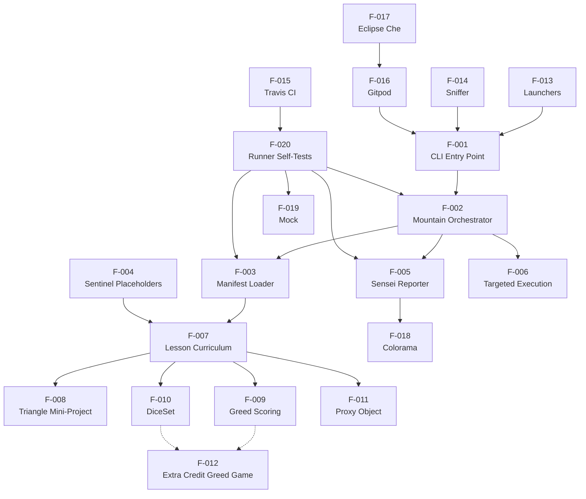

### 2.3.2 Integration Points

The following integration points are externally observable and configured through specific files in the repository:

| Integration | Configuration File(s) | Feature(s) Involved |
|---|---|---|
| Travis CI | `.travis.yml`, `_runner_tests.py` | F-015, F-020 |
| Gitpod | `.gitpod.yml`, `.gitpod.Dockerfile` | F-016, F-001 |
| Eclipse Che | README badge | F-017, F-016 |
| Sniffer | `scent.py` | F-014, F-001 |
| Cross-platform launchers | `run.sh`, `run.bat` | F-013, F-001 |

### 2.3.3 Shared Components

| Shared Component | Location | Consumed By |
|---|---|---|
| `WritelnDecorator` | `runner/writeln_decorator.py` | F-002, F-005 |
| `cls_name(obj)` | `runner/helper.py` | F-005, F-020 |
| `MockableTestResult` | `runner/mockable_test_result.py` | F-005, F-020 |
| `Koan` base class | `runner/koan.py` | F-007, F-008, F-009, F-010, F-011, F-012 |
| Sentinels `__`, `___`, `____`, `_____` | `runner/koan.py` | F-007 (all 40 lessons) |
| `triangle()`, `TriangleError` | `koans/triangle.py` | F-008 (Parts 1 and 2) |
| `GREEDS_RULES.txt` | `koans/GREEDS_RULES.txt` | F-009, F-012 |
| `colorama.init`, `Fore`, `Style` | `libs/colorama/` | F-005 |
| `Mock`, `patch_object` | `libs/mock.py` | F-020 |

### 2.3.4 Common Services

| Service | Provider | Notes |
|---|---|---|
| Test discovery | `unittest.TestLoader` via `runner/path_to_enlightenment.py` | Used by both default and targeted execution |
| Test execution | `unittest.TestSuite.run` invoked by `Mountain.walk_the_path` | Result collector is the `Sensei` instance |
| Cross-platform colored output | `libs/colorama` (vendored) | `init()` called once at `runner/sensei.py` module load |
| Stack-trace filtering | `runner/sensei.py` regex `[/\\\\]koans[/\\\\]` | Path-separator-agnostic for POSIX and Windows |

---

## 2.4 IMPLEMENTATION CONSIDERATIONS

### 2.4.1 Technical Constraints

| Constraint | Source / Evidence |
|---|---|
| Python 3 only; Python 2 is explicitly rejected | `contemplate_koans.py` version-check block |
| CI validated only on Python 3.9; lower-bound warning at 3.7 | `.travis.yml`, `contemplate_koans.py` |
| No `pip install` required at runtime; only stdlib + vendored libs | `libs/colorama/` and `libs/mock.py` |
| Curriculum ordering is plain-text-managed via `koans.txt` | `runner/path_to_enlightenment.py` |
| Tests must inherit from `Koan` (a `unittest.TestCase`) | `runner/koan.py` |
| Lesson modules must import sentinels from `runner.koan` | All `koans/about_*.py` files |
| Submodule `Submodule_01_Do_not_use_15Jun` is explicitly out of scope | `.gitmodules`; Section 1.3.2 of this specification |

### 2.4.2 Performance Requirements

The system is interactive but executes a small number of tests per invocation. Concrete performance markers observable in the source:

| Marker | Value | Source |
|---|---|---|
| Total koan test cases | 43 (asserted in `test_sensei.py` via mock) | `runner/runner_tests/test_sensei.py` |
| Total lessons in manifest | 40 entries | `koans.txt` |
| Lessons excluded from progress counters | `AboutAsserts`, `AboutExtraCredit` | `runner/sensei.py` |
| Files excluded from lesson glob | `about_extra_credit` | `runner/sensei.py` |
| Zen aphorism cycle length | 19 unique aphorisms over 37 passes | `runner/sensei.py` |
| Exit code on failure | `-1` | `runner/sensei.py` |
| Halt-at-first-failure behavior | Yes (within a class) | `Sensei.firstFailure` and stack scraping |

No latency, throughput, or concurrency requirements exist — the system is single-user, single-process by design.

### 2.4.3 Scalability Considerations

The architecture is intentionally non-scalable in the distributed-systems sense, but it is **extensible** along the curriculum dimension:

| Dimension | Extension Mechanism |
|---|---|
| Adding a new lesson | Append a fully-qualified `module.ClassName` entry to `koans.txt`; place the module in `koans/` |
| Reordering lessons | Edit line order in `koans.txt` |
| Adding new sentinel types | Add a constant to `runner/koan.py` and update `__all__` |
| Adding new mini-projects | Follow the pattern of `triangle.py`/`about_triangle_project.py` (stub + test class) |
| Translating to another natural language | Fork the repository; community translations exist (e.g., `python_koans_br`) |

The runner is **not** designed for: concurrent learner sessions, server-side execution, multi-tenant deployments, or progress aggregation. These constraints are documented in Section 1.3.2 as out-of-scope.

### 2.4.4 Security Implications

The system has a narrow attack surface by virtue of its scope:

| Surface | Posture |
|---|---|
| Network access | None at runtime |
| Filesystem writes | None (the `-B` flag in launchers suppresses even `.pyc` caching) |
| External input | Only `sys.argv` for module targeting (resolved by `unittest.TestLoader`) |
| Untrusted code execution | All executed code is repository-resident; `koans.txt` is therefore a trusted manifest |
| Secrets / credentials | None present in the repository |
| Third-party dependencies at runtime | Zero (`colorama` and `mock` are vendored) |
| CI secrets | None configured in `.travis.yml` |
| Vendored library integrity | Pinned to specific versions (colorama `0.2.7`, mock `0.6.0 modified`) |

Because the system runs untrusted **learner-edited** Python source from `koans/about_*.py`, the security model is: the *learner* is the principal, executing on their own machine, with full trust. There is no isolation between the learner's edits and the runner.

### 2.4.5 Maintenance Requirements

| Maintenance Activity | Responsible Component | Trigger |
|---|---|---|
| Update CI Python version | `.travis.yml` | New CPython release |
| Update Gitpod pinned packages | `.gitpod.Dockerfile` (`pytest==4.4.2`, `pytest-testdox`, `mock`) | Upstream security or bug fixes |
| Update Python version warning threshold | `contemplate_koans.py` (currently warns below 3.7) | New Python release policy |
| Add or remove a lesson | `koans.txt` plus corresponding file in `koans/` | Curriculum evolution |
| Modify Sensei behavior | `runner/sensei.py` plus matching update to `runner/runner_tests/test_sensei.py` | Reporter enhancement |
| Verify cross-platform color rendering | Manual testing on Windows console | Major colorama or terminal changes |
| Maintain license attributions | `libs/colorama/__init__.py`, `libs/mock.py` headers | Any vendor updates |

The runner subsystem's self-tests (F-020) are the primary regression protection mechanism. The koan curriculum itself is intentionally not gated by CI — each koan is expected to fail in the as-shipped state.

---

## 2.5 TRACEABILITY MATRIX

The following matrix maps each feature to its primary source artifact(s), associated requirements, and the test artifact(s) that validate or exemplify the feature.

### 2.5.1 Feature-to-Source Traceability

| Feature ID | Primary Source Artifact(s) | Validating Test Artifact(s) |
|---|---|---|
| F-001 | `contemplate_koans.py` | Manual; runtime-only |
| F-002 | `runner/mountain.py` | `runner/runner_tests/test_mountain.py` |
| F-003 | `runner/path_to_enlightenment.py`, `koans.txt` | `runner/runner_tests/test_path_to_enlightenment.py` |
| F-004 | `runner/koan.py` | Implicitly via all lessons |
| F-005 | `runner/sensei.py` | `runner/runner_tests/test_sensei.py` |
| F-006 | `runner/mountain.py` (line ~20) | Manual |
| F-007 | `koans.txt`, `koans/about_*.py` | Learner-driven |
| F-008 | `koans/about_triangle_project.py`, `koans/about_triangle_project2.py`, `koans/triangle.py` | Learner-driven |
| F-009 | `koans/about_scoring_project.py`, `koans/GREEDS_RULES.txt` | Learner-driven |
| F-010 | `koans/about_dice_project.py` | Learner-driven |
| F-011 | `koans/about_proxy_object_project.py` | Learner-driven |
| F-012 | `koans/about_extra_credit.py` | Learner-driven (free-form) |
| F-013 | `run.sh`, `run.bat` | Manual |
| F-014 | `scent.py` | Manual |
| F-015 | `.travis.yml`, `_runner_tests.py` | Travis CI |
| F-016 | `.gitpod.yml`, `.gitpod.Dockerfile` | Workspace bootstrap |
| F-017 | `README.rst` (badge link) | Manual |
| F-018 | `libs/colorama/` (6 modules) | `runner/runner_tests/test_sensei.py` (color usage) |
| F-019 | `libs/mock.py` | `runner/runner_tests/test_mountain.py`, `test_sensei.py` |
| F-020 | `runner/runner_tests/*.py` | Self-validating via `_runner_tests.py` |

### 2.5.2 Requirement-to-Process-Flow Traceability

Requirements that participate in user-facing workflows are linked to the process flows defined in subsequent specification sections (see Section 4 — Process Flowcharts, when authored):

| Workflow | Requirements Engaged |
|---|---|
| Sequential learning walkthrough | F-001-RQ-*, F-002-RQ-*, F-003-RQ-*, F-004-RQ-*, F-005-RQ-* |
| Targeted single-koan iteration | F-001-RQ-003, F-002-RQ-002, F-006-RQ-001 through F-006-RQ-003 |
| Mini-project implementation | F-004-RQ-*, F-007-RQ-002, F-008-RQ-*, F-009-RQ-*, F-010-RQ-*, F-011-RQ-* |
| Sniffer ambient verification | F-014-RQ-* (overlays all sequential-learning requirements) |
| Cloud-workspace bootstrap | F-016-RQ-* (overlays F-001 + F-002) |
| CI validation of runner | F-015-RQ-*, F-020-RQ-* |

### 2.5.3 Cross-Specification Links

| Topic | Linked Specification Section |
|---|---|
| Project context, stakeholders, value proposition | Section 1.1 — Executive Summary |
| System decomposition into `runner/`, `koans/`, `libs/` | Section 1.2 — System Overview |
| In-scope and out-of-scope boundaries | Section 1.3 — Scope |
| Repository file inventory | Section 1.4 — References |

---

## 2.6 ASSUMPTIONS, CONSTRAINTS, AND VERSION TRACKING

### 2.6.1 Assumptions

| Assumption | Basis |
|---|---|
| The learner has a Python 3.7+ interpreter installed and on PATH | `contemplate_koans.py` version check warns at 3.7 |
| The learner's terminal can render ANSI escapes (directly or via colorama on Windows) | Sensei output relies on `Fore` and `Style` constants |
| The repository is cloned with read/write access for the learner | Learner edits source files to make tests pass |
| The `koans.txt` manifest is well-formed UTF-8 | `io.open(..., 'rt', encoding='utf8')` |
| The system runs in a single process; no concurrent learners share state | No locking, no shared resources |

### 2.6.2 Constraints

| Constraint | Type |
|---|---|
| Single-user execution | Architectural |
| No persistent storage between runs | Architectural |
| No network access required at runtime | Architectural |
| Cross-platform color via vendored colorama 0.2.7 | Dependency |
| CI Python version is 3.9 only | Operational |
| Runner self-tests are the only CI-gated artifacts | Operational |
| Submodule `Submodule_01_Do_not_use_15Jun` is excluded from functional scope | Project policy |

### 2.6.3 Version Tracking

Software components have the following observed versions:

| Component | Version | Source |
|---|---|---|
| Python (runtime supported floor) | 3.7+ | `contemplate_koans.py` |
| Python (CI target) | 3.9 | `.travis.yml` |
| colorama (vendored) | 0.2.7 (BSD 3-Clause) | `libs/colorama/__init__.py` |
| mock (vendored) | 0.6.0 modified by Greg Malcolm | `libs/mock.py` |
| pytest (Gitpod-only) | 4.4.2 (pinned) | `.gitpod.Dockerfile` |
| pytest-testdox (Gitpod-only) | Unpinned | `.gitpod.Dockerfile` |
| mock (Gitpod-only environment install) | Unpinned | `.gitpod.Dockerfile` |
| Gitpod base image | `gitpod/workspace-full:latest` | `.gitpod.Dockerfile` |
| Sniffer + backends (user-installed) | Unpinned | `README.rst` |

---

## 2.7 References

### 2.7.1 Files Examined for This Section

- `contemplate_koans.py` — CLI entry point and Python version validation (F-001)
- `run.sh` — POSIX launcher (F-013)
- `run.bat` — Windows launcher with discovery and retry loop (F-013)
- `.travis.yml` — CI configuration on Python 3.9 (F-015)
- `.gitpod.yml` — Gitpod workspace auto-run task (F-016)
- `.gitpod.Dockerfile` — Gitpod image with pinned `pytest==4.4.2`, `pytest-testdox`, `mock` (F-016)
- `.gitmodules` — Single submodule, explicitly out-of-scope (F-017 context)
- `scent.py` — Sniffer continuous-rerun configuration (F-014)
- `_runner_tests.py` — Aggregated CI entry point invoking all four self-test files (F-015, F-020)
- `koans.txt` — 40-entry ordered curriculum manifest (F-003, F-007)
- `Contributor Notes.txt` — Targeted-execution documentation (F-006)
- `README.rst` — Project overview, Sniffer instructions, Eclipse Che badge (F-014, F-017, multiple)
- `example_file.txt` — Test fixture used by file-iteration lessons (F-007)
- `runner/mountain.py` — Mountain orchestrator (F-002, F-006)
- `runner/sensei.py` — Sensei colored reporter (F-005)
- `runner/path_to_enlightenment.py` — Manifest loader (F-003)
- `runner/koan.py` — Koan base class and sentinels (F-004)
- `runner/writeln_decorator.py` — Stream decorator shared by F-002, F-005
- `runner/helper.py` — `cls_name` utility (F-005, F-020)
- `runner/mockable_test_result.py` — TestResult compatibility shim (F-005)
- `runner/runner_tests/test_helper.py` — `cls_name` tests (F-020)
- `runner/runner_tests/test_mountain.py` — Orchestrator tests (F-020)
- `runner/runner_tests/test_sensei.py` — Reporter tests (F-020)
- `runner/runner_tests/test_path_to_enlightenment.py` — Manifest-loader tests (F-020)
- `koans/triangle.py` — Triangle stub + `TriangleError` (F-008)
- `koans/about_triangle_project.py`, `about_triangle_project2.py` — Triangle test cases (F-008)
- `koans/about_scoring_project.py` — Greed scoring tests (F-009)
- `koans/about_dice_project.py` — DiceSet tests (F-010)
- `koans/about_proxy_object_project.py` — Proxy + Television tests (F-011)
- `koans/about_extra_credit.py` — Free-form Greed game scaffold (F-012)
- `koans/GREEDS_RULES.txt` — Greed game scoring rules (F-009, F-012)
- `koans/about_asserts.py`, `about_strings.py`, `about_classes.py`, `about_none.py`, `about_monkey_patching.py`, `about_modules.py`, `about_packages.py`, `about_multiple_inheritance.py`, `about_exceptions.py`, `about_comprehension.py`, `about_generators.py`, `about_decorating_with_classes.py` — Representative lesson modules examined directly (F-007)
- `koans/local_module.py`, `another_local_module.py`, `jims.py`, `joes.py`, `local_module_with_all_defined.py`, `a_package_folder/__init__.py`, `a_package_folder/a_module.py` — Support modules consumed by `about_modules` and `about_packages` (F-007)
- `libs/colorama/__init__.py` — Version `0.2.7`, BSD 3-Clause, exported symbols (F-018)
- `libs/mock.py` — Version `'0.6.0 modified by Greg Malcolm'`, exported symbols (F-019)

### 2.7.2 Folders Examined

- `/` (repository root) — Configuration files, entry point, launchers
- `runner/` — Test execution engine and reporter modules
- `runner/runner_tests/` — Self-test suite for the runner subsystem
- `koans/` — 40+ lesson modules and supporting helpers
- `koans/a_package_folder/` — Sub-package used by `about_packages`
- `libs/` — Vendored support libraries (parent folder)
- `libs/colorama/` — Six bundled colorama modules

### 2.7.3 Cross-Referenced Specification Sections

- Section 1.1 — Executive Summary (project overview, stakeholders, value proposition)
- Section 1.2 — System Overview (system context, components, technical approach, success criteria)
- Section 1.3 — Scope (in-scope, out-of-scope, deferred capabilities)
- Section 1.4 — References (consolidated file and folder inventory)

# 3. Technology Stack

## 3.1 STACK PHILOSOPHY AND OVERVIEW

### 3.1.1 Guiding Principles

The Python Koans technology stack is governed by a single, dominant architectural principle stated in Section 1.1.1: the system is delivered as "a self-contained, command-line driven Python application with no external runtime dependencies." Every technology selection — and every *non-*selection — flows from this constraint. The stack is therefore characterized by:

- **Standard library primacy** — Runtime functionality is implemented exclusively using the Python 3 standard library; no PyPI packages are installed at runtime.
- **Vendoring over package management** — Where third-party functionality is genuinely required (cross-platform color output, test mocking), the libraries are bundled into the repository under `libs/` rather than declared as installable dependencies.
- **Zero-install fidelity** — Per Section 1.2.3, "no introduction of `pip install` dependencies for runtime"; learners clone the repository and immediately begin work.
- **CI minimalism** — Continuous integration validates only the runner subsystem (not the koan curriculum, which is *expected* to fail until completed).
- **Cross-platform parity** — All capabilities must work on POSIX (Linux, macOS) and Windows, achieved through bundled abstractions rather than per-platform code paths.

### 3.1.2 Relevance Filter Applied to Default Stack

The default technology stack supplied with this assignment (AWS, Docker for production, Terraform, GitHub Actions, Flask, Auth0, MongoDB, Langchain, React, TypeScript, TailwindCSS, React-Native, Swift, Kotlin, Objective-C, ElectronJS) describes a multi-tier cloud-native application. Python Koans is categorically a different class of system: a single-process, single-user, terminal-based pedagogical TDD tool with no server component, no persistence, no UI beyond the terminal, and no network I/O. The default components are therefore not present in this project, and Section 3.4.3 enumerates the exclusions explicitly to remove ambiguity.

### 3.1.3 Stack Topology

The diagram below summarizes the active stack layers and their relationships.

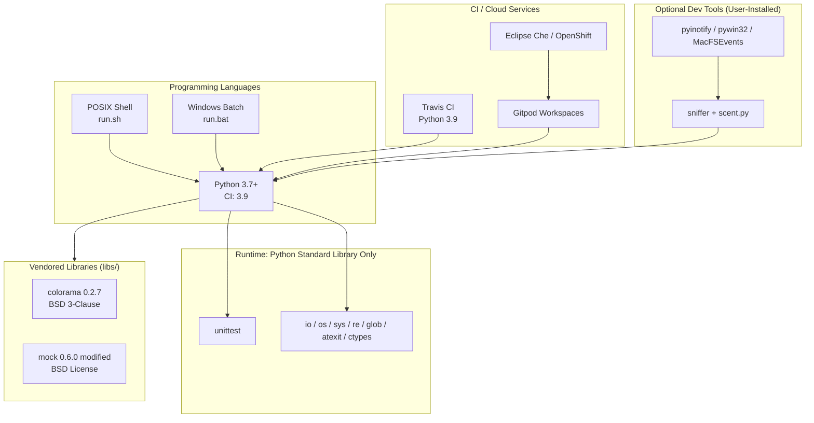

---

## 3.2 PROGRAMMING LANGUAGES

### 3.2.1 Python 3 (Primary Application Language)

Python is both the implementation language *and* the subject of instruction; this self-referential design is fundamental to the project's pedagogical model.

#### 3.2.1.1 Version Policy

| Aspect | Value | Source |
|---|---|---|
| Minimum supported | Python 3.7+ (warning emitted below this floor) | `contemplate_koans.py` version-check block |
| CI validation target | Python 3.9 | `.travis.yml` |
| Python 2 status | Explicitly rejected — script prints error and exits | `contemplate_koans.py` |
| Windows default install path | `C:\Python311` (used by `run.bat` discovery) | `run.bat` |
| Implementation | CPython (the reference interpreter) | Implicit; no PyPy or Jython references |

The version-gating logic in `contemplate_koans.py` is layered: Python 2 invocations are rejected outright, while Python 3 versions below 3.7 emit a warning but allow execution to proceed. This permissive lower bound exists because the koan curriculum uses only stable, long-standing Python features.

#### 3.2.1.2 Selection Justification

- **Pedagogical alignment** — The project teaches Python; the implementation language is necessarily Python.
- **Standard library sufficiency** — Per Section 1.2.2, the system runs "on stdlib alone (`unittest`, `io`, `re`, `sys`, `os`, `glob`)," eliminating dependency management entirely.
- **TDD substrate** — Python's built-in `unittest` framework provides the test discovery, execution, and result reporting primitives that the entire system is built upon.
- **Cross-platform ubiquity** — CPython 3 is available on Linux, macOS, and Windows, satisfying the cross-platform requirement without additional runtime layers.

### 3.2.2 POSIX Shell (Launcher Only)

The POSIX launcher `run.sh` is a four-line shell script whose sole responsibility is invoking `python3 -B contemplate_koans.py`. The `-B` flag disables `.pyc` bytecode generation, contributing to the "no filesystem writes" security posture documented in Section 2.4.4.

**Scope:** This is **not** an application language; it is an invocation convenience. No business logic resides in shell scripts.

### 3.2.3 Windows Batch (Launcher Only)

The Windows launcher `run.bat` (45 lines) performs Python interpreter discovery in a deterministic order:

1. `python.exe` in the current directory
2. `%PYTHON_PATH%` environment variable (default `C:\Python311`)
3. `%PYTHON%` environment variable

It additionally implements a user-friendly retry loop (`Test again? y or n -`) and a `pause` to keep the console window visible when invoked from Windows Explorer. As with `run.sh`, the script terminates by invoking `python.exe -B contemplate_koans.py`.

### 3.2.4 Plain Text (Manifest and Documentation Formats)

While not "programming languages" in the conventional sense, three plain-text formats are intrinsic to the runtime and merit acknowledgment:

| Format | File(s) | Role |
|---|---|---|
| UTF-8 plain text with `#` comments | `koans.txt` | Authoritative ordered curriculum manifest, parsed via `io.open(filename, 'rt', encoding='utf8')` in `runner/path_to_enlightenment.py` |
| reStructuredText | `README.rst` | Project README rendered by GitHub |
| Plain ASCII text | `Contributor Notes.txt`, `koans/GREEDS_RULES.txt`, `koans/example_file.txt` | Maintainer documentation and lesson fixtures |

The choice of plain-text format for the curriculum manifest (`koans.txt`), rather than Python code or a structured format like YAML/JSON, is a deliberate design decision noted in Section 1.2.2: it decouples curriculum ordering from code semantics, enables `#`-comment-based annotations, and is editable without invoking the Python interpreter.

---

## 3.3 FRAMEWORKS & LIBRARIES

### 3.3.1 Core Framework: Python Standard Library `unittest`

Per Section 1.2.2 Core Technical Approach, the system is built on a "Standard `unittest` substrate — The `Koan` base class (in `runner/koan.py`) is a thin subclass of `unittest.TestCase`."

#### 3.3.1.1 Integration Surface

| `unittest` Construct | Consumer in Codebase | Purpose |
|---|---|---|
| `unittest.TestCase` | `runner/koan.py` (Koan base class) | Foundation for every lesson |
| `unittest.TestSuite` | `runner/path_to_enlightenment.py`, `_runner_tests.py` | Aggregated, ordered test collection |
| `unittest.TestLoader` | `runner/path_to_enlightenment.py`, `runner/mountain.py` | Manifest-driven test discovery; `loader.sortTestMethodsUsing = None` preserves manifest order |
| `unittest.TestResult` | `runner/mockable_test_result.py` | Compatibility shim subclassed by `Sensei` |
| `unittest.TextTestRunner` | `_runner_tests.py` (verbosity=2) | Runner subsystem self-test execution |

#### 3.3.1.2 Justification

- **Zero-dependency** — Ships with CPython; no installation, no version-resolution risk.
- **Pedagogical transparency** — Learners encounter the same testing framework they will use professionally.
- **Mature and stable API** — The `unittest` API has been stable since Python 2.7, eliminating churn risk.
- **Customization hooks** — `TestResult` subclassing enables the colored `Sensei` reporter without forking the runner.

### 3.3.2 Python Standard Library Modules in Use

The complete inventory of standard-library modules imported across the runner and launchers:

| Module | Used In | Purpose |
|---|---|---|
| `unittest` | `runner/koan.py`, `runner/mockable_test_result.py`, `runner/mountain.py`, `runner/path_to_enlightenment.py`, `runner/sensei.py`, `_runner_tests.py`, all `runner/runner_tests/*.py` | Test framework foundation |
| `sys` | `contemplate_koans.py`, `runner/mountain.py`, `runner/sensei.py`, `runner/writeln_decorator.py`, `_runner_tests.py` | Streams (`stdout`), exit codes, `version_info` |
| `re` | `runner/koan.py`, `runner/sensei.py` | Regex for stack-trace scraping and source-location extraction |
| `os` | `runner/sensei.py`, `runner/writeln_decorator.py`, `scent.py` | Filesystem path handling |
| `glob` | `runner/sensei.py` | Lesson file discovery: `glob.glob('{0}/../koans/about*.py')` for dynamic lesson counting |
| `io` | `runner/path_to_enlightenment.py`, `runner/runner_tests/test_path_to_enlightenment.py` | UTF-8 file I/O on `koans.txt` |
| `atexit` | `libs/colorama/initialise.py` | Cleanup-hook registration during color subsystem init |
| `ctypes` (`windll`, `wintypes`) | `libs/colorama/win32.py` | Windows console API binding |

### 3.3.3 Curriculum-Level Standard Library Usage

The koan curriculum itself imports a small set of additional standard-library modules that appear in lessons (not in the runner). These are pedagogically motivated rather than architecturally required:

| Module | Lesson File(s) | Pedagogical Role |
|---|---|---|
| `functools` | `koans/about_decorating_with_classes.py`, `koans/about_iteration.py` | Demonstrating `functools.partial` for decorator lessons |
| `random` | `koans/about_dice_project.py` | `random.randint` for the DiceSet mini-project |
| `re` | `koans/about_regex.py`, `koans/about_string_manipulation.py`, `koans/about_with_statements.py` | Pattern matching curriculum domain |
| `math` | `koans/about_string_manipulation.py` | Lesson illustration within a method body |

### 3.3.4 Compatibility Requirements

The framework versions are tightly coupled to the supported Python runtime:

- The `unittest` API shape used (specifically `loader.sortTestMethodsUsing = None`, the `TextTestRunner(verbosity=2)` signature, and `TestResult` extension points) has been stable since Python 3.0 and is therefore compatible across the entire 3.7+ support window.
- Vendored library compatibility (Section 3.4) is independently version-pinned and does not depend on `unittest` evolution.

---

## 3.4 OPEN SOURCE DEPENDENCIES

### 3.4.1 Vendored Runtime Libraries

Per Section 1.1.1, the project "bundles its own vendored copies of `colorama` (for cross-platform colored terminal output) and a custom `mock` library, ensuring that learners can clone the repository and immediately begin work without configuring a virtual environment or installing packages from PyPI."

#### 3.4.1.1 colorama — Version 0.2.7

| Attribute | Value |
|---|---|
| Version | `0.2.7` (declared in `libs/colorama/__init__.py`) |
| License | BSD 3-Clause (Jonathan Hartley, 2013) |
| License file | `libs/colorama/LICENSE-colorama` |
| Location | `libs/colorama/` (six modules) |
| Public API | `init`, `deinit`, `reinit`, `Fore`, `Back`, `Style`, `AnsiToWin32` |
| Consumer | `runner/sensei.py` — imports `from libs.colorama import init, Fore, Style` and calls `init()` at module load |

**Internal module structure of the vendored colorama:**

| Module | Responsibility |
|---|---|
| `__init__.py` | Public API re-exports; declares `VERSION = '0.2.7'` |
| `ansi.py` | ANSI escape constants (`CSI = '\033['`, `Fore`, `Back`, `Style`) |
| `win32.py` | Windows ctypes interop via `windll`/`wintypes`; falls back to `windll = None` on non-Windows platforms |
| `winterm.py` | Windows console state (`WinTerm`, `WinColor`, `WinStyle` classes) |
| `ansitowin32.py` | Stream-adaptation layer translating ANSI codes to Win32 console API calls |
| `initialise.py` | Process-wide stream wrapping; registers cleanup via `atexit` |

**Justification for vendoring:**
- Eliminates Windows ANSI rendering disparity without a runtime install step.
- Pinned-by-vendoring strategy guarantees deterministic behavior across all learner machines.
- Compatible with the "zero-install fidelity" objective from Section 1.2.3.

#### 3.4.1.2 mock — Version 0.6.0 (Modified by Greg Malcolm)

| Attribute | Value |
|---|---|
| Version | `0.6.0 modified by Greg Malcolm` (declared as `__version__` in `libs/mock.py`) |
| License | BSD License (Michael Foord, 2007–2009) |
| Location | `libs/mock.py` (single file) |
| Public API | `Mock`, `patch`, `patch_object`, `sentinel`, `DEFAULT` (declared in `__all__`) |
| Consumers | `runner/runner_tests/test_mountain.py`, `runner/runner_tests/test_sensei.py`, `runner/runner_tests/test_path_to_enlightenment.py` |

**Justification for vendoring:**
- The bundled `mock 0.6.0` predates the version that was absorbed into Python's standard library as `unittest.mock` in Python 3.3.
- Vendoring guarantees stable behavior for the runner self-tests, independent of evolution in the stdlib `unittest.mock`.
- Preserves the "no `pip install` at runtime" property required for the runner subsystem's CI execution.

### 3.4.2 Gitpod Workspace Dependencies (Cloud Development Only)

The cloud workspace image installs three Python packages that are **not** runtime dependencies of the application. They exist only to enhance the developer/learner experience inside Gitpod-managed browsers.

**Source:** `.gitpod.Dockerfile`:
```
RUN pip3 install pytest==4.4.2 pytest-testdox mock
```

| Package | Version | Scope | Purpose |
|---|---|---|---|
| `pytest` | `==4.4.2` (pinned) | Gitpod workspace only | Alternative test runner for contributor convenience |
| `pytest-testdox` | Unpinned | Gitpod workspace only | Test output formatter |
| `mock` | Unpinned | Gitpod workspace only | Separate from the vendored `libs/mock.py`; provides modern `unittest.mock`-compatible API for ad-hoc use |

**Critical distinction:** Per Section 1.3.2, "There is no `setup.py`, `pyproject.toml`, or root-level `requirements.txt`. Pinned package versions exist only in `.gitpod.Dockerfile` for the cloud workspace environment." Local POSIX/Windows execution does not install or require any of these packages.

### 3.4.3 Optional User-Installed Tools

The README documents a continuous-test workflow for contributors who wish to re-run koans automatically on file save. None of these tools are required to run the koans themselves.

**Source:** `README.rst` "Sniffer Support" section.

| Package | Platform | Documented Install Command | Function |
|---|---|---|---|
| `sniffer` | All platforms | `python3 -m pip install sniffer` | File-watcher framework, configured by `scent.py` |
| `pyinotify` | Linux | `python3 -m pip install pyinotify` | Inotify backend for `sniffer` |
| `pywin32` | Windows | `python3 -m pip install pywin32` | Win32 filesystem-event backend for `sniffer` |
| `MacFSEvents` | macOS | `python3 -m pip install MacFSEvents` | FSEvents backend for `sniffer` |

The `scent.py` configuration file is the sole importer of `sniffer.api`; it is loaded only when the user explicitly runs the `sniffer` command.

### 3.4.4 Package Registry Strategy

| Registry | Role |
|---|---|
| PyPI (pypi.org) | Referenced only for the optional Sniffer toolchain in `README.rst` and for the Gitpod-only `.gitpod.Dockerfile` |
| GitHub Packages | Not used |
| npm / Maven / NuGet | Not applicable (no JavaScript, Java, or .NET components) |

The project itself is **not published** to PyPI — there is no `setup.py`, `pyproject.toml`, or distributable wheel. Installation is by `git clone`.

---

## 3.5 THIRD-PARTY SERVICES

### 3.5.1 Continuous Integration: Travis CI

Travis CI is the sole continuous-integration provider configured in the repository.

| Attribute | Value | Source |
|---|---|---|
| Configuration file | `.travis.yml` (24 lines) | Repository root |
| Language declaration | `python` | `.travis.yml` |
| Python version matrix | `3.9` (single entry) | `.travis.yml` |
| Build script | `python _runner_tests.py` | `.travis.yml` |
| Notifications | Email enabled | `.travis.yml` |
| Build status badge | `https://travis-ci.org/gregmalcolm/python_koans.png?branch=master` | `README.rst` |
| Build target page | `http://travis-ci.org/gregmalcolm/python_koans` | `README.rst` |
| Configured secrets | None | `.travis.yml` (per Section 2.4.4) |

**Aggregation logic:** Per Section 2.4.4 and the source of `_runner_tests.py`, the CI run aggregates five test suites (`TestMountain`, `TestSensei`, `TestHelper`, `TestFilterKoanNames`, `TestKoansSuite`), executes them with `unittest.TextTestRunner(verbosity=2)`, and propagates the result via `sys.exit(not res.wasSuccessful())`.

**CI Scope Boundary (Critical):** Per the Section 2.4.5 maintenance requirements, "Only the runner subsystem is gated by CI; the koan curriculum is intentionally not enforced (each koan is expected to fail until completed by the learner)." The CI green/red signal indicates regressions in the *framework*, never in the *curriculum*.

### 3.5.2 Cloud Development Workspaces

#### 3.5.2.1 Gitpod (Primary)

| Attribute | Value | Source |
|---|---|---|
| Configuration file | `.gitpod.yml` | Repository root |
| Custom image | `.gitpod.Dockerfile` (extends `gitpod/workspace-full:latest`) | Repository root |
| Workspace user | `gitpod` | `.gitpod.Dockerfile` |
| Auto-run command | `python contemplate_koans.py` | `.gitpod.yml` |
| Prebuild scope | `master` branch only; pull requests disabled; no auto-comment | `.gitpod.yml` |
| Launch badge | `https://gitpod.io/#https://github.com/gregmalcolm/python_koans` | `README.rst` |

Gitpod is the primary zero-install onboarding channel for learners who do not wish to install Python locally. The workspace boots into a pre-configured Linux environment with Python 3 available and immediately runs the koans.

#### 3.5.2.2 Eclipse Che / OpenShift Workspaces

| Attribute | Value | Source |
|---|---|---|
| Badge | `https://www.eclipse.org/che/contribute.svg` | `README.rst` |
| Launch URL | `https://workspaces.openshift.com/f?url=https://gitpod.io/#https://github.com/gregmalcolm/python_koans` | `README.rst` |
| Separate configuration files | None — re-routes to the Gitpod workspace URL | — |

Eclipse Che / OpenShift Workspaces is provided as an alternative cloud entry point; no Che-specific configuration files exist in the repository.

### 3.5.3 External Reference URLs (Documentation Only)

These services are referenced but not integrated programmatically:

| Service | Purpose | Source |
|---|---|---|
| GitHub | Source hosting at `https://github.com/gregmalcolm/python_koans` | `README.rst`, Section 1.2.1 |
| YouTube | Jake Hebbert tutorial screencasts | `README.rst` |
| `python.org/downloads` | Python installer download | `README.rst` |
| `Frompythonimportpodcast.com` | Acknowledgment of "Mikes of FPIP" origin contributors | `README.rst` |

### 3.5.4 Services Explicitly Not Used

Per Section 1.3.2, the following service categories are deliberately out of scope. They are enumerated here to remove ambiguity against the default technology stack.

| Default Stack Component | Status | Rationale (Source Section) |
|---|---|---|
| AWS / Azure / GCP cloud platforms | Not used | "No networked or server component" (1.3.2) |
| Auth0 / authentication services | Not used | "No user accounts, authentication, or login" (1.3.2) |
| Monitoring / APM tools (Datadog, New Relic, etc.) | Not used | No telemetry surface; "single-user, single-machine" (1.3.1) |
| External REST APIs / webhooks | Not used | "No webhook, REST API, or messaging integration" (1.3.2) |
| LMS integrations (Moodle, Canvas, Blackboard) | Not used | "No integration with learning management systems" (1.3.2) |
| GitHub Actions | Not used | Travis CI is the configured provider (Section 3.5.1) |

---

## 3.6 DATABASES & STORAGE

### 3.6.1 Absence of Database Systems

There is no database technology in the stack. Per Section 1.3.2: "No progress persistence — State is recomputed from scratch on every run; nothing is saved between sessions." Per Section 2.6.2, "No persistent storage between runs" is an **architectural** constraint, not an implementation oversight.

The default-stack component MongoDB is therefore not applicable. No relational, document, key-value, graph, or time-series database is present, configured, or referenced.

### 3.6.2 Absence of Caching

No caching layer exists, and the absence is enforced:

| Cache Avoidance Mechanism | Source |
|---|---|
| `python3 -B` flag (suppresses `.pyc` bytecode caching) | `run.sh` line 3 |
| `python.exe -B` flag in `SET RUN_KOANS=...` | `run.bat` line 5 |
| `os.system('python3 -B contemplate_koans.py')` | `scent.py` line 12 |

The `-B` flag suppression is intentional — it ensures the filesystem remains pristine after a run, supporting both the "no filesystem writes" security posture (Section 2.4.4) and the reproducibility expected of a learning environment.

No in-memory caches (Redis, Memcached, in-process LRU) are present either; per Section 2.4.2, no latency or throughput requirements exist that would motivate such infrastructure.

### 3.6.3 Read-Only File-Based Resources

The only persistent artifacts read at runtime are repository-resident source files and plain-text fixtures:

| File | Format | Role |
|---|---|---|
| `koans.txt` | UTF-8 plain text with `#` comments | Ordered curriculum manifest |
| `koans/about_*.py` | Python source | 40+ lesson modules |
| `koans/triangle.py` | Python source | Mini-project implementation stub |
| `koans/GREEDS_RULES.txt` | Plain text | Greed game rule documentation |
| `koans/example_file.txt` | Plain text | Fixture for file-reading lessons |

Per Section 2.6.1, the system assumes "The `koans.txt` manifest is well-formed UTF-8"; this is enforced at the I/O layer via `io.open(filename, 'rt', encoding='utf8')` in `runner/path_to_enlightenment.py`.

### 3.6.4 Storage Services

No cloud storage (S3, GCS, Azure Blob), object store, or CDN is used. The entire system operates exclusively against the local filesystem within the cloned repository directory.

---

## 3.7 DEVELOPMENT & DEPLOYMENT

### 3.7.1 Development Tools

#### 3.7.1.1 Sniffer (Optional Watch-and-Re-run)

Sniffer is the contributor-facing continuous-testing tool. It is **not** required to run the koans; it accelerates the contributor feedback loop for those modifying runner code.

**Configuration:** `scent.py` (top-level)

| Configuration Element | Value |
|---|---|
| Imported API | `from sniffer.api import *` |
| Watched paths | `['.', 'koans/']` |
| File filter | `.py` files only, excluding hidden files |
| Trigger action | `os.system('python3 -B contemplate_koans.py')` |
| Decorators used | `@file_validator`, `@runnable` |

**Platform backends** (user-installed per README instructions):
- Linux: `pyinotify`
- Windows: `pywin32`
- macOS: `MacFSEvents`

#### 3.7.1.2 Targeted Test Execution

The development workflow supports targeted, single-module or single-method execution, documented in `Contributor Notes.txt`:

| Workflow | Command | Mechanism |
|---|---|---|
| Full curriculum | `python3 contemplate_koans.py` | Default Mountain orchestration |
| Single module | `python3 contemplate_koans.py about_strings` | `unittest.TestLoader().loadTestsFromName("koans." + args[1])` in `runner/mountain.py` |
| Single test | `python3 contemplate_koans.py about_strings.AboutStrings.test_triple_quoted_strings_need_less_escaping` | Same loader, fully-qualified name |

#### 3.7.1.3 Version Control

| Aspect | Detail |
|---|---|
| Primary VCS | Git |
| Ignore file | `.gitignore` (covers `*.pyc`, `*.swp`, `.DS_Store`, `answers`, `.hg`, `.idea`) |
| Historical secondary VCS | Mercurial (`.hgignore` present as a historical artifact) |
| Hosting | GitHub at `https://github.com/gregmalcolm/python_koans` |
| Submodules | `.gitmodules` declares `Submodule_01_Do_not_use_15Jun`, which per Section 1.3.2 is "explicitly named 'Do_not_use'" and is **excluded** from functional scope |

### 3.7.2 Build System

**There is no build system.** The application executes directly from source.

Per Section 1.3.2: "No PyPI distribution — There is no `setup.py`, `pyproject.toml`, or root-level `requirements.txt`." This was confirmed by exhaustive filesystem search; no `Pipfile`, `poetry.lock`, `tox.ini`, `Makefile`, or other build descriptor exists outside the out-of-scope submodule.

| Invocation Path | Command |
|---|---|
| POSIX direct | `python3 contemplate_koans.py` |
| POSIX wrapper | `./run.sh` |
| Windows direct | `python contemplate_koans.py` |
| Windows wrapper | `run.bat` |
| Gitpod auto-launch | `python contemplate_koans.py` (configured in `.gitpod.yml`) |

The absence of a build system is a deliberate architectural choice that supports zero-install fidelity (Section 1.2.3) and pedagogical accessibility — learners do not need to understand packaging to use the koans.

### 3.7.3 Containerization Strategy

#### 3.7.3.1 Development Container (Gitpod Only)

The single Dockerfile in the repository is for cloud development workspaces, **not** for application distribution.

**Source:** `.gitpod.Dockerfile`

| Directive | Value |
|---|---|
| Base image | `gitpod/workspace-full:latest` |
| Workspace user | `gitpod` |
| Installed packages | `pytest==4.4.2`, `pytest-testdox`, `mock` |
| Lines of code | 11 (mostly comments referencing Gitpod customization docs) |

#### 3.7.3.2 Absence of Production Container

The default stack's "Docker (production)" component is not applicable. There is **no** application Dockerfile, no `docker-compose.yml`, no Kubernetes manifest, no Helm chart, and no container registry publication. The application is not designed for containerized deployment because it has no deployment target — learners run it locally.

### 3.7.4 CI/CD Pipeline

The CI/CD pipeline is intentionally minimal, reflecting the deployment model (none) and the curriculum scope (validation of the runner only).

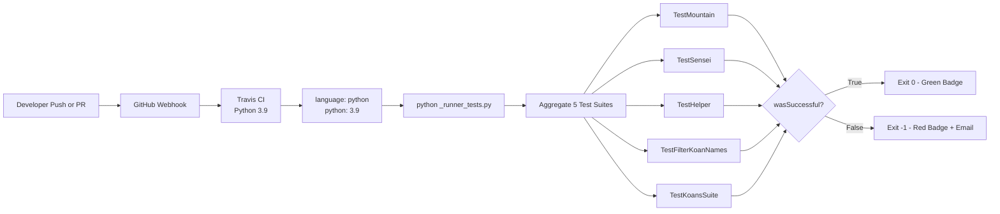

| Pipeline Property | Value |
|---|---|
| Trigger | GitHub push and pull request webhooks |
| Provider | Travis CI |
| Stages | Single stage (test) |
| Artifacts produced | None (no build artifacts; no deployment) |
| Deployment target | None |
| Notification channel | Email (per `.travis.yml`) |
| Pipeline secrets | None (per Section 2.4.4) |

**CD (Continuous Deployment) status:** Not applicable. The project has no deployment target — there is no service to deploy to, no package to publish, and no binary to release. Learners obtain the software exclusively via `git clone`.

### 3.7.5 License-Bearing Components in the Stack

License attribution is itself a maintenance dimension of the stack, per Section 2.4.5.

| Component | License | License File |
|---|---|---|
| Python Koans (project root) | MIT License — Copyright 2021 Greg Malcolm and The Status Is Not Quo | `MIT-LICENSE` |
| `colorama` 0.2.7 (vendored) | BSD 3-Clause — Jonathan Hartley, 2013 | `libs/colorama/LICENSE-colorama` |
| `mock` 0.6.0 modified (vendored) | BSD License — Michael Foord, 2007–2009 | Inline header in `libs/mock.py` |

All three licenses are OSI-approved and mutually compatible. Vendoring imposes a permanent obligation to preserve the upstream copyright notices, which is fulfilled by the in-file headers in `libs/mock.py` and the dedicated `LICENSE-colorama` file in `libs/colorama/`.

---

## 3.8 CONSOLIDATED VERSION MATRIX

This table reproduces the authoritative version information from Section 2.6.3 in the technology-stack context, with the addition of architectural role classification.

| Component | Version | Architectural Role | Source |
|---|---|---|---|
| Python (runtime floor) | 3.7+ | Runtime; warned below | `contemplate_koans.py` |
| Python (CI target) | 3.9 | CI validation | `.travis.yml` |
| `unittest` (stdlib) | Bundled with Python | Test framework foundation | Standard library |
| `colorama` (vendored) | 0.2.7 (BSD 3-Clause) | Cross-platform color output | `libs/colorama/__init__.py` |
| `mock` (vendored) | 0.6.0 modified by Greg Malcolm | Runner self-test mocking | `libs/mock.py` |
| `pytest` (Gitpod only) | 4.4.2 (pinned) | Optional alternative runner | `.gitpod.Dockerfile` |
| `pytest-testdox` (Gitpod only) | Unpinned | Optional output formatter | `.gitpod.Dockerfile` |
| `mock` (Gitpod-installed) | Unpinned | Optional modern mock API | `.gitpod.Dockerfile` |
| Gitpod base image | `gitpod/workspace-full:latest` | Cloud workspace OS layer | `.gitpod.Dockerfile` |
| `sniffer` + backends | Unpinned (user-installed) | Optional file watcher | `README.rst`, `scent.py` |
| Travis CI configuration schema | v1 implicit | CI orchestration | `.travis.yml` |

---

## 3.9 SECURITY POSTURE OF THE TECHNOLOGY STACK

Per Section 2.4.4, the technology stack's narrow surface is itself a security feature. The table below maps stack components to their security disposition.

| Stack Component | Security Posture | Source |
|---|---|---|
| Python runtime | Standard CPython interpreter; trust delegated to user installation | Section 2.4.4 |
| Standard library | No filesystem writes (with `-B` flag); no network usage | `run.sh`, `run.bat`, `scent.py` |
| Vendored `colorama` 0.2.7 | Pinned by vendoring; no automatic updates; integrity ensured by repository commit | Section 2.6.2 |
| Vendored `mock` 0.6.0 | Pinned by vendoring; runs only inside the self-test suite | Section 2.4.4 |
| Travis CI | No configured secrets; build runs only `python _runner_tests.py` | `.travis.yml`, Section 2.4.4 |
| Gitpod workspace | Ephemeral cloud container; no persistence | `.gitpod.yml` |
| Submodule `Submodule_01_Do_not_use_15Jun` | **Excluded** from functional scope; not loaded by application code | `.gitmodules`, Section 1.3.2 |

The trust model is summarized in Section 2.4.4: "the *learner* is the principal, executing on their own machine, with full trust. There is no isolation between the learner's edits and the runner." The stack does not need — and does not implement — sandboxing, capability restriction, or supply-chain verification because the threat model is the empty set.

---

## 3.10 References

### 3.10.1 Files Examined

**Root configuration and entry-point files:**
- `contemplate_koans.py` — Python version-gating logic and `Mountain` invocation; primary CLI entry point
- `run.sh` — POSIX launcher with `python3 -B` flag for `.pyc` suppression
- `run.bat` — Windows launcher with multi-step Python discovery and retry loop
- `scent.py` — Sniffer continuous-test configuration; sole importer of `sniffer.api`
- `_runner_tests.py` — CI test aggregator using `unittest.TextTestRunner(verbosity=2)`
- `koans.txt` — Ordered curriculum manifest (UTF-8, `#` comments)
- `Contributor Notes.txt` — Targeted execution command documentation
- `README.rst` — Installation, supported Python versions, Sniffer setup, badges
- `.travis.yml` — Travis CI configuration (Python 3.9, runs `_runner_tests.py`)
- `.gitpod.yml` — Gitpod workspace task and prebuild configuration
- `.gitpod.Dockerfile` — Gitpod base image and pinned developer dependencies
- `.gitmodules` — Excluded submodule mapping
- `.gitignore`, `.hgignore` — VCS ignore patterns
- `MIT-LICENSE` — Root project license

**Runner package source:**
- `runner/__init__.py` — Empty namespace marker
- `runner/mountain.py` — `Mountain` orchestrator class
- `runner/koan.py` — `Koan(unittest.TestCase)` base class with sentinel constants
- `runner/sensei.py` — Colored reporter; imports vendored colorama
- `runner/path_to_enlightenment.py` — Manifest parser using `io.open` with UTF-8
- `runner/writeln_decorator.py` — Stream adapter for `writeln()` convenience
- `runner/mockable_test_result.py` — Compatibility shim over `unittest.TestResult`
- `runner/helper.py` — `cls_name(obj)` introspection helper

**Runner self-tests:**
- `runner/runner_tests/__init__.py` — Empty namespace marker
- `runner/runner_tests/test_mountain.py` — Uses vendored `libs.mock`
- `runner/runner_tests/test_sensei.py` — Uses vendored `libs.mock`; asserts 43 koan total
- `runner/runner_tests/test_helper.py` — Tests `cls_name` introspection
- `runner/runner_tests/test_path_to_enlightenment.py` — Uses `io.StringIO`

**Vendored libraries:**
- `libs/__init__.py` — Namespace marker
- `libs/mock.py` — `mock 0.6.0 modified by Greg Malcolm`; BSD License
- `libs/colorama/__init__.py` — `VERSION = '0.2.7'`; BSD 3-Clause
- `libs/colorama/ansi.py` — ANSI constants (CSI, Fore, Back, Style)
- `libs/colorama/win32.py` — Windows ctypes bindings with non-Windows fallback
- `libs/colorama/winterm.py` — Windows console state classes
- `libs/colorama/ansitowin32.py` — ANSI-to-Win32 stream adapter
- `libs/colorama/initialise.py` — `init/deinit/reinit` with `atexit` registration
- `libs/colorama/LICENSE-colorama` — BSD 3-Clause license text

**Curriculum samples examined for import inventory:**
- `koans/__init__.py` — Namespace marker
- `koans/about_dice_project.py` — Confirms `import random` use
- `koans/about_decorating_with_classes.py` — Confirms `import functools` use
- `koans/triangle.py` — Mini-project stub plus `TriangleError(Exception)`

### 3.10.2 Folders Explored

- `/` (repository root) — Top-level configuration files and three substantive packages
- `runner/` — Runner subsystem source (7 modules plus tests subfolder)
- `runner/runner_tests/` — Self-test suite (4 test modules plus `__init__.py`)
- `libs/` — Vendored support libraries (`mock.py` plus `colorama/` subpackage)
- `libs/colorama/` — Six modules implementing cross-platform color
- `koans/` — 40+ `about_*.py` lessons plus support helpers
- `koans/a_package_folder/` — Minimal nested package for `about_packages` lesson

### 3.10.3 Technical Specification Sections Cross-Referenced

- `1.1 EXECUTIVE SUMMARY` — Zero-dependency philosophy and stakeholder context
- `1.2 SYSTEM OVERVIEW` — Component decomposition and core technical approach
- `1.3 SCOPE` — Authoritative source for in-scope vs. out-of-scope determinations
- `2.4 IMPLEMENTATION CONSIDERATIONS` — Technical constraints, performance markers, security posture, maintenance requirements
- `2.6 ASSUMPTIONS, CONSTRAINTS, AND VERSION TRACKING` — Authoritative version matrix

# 4. Process Flowchart

## 4.1 OVERVIEW OF SYSTEM WORKFLOWS

This section documents every observable workflow exposed by the Python Koans system, decomposed into core business processes (learner-facing) and integration workflows (developer / CI-facing). All diagrams are derived directly from the source artifacts enumerated in Section 1.4 — References, with explicit cross-references to the features catalogued in Section 2.1.

### 4.1.1 Architectural Workflow Context

Python Koans is a **single-process, single-thread, in-memory, command-line application** with no databases, no network I/O at runtime, no concurrency, no message queues, and no authentication or authorization layers. Consequently, the workflows documented here are characterized by:

- **Synchronous execution** — every step runs sequentially on the main thread.
- **Deterministic ordering** — the manifest (`koans.txt`) authoritatively pins lesson order; `loader.sortTestMethodsUsing = None` preserves source declaration order within each `TestCase`.
- **No external state** — each invocation of `contemplate_koans.py` starts and ends within a single process; no state survives between runs (the `-B` flag in `run.sh` and `run.bat` further inhibits `.pyc` caching).
- **Halt-at-first-failing-class semantics** — once a failure is observed, subsequent successful tests in *other* classes are silently dropped from the visible pass count via the `passesCount()` gate in `runner/sensei.py`.

### 4.1.2 Workflow Inventory

| Workflow ID | Workflow Name | Trigger | Primary Source Artifact(s) | Features Engaged |
|---|---|---|---|---|
| W-A | Sequential Learning Walkthrough | `python contemplate_koans.py` | `contemplate_koans.py`, `runner/mountain.py` | F-001, F-002, F-003, F-005, F-007 |
| W-B | Targeted Single-Koan Execution | `python3 contemplate_koans.py <name>` | `runner/mountain.py` (line 20) | F-001, F-002, F-006 |
| W-C | Mini-Project TDD Iteration | Editing `triangle.py`, `DiceSet`, `score()`, `Proxy` | `koans/about_*_project.py` | F-008, F-009, F-010, F-011 |
| W-D | Cross-Platform Launcher (POSIX) | `./run.sh` | `run.sh` | F-013, F-001 |
| W-E | Cross-Platform Launcher (Windows) | Double-click `run.bat` | `run.bat` | F-013, F-001 |
| W-F | Sniffer Continuous Re-run | Save any `.py` file | `scent.py` | F-014, F-001 |
| W-G | Gitpod / Eclipse Che Bootstrap | Click "Open in Gitpod" badge | `.gitpod.yml`, `.gitpod.Dockerfile` | F-016, F-017, F-001 |
| W-H | Travis CI Validation | GitHub `push` or PR | `.travis.yml`, `_runner_tests.py` | F-015, F-020 |
| W-I | Internal Test Lifecycle | (within any W-A/W-B run) | `runner/sensei.py` | F-005 |

---

## 4.2 HIGH-LEVEL SYSTEM WORKFLOW

The diagram below summarizes the canonical end-to-end execution path that occurs on every koan invocation. It is the superset that all workflows W-A through W-G ultimately converge into.

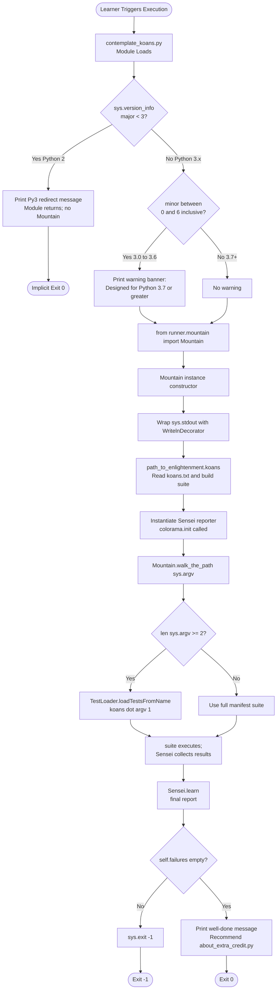

### 4.2.1 Decision Points Summary

| Diamond | Condition | Source | True Branch | False Branch |
|---|---|---|---|---|
| Major version check | `sys.version_info.major < 3` | `contemplate_koans.py` line 14–18 | Print Python 3 redirect, stop | Continue to minor check |
| Minor version check | `0 <= sys.version_info.minor <= 6` | `contemplate_koans.py` line 21–30 | Print warning banner, continue | Continue silently |
| Argument count gate | `args and len(args) >= 2` | `runner/mountain.py` line 20 | Narrow to single target | Use full suite |
| Failure gate | `self.failures` truthy | `runner/sensei.py` line 94 | `sys.exit(-1)` | Print success messaging |

### 4.2.2 Timing and SLA Considerations

Consistent with Section 2.4 (Implementation Considerations), **no latency, throughput, or concurrency requirements exist**. Execution time is bounded only by:

- Python interpreter startup overhead (≈100–300 ms typical).
- Module import cost for the 40+ koan modules.
- `unittest`-driven test discovery and execution speed.
- Terminal write throughput (negligible).

There are **no explicit timeouts** anywhere in the codebase, and the system is intentionally single-user / single-process. Cross-reference Section 2.6 for the explicit architectural constraints that preclude introducing SLAs.

---

## 4.3 CORE BUSINESS PROCESSES

### 4.3.1 W-A: Sequential Learning Walkthrough (Default Path)

This is the canonical "first run" scenario after cloning the repository. The learner invokes `python contemplate_koans.py` with no arguments and is presented with the *first failing test* in the *first lesson* (`AboutAsserts.test_assert_truth` initially).

```mermaid
flowchart TD
    A([Learner runs contemplate_koans.py<br/>no arguments]) --> B[Python interpreter loads module]
    B --> C[Version gating passes]
    C --> D[Mountain instance constructed]
    D --> E[koans.txt opened<br/>UTF-8 encoding enforced]
    E --> F[Lines stripped, comments skipped,<br/>blank lines skipped]
    F --> G[TestLoader builds suite preserving<br/>declared order]
    G --> H[Sensei reporter constructed<br/>colorama initialized]
    H --> I[suite begins iterating tests]
    I --> J[For each test method]
    J --> K[Sensei.startTest invoked]
    K --> L{cls_name != prevTestClassName?}
    L -->|Yes new class| M[Update prevTestClassName]
    M --> N{prior failures present?}
    N -->|No| O[Print blank line + Thinking ClassName]
    N -->|Yes| P[No header printed]
    O --> Q{class in AboutAsserts/<br/>AboutExtraCredit?}
    Q -->|No| R[lesson_pass_count++]
    Q -->|Yes| S[Lesson excluded from counter]
    R --> T[Run test body]
    S --> T
    P --> T
    L -->|No same class| T
    T --> U{Outcome?}
    U -->|Pass| V[addSuccess invoked]
    U -->|Fail/Error| W[addFailure / addError invoked]
    V --> X{passesCount = True?}
    X -->|Yes| Y[Print test_X has expanded<br/>your awareness GREEN/BRIGHT<br/>pass_count++]
    X -->|No| Z[Silent success; gated by halt-class rule]
    W --> AA[Append to self.failures list]
    Y --> AB{More tests?}
    Z --> AB
    AA --> AB
    AB -->|Yes| J
    AB -->|No| AC[Sensei.learn invoked]
    AC --> AD[errorReport prints first failure<br/>or no-op if none]
    AD --> AE[report_progress: N M-percent koans,<br/>X out of Y lessons]
    AE --> AF{failures present?}
    AF -->|Yes| AG[report_remaining N koans M lessons<br/>away from enlightenment]
    AF -->|No| AH[Skip remaining-line]
    AG --> AI[say_something_zenlike:<br/>aphorism at pass_count mod 37]
    AH --> AJ[say_something_zenlike:<br/>Spanish Inquisition message]
    AI --> AK[sys.exit -1]
    AJ --> AL[Print well done +<br/>about_extra_credit.py recommendation]
    AK --> END([Exit -1])
    AL --> END0([Exit 0])
```

#### 4.3.1.1 Validation Rules Engaged

Per Section 2.2 (Functional Requirements), the following rules apply at each step:

| Step | Rule | Source |
|---|---|---|
| Python version | `sys.version_info.major == 3` required | `contemplate_koans.py` line 14 |
| Manifest encoding | UTF-8 enforced via `io.open(..., encoding='utf8')` | `runner/path_to_enlightenment.py` line 32 |
| Manifest comments | `#` at first non-whitespace position introduces a comment | `runner/path_to_enlightenment.py` line 22 |
| Lesson counter exclusions | `AboutAsserts` and `AboutExtraCredit` not counted toward `lesson_pass_count` | `runner/sensei.py` line 36 |
| Success gating | `passesCount()` returns `True` only if no failures or current class equals first failing class | `runner/sensei.py` lines 53–54 |
| Exit code on failure | `sys.exit(-1)` mandatory | `runner/sensei.py` line 94 |

#### 4.3.1.2 User Touchpoints

The learner observes three categories of console output during this workflow:

1. **Lesson headers** — `"Thinking AboutStrings"` printed once per new class (until a failure occurs).
2. **Per-test outcomes** — `"<test_method> has expanded your awareness."` in **GREEN/BRIGHT** on success; `"<test_method> has damaged your karma."` in **RED/BRIGHT** for the first failing test in the first failing class.
3. **Final report block** — progress line, remaining line (only on failure), Zen aphorism, and either `sys.exit(-1)` or the success message in **MAGENTA**.

### 4.3.2 W-B: Targeted Single-Koan Execution

When the learner has identified one specific koan to iterate on, they can drastically shorten the feedback loop by passing a module or method name as the first argument. This bypasses the full manifest load on the execution path (though the manifest is still loaded eagerly during `Mountain.__init__` because `Sensei` uses it to compute `total_koans()`).

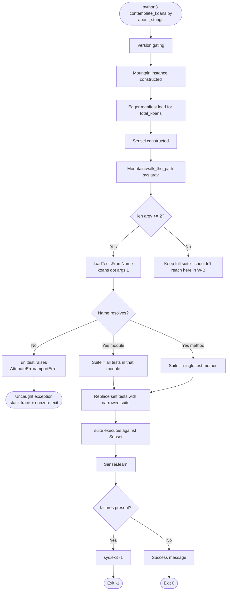

#### 4.3.2.1 Accepted Target Formats

Per `Contributor Notes.txt`:

| Format | Example | Result |
|---|---|---|
| Module only | `about_strings` | All `TestCase` classes and methods in `koans/about_strings.py` |
| Module + Class | `about_strings.AboutStrings` | All methods in the `AboutStrings` class |
| Fully-qualified method | `about_strings.AboutStrings.test_triple_quoted_strings_need_less_escaping` | The single test method |

#### 4.3.2.2 Error State

Targeted execution performs **no input validation** beyond what `unittest.TestLoader` provides. An unresolvable name raises an exception that propagates up uncaught, terminating the process with a nonzero exit code and a stack trace. This is the only workflow in which the system surfaces a Python exception directly to the learner.

### 4.3.3 W-C: Mini-Project TDD Red-Green-Refactor Cycle

For features F-008 (Triangle), F-009 (Greed Scoring), F-010 (DiceSet), and F-011 (Proxy Object), the workflow differs from the fill-in-the-blank style. The learner must implement entire functions or classes such that a pre-existing test suite passes.

```mermaid
flowchart LR
    Start([Encounter mini-project lesson]) --> Read[Read test file<br/>about_PROJECT.py]
    Read --> Stub[Open stub module<br/>triangle.py / inline class]
    Stub --> Red[RED phase:<br/>Tests fail with damaged karma]
    Red --> Inspect[Read scraped traceback:<br/>file + line highlighted in BLUE]
    Inspect --> Implement[Implement classification logic /<br/>roll method / score function /<br/>Proxy class]
    Implement --> Rerun[Run koans again]
    Rerun --> Check{All mini-project<br/>tests pass?}
    Check -->|No| Diagnose[Read new failure trace]
    Diagnose --> Refine[Refine implementation]
    Refine --> Rerun
    Check -->|Yes - first time GREEN| Refactor[REFACTOR phase:<br/>improve readability while<br/>tests stay green]
    Refactor --> Verify[Run once more for safety]
    Verify --> Done{Tests still green?}
    Done -->|Yes| Advance([Advance to next lesson])
    Done -->|No| Diagnose
```

#### 4.3.3.1 Mini-Project Test Coverage Reference

| Mini-Project | Test Class(es) | Test Count | Acceptance Criteria |
|---|---|---|---|
| Triangle Part 1 | `AboutTriangleProject` | 3 | Equilateral, isosceles, scalene classification |
| Triangle Part 2 | `AboutTriangleProject2` | 1 (with 4 `assertRaises`) | `TriangleError` raised for invalid sides |
| Greed Scoring | `AboutScoringProject` | 9 | Score function returns correct totals per `GREEDS_RULES.txt` |
| DiceSet | `AboutDiceProject` | 5 | `roll(n)` returns valid list; values stable until re-rolled |
| Proxy Object | `AboutProxyObjectProject` + `TelevisionTest` | 7 + 4 | Method forwarding, message recording, `AttributeError`, introspection helpers |

Note: `AboutProxyObjectProject` and `TelevisionTest` are registered as **two separate lines** in `koans.txt`, so they appear as two distinct "lessons" in the `lesson_pass_count`.

### 4.3.4 W-D and W-E: Cross-Platform Launcher Workflows

#### 4.3.4.1 POSIX Launcher (`run.sh`)

The POSIX launcher is intentionally trivial — four lines, no branching, no retry. Its only contribution beyond a direct invocation is the `-B` flag (disables `.pyc` generation, keeping the working tree pristine).

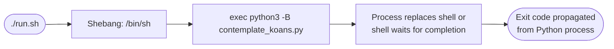

#### 4.3.4.2 Windows Launcher (`run.bat`) with Python Discovery and Retry Loop

The Windows launcher is substantially more elaborate (45 lines) because Windows users may have Python installed in several locations.

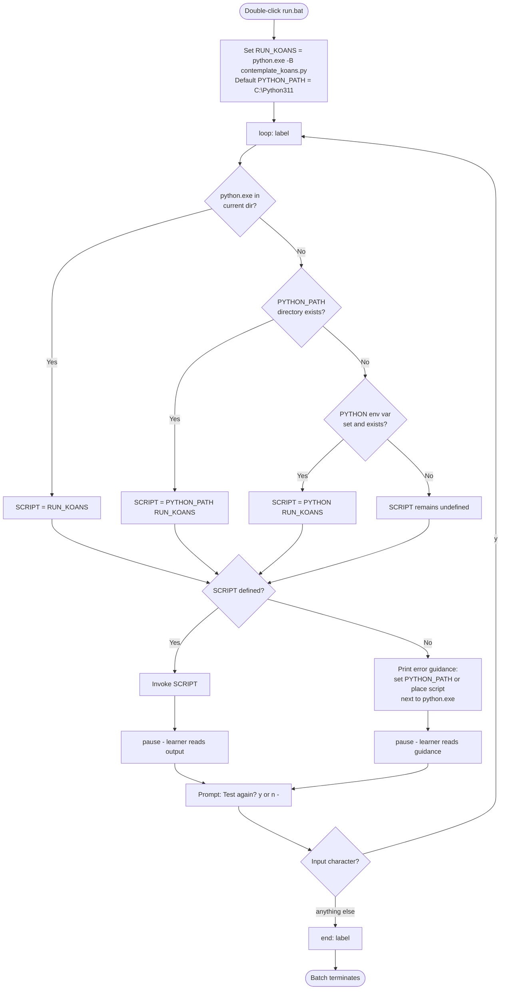

This is the **only** workflow in the system providing a true retry mechanism. It is **user-prompted**, not automatic, and resets the entire Python process between attempts.

### 4.3.5 W-F: Sniffer Continuous Re-run

Sniffer is an optional, third-party tool that the learner installs separately. The repository provides a `scent.py` configuration file that defines watch paths, file filtering, and the runnable command. This workflow tightens the TDD feedback loop by removing the manual "rerun" step.

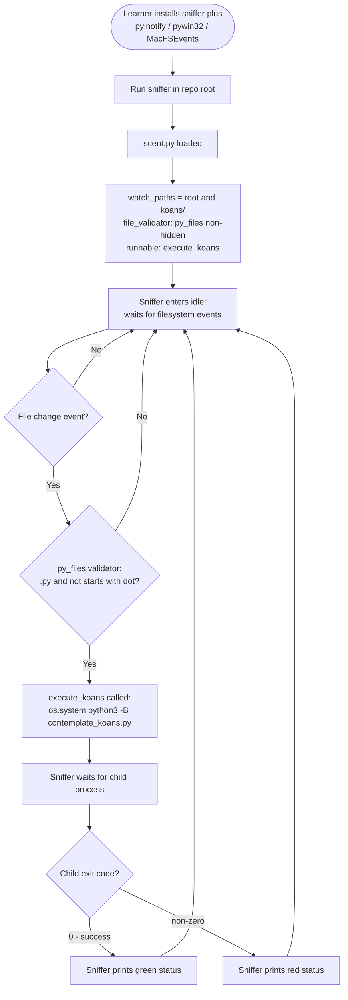

Note: Sniffer is **change-driven**, not error-driven. There is no internal retry on failure; the next rerun occurs only when the learner saves another file.

---

## 4.4 DETAILED COMPONENT PROCESS FLOWS

This subsection drills into the three orchestration components that are invoked on every workflow execution: `Mountain` (F-002), `path_to_enlightenment` (F-003), and `Sensei` (F-005).

### 4.4.1 Mountain Orchestration Flow

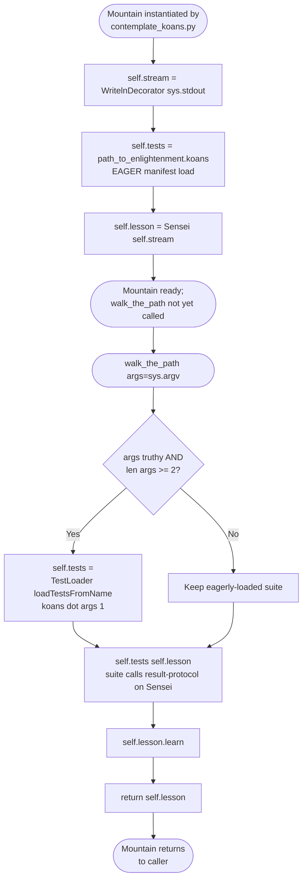

#### 4.4.1.1 Transaction Boundary

The entire `walk_the_path` call constitutes a single, atomic, in-memory "transaction" in the colloquial sense. There is no rollback, no commit, no persistence layer to coordinate. State exists only within the `Sensei` instance attached to `self.lesson` and is discarded when the process exits.

### 4.4.2 Manifest Loading Flow (`path_to_enlightenment.koans`)

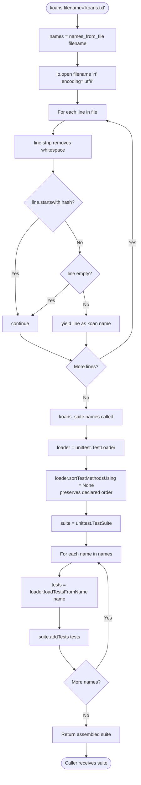

#### 4.4.2.1 Critical Design Decision: Method Ordering

The line `loader.sortTestMethodsUsing = None` is essential. By default, `unittest.TestLoader` sorts test methods alphabetically, which would scramble pedagogical sequencing within a class. Disabling sort preserves source declaration order, ensuring (for example) that `test_assert_truth` is encountered before `test_assert_with_message` within `AboutAsserts`.

### 4.4.3 Sensei Test Lifecycle Flow

This is the workflow internal to every `suite()` execution. It runs once per test method.

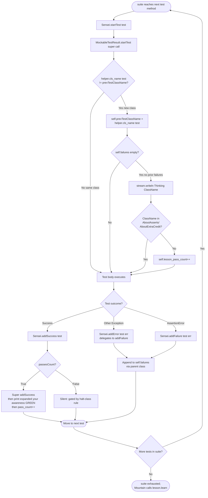

#### 4.4.3.1 The `passesCount` Gate Explained

The expression `return not (self.failures and helper.cls_name(self.failures[0][0]) != self.prevTestClassName)` evaluates to:

| State | `failures` | First-failure class vs. current class | `passesCount()` |
|---|---|---|---|
| No failures yet | Empty | N/A | `True` |
| Currently in same class as first failure | Non-empty | Equal | `True` |
| Moved past first failing class | Non-empty | Different | `False` |

The practical effect: once a class fails, subsequent successful tests **in other classes** are still executed by `unittest`, but Sensei does not count them or print success messages. This implements the "halt at first failing lesson" pedagogy.

### 4.4.4 Final Report Generation (`Sensei.learn`)

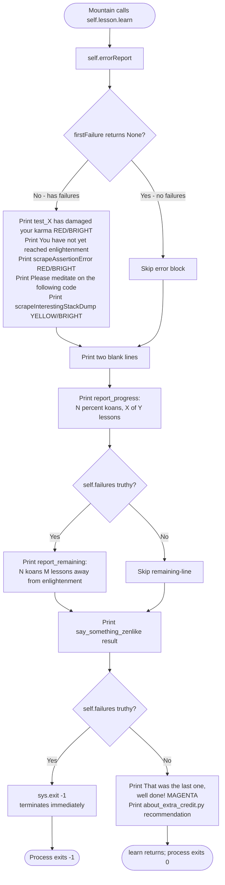

---

## 4.5 ERROR HANDLING FLOWCHARTS

### 4.5.1 First-Failure Selection and Sorting

When `errorReport()` is invoked, it must select *one* failure to display from the potentially many in `self.failures`. The selection algorithm prioritizes by **source line number within the first failing class**.

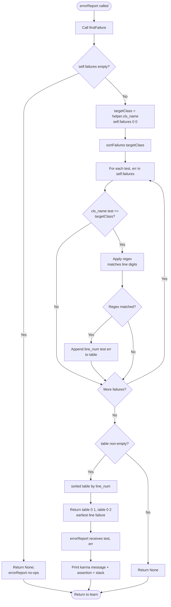

### 4.5.2 Stack Trace Scraping Flow

The `scrapeInterestingStackDump` method filters Python's verbose traceback down to only the lines that reference `koans/` paths, hiding the internal `unittest` and `runner/` frames that would distract a learner.

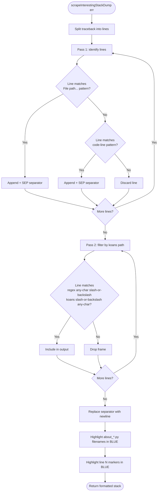

The regex `^.*[/\\]koans[/\\].*$` is **path-separator-agnostic**, matching both POSIX `/` and Windows `\` separators in a single pattern. This is one of two cross-platform compatibility mechanisms in the codebase (the other being the vendored `colorama`).

### 4.5.3 Retry, Fallback, and Recovery Inventory

Consistent with the minimalist architecture documented throughout Sections 1–3, the system implements **no internal retry, no fallback, and no automatic recovery**. The following table enumerates all "recovery"-adjacent mechanisms that *do* exist and clarifies their nature:

| Mechanism | Type | Where | Triggered By |
|---|---|---|---|
| `run.bat` retry loop | User-prompted, full process restart | `run.bat` lines 39–42 | Learner types `y` at prompt |
| Sniffer auto-rerun | File-system change, not error-driven | `scent.py` | Saving any non-hidden `.py` file |
| Travis CI re-run | Manual via Travis UI | External to repository | Maintainer click |
| Halt-at-first-failing-class | Pedagogical filter, not recovery | `runner/sensei.py` `passesCount()` | First failure observed |

**Explicitly absent:**
- No `try`/`except` retry blocks anywhere in `runner/`.
- No exponential backoff or rate limiting (irrelevant in single-process context).
- No fallback reporter (Sensei is the only reporter; no `--quiet`, `--xunit`, etc.).
- No error notification channels (email, Slack, etc.) except Travis CI's built-in email notifier for the runner self-test suite.
- No graceful degradation paths — either Python 3 is available and the suite runs, or the launcher script reports an unmet prerequisite and stops.

### 4.5.4 Process Exit Code Propagation

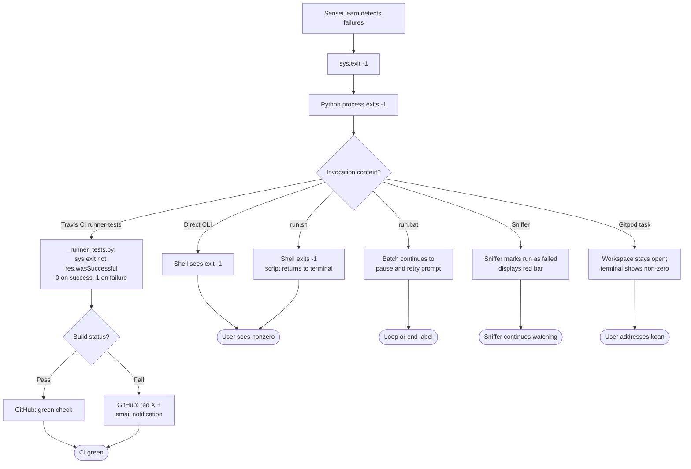

---

## 4.6 INTEGRATION WORKFLOWS

The system has a small but well-defined set of integration points with external systems. None involve runtime API calls, message queues, or shared databases; they are all build-time, CI-time, or workspace-bootstrap-time integrations.

### 4.6.1 W-H: Travis CI Validation Pipeline

This workflow validates the **runner subsystem itself** (not the curriculum) on every push to the GitHub repository.

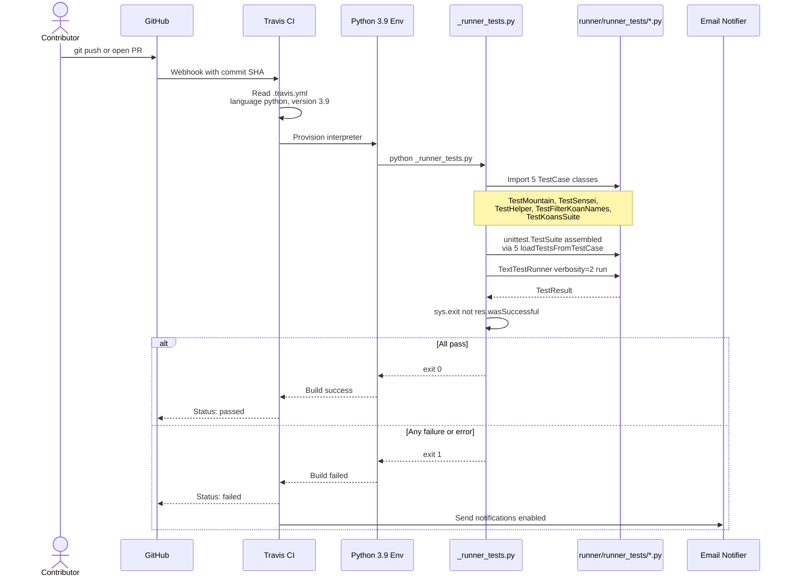

#### 4.6.1.1 Test Aggregation Detail

`_runner_tests.py` imports and registers exactly five `TestCase` classes:

| TestCase Class | Source Module | Subject Under Test |
|---|---|---|
| `TestMountain` | `runner/runner_tests/test_mountain.py` | `Mountain.walk_the_path` (verifies `lesson.learn` invoked) |
| `TestSensei` | `runner/runner_tests/test_sensei.py` | All `Sensei` public methods |
| `TestHelper` | `runner/runner_tests/test_helper.py` | `helper.cls_name(obj)` |
| `TestFilterKoanNames` | `runner/runner_tests/test_path_to_enlightenment.py` | `filter_koan_names` generator |
| `TestKoansSuite` | `runner/runner_tests/test_path_to_enlightenment.py` | `koans_suite` builder |

### 4.6.2 W-G: Gitpod Cloud Workspace Bootstrap

```mermaid
sequenceDiagram
    actor Learner
    participant Readme as README.rst Badge
    participant GP as Gitpod Platform
    participant Cfg as .gitpod.yml
    participant Dock as .gitpod.Dockerfile
    participant Base as gitpod/workspace-full:latest
    participant WS as Workspace Container
    participant App as contemplate_koans.py

    Learner->>Readme: Click Open in Gitpod
    Readme->>GP: Redirect with repo URL
    GP->>Cfg: Read .gitpod.yml
    Cfg-->>GP: image.file=.gitpod.Dockerfile<br/>tasks.command=python contemplate_koans.py<br/>github.prebuilds.master=true
    alt Master prebuild cache hit
        GP->>WS: Spin up from prebuilt image
    else Pull request OR no cache
        GP->>Dock: Build image
        Dock->>Base: FROM gitpod/workspace-full:latest
        Dock->>Dock: USER gitpod
        Dock->>Dock: RUN pip3 install pytest==4.4.2<br/>pytest-testdox mock
        Dock-->>GP: Image built
        GP->>WS: Spin up container
    end
    GP->>WS: Clone repository
    WS->>App: Execute task command
    App->>App: Version gating, Mountain, learn
    App-->>Learner: Display first failing koan in terminal
```

#### 4.6.2.1 Eclipse Che / OpenShift Redirect (W-G Variant)

The Eclipse Che integration is a **pure URL redirect** rather than a distinct workspace. Clicking the OpenShift Workspaces badge in `README.rst` resolves to a URL whose path begins with `https://workspaces.openshift.com/f?url=...` and which subsequently redirects to the same Gitpod workspace described above. There is no additional configuration file or Docker image specific to Eclipse Che.

### 4.6.3 Integration Surface Summary

| Direction | Integration | Protocol | Configuration |
|---|---|---|---|
| Inbound | GitHub → Travis CI | HTTPS webhook | `.travis.yml` |
| Inbound | Learner → Gitpod | OAuth + workspace URL | `.gitpod.yml`, `.gitpod.Dockerfile` |
| Inbound (indirect) | Learner → Eclipse Che → Gitpod | HTTP redirect | README badge URL |
| Local | Filesystem → Sniffer | OS filesystem events | `scent.py`, platform backend (`pyinotify`/`pywin32`/`MacFSEvents`) |
| Outbound | Travis CI → Email | SMTP | `notifications.email: true` in `.travis.yml` |

**Explicitly absent integrations:** No REST/GraphQL APIs, no database connections (`runner/path_to_enlightenment.py` reads a flat text file only), no message brokers, no caching layers (other than the lazy `self.all_lessons` glob cache inside a single Sensei instance), no telemetry, and no third-party identity providers.

---

## 4.7 STATE TRANSITION DIAGRAMS

### 4.7.1 Sensei Reporter State Machine

```mermaid
stateDiagram-v2
    [*] --> Initialized: __init__<br/>colorama.init<br/>pass_count=0<br/>lesson_pass_count=0<br/>prevTestClassName=None<br/>all_lessons=None
    Initialized --> AwaitingFirstTest: suite begins
    AwaitingFirstTest --> InClass: startTest<br/>cls_name becomes prevTestClassName<br/>lesson header printed
    InClass --> InClass: addSuccess<br/>passesCount True<br/>pass_count++
    InClass --> InClass: same-class startTest
    InClass --> HasFailures: addFailure / addError<br/>self.failures non-empty
    HasFailures --> HasFailures: same-class success<br/>pass_count++<br/>passesCount True
    HasFailures --> HaltedClass: class transition<br/>prev != first-failure class
    HaltedClass --> HaltedClass: addSuccess in new class<br/>passesCount False - SILENT
    HaltedClass --> HaltedClass: addFailure in new class<br/>recorded but not displayed
    InClass --> Reporting: suite exhausted<br/>learn called
    HasFailures --> Reporting: suite exhausted<br/>learn called
    HaltedClass --> Reporting: suite exhausted<br/>learn called
    Reporting --> ExitedFail: errorReport + progress + zen<br/>then sys.exit -1
    Reporting --> ExitedOK: progress + zen +<br/>well-done message
    ExitedFail --> [*]
    ExitedOK --> [*]
```

### 4.7.2 State Variables (Sensei Instance)

| Variable | Type | Initial Value | Mutated By | Used By |
|---|---|---|---|---|
| `pass_count` | int | 0 | `addSuccess` (when `passesCount()` is `True`) | `report_progress`, `report_remaining`, `say_something_zenlike` |
| `lesson_pass_count` | int | 0 | `startTest` on new class (excludes `AboutAsserts` and `AboutExtraCredit`) | `report_progress`, `report_remaining` |
| `prevTestClassName` | `str` or `None` | `None` | `startTest` on class change | `passesCount`, `startTest` |
| `failures` | list of `(test, err)` | `[]` (inherited) | `addFailure` (which `addError` delegates to) | `passesCount`, `firstFailure`, `sortFailures`, exit logic |
| `all_lessons` | list or `None` | `None` | `filter_all_lessons` (lazy initialization) | `total_lessons` |
| `tests` | `unittest.TestSuite` | eagerly loaded in `__init__` | (immutable after init) | `total_koans` |

#### 4.7.2.1 Persistence Points

There are **no persistence points**. The entire state graph above lives in process memory only. There is:

- No file write (the `-B` Python flag in `run.sh` and `run.bat` further disables `.pyc` bytecode caching).
- No database transaction (cross-reference Section 3.6).
- No serialization to disk between runs.
- No locking, no shared memory, no inter-process state.

#### 4.7.2.2 Caching

The only cache in the entire system is `self.all_lessons` inside a single `Sensei` instance — a lazily populated glob result of `about*.py` files (excluding `about_extra_credit`). The cache lifetime equals the lifetime of the `Sensei` instance, which equals the lifetime of one `Mountain.walk_the_path` invocation.

### 4.7.3 Zen Aphorism Selection State Machine

The `say_something_zenlike` method implements a deterministic, modulo-37 indexed selection over 19 distinct aphorisms (drawn from "The Zen of Python", PEP 20), with a single fallback for the success case.

```mermaid
stateDiagram-v2
    [*] --> CheckFailures: say_something_zenlike called
    CheckFailures --> HasFailures: self.failures truthy
    CheckFailures --> Success: self.failures empty
    HasFailures --> ComputeTurn: turn = pass_count mod 37
    ComputeTurn --> T0: turn == 0
    ComputeTurn --> T1_2: turn in 1..2
    ComputeTurn --> T3_4: turn in 3..4
    ComputeTurn --> T_etc: ... 14 more pairs ...
    ComputeTurn --> T35_36: turn in 35..36
    T0 --> Emit: Beautiful is better than ugly
    T1_2 --> Emit: Explicit is better than implicit
    T3_4 --> Emit: Simple is better than complex
    T_etc --> Emit
    T35_36 --> Emit: Namespaces are one honking great idea
    Success --> EmitSI: Nobody ever expects the Spanish Inquisition
    Emit --> [*]
    EmitSI --> [*]
```

Note: The unreachable closing line `"The temple is collapsing! Run!!!"` exists at the bottom of the method but cannot be returned given the exhaustive `if`/`elif` structure preceding it. The `test_sensei.py` self-tests verify specific aphorisms at `pass_count` values 0, 1, 10, 36, and 37, anchoring the cycle's correctness.

---

## 4.8 VALIDATION RULES AND COMPLIANCE

### 4.8.1 Business Rules at Each Workflow Step

| Step | Rule | Enforced By | Failure Mode |
|---|---|---|---|
| Interpreter selection | Must be CPython 3.x | `contemplate_koans.py` lines 14–30 | Python 2: redirect message + halt; <3.7: warning, continue |
| Manifest format | UTF-8 plain text; `#` for comments; blanks ignored | `runner/path_to_enlightenment.py` lines 17–39 | `UnicodeDecodeError` on malformed bytes; otherwise lines silently filtered |
| Manifest contents | Each entry must resolve via `unittest.TestLoader.loadTestsFromName` | `runner/path_to_enlightenment.py` lines 50–52 | `AttributeError` / `ImportError` propagates uncaught |
| Test method ordering | Source declaration order, not alphabetical | `runner/path_to_enlightenment.py` line 44 | Sort would scramble pedagogy |
| Lesson counter exclusions | `AboutAsserts` and `AboutExtraCredit` not counted | `runner/sensei.py` line 36 | Hardcoded; not configurable |
| Stack trace filter | Only frames containing `[/\\]koans[/\\]` are shown | `runner/sensei.py` line 153 | Frames in `unittest` or `runner/` are hidden |
| First-failure rule | One failure per class displayed (by lowest line number) | `runner/sensei.py` `sortFailures` / `firstFailure` | Other failures persist in `self.failures` for counting but are not printed |
| Failure exit code | `sys.exit(-1)` on any failure | `runner/sensei.py` line 94 | Mandatory; propagates to launchers, Sniffer, CI |

### 4.8.2 Data Validation Requirements

| Data Element | Validation | Mechanism |
|---|---|---|
| Manifest file encoding | UTF-8 | `io.open(..., encoding='utf8')` |
| Comment recognition | `#` at first non-whitespace | `line.strip().startswith('#')` |
| Blank line recognition | Empty after `strip()` | Truth-check on stripped string |
| Sentinel typing | Type-distinct sentinels for different contexts | Module constants in `runner/koan.py`: `__` (str), `___` (Exception class), `____` (str), `_____` (int) |
| Triangle inputs | Side-length plausibility | Learner-supplied; tests verify `TriangleError` raised for `(0,0,0)`, `(3,4,-5)`, `(1,1,3)`, `(2,5,2)` |
| Dice roll outputs | `len(roll) == n` and each value in `[1, 6]` | `assertIn`/`assertEqual` in `about_dice_project.py` |
| Greed scoring | Edge cases including empty hands and triples | 9 assertions in `about_scoring_project.py` |

### 4.8.3 Authorization Checkpoints

**None applicable.** The system has no concept of users, principals, accounts, or sessions. The learner is the sole local actor and operates with full filesystem trust. There are no API tokens, no OAuth flows, no JWTs, and no RBAC. Cross-reference Section 3.9 (Security Posture of the Technology Stack) for the full security disposition.

### 4.8.4 Regulatory Compliance Checks

**None applicable.** Python Koans does not process personal data, financial data, health data, or any other regulated category. HIPAA, GDPR, PCI-DSS, SOX, and similar regimes do not apply. The only compliance-adjacent obligations are open-source license attribution preservation for:

| Component | License |
|---|---|
| `libs/colorama/` (v0.2.7, Jonathan Hartley) | BSD 3-Clause |
| `libs/mock.py` (v0.6.0, Michael Foord, modified) | BSD-style |
| Project as a whole | MIT (per `MIT-LICENSE`) |

---

## 4.9 SWIMLANE VIEW: ACTORS AND SYSTEMS

The following diagram presents the end-to-end sequential-learning workflow (W-A) as a swimlane view, making explicit which actor or subsystem owns each step.

```mermaid
flowchart TD
    subgraph Learner_Lane[Learner]
        L1[Invoke command<br/>python contemplate_koans.py]
        L2[Read failing test output]
        L3[Edit koans/about_X.py<br/>replace placeholder]
        L4[Re-invoke command]
        L8[Read success message]
    end
    subgraph Entry_Lane[contemplate_koans.py]
        E1[Validate Python version]
        E2[Import Mountain]
        E3[Mountain instance walk_the_path argv]
    end
    subgraph Mountain_Lane[runner/mountain.py]
        M1[Wrap stdout WritelnDecorator]
        M2[Trigger manifest load]
        M3[Instantiate Sensei]
        M4{argv count >= 2?}
        M5[Narrow suite if targeted]
        M6[suite call into Sensei]
        M7[Call lesson.learn]
    end
    subgraph Path_Lane[runner/path_to_enlightenment.py]
        P1[Open koans.txt UTF-8]
        P2[Filter comments and blanks]
        P3[Build TestSuite preserving order]
    end
    subgraph Sensei_Lane[runner/sensei.py]
        S1[startTest: class transition logic]
        S2[addSuccess / addFailure / addError]
        S3[errorReport]
        S4[report_progress]
        S5[say_something_zenlike]
        S6[sys.exit -1 or success message]
    end
    L1 --> E1
    E1 --> E2
    E2 --> E3
    E3 --> M1
    M1 --> M2
    M2 --> P1
    P1 --> P2
    P2 --> P3
    P3 --> M3
    M3 --> M4
    M4 -->|No| M6
    M4 -->|Yes| M5
    M5 --> M6
    M6 --> S1
    S1 --> S2
    S2 --> M7
    M7 --> S3
    S3 --> S4
    S4 --> S5
    S5 --> S6
    S6 -->|failures| L2
    S6 -->|no failures| L8
    L2 --> L3
    L3 --> L4
    L4 --> E1
```

---

## 4.10 CROSS-REFERENCES AND TRACEABILITY

The workflows documented in this section map to the requirements and features enumerated elsewhere in the specification as follows:

| Workflow | Features Engaged (Section 2.1) | Requirements (Section 2.2) | Source Artifacts (Section 2.5) |
|---|---|---|---|
| W-A Sequential Learning | F-001, F-002, F-003, F-004, F-005, F-007 | F-001-RQ-*, F-002-RQ-*, F-003-RQ-*, F-005-RQ-* | `contemplate_koans.py`, `runner/mountain.py`, `runner/path_to_enlightenment.py`, `runner/sensei.py`, `koans.txt`, `koans/about_*.py` |
| W-B Targeted Execution | F-006 | F-006-RQ-001 through F-006-RQ-003 | `runner/mountain.py` line 20 |
| W-C Mini-Project TDD | F-008, F-009, F-010, F-011 | F-008-RQ-*, F-009-RQ-*, F-010-RQ-*, F-011-RQ-* | `koans/about_*_project*.py`, `koans/triangle.py`, `koans/GREEDS_RULES.txt` |
| W-D POSIX Launcher | F-013 | F-013-RQ-* | `run.sh` |
| W-E Windows Launcher | F-013 | F-013-RQ-* | `run.bat` |
| W-F Sniffer | F-014 | F-014-RQ-* | `scent.py` |
| W-G Gitpod / Che | F-016, F-017 | F-016-RQ-*, F-017-RQ-* | `.gitpod.yml`, `.gitpod.Dockerfile`, `README.rst` badge |
| W-H Travis CI | F-015, F-020 | F-015-RQ-*, F-020-RQ-* | `.travis.yml`, `_runner_tests.py`, `runner/runner_tests/*.py` |
| W-I Internal Test Lifecycle | F-005 | F-005-RQ-* | `runner/sensei.py`, `runner/mockable_test_result.py` |

For higher-level architectural context, see Section 1.2 (System Overview). For the explicit absence of databases, network APIs, and concurrency, see Sections 3.6 (Databases & Storage) and 3.9 (Security Posture). For implementation constraints that justify the minimalist workflows, see Section 2.6 (Assumptions, Constraints, and Version Tracking).

---

## 4.11 REFERENCES

### 4.11.1 Source Files Examined

- `contemplate_koans.py` — CLI entry point with Python version gating (lines 14–34)
- `run.sh` — POSIX launcher (4 lines)
- `run.bat` — Windows launcher with Python discovery and retry loop (45 lines)
- `scent.py` — Sniffer configuration: watch paths, file filter, runnable command (13 lines)
- `koans.txt` — 40-entry curriculum manifest with `#` comment support
- `_runner_tests.py` — CI test aggregator with 5 TestCase classes and exit code handling
- `.travis.yml` — Travis CI Python 3.9 configuration; runs `_runner_tests.py`; email notifications
- `.gitpod.yml` — Cloud workspace task definition and prebuild settings
- `.gitpod.Dockerfile` — Workspace image; installs `pytest==4.4.2`, `pytest-testdox`, `mock`
- `README.rst` — TDD workflow description, Sniffer setup, Eclipse Che badge URL
- `Contributor Notes.txt` — Targeted execution command examples
- `runner/mountain.py` — Mountain orchestrator (26 lines); `__init__` and `walk_the_path`
- `runner/path_to_enlightenment.py` — Manifest loader: `filter_koan_names`, `names_from_file`, `koans_suite`, `koans`
- `runner/sensei.py` — Colored reporter (269 lines); full test lifecycle, error reporting, progress, Zen aphorisms
- `runner/koan.py` — Sentinel definitions and Koan base class
- `runner/helper.py` — `cls_name(obj)` utility
- `runner/writeln_decorator.py` — Stream adapter adding `writeln()` method
- `runner/mockable_test_result.py` — Compatibility shim subclassing `unittest.TestResult`
- `runner/runner_tests/test_mountain.py` — Verifies `lesson.learn` invocation via `patch_object`
- `runner/runner_tests/test_sensei.py` — Tests for `addSuccess`, `sortFailures`, `firstFailure`, `errorReport`, `scrapeAssertionError`, `scrapeInterestingStackDump`, `say_something_zenlike`, `total_lessons`, `total_koans`, `filter_all_lessons`
- `runner/runner_tests/test_helper.py` — Tests for `cls_name`
- `runner/runner_tests/test_path_to_enlightenment.py` — `TestFilterKoanNames` and `TestKoansSuite`
- `koans/about_triangle_project.py`, `koans/about_triangle_project2.py`, `koans/triangle.py` — Triangle mini-project
- `koans/about_scoring_project.py`, `koans/GREEDS_RULES.txt` — Greed scoring mini-project
- `koans/about_dice_project.py` — DiceSet mini-project
- `koans/about_proxy_object_project.py` — Proxy + Television mini-project
- `koans/about_extra_credit.py` — Extra-credit scaffold

### 4.11.2 Folders Explored

- `/` (repository root) — Launcher scripts, entry point, manifest, CI configuration, Gitpod configuration
- `/runner/` — Test orchestration engine (Mountain, Sensei, manifest loader, sentinels, helpers)
- `/runner/runner_tests/` — Runner subsystem self-test suite
- `/koans/` — 40+ lesson modules plus mini-project stubs and supporting modules
- `/libs/` — Vendored support libraries (`colorama/`, `mock.py`)

### 4.11.3 Related Specification Sections

- Section 1.2 — System Overview (architectural decomposition, success criteria)
- Section 2.1 — Feature Catalog (F-001 through F-020 referenced throughout)
- Section 2.2 — Functional Requirements (validation rule sources)
- Section 2.3 — Feature Relationships (dependency graph; integration points)
- Section 2.4 — Implementation Considerations (timing/SLA disclaimers)
- Section 2.5 — Traceability Matrix (feature-to-source, requirement-to-workflow mappings)
- Section 2.6 — Assumptions, Constraints, and Version Tracking (architectural constraints precluding SLAs and persistence)
- Section 3.6 — Databases & Storage (absence justification)
- Section 3.7 — Development & Deployment (CI/CD pipeline, no containerization)
- Section 3.9 — Security Posture of the Technology Stack (empty threat model)

# 5. System Architecture

## 5.1 HIGH-LEVEL ARCHITECTURE

### 5.1.1 System Overview

#### 5.1.1.1 Architecture Style and Rationale

Python Koans implements a **single-process, single-user, manifest-driven test-execution pipeline** packaged as a command-line application. The architecture is best characterized as a **layered monolith** in which three top-level Python packages (`runner/`, `koans/`, `libs/`) collaborate within a single Python interpreter invocation. There is no client/server split, no network surface, no concurrency model, and no persistent state — every run is an atomic, in-memory transaction that begins with `python contemplate_koans.py` and ends when the process exits.

The deliberate minimalism is itself a primary architectural decision and is justified by five inter-locking principles:

- **Standard library primacy.** Runtime functionality is implemented exclusively using the Python 3 standard library — primarily `unittest`, with supporting use of `io`, `re`, `sys`, `os`, and `glob`. No PyPI installation is required to execute a single koan.
- **Vendoring over package management.** Where genuinely third-party functionality is required (cross-platform ANSI color rendering, mock objects for the runner's self-tests), the libraries are bundled in-repository under `libs/` rather than declared as installable dependencies. This guarantees deterministic, version-pinned behaviour across every learner's machine.
- **Zero-install fidelity.** Learners clone the repository and immediately begin work; the only prerequisite is a Python 3.7+ interpreter.
- **Manifest-driven discovery.** The plain-text `koans.txt` decouples curriculum ordering from code, supports `#` comments, and is editable without touching Python.
- **Halt-at-first-failing-class pedagogy.** A custom reporter (`Sensei`) suppresses progress feedback for any successful test that occurs *after* the first failing test class, ensuring learners address one koan at a time.

#### 5.1.1.2 Key Architectural Patterns

The system applies a small number of well-understood patterns from the Gang-of-Four catalogue and the `unittest` extension idiom:

| Pattern | Implementation | Purpose |
|---|---|---|
| Observer | `Sensei` subscribes to `unittest.TestSuite` lifecycle callbacks via inheritance from `unittest.TestResult` | React to `startTest`, `addSuccess`, `addFailure`, `addError` events |
| Decorator | `WritelnDecorator` wraps `sys.stdout` to add a `writeln()` method via `__getattr__` forwarding | Isolate I/O concerns from reporter logic |
| Compatibility Shim | `MockableTestResult` interposes between `Sensei` and `unittest.TestResult` | Prevent the parent class from being mocked out by self-tests |
| Template Method | `Koan` inherits from `unittest.TestCase` and defines sentinel constants used by lesson modules | Standardize the fill-in-the-blank surface across 40+ lessons |
| Manifest / Registry | `koans.txt` lists `module.ClassName` entries in pedagogical order | Decouple curriculum sequencing from code |

#### 5.1.1.3 System Boundaries and Major Interfaces

The system has only three external surfaces, all of which are read-only or write-only with respect to the host environment:

- **Standard input/output (terminal).** The reporter writes ANSI-colored text to `sys.stdout` via `WritelnDecorator`. No interactive input is consumed; `sys.argv` is the only command-line interface.
- **Filesystem (read-only).** `path_to_enlightenment.names_from_file()` reads `koans.txt` (UTF-8, plain text). `Sensei.filter_all_lessons()` performs a `glob` over `koans/about*.py` to count lessons. No files are written; the `-B` Python flag in `run.sh`/`run.bat` further suppresses `.pyc` caching.
- **Process exit code.** `Sensei.learn()` calls `sys.exit(-1)` on failure, which propagates to launcher scripts, the Sniffer file-watcher, and Travis CI as a non-zero status.

The runner itself does not open sockets, spawn subprocesses, write databases, contact remote services, or interact with the operating system beyond reading lesson files and printing to the terminal.

### 5.1.2 Core Components

The system decomposes into eight runtime components, organised across three packages, plus the vendored libraries:

| Component | Source Path | Primary Responsibility | Key Dependencies |
|---|---|---|---|
| CLI Entry Point | `contemplate_koans.py` | Python version gating; dispatches to Mountain | `sys`, `runner.mountain` |
| Mountain (Orchestrator) | `runner/mountain.py` | Wires stream, suite, reporter; runs tests; emits final report | `unittest`, `path_to_enlightenment`, `Sensei`, `WritelnDecorator` |
| Manifest Loader | `runner/path_to_enlightenment.py` | Parses `koans.txt` into an order-preserving `unittest.TestSuite` | `io`, `unittest.TestLoader`, `unittest.TestSuite` |
| Koan Base Class | `runner/koan.py` | Defines `Koan(unittest.TestCase)` and sentinel placeholders | `unittest` |
| Sensei Reporter | `runner/sensei.py` | Colored output, progress tracking, Zen aphorisms, exit code | `unittest`, `re`, `sys`, `os`, `glob`, `libs.colorama` |
| WritelnDecorator | `runner/writeln_decorator.py` | Wraps file-like objects, adds `writeln()` method | None |
| MockableTestResult | `runner/mockable_test_result.py` | Shim subclass of `unittest.TestResult` | `unittest` |
| Helper | `runner/helper.py` | `cls_name(obj)` returns `obj.__class__.__name__` | None |
| Koan Curriculum | `koans/about_*.py` (40 modules) | Lesson content as failing `unittest.TestCase` classes | `runner.koan` |
| Vendored Colorama | `libs/colorama/` (6 modules, v0.2.7) | Cross-platform ANSI escape rendering | BSD 3-Clause; ctypes (Windows) |
| Vendored Mock | `libs/mock.py` (v0.6.0 modified) | Mocking/patching for runner self-tests | None |

Each component is bounded to a single concern: orchestration, manifest loading, reporting, I/O decoration, base-class definition, or curriculum content. There is no cross-cutting "service" layer; communication occurs entirely through in-process Python imports and direct attribute access.

### 5.1.3 Data Flow Description

#### 5.1.3.1 Primary Data Flows

The data flowing through the system is exclusively in-memory, structured Python objects — never serialized to disk, never traversing a network. A canonical end-to-end execution proceeds through five stages:

1. **Manifest ingestion.** `path_to_enlightenment.names_from_file()` opens `koans.txt` as UTF-8 text, strips whitespace, skips `#`-prefixed comments and blank lines, and yields each remaining line as a `module.ClassName` token.
2. **Suite assembly.** `koans_suite()` constructs a `unittest.TestLoader`, explicitly sets `loader.sortTestMethodsUsing = None` to preserve source declaration order, calls `loader.loadTestsFromName()` for each token, and aggregates the resulting `TestCase` instances into a single `unittest.TestSuite`.
3. **Test execution.** `Mountain.walk_the_path()` invokes the suite, passing the `Sensei` instance as the result collector. For each test method, `Sensei.startTest`, `addSuccess`, `addFailure`, or `addError` is called by the `unittest` framework. `addError` delegates to `addFailure` to unify the failure-handling code path.
4. **Stack trace transformation.** When a failure occurs, `Sensei.scrapeAssertionError()` extracts the assertion message text and `scrapeInterestingStackDump()` filters the traceback to only those frames whose path matches the regex `^.*[/\\]koans[/\\].*$` — a single pattern that handles both POSIX `/` and Windows `\` separators.
5. **Report generation.** `Sensei.learn()` invokes `errorReport()`, `report_progress()`, `report_remaining()`, and `say_something_zenlike()` to compose the final colored output. On failure, the process exits with status `-1`; on success, a "well done" message is emitted and the process exits cleanly.

#### 5.1.3.2 Integration Patterns and Protocols

All inter-component integration occurs through synchronous Python method calls. No protocol layer (REST, gRPC, message queue) is interposed. The two notable patterns are:

- **`unittest` result-collector protocol.** `Sensei` implements the canonical `unittest.TestResult` callback contract (`startTest`, `addSuccess`, `addFailure`, `addError`, `stopTest`). This standard contract is the integration seam between the `unittest`-framework-controlled test invocation and the project's custom reporting logic.
- **Stream-decoration over `sys.stdout`.** `WritelnDecorator` proxies attribute access to the underlying stream while adding a single helper method. The Sensei never writes directly to `sys.stdout`; it always goes through the decorator.

#### 5.1.3.3 Data Transformation Points

| Source Form | Transformation | Target Form |
|---|---|---|
| `koans.txt` lines (UTF-8 strings) | `filter_koan_names` strips, skips comments/blanks | Iterable of `module.ClassName` strings |
| `module.ClassName` strings | `TestLoader.loadTestsFromName` reflection-loads classes | `unittest.TestCase` instances inside a `TestSuite` |
| Python `Traceback` object | `scrapeInterestingStackDump` regex-filters by koans path | Newline-joined string of learner-relevant frames only |
| `AssertionError` exception | `scrapeAssertionError` extracts message text | Single-line human-readable string |
| `pass_count` integer | `pass_count % 37` indexes 19-aphorism rotation | Selected Zen-of-Python aphorism string |

#### 5.1.3.4 Data Stores and Caches

There are no data stores. The only cache in the entire system is `Sensei.all_lessons` — a lazily populated `glob` result of `koans/about*.py` files (excluding `about_extra_credit`). The cache lifetime equals the lifetime of one `Sensei` instance, which equals the lifetime of one `Mountain.walk_the_path` invocation. No persistence, no shared memory, no inter-process state is maintained between runs.

### 5.1.4 External Integration Points

The system has no runtime integrations with external services. All integrations are either build-time/CI (Travis), cloud-IDE (Gitpod, Eclipse Che), or developer-tool (Sniffer) integrations that wrap the same single-process CLI application.

| System | Integration Type | Data Exchange Pattern | Protocol/Format |
|---|---|---|---|
| GitHub → Travis CI | Build webhook | Commit SHA triggers `_runner_tests.py` execution | HTTPS POST webhook |
| Learner → Gitpod | Cloud workspace bootstrap | Browser OAuth + workspace URL | HTTPS |
| Learner → Eclipse Che → Gitpod | URL redirect | `https://workspaces.openshift.com/f?url=...` to Gitpod | HTTPS |
| Filesystem → Sniffer | Local file watcher | OS filesystem events on `.py` save | inotify / pywin32 / MacFSEvents |
| Travis CI → Email | Notifications | Build status changes | SMTP |
| Sensei → Terminal | Terminal write | ANSI escape codes via colorama | Local file descriptor (stdout) |

**Explicitly absent integrations:** No REST or GraphQL APIs, no database connections, no message brokers, no caching tiers (beyond the in-process `all_lessons` lookup), no telemetry pipeline, no third-party identity providers, no payment processors, no logging aggregators.

---

## 5.2 COMPONENT DETAILS

### 5.2.1 CLI Entry Point — `contemplate_koans.py`

#### 5.2.1.1 Purpose and Responsibilities

The canonical executable script that learners invoke. It performs Python version gating (rejecting Python 2 outright and warning on Python below 3.7), imports `runner.mountain.Mountain`, and dispatches execution by calling `Mountain().walk_the_path(sys.argv)`. The script is intentionally thin (35 lines) so that the substantive logic resides in importable, testable modules.

#### 5.2.1.2 Technologies and Frameworks

Python 3 standard library only (`sys`). No third-party imports.

#### 5.2.1.3 Key Interfaces

- **Command-line interface.** `python contemplate_koans.py` runs the full curriculum; `python contemplate_koans.py about_strings` (or `about_strings.AboutStrings.test_x`) narrows to a single module, class, or method.
- **Exit code contract.** The script propagates the exit code raised by `Sensei.learn()` (typically `-1` on failure, `0` on success).

#### 5.2.1.4 Persistence and Scaling

Stateless; single-process; no scaling considerations.

### 5.2.2 Mountain Orchestrator — `runner/mountain.py`

#### 5.2.2.1 Purpose and Responsibilities

`Mountain` is the orchestrating coordinator. In its constructor it eagerly assembles three collaborators: a `WritelnDecorator` wrapping `sys.stdout`, the full `unittest.TestSuite` returned by `path_to_enlightenment.koans()`, and a `Sensei` instance bound to the decorated stream. Its `walk_the_path(args)` method optionally narrows the suite (when `len(args) >= 2`) by calling `unittest.TestLoader().loadTestsFromName("koans." + args[1])`, then invokes the suite with `Sensei` as the result collector, calls `self.lesson.learn()` to emit the final report, and returns `self.lesson` to the caller.

#### 5.2.2.2 Technologies and Frameworks

Python `unittest` framework, internal package imports only.

#### 5.2.2.3 Key Interfaces

- `Mountain()` — no-argument constructor that wires up dependencies
- `walk_the_path(args=None)` — main execution entry point

#### 5.2.2.4 Persistence and Scaling

In-memory only; instance attributes `self.stream`, `self.tests`, `self.lesson` are discarded at process exit.

### 5.2.3 Manifest Loader — `runner/path_to_enlightenment.py`

#### 5.2.3.1 Purpose and Responsibilities

Reads and parses `koans.txt` to produce an ordered `unittest.TestSuite`. The module exposes four functions: `filter_koan_names(lines)` (a generator that strips and filters), `names_from_file(filename)` (UTF-8 file iteration via `io.open(filename, 'rt', encoding='utf8')`), `koans_suite(names)` (suite assembly with `loader.sortTestMethodsUsing = None`), and `koans(filename=KOANS_FILENAME)` (default-argument convenience entry).

#### 5.2.3.2 Critical Design Decision

The line `loader.sortTestMethodsUsing = None` is essential. By default, `unittest.TestLoader` sorts test methods alphabetically, which would scramble pedagogical sequencing within a class. Disabling sort preserves source declaration order, ensuring (for example) that `test_assert_truth` is encountered before `test_assert_with_message` within `AboutAsserts`.

#### 5.2.3.3 Key Interfaces

- `koans()` — returns assembled `unittest.TestSuite`
- `names_from_file(filename)` — generator of clean koan name strings

#### 5.2.3.4 Persistence and Scaling

Reads `koans.txt` once per invocation; no caching of the parsed manifest across runs.

### 5.2.4 Koan Base Class — `runner/koan.py`

#### 5.2.4.1 Purpose and Responsibilities

Defines the public surface that lesson modules import. The 24-line module exposes `__all__ = ["__", "___", "____", "_____", "Koan"]`, where:

- `__ = "-=> FILL ME IN! <=-"` — string sentinel for general assertion blanks
- `class ___(Exception)` — exception subclass for `assertRaises` placeholders
- `____ = "-=> TRUE OR FALSE? <=-"` — string sentinel for boolean blanks
- `_____ = 0` — integer sentinel for numeric blanks
- `class Koan(unittest.TestCase): pass` — the test-case base class

#### 5.2.4.2 Technologies and Frameworks

Python `unittest` standard library; no additional dependencies.

### 5.2.5 Sensei Reporter — `runner/sensei.py`

#### 5.2.5.1 Purpose and Responsibilities

The 270-line `Sensei` class is the largest and most behaviour-rich component. It subclasses `MockableTestResult` and overrides the `unittest.TestResult` callback contract to implement: colored output (via vendored colorama), per-class lesson header printing, halt-at-first-failing-class progress gating, traceback scraping, Zen-of-Python aphorism selection, progress reporting, and final exit-code emission.

#### 5.2.5.2 State Variables

| Variable | Type | Initial Value | Role |
|---|---|---|---|
| `pass_count` | `int` | `0` | Cumulative count of passed koans (gated by `passesCount()`) |
| `lesson_pass_count` | `int` | `0` | Count of completed lesson classes (excludes `AboutAsserts`, `AboutExtraCredit`) |
| `prevTestClassName` | `str` or `None` | `None` | Tracks class transitions for header printing |
| `failures` | list of `(test, err)` | `[]` (inherited) | All failures observed during the run |
| `all_lessons` | list or `None` | `None` | Lazy `glob` cache of lesson files |
| `tests` | `unittest.TestSuite` | eager-loaded | Used by `total_koans()` |

#### 5.2.5.3 Key Methods

- **Lifecycle callbacks:** `startTest`, `addSuccess`, `addError` (delegates to `addFailure`), `addFailure`
- **Progress gating:** `passesCount()` — returns `True` unless we have moved past the first failing class
- **Failure selection:** `firstFailure`, `sortFailures` — pick the earliest-line failure within the first failing class
- **Traceback scraping:** `scrapeAssertionError`, `scrapeInterestingStackDump`
- **Final reporting:** `learn`, `errorReport`, `report_progress`, `report_remaining`, `say_something_zenlike`
- **Curriculum metrics:** `total_koans`, `total_lessons`, `filter_all_lessons`

#### 5.2.5.4 Color Coding Conventions

| Event Class | Colorama Code |
|---|---|
| Pass (expanded awareness) | `Fore.GREEN + Style.BRIGHT` |
| Failure (damaged karma) | `Fore.RED + Style.BRIGHT` |
| Stack trace lines | `Fore.YELLOW + Style.BRIGHT` |
| Filename / line-number highlights | `Fore.BLUE` |
| Success message ("well done") | `Fore.MAGENTA` |
| Zen aphorism | `Fore.CYAN` |

#### 5.2.5.5 Exit Behaviour

`Sensei.learn()` calls `sys.exit(-1)` when `self.failures` is non-empty. On a clean run, it returns normally and the process exits with status 0.

### 5.2.6 WritelnDecorator — `runner/writeln_decorator.py`

A 20-line decorator class that wraps a file-like object and adds a `writeln()` method. Attribute access is forwarded to the wrapped stream via `__getattr__`. It exists so that `Sensei` can call `self.stream.writeln(...)` without needing to track newlines manually, while still being able to inject a mock stream for testing.

### 5.2.7 MockableTestResult — `runner/mockable_test_result.py`

A 10-line compatibility shim that subclasses `unittest.TestResult` and is then subclassed by `Sensei`. Its sole purpose, as documented in the source comment, is to interpose a class between `unittest.TestResult` and `Sensei` so that the runner self-tests can mock `MockableTestResult` without mocking out `unittest.TestResult` itself.

### 5.2.8 Helper — `runner/helper.py`

A 5-line utility module exposing `cls_name(obj)`, which returns `obj.__class__.__name__`. Used pervasively by `Sensei` for class transition detection and failure-class comparison.

### 5.2.9 Koan Curriculum — `koans/`

#### 5.2.9.1 Curriculum Scope

40 ordered entries in `koans.txt` covering: language fundamentals (asserts, strings, none, lists, tuples, dictionaries, sets), control flow (control statements, true and false), object orientation (classes, new-style classes, attribute access, inheritance, multiple inheritance), advanced constructs (iteration, comprehension, generators, lambdas, decorators, with-statements, scope, monkey-patching), modules (modules, packages, method bindings), exceptions, regex, and mini-projects.

#### 5.2.9.2 Mini-Projects

| Mini-Project | Modules / Support Files |
|---|---|
| Triangle classification | `about_triangle_project.py`, `about_triangle_project_2.py`, `triangle.py` |
| Greed scoring | `about_scoring_project.py`, `GREEDS_RULES.txt` |
| DiceSet | `about_dice_project.py` |
| Proxy + Television | `about_proxy_object_project.py` (Proxy and Television are separate entries) |

#### 5.2.9.3 Supporting Modules

`local_module.py`, `another_local_module.py`, `jims.py`, `joes.py`, `local_module_with_all_defined.py`, `a_package_folder/` — used by lessons on packages, imports, and `__all__` semantics.

### 5.2.10 Vendored Colorama — `libs/colorama/`

#### 5.2.10.1 Purpose and Provenance

Version 0.2.7 of the `colorama` library (BSD 3-Clause, Jonathan Hartley, 2013) is bundled in-tree to provide cross-platform ANSI escape rendering. On Windows, where `cmd.exe` does not natively interpret ANSI codes, `colorama` uses `ctypes` to translate escape sequences into Win32 console API calls.

#### 5.2.10.2 Public Surface

The six modules (`__init__.py`, `ansi.py`, `win32.py`, `winterm.py`, `ansitowin32.py`, `initialise.py`) expose `init`, `deinit`, `reinit`, `Fore`, `Back`, `Style`, and `AnsiToWin32`. Only `runner/sensei.py` consumes these.

#### 5.2.10.3 Rationale for Vendoring

Vendoring eliminates the `pip install colorama` step at runtime, pins a known-good version into the repository, and guarantees identical Windows behaviour across all learner machines.

### 5.2.11 Vendored Mock — `libs/mock.py`

A single-file vendored copy declared as `__version__ = '0.6.0 modified by Greg Malcolm'` (BSD-style license, Michael Foord, 2007–2009). Exposes `Mock`, `patch`, `patch_object`, `sentinel`, and `DEFAULT`. Consumed *only* by the runner's own self-test modules (`runner/runner_tests/test_mountain.py`, `test_sensei.py`); never used by the koan curriculum itself.

### 5.2.12 Component Interaction Diagram

The following diagram shows the runtime collaboration topology when a learner invokes the CLI:

```mermaid
flowchart TB
    Learner([Learner]) -->|python contemplate_koans.py| Entry[contemplate_koans.py<br/>CLI Entry Point]
    Entry -->|Python version gate| VerOK{Python 3?}
    VerOK -->|No| Reject[Print rejection<br/>exit 1]
    VerOK -->|Yes| Construct[Mountain<br/>walk_the_path sys.argv]
    Construct --> Mountain[runner/mountain.py<br/>Mountain]
    Mountain --> Path[runner/path_to_enlightenment.py<br/>Manifest Loader]
    Mountain --> Stream[runner/writeln_decorator.py<br/>WritelnDecorator]
    Mountain --> Sensei[runner/sensei.py<br/>Sensei Reporter]
    Path -->|read UTF-8| Manifest[(koans.txt<br/>40 ordered entries)]
    Path -->|loadTestsFromName| Loader[unittest.TestLoader<br/>sortTestMethodsUsing=None]
    Loader -->|reflect-import| Koans[koans/about_*.py<br/>40 lesson modules]
    Koans -->|inherit| Base[runner/koan.py<br/>Koan base + sentinels]
    Mountain -->|invoke suite| Suite[unittest.TestSuite]
    Suite -->|callbacks| Sensei
    Sensei -->|colored writes| Stream
    Stream -->|file descriptor| StdOut[(sys.stdout)]
    Sensei -->|ANSI codes via| Colorama[libs/colorama/<br/>v0.2.7]
    Sensei -->|extends| Shim[runner/mockable_test_result.py<br/>MockableTestResult]
    Shim -->|extends| StdLib[unittest.TestResult]
    Sensei -->|cls_name| Helper[runner/helper.py]
```

### 5.2.13 Sequence Diagram — Sequential Lesson Execution

This sequence diagram traces the canonical workflow `W-A` (`python contemplate_koans.py` with no arguments):

```mermaid
sequenceDiagram
    participant L as Learner
    participant CK as contemplate_koans.py
    participant M as Mountain
    participant P as path_to_enlightenment
    participant TL as unittest.TestLoader
    participant TS as unittest.TestSuite
    participant S as Sensei
    participant W as WritelnDecorator
    participant SO as sys.stdout

    L->>CK: python contemplate_koans.py
    CK->>CK: Check Python version
    CK->>M: Mountain()
    M->>W: WritelnDecorator(sys.stdout)
    M->>P: koans()
    P->>P: names_from_file('koans.txt')
    P->>P: filter_koan_names(lines)
    P->>TL: TestLoader()
    P->>TL: sortTestMethodsUsing = None
    loop For each koan name
        P->>TL: loadTestsFromName(name)
        TL-->>P: TestCase instances
    end
    P-->>M: TestSuite (ordered)
    M->>S: Sensei(stream)
    CK->>M: walk_the_path(sys.argv)
    M->>TS: suite(Sensei)
    loop For each test method
        TS->>S: startTest(test)
        S->>W: writeln('Thinking <Class>')
        W->>SO: write
        alt Test passes
            TS->>S: addSuccess(test)
            S->>S: passesCount()?
            alt True
                S->>W: writeln(GREEN expanded awareness)
                S->>S: pass_count++
            else False (halt-class)
                S->>S: silent drop
            end
        else Test fails
            TS->>S: addFailure(test, err)
            S->>S: append to self.failures
        end
    end
    M->>S: learn()
    S->>S: errorReport()
    S->>S: scrapeAssertionError + scrapeInterestingStackDump
    S->>W: writeln(RED karma + YELLOW stack + Zen)
    alt Has failures
        S->>SO: sys.exit(-1)
    else No failures
        S->>W: writeln(MAGENTA well done)
        S-->>M: return
    end
    M-->>CK: return self.lesson
    CK-->>L: process exit code
```

### 5.2.14 State Transition Diagram — Sensei Reporter

The Sensei reporter is the only stateful component in the system. Its complete state machine across a single run:

```mermaid
stateDiagram-v2
    [*] --> Initialized: __init__<br/>colorama.init<br/>counters=0
    Initialized --> AwaitingFirstTest: suite begins
    AwaitingFirstTest --> InClass: startTest<br/>prevTestClassName set<br/>lesson header printed
    InClass --> InClass: addSuccess<br/>passesCount=True<br/>pass_count++
    InClass --> InClass: same-class startTest
    InClass --> HasFailures: addFailure / addError
    HasFailures --> HasFailures: same-class success<br/>still counted
    HasFailures --> HaltedClass: class transition<br/>prev != first-failure class
    HaltedClass --> HaltedClass: addSuccess gated SILENT
    HaltedClass --> HaltedClass: addFailure recorded
    InClass --> Reporting: suite exhausted<br/>learn called
    HasFailures --> Reporting: suite exhausted
    HaltedClass --> Reporting: suite exhausted
    Reporting --> ExitedFail: errorReport + Zen<br/>sys.exit -1
    Reporting --> ExitedOK: well-done message
    ExitedFail --> [*]
    ExitedOK --> [*]
```

---

## 5.3 TECHNICAL DECISIONS

### 5.3.1 Architecture Style Decision

#### 5.3.1.1 Decision Statement

Adopt a single-process, single-user, in-memory monolith built on the Python `unittest` substrate. Reject all alternative architectures (client/server, microservices, web application, plugin framework).

#### 5.3.1.2 Rationale

The system's purpose is to help an individual learner work through a curriculum of failing tests on their own machine. Every characteristic of more elaborate architectures (network availability, multi-user concurrency, persistent state, horizontal scalability) is irrelevant to that purpose and would only add friction. The chosen style:

- Minimises learner setup time to "clone and run"
- Removes the entire class of operational concerns (provisioning, monitoring, scaling, security perimeter)
- Lets the curriculum content remain the centre of attention

#### 5.3.1.3 Tradeoffs Accepted

| Tradeoff | Implication | Mitigation |
|---|---|---|
| No remote progress sync | Learner cannot resume on a different machine | Plain text source files are trivially git-able |
| No web UI | Learners must be comfortable with a terminal | Cloud workspaces (Gitpod, Eclipse Che) provide a one-click browser terminal |
| No grading service | No certifiable completion proof | Out of scope; this is self-directed learning |
| No internationalisation | English-only curriculum | Out of scope |

### 5.3.2 Communication Pattern Choices

| Pattern | Used? | Justification |
|---|---|---|
| Synchronous in-process method calls | Yes | Only mechanism needed; everything runs in one interpreter |
| Observer (TestResult callbacks) | Yes | Standard `unittest` extension point for custom reporting |
| Decorator over stdout | Yes | Adds `writeln()` without modifying `sys.stdout` directly |
| REST/HTTP | No | No remote endpoints exist |
| gRPC / RPC | No | No service boundaries to cross |
| Message queue / pub-sub | No | No asynchronous workflows |
| Shared memory / IPC | No | Single process |

### 5.3.3 Data Storage Solution Rationale

The system uses **no database, no key-value store, no object store, no file output**. The only filesystem reads are `koans.txt` (UTF-8 plain text, parsed at start of run) and `koans/about*.py` (Python source files imported via `unittest.TestLoader`, plus a `glob` for the `all_lessons` cache).

Rationale:

- **No state survives a process boundary.** Learner progress is implicit in the source code: a passing koan is one in which the learner has replaced `__` with the correct value. The source file itself is the canonical store of progress.
- **Plain text manifest is the right abstraction.** `koans.txt` supports `#` comments, is editable in any text editor, and is diff-friendly under version control.
- **Bytecode caching is suppressed.** `run.sh` and `run.bat` pass the `-B` flag to the Python interpreter, which disables `.pyc` writes — preventing stale `__pycache__/` artefacts from causing confusion when learners modify koans.

### 5.3.4 Caching Strategy Justification

There is exactly one cache in the entire codebase: `Sensei.all_lessons`, a lazily populated list of `koans/about*.py` filenames (excluding `about_extra_credit`). It is invalidated implicitly when the `Sensei` instance is garbage-collected at process exit.

The justification is purely performance avoidance: counting total lessons by repeating the `glob` for every `report_progress()` invocation would be wasteful for no benefit. There is no need for invalidation strategy, TTL, or distributed cache coherence — the cache lifetime is bounded by a single CLI invocation.

### 5.3.5 Security Mechanism Selection

The system's trust model is "the learner is the principal, executing on their own machine, with full trust." There is no isolation between the learner's edits and the runner. This eliminates the need for the entire conventional security toolkit:

| Mechanism | Used? | Justification |
|---|---|---|
| Authentication (passwords, OAuth, JWT) | No | No user accounts; the OS-level user is the only principal |
| Authorization (RBAC, ACLs) | No | No multi-user model |
| Transport encryption (TLS) | No | No network surface |
| Secret management | No | No secrets in the repository (`.travis.yml` declares none) |
| Input sanitization | Minimal | `sys.argv` is consumed by `unittest.TestLoader` which raises on invalid names; `koans.txt` is trusted because it ships with the repository |
| Sandbox / isolation | No | Learner runs their own code on their own machine |
| Audit logging | No | No actions are auditable; no records of any sort |

### 5.3.6 Decision Tree — Adding a New Capability

The following decision tree codifies how new functionality is evaluated for inclusion. It explains, for example, why `colorama` was vendored but `pytest` is *not* a runtime dependency:

```mermaid
flowchart TD
    Start([New capability proposed]) --> Q1{Can Python<br/>stdlib provide it?}
    Q1 -->|Yes| Std[Implement using<br/>stdlib only]
    Q1 -->|No| Q2{Is it critical for<br/>curriculum execution?}
    Q2 -->|No| Reject[Reject; document<br/>as out of scope]
    Q2 -->|Yes| Q3{Cross-platform<br/>concerns?}
    Q3 -->|No| Q4{Stable, small,<br/>permissive license?}
    Q3 -->|Yes| Q4
    Q4 -->|No| Reject
    Q4 -->|Yes| Vendor[Vendor under libs/<br/>pin version in tree]
    Std --> End([Ship in runner/])
    Vendor --> End2([Ship in libs/])
    Reject --> End3([Closed])
```

Applied retrospectively:

- **colorama** — stdlib cannot render ANSI on Windows; critical for cross-platform; small, BSD-licensed → vendored under `libs/colorama/`.
- **mock** — stdlib `unittest.mock` exists in Python 3.3+, but the project predates that and the vendored 0.6.0 is used only by the self-tests, not the runtime → vendored under `libs/mock.py`.
- **pytest** — not critical for curriculum execution (`unittest` suffices); only the cloud-workspace developer experience benefits → declared in `.gitpod.Dockerfile`, not vendored.

### 5.3.7 Architecture Decision Records (Summary)

| ADR | Decision | Status |
|---|---|---|
| ADR-001 | Single-process CLI monolith | Accepted |
| ADR-002 | Python `unittest` as the test substrate (not `pytest`, not `nose`) | Accepted |
| ADR-003 | Plain-text `koans.txt` manifest (not JSON, YAML, or code-discovery) | Accepted |
| ADR-004 | Disable test method alphabetical sort (`sortTestMethodsUsing = None`) | Accepted |
| ADR-005 | Custom `Sensei` reporter (not default `TextTestRunner`) | Accepted |
| ADR-006 | Halt-at-first-failing-class progress gating | Accepted |
| ADR-007 | Exit code `-1` on any failure to discourage skipping ahead | Accepted |
| ADR-008 | Vendor `colorama` (v0.2.7) for cross-platform ANSI | Accepted |
| ADR-009 | Vendor `mock` (v0.6.0 modified) for runner self-tests | Accepted |
| ADR-010 | Suppress `.pyc` caching via `-B` in launcher scripts | Accepted |
| ADR-011 | CI validates runner only, not curriculum (curriculum is expected to fail) | Accepted |
| ADR-012 | Zen-of-Python aphorisms cycle every 37 passes | Accepted |

Each ADR is implicitly versioned by Git history; there is no separate ADR file structure.

---

## 5.4 CROSS-CUTTING CONCERNS

### 5.4.1 Monitoring and Observability

**Not applicable.** The system has no telemetry surface, no APM instrumentation, no log aggregation, and no metrics export. Monitoring and observability tools (Datadog, New Relic, Prometheus, Grafana, etc.) are explicitly absent because the system is single-user, single-machine, and short-lived (each run terminates within seconds).

The only "observability" available to the learner is the terminal output itself: pass count, lesson count, traceback, and Zen aphorism. The only observability available to maintainers is Travis CI's build status and email notifications for the runner self-test suite.

### 5.4.2 Logging and Tracing Strategy

**No structured logging is performed.** The system does not import `logging`, does not configure handlers, and does not emit log records at any severity level. All output is direct terminal writes via `WritelnDecorator.writeln()` on the wrapped `sys.stdout`.

Rationale:

- The audience (learners) does not need DEBUG/INFO/WARN/ERROR distinctions; every line of output is intentionally narrative
- Log files would create persistence concerns where none exist
- Color-coded narrative output via `colorama` is more pedagogically effective than uniform log lines

No distributed tracing (Jaeger, Zipkin, OpenTelemetry) is performed; there is no distributed system to trace.

### 5.4.3 Error Handling Patterns

#### 5.4.3.1 Philosophy

The system implements **no internal retry, no fallback, and no automatic recovery**. Failures in the curriculum are *the expected mode of operation* — every koan ships failing, and the learner's job is to fix them. Failures in the runner itself are caught by the Travis CI self-test pipeline before reaching learners.

#### 5.4.3.2 Failure Selection Algorithm

When multiple koans fail in a single run, `Sensei` must select exactly one to display. The selection algorithm prioritises by source line number within the first failing class:

```mermaid
flowchart TD
    Start([errorReport called]) --> Empty{self.failures<br/>empty?}
    Empty -->|Yes| NoOp[Return None<br/>errorReport no-ops]
    Empty -->|No| Target[targetClass = cls_name<br/>self.failures 0 0]
    Target --> Filter[For each test, err in failures]
    Filter --> Match{cls_name test ==<br/>targetClass?}
    Match -->|No| Skip[Skip this failure]
    Match -->|Yes| Regex[Apply regex<br/>line digits]
    Regex --> Matched{Regex matched?}
    Matched -->|No| Skip
    Matched -->|Yes| Append[Append line_num test err]
    Append --> More{More failures?}
    Skip --> More
    More -->|Yes| Filter
    More -->|No| Sort[Sort table by line_num ascending]
    Sort --> Pick[Return earliest-line failure]
    Pick --> Display[Print karma + assertion + stack]
    Display --> Done([Return to learn])
    NoOp --> Done
```

#### 5.4.3.3 Stack Trace Filtering

The `scrapeInterestingStackDump` method filters Python's verbose traceback down to only those frames whose path matches `^.*[/\\]koans[/\\].*$` — a regex that is **path-separator-agnostic**, matching both POSIX `/` and Windows `\` in a single pattern. This hides irrelevant `unittest` and `runner/` frames that would confuse learners.

#### 5.4.3.4 Recovery Mechanism Inventory

The following table enumerates all "recovery"-adjacent mechanisms that exist and clarifies their nature. Note that none of them are automatic in-process recovery:

| Mechanism | Type | Where | Trigger |
|---|---|---|---|
| `run.bat` retry loop | User-prompted, full restart | `run.bat` retry prompt | Learner types `y` |
| Sniffer auto-rerun | Filesystem-change-driven | `scent.py` | Save any `.py` file |
| Travis CI re-run | Manual via Travis UI | External | Maintainer click |
| Halt-at-first-failing-class | Pedagogical filter (not recovery) | `Sensei.passesCount()` | First failure observed |

**Explicitly absent:** no `try`/`except` retry blocks in `runner/`, no exponential backoff, no fallback reporter, no error notification channels (beyond Travis email), no graceful degradation paths.

#### 5.4.3.5 Exit Code Propagation

```mermaid
flowchart TD
    Sensei[Sensei.learn detects failures] --> Exit[sys.exit -1]
    Exit --> Branch{Invocation context?}
    Branch -->|Direct CLI| Shell[Shell sees exit -1]
    Branch -->|run.sh| Sh[Shell exits -1]
    Branch -->|run.bat| Bat[Continues to pause + retry]
    Branch -->|Sniffer| Sniff[Marks run failed, red bar]
    Branch -->|Gitpod task| GP[Terminal shows non-zero]
    Branch -->|Travis CI| CI[_runner_tests.py<br/>sys.exit not res.wasSuccessful]
    CI --> Status{Build status?}
    Status -->|Pass| Green[GitHub green check]
    Status -->|Fail| Red[GitHub red X + email]
```

### 5.4.4 Authentication and Authorization Framework

**Not applicable.** The system has no concept of users, principals, accounts, sessions, tokens, or permissions. The learner is the sole local actor and operates with full filesystem trust at the OS level. There are no API tokens, no OAuth flows, no JWTs, no RBAC, and no audit log.

The Travis CI and Gitpod integrations rely on those platforms' own authentication systems (GitHub OAuth, primarily); the Python Koans project itself implements no authentication code.

### 5.4.5 Performance Requirements and SLAs

**No latency, throughput, or concurrency requirements exist.** The system is single-user and single-process by design. The following observable performance markers exist purely as descriptive characteristics, not as enforced SLAs:

| Marker | Approximate Value | Source |
|---|---|---|
| Python interpreter startup | 100–300 ms (platform-dependent) | OS / Python environment |
| Total koan test cases | 43 | Mocked in `runner/runner_tests/test_sensei.py` |
| Total lessons in manifest | 40 | Entries in `koans.txt` |
| Zen aphorism rotation length | 19 unique aphorisms over 37 passes | `Sensei.say_something_zenlike` |
| Explicit timeouts | None | No timeout calls anywhere in `runner/` |

No service-level objectives (SLOs), service-level agreements (SLAs), or service-level indicators (SLIs) are defined because the system does not provide a "service" in the conventional sense.

### 5.4.6 Disaster Recovery Procedures

**Not applicable.** No persistent state to recover. The system is stateless across runs, and full reinstallation is `git clone <repo>` — there is no data loss scenario possible. If a learner's edits to a koan are corrupted, `git checkout` restores the original failing state.

Recovery operations relevant to maintainers:

| Scenario | Recovery Procedure |
|---|---|
| Travis CI build red | Investigate `_runner_tests.py` failure; fix or revert |
| Gitpod workspace broken | Re-launch from `Open in Gitpod` badge; state is ephemeral |
| `.gitpod.Dockerfile` `pytest==4.4.2` no longer installable | Update pinned version; no learner impact (curriculum runs on stdlib) |
| Corrupted `koans.txt` in a fork | `git checkout HEAD koans.txt` from upstream |

---

## 5.5 References

### 5.5.1 Files Examined

- `contemplate_koans.py` — CLI entry point; Python version gating and dispatch to `Mountain`
- `runner/mountain.py` — Mountain orchestrator (26 lines); wires stream, suite, reporter
- `runner/path_to_enlightenment.py` — Manifest loader (63 lines); parses `koans.txt` into a `unittest.TestSuite`
- `runner/sensei.py` — Sensei reporter (270 lines); state machine, color output, exit code
- `runner/koan.py` — `Koan(unittest.TestCase)` base class and sentinel constants `__`, `___`, `____`, `_____`
- `runner/writeln_decorator.py` — `WritelnDecorator` stream wrapper with `writeln()` helper
- `runner/mockable_test_result.py` — Compatibility shim subclass of `unittest.TestResult`
- `runner/helper.py` — `cls_name(obj)` utility
- `runner/runner_tests/test_sensei.py` — Self-tests; source for 43-koan-case count reference
- `koans.txt` — Authoritative ordered 40-entry curriculum manifest
- `koans/about_asserts.py` — Sample lesson module showing the `from runner.koan import *` pattern
- `_runner_tests.py` — CI aggregator using `unittest.TextTestRunner(verbosity=2)`
- `.travis.yml` — Travis CI configuration (Python 3.9, runner self-tests only)
- `.gitpod.yml` and `.gitpod.Dockerfile` — Cloud workspace bootstrap (auto-runs koans on startup)
- `scent.py` — Sniffer file-watcher configuration (re-runs on `.py` save)
- `run.sh` and `run.bat` — POSIX and Windows launcher scripts (both pass `-B`)
- `libs/colorama/` — Vendored colorama v0.2.7 (BSD 3-Clause)
- `libs/mock.py` — Vendored mock v0.6.0 modified

### 5.5.2 Folders Examined

- `runner/` — The runtime engine (8 files + `runner_tests/` subfolder)
- `runner/runner_tests/` — Regression test package for the runner itself
- `koans/` — Curriculum modules and supporting files (`local_module.py`, `triangle.py`, `GREEDS_RULES.txt`, `a_package_folder/`)
- `libs/` — Vendored support libraries (`mock.py` plus `colorama/` subpackage)

### 5.5.3 Technical Specification Sections Cross-Referenced

- `1.1 EXECUTIVE SUMMARY` — Project context and value proposition
- `1.2 SYSTEM OVERVIEW` — Three-package decomposition and high-level component diagram
- `1.3 SCOPE` — In-scope and out-of-scope boundaries
- `2.4 IMPLEMENTATION CONSIDERATIONS` — Constraints, performance posture, security stance
- `3.1 STACK PHILOSOPHY AND OVERVIEW` — Standard-library-primacy and vendoring principles
- `3.4 OPEN SOURCE DEPENDENCIES` — Vendored colorama and mock details
- `3.5 THIRD-PARTY SERVICES` — Travis CI, Gitpod, Eclipse Che integrations
- `3.6 DATABASES & STORAGE` — Confirmation that no datastore exists
- `3.9 SECURITY POSTURE OF THE TECHNOLOGY STACK` — Per-component security stance
- `4.4 DETAILED COMPONENT PROCESS FLOWS` — Mountain, manifest loader, Sensei lifecycle, `learn()`
- `4.5 ERROR HANDLING FLOWCHARTS` — Failure selection, stack scraping, exit-code propagation
- `4.6 INTEGRATION WORKFLOWS` — Travis CI pipeline and Gitpod bootstrap
- `4.7 STATE TRANSITION DIAGRAMS` — Sensei state machine and Zen aphorism rotation

# 6. SYSTEM COMPONENTS DESIGN

## 6.1 Core Services Architecture

### 6.1.1 Applicability Statement

**Core Services Architecture is not applicable for this system.**

Python Koans is a single-process, single-user, in-memory command-line application — not a service-oriented, distributed, or networked system. There are no service boundaries to define, no inter-service protocols to standardize, no service registry to operate, no load balancer to configure, no circuit breakers to tune, no horizontal or vertical scaling regime to plan for, and no failover topology to provision. Consequently, every conventional concern catalogued under "Core Services Architecture" — service components, scalability design, and resilience patterns — has no analog in this codebase.

This determination is not incidental. It is the direct consequence of the architecture style formally adopted in **Section 5.3.1.1 (Architecture Style Decision)**, which states: *"Adopt a single-process, single-user, in-memory monolith built on the Python `unittest` substrate. Reject all alternative architectures (client/server, microservices, web application, plugin framework)."* The "Reject" clause is operative: the project explicitly forecloses service-oriented design space.

The remainder of this section enumerates each service-architecture concern, documents its non-applicability with reference to the authoritative prior sections, and provides a single in-process collaboration diagram to satisfy the Required Diagrams formatting guidance while remaining factually accurate to the codebase.

### 6.1.2 System Architecture Rationale

#### 6.1.2.1 Why a Single-Process Monolith Is the Correct Architecture

The system's purpose is to help an individual learner work through a curriculum of failing tests on their own machine. Every characteristic of more elaborate architectures — network availability, multi-user concurrency, persistent state, horizontal scalability — is irrelevant to that purpose and would only add friction. The architecture style is justified by five inter-locking principles drawn from Section 5.1.1.1:

| Principle | Implementation Consequence |
|---|---|
| Standard library primacy | Runtime uses only `unittest`, `io`, `re`, `sys`, `os`, `glob` |
| Vendoring over package management | Cross-platform libraries bundled under `libs/`, not installed |
| Zero-install fidelity | Learners need only a Python 3.7+ interpreter; no service runtime required |
| Manifest-driven discovery | `koans.txt` decouples curriculum order from code without infrastructure |
| Halt-at-first-failing-class pedagogy | A custom in-process reporter suppresses noise; no telemetry pipeline needed |

Each principle is incompatible with a service-oriented decomposition: introducing services would invalidate zero-install fidelity, mandate a runtime beyond the standard library, and add operational concerns (provisioning, monitoring, scaling, security perimeter) that the project explicitly excludes (Section 5.3.1.2).

#### 6.1.2.2 In-Process Module Collaboration (Not Services)

The system decomposes into eight runtime components organized across three Python packages, all of which run inside a single Python interpreter and communicate exclusively through synchronous method calls and direct attribute access. These are **modules**, not services; they share the same process address space, the same garbage collector, the same `sys.stdout`, and the same lifetime (Section 5.1.2).

| Module | Package | Collaboration Mechanism |
|---|---|---|
| `contemplate_koans.py` | (root) | Python `import` of `runner.mountain.Mountain` |
| `mountain.py` | `runner/` | Instantiates `Sensei`, `WritelnDecorator`; calls test suite |
| `path_to_enlightenment.py` | `runner/` | Returns `unittest.TestSuite` object to `Mountain` |
| `sensei.py` | `runner/` | Receives `unittest.TestResult` callbacks from suite |
| `koan.py` | `runner/` | Base class imported by all `koans/about_*.py` modules |
| `writeln_decorator.py` | `runner/` | Wraps `sys.stdout` via `__getattr__` forwarding |
| `mockable_test_result.py` | `runner/` | Shim subclass interposed for self-test mockability |
| `koans/about_*.py` (40 modules) | `koans/` | Imported via `unittest.TestLoader.loadTestsFromName` |

The integration seam is the standard `unittest.TestResult` callback contract (`startTest`, `addSuccess`, `addFailure`, `addError`, `stopTest`) — a synchronous, in-process Python protocol, not a network protocol.

#### 6.1.2.3 Single-Process Execution Model

The execution lifetime spans exactly one `python contemplate_koans.py` invocation. There is no daemon, no service container, no process pool, no worker fleet, no orchestrator. The entry-point script performs a version check and then dispatches to a single `Mountain().walk_the_path(sys.argv)` call. When that call returns, the process exits — either cleanly on success or via `sys.exit(-1)` on failure. No state survives the process boundary (Section 5.3.3).

```mermaid
flowchart TB
    subgraph SingleProcess["Single Python Interpreter Process<br/>(spans one CLI invocation; no services, no network)"]
        Entry["contemplate_koans.py<br/>(version gate)"]
        Mountain["runner.mountain.Mountain<br/>(orchestrator)"]
        Loader["runner.path_to_enlightenment<br/>(manifest loader)"]
        Suite["unittest.TestSuite<br/>(43 test cases)"]
        Sensei["runner.sensei.Sensei<br/>(reporter)"]
        Decorator["runner.writeln_decorator<br/>(stdout wrapper)"]
        Koans["koans/about_*.py<br/>(40 lesson modules)"]
        Stdout["sys.stdout<br/>(terminal)"]

        Entry -->|"Python import"| Mountain
        Mountain -->|"loadTestsFromName"| Loader
        Loader -->|"reads koans.txt"| Suite
        Suite -->|"imports lesson classes"| Koans
        Mountain -->|"suite(self.lesson)"| Suite
        Suite -->|"TestResult callbacks<br/>(startTest, addSuccess,<br/>addFailure, addError)"| Sensei
        Sensei -->|"writeln(text)"| Decorator
        Decorator -->|"ANSI-colored writes"| Stdout
    end

    Manifest[("koans.txt<br/>(plain-text manifest)")] -.->|"UTF-8 read"| Loader
    KoanFiles[("koans/about_*.py<br/>filesystem")] -.->|"glob + import"| Koans
    Stdout -.->|"exit code -1 on failure"| Shell["Parent Shell<br/>(launcher script or terminal)"]

    style SingleProcess fill:#f5f5f5,stroke:#333,stroke-width:2px
    style Manifest fill:#fffacd
    style KoanFiles fill:#fffacd
    style Shell fill:#e6e6fa
```

**Diagram 6.1.2.3-A — In-process module collaboration topology.** This diagram is provided to satisfy the Required Diagrams formatting guidance. It depicts modules in one process, not services across a network. All edges represent synchronous Python method calls or attribute access; no edge represents an RPC, HTTP request, message-queue publish, or shared-memory write.

### 6.1.3 Service Components (Not Applicable)

This subsection enumerates each Service Components concern required by the section template and documents why it has no applicability to a single-process CLI application.

#### 6.1.3.1 Service Boundaries and Responsibilities

There are no services and therefore no service boundaries. Module boundaries exist, but they are enforced by Python's import system at compile time, not by network endpoints or process isolation at runtime. Section 5.1.2 documents the responsibilities of each in-process module; that decomposition is a layered-monolith decomposition, not a service decomposition.

#### 6.1.3.2 Inter-Service Communication Patterns

All inter-module integration occurs through synchronous Python method calls within a single interpreter (Section 5.1.3.2). The communication-pattern matrix from Section 5.3.2 enumerates which patterns are used and which are explicitly absent:

| Pattern | Used? | Justification |
|---|---|---|
| Synchronous in-process method calls | Yes | Only mechanism needed; everything runs in one interpreter |
| Observer (`unittest.TestResult` callbacks) | Yes | Standard `unittest` extension point for custom reporting |
| Decorator over `sys.stdout` | Yes | Adds `writeln()` without modifying `sys.stdout` directly |
| REST / HTTP | **No** | No remote endpoints exist |
| gRPC / RPC | **No** | No service boundaries to cross |
| Message queue / pub-sub | **No** | No asynchronous workflows |
| Shared memory / IPC | **No** | Single process |

Because all four distributed-communication patterns (REST/HTTP, gRPC/RPC, message queue/pub-sub, shared memory/IPC) are explicitly marked "No," no protocol selection, no serialization format, no transport security, and no asynchronous-message semantics need to be documented.

#### 6.1.3.3 Service Discovery Mechanisms

There are no services to discover. Module discovery is performed by `unittest.TestLoader.loadTestsFromName`, which uses standard Python reflection (`importlib`) over the static `koans.txt` manifest (Section 5.1.3.1). This is compile-time/import-time discovery, not runtime service discovery. No service registry (Consul, etcd, Zookeeper, Eureka, Kubernetes Service API) is used, configured, or required.

#### 6.1.3.4 Load Balancing Strategy

There is no load to balance. The system is single-user and single-process by design (Section 5.4.5): one learner runs `python contemplate_koans.py` on one machine in one terminal. No latency, throughput, or concurrency requirements exist, and no traffic distribution is necessary. No load balancer (HAProxy, NGINX upstream, AWS ALB, Kubernetes Service) is used.

#### 6.1.3.5 Circuit Breaker Patterns

There are no remote calls to protect. The circuit-breaker pattern presupposes a network dependency whose latency or failure rate could cascade into the caller; this system makes no network calls and therefore has no such dependency. No circuit-breaker library (Hystrix, Resilience4j, Polly, opossum, `pybreaker`) is used.

#### 6.1.3.6 Retry and Fallback Mechanisms

None exist within the runtime. Section 5.4.3.1 declares: *"The system implements no internal retry, no fallback, and no automatic recovery. Failures in the curriculum are the expected mode of operation."*

The recovery-mechanism inventory from Section 5.4.3.4 explicitly enumerates what does exist and clarifies that none of it is in-process automatic recovery:

| Mechanism | Type | Where Defined |
|---|---|---|
| `run.bat` retry loop | User-prompted full restart | `run.bat` retry prompt |
| Sniffer auto-rerun | Filesystem-change-driven | `scent.py` |
| Travis CI re-run | Manual via Travis UI | External |
| Halt-at-first-failing-class | Pedagogical filter (not recovery) | `Sensei.passesCount()` |

**Explicitly absent:** no `try`/`except` retry blocks in `runner/`, no exponential backoff, no fallback reporter, no jitter, no dead-letter queue, no compensating transactions, no error-notification channels (beyond Travis CI email).

#### 6.1.3.7 Service Components Summary Table

| Concern | Applicability | Rationale | Authoritative Source |
|---|---|---|---|
| Service boundaries | Not Applicable | Only in-process module boundaries exist | Section 5.1.2 |
| Inter-service communication | Not Applicable | Synchronous Python method calls only | Section 5.3.2 |
| Service discovery | Not Applicable | Static manifest + `TestLoader` reflection | Section 5.1.3.1 |
| Load balancing | Not Applicable | Single-user, single-process by design | Section 5.4.5 |
| Circuit breakers | Not Applicable | No remote calls to protect | Section 5.4.3.1 |
| Retry mechanisms | Not Applicable | "No internal retry … no automatic recovery" | Section 5.4.3.1 |
| Fallback mechanisms | Not Applicable | No fallback reporter, no graceful degradation | Section 5.4.3.4 |

### 6.1.4 Scalability Design (Not Applicable)

#### 6.1.4.1 Horizontal and Vertical Scaling Approach

Neither horizontal nor vertical scaling applies. Section 2.4.3 declares: *"The architecture is intentionally non-scalable in the distributed-systems sense."* The runner is **not** designed for concurrent learner sessions, server-side execution, multi-tenant deployments, or progress aggregation; these are documented as out-of-scope in Section 1.3.2.

The system does support **curriculum extension** — a different dimension of growth that involves no infrastructure scaling. Adding a lesson means appending one line to `koans.txt` and adding one file to `koans/`; the runtime cost grows linearly with curriculum size and is bounded by 43 test cases executing in seconds on a developer-class machine.

| Scaling Dimension | Approach | Why |
|---|---|---|
| Horizontal (more instances) | Not Applicable | One learner runs one instance on their own machine |
| Vertical (more CPU/RAM) | Not Applicable | Resource consumption is trivial (seconds, megabytes) |
| Curriculum extension | Append to `koans.txt`; add `koans/about_*.py` | Manifest-driven design intentionally supports this |
| Translation (new language) | Fork repository (e.g., `python_koans_br`) | Community translations recommended over runtime locale switching |

#### 6.1.4.2 Auto-Scaling Triggers and Rules

Not applicable. There is no infrastructure to auto-scale: no virtual machines, no containers, no pods, no serverless functions, no auto-scaling group, no Horizontal Pod Autoscaler, no scaling policy. The process runs to completion and exits within seconds; nothing observes its resource consumption or makes scaling decisions about it.

#### 6.1.4.3 Resource Allocation Strategy

Not applicable. Resources are allocated by the host operating system to the Python interpreter process for the duration of one invocation. The project provides no `Dockerfile` (the `.gitpod.Dockerfile` is for the cloud-IDE developer experience, not the runner), no Kubernetes resource requests/limits, no cgroup configuration, no `ulimit` directives. The system runs in whatever resource envelope the learner's interactive session provides.

#### 6.1.4.4 Performance Optimization Techniques

The only optimization technique in the entire codebase is a single lazy-evaluation cache, documented in Section 5.3.4:

| Cache | Location | Lifetime | Purpose |
|---|---|---|---|
| `Sensei.all_lessons` | `runner/sensei.py` | One CLI invocation | Avoid repeating `glob` for every progress report |

This cache has no invalidation strategy, no TTL, no eviction policy, and no distributed-coherence concern — it is invalidated implicitly when the `Sensei` instance is garbage-collected at process exit. No other optimization layer (memoization, JIT compilation, async I/O, connection pooling, prepared statements, materialized views, CDN, edge cache) is used or required.

#### 6.1.4.5 Capacity Planning Guidelines

Not applicable. There is no capacity to plan: the system has no peak load, no concurrent-user model, no traffic forecast, no database sizing exercise. The observable performance markers from Section 5.4.5 are descriptive, not prescriptive:

| Marker | Approximate Value |
|---|---|
| Python interpreter startup | 100–300 ms (platform-dependent) |
| Total koan test cases | 43 |
| Total lessons in manifest | 40 |
| Explicit timeouts | None |

No service-level objectives (SLOs), service-level agreements (SLAs), or service-level indicators (SLIs) are defined because the system does not provide a "service" in the conventional sense (Section 5.4.5).

#### 6.1.4.6 Conceptual Scalability View

For completeness, the following diagram contrasts the runtime topology that *does* exist (one learner ↔ one process) with the patterns this section would normally document (load-balanced service fleet). The right side is intentionally crossed out to convey what is *not* present.

```mermaid
flowchart LR
    subgraph Actual["Actual Topology (Single-User CLI)"]
        L1["Learner<br/>(terminal)"]
        P1["Single Python<br/>Process"]
        L1 -->|"python contemplate_koans.py"| P1
        P1 -->|"ANSI colored stdout<br/>+ exit code"| L1
    end

    subgraph Rejected["Rejected Topology (Not Implemented)"]
        direction TB
        LB["Load Balancer<br/>(N/A)"]
        S1["Service Instance 1<br/>(N/A)"]
        S2["Service Instance 2<br/>(N/A)"]
        S3["Service Instance N<br/>(N/A)"]
        AS["Auto-Scaler<br/>(N/A)"]
        DB["Persistent Store<br/>(N/A)"]
        LB -.-> S1
        LB -.-> S2
        LB -.-> S3
        AS -.-> S1
        AS -.-> S2
        AS -.-> S3
        S1 -.-> DB
        S2 -.-> DB
        S3 -.-> DB
    end

    Actual -.->|"ADR-001 rejects this side<br/>(Section 5.3.1.1)"| Rejected

    style Actual fill:#e6ffe6,stroke:#2d7a2d,stroke-width:2px
    style Rejected fill:#ffe6e6,stroke:#a52a2a,stroke-width:1px,stroke-dasharray: 5 5
```

**Diagram 6.1.4.6-A — Scalability architecture comparison.** Left: the actual single-user, single-process topology. Right: the multi-instance scaled topology that ADR-001 (Section 5.3.7) explicitly rejects. The dashed lines on the right indicate components that do not exist in the codebase.

### 6.1.5 Resilience Patterns (Not Applicable)

#### 6.1.5.1 Fault Tolerance Mechanisms

Not applicable in the conventional sense. Section 5.4.3.1 establishes the philosophy: *"The system implements no internal retry, no fallback, and no automatic recovery. Failures in the curriculum are the expected mode of operation."*

The system's relationship to failure is inverted from typical fault-tolerance design: each koan ships **failing by design**, and the learner's task is to make it pass. The reporter (`Sensei`) is therefore optimized for *clearly displaying* failures rather than masking, retrying, or routing around them. Specifically:

- `Sensei.scrapeAssertionError()` extracts the assertion message for human-readable display.
- `Sensei.scrapeInterestingStackDump()` filters tracebacks to only the `koans/` path frames via the regex `^.*[/\\]koans[/\\].*$` (path-separator-agnostic).
- `Sensei.errorReport()` selects exactly one failure to display (the earliest line in the first failing class) so the learner addresses one koan at a time.

These are *clarity* mechanisms, not *fault-tolerance* mechanisms. They make failure more legible; they do not make it less likely or less impactful.

#### 6.1.5.2 Disaster Recovery Procedures

Not applicable. Section 5.4.6 declares: *"No persistent state to recover. The system is stateless across runs, and full reinstallation is `git clone <repo>` — there is no data loss scenario possible."*

The only recovery operations relevant at all are operational concerns for maintainers, not runtime DR:

| Scenario | Recovery Procedure | Scope |
|---|---|---|
| Travis CI build red | Investigate `_runner_tests.py` failure; fix or revert | Maintainer only |
| Gitpod workspace broken | Re-launch from "Open in Gitpod" badge | Learner; state ephemeral |
| Learner edits corrupted | `git checkout HEAD` restores original failing state | Learner workstation |
| Corrupted `koans.txt` in a fork | `git checkout HEAD koans.txt` from upstream | Fork maintainer |

No backup schedule, no RPO/RTO targets, no warm/cold standby, no geo-replicated failover, no chaos-engineering practice, and no incident-response runbook is defined or required.

#### 6.1.5.3 Data Redundancy Approach

Not applicable. Section 5.3.3 declares: *"The system uses no database, no key-value store, no object store, no file output."* There is no data to redundantly store. The only filesystem reads are `koans.txt` and `koans/about*.py`, both of which are version-controlled under Git — and Git itself, residing on every clone, is the implicit redundancy mechanism for the entire system's "data."

| Conventional Redundancy Pattern | Status in This System |
|---|---|
| Database replication (primary/replica) | Not Applicable — no database |
| Multi-AZ / multi-region storage | Not Applicable — no cloud storage |
| Erasure coding / RAID | Not Applicable — no persistent writes |
| Backup snapshots | Not Applicable — `git clone` is the canonical recovery |
| Write-ahead logs | Not Applicable — nothing is written |

#### 6.1.5.4 Failover Configurations

Not applicable. There are no services to fail over between. The exit-code-propagation flow from Section 5.4.3.5 documents the only failure-signalling mechanism that exists — `sys.exit(-1)` on failure — which propagates to the parent shell, launcher script, Sniffer, Gitpod task, or Travis CI as appropriate. No active-passive cluster, no leader election, no quorum protocol, no health-check probe, and no DNS failover is configured.

#### 6.1.5.5 Service Degradation Policies

Not applicable. With no services to degrade and no graceful-degradation paths in the runner, the system has exactly two operational modes: **success** (all selected tests pass; exit 0; "well done" message displayed) and **failure** (one or more tests fail; one failure reported; exit `-1`). There is no "degraded" intermediate state, no feature-flag-driven shedding, no read-only fallback mode, no rate-limit-based throttling.

#### 6.1.5.6 Resilience Patterns Summary Table

| Pattern | Applicability | Authoritative Source |
|---|---|---|
| Fault tolerance (retry/fallback/recovery) | Not Applicable | Section 5.4.3.1, 5.4.3.4 |
| Disaster recovery procedures | Not Applicable | Section 5.4.6 |
| Data redundancy | Not Applicable | Section 5.3.3 |
| Failover configurations | Not Applicable | Section 5.4.3.5 |
| Service degradation policies | Not Applicable | Section 5.4.3 |

#### 6.1.5.7 Conceptual Resilience View

The following diagram depicts the only failure-handling flow that exists in the system: a single, unified path from in-process failure detection to a non-zero exit code, with no retries, fallbacks, or recoveries interposed.

```mermaid
flowchart TD
    Start([Test execution begins]) --> Run[unittest.TestSuite runs test cases]
    Run --> Outcome{Test outcome?}
    Outcome -->|Pass| Pass[Sensei.addSuccess<br/>increment pass_count]
    Outcome -->|Fail| Fail[Sensei.addFailure<br/>store failure tuple]
    Outcome -->|Error| Err[Sensei.addError<br/>delegates to addFailure]
    Pass --> Next{More tests?}
    Fail --> Next
    Err --> Next
    Next -->|Yes| Run
    Next -->|No| Learn[Sensei.learn called]
    Learn --> Check{Any failures?}
    Check -->|Yes| Report[errorReport: select earliest-line<br/>failure in first failing class]
    Report --> ExitFail["sys.exit -1<br/>(no retry, no fallback)"]
    Check -->|No| WellDone[Print well-done message]
    WellDone --> ExitOk[Process exits cleanly]
    ExitFail --> Shell[Parent shell receives exit code]
    ExitOk --> Shell
    Shell --> External{Invocation context?}
    External -->|Direct CLI| Done1([Done])
    External -->|run.bat| Prompt[Pause + ask learner to retry]
    External -->|Sniffer| Watch[Wait for next file save]
    External -->|Travis CI| CI[Mark build pass/fail]
    Prompt --> Done2([User-initiated restart])
    Watch --> Done3([Filesystem-event restart])
    CI --> Done4([External re-run only])

    style ExitFail fill:#ffcccc,stroke:#a52a2a
    style ExitOk fill:#ccffcc,stroke:#2d7a2d
    style Report fill:#fff4cc,stroke:#a07000
```

**Diagram 6.1.5.7-A — Resilience-pattern implementation (deliberately minimal).** The diagram shows that all "recovery" mechanisms are *external* to the runner — user-prompted (`run.bat`), filesystem-event-driven (Sniffer), or manual (Travis CI re-run). No automatic in-process recovery edge exists. This is faithful to Section 5.4.3.4's enumeration.

### 6.1.6 Cross-Reference Matrix

The following matrix consolidates the authoritative sources used to establish non-applicability for every required subsection of Section 6.1. It exists to make the chain of reasoning auditable.

| Required Topic | Verdict | Primary Source |
|---|---|---|
| Service boundaries and responsibilities | Not Applicable | Section 5.1.2 |
| Inter-service communication patterns | Not Applicable | Section 5.3.2 |
| Service discovery mechanisms | Not Applicable | Section 5.1.3.1 |
| Load balancing strategy | Not Applicable | Section 5.4.5 |
| Circuit breaker patterns | Not Applicable | Section 5.4.3.1 |
| Retry and fallback mechanisms | Not Applicable | Section 5.4.3.4 |
| Horizontal / vertical scaling | Not Applicable | Section 2.4.3 |
| Auto-scaling triggers and rules | Not Applicable | Section 2.4.3 |
| Resource allocation strategy | Not Applicable | Section 3.5 |
| Performance optimization techniques | Bounded (one in-memory cache) | Section 5.3.4 |
| Capacity planning guidelines | Not Applicable | Section 5.4.5 |
| Fault tolerance mechanisms | Not Applicable | Section 5.4.3.1 |
| Disaster recovery procedures | Not Applicable | Section 5.4.6 |
| Data redundancy approach | Not Applicable | Section 5.3.3 |
| Failover configurations | Not Applicable | Section 5.4.3.5 |
| Service degradation policies | Not Applicable | Section 5.4.3 |

### 6.1.7 Closing Statement

If a future variant of this project ever introduces a service surface — for example, a hosted multi-tenant progress-tracking platform, a learning-management-system integration, or a remote grading API — that variant would require this section to be rewritten from scratch. As of the version of the codebase documented here, no such surface exists, no such surface is planned in scope (Section 1.3.2), and ADR-001 (Section 5.3.7) explicitly forecloses adding one. **Section 6.1 will remain "Not Applicable" until and unless that architectural decision is reversed.**

---

#### References

**Files Examined**
- `contemplate_koans.py` — 35-line CLI entry point; demonstrates the single-process invocation model with no service container or daemon.
- `runner/mountain.py` — 25-line orchestrator; confirms all collaboration occurs via Python imports and synchronous method calls within one interpreter.
- `runner/sensei.py` — Reporter implementation; site of the only in-process cache (`all_lessons`); source of `sys.exit(-1)` failure propagation.
- `runner/path_to_enlightenment.py` — Manifest loader; reads `koans.txt`; uses `unittest.TestLoader` for reflective module discovery (not service discovery).
- `runner/writeln_decorator.py` — `sys.stdout` wrapper used for in-process I/O isolation.
- `runner/mockable_test_result.py` — In-process shim subclass; documents the absence of any cross-process boundary.
- `koans.txt` — Plain-text curriculum manifest; demonstrates that "discovery" is a static file read, not a service-registry lookup.

**Folders Explored**
- Repository root — Confirmed absence of `Dockerfile`, `docker-compose.yml`, Kubernetes manifests, `requirements.txt`, `setup.py`, or any service definition.
- `runner/` — Execution engine package; all modules collaborate in-process.
- `koans/` — 40 lesson modules imported via reflection; no network calls.
- `libs/` — Vendored dependencies (`colorama` v0.2.7, `mock` v0.6.0 modified); no service-related libraries.

**Technical Specification Sections Cited**
- Section 1.3.2 — Out-of-Scope Elements (no networked or server component).
- Section 2.4.2 — Performance Requirements (no latency, throughput, or concurrency requirements).
- Section 2.4.3 — Scalability Considerations ("intentionally non-scalable in the distributed-systems sense").
- Section 3.5 — Third-Party Services (enumerates services explicitly not used).
- Section 5.1.1 — System Overview (single-process, single-user, in-memory monolith).
- Section 5.1.2 — Core Components (in-process module decomposition).
- Section 5.1.3 — Data Flow Description (synchronous Python method calls only).
- Section 5.1.4 — External Integration Points (no runtime integrations with external services).
- Section 5.3.1 — Architecture Style Decision (rejects client/server, microservices, web app, plugin framework).
- Section 5.3.2 — Communication Pattern Choices (REST/HTTP, gRPC, message queue, IPC all marked "No").
- Section 5.3.3 — Data Storage Solution Rationale (no database, no key-value store, no object store, no file output).
- Section 5.3.4 — Caching Strategy Justification (one in-memory cache, lifetime bounded by single CLI invocation).
- Section 5.3.7 — Architecture Decision Records (ADR-001: Single-process CLI monolith).
- Section 5.4.1 — Monitoring and Observability ("Not applicable").
- Section 5.4.3 — Error Handling Patterns (no internal retry, no fallback, no automatic recovery).
- Section 5.4.4 — Authentication and Authorization Framework ("Not applicable").
- Section 5.4.5 — Performance Requirements and SLAs (no SLOs, SLAs, or SLIs defined).
- Section 5.4.6 — Disaster Recovery Procedures ("Not applicable").

## 6.2 Database Design

### 6.2.1 Applicability Statement

**Database Design is not applicable to this system.**

Python Koans is a single-process, single-user, in-memory command-line tutorial application that operates exclusively against read-only repository-resident files. As established authoritatively in **Section 3.6.1 (Absence of Database Systems)**: *"There is no database technology in the stack… No relational, document, key-value, graph, or time-series database is present, configured, or referenced."* Consequently, every conventional concern catalogued under "Database Design" — schema modelling, indexing, partitioning, replication, backup, migration, archival, retention, query optimisation, connection pooling, and read/write splitting — has no analog in this codebase.

This determination is not incidental and is not an implementation oversight. Per **Section 2.6.2 (Constraints)**, *"No persistent storage between runs"* is classified as an **Architectural** constraint. Per **Section 1.3.2 (Out-of-Scope Elements)**, *"No progress persistence — State is recomputed from scratch on every run; nothing is saved between sessions."* The project deliberately forecloses the use of any database, key-value store, object store, or persistent file output, and this section enumerates each required topic to confirm that no database surface exists.

The remainder of this section follows the same structural pattern established by **Section 6.1 (Core Services Architecture)**, which was also declared Not Applicable for analogous architectural reasons. Required diagrams are provided to satisfy formatting guidance while remaining faithful to the codebase: they depict the read-only file inputs, the in-memory transient object lifecycle, and the Git distribution model that serves as the de facto redundancy mechanism for the project's source-controlled "data."

---

## 6.2 .2 Architectural Justification for Database Absence

#### 6.2.2.1 The Stateless-Across-Runs Principle

The system's lifecycle is exactly one `python contemplate_koans.py` invocation: the interpreter starts, the version check runs, `Mountain().walk_the_path(sys.argv)` dispatches, and the process exits — either cleanly on success or via `sys.exit(-1)` on failure. Per **Section 5.1.3.4 (Data Stores and Caches)**: *"No persistence, no shared memory, no inter-process state is maintained between runs."* No daemon, no service container, no process pool, and no orchestrator extends the lifetime of any in-memory data beyond the single CLI invocation.

This statelessness is intentional and stems directly from **ADR-001 (Single-process CLI monolith)** in **Section 5.3.7**, which the broader architecture style decision (Section 5.3.1.1) reinforces: *"Adopt a single-process, single-user, in-memory monolith built on the Python `unittest` substrate. Reject all alternative architectures (client/server, microservices, web application, plugin framework)."* Introducing any persistent store would invalidate the zero-install fidelity principle (Section 5.1.1.1) and add the very class of operational concerns — provisioning, monitoring, scaling, security perimeter — that the project explicitly excludes.

#### 6.2.2.2 Source Code as the Canonical Progress Store

Per **Section 5.3.3 (Data Storage Solution Rationale)**: *"No state survives a process boundary. Learner progress is implicit in the source code: a passing koan is one in which the learner has replaced `__` with the correct value. The source file itself is the canonical store of progress."*

The fill-in-the-blank pedagogy makes the lesson `.py` files themselves the only "data" that matters: the act of editing `koans/about_strings.py` to replace a `__` sentinel with the correct value is the act of recording progress. No additional persistence layer is needed because Git already provides version control, diff visibility, and rollback (`git checkout HEAD`) for every learner's edits.

#### 6.2.2.3 Manifest-Driven Curriculum Discovery

The closest the system has to a "schema" is the plain-text `koans.txt` manifest. Per **Section 5.3.3**, *"Plain text manifest is the right abstraction. `koans.txt` supports `#` comments, is editable in any text editor, and is diff-friendly under version control."* This is a deliberate design choice rejecting JSON, YAML, sqlite, or code-discovery as the curriculum sequencing mechanism — recorded as **ADR-003** in **Section 5.3.7**.

The manifest contains lines of the form `module.ClassName` (e.g., `koans.about_strings.AboutStrings`), is parsed once at the start of each run via `io.open(filename, 'rt', encoding='utf8')` in `runner/path_to_enlightenment.py`, and is never written back to disk.

---

### 6.2.3 What Replaces a Database in This System

#### 6.2.3.1 Read-Only File-Based Resources

In place of a database, the system reads a small set of repository-resident files at startup. Per **Section 3.6.3 (Read-Only File-Based Resources)**, these are the only persistent artifacts the runner ever touches:

| File | Format | Role |
|---|---|---|
| `koans.txt` | UTF-8 plain text with `#` comments | Ordered curriculum manifest |
| `koans/about_*.py` | Python source | 40+ lesson modules |
| `koans/triangle.py` | Python source | Mini-project implementation stub |
| `koans/GREEDS_RULES.txt` | Plain text | Greed game rule documentation |
| `koans/example_file.txt` | Plain text | Fixture for file-reading lessons |

All five are version-controlled in Git, never modified by the runtime, and treated as compile-time inputs rather than as a queryable data store.

#### 6.2.3.2 In-Memory Object Lifecycle

The transient Python objects that the runner creates during a single invocation are the closest functional analog to "entities" in a database design. They share no schema, have no identity beyond Python's object identity (`id(obj)`), and are garbage-collected at process exit.

| In-Memory Object | Source Module | Lifetime |
|---|---|---|
| `Mountain` instance | `runner/mountain.py` | One CLI invocation |
| `Sensei` instance (`unittest.TestResult` subclass) | `runner/sensei.py` | One CLI invocation |
| `unittest.TestSuite` | `runner/path_to_enlightenment.py` | One CLI invocation |
| `WritelnDecorator` over `sys.stdout` | `runner/writeln_decorator.py` | One CLI invocation |
| `Koan` subclass instances (one per test case, ×43) | `koans/about_*.py` | One CLI invocation |

None of these objects are serialised, exported, persisted, indexed, or queried.

#### 6.2.3.3 The Single Bounded Cache (Sensei.all_lessons)

Per **Section 5.3.4 (Caching Strategy Justification)**: *"There is exactly one cache in the entire codebase: `Sensei.all_lessons`, a lazily populated list of `koans/about*.py` filenames (excluding `about_extra_credit`). It is invalidated implicitly when the `Sensei` instance is garbage-collected at process exit."*

This is not a database cache. It is a single Python list populated by a `glob.glob()` call inside `Sensei.filter_all_lessons()`, retained on the `Sensei` instance for the duration of one run, and discarded when the process exits. There is no TTL, no eviction policy, no invalidation strategy, no distributed-coherence concern. Per **Section 5.1.3.4**: *"The cache lifetime equals the lifetime of one `Sensei` instance, which equals the lifetime of one `Mountain.walk_the_path` invocation."*

#### 6.2.3.4 Conceptual "Data" Topology Diagram

The following diagram depicts the actual data-handling topology of the system. It is the closest correlate to a "schema diagram" that the codebase admits — but it shows files and transient in-memory objects, not database tables or relations.

```mermaid
flowchart TB
    subgraph FileLayer["Read-Only Repository Files (Git-Versioned Source of Truth)"]
        Manifest[("koans.txt<br/>UTF-8 plain text<br/>module.ClassName lines")]
        Lessons[("koans/about_*.py<br/>40 Python source modules")]
        Triangle[("koans/triangle.py<br/>mini-project stub")]
        GreedDoc[("koans/GREEDS_RULES.txt<br/>rules text")]
        Fixture[("koans/example_file.txt<br/>fixture for file lessons")]
    end

    subgraph Process["Single Python Interpreter Process — Transient, In-Memory Only"]
        Loader["path_to_enlightenment<br/>(reads manifest, builds suite)"]
        Suite["unittest.TestSuite<br/>(43 TestCase instances)"]
        Sensei["Sensei reporter<br/>(in-memory pass/fail state)"]
        Cache["Sensei.all_lessons<br/>(lazy glob cache;<br/>lifetime ≤ one invocation)"]
    end

    Output["sys.stdout<br/>(ANSI-colored output<br/>+ exit code 0 or -1)"]

    Manifest -->|"io.open UTF-8 read"| Loader
    Lessons -->|"reflective import via<br/>TestLoader.loadTestsFromName"| Suite
    Loader --> Suite
    Suite -->|"TestResult callbacks"| Sensei
    Lessons -.->|"glob.glob lazy populate"| Cache
    Cache --> Sensei
    Sensei --> Output

    NoDB["NO DATABASE<br/>NO KEY-VALUE STORE<br/>NO OBJECT STORE<br/>NO FILE OUTPUT"]

    style FileLayer fill:#fffacd,stroke:#a07000,stroke-width:2px
    style Process fill:#e6e6fa,stroke:#4b0082,stroke-width:2px
    style Output fill:#e6ffe6,stroke:#2d7a2d,stroke-width:2px
    style NoDB fill:#ffe6e6,stroke:#a52a2a,stroke-width:2px,stroke-dasharray: 5 5
```

**Diagram 6.2.3.4-A — Data topology of the runner.** All edges originating from the file layer are read-only. The process layer contains only transient Python objects. The dashed "NO DATABASE" annotation is the central architectural fact this section documents.

---

### 6.2.4 Schema Design (Not Applicable)

#### 6.2.4.1 Entity Relationships

Not applicable. There are no persistent entities, no foreign keys, no junction tables, no inheritance hierarchies modelled in storage, and no schema-level relationships. The in-memory Python objects enumerated in Section 6.2.3.2 are connected by ordinary Python attribute references (e.g., `Mountain` holds a reference to its `Sensei`, `Sensei` holds a reference to its `WritelnDecorator`), but these are not entity relationships in any database sense — they are method-call dispatch paths that exist only for the duration of a single CLI invocation.

The runtime never performs an INSERT, UPDATE, DELETE, SELECT, or JOIN; no entity exists outside the lifetime of one `Mountain.walk_the_path()` call.

#### 6.2.4.2 Data Models and Structures

Not applicable. No data model is defined in any schema language (DDL, JSON Schema, Protobuf, Avro, XSD). The only structured-text contract in the repository is the line-format of `koans.txt`:

| Element | Format Rule | Enforcement |
|---|---|---|
| Encoding | UTF-8 | `io.open(filename, 'rt', encoding='utf8')` |
| Comment line | Begins with `#` | `filter_koan_names` skip rule |
| Blank line | Empty after `strip()` | `filter_koan_names` skip rule |
| Content line | `module.ClassName` token | Consumed by `TestLoader.loadTestsFromName` |

This is a parsing contract, not a database schema. It is enforced by the I/O layer (Section 3.6.3) and by Python's reflection machinery in `unittest.TestLoader`. No type system, constraint catalogue, or referential integrity check applies.

#### 6.2.4.3 Indexing Strategy

Not applicable. There are no tables, no documents, no indexable fields, and no query workload to optimise. Lookup of a lesson by name occurs once per run via reflective import (`importlib`-based `TestLoader.loadTestsFromName`), which is O(1) module table lookup followed by `getattr` on the loaded module — a Python language feature, not a database index.

No B-tree, hash, LSM, inverted, GIN, GiST, BRIN, geospatial, or full-text index exists. The codebase contains no `CREATE INDEX`, no schema-definition file, and no index-tuning configuration.

#### 6.2.4.4 Partitioning Approach

Not applicable. There is no data to partition. Per **Section 5.3.3**, *"The system uses no database, no key-value store, no object store, no file output."* No horizontal sharding, vertical partitioning, range partitioning, hash partitioning, list partitioning, or tenant-scoped partitioning is configured or required. The 43 in-memory `TestCase` instances run sequentially in declaration order within a single process — there is no parallelism, no partition key, and no shard map.

#### 6.2.4.5 Replication Configuration

Not applicable. There is no database to replicate. The only mechanism that even loosely resembles replication is **Git-based source distribution**: every learner who runs `git clone` obtains a complete, independent copy of the repository's source files and full version history. This is not database replication — it is source-code distribution — but it is the system's only redundancy mechanism for what would, in a database-backed system, be the data layer.

The following diagram contrasts the actual Git distribution model with the conventional primary/replica topology that this section would normally document. The right-hand side is intentionally rendered as absent.

```mermaid
flowchart TB
    subgraph Actual["Actual Redundancy Model — Git Source Distribution"]
        direction TB
        Upstream[("Upstream Repository<br/>github.com canonical<br/>Git source of truth")]
        L1["Learner 1<br/>local clone"]
        L2["Learner 2<br/>local clone"]
        LN["Learner N<br/>local clone"]
        CI["Travis CI runner<br/>ephemeral clone"]
        GP["Gitpod workspace<br/>ephemeral clone"]
        Upstream -->|"git clone (full history)"| L1
        Upstream -->|"git clone (full history)"| L2
        Upstream -->|"git clone (full history)"| LN
        Upstream -->|"git clone (full history)"| CI
        Upstream -->|"git clone (full history)"| GP
    end

    subgraph Rejected["Rejected Replication Architecture (Not Implemented)"]
        direction TB
        Primary["Primary DB<br/>(N/A)"]
        Replica1["Read Replica 1<br/>(N/A)"]
        Replica2["Read Replica 2<br/>(N/A)"]
        WAL["WAL Shipping<br/>(N/A)"]
        Standby["Hot Standby<br/>(N/A)"]
        Primary -.-> Replica1
        Primary -.-> Replica2
        Primary -.-> WAL
        WAL -.-> Standby
    end

    Actual -.->|"Section 5.3.3 and ADR-001<br/>reject this side"| Rejected

    style Actual fill:#e6ffe6,stroke:#2d7a2d,stroke-width:2px
    style Rejected fill:#ffe6e6,stroke:#a52a2a,stroke-width:1px,stroke-dasharray: 5 5
```

**Diagram 6.2.4.5-A — Replication architecture comparison.** Left: the actual Git-clone-based redundancy of source files. Right: the database replication topology that is not implemented, not configured, and not required. Dashed lines indicate components and edges that do not exist anywhere in the codebase.

#### 6.2.4.6 Backup Architecture

Not applicable. Per **Section 5.4.6 (Disaster Recovery Procedures)**: *"No persistent state to recover. The system is stateless across runs, and full reinstallation is `git clone <repo>` — there is no data loss scenario possible."*

The Git distribution model in Section 6.2.4.5 implicitly serves as the backup architecture for source code: every clone is a complete backup of the canonical state. No scheduled snapshot, no `pg_dump`/`mysqldump` job, no `xtrabackup`/`pg_basebackup` invocation, no S3 lifecycle policy, no point-in-time recovery target, and no backup retention window is defined. The maintainer-level recovery scenarios documented in Section 5.4.6 (Travis red, Gitpod broken, learner edits corrupted, manifest corrupted in a fork) are all handled by `git checkout` or repository re-clone.

---

### 6.2.5 Data Management (Not Applicable)

#### 6.2.5.1 Migration Procedures

Not applicable. There is no schema to migrate. The codebase contains no migration framework (Alembic, Django migrations, Liquibase, Flyway, Knex, Prisma Migrate), no `migrations/` directory, no `versions/` subpackage, no migration manifest, and no migration revision history. Adding a lesson to the curriculum is not a schema migration — it is a file addition (`koans/about_X.py`) and a one-line manifest append (`koans.txt`), both versioned under ordinary Git history.

#### 6.2.5.2 Versioning Strategy

Not applicable in the data-versioning sense. There is no schema version, no data version, no row-level version column, no `updated_at` timestamp, no optimistic-locking nonce, and no event-sourcing log. All file-level versioning of the source-of-truth artifacts (`koans.txt`, `koans/about_*.py`, etc.) is handled by Git and tracked through the repository's commit history. Per **ADR-007** in **Section 5.3.7**, ADRs themselves are implicitly versioned by Git history with no separate ADR file structure.

#### 6.2.5.3 Archival Policies

Not applicable. Nothing is written, therefore nothing can be archived. No tiered-storage policy (hot → warm → cold → glacier), no time-based archival job, no retention-class assignment, and no archival format conversion (e.g., row store → columnar Parquet) exists. Historical commits on `koans.txt` and `koans/about_*.py` remain accessible via standard Git tooling but are not a form of archival in the database sense.

#### 6.2.5.4 Data Storage and Retrieval Mechanisms

Not applicable in the database sense. The "retrieval" pathway of the system is the in-memory data flow from file inputs to terminal output, never touching a query language or storage engine. The five-stage canonical flow from **Section 5.1.3.1 (Primary Data Flows)** — manifest ingestion, suite assembly, test execution, stack trace transformation, report generation — is the entirety of "retrieval" that the runner performs.

```mermaid
flowchart TB
    Start([CLI invocation begins])
    Start --> Stage1Entry

    subgraph Stage1Group["Stage 1: Manifest Ingestion (file read)"]
        Stage1Entry["io.open(koans.txt,<br/>'rt', encoding='utf8')"]
        Strip["filter_koan_names:<br/>strip whitespace,<br/>skip '#' comments,<br/>skip blank lines"]
        Stage1Entry --> Strip
    end

    subgraph Stage2Group["Stage 2: Suite Assembly (in-memory)"]
        Stage2Entry["unittest.TestLoader"]
        SortDisable["sortTestMethodsUsing = None<br/>(preserve declaration order)"]
        LoadName["loadTestsFromName<br/>(reflective import)"]
        Stage2Entry --> SortDisable --> LoadName
    end

    subgraph Stage3Group["Stage 3: Test Execution (in-memory)"]
        Stage3Entry["suite(Sensei)<br/>invocation"]
        Callbacks["TestResult callbacks:<br/>startTest, addSuccess,<br/>addFailure, addError"]
        Stage3Entry --> Callbacks
    end

    subgraph Stage4Group["Stage 4: Failure Transformation (in-memory)"]
        Stage4Entry["scrapeAssertionError<br/>(extract message)"]
        Filter["scrapeInterestingStackDump<br/>(regex koans/ frames only)"]
        Stage4Entry --> Filter
    end

    subgraph Stage5Group["Stage 5: Report Generation (stdout write)"]
        Stage5Entry["errorReport +<br/>report_progress +<br/>report_remaining"]
        Zen["say_something_zenlike<br/>(pass_count mod 37<br/>selects from 19 aphorisms)"]
        ExitCode["sys.exit(0) or sys.exit(-1)<br/>(no state persisted)"]
        Stage5Entry --> Zen --> ExitCode
    end

    Strip --> Stage2Entry
    LoadName --> Stage3Entry
    Callbacks --> Stage4Entry
    Filter --> Stage5Entry
    ExitCode --> End([Process terminates;<br/>all in-memory state discarded])

    style Stage1Group fill:#fffacd
    style Stage2Group fill:#e0f0ff
    style Stage3Group fill:#e0f0ff
    style Stage4Group fill:#fff4cc
    style Stage5Group fill:#e6ffe6
```

**Diagram 6.2.5.4-A — End-to-end data flow.** No stage executes a database query, performs a network call, writes a file, or otherwise produces side effects beyond stdout and the process exit code. This is the entirety of "data storage and retrieval" in the system.

#### 6.2.5.5 Caching Policies

Not applicable as a database caching layer. Per **Section 3.6.2 (Absence of Caching)**: *"No caching layer exists, and the absence is enforced"* — and explicitly enforced through the `-B` flag passed to the Python interpreter in `run.sh` (line 3), `run.bat` (line 5), and `scent.py` (line 12), which suppresses the writing of `.pyc` bytecode files.

The one bounded in-process cache that does exist — `Sensei.all_lessons` — is documented in Section 6.2.3.3 above. It has the following degenerate "policy":

| Cache Policy Dimension | Value for `Sensei.all_lessons` |
|---|---|
| Lifetime | One CLI invocation |
| Invalidation trigger | Process exit (garbage collection) |
| TTL | None (no time-based expiry) |
| Eviction policy | None (no size bound) |
| Distribution / coherence | Not applicable (single-process) |

Per **Section 3.6.2**, no in-memory caches such as Redis, Memcached, or in-process LRU caches are present, and no latency or throughput requirements (Section 2.4.2) motivate such infrastructure.

---

### 6.2.6 Compliance Considerations (Not Applicable)

#### 6.2.6.1 Data Retention Rules

Not applicable. No data is retained between runs. Per **Section 1.3.2**, *"State is recomputed from scratch on every run; nothing is saved between sessions."* No retention window (7 days / 30 days / 1 year / indefinitely), no jurisdiction-based retention rule (GDPR, HIPAA, SOX, PCI-DSS), and no per-record retention metadata exists because no records exist.

#### 6.2.6.2 Backup and Fault Tolerance Policies

Not applicable in the database sense. Per **Section 5.4.6**: *"No persistent state to recover."* Per **Section 5.4.3.1**: *"The system implements no internal retry, no fallback, and no automatic recovery."* The Git distribution model (Section 6.2.4.5) is the only redundancy mechanism for source files; no database-level fault tolerance (synchronous replication, automatic failover, witness/arbiter, RAID, erasure coding) is configured.

For completeness, the redundancy matrix from **Section 6.1.5.3** is reproduced here, since it directly enumerates the database-design concerns this section is responsible for:

| Conventional Redundancy Pattern | Status in This System |
|---|---|
| Database replication (primary/replica) | Not Applicable — no database |
| Multi-AZ / multi-region storage | Not Applicable — no cloud storage |
| Erasure coding / RAID | Not Applicable — no persistent writes |
| Backup snapshots | Not Applicable — `git clone` is the canonical recovery |
| Write-ahead logs | Not Applicable — nothing is written |

#### 6.2.6.3 Privacy Controls

Not applicable. No personally identifiable information (PII), no protected health information (PHI), no payment card data, no learner email addresses, no names, no IP addresses, and no telemetry of any kind is collected, processed, transmitted, or stored. The learner is an anonymous local actor whose only interaction with the system is editing source files and reading terminal output (Section 5.4.4). Encryption-at-rest, encryption-in-transit, key management (KMS), tokenization, pseudonymisation, and data masking are all moot because there is no data to protect.

#### 6.2.6.4 Audit Mechanisms

Not applicable. Per **Section 5.3.5 (Security Mechanism Selection)**: *"No actions are auditable; no records of any sort"* are kept. No audit log, no change-data-capture (CDC) stream, no transaction history table, no temporal table, no event log, and no immutable WORM store exists. Per **Section 5.4.2**, the system does not import the Python `logging` module at all — no log records are produced at any severity level.

#### 6.2.6.5 Access Controls

Not applicable. Per **Section 5.4.4 (Authentication and Authorization Framework)**: *"The system has no concept of users, principals, accounts, sessions, tokens, or permissions."* No database role, no `GRANT`/`REVOKE` statement, no row-level security (RLS) policy, no column-level encryption, no attribute-based access control (ABAC), and no virtual private database (VPD) is configured. Filesystem access to repository files is governed entirely by the host operating system's user permissions; no application-level access control intercedes.

---

### 6.2.7 Performance Optimization (Not Applicable)

#### 6.2.7.1 Query Optimization Patterns

Not applicable. There are no queries to optimise. No SQL planner, no query rewriter, no `EXPLAIN` output, no materialised view, no covering index, no denormalisation strategy, no query cache, no result-set cache, and no prepared-statement reuse exists. The only "lookups" the runner performs are Python module imports via `importlib`/`unittest.TestLoader`, which are language-level reflection operations that the Python interpreter itself manages.

#### 6.2.7.2 Caching Strategy

Not applicable as a database performance technique. The only cache in the system is `Sensei.all_lessons` (Section 6.2.3.3), which is a pure programmer-ergonomics optimisation — it avoids repeating a `glob.glob()` call for every `report_progress()` invocation. It has nothing to do with database read amplification, query plan caching, or write-back/write-through semantics.

Per **Section 5.3.4**: *"There is no need for invalidation strategy, TTL, or distributed cache coherence — the cache lifetime is bounded by a single CLI invocation."*

#### 6.2.7.3 Connection Pooling

Not applicable. There are no database connections to pool. No connection-pool library (HikariCP, PgBouncer, `sqlalchemy.pool`, `psycopg2.pool`, `redis.ConnectionPool`) is imported, configured, or required. No `max_connections`, `idle_timeout`, `connection_lifetime`, or `health_check_query` setting exists.

#### 6.2.7.4 Read/Write Splitting

Not applicable. There are no reads or writes against a database to split. The runtime performs:

| I/O Operation | Direction | Target |
|---|---|---|
| Read `koans.txt` (once per run) | Read | Local filesystem |
| Reflective import of `koans/about_*.py` | Read | Local filesystem |
| `glob.glob('koans/about*.py')` (lazy, for cache) | Read | Local filesystem |
| ANSI-colored output via `WritelnDecorator` | Write | `sys.stdout` (terminal) |
| `sys.exit(0)` or `sys.exit(-1)` | Write | Process exit code |

None of these involve a database; there is no read-replica routing, no primary-write enforcement, no eventual-consistency window to reason about, and no application-side read/write router.

#### 6.2.7.5 Batch Processing Approach

Not applicable. The system performs no batch processing in the database sense. The 43 `TestCase` instances run sequentially in declaration order within a single Python process, complete within seconds, and exit. No ETL pipeline, no bulk loader (`COPY`, `LOAD DATA`, `BULK INSERT`), no batch-size tuning, no chunked-read iterator, no batch-window scheduler (Airflow, dbt, Dagster, Spark), and no idempotency token scheme exists.

---

### 6.2.8 Indexes, Constraints, and Cross-Reference Matrix

#### 6.2.8.1 Documented Indexes

There are no indexes in this system. The codebase contains no index definitions in any form — no SQL `CREATE INDEX`, no MongoDB index spec, no Elasticsearch mapping, no Redis sorted-set, and no in-memory index data structure (B-tree, hash map used as index, bloom filter, etc.).

| Index Category | Defined? | Reason |
|---|---|---|
| Primary key index | No | No tables exist |
| Secondary/unique index | No | No tables exist |
| Composite index | No | No tables exist |
| Full-text / GIN / inverted | No | No searchable corpus |
| Spatial / geo index | No | No geo data |
| In-memory index (LRU, dict) | No | No keyed-lookup workload |

#### 6.2.8.2 Documented Constraints

No database-level constraints exist (no `NOT NULL`, no `CHECK`, no `UNIQUE`, no `FOREIGN KEY`, no `EXCLUSION`, no domain types). The only constraints applicable to "data" in this system are file-format assumptions and architectural constraints documented elsewhere:

| Constraint | Type | Authoritative Source |
|---|---|---|
| `koans.txt` is well-formed UTF-8 | File-format assumption | Section 2.6.1 |
| Single-user execution | Architectural | Section 2.6.2 |
| No persistent storage between runs | Architectural | Section 2.6.2 |
| No network access required at runtime | Architectural | Section 2.6.2 |
| Manifest line format `module.ClassName` | Parsing contract | Section 5.1.3.3 |

#### 6.2.8.3 Cross-Reference Matrix

The following matrix consolidates the authoritative sources used to establish non-applicability for every required topic in Section 6.2. It exists to make the chain of reasoning auditable.

| Required Topic | Verdict | Primary Source |
|---|---|---|
| Entity relationships | Not Applicable | Section 5.3.3 |
| Data models and structures | Not Applicable | Section 3.6.1 |
| Indexing strategy | Not Applicable | Section 3.6.1 |
| Partitioning approach | Not Applicable | Section 5.3.3 |
| Replication configuration | Not Applicable | Section 5.3.3 |
| Backup architecture | Not Applicable | Section 5.4.6 |
| Migration procedures | Not Applicable | Section 3.6.1 |
| Versioning strategy | Not Applicable (Git versions source) | Section 5.3.3 |
| Archival policies | Not Applicable | Section 5.3.3 |
| Data storage and retrieval | Not Applicable (file read → in-memory → stdout) | Section 5.1.3.1 |
| Caching policies | Bounded exception (`Sensei.all_lessons`) | Section 5.3.4 |
| Data retention rules | Not Applicable | Section 1.3.2 |
| Backup and fault tolerance | Not Applicable | Section 5.4.6 |
| Privacy controls | Not Applicable | Section 5.4.4 |
| Audit mechanisms | Not Applicable | Section 5.3.5 |
| Access controls | Not Applicable | Section 5.4.4 |
| Query optimization | Not Applicable | Section 3.6.1 |
| Caching strategy | Bounded exception | Section 5.3.4 |
| Connection pooling | Not Applicable | Section 3.6.1 |
| Read/write splitting | Not Applicable | Section 5.3.3 |
| Batch processing | Not Applicable | Section 5.3.1.1 |

---

### 6.2.9 Closing Statement

The absence of a database in Python Koans is not a defect, a deferred decision, or an implementation gap — it is the direct, intentional consequence of **ADR-001 (Single-process CLI monolith)** in **Section 5.3.7** and **ADR-003 (Plain-text `koans.txt` manifest)**, reinforced by the architectural constraints catalogued in **Section 2.6.2**. The source code is the canonical store of learner progress; Git is the canonical mechanism for redundancy, versioning, and disaster recovery; the host operating system's filesystem permissions are the only access-control surface; and a single in-process Python list (`Sensei.all_lessons`) is the only cache.

If a future variant of this project ever introduces a persistent store — for example, a hosted multi-tenant progress-tracking database, a learning-management-system integration, or a remote grading API backed by an RDBMS — that variant would require this section to be rewritten from scratch with schema diagrams, indexing strategies, replication topologies, backup runbooks, and compliance controls. As of the version of the codebase documented here, no such surface exists, no such surface is planned in scope (**Section 1.3.2**), and the architecture explicitly forecloses introducing one. **Section 6.2 will remain "Not Applicable" until and unless that architectural decision is reversed.**

---

#### References

**Files Examined**
- `contemplate_koans.py` — 35-line CLI entry point; confirms the single-process invocation model with no database client, no driver, no connection setup.
- `runner/mountain.py` — 26-line orchestrator; confirms collaboration via Python imports and synchronous method calls only; no database session or transaction context.
- `runner/path_to_enlightenment.py` — 63-line manifest loader; uses `io.open(filename, 'rt', encoding='utf8')` for plain-text reads only; produces `unittest.TestSuite` objects, not query results.
- `runner/sensei.py` — Reporter implementation; site of the only in-process cache (`Sensei.all_lessons`); contains the `filter_all_lessons` lazy `glob.glob` pattern.
- `koans.txt` — Plain-text curriculum manifest; demonstrates that "data" in this system is line-delimited `module.ClassName` text, not a queryable schema.

**Folders Explored**
- Repository root — Confirmed absence of `migrations/`, `schema/`, `db/`, `models/`, `fixtures/`, `*.sql`, `*.sqlite`, `*.db`, and dependency manifests (`requirements*.txt`, `setup.py`, `pyproject.toml`, `Pipfile*`).
- `runner/` — Execution engine package; verified standard-library-only imports across all 8 Python modules; no database client libraries (`sqlite3`, `mysql`, `psycopg`, `pymongo`, `sqlalchemy`, `peewee`, `django`, `redis`, `tortoise`, `alembic`, `memcache`) are imported anywhere in the codebase.
- `koans/` — 40+ lesson modules and plain-text fixtures; all files are read-only inputs to the runner.

**Technical Specification Sections Cited**
- Section 1.3.2 — Out-of-Scope Elements (explicit exclusion of progress persistence).
- Section 2.6.1 — Assumptions (`koans.txt` well-formed UTF-8 assumption).
- Section 2.6.2 — Constraints (no persistent storage as an architectural constraint).
- Section 3.6.1 — Absence of Database Systems (definitive declaration: no DB technology in the stack).
- Section 3.6.2 — Absence of Caching (no caching layer, `-B` flag enforcement).
- Section 3.6.3 — Read-Only File-Based Resources (the five files the runner reads).
- Section 3.6.4 — Storage Services (no cloud storage, no object store, no CDN).
- Section 5.1.1.1 — Architecture Style and Rationale (layered monolith, standard library primacy).
- Section 5.1.3.1 — Primary Data Flows (five-stage in-memory pipeline).
- Section 5.1.3.3 — Data Transformation Points (transient in-memory transformations only).
- Section 5.1.3.4 — Data Stores and Caches ("There are no data stores").
- Section 5.3.1.1 — Architecture Style Decision (rejects alternative architectures).
- Section 5.3.3 — Data Storage Solution Rationale (no database, no key-value store, no object store, no file output).
- Section 5.3.4 — Caching Strategy Justification (one bounded in-process cache).
- Section 5.3.5 — Security Mechanism Selection (no actions auditable, no records).
- Section 5.3.7 — Architecture Decision Records (ADR-001 single-process monolith; ADR-003 plain-text manifest).
- Section 5.4.2 — Logging and Tracing Strategy (no structured logging).
- Section 5.4.3.1 — Error Handling Philosophy (no retry, no fallback, no automatic recovery).
- Section 5.4.4 — Authentication and Authorization Framework (no users, principals, sessions, tokens, permissions).
- Section 5.4.6 — Disaster Recovery Procedures (no persistent state to recover; `git clone` is the recovery mechanism).
- Section 6.1 — Core Services Architecture (precedent "Not Applicable" pattern; Section 6.1.5.3 redundancy matrix reused here).

## 6.3 Integration Architecture

### 6.3.1 Applicability Statement

**Integration Architecture for runtime API or service integration is not applicable for this system.**

Python Koans is a single-process, single-user, in-memory command-line tutorial application. It exposes no API surface, processes no messages, publishes no events, consumes no remote services, and operates with no network access at runtime. Consequently, every conventional concern catalogued under "Integration Architecture" — API design (protocol specifications, authentication, authorization, rate limiting, versioning, documentation standards), message processing (event patterns, queue architecture, stream processing, batch flows, error handling), and external systems (third-party integration patterns, legacy interfaces, API gateway configuration, external service contracts) — has no runtime analog in this codebase.

This determination is not incidental. It is the direct consequence of the architecture style formally adopted in **Section 5.3.1.1 (Architecture Style Decision)**, which states: *"Adopt a single-process, single-user, in-memory monolith built on the Python `unittest` substrate. Reject all alternative architectures (client/server, microservices, web application, plugin framework)."* The "Reject" clause is operative: the project explicitly forecloses every architecture pattern that would necessitate a runtime integration surface.

This declaration is fully consistent with the precedents established in **Section 6.1 (Core Services Architecture — Not Applicable)** and **Section 6.2 (Database Design — Not Applicable)**. The remainder of this section enumerates each integration-architecture concern, documents non-applicability for runtime integration with reference to the authoritative prior sections, and provides a bounded "External Systems" subsection that documents the only integrations that *do* exist — build-time/CI-time, cloud-IDE-workspace-bootstrap-time, and local-developer-tool integrations that all wrap the same standalone CLI process.

### 6.3.2 Architectural Justification for Integration Architecture Absence

#### 6.3.2.1 ADR-001 and the Single-Process Mandate

The absence of runtime integration architecture is governed by **ADR-001 (Single-process CLI monolith)** in **Section 5.3.7**, which is "Accepted" status and codifies a complete rejection of distributed-system patterns. Per **Section 5.1.4 (External Integration Points)**: *"The system has no runtime integrations with external services. All integrations are either build-time/CI (Travis), cloud-IDE (Gitpod, Eclipse Che), or developer-tool (Sniffer) integrations that wrap the same single-process CLI application."*

This stance is reinforced by multiple authoritative declarations across the technical specification:

| Authoritative Statement | Source Section |
|---|---|
| "No networked or server component" | Section 1.3.2 |
| "No webhook, REST API, or messaging integration" | Section 1.3.2 |
| "No external dependencies at runtime" | Section 1.2.2 |
| "Network access: None at runtime" | Section 2.4.4 |
| "No remote endpoints exist" (REST/HTTP marked "No") | Section 5.3.2 |
| "No service boundaries to cross" (gRPC/RPC marked "No") | Section 5.3.2 |
| "No asynchronous workflows" (message queue/pub-sub marked "No") | Section 5.3.2 |
| "No API tokens, no OAuth flows, no JWTs, no RBAC, and no audit log" | Section 5.4.4 |

#### 6.3.2.2 Network and Service Surface Verification

Verification of the codebase confirms the architectural declaration. The repository contains:

- **No HTTP server code.** No imports of `socket`, `requests`, `urllib`, `httpx`, `aiohttp`, `http.server`, or `http.client` exist anywhere in `runner/*.py`, `koans/*.py`, or root-level Python modules.
- **No web frameworks.** No Flask, Django, FastAPI, Sanic, or equivalent framework appears in any dependency manifest — and no such manifest (`requirements.txt`, `setup.py`, `pyproject.toml`) exists in the first place.
- **No message broker clients.** No imports of `kafka`, `pika` (RabbitMQ), `redis`, `aws_sqs`, `pulsar`, `nats`, or any pub/sub library.
- **No async runtime.** No use of `asyncio`, `async`/`await`; per **Section 1.3.2**, async features are listed as out-of-scope curriculum topics.
- **No API specification artefacts.** No OpenAPI/Swagger document, no AsyncAPI document, no `.proto` files, no GraphQL schema, no RAML specification.
- **No API gateway, reverse proxy, or service mesh configuration.** No Kong, Apigee, AWS API Gateway, Tyk, Envoy, Istio, Linkerd, NGINX, or HAProxy configuration files.

The sole occurrence of the word "api" in source code is the `from sniffer.api import *` statement in `scent.py` — this references the optional Sniffer file-watcher's Python module API (a developer-tool convenience), not an HTTP API.

The runtime's only "input surface" is `sys.argv`, which is consumed by `unittest.TestLoader.loadTestsFromName()` for test selection. No REST/GraphQL/gRPC/WebSocket endpoint exists.

#### 6.3.2.3 Communication Pattern Matrix Reaffirmation

The communication-pattern matrix from **Section 5.3.2** governs all inter-component integration in the system and explicitly marks every distributed pattern as "No":

| Pattern | Used? | Justification (Verbatim from Section 5.3.2) |
|---|---|---|
| Synchronous in-process method calls | Yes | "Only mechanism needed; everything runs in one interpreter" |
| Observer (TestResult callbacks) | Yes | "Standard `unittest` extension point for custom reporting" |
| Decorator over stdout | Yes | "Adds `writeln()` without modifying `sys.stdout` directly" |
| REST / HTTP | **No** | "No remote endpoints exist" |
| gRPC / RPC | **No** | "No service boundaries to cross" |
| Message queue / pub-sub | **No** | "No asynchronous workflows" |
| Shared memory / IPC | **No** | "Single process" |

Because all four distributed-communication patterns (REST/HTTP, gRPC/RPC, message queue/pub-sub, shared memory/IPC) are explicitly marked "No," no protocol selection, no serialization format, no transport security, no asynchronous-message semantics, and no integration-protocol versioning need to be documented.

### 6.3.3 API Design (Not Applicable)

This subsection enumerates each API Design concern required by the section template and documents why it has no applicability to a single-process CLI application with no API surface.

#### 6.3.3.1 Protocol Specifications

Not applicable. The system implements no application-layer protocol because it exposes no networked endpoint. The following table enumerates the protocol categories conventionally documented in this subsection and confirms their absence:

| Protocol Category | Status in This System | Reason |
|---|---|---|
| HTTP/HTTPS REST | Not Applicable | No HTTP server; no `http.server`, no Flask/Django/FastAPI |
| GraphQL | Not Applicable | No GraphQL schema, no resolver layer, no `graphene`/`ariadne` |
| gRPC / Protocol Buffers | Not Applicable | No `.proto` files; no `grpc` library imports |
| WebSocket / Socket.IO | Not Applicable | No `websockets`/`socketio` library imports |
| SOAP / XML-RPC | Not Applicable | No SOAP envelope handling; no `xmlrpc.server` usage |
| Server-Sent Events (SSE) | Not Applicable | No event-stream endpoint |

The only "protocol" used anywhere in the runtime is the in-process Python `unittest.TestResult` callback contract (`startTest`, `addSuccess`, `addFailure`, `addError`, `stopTest`), which is the integration seam between the `unittest` framework and the custom `Sensei` reporter (**Section 5.1.3.2**). This is a language-level method-dispatch contract, not a network protocol.

#### 6.3.3.2 Authentication Methods

Not applicable. Per **Section 5.4.4 (Authentication and Authorization Framework)**: *"The system has no concept of users, principals, accounts, sessions, tokens, or permissions. The learner is the sole local actor and operates with full filesystem trust at the OS level. There are no API tokens, no OAuth flows, no JWTs, no RBAC, and no audit log."*

The following table enumerates the authentication mechanisms conventionally documented in this subsection and confirms their absence in the Python Koans runtime:

| Authentication Mechanism | Status | Authoritative Source |
|---|---|---|
| Username/password (Basic Auth) | Not Applicable | Section 5.4.4 |
| OAuth 2.0 / OpenID Connect | Not Applicable | Section 5.3.5 |
| JSON Web Tokens (JWT) | Not Applicable | Section 5.4.4 |
| API keys / bearer tokens | Not Applicable | Section 5.4.4 |
| Mutual TLS (mTLS) | Not Applicable | Section 5.3.5 |
| SAML / federated SSO | Not Applicable | Section 5.4.4 |
| Hardware token / FIDO2 / WebAuthn | Not Applicable | Section 5.4.4 |

Per **Section 5.4.4**: *"The Travis CI and Gitpod integrations rely on those platforms' own authentication systems (GitHub OAuth, primarily); the Python Koans project itself implements no authentication code."* The repository itself contains no authentication code, no credential store, no token validator, and no session manager.

#### 6.3.3.3 Authorization Framework

Not applicable. Per the security mechanism table in **Section 5.3.5**: *"Authorization (RBAC, ACLs) — No — No multi-user model."* The trust model is *"the learner is the principal, executing on their own machine, with full trust."* No multi-user model exists; therefore no authorization framework applies.

| Authorization Pattern | Status | Reason |
|---|---|---|
| Role-Based Access Control (RBAC) | Not Applicable | No user roles; no role registry |
| Attribute-Based Access Control (ABAC) | Not Applicable | No attribute store; no policy engine |
| Access Control Lists (ACLs) | Not Applicable | No resource ownership model |
| Policy-as-Code (OPA, Cedar) | Not Applicable | No policy enforcement point |
| Capability-based security | Not Applicable | No capability tokens |

Filesystem access to repository files is governed entirely by the host operating system's user permissions; no application-level access control intercedes.

#### 6.3.3.4 Rate Limiting Strategy

Not applicable. There is no service surface to rate-limit. The system is single-user and single-process by design (**Section 5.4.5**): one learner runs `python contemplate_koans.py` on one machine in one terminal, completing within seconds. No concurrent-request model, no per-second/per-minute/per-hour quota, no burst budget, and no client-identification scheme exists.

| Rate-Limiting Concern | Status | Reason |
|---|---|---|
| Per-client request quotas | Not Applicable | No clients; no remote requests |
| Token-bucket / leaky-bucket algorithms | Not Applicable | No throttling needed |
| Concurrent-connection limits | Not Applicable | No connections accepted |
| Backpressure / 429 Too Many Requests | Not Applicable | No HTTP responses to throttle |
| Distributed rate-limit coordination | Not Applicable | Single process |

No rate-limiting library (e.g., `slowapi`, `limits`, `flask-limiter`, NGINX `limit_req`, Envoy rate-limit filter) is used, configured, or required.

#### 6.3.3.5 Versioning Approach

Not applicable as an API-versioning concern. There are no API versions because there are no APIs. The codebase contains no `/v1/`, `/v2/` URL prefixes, no `Accept-Version` header handling, no content-negotiation logic, and no deprecation-window scheduling.

The software itself is versioned exclusively via Git history. Per **Section 5.3.7** *(ADR-007 commentary)*: *"Each ADR is implicitly versioned by Git history; there is no separate ADR file structure."* The same principle applies to the codebase at large — there is no `VERSION` file, no semantic-version tagging discipline declared in this technical specification beyond the Python interpreter compatibility floor (Python 3.7+ per **Section 5.1.1.1**).

| Versioning Dimension | Status | Mechanism |
|---|---|---|
| URI path versioning (`/v1/`, `/v2/`) | Not Applicable | No URIs |
| Header-based versioning (`Accept-Version`) | Not Applicable | No HTTP headers |
| Content-negotiation versioning (media types) | Not Applicable | No content negotiation |
| Schema-evolution registry | Not Applicable | No schema |
| Source-code versioning | Git history | Repository commit log |

#### 6.3.3.6 Documentation Standards

Not applicable for API documentation. Because no API surface exists, no API specification documents exist:

| Documentation Format | Status |
|---|---|
| OpenAPI 3.x / Swagger 2.0 | Not Applicable — no `openapi.yaml`, no `swagger.json` |
| AsyncAPI 2.x / 3.x | Not Applicable — no asynchronous messaging schema |
| RAML / API Blueprint | Not Applicable — no API description files |
| Protocol Buffers schemas | Not Applicable — no `.proto` files |
| GraphQL SDL | Not Applicable — no schema definition |
| JSON Schema for request/response bodies | Not Applicable — no HTTP bodies |

The documentation that *does* exist (`README.rst`, this Technical Specification, inline Python docstrings within `runner/` modules) describes the CLI tutorial application's pedagogy and runtime behaviour — not an API contract for external consumers.

#### 6.3.3.7 API Design Cross-Reference Matrix

| Required Topic | Verdict | Primary Source |
|---|---|---|
| Protocol specifications | Not Applicable | Section 5.3.2 |
| Authentication methods | Not Applicable | Section 5.4.4 |
| Authorization framework | Not Applicable | Section 5.3.5 |
| Rate limiting strategy | Not Applicable | Section 5.4.5 |
| Versioning approach | Not Applicable | Section 5.3.7 |
| Documentation standards | Not Applicable | Section 1.3.2 |

### 6.3.4 Message Processing (Not Applicable)

This subsection enumerates each Message Processing concern required by the section template and documents why it has no applicability to a synchronous, single-process CLI application.

#### 6.3.4.1 Event Processing Patterns

Not applicable in the asynchronous-event sense. The only "event" model in the system is the synchronous `unittest.TestResult` callback contract documented in **Section 5.1.3.2**:

| Callback | Trigger | Handler |
|---|---|---|
| `startTest(test)` | Before each test method runs | `Sensei.startTest` |
| `addSuccess(test)` | Test method completed without exception | `Sensei.addSuccess` |
| `addFailure(test, err)` | Test method raised `AssertionError` | `Sensei.addFailure` |
| `addError(test, err)` | Test method raised any other exception | `Sensei.addError` (delegates to `addFailure`) |
| `stopTest(test)` | After each test method runs | Inherited from `unittest.TestResult` |

These callbacks are invoked by the `unittest` framework synchronously, on the same thread, within the same process address space, during a single `Mountain.walk_the_path()` invocation. No event bus, no event log, no event sourcing, no CQRS pattern, no saga, no event store, and no event-driven architecture (EDA) framework (`faust`, `nameko`, `eventstoredb`, `axon`) is used or required.

| Event-Processing Pattern | Status | Reason |
|---|---|---|
| Publish/subscribe | Not Applicable | Section 5.3.2 marks pub/sub "No" |
| Event sourcing | Not Applicable | No event store; no event log |
| Command Query Responsibility Segregation | Not Applicable | No commands, no queries |
| Saga / process manager | Not Applicable | No long-running workflows |
| Event-driven microservices | Not Applicable | No microservices |
| Domain events | Not Applicable | No domain model |

#### 6.3.4.2 Message Queue Architecture

Not applicable. No message queue, broker, or asynchronous-messaging infrastructure is used. The communication-pattern matrix in **Section 5.3.2** explicitly marks message queue/pub-sub as "No" with the justification *"No asynchronous workflows"*:

| Broker / Queue Technology | Status |
|---|---|
| Apache Kafka | Not Applicable — no `kafka-python`/`confluent-kafka` import |
| RabbitMQ / AMQP | Not Applicable — no `pika`/`aio-pika` import |
| Redis Streams / Redis Pub/Sub | Not Applicable — no `redis` import |
| AWS SQS / SNS / EventBridge | Not Applicable — no `boto3` import |
| Google Pub/Sub | Not Applicable — no `google-cloud-pubsub` import |
| Azure Service Bus / Event Hubs | Not Applicable — no `azure-servicebus` import |
| Apache Pulsar | Not Applicable — no `pulsar-client` import |
| NATS / NATS JetStream | Not Applicable — no `nats-py` import |
| ZeroMQ | Not Applicable — no `pyzmq` import |
| MQTT | Not Applicable — no `paho-mqtt` import |

No dead-letter queue, no message TTL, no delivery-guarantee tier (at-most-once / at-least-once / exactly-once), no consumer-group rebalancing, no partition key, and no message-format schema (Avro, Protobuf, JSON Schema, MessagePack) is configured or required.

#### 6.3.4.3 Stream Processing Design

Not applicable. No stream-processing framework is used or required. The 43 in-memory `TestCase` instances run sequentially within a single Python process, complete within seconds, and exit — this is sequential synchronous execution, not stream processing.

| Stream-Processing Technology | Status |
|---|---|
| Apache Kafka Streams / ksqlDB | Not Applicable |
| Apache Flink / Flink SQL | Not Applicable |
| Apache Spark Streaming / Structured Streaming | Not Applicable |
| Apache Beam / Google Dataflow | Not Applicable |
| AWS Kinesis Data Streams / Analytics | Not Applicable |
| RxPython / ReactiveX | Not Applicable |
| Faust (Python stream library) | Not Applicable |

No windowing operator (tumbling/sliding/session window), no watermark strategy, no late-arrival policy, no exactly-once stream-state checkpointing, and no stream-table join pattern exists.

#### 6.3.4.4 Batch Processing Flows

Not applicable in the data-engineering sense. Per **Section 6.2.7.5 (Batch Processing Approach)**: *"The system performs no batch processing in the database sense. The 43 `TestCase` instances run sequentially in declaration order within a single Python process, complete within seconds, and exit."*

| Batch-Processing Technology | Status |
|---|---|
| Apache Airflow DAGs | Not Applicable — no `dags/` directory |
| dbt projects | Not Applicable — no `dbt_project.yml` |
| Dagster pipelines | Not Applicable — no `repository.py` |
| Luigi tasks | Not Applicable — no `luigi.Task` subclasses |
| Prefect flows | Not Applicable — no `@flow` decorators |
| Cron jobs / `crontab` entries | Not Applicable — no scheduled execution |
| AWS Glue / EMR jobs | Not Applicable — no cloud batch infrastructure |

The only batch-like execution in the system is the Travis CI build that runs `_runner_tests.py` on each push (**Section 4.6.1**). This is a CI validation pipeline, not a batch ETL pipeline; it processes no data, produces no artifacts, persists no state, and is documented under External Systems (Section 6.3.5) rather than under message/batch processing.

#### 6.3.4.5 Error Handling Strategy

Not applicable as a message-processing error-handling strategy. Per **Section 5.4.3.1 (Error Handling Philosophy)**: *"The system implements no internal retry, no fallback, and no automatic recovery. Failures in the curriculum are the expected mode of operation."*

The following message-processing error-handling patterns are conventionally documented in this subsection and are absent:

| Pattern | Status | Reason |
|---|---|---|
| Dead-letter queue (DLQ) | Not Applicable | No queue; no message redelivery |
| Poison-message detection | Not Applicable | No message consumer |
| Exponential backoff with jitter | Not Applicable | No retry logic in `runner/` |
| Circuit breaker | Not Applicable | Section 6.1.3.5 — "no remote calls to protect" |
| Compensating transactions | Not Applicable | No multi-step distributed workflow |
| Idempotency keys / dedup windows | Not Applicable | No exactly-once delivery requirement |

The runner's actual error-handling approach is the *clarity* mechanism documented in **Section 6.1.5.1**: `Sensei.scrapeAssertionError()` extracts the assertion message for display, `Sensei.scrapeInterestingStackDump()` filters tracebacks to only `koans/` path frames via the regex `^.*[/\\]koans[/\\].*$`, and `Sensei.errorReport()` selects exactly one failure (the earliest line in the first failing class) for the learner to address. These are pedagogical-clarity mechanisms, not message-processing fault-tolerance mechanisms.

#### 6.3.4.6 Message Processing Cross-Reference Matrix

| Required Topic | Verdict | Primary Source |
|---|---|---|
| Event processing patterns | Not Applicable | Section 5.3.2 |
| Message queue architecture | Not Applicable | Section 5.3.2 |
| Stream processing design | Not Applicable | Section 1.3.2 |
| Batch processing flows | Not Applicable | Section 6.2.7.5 |
| Error handling strategy (message-processing) | Not Applicable | Section 5.4.3.1 |

### 6.3.5 External Systems (Bounded — Build-Time, CI-Time, and Workspace-Bootstrap-Time Only)

While the system has *no runtime integrations with external services*, it does have a small, well-defined set of external touch-points that operate at build-time, CI-time, workspace-bootstrap-time, or local-developer-tool-time. None of these are runtime integrations from the perspective of a learner executing `python contemplate_koans.py`; they are either ancillary maintainer workflows or workspace-onboarding conveniences that ultimately wrap the same standalone CLI process.

This subsection inventories those touch-points exhaustively and documents the conventional "External Systems" concerns (third-party integration patterns, legacy interfaces, API gateway configuration, external service contracts) against them.

#### 6.3.5.1 Integration Surface Inventory

The complete inventory of integration touch-points, reproduced from **Section 4.6.3 (Integration Surface Summary)** and **Section 5.1.4**:

| Direction | Integration | Protocol | Configuration |
|---|---|---|---|
| Inbound | GitHub → Travis CI | HTTPS webhook | `.travis.yml` |
| Inbound | Learner → Gitpod | OAuth + workspace URL | `.gitpod.yml`, `.gitpod.Dockerfile` |
| Inbound (indirect) | Learner → Eclipse Che → Gitpod | HTTP redirect | README badge URL |
| Local | Filesystem → Sniffer | OS filesystem events | `scent.py`, platform backend |
| Outbound | Travis CI → Email | SMTP | `notifications.email: true` |
| Local | Sensei → Terminal | ANSI escape codes | Vendored `colorama` v0.2.7 |

**Explicitly absent integrations** (verbatim from **Section 4.6.3**): *"No REST/GraphQL APIs, no database connections (`runner/path_to_enlightenment.py` reads a flat text file only), no message brokers, no caching layers (other than the lazy `self.all_lessons` glob cache inside a single Sensei instance), no telemetry, and no third-party identity providers."*

#### 6.3.5.2 Third-Party Integration Patterns

The three categorical third-party integrations — **Travis CI**, **Gitpod**, **Eclipse Che/OpenShift Workspaces** — follow conventional, declarative-configuration patterns owned by the respective platforms. The Python Koans repository contributes only the configuration file each platform requires.

| Third-Party Service | Integration Pattern | Project Contribution | Platform Contribution |
|---|---|---|---|
| Travis CI | Webhook-triggered build job | `.travis.yml` (24 lines, Python 3.9, runs `_runner_tests.py`) | Provisioning, execution, email, status reporting |
| Gitpod | Cloud-IDE workspace bootstrap | `.gitpod.yml`, `.gitpod.Dockerfile` | Workspace container, OAuth, terminal session |
| Eclipse Che / OpenShift | URL redirect to Gitpod | README badge URL only | Redirect handling at `workspaces.openshift.com` |
| Sniffer | Local file-watcher event subscription | `scent.py` (13 lines) | OS filesystem event source, retry harness |
| Email (via Travis) | Build-status SMTP notification | `notifications.email: true` flag | SMTP delivery |
| Terminal (via colorama) | ANSI escape rendering | Vendored `libs/colorama/` (v0.2.7) | Terminal emulator interpretation |

Per **Section 3.5.4 (Services Explicitly Not Used)**, the following third-party integration categories are *deliberately not used*: AWS/Azure/GCP cloud platforms, Auth0/authentication services, monitoring/APM tools (Datadog, New Relic, etc.), external REST APIs/webhooks, LMS integrations (Moodle, Canvas, Blackboard), and GitHub Actions.

#### 6.3.5.3 Legacy System Interfaces

Not applicable. The system has no legacy-system interfaces. The repository contains:

| Legacy Interface Category | Status |
|---|---|
| SOAP / WSDL / XML-RPC clients | Not Applicable — no SOAP envelopes processed |
| EDI / X12 / EDIFACT processing | Not Applicable — no EDI parsers |
| Mainframe gateways (CICS, IMS, TN3270) | Not Applicable — no mainframe protocols |
| ODBC / JDBC bridges to legacy databases | Not Applicable — no database connectivity |
| Flat-file FTP/SFTP exchanges | Not Applicable — no FTP clients |
| Screen-scraping adapters | Not Applicable — no scraping logic |
| Legacy COM/CORBA bridges | Not Applicable — no COM/CORBA bindings |

There is no legacy system because the application itself has no networked predecessor; the Python Koans codebase is the only generation of the system that has ever existed in this architectural shape.

#### 6.3.5.4 API Gateway Configuration

Not applicable. No API gateway, reverse proxy, ingress controller, or service mesh is used because there is no API to front. The following technologies are explicitly absent from the repository:

| Gateway / Proxy Technology | Status |
|---|---|
| Kong Gateway | Not Applicable |
| Apigee | Not Applicable |
| AWS API Gateway | Not Applicable |
| Azure API Management | Not Applicable |
| Tyk | Not Applicable |
| NGINX reverse proxy | Not Applicable |
| HAProxy | Not Applicable |
| Envoy / Istio / Linkerd service mesh | Not Applicable |
| Traefik | Not Applicable |
| Kubernetes Ingress Controllers | Not Applicable |

No request routing, request transformation, response transformation, JWT validation at edge, OAuth token introspection at edge, edge rate limiting, edge caching, or edge observability is configured.

#### 6.3.5.5 External Service Contracts

Not applicable in the SLA/SLO sense. No formal service contract, service-level agreement, or service-level objective is established with any external party, because no external party provides a runtime service to the system. The three platform integrations operate under each platform's own terms of service rather than under a project-specific contract:

| External Service | Contract Type | Owner |
|---|---|---|
| Travis CI | Platform terms of service (free tier) | Travis CI, Inc. |
| Gitpod | Platform terms of service (free tier) | Gitpod GmbH |
| Eclipse Che / OpenShift Workspaces | Platform terms of service | Eclipse Foundation / Red Hat |
| GitHub (source hosting) | Platform terms of service | GitHub, Inc. |
| Sniffer (optional dev tool) | BSD-licensed Python package | jeffh/sniffer maintainers |

No SLA penalty clause, no uptime guarantee, no escalation path, no service catalog entry, and no contract-renewal calendar exists. Per **Section 5.4.5**, *"no service-level objectives (SLOs), service-level agreements (SLAs), or service-level indicators (SLIs) are defined because the system does not provide a 'service' in the conventional sense."*

#### 6.3.5.6 Travis CI Validation Pipeline Flow

The Travis CI integration is a *one-way inbound webhook* triggered by Git events on the GitHub source repository. Its purpose is to validate the **runner subsystem itself** (not the curriculum) on every push, per **ADR-011 (CI validates runner only, not curriculum)** in **Section 5.3.7**.

```mermaid
sequenceDiagram
    actor Dev as Contributor
    participant GH as GitHub
    participant TCI as Travis CI
    participant Py as Python 3.9 Env
    participant Agg as _runner_tests.py
    participant Tests as runner/runner_tests/*.py
    participant Mail as Email Notifier

    Dev->>GH: git push or open PR
    GH->>TCI: HTTPS webhook (commit SHA)
    TCI->>TCI: Read .travis.yml<br/>(language=python, version=3.9)
    TCI->>Py: Provision interpreter
    Py->>Agg: python _runner_tests.py
    Agg->>Tests: Import 5 TestCase classes
    Note over Agg,Tests: TestMountain, TestSensei,<br/>TestHelper, TestFilterKoanNames,<br/>TestKoansSuite
    Agg->>Tests: unittest.TestSuite assembled<br/>via 5 loadTestsFromTestCase
    Agg->>Tests: TextTestRunner verbosity=2 run
    Tests-->>Agg: TestResult
    Agg->>Agg: sys.exit(not res.wasSuccessful())
    alt All pass
        Agg-->>Py: exit 0
        Py-->>TCI: Build success
        TCI-->>GH: Status: passed
    else Any failure or error
        Agg-->>Py: exit 1
        Py-->>TCI: Build failed
        TCI-->>GH: Status: failed
        TCI->>Mail: SMTP notification (email enabled)
    end
```

**Diagram 6.3.5.6-A — Travis CI Validation Pipeline (reused from Section 4.6.1).** The sequence shows a single-direction inbound webhook flow: GitHub posts to Travis CI, which provisions a Python 3.9 interpreter, runs the runner self-test aggregator, and propagates pass/fail via exit code → build status → GitHub status check → email. No bidirectional communication, no runtime integration, no message exchange beyond a single HTTPS webhook and a single SMTP notification occurs.

**Test Aggregation Detail** (from **Section 4.6.1.1**): `_runner_tests.py` imports and registers exactly five `TestCase` classes:

| TestCase Class | Subject Under Test |
|---|---|
| `TestMountain` | `Mountain.walk_the_path` (verifies `lesson.learn` invoked) |
| `TestSensei` | All `Sensei` public methods |
| `TestHelper` | `helper.cls_name(obj)` |
| `TestFilterKoanNames` | `filter_koan_names` generator |
| `TestKoansSuite` | `koans_suite` builder |

#### 6.3.5.7 Gitpod Cloud Workspace Bootstrap Flow

The Gitpod integration is a *one-way inbound workspace bootstrap* triggered when a learner clicks the "Open in Gitpod" badge in `README.rst`. The Eclipse Che / OpenShift Workspaces badge is a *pure URL redirect* (per **Section 4.6.2.1**) that resolves to the same Gitpod workspace; no Che-specific configuration files exist in the repository.

```mermaid
sequenceDiagram
    actor Learner
    participant Readme as README.rst Badge
    participant GP as Gitpod Platform
    participant Cfg as .gitpod.yml
    participant Dock as .gitpod.Dockerfile
    participant Base as gitpod/workspace-full:latest
    participant WS as Workspace Container
    participant App as contemplate_koans.py

    Learner->>Readme: Click "Open in Gitpod"
    Readme->>GP: HTTPS redirect with repo URL
    GP->>Cfg: Read .gitpod.yml
    Cfg-->>GP: image.file=.gitpod.Dockerfile<br/>tasks.command=python contemplate_koans.py<br/>github.prebuilds.master=true
    alt Master prebuild cache hit
        GP->>WS: Spin up from prebuilt image
    else Pull request OR no cache
        GP->>Dock: Build image
        Dock->>Base: FROM gitpod/workspace-full:latest
        Dock->>Dock: USER gitpod
        Dock->>Dock: RUN pip3 install pytest==4.4.2<br/>pytest-testdox mock
        Dock-->>GP: Image built
        GP->>WS: Spin up container
    end
    GP->>WS: Clone repository
    WS->>App: Execute task command
    App->>App: Version gating, Mountain, learn
    App-->>Learner: Display first failing koan in terminal
```

**Diagram 6.3.5.7-A — Gitpod Cloud Workspace Bootstrap (reused from Section 4.6.2).** The sequence shows a single-direction inbound bootstrap flow: the learner clicks a badge, Gitpod reads `.gitpod.yml`, optionally builds from `.gitpod.Dockerfile`, spins up the workspace container, clones the repository, and auto-executes `python contemplate_koans.py`. Once running, the same in-process CLI from any local invocation is what the learner interacts with — Gitpod is *not* a runtime service; it is a cloud-hosted alternative to a local terminal.

**Pinned Workspace Dependencies** (from `.gitpod.Dockerfile`):

| Package | Pinning | Purpose |
|---|---|---|
| `pytest` | `==4.4.2` | Optional alternative test runner for the cloud workspace |
| `pytest-testdox` | Unpinned | Optional formatter for `pytest` output |
| `mock` | Unpinned | Convenience installation (note: a vendored `mock` 0.6.0 exists in `libs/`) |

These three packages are **cloud-workspace-only**; they are not runtime dependencies for the standalone CLI execution and are not required when a learner runs the koans locally.

#### 6.3.5.8 Sniffer Local Filesystem Integration

The Sniffer integration is a *local, optional, developer-tool* integration that re-runs `contemplate_koans.py` whenever the learner saves a `.py` file. It is configured via `scent.py` (13 lines) at the repository root and depends on a platform-appropriate filesystem-event backend (`pyinotify` on Linux, `pywin32` on Windows, `MacFSEvents` on macOS).

```mermaid
flowchart LR
    subgraph LearnerEnv["Learner's Local Machine"]
        Editor["Text Editor<br/>(saves .py file)"]
        FS["OS Filesystem"]
        Sniffer["Sniffer process<br/>(reads scent.py)"]
        Scent["scent.py<br/>watch_paths = ['.', 'koans/']<br/>@file_validator py_files<br/>@runnable execute_koans"]
        Cmd["os.system<br/>('python3 -B contemplate_koans.py')"]
        App["contemplate_koans.py<br/>(single-process CLI)"]
        Term["Terminal<br/>(ANSI colored output)"]
    end

    Editor -->|"write .py file"| FS
    FS -->|"filesystem event<br/>(pyinotify/pywin32/MacFSEvents)"| Sniffer
    Sniffer --> Scent
    Scent -->|"py_files matched"| Cmd
    Cmd -->|"spawns child process"| App
    App -->|"writes via WritelnDecorator"| Term

    style LearnerEnv fill:#e6e6fa,stroke:#4b0082,stroke-width:2px
```

**Diagram 6.3.5.8-A — Sniffer Local Filesystem Integration.** Sniffer is purely local; it never contacts a remote service, never sends data over a network, and is entirely optional. The Sniffer process subscribes to OS filesystem events for `.py` file writes under `.` and `koans/`, and on each matched event invokes `python3 -B contemplate_koans.py` via `os.system`. The resulting child process is the same standalone CLI invocation that any learner runs by hand.

### 6.3.6 Integration Architecture Overview Diagram

The following diagram consolidates all integration touch-points that exist in the system into a single view, contrasting them with the runtime-integration architectures that ADR-001 explicitly rejects.

```mermaid
flowchart TB
    subgraph Repo["GitHub Source Repository<br/>(canonical source of truth)"]
        SourceFiles["Source files:<br/>.travis.yml, .gitpod.yml,<br/>.gitpod.Dockerfile, scent.py,<br/>contemplate_koans.py, runner/,<br/>koans/, libs/, koans.txt"]
    end

    subgraph BuildTime["Build-Time / CI-Time Integration (Maintainer-Triggered)"]
        TravisCI["Travis CI<br/>(.travis.yml, Python 3.9)"]
        RunnerTests["_runner_tests.py<br/>(5 TestCase classes)"]
        Email["Email Notification<br/>(SMTP via Travis)"]
        TravisCI --> RunnerTests
        RunnerTests -->|"pass/fail"| Email
    end

    subgraph WorkspaceTime["Workspace-Bootstrap-Time Integration (Learner-Triggered, Optional)"]
        Gitpod["Gitpod Platform<br/>(.gitpod.yml + .gitpod.Dockerfile)"]
        Che["Eclipse Che / OpenShift<br/>(URL redirect only)"]
        WS["Workspace Container<br/>(ephemeral)"]
        Che -.->|"HTTP redirect"| Gitpod
        Gitpod --> WS
    end

    subgraph LocalDev["Local Developer-Tool Integration (Optional)"]
        SnifferProc["Sniffer process<br/>(scent.py)"]
        FSEvents["OS Filesystem Events<br/>(pyinotify/pywin32/MacFSEvents)"]
        FSEvents --> SnifferProc
    end

    subgraph Runtime["Runtime — Single-Process CLI (Only Mode of Execution)"]
        CLI["python contemplate_koans.py"]
        Mountain["runner.mountain.Mountain"]
        Suite["unittest.TestSuite (43 tests)"]
        Sensei["runner.sensei.Sensei"]
        Stdout["Terminal stdout<br/>(ANSI via vendored colorama)"]
        CLI --> Mountain --> Suite --> Sensei --> Stdout
    end

    subgraph Rejected["Rejected Runtime Integration Patterns (ADR-001)"]
        direction TB
        REST["REST / GraphQL API<br/>(N/A)"]
        Broker["Message Broker<br/>(N/A)"]
        DB["Database<br/>(N/A)"]
        Gateway["API Gateway<br/>(N/A)"]
        Auth["Identity Provider<br/>(N/A)"]
        Telemetry["Telemetry / APM<br/>(N/A)"]
    end

    Repo -->|"git push triggers HTTPS webhook"| TravisCI
    Repo -->|"git clone (ephemeral)"| WS
    Repo -->|"git clone (local)"| CLI
    Repo -->|"git clone (local)"| SnifferProc
    WS -->|"auto-execute task"| CLI
    SnifferProc -->|"os.system spawn"| CLI

    Runtime -.->|"ADR-001 (Section 5.3.7) rejects<br/>all runtime integration patterns"| Rejected

    style Repo fill:#fffacd,stroke:#a07000,stroke-width:2px
    style BuildTime fill:#e0f0ff,stroke:#1f3a93,stroke-width:2px
    style WorkspaceTime fill:#e0f0ff,stroke:#1f3a93,stroke-width:2px
    style LocalDev fill:#e0f0ff,stroke:#1f3a93,stroke-width:2px
    style Runtime fill:#e6ffe6,stroke:#2d7a2d,stroke-width:2px
    style Rejected fill:#ffe6e6,stroke:#a52a2a,stroke-width:1px,stroke-dasharray: 5 5
```

**Diagram 6.3.6-A — Consolidated Integration Architecture.** The green box (Runtime) is the only operational mode. The three blue boxes (Build-Time, Workspace-Bootstrap-Time, Local Developer-Tool) are *ancillary* integrations that all converge on the same single-process CLI invocation. The red dashed box (Rejected) enumerates the runtime-integration patterns that ADR-001 explicitly forecloses; none of them exist in the codebase. Every integration edge in the diagram represents either a one-shot setup operation (`git clone`, image build, workspace spin-up) or a one-way notification (webhook, email, exit code) — never a bidirectional runtime conversation.

### 6.3.7 Cross-Reference Matrix

The following matrix consolidates the authoritative sources used to establish non-applicability for every required topic in Section 6.3. It exists to make the chain of reasoning auditable and to mirror the cross-reference matrices in **Section 6.1.6** and **Section 6.2.8.3**.

| Required Topic (from Section Prompt) | Verdict | Primary Source |
|---|---|---|
| Protocol specifications | Not Applicable | Section 5.3.2 |
| Authentication methods | Not Applicable | Section 5.4.4 |
| Authorization framework | Not Applicable | Section 5.3.5 |
| Rate limiting strategy | Not Applicable | Section 5.4.5 |
| Versioning approach | Not Applicable | Section 5.3.7 |
| Documentation standards (API) | Not Applicable | Section 1.3.2 |
| Event processing patterns | Not Applicable | Section 5.3.2 |
| Message queue architecture | Not Applicable | Section 5.3.2 |
| Stream processing design | Not Applicable | Section 1.3.2 |
| Batch processing flows | Not Applicable | Section 6.2.7.5 |
| Error handling strategy (message-processing) | Not Applicable | Section 5.4.3.1 |
| Third-party integration patterns | Bounded — build/CI/workspace only | Section 4.6.3 |
| Legacy system interfaces | Not Applicable | Section 3.5.4 |
| API gateway configuration | Not Applicable | Section 5.3.2 |
| External service contracts | Not Applicable (platform ToS only) | Section 5.4.5 |

### 6.3.8 Closing Statement

The absence of a runtime integration architecture in Python Koans is not a defect, a deferred decision, or an implementation gap — it is the direct, intentional consequence of **ADR-001 (Single-process CLI monolith)** in **Section 5.3.7**, reinforced by the communication-pattern matrix in **Section 5.3.2**, the authentication-and-authorization stance in **Section 5.4.4**, the zero-network-access constraint in **Section 2.4.4**, and the out-of-scope declarations in **Section 1.3.2**. The runner has no API to design, no messages to process, and no external services to integrate with at runtime. The only integrations that do exist — Travis CI for runner self-test validation, Gitpod and Eclipse Che for cloud-IDE workspace bootstrapping, Sniffer for optional local file-watching, email for build-status notification, and the terminal for ANSI-colored output via vendored `colorama` — operate at build-time, CI-time, workspace-bootstrap-time, or local-developer-tool-time, never as runtime conversations from within the CLI process.

If a future variant of this project ever introduces a runtime integration surface — for example, a hosted multi-tenant progress-tracking API, a learning-management-system webhook integration, a real-time collaborative-koan messaging channel, or a remote-grading service contract — that variant would require this section to be rewritten from scratch with protocol specifications, authentication flows, message-broker topologies, gateway configurations, SLA matrices, and service-contract documentation. As of the version of the codebase documented here, no such surface exists, no such surface is planned in scope (**Section 1.3.2**), and the architecture explicitly forecloses introducing one (**Section 5.3.1.1**). **Section 6.3 will remain "Not Applicable" until and unless that architectural decision is reversed**, mirroring the equivalent forward-looking statements in **Section 6.1.7** and **Section 6.2.9**.

---

#### References

**Files Examined**
- `.travis.yml` — 24-line Travis CI configuration; declares Python 3.9, runs `_runner_tests.py`, enables email notifications, configures no secrets.
- `.gitpod.yml` — Gitpod workspace configuration; references `.gitpod.Dockerfile`, sets task command to `python contemplate_koans.py`, enables master-branch prebuilds.
- `.gitpod.Dockerfile` — 11-line cloud workspace image definition; extends `gitpod/workspace-full:latest`, installs `pytest==4.4.2`, `pytest-testdox`, `mock` for the cloud-IDE developer experience only.
- `scent.py` — 13-line Sniffer file-watcher configuration; watches `.` and `koans/`, executes `python3 -B contemplate_koans.py` via `os.system` on `.py` file save.
- `_runner_tests.py` — 27-line CI aggregator; loads 5 TestCase classes via `unittest.TestLoader`, executes via `unittest.TextTestRunner(verbosity=2)`, exits via `sys.exit(not res.wasSuccessful())`.
- `contemplate_koans.py` — 35-line CLI entry point; demonstrates the single-process invocation model with no networking imports.
- `runner/mountain.py` — Orchestrator; assembles `WritelnDecorator`, `TestSuite`, `Sensei`; runs entirely in-process.
- `runner/path_to_enlightenment.py` — Manifest loader; UTF-8 plain-text read of `koans.txt`; no networking.
- `runner/sensei.py` — Reporter; uses standard library + vendored `colorama` only; no networking imports verified via `grep`.
- `README.rst` — Documentation; contains the Travis CI build status badge URL, Gitpod launch badge URL, and Eclipse Che / OpenShift Workspaces badge URL.
- `run.sh` — POSIX launcher; invokes `python3 -B contemplate_koans.py`; no networking.
- `run.bat` — Windows launcher; retry-loop wrapper around the same CLI; no networking.

**Folders Explored**
- Repository root — Confirmed absence of any API specification artifact (`openapi.yaml`, `swagger.json`, `asyncapi.yaml`, `*.proto`, `*.graphql`), any dependency manifest (`requirements.txt`, `setup.py`, `pyproject.toml`, `Pipfile`), any container orchestration manifest (Kubernetes YAML, `docker-compose.yml`), and any service-mesh configuration.
- `runner/` — Execution engine package; verified via `grep` that no networking imports (`socket`, `requests`, `urllib`, `httpx`, `aiohttp`, `http.server`, `http.client`) appear in any of the 8 modules.
- `koans/` — 40 lesson modules; verified via `grep` that no networking imports appear; the only "API" reference (`from sniffer.api import *` in `scent.py`) is a Python module API, not an HTTP API.
- `libs/` — Vendored dependencies (`colorama` v0.2.7, `mock` v0.6.0); no networking libraries vendored.

**Technical Specification Sections Cited**
- Section 1.2.2 — System Overview (no external dependencies at runtime).
- Section 1.3.2 — Out-of-Scope Elements (no networked or server component; no webhook/REST API/messaging integration).
- Section 2.4.4 — Implementation Considerations / Security (network access: none at runtime).
- Section 3.5.1 — Third-Party Services / Travis CI (configuration, aggregation logic, scope boundary).
- Section 3.5.2 — Third-Party Services / Cloud Development Workspaces (Gitpod, Eclipse Che).
- Section 3.5.4 — Services Explicitly Not Used (default stack components rejected with rationale).
- Section 4.6.1 — Travis CI Validation Pipeline (sequence diagram source).
- Section 4.6.2 — Gitpod Cloud Workspace Bootstrap (sequence diagram source).
- Section 4.6.3 — Integration Surface Summary (canonical integration touch-point table).
- Section 5.1.1.1 — Architecture Style and Rationale (layered monolith, standard library primacy).
- Section 5.1.3.2 — Integration Patterns and Protocols (unittest TestResult callback contract).
- Section 5.1.4 — External Integration Points ("no runtime integrations with external services").
- Section 5.3.1.1 — Architecture Style Decision (rejects client/server, microservices, web app, plugin framework).
- Section 5.3.2 — Communication Pattern Choices (REST/HTTP, gRPC, message queue, IPC all marked "No").
- Section 5.3.5 — Security Mechanism Selection (no authentication, no authorization, no audit log).
- Section 5.3.7 — Architecture Decision Records (ADR-001 single-process monolith; ADR-011 CI validates runner only).
- Section 5.4.3.1 — Error Handling Philosophy (no internal retry, no fallback, no automatic recovery).
- Section 5.4.4 — Authentication and Authorization Framework ("no concept of users, principals, accounts, sessions, tokens, or permissions").
- Section 5.4.5 — Performance Requirements and SLAs (no SLOs, SLAs, or SLIs defined).
- Section 6.1 — Core Services Architecture (precedent "Not Applicable" pattern; Section 6.1.6 cross-reference matrix structure).
- Section 6.2 — Database Design (precedent "Not Applicable" pattern; Section 6.2.7.5 batch-processing absence; Section 6.2.8.3 cross-reference matrix structure).

## 6.4 Security Architecture

### 6.4.1 Applicability Statement

**Detailed Security Architecture is not applicable for this system.**

Python Koans is a single-process, single-user, in-memory command-line tutorial application that operates exclusively against read-only repository-resident files on the learner's own workstation (or an equivalent ephemeral cloud workspace). The application has **no concept of users, principals, accounts, sessions, tokens, or permissions; no network surface; no persistent state; no secrets or credentials in the repository; and no external services accessed at runtime.** Consequently, every conventional concern catalogued under "Security Architecture" — identity management, multi-factor authentication, session management, token handling, password policies, role-based access control, permission management, resource authorization, policy enforcement points, audit logging, encryption standards, key management, data masking, secure communication, and compliance controls — has no analog in this codebase.

This determination is not incidental and is not an implementation oversight. It is the direct and verbatim consequence of authoritative prior determinations in this Technical Specification:

- **Section 5.4.4 (Authentication and Authorization Framework)** states: *"The system has no concept of users, principals, accounts, sessions, tokens, or permissions. The learner is the sole local actor and operates with full filesystem trust at the OS level. There are no API tokens, no OAuth flows, no JWTs, no RBAC, and no audit log."*
- **Section 4.8.3 (Authorization Checkpoints)** states: *"None applicable. The system has no concept of users, principals, accounts, or sessions. The learner is the sole local actor and operates with full filesystem trust."*
- **Section 4.8.4 (Regulatory Compliance Checks)** states: *"None applicable. Python Koans does not process personal data, financial data, health data, or any other regulated category. HIPAA, GDPR, PCI-DSS, SOX, and similar regimes do not apply."*
- **Section 3.9 (Security Posture of the Technology Stack)** establishes the trust model: *"the learner is the principal, executing on their own machine, with full trust. There is no isolation between the learner's edits and the runner… The stack does not need — and does not implement — sandboxing, capability restriction, or supply-chain verification because the threat model is the empty set."*
- **Section 2.4.4 (Security Implications)** documents the attack-surface inventory and confirms every entry resolves to "None" or "Zero."
- **Section 1.3.2 (Out-of-Scope Elements)** enumerates the exclusions: *"No user accounts, authentication, or login — Anonymous local execution only,"* *"No progress persistence — State is recomputed from scratch on every run; nothing is saved between sessions,"* and *"No networked or server component — There is no API, no client/server architecture, no telemetry."*

The remainder of this section follows the structural pattern established by **Section 6.1 (Core Services Architecture)** and **Section 6.2 (Database Design)** — both of which were also declared Not Applicable for analogous architectural reasons. Each required security topic is enumerated, the non-applicability is documented with reference to the authoritative prior section, and the standard security practices that the project does in fact follow (de facto, by virtue of its narrow scope) are catalogued separately in Section 6.4.6. Required diagrams (authentication flow, authorization flow, security zone) are provided to satisfy formatting guidance while remaining faithful to the codebase: they depict the *absence* of conventional security constructs and the *single trust zone* that constitutes the entire security surface of the system.

### 6.4.2 Authentication Framework (Not Applicable)

The system performs no authentication of any kind. The "authentication" surface is the operating-system user session in which the learner launches `python contemplate_koans.py`; trust is inherited implicitly from the host OS and is never validated, challenged, or recorded by the application. Each authentication subtopic from the prompt is enumerated below to confirm complete non-applicability.

#### 6.4.2.1 Identity Management

Not applicable. There is no concept of an identity within the application. The learner is anonymous to the runner; no identifier (username, email, UUID, account number, or device fingerprint) is collected, stored, transmitted, or referenced. The codebase contains no user table, no identity model class, no profile object, and no `whoami`-style call. The sole "identifier" that influences runtime behavior is `sys.argv[1]` — an optional curriculum-targeting string resolved against the repository-resident `koans.txt` manifest via standard `unittest.TestLoader` reflection. This is a *test-selection* argument, not an *identity* argument.

#### 6.4.2.2 Multi-Factor Authentication

Not applicable. With no authentication at all, there is no factor — first, second, or otherwise — to verify. No TOTP code, push notification, SMS challenge, hardware token (FIDO/U2F/WebAuthn), biometric prompt, or recovery code is generated, requested, validated, or stored. No MFA library (`pyotp`, `python-fido2`, etc.) is imported, vendored, or referenced. The Travis CI and Gitpod integrations — which are the only platforms with which the project nominally interacts — perform their own authentication entirely on the upstream side (GitHub OAuth, primarily, as documented in Section 5.4.4), and the Python Koans codebase contributes no client code, no callback handler, and no token-exchange logic to that flow.

#### 6.4.2.3 Session Management

Not applicable. The application has no session because it has no user, and it has no user because the only principal is the OS-level shell that invoked it. The closest analogue to a "session" is the lifetime of a single Python interpreter process, which begins with `python contemplate_koans.py`, executes to completion in seconds, and exits — taking with it every in-memory object, including the transient `Mountain`, `Sensei`, and `unittest.TestSuite` instances. No session cookie, session ID, session store (`Redis`, `Memcached`, database-backed sessions), session-fixation prevention, session timeout, or session-binding-to-identity mechanism exists. Each invocation is computationally identical to every other invocation against the same source tree (Section 5.4.6).

#### 6.4.2.4 Token Handling

Not applicable. The system issues no tokens, accepts no tokens, validates no tokens, and refreshes no tokens. There are no API tokens, no access tokens, no refresh tokens, no JWTs, no SAML assertions, no OAuth bearer tokens, no PASETO tokens, no opaque session tokens. The repository contains no token-signing key, no token-validation public key, no JWKS endpoint, no token expiration logic, and no token revocation list. The token-handling cross-reference in Section 5.4.4 is verbatim: *"no API tokens, no OAuth flows, no JWTs."*

#### 6.4.2.5 Password Policies

Not applicable. There are no passwords because there are no accounts. The codebase contains no password field, no password hash, no salt, no key-derivation-function invocation (no `bcrypt`, `argon2`, `scrypt`, or `PBKDF2`), no password-complexity validator, no password-rotation schedule, no password-reuse check, no compromised-password lookup (HaveIBeenPwned API), and no password-reset workflow. The Travis CI configuration (`.travis.yml`, 24 lines) contains no `secure:` directives, no encrypted environment variables, and no credential references of any form (per Section 2.4.4); the only entries are the language declaration, the Python version, the build script (`python _runner_tests.py`), and email notifications.

#### 6.4.2.6 Authentication Framework Summary Matrix

| Subtopic | Verdict | Authoritative Source |
|---|---|---|
| Identity management | Not Applicable | Section 5.4.4 |
| Multi-factor authentication | Not Applicable | Section 5.4.4 |
| Session management | Not Applicable | Section 5.4.4, Section 5.4.6 |
| Token handling | Not Applicable | Section 5.4.4 |
| Password policies | Not Applicable | Section 2.4.4 |

#### 6.4.2.7 Conceptual Authentication Flow

The following diagram contrasts the *de facto* authentication path that exists (implicit OS-level trust, inherited unchanged from the parent shell) with the conventional multi-component authentication pipeline that the project explicitly does not implement.

```mermaid
flowchart LR
    subgraph ActualAuth["Actual Authentication Path (Implicit OS Trust)"]
        direction TB
        L1["Learner<br/>(human at keyboard)"]
        OS1["OS User Session<br/>(trusted principal,<br/>full local privileges)"]
        Sh1["Parent Shell<br/>(bash / cmd.exe / Gitpod terminal)"]
        Proc1["python -B<br/>contemplate_koans.py<br/>(transient process)"]
        Ex1["Process Exit Code<br/>(0 success, -1 failure)"]
        L1 -->|"keyboard input"| Sh1
        OS1 -->|"owns"| Sh1
        Sh1 -->|"fork/exec"| Proc1
        Proc1 -->|"sys.exit"| Ex1
        Ex1 -->|"propagation"| Sh1
    end

    subgraph RejectedAuth["Rejected Authentication Path (Not Implemented)"]
        direction TB
        IdP["Identity Provider<br/>(N/A — no IdP integration)"]
        MFA["MFA Challenge<br/>(N/A — no second factor)"]
        Sess["Session Manager<br/>(N/A — no session store)"]
        TokStore["Token Store / JWT Signer<br/>(N/A — no token issuance)"]
        PwdVault["Password Hash Store<br/>(N/A — no credentials)"]
        IdP -.-> MFA
        MFA -.-> Sess
        Sess -.-> TokStore
        TokStore -.-> PwdVault
    end

    ActualAuth -.->|"Section 5.4.4 forecloses<br/>all conventional auth concepts"| RejectedAuth

    style ActualAuth fill:#e6ffe6,stroke:#2d7a2d,stroke-width:2px
    style RejectedAuth fill:#ffe6e6,stroke:#a52a2a,stroke-width:1px,stroke-dasharray: 5 5
```

**Diagram 6.4.2.7-A — Authentication flow comparison.** Left: the actual authentication path, which consists entirely of OS-level user trust transitively conferred on the launched Python process. Right: the conventional authentication-component chain that the project does not implement. The dashed lines on the right indicate components that do not exist in the codebase. This diagram is structurally analogous to Diagram 6.1.4.6-A in Section 6.1.

### 6.4.3 Authorization System (Not Applicable)

The system performs no authorization decision at any point during its execution. The only runtime decision adjacent to an "access" question is whether a test passed or failed — and that decision is a *pedagogical assessment*, not a security assessment. Each authorization subtopic from the prompt is enumerated below.

#### 6.4.3.1 Role-Based Access Control

Not applicable. There are no roles. The codebase contains no role table, no role hierarchy, no role-to-permission mapping, no `@requires_role` decorator, no role-claim parser, and no role-assignment workflow. Per Section 5.4.4: *"There are … no JWTs, no RBAC, and no audit log."* The learner has unilateral, unmediated read/write access to the entire working copy of the repository at the OS level; the runner imposes no access boundary on top of that filesystem trust (Section 2.4.4).

#### 6.4.3.2 Permission Management

Not applicable. There are no permissions to manage. No permission grants, no permission inheritance, no permission-check function, no allow-list, no deny-list, no access-control list (ACL), no policy bundle, and no permission-evaluation engine (Casbin, Oso, OPA, Cedar) is used, configured, or referenced. The only "permission"-adjacent enforcement that exists anywhere in the project is the file-mode bits set by the host OS on the learner's clone of the repository — entirely outside the application's purview.

#### 6.4.3.3 Resource Authorization

Not applicable. There are no protected resources, no resource ownership model, no resource-scoped tokens, and no per-resource access policies. The application's only resource interactions are: (1) reading the `koans.txt` manifest via `io.open(filename, 'rt', encoding='utf8')`; (2) globbing `koans/about*.py` to enumerate lesson modules; and (3) writing ANSI-colored text to `sys.stdout`. All three operations are unconditional within the process and require no authorization decision because the process inherits the learner's full filesystem trust at fork/exec time.

#### 6.4.3.4 Policy Enforcement Points

Not applicable. There are no policy enforcement points (PEPs) because there are no policies to enforce. The conventional PEP topology — a request interceptor, a policy decision point (PDP), a policy administration point (PAP), and a policy information point (PIP) — has no analog in the codebase. The only runtime branch that vaguely resembles an enforcement point is the unconditional Python version gate in `contemplate_koans.py`, which prints a redirection notice and halts if Python 2 is detected; this is *interpreter-compatibility enforcement*, not security enforcement, and it does not gate access to any resource.

#### 6.4.3.5 Audit Logging

Not applicable. The system performs no logging of any kind. Section 5.4.2 establishes verbatim: *"The system does not import `logging`, does not configure handlers, and does not emit log records at any severity level. All output is direct terminal writes via `WritelnDecorator.writeln()` on the wrapped `sys.stdout`."* There is no audit trail, no security event stream, no SIEM integration, no log shipper (Fluentd, Logstash, Vector), no log retention policy, and no tamper-evident log store. The only output sink is the learner's terminal, which is ephemeral by definition and is not captured anywhere by the application. The Travis CI build output is the closest thing to an "audit" record — but it captures the runner self-test results, not curriculum activity or any security-relevant event.

#### 6.4.3.6 Authorization System Summary Matrix

| Subtopic | Verdict | Authoritative Source |
|---|---|---|
| Role-based access control | Not Applicable | Section 5.4.4, Section 4.8.3 |
| Permission management | Not Applicable | Section 4.8.3 |
| Resource authorization | Not Applicable | Section 2.4.4 |
| Policy enforcement points | Not Applicable | Section 4.8.3 |
| Audit logging | Not Applicable | Section 5.4.2 |

#### 6.4.3.7 Conceptual Authorization Flow

The following diagram contrasts the *de facto* "authorization" outcome that exists (a binary test-result-driven exit code) with the conventional authorization pipeline that the project does not implement. The reader is reminded that the exit code in this system is a *pedagogical signal*, not an *access decision*.

```mermaid
flowchart LR
    subgraph ActualAuthz["Actual Outcome Path (Test Result, Not Access Decision)"]
        direction TB
        Suite["unittest.TestSuite<br/>executes 43 test cases"]
        Sensei["runner.sensei.Sensei<br/>collects pass/fail counts"]
        Outcome{"Any failures<br/>recorded?"}
        Pass["Process exits cleanly<br/>(exit 0)"]
        Fail["sys.exit -1<br/>(pedagogical failure)"]
        Suite -->|"TestResult callbacks"| Sensei
        Sensei --> Outcome
        Outcome -->|"No"| Pass
        Outcome -->|"Yes"| Fail
    end

    subgraph RejectedAuthz["Rejected Authorization Path (Not Implemented)"]
        direction TB
        Req["Resource Request<br/>(N/A — no protected resources)"]
        PEP["Policy Enforcement Point<br/>(N/A — no interceptor)"]
        PDP["Policy Decision Point<br/>(N/A — no PDP engine)"]
        PermDB["Permission Store<br/>(N/A — no role/perm data)"]
        AuditL["Audit Logger<br/>(N/A — no logging subsystem)"]
        Req -.-> PEP
        PEP -.-> PDP
        PDP -.-> PermDB
        PEP -.-> AuditL
    end

    ActualAuthz -.->|"Section 4.8.3 declares<br/>no authorization checkpoints"| RejectedAuthz

    style ActualAuthz fill:#e6ffe6,stroke:#2d7a2d,stroke-width:2px
    style RejectedAuthz fill:#ffe6e6,stroke:#a52a2a,stroke-width:1px,stroke-dasharray: 5 5
```

**Diagram 6.4.3.7-A — Authorization flow comparison.** Left: the actual decision path, which evaluates only test pass/fail and emits an OS exit code. Right: the conventional PEP-PDP-PIP authorization chain that the project does not implement. The exit-code path here is the same one documented in Section 5.4.3.5 of the cross-cutting concerns chapter; it is reproduced in security-architecture framing to underscore that the *only* runtime decision the system makes is a test-outcome decision, not an access-control decision.

### 6.4.4 Data Protection (Not Applicable)

The system protects no data because it processes, stores, transmits, and emits no data that warrants protection. Each data-protection subtopic from the prompt is enumerated below.

#### 6.4.4.1 Encryption Standards

Not applicable. The system encrypts nothing because it stores nothing and transmits nothing. There is no encryption at rest (no database, no file output, no cache — per Section 5.3.3 of the wider specification), and there is no encryption in transit (no sockets opened, no HTTP requests issued, no TLS handshake performed — verified by the absence of `socket`, `ssl`, `urllib`, `requests`, `http`, or any network library import in `runner/sensei.py`, `runner/mountain.py`, `runner/path_to_enlightenment.py`, and `contemplate_koans.py`). No cryptographic primitive (AES, ChaCha20, RSA, ECDSA, SHA-256, HMAC) is invoked anywhere in the runtime. The `hashlib`, `secrets`, and `cryptography` modules are not imported.

#### 6.4.4.2 Key Management

Not applicable. The system manages no keys because it performs no cryptographic operations. There are no symmetric keys, no asymmetric key pairs, no key-encrypting keys, no master keys, no data-encrypting keys, no certificate chains, and no key-rotation schedule. No key-management service (AWS KMS, Azure Key Vault, HashiCorp Vault, GCP KMS) is integrated, and no local keystore (`keyring`, OS credential store) is queried. Section 2.4.4 confirms verbatim: *"Secrets / credentials: None present in the repository."*

#### 6.4.4.3 Data Masking Rules

Not applicable. The system processes no personally identifiable information (PII), no personal health information (PHI), no payment card data, no government identifiers, and no other category of sensitive data that would warrant masking. The only data the application ingests is the static `koans.txt` manifest (UTF-8 plain text containing Python class names) and the contents of `koans/about_*.py` curriculum modules (Python source authored by the project maintainers and the learner). The only data the application emits is ANSI-colored narrative output to the learner's own terminal. No tokenization, no format-preserving encryption, no redaction, no pseudonymization, and no field-level encryption is performed because no field in the system carries a sensitive payload.

#### 6.4.4.4 Secure Communication

Not applicable. The system performs no communication. There is no network channel to secure: no TLS configuration, no cipher-suite policy, no certificate-pinning code, no mutual-TLS (mTLS) setup, no DNSSEC concern, no message-layer signing (JWS, COSE), and no certificate-authority bundle. Per Section 2.4.4 and Section 5.1.4, *"Network access: None at runtime"* and *"The system has no runtime integrations with external services."* The only "channel" the application uses is the local file descriptor for `sys.stdout`, which is a per-process kernel-managed pipe to the parent shell.

#### 6.4.4.5 Compliance Controls

Not applicable. No regulatory regime applies. Section 4.8.4 establishes verbatim: *"Python Koans does not process personal data, financial data, health data, or any other regulated category. HIPAA, GDPR, PCI-DSS, SOX, and similar regimes do not apply."* The only compliance-adjacent obligation that does apply to this codebase is open-source license attribution preservation for vendored dependencies and the project's own licensing terms; this obligation is enumerated separately under standard practices in Section 6.4.6.5 and the associated compliance-requirements table in Section 6.4.7.

#### 6.4.4.6 Data Protection Summary Matrix

| Subtopic | Verdict | Authoritative Source |
|---|---|---|
| Encryption standards | Not Applicable | Section 5.1.4, Section 5.3.3 |
| Key management | Not Applicable | Section 2.4.4 |
| Data masking rules | Not Applicable | Section 5.3.3 |
| Secure communication | Not Applicable | Section 5.1.4 |
| Compliance controls | Not Applicable | Section 4.8.4 |

### 6.4.5 Trust Boundary and Security Zones

While the conventional zoning concepts (DMZ, application tier, data tier, management plane) have no analog in this single-process CLI, the project does have exactly one identifiable trust boundary, and a security zone diagram is provided to depict it accurately.

#### 6.4.5.1 Single-Zone Trust Model

The system operates within a **single trust zone** that is co-extensive with the learner's local workstation (or, equivalently, a single ephemeral Gitpod / Eclipse Che cloud container). Inside this zone, the learner is the sole principal, holds all relevant privileges, and operates with full filesystem trust at the OS level (per Section 2.4.4 and Section 3.9). There is no internal subdivision of this zone: no privilege separation between the runner and the curriculum, no sandbox around learner-edited code, no capability restriction on `koans/about_*.py` execution, and no isolation between the Python interpreter and the rest of the user session. Section 3.9 documents this verbatim: *"There is no isolation between the learner's edits and the runner."*

The zone has three implicit perimeter properties that arise from the application's narrow scope rather than from any explicit security control:

| Perimeter Property | Mechanism | Evidence |
|---|---|---|
| No inbound network traffic | No listening socket opened | No `socket.bind`, no HTTP server, no RPC framework imported |
| No outbound network traffic | No client socket opened | No `urllib`, `requests`, `http.client`, or `socket` import in the runner |
| No persistent egress to disk | `-B` flag suppresses `.pyc` writes; no file output paths | `run.sh`, `run.bat`, `scent.py` (Section 2.4.4) |

The Gitpod variant of the trust zone adds one additional property: the entire zone is *ephemeral* — the container is destroyed when the workspace terminates, and no learner state survives between Gitpod sessions (Section 3.9, "Ephemeral cloud container; no persistence"). Authentication to Gitpod itself is performed by the Gitpod platform using GitHub OAuth, entirely outside any code in the Python Koans repository (Section 5.4.4).

#### 6.4.5.2 Conceptual Security Zone Diagram

The diagram below depicts the single trust zone, its ephemeral cloud variant, and — for completeness — the conventional multi-zone topology that the project does not implement.

```mermaid
flowchart TB
    subgraph TrustZone["Learner Workstation — The Only Trust Zone"]
        direction TB
        Learner["Learner<br/>(sole principal,<br/>full OS-level trust)"]
        HostOS["Host Operating System<br/>(POSIX or Windows)"]
        WorkingCopy["Git Working Copy<br/>(repository-resident,<br/>learner-owned)"]
        PyProc["Python Interpreter Process<br/>(transient; one CLI invocation)"]
        Stdout["Local Terminal<br/>(ANSI output target)"]
        Learner -->|"shell commands"| Stdout
        HostOS -->|"owns and spawns"| PyProc
        PyProc -->|"UTF-8 reads only"| WorkingCopy
        PyProc -->|"colored narrative"| Stdout
    end

    subgraph CloudVariant["Ephemeral Cloud Variant — Equivalent Trust Zone"]
        direction TB
        Browser["Learner's Browser"]
        GitpodPlatform["Gitpod Platform<br/>(handles GitHub OAuth<br/>independently of Python Koans)"]
        Container["Gitpod Container<br/>(ephemeral; destroyed at session end)"]
        Browser -->|"HTTPS"| GitpodPlatform
        GitpodPlatform -->|"provisions"| Container
    end

    subgraph RejectedZones["Conventional Multi-Zone Topology (Not Implemented)"]
        direction TB
        DMZ["DMZ / Edge Network<br/>(N/A — no public endpoint)"]
        AppTier["Application Tier<br/>(N/A — no server component)"]
        DataTier["Data Tier<br/>(N/A — no database)"]
        MgmtPlane["Management Plane<br/>(N/A — no admin interface)"]
        DMZ -.-> AppTier
        AppTier -.-> DataTier
        MgmtPlane -.-> AppTier
    end

    TrustZone -.->|"functionally equivalent<br/>(Section 3.9)"| CloudVariant
    TrustZone -.->|"ADR-001 forecloses<br/>(Section 5.3.7)"| RejectedZones

    style TrustZone fill:#e6ffe6,stroke:#2d7a2d,stroke-width:2px
    style CloudVariant fill:#e6f3ff,stroke:#2d5a7a,stroke-width:1px
    style RejectedZones fill:#ffe6e6,stroke:#a52a2a,stroke-width:1px,stroke-dasharray: 5 5
```

**Diagram 6.4.5.2-A — Security zone topology.** Top: the single trust zone (learner workstation) that constitutes the entire security perimeter of the system. Middle: the functionally equivalent ephemeral cloud variant in which the Gitpod platform handles authentication outside any code in the Python Koans repository. Bottom: the conventional multi-zone topology that the project explicitly does not implement. Dashed lines indicate components and edges that do not exist in the codebase.

### 6.4.6 Standard Security Practices in Force

The prompt requires that, where detailed security architecture is not applicable, the standard security practices followed in lieu of bespoke architecture be enumerated. The seven practices catalogued below are *de facto* in effect by virtue of the project's narrow scope and the deliberate choices documented elsewhere in this specification. They are not policy statements added retroactively; they are observable properties of the codebase and its tooling.

#### 6.4.6.1 Supply-Chain Posture: Vendoring with Version Pinning

Third-party functionality required at runtime is bundled in-repository under `libs/` rather than declared as installable dependencies. Specifically, `libs/colorama/` is pinned at v0.2.7 (BSD 3-Clause, Jonathan Hartley) and `libs/mock.py` is pinned at v0.6.0 modified (BSD-style, Michael Foord, modified by Greg Malcolm). Per Section 3.9: *"Pinned by vendoring; no automatic updates; integrity ensured by repository commit."* The repository contains no `requirements.txt`, no `setup.py`, and no `pyproject.toml` at the root level, so no PyPI installation is performed at runtime by learners (Section 2.4.1). The only versioned dev-time dependencies that exist anywhere in the project are pinned in `.gitpod.Dockerfile` (`pytest==4.4.2` is explicitly pinned; `pytest-testdox` and `mock` are unpinned dev installs in the cloud-IDE image only) and these have no path into a learner-machine runtime.

#### 6.4.6.2 Attack-Surface Minimization: Standard Library Primacy

Runtime functionality is implemented exclusively using the Python 3 standard library — primarily `unittest`, with supporting use of `io`, `re`, `sys`, `os`, and `glob` (per Section 5.1.1.1). No network library, no parsing library for untrusted external formats, no template engine, no deserializer for untrusted input, no subprocess invocation in the core runner (the Sniffer integration in `scent.py` is the sole `os.system` caller, and it executes a fixed string `python3 -B contemplate_koans.py`), and no `eval`/`exec` on untrusted input. Module loading occurs only through the standard `unittest.TestLoader.loadTestsFromName` reflection mechanism against the repository-resident `koans.txt` manifest, which Section 2.4.4 designates as a trusted manifest: *"All executed code is repository-resident; `koans.txt` is therefore a trusted manifest."*

#### 6.4.6.3 Filesystem Hygiene: Bytecode Suppression and Explicit Encoding

The Python interpreter is invoked with the `-B` flag in all three launch paths — `run.sh` (POSIX), `run.bat` (Windows), and `scent.py` (Sniffer watch loop) — which suppresses the writing of `.pyc` bytecode cache files. Combined with the absence of any other file-output path in the runner, this yields the property documented in Section 2.4.4: *"Filesystem writes: None."* Additionally, the sole file-read in `runner/path_to_enlightenment.py` uses `io.open(filename, 'rt', encoding='utf8')` to explicitly enforce UTF-8 decoding of the `koans.txt` manifest, eliminating encoding-ambiguity ambiguity at the file-input boundary.

#### 6.4.6.4 CI/CD Security Posture: Zero-Secret Build Configuration

The `.travis.yml` CI configuration (24 lines total) contains no `secure:` directives, no `env:` block with credentials, no encrypted variables, no deployment keys, and no third-party tokens. The configured build is a single command — `python _runner_tests.py` — which runs only the runner subsystem self-tests, never the curriculum (Section 3.5.1). Per Section 2.4.4: *"CI secrets: None configured in `.travis.yml`."* Authentication of the CI integration with GitHub itself is handled entirely by the Travis CI platform's own OAuth integration; no credentials cross the Python Koans repository boundary. The Gitpod equivalent (`.gitpod.yml`) restricts prebuilds to the `master` branch only, disables pull-request prebuilds (`pullRequests: false`), and uses the upstream Gitpod platform's authentication entirely.

#### 6.4.6.5 License Attribution Compliance

Open-source license attribution is preserved for all vendored libraries, satisfying the only compliance-adjacent obligation that does apply to this codebase (per Section 4.8.4). The BSD 3-Clause notice in `libs/colorama/__init__.py` is preserved verbatim from the upstream v0.2.7 release; the BSD-style header in `libs/mock.py` is preserved from the v0.6.0 source as modified by the project maintainer; and the project's own `MIT-LICENSE` file is present at the repository root.

#### 6.4.6.6 Cloud Workspace Ephemerality

The Gitpod workspace variant of the trust zone is destroyed when the learner's session ends (per Section 3.9, "Ephemeral cloud container; no persistence"). Combined with the project-wide property that no progress is persisted between runs (Section 1.3.2: *"No progress persistence — State is recomputed from scratch on every run; nothing is saved between sessions"*), this ensures that no learner data is retained on cloud infrastructure across sessions and that no inter-session state-exfiltration vector exists at the application layer.

#### 6.4.6.7 Trust-Boundary Clarity: Single Principal, Single Zone

The project maintains a clear and minimal trust boundary by ensuring that only one principal (the learner) and one zone (the local workstation or its ephemeral cloud equivalent) exist. The Git submodule `Submodule_01_Do_not_use_15Jun` is explicitly out of scope (per its naming and Section 1.3.2) and is not loaded by any application code — verified by the absence of any reference to it in `contemplate_koans.py`, `runner/mountain.py`, `runner/path_to_enlightenment.py`, or `runner/sensei.py`. This excluded submodule cannot influence the runtime trust boundary because no execution path reaches it.

#### 6.4.6.8 Standard Practices Summary Table

| Practice | Mechanism | Evidence |
|---|---|---|
| Supply-chain integrity | Vendored, version-pinned libraries | `libs/colorama/` v0.2.7; `libs/mock.py` v0.6.0 |
| Attack-surface minimization | Standard library primacy; no `eval`/`exec` on untrusted input | `runner/sensei.py`, `runner/mountain.py` |
| Filesystem write suppression | `-B` flag on Python interpreter | `run.sh`, `run.bat`, `scent.py` |
| Encoding ambiguity prevention | UTF-8 explicit in file reads | `runner/path_to_enlightenment.py` |
| Zero-secret CI configuration | No `secure:`, no encrypted env vars | `.travis.yml` |
| License attribution | BSD/MIT headers preserved | `libs/colorama/__init__.py`, `libs/mock.py`, `MIT-LICENSE` |
| Cloud workspace ephemerality | No persistence between Gitpod sessions | `.gitpod.yml`, Section 3.9 |
| Single-zone trust boundary | One principal, no internal subdivision | Section 2.4.4, Section 3.9 |

### 6.4.7 Compliance Requirements

Regulatory compliance frameworks (HIPAA, GDPR, PCI-DSS, SOX, FedRAMP, ISO 27001, SOC 2, etc.) do not apply to this project because no regulated data is processed at any point in the system's execution (Section 4.8.4). The only compliance-adjacent obligation that the project does observe is open-source license attribution preservation.

| Compliance Domain | Applicability | Mechanism / Status |
|---|---|---|
| HIPAA (health data) | Not Applicable | No PHI processed (Section 4.8.4) |
| GDPR (EU personal data) | Not Applicable | No personal data collected (Section 4.8.4) |
| PCI-DSS (payment cards) | Not Applicable | No payment data handled (Section 4.8.4) |
| SOX (financial reporting) | Not Applicable | Non-commercial educational tool (Section 1.1) |
| FedRAMP / FISMA | Not Applicable | No federal system, no cloud-service-provider role |
| ISO 27001 / SOC 2 | Not Applicable | No service to certify; no information assets under management |
| BSD 3-Clause (colorama) | **Applies** | Attribution preserved in `libs/colorama/__init__.py` |
| BSD-style (mock) | **Applies** | Attribution preserved in `libs/mock.py` |
| MIT License (project) | **Applies** | `MIT-LICENSE` file at repository root |

### 6.4.8 Cross-Reference Matrix

The following matrix consolidates the authoritative sources used to establish non-applicability for every required security topic. It exists to make the chain of reasoning auditable and to ensure that Section 6.4 remains consistent with all prior determinations in this Technical Specification.

| Required Topic | Verdict | Primary Source |
|---|---|---|
| Identity management | Not Applicable | Section 5.4.4 |
| Multi-factor authentication | Not Applicable | Section 5.4.4 |
| Session management | Not Applicable | Section 5.4.4 |
| Token handling | Not Applicable | Section 5.4.4 |
| Password policies | Not Applicable | Section 2.4.4 |
| Role-based access control | Not Applicable | Section 5.4.4 |
| Permission management | Not Applicable | Section 4.8.3 |
| Resource authorization | Not Applicable | Section 4.8.3 |
| Policy enforcement points | Not Applicable | Section 4.8.3 |
| Audit logging | Not Applicable | Section 5.4.2 |
| Encryption standards | Not Applicable | Section 5.1.4 |
| Key management | Not Applicable | Section 2.4.4 |
| Data masking rules | Not Applicable | Section 5.3.3 |
| Secure communication | Not Applicable | Section 5.1.4 |
| Compliance controls | Not Applicable | Section 4.8.4 |
| Trust boundary | Single zone (learner workstation) | Section 2.4.4, Section 3.9 |
| Standard practices in force | Supply-chain, surface, hygiene, CI, license, ephemerality | Section 2.4.4, Section 3.9 |

### 6.4.9 Closing Statement

If a future variant of this project ever introduces a security-bearing surface — for example, a hosted multi-tenant progress-tracking platform, a remote grading API, an LMS integration that accepts learner credentials, or a server-side execution environment that runs untrusted curriculum code — that variant would require this section to be rewritten from scratch with full architectural depth. As of the version of the codebase documented here, no such surface exists, no such surface is planned in scope (Section 1.3.2), and the architecture-style decision in Section 5.3.1.1 (which Section 6.1 also cites) explicitly forecloses adding one. **Section 6.4 will remain a "Not Applicable" determination until and unless that architectural decision is reversed.**

---

#### References

**Source Files Examined**

- `contemplate_koans.py` — 35-line CLI entry point; verified to contain no authentication code, no secret references, no network calls; only Python version gating and dispatch to `Mountain`.
- `runner/mountain.py` — 25-line orchestrator; verified to import only `unittest`, `sys`, `path_to_enlightenment`, `Sensei`, `WritelnDecorator` — zero network or security libraries.
- `runner/sensei.py` — Reporter implementation; verified to import only `unittest`, `re`, `sys`, `os`, `glob`, `libs.colorama`; no `logging`, no `socket`, no `urllib`, no `cryptography`; sole `sys.exit(-1)` call on test failure.
- `runner/path_to_enlightenment.py` — Manifest loader; sole file read uses `io.open(filename, 'rt', encoding='utf8')`; verified read-only with explicit UTF-8 encoding.
- `run.sh` — POSIX launcher; verified `-B` flag suppresses `.pyc` writes.
- `run.bat` — Windows launcher; verified `-B` flag suppresses `.pyc` writes; user-prompted retry loop only.
- `scent.py` — Sniffer watch loop; verified `-B` flag; only watches local `.py` files.
- `.travis.yml` — CI configuration (24 lines); verified zero secrets, zero encrypted variables, single build command `python _runner_tests.py`.
- `.gitpod.yml` — Gitpod workspace configuration; verified prebuilds restricted to `master`; pull-request prebuilds disabled.
- `.gitpod.Dockerfile` — Gitpod base image extension; verified pinned dev tools (`pytest==4.4.2`); no runtime impact on learner machines.

**Folders Examined**

- Repository root `/` — Catalogued top-level files; verified absence of `Dockerfile`, `requirements.txt`, `setup.py`, `pyproject.toml`, `.env`, or any auth-related configuration file.
- `runner/` — 8 Python modules plus `runner_tests/` subpackage; verified absence of any authentication, authorization, or security module.
- `libs/colorama/` — Vendored at v0.2.7; BSD 3-Clause attribution preserved in `__init__.py`.
- `libs/mock.py` — Vendored at v0.6.0 modified; BSD-style attribution preserved in file header.

**Technical Specification Sections Cited**

- Section 1.1 — Executive Summary (non-commercial, open-source, self-contained CLI).
- Section 1.3.1 — In-Scope Elements (single-user, single-machine execution model).
- Section 1.3.2 — Out-of-Scope Elements (no user accounts, no persistence, no networked component).
- Section 2.4.1 — Technical Constraints (no `pip install` at runtime).
- Section 2.4.4 — Security Implications (foundational attack-surface inventory).
- Section 2.4.5 — Maintenance Requirements (license attribution as maintenance activity).
- Section 2.6.2 — Constraints (no persistent storage, no network access).
- Section 2.6.3 — Version Tracking (vendored library version pins).
- Section 3.5.1 — Travis CI configuration (no configured secrets).
- Section 3.5.2 — Gitpod / Eclipse Che cloud workspaces.
- Section 3.5.4 — Services Explicitly Not Used (Auth0 / authentication services: Not used).
- Section 3.9 — Security Posture of the Technology Stack (trust model: empty threat set).
- Section 4.8.3 — Authorization Checkpoints ("None applicable").
- Section 4.8.4 — Regulatory Compliance Checks ("None applicable").
- Section 5.1.1 — System Overview (architecture style and rationale).
- Section 5.1.4 — External Integration Points (no runtime integrations with external services).
- Section 5.3.1 — Architecture Style Decision (rejects networked/service-oriented design).
- Section 5.3.3 — Data Storage Solution Rationale (no database, no file output).
- Section 5.3.7 — Architecture Decision Records (ADR-001: single-process CLI monolith).
- Section 5.4.2 — Logging and Tracing Strategy ("No structured logging is performed").
- Section 5.4.4 — Authentication and Authorization Framework ("Not applicable" — verbatim authoritative source).
- Section 5.4.6 — Disaster Recovery Procedures ("Not applicable").
- Section 6.1 — Core Services Architecture (structural pattern for "Not Applicable" determinations).
- Section 6.2 — Database Design (structural pattern for "Not Applicable" determinations).

## 6.5 Monitoring and Observability

### 6.5.1 Applicability Statement

**Detailed Monitoring Architecture is not applicable for this system.**

Python Koans is a single-process, single-user, in-memory command-line tutorial application that terminates within seconds of every invocation. The application has **no telemetry surface, no APM instrumentation, no log aggregation, no metrics export, no health-check endpoint, no dashboard, no alerting subsystem, and no on-call rotation.** Monitoring and observability tools (Datadog, New Relic, Prometheus, Grafana, AlertManager, PagerDuty, OpenTelemetry, Jaeger, Zipkin, ELK stack, Splunk, etc.) are explicitly absent because the system is single-user, single-machine, and short-lived. Consequently, every conventional concern catalogued under "Monitoring and Observability" — metrics collection, log aggregation, distributed tracing, alert management, dashboard design, health checks, performance metrics, business metrics, SLA monitoring, capacity tracking, alert routing, escalation procedures, runbooks, post-mortem processes, and improvement tracking — has no analog in this codebase.

This determination is not incidental and is not an implementation oversight. It is the direct and verbatim consequence of authoritative prior determinations in this Technical Specification:

- **Section 5.4.1 (Monitoring and Observability)** states verbatim: *"Not applicable. The system has no telemetry surface, no APM instrumentation, no log aggregation, and no metrics export. Monitoring and observability tools (Datadog, New Relic, Prometheus, Grafana, etc.) are explicitly absent because the system is single-user, single-machine, and short-lived (each run terminates within seconds)."*
- **Section 5.4.2 (Logging and Tracing Strategy)** states verbatim: *"No structured logging is performed. The system does not import `logging`, does not configure handlers, and does not emit log records at any severity level."*
- **Section 5.4.5 (Performance Requirements and SLAs)** states verbatim: *"No service-level objectives (SLOs), service-level agreements (SLAs), or service-level indicators (SLIs) are defined because the system does not provide a 'service' in the conventional sense."*
- **Section 5.3.1.2 (Architecture Rationale)** confirms that the chosen architecture style *"Removes the entire class of operational concerns (provisioning, monitoring, scaling, security perimeter)."*
- **Section 1.3.2 (Out-of-Scope Elements)** states: *"No networked or server component — There is no API, no client/server architecture, no telemetry."*

The remainder of this section follows the structural pattern established by **Section 6.1 (Core Services Architecture)** and **Section 6.4 (Security Architecture)** — both of which were also declared Not Applicable for analogous architectural reasons. Each required monitoring topic is enumerated, the non-applicability is documented with reference to the authoritative prior section, and the *de facto* basic monitoring practices that the project does in fact follow (by virtue of its narrow scope and the deliberate design choices in Section 5.3) are catalogued separately in Section 6.5.6. Required diagrams — monitoring architecture, alert flow, and dashboard layout — are provided to satisfy formatting guidance while remaining faithful to the codebase: they depict the *absence* of conventional monitoring constructs and the terminal-native observability surface that constitutes the entire observability footprint of the system.

### 6.5.2 Authoritative Determinations

The following table consolidates the verbatim authoritative statements from prior sections that establish non-applicability for Section 6.5. These are not paraphrases; they are direct citations to be cross-referenced.

| Source Section | Topic | Verbatim Determination |
|---|---|---|
| 5.4.1 | Monitoring/observability | "Not applicable. The system has no telemetry surface…" |
| 5.4.2 | Logging | "No structured logging is performed." |
| 5.4.5 | SLAs/SLOs/SLIs | "No service-level objectives… are defined." |
| 3.5.4 | APM tools | "Monitoring / APM tools (Datadog, New Relic, etc.) — Not used" |
| 1.3.2 | Telemetry scope | "No networked or server component… no telemetry." |
| 2.4.2 | Performance requirements | "No latency, throughput, or concurrency requirements exist." |
| 5.4.6 | DR/Runbooks | "Not applicable. No persistent state to recover." |

### 6.5.3 Monitoring Infrastructure (Not Applicable)

This subsection enumerates each Monitoring Infrastructure concern required by the section template and documents why it has no applicability to a single-process, single-user CLI application.

#### 6.5.3.1 Metrics Collection

Not applicable. The system does not collect, export, or expose metrics of any kind. No metrics library (`prometheus_client`, `statsd`, `datadog`, `opencensus`, `opentelemetry-api`, `micrometer`-equivalent) is imported, vendored, or referenced anywhere in `runner/sensei.py`, `runner/mountain.py`, `runner/path_to_enlightenment.py`, `runner/writeln_decorator.py`, `runner/mockable_test_result.py`, or `contemplate_koans.py`. No metric endpoint (`/metrics`, `/healthz`, `/varz`) is exposed because there is no HTTP server. No `time.perf_counter()` instrumentation, no `prometheus_client.Counter`/`Gauge`/`Histogram` creation, no metric push to a pushgateway, no scrape target registration, and no metric retention policy exists.

The only quantities that resemble metrics — `pass_count`, `lesson_pass_count`, and the `all_lessons` list — are in-memory Python integers/lists owned by the `Sensei` instance and bounded in lifetime by the single CLI invocation in which they are created. They are displayed verbatim to the learner via `report_progress()` and `report_remaining()` and are never aggregated, persisted, exported, or queried.

#### 6.5.3.2 Log Aggregation

Not applicable. Section 5.4.2 establishes verbatim: *"No structured logging is performed. The system does not import `logging`, does not configure handlers, and does not emit log records at any severity level. All output is direct terminal writes via `WritelnDecorator.writeln()` on the wrapped `sys.stdout`."*

There are no log files, no log streams, no log forwarders (Fluentd, Logstash, Vector, Filebeat, Promtail), no log aggregators (ELK, Splunk, Loki, Sumo Logic, Datadog Logs), no log retention policies, no log parsing rules, no log shipping configuration, and no log analysis dashboards. The project's deliberate choice to substitute color-coded narrative output (`Fore.GREEN`/`RED`/`YELLOW`/`CYAN` via vendored `colorama` v0.2.7) for log levels is documented in Section 5.4.2 rationale: log files would create persistence concerns where none exist, and color-coded narrative is more pedagogically effective than uniform log lines.

#### 6.5.3.3 Distributed Tracing

Not applicable. There is no distributed system to trace. Section 5.4.2 states verbatim: *"No distributed tracing (Jaeger, Zipkin, OpenTelemetry) is performed; there is no distributed system to trace."*

The system executes within a single Python interpreter process whose execution graph is reducible to a synchronous call tree from `contemplate_koans.main()` → `Mountain.walk_the_path()` → `unittest.TestSuite.run()` → `Sensei` callbacks → `WritelnDecorator.writeln()` → `sys.stdout`. There are no spans to record, no trace IDs to propagate, no W3C Trace Context headers (there are no HTTP headers at all), no sampling strategy, no trace collector endpoint, and no trace store. The Python standard library `traceback` module is used solely to filter and pretty-print exception stack traces for pedagogical display (`Sensei.scrapeInterestingStackDump()`), which is unrelated to distributed tracing.

#### 6.5.3.4 Alert Management

Not applicable in the conventional sense. There is no alert manager, no alert routing engine, no alert deduplication, no alert silencing, no alert grouping policy, no alert escalation chain, and no on-call rotation. No alert-management system (AlertManager, PagerDuty, Opsgenie, VictorOps, xMatters, OnCall) is configured, integrated, or referenced.

The single alert-adjacent channel that *does* exist is the Travis CI email notification documented in `.travis.yml`. This channel is exclusively for the runner subsystem self-test suite (`python _runner_tests.py`) and is delivered to the project maintainer's GitHub-registered email address when the build status transitions from green to red. It is enumerated under Section 6.5.6 as a *de facto* maintainer-only observability practice; it is not an alert-management system.

#### 6.5.3.5 Dashboard Design

Not applicable. The system has no dashboard in the conventional sense — no Grafana board, no Kibana visualization, no Datadog screenboard, no Splunk dashboard, no custom HTML/JavaScript dashboard, no web UI of any kind (per Section 1.3.2). No dashboard JSON/YAML configuration file exists in the repository (verified absence of `grafana.json`, `kibana.ndjson`, `*.dashboard.yml`).

The only surface that functionally substitutes for a dashboard is the **learner's terminal during a single CLI invocation**: a sequential, ANSI-colored narrative output produced by the `Sensei` reporter consisting of lesson headers, per-koan success/failure lines, a filtered traceback for the single selected failure, a progress counter, a remaining counter, and a Zen aphorism. This terminal-native "dashboard" is depicted in Diagram 6.5.7.3-A as the only display surface the system has.

#### 6.5.3.6 Monitoring Infrastructure Summary Matrix

| Subtopic | Verdict | Authoritative Source |
|---|---|---|
| Metrics collection | Not Applicable | Section 5.4.1, Section 5.4.5 |
| Log aggregation | Not Applicable | Section 5.4.2 |
| Distributed tracing | Not Applicable | Section 5.4.2 |
| Alert management | Not Applicable | Section 5.4.1 |
| Dashboard design | Not Applicable | Section 1.3.2 |

### 6.5.4 Observability Patterns (Not Applicable)

This subsection enumerates each Observability Patterns concern required by the section template and documents why each has no applicability to the single-process CLI architecture.

#### 6.5.4.1 Health Checks

Not applicable. The system has no daemon process, no long-running service, no listening socket, no `/health` endpoint, no `/ready` endpoint, no `/live` endpoint, no readiness probe, no liveness probe, no startup probe, and no health-check polling target. There is nothing to health-check because the process executes to completion in seconds and exits.

The closest functional analogue to a "health check" is the **Python interpreter version gate** in `contemplate_koans.py` (lines 14–30), which evaluates `sys.version_info` and prints a redirection notice (recommending the `python2_koans` repository) before halting if a Python 2 interpreter is detected. This is an *interpreter-compatibility precondition check*, not a runtime health check, and it executes exactly once at startup before any koan code runs. It does not produce a structured health response, does not expose an HTTP probe, and does not feed any monitoring system.

#### 6.5.4.2 Performance Metrics

Not applicable. Section 5.4.5 documents that the performance markers in this system are *descriptive characteristics, not enforced SLAs*. The following table reproduces those markers verbatim from Section 5.4.5 to document the absence of performance-metric collection:

| Marker | Approximate Value | Source |
|---|---|---|
| Python interpreter startup | 100–300 ms (platform-dependent) | OS / Python environment |
| Total koan test cases | 43 | Mocked in `runner/runner_tests/test_sensei.py` |
| Total lessons in manifest | 40 | Entries in `koans.txt` |
| Explicit timeouts | None | No timeout calls in `runner/` |

There is no `time.perf_counter()` measurement, no latency histogram, no percentile (p50/p95/p99) computation, no throughput counter, no error-rate calculation, no resource-utilization probe (CPU, memory, file descriptors), and no APM trace span anywhere in the runner. Per Section 2.4.2 verbatim: *"No latency, throughput, or concurrency requirements exist — the system is single-user, single-process by design."*

#### 6.5.4.3 Business Metrics

Not applicable. There is no business in the commercial sense — Python Koans is a non-commercial open-source educational tool (Section 1.1) — and therefore no business metrics, no funnel analysis, no conversion tracking, no DAU/MAU calculation, no revenue attribution, no A/B test instrumentation, no feature-flag rollout telemetry, and no product-analytics integration (Mixpanel, Amplitude, Heap, Segment). No event-emission code (`track()`, `identify()`, `capture()`) is present anywhere in the codebase.

The only quantities that could conceivably be interpreted as proxies for "engagement" — the `pass_count` and `lesson_pass_count` integers displayed to the learner — never leave the learner's process and are recomputed from scratch on every invocation (per Section 1.3.2: *"State is recomputed from scratch on every run; nothing is saved between sessions."*). No telemetry pipeline captures them; no maintainer can observe them.

#### 6.5.4.4 SLA Monitoring

Not applicable. Section 5.4.5 states verbatim: *"No service-level objectives (SLOs), service-level agreements (SLAs), or service-level indicators (SLIs) are defined because the system does not provide a 'service' in the conventional sense."*

For documentation completeness, the table below enumerates each conventional SLA dimension and confirms its non-applicability to a single-user CLI application. The "Target" column is intentionally blank because no targets are defined; the descriptive values in Section 5.4.5 are observational, not contractual.

| SLA Dimension | Defined Target | Applicability | Authoritative Source |
|---|---|---|---|
| Availability (uptime %) | None | Not Applicable | Section 5.4.5 |
| Latency (p50/p95/p99) | None | Not Applicable | Section 2.4.2 |
| Error rate | None | Not Applicable | Section 5.4.3.1 |
| Throughput (req/s) | None | Not Applicable | Section 2.4.2 |
| Recovery Time Objective | None | Not Applicable | Section 5.4.6 |
| Recovery Point Objective | None | Not Applicable | Section 5.4.6 |

#### 6.5.4.5 Capacity Tracking

Not applicable. Section 6.1.4.5 states verbatim: *"There is no capacity to plan: the system has no peak load, no concurrent-user model, no traffic forecast, no database sizing exercise."* Resources are allocated by the host operating system to the Python interpreter process for the duration of one invocation and reclaimed at process exit. No capacity-planning model, no resource-utilization dashboard, no growth-trend analysis, no peak-load forecast, no quota enforcement, and no rate-limit policy is defined or tracked.

#### 6.5.4.6 Observability Patterns Summary Matrix

| Subtopic | Verdict | Authoritative Source |
|---|---|---|
| Health checks | Not Applicable | Section 1.3.2, Section 5.4.5 |
| Performance metrics | Not Applicable | Section 2.4.2, Section 5.4.5 |
| Business metrics | Not Applicable | Section 1.1, Section 1.3.2 |
| SLA monitoring | Not Applicable | Section 5.4.5 |
| Capacity tracking | Not Applicable | Section 6.1.4.5 |

### 6.5.5 Incident Response (Not Applicable)

This subsection enumerates each Incident Response concern required by the section template and documents why each has no applicability to a non-commercial, single-user, open-source CLI.

#### 6.5.5.1 Alert Routing

Not applicable in the conventional sense. There is no alert-routing engine, no PagerDuty service, no escalation policy, no severity-based routing, no on-call schedule, no service-ownership mapping, no team-routing rule, and no notification-channel matrix.

The single channel that *does* exist is the Travis CI email notification configured by `notifications: email: true` in `.travis.yml` (line 17), which is delivered to the GitHub-registered email of the maintainer on a green-to-red build transition. This channel has no severity tiers, no acknowledgement workflow, no escalation timer, and no routing rule beyond "send to maintainer." It is depicted in Diagram 6.5.7.2-A as the entirety of the alert-routing surface that exists.

#### 6.5.5.2 Escalation Procedures

Not applicable. There is no on-call rotation, no escalation timer, no secondary or tertiary contact, no manager-escalation path, no severity-1/2/3 differentiation, and no incident-commander role. Python Koans is a community-maintained open-source educational project (Section 1.1); there is no service-level obligation that would warrant an escalation procedure, and there are no learners depending on availability because each learner operates a private instance on their own workstation.

#### 6.5.5.3 Runbooks

Not applicable. Section 5.4.6 states verbatim: *"Not applicable. No persistent state to recover. The system is stateless across runs, and full reinstallation is `git clone <repo>` — there is no data loss scenario possible."*

For completeness, the maintainer-facing recovery scenarios reproduced from Section 5.4.6 are listed below. These are *operational notes for the maintainer*, not runbooks in the SRE sense (no severity classification, no time-to-restore target, no escalation chain, no post-incident review trigger):

| Scenario | Maintainer Action |
|---|---|
| Travis CI build red | Investigate `_runner_tests.py` failure; fix or revert |
| Gitpod workspace broken | Re-launch from "Open in Gitpod" badge |
| `pytest==4.4.2` no longer installable | Update pinned version in `.gitpod.Dockerfile` |
| Corrupted `koans.txt` in a fork | `git checkout HEAD koans.txt` from upstream |

#### 6.5.5.4 Post-Mortem Processes

Not applicable. There are no production incidents possible because there is no production system — every instance runs ephemerally on the learner's workstation and produces no telemetry that any party other than the learner can observe. Section 5.4.3.1 establishes verbatim: *"Failures in the curriculum are the expected mode of operation — every koan ships failing, and the learner's job is to fix them."* A "failure" in this system is therefore the *intended state*, not an incident.

There is no post-mortem template, no blameless review process, no five-whys workshop, no incident-timeline reconstruction, no contributing-factors taxonomy, no remediation-action tracker, and no SRE retrospective cadence. GitHub Issues and pull requests are the community feedback mechanism for the project but are not classified by severity, do not trigger post-mortems, and do not aggregate into an incident database.

#### 6.5.5.5 Improvement Tracking

Not applicable. There is no formal SRE improvement-tracking process — no error-budget burn-rate dashboard, no toil-reduction backlog, no reliability OKRs, no SLI-evolution trend, and no quarterly reliability review. Project improvement is tracked entirely through GitHub Issues and pull requests against the upstream repository, which serves community feedback for curriculum content, runner behavior, and documentation. This is conventional open-source maintenance, not SRE-style improvement tracking.

#### 6.5.5.6 Incident Response Summary Matrix

| Subtopic | Verdict | Authoritative Source |
|---|---|---|
| Alert routing | Not Applicable | Section 5.4.1, `.travis.yml` |
| Escalation procedures | Not Applicable | Section 1.1 |
| Runbooks | Not Applicable | Section 5.4.6 |
| Post-mortem processes | Not Applicable | Section 5.4.3.1 |
| Improvement tracking | Not Applicable | Section 1.1, Section 5.4.6 |

### 6.5.6 Standard Observability Practices in Force

The prompt requires that, where detailed monitoring architecture is not applicable, the basic monitoring practices followed in lieu of bespoke architecture be enumerated. The eight practices catalogued below are *de facto* in effect by virtue of the project's narrow scope and the deliberate choices documented in Section 5.3 and Section 5.4. They are not policy statements added retroactively; they are observable properties of the codebase and its tooling.

#### 6.5.6.1 Exit Code Propagation as Canonical Health Signal

The runner's only health signal is the OS-level process exit code emitted by `sys.exit(-1)` in `runner/sensei.py` (line 94) on any test failure, or the implicit clean exit `0` when the suite passes. Section 5.4.3.5 documents the exit-code propagation flow verbatim: the exit code is consumed by the parent shell, by `run.sh` (POSIX) and `run.bat` (Windows) launchers, by the Sniffer red-bar indicator (`scent.py`), by the Gitpod task indicator, and by Travis CI's `_runner_tests.py` wrapper which forwards `sys.exit(not res.wasSuccessful())` to the CI build status. This is the canonical "health" signal of the system — minimal, universal, and bound to a well-defined POSIX/Windows convention.

#### 6.5.6.2 Travis CI Build Status as Maintainer-Facing Dashboard

The Travis CI build badge linked from `README.rst` (lines 5–6) — `https://travis-ci.org/gregmalcolm/python_koans.png?branch=master` — functions as the project's only public "build health" dashboard. The badge displays green (passing) or red (failing) based on the most recent `master`-branch run of `python _runner_tests.py`. The build target is the runner subsystem self-tests only, never the curriculum (per ADR-011 in Section 5.3.7: *"CI validates runner only, not curriculum (curriculum is expected to fail)"*). Email notifications (`notifications: email: true` in `.travis.yml`) supplement the badge with active push notification on red builds.

#### 6.5.6.3 In-Process Pass/Fail Counters

Two in-memory integer counters owned by the `Sensei` instance — `pass_count` (cumulative passed koans, halt-class gated) and `lesson_pass_count` (completed lesson classes) — provide the learner-facing progress signal. The lifetime of both counters is bounded by one CLI invocation and they are garbage-collected at process exit. Their values are rendered to the terminal by `Sensei.report_progress()` (lines 169–175) and `Sensei.report_remaining()` (lines 177–184) using format strings such as "You have completed N (M%) koans and X (out of Y) lessons" and "You are now N koans and X lessons away from reaching enlightenment." No persistence, no export, no aggregation.

#### 6.5.6.4 Filtered Traceback Display

The `Sensei.scrapeInterestingStackDump()` method (lines 135–167) filters Python's verbose `traceback` output down to only those frames whose path matches the path-separator-agnostic regex `^.*[/\\\\]koans[/\\\\].*$`. This substitutes for severity-classified log levels by hiding the irrelevant `unittest` and `runner/` internal frames that would otherwise confuse learners. The result is rendered in `Fore.YELLOW + Style.BRIGHT` to visually distinguish stack traces from success ("expanded your awareness", green) and failure-headline ("damaged your karma", red) lines.

#### 6.5.6.5 Halt-at-First-Failure Discipline

The `Sensei.passesCount()` algorithm (lines 53–81) halts cumulative pass counting at the first failing class, and the `Sensei.errorReport()` + `Sensei.sortFailures()` pair selects exactly one failure to display — the earliest-line failure in the first failing class. This pedagogical filter (ADR-006 in Section 5.3.7) substitutes for the conventional "deduplicate and group similar alerts" feature of an alert manager: the learner sees exactly one actionable signal per run, not a flood.

#### 6.5.6.6 Cross-Platform Visual Differentiation via Colorama

The vendored `libs/colorama/` v0.2.7 library (BSD 3-Clause) renders ANSI escape sequences cross-platform, allowing the runner to substitute color semantics for log severity levels:

| Color | `colorama` Constant | Semantic Role |
|---|---|---|
| Green (bright) | `Fore.GREEN + Style.BRIGHT` | Per-koan success ("expanded your awareness") |
| Red (bright) | `Fore.RED + Style.BRIGHT` | Per-koan failure ("damaged your karma") |
| Yellow (bright) | `Fore.YELLOW + Style.BRIGHT` | Filtered stack trace frames |
| Cyan | `Fore.CYAN` | Zen aphorism (`say_something_zenlike`) |
| Reset / default | `Fore.RESET` | Lesson header ("Thinking <ClassName>") |

This is a *visual* observability surface, not a *structured* one — but for the single-learner audience it is more legible than a uniform log line and requires no additional tooling to consume.

#### 6.5.6.7 Stateless Recomputation Guarantee

Every run re-derives all "metrics" from scratch by re-running the `unittest.TestSuite` against the current state of `koans/about_*.py` files on disk. There are no stale-state concerns, no cache-invalidation hazards, and no historical-data-divergence risk. The only in-process cache — `Sensei.all_lessons` (Section 5.3.4) — is invalidated implicitly at process exit. This guarantee is documented in Section 1.3.2 verbatim: *"State is recomputed from scratch on every run; nothing is saved between sessions."*

#### 6.5.6.8 No-Op for Unmonitorable Concerns

Concerns that would normally warrant remote pings, heartbeats, or health endpoints are correctly handled by *not implementing them*: there is no daemon to ping, no socket to keepalive, no remote dependency to circuit-break. The empty implementation is the correct implementation. This adheres to the principle in Section 5.3.1.2 that the architecture style *"Removes the entire class of operational concerns (provisioning, monitoring, scaling, security perimeter)."*

#### 6.5.6.9 Standard Practices Summary Table

| Practice | Mechanism | Evidence |
|---|---|---|
| Exit-code propagation | `sys.exit(-1)` on failure | `runner/sensei.py`, Section 5.4.3.5 |
| Maintainer-facing build status | Travis CI badge + email | `.travis.yml`, `README.rst` |
| In-process pass/fail counters | `pass_count`, `lesson_pass_count` | `runner/sensei.py` |
| Filtered traceback | Path-separator-agnostic regex | `runner/sensei.py` |
| Halt-at-first-failure | `passesCount()` / `errorReport()` | `runner/sensei.py` |
| Color-coded narrative | Vendored `colorama` v0.2.7 | `libs/colorama/` |
| Stateless recomputation | No persistence between runs | Section 1.3.2 |
| Empty implementation for empty concerns | No daemon, no socket, no endpoint | Verified absence |

### 6.5.7 Required Diagrams

This subsection provides the three diagrams required by the section prompt — monitoring architecture, alert flow, and dashboard layout. Each diagram is structurally analogous to the "actual vs. rejected" diagrams established in Sections 6.1.4.6, 6.1.5.7, 6.4.2.7, 6.4.3.7, and 6.4.5.2 of the wider specification.

#### 6.5.7.1 Monitoring Architecture Diagram

The diagram below contrasts the actual observability topology that exists (an in-process reporter writing colored narrative to the terminal, plus an exit code consumed by external launchers and CI) with the conventional monitoring stack (metrics exporter → time-series database → dashboard → alert manager → on-call platform) that the project explicitly does not implement.

```mermaid
flowchart LR
    subgraph Actual["Actual Observability Topology (Terminal-Native)"]
        direction TB
        Learner["Learner<br/>(terminal session)"]
        Process["Single Python Interpreter<br/>(one CLI invocation)"]
        Sensei["runner.sensei.Sensei<br/>(in-process reporter)"]
        Counters["In-Memory Counters<br/>(pass_count,<br/>lesson_pass_count)"]
        Decorator["WritelnDecorator<br/>(sys.stdout wrapper)"]
        Stdout["ANSI-Colored Terminal Output<br/>(GREEN/RED/YELLOW/CYAN)"]
        Exit["Process Exit Code<br/>(0 success, -1 failure)"]
        Shell["Parent Shell / Launcher / CI"]
        Learner -->|"python contemplate_koans.py"| Process
        Process -->|"TestResult callbacks"| Sensei
        Sensei -->|"increment / store"| Counters
        Sensei -->|"writeln(text)"| Decorator
        Decorator --> Stdout
        Stdout -->|"read by"| Learner
        Process -->|"sys.exit(-1 or 0)"| Exit
        Exit -->|"propagated to"| Shell
    end

    subgraph Rejected["Rejected Monitoring Stack (Not Implemented)"]
        direction TB
        Instr["Metrics Instrumentation<br/>(N/A — no metrics library)"]
        Exporter["Metrics Exporter<br/>(N/A — no /metrics endpoint)"]
        TSDB["Time-Series Database<br/>(N/A — no Prometheus)"]
        Dash["Dashboard Platform<br/>(N/A — no Grafana)"]
        AM["Alert Manager<br/>(N/A — no AlertManager)"]
        PD["On-Call Platform<br/>(N/A — no PagerDuty)"]
        LogShip["Log Shipper<br/>(N/A — no Fluentd)"]
        LogStore["Log Aggregator<br/>(N/A — no ELK / Splunk)"]
        Tracer["Trace Collector<br/>(N/A — no Jaeger / Zipkin)"]
        Instr -.-> Exporter
        Exporter -.-> TSDB
        TSDB -.-> Dash
        TSDB -.-> AM
        AM -.-> PD
        Instr -.-> LogShip
        LogShip -.-> LogStore
        Instr -.-> Tracer
    end

    Actual -.->|"Section 5.4.1 forecloses<br/>all conventional monitoring"| Rejected

    style Actual fill:#e6ffe6,stroke:#2d7a2d,stroke-width:2px
    style Rejected fill:#ffe6e6,stroke:#a52a2a,stroke-width:1px,stroke-dasharray: 5 5
```

**Diagram 6.5.7.1-A — Monitoring architecture comparison.** Left: the actual observability topology, in which the `Sensei` reporter writes ANSI-colored narrative directly to the learner's terminal and emits a non-zero exit code to the parent shell on failure. Right: the conventional metrics/logs/traces stack that Section 5.4.1 explicitly forecloses. The dashed lines on the right indicate components and edges that do not exist in the codebase.

#### 6.5.7.2 Alert Flow Diagram

The diagram below depicts the single alert channel that *does* exist in the project — the Travis CI email-on-build-failure path delivered to the maintainer — together with the conventional alert pipeline (instrumentation → alert manager → PagerDuty → on-call engineer) that the project does not implement. Learners never receive alerts because every "failure" in the curriculum is the *intended* state (per Section 5.4.3.1).

```mermaid
flowchart LR
    subgraph ActualAlert["Actual Alert Path (Maintainer-Only, Single Channel)"]
        direction TB
        Push["Maintainer push<br/>to master branch"]
        GH["GitHub<br/>(repository host)"]
        Webhook["Travis CI Webhook<br/>(triggered on push)"]
        Build["Travis CI Build<br/>(python _runner_tests.py)"]
        Result{"Build result?"}
        Green["Green badge in README.rst<br/>(no alert emitted)"]
        Red["Red badge in README.rst<br/>+ email to maintainer<br/>(.travis.yml line 17)"]
        Maintainer["Maintainer Inbox<br/>(community-maintained;<br/>no on-call SLA)"]
        Push --> GH
        GH --> Webhook
        Webhook --> Build
        Build --> Result
        Result -->|"Pass"| Green
        Result -->|"Fail"| Red
        Red --> Maintainer
    end

    subgraph LearnerSide["Learner-Side Alert Path (Intentionally Absent)"]
        direction TB
        LF["Learner-side failure<br/>(koan does not pass)"]
        Expected["This is the<br/>intended state<br/>(Section 5.4.3.1)"]
        Output["Colored terminal output<br/>+ filtered traceback<br/>+ exit code -1"]
        LF --> Expected
        Expected --> Output
    end

    subgraph RejectedAlert["Rejected Alert Pipeline (Not Implemented)"]
        direction TB
        Inst["Application Instrumentation<br/>(N/A — no metrics)"]
        AMgr["Alert Manager<br/>(N/A — no AlertManager)"]
        Sev["Severity Classifier<br/>(N/A — no severity tiers)"]
        Route["Routing Rules<br/>(N/A — no on-call schedule)"]
        Page["Pager / SMS / Phone<br/>(N/A — no PagerDuty)"]
        Esc["Escalation Timer<br/>(N/A — no rotation)"]
        Inst -.-> AMgr
        AMgr -.-> Sev
        Sev -.-> Route
        Route -.-> Page
        Page -.-> Esc
    end

    ActualAlert -.->|"only maintainer channel"| RejectedAlert
    LearnerSide -.->|"no learner-facing<br/>alert path exists"| RejectedAlert

    style ActualAlert fill:#e6ffe6,stroke:#2d7a2d,stroke-width:2px
    style LearnerSide fill:#fff8dc,stroke:#a07000,stroke-width:1px
    style RejectedAlert fill:#ffe6e6,stroke:#a52a2a,stroke-width:1px,stroke-dasharray: 5 5
```

**Diagram 6.5.7.2-A — Alert flow comparison.** Top: the single Travis CI email channel that delivers maintainer-only alerts on `master`-branch self-test failures. Middle: the learner-side path, which produces colored narrative output but no alert — because koan failure is the intended pedagogical state. Bottom: the conventional alert pipeline that the project does not implement. The dashed lines indicate components and edges absent from the codebase.

#### 6.5.7.3 Dashboard Layout Diagram

The only "dashboard" the system possesses is the learner's terminal during a single CLI invocation. The diagram below depicts its logical layout — header, body, footer — as produced by the `Sensei` reporter, alongside the conventional dashboard surfaces (Grafana panels, web UI tiles, KPI cards) that the project does not implement.

```mermaid
flowchart TB
    subgraph TerminalDashboard["Terminal-Native 'Dashboard' (One CLI Invocation)"]
        direction TB
        Header["HEADER<br/>'Thinking <ClassName>'<br/>(Fore.RESET; from Sensei.startTest)"]
        Body["BODY (sequential narrative)<br/>GREEN: '<test_name> has expanded your awareness.'<br/>OR<br/>RED: '<test_name> has damaged your karma.'<br/>+ YELLOW: filtered traceback (koans/ frames only)<br/>+ assertion message"]
        Progress["PROGRESS LINE<br/>'You have completed N (M%) koans<br/>and X (out of Y) lessons'<br/>(from Sensei.report_progress)"]
        Remaining["REMAINING LINE<br/>'You are now N koans and X lessons<br/>away from reaching enlightenment'<br/>(from Sensei.report_remaining)"]
        Zen["FOOTER (CYAN)<br/>Zen aphorism rotated from a 19-aphorism pool<br/>over 37 passes (Sensei.say_something_zenlike)"]
        Header --> Body
        Body --> Progress
        Progress --> Remaining
        Remaining --> Zen
    end

    subgraph RejectedDashboard["Rejected Dashboard Surfaces (Not Implemented)"]
        direction TB
        WebUI["Web UI Tiles<br/>(N/A — no HTTP server)"]
        Grafana["Grafana Panels<br/>(N/A — no time-series data)"]
        Kibana["Kibana Visualizations<br/>(N/A — no log data)"]
        KPI["KPI Cards<br/>(N/A — no business metrics)"]
        Heatmap["Latency Heatmaps<br/>(N/A — no latency data)"]
        SLO["SLO Burn-Down Charts<br/>(N/A — no SLOs defined)"]
        WebUI -.-> Grafana
        WebUI -.-> Kibana
        WebUI -.-> KPI
        Grafana -.-> Heatmap
        Grafana -.-> SLO
    end

    TerminalDashboard -.->|"only display surface;<br/>Section 1.3.2 forecloses web UI"| RejectedDashboard

    style TerminalDashboard fill:#e6ffe6,stroke:#2d7a2d,stroke-width:2px
    style RejectedDashboard fill:#ffe6e6,stroke:#a52a2a,stroke-width:1px,stroke-dasharray: 5 5
```

**Diagram 6.5.7.3-A — Dashboard layout.** Top: the only "dashboard" in the system — the sequential ANSI-colored narrative the `Sensei` reporter writes to the learner's terminal, structured as header → body → progress → remaining → Zen footer. Bottom: the conventional dashboard surfaces that the project does not implement. The terminal dashboard is destroyed when the process exits; there is no historical view, no time-window selector, no drill-down panel.

### 6.5.8 Alert Threshold and SLA Matrices

The section prompt requires alert threshold matrices and SLA requirements documentation. Because no alert thresholds are defined and no SLAs apply (per Section 5.4.5), the matrices below document the *intentional absence* of these constructs for traceability.

#### 6.5.8.1 Alert Threshold Matrix (Intentionally Empty)

| Metric Category | Warning Threshold | Critical Threshold | Notes |
|---|---|---|---|
| Latency | Not Defined | Not Defined | No latency requirement (Section 2.4.2) |
| Error rate | Not Defined | Not Defined | Curriculum failures are expected (Section 5.4.3.1) |
| Throughput | Not Defined | Not Defined | Single-user, single-invocation (Section 2.4.2) |
| Resource usage | Not Defined | Not Defined | No capacity to plan (Section 6.1.4.5) |
| Availability | Not Defined | Not Defined | No service to make available (Section 5.4.5) |
| Build status | (Implicit) | Red build → email | `.travis.yml` `notifications: email: true` |

Only the final row corresponds to an actual alert: the Travis CI email-on-red-build notification for the runner self-test suite. No warning tier exists; the channel is binary (pass/fail).

#### 6.5.8.2 SLA Requirements Matrix (Intentionally Empty)

| SLA Domain | Required Target | Measurement Method | Status |
|---|---|---|---|
| Availability | None | N/A | No SLA defined (Section 5.4.5) |
| Latency p50 | None | N/A | No SLA defined (Section 5.4.5) |
| Latency p95 | None | N/A | No SLA defined (Section 5.4.5) |
| Latency p99 | None | N/A | No SLA defined (Section 5.4.5) |
| Error budget | None | N/A | No SLA defined (Section 5.4.5) |
| Recovery Time Objective (RTO) | None | N/A | No persistent state (Section 5.4.6) |
| Recovery Point Objective (RPO) | None | N/A | No persistent state (Section 5.4.6) |

Section 5.4.5 verbatim: *"No service-level objectives (SLOs), service-level agreements (SLAs), or service-level indicators (SLIs) are defined because the system does not provide a 'service' in the conventional sense."*

#### 6.5.8.3 Descriptive Performance Markers (Observational Only)

For completeness, the following descriptive markers from Section 5.4.5 are reproduced. These are *observational characteristics*, not enforced targets:

| Marker | Observed Value | Authoritative Source |
|---|---|---|
| Python interpreter startup | 100–300 ms | Section 5.4.5 |
| Total koan test cases | 43 | `runner/runner_tests/test_sensei.py` |
| Total lessons in manifest | 40 | `koans.txt` |
| Zen aphorism rotation length | 19 aphorisms / 37 passes | `Sensei.say_something_zenlike` |
| Explicit timeouts | None | Verified absence in `runner/` |

### 6.5.9 Cross-Reference Matrix

The following matrix consolidates the authoritative sources used to establish non-applicability for every required Monitoring and Observability topic. It exists to make the chain of reasoning auditable and to ensure that Section 6.5 remains consistent with all prior determinations in this Technical Specification.

| Required Topic | Verdict | Primary Source |
|---|---|---|
| Metrics collection | Not Applicable | Section 5.4.1 |
| Log aggregation | Not Applicable | Section 5.4.2 |
| Distributed tracing | Not Applicable | Section 5.4.2 |
| Alert management | Not Applicable | Section 5.4.1 |
| Dashboard design | Not Applicable | Section 1.3.2 |
| Health checks | Not Applicable | Section 5.4.5 |
| Performance metrics | Not Applicable | Section 2.4.2 |
| Business metrics | Not Applicable | Section 1.1 |
| SLA monitoring | Not Applicable | Section 5.4.5 |
| Capacity tracking | Not Applicable | Section 6.1.4.5 |
| Alert routing | Not Applicable (one maintainer channel exists) | Section 5.4.1, `.travis.yml` |
| Escalation procedures | Not Applicable | Section 1.1 |
| Runbooks | Not Applicable | Section 5.4.6 |
| Post-mortem processes | Not Applicable | Section 5.4.3.1 |
| Improvement tracking | Not Applicable | Section 1.1 |
| Standard practices in force | Exit code, build badge, in-process counters, filtered traceback, color-coding, halt-at-first | Section 5.4.3.5, `.travis.yml`, `runner/sensei.py` |

### 6.5.10 Closing Statement

If a future variant of this project ever introduces a monitorable surface — for example, a hosted multi-tenant progress-tracking platform, a remote grading API, a server-side execution environment, or any daemon process that admits external observation — that variant would require this section to be rewritten from scratch with full monitoring-architecture depth (Prometheus, Grafana, AlertManager, distributed tracing, SLO definitions, runbooks, on-call rotation, post-mortem process). As of the version of the codebase documented here, no such surface exists, no such surface is planned in scope (Section 1.3.2), and ADR-001 (Section 5.3.7) — *"Single-process CLI monolith"* — explicitly forecloses adding one. **Section 6.5 will remain a "Not Applicable" determination until and unless ADR-001 is reversed.**

The basic monitoring practices that are followed in lieu of bespoke architecture are catalogued in Section 6.5.6 above and consist of: (1) OS exit-code propagation as the canonical health signal; (2) Travis CI build status as the maintainer-facing dashboard; (3) in-process pass/fail counters displayed to the learner; (4) filtered traceback for pedagogical clarity; (5) halt-at-first-failure discipline; (6) color-coded narrative output via vendored `colorama`; (7) stateless recomputation guarantee; and (8) deliberate no-op for unmonitorable concerns. These eight practices, taken together, constitute the entirety of the observability surface that the system needs given its architecture, and they are sufficient to satisfy both the learner-facing pedagogical objective and the maintainer-facing project-health objective.

---

#### References

**Source Files Examined**

- `runner/sensei.py` — 270-line custom reporter; primary "observability" surface; source of `pass_count`, `lesson_pass_count`, filtered traceback (`scrapeInterestingStackDump`), exit code (`sys.exit(-1)` at line 94), colored terminal output, and Zen aphorism rotation. Verified absence of `import logging`, `prometheus_client`, `opentelemetry`, `datadog`, `statsd`, `socket`, `urllib`, or any network/metrics library.
- `runner/mountain.py` — 25-line orchestrator; verified imports limited to `unittest`, `sys`, and internal modules; no monitoring code.
- `runner/mockable_test_result.py` — 10-line shim subclass of `unittest.TestResult`; confirms no logging or metrics interception.
- `runner/path_to_enlightenment.py` — Manifest loader; reads `koans.txt` only; no monitoring code.
- `runner/writeln_decorator.py` — `sys.stdout` wrapper; the *only* output sink in the system.
- `runner/__init__.py` — Empty namespace marker; confirms no package-level monitoring setup.
- `contemplate_koans.py` — 35-line CLI entry; verified only `import sys`; no monitoring code; contains the interpreter version gate (lines 14–30).
- `_runner_tests.py` — 27-line CI test runner; aggregates 5 unittest suites; final `sys.exit(not res.wasSuccessful())` provides the only build-status signal consumed by Travis CI.
- `.travis.yml` — 24-line CI configuration; verified single build command (`python _runner_tests.py`); `notifications: email: true` is the only alert mechanism configured.
- `.gitpod.yml` — 14-line workspace configuration; auto-runs koans; no monitoring integrations.
- `.gitpod.Dockerfile` — 11-line dev container; installs `pytest==4.4.2`, `pytest-testdox`, `mock` for dev tooling only; no monitoring agents.
- `scent.py` — 12-line Sniffer config; watches `.py` files and re-runs the koans; consumes exit code for red/green bar display.
- `README.rst` — Confirms Travis badge URL as the only public "build health" signal.

**Folders Examined**

- Repository root `/` — Catalogued top-level files; verified absence of `prometheus.yml`, `grafana.json`, `datadog.yaml`, `newrelic.ini`, `sentry.properties`, `otel-collector-config.yaml`, `Dockerfile` (application), `docker-compose.yml`, Kubernetes manifests, or any monitoring-related configuration.
- `runner/` — 8 Python modules verified; no logging, metrics, tracing, or network imports anywhere.
- `runner/runner_tests/` — 5 unittest modules verified; confirms self-test scope is regression protection for the runner subsystem only.

**Technical Specification Sections Cited**

- Section 1.1 — Executive Summary (non-commercial, open-source, educational tool).
- Section 1.3.1 — In-Scope Elements (single-user, single-machine execution model).
- Section 1.3.2 — Out-of-Scope Elements (no telemetry, no web UI, no progress persistence).
- Section 2.4.2 — Performance Requirements (no latency, throughput, or concurrency requirements).
- Section 2.4.3 — Scalability Considerations (intentionally non-scalable).
- Section 3.5.4 — Services Explicitly Not Used (Monitoring/APM tools: Not used).
- Section 5.1.4 — External Integration Points (no runtime integrations with external services).
- Section 5.3.1.1 — Architecture Style Decision (rejects all alternative architectures).
- Section 5.3.1.2 — Architecture Rationale (removes monitoring as operational concern).
- Section 5.3.4 — Caching Strategy Justification (single in-memory `all_lessons` cache).
- Section 5.3.7 — Architecture Decision Records (ADR-001: single-process CLI; ADR-007: exit code `-1`; ADR-011: CI validates runner only).
- Section 5.4.1 — Monitoring and Observability ("Not applicable" — verbatim authoritative source).
- Section 5.4.2 — Logging and Tracing Strategy ("No structured logging is performed").
- Section 5.4.3.1 — Error Handling Philosophy (failures are expected mode).
- Section 5.4.3.4 — Recovery Mechanism Inventory.
- Section 5.4.3.5 — Exit Code Propagation flow.
- Section 5.4.5 — Performance Requirements and SLAs (no SLOs/SLAs/SLIs defined).
- Section 5.4.6 — Disaster Recovery Procedures ("Not applicable").
- Section 6.1 — Core Services Architecture (structural pattern for "Not Applicable" sections).
- Section 6.1.4.5 — Capacity Planning Guidelines (no capacity to plan).
- Section 6.4 — Security Architecture (structural pattern for "Not Applicable" sections).

## 6.6 Testing Strategy

### 6.6.1 Strategic Context: A Test-First System

Python Koans is unusual among software systems in that **testing is not a quality assurance activity layered over the application — testing IS the application**. The repository ships approximately 43 test cases distributed across 40 lesson modules that are *intentionally failing*, plus a self-test suite that validates the runner that grades them. Any documentation of "testing strategy" must therefore distinguish between two semantically distinct test corpora that coexist in the same Git repository:

| Corpus | Location | Purpose | Expected State |
|---|---|---|---|
| Curriculum tests | `koans/about_*.py` | Pedagogical exercises learners complete | Failing by design until learner fixes |
| Runner self-tests | `runner/runner_tests/` | Regression coverage for the runner | Passing on every CI push |

This duality is established in Section 1.2.2 ("A fourth supporting tree, `runner/runner_tests/`, holds the unit tests that verify the runner itself") and is operationalised by ADR-011 in Section 5.3.7: "CI validates runner only, not curriculum (curriculum is expected to fail)."

#### 6.6.1.1 Sub-Topics Marked Not Applicable

Per the section-template pattern established in Sections 6.1 and 6.5, the following conventional testing concerns are declared **Not Applicable** with documented justification. These declarations are made up-front so that the body of the section can focus exclusively on the testing dimensions that *do* apply.

| Sub-Topic | Status | Justification |
|---|---|---|
| API testing | Not Applicable | No HTTP/REST/gRPC surface exists (Section 6.3) |
| Database integration testing | Not Applicable | No database — `koans.txt` and source files are the only persistent inputs (Section 6.2) |
| External service mocking | Not Applicable | No external services, third-party APIs, or network calls (Section 3.5) |
| End-to-End UI automation | Not Applicable | Command-line interface only; no graphical or web UI |
| Cross-browser testing | Not Applicable | No browser involvement; not a web application |
| Performance load testing | Not Applicable | Single-user, single-process; no concurrent load model (Section 5.4.5) |
| Security testing | Not Applicable | No authentication, authorization, secrets, or attack surface (Section 5.3.5) |
| Parallel test execution | Not Configured | Pedagogical halt-at-first-failure semantics preclude parallelism (ADR-006) |
| Flaky test management | Not Applicable | No timing-dependent, network-dependent, or stochastic-by-construction tests |
| Code coverage tooling | Not Configured | No `coverage.py`, no `.coveragerc`; tracked binary pass/fail only |

The remainder of Section 6.6 documents the testing dimensions that **are** applicable: unit testing approach for both corpora, mocking strategy, test execution orchestration, CI/CD integration, and the unique testing semantics imposed by the pedagogical role.

---

### 6.6.2 Testing Approach

#### 6.6.2.1 Unit Testing

Unit testing is the only category of automated testing performed in this system. There is no integration tier, no E2E tier, and no UAT tier — the unit tests are the complete automated test surface.

##### 6.6.2.1.1 Testing Frameworks and Tools

The framework selection is governed by **ADR-002** (Section 5.3.7): "Python `unittest` as the test substrate (not `pytest`, not `nose`)". This decision is reinforced by the pedagogical-transparency principle from Section 3.3.1.2 — learners encounter the same testing framework they will use professionally.

| Framework | Version | License | Role |
|---|---|---|---|
| `unittest` | Python 3.x stdlib | PSF | Primary test substrate for both corpora |
| `libs/mock.py` | 0.6.0 (modified) | BSD (Michael Foord 2007–2009) | Mocking library for runner self-tests only |
| `sniffer` | User-installed | MIT | Optional watch-and-rerun for contributors |
| `pytest` + `pytest-testdox` + `mock` | 4.4.2 / current | MIT / BSD | Gitpod cloud-IDE developer experience only |

The `unittest` integration surface consumed by the project is recorded in the framework integration table:

| `unittest` Construct | Consumer File | Role |
|---|---|---|
| `unittest.TestCase` | `runner/koan.py` | Base class for all curriculum koans (`class Koan(unittest.TestCase)`) |
| `unittest.TestSuite` | `runner/path_to_enlightenment.py`, `_runner_tests.py` | Aggregates manifest-ordered tests |
| `unittest.TestLoader` | `runner/path_to_enlightenment.py`, `runner/mountain.py` | Loads tests by fully-qualified name |
| `unittest.TestResult` | `runner/mockable_test_result.py` | Subclassed via a shim to enable mocking |
| `unittest.TextTestRunner` | `_runner_tests.py` (`verbosity=2`) | CI-only invocation for self-tests |

**Critical clarification on `pytest`:** The presence of `pytest==4.4.2 pytest-testdox mock` in `.gitpod.Dockerfile` does **not** make `pytest` a project dependency. Those packages exist only to enrich the Gitpod cloud-workspace experience for contributors; the curriculum and CI execute exclusively on the standard library `unittest` module.

##### 6.6.2.1.2 Test Organization Structure

The repository imposes a strict two-tier physical layout that separates the two corpora:

```
Repository Root
├── _runner_tests.py              # CI aggregation entry point (27 lines)
├── koans/                        # CURRICULUM (≈43 test cases across 40 modules)
│   ├── about_asserts.py          # First lesson (always discoverable, never counted)
│   ├── about_strings.py
│   ├── ... (40+ about_*.py lesson modules)
│   ├── about_extra_credit.py     # Final lesson (excluded from lesson count)
│   └── triangle.py               # Support module for mini-projects
├── koans.txt                     # MANIFEST: 40 ordered lesson entries (#-comments allowed)
└── runner/
    ├── koan.py                   # Koan base class + sentinels
    ├── mountain.py               # Orchestrator
    ├── sensei.py                 # Custom TestResult subclass
    ├── path_to_enlightenment.py  # Manifest loader / suite builder
    ├── helper.py
    ├── writeln_decorator.py
    ├── mockable_test_result.py   # Mocking-shim layer
    └── runner_tests/             # SELF-TESTS (regression coverage)
        ├── __init__.py
        ├── test_mountain.py
        ├── test_sensei.py        # Largest suite — ≈21 tests, 257 lines
        ├── test_helper.py        # 3 tests
        └── test_path_to_enlightenment.py
```

The physical separation enforces a clear policy:
- Files matching `koans/about_*.py` are pedagogical content (expected to fail).
- Files matching `runner/runner_tests/test_*.py` are regression-prevention tests (expected to pass).
- These two trees are **never** loaded by the same entry point. `contemplate_koans.py` loads only the former; `_runner_tests.py` loads only the latter.

##### 6.6.2.1.3 Test Discovery and Loading

Test discovery follows two distinct paths depending on which corpus is being run.

**Curriculum discovery** is manifest-driven, not convention-driven. The file `runner/path_to_enlightenment.py` reads `koans.txt` line by line, strips whitespace, ignores `#`-prefixed comments and blank lines, and feeds each remaining name to `unittest.TestLoader().loadTestsFromName()`. This is codified in **ADR-003**: "Plain-text `koans.txt` manifest (not JSON, YAML, or code-discovery)".

A critical configuration applied immediately after constructing the loader is:

| Configuration | Setting | ADR | Rationale |
|---|---|---|---|
| `loader.sortTestMethodsUsing` | `None` | ADR-004 | Preserves the pedagogical ordering of test methods as written in source files; alphabetical sorting would scramble lesson progression |

**Self-test discovery** is class-by-class explicit in `_runner_tests.py`. There is no `unittest.defaultTestLoader.discover()` call — the file imports each `TestCase` subclass by name and adds it via `loadTestsFromTestCase()`. The aggregation order is fixed in source.

##### 6.6.2.1.4 Mocking Strategy

**Mocking is used only by runner self-tests, never by curriculum.** The curriculum has no need for mocks — every koan is a self-contained pedagogical exercise.

The runner self-tests vendor `libs/mock.py` (per **ADR-009**) and expose `Mock`, `patch`, `patch_object`, `sentinel`, and `DEFAULT`. Three patterns recur:

| Pattern | Example Use | Self-Test File |
|---|---|---|
| `patch_object(target, attr, Mock())` | Replace `mountain.stream.writeln` and `mountain.lesson.learn` for isolation | `test_mountain.py` |
| Direct attribute replacement (`self.sensei.x = Mock()`) | Stub return values for `filter_all_lessons`, `countTestCases`, `passesCount` | `test_sensei.py` |
| Module-level `patch('module.Class.method', Mock())` | Replace `MockableTestResult.addSuccess` to verify Sensei's override invokes it | `test_sensei.py` |

**The `MockableTestResult` shim deserves special note.** It exists *only* to make the runner testable, as documented inline in `runner/mockable_test_result.py`:

> "Needed to stop unittest.TestResult itself getting Mocked out of existence, which is a problem when testing the helper classes! (It confuses the runner)"

By interposing `MockableTestResult(unittest.TestResult)` as `Sensei`'s direct parent class, the self-tests can mock the intermediate class without breaking the unittest framework's internal expectations of `TestResult`. This is a clear example of testability driving architecture, not the reverse.

##### 6.6.2.1.5 Code Coverage Requirements

No formal code coverage tooling is configured. The repository contains:
- No `.coveragerc`
- No `coverage.py` dependency declaration
- No coverage badge in `README.rst`
- No coverage gate in `.travis.yml`

Coverage is treated as binary at the granularity of *components* rather than lines:

| Component | Self-Test Module | Coverage Status |
|---|---|---|
| `runner/mountain.py` | `test_mountain.py` | Integration test verifies `lesson.learn` invocation |
| `runner/sensei.py` | `test_sensei.py` | Highest line/branch coverage in the project (≈21 tests) |
| `runner/helper.py` | `test_helper.py` | All three public behaviours covered |
| `runner/path_to_enlightenment.py` | `test_path_to_enlightenment.py` | Parsing rules + suite-assembly assertions |
| `runner/koan.py` | (None — base class only) | Indirectly covered via curriculum exercise |
| `runner/writeln_decorator.py` | (None — covered as collaborator) | Indirectly exercised by Sensei tests |
| `runner/mockable_test_result.py` | (None — shim) | Indirectly exercised via Sensei inheritance |

##### 6.6.2.1.6 Test Naming Conventions

**Curriculum convention:** All curriculum test methods follow the pattern `test_<lowercase_underscored_phrase>` that reads as a pedagogical claim, e.g.:

- `test_assert_truth`
- `test_fill_in_values`
- `test_that_sometimes_we_need_to_know_the_class_type`
- `test_rolling_the_dice_returns_a_set_of_integers_between_1_and_6`

The names are intentionally verbose because they double as section headers in the terminal output learners read.

**Self-test convention:** Self-test methods follow the same `test_<descriptive_phrase>` pattern but emphasise the assertion under test rather than the pedagogical lesson, e.g.:

- `test_that_it_increases_the_passes_on_every_success`
- `test_that_it_will_choose_correct_first_result_with_lines_9_and_27`
- `test_total_koans_return_43_if_there_are_43_test_cases`
- `test_that_if_there_are_36_successes_it_will_say_the_final_zen_of_python_koans`

Test class names use PascalCase reflecting the System Under Test: `TestMountain`, `TestSensei`, `TestHelper`, `TestFilterKoanNames`, `TestKoansSuite`.

##### 6.6.2.1.7 Test Data Management

The system uses three test-data management approaches, all in-memory:

| Approach | Where | Example |
|---|---|---|
| Sentinel placeholders | `runner/koan.py` exposes `__`, `___`, `____`, `_____` | Curriculum: `self.assertEqual(__, 1 + 1)` |
| Inline fixture classes | Top of `test_sensei.py` | Placeholder lesson classes such as `AboutParrots`, `AboutLumberjacks`, `AboutTennis` |
| Module-level fixture strings | `test_sensei.py` | Multiline traceback constants: `error_assertion_with_message`, `error_assertion_equals`, `error_assertion_true`, `error_mess`, `error_with_list` |
| In-memory file substitutes | `test_path_to_enlightenment.py` | `io.StringIO('\n'.join(names))` as a stand-in for `koans.txt` |

The use of `io.StringIO` is particularly notable: it allows the manifest parser to be tested without touching the filesystem, making the tests deterministic and order-independent.

The sentinels are defined as:

| Sentinel | Type | Pedagogical Purpose |
|---|---|---|
| `__` | string `"-=> FILL ME IN! <=-"` | Replace with the expected value |
| `___` | exception class | Replace with the expected exception type (for `assertRaises`) |
| `____` | string `"-=> TRUE OR FALSE? <=-"` | Replace with `True` or `False` |
| `_____` | integer `0` | Replace with the expected numeric value |

#### 6.6.2.2 Integration Testing

**Limited applicability.** The system has no service boundaries to integrate across (Section 6.1 documents this comprehensively). However, two narrow forms of "integration" testing do exist:

| Form | Location | Mechanism |
|---|---|---|
| Runner sub-module integration | `test_mountain.py` | Constructs a real `Mountain` and verifies orchestration delegates correctly to `Sensei.learn` |
| Manifest-to-suite integration | `test_path_to_enlightenment.py::TestKoansSuite` | Verifies that a parsed manifest produces a TestSuite of the expected shape |

There is no test environment management because there is no environment — both tests construct real objects in-process with mocks at the boundaries.

#### 6.6.2.3 End-to-End Testing

**Not Applicable** for conventional E2E meanings (UI automation, browser drivers, headless Chromium). The system has no UI other than terminal stdout.

The functional equivalent of "E2E" in this context is invoking `contemplate_koans.py` and observing the exit code and stdout. This is not automated — it is implicitly tested by every contributor who runs the full curriculum before submitting a pull request, and it is **explicitly excluded** from CI by ADR-011 because the curriculum is expected to fail.

---

### 6.6.3 Test Execution Flow

The following diagram traces the complete test execution control flow for both corpora, from entry point to exit code:

```mermaid
flowchart TD
    Start([Invocation]) --> Mode{Which corpus?}
    Mode -->|Curriculum| C1[python3 contemplate_koans.py]
    Mode -->|Self-tests| S1[python _runner_tests.py]

    C1 --> C2[Python version gate check]
    C2 --> C3[Mountain instantiated]
    C3 --> C4[WritelnDecorator wraps sys.stdout]
    C4 --> C5[path_to_enlightenment.koans returns TestSuite]
    C5 --> C6{argv has<br/>module name?}
    C6 -->|Yes| C7[loadTestsFromName koans.&lt;arg&gt;]
    C6 -->|No| C8[Use full manifest suite]
    C7 --> C9[Sensei created as TestResult]
    C8 --> C9
    C9 --> C10[suite invokes Sensei callbacks]
    C10 --> C11[startTest / addSuccess / addFailure / addError]
    C11 --> C12[lesson.learn formats output]
    C12 --> C13{failures?}
    C13 -->|Yes| C14[sys.exit -1]
    C13 -->|No| C15[Process exits 0]

    S1 --> S2[Import 5 TestCase classes]
    S2 --> S3[Build unittest.TestSuite]
    S3 --> S4[TextTestRunner verbosity=2]
    S4 --> S5[Run all 5 suites sequentially]
    S5 --> S6{wasSuccessful?}
    S6 -->|True| S7[sys.exit 0 - CI green]
    S6 -->|False| S8[sys.exit 1 - CI red + email]
```

#### 6.6.3.1 Execution Mechanisms by Workflow

| Workflow | Command | Loader Invocation |
|---|---|---|
| Full curriculum | `python3 contemplate_koans.py` | Default Mountain orchestration via `koans.txt` |
| Single module | `python3 contemplate_koans.py about_strings` | `unittest.TestLoader().loadTestsFromName("koans." + args[1])` in `runner/mountain.py` |
| Single test | `python3 contemplate_koans.py about_strings.AboutStrings.test_triple_quoted_strings_need_less_escaping` | Same loader, fully-qualified name |
| Self-tests | `python _runner_tests.py` | Explicit `loadTestsFromTestCase()` per class |
| CI execution | Triggered by `.travis.yml` | Identical to self-tests workflow |

#### 6.6.3.2 The Sensei Observer Lifecycle

`Sensei` is registered as the `TestResult` argument to the suite's `__call__`. It receives the standard unittest result callbacks but reinterprets them through pedagogical filters:

| Callback | Standard Semantics | Sensei Override |
|---|---|---|
| `startTest(test)` | Notify test starting | Detect class transitions; print lesson banner |
| `addSuccess(test)` | Record success | Increment counters **only if** `passesCount()` returns True (halt-at-first-failing-class gate) |
| `addFailure(test, err)` | Record failure | Capture for later one-at-a-time display |
| `addError(test, err)` | Record error | Delegate to `addFailure` to unify code paths |

The "halt-at-first-failing-class" semantics (**ADR-006**) prevent later successes from being counted once a failure has been encountered, which is verified by `test_sensei.py::test_that_it_successes_only_count_if_passes_are_currently_allowed`.

#### 6.6.3.3 Exit Code Contract

Per **ADR-007** (Section 5.3.7), the runner exits with `-1` on any failure (`runner/sensei.py` line 94: `if self.failures: sys.exit(-1)`) and the self-test entry point uses the standard `sys.exit(not res.wasSuccessful())` idiom. The propagation of exit codes through invocation contexts is detailed in Section 5.4.3.5.

---

### 6.6.4 Curriculum Test Patterns

Three idiomatic patterns recur across the 40+ curriculum modules.

#### 6.6.4.1 Pattern A: Fill-in-the-Blank with Sentinels

The most common pattern. The learner replaces a sentinel constant with the expected value. The test passes when the replacement is correct.

```
class AboutAsserts(Koan):
    def test_assert_truth(self):
        self.assertTrue(False)  # Learner replaces False with True

    def test_fill_in_values(self):
        self.assertEqual(__, 1 + 1)  # Learner replaces __ with 2

    def test_that_sometimes_we_need_to_know_the_class_type(self):
        self.assertEqual(__, "navel".__class__)  # Learner replaces __ with str
```

#### 6.6.4.2 Pattern B: Boolean and Numeric Sentinels

Uses typed sentinels for stronger pedagogical signal:

```
self.assertEqual(____, isinstance("abc", str))  # ____ is "TRUE OR FALSE"
self.assertEqual(_____, len("abc"))              # _____ is 0 (numeric)
```

#### 6.6.4.3 Pattern C: Mini-Project Implementation Tests

For more complex lessons, the test specifies behaviour and the learner must implement an entire class or function. Representative mini-projects:

| Project | Files | Implementation Surface |
|---|---|---|
| Triangle classification | `about_triangle_project.py`, `about_triangle_project2.py`, `triangle.py` | Implement `triangle(a, b, c)` function with proper exception handling |
| Dice rolling | `about_dice_project.py` | Implement `DiceSet.roll(n)` to populate `.values` with integers 1–6 |
| Greed scoring | `about_scoring_project.py`, `GREEDS_RULES.txt` | Implement scoring rules per Greed game specification |
| Proxy + Television | `about_proxy_object_project.py` | Implement `__getattr__`/`__setattr__` proxy that records messages |

The test method body asserts behaviour; the learner edits the implementation class until the assertions pass.

---

### 6.6.5 Runner Self-Test Patterns

The five self-test modules collectively constitute the project's only "passing" automated tests. Their breakdown:

#### 6.6.5.1 Self-Test Module Inventory

| Module | Test Class(es) | Approx. Lines | Approx. Test Count |
|---|---|---|---|
| `test_mountain.py` | `TestMountain` | 19 | 1 |
| `test_sensei.py` | `TestSensei` | 257 | ≈21 |
| `test_helper.py` | `TestHelper` | 18 | 3 |
| `test_path_to_enlightenment.py` | `TestFilterKoanNames`, `TestKoansSuite` | 104 | Multiple per class |

#### 6.6.5.2 `TestSensei` Coverage Categories

Because `Sensei` is the most complex runner component, `test_sensei.py` is correspondingly the largest test suite. Its tests cluster into categories:

| Category | Representative Test Names |
|---|---|
| Pass counters | `test_that_it_successes_only_count_if_passes_are_currently_allowed`, `test_that_it_increases_the_passes_on_every_success` |
| Failure sorting | `test_that_nothing_is_returned_as_sorted_result_if_there_are_no_failures`, `test_that_it_will_choose_correct_first_result_with_lines_9_and_27` |
| Traceback scraping | `test_that_scraping_the_assertion_error_with_messaged_assert`, `test_that_scraping_the_assertion_error_with_assert_equals`, `test_that_scraping_the_assertion_error_with_list_error`, `test_that_scraping_the_assertion_error_with_syntax_error` |
| Zen aphorism rotation | `test_that_if_there_are_0_successes_it_will_say_the_first_zen_of_python_koans`, `test_that_if_there_are_36_successes_it_will_say_the_final_zen_of_python_koans` (verifies the 37-cycle rotation from ADR-012) |
| Curriculum metrics | `test_total_koans_return_43_if_there_are_43_test_cases`, `test_that_total_lessons_return_7_if_there_are_7_lessons` |
| Lesson discovery | `test_filter_all_lessons_will_discover_test_classes_if_none_have_been_discovered_yet` |

#### 6.6.5.3 The Traceback-Scraping Fixture Strategy

`test_sensei.py` defines several multi-line traceback fixtures as module-level constants that mimic real Python tracebacks. These fixtures exercise the regex-driven `scrapeInterestingStackDump` method without requiring an actual failing koan. The fixture names match the assertion type they represent: `error_assertion_with_message`, `error_assertion_equals`, `error_assertion_true`, `error_mess` (malformed/edge cases), `error_with_list`.

This pattern keeps the self-tests fully hermetic — no real koan needs to fail in order to test the traceback formatter.

---

### 6.6.6 Test Environment Architecture

The system has only two "test environments" in any meaningful sense: the learner's local machine and the Travis CI runner. They differ only in invocation entry point.

```mermaid
flowchart LR
    subgraph LocalEnv["Local Learner Environment"]
        Local[Developer Workstation<br/>POSIX or Windows]
        LocalPy[Python 3 Interpreter<br/>-B flag suppresses .pyc]
        LocalSrc[Working Tree<br/>koans editable]
        LocalEntry[contemplate_koans.py]
        LocalOut[stdout<br/>colorama-rendered]
    end

    subgraph GitpodEnv["Cloud Workspace - Gitpod"]
        GP[gitpod/workspace-full]
        GPpy[Python 3 + pytest 4.4.2]
        GPauto[Auto-launch via .gitpod.yml]
        GPterm[Browser Terminal]
    end

    subgraph CIEnv["CI Environment - Travis"]
        TravisVM[Travis CI Linux VM<br/>Python 3.9]
        TravisEntry[_runner_tests.py]
        TravisOut[TextTestRunner verbosity=2]
        TravisBadge[GitHub Status<br/>+ Email Notification]
    end

    Local --> LocalPy
    LocalPy --> LocalSrc
    LocalSrc --> LocalEntry
    LocalEntry --> LocalOut

    GP --> GPpy
    GPpy --> GPauto
    GPauto --> GPterm

    TravisVM --> TravisEntry
    TravisEntry --> TravisOut
    TravisOut --> TravisBadge
```

#### 6.6.6.1 Environment Comparison Matrix

| Property | Local Learner | Gitpod Workspace | Travis CI |
|---|---|---|---|
| Entry point | `contemplate_koans.py` | `contemplate_koans.py` (auto) | `_runner_tests.py` |
| Python version | Whatever learner installs (3.x) | Image default | Pinned 3.9 |
| Extra packages | None required | `pytest==4.4.2`, `pytest-testdox`, `mock` | None |
| Tests executed | Curriculum (failing) | Curriculum (failing) | Self-tests (passing) |
| Output channel | Local terminal | Browser terminal | Build log + email |
| State persistence | Git working tree | Ephemeral workspace | Ephemeral VM |

#### 6.6.6.2 Resource Requirements

The test execution resource footprint is negligible by modern standards:

| Resource | Curriculum Run | Self-Test Run |
|---|---|---|
| Process count | 1 | 1 |
| Network access | None required | None required |
| Disk writes | None (`-B` flag suppresses `.pyc`) | None |
| Memory footprint | Single interpreter (~tens of MB) | Single interpreter (~tens of MB) |
| Wall-clock time | Single-digit seconds | Single-digit seconds |
| Concurrent users | 1 (single-user model) | 1 (CI VM) |

---

### 6.6.7 Test Data Flow

The diagram below traces how test inputs (manifest, source files, sentinels) flow through the system to produce test outputs (terminal output, exit code, CI status).

```mermaid
flowchart TD
    subgraph Inputs["Test Inputs - Read-Only"]
        Manifest[koans.txt<br/>Plain text manifest]
        Sources[koans/about_*.py<br/>Lesson source files]
        Sentinels[runner/koan.py<br/>__ ___ ____ _____]
    end

    subgraph LoaderTier["Discovery and Loading Tier"]
        Parser[filter_koan_names<br/>strip whitespace, drop comments]
        Loader[unittest.TestLoader<br/>sortTestMethodsUsing = None]
        Suite[unittest.TestSuite<br/>manifest-ordered]
    end

    subgraph ExecutionTier["Execution Tier"]
        Sensei[Sensei TestResult subclass]
        Callbacks[startTest / addSuccess /<br/>addFailure / addError]
        Counters[pass_count, lesson_pass_count,<br/>failures list]
    end

    subgraph FormatterTier["Formatting Tier"]
        Scraper[scrapeInterestingStackDump<br/>regex koans path filter]
        Sorter[sortFailures<br/>by line number]
        FirstFail[firstFailure<br/>earliest line in first class]
        ZenRotator[say_something_zenlike<br/>37-cycle rotation]
    end

    subgraph Outputs["Test Outputs"]
        Stdout[Terminal output<br/>colorama-rendered]
        Exit[Process exit code<br/>-1 on failure]
        TravisBadge[GitHub badge<br/>green or red]
    end

    Manifest --> Parser
    Parser --> Loader
    Sources --> Loader
    Sentinels --> Loader
    Loader --> Suite
    Suite --> Callbacks
    Callbacks --> Sensei
    Sensei --> Counters
    Counters --> Scraper
    Sensei --> Scraper
    Scraper --> Sorter
    Sorter --> FirstFail
    Counters --> ZenRotator
    FirstFail --> Stdout
    ZenRotator --> Stdout
    Sensei --> Exit
    Exit --> TravisBadge
```

#### 6.6.7.1 Test Data Setup and Teardown

Conventional setup/teardown ceremony is minimal because the data is overwhelmingly static:

| Lifecycle Hook | Curriculum | Self-Tests |
|---|---|---|
| `setUp()` | Rarely used (lessons are typically stateless) | Common — constructs `Sensei`, `Mountain`, mock streams |
| `tearDown()` | Not used | Not used — mocks are garbage-collected |
| Class-level fixtures | None | Not used |
| Module-level fixtures | None | Module constants for traceback strings (`test_sensei.py`) |

A representative `setUp` from `test_mountain.py`:

```
def setUp(self):
    self.mountain = Mountain()
```

A representative `setUp` from `test_sensei.py`:

```
def setUp(self):
    self.sensei = Sensei(WritelnDecorator(Mock()))
```

---

### 6.6.8 Test Automation

#### 6.6.8.1 CI/CD Integration

The CI configuration is intentionally minimal, codified in `.travis.yml`:

| Property | Value |
|---|---|
| CI provider | Travis CI |
| Language directive | `python` |
| Pinned Python version | 3.9 |
| Test command | `python _runner_tests.py` |
| Notification channel | Email |
| Pipeline secrets | None |

The full pipeline is a single stage with no build artifact, no deployment, and no post-test processing — exactly matching the model documented in Section 3.7.4.

#### 6.6.8.2 Automated Test Triggers

| Trigger | Mechanism | Resulting Action |
|---|---|---|
| Push to any branch | GitHub webhook → Travis CI | Runs `_runner_tests.py` |
| Pull request opened/updated | GitHub webhook → Travis CI | Runs `_runner_tests.py`, posts status |
| Contributor saves `.py` file | Sniffer file watcher (`scent.py`) | Runs `python3 -B contemplate_koans.py` locally |
| Manual re-run from Travis UI | Maintainer click | Re-runs the same script |
| Gitpod workspace launch | `.gitpod.yml` startup task | Runs `python contemplate_koans.py` |

#### 6.6.8.3 Parallel Test Execution

**Not implemented.** Several factors preclude it:

1. **Pedagogical sequencing.** The runner must display lessons in manifest order (ADR-003, ADR-004). Parallel execution would scramble output.
2. **Halt-at-first-failing-class semantics** (ADR-006). The Sensei observer maintains a sequential pass counter that depends on serialised dispatch.
3. **Stateful TestResult.** `Sensei` holds mutable state (`pass_count`, `lesson_pass_count`, `prevTestClassName`) that is not thread-safe.
4. **Single-process design.** Section 5.3.1 explicitly limits the system to a "single-process, single-user, in-memory monolith."

#### 6.6.8.4 Test Reporting

The system produces three forms of "reports":

| Report | Format | Audience | Source |
|---|---|---|---|
| Learner narrative output | Coloured stdout (via vendored `colorama`) | Learner | `Sensei.learn`, `WritelnDecorator` |
| CI build log | Travis text log (`verbosity=2`) | Maintainer | `unittest.TextTestRunner` in `_runner_tests.py` |
| CI build status | GitHub badge + email | Maintainer / observers | Travis CI → GitHub Status API |

**No HTML reports, no JUnit XML, no Allure, no TestRail integration.** The pedagogical output IS the report for the learner; binary green/red IS the report for the maintainer.

#### 6.6.8.5 Failed Test Handling

Failure handling differs by corpus:

| Corpus | On Failure | Recovery |
|---|---|---|
| Curriculum | Print one failure (earliest-line, first failing class); `sys.exit(-1)` | Learner edits source and re-runs |
| Self-tests | `TextTestRunner` prints all failures; `sys.exit(not res.wasSuccessful())` | Maintainer investigates; revert or fix |

The single-failure-at-a-time presentation for curriculum is by design — see Section 5.4.3.2 (Failure Selection Algorithm) and ADR-006 (halt-at-first-failing-class).

#### 6.6.8.6 Flaky Test Management

**Not Applicable.** No test in either corpus is non-deterministic by construction. The curriculum mini-project `about_dice_project.py` uses `random.randint` *inside* the implementation under test but asserts only invariants (e.g., `1 <= value <= 6`, `len(values) == n`) that hold for every random outcome.

The self-tests are fully hermetic (no filesystem reads at test time — `io.StringIO` is used in `test_path_to_enlightenment.py`; no network access; no clock dependence; no real-process spawning).

---

### 6.6.9 Quality Metrics

#### 6.6.9.1 Code Coverage Targets

No numerical coverage target is enforced. The implicit quality gate is "every public method of every runner module that has business logic has at least one self-test." This is satisfied by inspection but not measured automatically.

#### 6.6.9.2 Test Success Rate Requirements

| Corpus | Required Success Rate | Enforced By |
|---|---|---|
| Curriculum (unmodified) | 0% (all 43 tests must fail) | Implicit; never CI-enforced |
| Curriculum (after learner completes) | 100% (`sys.exit` returns 0) | Self-enforced by the learner |
| Self-tests | 100% on `main` branch | `_runner_tests.py` exits non-zero on any failure → Travis red badge |

#### 6.6.9.3 Performance Test Thresholds

**Not enforced.** Section 5.4.5 explicitly documents that "no service-level objectives (SLOs), service-level agreements (SLAs), or service-level indicators (SLIs) are defined." The following are descriptive markers only:

| Marker | Approximate Value |
|---|---|
| Python interpreter startup | 100–300 ms |
| Total koan test cases | 43 (verified in `test_sensei.py`) |
| Total lessons in manifest | 40 (entries in `koans.txt`) |
| Wall-clock time for full self-test run | Single-digit seconds |
| Explicit timeouts | None — no `signal.alarm`, no `pytest-timeout`, no `unittest` timeout |

#### 6.6.9.4 Quality Gates

There is exactly one binary quality gate:

| Gate | Pass Condition | Fail Action |
|---|---|---|
| Travis CI build | `_runner_tests.py` exits with code 0 | Red badge; email notification to maintainers |

No code-style gate (no `flake8`, `pylint`, `black`, or `mypy` configuration), no dependency-vulnerability gate, no licence-compliance gate, no documentation-coverage gate.

#### 6.6.9.5 Documentation Requirements for Tests

| Element | Convention |
|---|---|
| Curriculum docstrings | Pedagogical narrative — explain what the lesson teaches |
| Self-test docstrings | Rarely used; descriptive test names carry the intent |
| Inline comments | Permitted and used in `Sensei` to mark non-obvious decisions (e.g., the `MockableTestResult` "Needed to stop unittest.TestResult itself getting Mocked out of existence" comment) |
| Module docstrings | Sparse; structural rather than descriptive |

---

### 6.6.10 Testing Strategy Matrix

The following matrix summarises which testing concerns apply, partially apply, or are explicitly out of scope for this system:

| Testing Concern | Status | Implementation |
|---|---|---|
| Unit testing (curriculum) | Applicable | 43 cases in `koans/about_*.py`, intentionally failing |
| Unit testing (runner) | Applicable | 5 modules in `runner/runner_tests/` |
| Mocking | Applicable (self-tests only) | Vendored `libs/mock.py` 0.6.0 |
| Integration testing | Limited | `test_mountain.py` and `TestKoansSuite` only |
| API testing | Not Applicable | No API surface |
| Database integration | Not Applicable | No database |
| External service mocking | Not Applicable | No external services |
| UI / E2E automation | Not Applicable | No UI |
| Cross-browser testing | Not Applicable | No browser involvement |
| Performance / load testing | Not Applicable | Single-user CLI |
| Security testing | Not Applicable | No attack surface (Section 5.3.5) |
| Code coverage measurement | Not configured | No `coverage.py`, no `.coveragerc` |
| Parallel execution | Not configured | Incompatible with pedagogical semantics |
| Flaky test management | Not Applicable | Fully deterministic tests |
| CI integration | Applicable | Travis CI Python 3.9 |
| Test reporting (rich) | Not configured | `TextTestRunner verbosity=2` to stdout only |
| Watch-and-re-run | Optional | Sniffer via `scent.py` |
| Quality gate enforcement | Minimal | Single binary CI pass/fail |

---

### 6.6.11 References

#### Files Examined

- `_runner_tests.py` — CI aggregation entry point; explicitly loads `TestMountain`, `TestSensei`, `TestHelper`, `TestFilterKoanNames`, `TestKoansSuite` and runs them with `TextTestRunner(verbosity=2)`
- `.travis.yml` — Travis CI configuration; Python 3.9; `script: python _runner_tests.py`; email notifications enabled
- `.gitpod.yml` — Workspace startup configuration auto-launching `python contemplate_koans.py`
- `.gitpod.Dockerfile` — 11-line workspace image declaration installing `pytest==4.4.2`, `pytest-testdox`, `mock` (dev workspace only)
- `scent.py` — Sniffer configuration watching `.` and `koans/`, triggering `python3 -B contemplate_koans.py` on `.py` file save
- `contemplate_koans.py` — Curriculum CLI entry point; instantiates `Mountain` and calls `walk_the_path(sys.argv)`
- `README.rst` — Documents the red-green-refactor TDD philosophy, Travis CI badge, and Sniffer setup
- `Contributor Notes.txt` — Documents targeted single-module and single-test invocation syntax
- `koans.txt` — 40-entry manifest with `#`-comment support, consumed by `runner/path_to_enlightenment.py`
- `koans/about_asserts.py` — Representative curriculum file demonstrating fill-in-the-blank pattern with `__` sentinel
- `koans/about_dice_project.py` — Representative mini-project file requiring class-implementation completion
- `runner/koan.py` — Defines `Koan(unittest.TestCase)` base class and sentinels (`__`, `___`, `____`, `_____`)
- `runner/mountain.py` — Orchestrator; constructs `Sensei`/`WritelnDecorator`/suite; `walk_the_path()` invokes suite with Sensei as result collector
- `runner/sensei.py` — Custom `TestResult` subclass implementing colour progress, traceback filtering, Zen rotation, and `sys.exit(-1)` on failure
- `runner/path_to_enlightenment.py` — Parses `koans.txt`; assembles ordered `TestSuite`; sets `loader.sortTestMethodsUsing = None`
- `runner/helper.py` — Small utility module containing `cls_name(obj)` and related helpers
- `runner/writeln_decorator.py` — `sys.stdout` wrapper exposing `writeln()`
- `runner/mockable_test_result.py` — 10-line shim class `MockableTestResult(unittest.TestResult)` enabling mocking of Sensei's parent
- `runner/runner_tests/__init__.py` — Empty package marker
- `runner/runner_tests/test_mountain.py` — 19-line single-test integration suite verifying `lesson.learn` invocation
- `runner/runner_tests/test_sensei.py` — 257-line largest self-test suite (~21 tests) covering counters, sorting, scraping, Zen aphorisms, and lesson counting
- `runner/runner_tests/test_helper.py` — 18-line, 3-test module covering `helper.cls_name`
- `runner/runner_tests/test_path_to_enlightenment.py` — 104-line suite with `TestFilterKoanNames` and `TestKoansSuite`; uses `io.StringIO` for fileless tests
- `libs/mock.py` — Vendored `mock` 0.6.0 (modified, BSD, Michael Foord 2007–2009)
- `libs/colorama/` — Vendored `colorama` 0.2.7 enabling cross-platform ANSI output

#### Folders Examined

- Repository root `/` — Confirmed absence of `tox.ini`, `pytest.ini`, `.coveragerc`, `requirements.txt`, `setup.py`
- `runner/` — 8 Python modules + `runner_tests/` subfolder
- `runner/runner_tests/` — 5 files (4 test modules + `__init__.py`) constituting the entire CI-validated test surface
- `koans/` — 40+ `about_*.py` lesson modules plus support files (`triangle.py`, `GREEDS_RULES.txt`, `a_package_folder/`)
- `libs/` — Vendored dependencies (`mock.py` and `colorama/`)

#### Technical Specification Sections Cross-Referenced

- Section 1.2 SYSTEM OVERVIEW — Established two-corpus testing model and self-bootstrapping integrity principle
- Section 3.3 FRAMEWORKS & LIBRARIES — Documented the `unittest` integration surface and rationale
- Section 3.7 DEVELOPMENT & DEPLOYMENT — Provided Travis CI pipeline diagram, Sniffer configuration, and Gitpod Dockerfile contents
- Section 5.3 TECHNICAL DECISIONS — Provided ADR-002, ADR-003, ADR-004, ADR-006, ADR-007, ADR-009, ADR-011, ADR-012 referenced throughout
- Section 5.4 CROSS-CUTTING CONCERNS — Provided error handling philosophy, failure selection algorithm, exit code propagation, and absence-of-SLAs documentation
- Section 6.1 Core Services Architecture — Established the "Not Applicable" template pattern with documented justification
- Section 6.5 Monitoring and Observability — Reinforced the "Not Applicable" template pattern for observability concerns

# 7. User Interface Design

## 7.1 APPLICABILITY DETERMINATION

### 7.1.1 Section Status

**No user interface required.**

Python Koans does not define, ship, or depend on any graphical, web, desktop, or terminal-UI-framework-based user interface. The system is exclusively a single-process, single-user command-line application whose entire learner-facing presentation surface is plain ANSI-colored text written to `sys.stdout`. Accordingly, this section establishes the architectural basis for that determination, enumerates the explicitly excluded UI categories, and cross-references the existing specification sections that document the only learner-touching surfaces the system possesses (the CLI invocation contract and the terminal output reporter).

### 7.1.2 Rationale for UI Absence

The absence of a user interface is an explicit, deliberate architectural decision rather than an omission, reaffirmed in multiple sections of this specification:

| Specification Anchor | Verbatim Determination |
|---|---|
| Section 1.3.2 (Out-of-Scope Elements) | "**No graphical or web user interface** — The system is exclusively a CLI tool; no HTML, no Tkinter, no curses." |
| Section 1.3.1 (Implementation Boundaries) | User interface boundary is "Local terminal with colored ANSI text." |
| Section 5.1.1.1 (Architecture Style) | "single-process, single-user, manifest-driven test-execution pipeline packaged as a command-line application." |
| Section 5.1.1.3 (System Boundaries) | "The reporter writes ANSI-colored text to `sys.stdout` via `WritelnDecorator`. No interactive input is consumed; `sys.argv` is the only command-line interface." |

The pedagogical model — a learner edits a Python source file in an external text editor, runs `python contemplate_koans.py`, reads terminal feedback, edits again — is incompatible with, and would be impaired by, the introduction of a window-based, browser-based, or full-screen terminal UI. The "zero-install fidelity" architectural principle (Section 5.1.1.1) further precludes any presentation-layer dependency beyond the Python 3 standard library and the vendored Colorama package.

### 7.1.3 Architectural Decision Trace

```mermaid
flowchart TD
    Q{{Does the system<br/>require a user interface?}}
    Q -->|"Section 1.3.2:<br/>No graphical or web UI"| Excluded
    Q -->|"Section 5.1.1.3:<br/>Terminal stdout only"| Terminal
    Q -->|"Section 5.1.1.1:<br/>CLI application"| CLI

    subgraph Excluded["Explicitly Excluded UI Surfaces"]
        E1[Graphical UI frameworks]
        E2[Web frontend assets]
        E3[Terminal UI libraries]
        E4[Interactive input prompts]
    end

    subgraph Terminal["Non-UI Presentation Layer<br/>(documented in Section 5)"]
        T1[Sensei reporter<br/>runner/sensei.py]
        T2[WritelnDecorator<br/>runner/writeln_decorator.py]
        T3[Vendored Colorama<br/>libs/colorama/]
    end

    subgraph CLI["Non-UI Input Surface<br/>(documented in Section 5)"]
        C1[sys.argv parsing<br/>runner/mountain.py]
        C2[Shell launchers<br/>run.sh, run.bat]
        C3[Source-file editing<br/>via external editor]
    end

    Excluded --> Result[Section 7: No UI Required]
    Terminal --> Result
    CLI --> Result
```

---

## 7.2 NON-UI PRESENTATION AND INPUT SURFACES

The following subsections briefly characterize the surfaces through which the learner *does* interact with the system. None of these constitute a user interface in the conventional sense; they are documented in full under the sections cited below and are summarized here only for navigational completeness, so a reader arriving at Section 7 understands precisely where presentation-layer concerns are addressed elsewhere in the specification.

### 7.2.1 Command-Line Invocation Surface

Learner-initiated execution occurs through three documented invocation patterns, all implemented in `contemplate_koans.py` (the version-gated entry point) and `runner/mountain.py` (the orchestrator that processes `sys.argv`):

| Invocation Form | Behaviour | Implementation Site |
|---|---|---|
| `python contemplate_koans.py` | Run the entire ordered curriculum until the first failure | `runner/mountain.py` (default branch) |
| `python contemplate_koans.py about_strings` | Run a single named module | `runner/mountain.py` `loadTestsFromName()` branch |
| `python contemplate_koans.py about_strings.AboutStrings.test_X` | Run a single named test method | `runner/mountain.py` `loadTestsFromName()` branch |

The complete CLI argument-handling logic is a single binary branch (`if args and len(args) >= 2:`) in `runner/mountain.py`. There is no argument parser, no help text generation, no subcommand framework, no flag set, and no interactive prompt. Shell-level launchers (`run.sh`, `run.bat`) wrap the same invocation; the Windows launcher's `pause`/`Set /p` retry loop is shell scripting and not part of the Python application's interface.

This surface is documented in full in **Section 5.1.1.3 (System Boundaries)** and **Section 5.1.2 (Core Components, CLI Entry Point row)**.

### 7.2.2 Terminal Output Presentation Layer

All learner-facing visual feedback is produced by the `Sensei` reporter class (`runner/sensei.py`, 270 lines) writing ANSI escape sequences through the vendored Colorama library (`libs/colorama/`, version 0.2.7) to a `WritelnDecorator`-wrapped `sys.stdout` (`runner/writeln_decorator.py`, 20 lines).

The color vocabulary employed by the reporter, while semantically meaningful, is plain inline ANSI text without any layout, cursor manipulation, repaint cycle, or screen-buffer model:

| Style Constant | Semantic Use | Originating Method in `runner/sensei.py` |
|---|---|---|
| `Fore.GREEN`, `Style.BRIGHT` | A koan passed | `addSuccess` |
| `Fore.RED`, `Style.BRIGHT` | A koan failed (karma-damage line) | `errorReport` |
| `Fore.RESET`, `Style.NORMAL` | "Thinking <ClassName>" transitions | `startTest` |
| `Fore.YELLOW`, `Style.BRIGHT` | "Please meditate on the following code:" prompt | `errorReport` |
| `Fore.BLUE` | Highlighted filename/line numbers inside the filtered stack | `scrapeInterestingStackDump` |
| `Fore.CYAN` | Zen-of-Python aphorism display | `say_something_zenlike` |
| `Fore.MAGENTA` | "That was the last one, well done!" success epilogue | `learn` |

The composite terminal output produced by `Sensei.learn()` consists of a single linear, top-to-bottom stream comprising: per-test progress lines, class-transition headers, an error report block (karma line + assertion message + filtered traceback), a progress summary, a remaining-count line, a selected Zen aphorism, and (on full completion only) a success epilogue. There is no scrollback management, no input capture, no terminal-size detection, no cursor positioning, and no use of a TUI framework such as `curses`, `rich`, `textual`, `blessed`, or `prompt_toolkit`.

This presentation layer is documented in full in **Section 5.1.2 (Sensei Reporter row)**, **Section 5.1.3.1 (Primary Data Flows, stages 4–5)**, **Section 3.3 (Frameworks & Libraries — Colorama entry)**, and **Section 2.1 (Feature Catalog — F-005 Sensei Colored Test Reporter)**.

### 7.2.3 Source-File Editing as the Learner Input Modality

The only "form fill" surface the system presents is the set of sentinel placeholders defined in `runner/koan.py` and exported via `__all__`. Learners interact with these sentinels by opening lesson files (`koans/about_*.py`) in an external text editor of their choice and replacing the placeholders with correct Python expressions. The system itself does not provide, embed, or recommend a specific editor; nor does it provide any in-application editing affordance.

| Sentinel | Underlying Value | Use Case |
|---|---|---|
| `__` | string `"-=> FILL ME IN! <=-"` | General value blanks |
| `___` | an `Exception` subclass | Exception-class blanks in `assertRaises` |
| `____` | string `"-=> TRUE OR FALSE? <=-"` | Boolean blanks |
| `_____` | integer `0` | Numeric blanks |

Because the editing experience happens entirely outside the Python Koans process, in tooling owned by the learner, there is no user-interface design concern within the scope of this specification.

This interaction model is documented in full in **Section 2.1 (Feature Catalog — F-002 Fill-in-the-Blank Sentinel Mechanism)** and **Section 5.1.2 (Koan Base Class row)**.

---

## 7.3 EXPLICITLY EXCLUDED UI CATEGORIES

The following UI categories were verified absent from the repository by codebase inspection across all application directories (`runner/`, `koans/`, `libs/`, and root). Each row corresponds to a category for which UI design considerations would normally be required but are inapplicable here.

### 7.3.1 Graphical and Web Interface Frameworks

| Category | Verification Result | Verification Basis |
|---|---|---|
| HTML / CSS / JavaScript frontend | Absent | No `.html`, `.css`, `.js`, `.jsx`, `.tsx`, `.vue`, `.svelte` files in application directories |
| Desktop GUI toolkit (Tkinter, Qt, wxWidgets, Kivy) | Absent | No `tkinter`, `wx`, `PyQt5`, `PyQt6`, `PySide`, `Kivy` imports anywhere in the codebase |
| Web application framework (Flask, Django, FastAPI, Sanic) | Absent | Confirmed by Section 6.3.2.2 — no web framework imports, no HTTP server bindings |
| Notebook interface (Jupyter, IPython widgets) | Absent | No `.ipynb` files; no `ipywidgets` or `jupyter` imports |
| Data app framework (Streamlit, Gradio, Dash) | Absent | No such imports; no app server entry points |
| Image / icon assets | Absent | No `.png`, `.jpg`, `.svg`, `.gif`, `.ico` files in `runner/`, `koans/`, or `libs/` |
| Template directories | Absent | No `templates/`, `views/`, `static/`, `assets/`, `public/` directories |

### 7.3.2 Terminal UI Libraries

| Category | Verification Result | Verification Basis |
|---|---|---|
| `curses` / `ncurses` | Absent | No `curses` import; no `wrapper()` entry point |
| `rich` | Absent | No `rich` import; raw ANSI via Colorama is used instead |
| `textual` | Absent | No `textual` import; no `App` subclass |
| `blessed` / `blessings` | Absent | No such imports |
| `prompt_toolkit` | Absent | No prompts; no completers; no key bindings |

### 7.3.3 Interactive Input and Pointer Mechanisms

| Category | Verification Result | Verification Basis |
|---|---|---|
| Interactive prompts (`input()`, `getpass`) | Absent | No such calls in `runner/`; the only `Set /p` is in the `run.bat` retry loop and is shell-level |
| Mouse / pointer interaction | Absent | Terminal stream is write-only from the application's perspective |
| Multi-window or multi-pane display | Absent | Single linear `sys.stdout` stream; no panel framework |
| Form / dialog model | Absent | No widget tree, no event loop, no focus model |
| Real-time refresh / animation | Absent | Output is fire-and-forget per `print()`-style call |

---

## 7.4 CROSS-REFERENCE GUIDE

Because Section 7 is empty by design, the following cross-references guide readers to the specification sections where the relevant non-UI presentation and interaction concerns are fully documented.

### 7.4.1 Where to Find Related Material

| If the Reader Is Looking For… | They Should Consult… |
|---|---|
| The full out-of-scope determination for UIs | Section 1.3.2 (Out-of-Scope Elements) |
| The architectural style that excludes a UI layer | Section 5.1.1.1 (Architecture Style and Rationale) |
| The list of all external surfaces (stdin/stdout, filesystem, exit code) | Section 5.1.1.3 (System Boundaries and Major Interfaces) |
| The Sensei reporter's responsibilities and color usage | Section 5.1.2 (Core Components) and Section 2.1 (Feature F-005) |
| The Colorama library's role in cross-platform color rendering | Section 3.3 (Frameworks & Libraries) |
| The CLI argument-handling logic | Section 5.1.2 (CLI Entry Point and Mountain components) |
| The fill-in-the-blank sentinel mechanism (the only "input form") | Section 2.1 (Feature F-002) and Section 5.1.2 (Koan Base Class) |
| Confirmation that no UI/web framework imports exist | Section 6.3.2.2 (Integration Architecture) |

### 7.4.2 Sections Whose Content Is *Not* Affected by This Empty Section

Because Section 7 documents the absence of a UI rather than the presence of one, the following downstream concerns that would normally be informed by a UI design section are unaffected:

- **Section 6.4 (Security Architecture)** — Need not consider XSS, CSRF, clickjacking, session cookie handling, or any web-attack surface.
- **Section 6.5 (Monitoring and Observability)** — Need not consider front-end telemetry, real-user monitoring, or browser performance metrics.
- **Section 6.6 (Testing Strategy)** — Need not consider end-to-end browser tests, Selenium/Playwright/Cypress suites, accessibility audits, or visual-regression snapshots.
- **Section 3.5 (Third-Party Services)** — Need not consider CDN, web analytics, error-tracking JavaScript, or font/icon hosting.

---

## 7.5 References

### 7.5.1 Repository Files Examined

- `contemplate_koans.py` — CLI entry point; verified that invocation is terminal-based with `sys.version_info` gating and dispatch to `Mountain().walk_the_path(sys.argv)`.
- `runner/mountain.py` — Orchestrator (26 lines); confirmed that `sys.argv` handling is a single binary branch and that no UI/window management exists.
- `runner/sensei.py` — Terminal output reporter (270 lines); confirmed that all visual feedback is produced via Colorama `Fore` and `Style` constants written to `sys.stdout`, with no GUI rendering code.
- `runner/writeln_decorator.py` — Stream wrapper (20 lines); confirmed that its sole purpose is to add a `writeln()` method via `__getattr__` forwarding.
- `runner/koan.py` — Koan base class; confirmed location of the four sentinel placeholder definitions (`__`, `___`, `____`, `_____`) that represent the only "input form" surface.
- `run.sh` — POSIX launcher; confirmed invocation as `python3 -B contemplate_koans.py` with no UI behaviour.
- `run.bat` — Windows launcher; confirmed that `pause` and `Set /p` are shell-level retry constructs, not part of the Python application's interface.
- `README.rst` — Project documentation; verified that the documented user interaction model is exclusively terminal-based and that embedded screenshots show plain cmd.exe terminal output.
- `Contributor Notes.txt` — Documented CLI argument patterns for targeted execution.

### 7.5.2 Repository Folders Explored

- `/` (repository root) — Confirmed no UI asset directories (`templates/`, `static/`, `views/`, `assets/`, `public/`) and no UI source files at the top level.
- `runner/` — Test execution engine; eight modules plus `runner_tests/` subdirectory; all Python; no UI rendering code.
- `koans/` — Lesson modules; all Python `about_*.py` files; no UI assets.
- `libs/` — Vendored libraries; contains only `mock.py` and `colorama/` (an ANSI terminal color shim, not a GUI library).

### 7.5.3 Specification Sections Cross-Referenced

- Section 1.3.1 (In-Scope Elements / Implementation Boundaries) — User interface boundary defined as local terminal with colored ANSI text.
- Section 1.3.2 (Out-of-Scope Elements) — Explicit exclusion of graphical and web user interfaces.
- Section 2.1 (Feature Catalog) — Features F-002 (Sentinel Mechanism) and F-005 (Sensei Colored Test Reporter) cover the only learner-facing concerns.
- Section 3.3 (Frameworks & Libraries) — Colorama enumerated as the sole presentation-layer dependency.
- Section 5.1.1.1 (Architecture Style and Rationale) — Architecture characterized as a CLI-packaged layered monolith.
- Section 5.1.1.3 (System Boundaries and Major Interfaces) — Confirms terminal stdout as the only output surface and `sys.argv` as the only input surface.
- Section 5.1.2 (Core Components) — Documents the Sensei, WritelnDecorator, Mountain, and CLI Entry Point components.
- Section 5.1.3.1 (Primary Data Flows) — Stages 4–5 document stack-trace transformation and report generation.
- Section 6.3.2.2 (Integration Architecture) — Codebase-wide verification of the absence of web/GUI framework imports.

# 8. Infrastructure

## 8.1 APPLICABILITY DETERMINATION

### 8.1.1 Detailed Infrastructure Architecture is Not Applicable for Production Deployment

**Detailed Infrastructure Architecture is not applicable for this system** in the conventional sense of production deployment infrastructure (servers, clusters, load balancers, databases, cloud-hosted services, container orchestrators, deployment pipelines).

Python Koans is a self-contained, command-line educational application that executes ephemerally on the learner's own workstation and exits within seconds. It has **no deployment target**, **no service surface**, **no persistent state**, and **no production runtime**. The default stack's "Docker (production)" component is not applicable: there is no application `Dockerfile`, no `docker-compose.yml`, no Kubernetes manifest, no Helm chart, and no container registry publication. There is no `setup.py`, no `pyproject.toml`, no root-level `requirements.txt`, no PyPI package, no installable binary, no service-level objective, and no release artifact.

This determination is the direct consequence of authoritative prior determinations in the Technical Specification:

| Source | Verbatim Determination |
|---|---|
| Section 1.3.2 | "No networked or server component … no telemetry" |
| Section 3.7.2 | "There is no build system. The application executes directly from source" |
| Section 3.7.4 | "CD (Continuous Deployment) status: Not applicable. The project has no deployment target" |
| Section 5.3.7 ADR-001 | "Single-process CLI monolith" (Accepted) |
| Section 5.4.6 | "Not applicable. No persistent state to recover" |
| Section 6.1.4.5 | "There is no capacity to plan" |
| Section 6.5.1 | "Detailed Monitoring Architecture is not applicable" |

The architecture style explicitly removes the entire class of operational concerns — provisioning, monitoring, scaling, and security perimeter — by design (ADR-001).

### 8.1.2 Scope of Documented Infrastructure

Although no production infrastructure exists, three narrowly-scoped infrastructure surfaces are documented in this section because they materially exist in the repository:

1. **Travis CI** — runs the runner-subsystem self-test suite on every push and pull request to the GitHub repository.
2. **Gitpod** — provides ephemeral cloud development workspaces so learners can begin koans without a local Python installation.
3. **Eclipse Che / OpenShift Workspaces** — a pure URL redirect that ultimately resolves to the Gitpod workspace described above.

A fourth, fully local surface — the optional **Sniffer** file-watcher driven by `scent.py` — is documented under Section 8.6 because it consumes the same exit-code signal that the CI pipeline does.

### 8.1.3 Minimal Build and Distribution Requirements

Because there is no build system and no deployment, the minimal requirements to obtain and execute the system are:

| Requirement | Specification | Source |
|---|---|---|
| Software acquisition | `git clone https://github.com/gregmalcolm/python_koans` | Section 1.2.3 |
| Runtime requirement | Python 3.7+ interpreter (3.9 is the CI target) | `contemplate_koans.py`, `.travis.yml` |
| Network connectivity | Required for `git clone` only; not required at runtime | Section 8.2.1 |
| Persistent storage | None required (stateless across runs) | Section 5.4.6 |
| Build step | None — direct source execution | Section 3.7.2 |

---

## 8.2 DEPLOYMENT ENVIRONMENT

### 8.2.1 Target Environment Assessment

#### 8.2.1.1 Environment Type

The deployment "environment" is the **learner's own machine**, supplemented by an optional **ephemeral cloud workspace**. There is no on-premises server, no hybrid topology, no multi-cloud arrangement, and no enterprise tenancy.

| Environment Class | Realization | Notes |
|---|---|---|
| Local (POSIX) | Linux / macOS terminal, invoked via `run.sh` | Primary path; recommended in `README.rst` |
| Local (Windows) | Windows console, invoked via `run.bat` | Includes retry loop and Python path discovery |
| Cloud workspace (primary) | Gitpod (zero-install onboarding) | Configured by `.gitpod.yml` and `.gitpod.Dockerfile` |
| Cloud workspace (redirect) | Eclipse Che → OpenShift Workspaces → Gitpod | No Che-specific configuration in repository |

#### 8.2.1.2 Geographic Distribution Requirements

No geographic distribution requirements are defined. The application is globally accessible because:

- The GitHub repository is globally reachable via HTTPS for `git clone`.
- Gitpod's hosting region is determined by Gitpod, not the project.
- The curriculum is English-language; community-maintained translations exist outside the upstream repository.
- The runtime requires no network connectivity, so latency and CDN considerations do not apply.

#### 8.2.1.3 Resource Requirements

Resource requirements are **descriptive observations, not enforced limits**. The runner process is a short-lived Python interpreter with no measurable load profile. Per Section 5.4.5, no latency, throughput, or concurrency requirements exist.

| Resource Dimension | Approximate Need | Source |
|---|---|---|
| CPU | Single core, fractional utilization for ~1–3 seconds | Observational; Section 5.4.5 |
| Memory | < 100 MB resident (Python interpreter + 43 test cases) | Observational |
| Storage | < 10 MB checkout; no runtime writes (state recomputed) | Section 5.4.6, Section 1.3.2 |
| Network | None at runtime; HTTPS only for initial `git clone` | Section 1.3.2 |
| Python interpreter startup | 100–300 ms (platform-dependent) | Section 5.4.5 |
| Total koan test cases | 43 | `runner/runner_tests/test_sensei.py` |
| Total lessons in manifest | 40 | `koans.txt` |

#### 8.2.1.4 Compliance and Regulatory Requirements

Regulatory compliance frameworks — HIPAA, GDPR, PCI-DSS, SOX, FedRAMP, ISO 27001, SOC 2, and similar — **do not apply** to this project because **no regulated data is processed at any point in the system's execution**. The system has no user accounts, no PII, no payment data, no health data, no telemetry, and no networked component.

The single compliance-adjacent obligation the project does observe is **open-source license attribution preservation** for vendored libraries:

| Vendored Component | License | Attribution Location |
|---|---|---|
| `colorama` v0.2.7 | BSD 3-Clause | `libs/colorama/LICENSE-colorama` |
| `mock` v0.6.0 (modified) | BSD-style | Inline header in `libs/mock.py` |
| Python Koans project | MIT License | `MIT-LICENSE` at repository root |

All three licenses are OSI-approved and mutually compatible.

### 8.2.2 Environment Management

#### 8.2.2.1 Infrastructure as Code Approach

**No Infrastructure as Code tooling is used.** No Terraform, CloudFormation, Pulumi, Bicep, Ansible, Chef, Puppet, or Salt manifest exists in the repository. The only "infrastructure as code" elements are three declarative configuration files at the repository root:

| File | Purpose | Lines |
|---|---|---|
| `.travis.yml` | Travis CI build matrix | 24 |
| `.gitpod.yml` | Gitpod workspace tasks and prebuild policy | 14 |
| `.gitpod.Dockerfile` | Gitpod workspace image extension | 11 |

These files are version-controlled alongside the application source code and are the entire declarative footprint of the project's infrastructure surface.

#### 8.2.2.2 Configuration Management Strategy

There is no configuration management system because there is no runtime configuration. The runner reads no environment variables, no `.env` file, no configuration YAML, no settings module, and no command-line flag other than the optional positional argument selecting a single koan module or test method (per Section 3.7.1.2).

The three configuration files listed in Section 8.2.2.1 are **static, code-resident, and self-contained**. No secrets, no encrypted variables, no parameter store, no vault integration, and no environment-specific overrides exist.

#### 8.2.2.3 Environment Promotion Strategy

**No dev/staging/prod environment hierarchy exists.** There is only one logical environment — the learner's local machine or ephemeral cloud workspace — and no promotion workflow is defined or required. The single deployable artifact is the Git repository itself, and "promotion" reduces to a Git push to the `master` branch on GitHub.

```mermaid
flowchart LR
    Dev["Maintainer Workstation<br/>(local edits)"] -->|git push| GH["GitHub master branch<br/>(single source of truth)"]
    GH -->|webhook| TCI["Travis CI<br/>(runner self-tests only)"]
    GH -->|git clone| Learner["Learner Workstation<br/>(direct source execution)"]
    GH -->|prebuild trigger| GPCache["Gitpod Prebuild Cache<br/>(master branch only)"]
    GPCache --> GP["Gitpod Ephemeral Workspace<br/>(per learner session)"]
    TCI -->|green or red badge| Badge["README.rst Badge<br/>(maintainer-facing health)"]
    TCI -->|email on red| Mail["Maintainer Inbox"]

    style Dev fill:#e6f3ff,stroke:#2d5a8a
    style GH fill:#fff8dc,stroke:#a07000
    style Learner fill:#e6ffe6,stroke:#2d7a2d
    style GP fill:#e6ffe6,stroke:#2d7a2d
```

**Figure 8.2.2.3-A — Single-environment promotion flow.** There is no dev → staging → prod chain. The `master` branch on GitHub is simultaneously the integration target, the distribution channel for learners, and the source for Gitpod prebuilds.

#### 8.2.2.4 Backup and Disaster Recovery

**Not applicable to the application** because no persistent state is generated at runtime. Per Section 5.4.6 verbatim: *"Not applicable. No persistent state to recover. The system is stateless across runs, and full reinstallation is `git clone <repo>` — there is no data loss scenario possible."*

If a learner corrupts their own koan edits, `git checkout` restores the original failing state from the local working copy.

Maintainer-facing recovery procedures are:

| Scenario | Recovery Procedure |
|---|---|
| Travis CI build red | Investigate `_runner_tests.py` failure; fix or revert |
| Gitpod workspace broken | Re-launch from "Open in Gitpod" badge; state is ephemeral |
| `pytest==4.4.2` no longer installable | Update pinned version in `.gitpod.Dockerfile`; no learner impact |
| Corrupted `koans.txt` in a fork | `git checkout HEAD koans.txt` from upstream |
| GitHub repository unavailable | Mirror exists via existing forks; canonical URL is the published `README.rst` link |

---

## 8.3 CLOUD SERVICES (Development Workspace Only)

### 8.3.1 Cloud Provider Selection and Justification

The system uses cloud services **exclusively for developer workspace bootstrapping**, not for application hosting. The selection of Gitpod (and the redirect-only Eclipse Che path) reflects three deliberate objectives:

1. **Zero-install onboarding** — Learners without a local Python 3 environment can click a badge in `README.rst` and begin koans within a minute.
2. **Free-tier alignment** — Per Section 8.10, the project incurs no cloud spend; all configured providers offer open-source-friendly free tiers.
3. **No vendor lock-in for the application itself** — Because the cloud surface is workspace-only and not runtime, the application can be run anywhere Python 3 runs; the cloud workspace is convenience, not dependency.

No AWS, Azure, GCP, IBM Cloud, Oracle Cloud, DigitalOcean, Linode, or comparable IaaS/PaaS account is provisioned for, owned by, or referenced by this project.

### 8.3.2 Gitpod Cloud Workspace (Primary)

#### 8.3.2.1 Configuration Overview

| Attribute | Value | Source |
|---|---|---|
| Configuration file | `.gitpod.yml` | Repository root |
| Custom image source | `.gitpod.Dockerfile` (extends `gitpod/workspace-full:latest`) | Repository root |
| Workspace user | `gitpod` | `.gitpod.Dockerfile` |
| Auto-run command | `python contemplate_koans.py` | `.gitpod.yml` |
| Prebuild scope | `master` branch only; pull requests disabled; no auto-comment | `.gitpod.yml` |
| Launch badge | `https://gitpod.io/#https://github.com/gregmalcolm/python_koans` | `README.rst` |

#### 8.3.2.2 Bootstrap Workflow

Per Section 4.6.2, the Gitpod cloud workspace bootstrap is a single sequence that resolves to an interactive terminal session within a Linux container running `python contemplate_koans.py`. The workflow has two paths: a fast path served from a `master`-branch prebuild cache, and a slow path that builds the image from `.gitpod.Dockerfile`.

#### 8.3.2.3 Cloud Workspace Ephemerality

The Gitpod workspace is destroyed when the learner's session ends. There is no persisted state in the workspace beyond what Gitpod itself preserves for the session lifetime. This aligns with the project's broader stateless guarantee (Section 5.4.6).

### 8.3.3 Eclipse Che / OpenShift Workspaces (Redirect Only)

The Eclipse Che integration is a **pure URL redirect** rather than a distinct workspace platform. Clicking the OpenShift Workspaces badge in `README.rst` resolves to a URL whose path begins with `https://workspaces.openshift.com/f?url=...` and which subsequently redirects to the same Gitpod workspace described in Section 8.3.2. There is **no additional configuration file, no separate Docker image, and no Che-specific build descriptor in the repository.**

| Attribute | Value | Source |
|---|---|---|
| Badge URL | `https://www.eclipse.org/che/contribute.svg` | `README.rst` |
| Launch URL | `https://workspaces.openshift.com/f?url=https://gitpod.io/#https://github.com/gregmalcolm/python_koans` | `README.rst` |
| Distinct configuration files | None — redirects to Gitpod URL | Verified absence |

### 8.3.4 High Availability Design

Conventional high-availability constructs (multi-AZ failover, active-active replication, traffic-manager DNS routing, anycast load balancers, etc.) **are not applicable**. The application has no runtime cloud presence; its "availability" is the availability of the GitHub repository and, separately, the availability of the Gitpod control plane.

| Surface | Availability Strategy | Dependency Owner |
|---|---|---|
| Source code distribution | GitHub's native availability SLA | GitHub |
| Cloud workspace control plane | Gitpod's native availability SLA | Gitpod |
| Cloud workspace redirect | Eclipse Che → Gitpod (single-redirect dependency chain) | Eclipse + Gitpod |
| CI signal | Travis CI's native availability SLA | Travis CI |
| Local execution | Learner's own machine | Learner |

The project does not configure, monitor, or report on the availability of any of these surfaces.

### 8.3.5 Cost Optimization Strategy

Cloud spend is **zero**. The cost optimization "strategy" is the choice to use only free tiers and to scope the cloud surface to development workspaces (not runtime hosting):

| Provider | Tier Used | Cost |
|---|---|---|
| Travis CI | Open-source / community tier | $0 |
| Gitpod | Free tier (learner-owned account) | $0 to project |
| Eclipse Che / OpenShift Workspaces | Free tier (learner-owned account) | $0 to project |
| GitHub | Free public repository | $0 |

The Gitpod prebuild scope is intentionally limited to `master` branch only with pull-request prebuilds disabled (per `.gitpod.yml`), which minimizes prebuild minutes consumed.

### 8.3.6 Security and Compliance Considerations

Cloud workspace security is delegated to the provider (Gitpod) and the platform on which it runs. The project itself contributes no security-sensitive configuration to the cloud surface:

- **No secrets** are stored in `.travis.yml`, `.gitpod.yml`, or `.gitpod.Dockerfile`. No `secure:` directive, no `env:` block with credentials, no encrypted variable, no deployment key, and no third-party token is configured.
- **No PII or regulated data** ever enters the workspace; learners edit code only.
- **Workspace ephemerality** ensures the trust zone is destroyed when the session ends.
- **OAuth-based authentication** to the cloud workspace is provided by GitHub identity federation, which is handled by Gitpod, not by this project.

### 8.3.7 Services Explicitly Not Used

The following default-stack components are intentionally absent and are documented here so that their absence is auditable:

| Component Category | Status | Rationale |
|---|---|---|
| AWS / Azure / GCP runtime services | Not used | No networked or server component (Section 1.3.2) |
| Auth0 / Okta / identity providers | Not used | No user accounts, authentication, or login (Section 1.3.2) |
| Datadog / New Relic / APM | Not used | No telemetry surface (Section 6.5.1) |
| Stripe / payment gateways | Not used | Non-commercial open-source project (Section 1.1) |
| External REST APIs / webhooks | Not used | No webhook, REST API, or messaging integration (Section 1.3.2) |
| LMS integrations (Moodle, Canvas, Blackboard) | Not used | No LMS integration (Section 1.3.2) |
| GitHub Actions | Not used | Travis CI is the configured provider (Section 3.5.1) |
| CDN (CloudFlare, Akamai, Fastly) | Not used | No web assets to serve |
| Object storage (S3, GCS, Azure Blob) | Not used | No artifacts to store (Section 3.7.4) |

---

## 8.4 CONTAINERIZATION

### 8.4.1 Applicability — Development Workspace Only

The system uses **containerization for one purpose only**: defining the cloud development workspace image consumed by Gitpod. There is **no production containerization** of the application. Verified from repository structure: there is no application `Dockerfile`, no `docker-compose.yml`, no Kubernetes manifest, no Helm chart, and no container registry publication target. The application is not designed for containerized deployment because it has no deployment target — learners run it locally.

### 8.4.2 Container Platform Selection

| Aspect | Selection | Justification |
|---|---|---|
| Container runtime | Docker (via Gitpod's managed builders) | Required by Gitpod's image-build pipeline |
| Container orchestrator | None (Gitpod manages workspace lifecycle) | Single-container workspace; no orchestration needed |
| Registry | Gitpod-managed (internal); no project-owned registry | Project does not publish containers |
| Use case | Cloud development workspace | Not for application distribution |

### 8.4.3 Base Image Strategy

A **single base image** is used: `gitpod/workspace-full:latest`. This is the Gitpod-managed full Linux workspace image that bundles common development languages and tools (including Python 3) suitable for in-browser editing and execution.

The `.gitpod.Dockerfile` extends this base by switching to the `gitpod` user and installing three convenience pip packages on top of the existing Python environment.

### 8.4.4 Image Versioning Approach

| Layer | Versioning Approach | Source |
|---|---|---|
| Base image | `:latest` floating tag | `.gitpod.Dockerfile` |
| `pytest` | Pinned at `==4.4.2` | `.gitpod.Dockerfile` |
| `pytest-testdox` | Unpinned (latest available) | `.gitpod.Dockerfile` |
| `mock` (Gitpod-installed) | Unpinned (latest available) | `.gitpod.Dockerfile` |
| Application | Per-commit (Git SHA from `master`) | Implicit via workspace clone |

The use of the floating `:latest` tag on the base image is acceptable because (a) the image is rebuilt on demand by Gitpod when no prebuild is available, (b) the application has no production dependency on the workspace image, and (c) curriculum execution depends only on the Python 3 interpreter and the standard library (per Section 3.1).

### 8.4.5 Build Optimization Techniques

The single build-optimization mechanism configured is **Gitpod prebuilds**, scoped to the `master` branch only:

```yaml
github:
    prebuilds:
        master: true
        pullRequests: false
        addComment: false
```

This causes Gitpod to pre-build the workspace image on each `master` push so that learners launching the workspace see a fast-path image pull rather than a full image build. Pull-request prebuilds are explicitly disabled to limit prebuild-minute consumption (see Section 8.3.5).

### 8.4.6 Security Scanning Requirements

**No security scanning is configured** for the Gitpod workspace image, the application source, or any artifact. There is no Trivy, Snyk, Anchore, Clair, Grype, or Docker Scout integration. This is acceptable because:

- The workspace image is consumed only by learners in ephemeral containers.
- The application processes no untrusted input from the network (learners edit local files only).
- The workspace runs under a non-root `gitpod` user.
- Vendored dependencies (`libs/colorama`, `libs/mock`) are pinned and rarely updated.

### 8.4.7 Absence of Production Containerization

Per Section 3.7.3.2 verbatim: *"The default stack's 'Docker (production)' component is not applicable. There is no application Dockerfile, no `docker-compose.yml`, no Kubernetes manifest, no Helm chart, and no container registry publication. The application is not designed for containerized deployment because it has no deployment target — learners run it locally."*

---

## 8.5 ORCHESTRATION

**Container or workload orchestration is not applicable to this system.**

There are no services to orchestrate. Auto-scaling triggers, scheduling policies, and resource-allocation strategies do not apply because:

- There is no virtual machine fleet, no container pool, no pod set, no serverless function, no scaling group, no Horizontal Pod Autoscaler, and no scaling policy.
- The Python interpreter process runs to completion within seconds and exits; nothing observes its resource consumption or makes scaling decisions about it.
- Resources are allocated by the host operating system to the Python interpreter process for the duration of one invocation. The project provides no Kubernetes resource requests/limits, no cgroup configuration, and no ulimit directives.
- The system runs in whatever resource envelope the learner's interactive session provides.

For completeness, the following table enumerates the orchestration subtopics required by the section prompt and confirms their non-applicability:

| Orchestration Subtopic | Verdict | Rationale |
|---|---|---|
| Orchestration platform selection | Not Applicable | No workload to orchestrate (Section 6.1.4.5) |
| Cluster architecture | Not Applicable | No multi-node footprint (Section 5.3.1.1) |
| Service deployment strategy | Not Applicable | No service to deploy (Section 3.7.4) |
| Auto-scaling configuration | Not Applicable | No infrastructure to scale (Section 6.1.4.5) |
| Resource allocation policies | Not Applicable | Host OS allocates per-invocation (Section 6.1.4.5) |

---

## 8.6 CI/CD PIPELINE

### 8.6.1 Pipeline Architecture Overview

The CI/CD pipeline is **intentionally minimal**, reflecting both the absence of a deployment target and the deliberate decision to validate only the runner subsystem (per ADR-011 in Section 5.3.7). There is exactly one pipeline (`.travis.yml`), exactly one provider (Travis CI), exactly one stage (test), and zero deployment outputs.

```mermaid
flowchart LR
    Push["Developer push<br/>or pull request"] --> GH["GitHub<br/>master branch"]
    GH -->|HTTPS webhook| TCI["Travis CI<br/>(.travis.yml)"]
    TCI --> Provision["Provision<br/>language: python<br/>python: 3.9"]
    Provision --> Script["script:<br/>python _runner_tests.py"]
    Script --> Agg["_runner_tests.py<br/>aggregates 5 TestCase classes"]
    Agg --> S1["TestMountain"]
    Agg --> S2["TestSensei"]
    Agg --> S3["TestHelper"]
    Agg --> S4["TestFilterKoanNames"]
    Agg --> S5["TestKoansSuite"]
    S1 --> Exit{"unittest.TextTestRunner<br/>verbosity=2<br/>wasSuccessful?"}
    S2 --> Exit
    S3 --> Exit
    S4 --> Exit
    S5 --> Exit
    Exit -->|"True"| Pass["sys.exit(0)<br/>Green badge in README.rst"]
    Exit -->|"False"| Fail["sys.exit(1)<br/>Red badge + email to maintainer"]

    style TCI fill:#fff8dc,stroke:#a07000
    style Pass fill:#e6ffe6,stroke:#2d7a2d
    style Fail fill:#ffe6e6,stroke:#a52a2a
```

**Figure 8.6.1-A — CI pipeline architecture.** A single Travis CI build invokes `_runner_tests.py`, which aggregates five `TestCase` classes from `runner/runner_tests/`. The final exit code drives both the GitHub status check and the email notification channel.

### 8.6.2 Build Pipeline

#### 8.6.2.1 Source Control Triggers

The pipeline is triggered by **GitHub push and pull request webhooks** delivered to Travis CI. No scheduled cron triggers, no manual-only triggers, no tag-based triggers, and no branch-protection rules beyond Travis status checks are configured.

#### 8.6.2.2 Build Environment Requirements

The build environment is declaratively specified in `.travis.yml` (24 lines):

| Attribute | Value | Source |
|---|---|---|
| Configuration file | `.travis.yml` | Repository root |
| Language declaration | `python` | `.travis.yml` |
| Python version matrix | 3.9 (single entry) | `.travis.yml` |
| Build script | `python _runner_tests.py` | `.travis.yml` |
| Notifications | Email enabled (`notifications: email: true`) | `.travis.yml` |
| Build status badge | `https://travis-ci.org/gregmalcolm/python_koans.png?branch=master` | `README.rst` |
| Pipeline secrets | None | `.travis.yml` (no `secure:` directives) |

The Python 3.9 single-version matrix is the CI validation target; the application itself supports Python 3.7+ (gated in `contemplate_koans.py`).

#### 8.6.2.3 Dependency Management

**No runtime dependencies** are installed for the CI build. The runner subsystem and its self-tests use only the Python standard library and the vendored `libs/mock.py`. Travis CI's default `pip install -r requirements.txt` step is not triggered because no `requirements.txt` exists at the repository root. The Gitpod-only Dockerfile installs `pytest==4.4.2`, `pytest-testdox`, and `mock`, but these are **not** part of the CI pipeline and are not required for the CI build to pass.

#### 8.6.2.4 Artifact Generation and Storage

**No build artifacts are produced.** There is no `dist/`, no `.whl`, no `.tar.gz`, no Docker image push, no GitHub Release, no PyPI upload, and no S3/GCS bucket destination. The pipeline's output is a binary pass/fail signal.

#### 8.6.2.5 Quality Gates

The single quality gate is the aggregate result of the five-suite test run:

| Gate | Criterion | Action on Failure |
|---|---|---|
| Runner self-tests | `wasSuccessful() == True` across all 5 suites | `sys.exit(1)` → red badge + email |
| Compilation/syntax | Implicit (Python import success) | Same as above |
| Static analysis | Not configured | N/A |
| Coverage threshold | Not configured | N/A |
| Security scan | Not configured | N/A |

### 8.6.3 CI Test Suite Aggregation

Per Section 4.6.1, `_runner_tests.py` imports and registers exactly five `TestCase` classes:

| TestCase Class | Source Module | Subject Under Test |
|---|---|---|
| `TestMountain` | `runner/runner_tests/test_mountain.py` | `Mountain.walk_the_path` (verifies `lesson.learn` invoked) |
| `TestSensei` | `runner/runner_tests/test_sensei.py` | All `Sensei` public methods |
| `TestHelper` | `runner/runner_tests/test_helper.py` | `helper.cls_name(obj)` |
| `TestFilterKoanNames` | `runner/runner_tests/test_path_to_enlightenment.py` | `filter_koan_names` generator |
| `TestKoansSuite` | `runner/runner_tests/test_path_to_enlightenment.py` | `koans_suite` builder |

Execution is performed by `unittest.TextTestRunner(verbosity=2).run(suite())` followed by `sys.exit(not res.wasSuccessful())`.

#### 8.6.3.1 CI Scope Boundary (Critical)

Per ADR-011 in Section 5.3.7: **Only the runner subsystem is gated by CI; the koan curriculum is intentionally not enforced** (each koan is expected to fail until completed by the learner). Running the curriculum in CI would always fail and would therefore be pedagogically meaningless and operationally noisy.

### 8.6.4 Deployment Pipeline

**Not applicable.** The project has no deployment target — there is no service to deploy to, no package to publish, and no binary to release. Learners obtain the software exclusively via `git clone`. The following deployment-pipeline subtopics required by the section prompt are documented as Not Applicable:

| Deployment Subtopic | Verdict | Source |
|---|---|---|
| Deployment strategy (blue-green / canary / rolling) | Not Applicable | Section 3.7.4 |
| Environment promotion workflow | Not Applicable | Section 8.2.2.3 |
| Rollback procedures | Git revert by maintainer; no automated rollback | Section 5.4.6 |
| Post-deployment validation | Not Applicable | No deployment |
| Release management process | None — distribution is exclusively `git clone` | Section 3.7.2 |

#### 8.6.4.1 Deployment Workflow Diagram

The "deployment workflow" reduces to a maintainer merge and a learner clone:

```mermaid
flowchart TB
    subgraph Maintainer["Maintainer Workflow"]
        direction TB
        Edit["Edit runner/ or koans/<br/>locally"]
        LocalTest["python _runner_tests.py<br/>(local)"]
        Commit["git commit"]
        PR["Push branch / open PR<br/>or push to master"]
        Edit --> LocalTest
        LocalTest --> Commit
        Commit --> PR
    end

    subgraph CI["CI Validation"]
        direction TB
        TravisRun["Travis CI runs<br/>python _runner_tests.py"]
        Status{"wasSuccessful?"}
        TravisRun --> Status
    end

    subgraph Distribution["Distribution Surface"]
        direction TB
        Master["master branch<br/>(canonical source)"]
        LearnerClone["Learner: git clone"]
        GitpodLaunch["Learner: Open in Gitpod"]
        EclipseRedir["Learner: Eclipse Che<br/>→ Gitpod redirect"]
        Master --> LearnerClone
        Master --> GitpodLaunch
        Master --> EclipseRedir
    end

    PR --> TravisRun
    Status -->|"Pass"| MergeOK["Maintainer merges<br/>(if PR)"]
    Status -->|"Fail"| FixOrRevert["Fix or revert<br/>(per Section 5.4.6)"]
    MergeOK --> Master
    FixOrRevert --> Edit

    style Maintainer fill:#e6f3ff,stroke:#2d5a8a
    style CI fill:#fff8dc,stroke:#a07000
    style Distribution fill:#e6ffe6,stroke:#2d7a2d
```

**Figure 8.6.4.1-A — Deployment workflow.** The maintainer edits locally, runs `_runner_tests.py`, commits, and pushes. Travis CI validates the runner subsystem; on success the change reaches the `master` branch, which is simultaneously the distribution channel for `git clone`, Gitpod, and the Eclipse Che redirect.

### 8.6.5 Continuous Testing Outside CI

In addition to the Travis CI pipeline, two contributor-facing test-execution surfaces exist locally:

| Surface | Trigger | Configuration |
|---|---|---|
| Sniffer (file watcher) | On any `.py` file save under `.` or `koans/` | `scent.py` |
| Targeted unittest invocation | Manual command-line | `Contributor Notes.txt` |
| `run.sh` (POSIX wrapper) | Manual invocation | `run.sh` |
| `run.bat` (Windows wrapper with retry loop) | Manual invocation; prompts for re-run | `run.bat` |

Sniffer watches `['.', 'koans/']` for `.py` file changes (filtering hidden files) and re-invokes `os.system('python3 -B contemplate_koans.py')` on each change. This consumes the same exit-code signal that the CI pipeline does, producing a red/green bar in the contributor's terminal.

---

## 8.7 INFRASTRUCTURE MONITORING

### 8.7.1 Resource Monitoring Approach

**Resource monitoring is not applicable to the runtime** of the application. Per Section 6.5.1: *"Detailed Monitoring Architecture is not applicable for this system."* There is no daemon to monitor, no resource utilization to track, no capacity to plan, and no SLI to compute. The full enumeration of non-applicable monitoring topics is documented in Section 6.5.

The de facto monitoring surfaces that *do* exist are catalogued in Section 6.5.6 and reproduced here in summary because they form the project's infrastructure observability footprint:

| Surface | Mechanism | Audience | Source |
|---|---|---|---|
| Process exit code | `sys.exit(-1)` on failure, `0` on success | All invocation contexts (shell, CI, Sniffer, Gitpod) | `runner/sensei.py` line 94 |
| Travis CI build badge | `https://travis-ci.org/gregmalcolm/python_koans.png?branch=master` | Maintainer (public README) | `README.rst` |
| Travis CI email notifications | `notifications: email: true` | Maintainer inbox | `.travis.yml` line 17 |
| GitHub status check | Pass/fail icon on commits and PRs | Maintainer, contributors | GitHub-Travis integration |
| Terminal narrative output | ANSI-colored text + filtered traceback | Learner | `runner/sensei.py` via vendored `colorama` |

### 8.7.2 Performance Metrics Collection

**Not collected.** No metrics library (`prometheus_client`, `statsd`, `datadog`, `opencensus`, `opentelemetry-api`) is imported, vendored, or referenced anywhere in the runner. No metric endpoint, no scrape target, no time-series export, and no metric retention policy exists. The descriptive markers reproduced in Section 8.2.1.3 (interpreter startup, total koan count, total lesson count) are observational characteristics, not collected metrics.

### 8.7.3 Cost Monitoring and Optimization

**No cost monitoring is required because no cost is incurred.** The project operates entirely within open-source / free tiers (Travis CI OSS, Gitpod free tier, GitHub public repositories). There is no billing console to monitor, no budget alert to configure, no reserved-capacity calculation to perform, and no cost-allocation tag to track.

| Cost Center | Monthly Spend | Optimization |
|---|---|---|
| Travis CI builds | $0 (OSS tier) | Single-stage, ~minutes-per-build budget |
| Gitpod workspaces | $0 to project (free tier; learner accounts) | Prebuilds limited to `master` (`.gitpod.yml`) |
| Eclipse Che redirect | $0 | Redirect only — no compute consumed |
| GitHub repository | $0 (public repository) | N/A |
| **Total infrastructure spend** | **$0** | **Free-tier alignment by design** |

### 8.7.4 Security Monitoring

**No security monitoring tooling is configured.** Per Section 8.3.6, the security posture of the configured infrastructure is:

- **Zero-secret build configuration.** The `.travis.yml` (24 lines) contains no `secure:` directives, no `env:` block with credentials, no encrypted variables, no deployment keys, and no third-party tokens. The configured build runs `python _runner_tests.py`, which exercises only the runner subsystem self-tests.
- **No production attack surface.** There is no exposed port, no listening socket, no public API, no authentication endpoint, no session store, and no inbound network surface.
- **Sandboxed cloud workspaces.** Gitpod workspaces run under a non-root `gitpod` user (per `.gitpod.Dockerfile`) and are destroyed at session end.
- **Vendored license attribution preserved.** Per Section 8.2.1.4, the only compliance-adjacent obligation is upstream license preservation, which is satisfied by `libs/colorama/LICENSE-colorama`, the inline header in `libs/mock.py`, and the root `MIT-LICENSE`.

No SIEM, no IDS/IPS, no WAF, no secret scanner integration (e.g., GitGuardian, TruffleHog), and no dependency-vulnerability scanner (Dependabot, Snyk, Renovate) is configured in the repository.

### 8.7.5 Compliance Auditing

**No compliance auditing tooling is required** because no regulated data is processed (per Section 8.2.1.4). The only audit trail that exists is the **Git commit history** of the repository, which preserves the full record of changes to the application source, the CI configuration, the Gitpod configuration, and the license attribution files.

---

## 8.8 DISTRIBUTION AND INSTALLATION REQUIREMENTS

### 8.8.1 Distribution Mechanism

Distribution is **exclusively via `git clone`** from the canonical GitHub repository. There is no PyPI distribution, no Docker Hub image, no GitHub Release tarball, no Homebrew formula, no apt/yum package, and no installer binary. This is a deliberate architectural choice supporting zero-install fidelity (Section 1.2.3) and pedagogical accessibility — learners do not need to understand packaging to use the koans.

### 8.8.2 Invocation Paths

| Invocation Path | Command | Notes |
|---|---|---|
| POSIX direct | `python3 contemplate_koans.py` | Verified by `contemplate_koans.py` |
| POSIX wrapper | `./run.sh` | 5-line script running `python3 -B contemplate_koans.py` |
| Windows direct | `python contemplate_koans.py` | Requires Python 3 on PATH |
| Windows wrapper | `run.bat` | 45-line script with `SET PYTHON_PATH=C:\Python311`, retry loop, and `Set /p keepgoing="Test again? y or n - "` prompt |
| Gitpod auto-launch | `python contemplate_koans.py` (configured in `.gitpod.yml`) | Runs automatically on workspace start |
| Targeted single module | `python3 contemplate_koans.py about_strings` | Per Section 3.7.1.2 |
| Targeted single test method | `python3 contemplate_koans.py about_strings.AboutStrings.test_triple_quoted_strings_need_less_escaping` | Per Section 3.7.1.2 |

The `-B` flag in `run.sh` suppresses `.pyc` caching per ADR-010 (Section 5.3.7), preventing stale bytecode from masking edits to koan source files.

### 8.8.3 Resource Sizing Guidelines

Sizing guidance is intentionally minimal because the runtime envelope is determined by the learner's interactive session, not by infrastructure provisioning:

| Resource | Local Machine Guideline | Gitpod Workspace Guideline |
|---|---|---|
| CPU cores | 1 logical core sufficient | Gitpod's default workspace size |
| RAM | 256 MB free is comfortable; < 100 MB resident expected | Gitpod's default workspace size |
| Disk | < 50 MB for repository checkout | Gitpod's default workspace size |
| Network | None at runtime (HTTPS for `git clone` only) | Gitpod-provided |
| Operating system | Linux, macOS, or Windows (Python 3.7+ available) | Gitpod's Linux workspace image |
| Python interpreter | 3.7+ (3.9 is the CI target) | Pre-installed in `gitpod/workspace-full:latest` |

---

## 8.9 EXTERNAL DEPENDENCIES SUMMARY

The full integration surface of the project, per Section 4.6.3, is the following — no other external dependencies exist at any stage of the lifecycle:

| Direction | Integration | Protocol | Configuration |
|---|---|---|---|
| Inbound | GitHub → Travis CI | HTTPS webhook | `.travis.yml` |
| Inbound | Learner → Gitpod | OAuth + workspace URL | `.gitpod.yml`, `.gitpod.Dockerfile` |
| Inbound (indirect) | Learner → Eclipse Che → Gitpod | HTTP redirect | `README.rst` badge URL |
| Local | Filesystem → Sniffer | OS filesystem events | `scent.py`, platform backend (`pyinotify` / `pywin32` / `MacFSEvents`) |
| Outbound | Travis CI → Email | SMTP | `notifications: email: true` in `.travis.yml` |

**Explicitly absent integrations** (per Section 4.6.3): no REST/GraphQL APIs, no database connections (`runner/path_to_enlightenment.py` reads a flat text file only), no message brokers, no caching layers (other than the lazy `self.all_lessons` glob cache inside a single `Sensei` instance), no telemetry, and no third-party identity providers.

---

## 8.10 INFRASTRUCTURE COST ESTIMATES

The total infrastructure cost of the project is **$0/month** and is expected to remain $0/month under the current architecture (ADR-001). The breakdown by service is:

| Service | Tier | Monthly Cost | Notes |
|---|---|---|---|
| GitHub (source hosting) | Free public repository | $0 | Canonical source URL is `https://github.com/gregmalcolm/python_koans` |
| Travis CI (CI/CD) | Open-source / community tier | $0 | Single build target: `python _runner_tests.py` |
| Gitpod (cloud workspace) | Free tier (learner-owned accounts) | $0 to project | Prebuild minutes are owned by learner accounts |
| Eclipse Che / OpenShift Workspaces (redirect) | Free tier | $0 | Pure redirect; no compute consumed by this project |
| **Total monthly infrastructure spend** | — | **$0** | — |

A future scaling event (e.g., a hosted multi-tenant variant with progress persistence) would require this section to be entirely re-costed; under the current ADR-001 architecture no such variant is in scope.

---

## 8.11 INFRASTRUCTURE ARCHITECTURE DIAGRAM

The diagram below depicts the entire infrastructure surface of the project — the three configured external surfaces (Travis CI, Gitpod, Eclipse Che) and the local invocation paths.

```mermaid
flowchart TB
    subgraph SCM["Source Control (Single Source of Truth)"]
        direction TB
        GH["GitHub Repository<br/>gregmalcolm/python_koans<br/>master branch"]
    end

    subgraph CIPipeline["CI Pipeline (.travis.yml — runner self-tests only)"]
        direction TB
        TravisWebhook["Travis CI Webhook<br/>(push / PR triggered)"]
        TravisBuild["Travis CI Build Runner<br/>language: python / 3.9"]
        TestAgg["_runner_tests.py<br/>(5-suite aggregator)"]
        BuildBadge["README.rst Build Badge<br/>(green / red)"]
        EmailNotif["Maintainer Email<br/>(.travis.yml line 17)"]
        TravisWebhook --> TravisBuild
        TravisBuild --> TestAgg
        TestAgg -->|"pass"| BuildBadge
        TestAgg -->|"fail"| BuildBadge
        TestAgg -->|"fail"| EmailNotif
    end

    subgraph CloudWS["Cloud Development Workspaces (Optional, Learner-Initiated)"]
        direction TB
        GitpodCfg[".gitpod.yml<br/>+ .gitpod.Dockerfile<br/>(11 lines, FROM gitpod/workspace-full:latest)"]
        GitpodPrebuild["Gitpod Prebuild Cache<br/>(master branch only)"]
        GitpodWS["Gitpod Workspace<br/>(USER gitpod, ephemeral)"]
        EclipseRedir["Eclipse Che / OpenShift<br/>(pure redirect to Gitpod)"]
        GitpodCfg --> GitpodPrebuild
        GitpodPrebuild --> GitpodWS
        EclipseRedir --> GitpodWS
    end

    subgraph Local["Local Learner Execution (Primary Runtime)"]
        direction TB
        Clone["git clone<br/>(only network step)"]
        Interp["Python 3.7+ Interpreter<br/>(stdlib only at runtime)"]
        Entry["contemplate_koans.py<br/>(version gate + Mountain)"]
        Wrappers["run.sh (POSIX)<br/>run.bat (Windows + retry loop)"]
        Sniffer["scent.py<br/>(optional file watcher)"]
        Clone --> Interp
        Interp --> Entry
        Wrappers --> Entry
        Sniffer --> Entry
    end

    GH --> TravisWebhook
    GH --> GitpodCfg
    GH --> Clone
    GitpodWS -->|"auto-run: python contemplate_koans.py"| Entry

    style SCM fill:#fff8dc,stroke:#a07000,stroke-width:2px
    style CIPipeline fill:#e6f3ff,stroke:#2d5a8a,stroke-width:2px
    style CloudWS fill:#f0e6ff,stroke:#5a2d8a,stroke-width:2px
    style Local fill:#e6ffe6,stroke:#2d7a2d,stroke-width:2px
```

**Figure 8.11-A — Complete infrastructure architecture.** The four colored panels correspond to (yellow) the single source of truth on GitHub, (blue) the runner-self-tests-only CI pipeline on Travis CI, (purple) the optional cloud workspace surface routed through Gitpod (with Eclipse Che as a redirect), and (green) the primary runtime — the learner's local machine executing `contemplate_koans.py`. No other infrastructure surfaces exist.

---

## 8.12 NETWORK ARCHITECTURE

A conventional network-architecture diagram (VPC, subnets, security groups, load balancers, NAT gateways) is **not applicable** because no project-owned network exists. The network footprint consists exclusively of:

| Network Edge | Protocol | Endpoint | When |
|---|---|---|---|
| Learner → GitHub | HTTPS | `github.com/gregmalcolm/python_koans` | At `git clone` only |
| GitHub → Travis CI | HTTPS webhook | Travis CI inbound webhook URL | On push or PR |
| Learner browser → Gitpod | HTTPS | `gitpod.io` (workspace bootstrap) | When clicking "Open in Gitpod" |
| Learner browser → Eclipse Che | HTTPS (redirect) | `workspaces.openshift.com` → Gitpod | When clicking the Che badge |
| Travis CI → SMTP relay | SMTP (Travis-managed) | Maintainer email | On red build |

No inbound port is opened by the application. No outbound network call is made by the runtime. No firewall rule, security group, or network ACL is managed by this project. The vendored `colorama` and `mock` libraries (`libs/`) make no network calls at any point in the runner's execution.

---

## 8.13 MAINTENANCE PROCEDURES

Routine maintenance focuses on three narrow surfaces:

| Maintenance Activity | Frequency | Procedure | Owner |
|---|---|---|---|
| Update Travis Python version | When Python 3.9 reaches EOL or 3.x baseline shifts | Edit `python:` list in `.travis.yml`; verify `_runner_tests.py` passes | Maintainer |
| Update Gitpod base image / pip pins | When `pytest==4.4.2` is no longer installable or base image is deprecated | Edit `.gitpod.Dockerfile`; manually launch workspace to verify | Maintainer |
| Refresh vendored libraries | Rarely (vendoring is deliberately frozen per Section 3.1) | Replace files under `libs/`; preserve upstream license headers | Maintainer |
| Travis-to-GitHub-Actions migration (potential) | Only if Travis OSS tier is discontinued | Re-author `.travis.yml` as `.github/workflows/ci.yml` | Maintainer |
| License attribution audit | At each vendored-library refresh | Verify `libs/colorama/LICENSE-colorama` and the inline header in `libs/mock.py` are unchanged | Maintainer |
| Submodule hygiene | As needed | The `Submodule_01_Do_not_use_15Jun` submodule is out-of-scope per Section 1.3.2; do not enable | Maintainer |

There is no patching cadence, no rolling-upgrade plan, no backup verification drill, and no DR tabletop exercise — none of these apply to the project's architecture (Section 5.4.6).

---

## 8.14 INFRASTRUCTURE-RELEVANT ARCHITECTURE DECISION RECORDS

Per Section 5.3.7, the following ADRs directly govern this section's content:

| ADR | Decision | Status | Infrastructure Implication |
|---|---|---|---|
| ADR-001 | Single-process CLI monolith | Accepted | Forecloses all production infrastructure; this section's "Not Applicable" determinations rest on this ADR |
| ADR-007 | Exit code -1 on any failure | Accepted | Provides the canonical health signal consumed by all invocation contexts |
| ADR-008 | Vendor `colorama` v0.2.7 for cross-platform ANSI | Accepted | Eliminates pip dependency at runtime; preserves zero-install fidelity |
| ADR-010 | Suppress `.pyc` caching via `-B` in launcher scripts | Accepted | Affects `run.sh` / `run.bat`; prevents stale bytecode |
| ADR-011 | CI validates runner only, not curriculum | Accepted | Defines the scope boundary of `.travis.yml` (Section 8.6.3.1) |

Section 6.5.10 states verbatim that Section 6.5 (and by parallel reasoning this section's "Not Applicable" determinations) **"will remain a 'Not Applicable' determination until and unless ADR-001 is reversed."** This section is structurally consistent with that closing statement.

---

## 8.15 References

#### Files Examined

- `.travis.yml` — 24-line Travis CI configuration; Python 3.9, script `python _runner_tests.py`, email notifications enabled, no secrets
- `.gitpod.yml` — 14-line Gitpod workspace configuration; image source `.gitpod.Dockerfile`, auto-run `python contemplate_koans.py`, master prebuilds only
- `.gitpod.Dockerfile` — 11-line cloud workspace image; `FROM gitpod/workspace-full:latest`, `USER gitpod`, installs `pytest==4.4.2 pytest-testdox mock`
- `.gitmodules` — Declares out-of-scope `Submodule_01_Do_not_use_15Jun` submodule
- `run.sh` — 5-line POSIX launcher running `python3 -B contemplate_koans.py`
- `run.bat` — 45-line Windows launcher with `SET PYTHON_PATH=C:\Python311`, retry loop, and user prompt
- `README.rst` — 243-line project documentation containing Travis CI, Gitpod, and Eclipse Che badges
- `contemplate_koans.py` — 35-line CLI entry point with Python version gate (rejects Python 2, warns below 3.7)
- `_runner_tests.py` — 27-line CI aggregator running five `TestCase` suites via `unittest.TextTestRunner(verbosity=2)`
- `scent.py` — 13-line Sniffer configuration watching `.` and `koans/` for `.py` changes
- `Contributor Notes.txt` — Documentation of targeted single-module / single-method test execution
- `MIT-LICENSE` — Project root license file (MIT)
- `libs/colorama/LICENSE-colorama` — Vendored colorama BSD 3-Clause attribution
- `libs/mock.py` — Vendored mock library with inline BSD-style header

#### Folders Examined

- Repository root (`/`) — Catalogued all top-level files; verified absence of application `Dockerfile`, `docker-compose.yml`, Kubernetes manifests, Helm charts, `requirements.txt`, `setup.py`, `pyproject.toml`, Terraform / CloudFormation / Pulumi files, monitoring configurations
- `runner/` — Confirmed 8 Python modules plus `runner_tests/` subpackage; no networking, no monitoring, no telemetry code
- `runner/runner_tests/` — Contains the five `TestCase` modules aggregated by `_runner_tests.py`
- `libs/` — Vendored third-party libraries (`colorama` 0.2.7, `mock` 0.6.0 modified) with preserved license headers

#### Technical Specification Sections Cross-Referenced

- Section 1.1 — Executive Summary (non-commercial, open-source CLI educational tool)
- Section 1.2.3 — Major Components and zero-install fidelity principle
- Section 1.3.2 — Out-of-Scope Elements (no telemetry, no web UI, no PyPI distribution, no LMS integration)
- Section 2.4 — Implementation Considerations (technical constraints, security, maintenance)
- Section 3.1 — Stack Philosophy and Overview (standard-library primacy, vendoring)
- Section 3.5 — Third-Party Services (Travis CI, Gitpod, Eclipse Che, services explicitly not used)
- Section 3.7 — Development & Deployment (build system absence, containerization, CI/CD pipeline)
- Section 3.8 — Consolidated Version Matrix
- Section 4.6 — Integration Workflows (Travis CI and Gitpod sequence diagrams; integration surface summary)
- Section 5.3.1.1 — Architecture Style Decision
- Section 5.3.1.2 — Architecture Rationale (removes operational concerns)
- Section 5.3.7 — Architecture Decision Records (ADR-001, ADR-007, ADR-008, ADR-010, ADR-011)
- Section 5.4.1 — Monitoring and Observability ("Not applicable" — authoritative source)
- Section 5.4.2 — Logging and Tracing Strategy
- Section 5.4.3 — Error Handling Patterns and Exit Code Propagation flow
- Section 5.4.5 — Performance Requirements and SLAs (no SLOs/SLAs/SLIs)
- Section 5.4.6 — Disaster Recovery Procedures ("Not applicable")
- Section 6.1.4.5 — Capacity Planning Guidelines (no capacity to plan)
- Section 6.5 — Monitoring and Observability (structural pattern for "Not Applicable" sections)

# 9. Appendices

This section consolidates supplementary technical information not formally documented in the preceding eight sections, defines project-specific and domain terminology used throughout the specification, and expands all acronyms referenced in the document. The Appendices serve as a self-contained reference annex; nothing here introduces new architectural decisions or scope, but the contents are essential for unambiguous interpretation of the rest of the Technical Specification.

## 9.1 ADDITIONAL TECHNICAL INFORMATION

This subsection catalogues technical details discovered in the codebase that materially affect the system's behaviour, lineage, or pedagogical character but did not belong in any prior architectural section.

### 9.1.1 The Complete Zen-of-Python Aphorism Rotation

ADR-012 establishes that the `Sensei` reporter cycles through aphorisms from PEP 20 ("The Zen of Python" by Tim Peters) on every successful pass. The implementation in `runner/sensei.py` (lines 192–246, method `say_something_zenlike`) uses a `pass_count % 37` modulus and presents nineteen distinct aphorisms. Every aphorism except the first and the final one is held for two consecutive successful passes, producing the 37-turn period referenced in ADR-012.

| Turn (pass_count % 37) | Aphorism (PEP 20) |
|---|---|
| 0 | Beautiful is better than ugly. |
| 1–2 | Explicit is better than implicit. |
| 3–4 | Simple is better than complex. |
| 5–6 | Complex is better than complicated. |
| 7–8 | Flat is better than nested. |
| 9–10 | Sparse is better than dense. |
| 11–12 | Readability counts. |
| 13–14 | Special cases aren't special enough to break the rules. |
| 15–16 | Although practicality beats purity. |
| 17–18 | Errors should never pass silently. |
| 19–20 | Unless explicitly silenced. |
| 21–22 | In the face of ambiguity, refuse the temptation to guess. |
| 23–24 | There should be one — and preferably only one — obvious way to do it. |
| 25–26 | Although that way may not be obvious at first unless you're Dutch. |
| 27–28 | Now is better than never. |
| 29–30 | Although never is often better than right now. |
| 31–32 | If the implementation is hard to explain, it's a bad idea. |
| 33–34 | If the implementation is easy to explain, it may be a good idea. |
| 35–36 | Namespaces are one honking great idea — let's do more of those! |

The rotation has no persistent state — `pass_count` is reset on every interpreter invocation, so the first turn (Turn 0) is always rendered on a learner's first passing test.

### 9.1.2 Easter Eggs and Hidden Messages

Two literal strings in `runner/sensei.py` are not part of the Zen rotation but are emitted in special conditions:

| Condition | String Emitted | Note |
|---|---|---|
| All curriculum tests pass (no failures) | "Nobody ever expects the Spanish Inquisition." | A Monty Python sketch reference; honours the language's namesake. Rendered in `Fore.CYAN`. |
| Defensive fallback branch | "The temple is collapsing! Run!!!" | The source comment reads "Hopefully this will never ever happen!"; the branch is unreachable under normal control flow. |

These messages are part of the project's culture and explain why the `Sensei.say_something_zenlike()` method has more output paths than the rotation itself.

### 9.1.3 Sentinel-Constant System Reference

The four sentinel constants exported by `runner/koan.py` form the heart of the fill-in-the-blank pedagogical pattern. They are intentionally type-distinct so a learner can identify what kind of value is expected by the assertion that surrounds the sentinel.

| Sentinel | Underlying Type | Literal Value | Semantic Meaning |
|---|---|---|---|
| `__` | `str` | `"-=> FILL ME IN! <=-"` | Replace with any value of the expected type. |
| `___` | `Exception` subclass | `class ___(Exception): pass` | Replace with an exception class for `assertRaises`. |
| `____` | `str` | `"-=> TRUE OR FALSE? <=-"` | Replace with `True` or `False`. |
| `_____` | `int` | `0` | Replace with a numeric value. |

The header comment of `runner/koan.py` acknowledges the unusual stylistic choice: starting class/attribute names with underscores normally implies private scope in Python, and this file is an explicit exception to that convention.

### 9.1.4 Greed Dice-Game Scoring Reference

The `koans/GREEDS_RULES.txt` file specifies the scoring system that the Greed mini-project (one of the four assessed mini-projects, alongside Triangle, DiceSet, and Proxy/Television) must implement. It is reproduced here for traceability.

| Combination | Score |
|---|---|
| Three 1's rolled together | 1000 points |
| Three 6's rolled together | 600 points |
| Three 5's rolled together | 500 points |
| Three 4's rolled together | 400 points |
| Three 3's rolled together | 300 points |
| Three 2's rolled together | 200 points |
| Each single 1 (not part of a triple) | 100 points |
| Each single 5 (not part of a triple) | 50 points |

Additional rules encoded into the lesson assertions:

- **Minimum entry score ("get-in"):** 300 points are required in a single turn before a player's score begins accumulating.
- **Final-round trigger:** Reaching 3000 total points triggers each remaining opponent's final turn.
- **No double-counting:** A given die contributes to either a triplet or a single-die score, never both.

### 9.1.5 Manifest Asymmetry — 40 Manifest Entries vs. 43 Test Cases

`koans.txt` contains 40 non-comment lines, yet the runner self-tests assert that the total count of executable test cases is 43. The discrepancy is intentional:

- The lesson `about_proxy_object_project` contributes **two** entries to the manifest: `AboutProxyObjectProject` and `TelevisionTest` (these are two `unittest.TestCase` subclasses defined in the same lesson file).
- Several other lesson classes contain multiple test methods, and each method increments `unittest.TestSuite.countTestCases()` independently.

The "43" figure is validated by `runner/runner_tests/test_sensei.py`, which mocks `countTestCases()` to return 43 and verifies that `Sensei.total_koans()` reports the same value.

### 9.1.6 Lessons Excluded from Progress Counters

Two lessons are excluded from the progress totals that `Sensei` reports:

| Lesson Class | Reason for Exclusion |
|---|---|
| `AboutAsserts` | First lesson; treated as foundational orientation rather than counted progress. |
| `AboutExtraCredit` | Free-form open assignment with no automated grading; has no fixed correct solution. |

The exclusion list is hard-coded as a tuple in `runner/sensei.py`, and the `about_extra_credit` filename is additionally filtered out of the lazy `glob` that backs `Sensei.all_lessons`.

### 9.1.7 The Windows Launcher Retry Loop

`run.bat` implements an interactive re-run prompt absent from `run.sh`. After each invocation it prompts the learner with `Test again? y or n - ` and re-enters the `:loop` label on `y`. The default Python install path is set to `C:\Python311` and can be overridden by editing the `SET PYTHON_PATH=...` line. The `-B` flag is passed in both launchers to suppress `.pyc` cache writes, consistent with ADR-010.

### 9.1.8 Project Lineage and Acknowledgments

The Python Koans project sits at the end of a multi-generational chain of pedagogical software, each generation borrowing structure from the one before. The full lineage from `README.rst` is summarised below.

```mermaid
flowchart LR
    A[Metakoans Ruby Quiz<br/>Ara T. Howard<br/>rubyquiz.com/quiz67] --> B[Ruby Koans<br/>Jim Weirich and<br/>Joe O'Brien at Edgecase]
    B --> C[Initial Python Port<br/>'Mikes of FPIP'<br/>From Python Import Podcast]
    C --> D[Python Koans<br/>Greg Malcolm<br/>current maintainer]
    D --> E[Brazilian Portuguese<br/>Translation<br/>github.com/mswell/python_koans_br]
    D --> F[YouTube Screencasts<br/>Jake Hebbert]
```

Additional contributors named in `README.rst` include co-maintainers Mike Pirnat (`@pirnat`) and Kevin Chase (`@kjc`).

### 9.1.9 External URL Catalogue

This consolidated table inventories every external URL referenced anywhere in the source tree. Reviewers responsible for link-rot maintenance can use it as a single point of audit.

| Category | URL |
|---|---|
| Upstream Ruby Koans | `http://rubykoans.com/` |
| Canonical repository | `https://github.com/gregmalcolm/python_koans` |
| Python installer | `https://www.python.org/downloads/` |
| Python getting-started | `https://www.python.org/about/gettingstarted/` |
| Brazilian Portuguese translation | `https://github.com/mswell/python_koans_br` |
| FPIP (origin contributors) | `https://www.frompythonimportpodcast.com/` |
| Discoverable Koan projects | `https://github.com/search?q=koans&ref=cmdform` |
| Discoverable Koan projects | `https://bitbucket.org/repo/all?name=koans` |
| Gitpod one-click | `https://gitpod.io/#https://github.com/gregmalcolm/python_koans` |
| Eclipse Che / OpenShift one-click | `https://workspaces.openshift.com/f?url=...` |
| Travis CI status | `https://travis-ci.org/gregmalcolm/python_koans` |
| PEP 20 | `http://www.python.org/dev/peps/pep-0020/` |
| Metakoans Ruby Quiz | `http://rubyquiz.com/quiz67.html` |
| Original `mock` library | `http://www.voidspace.org.uk/python/mock/` |
| Greed dice game reference | `http://en.wikipedia.org/wiki/Greed_(dice_game)` |
| pywin32 alternative download | `https://github.com/mhammond/pywin32/releases` |

### 9.1.10 Triple-Licensed Repository

The repository contains three OSI-approved licenses operating in three distinct scopes. They are mutually compatible.

| License | Component Scope | Copyright Holder(s) | Year |
|---|---|---|---|
| MIT License | Python Koans (runner, koans, project) | Greg Malcolm and The Status Is Not Quo | 2021 |
| BSD 3-Clause | Vendored `libs/colorama/` v0.2.7 | Jonathan Hartley | 2010 (filed), 2013 (release) |
| BSD License | Vendored `libs/mock.py` v0.6.0 (modified) | Michael Foord | 2007–2009 |

The exact `MIT-LICENSE` copyright line reads "Copyright 2021 Greg Malcolm and The Status Is Not Quo," explicitly listing two parties. The colorama license additionally permits redistribution under "any OSI approved open source license," providing license-compatibility flexibility for redistributors.

### 9.1.11 File Format and Encoding Inventory

| Path / Pattern | Format | Encoding |
|---|---|---|
| `koans.txt` | Plain text with `#` line comments | UTF-8 |
| `koans/example_file.txt` | Plain text (four lines, fixture data) | ASCII |
| `koans/GREEDS_RULES.txt` | Plain text rule documentation | ASCII |
| `README.rst` | reStructuredText | UTF-8 |
| `Contributor Notes.txt` | Plain text | ASCII |
| `MIT-LICENSE`, `libs/colorama/LICENSE-colorama` | Plain text | ASCII |
| `.gitmodules` | INI-style submodule manifest | ASCII |
| `.travis.yml`, `.gitpod.yml` | YAML | ASCII |
| `.gitpod.Dockerfile` | Dockerfile DSL | ASCII |
| `runner/*.py`, `koans/*.py`, `libs/*.py` | Python 3 source | UTF-8 (explicit `# -*- coding: utf-8 -*-` headers) |

### 9.1.12 The Excluded Submodule

The `.gitmodules` manifest declares a single submodule with path `Submodule_01_Do_not_use_15Jun` and URL `https://github.com/lakshya-blitzy/Submodule_01_Do_not_use_15Jun.git`. The name explicitly communicates that it is not part of the architecture; it is not imported by any application code, not referenced in `koans.txt`, and is excluded from the functional scope declared in Section 1.3.2. It is documented here only for completeness of the repository inventory.

### 9.1.13 Cross-Reference of ADRs to Appendices Content

Several ADRs declared in Section 5.3.7 are directly informed by appendix content:

| ADR | Appendix Reference |
|---|---|
| ADR-008 (Vendor `colorama` 0.2.7) | §9.1.10 (license details), §9.1.11 (file inventory) |
| ADR-009 (Vendor `mock` 0.6.0 modified) | §9.1.10 (license details) |
| ADR-010 (`-B` flag for `.pyc` suppression) | §9.1.7 (launcher details) |
| ADR-012 (Zen aphorism rotation, period 37) | §9.1.1 (full rotation table) |

---

## 9.2 GLOSSARY

The terms in this glossary are organised by the domain in which they appear in the Technical Specification. Where a term has both a generic meaning and a project-specific meaning, the project-specific meaning is given here.

### 9.2.1 Pedagogical Metaphors (Project-Specific Terminology)

| Term | Definition |
|---|---|
| **Koan** | Borrowed from Japanese Zen Buddhism, where it denotes a paradoxical statement or question meditated upon to provoke enlightenment. In this project, a "koan" is a single failing `unittest.TestCase` that the learner contemplates and corrects to reveal a Python language behaviour. |
| **Koans** (project name) | Both the plural of "koan" and the proper name of the project ("Python Koans"). |
| **Sensei** | Japanese for "teacher" or "master." The class name of the custom `unittest.TestResult` subclass that grades the learner's submissions and reports progress. |
| **Mountain** | The orchestrator class (`runner/mountain.py`); the learner metaphorically ascends the mountain by progressing through the koans. |
| **Path to Enlightenment** | Both a literal filename (`runner/path_to_enlightenment.py`) and a metaphor for the ordered curriculum. The `koans()` function in that file returns the `TestSuite` representing the learner's path. |
| **Walking the path** | The method `Mountain.walk_the_path(args)`; invoking the entire test traversal. |
| **Learning** | The method `Sensei.learn()`; the final reporting and exit-code emission. |
| **Karma** | Used in failure output ("…has damaged your karma"). Buddhist concept of cause and effect; here it conveys the cost of an incorrect implementation. |
| **Awareness** | Used in success output ("…has expanded your awareness"). Conveys pedagogical growth. |
| **Enlightenment** | Used in remaining-count messages ("You are now N koans and M lessons away from reaching enlightenment"); represents curriculum completion. |
| **Meditating** | Used in the failure header ("Please meditate on the following code"); invites reflective debugging. |
| **The Zen of Python** | Tim Peters' nineteen-aphorism design-philosophy poem, codified as PEP 20. Cycled through `Sensei.say_something_zenlike()` (see §9.1.1). |

### 9.2.2 Sentinel-System Terminology

| Term | Definition |
|---|---|
| **Sentinel** | A placeholder value used in lieu of a real value; intended to be replaced by the learner. |
| **Sentinel-Constant System** | The collection of `__`, `___`, `____`, and `_____` constants exported by `runner/koan.py` (see §9.1.3). |
| **Fill-in-the-Blank** | The default lesson pattern, in which a single sentinel is substituted to satisfy a `self.assertEqual(__, expression)` or similar. |
| **Mini-Project** | A lesson that requires implementing a complete class or function rather than substituting a sentinel. There are four mini-projects: Triangle, DiceSet, Greed Scoring, and Proxy/Television. |
| **Extra Credit** | A free-form, open-ended assignment with no automated grading (`koans/about_extra_credit.py`); excluded from progress counters (see §9.1.6). |

### 9.2.3 Architectural Terms

| Term | Definition |
|---|---|
| **Manifest-Driven Discovery** | The pattern, used by `runner/path_to_enlightenment.py`, in which test ordering is externalised to a plain-text file (`koans.txt`) rather than encoded in Python or relying on convention-based discovery. |
| **Halt-at-First-Failing-Class Gate** | The pedagogical rule (ADR-006) implemented by `Sensei.passesCount()` whereby subsequent successes are silently dropped once the first failure within a class occurs. Ensures the learner addresses one koan at a time. |
| **Vendoring** | The practice of bundling third-party libraries directly inside the repository (under `libs/`) rather than declaring them as installable dependencies. The two vendored libraries are `colorama` 0.2.7 and `mock` 0.6.0 (see §9.1.10 and Section 3.4). |
| **Layered Monolith** | The architectural style: a single-process Python application whose three top-level packages (`runner/`, `koans/`, `libs/`) collaborate through in-process method calls only (see Section 5.3.1). |
| **Two-Corpus Testing** | The deliberate coexistence of two test corpora — the curriculum tests (intentionally failing until the learner fixes them) and the runner self-tests (always passing) — as detailed in Section 6.6. ADR-011 codifies that CI validates only the second corpus. |
| **Stream Decoration** | The pattern of wrapping a file-like object (`sys.stdout`) to add helper methods such as `writeln()` while forwarding all other attribute access via `__getattr__`. Implemented by `runner/writeln_decorator.py`. |

### 9.2.4 Python and Testing Terms

| Term | Definition |
|---|---|
| **Test-Driven Development (TDD)** | A software-development discipline in which tests are written before the implementation, codified by the red-green-refactor cycle. The Python Koans project is a curriculum *for learning* through this cycle. |
| **Red-Green-Refactor** | The TDD cycle: write a failing test (red), make it pass (green), then improve the code (refactor). The `README.rst` quotes this discipline from the upstream Ruby Koans instructions. |
| **`unittest`** | Python's standard-library testing framework, structurally derived from JUnit. Provides `TestCase`, `TestSuite`, `TestLoader`, `TestResult`, and `TextTestRunner` classes. |
| **`TestResult` Callback Protocol** | The five-method contract — `startTest`, `addSuccess`, `addFailure`, `addError`, `stopTest` — that `unittest` invokes for each test method. `Sensei` overrides these to inject the pedagogical reporting. |
| **Monkey Patching** | Runtime modification of a class or module's attributes; a Python language feature covered by `koans/about_monkey_patching.py`. |
| **Method Resolution Order (MRO)** | The algorithm Python uses to determine method-lookup order in multiple-inheritance hierarchies; covered by `koans/about_multiple_inheritance.py`. |
| **Reflective Import** | Loading a Python module by its string name through `importlib` or `unittest.TestLoader.loadTestsFromName`. The mechanism that resolves `module.ClassName` lines in `koans.txt`. |
| **`-B` Flag** | A Python-interpreter flag that disables writing `.pyc` bytecode-cache files. Used by `run.sh`, `run.bat`, and `scent.py` per ADR-010. |

### 9.2.5 Infrastructure and Tooling Terms

| Term | Definition |
|---|---|
| **Sniffer** | A Python file-watcher that re-runs a configured command when source files change; configured for this project via `scent.py`. Backends include `pyinotify`, `MacFSEvents`, and `pywin32` depending on operating system. |
| **`scent.py`** | The Sniffer configuration file for this repository; analogous to a `Makefile` for the Sniffer tool. |
| **Gitpod** | Cloud-based development workspace platform that provides one-click, browser-based environments configured via `.gitpod.yml` and `.gitpod.Dockerfile`. Section 8.3 covers usage. |
| **Eclipse Che** | An alternative cloud workspace platform sponsored by Red Hat / OpenShift. In this repository, the `workspaces.openshift.com` launcher URL ultimately redirects to the Gitpod URL. |
| **Travis CI** | The continuous-integration service used by this repository to run the runner self-tests on Python 3.9 (per `.travis.yml`). |
| **Prebuild** | A Gitpod feature that builds the workspace image in advance so subsequent launches start faster. `.gitpod.yml` enables prebuilds on the `master` branch only. |
| **Submodule** | A Git mechanism for nesting one repository inside another. The Python Koans repository has exactly one submodule, which is explicitly named "Do_not_use" and is excluded from architectural scope (see §9.1.12). |

### 9.2.6 Notable People (Project Lineage)

| Name | Role |
|---|---|
| **Greg Malcolm** | Primary maintainer of Python Koans; modifier of the vendored `libs/mock.py`; co-listed copyright holder. |
| **Mike Pirnat** (`@pirnat`) | Co-maintainer of Python Koans at various times. |
| **Kevin Chase** (`@kjc`) | Co-maintainer of Python Koans at various times. |
| **Jim Weirich** | Co-author of the original Ruby Koans (Edgecase). |
| **Joe O'Brien** | Co-author of the original Ruby Koans (Edgecase). |
| **"Mikes of FPIP"** | Authors of the initial Python port that Greg Malcolm subsequently took over. FPIP stands for "From Python Import Podcast." |
| **Jake Hebbert** | Author of YouTube screencast tutorials linked in `README.rst`. |
| **Tim Peters** | Author of PEP 20 — The Zen of Python — whose nineteen aphorisms cycle through `Sensei.say_something_zenlike()`. |
| **Jonathan Hartley** | Original author of `colorama` (v0.2.7 vendored under `libs/colorama/`). |
| **Michael Foord** | Original author of `mock` (v0.6.0 vendored as `libs/mock.py`, with modifications by Greg Malcolm). |
| **Ara T. Howard** | Author of the Metakoans Ruby Quiz (`rubyquiz.com/quiz67.html`), the spiritual predecessor of Ruby Koans. |

---

## 9.3 ACRONYMS

The following acronyms appear in the Technical Specification. Several are referenced in "Not Applicable" enumerations (notably in Section 6.1, 6.2, 6.4, and Section 8) because the spec must explicitly account for industry-standard concepts that this project deliberately omits.

### 9.3.1 Core Project Acronyms

These acronyms are central to the project's identity and recur throughout the document.

| Acronym | Expansion |
|---|---|
| **CLI** | Command-Line Interface |
| **TDD** | Test-Driven Development |
| **PEP** | Python Enhancement Proposal (e.g., PEP 20 — The Zen of Python) |
| **PSF** | Python Software Foundation |
| **OOP** | Object-Oriented Programming |
| **MRO** | Method Resolution Order |
| **FPIP** | From Python Import Podcast |
| **VCS** | Version Control System |
| **IDE** | Integrated Development Environment |
| **UI** | User Interface |
| **GUI** | Graphical User Interface |
| **API** | Application Programming Interface |
| **OS** | Operating System |
| **LMS** | Learning Management System (referenced in Section 1.2.1) |
| **MOOC** | Massive Open Online Course (referenced in Section 1.2.1) |

### 9.3.2 Architecture and Design Acronyms

| Acronym | Expansion |
|---|---|
| **ADR** | Architecture Decision Record |
| **MVC** | Model-View-Controller |
| **IPC** | Inter-Process Communication |
| **RPC** | Remote Procedure Call |
| **gRPC** | gRPC Remote Procedure Calls |
| **REST** | Representational State Transfer |
| **HTTP** | HyperText Transfer Protocol |
| **HTTPS** | HTTP Secure |
| **DNS** | Domain Name System |
| **DNSSEC** | DNS Security Extensions |
| **DMZ** | Demilitarized Zone (declared not applicable) |
| **AZ** | Availability Zone (declared not applicable) |
| **HPA** | Horizontal Pod Autoscaler (declared not applicable) |
| **CDN** | Content Delivery Network (declared not applicable) |
| **WAL** | Write-Ahead Log |
| **CDC** | Change Data Capture |

### 9.3.3 Security Acronyms

These acronyms appear primarily in Section 6.4 (Security Architecture), most as "Not Applicable" declarations consistent with the trust model in Section 5.3.5.

| Acronym | Expansion |
|---|---|
| **MFA** | Multi-Factor Authentication |
| **OAuth** | Open Authorization |
| **JWT** | JSON Web Token |
| **JWS** | JSON Web Signature |
| **JWKS** | JSON Web Key Set |
| **PASETO** | Platform-Agnostic Security Tokens |
| **SAML** | Security Assertion Markup Language |
| **COSE** | CBOR Object Signing and Encryption |
| **TOTP** | Time-Based One-Time Password |
| **SMS** | Short Message Service |
| **FIDO** | Fast IDentity Online |
| **U2F** | Universal Second Factor |
| **WebAuthn** | Web Authentication |
| **TLS** | Transport Layer Security |
| **mTLS** | Mutual Transport Layer Security |
| **SSL** | Secure Sockets Layer |
| **RBAC** | Role-Based Access Control |
| **ABAC** | Attribute-Based Access Control |
| **ACL** | Access Control List |
| **RLS** | Row-Level Security |
| **VPD** | Virtual Private Database |
| **PEP** (security) | Policy Enforcement Point (disambiguated from Python Enhancement Proposal by context) |
| **PDP** | Policy Decision Point |
| **PAP** | Policy Administration Point |
| **PIP** | Policy Information Point |
| **KMS** | Key Management Service |
| **HSM** | Hardware Security Module |
| **SIEM** | Security Information and Event Management |
| **APM** | Application Performance Monitoring |
| **SOC 2** | Service Organization Control 2 |

### 9.3.4 Compliance and Regulatory Acronyms

| Acronym | Expansion |
|---|---|
| **GDPR** | General Data Protection Regulation (European Union) |
| **HIPAA** | Health Insurance Portability and Accountability Act |
| **PCI-DSS** | Payment Card Industry Data Security Standard |
| **SOX** | Sarbanes-Oxley Act |
| **FedRAMP** | Federal Risk and Authorization Management Program |
| **FISMA** | Federal Information Security Management Act |
| **ISO 27001** | International Organization for Standardization — Information Security Management |
| **PII** | Personally Identifiable Information |
| **PHI** | Protected Health Information |

### 9.3.5 Performance and Reliability Acronyms

| Acronym | Expansion |
|---|---|
| **SLA** | Service Level Agreement |
| **SLO** | Service Level Objective |
| **SLI** | Service Level Indicator |
| **KPI** | Key Performance Indicator |
| **RPO** | Recovery Point Objective |
| **RTO** | Recovery Time Objective |
| **DR** | Disaster Recovery |
| **TTL** | Time To Live |
| **LRU** | Least Recently Used |
| **CI** | Continuous Integration |
| **CD** | Continuous Deployment |
| **CI/CD** | Continuous Integration / Continuous Deployment |

### 9.3.6 Data and Database Acronyms

| Acronym | Expansion |
|---|---|
| **DDL** | Data Definition Language |
| **DML** | Data Manipulation Language |
| **ETL** | Extract, Transform, Load |
| **RDBMS** | Relational Database Management System |
| **LSM** | Log-Structured Merge-Tree |
| **GIN** | Generalized Inverted Index |
| **GiST** | Generalized Search Tree |
| **BRIN** | Block Range Index |
| **WORM** | Write Once Read Many |
| **CRUD** | Create, Read, Update, Delete |

### 9.3.7 Testing and Quality-Assurance Acronyms

| Acronym | Expansion |
|---|---|
| **UAT** | User Acceptance Testing |
| **E2E** | End-to-End (testing) |
| **BDD** | Behavior-Driven Development |
| **TDD** | Test-Driven Development (repeated for cross-reference) |

### 9.3.8 Platform, OS, and Encoding Acronyms

| Acronym | Expansion |
|---|---|
| **POSIX** | Portable Operating System Interface |
| **VM** | Virtual Machine |
| **BSD** | Berkeley Software Distribution |
| **MIT** | Massachusetts Institute of Technology (in "MIT License") |
| **ANSI** | American National Standards Institute |
| **CSI** | Control Sequence Introducer (ANSI escape prefix `\033[`) |
| **DLL** | Dynamic Link Library |
| **ASCII** | American Standard Code for Information Interchange |
| **UTF-8** | 8-bit Unicode Transformation Format |

### 9.3.9 File-Format and Specification Acronyms

| Acronym | Expansion |
|---|---|
| **YAML** | YAML Ain't Markup Language |
| **JSON** | JavaScript Object Notation |
| **XML** | Extensible Markup Language |
| **XSD** | XML Schema Definition |
| **RST** / **reST** | reStructuredText |
| **CSV** | Comma-Separated Values |
| **INI** | Initialization (file format) |

---

## 9.4 REFERENCES

### 9.4.1 Files Examined for the Appendices

**Configuration and Launchers**

- `MIT-LICENSE` — Provided exact copyright wording for the triple-license table (§9.1.10).
- `.travis.yml` — Confirmed Python 3.9 CI target and absence of secrets, supporting the security acronym "N/A" context.
- `.gitpod.yml` — Provided prebuild policy and auto-run task referenced in the glossary entry for Gitpod.
- `.gitpod.Dockerfile` — Confirmed `pip3 install pytest==4.4.2 pytest-testdox mock` for the Gitpod-specific dependency entries.
- `.gitmodules` — Source of the submodule URL and exclusion rationale in §9.1.12.
- `run.sh` — Confirmed the 5-line POSIX launcher with the `-B` flag.
- `run.bat` — Source of the Windows retry-loop details in §9.1.7.
- `scent.py` — Confirmed the Sniffer configuration referenced in the glossary.

**Documentation**

- `README.rst` — Source of acknowledgments, person names, external URLs, screencast references, and Sniffer install instructions (§9.1.8, §9.1.9, §9.2.6).
- `Contributor Notes.txt` — Confirmed example targeted-test commands referenced indirectly via the testing glossary.
- `koans/GREEDS_RULES.txt` — Source of the Greed scoring table and thresholds (§9.1.4).

**Application Source**

- `contemplate_koans.py` — Confirmed the version-gate logic referenced in the glossary entry for `unittest`.
- `koans.txt` — Confirmed the 40-entry manifest order underpinning §9.1.5.
- `_runner_tests.py` — Confirmed the five-suite aggregation pattern underpinning the Two-Corpus Testing glossary entry.
- `runner/koan.py` — Source of the sentinel literal strings and the self-aware private-naming exception comment (§9.1.3).
- `runner/sensei.py` — Source of the complete Zen rotation table (§9.1.1) and the Easter-egg strings (§9.1.2).
- `runner/mountain.py` — Confirmed orchestration structure for the glossary entries "Mountain" and "walking the path."
- `runner/path_to_enlightenment.py` — Confirmed `KOANS_FILENAME = 'koans.txt'` and the UTF-8 read encoding in §9.1.11.
- `runner/helper.py` — Confirmed the `cls_name(obj)` helper supporting reflection.
- `runner/writeln_decorator.py` — Confirmed the stream-decoration pattern referenced in the architectural glossary.
- `runner/mockable_test_result.py` — Provided the inline justification comment referenced in the glossary entry for compatibility shims.
- `koans/about_extra_credit.py` — Confirmed the scaffold structure and "free form assignment" wording for §9.1.6.

**Vendored Libraries**

- `libs/colorama/__init__.py` — Confirmed `VERSION = '0.2.7'` and copyright Jonathan Hartley 2013 (§9.1.10).
- `libs/colorama/LICENSE-colorama` — Provided full BSD 3-Clause text referenced in §9.1.10.
- `libs/mock.py` — Confirmed `__version__ = '0.6.0 modified by Greg Malcolm'` and copyright Michael Foord 2007–2009 (§9.1.10).

### 9.4.2 Folders Inspected

- `/` — Repository root; catalogued all top-level files.
- `koans/` — Confirmed the 40+ `about_*.py` lesson files and their supporting fixtures.
- `runner/` — Confirmed eight Python modules plus the `runner_tests/` subpackage.
- `libs/` — Confirmed `mock.py` and the `colorama/` subdirectory.

### 9.4.3 Technical Specification Sections Cross-Referenced

- Section 1.1 — Executive Summary (project overview and stakeholders)
- Section 1.2 — System Overview (FPIP origin, Edgecase predecessors)
- Section 1.3 — Scope (in/out-of-scope; submodule exclusion)
- Section 2.4 — Implementation Considerations (constraints and maintenance)
- Section 2.6 — Assumptions, Constraints, and Version Tracking
- Section 3.4 — Open Source Dependencies (vendored library version details)
- Section 3.5 — Third-Party Services (Travis, Gitpod, Eclipse Che)
- Section 3.7 — Development and Deployment (license-bearing components, Sniffer)
- Section 3.8 — Consolidated Version Matrix
- Section 5.3 — Technical Decisions (ADR-001 through ADR-012)
- Section 6.1 — Core Services Architecture (security acronym context)
- Section 6.4 — Security Architecture (security and compliance acronyms)
- Section 6.6 — Testing Strategy (two-corpus testing model)
- Section 8.1 — Applicability Determination (no production deployment)
- Section 8.14 — Infrastructure-Relevant ADRs