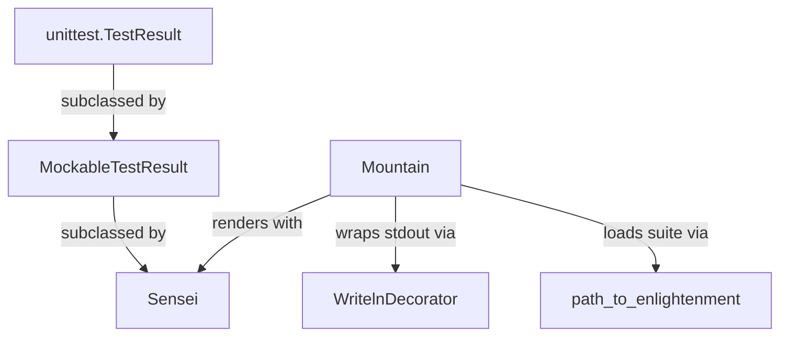

# Runner Engine API Reference

[← Back to README](../README.rst) · [Architecture](./architecture.md) · [Deployment Guide](./deployment.md)

The `runner/` package is the engine of Python Koans: it loads the ordered koan
curriculum, runs each lesson as a standard-library `unittest` suite, and renders
colored, koan-styled progress back to the learner. It is built entirely on the
Python standard library (`unittest`) plus the vendored `libs.colorama` for
terminal colors — no third-party runtime dependencies are required.
Source: runner/sensei.py:L14

For a narrative walkthrough of how these pieces fit together at runtime — from
the launcher through the `Mountain` orchestrator to the `Sensei` renderer — see
the [Architecture](./architecture.md) guide.

## Contents

- [`Mountain`](#mountain-runnermountainpy) — the top-level orchestrator.
- [`Sensei`](#sensei-runnersenseipy) — the colored, lesson-aware result renderer.
- [Curriculum Loaders](#curriculum-loaders-runnerpath_to_enlightenmentpy) — how the koan suite is assembled from `koans.txt`.
- [Support Types](#support-types) — `Koan`, fill-in markers, `cls_name`, `WritelnDecorator`, and `MockableTestResult`.

## `Mountain` (`runner/mountain.py`)

The `Mountain` class is the top-level orchestrator that the
`contemplate_koans.py` launcher instantiates to run the koans.
Source: runner/mountain.py:L11

On construction, `Mountain.__init__(self)` wires together the three
collaborators of the runner engine: a `WritelnDecorator` wrapping `sys.stdout`
for convenient line output (`self.stream`), the full koan `unittest.TestSuite`
loaded via `path_to_enlightenment.koans()` (`self.tests`), and a `Sensei` result
renderer bound to that stream (`self.lesson`).
Source: runner/mountain.py:L12-L15

### `walk_the_path(self, args=None)`

Runs the koan suite through the `Sensei` and renders the learner's progress.
When `args` is provided and contains at least two elements (`len(args) >= 2`),
the suite is reloaded to just the selected koan module via
`unittest.TestLoader().loadTestsFromName("koans." + args[1])`; otherwise the full
suite is run. The suite is then executed against the `Sensei` result and
`Sensei.learn()` is called to render the final report (which may terminate the
process on failure). Source: runner/mountain.py:L17-L25

**Parameters**

| Name | Type | Description |
|------|------|-------------|
| `args` | `list` or `None` | Argument vector (for example `sys.argv`). When a second element is present (`args[1]`), it names the koan module to run in isolation — e.g. `about_asserts` becomes `koans.about_asserts`; when omitted, the entire curriculum runs. Source: runner/mountain.py:L20-L21 |

**Returns**

| Type | Description |
|------|-------------|
| `Sensei` | The result renderer after the run, exposing `pass_count`, `lesson_pass_count`, and the collected failures. Source: runner/mountain.py:L25 |

## `Sensei` (`runner/sensei.py`)

`Sensei` is the runner's reporting engine — a stateful, lesson-aware `unittest`
result renderer. It extends [`MockableTestResult`](#mockabletestresult-runnermockable_test_resultpy)
(a thin `unittest.TestResult` subclass) but calls `unittest.TestResult.__init__`
directly, and overrides the result lifecycle to print colored, koan-styled
progress to a wrapped stream using the vendored `libs.colorama`.
Source: runner/sensei.py:L17



*Class relationships and collaborators. Source: runner/sensei.py:L17, runner/mountain.py:L11*

### Attributes

| Attribute | Description |
|-----------|-------------|
| `stream` | The `WritelnDecorator`-wrapped output stream that all colored progress is written to. Source: runner/sensei.py:L18-L25 |
| `prevTestClassName` | Name of the most recently seen test class (`str` or `None`), used to detect lesson transitions. Source: runner/sensei.py:L18-L25 |
| `tests` | The loaded `unittest.TestSuite` of all koans (from `path_to_enlightenment.koans()`). Source: runner/sensei.py:L18-L25 |
| `pass_count` | Number of individual koans passed so far (`int`, starts at `0`). Source: runner/sensei.py:L18-L25 |
| `lesson_pass_count` | Number of lessons (koan classes) entered/passed (`int`, starts at `0`). Source: runner/sensei.py:L18-L25 |
| `all_lessons` | Lazily-populated cache of discovered lesson files (`list` or `None`). Source: runner/sensei.py:L18-L25 |

### Methods

`Sensei` exposes **18** methods. They are grouped below by role; every entry
lists its signature, behavior, and a `Source:` citation.

#### Constructor

| Method | Signature | Description | Source |
|--------|-----------|-------------|--------|
| `__init__` | `__init__(self, stream)` | Calls `unittest.TestResult.__init__`, stores the output `stream`, sets `prevTestClassName = None`, loads the koan suite via `path_to_enlightenment.koans()`, zeroes `pass_count` and `lesson_pass_count`, and leaves `all_lessons` unset (`None`). | runner/sensei.py:L18 |

#### Lifecycle hooks

These override the `unittest` result callbacks to drive colored, lesson-aware output.

| Method | Signature | Description | Source |
|--------|-----------|-------------|--------|
| `startTest` | `startTest(self, test)` | Delegates to `MockableTestResult.startTest`; on a new test-class name (detected via `helper.cls_name`) with no failures yet, prints a blank line and a colored `Thinking <ClassName>` banner, and increments `lesson_pass_count` (except for the `AboutAsserts` and `AboutExtraCredit` classes). | runner/sensei.py:L27 |
| `addSuccess` | `addSuccess(self, test)` | When `passesCount()` is true: delegates to `MockableTestResult.addSuccess`, prints a bright-green `<method> has expanded your awareness.` line, and increments `pass_count`. | runner/sensei.py:L39 |
| `addError` | `addError(self, test, err)` | Forwards to `addFailure` — errors are treated as failures so the failure sequence is preserved. | runner/sensei.py:L48 |
| `addFailure` | `addFailure(self, test, err)` | Records a failing koan by delegating to `MockableTestResult.addFailure`. | runner/sensei.py:L56 |
| `passesCount` | `passesCount(self)` | Returns a `bool`: `True` while successes should still be counted; `False` once a failure exists whose originating class differs from `prevTestClassName`. | runner/sensei.py:L53 |

#### Failure analysis

| Method | Signature | Description | Source |
|--------|-----------|-------------|--------|
| `sortFailures` | `sortFailures(self, testClassName)` | Collects the failures belonging to `testClassName` as `(line_number, test, err)` tuples (the line number is parsed from the traceback via the `(?<= line )\d+` regex) and returns them sorted ascending by line number, or `None` when none match. | runner/sensei.py:L59 |
| `firstFailure` | `firstFailure(self)` | Returns the earliest `(test, err)` pair (lowest source line) for the first failing class, or `None` when there are no failures. | runner/sensei.py:L73 |
| `scrapeAssertionError` | `scrapeAssertionError(self, err)` | Returns the cleaned, human-readable assertion message extracted from a traceback string; returns `""` when `err` is falsy. | runner/sensei.py:L121 |
| `scrapeInterestingStackDump` | `scrapeInterestingStackDump(self, err)` | Returns only the koans-relevant stack frames, colorizing `about_*.py` filenames and `line N` references; returns `""` when `err` is falsy. | runner/sensei.py:L135 |

#### Reporting

| Method | Signature | Description | Source |
|--------|-----------|-------------|--------|
| `learn` | `learn(self)` | Renders the end-of-run report: `errorReport()`, the progress line from `report_progress()`, the remaining-work line from `report_remaining()` (only when failures exist), and a Zen aphorism from `say_something_zenlike()`. Calls `sys.exit(-1)` if any failure exists; otherwise prints the completion banner. | runner/sensei.py:L83 |
| `errorReport` | `errorReport(self)` | Prints the first failure's red `<method> has damaged your karma.` line, the "not yet reached enlightenment" message, the scraped assertion error, and a "meditate on the following code" block. Returns early (no output) if there is no failure. | runner/sensei.py:L104 |
| `report_progress` | `report_progress(self)` | Returns the progress string: koans completed, percent complete (`pass_count * 100 // total_koans()`), and lessons completed out of `total_lessons()`. | runner/sensei.py:L169 |
| `report_remaining` | `report_remaining(self)` | Returns the "koans and lessons away from reaching enlightenment" string (the totals minus the current counts). | runner/sensei.py:L177 |
| `say_something_zenlike` | `say_something_zenlike(self)` | Returns a Zen aphorism keyed by `pass_count % 37` (cyan-colored) when failures exist; otherwise returns `Nobody ever expects the Spanish Inquisition.`. | runner/sensei.py:L192 |

#### Counts

| Method | Signature | Description | Source |
|--------|-----------|-------------|--------|
| `total_lessons` | `total_lessons(self)` | Returns `len(filter_all_lessons())`, or `0` when none are found. | runner/sensei.py:L251 |
| `total_koans` | `total_koans(self)` | Returns `self.tests.countTestCases()`. | runner/sensei.py:L258 |
| `filter_all_lessons` | `filter_all_lessons(self)` | Lazily globs `../koans/about*.py` (relative to the module), excludes `about_extra_credit`, caches the result in `self.all_lessons`, and returns the list. | runner/sensei.py:L261 |


## Curriculum Loaders (`runner/path_to_enlightenment.py`)

This module contains the functions that load the ordered koan curriculum from
the `koans.txt` manifest and assemble it into a runnable `unittest.TestSuite`.
Two of the four functions are **generators** (`filter_koan_names`,
`names_from_file`); the other two are **suite builders** that return a
`unittest.TestSuite` (`koans_suite`, `koans`).
Source: runner/path_to_enlightenment.py:L14-L62

### `KOANS_FILENAME`

Module-level constant naming the default curriculum manifest: `'koans.txt'`.
Source: runner/path_to_enlightenment.py:L14

### `filter_koan_names(lines)` — generator

Strips leading/trailing whitespace from each line, skips blank lines and `#`
comment lines, and yields each remaining fully-qualified koan name in the
original order. Source: runner/path_to_enlightenment.py:L17

**Parameters**

| Name | Type | Description |
|------|------|-------------|
| `lines` | iterable of `str` | Raw text lines (for example an open file object or a list of strings). Source: runner/path_to_enlightenment.py:L17 |

**Yields**

| Type | Description |
|------|-------------|
| `str` | Each non-blank, non-comment line with surrounding whitespace stripped, in input order. Source: runner/path_to_enlightenment.py:L17 |

### `names_from_file(filename)` — generator

Opens `filename` in UTF-8 text mode inside a context manager and yields the
fully-qualified koan names found inside (one per line) by delegating to
`filter_koan_names`; the file is closed when iteration completes.
Source: runner/path_to_enlightenment.py:L31

**Parameters**

| Name | Type | Description |
|------|------|-------------|
| `filename` | `str` | Path to a curriculum manifest such as `koans.txt`. Source: runner/path_to_enlightenment.py:L31 |

**Yields**

| Type | Description |
|------|-------------|
| `str` | Fully-qualified `TestCase` names, one per non-comment line. Source: runner/path_to_enlightenment.py:L31 |

### `koans_suite(names)`

Builds and returns a `unittest.TestSuite` from the given `names`. It sets
`loader.sortTestMethodsUsing = None` to disable the loader's re-sorting of
test-method names, then loads each name in turn so the supplied name order is
preserved as each named case's tests are added.
Source: runner/path_to_enlightenment.py:L42

**Parameters**

| Name | Type | Description |
|------|------|-------------|
| `names` | iterable of `str` | Fully-qualified `TestCase` names to load. Source: runner/path_to_enlightenment.py:L42 |

**Returns**

| Type | Description |
|------|-------------|
| `unittest.TestSuite` | A suite populated in the supplied-name order. Source: runner/path_to_enlightenment.py:L42 |

### `koans(filename=KOANS_FILENAME)`

The top-level entry point: returns the fully assembled `unittest.TestSuite` of
all koans listed in `filename`, composed by reading the manifest via
`names_from_file` and building the suite via `koans_suite`. Defaults to
`KOANS_FILENAME` (`'koans.txt'`). This is the function `Mountain` and `Sensei`
call to load the curriculum. Source: runner/path_to_enlightenment.py:L56

**Parameters**

| Name | Type | Description |
|------|------|-------------|
| `filename` | `str` | Manifest to read; defaults to `KOANS_FILENAME` (`'koans.txt'`). Source: runner/path_to_enlightenment.py:L56 |

**Returns**

| Type | Description |
|------|-------------|
| `unittest.TestSuite` | The fully assembled koan suite. Source: runner/path_to_enlightenment.py:L56 |


## Support Types

### `Koan` and the fill-in markers (`runner/koan.py`)

The `runner.koan` module exports a deliberately "private-looking" API via
`__all__ = ["__", "___", "____", "_____", "Koan"]`. The leading-underscore names
are intentional so they read naturally inside exercise code — for example
`self.assertEqual(__, value)`. Source: runner/koan.py:L10-L22

| Symbol | Kind | Value / Definition | Description | Source |
|--------|------|--------------------|-------------|--------|
| `__` | `str` | `"-=> FILL ME IN! <=-"` | Fill-in-the-blank marker learners replace with the expected value. | runner/koan.py:L10-L22 |
| `____` | `str` | `"-=> TRUE OR FALSE? <=-"` | Boolean prompt marker. | runner/koan.py:L10-L22 |
| `_____` | `int` | `0` | Numeric fill-in marker. | runner/koan.py:L10-L22 |
| `___` | class | `class ___(Exception)` | A placeholder `Exception` subclass used where a koan must fill in an error class; adds no behavior beyond `Exception`. | runner/koan.py:L14 |
| `Koan` | class | `class Koan(unittest.TestCase)` | The base `unittest.TestCase` that every `about_*` koan extends; behavior-free, giving all koans a common branded base type. | runner/koan.py:L22 |

### `cls_name(obj)` (`runner/helper.py`)

Returns the runtime class name of `obj` as a string — a tiny introspection
helper used throughout the runner (notably by `Sensei`) to detect test-class
transitions and to group failures by their originating koan class.
Source: runner/helper.py:L4

**Parameters**

| Name | Type | Description |
|------|------|-------------|
| `obj` | any | Any Python object whose class name is wanted. Source: runner/helper.py:L4 |

**Returns**

| Type | Description |
|------|-------------|
| `str` | `obj.__class__.__name__` (for example `"AboutAsserts"` for an instance of that test case). Source: runner/helper.py:L4 |

### `WritelnDecorator` (`runner/writeln_decorator.py`)

A transparent wrapper (adapted from the legacy `unittest` utility) that
decorates a file-like stream with a convenient `writeln` method. It stores the
wrapped stream as `self.stream` and delegates every unknown attribute to it via
`__getattr__`, so the wrapped stream remains fully usable while gaining the
`writeln` helper. Source: runner/writeln_decorator.py:L8-L18

#### `writeln(self, arg=None)`

Writes `arg` only when it is truthy, then always writes a trailing newline
(`'\n'`). All output is delegated to the wrapped stream's `write` method
(resolved through `__getattr__`); newline translation to `\r\n` remains the
responsibility of the wrapped stream. Source: runner/writeln_decorator.py:L16

**Parameters**

| Name | Type | Description |
|------|------|-------------|
| `arg` | `str` or `None` | Optional text to write before the newline; when `None` or otherwise falsy, only the newline is written. Source: runner/writeln_decorator.py:L16 |

### `MockableTestResult` (`runner/mockable_test_result.py`)

An empty `unittest.TestResult` subclass used purely as a mocking seam: `Sensei`
subclasses it instead of `unittest.TestResult` directly so that unit tests can
mock or replace the base result behavior without mocking `unittest.TestResult`
itself (which would break the runner). It adds no fields or methods of its own.
Source: runner/mockable_test_result.py:L9

## Usage Example

Run the entire koan curriculum from the repository root:

```bash
# Run all koans in the order listed in koans.txt
python3 contemplate_koans.py
```

Run a single lesson by passing its koan-module name as the first argument. This
exercises the `args[1]` selection path in `walk_the_path`, which reloads the
suite from `"koans." + args[1]`:

```bash
# Run only the "AboutAsserts" lesson (koans.about_asserts)
python3 contemplate_koans.py about_asserts
```

Source: contemplate_koans.py:L34; runner/mountain.py:L20-L21

Most koans are solved by filling in the blank marker `__` with the value that
makes the assertion pass:

```python
# Before — the koan presents a blank to fill in
self.assertEqual(__, 1 + 2)

# After — replace __ with the expected value
self.assertEqual(3, 1 + 2)
```

Source: README.rst:L35-L43

## Related Documentation

- [Architecture](./architecture.md) — system overview and runtime flow of the runner engine.
- [Deployment Guide](./deployment.md) — local run, Continuous Integration (Travis CI), and the Gitpod cloud workspace.
- [← Back to README](../README.rst) — project overview, installation, and getting started.

