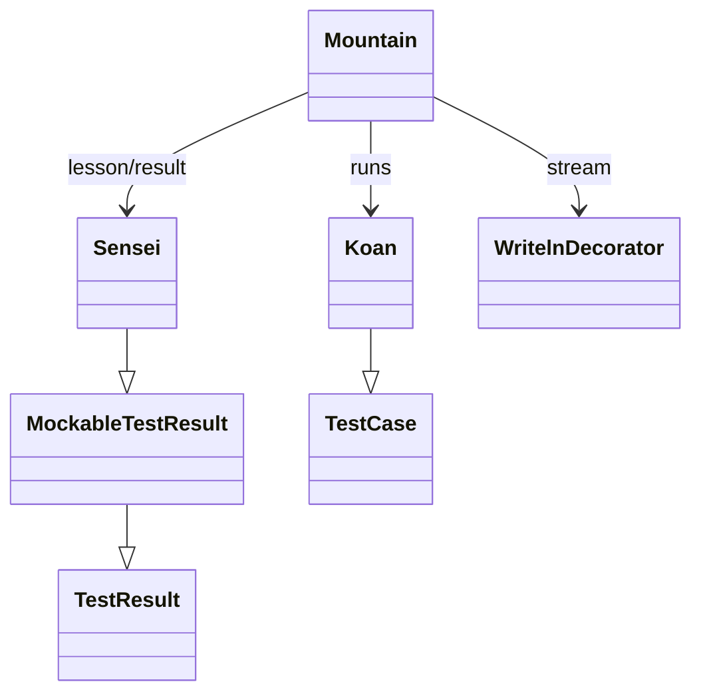

# Runner Engine API Reference

Reference for the public API of the `runner/` package — the engine that discovers, runs, and reports on the Python Koans.

## Overview

The command-line entry point [`contemplate_koans.py`](../../contemplate_koans.py) performs a Python-version gate and then hands control to the engine via `runner.mountain.Mountain().walk_the_path(sys.argv)`. `Source: ../../contemplate_koans.py:L59-L61`. From there the engine's pieces cooperate: **`Mountain`** orchestrates a single run, **`path_to_enlightenment`** discovers the ordered lesson suite from the `koans.txt` manifest, the assembled suite is run against **`Sensei`** (a `unittest` result object) which scores and reports progress, and **`WritelnDecorator`** wraps the output stream so the reporter can `writeln`. `Source: ../../runner/mountain.py:L11-L60`. The engine is built entirely on the **Python standard library** (`unittest`, `io`, `re`, `os`, `glob`); the vendored `libs.colorama` (`init`, `Fore`, `Style`) is used only for colorized terminal output and is not part of the documented public API. `Source: ../../runner/sensei.py:L4-L15`.

For the big-picture component and sequence diagrams, see [../architecture/overview.md](../architecture/overview.md); for the manifest format and the koans-vs-lessons counts, see [../curriculum.md](../curriculum.md); and for the documentation home, see [../index.md](../index.md). In-source docstrings throughout the engine follow the reStructuredText-flavored style of [`runner/path_to_enlightenment.py`](../../runner/path_to_enlightenment.py) — triple-quoted, with ``double-backtick`` code terms — which serves as the project's docstring-style exemplar.

### At a glance

| Module | Public symbol(s) | Summary | Source |
|---|---|---|---|
| `runner/mountain.py` | `Mountain` | Orchestrates a koans run | `[runner/mountain.py:L11-L60]` |
| `runner/path_to_enlightenment.py` | `koans`, `koans_suite`, `names_from_file`, `filter_koan_names`, `KOANS_FILENAME` | Manifest-driven discovery → ordered `TestSuite` | `[runner/path_to_enlightenment.py:L14-L62]` |
| `runner/sensei.py` | `Sensei` (~18 methods) | `unittest` result that scores & reports progress | `[runner/sensei.py:L1-L456]` |
| `runner/koan.py` | `Koan`, sentinels `__ ___ ____ _____` | Exercise base class + fill-in sentinels | `[runner/koan.py:L21-L67]` |
| `runner/helper.py` | `cls_name` | Class-name introspection helper | `[runner/helper.py:L4-L15]` |
| `runner/mockable_test_result.py` | `MockableTestResult` | Concrete `TestResult` subclass (mock-safe seam) | `[runner/mockable_test_result.py:L6-L21]` |
| `runner/writeln_decorator.py` | `WritelnDecorator` | Stream wrapper adding `writeln()` | `[runner/writeln_decorator.py:L8-L31]` |

---

## Mountain

**Module:** `runner/mountain.py`. `Mountain` is the engine's orchestrator. The module imports `unittest` and `sys` from the standard library and wires together the engine pieces `path_to_enlightenment`, `Sensei`, and `WritelnDecorator`. `Source: ../../runner/mountain.py:L4-L9`.

### `Mountain.__init__(self)`

The constructor wires three collaborators onto the instance. `Source: ../../runner/mountain.py:L34-L36`.

| Attribute | Assigned value | Purpose |
|---|---|---|
| `self.stream` | `WritelnDecorator(sys.stdout)` | Wraps `stdout` so the runner can call `writeln`. |
| `self.tests` | `path_to_enlightenment.koans()` | The **default** ordered suite loaded from `koans.txt`. |
| `self.lesson` | `Sensei(self.stream)` | The result/reporter object that scores the run. |

### `Mountain.walk_the_path(self, args=None)`

Runs the koans and returns the reporter. Its one-line in-source docstring is *"Run the koans tests with a custom runner output."* `Source: ../../runner/mountain.py:L40`. The method behaves as follows. `Source: ../../runner/mountain.py:L38-L60`:

- If `args` is provided and `len(args) >= 2`, the run is **narrowed** to a single target by replacing the suite with `unittest.TestLoader().loadTestsFromName("koans." + args[1])`. `Source: ../../runner/mountain.py:L55-L56`. Thus `args[1]` is a dotted name such as `about_strings` or `about_strings.AboutStrings.test_x`, which is prefixed with `koans.` before loading.
- The suite is then **run** by calling it with the `Sensei` as the result object: `self.tests(self.lesson)`. `Source: ../../runner/mountain.py:L58`.
- Finally it calls `self.lesson.learn()` to emit the end-of-run report and **returns** the `Sensei`. `Source: ../../runner/mountain.py:L59-L60`.

| Name | Type | Description |
|---|---|---|
| `args` | list or `None` | argv-style list; when `len(args) >= 2`, `args[1]` selects a single `koans.<name>` target. Default `None` runs all koans. |
| **returns** | `Sensei` | the result object after the run (used by tests to assert pass/fail state). |

**Usage**

```python
from runner.mountain import Mountain

# Run the full curriculum (equivalent to: python3 -B contemplate_koans.py)
lesson = Mountain().walk_the_path()

# Run a single lesson (equivalent to: python3 contemplate_koans.py about_asserts)
lesson = Mountain().walk_the_path(["contemplate_koans.py", "about_asserts"])
```

Note that `walk_the_path` may terminate the process: when failures remain, `Sensei.learn()` calls `sys.exit(-1)`, so interactive callers should expect that. `Source: ../../runner/sensei.py:L198`. See [../guides/cli-usage.md](../guides/cli-usage.md) for the full command-line contract.

---

## path_to_enlightenment (discovery)

**Module:** `runner/path_to_enlightenment.py`. This module turns the `koans.txt` manifest into an ordered `unittest.TestSuite`. It is also the project's **docstring-style exemplar**: its module and function docstrings are triple-quoted and reStructuredText-flavored, using ``double-backtick`` code terms. `Source: ../../runner/path_to_enlightenment.py:L4-L7`.

### `KOANS_FILENAME`

Module-level constant naming the default manifest file: `KOANS_FILENAME = 'koans.txt'`. `Source: ../../runner/path_to_enlightenment.py:L14`.

### `filter_koan_names(lines)`

A **generator**. For each line it strips leading/trailing whitespace, **skips** comment lines (those beginning with `#`) and **skips** blank lines, and `yield`s the remaining names. `Source: ../../runner/path_to_enlightenment.py:L17-L28`.

| Name | Type | Description |
|---|---|---|
| `lines` | iterable of `str` | Raw manifest lines to filter. |
| **yields** | `str` | Each non-comment, non-blank, stripped name. |

### `names_from_file(filename)`

Opens `filename` with `io.open(filename, 'rt', encoding='utf8')` and yields each name produced by `filter_koan_names`. `Source: ../../runner/path_to_enlightenment.py:L31-L39`.

| Name | Type | Description |
|---|---|---|
| `filename` | `str` | Path to the manifest file (UTF-8, one name per line). |
| **yields** | `str` | Each fully-qualified `TestCase` name found in the file. |

### `koans_suite(names)`

Builds a `unittest.TestSuite`. It sets `loader.sortTestMethodsUsing = None` so method order is **preserved** (not alphabetized), loads each name via `loader.loadTestsFromName(name)`, and adds the loaded tests to the suite with `suite.addTests(...)`. Returns the assembled `TestSuite`. `Source: ../../runner/path_to_enlightenment.py:L42-L53`.

| Name | Type | Description |
|---|---|---|
| `names` | iterable of `str` | Fully-qualified `TestCase` names to load, in order. |
| **returns** | `unittest.TestSuite` | The assembled suite, preserving manifest order. |

### `koans(filename=KOANS_FILENAME)`

Convenience entry point: pipes `names_from_file(filename)` into `koans_suite(names)` and returns the full ordered `TestSuite`. `Source: ../../runner/path_to_enlightenment.py:L56-L62`.

| Name | Type | Description |
|---|---|---|
| `filename` | `str` | Manifest filename; defaults to `KOANS_FILENAME` (`'koans.txt'`). |
| **returns** | `unittest.TestSuite` | The full ordered suite of all koans listed in the manifest. |

A full default run assembles **304 koans across 37 lessons** from the **39** ordered manifest entries in `koans.txt` (line 1 is a `#` comment; the entries occupy lines 2–40). `Source: ../../koans.txt:L1-L40`. For the manifest details and the koans-vs-lessons distinction, see [../curriculum.md](../curriculum.md).

**Usage**

```python
from runner import path_to_enlightenment

suite = path_to_enlightenment.koans()        # default manifest: koans.txt
print(suite.countTestCases())                 # -> 304

# Build a suite from an explicit list of fully-qualified names:
custom = path_to_enlightenment.koans_suite(["koans.about_asserts.AboutAsserts"])
```

---

## Sensei (reporting lifecycle)

**Module:** `runner/sensei.py`. `Sensei` is the engine's reporter and scorer. It is declared as `class Sensei(MockableTestResult)`, which makes it a `unittest` result object (see [MockableTestResult](#mockabletestresult) below). `Source: ../../runner/sensei.py:L17`. The module imports `unittest`, `re`, `sys`, `os`, and `glob` from the standard library, the local `helper`, `MockableTestResult`, and `path_to_enlightenment`, plus the vendored `libs.colorama` symbols `init`, `Fore`, and `Style`; `init()` initializes colorama at import time. `Source: ../../runner/sensei.py:L4-L15`. (colorama is a *used* dependency for color, not part of the documented public API.)

### Lifecycle narrative

As the suite runs, `unittest` calls `startTest` for each test, followed by one of `addSuccess`, `addError`, or `addFailure`. At the end of the run, `Mountain` calls `learn()`, which prints the first failure (`errorReport`), the progress line (`report_progress`), the remaining line (`report_remaining`), and a Zen aphorism (`say_something_zenlike`); it exits the process non-zero when any failures remain. `Source: ../../runner/sensei.py:L175-L206`.

### Methods

#### `__init__(self, stream)`

Calls `unittest.TestResult.__init__(self)`, stores `stream`, and initializes `prevTestClassName=None`, `tests=path_to_enlightenment.koans()`, `pass_count=0`, `lesson_pass_count=0`, and `all_lessons=None`. `Source: ../../runner/sensei.py:L32-L50`.

#### `startTest(self, test)`

Chains to `MockableTestResult.startTest`. When the test's class name changes and there are no failures yet, it prints a `Thinking <ClassName>` banner; it increments `lesson_pass_count` **unless** the class is `AboutAsserts` or `AboutExtraCredit`. `Source: ../../runner/sensei.py:L52-L73`.

#### `addSuccess(self, test)`

If `passesCount()` is true, records the success, prints `  <testMethodName> has expanded your awareness.` in bright green, and increments `pass_count`. `Source: ../../runner/sensei.py:L75-L92`.

#### `addError(self, test, err)`

**Delegates to `addFailure`** — keeping errors and failures in a single combined list preserves the error sequence. `Source: ../../runner/sensei.py:L94-L106`.

#### `passesCount(self)`

Returns `not (self.failures and helper.cls_name(self.failures[0][0]) != self.prevTestClassName)` — i.e. whether successes should still be counted given the current failure/class state. `Source: ../../runner/sensei.py:L108-L119`.

#### `addFailure(self, test, err)`

Chains to `MockableTestResult.addFailure`. `Source: ../../runner/sensei.py:L121-L128`.

#### `sortFailures(self, testClassName)`

Collects `(lineNumber, test, err)` tuples for failures whose class matches `testClassName`, parsing the line number from the traceback with the regex `(?<= line )\d+`. Returns the tuples **sorted by line number**, or `None` when there are none. `Source: ../../runner/sensei.py:L130-L153`.

#### `firstFailure(self)`

Returns the `(test, err)` of the earliest-line failure in the first failing class, or `None`. `Source: ../../runner/sensei.py:L155-L173`.

#### `learn(self)`

Orchestrates the end-of-run report: calls `errorReport`, then prints the progress, remaining, and Zen lines. It calls **`sys.exit(-1)` if any failures remain**; otherwise it prints the *"That was the last one, well done!"* completion message pointing at `about_extra_credit.py`. `Source: ../../runner/sensei.py:L175-L206`.

#### `errorReport(self)`

For the first failure, prints `<testMethodName> has damaged your karma.`, the *"You have not yet reached enlightenment ..."* message, the scraped assertion error, and the scraped, colorized stack frame under *"Please meditate on the following code:"*. `Source: ../../runner/sensei.py:L208-L234`.

#### `scrapeAssertionError(self, err)`

Extracts the human-readable assertion-failure text from a traceback string — it skips the first non-indented line and keeps the subsequent message lines. `Source: ../../runner/sensei.py:L236-L258`.

#### `scrapeInterestingStackDump(self, err)`

Extracts the koan-relevant stack frames: it filters to paths containing `koans/`, then colorizes `about_*.py` filenames and `line N` references. `Source: ../../runner/sensei.py:L260-L302`.

#### `report_progress(self)`

Returns the learner-facing line `You have completed {pass_count} ({percent} %) koans and {lesson_pass_count} (out of {total_lessons}) lessons.`, where `percent = pass_count * 100 // total_koans()`. `Source: ../../runner/sensei.py:L304-L319`.

#### `report_remaining(self)`

Returns `You are now {koans_remaining} koans and {lessons_remaining} lessons away from reaching enlightenment.`, where each *remaining* value is the corresponding total minus the completed count. `Source: ../../runner/sensei.py:L321-L337`.

#### `say_something_zenlike(self)`

When failures remain, returns a **Zen of Python** aphorism selected by `pass_count % 37`; when none remain, returns `Nobody ever expects the Spanish Inquisition.` (A code comment credits the Zen statements to Tim Peters and Ara T. Howard.) `Source: ../../runner/sensei.py:L339-L411`.

#### `total_lessons(self)`

Returns `len(filter_all_lessons())`, or `0` when there are none. Evaluates to **37**. `Source: ../../runner/sensei.py:L413-L427`.

#### `total_koans(self)`

Returns `self.tests.countTestCases()`. Evaluates to **304**. `Source: ../../runner/sensei.py:L429-L437`.

#### `filter_all_lessons(self)`

Globs `<runner_dir>/../koans/about*.py` (38 files) and filters out any path containing `about_extra_credit`, memoizing the result in `self.all_lessons` and **returning that cached `list`** of lesson-file paths — **37** lessons. It is **not** a generator; it `return`s the list. `Source: ../../runner/sensei.py:L439-L456`.

### Method summary

| Method | Signature | Purpose | Source |
|---|---|---|---|
| `__init__` | `(self, stream)` | Initialize the result/reporter state | `[runner/sensei.py:L32-L50]` |
| `startTest` | `(self, test)` | Print `Thinking <Class>` banner; tally lessons | `[runner/sensei.py:L52-L73]` |
| `addSuccess` | `(self, test)` | Record a pass; print awareness line; `pass_count++` | `[runner/sensei.py:L75-L92]` |
| `addError` | `(self, test, err)` | Delegate to `addFailure` | `[runner/sensei.py:L94-L106]` |
| `passesCount` | `(self)` | Whether successes should still be counted | `[runner/sensei.py:L108-L119]` |
| `addFailure` | `(self, test, err)` | Chain to `MockableTestResult.addFailure` | `[runner/sensei.py:L121-L128]` |
| `sortFailures` | `(self, testClassName)` | Failures for a class, sorted by line number | `[runner/sensei.py:L130-L153]` |
| `firstFailure` | `(self)` | Earliest-line failure of the first failing class | `[runner/sensei.py:L155-L173]` |
| `learn` | `(self)` | Emit end-of-run report; exit non-zero on failure | `[runner/sensei.py:L175-L206]` |
| `errorReport` | `(self)` | Print the first failure with karma/meditate text | `[runner/sensei.py:L208-L234]` |
| `scrapeAssertionError` | `(self, err)` | Extract assertion text from a traceback | `[runner/sensei.py:L236-L258]` |
| `scrapeInterestingStackDump` | `(self, err)` | Extract & colorize koan stack frames | `[runner/sensei.py:L260-L302]` |
| `report_progress` | `(self)` | Build the "completed … koans … lessons" line | `[runner/sensei.py:L304-L319]` |
| `report_remaining` | `(self)` | Build the "… away from enlightenment" line | `[runner/sensei.py:L321-L337]` |
| `say_something_zenlike` | `(self)` | Return a Zen aphorism (or the closing line) | `[runner/sensei.py:L339-L411]` |
| `total_lessons` | `(self)` | Number of lessons → **37** | `[runner/sensei.py:L413-L427]` |
| `total_koans` | `(self)` | Number of koans → **304** | `[runner/sensei.py:L429-L437]` |
| `filter_all_lessons` | `(self)` | Glob lesson files, drop extra-credit; return cached `list` | `[runner/sensei.py:L439-L456]` |

### Example progress output

```text
You have completed 0 (0 %) koans and 0 (out of 37) lessons.
```

The exact numbers vary with the learner's progress: the `(out of 37)` reflects `total_lessons()`, and the koan percentage is `pass_count * 100 // total_koans()` with `total_koans()` = 304. `Source: ../../runner/sensei.py:L304-L319`. For help interpreting this line, see [../getting-started/first-steps.md](../getting-started/first-steps.md) and [../curriculum.md](../curriculum.md); do not infer "solved" counts from this reference.

**Usage**

`Sensei` is normally driven by `Mountain`, but its counts are directly queryable:

```python
from runner.sensei import Sensei
import sys

lesson = Sensei(sys.stdout)
print(lesson.total_koans())     # -> 304
print(lesson.total_lessons())   # -> 37
```

---

## Koan and sentinels

**Module:** `runner/koan.py`.

### `class Koan(unittest.TestCase)`

The **base class** for all koan exercises. It is an otherwise-empty subclass of `unittest.TestCase`, so each lesson's `TestCase` ultimately derives from the standard-library test machinery. `Source: ../../runner/koan.py:L56-L67`.

### Sentinels

The four sentinels are exported via `__all__` alongside `Koan`. `Source: ../../runner/koan.py:L21`. Each sentinel is a deliberately obvious placeholder that the learner replaces with the correct value; the literal *shipped* placeholder values below are the sentinel definitions themselves — not koan answers.

| Sentinel | Meaning / intent | Shipped placeholder | Source |
|---|---|---|---|
| `__` | A value to fill in | the marker string `"-=> FILL ME IN! <=-"` | `[runner/koan.py:L34]` |
| `___` | A custom `Exception` **subclass**, used where a koan expects an error type | a placeholder `Exception` subclass | `[runner/koan.py:L36-L49]` |
| `____` | A true/false placeholder | the marker string `"-=> TRUE OR FALSE? <=-"` | `[runner/koan.py:L51]` |
| `_____` | A numeric placeholder | the number `0` | `[runner/koan.py:L53]` |

- `__` is defined as the placeholder string `"-=> FILL ME IN! <=-"`. `Source: ../../runner/koan.py:L34`.
- `___` is a custom `Exception` subclass. `Source: ../../runner/koan.py:L36-L49`.
- `____` is defined as `"-=> TRUE OR FALSE? <=-"`. `Source: ../../runner/koan.py:L51`.
- `_____` is defined as `0`. `Source: ../../runner/koan.py:L53`.

These sentinels are **intentional pedagogy**: this reference describes their role but **never reveals any koan's correct answer**. The values above are the unsolved markers exactly as they ship in the source. For sentinel semantics see [../curriculum.md](../curriculum.md), and for a hands-on first run see [../getting-started/first-steps.md](../getting-started/first-steps.md).

---

## helper.cls_name

**Module:** `runner/helper.py`. The function `cls_name(obj)` returns `obj.__class__.__name__` — the runtime class name of `obj`. It is used throughout `Sensei` to detect lesson/class boundaries. `Source: ../../runner/helper.py:L4-L15`.

| Name | Type | Description |
|---|---|---|
| `obj` | any object | The object whose class name is wanted. |
| **returns** | `str` | The runtime class name (`obj.__class__.__name__`). |

---

## MockableTestResult

**Module:** `runner/mockable_test_result.py`. `class MockableTestResult(unittest.TestResult)` is a thin subclass with a `pass` body. It exists so that `unittest.TestResult` itself is not "mocked out of existence" when the runner's own helper classes are tested; `Sensei` subclasses `MockableTestResult` instead of `TestResult` directly. `Source: ../../runner/mockable_test_result.py:L6-L21`.

---

## WritelnDecorator

**Module:** `runner/writeln_decorator.py`. A stream wrapper whose class docstring reads *"Used to decorate file-like objects with a handy 'writeln' method"*. `Source: ../../runner/writeln_decorator.py:L8-L9`.

| Member | Signature | Effect | Source |
|---|---|---|---|
| `__init__` | `(self, stream)` | Stores the wrapped `stream`. | `[runner/writeln_decorator.py:L10-L14]` |
| `__getattr__` | `(self, attr)` | **Forwards unknown attributes** to the wrapped stream via `getattr(self.stream, attr)`, so the decorator transparently behaves like the underlying stream. | `[runner/writeln_decorator.py:L16-L21]` |
| `writeln` | `(self, arg=None)` | Writes the optional `arg` (when truthy), then a newline `'\n'`. | `[runner/writeln_decorator.py:L23-L31]` |

**Usage**

```python
from runner.writeln_decorator import WritelnDecorator
import sys

out = WritelnDecorator(sys.stdout)
out.writeln("hello")   # writes "hello\n"
out.writeln()          # writes just "\n"
```

---

## Class relationships



`Source: ../../runner/sensei.py:L17`, `Source: ../../runner/mockable_test_result.py:L9-L21`, `Source: ../../runner/koan.py:L56-L67`, `Source: ../../runner/mountain.py:L11-L60`.

`Mountain` composes a `Sensei` and a `WritelnDecorator` and runs `Koan` test cases; `Sensei` is a `MockableTestResult`, which is itself a `unittest.TestResult`; and `Koan` is a `unittest.TestCase`.

---

## See also

- [../architecture/overview.md](../architecture/overview.md) — how the pieces fit together, with component and sequence diagrams.
- [../curriculum.md](../curriculum.md) — the `koans.txt` manifest and the koans/lessons counts.
- [../guides/cli-usage.md](../guides/cli-usage.md) — the command-line contract.
- [../getting-started/first-steps.md](../getting-started/first-steps.md) — reading the progress line on your first run.
- [../index.md](../index.md) — documentation home.

## Source citations

- `[runner/mountain.py:L11-L60]`
- `[runner/sensei.py:L1-L456]`
- `[runner/path_to_enlightenment.py:L14-L62]`
- `[runner/koan.py:L21-L67]`
- `[runner/helper.py:L4-L15]`
- `[runner/mockable_test_result.py:L6-L21]`
- `[runner/writeln_decorator.py:L8-L31]`
- `[contemplate_koans.py:L59-L61]`
- `[koans.txt:L1-L40]`

