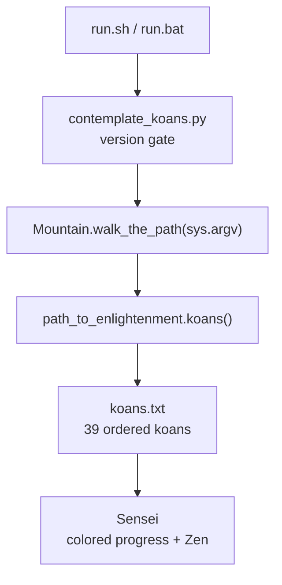

# Architecture Overview

[← Back to README](../README.rst) · [API Reference](./api-reference.md) · [Deployment Guide](./deployment.md)

Welcome, traveler. This document maps the terrain of the **parent Python Koans**
project so you can see how a single command sets you on the *path to
enlightenment*. It is a companion to the [API Reference](./api-reference.md)
(full signatures of the runner engine) and the [Deployment Guide](./deployment.md)
(how to run the koans locally, in CI, and in the cloud).

## Overview & Purpose

Python Koans is an interactive, test-driven tutorial for learning Python by
making failing tests pass — most koans are *fixed* by filling in the missing
part of an assertion, which also gives you a gentle taste of Test Driven
Development (TDD). Source: README.rst:L30-L51

The parent product is pure **Python 3** with no runtime dependencies of its own:
it is built on the standard-library `unittest` framework (Source:
runner/mountain.py:L4). The launcher guards the interpreter version, refusing to
run under Python 2 (Source: contemplate_koans.py:L34) and printing a
best-effort warning on Python 3 releases older than 3.7 (Source:
contemplate_koans.py:L43). At a high level the design is simple: a thin
**launcher** hands control to a `Mountain` orchestrator, which loads an ordered
curriculum from `koans.txt` and renders your colored progress through a custom
`Sensei` result class. Source: runner/mountain.py:L11-L30

## Component Map

The project is organized into five cooperating parts. The runner engine under
`runner/` is the reusable heart of the product; everything else either launches
it, feeds it lessons, or tests it.

| Component | Path | Responsibility | Source |
|-----------|------|----------------|--------|
| Launcher | `contemplate_koans.py` | Version-gates the interpreter, then constructs `Mountain` and starts the run | Source: contemplate_koans.py:L31-L61 |
| Runner engine | `runner/` | Orchestration, curriculum-suite loading, result rendering, and stream output | Source: runner/mountain.py:L11 |
| Curriculum | `koans/` + `koans.txt` | The 39 ordered lesson `TestCase`s learners complete | Source: koans.txt:L1-L40 |
| Vendored libraries | `libs/colorama`, `libs/mock.py` | Third-party terminal color + mocking, imported but **not modified** here | Source: runner/sensei.py:L14 |
| Self-tests | `_runner_tests.py` | Regression suite that exercises the runner engine itself | Source: _runner_tests.py:L36-L61 |

Inside the runner engine, the collaborators are:

- **`Mountain`** — the top-level orchestrator; its constructor wires the output stream, the koan suite, and the `Sensei`, and `walk_the_path` runs them. Source: runner/mountain.py:L11
- **`Sensei`** — the stateful, lesson-aware `unittest` result renderer that prints colored progress and, on the first broken koan, stops the learner with a Zen aphorism. Source: runner/sensei.py:L17
- **`path_to_enlightenment`** — the curriculum loader; `koans()` reads `koans.txt` and assembles the ordered `unittest.TestSuite`. Source: runner/path_to_enlightenment.py:L92
- **`WritelnDecorator`** — wraps `sys.stdout` to add a convenient `writeln` helper. Source: runner/writeln_decorator.py:L8
- **`koan`** — defines the `Koan` base `TestCase` and the fill-in markers (`__`, `___`, `____`, `_____`) learners replace. Source: runner/koan.py:L27-L47
- **`helper.cls_name`** — returns an object's class name; used to detect lesson (test-class) transitions. Source: runner/helper.py:L4
- **`MockableTestResult`** — a thin `unittest.TestResult` subclass that `Sensei` extends, providing a safe mocking seam. Source: runner/mockable_test_result.py:L9

See [API Reference](./api-reference.md) for full signatures.

## Runtime Flow

A single koans run travels end-to-end like this:

1. A run surface — `run.sh` / `run.bat` locally, or Gitpod / Travis in the
   cloud — invokes `python3 -B contemplate_koans.py` (Source: run.sh:L3). See
   the [Deployment Guide](./deployment.md) for every entry point.
2. The launcher version-gates the interpreter, then (its `runner` import
   deliberately deferred until after the guard) constructs `Mountain` and calls
   `walk_the_path(sys.argv)`, forwarding the full argv so a learner can select a
   single lesson. Source: contemplate_koans.py:L57, L61
3. `Mountain.__init__` builds the `WritelnDecorator` output stream, loads the
   koan `TestSuite` via `path_to_enlightenment.koans()`, and creates the
   `Sensei` bound to that stream. Source: runner/mountain.py:L26-L30
4. `koans()` reads the `koans.txt` manifest — whose first line is a comment and
   whose remaining lines name the lessons in order — and assembles the ordered
   suite. Source: runner/path_to_enlightenment.py:L92-L109; koans.txt:L1
5. `walk_the_path` runs the suite against the `Sensei`, then calls
   `Sensei.learn()`, which renders colored progress and — on the first failure —
   prints the offending koan plus a Zen aphorism and exits. Source:
   runner/mountain.py:L32-L57; runner/sensei.py:L17

*Source: contemplate_koans.py:L31-L61, runner/mountain.py:L11-L57, runner/path_to_enlightenment.py:L92-L109, runner/sensei.py:L17*

## Design Notes

- **Standard-library only.** The runner is built on `unittest` with no runtime
  dependencies beyond the vendored `libs/`. Source: runner/mountain.py:L4
- **Ordered curriculum.** `koans.txt` is the single source of lesson order; the
  loader preserves that order when building the suite. Source: koans.txt:L1-L40
- **"Stop at the broken koan" pedagogy.** `Sensei` halts the learner at the
  first failing koan and offers a Zen aphorism to meditate on, rather than
  dumping every failure at once. Source: runner/sensei.py:L17
- **Vendored code is out of scope.** `libs/colorama` and `libs/mock.py` are
  third-party libraries imported by the runner; they are not authored or
  modified as part of this documentation. Source: runner/sensei.py:L14
- **Nested submodules are documented separately.** The `Submodule_01_Do_not_use_15Jun`
  child and its nested `Submodule_02_Do_not_use_15Jun` grandchild have their own
  READMEs; they are linked from the project README rather than described in
  depth here. Source: .gitmodules:L1-L3

## Related Documentation

- [API Reference](./api-reference.md) — the `runner/` engine API (`Mountain`, `Sensei`, the curriculum loaders, and support types).
- [Deployment Guide](./deployment.md) — local run, Continuous Integration (Travis CI), and the Gitpod cloud workspace.
- [Project README](../README.rst) — project overview, installation, and getting started.
