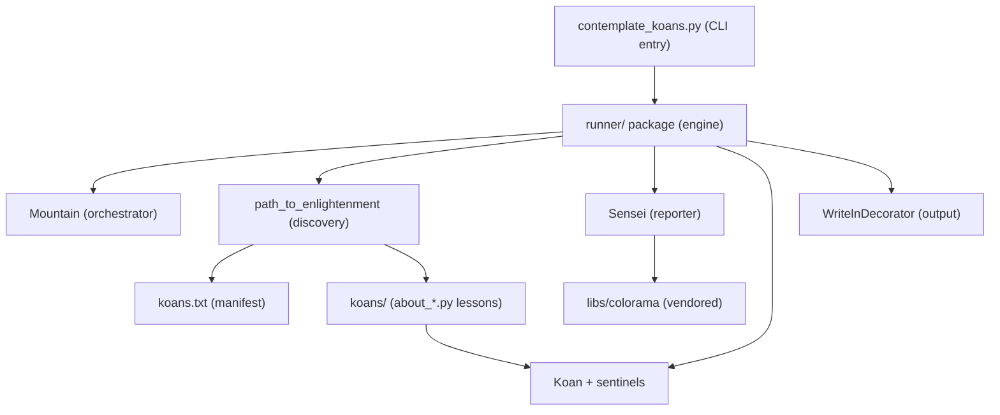
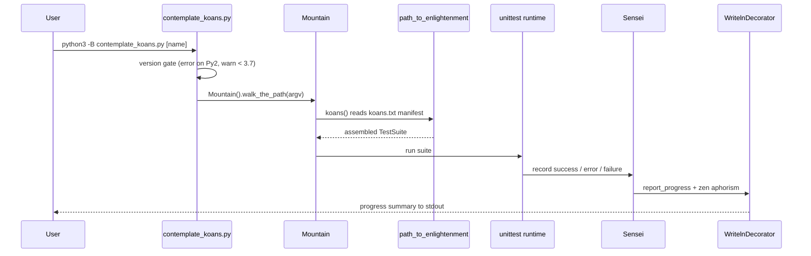

# Architecture Overview

> How Python Koans is structured — the three packages, manifest-driven test discovery, the `unittest` substrate, the sentinel-driven TDD loop, and the end-to-end run flow.

## Overview

Python Koans is a command-line, standard-library-only Python tutorial that teaches the language by making failing tests pass; it is a port of Edgecase's "Ruby Koans". `Source: ../../README.rst:L25-L31`. A learner runs the entry-point script `contemplate_koans.py`, which — after an interpreter version check — hands control to the engine in the `runner/` package. `Source: ../../contemplate_koans.py:L59-L61`. The engine discovers an ordered suite of *koans* (small `unittest` test methods) from the `koans.txt` manifest, runs them, and reports zen-flavored progress to the terminal. `Source: ../../runner/mountain.py:L11-L60`. Nothing needs to be installed to run the koans: the application runs on the Python standard library alone, with terminal color supplied by a vendored copy of `colorama`. `Source: ../../runner/sensei.py:L14-L15`.

For the **per-symbol API** — classes, functions, parameters, and return values — see [../api-reference/runner-engine.md](../api-reference/runner-engine.md); for the **run modes and command-line contract** — run-all, run-single, the launchers, and the `-B` flag — see [../guides/cli-usage.md](../guides/cli-usage.md).

## Three-package layering

The repository is organized into three cooperating top-level packages. Only the `runner/` engine is documented in depth — and it is the sole package that receives docstrings and inline comments in this documentation effort. The `koans/` and `libs/` packages are described here as architectural **context only** and are **not modified**.

- **`runner/` — the engine.** Orchestration, discovery, reporting, and output. Its key modules are `Mountain` (the orchestrator), `path_to_enlightenment` (discovery), `Sensei` (the reporter and scorer), `Koan` plus the fill-in *sentinels*, and `WritelnDecorator` (the output-stream wrapper), along with small helpers (`helper.cls_name` and `MockableTestResult`). `Source: ../../runner/mountain.py:L11-L60`, `../../runner/path_to_enlightenment.py:L14-L62`, `../../runner/sensei.py:L17`, `../../runner/koan.py:L21-L55`, `../../runner/writeln_decorator.py:L8-L31`.
- **`koans/` — the curriculum (context only).** A collection of `about_*.py` fill-in-the-blank lesson modules together with supporting helpers such as `triangle.py` and `local_module.py`. These are the exercises the learner edits; they are **not modified by this documentation effort**. `Source: ../../koans.txt:L2-L40`, `Source: ../../koans/triangle.py:L1-L25`.
- **`libs/` — vendored third-party code (context only).** Bundled dependencies so the application needs no installation step: `colorama` (cross-platform terminal color) and a vendored `mock.py`. `Source: ../../runner/sensei.py:L14-L15`, `Source: ../../libs/mock.py:L1`.

**Zero-install property.** The application itself imports only the Python standard library; `libs/` is vendored precisely so that no `pip install` is required to run the koans. `Source: ../../runner/sensei.py:L4-L15`. Developer and CI aids — for example, the `pytest` and `mock` packages declared in `.gitpod.Dockerfile` — are **not** runtime dependencies; see [../guides/deployment.md](../guides/deployment.md) for those tooling details. `Source: ../../.gitpod.Dockerfile:L11`.

| Package | Role | Modified by this docs effort? |
|---------|------|-------------------------------|
| `runner/` | The engine: orchestration, discovery, reporting, output | Yes — docstrings / inline comments only (no logic change) |
| `koans/` | The curriculum: `about_*.py` fill-in-the-blank lessons plus helpers | No — context only, not modified |
| `libs/` | Vendored third-party code (`colorama`, `mock.py`) | No — context only, not modified |

## Manifest-driven discovery

The curriculum is **data-driven** by a plain-text manifest, `koans.txt`, rather than being hard-coded into the engine. The discovery module `path_to_enlightenment` turns that manifest into a runnable test suite:

- `path_to_enlightenment.koans()` is the discovery entry point. It defaults to reading the manifest named by `KOANS_FILENAME = 'koans.txt'` and returns the assembled suite. `Source: ../../runner/path_to_enlightenment.py:L14`, `../../runner/path_to_enlightenment.py:L56-L62`.
- The manifest holds **39 ordered `TestCase` entries**: line 1 is the comment `# Lines starting with # are ignored.`, and the entries occupy lines 2–40. `Source: ../../koans.txt:L1-L40`.
- `filter_koan_names()` strips leading and trailing whitespace from each line and **skips `#` comment lines and blank lines**, yielding only real entries. `Source: ../../runner/path_to_enlightenment.py:L17-L28`.
- `names_from_file()` opens the manifest as UTF-8 and yields one fully-qualified `TestCase` name per surviving line (for example, `koans.about_asserts.AboutAsserts`). `Source: ../../runner/path_to_enlightenment.py:L31-L39`.
- `koans_suite()` builds a `unittest.TestSuite` from those names and **preserves manifest order** by setting `loader.sortTestMethodsUsing = None`, so the lessons run in the deliberate teaching sequence rather than alphabetically. `Source: ../../runner/path_to_enlightenment.py:L42-L53`.

Two of the 39 entries are loaded from the **same** lesson file — `koans.about_proxy_object_project.AboutProxyObjectProject` and `koans.about_proxy_object_project.TelevisionTest`. `Source: ../../koans.txt:L37-L38`. That is one reason the 39 manifest entries do not map one-to-one onto lesson files. For the full per-entry ordering and the koans-versus-lessons counts, see [../curriculum.md](../curriculum.md).

## The unittest substrate

The whole engine is built on the Python standard-library `unittest` framework; the `runner/` modules are a thin, learner-friendly layer on top of it.

- **Koans are `unittest` tests.** Each lesson's test class ultimately derives from `Koan`, which is declared as `class Koan(unittest.TestCase)` — so every koan is a standard `unittest` test method that the runner can discover and execute uniformly. `Source: ../../runner/koan.py:L44-L55`.
- **`Sensei` is a `unittest` result object.** The reporter is declared as `class Sensei(MockableTestResult)` `Source: ../../runner/sensei.py:L17`, and `MockableTestResult` in turn is `class MockableTestResult(unittest.TestResult)`. `Source: ../../runner/mockable_test_result.py:L9-L21`. As the suite runs, `unittest` drives this result object, which scores progress and renders feedback.
- **Why `MockableTestResult` exists.** It is a thin, behavior-free shim that gives the runner a stable, concrete `TestResult` type to inherit from. When the runner's own tests mock things out, this layer keeps `unittest.TestResult` from being "Mocked out of existence," which would otherwise confuse the runner. `Source: ../../runner/mockable_test_result.py:L6-L21`.
- **Output flows through `WritelnDecorator`.** This is a legacy-`unittest` stream wrapper: it delegates unknown attribute access transparently to the wrapped stream and adds a convenience `writeln()` helper used by the reporter. `Source: ../../runner/writeln_decorator.py:L8-L31`.
- **Color comes from vendored `colorama`.** `Sensei` imports `from libs.colorama import init, Fore, Style` and calls `init()` at import time, so the colorized progress output works across platforms without any installed dependency. `Source: ../../runner/sensei.py:L14-L15`.

`Sensei` also keeps the run's tallies: `total_koans()` returns the suite's `countTestCases()` (a live run reports **304 koans**), while `total_lessons()` / `filter_all_lessons()` count the lesson files that contribute to progress (a live run reports **37 lessons**). `Source: ../../runner/sensei.py:L429-L437`, `../../runner/sensei.py:L413-L456`. The counting rules — and why the manifest's 39 entries differ from these figures — are detailed in [../curriculum.md](../curriculum.md).

## The sentinel-driven TDD loop

Python Koans teaches through a **red → green → reflect** cycle. Every koan ships **failing**: the learner reads the failure, replaces a *sentinel* placeholder with the value or code that makes the assertion pass, re-runs, and advances to the next koan. `Source: ../../README.rst:L30-L51`.

The four sentinels are defined in `runner/koan.py` and re-exported via `__all__`, so a lesson can write `from runner.koan import *`. They are described here by **intent only** — their meaning, not any koan's answer: `__` is a fill-me-in value placeholder (shipped as the obvious marker `"-=> FILL ME IN! <=-"`), `___` is a placeholder `Exception` subclass for koans that expect a raised error, `____` is a true/false placeholder (shipped as `"-=> TRUE OR FALSE? <=-"`), and `_____` is a numeric placeholder (its shipped value is `0`). `Source: ../../runner/koan.py:L21-L41`. Because each shipped sentinel is deliberately wrong, an un-edited koan fails loudly until the learner supplies the correct answer.

This is, as the project itself puts it, "a good way to get a taste of Test Driven Development (TDD)." `Source: ../../README.rst:L50-L51`. **This document never reveals answers** — it describes the sentinels' purpose only; learners discover the correct values by running the koans. For sentinel semantics in more depth see [../curriculum.md](../curriculum.md), and for how to run a single koan or the whole suite see [../guides/cli-usage.md](../guides/cli-usage.md).

## Data and control flow

End to end, a single session flows as follows (the two diagrams below depict the same path):

1. **Invocation.** The learner runs `python3 -B contemplate_koans.py [name]`, optionally naming a single lesson. `Source: ../../contemplate_koans.py:L35`, `../../run.sh:L3`.
2. **Version gate.** `contemplate_koans.py` first checks the interpreter: under Python 2 it prints an error and does **not** run the koans `Source: ../../contemplate_koans.py:L38-L42`, and under a Python older than 3.7 it prints a compatibility **warning** but continues anyway. `Source: ../../contemplate_koans.py:L45-L54`.
3. **Bootstrap.** Once the gate passes, the engine is imported and started: `from runner.mountain import Mountain` followed by `Mountain().walk_the_path(sys.argv)`. `Source: ../../contemplate_koans.py:L59-L61`.
4. **Wiring.** `Mountain.__init__` wires the collaborators: it wraps `sys.stdout` in a `WritelnDecorator`, loads the default ordered suite via `path_to_enlightenment.koans()`, and creates a `Sensei` reporter bound to that stream. `Source: ../../runner/mountain.py:L34-L36`.
5. **Run.** `Mountain.walk_the_path(args)` narrows the run to a single `TestCase` when a name was supplied (`unittest.TestLoader().loadTestsFromName("koans." + args[1])`); otherwise the full ordered suite runs. It executes the selected suite against the `Sensei` result, then calls `lesson.learn()` to emit the final report. `Source: ../../runner/mountain.py:L38-L60`.
6. **Report.** During the run `Sensei` records each success, error, and failure; in `learn()` it prints the progress summary and a zen aphorism, exiting non-zero if any failures remain. `Source: ../../runner/sensei.py:L175-L206`, `../../runner/sensei.py:L304-L319`.

## Diagrams

The two diagrams below are derived directly from the engine source and depict the same architecture described above: the first shows the static component/package layering, and the second shows the dynamic run sequence.

### Component / package layering

*Component and package layering of the engine.* `Source: ../../runner/mountain.py:L11-L60`, `../../runner/path_to_enlightenment.py:L14-L60`.

### Run sequence

*End-to-end run sequence from invocation to the final progress summary.* `Source: ../../contemplate_koans.py:L59-L61`, `../../runner/mountain.py:L11-L60`, `../../runner/path_to_enlightenment.py:L14-L60`.

## Related documentation

- [../api-reference/runner-engine.md](../api-reference/runner-engine.md) — per-symbol API detail for the engine (`Mountain`, `Sensei`, the discovery functions, `Koan`, and the helpers).
- [../curriculum.md](../curriculum.md) — the `koans.txt` manifest ordering, the 304-koans / 37-lessons counts, and sentinel semantics.
- [../guides/cli-usage.md](../guides/cli-usage.md) — run modes: run-all, run-single, the `-B` flag, the Unix/Windows launchers, and Sniffer continuous testing.
- [../index.md](../index.md) — the documentation home and navigation.

## Source citations

- [contemplate_koans.py:L35-L61]
- [runner/mountain.py:L11-L60]
- [runner/path_to_enlightenment.py:L14-L62]
- [runner/sensei.py:L14-L17]
- [runner/sensei.py:L413-L456]
- [runner/koan.py:L21-L55]
- [runner/mockable_test_result.py:L6-L21]
- [runner/writeln_decorator.py:L8-L31]
- [koans.txt:L1-L40]
- [README.rst:L25-L51]

