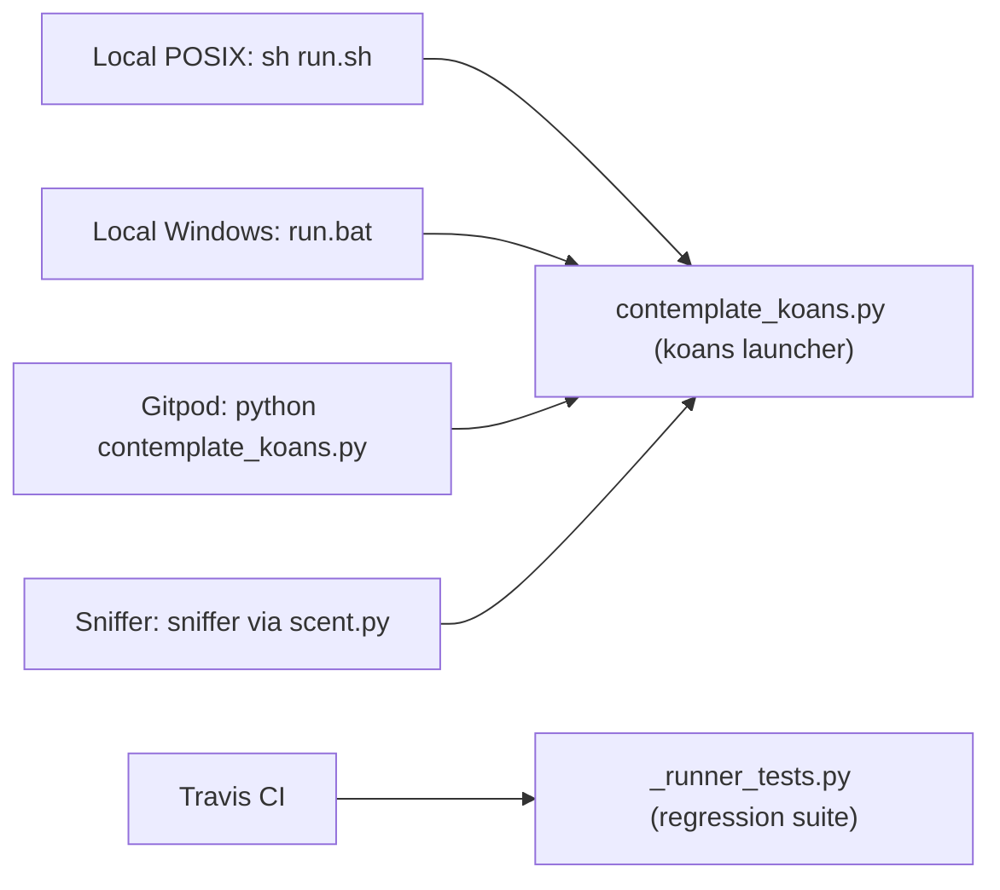

# Deployment & Run Guide

[← Back to README](../README.rst) · [Architecture](./architecture.md) · [API Reference](./api-reference.md)

This guide consolidates the **run**, **continuous-integration**, **cloud-workspace**, and **continuous-re-run** knowledge for the parent Python Koans project into a single reference. Historically this knowledge was scattered across `run.sh`, `run.bat`, `.travis.yml`, `.gitpod.yml`, `.gitpod.Dockerfile`, and `scent.py`; every entry point below is documented here with a citation back to its source.

Python Koans is an interactive, test-driven tutorial: you "walk the path" by making failing tests pass. There is nothing to compile or package — you simply run the launcher and start filling in koans.

## Prerequisites

- **Python 3 is required.** The launcher refuses to proceed under Python 2, printing guidance to re-run with `python3` instead of starting the runner. Source: contemplate_koans.py:L34
- On **Python 3 older than 3.7**, the launcher prints a warning that the koans were designed for Python 3.7 or greater but continues on a best-effort basis. Source: contemplate_koans.py:L43
- **No external pip packages are required to run the koans.** Beyond the Python standard library — the launcher imports only `sys`, Source: contemplate_koans.py:L27 — its sole project import is the runner package (`from runner.mountain import Mountain`, deferred until after the version guard), Source: contemplate_koans.py:L57. The third-party libraries the runner relies on are vendored under `libs/` (for example `libs.colorama`, imported directly by the runner, Source: runner/sensei.py:L14), so there is no `requirements.txt` at the repository root.
- pip is only needed for the *optional* Sniffer auto-rerun tooling (see [Continuous Re-run (Sniffer)](#continuous-re-run-sniffer)) and the Gitpod test tooling (see [Cloud Workspace (Gitpod)](#cloud-workspace-gitpod)).

> **Tip:** confirm your interpreter with `python3 --version` before you begin.

## Running Locally

Two convenience launchers are provided — a POSIX shell script and a Windows batch file — and both ultimately invoke the same `contemplate_koans.py` entry point.

### POSIX (macOS / Linux)

The `run.sh` helper is a small shell script whose shebang is `#!/bin/sh`. Source: run.sh:L1

Run it directly, or invoke the launcher yourself:

```bash
# Option A — use the provided helper script
sh run.sh

# Option B — call the launcher directly (exactly what run.sh does)
python3 -B contemplate_koans.py
```

`run.sh` runs `python3 -B contemplate_koans.py`; the `-B` flag suppresses writing `.pyc` bytecode files. Source: run.sh:L3

The README documents the same launcher with the plain forms `python contemplate_koans.py` and `python3 contemplate_koans.py`. Source: README.rst:L151-L161

### Windows

On Windows, use the `run.bat` batch file. It defines the command it will run as `SET RUN_KOANS=python.exe -B contemplate_koans.py`. Source: run.bat:L5

It then sets a Python install folder to search and hunts for a runnable `python.exe` — first in the current directory, then under `%PYTHON_PATH%`, then under `%PYTHON%` — before invoking the launcher and offering a "Test again? y or n" loop. Source: run.bat:L8, L15-L22, L39-L42

```bat
REM Excerpt from run.bat — update this path to match your Python install
SET PYTHON_PATH=C:\Python311
```

**Update `SET PYTHON_PATH=C:\Python311` to match your local Python installation directory** if it differs; the value shipped in `run.bat` is `C:\Python311`. Source: run.bat:L8

> **Note — run a single lesson:** pass a koan/lesson name on the command line and the launcher forwards it to the runner, e.g. `python3 contemplate_koans.py about_asserts`. This works because `contemplate_koans.py` forwards the full process `argv` to `Mountain().walk_the_path(sys.argv)`. Source: contemplate_koans.py:L61 — see [`Mountain.walk_the_path`](./api-reference.md#mountain-runnermountainpy) in the API Reference for how that argument selects a single koan.

## Continuous Integration (Travis CI)

Continuous integration runs on Travis CI, configured by `.travis.yml`. The build language is Python. Source: .travis.yml:L1

Travis provisions **Python 3.9** for the build. Source: .travis.yml:L3-L4

The CI `script` step runs the runner-engine regression suite with `python _runner_tests.py`. Source: .travis.yml:L6-L7

```yaml
language: python

python:
    - 3.9

script:
    - python _runner_tests.py
```

That command executes `_runner_tests.py`, whose `suite()` aggregates the five runner-engine test cases, Source: _runner_tests.py:L36, L49-L55 — and whose `__main__` block exits non-zero when any test fails or errors, so CI can gate on the result. Source: _runner_tests.py:L58-L61

> **Note — Python version for the regression suite:** two of the runner-engine helper tests call `assertEquals`, the long-deprecated alias of `assertEqual` that was **removed in Python 3.12**. Source: runner/runner_tests/test_helper.py:L14, L17. Run `python _runner_tests.py` on the CI-pinned **Python 3.9** (Source: .travis.yml:L3-L4) — or any interpreter up to Python 3.11 — so the suite runs unchanged; on Python 3.12+ those two cases raise `AttributeError: 'TestHelper' object has no attribute 'assertEquals'`. This is an environment note only: the tests are intentionally left at their upstream baseline and no behavior is changed here.

For what those runner components actually do, see the [API Reference](./api-reference.md) and the [Architecture](./architecture.md) guide.

## Cloud Workspace (Gitpod)

The project offers a one-click, browser-based development workspace via Gitpod; the README advertises this with a "ready-to-code" Gitpod badge and one-click installation links. Source: README.rst:L8-L21

The `.gitpod.yml` workspace configuration builds its container image from the repository's `.gitpod.Dockerfile`. Source: .gitpod.yml:L1-L2

On workspace start it auto-runs the koans launcher with `python contemplate_koans.py`. Source: .gitpod.yml:L4-L5

The Docker image is based on `gitpod/workspace-full:latest`, runs as the `gitpod` user, and installs the test tooling `pytest==4.4.2 pytest-testdox mock`. Source: .gitpod.Dockerfile:L7, L9, L11

```dockerfile
FROM gitpod/workspace-full:latest

USER gitpod

RUN pip3 install pytest==4.4.2 pytest-testdox mock
```

> GitHub prebuilds are enabled for the `master` branch so the workspace is ready quickly. Source: .gitpod.yml:L7-L14

> **Note — the default Gitpod task runs the koans launcher, not pytest:** on workspace start the single configured task is `python contemplate_koans.py`. Source: .gitpod.yml:L4-L5. The image additionally pre-installs `pytest==4.4.2` (a legacy 2019-era release) alongside `pytest-testdox` and `mock`, Source: .gitpod.Dockerfile:L11 — but that pinned pytest is **not** exercised by the default task and is unrelated to running the koans: both the koans and the runner-engine regression suite (`python _runner_tests.py`) use Python's built-in `unittest`, not pytest. Treat the pinned `pytest==4.4.2` as legacy tooling retained from upstream; it can be upgraded independently without affecting the koans workflow.

## Continuous Re-run (Sniffer)

Sniffer is an **optional** tool that watches your files and reruns the koans automatically whenever you save a change — a hands-free red/green feedback loop.

Set it up by installing `sniffer` and (optionally) the OS-specific file-system watcher for your platform:

```bash
# 1. Install Sniffer itself
python3 -m pip install sniffer

# On modern Python (3.11+) a system-wide install may be blocked by PEP 668
# ("externally-managed-environment"). If so, use an isolated environment:
#   Option A -- virtual environment
python3 -m venv .venv
. .venv/bin/activate
python3 -m pip install sniffer
#   Option B -- pipx (installs the CLI in its own isolated environment)
pipx install sniffer

# 2. Install the watcher for your OS (pick one; optional -- see note below)
python3 -m pip install pyinotify     # Linux
python3 -m pip install pywin32       # Windows
python3 -m pip install MacFSEvents   # macOS
```

Install Sniffer with `python3 -m pip install sniffer`. On modern Python (3.11+) a system-wide `pip install` may be rejected with an `externally-managed-environment` error (PEP 668); in that case install Sniffer into a virtual environment or with `pipx` as shown above. Source: README.rst:L240-L259

Then install the platform watcher — `pyinotify` on Linux, `pywin32` on Windows, or `MacFSEvents` on macOS — so changes trigger Sniffer immediately. The watcher is optional: if none is installed (or one fails to load), Sniffer still works and simply falls back to periodically **polling** the files for changes. Source: README.rst:L261-L293

> **Note — native watchers on the newest Python:** some watchers may fail to import or install on recent interpreters. For example, `pyinotify` relies on the `asyncore` module, which was **removed in Python 3.12**; when a watcher is unavailable, Sniffer automatically falls back to polling and continues to work.

Once set up, start it by running `sniffer` from the repository root. Source: README.rst:L295-L299

Sniffer's behavior is controlled by `scent.py`. Source: README.rst:L301-L302

Inside `scent.py`, the watched locations are `watch_paths = ['.', 'koans/']` — the repository root and the `koans/` directory. Source: scent.py:L24

When a watched, non-hidden `.py` file changes, Sniffer reruns the koans by shelling out to `python3 -B contemplate_koans.py` — the same command used to launch them manually. Source: scent.py:L27-L43, L45-L46, L63

## Entry-Point Summary

| Method | Command | Source |
|--------|---------|--------|
| Local — POSIX | `python3 -B contemplate_koans.py` (via `sh run.sh`) | run.sh:L3 |
| Local — Windows | `run.bat` (set `PYTHON_PATH=C:\Python311`) | run.bat:L5-L8 |
| Continuous Integration | `python _runner_tests.py` (Travis, Python 3.9) | .travis.yml:L7 |
| Cloud Workspace | `python contemplate_koans.py` (Gitpod auto-start) | .gitpod.yml:L5 |
| Continuous Re-run | `sniffer` → reruns `python3 -B contemplate_koans.py` | scent.py:L63 |

Four of the five surfaces drive the koans launcher `contemplate_koans.py` directly; Travis CI instead runs the runner-engine regression suite `_runner_tests.py`.



*Run surfaces (Local POSIX/Windows, Gitpod, Sniffer) converge on the launcher `contemplate_koans.py`, while Travis CI runs the regression suite `_runner_tests.py`. Sources: run.sh:L3, run.bat:L5, .gitpod.yml:L5, scent.py:L63, .travis.yml:L7.*

## Related Documentation

- [Architecture](./architecture.md) — how the launcher, `Mountain`, curriculum loader, and `Sensei` fit together at runtime.
- [API Reference](./api-reference.md) — the `runner/` engine API (`Mountain`, `Sensei`, the curriculum loaders, and support types).
- [← Back to README](../README.rst) — project overview, installation, and getting started.
