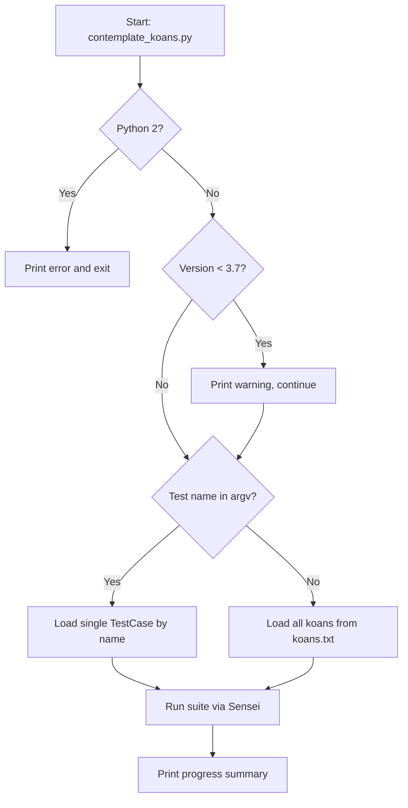

# CLI Usage — Running the Koans

The command-line contract for Python Koans: how to run every koan, a single lesson, or a single test, plus the Unix and Windows launchers, the interpreter version gate, and a pointer to Sniffer continuous mode.

> New here? Start with the gentle walkthrough in [first-steps.md](../getting-started/first-steps.md), and see [installation.md](../getting-started/installation.md) for prerequisites. This page is the complete command reference.

## Overview

Python Koans is driven through a single command-line entrypoint, `contemplate_koans.py`, run from the repository root. Invoked with **no argument** it runs the whole curriculum — **304 koans across 37 lessons** — and invoked with a **single argument** it narrows the run to just the named lesson or test. `Source: ../../runner/mountain.py:L38-L60`. The program first passes through an interpreter **version gate**, then hands control to `Mountain().walk_the_path(sys.argv)`. `Source: ../../contemplate_koans.py:L59-L61`. All output is a colorized progress report produced by the runner's `Sensei` reporter writing through the `WritelnDecorator` stream wrapper. `Source: ../../runner/mountain.py:L34-L36`.

## Prerequisites

- A **Python 3 interpreter** (**3.7 or newer recommended**). The entrypoint prints a compatibility warning on versions below 3.7 but still continues. `Source: ../../contemplate_koans.py:L45-L54`. Under Python 2 it refuses to run the koans and tells you to use `python3`. `Source: ../../contemplate_koans.py:L38-L42`.
- Run from the **repository root** so the manifest `koans.txt` and the `koans/` package resolve — the runner assembles the suite via `path_to_enlightenment.koans()`, which reads the manifest and imports `koans.*` lesson modules. `Source: ../../runner/mountain.py:L35`, `Source: ../../koans.txt:L1-L40`.
- **No third-party package installation** is required to run the koans: the application runs on the Python standard library, with terminal color supplied by the **vendored** `libs.colorama` bundled in the repository — so no `pip install` step is needed. `Source: ../../runner/mountain.py:L4-L9`, `Source: ../../runner/sensei.py:L14-L15`. For the authoritative prerequisites and setup, see [installation.md](../getting-started/installation.md).

## Usage reference

### Run all koans (the default)

```bash
python3 -B contemplate_koans.py
```

With no argument, this runs the **full curriculum** — all **304 koans across 37 lessons** — which is exactly what the Unix launcher invokes. `Source: ../../run.sh:L3`. The `-B` flag tells the interpreter not to write `.pyc` bytecode files. The 304/37 totals come from a live run and are assembled from the **39 ordered `TestCase` entries** in the manifest. `Source: ../../koans.txt:L1-L40`.

### Run a single lesson (a whole `TestCase`)

```bash
python3 contemplate_koans.py about_strings
```

Pass a lesson name to run that **entire `TestCase`** by itself. `Source: ../../Contributor Notes.txt:L6-L8`.

### Run a single test

```bash
python3 contemplate_koans.py about_strings.AboutStrings.test_triple_quoted_strings_need_less_escaping
```

Pass a fully-qualified `module.Class.test_method` name to run **exactly one test**. This form is documented in [`Contributor Notes.txt`](../../Contributor%20Notes.txt). `Source: ../../Contributor Notes.txt:L10-L12`.

### How the runner narrows a run

When at least one argument is supplied, `Mountain.walk_the_path` replaces the full suite with `unittest.TestLoader().loadTestsFromName("koans." + args[1])`, guarded by `if args and len(args) >= 2:`. `Source: ../../runner/mountain.py:L38-L60` (the guard and loader call are at `Source: ../../runner/mountain.py:L55-L56`). Because the argument is **appended to the `koans.` package prefix**, you pass `about_strings` — **not** `koans.about_strings`. With no argument, the full suite assembled from the manifest runs unchanged.

### Launchers

Two convenience launchers wrap the same command for each platform.

**Unix and macOS — [`run.sh`](../../run.sh).** A minimal `#!/bin/sh` wrapper that runs `python3 -B contemplate_koans.py`. `Source: ../../run.sh:L1-L3`.

```bash
./run.sh        # or: sh run.sh
```

**Windows — [`run.bat`](../../run.bat).** The batch launcher:

- sets `RUN_KOANS=python.exe -B contemplate_koans.py`. `Source: ../../run.bat:L5`.
- sets `PYTHON_PATH=C:\Python311` — **edit this to match your install**. `Source: ../../run.bat:L8`.
- hunts for `python.exe` on the `PATH` or under `PYTHON_PATH`. `Source: ../../run.bat:L12-L23`.
- runs the koans and then `pause`s; if no interpreter is found it prints guidance instead. `Source: ../../run.bat:L25-L37`.
- prompts `Test again? y or n -` and loops back to re-run while you answer `y`. `Source: ../../run.bat:L39-L42`.

### Sniffer continuous mode

`sniffer` reruns the koans automatically whenever a watched file changes, giving you a hands-free red → green loop. It is configured by `scent.py`, which watches `['.', 'koans/']` and runs `python3 -B contemplate_koans.py` on each trigger. `Source: ../../scent.py:L37-L47`. For installing and operating Sniffer (alongside CI and Gitpod), see [deployment.md](deployment.md).

## Examples

Copy-paste any of the following from the repository root.

Run the whole curriculum:

```bash
python3 -B contemplate_koans.py
```

Run a single lesson (a whole `TestCase`):

```bash
python3 contemplate_koans.py about_strings
```

Run a single test:

```bash
python3 contemplate_koans.py about_strings.AboutStrings.test_triple_quoted_strings_need_less_escaping
```

Run on Windows via the launcher:

```bat
run.bat
```

On a fresh checkout, the run ends with a two-line progress summary (terminal colors removed). These lines are from a live run and contain **no answers**:

```text
You have completed 0 (0 %) koans and 0 (out of 37) lessons.
You are now 304 koans and 37 lessons away from reaching enlightenment.
```

The 39-entry manifest that produces the full **304 koans / 37 lessons** run is `koans.txt`. `Source: ../../koans.txt:L1-L40`. For how to *read* this summary, see [first-steps.md](../getting-started/first-steps.md).

## Version gate and run-mode flow



`Source: ../../contemplate_koans.py:L35-L61`, `Source: ../../runner/mountain.py:L38-L60`.

Reading the flow: on **Python 2** the entrypoint prints an error and does not run the koans; on **Python < 3.7** it prints a warning and continues; then, if a **test name is present in `argv`**, `walk_the_path` loads that single `TestCase` (or test) via `loadTestsFromName`, otherwise it loads the full suite from `koans.txt`; either way the suite is run through `Sensei`, which prints the progress summary.

## Related

- **[deployment.md](deployment.md)** — running in CI (Travis), the Gitpod cloud workspace, and Sniffer continuous-testing operations.
- **[first-steps.md](../getting-started/first-steps.md)** — your first run and how to read the progress summary.
- **[curriculum.md](../curriculum.md)** — the `koans.txt` manifest, lesson ordering, and the 304 / 37 / 39 counts.
- **[Documentation home](../index.md)** — the full documentation index.

## Source citations

- [run.sh:L1-L3]
- [run.bat:L5-L42]
- [contemplate_koans.py:L35-L61]
- [Contributor Notes.txt:L1-L12]
- [runner/mountain.py:L4-L60]
- [scent.py:L37-L47]
- [koans.txt:L1-L40]
