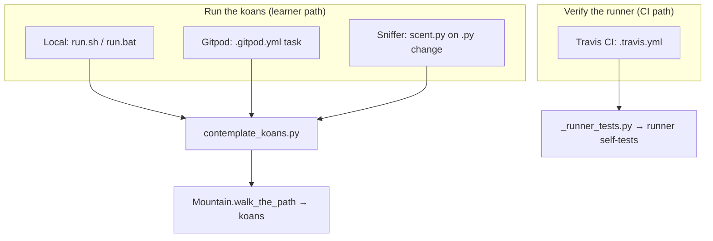

# Deployment & Operations

How to run Python Koans across environments — locally, in Travis CI, in a Gitpod cloud workspace, and under Sniffer continuous testing — including the Python version policy and Python 3.12 compatibility notes.

> Looking for the full command reference (single lesson, single test, the `-B` flag)? See [cli-usage.md](cli-usage.md). For prerequisites and a first run, see [installation.md](../getting-started/installation.md) and [first-steps.md](../getting-started/first-steps.md).

## Overview

Python Koans is a **standard-library-only console application** — there is **no server to deploy and no hosting infrastructure**. "Deployment & operations" here means *how and where the koans are executed*: from a local shell, inside a CI build, in a cloud workspace, or under a file-watcher that re-runs them on every save.

The same command-line entry point, `contemplate_koans.py`, underlies every environment. `Source: ../../contemplate_koans.py:L35-L61`. Local launchers, the Gitpod workspace task, and Sniffer all invoke it to **run the koans**; Travis CI instead runs the **runner's own self-tests** to verify the engine. `Source: ../../.travis.yml:L6-L7`, `Source: ../../scent.py:L37-L47`. Because the application depends only on the Python standard library, no runtime package installation is ever required to run the koans themselves — see [installation.md](../getting-started/installation.md) and the [documentation home](../index.md).

## Prerequisites

Before running in any environment below, you need:

- A **Python 3 interpreter** — **3.7 or newer** is the supported baseline (see [Python version policy](#python-version-policy)). `Source: ../../contemplate_koans.py:L38-L54`.
- A **checked-out copy of the repository**. The koans run directly from the source tree; there is no build or install step.
- To run commands **from the repository root**, so the manifest and the `koans/` package resolve.
- **No runtime package installation** for the koans — the application runs on the Python standard library alone. `Source: ../../run.sh:L1-L3`.

Optional, per-environment tooling (the Sniffer continuous-test runner and its platform watchers) is listed in the relevant section below. For base setup, see [installation.md](../getting-started/installation.md).

## Local execution

Two convenience launchers wrap the same entrypoint for each platform. Both suppress `.pyc` bytecode generation with the `-B` flag and launch `contemplate_koans.py` — **Unix/macOS** via `python3 -B contemplate_koans.py` and **Windows** via `python.exe -B contemplate_koans.py`. `Source: ../../run.sh:L3`, `Source: ../../run.bat:L5`. The full CLI contract — single lesson, single test, and the `-B` flag — is documented in [cli-usage.md](cli-usage.md).

**Unix / macOS — [`run.sh`](../../run.sh).** A minimal `#!/bin/sh` wrapper that runs `python3 -B contemplate_koans.py`. `Source: ../../run.sh:L1-L3`.

```bash
./run.sh
```

**Windows — [`run.bat`](../../run.bat).** The batch launcher sets `RUN_KOANS=python.exe -B contemplate_koans.py` and `PYTHON_PATH=C:\Python311`, hunts for the interpreter, runs the koans, then prompts `Test again? y or n -` and loops while you answer `y`. `Source: ../../run.bat:L5-L8`, `Source: ../../run.bat:L12-L42`.

```bat
run.bat
```

## Travis CI

Continuous integration is configured by [`.travis.yml`](../../.travis.yml). The build declares `language: python`, runs on **Python 3.9**, and its `script:` step is `python _runner_tests.py`; email notifications are enabled. `Source: ../../.travis.yml:L1-L17`. The file also carries **commented-out alternatives** that would instead run `python contemplate_koans.py` (all koans) or a named subset — handy if you fork the project and want CI to show which koans you have passed. `Source: ../../.travis.yml:L1-L17`.

The default CI command verifies the **runner engine itself**, not the koan exercises. [`_runner_tests.py`](../../_runner_tests.py) assembles a single `unittest.TestSuite` from five runner self-test cases — `TestMountain`, `TestSensei`, `TestHelper`, `TestFilterKoanNames`, and `TestKoansSuite` — and executes it with `TextTestRunner(verbosity=2)`, exiting with a non-zero status if any test fails. `Source: ../../_runner_tests.py:L39-L60`.

## Gitpod cloud workspace

The project ships a ready-to-use cloud workspace. [`.gitpod.yml`](../../.gitpod.yml) builds the workspace image from the [`.gitpod.Dockerfile`](../../.gitpod.Dockerfile) file, defines an auto-run task `python contemplate_koans.py`, and enables GitHub prebuilds for the `master` branch (with pull-request prebuilds and the review comment disabled). `Source: ../../.gitpod.yml:L1-L14`.

The workspace image is based on `gitpod/workspace-full:latest`, switches to `USER gitpod`, and installs developer tooling via `pip3 install pytest==4.4.2 pytest-testdox mock`. `Source: ../../.gitpod.Dockerfile:L7-L11`.

> **These are developer/CI aids, not runtime dependencies.** `pytest`, `pytest-testdox`, and `mock` are conveniences for working *on* the project inside the Gitpod workspace; the koans themselves run on the Python standard library alone and need none of them. `Source: ../../.gitpod.Dockerfile:L7-L11`.

## Sniffer continuous testing

Sniffer re-runs the koans automatically whenever a watched file changes, giving you a hands-free red → green loop. Install Sniffer, then a platform-specific watcher so changes are detected by events rather than polling. `Source: ../../README.rst:L190-L238`.

```bash
python3 -m pip install sniffer
```

Then install the watcher for your operating system:

```bash
# Linux
python3 -m pip install pyinotify

# Windows
python3 -m pip install pywin32

# macOS
python3 -m pip install MacFSEvents
```

Finally, run it from the repository root:

```bash
sniffer
```

Sniffer is controlled by [`scent.py`](../../scent.py), which sets `watch_paths = ['.', 'koans/']`, reacts only to non-hidden `.py` files, and on each change runs `python3 -B contemplate_koans.py`. `Source: ../../scent.py:L37-L47`. For the koan commands Sniffer triggers, see [cli-usage.md](cli-usage.md).

## Environment overview

Every environment funnels through the single entry point — local launchers, the Gitpod task, and Sniffer all **run the koans**, while Travis CI **verifies the runner**.



`Source: ../../run.sh:L1-L3`, `Source: ../../.gitpod.yml:L1-L14`, `Source: ../../scent.py:L37-L47`, `Source: ../../.travis.yml:L6-L7`.

## Python version policy

Python Koans is the **Python 3 edition**, and the supported baseline is **Python 3.7+**. The entry point enforces this with an in-app version gate:

- Under **Python 2** it prints an error and does **not** run the koans, pointing you at `python3`. `Source: ../../contemplate_koans.py:L38-L42`.
- Under a Python **older than 3.7** it prints a compatibility warning and then **continues anyway**. `Source: ../../contemplate_koans.py:L45-L54`.

Releases through **3.11** and **Python 3.12+** all run the koans well; see [Python 3.12 compatibility](#python-312-compatibility) below. This is consistent with [installation.md](../getting-started/installation.md). Note that the Windows launcher references a sample interpreter path of `C:\Python311`, which you edit to match your own install. `Source: ../../run.bat:L8`.

## Python 3.12 compatibility

On **Python 3.12** (and newer), the **runner self-test command** `python _runner_tests.py` runs cleanly. Python 3.12 removed the long-deprecated `assertEquals` alias from `unittest`, and the runner self-tests in [`runner/runner_tests/test_helper.py`](../../runner/runner_tests/test_helper.py) now call the canonical `assertEqual` at line 14 and line 17, so the command reports `Ran 36 tests ... OK` and is compatible across Python 3.7–3.12+. `Source: ../../runner/runner_tests/test_helper.py:L14`, `Source: ../../runner/runner_tests/test_helper.py:L17`.

Before this was corrected, the command failed on Python 3.12 with:

```text
======================================================================
ERROR: test_that_get_class_name_works_with_a_4 (runner.runner_tests.test_helper.TestHelper)
----------------------------------------------------------------------
Traceback (most recent call last):
  File ".../runner/runner_tests/test_helper.py", line 14, in test_that_get_class_name_works_with_a_4
    self.assertEquals("int", helper.cls_name(4))
AttributeError: 'TestHelper' object has no attribute 'assertEquals'

======================================================================
ERROR: test_that_get_class_name_works_with_a_tuple (runner.runner_tests.test_helper.TestHelper)
----------------------------------------------------------------------
Traceback (most recent call last):
  File ".../runner/runner_tests/test_helper.py", line 17, in test_that_get_class_name_works_with_a_tuple
    self.assertEquals("tuple", helper.cls_name((3,"pie", [])))
AttributeError: 'TestHelper' object has no attribute 'assertEquals'

----------------------------------------------------------------------
Ran 36 tests in 0.2s

FAILED (errors=2)
```

After renaming those calls to `assertEqual`, the same command now reports `Ran 36 tests ... OK` on Python 3.12+.

**Scope and handling:**

1. **The runner self-test command works on Python 3.12+.** `python _runner_tests.py` passes (`Ran 36 tests ... OK`) because the runner self-tests use `assertEqual`. `Source: ../../runner/runner_tests/test_helper.py:L14`, `Source: ../../runner/runner_tests/test_helper.py:L17`.
2. **The koan exercises also work on Python 3.12+.** The koans that previously used `assertEquals` now use `assertEqual`, so `python3 -B contemplate_koans.py` and single-lesson runs no longer raise `AttributeError` on Python 3.12+. `Source: ../../koans/about_iteration.py:L83`, `Source: ../../koans/about_regex.py:L85`, `Source: ../../koans/about_regex.py:L111`, `Source: ../../koans/about_regex.py:L138`.
3. **No interpreter downgrade is required.** The rename `assertEquals` → `assertEqual` is compatible across Python 3.7 through 3.12+, so no version guard and no Python ≤ 3.11 workaround are needed.
4. **CI continues to run on Python 3.9.** Travis executes `python _runner_tests.py` on Python 3.9, which also passes. `Source: ../../.travis.yml:L3-L7`.

## Related

- **[cli-usage.md](cli-usage.md)** — the full command-line contract: run-all, single lesson, single test, the `-B` flag, and launchers.
- **[installation.md](../getting-started/installation.md)** — prerequisites, supported Python versions, and the zero-install clone-and-run flow.
- **[first-steps.md](../getting-started/first-steps.md)** — your first run and how to read the progress summary.
- **[Documentation home](../index.md)** — the full documentation index.

## Source citations

- [run.sh:L1-L3]
- [run.bat:L5-L42]
- [contemplate_koans.py:L35-L61]
- [.travis.yml:L1-L17]
- [_runner_tests.py:L39-L60]
- [.gitpod.yml:L1-L14]
- [.gitpod.Dockerfile:L7-L11]
- [scent.py:L37-L47]
- [README.rst:L190-L238]
- [runner/runner_tests/test_helper.py:L14-L17]
